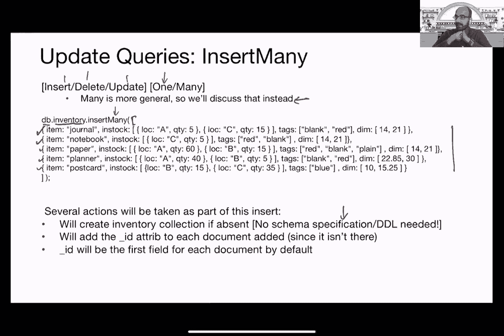
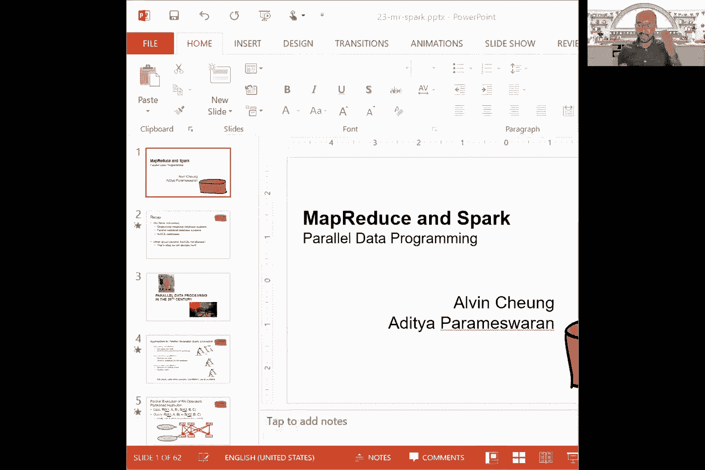
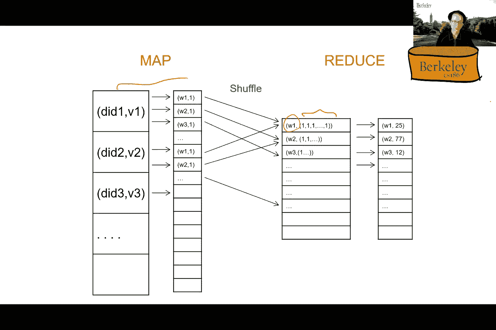
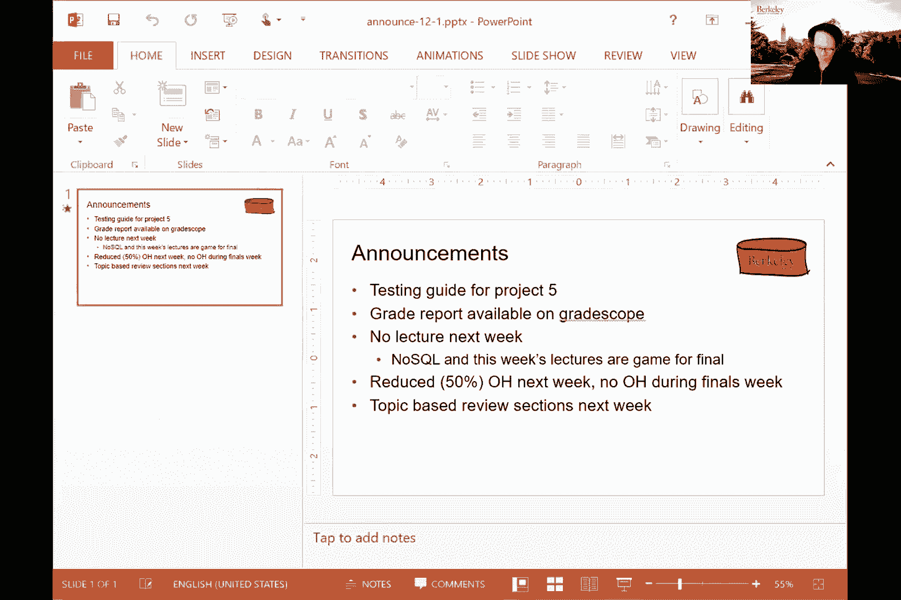
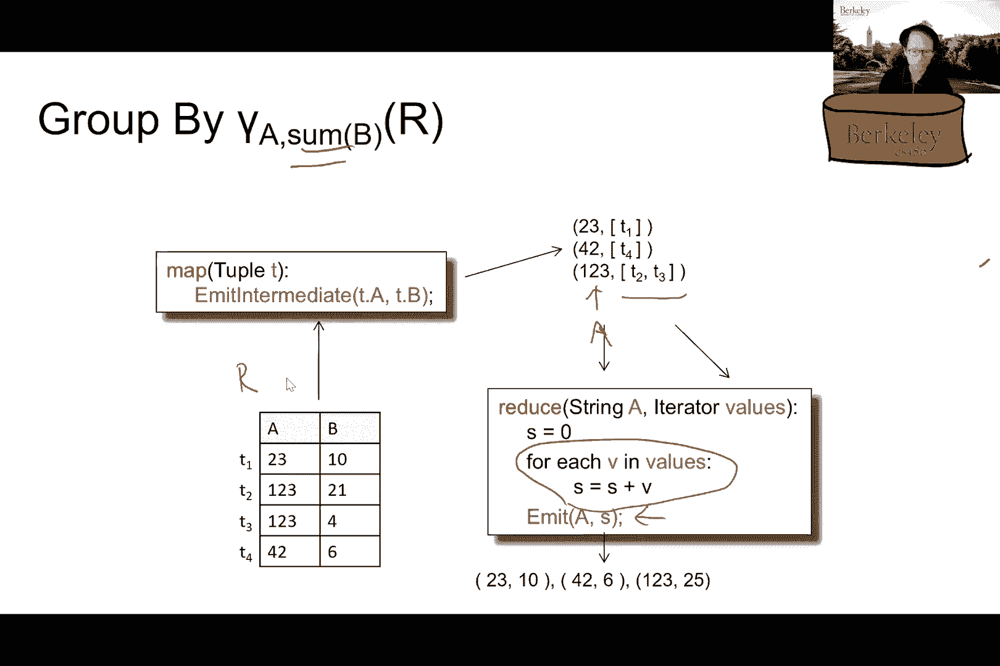

# 课程26：MapReduce与Spark 🚀

在本节课中，我们将学习NoSQL数据库MongoDB的更新操作，并深入探讨分布式数据处理框架MapReduce的核心概念、工作原理及其与关系数据库的对比。

---

## 概述

上一节我们介绍了MongoDB的基本查询操作。本节中，我们来看看MongoDB的更新操作，并转向一个全新的主题：大规模分布式数据处理框架MapReduce。我们将学习MapReduce的编程模型、执行流程，并了解它如何用于处理海量数据。

---

## MongoDB更新操作

在MongoDB中，更新数据库的方法包括插入、删除或更新文档。这些操作有“一个”或“多个”的后缀变体。我们将重点讨论插入多个、删除多个和更新多个。

### 插入多个文档

以下是插入多个文档的方法。`insertMany` 操作接受一个文档数组。

```javascript
db.collectionName.insertMany([
    { item: "journal", qty: 25 },
    { item: "notebook", qty: 50 }
])
```

执行此操作时，系统会采取几个步骤：
1.  如果集合不存在，则创建它。无需单独的模式定义语句。
2.  为每个文档自动添加一个 `_id` 属性作为主键（如果文档本身未提供）。
3.  默认情况下，`_id` 是文档的第一个字段。

### 更新多个文档

`updateMany` 操作类似于SQL中的UPDATE语句。它需要一个条件（谓词）来匹配文档，以及一个修改语句来指定更改内容。

```javascript
db.inventory.updateMany(
    { "dim.0": { $lt: 15 } }, // 条件：数组dim的第一个元素小于15
    {
        $set: { "dim.0": 15, status: "Invalid width" } // 修改：将dim[0]设为15，并添加status字段
    }
)
```






在这个例子中，所有 `dim` 数组第一个元素小于15的文档都会被更新：该元素被设置为15，并添加一个新的 `status` 字段。

除了直接设置值，还可以对数值数据进行运算，例如递增：

```javascript
db.inventory.updateMany(
    { "dim.0": { $lt: 15 } },
    {
        $inc: { "dim.0": 5 }, // 将dim[0]增加5
        $set: { status: "Invalid width" }
    }
)
```

这与SQL的类比非常直接：`UPDATE table SET ... WHERE ...`。

---

## MongoDB架构与查询优化

MongoDB是一个分布式NoSQL数据库。集合（包含JSON文档）会被**分片**（Sharding），即基于特定字段进行分区，这个过程是自动的。每个分区会被**复制**以实现容错。复制通常是异步的，这提供了**最终一致性**。

在查询优化方面，MongoDB主要使用启发式方法：
1.  **索引利用**：如果管道早期有 `$match` 阶段且字段有索引，会尝试使用索引。
2.  **谓词合并**：如果管道中有多个连续的 `$match` 阶段，系统会尝试合并它们的谓词。
3.  **谓词下推**：尝试将 `$match` 阶段尽可能早地推送到管道靠近数据源的位置，类似于关系数据库中的选择下推。

然而，MongoDB没有基于成本的优化器，也不进行跨操作符的流水线执行。每个聚合阶段都是独立评估，中间结果会被物化。

---

## 从关系数据库到MapReduce

之前我们讨论了单节点和并行关系数据库系统。NoSQL数据库是另一种反应。现在，我们关注在分布式环境中简化编程的模型——MapReduce。

关系查询处理有三种并行模式：
1.  **查询间并行**：在不同机器上并发运行不同的查询。
2.  **操作符间并行**：将单个查询树的不同操作符分布到多台机器上运行。
3.  **操作符内并行**：在多台机器上运行同一个操作符（例如，并行哈希连接）。这是我们讨论的重点。

MapReduce的诞生源于谷歌等公司需要处理海量非关系型数据（如网页）。它提供了一个高级编程模型，让用户无需使用SQL也能轻松编写并行处理管道。

---

## MapReduce 核心概念

MapReduce程序运行在分布式文件系统（如HDFS）之上，数据被存储为大文件并分割成块（如64MB）。

一个MapReduce作业必须由用户定义的 **Map** 和 **Reduce** 两个函数组成。
*   **输入和输出** 都是键值对（Key-Value Pairs）。
*   **Map阶段**：并行处理输入数据块，每个Map任务读入键值对，输出中间键值对。
*   **Shuffle阶段**：系统自动将Map输出的中间结果中，键相同的所有值聚集到一起。
*   **Reduce阶段**：每个Reduce任务接收一个键及其对应的值集合，进行处理后输出最终结果。

### 示例：词频统计

这是一个经典的MapReduce示例，用于统计大量文档中每个单词的出现次数。

**Map函数**：输入是（文档ID, 文档内容）。它遍历文档中的每个单词，为每个单词输出一个中间键值对 `(word, 1)`。

```python
# 伪代码
def map(doc_id, content):
    for word in content.split():
        emit(word, 1)
```

**Reduce函数**：输入是 `(word, [1, 1, 1, ...])`。它对所有值（都是1）进行求和，输出该单词的总数 `(word, count)`。

```python
# 伪代码
def reduce(word, list_of_counts):
    total = 0
    for count in list_of_counts:
        total += count
    emit(word, total)
```

**执行流程**：
1.  多个Map任务并行处理不同文档，生成 `(word, 1)` 对。
2.  Shuffle阶段将所有相同的 `word` 对应的 `1` 聚集到一起。
3.  多个Reduce任务并行处理不同的 `word`，分别求和并输出最终词频。





---

## MapReduce 内部机制与容错

在Hadoop等实现中，有一个**主节点**（Master）负责协调。它将输入数据分片，并调度**工作节点**（Worker）执行Map和Reduce任务。


**容错性**：
*   Map任务和Reduce任务会将中间输出写入磁盘。
*   如果一个Worker节点失败，Master会将该节点上的任务重新调度到其他健康节点上执行。由于中间结果已持久化，新节点可以读取这些结果继续计算，无需从头开始。


**应对慢节点（Straggler）**：
*   如果某个任务执行速度远慢于其他同类任务，系统会启动一个相同的**备份任务**。
*   原始任务和备份任务同时运行，哪个先完成就采用哪个的结果，并终止另一个。这被称为“推测执行”。

---

## 在MapReduce中实现关系操作

我们可以用MapReduce模型来实现关系代数操作，这有助于理解两者的联系。

### 选择（Selection）

假设要根据属性 `a` 的值进行选择。

**Map函数**：检查每个元组 `t`，如果满足谓词（如 `t.a == 123`），则输出 `(t.a, t)`。
**Reduce函数**：实际上不需要做任何计算，只需将Map输出的值原样传递出去即可。在早期MapReduce中，Reduce函数不能省略，因此可以设计一个“空”Reduce。

### 分组聚合（Group By with Aggregation）

假设要按属性 `a` 分组，并计算属性 `b` 的和。

**Map函数**：对于每个输入元组 `t`，输出 `(t.a, t.b)`。这里键是分组属性 `a`，值是需要聚合的 `b`。
**Reduce函数**：接收 `(a, [b1, b2, ...])`，对列表中的所有 `b` 值求和，然后输出 `(a, sum)`。

可以看到，MapReduce的Shuffle阶段天然完成了**按键分组**的工作，Reduce阶段则执行具体的聚合逻辑。

---

## 总结

本节课我们一起学习了以下内容：
1.  **MongoDB的更新操作**：包括 `insertMany` 和 `updateMany`，以及其背后的简单原理。
2.  **MongoDB的架构**：包括分片、复制和基于启发式的查询优化。
3.  **MapReduce的动机**：作为处理海量非关系型数据的编程模型，它将控制权交还给程序员。
4.  **MapReduce核心模型**：基于Map和Reduce两个函数，通过Shuffle阶段连接，非常适合批处理任务。
5.  **MapReduce的执行与容错**：通过主节点协调、中间结果落盘和推测执行来实现可靠且高效的计算。
6.  **MapReduce与关系代数的关系**：可以通过MapReduce来实现选择、分组聚合等关系操作，二者在功能上可以相互表达。



MapReduce的核心思想在于通过一个简单的编程接口，隐藏了分布式计算的复杂性，使得大规模数据处理变得更容易。在下一节课中，我们将了解MapReduce的演进——Spark框架。