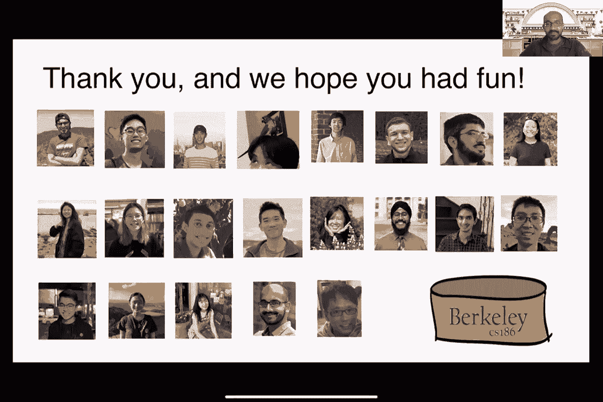

# P27：讲座 27 OLAP，列存储 - ___主___ - BV1cL411t7Fz

我刚刚开始了。好的，酷。好的，酷。好，搞定。

好的。大家好，这是最后一讲，186 本学期的最后一讲。今天的目标是基本上完成我们在上次讲座中关于 MapReduce 和 Spark 的讨论。然后 Aditya 也会讲解所有这些内容。抱歉，时间到了。好的，好的，那么就这样。

简要回顾一下，对吧？所以，上次讲座中，我们讨论了人们是如何使用 MapReduce 编写并行数据处理程序的，对吧？所以，在我们发现这个叫做并行关系数据库的奇妙事物之后。再说一次。这就像 MapReduce 应该擅长的那种程序。所以，基本上。

读取大量数据的事情，你可以将它们组织成一个映射阶段和一个归约阶段，对吧？然后，这些基本上是 Jeff D. 说的，他是 MapReduce 范式的发明者之一。我们在上次讲座中讨论的例子是计算的经典例子。

来自文档中的单词。所以，这里的目标基本上是能够同时计算多个文档中的单词频率。然后，想法是基本上编写一个映射函数，该函数接收文档，并遍历文档中的所有单词，然后发出这个称为中间键值的内容。

你知道，那个单词，然后那个对应的单词。基本上。这意味着我们在文档中看到过那个单词一次。然后在归约阶段，我们会将每个单词的单词计数加总。因为 MapReduce 会执行这个中间洗牌步骤。

它会将所有相同值的中间键收集在一起。所以，这就是为什么我们会在右侧看到这个迭代器。然后，在这个归约程序的主体中，我们只会遍历它们，然后加总所有的 1，然后将其作为最终结果发出，就像你在右侧看到的那样。

然后我们也讨论了一些实现细节，对吧？特别是我们谈到的这个 Strackland 的概念，其中有一个任务因为某种原因。花了很长时间才完成。所以，MapReduce 范式，它在系统中的工作方式是，它会预先启动这个任务的备份执行，在多个。

如果工人处于空闲状态。然后谁先完成，正确的，那么我们就完成了，基本上只是通过杀掉其他两个线程，其他两个工作线程来结束。这只在所有这些工作可以完全独立且并发执行时才有效。对吗？所以，这就是我们的救命稻草。如果这些工作之间有相互依赖，那么我们就不能。

这不是那么容易做到，对吧？所以，这就是为什么像你知道的，map reduce 的一个惊人特性是能够执行这种备份操作。所以，在上节课的最后，我们停止了实现我们喜爱的关系操作符的过程，使用的是 map reduce。我们当时停在了实现 group by 的这个例子，对吧？所以，这里再次是这个例子。

例如，我们有一个包含两个属性 A 和 B 的关系 R，我们试图按 A 分组。然后对所有的 B 值求和。所以，在程序的映射阶段，我们只会发出每个输入元组的 A 和 B 值。然后在归约阶段，我们将收集所有具有相同 A 值的元组，对吧，因为我们有。

将其作为中间键发出。然后对于这些值，我们基本上会对所有的数字进行求和，然后将其作为最终的计数值发出。所以，这基本上是一个进阶步骤，对吧，来自我们之前的文档频率计数程序。只是，在这种情况下，我们正在执行 group by 操作，对吧，这是一个关系操作。

举个例子，我们将这个 A，B 的关系作为 R 输入，之后我们将发出这些不同的组作为中间值，这些组对应于屏幕上看到的元组。然后，像你知道的，之后我们会将其传入归约函数，最后我们会得到各组的值。

到目前为止有任何问题吗？到现在为止，这基本上是在复习，对吧，来自上节课。那么现在，当然，令人感兴趣的事情是，我知道，我们一直在谈论这一整个学期，对吧，就是联接的概念。那么，我们能不能使用 map reducers 实现我们的哈希联接算法和广播联接算法呢？所以。

这是一个实现 petition 的哈希联接的例子。所以，我们有两个关系，R 和 S，我们试图在 B 和 C 属性上进行联接。所以，在映射阶段，我们基本上会处理来自 R 或 S 的元组，对吧。所以，我们将要发出的中间键实际上是 B 或 C 的值。

根据我们来自哪个关系。如果我们持有 R，折叠。那么我们就会发出 B 值，然后如果我们来自，持有 S，则发出 C 属性作为中间键。你应该能猜到为什么这么做，对吧？因为我们基本上是希望将所有具有相同值的 B 和 C 的值组合在一起。

因为这正是联接要求我们做的，对吧？我们试图联接 B 等于 C 的值。所以，通过在 map reducers 中执行洗牌步骤，发生的情况是，如果我们将所有具有相同 B 和 C 值的元组分组，最终我们将不管它们来自哪里，都会将它们分到一起。

不管它们是来自R关系还是S关系。然后在归约函数中，我们基本上会将它们收集起来，在这个循环中。对吧。所以，对于我们得到的每个元组，我们基本上会将它们，嗯，传递到这两个数组中的任意一个，R或S。

然后，在我们处理完所有元组后，我们现在将生成连接输出。你在最后一轮中看到的就是这个输出。所以，例如，如果我们被提供了来自R和S的这两个关系，那么在map阶段发生的事情是我们会发射B或C的值，取决于我们正在处理哪个元组。所以，例如。

这里的第一个元组T1来自R，其B值为10，并且它会单独发射。对吧，因为没有其他元组有相同的B值。与T2相比，T2的B值为21，这也与S关系中的元组T8匹配。所以，这就是为什么在洗牌步骤之后我们会得到这个中间输出。所以，就像之前一样。

我们基本上会将中间的键和对应的元组组传递给归约函数。然后，你可以继续处理程序中的其余逻辑，最终我们会形成我们想要的连接输出S。所以，这挺不错的，对吧，所以你知道，我们基本上依赖于map-reduce。

洗牌功能帮助我们将需要同时出现在同一位置的内容分组。对吧。所以，记得我们之前讨论过的核心算法，基本上就是在做同样的事情。对于连接，我们基本上需要将需要在同一时间看到彼此的元组带到一起。正是洗牌步骤在这里帮助我们做到这一点。

到目前为止有什么问题吗？好吧，广播连接实际上更简单。所以，对于广播连接，正如你记得的，基本上我们会将整个S关系复制到所有的，呃，所有的副本，所有的arc分区中。所以，呃，这就是我们在做的事情。所以，我们再次假设我们通过某种方式从S读取元组，可能是通过网络。

我在这里有点挥手了，对吧，因为你知道，这里的基本思路是要么从文件中读取所有内容，要么从网络套接字或某个地方读取所有内容。这里的假设是我们基本上会将整个，呃，整个表，整个S关系加载到内存中。然后，接下来，我们就可以执行我们最喜欢的连接算法。

不管你选择哪种，对吧。所以，在这种情况下，我们只是根据S的值构建哈希表。然后，我们将找到对应的值，这些值是需要在第二轮连接中从关系中连接的。所以，这部分，像你知道的，基本上是我们的最爱，像我们最喜欢的之一。

连接算法，对吧，就是连接了。嗯，这里唯一的区别是我们只是从网络上读取一切数据，用于S。嗯，这是第一步。然后在这种情况下，比如说，你知道，实际上不需要归约步骤，因为像你知道的，我们已经在这个，嗯，映射函数的结尾处定义了我们想要的内容。

嗯，好吧，Nick，你有问题吗？嗯，我其实不太确定我的问题是什么。所以我就先保留它吧。好的，没问题。嗯，好的，嗯，是的。所以这就是我想说的关于映射（map）审查的内容。正如我们所看到的，它提供了一个非常简单的抽象，因为一切要么是映射，要么是归约（reduce）。

所以与关系代数不同，对吧，一切都必须适应这些关系代数操作符，映射归约只要我们能够将计算表达为映射和归约，那么我们的工作就差不多完成了，对吧？所以映射归约的系统就是要解决如何在多个工作节点之间进行并行化的难题。它还会根据需要帮助我们进行数据洗牌。还会帮助我们。

处理，嗯，重新启动任务的情况，假如发生了恢复情况。对吧。再一次，恢复的方式是我们总是会把中间结果写下来，对吧？

由映射器生成并写入磁盘。但当然，这里也有一个反面问题，对吧？

因为这可能会很慢，因为我们需要等待所有的中间结果被序列化到磁盘，然后才能继续执行归约阶段。好的。接下来我想结束这一段，算是对我们研究小组所做项目的无耻宣传。我们其实尝试编写了一个编译器，能够处理。

原始的作业程序然后将它们转化为映射审查。如果你感兴趣的话，你可以去尝试一下，玩玩看。好的。就像我之前说的，对吧？映射审查的一个问题就是我们需要等待所有这些中间结果被序列化到磁盘，并且还强迫我们将所有计算都映射为映射和归约。

对吧？有点双关的意思。好的，这就是一个问题。那么接下来会发生什么呢？你知道，在我们并行旅程的下一个阶段，对吧，NoSQL数据库就是人们试图解决这个问题。所以他们想写更复杂的查询，但他们不希望将所有东西都表达为映射审查。因为那样某种程度上，嗯，有限制。

对吧？正如我们之前看到的，我们有时确实需要用一种冗余的归约阶段来修补，嗯？没有目的，仅仅是因为映射审查的一切都必须是映射审查。所以即使实际上没有归约，我们仍然必须做某种形式的，嗯，不是吗？

减少，减少函数，某种程度上是浪费的。然后还有另外一个方面，对吧？需要将所有中间数据写入磁盘，这也会导致系统变慢。那么，如果我们实际上给程序员控制权，让他们决定何时将结果序列化到磁盘上，会怎样呢？

好处是更多的灵活性，对吧？所以我们可以，不需要等待所有的中间数据写入磁盘。但显然，缺点是，如果我们忘记写数据到磁盘，可能就无法恢复数据，对吧？

也就是我们需要始终从头开始。所以，这就是权衡所在。所以这就是 spot 发挥作用的地方。事实证明，这是一个实际上在伯克利的 RISE 实验室开发的系统。它基本上是基于我在之前讲座中提到的 HDFS 工作的，对吧？

所以，这是 Hadoop 文件系统。好的。Spot 和 map 评审之间的区别在于它允许我们不把一切都限制在唯一的 map 或 reduce 上。它提供了一堆我们可以调用的操作符，执行类似于你知道的不同操作。例如，我们可以遍历一个数据结构。

我们可以遍历一个导弹组件。我们可以，我们甚至可以过滤掉一些东西，对吧？

通过调用一个 spot 操作符。它将所有的中间数据存储在主内存中，然后由我们决定何时将数据序列化到磁盘。所以这里的说法更接近于关系代数。但它仍然保持灵活性，我们可以实现任何我们想做的事情。所以这基本上就是 Spark 的一个卖点。它是如何工作的呢？其实它是...

它有一堆不同的接口，供我们编写程序。所以，嗯，对于那些可能不熟悉 Scala 的人，Scala 基本上就是 Java 加上函数式扩展。不过对于这节课来说，由于你们已经熟悉 Java，我们将使用 Java 接口来展示 Spark 程序。它甚至有 SQL 接口，我们不知道。好的，那么开始吧。

通过讨论数据模型的练习，我们可以了解，Spark 到底是基于什么来进行计算的？所以，在 MapReduce 的情况下，我提到数据模型基本上是文件，任意文件，对吧？只要有一个键值对，我们就可以处理。在 Spark 中，数据模型实际上是被称为“弹性分布式数据集”的东西。

它是一个分布式不可变关系。加上这个 lineage，这就是 RDD 的作用。不可变基本上意味着一旦创建，就不能修改其中的任何内容。如果我们想修改这些内容，我们通常需要创建一个新的 RDD。你可能会觉得这很浪费，但当然，系统会优化，确保我们不需要将其物化。

从头开始整个 RDD，对吧？我们一会儿就会看到。什么是 lineage？

这里的“继承关系”指的是从一开始如何计算 RDD 的历史。它有点像一个职业规划，对吧？对于那些，嗯，你知道，对于我们这些已经熟悉关系代数接口的人来说。所以 Spark 将这些 RDD 存储为中间结果，这与 MapReduce 不同，在 MapReduce 中，所有内容都是键值对。关于继承关系的一个好处是，在发生故障时。

如果 Spark 服务器崩溃了，即使所有存储在内存中的数据丢失了，我们也可以重建或重放整个过程，因为我们知道每个已创建的 RDD 的继承关系。所以这就是 Spark 的一个优点，对吧？它基本上记得自己是如何生成的，如何衍生出来的。因此，当我们尝试恢复时，它非常容易，对吧？

所以 MapReduce 在某种程度上也有这种特性，因为，比如说，你知道，我们把所有数据序列化到磁盘上，所以你可以说，在我们把所有数据序列化到磁盘后，我们其实不需要知道映射阶段是如何产生的，对吧？

或者如果在映射阶段发生了崩溃，嗯，我们还是在执行映射阶段。我们只需重新启动所有的映射操作，对吧？这样就可以了。那么，如何在 Spark 中编写程序呢？

所以一个 Spark 程序由他们所说的“转换”和“行动”组成。他们区分这两者是因为，对于行动，他们称之为操作符，这些操作符在调用时会立即执行。所以这意味着如果我们调用某个操作，比如执行一个连接操作，那么它会立即执行。

立即执行连接操作，而对于他们所称的“转换”或“惰性求值”的操作，意味着我们实际上还没有执行操作。我们只是构建了这个继承关系，对吧？当某个操作最终需要被评估时，我们才会执行它。你可能会想，惰性执行在这个世界中的好处是什么？

你已经部分了解了答案，对吧？其实这主要涉及到恢复机制。因为我们只是将整个操作树存储在内存中，也保存在 Spark 日志中，所以万一出现崩溃，我们可以从这个继承关系或者这个操作树中读取需要执行的操作，然后我们就可以执行它们。

一个接一个地进行恢复。所以，在我们进入第一个 Spark 程序的详细内容之前，让我们先谈谈我之前提到的这个 RDD 接口。正如我所说，这些 RDD 是不可变的，它们也是类型安全的，对吧？这意味着它们必须具有特定的类型。它可以是你在 Java 中定义的任何对象类型，对吧？所以如果你想的话。

在 RDD 中存储键值对是可以的。所以你可以定义自己的键值对类，然后把它放入一个 RDD 中。它不应该是嵌套的，意思是我们不能在一个 RDD 内部嵌套另一个 RDD。这在原始的 Spark RDD 接口中是不允许的。但是一个序列是可以嵌套的。

然而，这只是局部的，仅限于单个节点，这意味着它不会被分配。因此，RDD就像，嗯，你知道的，Spark会在内部尝试将其拆分到多个服务器上，如果我们有多个服务器的话，与一个序列不同。在这种情况下，它只能存在于单个服务器上。这里有一个例子。假设我们想要从日志文件中写入，对吧？我们想要读取。

在一个巨大的日志文件中，然后检索所有以错误开头并且还包含字符串SQLite的行，对吧？也许我们想要调试。例如，这里是整个Spark程序来做这件事。第一行其实不需要太在意，基本上就是像你知道的那样，创建一个Spark会话，这样我们就可以创建所有这些不同的操作符。

操作符树或我们想执行的操作。然后，后续的几行基本上从构建不同的RDDs开始。第二行这里叫做lines，基本上就是从一个单一的文本文件中读取，然后将该文本文件的每一行内容当作新创建的RDD的内容。然后你可以看到这里的过滤器，对吧？我们正在。

调用。所以在这种情况下，filter是我们要在我们创建的lines RDD上执行的操作。然后，过滤操作的任务，如你所想，是执行选择。所以这里我们提供了一个lambda函数，对吧？它表示，对于每一行被读入这个过滤函数中，我们只保留那些以错误开头的行。

所以L这里只是一个字符串，然后startsWith是一个Java函数，对吧？所以我们只是执行过滤操作。然后我们在这里创建了一个新的RDD，叫做errors。然后这个errors RDD将传递给另一个过滤操作，它会检查是否包含字符串SQLite。就这样。所以这里的所有不同的RDD都是字符串类型的，尽管正如我所说。

对吧？它可以是任何东西。我的意思是，只要我们能定义它。为什么这些过滤器和收集的部分被高亮显示为蓝色和绿色？抱歉，还有红色？因为这里的过滤操作是转换操作。所以当我们调用它们时，当我们写下那行Java代码，甚至是Python代码时，实际上它们并没有被执行。只有当我们实际调用所有操作时，它们才会被执行。

只有当我们调用这些操作符之一时，像是collect操作符，才会触发。基本上，当那行代码被执行时，发生的事情是我们查看我们拥有的整个操作符树，然后我们一个接一个地执行它们。所以对于那些可能有点懒的人，我们实际上不需要写出这些。

如果我们不喜欢中间的RDD，这里是完全相同的程序，只不过我们已经将整个程序合并成了一行，使用了链式调用。从高层次看，它基本上还是MapReduce，对吧？我的意思是，没什么太大区别，只不过我们现在有了这些过滤器和收集函数可以调用，而不是直接。

一切都被映射和归约，对吧？这就是Spark的一个显著特点。它们基本上提供了这些不同的操作，我们可以在这些RVD上调用，从而避免了需要搞清楚如何编写map和reduce的问题。当然，它们也有一个map操作符，就像在MapReduce中一样。

所以到目前为止，关于如何编写这些MapSpark程序，你明白了吗？或者这给你提供了一些编写Spark程序的思路？

这给了我真正的灵活性，对吧？我们可以调用这些已经提供的现有函数，比如过滤器，例如，你知道的，我们已经知道它是如何工作的，如何工作的。或者如果我们想要更通用的方式，我们可以直接调用map，对吧？在这种情况下，我们只需传入任何任意的函数，该函数会应用到RDP中的每一行或每一个元素上。

所以我们基本上通过这种方式重新获得了MapReduce的功能。那么持久化呢？

正如我之前所说，Spark并不会总是将所有内容物化到磁盘上。这意味着，如果这是我们写的整个程序，那么如果任何一个服务器在整个任务完成之前失败，那么我们必须从头开始重新执行整个任务。例如，这基本上是我们所看到的情况，对吧？我们从这里的一堆文件开始。

我们将其视为一个单一的RDP。然后我们执行一系列操作，最终得到了另一个RDP。如果这里的任何部分崩溃，那么我们基本上别无选择，只能从头开始。正如我之前所说，Spark给程序员提供了选择的能力，决定何时实际序列化这些内容。如果他们愿意的话。实现这个功能的方式就是调用其中一个。

这些函数，例如，持久化。正如你所猜测的，没错。

这正是你知道的，来自MapReduce世界中写入磁盘的对应操作。它们基本上就是在那时让Spark执行整个计算过程，直到那一点，然后将结果序列化到磁盘上。在这种情况下，RDP会出错并写入磁盘。因此，到了那时，我们就知道这是某些内容已经被写入磁盘了。这样一来，如果发生故障，例如在最后一个阶段。

如果到那时发生故障，我们只需要从错误的RDP中恢复，而不是从头开始。再次强调，灵活性是给程序员的，最终由他们决定何时使用它，如果有的话，对吧？如果他们决定不使用，那么他们基本上就冒着需要从头开始重启的风险。如果最终他们选择了。

像你知道的，他们把每一行都写入，序列化每一个RDP到磁盘。然后它也会回到map-reduce的世界，对吧？其中每个中间阶段都会写入磁盘以便恢复。好的，所以，像你知道的，我们来通过一个例子运行一下，对吧？比如，像你知道的，这里有一个SQL查询，我们假设我们要使用Spark来重写它。

我们怎么做这个呢？嗯，前两行其实是已经给定的，对吧？所以它们基本上只是把R的整个关系和S的整个关系当作两个不同的RDP来读取。所以注意到，嗯，我已经，你知道，存在某种反转的风险了，然后我已经在写，像是，你知道的，把R和S的整个上下文写入磁盘了，对吧？对的。然后我们就开始持久化了。

一切都会写入磁盘。那么接下来发生什么呢？对吧，就是我们基本上会开始调用过滤操作，因为这就是我们想要做的事情，对吧，针对这两个选择括号。所以我们会填充。我们会将我们自己的过滤函数传递给我们已经讨论过的过滤操作符。

然后我们会创建一个新的RDP作为结果，对吧，那个结果对应于R和S。然后之后，像你知道的，原来Spark已经有了一个连接操作符。我们可以直接正确地调用它。它是如何工作的，基本上就是你预期的那样，基本上就是在两个输入关系之间所有的公共属性上进行连接。

所以它基本上在这种情况下执行了自然连接。那意味着什么呢？就是它将在属性上连接，干净的R和S。然后我们就创建另一个RDP。然后再一次，像你知道的，我强调这些操作符的原因是因为这些蓝色的部分在这种情况下是。

变换。所以在我们实际调用count操作之前，我们只是在内存中创建了操作符树，对吧？所以这些过滤操作符就是存储的地方。然后当我们调用count操作符时，才会实际执行动作。这样说通了吗？所以，持久化是将操作符树序列化到这个上面吗？

是的，所以持久化也会把操作符树写入磁盘。但即便没有那个，对吧？

所以Spark会自动把它写入自己的锁中，因为出于恢复目的。所以即使我们不写任何持久化，我们仍然需要一种方式来记录下所有这些RD以及它们是如何推导出来的。所以Spark会自动有一个操作符树的内部锁。我们怎么知道呢？

它只会连接A。所以这是Spark提供的一个特殊操作，基本上实现了自然连接。如果我们不想做自然连接，Spark中还有其他几种连接方式，你也可以调用。当然，像你知道的，在最底层，对吧？我们也可以使用map和reduce来实现我们自己的算法，对吧？所以实现我们。

那么，持久化那些能够从日志中恢复的转换是否真的必要呢？

这取决于我们希望花多少时间在恢复上。如果我们不介意重新解析那些输入数据，当然，我们可以不持久化任何东西。但如果你的工作涉及到一些巨大的机器学习模型训练，需要两天时间，那就另当别论了。

你可能希望持久化某些中间阶段，以便在恢复时不需要从头开始。这样理解吗？好吧。简单回顾一下，是吧？

因此，你在 Java、Scala 或 Python 中编写的 Spark 程序由懒操作符和急切操作符组成。之所以这么做有意义，是因为它基本上允许 Spark 在需要时进行优化。例如，将多个过滤器合并为一个单一的过滤器操作，对吧？

它还给了人们一个持久化的机会，如果他们愿意的话。如果一切都是急切执行的，那么所有操作都已经执行完毕。所以，你知道，几乎没有机会做优化或序列化。而且它依赖于一种叫做弹性分布式数据集（Resilient Distributed Datasets，RDD）的数据模型。

由程序员定义的特定类型。然后，它们也有不同的版本。你可以选择本地化这些数据集。所以这里只是列出了 Spark 支持的部分转换和操作符。如我所说，它们有不同版本的连接操作，也有不同版本的类似交叉乘积等操作。

以及所有其他不同的操作。所以如果你感兴趣，可以查看它们的接口。这是 Spark 1.0 的情况。所以 Spark 随后发展了，是吧？最初发布后，人们开始编写程序，发现了最初范式的不足。因此，他们开始提出新的东西。那新东西是什么呢？嗯。

所以他们提出了一种叫做数据框（data frame）的概念，这与 RDD 在某种意义上类似。它是不可变的，而且数据分布在多个节点上。不同之处在于，它引入了命名列的概念，这很有趣，因为它有点像关系，你可以通过列名来引用它们。此外，数据框内还引入了行的概念。

因此，与 RDD 不同，数据框由行组成，每行由列构成，你可以通过名称调用它们。这听起来和我们的关系模型非常相似，对吧？

它还提供了一些新的方法，你可以调用。例如，你知道，添加某些内容或投影其中一列。所以我称之为“关系代数加”模式。是的，它支持我们在关系代数中已知的基本操作，操作的是关系。不同之处在于，它能够利用 Spark 的优势。

这意味着它有这种继承关系的方面，它有这种恢复的方面，我们可以控制何时发生这一切。然后它还有这种，你知道的，恢复我们的关系的方面。嗯，对吧？所以它有这种形式良好的元组概念，然后它有我们可以投影的列，依此类推。是的，所以它非常相似。是的。

然后它们的集合是另一个东西，它们提出的。它非常类似于数据框，除了其中的元素必须是类型明确的对象，而不是一行。所以在数据框中，一行就是一行。所以基本上，一行是由Spark提供的一个类，你可以在其中存储任意数量的命名列。

所以它没有像数据集那样的关系要求，所有存储在同一数据集中的行必须符合相同的模式。这对于数据集来说不成立，对吧？抱歉，那个不适用于数据框。但对于数据集来说，你可以灵活地强制每一行都必须遵循相同的模式。所以你可以看到我们正在朝哪个方向发展，嗯？所以我们是。

有点像是逐渐重新发现我们关系世界的样子，嗯，像是我们在这个学期第一或第二次讲座中学到的所有不同的东西，对吧？

所以所有的第一范式的内容，对吧？所以我们现在正在创造它，只是在这个数据集机制中重新创造它，而不是标准的关系模型。但我仍然认为，使用Spark仍然有附加的好处，对吧？就像这种优化方面和恢复方面，嗯？它是灵活的，而不像关系代数那样，一切都是固定的。

只是为了让你们有个概念，嗯？

这些是数据集类提供的API。我认为它们中的许多对我们来说都很熟悉，对吧？比如，它有显式的`order by`，它有显式的`join`，就像在Spark中一样。它甚至有显式的`group by`，还有选择功能。如果这还不够，嗯？它们甚至还有像SQL的API。

你可以直接写SQL，对吧？然后，你知道，这是其中的一部分。所以，你知道。我能告诉你什么，对吧？你知道，可能看起来很熟悉。所以我只是想总结一下整个讨论，提到一篇由微软在这个部门写的论文，标题是《不要破坏它在Joe House主题中的作用》。你知道，看看标题，对吧？它告诉你

比如，这些到底是怎么回事，对吧？所以我不是要贬低这些新兴的开发，嗯？显然人们已经从中学到了经验教训。但正如Aditya在上一讲中提到的，嗯？人们从一开始，就把我们在SQL中学到的一切丢掉，抛弃了关系模型。

远离，逐渐揭开这些功能。也许，最终这些功能，可能并没有那么糟糕，对吧？所以，你知道，我不想称之为每次都要重新发明轮子。我的意思是，Spark团队确实添加了新功能，对吧，除了关系代数和SQL之外，关系数据库的团队已经为我们提供了这些。

所以这就是为什么我有点觉得，这算是进展吧，对吧？

通过结合过去的多条工作线，然后构建一些新的东西。好的，所以总结一下，在这部分课程中，我们基本上回顾了并行数据库、并行关系操作符，然后讲解了如何在这些上面进行事务处理和恢复，对吧？然后我讲到了。

MapReduce在本讲和之前的讲座中，它让人们更容易编写这些并行编程任务，而无需了解连接算法如何工作，或如何优化它们。当然，缺点是，像你知道的那样，MapReduce没有更新或事务支持，这不是它的设计目标，对吧？如果你回顾Jeff Dean在讲座中提到的幻灯片。

就MapReduce程序而言，最后，Spark处于演进的下一个阶段，我们结合了关系系统和MapReduce/NoSQL数据库的最佳特性。关于这个问题有问题吗？好了，我们换到下一个部分。好的。是的，希望你们已经了解了这些不同的。

关于这些不同系统和设计的优缺点的方面。所以下次当你需要设计下一个Spark或其他任何范式时，对吧， 那么你。

你可以记住你从这门课上学到的不同课程。好吧。好了，你能听到我吗？好吧。好了。那么我们来谈谈OLAP。好的。那么，我认为Almond已经介绍了OLAP，并将OLAP与OLDP进行了对比，但我想给你们做一个快速的回顾。好的。所以OLAP代表在线分析处理。

广义上，它也被称为分析。在行业中，有这些术语，如决策支持，或商业智能，也用于指代OLAP。好吧。所以它基本上意味着相同的事情，除了如今商业智能已经涵盖了传统上所称的OLAP以外的更多内容。例如，机器学习和可视化就是广义商业智能的一部分。

智能伞下，但这并不是最初OLAP故事中的设想。那么OLAP是什么？OLAP基本上是数据库的一种专业化，优先考虑读取和汇总大量数据。好的。所以它基本上强调读取而非写入，而且通常涉及非常大量的数据。其目的是为了理解一些趋势或模式。所以。

例如，在OLAP中，一个典型的查询可能是计算美国每个国家的每种类型本田车的总销售量。好的，这就是一个非常典型的OLAP查询，它读取大量的交易数据，并按各种属性进行分组。好的，这就是OLAP的功能。所以它是纯读取查询，没有写入操作。

与之对比的是OLTP，在线事务处理。在线事务处理是读写查询。通常在OLTP中，你会接触到少量的数据。例如，如果你进行了一个销售，卖了一辆新车，你会将其添加到销售表中。这将构成一个小的更新，是一次点更新。好的。

所以OLAP和OLTP查询在风格和行为上有所不同。一个是读取大量数据，另一个则是同时读取和写入小量数据。好的，酷！那么我们来谈谈典型组织如何将OLAP和OLTP系统作为其数据管理架构的一部分。好的，假设我们在谈论美国本田。

它们有许多不同的销售区域。好的，所以他们有南部地区、西南部、东北部、西北部和中西部。好的，每个区域可能都有一个区域性的OLTP数据库。好的，如果你有一个OLTP数据库，这通常也被称为实时或事务型数据库。所以它基本上是在进行事务处理。

这些数据库中的每一个将会对应到许多不同的更新，例如在本例中可能是该地区的汽车销售情况。然后，你可能还会有一个集中式的数据仓库。好的，所以这个集中式数据仓库会收集所有这些地区OLTP数据库中的信息，然后进行整合，然后你可以在这个数据仓库中运行OLAP或分析查询。

所以OLAP通常是在一个单独的数据库中执行的，这个数据库被称为数据仓库，远离OLTP的关键路径。所以通常集中式数据仓库是你进行大规模只读查询的地方，这些查询是在大量事务发生后进行的。

事务型数据库。所以有一个将数据从实时数据库移动到集中式数据仓库的过程。这个过程被称为EPL，代表提取（extract）、转换（transform）、加载（load）。稍后我们会讲到这个。但高层次的信息是，数据仓库通常会定期从这些事务型数据库加载新的数据。例如。

每个地区的销售数据可能会在每天结束时汇总或集中到这个数据仓库中。好的，所以EPL是一个将数据从这些实时数据库移动到数据仓库的过程。EPL代表提取、转换、加载。这三个步骤对应于提取任何你想要分析的有用信息。

作为数据仓库的一部分，转换它，这意味着例如，你可能会规范化它。所以，如果不同地区有不同的约定，你可能会应用一种统一的约定，你可能会以各种方式清理它。你可能会丢弃那些可能不正确的值，或应用其他清理程序。

然后你会把它加载到这个数据仓库里。这就是这个过程发生的情况。非常典型，尽管我给你举的是一个例子，关于本田公司。对于许多大型组织来说，这种情况非常典型，拥有大量的这些实时事务数据库在进行OLTP，并且有一个集中式的数据仓库用于所有。

你旧的数据仓库。因此，一旦你完成了这个EPL过程，你的数据就准备好进行分析了。所以这里有一个挑战，那就是*数据陈旧*的挑战。所以你正在应用的数据是实时的，是事务性的，除非你完成了这个过程，否则它不会进入数据仓库。

EPL过程。而且你突然可以足够频繁地运行这个EPL过程，但仍然存在，*数据陈旧*的问题。通常，组织仍然愿意做出这样的权衡。它们，乐意接受一定程度的*数据陈旧*，因为这些在数据仓库中运行的OLAP查询规模相当庞大。且这些大规模查询可能会延迟事务。你。

当然不想延迟事务，特别是当这些事务影响到你公司的*利润*时。如果例如，你有很多正在进行的销售交易，你不想为了某些大型分析查询而延迟这些销售。所以，对于例如销售事务的处理至关重要，*而不是*例如，某个分析报告。

对于一个经理来说，数据需要及时生成。所以这里的另一个方面是时间尺度的问题，对吧？

所以，这个查询大规模OLAP查询，涉及到你的大部分数据，它不会需要花费非常长的时间。所以如果稍微晚一些再发生是可以的，对吧？所以你等，直到所有数据都加载到这个数据仓库中，才能进行这个操作。坦白说，EPL通常在每晚的午夜执行。它也可以，比这更频繁地发生。

这可能会发生，每小时，每10分钟，对吧？但是这只是一个过程，它并不是实时的，对吧？它不是，至少在典型的组织中，它并不会立即发生。一般来说。是做得更频繁一些更好吗？是的，但这也有成本，对吧？所以你，提取这些实时事务数据库数据的过程是一个会。

这涉及到消耗一些事务数据库的资源。所以你可能会更倾向于等待，直到这些数据库不那么活跃的时间。比如午夜通常是一个不错的选择，因为那时可能没有那么多的汽车交易发生。

但是如果有某些应用场景，你希望数据更加频繁地更新，你当然可以配置成那样。这是一个取舍。好，我们来谈谈模式和数据仓库。看到专业化的出现也很有趣，不仅体现在查询中，还体现在数据模型中。数据仓库。

通常使用所谓的星型或雪花模式。雪花模式只是星型模式的一种推广。所以，基本的思想是你有一个所谓的事实表和许多维度表。事实表包含维度属性和度量属性，而维度表只包含维度属性。好，接下来我们用一个例子来解释这些。

概念清楚了吧？所以我用蓝色来表示度量属性。我有一个事实表和三个维度表。事实表包含销售信息。比如商品ID、商店ID、客户ID、日期编号和价格。这些是度量属性，至少目前是这样。维度表是存储辅助信息的表。所以你可能会存储。

例如，商品信息、商店信息和客户信息都在维度表中。所以，如果你想用一个更加简化的ER图来可视化这个，图中我标出了从事实表到维度表的外键，你会看到外键是从销售事实表到商品信息。

外键连接到商店表，以及客户表。好，接下来我们扩展一下，给你一个雪花模式可能是什么样子的感觉。假设商品信息维度表有一个外键。抱歉，商品信息表有一个外键指向另一个维度表，这个表叫做制造商。所以制造商表有名称和地址。

和所有者相关。所以这里你有一个外键，连接了商品信息表中的制造商名称和制造商表中的制造商名称。这是另一个外键。所以想象一下，如果你有一个中央事实表，然后基本上你会有指向多个维度表的外键关系。

每个表可以有自己指向其他维度表的外键，依此类推。你很快就能想象出它的样子，类似雪花的结构。好的，这基本上就是一种分形结构。在大公司中，这种雪花模式和许多关系通过外键连接起来是非常典型的。

这些关系通过外键连接起来。那么典型的OLAP查询是什么样子的呢？

好的，典型的OLAP查询，至少在开始时，会是类似“按组查询”的形式。所以你基本上会按照某些维度属性进行分组，然后聚合一些度量属性。所以在这个例子中，我是按类别和国家分组的。我在这里做的是对所有相关表进行连接。

而我在做数量统计。对，所以基本上这个查询会返回某个类别、某个国家的销售总数。好吧，不奇怪。其实有一点我稍微忽略了，就是我把日期当作度量属性处理。记住。

度量属性是你可能希望聚合的那些属性。日期实际上不是。不是一个很好的度量属性。你可能会想把日期当作一个隐式维度来处理。我们稍后会看到为什么。把日期作为一个隐式维度是很棒的，因为它允许我们按日期分组并看到趋势。对，如果你按年份查看销售数据，那是一个非常自然的做法。

你可能会发出这样的查询。那就是你要按年份分组并计算销售额的情况。为了做到这一点，我们可能会想要，举个例子，拥有一个隐式的维度表。同样，这个不需要显式存储，但会有一个隐式维度表，你在其中存储与日期相关的信息。所以你可以存储日期。

你可以存储与该日期相关的月份、季度和年份。因此，这是一个隐式的表格，实际上不需要存储，但正如我们将看到的，它会非常方便。所以这里，一个示例查询可能是，如果我想执行与之前相同的查询，但想按月份来做，我可以按类别、国家和月份进行分组。

我再次选择了类别、国家和月份，以及数量。我在做与这个日期信息（也就是这个隐式维度表）自然连接的操作。你可以通过现有的数据库系统，在现有的数据库系统中通过做一些日期处理来达到这个效果。所以如果你使用某个函数，

比如在 Postgres、SQL Server 或 Snowflake 中的日期部分，它允许你提取日期的月份部分。例如，你可以把它重命名为一个不同的属性，这样你就可以按它进行分组。所以你不需要显式地做与这个隐式日期表的自然连接。

你可以直接将它作为查询的一部分。到目前为止有任何问题吗？

也许我到这里停一下，然后休息后再做数据立方体的部分。酷。那么我是不是就只做视频？你想停止录制吗？关于公告之类的？

我不记得了，不是我记得的那样，但。

我想我唯一的回答是 Justin 也在这里。我想我们也会有自己的。

课程评估也是如此。所以除了系里提交的一个反馈，最有可能会在今晚或明天发布吧？很快。是的，所以。是的。就留意相关的公告吧。另外，如果还没宣布的话，我们也已经计划了死周（考试周）期间的一些活动，包括复习课等。

就像我们除了典型的一个大复习课程，考试准备。六个计划在周二进行。最终复习课程安排在周三。我们还计划进行专题复习课程，但下周的办公时间也会缩短一半。所以，留意日历，确保不要错过。我们也会做一些。

我们可能会做一些帖子来整理所有关于死周（dead week）的信息。酷，谢谢Justin。那么，让我们继续吧。接下来谈谈数据立方体。为了介绍数据立方体，我将首先使用一个非规范化的视图。这里我有我的事实表和维度表，所有表都相互连接。

但我将应用于星型或雪花型模式的相同考虑。这只是让讨论变得稍微简单一些。我们将使用一个较为简单的库存关系，其中我有一个度量属性是数量，然后三个维度属性。

物品、颜色和尺寸。好，第一个问题是，假设我想对所有组进行分组。如果我有n个物品名称，m个颜色和k个尺寸，我们认为这个`group by`的结果会有多少行？为了确保你记得你的`group by`，应该是n乘以m再乘以k，对吧？所以这是最坏情况下我们会有多少个组。

对吧？好，那么假设我只对颜色和物品感兴趣，而不关心尺寸。这个是有的。我可能想看到的叫做交叉表的聚合数据，分别对应物品和颜色。而交叉表通常是以这种方式可视化的。所以你可以看到颜色在x轴上，物品在y轴上，形成一对对的组合。

聚合数据以及每一边的总计。好，你可以看到，跟夹克相关的总计，牛仔裤相关的总计，依此类推，这里是蓝色、红色等等相关的总计，最终总计会在所有颜色和物品的右下角。那么，这就是所谓的交叉表。那我如何通过`group by`来得到这个呢？嗯。

你可以通过分组来实现这个，基本上运行四个`group by`查询，对吧？

一个是根据颜色和物品进行分组，另一个是基于物品进行分组，还有一个是基于颜色进行分组，最后一个是总体总和，不进行分组。所以这些是我可能需要发出的四个独立的`group by`查询。

特定的交叉表。因此，事实证明，这只是一个更广泛信息立方体的一个视图。在这个特定的例子中，我有三个不同的属性可能会用来做立方体分组。所以我有我的尺寸、颜色和物品，这些交叉表对应于这个特定立方体中的一个平面。所以我们看到的交叉表，恰恰是这个立方体中的一个平面。

好的，所以再一次，在x轴上，你有颜色，在y轴上，你有项目，在z轴上，你有大小。所以在这个交叉表中，大小对我们来说并不重要。只是颜色和项目。所以这个平面对应于那个交叉表。交叉表是交叉制表（cross tabulation）的缩写，顺便说一下。好的，这就是所谓的数据立方体。

你可以根据任何数量的属性维度来构建数据立方体。所以在这个特定的情况下，我有三个维度。所以这是一个三维立方体。一般来说，你可以在k维度上构建数据立方体。注意数据立方体的“维度”一词，这正是我们称这些为属性的原因。

维度属性。而你有度量属性，你将要对其进行聚合。度量属性实际上就是概念上填充这个数据立方体中每个条目的内容。所以这个数据立方体可以以各种方式进行切割和切分。这些都是我用来描述你在操作时所做的标准术语。

好的，所以切片基本上意味着我将为一个或多个这些维度添加一个条件。这将创建这个立方体的一部分。所以例如，如果我说我只想关注绿色聚合，那么这基本上就是在选择数据立方体的这一部分。对吧。

所以只是通过切割这个数据立方体。切分是指对一个维度进行分区。所以在这个特定的例子中，分区的方式，维度如何被划分是固定的。我只是基于每个维度的不同值进行分区。但我实际上也可以进行更粗略的分区。所以在这个特定的例子中，我有红色、蓝色、绿色、黑色。

我可以有不同颜色的灯光和鸭子作为衣物的例子。对吧。所以这可能是比我现在有的更粗略的绿色分区。所以在各种纳米级别的分区，尤其是在日期维度上会特别有用，因为你可能想按分钟分组，按月、天、年、周分组。

等等。好的，所以分区粒度是用户在为特定OLAP查询设置时需要小心的地方。不同的分区对不同的应用可能有用。所以通常可以通过查看一个层次结构来设置分区粒度，看看你可以如何分区。对吧。所以例如，如果是地理位置。

你的分区层次结构可能看起来像这样。你可能有城市、州和国家。时间则复杂得多，但它可能看起来像这样，一旦我描述它，你会变得直观。你的日期时间可能在最底层，你可能有小时和完整日期，去掉时间，仅保留日期信息。

你可以有周几作为分区粒度，特定的月份。例如，2020年12月，对吧？或者你也可以仅仅有一个月来生成数据，对吧？

所以所有的十二月是一个特定的季度，像是 2021 年第一季度，生成季度。它基本上可以是所有的第一季度，然后是一个年份。对。注意，我这里有一些边缘，它们意味着非常特定的东西，对吧？从这个深度时间开始，我可以提取出完整的日期信息。然后从完整的日期信息开始。

我可以提取出与星期几对应的信息，以及所有特定月份的相关数据，依此类推。好的。那么，如果我已经根据特定季度进行了分组或切片，我可以得到整体季度信息。让我们通过一个例子来演示这一点。假设我已经按月计算了聚合数据，或者我想要计算聚合数据。

按月计算。所以这是我想要到达的地方。假设我已经基于完整日期计算了数据立方体。好的，我已经基于完整日期计算了数据立方体。所以我所有的分组都是基于完整日期计算的。所以它基本上是月份、日期、年份。好的。那么我能否仅基于月份来进行分区？这并不是一个难题。

所以我的做法基本上是查看每个月的所有这些日期。我会把对应的条目加起来，或者以不同的方式进行聚合。这些条目对应于该月所有日期的条目。所以我会为一月、二月等各个月份做一次聚合，然后就能得到对应的月份分组。所以你不需要重新计算。

从头开始计算立方体。你可以使用你已经计算过的基于完整日期粒度的信息。另一方面，如果我已经在年份级别上计算了聚合数据，那我就无法再得到月份数据。所以如果我已经计算了，比如我不知道，按年度计算的这些服装的总销售额，我就不能再得到按月的数据了。

对， 因为我已经以两种课程粒度进行了计算，这样它对于月份粒度会更有用。但是完整的日期就足够了，因为它足够细化，可以让我计算月份、星期几或者年份。它足够细粒度，适用于这些情况。好的， 所以在这个层次结构中，移动的术语也是存在的。所以从一个更细的维度移到一个。

在这个分区层次结构中，从粗粒度到细粒度的过程被称为 roll-up，而从细粒度到粗粒度的过程被称为 drill-down。因此，如果我想从粗粒度移到细粒度，比如我在做 drill-down，那么这将对应于层次结构中的向下移动。

维度，或者从这个立方体中的原点到边缘，或者从边缘到平面，或者从平面到立方体。对，至少在这个三维图像中是这样。那么，如何在 SQL 中得到 Ola 呢？所以有一个功能是 `cube by` 或 `group by cube`。实现这个的方式就是简单地说 `group by cube`，然后列出你想要根据其计算立方体的属性。基本上你会得到。

基本上是所有交叉表中的条目。所以，你将得到对应于这两个属性的组，得到只对应其中一个属性的组，接着是对应都没有的组。在这种情况下，null 将用来表示“全部”。因此，在这种特定的情况下，你可能会得到太多的组合，因为你基本上是在创建多个维度的交叉组合。

打开和关闭每一个属性。因此，如果你在这个分组中列出了很多属性，使用 cube 时，可能会最终得到太多的汇总。那么，如何限制这一点呢？好吧，roll-up 提供了限制的能力。让我们通过一个例子来说明。在这个例子中，我做了两个单独的 roll-up。我有一个按项目进行的 roll-up，还有一个按颜色和尺寸进行的 roll-up。

所以，你可以想象这个其实是两个独立的 roll-up，且它们之间有交叉乘积。你会得到以下组合。因此，你最终得到的结果是：对于第一个 roll-up，你可能会有一个特定的项目或所有项目。对于第二个 roll-up，你有不同的选项。你最终会得到一个特定的颜色和一个特定的尺寸。

或者是某个特定颜色和所有尺寸，或者所有颜色和所有尺寸。它的设置顺序是这样的，即所有的设置顺序。假如你有属性 A、B 和 C，你将会先设置这些，然后比如说，三个都设置，两个设置，而这个设置为“全部”，一个设置，而另外两个设置为“全部”。

所有的都设置为全部。在这种情况下，“全部”用 null 来表示。明白了吗？所以，总的来说，这里的组合是：项目、颜色、尺寸的组合，项目和颜色的组合，项目、颜色和尺寸的组合，颜色组合，及其没有任何组合。好的，总之，在这种情况下，一切都设置为“全部”或相应的 null。

那么，如何选择合适的 cube 或 roll-up 查询呢？首先，为什么这很重要？

所以如果这个查询，这个分析查询是针对非常非常大的数据集执行的，那么正确地执行它是非常重要的。通常这个查询的结果会被物化，然后会被各个其他应用程序使用。所以这个查询可能会在仪表盘、演示文稿、电子表格等中使用。那么如何做这个查询，如何选择正确的查询粒度呢？

cube 或 roll-up 查询是指考虑你可能希望切割或划分数据的所有方式。然后选择一个粒度，允许你重建你想要的所有汇总，而不会导致查询结果过大。你始终可以选择更细的粒度，但问题在于，选择更细粒度时，任何维度都会导致更多的分组值。

因此，你的查询结果可能会变得更大。所以不要超过某个点。这里的权衡是，你希望将其划分得多细致，以及计算所需的时间。因此，结果大小会在属性上呈指数增长。这在大型雪花模式中可能非常糟糕。这通常被称为维度灾难，至少在传统意义上是这样。

在这个整体设置中，为什么我们要学习整体处理呢？好的，我们学习整体处理是因为它是支持分析处理和事后报告生成的数据库的一个特化形式。所以你有正在进行的事务性工作负载。你将它们整合起来，然后在这些大数据集上运行这些大型查询，这些查询能让你对数据提出有趣的问题。

这些数据、趋势和模式。因此，这通常作为对数据仓库的大型操作来完成，典型的经验法则是选择足够粗粒度的查询结果，以便你能构建你可能想要了解的数据的所有信息，即所有必要的交叉步骤。所以数据立方体、层级、切片和切块、roll-up和drill-down的概念在这个整体设置中都是非常重要的。

当你想向某人描述你正在对数据做什么时，这非常有价值。比如说，你在向别人说明这些是你分析的结果，另一个人可能会说：“嘿，你能按这个属性进行钻取吗？”或者，“你能钻取到这个特定方面吗？”这是一种非常便捷的方式来传达你正在做的事情。

好的，至少从SQL的角度来看，关于关键字有一些便利性，比如roll-up关键字和cube关键字，它们允许你高效地计算这些内容。好了，考虑到时间问题，我不能再讲列存储了，列存储的系统基本上允许你更高效地执行roll-up查询。

所以幻灯片已经上传到网站，大家可以随时查看，但我不会再讲这个内容。相反，我将总结一下我们在这节课上学到的内容。到目前为止有任何问题吗？我想我们会把幻灯片放在那里，但这基本上意味着列存储的内容不会出现在考试中。当然，是的。

所以在最高层次上，列存储可以被想象成这样。到目前为止，我们研究的系统是行存储。行存储意味着数据基本上按行的方式排列。记住，你是按页布局的，因此你有第一行、第二行、第三行，依此类推。

列存储基本上去除了数据按行排列的假设。它允许你将表格分成一组一组的列，并将这些列组彼此分开存储。结果证明，将行拆分为列组，对于OLAP场景来说非常有效，尤其是在你试图读取大量数据时。

但是并没有做任何写作，或者至少写得非常少。所以这是列式存储的一句话总结。列式存储中有很多其他技巧也很有趣，比如压缩等，但我不会深入探讨。好了，最后的总结。现在我们只剩下课堂的最后五分钟。

我想总结一下并告诉你们你们学到了什么。好了，第一天的课堂任务是这样的：课程将覆盖如何高效开发系统、管理、维护、处理等等，并使数据变得有意义。我想说的是，我们实际上已经涵盖了这些内容。

现在你知道如何做这些事情，这真的很酷。对吧？所以你基本上掌握了数据系统的基础知识，知道如何管理它们，如何维护它们，如何查询它们，如何进行事务处理等等。你学会了如何使用SQL编程，学会了存储和索引技术。

还有处理和优化，你现在知道了事务，知道了并发和恢复。你知道如何对数据进行建模。对吧？所以你知道如何思考ER图，并为你的数据选择合适的数据模型。我们学习了一些原则。这是我们第一天的幻灯片。我们讨论了数据独立性，讨论了声明式编程。

我们讨论了在空间和时间中的会面。所以基本上是在思考连接算法、并行处理和MapReduce。还有隔离性和一致性，这是从事务的角度看，涉及到ACID保证。我们讨论了数据表示，所有这些都是基本原则，希望这些能帮助你，不仅仅是在构建数据系统时。

也适用于其他上下文。我们讨论了你的数据库系统堆栈。对吧？所以简单的堆栈是从底到上依次是磁盘、缓存、索引、关系运算符，以及优化，然后旁边是并发控制和恢复模块。接着我们通过讨论数据库设计进一步扩展了这个堆栈。

并行查询处理、事务处理、NoSQL和MongoDB、MapReduce、OLAP。遗憾的是你们没有涉及列式存储，但没关系。所以这涵盖了大量内容。我们在这门课里塞了很多内容，而你们成功地完成了所有的内容，真是太棒了。好了，超出了课堂的内容，你们自己也做了很多事情。对吧？所以你们做了SQL相关的工作。

你用SQL进行了操作，比如实现了B+树，实现了连接算法和Cylinder查询优化器。你实现了锁定机制，实现在数组中的操作，也希望你正在使用MongoDB。对吧？所以你自己做了很多事情。并不仅仅是你在课堂上学到的，当然希望你把课堂上学到的东西也应用到实践中。

通常，我喜欢向那些可能想了解更多的人指出，如果我们没有用太多的数据库内容吓到你，且你现在迫不及待想了解更多的话。并且如果是这样的话，有许多有趣的研究生和本科课程可以选择。比如有时候会开设的研究生数据库系统课程，还有一个研讨班课程，Alvin 也参与其中。

我和 Joe、Natasha 以及 Joey 一起 co-run 的课程是 262 进阶系统主题课程，另外还有两门专门的专题课程，比如云编程和机器学习系统。我相信很多人都知道与数据库相关的本科课程，如果不知道，它们就在幻灯片上。如果你对数据系统领域更感兴趣的话，我鼓励你来我们这里做研究。

数据库和数据管理领域，如果你考虑做研究，没问题。数据管理这个研究领域自70年代以来一直在不断发展，那时它刚刚起步。今天它是最令人兴奋的研究领域之一。它的令人激动之处在于，它与计算机科学的许多领域有着紧密的重叠。

这意味着，如果你是做数据库的人，你可以和任何领域的人交流。你可以和系统工程师、架构师、人机交互专家、编程语言专家、机器学习专家、安全专家、理论专家等进行交流。所以这也是与行业和开源社区的重叠之处。很多数据库领域的工作非常显眼，并且与行业和开源社区的人员紧密合作。

数据库社区有两个非常重要的会议，它们分别是 VLEB 和 SIGMOD，以及其他许多相关的会议。此外，还有一个繁荣的研究社区。如果你有兴趣做研究，如果我们还没有把你吓跑的话，欢迎加入。

所以我们是一个名为数据系统与基础的团队的一部分。Alvin、Natasha、Joey、Joe 以及其他许多对数据系统基础（DSF）相关领域感兴趣的人都在其中。如果你有兴趣做研究项目，并且真正想将你在 PLAS 中学到的概念应用到各种实际场景中，欢迎与我们联系。

设置。所以我想简单总结一下很多研究项目的要点，希望能够传达出数据库研究的丰富性和兴奋感。我要做一个非常糟糕的总结，关于 Alvin 的项目。例如，Alvin 正在研究 Light DB。Light DB 是将数据库的理念应用于视频数据。假设你有大量的视频数据。

那么你如何查询这些数据呢？如何在这个背景下重新思考查询优化？他还在研究 Chestnut，它是自动为最终用户应用程序合成合适的数据布局。Natasha 正在研究云中的事务，同时确保这些事务的访问隐私。她正在研究当你的数据以非常高的速度流动时，一致性保证的问题。

快速速率。Joe 有很多项目，其中包括一个地板项目，它试图进行物化，也就是在机器学习管道过程中缓存中间状态，以便事后调试。对吧？再次强调，这是将经典数据库理念应用于完全不同的上下文。Hydro 是另一个项目，他正在尝试使无服务器架构适用。如果你不熟悉无服务器架构的话。

这是云计算领域的新趋势，但他正在尝试将其应用于数据编程。因此，基本上，如果你想处理数据，如何在这个背景下进行？

Joey 正在研究机器学习与数据库的结合，对吧？他有一些项目，包括大规模地服务机器学习模型。你如何以高效的方式做这件事？如何在机器学习的背景下考虑数据库原则？雷神公司是另一个例子。你如何思考在训练大量模型并进行机器学习模型搜索时的查询优化？

从我的角度来看，我列出了几个项目。一个是数据传播，它试图将电子表格和数据库的优点结合到一个系统中。Orpheus 是一个支持版本控制的系统。例如，能够将 Git 的优点带入数据库的上下文中。好了，以上就是我要说的，谢谢大家。

感谢大家在这学期遇到的各种问题中耐心陪伴，并且感谢大家在一个非常特殊的学期里仍然能够学到这些内容。因此，我代表所有核心工作人员和我们大家，感谢那些开着视频的同学，非常感激；还有那些前来提问的同学，我们也非常感激。

对于那些在 Piazza 上互动的同学，我们非常感激。我和 Alvin 也想感谢所有今天在场的核心工作人员，如果你们之后有机会看到课程录制，应该会看到他们在这门课的运行中发挥了不可或缺的作用。感谢他们。是的，祝大家在期末项目和期末考试中好运，保持健康。

没错，谢谢教授们。好的，谢谢 Nick。非常感谢大家。

