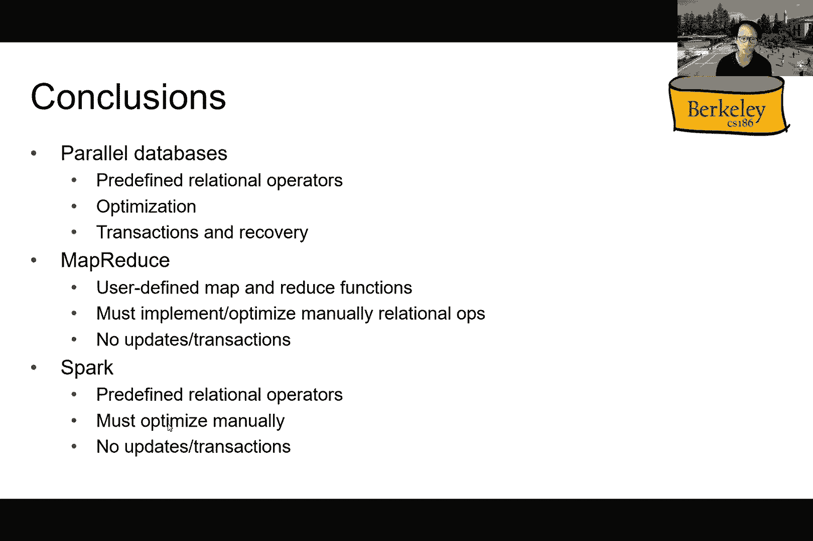
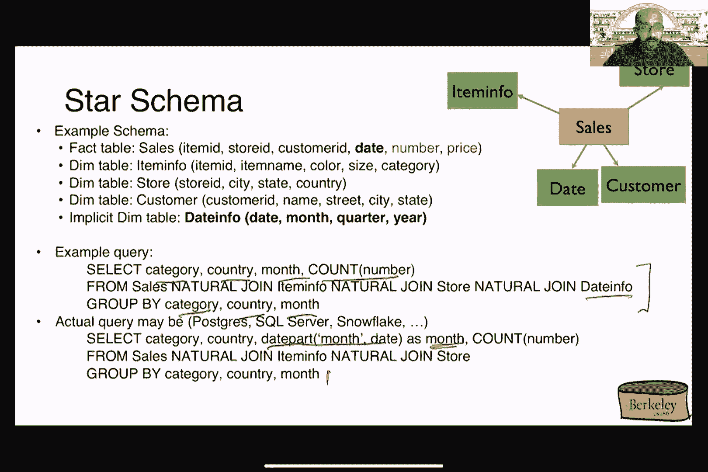

# 课程 P27：OLAP 与列存储 📊

在本节课中，我们将学习在线分析处理（OLAP）的基本概念，并与在线事务处理（OLTP）进行对比。我们还将探讨数据仓库、星型/雪花模式、数据立方体以及列存储的核心思想。课程内容旨在让初学者能够理解这些概念。

***

## 概述

我们将首先回顾 MapReduce 和 Spark 的基本概念，然后深入探讨 OLAP 系统。OLAP 专注于读取和汇总大量数据以发现趋势，这与频繁进行小规模读写的 OLTP 系统形成鲜明对比。我们将学习数据仓库的架构、典型的数据模型（如星型模式），以及用于高效分析查询的数据立方体概念。

***

## 1. MapReduce 与 Spark 回顾

上一节我们介绍了并行数据处理的基础。本节中，我们来看看 MapReduce 和 Spark 这两种流行的并行计算框架。

MapReduce 提供了一个简单的编程模型，将计算分为 **Map（映射）** 和 **Reduce（归约）** 两个阶段。其核心思想是将中间结果写入磁盘以确保容错性。

**示例：单词计数**
```python
# Map 函数
def map(doc):
    for word in doc.split():
        emit(word, 1)

# Reduce 函数
def reduce(word, counts):
    total = sum(counts)
    emit(word, total)
```

Spark 是 MapReduce 的演进，它引入了弹性分布式数据集（RDD）的概念。RDD 是一个不可变的分布式数据集合，Spark 通过记录其“血统”（Lineage）来实现容错，并允许程序员控制数据的持久化。

**示例：Spark 过滤日志**
```scala
val lines = spark.read.textFile("log.txt")
val errors = lines.filter(_.startsWith("ERROR"))
val sqliteErrors = errors.filter(_.contains("SQLite"))
sqliteErrors.collect()
```

Spark 的操作分为 **转换（Transformations，惰性执行）** 和 **行动（Actions，立即执行）**，这为优化和恢复提供了灵活性。

***

## 2. OLAP 与 OLTP 对比

理解了并行计算框架后，我们转向数据库的不同工作负载。本节我们将区分 OLAP 和 OLTP。

*   **OLTP（在线事务处理）**：处理大量的、并发的、短小的读写操作（如银行交易、订单录入）。特点是**高吞吐、低延迟、强一致性**，通常涉及少量数据。
*   **OLAP（在线分析处理）**：处理复杂的、只读的查询，用于数据分析、报告和决策支持（如销售趋势分析）。特点是**读取大量数据、进行聚合和分组**，对实时性要求较低。

典型的组织架构会分离这两种负载：多个 OLTP 数据库处理实时业务，其数据通过 **ETL（提取、转换、加载）** 过程定期同步到一个集中的 **数据仓库** 中，供 OLAP 查询使用。这导致了“数据陈旧性”的权衡，但保证了事务性能。

***

## 3. 数据仓库与星型/雪花模式



数据仓库有其专门的数据模型。以下是其核心组件：

**事实表（Fact Table）**：存储业务过程度量（事实）的中心表，包含大量的数值型数据（如销售额、数量）。
**维度表（Dimension Table）**：存储描述性属性（维度），为事实提供上下文（如产品、商店、客户、时间）。

**星型模式（Star Schema）**：由一个事实表和多个直接连接到它的维度表组成，形似星星。
**雪花模式（Snowflake Schema）**：是星型模式的规范化形式，维度表本身可以进一步连接到其他维度表，形似雪花。

**示例星型模式**
*   事实表：`Sales(Fact)` - `product_id`, `store_id`, `customer_id`, `date_id`, `quantity`, `price`
*   维度表：`Product(Dim)`, `Store(Dim)`, `Customer(Dim)`, `Date(Dim)`

典型的 OLAP 查询涉及对事实表和维度表进行连接，然后按维度属性分组并聚合度量值。

**示例 OLAP 查询**
```sql
SELECT p.category, s.country, SUM(f.quantity)
FROM Sales f
JOIN Product p ON f.product_id = p.id
JOIN Store s ON f.store_id = s.id
GROUP BY p.category, s.country;
```

***




## 4. 数据立方体（Data Cube）

为了支持多维度分析，我们引入数据立方体的概念。数据立方体是一种多维数据模型，允许从不同角度和粒度查看聚合数据。

给定维度（如产品、地区、时间）和度量（如销售额），数据立方体预先计算了所有可能的维度组合的聚合结果。

**核心操作**：
*   **上卷（Roll-up）**：沿维度层次结构向上聚合，例如从“日”汇总到“月”。
*   **下钻（Drill-down）**：沿维度层次结构向下查看更详细的数据，例如从“年”下钻到“季度”。
*   **切片（Slice）**：固定一个维度的值，例如只看“2023年”的数据。
*   **切块（Dice）**：选择多个维度的值范围，例如看“2023年北美地区”的数据。

SQL 提供了 `GROUP BY CUBE` 和 `GROUP BY ROLLUP` 等扩展来支持数据立方体查询。

**示例：使用 ROLLUP**
```sql
SELECT product, color, size, SUM(quantity)
FROM inventory
GROUP BY ROLLUP(product, (color, size));
```
此查询会生成不同粒度级别的汇总：`(产品, 颜色, 尺寸)`、`(产品, 颜色)`、`(产品)` 以及总计。

***

## 5. 列式存储简介

最后，我们简要介绍一种优化 OLAP 工作负载的存储格式。传统的数据库使用 **行式存储**，将一行的所有列值连续存储。这对于 OLTP 的点查询很高效。

**列式存储** 则将每一列的数据分别存储在一起。这对于 OLAP 查询有巨大优势：
1.  **高压缩率**：同一列的数据类型相同，更容易压缩。
2.  **减少 I/O**：查询通常只涉及少数列，列存只需读取相关列的数据。
3.  **利于向量化处理**：CPU 可以高效地对连续存储的列数据进行批处理操作。

公式：对于分析查询 `SELECT SUM(column_a) FROM table WHERE column_b > 100`，列存只需读取 `column_b`（用于过滤）和 `column_a`（用于聚合）的数据块，而无需读取整行。

***

## 总结

本节课中我们一起学习了：
1.  **MapReduce 与 Spark**：回顾了并行计算模型，Spark 通过 RDD 和惰性求值提供了更灵活、高效的框架。
2.  **OLAP vs OLTP**：理解了事务处理与分析处理在目标、查询特性和系统架构上的根本区别。
3.  **数据仓库建模**：掌握了用于分析的数据仓库典型模型——星型模式和雪花模式，以及事实表与维度表的概念。
4.  **数据立方体**：学习了用于多维分析的数据立方体模型及其核心操作（上卷、下钻、切片、切块）。
5.  **列式存储**：了解了为何列式存储特别适合 OLAP 场景，它能通过减少 I/O 和利用压缩来大幅提升分析查询性能。


这些概念构成了现代大数据分析系统的基础。