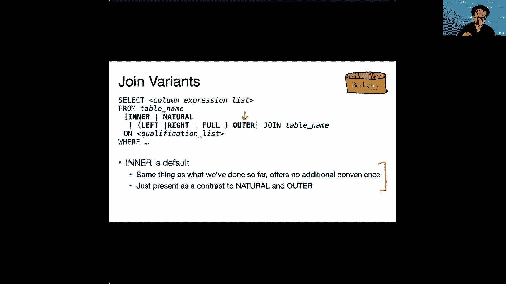
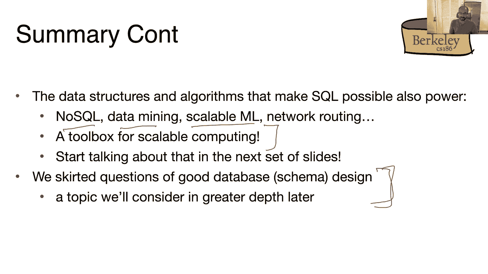
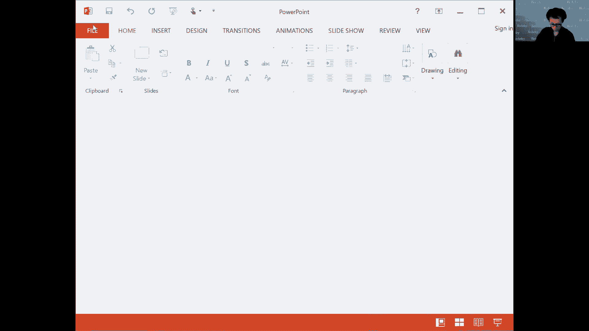
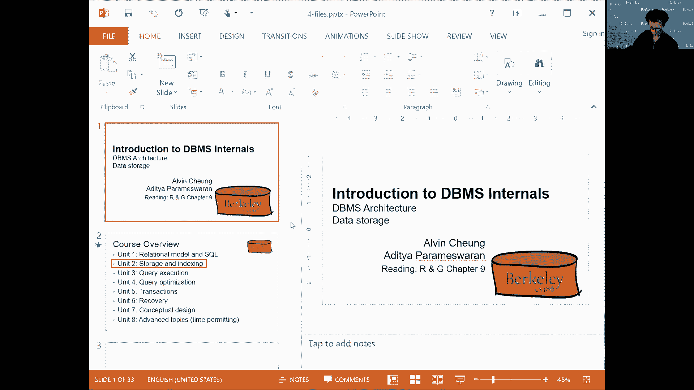

# P3：Lecture 3 SQL II (cont) + Disks, Buffers, Files I - ___main___ - BV1cL411t7Fz

我做到了，嗯如果你点击，你没有，即使那样，也有更多，然后允许记录，好的，我该走了吗，好的，所有的权利，所以嗯，给我一秒钟，嗨，伙计们，这是三班，我猜是一八十六，嗯，今天可能会打嗝，因为我有一个新的桌面。

某某让我们忍耐一下，我们会试着找出任何国王，就我们试图解决的其他问题而言，聊天回来了，所以你可以在那里自由提问，嗯，阿尔文会监视的，也许还有其他一些TA，我们看看他们中是否有人，呃今天伐木。

我们也鼓励你在广场上提问，所以这也是另一个论坛，让你问更长形式的问题，所以我觉得从某种意义上说聊天很好，立即回答问题，更像是一时冲动类型的东西，广场更适合长形式的线程交互，所以我们觉得两者都有会很好。

所以这就是，这是我们目前的想法，我们今天看看它是如何工作的，如果如果如果它不起作用，我们下次再换，好的，呃所以就呃而言，提醒，呃关掉视频，如果可以的话，你们中很多人已经做过了，那太好了，呃关掉音频。

除非你大声说出来，什么都别做，如果你不正常做，亲自，嗯类嗯，维生素的最后期限被推迟了，所以这给了你更多的时间，我想是星期天，和项目一，呃，最后期限应该还在正轨上，假设，我涵盖了我今天应该涵盖的材料。

所以你会看到如果我不覆盖它，阿尔文会很生气的，我开玩笑的，艾尔文不会生气的，但助教们会生气的，嗯好吧，所有的权利，所以嗯，我们在谈论，um联合方差，好的，所以呃，延伸关节，所以我们讨论了。

从我们讨论如何解释的地方选择或从查询的地方选择，然后我们讨论了基本连接，呃，我们讨论了如何在from子句中别名，和选择子句，还有表情，我们讨论了字符串比较和连接器等等，好的，现在让我们来谈谈关节的延伸。

所以这种感觉超越了简单，让我们做一个叉积，让我们为更多的事情产生一个结果视角，嗯，所以图纸的差异，我们要涵盖，里面的图纸，自然关节和外部关节，外面的巨人有各种各样的味道，我们一会儿再谈这个。

所以内部连接是，呃是默认的，好的，所以这和我们到目前为止所做的是一样的，并不提供额外的方便，呃，标准的只是在前面的班级列出一堆桌子，所以你做内部连接的方式。

我将在下一张幻灯片中讨论如何在连接中做到这一点，但实际上我想的是，它没有提供真正的方便，这是一种非常相似的句法糖，类似于现有的，我们已经看到的一个功能，它只是作为与自然和外部连接的对比而存在的，绝对是。

呃，提供比呃更多的东西，内关节，所以我看到了很多呃，我看到很多问题都在我的屏幕分辨率上，人们有问题吗，所以我在这里做的是，我在分享我屏幕的一部分，正好对应着基调，嗯，所以如果不是，我可以。

我可以做一个扩展的视图，所以让我试着这么做，只是为了，呃，只是为了让，如果你在缩放应用程序上，嗯，有一个，有一种叫做风景的东西，您可以在屏幕顶部单击的选项，然后你可以在不同的尺寸之间进行选择，喜欢适合。

窗户原件，百分之百，百分之三百等等，如果您来自浏览器，我认为该选项不存在，虽然，所以，嗯，看看你能不能玩一下，但除此之外，我觉得它在，呃。

你的幻灯片，好的，所以让我快速地做这个，只是为了试试这个，我希望这会奏效，它不会给我看到一切的能力，但那很好，可能是，好的，这个应该可以，希望，它是，在这一点上，它占据了我的整个屏幕，好的，所有的权利。

太酷了太酷了，让我们谈谈内关节和天然巨人的区别，然后我们讨论外关节，所以我们上次看到的这个，所以我们上次看到了这个语法，对呀，所以这基本上是一个常规的连接，在工作流中表达一堆条件，你把两张桌子连接起来。

水手和预备役，可以发出同样的查询，呃，使用内部连接，你说，水手，呃，在某个谓词上有保留的联接中，对，我在这里说，我希望这个联合发生在这个特定的谓词上，其中s点h大于20，所以这个查询基本上是在说。

在一些特定的谓词上做水手和预备役之间的内部联合，并在事后附加一些磨损条件，所以这就像，我说在一个联合是没有提供额外的好处，我们之前谈到的那种版本，所以它不是，这不是我会做的事，我会很注意自然绘画更有趣。

所以自然关节基本上允许我省略这个条件，它允许我省略s点ID等于r点ID，基本上这里发生的是，它含蓄地如此，当我做自然连接时，我隐式地假设两个表中的所有元组，具有相同价值的，啊，具有相同属性的。

这些属性值应该是相同的，所以在这张桌子里，所以如果我在做一个自然的连接，然后我将在ID，这是这两个表之间唯一的公共属性，设置为相等，如此含蓄地，这个自然的连接，这些其他替代方案中的任何一个都是等价的。

所以基本上这里，嗯，你是，呃，添加隐式谓词，也就是，呃，这个共同的属性是呃，据说是相等的，这个公共属性被设置为相等的事实，表示自然连接，它也是所谓的I关节的一种形式，其中，呃，两个关系的属性值称为相等。

所以关于自然连接要注意的一点是，嗯，有时可能会产生意想不到的后果，如果有许多相同的属性，嗯，是啊，是啊，跨越两种关系，但你不打算让他们在巨人中平等，所以让我们，在某种意义上，我会说。

尽管自然巨人提供了句法上的便利，关于其他形式的关节，它还是，仍然有这种危险，有时它会给你一些你不想要的东西，所以有时相等使属性相等，你不打算平等，只是因为它同名，到目前为止，任何问题都有意义，嗨嗯是的。

你能听到我吗，是啊，是啊，好的，所以嗯，我只是，我不知道它，我不是很清楚，但是自然的连接，嗯，当主键相等时，或者您必须指定哪些列，否，它不是，呃，指定，它不是基于主键，它仅仅基于属性名。

所以在这两张桌子里，水手和呃，准备金，它将应用一个隐式谓词，说呃，SEALERS SID等于结果或SI，这只是因为ID在这两者之间是共同的，它不依赖于主键或外键，没有那些东西，好的。

所以如果我在这里有另一个属性，不知什么原因，这是S的名字，它也会在上面应用一个谓词，基于平等，但有了水手桌，所以说，它只是查找两个表中存在的相同属性，然后在此基础上添加一个等式，好的。

我明白了还有一个问题，对不起，真的很快，嗯，让我们说什么，我是，呃，每个人身上都是一样的，在他们两个身上，但假设它在储备表上被称为ID，我们该怎么办，我们怎么做到这一点，如果一个是ID，另一个是ID。

您必须使用其他连接形式之一来表示它，自然关节不会把它切对，因为天生的朱伍德只是假设，如果属性名相同，然后在特定的情况下将其设置为质量状态，如果这是代替ID，它是ID。

我得加上另一个where条款来抓住这项权利，所以我得说水手或者id等于id，明白了，谢谢。好的，那么让我们来谈谈左外连接，所以左外连接是一个有趣的变体，这超出了我们到目前为止所看到的能力。

因此可以捕获自然连接和内部连接，使用我们过去看到的功能，所以省略了一个JO返回所有匹配的角色，就像以前一样，而且还保留表中所有不匹配的行，在关节的左边，好的，所以在这种情况下，正如你所看到的，呃。

大力水手元组匹配这两个元组，这个橄榄油元组和这个元组，而加菲猫和鲍勃不匹配任何元组从储备，所以外连接的左边是，它为这些元组填充空值，然后生成额外的元组，这样，左手边的每个元组都以某种方式在输出中捕获。

好的，所以如果我这么做了，比如说，这里，水手们漏掉了一个接头，s点id上的储量等于r点id，嗯，我会归还所有的水手，如果没有匹配的S点ID，就像加菲猫或鲍勃的案子一样，r点ID将设置为空，因此。

另一个第三个属性将被设置为现在，所以除了嗯，对应于这两个被连接的元组的一个元组，对应于这两个被连接的元组的一个元组，和一个元组对应于这两个被连接，我还会再输出两个元组，对应三个加菲猫和空四个鲍勃和空。

因为那是我的名字，r b r或b填空，因为我不知道该搭配什么，对呀，所以如果我不知道该匹配什么，我现在就说，右边的外部连接基本上是相反的，因此，如果我保留表中所有不匹配的行，在关节爪的右边。

所以在这个储备的情况下，如果这里有一个元组，让我们说，我不认识五个，这个元组，因为它和左边的任何东西都不匹配，它将被填充适当的no，如果我在做一个正确的关节，同样地，我可以将此扩展到完整的外部连接。

这在某种意义上给了我两边相同的功能，所以我首先返回两个关系中所有匹配的元组，如果我左手边没有火柴，然后我会让其他值填充为NULL，如果我右手边没有火柴，左手边的值按现在的方式填充，好的。

所以我在这里做了一个预备队和船只之间的连接，我在做一个完整的外部连接，嗯，所以基本上对于这个R中的所有元组，与B中的任何东西都不匹配，我会的，我将填写b b和b b名称为空。

对于B中所有与R中任何东西都不匹配的船，我会填补R SID到现在，这是完整的外部连接，它只是把它加进去，确保覆盖两个关系中所有不匹配的元组，关于这一点的续集，因为你在作业中使用它。

不支持右和完整的外连接，所以只支持左边的外连接，你可以，呃，努力克服这个限制，呃，通过重新安排关系的顺序，以及应用面向集的运算符，你稍后会谈论的，好的，所以你看到了空值的概念，对呀，所以它会填充空值。

空值是什么意思，让我们详细讨论一下，因此，空值用于指示任何属性的占位符值，在任意元组中，嗯，这表明了许多可能的意思中的一个，可能是值存在但未知，或者价值不适用，所以一个刚进大学的学生。

也许他们的平均绩点是，他们没有学分，所以不适用，但也许他们的家乡是未知的，但现在是对的，所以这可能是家乡的空值，GPA的空值将不适用，家乡的空值可能未知，对呀，因此NULL可以用来编码许多不同的解释。

null，当然啦，也自然来自外部连接，都是左外接，右外侧关节以及全外侧关节，空值的存在使我们的事情变得更加困难，所以让我们专门讨论选择谓词，所以在where子句中以及，所以让我们从网络损失中的选择开始。

所以让我们假设这个元组的等级等于空，假设我有这个查询，它是从等级大于8的水手中挑选的明星，好的，所以基本上我是说，把所有的数据给我，或者所有等级大于8的水手都应该大力水手，是否在输出中，不是真的。

在输出中包含大力水手是没有意义的，因为我们不知道他们的评分是多少，因此它们不应该是输出的一部分，所以我们特别要求评分大于8，我们不知道读数是多少，可能不到八个，所以这个。

因此Poppy不应该是此查询输出输出的一部分，它们也不是此查询输出的一部分，对呀，它要求所有的收视率，呃，水手读数小于或等于8，所有的权利，所以现在进一步扩展，让我们说我说说，从水手中挑选明星。

在网上评级很好或评级不平等的地方，现在这里，技术上来说，呃，大力水手仍然不会输出，即使我们在课堂上有同义反复，如果你选了编程语言类或编译器类，你会说，好的，这只是一个同义反复，让我们把它处理掉。

每时每刻都是真的，但在这种情况下大力水手仍然不会输出正确的，好的，所以可以肯定，呃，产出，呃，我们可以使用一个显式条件，它是空的或不是空的，所以在这种情况下，你可以纠正这个并强制执行那个。

popeye在输出中显示为添加一个子句，它的额定值为空，所以你的评分等级超过8，评级小于或等于8或评级为现在，这将确保大力水手显示在输出中，因此，这将正确地输出设置中的所有元组。

我们做这个黑客攻击是为了处理这个上下文，但是我们需要一个更有原则的方法来处理空值，这就是你们接下来要讨论的，以便推断空值，我们需要一种方法来计算空谓词，涉及空值的sorry单元谓词，一种组合它们的方法。

呃，当你有布尔连接词时，然后确定它们是否应该成为输出的一部分的方法，因此，特定的元组应该是输出的一部分，或者不是，当元组包含空值时，那么让我们来谈谈第一个正在评估的成分，单位谓词，所以这个，嗯。

所以这和我们到目前为止看到的很相似，如果有一定的固定值，一些比较算子，然后为NULL，计算结果为NULL，好的，所以我们要说这将求值为空，也就是，我不知道对吧，认为空，因为我不知道。

如果你把x和null进行比较，你不知道结果是什么，所以你会说，我不知道，嗯一百等于零，呃，这是呃，基本上一个条件是空的，等于一百，我不知道，所以它将是空的，精选百课，再次为空将为空。

因为你不知道结果是什么，嗯，另一种类型的谓词是我们在上一张幻灯片中看到的is空谓词，所以这计算为true，如果为空和假，否则没问题，所以这是一个特例，它的计算结果为true，如果为空和假，否则嗯。

所以很抱歉，一个问题，是啊，是啊，呃，你能听到我吗，好的，呃，返回到上一张幻灯片，这就像上一张幻灯片一样，有一堆条件，我喜欢知道，但是的，如果就像我有，我有一种情况，呃，有些东西不等于做新的东西。

包括在那里，例如，比如评分不等于十一的地方，就像这是AL中的新编码，好的，是啊，是啊，让我们谈谈那个吧，所以评分不等于十一，那应该是，你的回答是"是"还是"不是"。

我们需要一个有原则的方式来谈论这个问题，我们稍后会讨论那个具体的例子，某物不等于某物，看看null是否有效，好还是不好，在那个场景中，在几张幻灯片中，好吧，如果我不在几张幻灯片中回答你的问题，让我们呃。

再举起你的手，所有的权利，好的，所以嗯，所以我们需要一种方法来评估，单位谓词，所以一些东西操作一些东西呃，我们会认为这是无效的，嗯，让我们谈谈第三种成分，所以这是第一种成分，这个食材二，它是一个配料树。

所以让我们来谈谈，呃，我们已经讨论过单位谓词，我们需要想出一个方法来决定是否输出，以便决定是否输出，如果对于给定的元组，well子句的计算结果为null，只是不输出元组，好的，足够简单，所以说。

如果你从水手中挑选明星，如果给定元组的某些属性值为NULL，它仍然可以是输出的一部分，因为其中子句默认为true，另一方面，例如，如果额定值为空，您正在计算那个元组的单词丢失，子句求值为空的位置。

因为它的计算结果为NULL，您将不输出元组，好的，所以规则是，如果某物的计算结果为NULL，不输出元组，否则输出元组，所以现在有了这两个方面，这是呃，评估单元谓词并决定输出，第三个方面是组合谓词，好吧。

那么我如何看待谓词的组合，涉及到，呃，各种操作，就像它们之间的布尔连接词，因此，我们需要一种新的逻辑形式，它是布尔逻辑的扩展，这就是所谓的三值逻辑，所以让我们谈谈这个，呃现在。

所以这里有一个三值逻辑的真值表，好的，所以我要扩展传统的牙桌，或者没有新的值，它是空的，好吧，那么现在，我需要，自从，我有第三个值，它不是，呃，两个值，第三个值，呃，我现在在我的两个表中有九个条目。

还有我在R里的两张桌子，而不是四个，当它只是真的或假的时候就在那里，好的，好的，所以让我们通过几个例子，然后你会看到这些真值表是如何有意义的，假设我有一个元组，呃，其中额定值为空，好的，就像我的你。

因此，如果额定值为空，让我们看看这两个谓词会发生什么，所以额定值为空，所以它是空的大于八或空，呃，小于或等于八，我们知道如何正确地计算单位谓词，与某物的空比较为空，因此这两个都是空的，所以这将是，好的。

所以现在我们有null或null，现在我们可以查一下我们的真相表，我们的真值表说得好吗，如果你有一个零，一个零是奇数，你得到一个空，好的，因为如果额定值为空，则第一个谓词为空，第二个谓词为空。

你在命令他们，你回到零，所以这个有等级的元组等于空，不会因此而被退回，呃查询，让我们考虑这个例子，这是一个学生早些时候提出的例子，我忘了名字，嗯，所以假设它的评级不大于八，好的，所以再一次。

假设评级为零，空大于八，然后我试着做一个结，好的，大于八的零，是单位谓词，所以我将把它视为空，使用我们的单位谓词规则，我没有空的，好的，现在我可以查我的非真相表，查找NULL的结。

NULL的NOT再次为NULL，所以我要回去了，空，返回此元组作为此结果的一部分，对呀，这是有道理的，对呀，你不知道他们在吃什么，所以你不应该把它作为输出的一部分来生产，所以总的来说。

如果你看看这个真值表，我想让你花一些时间盯着这个真相表，你会意识到空值基本上被视为我不知道，基本上它可以是真的也可以是假的，如此如此，涉及它们的谓词可以被评估为true或false。

当它们作为输出的一部分生产时，你最终会丢弃它们，当你以一个我不知道的场景结束时，好的，所以你最终会丢弃它们，你进入了一个我不知道的场景，你必须考虑这两个值是真还是假，所以我将停止这些空值的东西。

我鼓励你多看几个例子，去嗯，说服自己这些真值表是有意义的，那么空值如何使用聚合，对呀，所以这里的一般规则是，空值将被聚合函数忽略，因为我不知道价值是多少，所以我不想把它作为我的聚合的一部分。

那么这三个或四个查询会发生什么，嗯，如果我做一个计数，星星星星没事，因为星号指的是所有值的组合，然后嗯，所以在这种情况下，我会正确地返回所有水手的计数，即使评级有一些空值，好的，所以这不会影响这个计数。

另一方面，如果我说水手的评分，那么我最终会数出非零评级的水手，对于总和也是如此，和平均数，我要计算非空评级的总和，或者这两种情况下非零评级的平均值，对这些东西有什么问题吗，我有个问题。

那么有没有可能有一个角色，只需使用所有空值，是否可以有一行具有所有空值，这是个有趣的问题，我不知道答案，也许我不知道数据库是否能阻止，阿尔文你知道吗，嗯，是啊，是啊，我想你应该能做到，我是说。

除非列或属性本身被声明为不允许可知值，否则肯定，是啊，是啊，所以我想我能想到两个案例来扩展阿尔文说的话，如果属性声明为非空，您当然可以设置该约束，另一种情况是，如果某些属性又是主键，您不能让该属性为空。

但是如果您的表没有主键，并且没有额外的约束，我认为有可能，我不知道数据库，它会阻止它，我想你有可能应付得了，呃，是啊，是啊，如果列中的所有值或现在，那么该列的和将返回空，对呀。

所以如果你不知道价值是多少，所以你最终会返回空，所以这就是答案，任何其他问题，嗯，只是为了澄清平均计算，就像它除以，就像那些，呃，嗯哼，那个数字是，它没有考虑到空行，对呀，正确。

所以分母基本上是非空评级，不全是收视率，如果你想捕捉所有的收视率，有办法做到这一点，比如说，你可以做评级之和除以总计数什么的，所以你可以近似地，嗯，所以说，但那是，我是说，所以说，是啊，是啊，呃。

你基本上是中等评分，分母是非空额定值的数目，所有的权利，所以这是呃，的结论，呃，所以基本上是空的嗯，当您将空与任何东西进行比较时，它最终会是空的，如果您有一个包含null的where子句。

那么您就不将该元组发送到输出，对呀，所以如果它是空的，不要将那个元组发送到输出，布尔连接词来处理这个问题，当您有空值时，你用三值逻辑，我给你看了一些真相表，我鼓励你去看看那两张桌子，用眼睛思考这些空。

因为我不知道，因此我不能做出正确的承诺，所以我不知道，因此，我不能提交是读取这两个表的有用方法，然后聚合忽略空值输入，好吧那你怎么处理空值呢，你基本上在做聚合之前就把它们扔掉了。

那么让我们来谈谈查询组合，因此，这将SQL的能力扩展到连接之外的其他更复杂的形式，呃，将查询分层，所以在我们进入之前，我想谈谈布景和包，所以这是我们一直在掩盖的事情，嗯但是呃，让我们试着再正式一点。

好的，所以一套是呃，你以前可能看过的东西，集合是一组条目，在没有重复的地方，好的，所以你有一个苹果，红苹果，橙色等等，一个包或一套多，这些是一样的允许重复，所以你可以有两个红苹果的副本。

一个绿色和三个橙色中的一个，现在想象这些苹果和橘子等等是元组，好的，所以这才是我们真正要讨论的，我们说的不是水果我们说的是元组，所以SQL使用包语义，对呀，因此，在给定的关系中。

您可以有多个主题和每个元组的多个副本，所以你可以有多个副本，所以现在的一个问题是，我们如何跨关系组合元组，当然加入，允许跨关系连接元组，但你觉得怎么样，把这些元组当作一个袋子或一套，然后加减，呃。

以那种方式，并这样做，我们需要更多的面向集或面向袋的操作员，所以我们讨论了强制set或bag语义的运算符，所以让我们先谈谈设置语义，因为想一套更容易，当然啦，就像我说的，是不同元素的集合，用关系的说法。

嗯，每个元组或行被视为唯一的，而这些操作员，即使输入实际上不是，实际上并不遵守这个限制，实际上最终会，在操作员完成执行后遵守限制，好的，我马上就会告诉你我的意思，所以首先让我们谈谈运营商。

所以a联合b a截取b a除b，这些都很熟悉，一种面向设置的运算符，允许您，标识A或B中的不同元组，这是两个关系，a和b中相交的不同元组，除了哪一个是不同的，也叫差异，嗯，中的不同元组，但不是在B中。

好的，所以基本上我们把关系中的元组看作集合的元素，好的，所以让我们来举一个例子，假设你有五个元组，a、b、c、d、e，所以我只是给他们打电话，带着他们的信，你有两个关系，R和S，我们将在，呃，在一点点。

所以让我们关注这两个，你有RSS关系，这些不是集合，因为它们可能在SQL和关系数据库中有重复的，你确实允许关系有重复，假设R有四个元组A的副本，两个元组B，呃。

元组C中的一个元组D和S中的一个元组有两个A，b的三个，以此类推，所以联合基本上是将这两个关系中的元组联合起来，并删除重复的，所以你保留了一个，b中的一个，c中的一个，D中的一个。

B交叉点中的一个将保持公共，呃，跨这两个关系的元组并删除重复项，所以它将保留一个B和C，因为这是这两个关系之间仅有的三个共同的元组，或者区别本质上是在r中找到元组，但不是在S中。

所以r中唯一不是s的元组是，只有一份，所以我不需要消除重复，这是我很快的输出，嗯，如果我有这张预订桌，我从预备队中挑选了明星，工会选择从储备开始，我们认为输出会是多少，对不起，我没有监视聊天。

所以也许你在聊天时大声说出了你的答案，如果你们中的一个能举手或大声回答，那就太好了，着色器，我想你只是把所有重复的都去掉了，所以你只要把所有重复的，本质上就是这样，所以你会扔掉其中一个副本，好的听着。

让我们来谈谈多集语义，那么当我们有每个元组的多个副本时会发生什么，我们正在应用依赖于这些的运营商，每个元组的多个副本，所以推理和表示多个集合的一种方法，是通过用副本注释每个元组，呃，所以你有四个副本。

b的两个，c中的一个，B中的一个，以此类推，好的，所以这允许我们以一种更方便的方式来表示这些关系，这真的不是它在数据库中的表示方式，这只是我们的方式，呃，讨论这些运算符的语义。

所以让我们来谈谈第一个运算符，它是联合，全部，呃，这是在多个集合上执行联合样式操作，它所要做的就是，每种元组的基数之和，所以你有四个第一个关系的A副本，从第二个开始两个，所以你有四加二。

也就是结果中A的六个副本，呃，B在第二个中的两个副本，呃，在第一个关系中，第二个关系中的三个，所以结果中有五个B的副本，呃，c中的一个，每个c中的一个，所以你有两个C的副本，第一个关系中的D之一。

不从第二个开始，第二个关系没有，所以你有一个，呃在结果等等，好的，所以这是，呃，基本上把两个关系中的副本结合起来，呃，所以你把那些副本放在身边，你只需加上副本的数量，这样你就有了。

你做一个袋子联盟或联盟，或者回到我们的例子，我们怎么看，工会，所有的查询都会给我们，嗯，我会给你答案，它会给我们，这个元组的四个副本和这个元组的两个副本，对呀，所以你最终会，嗯，基本上结合了呃的多重性。

加起来，两者的多重性，呃，这个联盟双方的关系，所有的权利，所以你有两个第一个的副本要从这里拉出来，从这里拉出第一个的两个副本，第一份的一份，从这里开始的第二个或第三个元组中的两个。

从这里开始的第三个元组的一个副本，所以你有第一个元组的四个副本，第三个元组的两个副本，好的，对呀，所以要把所有的，我希望我不必在这件事上纠缠太多，它基本上是工会的延伸，所有的想法交叉，嗯。

所以它将取最小值而不是和，所以您将查看a for r的拷贝数，A for S的拷贝数，你拿最小的，那是两个，所以这就是你回报的，嗯，再举一个例子，d，你在我们的，在s中没有副本，所以d不是输出的一部分。

所以这是相交的，除了会有所不同，好的，所以第一关系中的拷贝数，减去第二个关系中的拷贝数，所以在第一关系中有四个A的副本，第二关系中a的两个副本，所以你要做四减二，你只剩下两个A的副本。

你在第一个关系中有两个副本，在第二个关系中有三个副本，所以是b 2减3，所以你只剩下-一个b的副本，所以B不是输出的一部分，所以如果你有负数的副本，它不是输出的一部分，也是如此，E不是输出的一部分。

b是产出的一部分，因为它是一个副本在一个，一个副本在我们的无副本在S，c也不是输出的一部分，因为两个都有一个副本，好的，所以这是在袋子操作中设置的，所以工会交叉并接受，执行面向集合的操作。

处理元组和a、b集并集都相交，所有和接受所有执行面向袋的操作，将两个A和B视为袋，因此，正确应用这些操作的一个重要注意事项是，您试图结合的两个关系的模式，相交，接受必须是一样的，如果架构不相同。

这个操作没有意义，所有的权利，所以嗯，在复杂布尔逻辑的使用之间有一些微妙的作用，在where子句中并设置操作，所以让我们看一些例子，这里有一个例子，我想找预订红船或绿船的水手，一种方法是简单地。

呃一个工会，对呀，所以我可以做一个选择订单，来自船只和储备的ID，在哪里，呃，r点id等于b点b，b点颜色等于红色，所以船的颜色是红色的，预留了一块绿板，所以这些人预订了红板，这些人保留了绿板。

我在做工会，这意味着我正在处理重复的，所以我只剩下水手的身份证了，他们预订了一艘红色或绿色的船，我可以通过将这些谓词移动到一个查询中来做一些不同的事情，用一个更复杂的，在哪里上课。

所以我可以从两个B储备中选择不同的R SID，其中我应用相同的谓词，rb等于b，这意味着我说的是两个关系中的同一个元组，我说要么船色是红色的，或者板色是绿色的，好的。

所以这是在这里说同样事情的另一种方式，所以我可以用，在这个更复杂的，呃网络课，所以这些应该会得到完全相同的结果，事情变得更棘手了，如果你通过这些例子不管有没有工会，或者更确切地说，用工会全部取代工会。

如果我们省略了，呃明显，所以我会让你考虑一下，嗯，在那些情况下会发生什么，这些是做什么的，uh查询求值并执行这些查询，在那个上下文中最终意味着同样的事情，所以这是给你的家庭作业，乡亲们，好的。

让我们看另一个例子，所以我在这里，我已经用互联系统取代了我的工会，我想找到预订了红船和绿船的水手，所以这个查询突然成功了，好的，对呀，所以我找到所有预订红板的水手，和预订绿色木板的水手。

我在做他们之间的交集，所以这就解决了，好的，另一方面，这不是很好，对呀，为什么我们认为这没有给我们想要的，呃阴嗯，因为where类应用于每一行，每一行不能有两种完全正确的颜色。

所以where子句一次应用于每一行，一个给定的两者不可能同时是红色和绿色，对吗，所以你真的得考虑把磨损布，把红色和绿色分开组合在一起是行不通的，所以这种方法不起作用，即使在上一张幻灯片中。

我们看到我们可以用一个更复杂的where条款取代工会，在这种情况下，你真的不能用更复杂的减肥来取代互联系统，这就是从中得到的洞察力，所以说集合定向操作，让我们继续筑巢，这也是查询组合和集合的精神。

嵌套允许您将查询嵌套在其他查询中，所以您可以使用查询表达式作为子表达式，在另一个查询中，我们将讨论嵌套和子查询，我们将讨论视图和常见的表表达式，这是三种机制，允许您使用查询结果，在另一个查询中。

所以让我们举一个嵌套查询的例子，这是使用一个特殊的关键字，所以我想找到那些在12号港口，所以我能做到这一点的方法是说，选择水手或水手的名字，所以水手的名字在哪里，所以水手ID在这个查询中，好的。

这个查询被称为子查询，这个查询说了什么这个查询说了什么，我想让你找到我，所有的呃，备用表中的水手身份证，所以我说的船ID是一零二，所以这个子查询基本上是在找我，所有的呃，同时预订了一零二的水手身份证。

然后这个子句在检查，如果我们谈论的这个特定的水手有水手身份证，等于集合的一部分，那么它到底在不在这一套里，所以这被称为子查询，好的，所以这个，呃，这个子查询的结果基本上被视为一个集合或多个集合。

在集合中选中s点id的成员资格，使用IN运算符，因此，您正在检查s点id是否在集合的结果内，就像在，你也可以不在，所以你可以找到没有预订给定船只的水手的名字，所以你简单地说s点id，不在子查询结果中。

好的，所以和之前的非常相似，所以现在让我们讨论具有相关性的查询，所以这是一个，这些是没有相关性的查询示例，我们将讨论具有相关性的查询，那么相关性的差值是，呃，变得更加明显，所以嗯。

所以我们到目前为止讨论的机制基本上是这种机制，你说，值不，uh是某些嵌套查询中的可选关键字，我们还可以检查嵌套查询结果是否为空，不是简单地检查集合中的成员资格，还要检查嵌套查询结果是否为空，这才有意义。

仅在相关性的上下文中，好的，所以让我们谈谈这个，所以让我们说我想找到呃，相同的查询结果，我想找到既预订了一零二的水手，我想使用这个现有的类，那么我该怎么表达呢，这就是下面的。

我可以从水手的名字中选择一个水手的名字，在保留表中存在元组的地方，呃对应于两个ID 1，零二，对应于这个水手，好的，那么子查询的独特之处或有趣之处在于什么，你有这个变量，s也是一个范围变量。

基本上是一个指标，它允许您循环水手关系的元组，这个变量在这个子查询中计算，所以它实际上是子查询的一部分，这与以前嵌套查询的使用非常不同，所以在这种情况下，您有一个相关的子查询，因此计算此查询。

从概念上讲每个水手都要这样做一次，对于每一个水手元组，您将检查这个子查询中是否存在结果，所以即使这在概念上是你在现实中的想法，不是这样执行的，我们想出如何在随后的讲座中更有效地执行它。

但这是你在概念上应该如何思考的，这就是为什么它是相关的，因为沙拉表中的每一个元组，您将继续执行这个新的子查询，并检查该子查询，呃，已经，呃，空结果与否，好的，所以你在检查，如果这个结果中是否存在元组。

所以这是一个相关性的例子，嗯，通过这个存在，呃，关键字，对此有什么问题吗，呃，在，然后你举起你的手，但我听不见，哦对不起，我让自己静音，所以只是为了澄清，嗯，所以我们，我们正在为每个卖方条目执行子查询。

对呀，谢谢。是啊，是啊，在概念上是正确的，其实不是，我们会想出如何更有效地执行这件事，但从概念上讲，对于每个水手元组来说，这是正确的想法，你要评估井条款，猜猜每个封口师要拉什么。

where子句需要从头开始计算，因为子句中提到了细胞元组，或者至少在where子句的子查询中提到，所以您必须重新执行子查询，对于每一个元组，所以我们已经讨论过了，我们已经讨论过了存在。

所以也有不在和不存在，所以我们已经涵盖了所有这些类型的操作，我们也有，嗯，一些操作员，因此比较运算符与以下任何或所有运算符，所以你可以说，如果我想找到水手，其等级大于某个特定水手的等级，我们说大力水手。

所以我可以表达这个查询，我选择的地方，从无状态开始，其中s点等级大于此子查询的任何等级，子查询将返回一系列与Popper相对应的评级，好的，所以嗯，我想要我给出的评级。

也就是S点的额定值比这些环中的任何一个都大，所以这让我有能力找到，嗯对那些呃，以一种相当呃方便的方式满足这个条件，所以再一次关于光的注意，不支持任何和所有。

您可以了解如何表达其中的一些基于任何和所有的查询，用另一个，呃，到目前为止我们描述的关键字，所以这是一个艰难的问题，嗯，这叫做关系除法，所以假设我想找到预订所有船只的水手，好的。

所以我想找到预订所有船只的水手，这很难直接接近，解决这个问题的方法实际上是把，在某种意义上的谓语，所以我想在某种意义上找到没有失踪船只的水手，以至于没有他们没有预订的船，所以不是去找保留所有船只的水手。

我想找到水手，没有他们不保留的船，为了表达这一点，这里是这个查询，它比，到目前为止我们看到的典型查询，所以呃，只是带我们经历这一切，嗯，那么让我们来谈谈第一部分，所以我想找到所有不存在的水手。

一艘他们还没有解决的船，所以这个子查询正在检查，它发现它正在检查所有的，它正在寻找他们没有预订的所有船只，就是这个子查询，这个大箱子在做下一个箱子，所以下一个子查询嵌套在，它正在执行以下操作，例如：

给了一个特定的水手和一艘特定的船，我正在找这艘船的预订，用另一种方式说，我想找到所有的水手，在没有他们没有预订的船的地方，并找到他们没有预订的一套船，我想找到不存在的船，嗯马马虎虎，在某种意义上。

内部的查询正在检查给定的端口，他们有没有预订，这就是这个更复杂的查询的两个部分，这就是所谓的关系划分，这基本上是在为所有谓词做一个，对呀，如此优秀的水手预订了所有的船，它有两个嵌套查询。

一个嵌套在另一个里面，对此有什么问题吗，好的，所有的权利，所以继续前进，嗯，为了节省时间，我要去，我将跳过关于argmax的讨论，我会把它盖住，嗯，我们要么在一节中讨论这一点，否则我们就发条通知。

并继续查看，所以这些是命名查询，是进行查询组合的另一种方式，以便声明视图，我只说创建视图视图名称，呃，作为某种查询，好的，所以这是一个简单的选择语句，可以是简单的选择语句，也可以是复杂的选择语句，因此。

视图有几个目的，一是让开发更便捷，所以它封装了一个查询，结果也经常用于安全性，所以如果我想让人们接触到我关系的片段，我可以根据那个片段创建一个视图，只给他们访问那个片段的权限，um视图通常不具体化。

也有具体化的使用版本，但通常至少我们谈论它的方式，我们没有物化，所以这里有一个视图的例子，所以这是一个叫做红色的观点，所以它们没有实现这一事实的含义，思考这一点的方式只是重写，对呀。

所以如果我创建一个视图，我基本上可以替换该视图的任何实例，在这个扩展表单的查询中使用，所以让我们举一个例子，假设我想创建一个名为Red Count的视图，我有这个从哪里选择查询，嗯。

所以我只是在计算所有红色船只的预订数量，所以嗯，我在做b b b，我在数，嗯，呃的数量，该港口的预订，在船只和储备之间进行联合，然后我有一个关节条件艺术将是，我正在检查，如果木板的颜色是红色。

我在船旁边分组，在我执行此聚合之前，哪个是当前的明星，好的，所以这是我的观点，我就是这样表达的，既然我已经表达了，我可以在以后的查询中使用红色计数作为关系，所以我基本上可以发出一个查询。

上面写着从红色开始选择，s数小于十的地方，这将归还我所有的船，预订次数较少，然后是柜台预订不到十个的所有红板，所以有一种方便的方法来引用一个相当复杂的表达式，所以这有点像，呃，呃，呃，所以如果我要用。

嗯，宁愿让我回溯，所以如果我是这样，一种表示查询并在以后的查询中重用该查询的机制，是作为一个露骨的人，我也可以在飞行中声明一个视图，在从哪里选择语句期间，所以在这种情况下，我是说。

下面是相同的红色计数查询，我宣布它是，动态中的新关系是红色计数，b id逗号计数，好的，所以我宣布一个新的，在从条款中飞行的关系，所以在前面的情况下。

我在select from where语句中显式使用视图，在这里声明之后，我在执行不同的查询时在原位声明它，所以我基本上是在飞机上宣布的，作为查询的一部分，所以我可以声明这样的视图作为前爪的一部分。

我也可以在查询发出前声明，所以我可以使用width语句来表示查询，所以在这种情况下，我再说一遍红色计数，算作两个属性，嗯对应于这个，呃查询权利，所以这个红色计数再次对应于这个查询，这就像一个风景。

只是将视图声明为查询一部分的显式方式，所以这个红色计数引用了这个查询的结果，现在，从红色计数中选择恒星，好的，所以这应该是计数，我觉得呃，她写道，有一个问题，去拿椅子，哦耶，我只是在想，有什么区别。

比如创建一个视图而不是为它创建另一个表，因为就像是的，所以我现在的理解是视图几乎就像一个子表，我会说是的，但就像，在这种情况下，我为什么不创建一个表，是啊，是啊，好的，好问题，所以用标准的说法。

我们一直在谈论观点的方式，未实现视图，所以它们只是一种方便的手段，安全手段，你所说的不是以这种方式创建一个视图，为什么我现在不创建一个新表呢，用查询结果创建新表是一个问题。

因为我需要确保那张桌子是最新的，当影响此表的其他表发生更改时，好的，所以这个红色计数，比如说，如果我根据查询结果创建了一个新表，那么每次更改或结果都更改，我得去更新这张红牌，因为否则它就不新鲜了。

这有道理吗，就像这些与桌子同步一样，这样视图就会自动同步，因为我实际上不储存任何东西，我只是存储查询，对，我刚看到查询，然后我重写了引用这个的其他查询，使用视图表达式，所以我只是撕掉了视图表达式。

然后把它放进去，每当我看到红色计数出现，我只是把它放在有意义的展开形式中，所以你不能写进账单里，你只能从账单上读到，又对了，写采访是有办法的，但从我们的角度来看，我们不要担心写采访。

实际上有很多研究文献在更新使用，但从我们在实践中的角度来看，这不是，呃不是我首先会推荐的东西，所以视图更新是一个复杂的野兽，从我们的角度来看，让我们把使用看作是重写的一种机制，我想这就足够了。

那是有道理的，非常感谢，是的，任何其他问题，呃，卡森，所以说，这是一个关于，嗯，阿尔文，所以在聊天的时候他说，嗯，子查询可能有点棘手，所以尽量避开他们，所以说，我在想。

如果这意味着我们应该更喜欢评论和TS而不是子查询，然后你这么说是什么意思，我不太确定，所以基本上是说，就像你知道的，它们很难写，他们很难讲道理，他们也很难，呃，在效率方面执行，因此。

如果您可以重写为单个查询，没有任何意见，没有任何TS，那是最好的，但如果你不能做到这一点，那你就知道这取决于哪一个在执行方面更困难，效率，仅此而已，我就是这个意思，是啊，是啊，所以我想其中一件事是。

我是说，在这一点上有不同的制度，嗯，比如说，Postgres在公共表表达式方面做得不太好，所以我们在这里谈论的那些，嗯，我经常建议，如果有方法可以表达查询，用最少的花哨的东西，那将是以最简单的方式。

数据库系统来解释，我建议不要使用更花哨的功能，只是因为嗯，数据库系统，即使经过几十年的发展，也不能有效地执行其中的一些，呃，呃，某种结构，所以我同意艾伯特在这方面的观点，好的，所以width语句。

所以再一次，我们有三种方式来讨论观点，一个是独立于其他查询声明的显式视图，以便在后续查询中使用，嗯，正如我们在这里看到的，在一个from子句中动态声明的视图。

或者在查询之前声明为with语句一部分的视图，所以你说，用，你可以做多个序列，所以你可以有一系列这些东西，所以你可以用红色计数来说，然后是别的名字，另一个视图作为从红色计数中选择恒星，s数小于十的地方。

所以我可以在我的第二个，呃，在这个公共表表达式中排序视图语句，然后我最终可以有Select语句，它是从不受欢迎的明星中挑选出来的，所以我现在在这个选择中声明了两个视图查询，其中。

这两个视图查询都是在选择开始之前声明的，从哪里，所以在这种情况下，它只是一个选择，而不是选择，好的，所以我将跳过这个Argmax组，我因为我没有描述Argmax，嗯如此广泛，呃。

我觉得在某种意义上我们今天讨论了很多，总的来说，这是一个，嗯，写SQL查询是非常困难的，这需要大量的练习，这是一种不同的思考数据的方式，编程与传统编程有很大不同，它需要不同的心态，所以这是不可能做到的。

除非你经常练习，所以我会鼓励你多多练习以获得这方面的经验，测试是一种重要的方式，可以加强你的理解，嗯，所以不是每个数据库实例都会揭示bug，例如，呃，没有任何角色的数据库实例。

它可能根本不会发现任何bug，所以它可能不会揭示任何概念或句法，语法错误经常被捕获，但至少概念上的错误可能不会在空的数据库实例中显露出来，所以在某种意义上我们建议不要仅仅依靠测试数据。

而且还要考虑查询在所有实例中的行为，所以考虑空值的存在，考虑给定元组的多个副本的存在，嗯想想，呃，是啊，是啊，所以如果你在做连接，你是否应该做左连接，右连接，等等，构造测试数据，我想说这是有价值的。

但在有限的程度上，所以有各种各样的方法来构建测试数据来检查你的，您的um查询是否正确执行，可以生成随机数据，有各种各样的服务允许你这样做，您也可以选择专门定制，呃，某些类型的数据。

允许您捕获某些潜在的错误，嗯所以嗯，您可能希望捕获的错误类型，呃，包括um输出可能缺少行，不正确的输出模式，或者你基本上有假阳性或假阴性，嗯嗯，不正确的重复数或输出可能没有正确排序，因此。

这些是您可能出现的错误类型，这当然不是一个详尽的列表，我只是想给你一个暗示，您可能需要注意的错误类型，当你试图解决维生素或项目中的问题时，嗯，这是我在测试SQL查询方面的建议，并确保你的呃。

SQL查询结果对所有实例都为真，好的，这么高级的总结，嗯，SQL是一种声明性语言，我们很快就涵盖了很多功能，p，强烈建议你花很多时间做练习例子，问题，呃，你的维生素，你的项目是为了很好地掌握SQL。

现在用声明的方式思考事情的好处是，你不需要担心事情是如何执行的，所以我们不担心这个，一点都没有，这是我们将要担心的事情，在班上的其他人中，所以那个会担心这件事的人，是你吗，在某种意义上。

使SQL成为可能的底层实现细节，也为一大堆其他数据系统提供动力，从NoSQL到其他可伸缩的数据应用程序，比如数据挖掘，可伸缩机器学习等，所以总的来说，我们将在实施方面谈论什么，是可伸缩计算的工具箱，呃。

从广义上讲，还有一个我们根本没有讨论的话题，如何设计一个好的模式，这里出现了各种各样的问题，比如说，如何维护数据，随着数据的变化，以及如何最大限度地减少冗余，见，等等，这些都是我们以后会讨论的话题。

所有的权利，我这边就这样，嗯，有什么问题吗，当我当我们切换到阿尔文，我想可能还有问题，好的，我会的，我会回答他们的，嘿，让我。

好的，对不起，让我确保我得到了正确的切片。

好的，所以呃，在剩下的12分钟里，我们只想给，简要概述下一节课的内容，我们刚刚讨论完执行SQL查询，所以你们现在应该都是这方面的专家了，下面是我们将要讨论的其余主题的课程概述。

所以我们刚刚讨论完第一单元，这只是一个改造，然后呃，编写SQL查询，我们将从数据库引擎本身的细节开始，通过首先讨论事物实际上是如何存储在数据库中的，在文件组织和记录方面，诸如此类，然后我们要往上走。

可以这么说，呃，通过讨论查询实际上是如何在文件系统顶部执行的，查询实际上是如何优化的，等等，然后我们实际上进入了更多的R主题，如何并发运行查询，我们如何从失败中恢复过来。

以及我们如何真正设计数据库应用程序，所以这将在本学期剩下的时间里存在，好吧那么嗯，就在我第一次谈论，呃，数据库管理系统的体系结构，所以你现在已经玩过SQL Light了，稍后。

您实际上正在自己构建数据库系统的一部分，因此，首先讨论数据库管理系统中的组件实际上是有意义的，首先，所以这里有点像一个图片插图，在这些应用程序中通常会发生什么，所以我们首先有一个用户，嗯。

他基本上是在对续集客户端发出查询，例如，可以成为你的续集，呃，提示，所以您对提示符按Enter写查询，然后基本上只运行查询，所以SQL之类的基本上接收你的文本，然后运行查询，嗯，在文件系统上。

您的数据实际上是在背诵，所以实际上放进这个大盒子里的是，这就是我们下几节课要讲的内容，所以首先你的查询，您的查询通过，它也得到了优化，所以你知道我们输入这段文字，然后它基本上被翻译成所谓的关系查询计划。

所以到目前为止，别担心细节，或者你不明白这些没关系，就像你知道的，想想这个，编译查询的文本表示，变成某种图形或数据流形式，所以在这个例子中，我把它表示为一堆盒子，每个框基本上都是所谓的查询计划，呃。

查询执行器，计划操作员，抱歉作为查询运算符，所以不要再担心细节了，关于这个，好的，所以我们得到了一堆呃，查询运算符，在这种情况下，因为我们谈论的是关系数据库，所以我们有一堆关系查询运算符。

这些运算符对文件系统执行，所以这就是数据的地方，例如存储，然后深入到细节，基本上就是一堆呃，页面缓冲区，或者你知道数据实际上是如何从磁盘检索到主存的，就呃而言，试图执行这些关系运算符。

最后它会进入磁盘对吧，所以如果我们在主存中找不到数据，它还没有进入主存，然后我们试着进入磁盘，实际获取我们试图检索的数据，原来如此，我是说，所以这些有点像数据库管理系统的组件，你可以从这个图中看到。

基本上是分层组织的，对吧，每一层都有这种抽象，把下面这一层，所以这基本上就是数据抽象的原理，你们从61 A学到的，它具有这样的特性，即您能够轻松地管理复杂性，您还可以轻松地对底层的性能进行推理。

这是我们作为好的系统设计而激发的，我们只是用关系数据模型作为一个例子，但实际上许多不同种类的数据管理系统，不管它们是否有关系，实际上组织得是否相似，所以它们都是分层的。

然后层基本上从屏幕上看到的东西开始，然后对着这些层，两个不同的方面，这是一种横切，它们基本上穿过所有这些不同的层，其中之一是并发控制，意思是当多个用户试图针对，的，呃，对同一数据库发出不同的查询。

另一个方面是当某件事失败时会发生什么，可能你的磁盘坏了，也许你的主存失败了，也许就像，你知道吗，呃，你的，你的程序崩溃了，那么在恢复方面会发生什么，所以这两个方面实际上跨越了所有这些不同的层，对呀。

因为有些话要说对，假设这些不同层的恢复，所以我们也会谈到这两个，但首先让我们回到堆栈，然后试着从最底层开始，在试图理解事物是如何自下而上组织的方面，然后我们会讨论这两个不同的方面，好的。

让我们首先谈谈存储介质，就像在，就像你知道数据实际上驻留在哪里一样，对呀，所以你可能会说像磁盘，对呀，你说的磁盘是什么意思，嗯，现在实际上存在着许多不同类型的磁盘，到目前为止最常见的实际上是所谓的磁盘。

或者像旋转的圆盘，所以这些基本上是这样的，你和我可能在我们的笔记本电脑和服务器上，嗯，它们是一种机械，呃，呃，呃，呃，历史文物，如果你愿意，因为它们已经发展了相当长的一段时间，呃现在。

但我们现在还在谈论它们的原因是因为，就像这些机械磁盘的设计，实际上在硬件和软件方面影响了许多不同的新磁盘设计，所以这就是为什么我们想用它作为一个例子，就像你知道如何抽象一种方法，例如，对呀。

由磁盘提供的服务，有什么影响，嗯，第一个是API，它被所有这些不同的存储介质公开，例如，他们中的许多人实际上，所有这些都只会暴露一些被称为read的东西，然后是其他被称为写对的东西。

所以这些基本上是API调用，你可以发布，存储单元通常是一个页面，每个存储介质将在大小方面对此页进行不同的定义，或者就它的含义而言，但为了本课的目的，你基本上可以把它看作是呃的呃的最后一个单元，储存的。

所以每次我们只从磁盘中提取几页数据，我们只将几页数据写入磁盘，这基本上就是我们在这门课上要做的，你需要记住的是我们不能随意读写，所以你总是可以总是给你一个起点，但你基本上想做呃，从一个点依次开始读。

然后在那之后继续顺序阅读，或者像你知道的，从写作的角度出发，然后按顺序写，而不是跳来跳去，我马上就会讨论这意味着什么，是啊，是啊，最后一件事就是你知道这两个都很慢，所以你们可能知道这样很慢，这是真的。

好吧，就像你知道的那样，当然这些核心呼叫的感觉，你可以避免更好的权利，呃，查询执行效率，如果你真的想了解更多关于这些的信息，呃，就它们的实际设计而言，或者像你知道的，实际上进入它的硬件是什么，嗯。

选162是一个很好的课程可以教你所有这些不同的抽象，为什么它们是这样设计的，你甚至可以参加EE课程，如果你有兴趣学习如何自己建造一个，所以我在说，呃，具有不同类型的存储设备，对呀。

所以这有点像典型的等级制度，当人们谈论存储时，你会看到，所以你从这样的东西开始，你知道，寄存器基本上位于CPU内部，所以实际上顶部的这三层，一直到缓存，实际上都坐在CPU里，例如，呃，与倒数三名相比。

基本上就像独立的设备，对呀，所以RAM基本上是一块主存，你可以购买，UM和固态硬盘，SSD右，或者像这样的东西你可以在旁边买一个，正确并添加到您的系统中，所以它们在速度和大小上都有差异，对呀，所以嗯。

例如，从CPU中的寄存器中获取一些东西只能让我们少到，就像5纳秒和你知道的，主存可能需要100纳秒，然后呃，如果要从磁盘读取兆字节，它实际上可以一直走到20毫秒，所以这实际上是一个巨大的时差。

就试图访问数据而言，那么人们实际上使用这些层次结构是为了什么呢，对于公羊，右或主存，您可能想，就像，你知道的，您将，基本上，呃，在那里经常提到，如果可能的话对，所以人们基本上把习惯，呃。

那里经常使用的数据，相对于，呃，同样适用于闪存盘，因为他们往往更快，然后对于像磁性或分裂盘，所以你基本上试着把次要的东西，或者喜欢，你知道吗，备份或锁，呃，如果可能的话，但当然，现在像你这样的大数据。

对呀，不是所有的东西都能装进你的公羊里，愿他们可以，它们甚至可能不适合你的固体磁盘驱动器，所以在这种情况下，你必须，我们必须一直到磁盘，在储存东西方面是正确的，事实上，如果你的老学校是对的。

你甚至可能听说过一种叫做，呃，磁带右，所以这些实际上是像，你知道的，有点像盒式磁带对吧，除了他们有点像，你知道大一千倍，我想在大小上它们实际上仍然存在，嗯，人们仍然使用这个权利。

但当你试图访问存储在磁带上的东西时，你真的需要给某人打电话，去拿带子可能是对的，就像，你知道一些，一些图书馆或一些地方，然后把它放进某种磁带读取设备里，在你真正读取数据之前，所以说到时间，对呀。

所以对于胶带来说，我们可以谈论像，你知道的，几天后你就可以像一兆字节的大象一样阅读了，作为比较的权利，所以这只是给你一个规模感，就像我们正在谈论的对吧，从点五纳秒到几天，如果不是几周，好的。

所以这里就像一点经济学，两年前为了一千美元，你可以买到40TB的磁盘存储，而你只能得到80G的主存，所以这也给了你一种重要的感觉对吧，所以人们基本上你基本上得到报酬，您基本上为检索数据所需的时间付费。

所以这就是为什么你知道，在这种情况下，如果我们保持这个量，美元不变，以下是你得到的存储大小，好的，所以嗯，我只是很好，简短地谈谈这个，然后我们将详细讨论，呃，下周在组件方面，所以就像你知道给你一张照片。

这里就像一张光盘的图片卡通插图，嗯磁盘实际上看起来我们从拼盘开始，基本上就是这些盘子，看起来事情是对的，所以这些磁盘中的每一个实际上都有这些字母，实际上有一堆，然后呃，他们实际上有，我们也有，呃。

让我们看看什么是所谓的手臂组件，基本上是一个，呃，你可以把它想象成一顶芦苇帽，对呀，所以我有点喜欢想象他们在这里，把他们想象成有点像，呃，旋转圆盘，你知道，听音乐，我是说就像，你知道。

我想有些人可能习惯于听音乐，虽然呃，用它们之类的，你知道的，这就像以前的CD对吧，很明显，所以这基本上是有效的，同样的方法，所以我们有这只猫，它们基本上延伸到我们的每一个盘子上，然后我们然后我们。

我们就是这样读取数据的，然后就像概念上的轨道就在轨道上，就在每个圆盘头的下面，基本上组成了一个圆柱体，所以我只是在这里图形化地说明，我是说他们并不存在，但你可以把这看作是一个圆形区域。

我们将从右边读取数据，因为那是磁盘的地方，呃目前居住，嗯，就像你知道的，任何时候只有一个头可以阅读，对呀，所以我们不能违背我们所有的折扣，其中只有一个可以活动，然后实际的碎片。

我们从磁盘上读出的实际弧线称为扇区，然后就像你知道的，很明显，每个扇区基本上都有固定的规模，因为你知道我们不能一直把数据从磁盘上移走，呃从折扣，所以基本上磁头会从每个扇区缓冲一定数量的数据。

然后基本上把它传递给CPU和你的系统，所以我们在这里定义这个较小的单元，就像磁盘扇区，但这只适用于，呃，旋转圆盘，所以这就是为什么这是一个特定的术语，我们在这门课上谈论的更常见的事情是。

基本上我之前说过的块或页面大小，它基本上由多个这样的练习组成，好的，所以我就到此为止，其实，所以我们刚刚讨论完磁盘的结构，下次我会试着给你们看一些照片，我们如何从它中读出东西。

当我们试图从磁盘上读取东西时，实际上会发生什么，所以请在这里闲逛，如果你有任何问题，否则我们星期二见，度过一个愉快的长周末，每个人，如果你要去什么地方，但要确保你是安全的，也只是为了验证。

当我们说像你这样的续集，只是一组查询，我们存储在视图中，所以我思考一个观点的方式基本上就是这种表达，这只是一个续集查询，这是一个方便，允许我引用续集查询，如果你不想想结果。

这只是我思考SQL查询的一种方式，然后在后续查询中引用该SQL查询，而不必将其展开为更大的查询，我明白了，谢谢。我应该暂停录制还是停止录制另一个。

对不起。