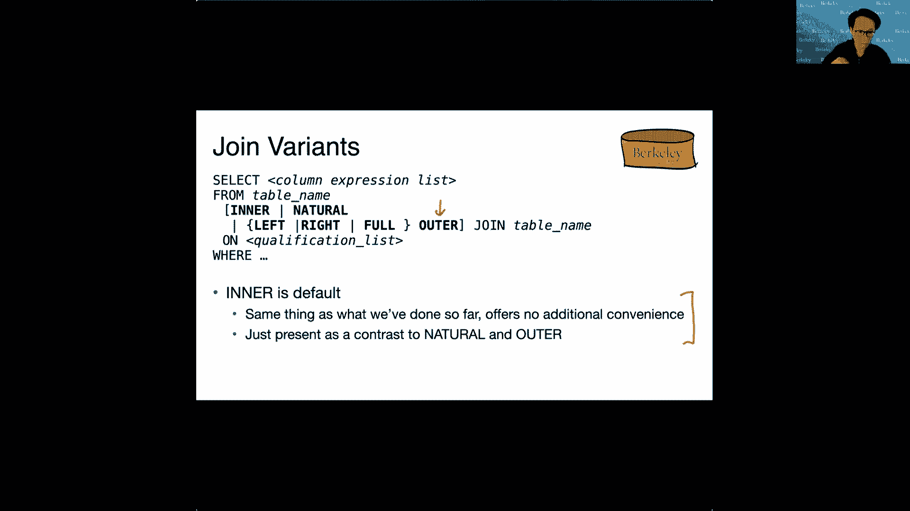
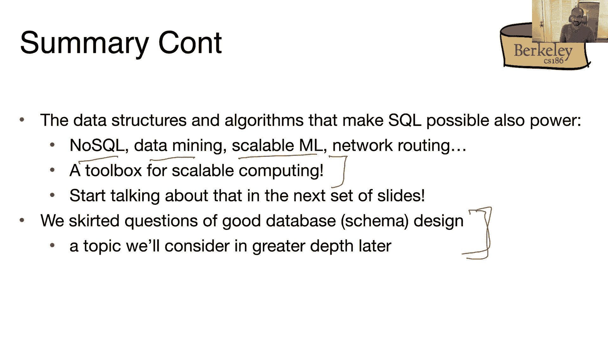
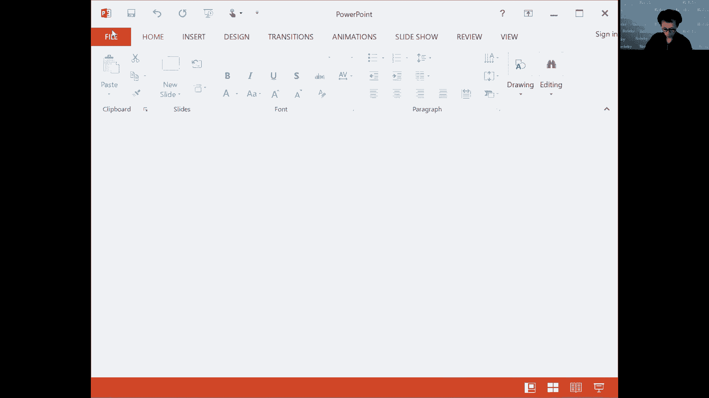
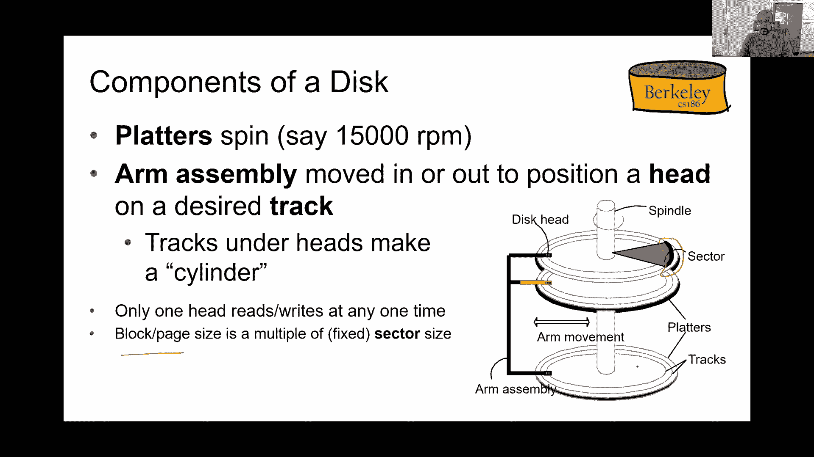

# 课程 P3：SQL II (续) + 磁盘、缓冲区、文件 I 📚

在本节课中，我们将继续深入学习 SQL 连接的高级概念，并初步探讨数据库系统的底层存储结构，包括磁盘、缓冲区和文件组织。我们将从 SQL 的自然连接、外连接和空值处理开始，然后过渡到查询的组合与嵌套，最后概述数据库管理系统的体系结构。

---



## 连接扩展 🔗

上一节我们介绍了基本的连接操作。本节中，我们来看看更高级的连接类型：自然连接和外连接。

### 自然连接

自然连接允许我们省略连接条件。它隐式地假设两个表中所有具有相同名称的属性值应该相等。

**示例**：
假设有两个表：`Sailors(sid, sname, rating)` 和 `Reserves(sid, bid, day)`。它们共有的属性是 `sid`。
```sql
SELECT * FROM Sailors NATURAL JOIN Reserves;
```
此查询等价于：
```sql
SELECT * FROM Sailors, Reserves WHERE Sailors.sid = Reserves.sid;
```
关于自然连接需要注意的一点是，它有时会产生意想不到的结果，尤其是当两个关系中有许多名称相同的属性，但你不希望它们在连接中被视为相等时。

### 外连接

外连接可以捕获内连接或自然连接中不匹配的行。它分为左外连接、右外连接和全外连接。

**左外连接**：返回左表的所有行，以及右表中匹配的行。如果右表没有匹配项，则结果中右表的部分填充为 `NULL`。
```sql
SELECT * FROM Sailors LEFT OUTER JOIN Reserves ON Sailors.sid = Reserves.sid;
```

**右外连接**：与左外连接相反，返回右表的所有行。
**全外连接**：返回两个表中所有的行，不匹配的部分用 `NULL` 填充。

需要注意的是，某些 SQL 实现（如 SQLite）可能不支持右外连接和全外连接，但可以通过调整表顺序和使用集合运算符来模拟。

---

## 空值处理 ❓

空值（`NULL`）用于表示未知或不适用的值。它的存在使得查询逻辑变得更加复杂。

### 空值与选择谓词

在 `WHERE` 子句中，涉及 `NULL` 的比较结果通常是 `NULL`（即“未知”），这会导致该行不被包含在输出中。

**示例**：
```sql
SELECT * FROM Sailors WHERE rating > 8;
```
如果某个水手的 `rating` 为 `NULL`，则该水手不会出现在结果中，因为我们无法确定其评级是否大于 8。

为了显式处理 `NULL`，可以使用 `IS NULL` 或 `IS NOT NULL` 谓词。
```sql
SELECT * FROM Sailors WHERE rating > 8 OR rating <= 8 OR rating IS NULL;
```

### 三值逻辑

为了组合涉及空值的谓词，SQL 使用了三值逻辑（True, False, Unknown/NULL）。其真值表扩展了传统的布尔逻辑。

**AND 真值表示例**：
| AND  | True | False | NULL |
|------|------|-------|------|
| True | True | False | NULL |
| False| False| False | False|
| NULL | NULL | False | NULL |

**OR 真值表示例**：
| OR   | True | False | NULL |
|------|------|-------|------|
| True | True | True  | True |
| False| True | False | NULL |
| NULL | True | NULL  | NULL |

规则是：如果 `WHERE` 子句的计算结果为 `NULL`（未知），则不输出该元组。

### 空值与聚合函数

聚合函数（如 `COUNT`, `SUM`, `AVG`）会忽略 `NULL` 值。
*   `COUNT(*)` 计算所有行。
*   `COUNT(rating)` 只计算 `rating` 非空的行。
*   `SUM(rating)` 和 `AVG(rating)` 也只对非空值进行计算。

---

## 查询组合与嵌套 🧩

SQL 允许通过集合运算符和子查询来组合查询结果。

### 集合与包语义

*   **集合**：不允许重复元素。
*   **包**：允许重复元素。SQL 默认使用包语义。

以下是面向集合和面向包的运算符：

*   `UNION` / `UNION ALL`：并集。
*   `INTERSECT` / `INTERSECT ALL`：交集。
*   `EXCEPT` / `EXCEPT ALL`：差集。

带有 `ALL` 的运算符执行面向包的操作，会考虑元组的重复次数。

### 嵌套查询

可以将一个查询（子查询）嵌套在另一个查询中。

**使用 `IN` 检查成员资格**：
```sql
SELECT sname FROM Sailors WHERE sid IN (SELECT sid FROM Reserves WHERE bid = 102);
```

**相关子查询**：子查询可以引用外层查询的变量。
```sql
SELECT sname FROM Sailors S WHERE EXISTS (SELECT * FROM Reserves R WHERE R.sid = S.sid AND R.bid = 102);
```
概念上，外层查询的每一行都会执行一次子查询。

**关系除法示例**：查找预订了所有船只的水手。
```sql
SELECT sname FROM Sailors S WHERE NOT EXISTS (
    SELECT B.bid FROM Boats B WHERE NOT EXISTS (
        SELECT * FROM Reserves R WHERE R.sid = S.sid AND R.bid = B.bid
    )
);
```

---

## 视图与公共表表达式 👓

视图和公共表表达式是命名查询的机制，用于简化复杂查询并提高安全性。

### 视图

视图是存储的查询定义，使用时会被重写展开。
```sql
CREATE VIEW RedCount AS
SELECT B.bid, COUNT(*) AS scount
FROM Boats B, Reserves R
WHERE B.bid = R.bid AND B.color = 'red'
GROUP BY B.bid;
```
使用视图：
```sql
SELECT * FROM RedCount WHERE scount < 10;
```

### 公共表表达式

使用 `WITH` 子句在查询中临时定义视图。
```sql
WITH RedCount(bid, scount) AS (
    SELECT B.bid, COUNT(*)
    FROM Boats B, Reserves R
    WHERE B.bid = R.bid AND B.color = 'red'
    GROUP BY B.bid
)
SELECT * FROM RedCount WHERE scount < 10;
```

---

## 数据库系统体系结构概述 🏗️

编写 SQL 查询是一种声明式体验。接下来，我们将深入探讨数据库系统如何执行这些查询。





数据库管理系统通常采用分层架构：
1.  **查询处理层**：接收 SQL 查询，进行解析、优化，生成查询计划。
2.  **执行引擎层**：执行查询计划中的操作符（如连接、排序）。
3.  **缓冲区管理层**：管理数据在内存（缓冲区）和磁盘之间的移动。
4.  **存储管理层**：在磁盘上组织和管理数据（文件、页、记录）。


两个横切关注点贯穿所有层次：
*   **并发控制**：管理多个用户同时访问数据。
*   **恢复**：在系统故障后确保数据一致性。

---

## 存储介质 💾

数据最终存储在物理设备上。不同的存储介质在速度、容量和成本上差异巨大。

### 存储层次结构

从快到慢，从贵到便宜：
1.  CPU 寄存器
2.  CPU 缓存
3.  主内存
4.  固态硬盘
5.  机械硬盘
6.  磁带

访问时间可能从纳秒级（寄存器）到天级（磁带）。我们通常将频繁访问的数据放在更快的存储中。

### 机械硬盘

机械硬盘由旋转的盘片和移动的磁头组成。
*   数据存储在盘片的**磁道**和**扇区**上。
*   读取数据涉及寻道（移动磁头到正确磁道）和旋转延迟（等待所需扇区转到磁头下）。
*   因此，顺序读写远快于随机读写。

数据库系统以**页**（通常由多个扇区组成）为单位与磁盘交换数据。

---

## 总结 📝

本节课中我们一起学习了：
1.  **SQL 连接扩展**：包括自然连接的隐式等值连接，以及左/右/全外连接对不匹配行的处理。
2.  **空值处理**：理解了 `NULL` 表示未知值，以及在三值逻辑下如何影响 `WHERE` 子句和聚合函数。
3.  **查询组合**：使用集合运算符和嵌套子查询来构建更复杂的查询，并了解了关系除法的概念。
4.  **视图与 CTE**：使用视图和公共表表达式来模块化查询，提高代码可读性和安全性。
5.  **系统概述**：初步了解了数据库系统的分层架构和核心组件。
6.  **存储基础**：认识了不同的存储介质及其特性，特别是机械硬盘的工作原理，为理解数据如何存储和访问打下基础。



掌握 SQL 需要大量练习。请务必通过作业和项目来巩固这些概念。在接下来的课程中，我们将自底向上地探索数据库系统的实现细节。