# P4：讲座 4 磁盘、缓冲区、文件 I（续）+ 磁盘、缓冲区、文件 II - ___main___ - BV1cL411t7Fz

186号。所以，首先有一些公告。第一，第二次作业将会在讲座结束后发布，截止时间是下周四。

第一个项目将在本周四截止。我希望你们都在享受、玩得开心并且写出优秀的 SQL 查询。今晚在太平洋时间7点到9点之间，还会有一个项目答疑时间和聚会。所以，项目聚会实际上是我们在助教网站上尝试的新形式。我们鼓励你们相互合作，并且寻找项目合作伙伴。

希望这个方法可行。如果你们对这个功能有任何反馈，也请告诉我们，因为这是一个相对新的尝试。正如你们所知，我们会在每周初发布每周公告，确保大家能够跟上进度，了解事项。

提到了截止日期等等，请确保在课堂之外也查看这些内容，除了课堂上的公告。好了，回到材料部分。上周我们在讨论数据库管理系统中的不同组件。对吧。所以我们采用了这种分层方法，展示了所有这些不同的。

从顶部到底部解析输入查询，一直到管理文件系统中的磁盘缓冲区，数据实际上就存储在这里。所以我们从谈论数据库管理系统中最底层的组件开始。

基本上是在讲磁盘。然后，上周四我讲了这种你们可能已经熟悉的层次结构。所以我们从最快速的数据检索机制开始，通过将数据存储在与CPU本地相关的寄存器中，一直到最底层，甚至像传统的写入操作，虽然它可能是“过时的”写入方式。所以，检索数据所需的时间差异是巨大的。你可以看到这里的差距，从 0 开始。

从 5 纳秒到 20 毫秒，这中间的时间差非常大。所以这些不同层次之间的时间差非常显著。而且我还开始提到磁盘的不同组件，包括盘片和臂组件，或者说这些由磁盘头组成的臂组件。基本上，磁盘会旋转，盘片围绕它转动，而磁盘上标记的区域，或者说磁盘上的圆圈部分，就被称为。

圆柱体。现在，我们基本上在讲解如何从**扇区**中读取数据。所以基本上，当我们旋转到唱片上我们想要读取的特定区域时，然后将磁头降低，读取位于其下方的数据，然后扫过的区域就是**扇区**。如果这些概念对你来说有些陌生。

我想一个不错的类比其实是唱盘，可能你们中的一些人已经很熟悉了。所以在这个类比中，我们可以看到黑胶唱片就是我们的磁碟。这个组件也被称为臂组装，在它的最尖端，基本上是磁头。

其实这和我们现在所看到的完全相同。只不过可以想象，我们现在是3D的结构。所以我们有多个层次的这些磁碟，这就是你在前面图片中看到的。我们仍然有相同的磁碟，设置、臂组装、样本。

同样的磁头，除了在旧式的情况中，我们讲的是这些黑胶唱片，而不是磁碟，但其机制基本是相同的。那么我们到底是怎么读取的呢？其实我们必须像唱盘一样，旋转磁碟。

臂组装部分会移动到正确的位置，然后将磁头移到我们实际想要读取的位置，接着将磁头降低，基本上接触到唱片。所以在磁盘的情况也是一样的，在这里。基本上我们将其分解为三个不同的部分，根据读取这个区块所需的时间。首先，我们有**寻道时间**，正如我所说，这基本上是将臂移动到我们实际想要读取的位置。

然后是层的旋转，因为我们基本上需要等待磁碟旋转到我们实际想要读取的扇区，正如黑胶唱片的情况一样。最后是传输数据所需的时间，一旦我们将磁头降低，就像经典的唱盘一样。

现在，最后一部分，比如说在传输时间方面，我们其实无法控制，因为我们必须从磁碟上读取数据。我们无法控制任何事情，但前面提到的两部分是我们真正想要最小化的，因为它们严格来说是开销，我们不需要这些任何多余的操作。

但当然，事情并不总是按预期的那样发展。因此，这些是你在谈论磁盘读取时需要知道的基本组件。那么闪存呢？或者说固态硬盘呢？你们中的一些人可能已经在自己的笔记本电脑上看过这种硬盘了。所以这里的技术不同，首先它们不是按盘片的方式组织的，而是按单元格组织的，我在这里用红色标出了其中一个，这基本上就是固态硬盘上的一个单元格。

然后，在当前一代使用NAND闪存技术的设备中，它的不同之处在于我们可以进行随机的读取和写入。所以我们不再像旋转盘那样等待磁盘旋转到正确的位置，然后再将磁头放下，所有这些操作都已经不再需要了。

除了读取和写入实际上是不同粒度的这一点。我们可以对单个单元格进行非常细粒度的读取，但对于写入，实际上最好是一次写入多个单元格。这就像固态硬盘（SSD）的背景技术一样。还有一点你需要知道的是，读取虽然非常快，但写入也很快，因为我们不需要等待机械臂的移动，也没有机械装配，我们不在移动任何东西。

我们不需要等待东西旋转，这点很好，而且它也非常可预测，因为我们只是从任意一个单元格中检索数据，然后所有单元格基本上都有读取机制，所以我们不需要等待任何东西旋转。

这很好，但遗憾的是，从时间上来说其实并不是那么可预测。为什么呢？事实证明，我们在固态硬盘或闪存驱动器上每个单元格的写入次数是有限的。现在的典型数量大约是3000次左右，超过这个次数后它就会失败。失败的意思是不能再擦除它了，因为如果我们要向其中写入数据，首先必须擦除原来的数据，然后再写入新数据。

所以，事实证明我们不能无限次地做这个操作，只能做有限次数。当一个单元格“死掉”或无法再擦除时，我们实际上需要找到另一个可用的单元格来写入数据。这是一个被称为“均衡写入”的过程，正因为我们不能预测哪个单元格会失败，所以当我们尝试写入大量数据时，可能会跳来跳去。

在找到足够的存储位置之前，实际上会有很多单元被擦写。这就是为什么在一般情况下，对于固态硬盘来说，擦写次数并不那么可预测。有任何问题吗？我有一个问题。是的。那是不是意味着固态硬盘的使用寿命非常短，因为我猜测两千到三千年之类的，硬盘可能就会坏掉。非常短？非常短的使用寿命？就是说，如果我有一个固态硬盘，是否意味着它可能会在几年内就坏掉？

其实不是，因为你实际上有大量的存储单元，而且这些硬盘通常内置冗余机制。因此，通常当他们告诉你存储是比如说1TB的时候，实际上存储单元是比1TB数据所需的多一些，因为它们会有冗余。所以，但最终还是会坏掉，因为你知道，存储单元不能无限次地重写。

哦，酷。谢谢。是的。还有其他问题吗？嘿，擦除我们写入SSD上的信息会花费很多时间吗？这取决于我们讨论的技术，比如NAND GAKES。我的意思是，通常擦除的时间并不像磁盘那样长。而且在本课程中，你基本上不需要担心这个问题。

我的意思是，就像你知道的，你唯一需要记住的事情可能就是，它们的擦写时间可能会不同，尤其是写入时间，特别是写入时间可能是不可预测的。好的，谢谢。哦，是的，我有问题。是的。

Pansita。与机械硬盘相比，在相同的使用条件下，哪个会更耐用？这个问题很难回答，通常闪存驱动器如果你比较单个单元的话，它的衰退速度会比磁盘要快一些，如果你拿它与磁性硬盘做对比的话。但随着技术的进步，现在真的很难说，因为你知道我们每年都有更新的闪存技术。

而且现在有越来越多的冗余机制内置在其中，这样它们就可以容忍更多的错误。所以很难说，我想这就是底线。我明白了。谢谢。酷。好的。所以对于本课程而言，你只需要了解这些。就像我上次在星期四说的，如果你对这个感兴趣，实际上有很多课程你可以参加，既有计算机科学的，也有电气工程系的课程。

你实际上也可以自己设计内存，实际上有一些课程可以帮助你学习这些技术。好吧，像你知道的那样，对于我们来说，我们想讨论的是空间管理。所以现在你知道了这些技术的基本原理，我们该如何讨论如何管理这些空间呢？

嗯，我们首先谈论的是写入数据块，基本上是数据块的写入。正如你所想的那样，将顺序数据写入到相邻的位置通常是最快的。实际上，这有不同的原因。对于磁盘来说，原因是因为我们实际上在等待磁头旋转，就像想象一下唱片的转动一样。

再次提到黑胶唱片的例子，对吧？显然，我们可以读取相邻的数据，或者写入相邻的位置，这很好，因为那样我们就不需要等待磁头的移动，或者不需要等待磁碟的提升。

抬起，然后像你在适当的地方再次降低对吧？所以这就是为什么它很棒，然后对于右边的部分，我的意思是，类似的原因也适用于闪存磁盘上读取顺序数据。

因为顺序读取比起随机写入（例如写入闪存磁盘中非连续的位置）要更快，原因是正如我之前跟你们提到的，闪存有磨损均衡机制。

所以这些基本上是一些原理，那么人们通常怎么做呢？他们基本上会尝试预测行为。既然我们知道顺序读取和写入是比较好的，那么他们是怎么做到的呢？他们通过尝试缓存可能在不久的将来会被使用的内容来实现这一点，这就叫做预取。它们会尝试缓存那些频繁使用的数据，希望它们能够很快被重复使用，这就叫做缓存。

然后他们还会尝试缓存写入操作，确保即使我们最初似乎在写入到随机的块中，但如果我们收集足够多的数据块，最后可能会以顺序的方式写入，这是很好的，这叫做缓冲写入。

所以我们在实际上课时会看到一些这些技术。但现在，像你知道的那样，我们先尝试统一一下吧，因为现在有这么多不同的技术存在。我是说，让我们尽量想出一些共同的术语，以便我们能谈论这些技术。所以我们将使用“块”作为所有不同磁盘的基本传输单元，因此无论是磁性硬盘还是固态硬盘，或者其他类型的磁盘，都没关系。

你知道，典型的数字范围大概是64千字节，而你的书中提到的是4千字节，我觉得这有点随意。每种技术和每种设备都是不同的。现在我们只想要一些共同的术语，这样我们才能一起讨论这些问题。

然后，为了让自己更加困惑，人们还使用了“页面”这个术语，实际上它是块（block）的同义词。你可能会在不同的教科书中看到这种情况，所以要注意一下。有些教科书甚至把页面当作主内存的单位来使用，这样就更容易让人困惑了。

但是，我们会确保在不同的语境中使用这个术语时，语境是明确的。现在，我们把这两个术语视作同义词。好的，对于一个数据库管理系统来说，我们所说的磁盘空间管理，实际上就是我们管理所有可用于读写数据的磁盘块的方式。它将页面映射到磁盘上的实际物理位置。因此，我们向上层暴露的抽象就是基本的页面读写操作。

但是在实现中需要重点考虑，我们需要弄清楚到底应该在哪里写入磁盘，反之亦然，我们还需要能够通过查找具体的页面在磁盘上的位置来加载页面，然后根据需要加载到内存中。

如此等等，高级别的基本上使用这个接口来读取它们，写入一个页面，它们也可以利用这个接口来确定分配多少页面，等等等等。所以我们需要关注的是这一空间，这一空间的管理。

这里是一个常见的机制或媒介，我们会使用这个组件。例如，假设“sailors”是我们要读取的表的名称。我们实现或使用这种磁盘空间管理组件的方式是，首先从“sailors”表中的一个页面开始。假设是该表中的第一个页面，因为我们想要读取其中的所有数据。

我们得到一个页面后，基本上会进入一个循环，这个循环会遍历每个我们读取的页面。我们会进行一些处理，比如过滤或其他我们想要完成的查询。然后我们调用“下一页”来获取我们想要处理的下一页，直到处理完成。完成的标准可以是查询完成，或者所有数据已经写回到磁盘，等等。

这里需要注意的事情是，我们假设下一页（即这个调用）是快速的。这和我之前说的呼应，我们假设顺序写入页面对不同类型的设备是有效的。所以我们暴露给系统更高层的接口基本上是这样的，你知道，获取指针。比如说我们想要的第一页或任何其他页面，接着是一个接一个的下一页调用。

所以这是我们会看到的 API，这也是当人们尝试使用空间管理组件时常见的做法。这是有道理的。好，现在我们来谈谈如何实现。既然这是我们暴露给更高层的 API，那我们究竟该如何实现这个底层机制呢？

在这里我想提到两个建议。第一个是我们直接与存储设备进行交互。所以如果我们有一个磁盘驱动器，那么我们就去了解如何移动磁臂，如何控制旋转速度，以及何时降低读写头，然后转移数据，举个例子。

所以这很简单，很棒。事实上，如果你非常了解你的设备，那其实真的很不错。所以你可以实际实现你自己的设备驱动程序，专门为我们正在构建的数据库管理系统量身定制。这太棒了。然而，缺点是每种设备，每种类型的设备往往都有自己的 API，比如你在移动磁臂，或者在读取闪存驱动器上的一个单元，或者找到另一个位置来存储数据。

所以你基本上需要掌握所有这些不同的 API，并且高效地实现它们。那么如果我们往系统中加入新东西，会发生什么呢？所以现在我们基本上需要更改我们的磁盘管理组件。

所以这是一个缺点。当然，优点是，这种方式是高度专门化的，所以如果你知道如何操作，它可以带来非常好的性能。所以我们可以与操作系统进行交互。和操作系统交互的原因是操作系统已经为我们管理了文件系统。

从某种意义上来说，通过使用操作系统，我们把自己从这些低层设备驱动管理问题中隔离开了。所以，实际上我们是在绕过操作系统，我们不希望操作系统为我们直接管理文件。

因为操作系统可能实际上会在我们尝试处理查询时，写入文件的某些部分，或者读取或预取文件的不同部分。而且操作系统可能并不知道我们在某个给定的文件上想要执行什么样的查询或处理。

另一种实现这个管理系统的方案是基本上通过要求操作系统给我一个巨大的文件存储在空磁盘上，从而绕过操作系统。然后，我们暂时假装自己是这个文件的拥有者，直到剩余的时间结束。

所以只要我们在处理查询，我们就假装告诉操作系统，看，我的意思是，我们正在管理这个巨大的文件。不要碰它。我们不会把任何数据返回到磁盘，我们会通过调用操作系统接口明确地做到这一点。

就像你知道的，不要预取任何东西，我们会告诉你该怎么做，诸如此类。所以在某种意义上，我们通过进行自己的磁盘管理，实际上是劫持了操作系统。而且这可以非常好，因为现在我们从低级设备驱动程序的细节中抽象出来。我们基本上在做自己的块级管理，页面级管理，如果你愿意的话，就像是文件管理。

所以这就是另一种实现磁盘空间管理系统的方式。而且，你知道，这个文件可能跨越多个磁盘甚至机器，只要操作系统提供了接口来为这样的文件分配空间。

然后我们就告诉操作系统，闭嘴，然后我们就自己管理整个事情。总的来说，我们刚才讨论的就是一些非常简单的技术，涉及到磁带和磁性磁盘。

然后我开始讨论做不同事情的成本问题。所以需要记住的一点是，访问磁盘的成本相较于从寄存器本地读取数据到CPU中可能非常高。

我们还简要讨论了磁盘存储管理器可以暴露的不同接口，并简要介绍了如何实现这些接口。然后就这些。现在我将切换到其他内容。如果你有任何问题，请随时举手。

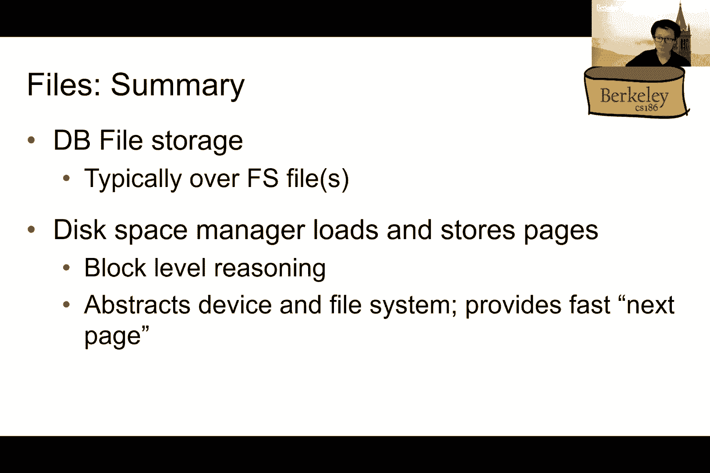

非常清楚。

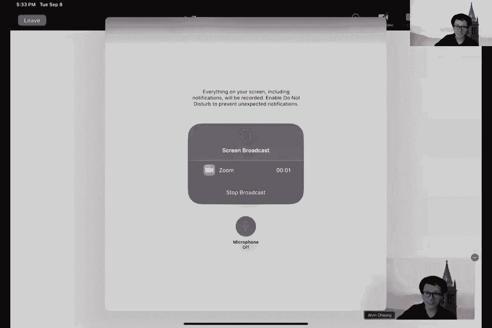

是的，读取顺序很重要，是的。好，大家能听到我吗？好，行。那么，接下来我们继续之前的内容。我们正在讨论现在我们已经知道底层发生了什么，基本上在关系中，数据可能存储在多个由文件系统管理的文件中。

从数据库的角度来看，考虑到这种抽象，你可以想象以下几种划分方式：每个表或每个关系存储在一个或多个操作系统文件中。每个文件可能包含多个页面。我们之前讨论过页面和块是类似的，所以每个文件会包含许多数据页。

每个页面包含许多记录。好吧，因此，“记录”是元组（tuple）的同义词。因此，每个页面将包含许多这样的记录。因此，这种页面或块的概念基本上是数据库系统多个层次之间共享的“通用货币”。

在磁盘上，它由磁盘空间管理器进行管理，磁盘空间管理器负责将页面分配到磁盘上的文件。因此，这些页面会被读入或写入磁盘文件中。这些文件可以是固态硬盘（SSD）或传统硬盘（HDD）。在内存中，它由缓冲区管理器进行管理。没错。

所以，它由缓冲区管理器管理，数据库系统的更高层次则操作内存中的数据。为了操作数据，操作的是页面。你需要先将页面加载到内存中才能操作它。因此，缓冲区管理器的角色就是将页面加载进来。一旦页面进入缓冲区，

它可以操作这些内容。好吧，接下来，让我们讨论一下如何在给定文件的不同页面之间布局给定的关系。好吧，现在我们先讨论单一表格，所以我们先不担心多个表格，多个表格的相同概念也适用。所以现在讨论一个单一表格。

我们将讨论数据库文件的概念，这是一个抽象，表示单个表格的信息。

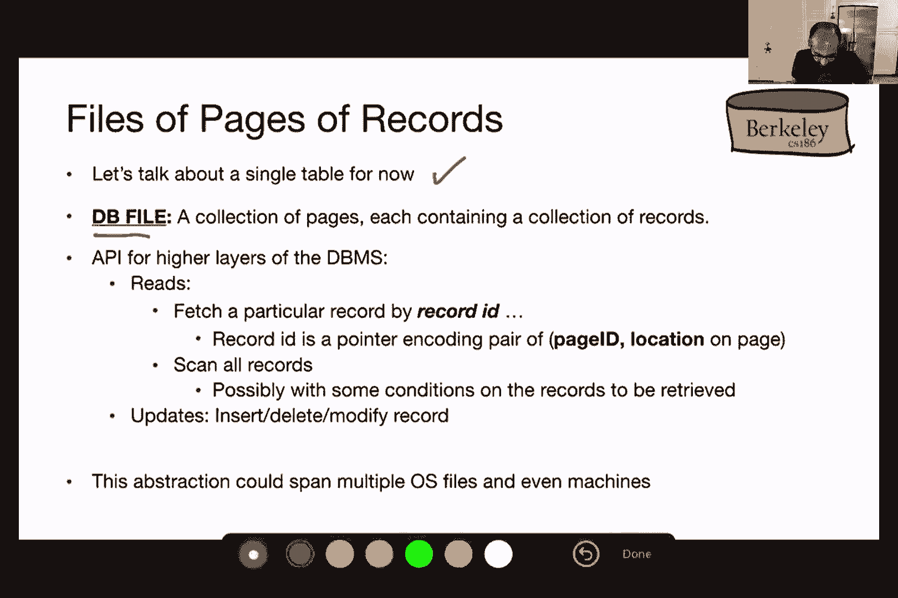

在这里我们讨论的是一个集合，这个文件包含一组页面或块，每个页面或块包含一组记录。因此，对于数据库系统的更高层次，它们基本上可以使用更高层次的抽象来引用页面上的信息，而不需要担心页面具体的位置。例如，可以通过引用所谓的记录ID来获取特定记录，记录ID是一个指针，编码了包含信息的配对。

它的标识符是页面ID以及页面中的位置。我们可能需要的另一个重要API调用是扫描所有记录。在扫描所有记录时，你可能还会对需要检索的记录施加一些条件。

所以，你想要获取所有GPA大于3.5的学生，对吧？这可能就是你在检索记录时可能施加的条件。这是读取API，然后你会有更新API，你可能需要插入、删除或修改记录。我们现在只讨论一个单一表格，一个表格可能跨越多个操作系统文件，实际上甚至可能跨越多个机器。

但现在不必担心这些细节，我们先谈论一个包含多个页面记录的单一文件。在深入探讨这些页面如何布局之前，有多种不同的数据库文件结构，因此给定关系的信息可以通过多种不同的方式存储。我们现在将主要讨论一种方式——无序堆文件。

无序堆文件基本上没有对记录在页面上的放置位置做出实际约束，它是无序的。再说一遍，记住关系是一个多重集合，所以这种匹配有点类似于多重集合的抽象。如果你想提高访问效率，你可以例如基于某些有意义的方式对数据进行聚类，使得记录和页面以某种有意义的方式分组。

或者你也可以更严格一些，根据某个属性进行排序。例如，你可以根据Calnet ID对学生记录进行排序。除了存储记录本身之外，你还可以有索引文件，这些通常是辅助结构，允许你更高效地检索记录或页面。

所以它们在某些情况下可能包含记录本身，或者指向其他文件中的记录。好了，现在我们不必担心这些其他三种聚类、排序和索引文件的方式，你只需要关注无序堆文件。

我们将在下一节课回到索引的内容。好的，那么文件顺序的问题，基本上我们想要的抽象是无特定顺序的记录集合。这与您在算法课上可能学到的深度数据结构不同，我们这里只是为了确保高效的最大值和最小值操作，并在插入和删除时保持这些最大值和最小值，这并不是我们现在要讨论的内容。

所以不要混淆这两者。基本上，这是一个无特定顺序的记录集合。在这样的文件中，随着文件的扩展，页面的分配也会发生变化，因此在新增或删除记录时，可能会增加或删除更多的页面。

因此，为了支持在关系中发生的各种操作，我们需要做几件事。我们需要捕获给定文件中所有页面的位置。我们需要捕获每个页面中存在的空闲信息量，以便确定是否插入新记录。我们还需要跟踪页面中的记录。

那么我们从最高层次的抽象开始。我们来谈谈文件中的页面。一个堆文件，假设我们将其实现为一个列表。为了将堆文件实现为列表，我们可以考虑有一个特殊的头页，它基本上是指向列表的起始指针。然后这个头页是堆文件的位置，也就是说，整个文件的位置。

以及页头页面在文件中的位置，可以作为所谓的元数据存储在某个地方。所以这可以作为关于数据的数据存储在系统目录中。数据库系统目录就是存储有关你数据的数据的地方。例如，你可能存储关于各种关系的模式信息，意味着存储信息。

例如，像这样的事情。那么，一个页面是如何工作的呢？在给定的关系中，哪些文件被引用，页头页面存在的位置在哪里？例如，明白吧。所以，这可能是存储此页头页面在文件中位置的一个可能位置。好的，所以页头页面基本上只是告诉你这个链表的起始位置，然后你有两个独立的链表。

一条已满页面的链表。所以这是这条链表，另外一条链表，是那些有空闲空间的页面。好的，再次强调，你可能需要前后指针，这样当页面被添加或删除时，你可以正确地维护这些指针。

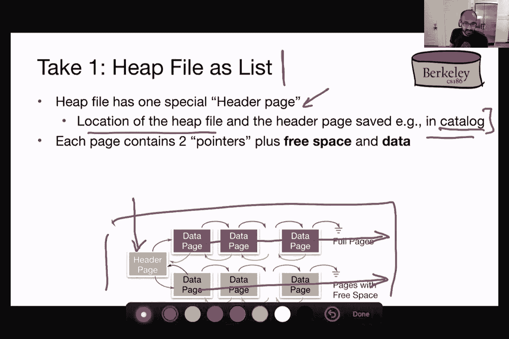

所以这个页头页面有指针，抱歉，指向已满页面列表的开始以及空闲页面列表的开始。

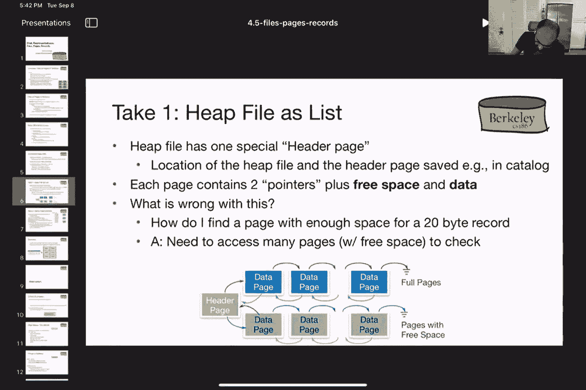

每个页面，每个数据页都有指向列表中下一个页面以及前一个页面的指针，在这种情况下，第一个页面指向页头。那么，为什么我要将这些分成已满页面和空闲页面呢？好处在于，如果我想插入一些新记录。

我只需要查看这些页面，而不是这些页面，对吧，这样我就不需要查看这些已满页面，因为我知道我无法在其中容纳新记录。我只能将其放入那些有空余空间的页面中。是的。问题。哦，对不起，你刚刚回答了我的问题，但我想另一个问题是，一旦空闲空间链表中的页面填满了会怎样？

你必须将其移动到已满页面吗？这会带来什么样的成本？对吧，嗯，关于成本我们还没有真正讨论，但我们可以从概念上讨论一下这会是什么样子。好吧，你必须，如果你有一个最初在空闲空间链表中的数据页面，想要将其移动到已满。

已满页面列表，你基本上需要确保指针指向正确的地方。对吧，例如，如果我想将这个页面移动到已满页面列表，我需要更新前一个页面和下一个页面的指针。一旦我找到一个合适的位置来放置它。

我可以把它放到这个列表的末尾，或者把它放到这个列表的开头。再次强调，我必须更新前后页面的指针，对吧？所以基本上我可以说，你需要更新四个页面及其指针的顺序，才能完成这个更改。

但我们来谈谈为什么这实际上不是一个很好的解决方案。好吧，为什么这不是一个很好的解决方案呢？嗯，如果我想找到一个页面，它有足够的空间来存储特定的记录。然后我只能按照这个空闲空间的页面列表一个一个查找，直到我找到一个有足够空间来存储我的记录的页面。而且没有其他方法可以做这个，对吧？所以这基本上是我如果采用这个简单的链表实现时唯一的做法。

所以，这就是这种方法的缺点。那么，我该如何思考这个问题呢？一个缺点是，我有点是在查看包含数据的页面，以确定是否有空闲空间，但我可以将关于哪些页面有空闲空间的信息，提取到一个单独的页面中，这个页面叫做页面目录。好吧。因此，这个页面目录可以包含多个这样的头页面。

每个页面编码指向给定页面的指针以及该页面中存在的空闲空间。因此，它编码的是指针和空间的配对。所以这个目录可以有多个这样的头页面，每个页面基本上包含这些指针。好吧，指针和空间信息。现在，这么做的好处是，你可以在单个头页面中打包关于许多页面的信息。

因为你并没有在这些头页面中存储任何数据，只是存储关于页面的信息，指向页面的指针以及页面中的空间。所以可以有多个这样的头页面，这些头页面实际上访问得相当频繁，因此它们可能会比其他页面更常出现在缓存中，所以它们会在内存中。而找到一个合适的页面来存放记录所需的页面加载次数，比在链表中要少得多。

记得我刚才提到的链表吗？我必须跟随指针链，直到找到一个有足够空间的页面。现在，我有一个头页面，它可以显示多个页面的空闲空间。所以它基本上包含了更多页面的信息，但我并没有在这些头页面中存储任何数据。

我只是在存储一堆页面的空闲空间量。实际上，你可以将这个思路推得更远，通过以一种更“优化”的方式来组织页面目录，从而尝试进行压缩。你可以根据每个页面中的空闲空间量来排序指针。但所有这些方法并不一定能提供比使用页面目录和头页面这一简单方法更多的附加收益。

所以页面目录和头页通常足以满足我们的需求。好的。所以这里的最高抽象层次是一个表格，它被编码为文件，文件是页面的集合。然后，页面目录提供了页面的位置以及每个页面中的空闲空间，以便我们基本上可以添加新页面。所以如果有新的记录，我们可以将它们添加到这些页面中。接下来我们来谈谈页面布局。好的。

为了讨论页面布局，我需要说明如何在有限的屏幕空间中展示页面。内存或磁盘上的数据是按线性顺序存储的。你可以记住，当你从磁盘读取数据时，它是按顺序读取的，沿着圆周的方向，也就是磁道或者扇区。就是这样读取的。现在，这些信息不一定能很好地适配屏幕，因为我无法横向展示，所以我的思路是将这种线性顺序转化为矩形的形式，基本上是这样展示的。

然后我将回到这一点，依此类推。好的，这只是一个约定，用来表示这些页面，而不用让我跳出页面（跳出幻灯片）的情况。

好的，我们来谈谈页面的样子。页面的第一部分是我们需要考虑的头部。头部是关于编码页面内容的信息。再次强调，这是元数据，因为它是关于数据的数据，所以它可能包含各种信息，比如页面中记录的数量和空闲空间的大小。你可能有下一个或上一个指针，或者你可能有指针、位图和槽表，我们将讨论这些是否需要，以及哪些需要。

但我首先想说的是，我们可能会有一个头部，就像我们在页面目录中有头页那样，指向页面，我们也可能有一个页面头部，它编码了页面中记录的信息。在这个意义上，随着你逐步深入，你仍然保持相同的结构，即有一个头部部分，编码着关于数据的元数据。好的，所以我们有一些决策要做，第一项决策是我们是否有固定长度记录或可变长度记录。

我们已经更新过你，但有方法将可变长度字段编码为固定长度字段，稍后我们会讨论。但现在我们来谈谈你是拥有固定长度记录还是可变长度记录，这是一个可能的决策，并且已经提供给你了。例如。

如果你没有任何字符串类型，那就是整数和浮点数。这是一个固定长度的记录，因为你知道每个字段所需的存储量。另一方面，如果你有很多字符串，它将是可变长度的记录，特别是如果你使用VARCAER，这是一种我们在讨论数据定义语言时学到的语法。

好的，这就是第一个决策，即记录长度。第二个决策是我们是否想使用打包布局，也就是记录紧密排列在一起，还是记录之间有空闲空间。这个就是第二个决策，打包方式。我们需要考虑的因素是，我们希望能够根据记录ID找到记录，而记录ID被编码为页面ID和页面内位置，我们会讨论这些页面结构中每种位置的含义。

我们需要确保能够高效地添加和删除记录，并考虑到每个操作所涉及的开销。好的，那么让我们考虑第一种替代方案。第一种替代方案是将记录密集打包。对，这适用于固定长度的记录，相对于可变长度的记录，这实际上是你能拥有的最简单的方案。所以，如果你将记录密集打包，你基本上会有这个页面头部，然后是第一条记录，第二条记录，第三条记录，第四条记录，依此类推。

它只是按顺序排列。那么，记录ID是什么样的呢？记录ID基本上被编码为页面ID和页面位置的两部分。这里页面的位置基本上可以通过页面中与记录编号对应的信息完全捕获。

一旦我们有了记录编号，我们实际上可以通过简单的算术运算确定记录在页面中的确切位置。对，通过使用从页面开始的偏移量，可以计算出该记录在页面中的位置。

基本上就是页头大小加上记录大小乘以n减去1，如果我试图找到页面中的第n条记录。例如，第一条记录从这里开始，所以基本上是页头加记录大小乘以1减去1，结果是0。

对， 所以这只是一个标题，第二条记录会从这里开始，抱歉，第二条记录会从这里开始，第三条记录从这里开始，依此类推。通过简单的算术可以得出这一点。好的，那么我们如何处理添加和删除呢？嗯，添加很简单。如果我们有空闲空间，我们只需将记录追加到页面末尾。

如果有空闲空间，我们可以直接在页面末尾添加新记录。删除则有点挑战性。假设我们删除第二页。所以这是第二页。第二页的第三条记录，意味着我要删除这条记录。好的，所以我现在可以删除这条记录并释放空间。由于这是一个密集布局。

我需要重新组织。好的，所以这个记录是页面二记录四，现在需要移动回并变成页面二记录三，对吧？因为这是一个打包表示。所以打包表示意味着我需要重新排列原本我所说的页面二记录四，现在需要更新为页面二记录三。所以，这样的缺点是，如果我把页面二记录四作为该记录的标识符，并且我在其他文件中引用它。

现在我需要更新这个。所以这并不是理想的，对吧？所以如果那些信息在其他文件中，我也需要去更新那些文件中的信息。好的。那就是这种打包表示法的一个缺点。现在我们来谈谈解包表示法，看看它是否能缓解一些这些问题。

但在此之前，我有任何问题吗？Shiro。是的。我只是想确认一下，我们讨论的这个页面是否与内存中的实际页面有关。那里的确有页面表和其他一些东西。没有。所以，基本上我们讨论的是你从磁盘上读取和写入信息时的粒度。

对，所以，这就是页面，它是上层数据库系统和下层磁盘管理器之间的共同货币。所以，它基本上是你将要使用的交换单位。好的。

所以它和操作系统中的页面是一样的，对吧？是的，是的，好的，视情况而定，但肯定是。好的，谢谢。所以你说当我们使用堆时，它会检查所有页面并执行一个非常低效的检查过程，对吗？

但这是否意味着它也是一种非常低效的存储结构，尤其是在空间上，因为我可以想象一种情况，页面并没有完全填满，但由于没有足够的空间，它就无法继续写入。

但如果我们以不同的方式重新排列数据，就像你之前提到的打包问题一样。它可以适配。那么这是否意味着他在存储东西方面也很低效呢？那么，你是在讨论堆文件吗？你是指有一个头文件，然后被分成两部分，其中有空闲页面和已满页面，空闲页面看起来就像是存储东西的一种低效方式，是吗？

空间，我能在脑海中想象出一种情况，会有很多空间我们不会使用，原本我们可以以不同的方式分配这些空间。是的，所以你可能会从定期重新组织空闲页面中的信息中受益，特别是如果有大量删除操作。这样你就可以。

你可能会从中获得一些好处，我们接下来会讨论一些碎片整理问题和碎片化问题，所以希望我们能回到这个问题。我不认为这是一个仅仅影响这个特定方案的问题，我认为它同样影响页面目录方案。

所以，如果你有很多数据，例如，如果你添加了很多记录，并且分配了很多页面，然后删除了其中一半记录，那么你现在有，假设是其中一半页面为空。你最初分配的每个页面现在有一半是空的。

或者说，这些页面中的大约一半记录现在已被删除。你可以将它们压缩成只有一半数量的页面，但你不能这样做，除非你决定进行碎片整理，对吧？所以，这个方案对于这个情况并不是独特的。

链表方案，我认为这个方案也会受到影响。页面目录方案也会受到影响。太棒了，非常感谢。是的。我有一个关于延迟的问题，正如你之前提到的。如果我们将页面延迟到记录3，那么我们将重新排列页面为记录4，对吧？

那么像页面到记录5这样的记录怎么办，因为现在我们已经安排好了记录，现在帮我们安排记录5。我们是否也需要将记录文件回滚，以便成为记录5呢？是的，这是我的问题。是的，基本上，如果你最终删除了一个记录。

所以在该页面中，所有后续记录的记录ID需要更新，对吧？因此，任何存储在其他页面并引用该记录ID的信息也需要更新，所以你说得对。所以基本上，不仅是记录文件6的记录，页面中的其他记录也需要更新。好的，谢谢你，Felix。嘿，Jerry。

这个问题部分得到了回答，但考虑到删除的情况，是否有任何因素阻止我们？例如，将该区域标记为无效，或者页面布局是否要求记录必须是有效记录且必须连续？好的。所以你提到的基本概念是我接下来要讲的内容，先记住这个想法。

谢谢。好的，所有问题就这样吧。如果聊天中有任何需要回答的问题，请举手。我没有非常密切关注聊天。好的。那么，跟进Felix的建议，就是基本上指示记录已经被删除。我们通过指示该记录区域已经被删除来实现。

我们不一定需要将其他记录向上移动，从而避免更新所有这些记录的记录 ID。因此，使用这个思路，我们如何实际实现呢？一种实现方法是使用位图，它编码了页面中记录是否存在。再次强调。

我们正在讨论固定长度记录，无论该记录是否有效。因此，这个位图就是在编码这一点。位图表示这些插槽，每个插槽对应一条记录。记录 ID 就是对应于页面 ID 位置和页面内位置。这里的页面将讨论插槽 ID。所以插入很简单。我们找到位图中的第一个空插槽。

然后我们在这里插入一条记录。删除也很简单。我们只需清除那个位。因此，在这种情况下，如果我想删除第三条记录，我只需要清除这个位。现在，我已经删除了记录。这样做的好处是，这些记录（记录四、记录五、记录六、记录七等等）不需要移动。它们的记录 ID 也不需要更新。

因此，不需要重新组织。它基本上只是表示记录是否有效。你可以通过一个非常高效的位图来表示这一点。位图只是一个零一的表示，可以极其紧凑地存储。好的，这是固定长度记录的解包表示。现在我们来谈谈可变长度记录。那么，可变长度记录会发生什么呢？

你还需要了解记录的长度。因此，我们将尝试弄清楚如何编码可变长度的记录。我们已经看到，固定长度记录的情况非常好。现在，我们将考虑解包的情况。那么，这里是我们需要关注的几个考虑因素。

好的，我们需要弄清楚每条记录的开始位置。我们还需要弄清楚每条记录的长度。我们还需要弄清楚在添加和删除记录时会发生什么情况。好的，为了弄清楚如何处理可变长度记录，我们要做的第一件事是将元数据，也就是头部，移到尾部。好的，我们将它移到末尾。稍后我们会谈到为什么这么做是有道理的。然后我们会有插槽。好的，这是一个插槽目录。插槽目录中的第一个插槽只是一个指向空闲空间起始位置的指针。

所以它基本上是在说，从此位置开始，你有了空闲空间。好的，这就是蓝色箭头。然后你有一堆插槽。所以这是记录 ID 一、记录 ID 二、记录 ID 三、记录 ID 四。好的，这就是第二页的记录四。例如，每个插槽编码了两位信息，它编码了记录的大小。

它编码了指向记录开始位置的指针。这里记录四从这一点开始，然后是，假设，12个字节。好的，两个信息，长度和指向记录开始的指针。你将这些记录ID按倒序存储。所以它在这个方向上递增。

所以这是一个，二，三，四。所以记录ID实际上就是长度和位置，来自右侧的槽表。我们来谈谈删除。假设我要删除页面上的第四条记录。我只需要删除该特定槽中的信息。所以就是这个槽。

然后我把这个记录的零清除掉。例如，我不需要做什么。我将这个槽的指针设置为“现在”。所以它不再指向任何地方了。这个删除方法的好处是，我不需要更新其他记录的指针。不需要进行任何内部重组。如果我删除一条记录。

我不需要移动其他记录的位置。现在我是否需要更新任何其他外部指针？答案是一样的。我可以以相同的方式引用记录ID，而不必担心这些删除。因此，在我删除这个记录ID之后，记录ID五仍然会保持为记录ID五。好的。

那么记录页面二，记录五。好的，如何进行插入呢？一种方法是将其直接放置在这个自由空间的末尾或开始处。所以记住，自由空间的起始位置由这个蓝色箭头指示。所以我可以把记录放在这里。我需要做的第二件事是找到一个槽。

这里我有一个空槽，然后添加一个指针指向该记录的起始位置。同时编码该记录的长度。所以我在我的槽目录中的下一个空槽里创建一个指针-链接对。接着，我还需要更新我的自由空间指针。对吧？所以之前这里的蓝色箭头现在需要指向谁？

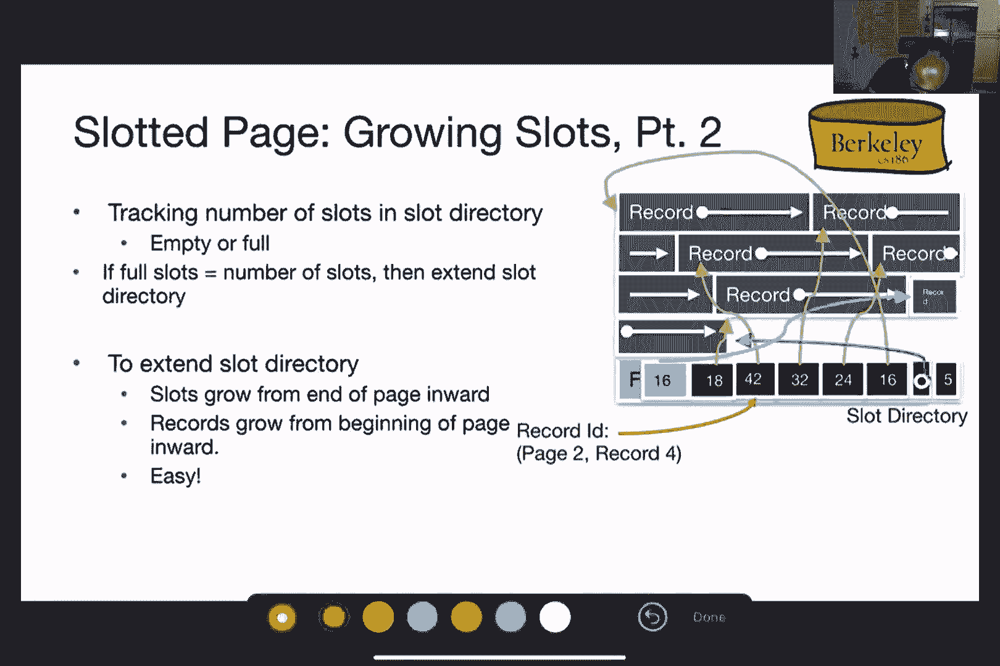

好的。

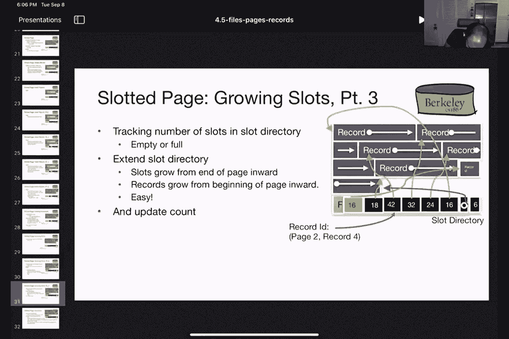

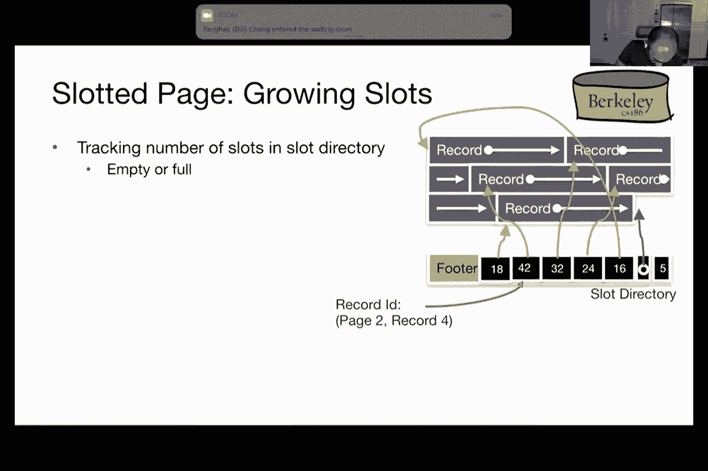

对不起，我不想走这一步。

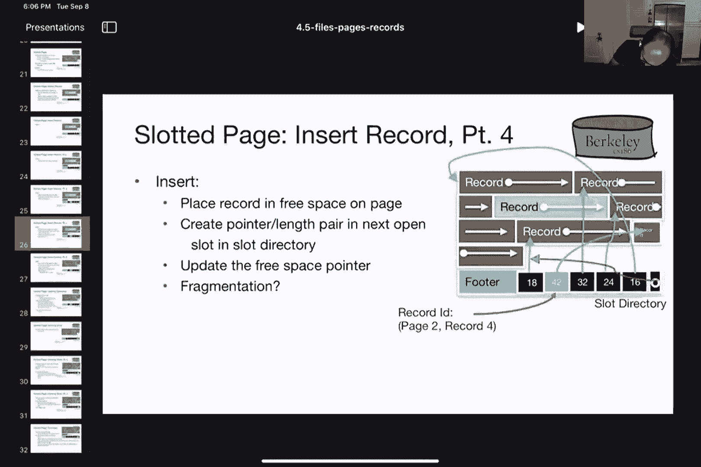

好的。好的，那么我需要更新蓝色箭头，之前是我的自由空间起始指针，现在它需要指向我刚刚添加的这条新记录的末尾。所以这就是为什么我需要更新这个自由空间指针。正如我之前提到的，对于这个刚填充的槽，我需要提供指向该记录开始位置的指针，并填写该记录的长度。

现在一个问题是，如果你删除了一些记录，同时你不断地在末尾添加记录。基本上在自由空间的开始处，你可能会有很多之前已被删除的记录，它们仍然占用着该页面上的空间。那么我们该如何处理这个问题呢？这是一个碎片化问题。解决这个碎片化问题的一种方法是基本上识别页面上的数据。

对，你基本上是把这个占据了该空间的记录移动到这个位置。如果那个位置有空间的话。如果我把这个记录移动到那个位置，我需要更新槽位目录中该记录的指针，并更新空闲空间的起始位置。好，这就是我如何移动这个记录并基本上解决碎片化问题的方法。

现在，这种移动实际上是安全的，因为它只会影响这个特定的槽位。它只影响这个槽位。任何其他槽位都没问题，因为记录的ID至少在外部是引用页面号和槽位的，而槽位并没有改变。因此，这不会影响任何外部文件。

那么现在有一个问题是我应该什么时候进行重新组织？对吧？一种选择是我在每次删除时进行重新组织和基本的碎片整理。或者，我可以等到碎片化严重到无法再添加其他记录时再进行重新组织。因此，通常这种懒散的方法是首选。

尤其是当页面没有太多新记录时。因此，这种懒惰的方法——只在绝对需要时才进行操作——通常是首选的。这样做比在每次删除时进行重新组织要好，因为后者非常激进，且通常没有必要，尤其是当页面没有更多记录时。那么，如果我们有时需要更多槽位呢？当你尝试插入一条记录，而你只有五个槽位时，我们该如何添加这些新的槽位呢？我们来讨论一下。

为了跟踪这些槽位，我们需要在页脚中添加额外的元数据。第一项信息是我们可以在槽位目录中存储槽位的数量。在这里，我们存储了五，因为有五个槽位。我们还能够根据槽位的数量以及每个槽位中存储的内容，判断它们是空的还是满的。

对。如果所有槽位基本上都被填满，也就是说每个槽位都已满，且你需要添加更多内容时，你就扩展槽位目录。对吧？所以在这种情况下，我决定扩展槽位目录，因为我添加了一个额外的记录。我原本有五个槽位，现在想再添加一个。所以我又添加了一个额外的记录。再一次，像往常一样。

我指向记录的开始位置，然后我编码记录的字节数，例如16字节。所以这些信息存储在我的槽位目录中。我更新了空闲空间指针的起始位置，因此所有这些都已经更新。最后我需要更新的是槽位数量信息，我可以更新它并增加六。

所以，要扩展插槽目录其实很简单。插槽从页面的末端向内增长，而记录从页面的开头向内增长。一旦它们在中间相遇，就意味着你不能再往页面中添加任何信息了。所以，记录向下增长，插槽向上增长，允许它们都能有一定的扩展空间。对吧？

所以，如果插槽比记录多得多，或者记录比较小，那么插槽目录无法获得更多的空间。如果记录相对较大，并且记录数量较多，那么记录就会占据更多的空间。基本上，你有两个方向的增长，这样可以让你在记录方面和插槽方面都能有一定的扩展空间。

好的，有个问题。是的，重新来过，问问题时要问对。我的问题是关于我们之前提到的如何识别插槽的。所以，当我们在做类似固定镜头插槽的事情时，如果某个插槽是空的，我们如何跟踪哪些插槽是空的？是通过一个大地图吗？或者是什么呢？嗯，你可以，例如，使用位图来编码哪些插槽是空的，或者另一种稍微粗糙一点的方法是直接检查该插槽的指针，查看插槽的指针现在是什么。如果插槽的指针现在是空的，那么你就可以确定该插槽是空的。

对，所以位图方法是一个完全可行的方法，正如你所说的，或者你也可以直接遍历插槽列表进行检查。好的，谢谢。那么，很多这些策略的权衡和成本效益似乎都与内存分配器非常相似。你认为这是否像在页面上分配记录与在内存页面上分配大量内存之间的差异？还是这个说法忽略了一些在这两种情况下不同的权衡呢？

我认为这是一个公平的说法，而且它是有道理的。其实这并不奇怪，因为在某种意义上，数据库页面的一个显著特点是，我们在磁盘上使用的布局与内存中的布局是相同的。对吧？因此，相同的信息在内存中的编码方式与在磁盘上的编码方式是一样的。所以，从某种意义上来说，相同的考虑因素也适用。所以，考虑内存分配的方式在这里非常适用，因为我们无论是在内存中还是在磁盘中，都是以相同的方式处理这些信息。

这样做的好处是我们不需要支付任何序列化和反序列化的成本，正如我稍后提到的，信息在磁盘上的编码方式与在内存中的编码方式是分开的。所以，正如我所说，把页面看作一个共同的单元，并且在内存中就像在磁盘上一样处理它，这是一种相当贴切的隐喻。

就像你提到的，正因为如此，在内存中页面的处理方式就像它们在磁盘中一样，所以内存分配器也类似。这是一个合理的比较点，因为碎片化、碎片整理以及垃圾回收等问题都适用。

太好了，谢谢！Felix，还有其他问题吗？在这个模型中还有其他问题吗？因为我们只是做了一个假设，就像我们假设页脚只包含插槽目录、自由堆栈指针和插槽目录计数器，因为在图片中它看起来像是覆盖了某些东西。

就像是没有敏感数据被放在这些插槽的左边。然后我没有跟上。你能再重复一遍吗？哦，所以在这个模型中，我们页脚里唯一的东西是插槽目录、插槽的自由堆栈指针和插槽目录计数器。因为就像在图片中你可以看到，它有点像是向左移动了。

那我们没问题吧，是否还有敏感数据留下来？所以，我的意思是，事情是这样的，我并没有指定我的记录和页脚从哪里开始，而这是这种方案的一个优点。所以这些都会自动捕捉到。我不需要为记录预分配这么多空间，只需为页脚预分配一定的空间。然后，随着我们添加或删除记录，这个空间会动态增长。所以，这就是这个方案的特点。

所以没有预先分配的区域，我会说这就是页脚，所以没有任何东西。尽管在我的图片中看起来像是16覆盖了某些东西，但实际上并没有这样的事情。我的意思是，16是在一个之前是空闲的区域分配的，否则它就不会被分配，否则如果没有空间，你也不会在这里添加额外的记录。所以我会这样理解这个问题，这样理解对吗？嗯，明白了，这帮助很大。

我想这与我的问题是相关的。是不是有什么，我们需要做的事情，比如说，处理页脚空间不足的情况，或者在插槽中的记录空间不足时？我们是否有任何类似的预期？所以，我们会确保页脚永远不会与记录冲突，因此我们永远不会在存在这种冲突风险的情况下插入记录。

如果我们遇到一个想插入记录的情况，页面上没有剩余的空闲空间，我们可能会根据空指针的数量考虑重新组织页面，也就是基本上进行页面碎片整理。所以，确保所有的空闲空间都位于记录列表的末尾，而不是中间。

另外，如果我们有一堆非常小的记录，我们填满了页脚的空间。那页脚能扩展吗？是的，这将是一个非常特殊的情况，因为很少有记录会小到让页脚比记录还要大，但当然，页脚是可以扩展的。对，页脚可以并且会扩展，随着新记录的加入，你会发现为记录分配的区域和为页脚分配的区域都会扩展。

因为你在添加额外的槽位和记录，它们都会扩展。对，谢谢。那么，我想我应该继续，因为时间不多了。好吧，这是我想说的关于槽位扩展的内容。我想我已经讲过这个了。所以，这是关于有槽位页面的总结。就是这样。

这个概念被称为有槽位的页面，因为页面中有槽位。有槽位的页面非常好。它确实是处理变长记录的一个不错的折衷方案，同样也适用于固定长度记录。这是因为固定长度记录通常包含空字段。如果你有空字段，这些空值可以通过标志来表示，从而避免存储整个属性长度。

如果你有一个整数，但它可能为空，你可能想对其进行压缩，使用一个标志存储它，而不是存储整个数据，这样无论它是否为空，都占用相同的存储空间。如果你只有非空字段，那么这种固定长度格式就可以节省存储空间，不需要指针等额外开销，因为位图方法在这种特殊情况下通常更为高效。

好的，我们从文件讲到页面。我们讨论了页面和页面内的记录。现在让我们来谈谈记录是怎样的。每个表或关系中的记录都有一组固定的类型组合。这是由模式决定的。正如我之前也提到的，关系型数据库在磁盘或内存中的数据使用相同的页面格式。这是因为你想节省转换的成本——即序列化和反序列化的成本，不想支付将内存中的对象转换到磁盘上的成本。

我想在这里提到的另一点是，系统目录（数据库系统目录）存储着模式，因此它存储着每个关系的类型组合。这样，你就可以避免将类型信息与记录一起存储，从而节省空间。

所以你不需要编码记录的类型信息，你可以将类型信息单独存储，等你完成后再存储。这个系统目录在大多数数据库系统中通常是另外一个表。如果你有兴趣，我们可以分享这些表的名称，我相信在 SQLite 中它叫做 SQLite Master。那么我们对编码这种记录格式的目标是什么？我们的目标首先是快速访问字段。

那么为什么我们要快速访问字段呢？通常你并不关心整个记录，你只关心记录中的某些组件。所以，如果你说选择 GPA 从学生表中，你只关心 GPA，而不是其他内容。因此，你希望能够快速访问这些字段。第二个目标是，你希望记录尽可能紧凑，以便你可以在一页中存储更多的记录，并在文件中存储更多的页。所以我们讨论了两种情况：固定长度和可变长度，固定长度的情况很简单。

所以这是一个很好的开始。如果你有一个固定长度的记录。例如，假设一个整数，一个双精度浮点数，一个布尔值，另一个整数和一个长度为 7 的字符。即使是 I feel 也很简单，我们可以直接做算术运算，然后你可以获取 I feel。所以，例如，如果我想获取这个布尔值，我可以跳过前 12 个字节，然后获取到这个值。

所以在某些情况下，我可以使它更紧凑。如果所有字段都不为空，我就无法进行压缩；如果字段允许为空，那么我就必须应用可变长度方案。字段允许为空时，本质上就像可变长度一样。接下来我们讨论可变长度方案。好吧。

那么如果字段是可变长度的，会发生什么呢？除了你的字符型和整数型，你还可能有一个 bar 字符串。这是我们编码可变长度字符串的一种方式。所以一种方法是通过填充来存储它，也就是说，你基本上存储这个 Bob，并填充它，使其占据某个预定长度的字符串，比如说 20。

然后，这条大街（假设是 Bob 的地址）被扩展到了长度 18。所以你已经预先确定了 20 和 18 作为这两个字符串的长度截断值。现在，这种做法的缺点是非常直接的。首先，你必须首先考虑到可能的最大字符串，其他字符串可能不会那么长，因此这会导致浪费。

或者你可能更加保守，或者更为激进，但你最终会在遇到更大的字符串时不得不重新安排数据，因此这将变得低效。所以这种填充的方法并不是一个很好的方案。你可能考虑的另一种方法是使用逗号，或者其他分隔符来分隔这些字段。这样做的缺点是，确定一个字段的结束位置和另一个字段的起始位置变得更加困难。

所以，如果你想查找，我觉得这会更加困难。而且有时确保逗号不是字符串的一部分也很困难，如果逗号是字符串的一部分，你需要找到一种方法来转义它们，这会更加麻烦。那么我们如何处理可变长度记录呢？我们将采用的方法是每条记录一个头部。所以记录头将指向这些可变长度字段的开始或结束，在这种情况下是结束。

在这里，你有一个指针指向第一个可变长度字段的末尾。这里你有一个指针指向第二个可变长度字段的末尾。通过利用固定长度字段后跟可变长度字段的事实，你可以准确知道每个可变长度字段的开始和结束位置。这个可变长度字段的开始和结束你知道，因为你知道固定长度部分的长度，并且知道这些字符串和所有可变长度字段的结束位置。

这是我们将采用的方案，即记录头方案。这个记录头方案使得访问字段变得更加简便，几乎是你能期望的最紧凑形式。可以预期，头部到固定长度字段的编码方式与可变长度字段一样，只是需要在这些指针中加入一些额外的信息。同样的方法也可以用于压缩包含多个空值的固定长度空字段。

所以，即使在考虑固定长度字段时，如果你现在允许它们，它们实际上最终会变成类似于可变长度字段的形式，因此你可以使用压缩方法来处理它们。下面是我们用于表示信息的方案概述。给定一个关系，这些关系被编码到一个文件中，这些文件代表磁盘上的一个或多个文件。

每个文件包含多个页面。一个给定的记录使用这种编码格式表示，包括记录头和固定长度及可变长度字段。头部允许你指向这些字段的结尾。然后，将这两者结合起来就是插槽页的概念，基本上是编码一个页面级别的头部，该头部编码了记录在页面中的位置。

而我在这里没有展示的一件事是页面目录。那是另一种元数据，编码了有关哪些页面有空闲空间的信息。所以总体而言，这就是表示部分的总结。我喜欢将其看作是在每年提取时的方式。

有一个头部的概念，也有一个细节的概念。如果你以这种方式考虑它，就会更容易理解。所以，正如我所说，一个数据库文件包含页面，而这些页面内包含记录，我们谈论了这些堆文件（heap files）用于无序记录。并且你有页面目录，可以高效地定位这些页面。页面布局。

我们讨论了固定长度方法，包括压缩格式和解压格式。对于可变长度，我们只讨论了使用起始页和在页面满时进行页面内部重组的解压方法。例如，我们还讨论了记录格式，允许访问字段并处理空值。到目前为止，有什么问题吗？

伊恩。是的，所以在我们讨论可变长度记录格式的每一张幻灯片上，你提到我们可以使用分隔符存储数据，比如逗号，但这不是一种好方法。你能详细说明一下如何使用逗号吗？因为这对我来说没有意义。好的，假设这样吧。

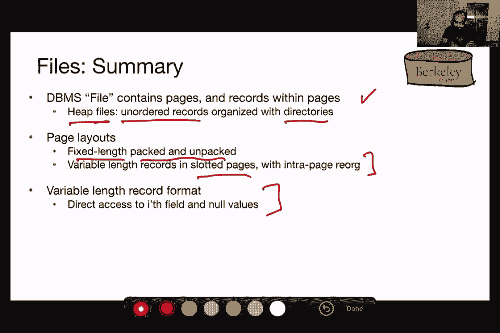

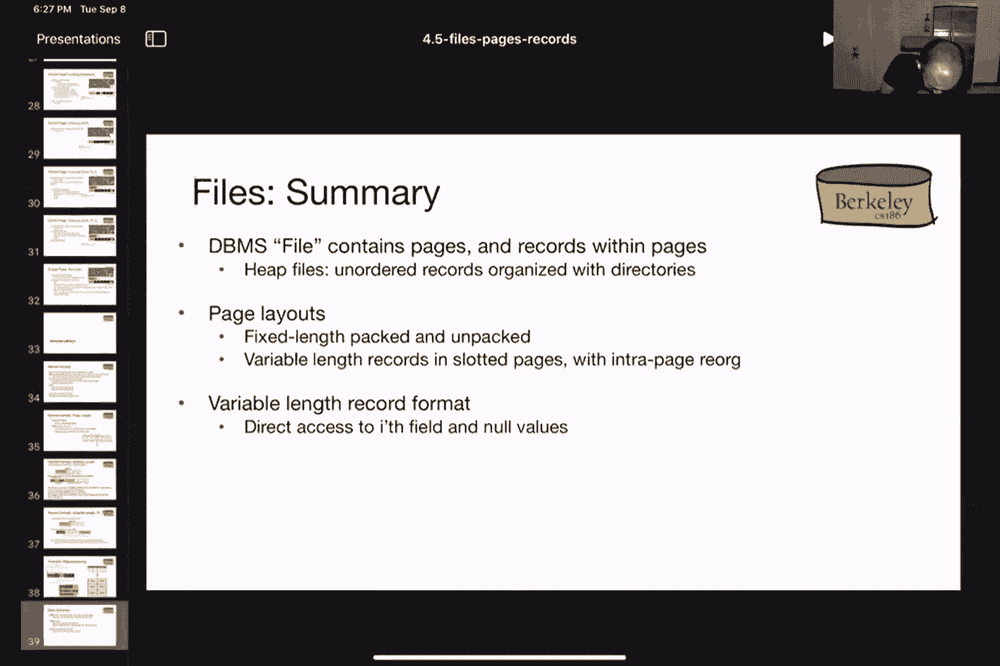

好的。所以在这里，你可以比如说，把它表示为“Bob，逗号，大街”，然后如果你想更明确地标示这是字符串的开始，你可以用引号包围它。然后你可以做“M 329，703”之类的。对，所以你确实需要有办法区分这个逗号和那个逗号。

这个逗号是分隔符，而这个逗号是字符串的一部分。所以一种做法是用引号来转义这些字符串，之前写的已经丢失了。对，当然还有其他方式，但基本上你需要确保有一种独特的方式来读取记录。

这种方法的缺点是显而易见的，如果我有“Bob，逗号，大街”，逗号什么什么，我就不知道在哪个位置开始查找第二个字段。对吧。所以基本上，在这种字节表示中，我不知道从哪里开始读取，然后我需要读取这么多字节才能得到第二个字段，所以在这种表示方式下很难做到这一点。

所以使用逗号时，我们仍然需要扫描整个场景。是的，你仍然需要扫描整个内容，或者你需要找到一种其他方法来编码每个字段的位置，这最终看起来像是一个头部。对吧，届时你可以直接使用头部，不再需要分隔符。好的，谢谢，路易斯。路易斯，如果你想提问的话，你还没有解除静音。

我觉得我们可能不该开始下一个话题。如果你们还有问题，欢迎留下来。感谢大家的到场。谢谢大家，星期四见。[沉默]。

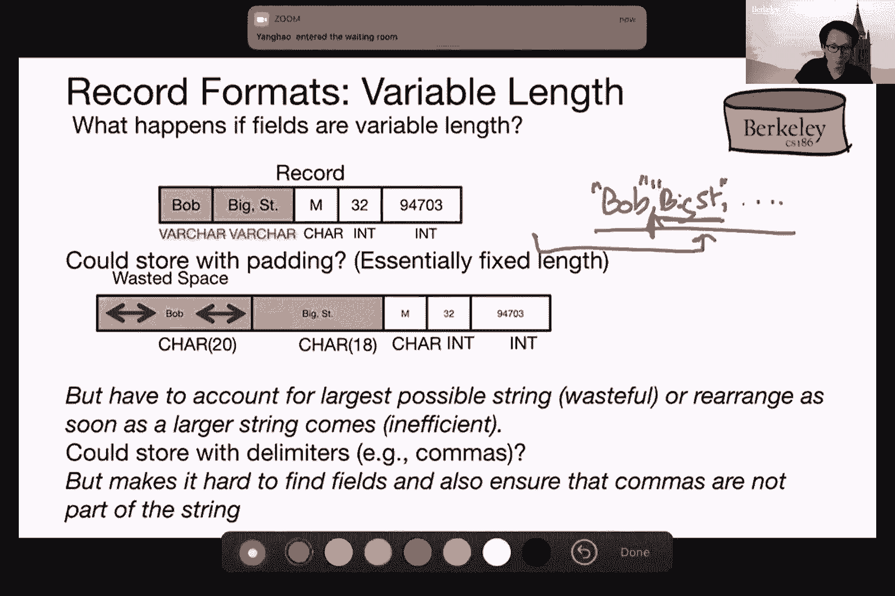
