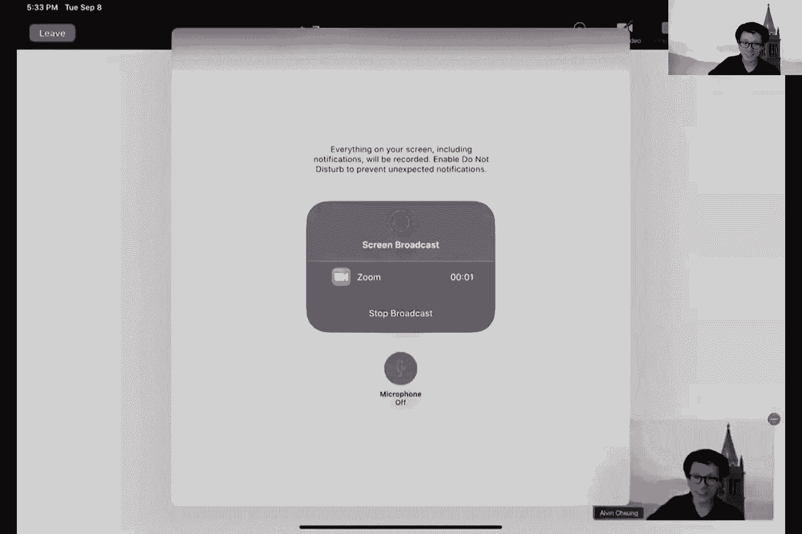
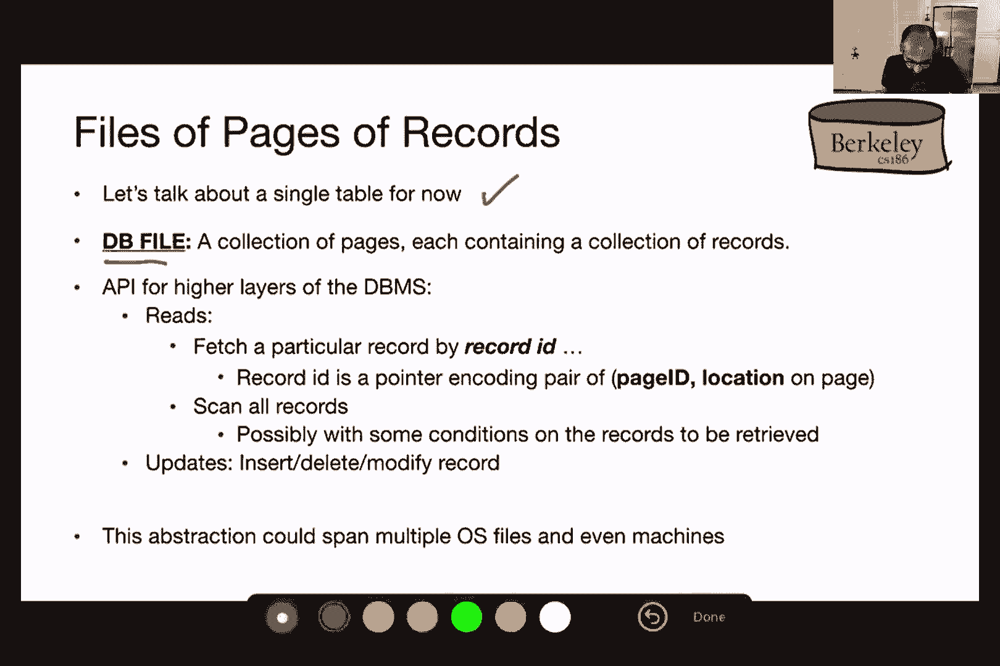
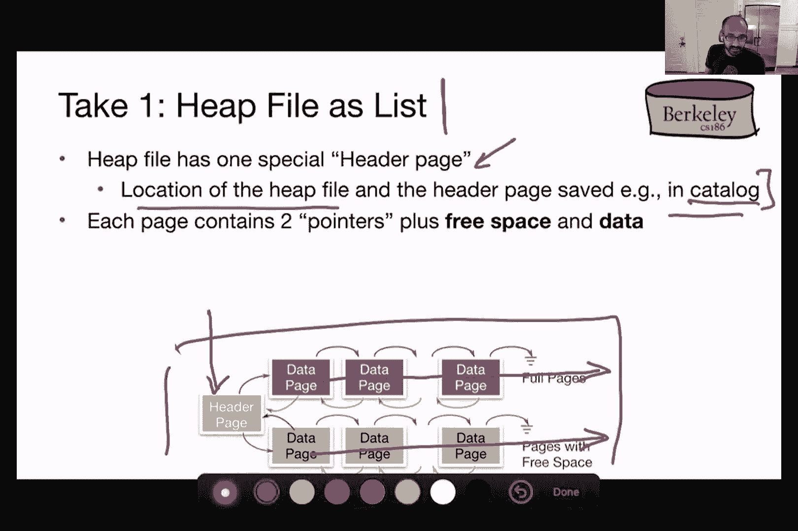
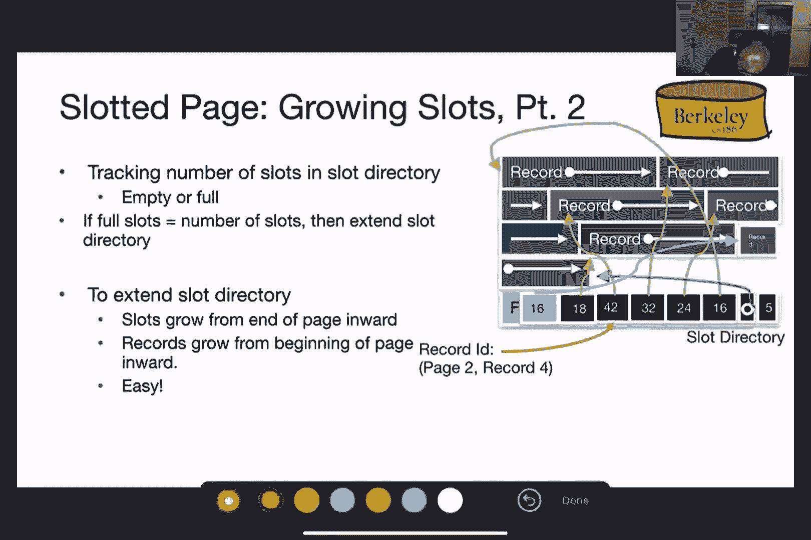
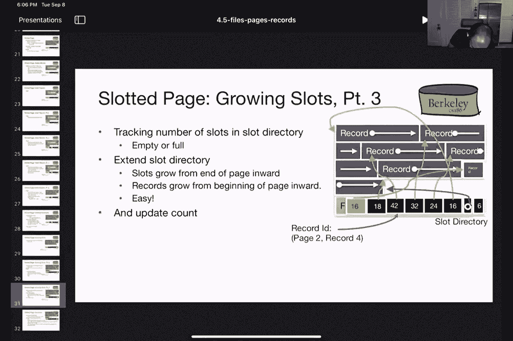
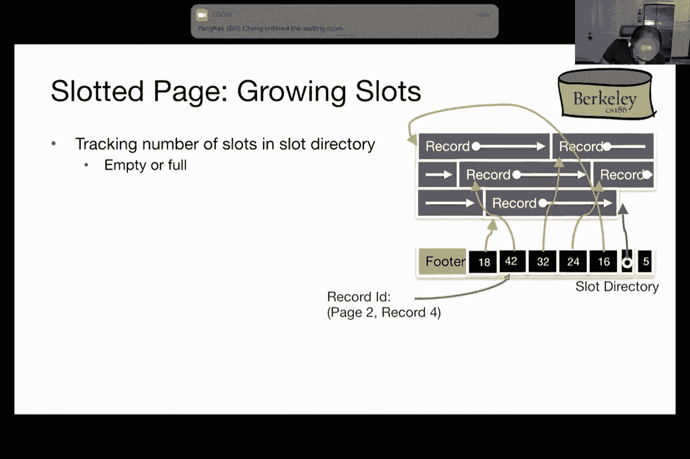

# 数据库系统原理 P4：磁盘、缓冲区与文件 I（续）& II 🗂️

在本节课中，我们将继续学习数据库管理系统（DBMS）的底层存储组件。我们将从磁盘技术的基本原理开始，逐步深入到数据在磁盘和内存中的组织方式，包括文件结构、页面布局和记录格式。通过本节课，你将理解DBMS如何高效地管理数据存储与访问。

***

## 公告与回顾 📢

首先是一些课程公告。第二次作业将在本次讲座结束后发布，截止时间为下周四。第一个项目将在本周四截止。项目答疑与交流活动将在今晚太平洋时间7点到9点进行。这是一个鼓励合作与寻找项目伙伴的新尝试，欢迎大家参与并提供反馈。

每周初会发布公告，请大家留意截止日期和重要事项。

现在，回到课程内容。上周我们讨论了DBMS的分层架构，从解析查询开始，一直到管理存储数据的磁盘缓冲区。我们是从最底层的组件——磁盘开始讲起的。

***

## 存储层次结构与磁盘基础 💽

上一讲我们介绍了你可能已经熟悉的存储层次结构。数据检索速度最快的是CPU寄存器，最慢的则是传统的机械磁盘写入。检索时间的差异巨大，从5纳秒到20毫秒不等。不同层次之间的时间差非常显著。

磁盘由盘片和磁臂组件构成。盘片旋转，磁臂上的磁头负责读写数据。磁盘表面被划分为同心圆，称为磁道；磁道进一步划分为**扇区**，是读写的基本单位。

读取数据的过程可以类比黑胶唱片：
1.  **寻道时间**：移动磁臂到目标磁道。
2.  **旋转延迟**：等待盘片旋转，使目标扇区到达磁头下方。
3.  **传输时间**：实际读取或写入数据。

寻道时间和旋转延迟是主要的性能开销，我们需要尽量减少它们。

***





## 固态硬盘（SSD）简介 ⚡

固态硬盘（SSD）使用闪存技术，其组织方式与机械硬盘（HDD）不同。数据存储在单元格中，可以进行随机读写，无需移动机械部件，因此没有寻道时间和旋转延迟。




然而，SSD的写入有其特点：
*   每个存储单元的擦写次数有限（通常约3000次）。
*   写入前需要先擦除单元格。
*   为了均衡磨损、延长寿命，SSD控制器会动态地将数据写入不同的物理单元（磨损均衡）。这使得写入延迟不像读取那样完全可预测。

对于本课程，你只需记住：SSD的随机读写很快，但写入延迟可能因磨损均衡机制而变得不那么可预测。

***

## 存储空间管理策略 🧠




鉴于顺序读写通常比随机读写更快（对HDD和SSD均适用），DBMS采用以下策略优化性能：
*   **预取**：预测并提前加载可能被访问的数据。
*   **缓存**：将频繁访问的数据保留在内存中。
*   **缓冲写入**：将多个写入操作收集起来，然后一次性顺序写入磁盘。

为了统一讨论不同的存储技术，我们引入两个通用术语：
*   **块**：磁盘与内存之间数据传输的基本单位。大小因技术而异（例如4KB或64KB）。
*   **页面**：在本课程中，**页面**与**块**是同义词，都指代这个基本传输单位。需要注意，有些资料中“页面”特指内存单位。

***

## 磁盘空间管理器 🗃️

磁盘空间管理器负责将数据库页面映射到磁盘上的物理位置。它向上层提供简单的页面读写接口。

一个典型的API使用模式如下，它假设顺序访问页面是高效的：
```python
page = get_first_page(“sailors”) # 获取表的第一个页面
while page is not None:
    process(page)                # 处理页面数据
    page = get_next_page()       # 获取下一个页面
```

实现磁盘空间管理器有两种主要思路：
1.  **直接管理设备**：为特定存储设备编写专属驱动程序。性能可能最优，但缺乏通用性，难以维护和扩展。
2.  **利用操作系统文件**：向操作系统申请一个大的、连续的文件空间，然后在此文件内部自行管理页面分配和读写。这样可以从设备细节中抽象出来，是更常见的做法。

***

## 数据库文件与堆文件结构 📄

从数据库的角度看，数据以关系（表）的形式组织。一个关系可能存储在一个或多个操作系统文件中。我们首先关注单个文件。

一个数据库文件包含一组页面，每个页面包含多条记录（即元组）。页面是DBMS各层之间交换数据的“通用货币”。

有多种组织文件的方式，我们首先介绍最简单的**无序堆文件**。它不强制记录在页面中或页面之间的任何顺序，只是记录的集合。

为了管理堆文件，我们需要跟踪文件中的所有页面以及每个页面中的空闲空间。一种实现方式是使用**页面目录**。目录本身是一个或多个特殊的页面，其中存储了指向各个数据页面的指针以及该页面的空闲空间大小。这样能快速定位有空间插入新记录的页面。

***

## 页面布局 📑








页面是存储记录的基本单元。页面通常包含一个**页头**（存储元数据，如记录数量、空闲空间信息）和实际的**记录数据区**。

页面布局的设计需考虑：
1.  **记录长度**：固定长度还是可变长度。
2.  **打包方式**：记录紧密排列（打包）还是允许空闲槽位（解包）。

### 固定长度记录的布局
*   **密集打包**：记录连续存放。通过 `记录起始位置 = 页头大小 + 记录大小 * (记录号-1)` 快速定位。但删除记录时需要移动后续记录以保持紧凑，会导致大量记录ID变更，影响外部引用。
*   **槽式页面（解包）**：为每条记录分配一个固定的“槽”（位置），并使用一个位图来标记槽是否被占用。插入时找到第一个空闲槽；删除时只需清除位图中的位。记录ID（页面号+槽号）稳定，无需重组。

### 可变长度记录的布局
对于可变长度记录，**槽式页面**方案同样有效且更优。页面布局如下：
*   **记录区**：从页面头部开始向后增长，存放实际记录数据。
*   **槽目录**：从页面尾部开始向前增长，每个槽项存储对应记录的**起始位置**和**长度**。
*   **页头**：包含空闲空间起始指针、槽目录计数器等。

**操作示例**：
*   **插入**：在记录区末尾的空闲空间存放新记录，在槽目录中找一个空闲槽项，填入记录的起始位置和长度，并更新空闲空间指针。
*   **删除**：只需清除对应槽项的内容（如将指针置空）。记录区空间不会立即回收。
*   **碎片整理**：当页面内碎片过多时，可以重新紧凑排列记录，并更新对应槽项的指针。由于外部只通过槽号引用记录，此操作是安全的。

这种方案平衡了灵活性（处理变长记录）、效率（稳定记录ID）和空间利用率。

***

## 记录格式 📝

记录由一组固定类型的字段构成。DBMS通常使磁盘和内存中的记录格式保持一致，以避免序列化/反序列化的开销。字段的类型信息存储在系统目录（另一组特殊的表）中，而非每条记录中。

记录格式的设计目标是：
1.  **快速访问字段**：支持只读取部分字段的查询。
2.  **紧凑存储**：节省空间，使每页能存放更多记录。

**固定长度记录**很简单，字段连续存放，通过偏移量直接访问。

**可变长度记录**（或允许为空的固定长度字段）采用**记录头**方案。在记录起始处有一个小的头，其中包含指向各个可变长度字段结束位置的指针。结合固定长度字段的已知长度，可以快速计算出任何字段的起始和结束位置。这是实现紧凑存储和快速字段访问的常用方法。

***

## 总结 🎯


本节课我们一起深入探讨了数据库的存储管理层：
1.  **存储硬件**：回顾了HDD和SSD的基本原理与性能特点。
2.  **管理策略**：了解了利用顺序I/O优势的预取、缓存和缓冲写入策略。
3.  **抽象与接口**：引入了“块/页面”作为通用单位，并介绍了磁盘空间管理器的API。
4.  **文件组织**：学习了以**堆文件**形式组织关系，并使用**页面目录**来高效管理页面。
5.  **页面布局**：详细分析了**槽式页面**结构，它如何优雅地处理固定长度和可变长度记录的插入、删除与碎片整理。
6.  **记录格式**：掌握了使用**记录头**来高效编码可变长度字段，实现快速访问和紧凑存储。


从磁盘到文件，再到页面和记录，我们看到了DBMS如何通过层层抽象和精心设计的数据结构，在复杂的硬件基础上构建出高效、可靠的数据存储服务。下一讲，我们将继续探讨缓冲区管理和索引结构。