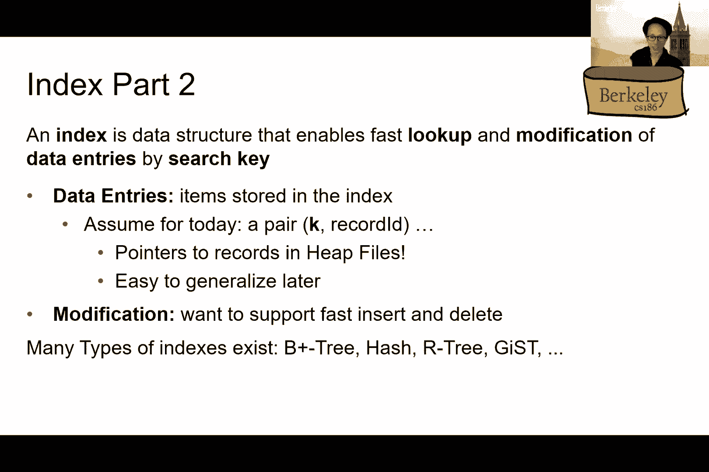
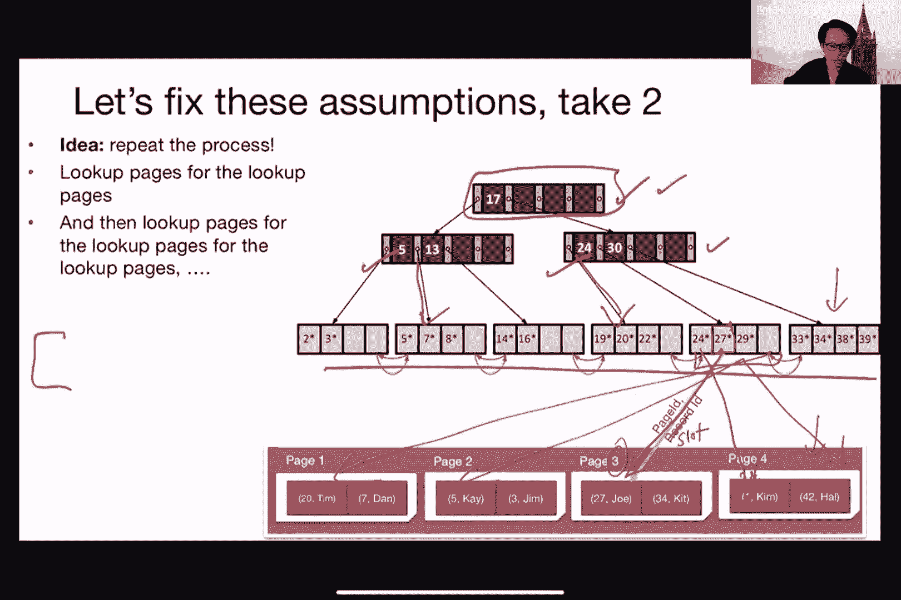

# P5：第五讲 成本模型和索引 + B+ 树 - ___main___ - BV1cL411t7Fz

说到186讲座。

今天我们将讨论成本模型和索引。在此之前，我希望大家继续使用聊天窗口，顺便提一下。我认为我们在聊天中收到了很多很棒的问题。如果你们甚至想在那里开些玩笑，我觉得那也很好。

只要这对这门课来说是合适的，那就没问题。所以，是的。我认为我们可能仍然会使用Piazza进行这次讲座，无论如何。没问题。我先考虑一下。我们很快会创建一个讨论帖。好吧，无论如何。是的，所以也可以随时在那里提问。我的意思是，或者我们可能会将你们移到那里去。

如果这个问题变成了最长的问题，确保我们不会丢失任何信息。如果你觉得舒服，请尽量开启视频。看到你们的面孔很好。而且也很高兴看到有人点头，似乎在希望——我们基本上希望你们能够理解材料。

所以我们可以得到一些视觉提示，那将是很棒的。当然，如果我们尝试开玩笑，那么最好有人能露出笑容，对吧，稍微笑一笑。所以很酷。好吧，那我们开始吧，对吧？让我们开始吧。所以下次Ditio基本上是在讲不同类型的文件组织方式，对吧？这就是我们的位置。所以早些时候。

我在上次讲座中提到过磁盘空间管理，之后我们也讨论了文件组织方式。所以回顾一下，对吧？上次我们讨论了如何在文件中组织元组的不同方法。其中一个例子是堆文件，基本上是一个无序的记录或元组集合。然后，就像你们记得的那样。

在磁盘讲座中，我们讨论过的这些设备，仅仅暴露了读和写，作为唯一的API，对吧？所以基本上，这就是我们将要使用的内容。那么，我为什么要提这两点呢？嗯，今天我们实际上想要问的问题是：成本是什么？成本是指当我们尝试做一些操作时的成本。

数据库，对吧？所以当我说“插入、删除或修改的成本，甚至仅仅通过特定ID或特定属性获取记录的成本”时，这就是我所说的意思，对吧？

我们还想看看当我们尝试扫描所有记录时，成本会是什么样子。为什么我们关心成本？嗯，首先，对吧？你们也记得上次讲座的内容。实际上有很多方法，我们可以用来存储文件中的元组，对吧？

人们还记得我们上次讲座除了最后提到的保持文件，我们实际上讲了什么吗？

这是一个小测验。不，我开玩笑的。有人吗？是的，某种文件类型，对吧？好的。所以这是其中的另一个，右？所以，你知道，这只是其他选项之一。所以除了保留文件之外，还有另一种文件类型。然后，像，今天以及下一讲，我们还将讨论聚簇文件和索引。

所以我们有这么多种存储数据的方式。那么我们试图弄清楚，像，知道什么是最好的方法，对吧？这是有意义的。

通常这会针对给定的查询工作负载进行优化。因为如果我们不知道会在这些不同类型的文件上执行什么样的查询或操作，那么我们真的很难比较它们每一个，对吧？所以在本课程的背景下。

我们总是会讨论，比如说，我们想做插入操作。比如说，我们想做，像，扫描所有记录之类的事情，对吧？

然后我们稍后会讨论，但我们如何获得那种工作流信息，对吧？或者我们怎么知道我们要运行，像，你知道的，扫描，和，像，你知道的，为什么不呢？比如说，找到一个特定的元组。所以从大体来看，对吧。在谈论成本时，我们基本上是想找到一种估算与之相关的成本的方式。

对于每种数据访问类型，再说一次，数据访问，在这种情况下。意味着从查找和插入单个记录，到删除或修改，甚至是基本上查找我们存储在文件中的不同类型数据之类的任何操作。好吧。

我们只想要大致的估算，对吧？因为在这种情况下。我们不是想深入到，像，你知道的，最精确的成本。对吧？我们不是在与，像，外部毫秒级别进行比较。我们实际上只是想得到一个简短的估算，比如。

我们可以用这个来决定我们应该使用哪种类型的文件，当我们尝试存储数据时。例如。那么，尽管如此，保持一些纪律性也是有意义的，对吧？

那么我们说的是什么意思呢？我们意思是，我们希望能够清楚地陈述我们事先希望做出的假设类型，然后尝试以一种系统化的方式来估算成本。实际上，这将为查询优化打下基础，而查询优化将在大约两周后，当我们讨论时进行。

如何在所有这些不同类型的文件和操作等情况下优化查询。然后，你知道，正如我所说的，对吧，我们需要一种方法，准备好在决定哪个最好之前进行比较。所以这是我们今天这堂课前半部分的重点。明白吗？举手。竖大拇指？是的？[听不清]，不？酷。好的。

那么现在我们来谈谈，像，稍微定量一些，对吧？

我们说的成本模型是什么意思？所以我们再次尝试对与这些数据操作相关的成本进行粗略估算。所以我们来稍微做点数学。我们将在这里定义三个不同的值。B代表文件中数据块的数量。

所以我们在上一节课已经讲过了块或页面的概念。然后我们将使用大写字母R来表示每个块中记录的数量。D则表示读取或写入磁盘块的平均时间。所以这些只是粗略估计，对吧？例如，如果我们要……

根据我们处理的文件类型，每个块的记录数可能不同，对吧？所以，现在我们只是把它作为一个大致的概览，或者说是计算成本的广泛方法估算。所以这张图是用来提醒你，对吧？所以现在我们要在这里用黑色表示每个文件。

然后每个文件基本上会有不同数量的块或页面。每个块基本上由记录组成，对吧？所以这是一个提醒。所以我们的目标是能够计算这些不同类型工作负载的平均情况。再次强调，工作负载，对吧？我们在谈论插入、删除操作。

修改、扫描或搜索特定记录。假设是什么？

所以现在我们完全忽略了顺序和随机IO之间的差异。所以忽略我在上节课说的内容，例如，哦，如果你是顺序读写，确实会有额外的好处。暂时抛开这个。我们也会完全忽略任何与缓存、预取等相关的内容。

所以我们假设每次都需要将数据从磁盘加载到内存中。没有缓存，我们不做记录，也不做预取操作。然后我们也会完全忽略与执行操作本身相关的成本，对吧？例如，如果我们想要……

获取某个特定的元组或记录，我们需要检查我们加载到内存中的内容是否符合我们的标准，对吧？所以这肯定会有成本，对吧？它不是免费的，对吧？所以，运行CPU计算确实需要时间。但现在，我们暂时完全忽略这一点。然后……

我们始终假设数据必须先加载到内存中，才能进行操作。所以我们不能直接在磁盘上操作数据。一切必须先加载到内存中才能操作。同样，这也意味着，如果我们做了修改，比如更新了某些内容，我们也需要之后将其写回磁盘。

这将是所有这些内容的一个趋势。我们声称，这已经足够好，能够展示不同类型文件的不同趋势。我们认为这对你们来说太简单了。我们会在课后重新审视这些假设，对吧？

然后我挑战你们，像你们知道的，试着去消除这些假设之一，然后做出我将在接下来的几张幻灯片中展示的计算，然后你会大致了解这将有多容易或多困难。好吧。所以关于我们正在处理的操作类型的更多假设。现在，我们只假设我们将插入一条记录。

或者每次都删除一条记录。所以如果我们插入一堆记录，我们会多次执行这个操作。你们会知道真相的。然后对于像，嗯，查找记录的操作，我们假设只有一条完全匹配的记录。所以你可能在查找，假设是，像，嗯，某个学生的记录。

ID等于某个值，对吧？或者你可能在找一个水手的记录，对吧？

我们说ID等于其他某个值。所以现在，我们只是假设只有一条记录会匹配，尽管实际上可能有多条记录。而对于堆文件，我们假设我们总是会将记录追加到末尾。这也是我们在上节课中讨论过的内容。对于排序文件也是如此。

我们总是假设我们会根据搜索关键字进行排序。可以把它想象成我们正在搜索的内容。比如SID，ID以及其他相关信息。正如我所说的，如果你想要更大的挑战，或者觉得这对你来说太简单，我是说，你知道的。

随时可以尝试放宽这些假设，然后我们将进行相关计算。然后你会看到，像，嗯，你会有更深的理解。而且还有很大的提示，对吧？这可能会出现在考试中。好吧，好吧。现在我们来看看这些操作，嗯？所以，像你知道的。

这只是我们接下来几张幻灯片中要展示的内容。所以堆文件，正如你们记得的，是无序的，对吧？所以现在，我们基本上看到了一堆不同的页面，然后像你知道的，现在我们假设记录只是数字。所以在堆文件的情况下，你会看到这是完全无序的，而在这种情况下则不一样。

由于我们只存储一个数字或者排序文件，我们就会根据那个特定的数字进行排序。所以。然后只是提醒一下，嗯？在这种情况下，我们有五个不同的块。每个块有两个记录，然后我们假设某个数字D，即读取和写入所需的时间。好。

所以这是我们想要填充的表格类型，你知道的。在接下来的15到20分钟内。好的。所以我们有两种不同的操作要做。然后我们想要计算在这些参数下，实际需要多少时间。哦，好的，第一个，这是一位女士。假设我们想扫描所有记录，对吧？

所以只是为了说明，对吧？第一个，当我们尝试浏览堆文件时，你基本上可以看到这里的红色条。我只是代表一个手指，对吧？

我们基本上是在扫描所有内容。然后对于排序文件，我们也在扫描所有内容。所以在这种情况下，你们觉得我们需要读取的这些数据块数量的成本是多少？好的，太棒了。

所以我看到你可以随意大喊，是吧？或者你也可以在聊天窗口里输入。所以我在说人们的死亡，很棒。就是说，像是，你知道的。我们基本上会浏览所有的内容，对吧？所以没有逃避的余地。我们要扫描所有内容。所以显然你需要阅读所有的块，对吧？没有逃避的余地。

所以我们基本上会读取数据块的数量。然后由于每个块都需要D，对吧，它们的平均读取时间，那么，总成本将是B乘以D。顺便说一下，我们这里只是将时间作为测量单位，作为所谓的成本，对吧？

所以如果你在 AWS 上运行这些操作，例如，我们可能更关心的是钱，对吧？你需要多少美元，以及如何执行这个操作，对吧？

但为了简化起见，我们现在只使用时间。到目前为止，有什么问题吗？

这是最简单的情况。好的。然后我们继续。那么现在假设我想做等值查找，对吧？好的。那么等值查找是什么呢？

所以假设我想找一个包含数字八的记录，对吧？

所以我希望我已经说服你们，这是我们要寻找的内容，对吧？

然后它是怎么工作的，我们试图读取文件中的最后一页，对吧？

然后有个学生，安基特说，能不能稍微慢一点？安基特，你想提问吗？是的，有什么不清楚的吗？很清楚。我只是需要把所有的内容写下来。哦，好吧。抱歉。好的。好的。那么回到这个，对吧？所以好的，我看到有人在问关于平均情况还是最坏情况的问题。

所以在这种情况下，我们实际上更关心的是平均情况。稍后你会明白为什么。好的，回到这个，对吧？所以我们想要获取一个包含数字八的记录。那么在堆文件的情况下我们该怎么做呢？我的意思是，我们只能扫描所有内容，对吧？没有别的办法。我的意思是，这是唯一的方式，我们基本上需要扫描它然后找到它。

现在我们来做一下平均K分析。首先，你们认为这里的最坏情况是什么？对吧？最坏情况是怎么样的？

当八号页面在最后时。对，当八号页面在最后时，对吧？

所以基本上，我们需要扫描所有内容。所以显然，成本就是B乘以D，对吧？

但实际上，这就是这里计算平均值的方法，对吧？因为在最坏的情况下，所有的内容都像是我们需要阅读的内容。所以没什么特别有趣的。那么这也回到我们为什么更关心平均情况的问题。那么，平均情况是什么呢？对吧？所以我们再引入一点数学。首先。

我将说P(I)是某个特定的键，或者说记录，出现在特定页面的概率。我们这里有B页，每一页都有同等的概率包含我们要找的记录。所以，所寻记录在某页的概率就是我们要找的内容在该页的概率。

页面编号I，比如说，它只是B的倒数，表示各个页面的概率相同。然后我们定义T(I)为我们实际需要触及或阅读的页面数，以便达到第I页。对于第一页，我们只需要读取一页就能到达。对于第二页，我们需要阅读两页。

对，因为我们总是从文件的最左边或开头开始。如果我们需要一直读到最后，我们就需要读取所有内容。那么这里的平均值是什么呢？平均值实际上就是一个期望值。你可能还记得你在数学课上学过，对吧？它就是将我们需要读取的页面数与记录相乘。

实际上，我们正在寻找的是第五页，对吧？最后一页。所以我们需要触及的页面数是五。

然后概率将是B的倒数，对吧？因为是1/5的概率，我猜。哦，这种情况，对吧。所以这就是概率。这个基本上给了我们其中的一个项。对吧，这是期望值。但接下来我们需要对所有可能的情况求和，因为我们要找的记录可能是第一页，也可能是第二页。

如此类推。所以这就是为什么我们需要从1加到B进行求和。我们记得，B是页面的数量。这样理解吗？好，如果你真正计算这个数学问题，T(I)就等于I。因为对于第五页，我们需要读取，嗯，我们需要。

需要翻阅5页。如果是10页，那我们就得翻阅10页。所以第一次应该不言自明，然后I over B就像是你在重复。我之前和你说过的这个数字。然后如果我计算没错，这个结果正是这个表达式。

工程近似值基本上是B除以2。所以这实际上符合我们的直觉，对吧，意思是，像你知道的，平均来说，我们基本上需要翻阅，大约是B除以2的页数，才能找到我们想要的记录。换句话说，像你知道的。

我们基本上需要翻阅文件的一半才能找到我们想要的东西。好吧，顺便说一下，如果你真想得到具体时间的话，我们基本上是通过把这个数字乘以D来计算的，不过我为了简化没有在这里展示。

所以这个B除以2的数字会一遍又一遍地出现，对吧，确保你理解这一点。对吧？所以你知道，重复一下，平均而言，我们基本上预计需要翻阅文件的一半才能找到我们想要的东西。好吧。那么我们来看看另一个例子。所以在这种情况下。

我们必须排序一个文件，这可能更复杂，对吧？

那么我们怎么找到数字8呢，对吧？

所以我们基本上从中间开始，因为我们可以使用二分查找，对吧？我是说，文件已经排好序了。所以你们还记得61 B吗？那个算法叫二分查找。所以我们不必从最左边开始。我们实际上可以从中间开始，抱歉，我们不需要从文件的最左边或开始处。

我们实际上可以从中间某个地方开始，因为我们将使用二分查找。提醒一下，二分查找的工作原理是，我们从中间开始，然后选择。我们要走哪个方向。在这种情况下，由于8比中间页要大，对吧？所以我们基本上会往右走。那么接下来的步骤是。

你会看到我们正在向右移动，对吧？

然后我们基本上会找到我们想要的那个，对吧？就这样。那么现在我们先弄清楚这里的最坏情况是什么。这里的最坏情况基本上是我们需要翻阅每一页才能找到我们想要的记录。然后从61 B开始，你记得吧，就像，你知道的。

我们需要的跳跃次数基本上是以B为底的对数。但那么，平均情况如何呢，对吧？这里的平均情况再次是，像，知道的，平均来说，我们预计翻阅多少页？它也是以B为底的对数，对吧？那么我们实际上尝试通过这个第一个图示来解释。

所以在这里，我已经用不同的颜色表示了每个记录，就像上一个页面一样，只是作为示范。你会注意到我们实际上现在有比上一页更多的记录，对吧？所以暂时不用担心这个，这只是为了说明。再一次，在二分查找的情况下，我们基本上是从中间的页面开始。所以在这种情况下。

蓝色页面在这里。然后我们基本上选择向左或向右跳，对吧？

右侧的所有内容，记录我们要找的。所以假设我们要向右跳。那么我们基本上就移动到青绿色页面，对吧？

因为我们从这里开始。所以范围基本上是右边的页面范围，页面值的范围。然后我们就选择基本上跳到那个整个范围的中间，对吧？

然后我们再进行一遍相同的过程，对吧？除非这基本上就是我们正在寻找的页面，通过现在尝试遍历其他页面来找到的页面，对吧？比如说，接下来我们要做的是右边的页面，然后我们也会跳到中间。现在我们跳到白色页面，例如，接着我们看看我们想要的记录是否实际上在白色页面上，对吧？

然后如果没有，我们再跳一次，对吧？在这种情况下，我们基本上是一路跳到叶子节点。所以现在我们基本上到达了黑色页面，假设我们从白色页面向左跳。希望这能成为一个提醒，对吧？

从61B开始，关于我们如何在页面块的数字上做二分查找。所以如果B是数据块的数量，那么我声称我们想要的页面的平均读取次数是这个庞大的表达式。所以你可能会问，发生了什么，对吧？让我来解释。所以再一次，对吧。

我们有B个数据块，我在页面上展示给你们。所以查找我们需要的记录，位于这些页面中的任何一个的可能性是一样的。因此，这就是为什么概率是1除以B。但成本呢？为了访问那个特定页面，我们需要的成本是多少？

所以不同于堆文件，对吧，它就像是，知道吗，它只是左侧的若干页面，对吧？所以在堆文件的情况下，一切都是无序的。我们只是从开始读第五个页面，那么成本就是五。但在这种情况下，不是的，对吧，因为我们现在在文件中跳来跳去。

所以以第一个页面为例，对于蓝色页面，成本就是一，对吧？因为我们只需要一个单独的页面，我们可以把它载入内存，然后我们就能检查，记录实际上位于哪里。但对于第二个，第二个页面呢？

那么这个青绿色的页面上，对吧，我们实际上需要经过多少步骤才能到达那个页面？

举手。你们觉得怎么样？或者打字告诉我？两个，对吧？

因为我们需要先去蓝色的页面，然后现在我们跳到青色的页面，对吧？

所以，我们需要经过的页面数实际上是两个。但请记住，这里实际上有两个青色的页面，对吧？所以我们可以跳到左边，或者我们可以跳到右边，对吧？从蓝色页面开始。所以因此，我们实际上到达我们想要的页面的概率是1除以B乘以2。

因为实际上有两个可能的页面，对吧？就是记录实际所在的地方。然后每一个都需要两个I/O操作，或者两个读取才能到达。所以这就是为什么我们将那个数字乘以2。所以这样向下走那一层，对吧？

所以下一个步骤，现在是关于白色页面的，白色页面，对吧？同样的思路。所以现在我们基本上会向下走三层，对吧？

我们需要读取蓝色页面、青色页面，然后一直读取到白色页面，这样我们就能到达那个页面，好吗？然后你可以从这个图像中数一下，对吧？

我们在这个文件中有四个不同的白色页面，对吧？因此，白色页面的期望值实际上是3，乘以I除以B再乘以4，对吧，因为我们有四种不同的可能性。然后同样的情况对于黑色页面。所以如果你对这种线性表示的图像感到困惑。

让我尝试以另一种方式绘制它，作为你们可能在61 B中见过的典型二叉树，对吧？所以对于蓝色页面的第一层，实际上成本是一个绿色页面。并且也到达，因为这是我们首先尝试的页面，对吧，位于文件的正中间。然后第二层的每个页面都需要两个I/O操作。

对，或者两次读取。首先必须经过蓝色页面，然后再去青色页面。然后同样的，针对这些其他的层级。那么大家还记得从61 B的内容吗？如果我们试图放入的总数是B，二叉树或二叉查找树预计会有多少层？

太棒了。是的，log以2为底的B，对吧，记得吗？即使在计算机科学中我知道我们只讨论二进制的东西，但有时对于那些不在这个领域的人，你基本上需要提醒他们，好吗？所以是log以2为底的B，对吧？

所以这是我们能够推导出的公式，用来计算在一个二进制排序文件中查找记录的平均总成本。所以我们将从第一层开始加总，一直到log以2为底的B，对吧，这基本上就是你预期的总层数，对吧？然后再一次。

我们将乘以每个层级所需的磁盘访问次数。在这种情况下是i，对吧？i就像是层次，对吧？所以如果这对于蓝色的一个是二，白色的一个是三，依此类推。那么我们要找的记录在某一层次的页面中的概率就是二的i减一次方除以b。

你可以算出数学公式，对吧？所以，你知道，对于第一个，蓝色页面这里，对吧？它就是一除以b。只有一个。但第二层次这里将是二除以b，正如我在前面的幻灯片上展示的，对吧，正是这里。所以这就像是，嗯，二的i减一次方除以b。

我不会让你们厌烦这些数学内容，所以你们可以基本上看一下这个。然后最终我们将得到像这样的表达式。然后，再次提醒，对吧，工程近似告诉我们我们可以忽略这个项，对吧。因为b减一除以b就像，嗯，1。

然后通过另一个近似，你基本可以把这个看作是，嗯，类似于以2为底的对数b。对吧？所以我再次强调，我没有展示实际读取操作所需的时间，对吧？然后，如果你想要完整的时间公式，对吧，我们基本上只需要把这个乘以b。所以在前一页，我会给你展示这个网格的数字，对吧。

如你所见，这里。它大约是以b为底的对数。所以我们已经可以看到差异了，对吧，堆文件和排序文件之间有区别，记住这一点，对吧？

所以现在我们基本上要看到这两种文件之间的区别，这将基本上帮助我们决定何时使用哪种类型。好的。接下来我们来看下一个。那么我们有范围搜索。范围搜索是什么意思呢？举个例子，假设我们要找到所有介于七和九之间的记录。那么对于堆文件，还是一样的。

对， 我说我们总是需要扫描所有内容。有人能告诉我们为什么吗？

有人吗？是的，然后抱歉，Carlos，没错。是的，基本上人们说的，他们是无序的。我们不知道顺序是什么，所以我们需要遍历所有的记录才能找到。没错，正是这样。我们不知道顺序，对吧？所以我要找到七到九之间的所有记录。所以仅仅在找到七之后停下来是不够的，对吧？或者像，嗯。

我们在找到10之后，对吧，因为你怎么知道某个值是否存在于我的范围内呢？这个值是否实际存在呢？对，这个问题。好的，所以我们不能实际做到这一点。我们总是需要扫描所有的内容。然后，怎么样呢，排序文件呢？

同样的问题。所以我们就不做了。那么我们到底该如何做呢？

有人有建议如何在堆文件中实际执行此操作吗？

我知道我们可以扫描所有的内容。是的。但是，嗯，像这样，让我们尝试一个更聪明的思路，对吧？

所以，你知道的，我们还可以做些什么呢？或者我们可以做些什么更好的方法来查找它？

是的，对吧？所以我们可以找到第一个，然后找到最后一个，对吧？是的。所以我们可以。实际上，这里还有另一种提议，对吧？就像，你知道的，你可以进行两次二分查找。是的。或者你也可以像这样做，对吧？

所以首先找到起始点，然后扫描其余的部分，对吧？

因为这个东西是有序的，对吧？所以我们实际上不需要再进行二分查找，因为我们已经找到了起始点，对吧？在这种情况下，七，然后我们只需要扫描到右边，直到文件的末尾，或者直到你知道的，我们实际想停下的地方，对吧？在这种情况下，是九。所以我们基本上就像这样，你知道的，在这里停下。例如，好吧。那意味着什么？

这基本上意味着我们只需要找到范围的开始，然后我们只需扫描右边直到停止。那么成本是多少呢？

所以你记得我有跟你们提过这个B除以二的数字，对吧？

所以B除以二就是我们预计需要扫描的页面数量，对吧？

为了像这样进行查找，对吧？所以在这种情况下，我们将在这里调用它。实际上，保持这个想法。那么在这种情况下，成本实际上只是进行二分查找以定位起始点，然后扫描右边的所有内容的成本，对吧？

然后，我就会挥挥手，说我们需要扫描到右边的页面数量是这个神奇的变量，叫做页面（pages）。所以它取决于你的范围实际结束的地方，对吧？所以如果你觉得可以的话，可以将其近似为B除以二。如果你认为，这在平均情况下是这样的，你知道的。

需要扫描的页面数量，或者如果你知道某个特定查询的页面数量，也可以使用更精确的方法。当你实际进行范围查找时。但在一般公式中，它只会是你知道的，所需的成本。

首先定位起始点，然后扫描所需的页面数量，直到我们到达终点。关于范围查找有问题吗？再说一次，你能看到这两者的区别，对吧？所以，你知道的，堆文件的成本基本上是常数。

这样计算所需的成本，与文件的大小相比，实际上可能已经更高效了。好吧，所以现在如果没有问题，那我们继续讲插入操作。所以我们也想在这两种不同类型的文件中插入。那么我们怎么做呢？对于堆文件，你知道的，记得上次讲座时提到过。

你可以在不同的位置插入，对吧？但是为了本课程的目的，为了简化事情，我们总是假设我们将插入到最后，或者最后一页。所以在这个假设下，插入堆文件的相关成本，我认为是。

就是说，它将是2乘以D。那么大家能否思考一下为什么这里有这个神奇的数字2呢？

为什么它不是D呢？我的意思是，你知道，我们不是把它直接加到文件末尾吗？对吧？是的。很好。好吧，所以它既是读取又是写入，对吧？因此，这实际上会对很多不同的操作造成巨大的影响。所以与之前只扫描或读取磁盘上的数据的操作不同，在这种情况下，我们实际上是在进行修改。所以记住。

我在讲座一开始说过，如果我们实际上进行了修改，光在主内存中是远远不够的。我们需要把它全部写回到磁盘。所以因此，在这种情况下，成本不仅仅是一次单独的页面读取。还包括之后的写入操作。

之后的写入操作。所以这就是为什么它会是2倍的D。D再次是指读取或写入单个页面到磁盘的平均时间。好吧。有问题吗？嗨，抱歉，你能再重复一遍吗？因为我没完全理解为什么是2。好的。是的，因为我们需要同时进行读取和写入，对吧？所以它将花费我们，嗯，你知道的。

一页，对吧，一次磁盘读取，读取最后一页，对吧？所以我们试图插入4.5，对吧？所以这将至少花费我们一次读取操作，读取那最后一页，将其放入内存中，对吧？然后我们还需要将其写回磁盘。所以这将再花费我们一次操作，再次进行磁盘操作，对吧？因此，总体的成本是。

这将涉及两页的页面数。好吧。也就是说，你的意思是我们需要同时写入内存和磁盘。所以我们需要两页。对，因为如果你只写入内存，之后如果关机怎么办，对吧？

好的，谢谢。是的。所以我们需要让它持久化。因此，我们需要将其写回文件。所以这就是为什么会是2。嗯。还有其他问题吗？好的。好的，谢谢，Kari。那么我们继续吧，对吧？

所以现在让我们来讨论如果我们尝试插入到一个排序文件会发生什么。思路一样，对吧？

所以基本上，现在我们要运行什么，嗯，应该在这种情况下运行什么呢？我们应该先做什么？

二分查找，对吧？我的意思是，嗯，不，嗯，我的意思是，这有点像主题，对吧？

所以这整个类，嗯，类似于文件二分查找，对吧？为什么？

因为我们想要找出记录到底放在哪里。我们想要保持排序，对吧？所以在这种情况下，我们不能只是把它附加到文件末尾，对吧？

因为那样会破坏排序文件。所以我们实际上想先进行二分查找。在这种情况下，它可以帮助我们确定我们实际上要插入记录的位置。所以从前几张幻灯片来看，你可能已经记得成本是。只是会是对数基数为2，再乘以B的。

然后我们得到与查找记录相关的实际时间。但这还不够，对吧？

因为我们实际上需要插入我们想要插入的记录。在这种情况下，4.5。然后将之后的所有内容写回，对吧？在这种情况下，“所有内容”是指，像你知道的那样，右侧的所有页面，直到最后，对吧？因为我们要进行移位。基本上是通过插入一个新的记录来移位，然后像这样。

你知道的，需要写回与此文件相关的其他所有后续页面。这样说清楚了吗？所以再重复一下，对吧？在这种情况下，我们从，知道的，5和6在一页上，7和8在另一页上，以此类推。我们要插入4.5。所以我们需要将它放到与5同一页上，对吧？因为我们想保持排序顺序。

我们不能在中间有间隙，除了在最末尾，对吧？在这种情况下，你会看到这里有一个间隙。但除此之外，我们需要基本上把它放到包含5的页面，然后将所有内容移到另一个页面，对吧？然后我们需要从6一直到10的内容。然后将所有内容写回磁盘，对吧？所以记住。

你总是需要将所有内容写回磁盘。对吧？

那么，与此相关的成本是什么呢？找记录。我已经告诉过你了，它将是对数基数2，乘以D，或者如果你关心时间的话。然后是插入，对吧？

移动文件的其余部分就只是，分成两部分，这样的话。我再次提到的是，我们需要触及的页面的平均数量，对吧？

从讲座的前部分。然后，你知道的，将它乘以D，并且还要乘以2。2是因为我们需要同时进行读写，就像之前的情况一样。所以因此，总成本将是这三者相乘的结果。

对于插入和移位。所以，它就是B乘以D。然后总成本将是这两项的总和。所以如果你算一下数学，它就是你在屏幕底部看到的这个数字。所以现在我们有了，知道的。

完善这个插入的过程，对吧？所以你可以看到，对于堆文件，它只是一个简单的，单一的读取和单一的写入，因为我们总是将内容追加到文件的末尾。而对于排序文件，我们实际上需要做更多的工作，对吧？

所以我们需要运行二分查找，然后还要移位操作。我们已经可以看到，这之间存在权衡，对吧？

并不是说排序文件总是优于堆文件，对吧？我的意思是，事实上，如果真是那样的话，那我们为什么还要教你们堆文件呢？所以我只是教你们，像你知道的，最优的解决方案，然后那样会成功。但实际上，在这种情况下，情况并非如此。所以我们基本上希望对这两种情况都进行分析。好的。

那删除呢，对吧？对于删除，情况类似。所以对于堆文件的情况，也只是像你知道的，扫描所有内容。因为我们需要找出它的位置。然后，像你知道的，删除记录并把数据写回去，对吧？

所以找到记录所花的平均时间，我从之前的幻灯片中提出的说法是。大约是以2为底的B，按读取次数的平均情况来算。最坏情况，当然，是全部。平均情况下，在这种情况下，应该是B除以2。然后我们从页面中删除记录，然后再把它写回去。

所以这就是为什么你会看到这里有一个数字，对吧？

所以我们读取所有内容直到找到它，然后我们把记录偷走，然后把那一页写回磁盘。至于排序文件，对吧？情况也类似。所以我们首先，再次运行二分查找来找出记录实际的位置，进行实际的删除，然后，像你知道的，写回其他所有页面，因为。

现在我们也需要将所有内容移位。所以二分查找的成本再次是以2为底的对数B，然后，像你知道的，我们现在还需要处理移位操作，并将其写回。这个问题。Carlos。我有点困惑为什么是加一。我知道你已经解释过了。

但如果你能解释一下。好的。是的。加一是因为我们需要将这个空页写回磁盘，对吧？所以我们丢弃了4.5，但然后我们需要把它记录到，像你知道的，文件里，对吧？我们在内存中删除它，这还不够。但我们需要把空页写回文件，以确保我们确实已经去除了它。谢谢。好的，没问题。是的。

所以这里基本上类似。我们首先需要找出它的位置，然后将所有内容移位。移位操作将会是，就像你知道的，乘以二，和插入时的情况相同。所以总成本再次是将这两个项加在一起，就像你在。

这张幻灯片上的内容将会是排序操作的相同内容，同时也适用于插入和删除操作，目的是类似的。是的，Carrie。Carlos，你有问题吗？没有，那个是之前的问题。嗨。所以我想知道，当你删除一个文件时，如果它正好在堆文件的中间，你是否需要...

我的意思是，当你删除堆文件中间的文件时，是否需要将它后面的文件移动到前面？因为你只是删除了堆文件中的一个文件？好的，暂时假设我们不会这么做，我们就直接把它留空一个空隙。你记住，下次课的时候这没问题，对吧？这没问题，对吧？对于堆文件来说，嗯。

对于这个问题，我们就假设你不需要将所有内容都移动。不过我声明，甚至即使我们将所有文件都移动，你应该现在已经知道如何进行这类分析了，对吧？好的，谢谢。嗯，好的，非常好。那么现在我们已经看到类似的情况了，你知道的，流畅的辉煌。

对这两种不同类型的文件进行各种操作。接下来的问题是，实际上我们能否做得比这里的运行时间估算更好？答案结果是肯定的。我的意思是，这就是我们为什么要谈论索引的原因之一。但是，在我们讨论实际的索引类型之前，我们先要介绍一下这个概念。

课程开始之前，我们先回顾一下索引到底是什么意思。其实这个概念并不陌生。我们在日常生活中其实都接触过这种类型的索引。所以你们当中有些人可能已经足够老了，知道像这样的东西。它基本上是一本我从网络上下载的黄页电话簿。

现在它绝对可以算作一种历史遗物，对吧？

但本质上，电话簿只是一个索引，对吧？它只是我们用来查找的方式，比如说，知道一个人的名字后，告诉我那个人的电话号码。所以，这是一种索引方式。你也可以在教科书的末尾看到类似的索引，比如说，它基本上是查找某个话题或作者的名字，然后告诉你该话题在哪一页。

你可以看到这样的索引——话题名称或者作者名称，然后基本上告诉你该话题所在的页码。

所以这些就是索引的类型，在数据库的情况也没有什么不同。但在数据库中，我们当然非常关注效率。所以，单纯拥有某种可以用来查找的东西是不够的。我们希望能够快速地进行查找。比如说，显然对于这个产品目录，你肯定不希望...

查阅整个索引，并找到你想要的东西，对吧？我的意思是，如果是这种情况，我的意思是，为什么要使用索引呢？我就是说，直接扫描所有内容就行了。所以显然，我们需要一种机制，既能让我们通过关键字查找东西，又能高效地做到这一点。所以我们实际上之前已经见过这个。

我们已经看过实际的不同类型的内存数据结构。例如，我们有不同类型的搜索树，我们有不同类型的哈希表，希望你能从你的 61B 经验中回忆起这些内容，对吧？但现在我们不谈论内存了，我们实际上是在谈论这些基础数据结构，对吧？

因为我们实际上是把东西存储在磁盘上。所以显然，如果我们想把索引存储在磁盘上，那么我们如何将像哈希表或二叉搜索树这样的结构存储到磁盘上，对吧？所以这基本上就是问题所在。再说一次，对吧？在这门课上，我们将其建模为页面。

所以基本上我们想要一种分页的数据结构来表示索引。而我们之前在 SQL 课程中谈到过这个，对吧？所以你记得我在课件中使用的那个水手表，对吧？

所以我们声明某些东西时，会使用主键。所以现在你知道了，对吧？

你知道这个主键，对吧？我们所说的主键是什么意思，对吧？

所以当我们谈论 SQL 时，我们是在谈论如何使用它来查找其余的记录，因为这应该是一个唯一标识符。在这种情况下，像水手 ID 就是一个唯一标识符。这很好。但是你知道的，接下来我们怎么存储这些数据？我们如何存储水手的数据，对吧？

因为我们要维护基于水手 ID 的索引。所以这就是我们接下来要讲的内容。所以正式来说，索引只是一个数据结构，我们可以用它来根据搜索键快速查找或修改内容。所以查找，我们已经在之前的幻灯片中看过不同的例子。

对吧？所以你知道，它可以通过等式来查找，对吧？

我正在查找 ID 等于 42 的水手。它可以通过几何区域来查找。我正在尝试查找当前在舞台上的所有火灾，对吧？比如给定一个纬度和经度。例如，你也可以像我们在主键的情况下讨论 SQL 时那样，使用搜索键，对吧？

我们用来查找的键实际上可以是任意列的组合。我只是从上一讲中提取了一些内容，对吧？在这里，你可以将名字和姓氏组合起来，形成一个搜索键。然后像你知道的那样。

我们要再次问的问题是，我们实际上希望如何存储与索引相关的数据，对吧？我的意思是，一种明显的选择是将索引与其余数据完全分开存储，但我们也许可以做得比这个更好。

所以我们将看看这些情况的需求会发生什么。那么今天，我们将假设现在我们需要存储你知道的，K，这就是我们要查找的键，不管它是什么。我们可以说，ID可以是名字、常见的姓氏的组合，然后是一些记录 ID。

然后我们就可以使用它，来查找实际的记录或与之相关的数据。例如，我们可以想象将索引完全存储在与实际数据完全分开的文件中。那么在这种情况下，索引就可以仅仅存储，比如你知道的，哪个记录号是我们需要查找的，和它实际所在的文件，对吧？

然后根据这些信息，我们现在可以去实际存放元组的文件，然后将该页面加载到磁盘上，接着继续进行查询处理。同样的，如何实际进行修改呢，对吧？再次强调，我们希望能够非常快速地进行插入和删除，不仅仅是在基础表中。

但是在索引中，对吧？因为每次当我们更新实际数据时，我们也需要修改相关的索引，对吧？否则，它们会不同步，然后出现问题。所以这些都是我们在这门课中要讨论的内容。正如我所说，数据结构的索引有很多种类型。

接下来我们将集中讲解 B+ 树，这是我们今年接下来的内容。但在这之前，我能回答其他问题吗？哦，大家都完全明白了吗？一次，真的？我们现在来个小测验吗？哦，有人在线问了问题。好，请重复一下问题。好，索引没有实际数据，对吧？

这是一个很好的问题，Billy。所以这取决于情况。实际上，这就是我们今天的讲座以及下周讲座要讨论的内容。简短的回答是，这取决于情况。它可以是任意一种。

好的，没有其他问题。我将停止共享，接下来让T I接管。稍等一下。所以要找到一根绳子。对了，Nicholas在问一个问题，比如，我们如何实际使用这个索引？所以正如我之前所说的，使用索引的一种方式是，假设索引存储一个键和记录号。

如果是这种情况，那么我们首先在索引中查找，然后，像你知道的那样，索引会返回记录号、页面和文件名，这些是我们实际想要查找的两条记录所在的地方。然后我们只需要使用我们之前讨论的算法来实际获取我们感兴趣的两条记录。但这是一种方法，但不是唯一的方法。

它取决于数据实际是存储在索引中还是不在索引中。现在我们在等待T设置好时，还有没有其他问题？好的，开始吧。你能看到我和听到我吗？好的。是的。对的。所以我们在讨论索引。接着Alvin给我们的讲解。正如Alvin所说。

索引是一类数据结构，它允许通过特定的键进行查找，同时也支持高效的修改。对吧？所以你需要能够通过键添加和删除记录，也能够通过键查找数据。对吧？所以你需要能够通过键来识别数据。好的。

所以我们先从一个简单的想法开始，看看为什么这个简单的想法会失败，然后我们会尝试讨论今天要讲的最终索引结构，即B+树索引。好的，所以我们从简单的输入堆文件开始。然后假设不使用索引，我只是对我的堆文件进行排序。

为了确保有空间可以添加潜在的新记录，我可以在每一页中留下些空余空间。对吧？所以我按照Alvin描述的方式对我的堆文件进行排序。排序后的文件。我可以按照这种顺序存储这些页面。

所以它基本上按照排序的顺序存储，允许我按顺序访问这些页面。好的，假设我做到了这一点。正如我们之前所描述的，正如Alvin通过数学所展示的，维护变得非常痛苦。对吧？所以随着新记录的添加或删除，这变得有问题。

这就导致了B次更新，其中B是最坏情况下的块总数。对吧？所以在最坏的情况下，你最终需要将所有内容往下移动或者往上移动。好的。然后我们也讨论了这个二分查找的步骤。对吧？所以假设你想查找某个特定的记录，你当然可以进行二分查找。

我们也做了类似的数学推导，表明这是B的对数，B是块的数量。如果你想计算时间，而不是读取的页面数量，可能还要乘上D。D是时间。如果你想计算时间，而不是读取的页面数量。现在，这种方法有两个缺点。对吧？

所以第一个缺点是这是一个二叉树的展开，这意味着它是一个非常深的树。对吧？所以这是一个深树，且有很多的IOS操作。第二个缺点是你在查找过程中实际上是读取整个记录才能读取键。对吧？所以你不是直接读取键，而是需要读取一整页，里面充满了记录，仅仅为了判断你是否在读正确的页面，是否应该往左走，或者应该往右走。

对吧。所以有大量冗余数据被读取。我们更希望这能够是 K 的对数，而不是 B 的对数，因为 K 是键的数量，而这个数可能远小于 B。对吧，因为 B 很可能非常大，因为通常不仅仅有键作为一部分。

你的记录中，还有很多其他属性。对吧？好的。那么让我们尝试修复这些假设。好的。假设我们做了第一个放宽条件，即我们不存储，正如 Alvin 所提到的，我们使用堆文件。因此，我们不以排序的方式存储记录。

我们保持原样，基本上我们有非常紧凑的键查找页面，并且我们将它们按顺序排列。好的。所以这些键查找页面基本上维持了一个键到记录 ID 的映射。这里应该是页面 ID，然后应该是槽 ID，而不是记录 ID。所以它基本上是告诉你，或者你可以想象这就是页面中的记录。

所以页面中的槽。例如，这个键，这里指向这个特定的页面页面三，以及该页面中的特定槽，这让我能够检索到相应的记录。好的。所以现在我基本上拥有这组紧凑的键查找页面，我不需要再…

不再对我的堆文件进行排序了。我可以直接存储这些内容，而不必担心排序我的堆文件。然而，在此之前，我仍然可以在这些键查找页面上使用二分查找，如果我想找到某些东西。所以，如果我想找到与 27 对应的页面和记录，我会进行二分查找，可能从这里开始，然后移到左边，或者可能移到右边。

对，最终识别与 27 对应的记录和页面。现在，这仍然存在与前一张幻灯片相同的缺点，因为这仍然会是一个深树，因为分支度是 2。所以仍然会有很多文件，我们稍后会看到如何修复这个问题。

另一个缺点是，维护这些键查找页面是很麻烦的，对吧？

我基本上是按顺序存储所有这些，如果我想插入新的键，因此新的记录，我必须在最坏的情况下，将所有页面往下推，对吧？

所以，在插入或删除的情况下，这种维护是一个痛苦。Bhavana，你有什么问题吗？是的，我想知道你为什么说 K 远小于 B，因为在你的图中，看起来键的数量大于页面的数量。好的，实际上，在这个情况下，我并没有展示所有与我的 1，2，3，4，5，6，7，8，9，10，11 相对应的记录。

12，13，14，15，16，17。所以至少有 17 个键，因此应该有 17 页。我这里没有展示所有的。所以这是第一个观察。第二个观察是，通常记录比两个属性要长得多。你可能有 20 个，50 个属性，因此你可能无法在一页中装下这么多记录。

另一方面，如果你存储的只是一个键和一个指向页面的指针以及页面中的槽位，你可以装下更多的记录，对吧？所以仅仅是三个位的信息。三个位是宽泛地说，但这里指的是键、页面ID和槽位ID，而你对每个在这些页面中的键都这么做。

另一方面，对于每个记录，你可能有50个属性，对吧？

所以你可能无法装下太多的记录，因此B可能会大大大于K。所以我想我不太清楚这些变量的含义。所以B是页面数量？总块数，是的。是你数据存储的块数，对吧？

所以你的记录是存储在。想象一下，想一想以下方式，对吧？

假设我有一个学生表，我根据学生姓名为这个学生表建立索引。这个学生表还有50个其他的属性，对吧？

现在，假设我们做一个简单的估算，存储整个学生表所需要的页面数量将是存储学生姓名所需的数量的50倍，假设是这样。对吧？这就是我们所说的数量级差异。这就是K和B之间的区别，对吧？K是你键值中不同值的数量级，而B通常会大得多。

因为你需要存储所有的数据。好的，好的。很好。还有其他问题吗？好，好的。那么，这仍然有相同的问题，对吧？所以它仍然有相同的问题，那就是存储这些按顺序排列的键查找页面的维护仍然是昂贵的。那么我们该怎么解决这个问题呢？好的。那么，让我们将应用到这些无序堆文件上的相同思路应用到这个问题上。

键查找页面，看看我们能把它推进多远。所以我们基本上可以做的是，Instead of having just one set of key lookup pages， we can have lookup pages for these lookup pages and then look up pages for the lookup pages for the lookup pages and so on， right？ And now that I have these lookup pages and look up pages for the lookup pages.

我不再要求这些查找页面按照顺序排列，对吧？

所以它基本上已经消除了这个需求，现在我的页面可以放在任何地方，对吧？

这些页面，所以这个页面基本上是一个键查找页面或键查找页面到键查找页面到键查找页面，可以存储在任何地方。同样，这个可以存储在任何地方。只要正确的指针被维护着，任何地方都可以存储。好的。如果这让你想起了二叉搜索树，那确实看起来像是。

然后我们稍后会将其与二叉搜索树联系起来，一旦我们了解这种索引结构是如何使用的。好的。这就是基本的想法。再说一遍，如果你没有理解这个结构是如何工作的，我们稍后会深入探讨。别担心。我在这张插图中做的另一件事是，我修复了扇出，确保它是合适的。

实际上，扇出要大于二，我们即将讨论的索引结构中，扇出会比二大得多。好的。所以，仅仅使用查找页面，然后为查找页面查找页面，以此类推，基本上就是加号树背后的想法，而加号树基本上使得它非常高效。

非常高效地添加和删除记录来维护它，同时确保提供相同的渐近保证，并且修复扇出。对吧？因此，它的扇出更高，这使得我们不需要一个非常深的树。它实际上是一个非常宽的树，我们将在介绍第一部分时讨论所有这些内容。

你有问题吗？是的。那么，最底行的 27 如何精确地映射到页面三呢？

对。所以基本上是，这就是一个关键字，对吧？

27 是一个关键字，在这里你有这个记录，包含两个属性，27 是第一个属性，Joe 是第二个属性。所以在这个特定的实现中，我们稍后会讨论各种实现方式。在这个特定的实现中，这个页面中的这个位置也有指向这个特定记录的指针。

页面。所以基本上是在这种情况下编码页面 ID，即页面 ID 为三，以及页面中的槽 ID。所以我这里有点不严谨，但其实是在页面中的槽 ID，我们之前谈过过槽式页面布局，对吧？因此，记录 ID 本质上是记录指针，是页面 ID 和槽 ID 的组合。这就是 27 所指向的内容。好的。

所以这个 27 有类似页面编号的内容，你已经大致知道了页面编号，不对，它指向的就是这个页面编号。并不是。所以在这里，你可以看到 24 其实没有其他任何内容出现在这个图片中，但假设我们假设一下，这是 24。24 当然可能指向另一个页面。

所以这并不意味着它与单一页面完美对应。它可能分散在各处。明白了吗？好的。所以你确实需要维护页面 ID，以及页面中的槽 ID。好的，谢谢。好的。还有其他问题吗？好的。那么接下来，我们讨论 B+ 树。B+ 树实际上是一种索引结构，旨在处理所有这些问题。

我们之前讨论的方差就是指这个。B+ 树无处不在，你到处都能看到它。它是一种非常强大的索引结构，是一种动态树索引。它允许你非常有效地修改、添加和删除记录。它始终保持平衡。所以这是B+ 树提供的一个很好的保证，它保持这种平衡。

即使数据被插入或删除，B+ 树也能保持其结构的稳定性。它还具有较高的分支因子，这意味着这些树的宽度较大，而不是深度较深。这一点很重要，因为如果到叶节点的路径较短，就意味着I/O操作更少。对吧？所以，如果你到叶节点的路径较长，就意味着会有更多的I/O操作。你肯定不希望这样。这里我想提到的最后一个特点是它支持高效的插入和删除操作。

如果你想基于关键字添加或删除记录，你当然可以这么做。B+ 树的一个有趣的细节是，它并不是在叶节点处增长，而是在根节点处增长。所以我们稍后会看到为什么会这样。那么，为什么是 B+ 树？“+” 代表什么呢？这些术语来源于 B+ 树的前身叫做 B 树。

中间节点也存储数据。B+ 树存储的是数据条目，基本上是指向叶子中记录的指针。这是因为它在范围查询时非常有用，我们稍后会谈到为什么会是这种情况。所以现在几乎总是使用 B+ 树，而不是 B 树。

所以这是我们要研究的那个节点。好的，现在我们来谈谈如何读取 B+ 树。好的，我们从这个内部节点开始。正如你所看到的，抱歉，我得退回去。好的，这个内部节点正如你看到的那样，有指向这些叶子页的指针。

所以我把它们标成灰色，而那些蓝色和浅蓝色的部分是内部节点。这里的读取方法是，5 和 13 之间的指针表示在这个指针下方的叶子页面中的值的关键字大于或等于 5 且小于 13。好的，这对这个例子是成立的。

所以这是 5、7 和 8。好的，那么在这种情况下，你有一个指向这个叶子页面的指针。这里的指针指向的值介于 13 和另一个端点之间，而另一个端点没有上界，因为这个槽位还没有填满。好的。同样，在这个例子中，你有一个上界但没有下界。所以你有小于 5 的值。

这仅仅适用于这两个值。好的，这是读取 B+ 树内部节点的一种方式。接下来我们来谈谈另一种读取 B+ 树内部节点的方法，那就是把一个内部节点看作一对值和指针。好的，这是其中一对值和指针。这是另一对值和指针。

这是值和指针的第三种组合。那么这个值和指针实际上是什么意思呢？

好了，值和指针。每个内部节点有一堆值和指针，这里浅灰色的值没有显示。它可以被有效地省略，这就是为什么它在这些内部节点中被省略以节省空间，但你可以把它想象成在这个例子中是零，这对我们的例子是有效的。就像我说的，这些内部节点是值和指针的组合。

所以它是一个键值和一个指针，B+ 树提供的保证是，K L，即键值，必须小于或等于 K，也就是该指针指向的子树中的所有键。好的，如果在这种情况下，这个子树，它指向的这个指针，所有的。

值大于或等于零。对吧，所以在这个简单的例子中，在这个特定情况下，这个子树中的所有值都大于或等于五。同样地，对于这个指针，所有的值都大于或等于 30。好的，这也是另一种方式来读取 B+ 树中的内部节点，我们将会继续。

使用以下的片段表示法。所以我只是说明当我谈论五和对应五的指针时，这个子树的样子。好的，那么整个 B+ 树的样子是这样的。现在暂时不需要担心底部的这些指针。

让我们来谈谈树的结构以及每个节点中的值。这里是内部节点，那里是叶子节点。然后，B+ 树提供的占用保证是每个内部节点至少部分填满。好的，提供的保证是，节点的数量介于 D 和 2D 之间。

好的，所以 2D+1 是内部节点中指针的最大数量。在这种情况下，2D+1 等于五。好的，B+ 树提供的保证是每个中间节点中的条目数量会介于二和四之间。同样，它在插入和删除发生时保持这个保证。所以这个 D 值。

这是下界，称为树的阶。好的，所以它被称为树的阶。所以这个规则的一个例外是根节点。根节点不需要遵循这个保证。正如你在这个例子中看到的，根节点只有一个值，没有两个值。

所有其他的内部节点都有两个值。我认为这是键的位置。所以在这种情况下，内部节点不包括根节点，对吧？这是你们使用的约定吗？是的，我把根节点当作内部节点的一部分，但我确实提到过，根节点不需要遵循这个规则。所以也许更好把内部节点称为“节点”，而不是根节点或叶子节点。

是的，我想我们可以这么说。取决于惯例。所以我刚才是指内部节点，作为所有非叶子节点。但我们也可以把它分开，分别称为根节点，中间的所有节点以及叶子节点。这样也可以。还有其他问题吗？有一个问题是为什么值等于二。好的。

所以在这种情况下，你可以做的反向计算是，你可以查看。你希望每个节点都至少是半满的。你有四个槽位用于值，五个指针，因此你希望它是半满的，因而你希望它有两个值。好的。这个保证就是B+树提供的。

所以根节点不需要遵守这个规则，因此它只有一个值。它可以有更多值。所以这是树内部唯一能够**消散**这个不变性的节点。好的。那么相同的规则也适用于叶子节点，至少是这样。所以这些叶子节点必须至少是半满的，就像这些内部节点一样。

叶子节点的处理值在这个特定实例中可能不同，当前值是相同的。所以再次强调，所有这些叶子节点都至少有两个值或者两个键，以及它们指向记录的指针。好的，所以这些叶子节点也遵守相同的不变性。这些不变性，指的是每个节点至少半满，根节点除外。

这个特性是始终保持的。好的。B+树的另一个特性是，如果你回到第一张幻灯片，底部的叶页面不需要按顺序存储，对吧？因此，它们可以存储在任意页面中。在这个特定的例子中，第一个叶子节点存储在页面2，第二个存储在页面3。

然后是我的内部节点，存储在页面4。接着是页面5，页面6，页面7，页面8，页面9。没有规定这些叶子节点需要按顺序存储在磁盘上。另一方面，因为我们没有按顺序显示它们，所以有这些。

指针，允许我们按顺序遍历这些叶子节点。所以**下一个**和**上一个**指针将有助于按顺序检查它们。我们稍后会讨论为什么这很有用。好的，那么让我们来谈谈这个扇出和它如何影响B+树，当我们增加层数时。以这个特定的例子来说，我，**我**的。

我的树的阶数是2，**我的扇出**是5。因此，我可以支持的记录数是20。好的。所以这里有五个指针，每个叶页面可以存储四个记录。所以这个B+树可以支持20条记录。好的。

所以这些指针每个都指向一个特定的记录。让我们稍微增加一下这个值。假设我有一个高度为三的 B+ 树。所以再次强调，扇出度 D 是 2。因此，这棵 B+ 树的阶数保持不变。扇出度再次是 5。所以，从根节点到中间节点或内部节点有五个指针。

从每个节点，我有五个指针。而从每个节点，我又有五个指针。好吧，基本上是五乘五乘五乘四，因为每个叶子页包含 0.24 条记录。好吧，这样包含四个键的相关信息。所以总的来说，我有 500 条记录，或者说 500 个键的相关信息。好，有什么问题吗？好。

那么，让我们做一些简单的数学计算，来理解 B+ 树在实际中的表现。D 等于 2 是一个非常不现实的数字。所以在现实世界中的 B+ 树，节点只有 4 个槽位的情况是非常不可能的。通常来说，槽位会多得多。例如，页面的大小可能是几百千字节。假设每个值和指针对大约占 40 字节。

对了，记住，一种思考内部节点的方式是将其视为一组值-指针对。那么，粗略地说，这大约对应每页 3200 个值-指针对。所以每个内部节点，举个例子来说。然后，这大致对应于 2D 或 2D+1。我们不那么精确地假设是 2D。好吧。所以既然是 2D。

所以阶数是 D，将是 1600。再假设在现实世界的 B+ 树中，我的 2/3 的条目已被填充。再次提醒，我们在这里有点草率，假设每个内部节点的占用情况是这样的。所以我就草率地假设一下。

假设 2/3 的这些条目已被填充。如果这些条目有 2/3 被填满，那么平均的扇出度大约是 2100。实际上，这意味着如果我有一棵高度为 1 的 B+ 树，那么我可以支持大约 450 万条记录的查询。如果是高度为 2 的 B+ 树。

那么我可以支持最多 100 亿条记录。所以这是一个大幅增加。而且，这对于一棵相对较小的 B+ 树来说，已经是相当大量的记录了。这一切都因为扇出度非常大。所以最大扇出度大约是 3000。但在这里我们假设填充度为其 2/3，对吧？

所以，和 3200 相比，大约是 2000。即使如此，你也可以支持大量记录，同时保持树的深度较小。所以在这种情况下，深度为 5 和 6 的 B+ 树实际上并不需要，对吧？

除非你有一个非常非常大的数据集，对吧？即使是高度为2，也就是有两层内部节点，然后是一堆叶子节点，你也可以支持100亿条记录。好吧，有没有关于这个的问题？Ditya，有人问这个D到底指的是树的高度，还是条目数。

对吧？我认为这是树的高度，对吧？它是指D，或者说是高度。你能重复一下问题吗，Evan？人们在问这个D指的是什么？

哦，这里的D，这个D，指的是树的阶。基本上，它是B+树为内部节点提供的占用保证。我们正在讨论上一张幻灯片，那个包含D+树的。我们在问这个问题，因为树的高度是三，但我们在讨论的是。

在问D等于什么。哦，D仍然是2，对吧？所以它仍然是树的阶。它基本上确保你至少有两个值填充在所有内部节点中，而不是根节点。所以这是占用，最小占用，对吧？

它不是树的高度，对吧？是的，D不是指树的高度。它只是树的阶，至少在我遵循的约定中是这样。所以在这个具体的例子中，如果我们特别讨论我这里的例子，让我们来做一下这个数学计算，对吧？我有一个根节点，对吧，根节点有两个，1，4，4。

假设有指针向外，然后每个都有两个，1，4，4个指针向外。然后我有每个都是叶子节点，对吧？

所以我想我在有些地方稍微宽松地定义了高度。抱歉，我在这里是不是犯了个错误？不，抱歉，我指的是这个，而不是那个。

好的，让我重新开始，重新试一次。

哎呀，继续。好吧，好吧，重新开始，重新尝试。好的，所以高度是1，我有一个根节点。我只有叶子页，对吧？所以我的扇出从根节点开始大约是2,000，然后从每个叶子页开始大约是2,000。所以这是一个高度为1的树。我只是在计算内部节点，或者说树的内部部分，而不是。

到达叶子节点，这就是我为什么称它为高度。如果我愿意，我也可以称之为深度，称它为2。这样，这棵树只有一层，这一层对应根节点，然后有一层。对应叶子节点，它可以支持大约2,000乘2,000的记录，对吧？

而这棵树有三层，根节点，然后一层内部节点，再然后一层叶子节点，它可以支持2,000乘2,000乘2,000的记录，对吧？大约。大致上说，这大约是100亿条记录。明白了吗？

有人问21，44是如何得到的。好的，所以我之前说得有点随便。我的总插槽是3200。好的。所以这是我的2D，这是我可以指向的所有内容的总数。我做了一个假设，假设其中三分之二的插槽已满。

所以这就是为什么我从3200减到大约2000的原因。那么为什么是3200 2D呢？嗯，那是因为我，如果我回到这个话题，我有一个页面的大小，然后我可以在这个页面中编码的信息量，对吧？

比如说，我可以在每个页面中编码的值指针对的数量，我需要40字节。将128千字节除以40字节，得到3200个插槽。这是我可以使用的总插槽数，用于指向其他内容。这是插槽的最大数量。所以这就是我的2D，或者如果你想计算指针的话，就是2D加一。

所以这大致是2D的阶数。好的，再次说明，我这里说得很随便。我只是想让你对规模有个大致的了解，但希望你能理解。所以这里的主要结论不是67%或21，4，4，或2D或3200或9，8，5，5，4，0，1，9，8，4。而是一个事实：用一个非常浅的树，你可以访问大量记录。

所以你不需要一个很深的树结构就能访问很多记录。这是这里的主要点。如果你没有完全理解细节也没关系。Carlos，嗨，我只是想澄清一下什么是D。所以D是内部节点的最大占用率还是最小占用率？它是最小占用率，对吧？通常是半个占用率。所以基本上你提供的保证是树的阶数。

也就是说，最小占用率是你拥有的插槽数的一半。所以，在这些例子中，插槽的数量是四个，并且你保证至少有两个插槽是满的。好的，明白了。那么接下来的问题是，选择的D值是给定的还是随机的？是随机的。我们在设计一个大加树时选择它。对的。

在接下来的幻灯片中，我们将讨论如何为叶子页面和内部页面选择不同的编码方式等等。但总的来说，D的定义是树的阶数。它是一个保证，D加树保持的性质。

通常，它是节点中插槽数量一半的大小，无论是叶子节点还是内部节点。难道2D加一规则只适用于内部节点和根节点吗？所以像叶子节点那样，最末端的节点可以有任何数量的条目。对的。所以，嗯，不是的，我认为，嗯，内部节点有一个特定数量。

值的数量和一定数量的指针。对吧。所以值的数量是2D。扇出是2D加一，对吧，因为你每个值都有一个对应的左边和右边的指针。对。所以在这个特定的例子中，你有一个，两个，三个，四个，五个指针，而只有四个值，一个，两个，三个，四个。对吧。

所以在每两个值之间，左边和右边的最右侧值之间。所以这就是为什么你会有2D和2D加一，分别对应值的数量和指针的数量。现在，叶节点是不同的，对吧。所以叶节点你有这些键值，然后是指向记录的指针。

所以基本上，指针就相当于你有一个一对一的对应关系，指向记录的指针和键值本身。所以在这个特定的例子中，2D，即叶节点的大小，仍然是四个。我们提供的保证是其中一半将被占用。

那么任何B+树的记录数将是2D加一的高度次方再乘以2D。是这样吗？像我说的，嗯。好的。谢谢。嗯嗯。这里发生的事情正是如此。对。所以我们可以将树的高度乘以四。就是2D。嗯。那为什么是2D？我不明白这个和之前的例子有什么不同。

2D。所以，如果你考虑一下，嗯，嗯。如果你考虑内部节点或叶节点中的值，假设它们的数量是相同的，对吧。那么你在内部节点中有2D，在叶节点中也有2D。现在，内部节点中的指针数量是一个，即值的数量加一。

而在叶节点中，你有的指针数量和值的数量是一样的。所以这就是为什么内部节点在这个例子中基本上有五个。它是2D加一的高度次方再乘以2D，就是指针的数量。来自叶节点。这有道理吗？我需要定义根节点吗，还是，还是。

根节点来自哪里，对吧？所以像内部节点都有五个，而你说叶节点只有四个。四个。是的。哦，好吧。所以，当我们定义D时，叶节点只有四个元素。为什么是四个？因为叶节点的结构与其他节点非常不同，对吧？

所以结构，叶节点，内部节点有相应的指针。所以如果你看一个内部节点，它基本上是说，假设这是值V1，V2，V3，V4。那么这个指针指向小于V1的内容。这个指针指向介于V1和V2之间的内容，小于或等于V1，然后小于V2。

对不起，大于或等于V1小于V2。同样对于这些指针。因此，它是一个加上值的数量。另一方面，叶子节点基本上有键V1，V2，V3，V4。每个键直接指向记录，对吧？所以不是。你没有一个加上值的数量。你有的和值的数量一样。

所以它基本上是一个不同的结构。是的，这是一种思考方式。它是一个不同的结构。而且，通常，我的意思是，指针也可能看起来不同，对吧？

所以这取决于情况。稍后我们会讨论设计叶子页面的不同方式。你可以使用三种替代方案。我们稍后也会讨论这些。谢谢你。现在，我们假设所有的叶子节点都是四个。并不一定。这是最大记录数，对吧，在这种情况下。所以实际上，叶子节点，再次强调。

你对它们半满的保证是类似的。教授，您能解释一下高度的约定吗？所以在这种情况下，在这张图中，高度3就像是你在内部节点有两层，然后你有一层用于叶子节点。下一张幻灯片就像是你有。

下一张幻灯片的底部是1的高度，像2，144的平方。这就像是你只把叶子节点留在那。那就是高度。总的来说，内节点的数量加上叶子节点层次，从叶子节点的节点来看，还是吗？

是的，我想我在下一张幻灯片时搞混了。但基本上，我想表示的是，高度是指除了叶子节点以外的所有内容。所以叶子节点是一个单独的层次。因此，在这种情况下，你有三层节点到根节点。所以这是第一层，这是第二层，然后是第三层。所以是5的3次方乘以4。

这是针对叶子节点的，对吧？所以就是这一张幻灯片的内容。然后对于这一张幻灯片，我有。对于高度1，我基本上只有根节点，就这些，对吧？

所以树中没有其他内容，其他的一切都是叶子节点。就是这样，才可以支持。所以这两张幻灯片的约定是一样的，只是我搞混了。没错，谢谢你。我想水。是的，所以我想问一下，我们什么时候讨论使用B+树代替B3树的权衡？

我们会在讨论如何使用B+树来获取数据时谈论这个，尤其是范围谓词。所以在最高层次上，如果你基本上想找到位于某个范围内的值，那么把所有指向数据的指针放到底部是高效的，因为一旦。

一旦你找到匹配的第一页，就可以直接扫描。那可以帮助你避免必须回到树的上层然后再下来。太棒了，谢谢你。好的。为了澄清我的理解，如果我们遵循上一张幻灯片的约定，对于一个高度为1的B+树，我们的扇出是2144。

我们假设最大记录数是2144乘以3200，对吗？不。所以最大记录数是3200，对吗？因为那是2D乘以3200，大约是这样。也许这应该是3200加3200，再加上1次3200之类的。但是大体上是这个数量级。我知道。最大记录数也假设每次分支都是最大数量的页面。

谢谢。是的，沃伦，你还有其他问题吗，还是这就是全部问题？

这就是整个问题。好的。好了。我们周二见。你们还有时间问一个问题吗？当然。那么这是一个已经回答过的问题，就是关于K的大小与B的大小，就像几张幻灯片之前提到的。我没有完全理解。我的直觉是每个块可以包含多个记录。

所以这让我觉得K应该大于B。那么我在这里错过了什么？是的，我的意思是，好吧。

所以我认为那个相同的K可以...就像数据块可以包含多个记录一样，键块也可以包含多个键。

所以在这里，我试图传达的是，你可以存储的东西要少得多。再说一次。回到我的学生例子，你有对应学生名字的键，并且有很多属性。你能够放入给定页面的记录数量是有限的，因此你可能需要很多页面。另一方面，这些页面。

在这些关键查找页面中，你基本上只需要存储键和值指针。就这样。你不需要担心其他任何事情。你不需要存储剩余的属性。因此，你可以在给定的页面中放入更多的键。另一方面，你不能将太多信息放入相应的页面中。

至于数据，因为你必须存储所有的属性。好的。那么哪部分不清楚呢？

好吧，所以你刚才的回答听起来像是每页的记录数与每页的键数之间的比较。但我以为比较的是键的总数与页面的总数。对。所以那是它的影响。如果你能在一个页面中放入更多的键，你就需要更少的页面来存储所有的键。如果你能放入更多的记录。

如果你只能在页面内放入更少的记录，那么你需要更多的块，因此B会更大。这就是我们所说的数量级差异。因此，K基本上是键的数量。我在做出这个声明时，嘿，假设你有...我不知道，这是情况，但我该怎么说呢？好的。K是键的数量。

你需要的页面数来存储与这些 K 键对应的信息，可能远远小于你需要的页面数来存储所有记录的信息。所以至少在这个层面，希望这是清楚的。好的，嗯，关于这一页中的 K 和 B 的问题，对吧？

这一页中 K 和 B 的例子是什么？这里我猜我在传达的是这里的总键数，约 40。但我实际上没有展示所有数据页。所以我不能真的做出那个声明。我不知道需要多少数据页。所以我不知道在这个例子中 B 会是多少。

嗯，K 仍然是我们想要存储的键的数量，对吧？

然后 B 是需要的页面数，对吧？Nathan，这回答你的问题了吗？

好的，是的。抱歉，我有另一个问题。没问题。那么在这里，我会说索引中的 B 加三是指那些不包含任何记录的节点，对吧？

我再说一遍吗？所以在那些中间节点中，它们不包含任何记录。那为什么不呢？

我的意思是，如果某些记录在中间节点中，那我们可以直接获取该记录，而不需要向下遍历到叶节点。对，这就是一种权衡，对吧？有一个好处是你不必额外获取页面并向下遍历。但我认为在大多数情况下，按顺序查找记录的好处更大。

对于范围扫描，权衡考虑到从中间节点查找记录的好处。好的，我们将在下节课讨论范围扫描。哦，我明白了。而且，如果你真的将记录存储在内部节点中，那么你就减少了实际上可以存储的指针数量，对吧？所以分支因子实际上会更低。

是的。所以存储记录通常不是一个好主意，因为你减少了存储其他事物的空间。但假设你的意思是存储指向记录的指针，而不是记录本身，那么即使如此，这也是个坏主意。或者至少它不如支持范围扫描那么好。好的，所以，这里有一个权衡，如何选择分支因子，分支因子的大小应该是多少，对吧？

是的，没错。我的意思是，这取决于你拥有的数据量。事实上，你要做的项目中，你将根据存储的信息类型来确定分支因子。我明白了。好的，最后一个问题。那么我们如何分配索引，这些索引是否在某种程度上反映了某些顺序？

记录是怎么生成的，或者说，它们是怎么生成的？抱歉，我不太明白你的意思。那么这里的索引，比如根节点中的 17，5 和 13，它们是怎么生成的？它们是否反映了某种顺序，还是……？

不，它反映了你关系中的某个属性，对吧？

所以你基本上是在尝试检索与你的关系中的某个属性对应的数据。所以，Alvin提到过为什么你的内容，索引实际上是做什么的，对吧？它基本上是为了支持对应某个属性的高效访问。所以这个属性可以是像名字这样的字符串，也可以是某个数字。例如。

它可以基于，我不知道，学生ID。也可以基于其他什么东西，对吧？

它可以是任何东西。不，但通常它是你关系中的一个属性。或者你认为是主键的东西，对吧？比如在SQL中。是的。好的。但是看，像索引，有些索引并不是任何记录中的属性。你可以基于给定记录中属性值的组合来构建索引。

这些被称为复合索引。所以你当然可以这么做。你甚至可以存储部分索引之类的东西。事情变得相当复杂，但通常对应于你的关系中的某个特定属性或某种方式的属性组合。好，好的。是的。暂时是这样。

就把它当作你在表中定义的键的值，对吧？所以在三明治的例子中，那就是你看到的海员ID，对吧？像17，对吧？是的。所以基本上。你想用什么来检索你的数据？对吧？以这种方式来考虑。我是说。

这是另一种思考方式。你唯一确定的是什么，唯一决定你关系中行的是什么。所以一个键或者你可能需要用来检索数据的东西，对吧？所以如果你经常想根据学生ID来检索数据，那么就使用它。

当你使用它来构建索引时，例如。好，明白了吗？好，好的。对。听起来不错。Alvin，你想稍微同步一下吗？好的，当然。好的。好的。好的，谢谢大家。下周见。

再见，大家，下周见。再见大家。
