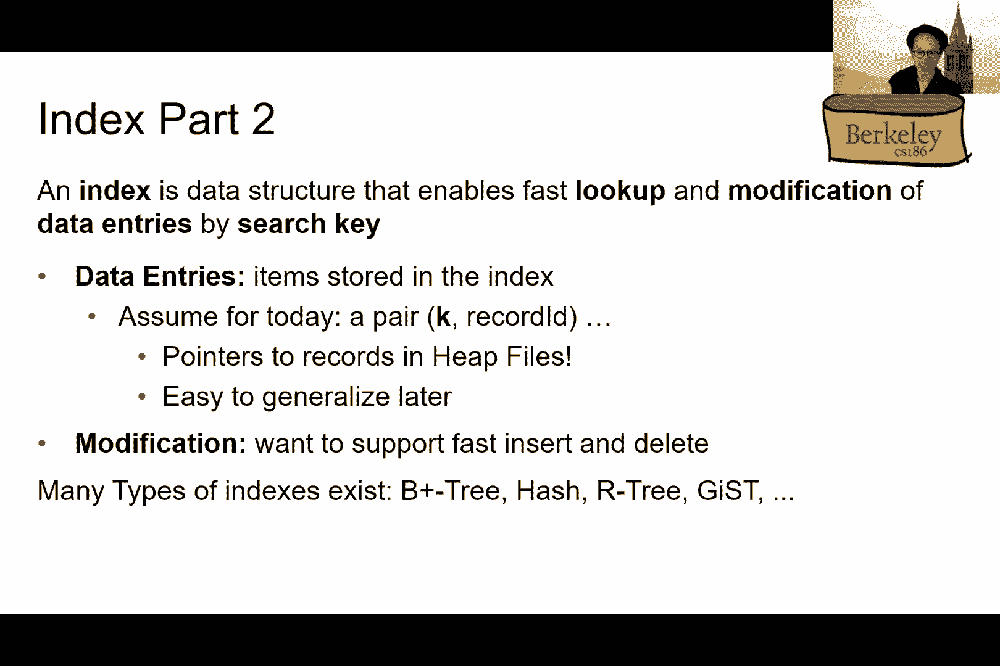
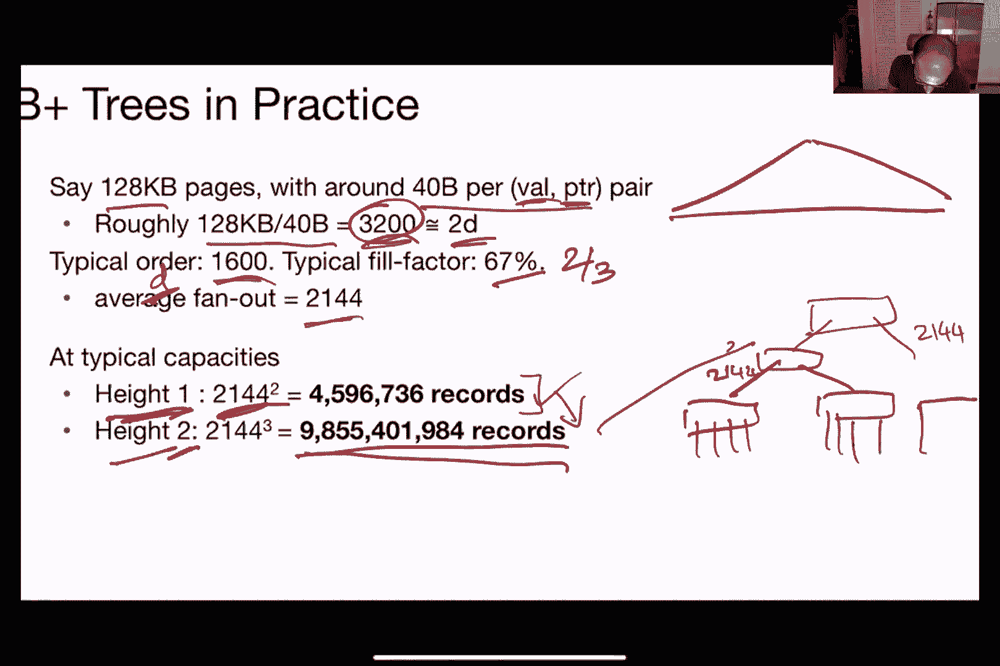
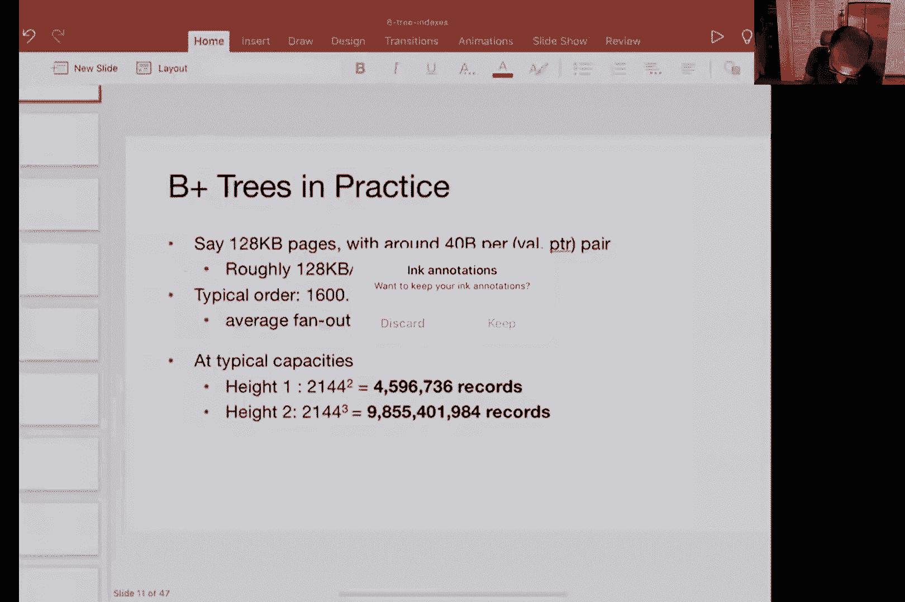
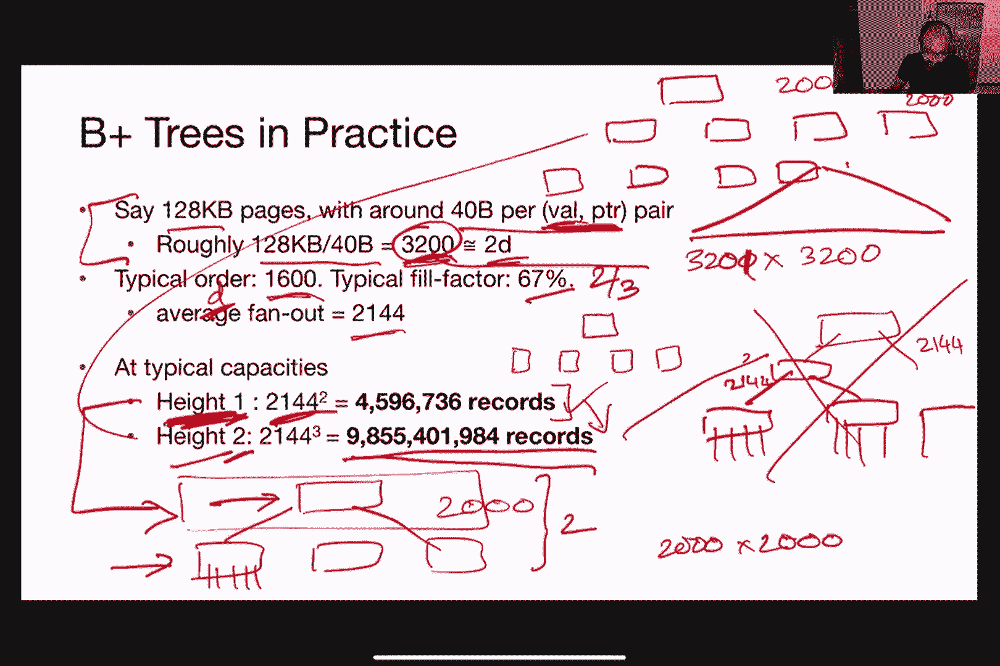
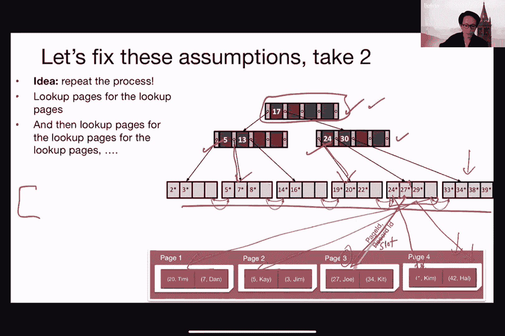

# 📚 课程 P5：第五讲 成本模型和索引 + B+ 树

在本节课中，我们将学习如何估算不同文件组织方式下数据库操作的成本，并介绍一种名为 B+ 树的高效索引结构。我们将通过简单的数学公式和代码示例来理解核心概念，并比较不同方案的优劣。

---

## 📊 成本模型概述

上一节我们介绍了不同的文件组织方式，如堆文件和排序文件。本节中，我们来看看如何估算在这些文件上执行操作的成本。我们关心成本，是为了在给定查询工作负载下，选择最优的数据存储方式。

成本模型旨在对数据操作（如插入、删除、查找、扫描）的成本进行粗略估算。我们使用以下参数：
*   **B**：文件中数据块（页）的数量。
*   **R**：每个块中记录的数量。
*   **D**：读取或写入一个磁盘块的平均时间。

我们做出以下简化假设：
1.  忽略顺序IO和随机IO的差异。
2.  忽略缓存和预取机制。
3.  忽略CPU处理记录本身的成本。
4.  所有数据操作必须先加载到内存，修改后必须写回磁盘。
5.  每次操作（插入/删除）只涉及一条记录。
6.  查找操作假设只有一条完全匹配的记录。
7.  堆文件中，记录总是追加到文件末尾。
8.  排序文件根据搜索键排序。

---

## ⚖️ 堆文件与排序文件的成本分析

接下来，我们分别分析在堆文件和排序文件上执行各种操作的平均成本。

### 扫描所有记录
无论是堆文件还是排序文件，都需要读取所有数据块。

**成本公式**：`Cost = B * D`

### 等值查找
查找一个具有特定键值的记录。

**堆文件**：由于无序，平均需要扫描一半的块才能找到记录。
**平均成本公式**：`Cost ≈ (B/2) * D`

**排序文件**：可以利用二分查找。
**平均成本公式**：`Cost ≈ (log₂ B) * D`

### 范围查找
查找键值在某个范围内的所有记录。

**堆文件**：必须扫描所有块。
**成本公式**：`Cost = B * D`

**排序文件**：先通过二分查找找到范围起点，然后顺序扫描直到终点。
**成本公式**：`Cost ≈ (log₂ B) * D + (扫描页数) * D`。平均情况下，扫描页数可近似为 `B/2`。

### 插入记录

**堆文件**：假设总是追加到文件末尾。需要读取最后一页，插入记录，再写回该页。
**成本公式**：`Cost = 2 * D` （一次读，一次写）

**排序文件**：需要找到正确位置（二分查找），移动后续记录以腾出空间，并将受影响的所有页写回。
**成本公式**：`Cost ≈ (log₂ B) * D + B * D` （查找 + 读写移位页）

### 删除记录

**堆文件**：需要找到记录（平均扫描一半的块），删除后将该页写回。
**平均成本公式**：`Cost ≈ (B/2) * D + D` （查找 + 写回）

**排序文件**：需要找到记录（二分查找），删除后移动后续记录以填补空隙，并将受影响的所有页写回。
**成本公式**：`Cost ≈ (log₂ B) * D + B * D` （查找 + 读写移位页）

从以上分析可以看出，没有一种文件组织在所有操作上都最优。堆文件在插入上表现好，而排序文件在查找上表现好。

---

## 🔍 索引简介

为了获得比单纯排序文件更好的性能，我们引入索引。索引是一种数据结构，用于根据搜索键快速查找或修改记录。常见的例子包括电话簿（按姓名找号码）和教科书索引（按关键词找页码）。

在数据库中，索引需要高效且持久化到磁盘。我们讨论的索引存储 `<键, 记录指针>` 对，其中记录指针通常是 `(页ID, 槽ID)`，指向记录的实际位置。

---

## 🌳 B+ 树索引详解

B+ 树是一种动态、平衡的树状索引结构，广泛应用于数据库系统。它解决了之前简单索引方案（如排序的键查找页）的痛点：维护成本高、树深度大。

### B+ 树的核心特性
*   **保持平衡**：插入和删除时自动调整，保证树平衡。
*   **高扇出**：每个节点有多个子节点，树宽而浅，减少IO次数。
*   **数据存储在叶节点**：内部节点仅存储导航用的键和指针，所有数据记录（或指向记录的指针）都存储在叶节点。这有利于范围查询。
*   **叶节点链表**：所有叶节点通过指针串联起来，支持高效的范围扫描。

### B+ 树的结构
一个 B+ 树包含：
*   **根节点**：树的顶端。
*   **内部节点**：存储键和指向子节点的指针。
*   **叶节点**：存储键和指向实际数据记录的指针，并包含指向相邻叶节点的指针。

**节点容量规则**（阶为 d 的 B+ 树）：
*   **内部节点**（除根）：指针数在 `d` 到 `2d` 之间，键数比指针数少1。
*   **叶节点**：键（和记录指针）数在 `d` 到 `2d` 之间。
*   **根节点**：可以少于 `d` 个键。

### B+ 树的效率
由于扇出很高，B+ 树通常非常浅。例如，假设一个页大小为 128KB，每个键-指针对占 40 字节，则每页可存储约 3200 个指针对。即使保守估计平均填充率为 2/3，扇出也超过 2000。

**存储容量估算**：
*   高度为 1（仅根节点和叶节点）：可支持约 `2000 * 2000 = 4 百万` 条记录。
*   高度为 2（根、一层内部节点、叶节点）：可支持约 `2000 * 2000 * 2000 = 80 亿` 条记录。

这意味着即使对于海量数据，B+ 树也能在很少的磁盘访问（通常 3-4 次）内找到任何记录。

### 为什么使用 B+ 树而非 B 树？
B 树在内部节点也存储数据记录。B+ 树将所有数据置于叶节点，这样做的好处是：
1.  内部节点更紧凑，扇出更高，树更浅。
2.  范围查询时，一旦定位到起始叶节点，即可通过链表顺序扫描，无需回溯到树的上层。

---

## 📝 总结

本节课我们一起学习了数据库操作的成本模型，并深入探讨了 B+ 树索引。
*   我们首先建立了成本模型，用于分析堆文件和排序文件在扫描、查找、插入、删除操作上的性能差异。
*   我们了解到，为了获得更高效的数据访问，特别是对于点查询和范围查询，需要引入索引结构。
*   我们重点介绍了 B+ 树，它是一种平衡、高扇出的树形索引，能够支持高效的点查询、范围查询以及动态插入和删除，是现代数据库系统的基石。

通过理解成本权衡和 B+ 树的工作原理，我们可以为特定的应用场景选择或设计最合适的数据存储和索引方案。