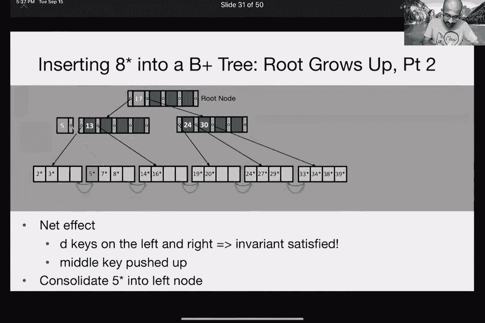
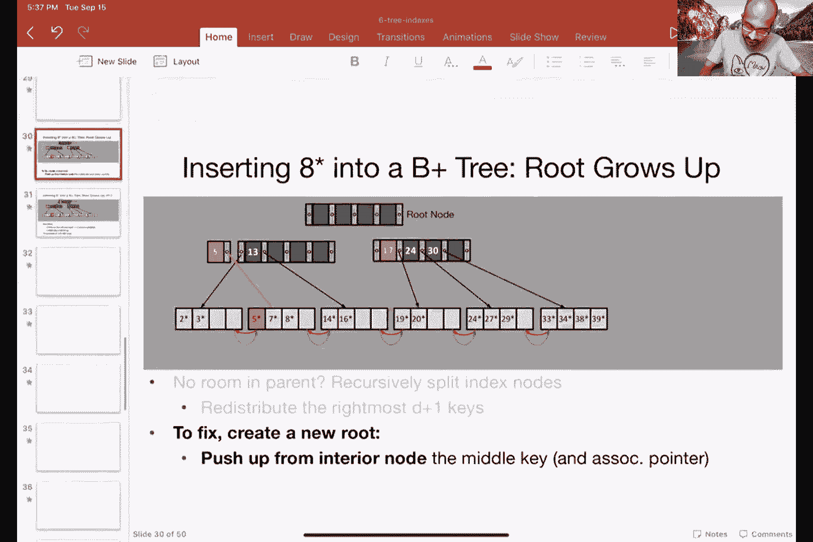
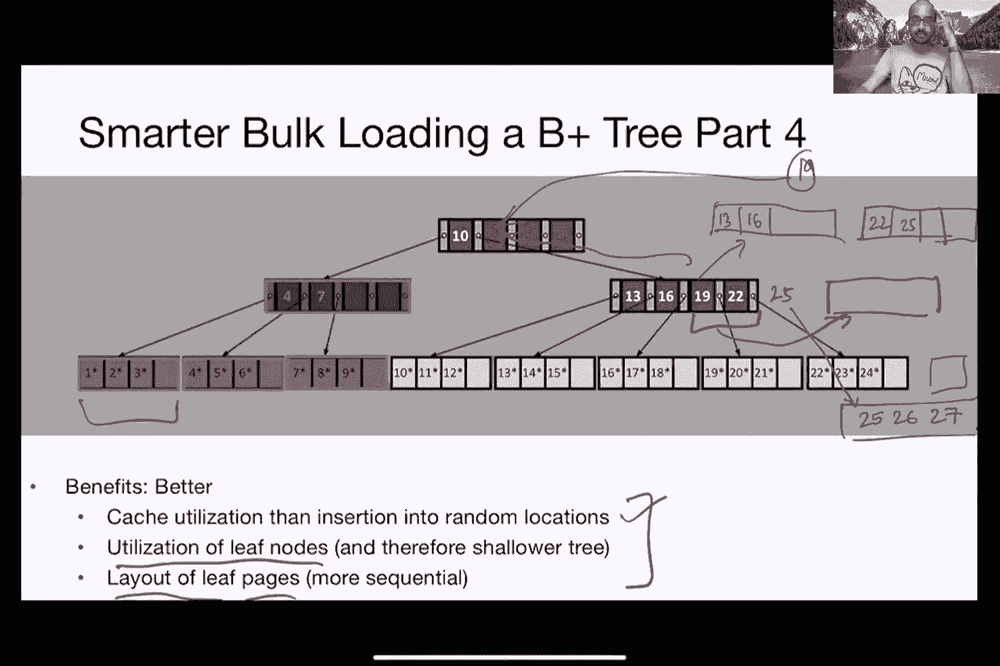
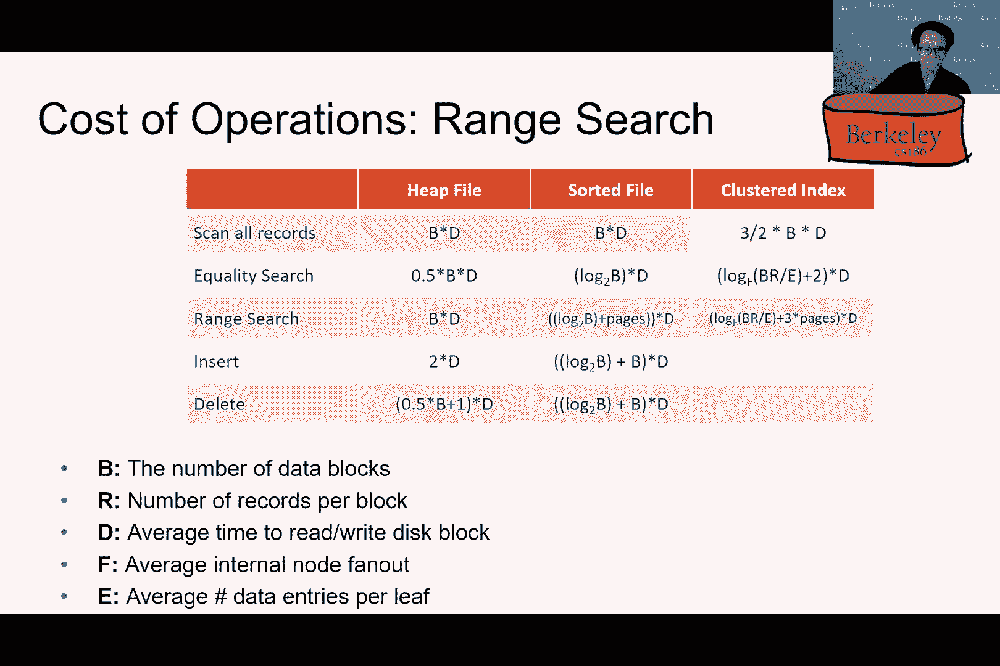

# P6：Lecture 6 Indices & B+ Tree Refinements - ___main___ - BV1cL411t7Fz

一切都好，好的，看起来还好，所以我要继续我停止的地方，有三个索引，呃，但在我开始之前，我想宣布几点，所以嗯，主要公告是要查找的公告是，TS发布的每周公告，太棒了，嗯，这是号码，呃披萨店。你应该去仔细看看，它有所有的细节，呃，本周所有相关的事情，两项特别通知，一个是讨论维生素答案和脚踏现在是允许的，所以在147号帖子中提到了这一点，如果你已经开始看项目二，我建议你开始考虑项目。你一定要上完今天的课，如果你还没有，呃，有很多辅助材料，比如一个演练视频和图表，帮助您理解代码库，嗯，那是链接在，呃，一号广场，四一，好的，这是三个公告，有什么问题吗？呃在我走之前，是啊，是啊。这样我们就能拥有在这个项目上工作所需的一切，今天的讲座之后，那将是希望，是呀，是啊，是啊，如果我们，如果我们，如果我们保持稳定的夹子，恢复我们想要的，是啊，是啊，它倾向于是的，好的，所有的权利，所以嗯。

我想重温B加树的样子，因为快下课的时候我觉得有点匆忙，我觉得有某种，也许你知道一些问题出现了，我无法充分回答，这就是a b加3的样子，好的，所以你有，这是b加b加3的高度，这些是内部节点。所以这是两个层次，这些是叶节点，好的，这是一个特殊的节点，称为根节点，嗯，和我们的惯例，我们将在所有的图表中遵循，这些内部节点将具有蓝色，而这些叶节点会是灰色的，所以首先要认识到的是，叶子页。这些页面不一定按顺序排列，大家可以看到，第一页实际上对应于根节点，第二页对应于叶子节点，可能三个对应于之后的叶节点，那么第四页对应于这个节点，所以没有真正的秩序是由，呃，与B加树相对应的页面，好的。所以什么都没有，嗯有点像，B加没有相应的顺序，但是代码中的B加T，因此，它允许您根据，呃，命令，即使与B加3相对应的页面没有按顺序排列，它仍然为您提供了按键查找数据所需的一切，好的。

所以这里要找的另一件事是这些指针，所以这个指针在24到30之间，引导到这个叶节点中的所有键，四十岁和三十岁，在两个四边有一个小于或等于，嗯，关于B树要注意的另一件事是，位于，底部有指向记录的指针。所以每把钥匙，呃，指向与该键相对应的记录，好的，所以记录上有三个三点对应于那个键，好的，这就是你读B加树的方法，所以有内部节点和叶节点，它有一个规则的树状结构，现在，让我们谈谈B树的性质，呃，服从。好的，所以第一个性质是B加树中的节点必须服从，占用不变量，好的，所以说，这让我们可以保证，B+树上的查找成本实际上是有界的，那么这个不变量是什么样子的呢，嗯。不变量表示内部节点中的每个节点都超过了某个最小值，因此每个内部节点都有一定的最小条目填充量，在这种情况下，通常每当你听到b加树，这个数字通常是条目的一半，所以它至少是半满的，所以这个数字。

这是每个内部节点的最小值，装满了，通常被称为树的顺序，所以这是一个用来指填充的术语，每个呃的最小填充系数，B加Stri内的节点，所以在这里你可以看到，有四个条目，一个，两个，三个，每个内部节点中有四个。所以参赛作品的最大数量是四个，就这样，它的一半是二，好的，然后呃，所以嗯，所以我们的保证，任何内部节点的条目数都在d到2之间，d，好的，在这种情况下，它在两到四之间，不需要遵守此属性的节点是根节点。所以根节点不需要服从这个不变量，同样的不变量实际上也适用于叶节点，所以至少有一半的叶节点，对不起，每个叶节点必须至少半满，所以d值可能不同，但至少在这里是一样的，所以这是第一个属性，所以是这个不变量。它确保B加树中的每个节点，除了根节点是特殊的，至少是半满，第二个属性是，正如我们前面看到的，底部的叶子页不需要按逻辑顺序存储，好的，因为它们不是按逻辑顺序存储的，我们仍然需要一种方法来按顺序引用它们。

然后这些指针，红色和绿色指针将帮助我们按顺序检查它们，这将是有用的，我们将在后面看到，好的，那么让我们来谈谈a b加t的刻度，所以给定a b加t，它能有多少记录，呃点它能索引吗。所以这是一棵高1B加的树，因为只有一层内部节点，然后是叶节点，这里只是根节点，叶子和一组叶子节点，那么这个高度1B加上树索引可以很好地索引多少条记录，你可以看着它，把它弄清楚。所以你有一个扇形的五个从根节点，然后每个叶节点有四个指针，嗯，所以是五乘四对吧，所以是二十块，所以我前面提到的最大条目数是四个，扇形出去是五个，因此，对于一棵高的树来说，看起来像这样。你在根部有五个指针，叶子上的四个槽，因此你可以，嗯，向上看，你可以捕捉，你可以索引，你可以指着二十条记录，让我们把它放大一点，让我们来谈谈一棵高三b+树，它有一个类似的，呃D和两个D好的。

所以在这种情况下，每个内部节点的指针数是五个，每个内部节点的最大条目数为4，好的，那么有多少节点，有多少记录，我们能从B树指向，好吧，再来一次，你可以把这个数学做对，所以根节点是五个，然后五为二级节点。然后是三级节点的五个，然后对于每个叶节点，你有四个记录是正确的，所以这是一个数学，所以你从根部有五个，第二层五个，三楼五个，然后四个指针，从根到记录的每一个，所以总的来说我们有五个立方体。呃乘以四乘以四，也就是这棵B+树可以指向的500条记录，我想有问题，所有的权利，问题嘿，你能不能，嗯，我有个问题，在前面的幻灯片中，树中的数字有什么意义吗，有十七个和一个根节点，例如。像第5页、第13页和第4页，是呀，绝对正确，所以这些是你的钥匙，呃，你呃，使用B加树进行索引，所以呃，我们将讨论如何阅读B加树，当你试图查找一个值，或者你试图插入一点，所以呃，如果还不清楚的话。

我们将通过例子来讨论，这些数字意味着什么，它们是如何有用的，好的，好的，数字本身并不指向任何东西，只是数字外面的指针，所以这些这些，这些数字并不能说明什么，指针用叶节点编码，嗯，在内部节点上有指针。这些指针是显式绘制的，至少在我展示的图表中，嗯所以，如果你有五个风扇，为什么叶子节点是四，所以我们说的是参赛作品对吧，所以这里和条目，我再次保留它，这是这是一个特殊的图表，这实际上取决于，呃。可以在叶节点中填充多少项，在这个特殊的图表中，i或在这个特定的b加树中，我在叶节点中有四个条目，每个内部有四个，否，好的，只是为了让事情变得简单，所以我在整个b+树中有相同的顺序，也就是两个，因此。有两倍于此的条目，也就是四个，嗯，扇出是一次，加上内部节点，这有道理吗，好的，谢谢你的澄清，好吧，假设没有问题了，我没看到有人举手，所以好吧，所以我们可以用这棵高3b+的树指向500条记录，好的。

所以事实证明，呃，B加上实践中的树比这大得多，这是因为每个内部节点和每个叶节点，指出更多的东西，我们有更多的参赛作品，所以让我们做一些角度计算，试图计算出我们实际上可以索引多少记录，用一个现实的B加树。如此逼真的V再加上3，我喜欢，我希望这最后一次是草率的，返回包络计算，我在重复这个，只是因为我觉得，嗯，我我有点呃，也许没有我解释得那么好，呃想，假设我有，呃，一个两个8千字节的页面，好的。我有每一个条目，因此每个值指针对，我用40个字节来编码，然后通过简单的除法，我可以在一个页面中编码的最大条目数，这可能是一个内部节点，或者这可能是一个叶节点，嗯是二十八千字节除以四十字节，大约三千。好的，马扇出将是三千，加一个右，所以它是一加条目数，但我们不要担心这个，我们也叫它三千吧，好的，所以整体参赛作品呈扇形展开，你会叫它三千，好了，现在，假设这些条目中的三分之二平均再次填写。

这是信封的背面，计算计算和马虎，我知道一半的条目会被填写，因为这是B+树给我的保证，但我说好，假设平均三分之二的人被填满了，好的，所以再一次，这只是一个假设，对嗯，所以有了这个数字，中间节点的平均扇出。或者平均参赛人数大约是两千人，好的，所以有了这些能力，一个怎么，一个高的能有多少记录，加三点二，你有两千个来自根的指针，所以这是一个从根部出来的扇形，对呀，根部指向的叶节点数，然后每片叶子有两千个条目。对呀，所以这两千乘以两千，那大概是四百万，好的，所以这是一个高度，一棵B加树，它已经，呃，指向索引，呃，允许您查找400万条记录，如果你有一个高二p加三，你可以做得更对，呃。所以你有2000个来自根的指针，对呀，所以这就是，然后第二级的两千个指针，然后每片叶子两千，对呀，所以有80亿行或80亿条记录，对呀，那是大量的记录，你可以用B加树的高度向上看，所以基本上是三个深度。

三个或更多的高度将允许我们索引大量的记录，如此频繁，b加上实践中的树木，你看不到B加上深度五度及以上的树，因为你不经常需要它，好的，现在让我们来谈谈我们如何解释这些数字，我们实际上是如何使用B树的。好的，那么我们如何搜索，呃，在B加树中，所以过程是你看每个节点，您可以在每个节点上找到要遵循的正确拆分，然后按照指向下一个节点的指针，在下一个层次，那么我们如何操作它，假设我想找两个七，好的。所以我从根节点开始，然后我说，好的，比十七岁少二十七岁，更新于十七，嗯，大于等于十七，对呀，所以我要沿着这条路走，我沿着这条路径到这个节点，好的，所以这个内部节点现在是二十七，24岁以下。二十四至三十岁，或大于30，嗯，现在是二十四到三十岁之间，对呀，所以我要沿着中间的路径下到这个叶节点，我在这个叶节点中找到了我的记录，这是与二十七相对应的记录，所以现在我找到了这个叶节点和指向，记录。

指针实际上有什么帮助，这对我有什么帮助，这个指针实际上会是一个呃，为了那个为了那把钥匙二十七，它将是与该键相对应的记录ID和记录ID，就像我们以前看到的那样，在我们讨论被屠杀的页面时。所有的记录ID都是对应于页ID和槽ID的一对，呃为了呃，对应于这个未排序的堆文件，好的，所以这是针对这个未排序的堆文件，这个叶节点条目将告诉我在哪里查找，在那个未排序的堆文件中。它会告诉我页面ID和页面中相应的插槽ID，我需要抬头，那太好了，所以我，我用这棵B+树找到了我要找的记录，和内部呃，这里的值确实为我指明了正确的方向，对呀，所以它只是把我引向正确的方向，好的。所以没有找到对应27的单一记录，假设我想找到27岁及以上的所有记录，所以我想找到所有对应于，呃，大于或等于二十七，所以我们按照两个步骤，所以第一步是，我们找到对应于2 7的记录，如果存在的话。

然后我们按照指针遍历树叶，这就是这些指针派上用场的地方，好的，所以我们按照指针遍历树叶，检索对应于2的记录9到3 3 4 3 8，三九等，这实际上是所谓的范围扫描的一个例子，好的。所以这是当你在一定范围内查看值时，a逗号b，在这种情况下是，呃，二十七，逗号无穷大，让我们说的权利，那么拥有这些指针的好处是什么，为什么我更喜欢直接看树叶，嗯，好处是我不需要对每一个键都重复这个。我想抬头看，我不需要重复这个，回到树的开始，然后再往下走两九，3。三也是这样，3。三也是这样，3。四也是这样，3。三也是这样，3。四也是这样，4。以此类推，对呀，所以我不需要做所有这些，我可以留下来。嗯，在树叶水平，然后查找所有感兴趣的记录，在对叶节点的一次扫描中，好的，所以我不需要回到树上，好的，这就是搜索任何关于搜索的问题，是呀，B加树有什么特别之处，就像。

为什么我们不能说使用范围最小查询进行范围搜索，对不起，范围最小查询是多少，RMQ，数据结构，范围最小查询，它会给你，呃，根据范围返回，这是范围的常见结构，我只是想知道B+树有什么特别之处，所以B加上树。好的，那么B+树的特别之处在于，将其与您过去可能了解过的其他数据结构进行比较，有几个方面，第一个方面是它是，嗯，它是，我是说，在某种意义上，它类似于类型和其他类型的数据。但是您过去可能看过的其他类型的数据结构，对呀，例如，它可能让人想起二分搜索树，对呀，所以它类似于二分搜索树，但是有一个更大的风扇，因此它现在是一棵更短更宽的树，嗯，还有一个我还没有描述的方面。B+树在你支持的情况下是相当有效的，当您添加和删除时，呃，记录，我现在就要谈这个，与B+树相对应的另一个方面，使其特别适合于数据管理，那是呃，我们正在操作的每个粒度都在相同的页面上，对应于磁盘上的页。

所以这种对粒度的思考，你用它仰望，具有相当有效的索引结构的磁盘上的数据，所以从某种意义上说，它相当适合，并意识到这样一个事实，即您需要这个索引结构是超快的，它需要支持非常非常大的访问，然后呃，同时。每个磁盘IO都很珍贵，对呀，所以你不想有，比如说，一棵很深的树，谢谢。还有其他问题吗，所以补充一下，安德鲁，就像你提到RMQ的时候，我是说这基本上是一种查询，所以回答这个问题的方法。你还不如为此使用B加树，但你不必，显然你也可以使用标准的B树，就像在，嗨，是啊，是啊，嗯，所以我想这个问题已经在聊天中问过了，但是如果这些页面不需要按顺序存储，为什么能为雨教堂，为什么我们能就这样走。我们能假设什么，我们可以从27点开始跟着前面的指针，是啊，是啊，所以我的意思是，至少对于给定的叶节点，你有东西，它都存储在一个节点中，对呀，全部存储在一页中，所以我不需要查任何其他页面对吧。

所以至少如果我没事，所以回到那个例子，呃，二十九，我不需要查另一页，仍在同一页中，嗯，让我删除其中的一些注释，所以也许我想这就是这里令人困惑的地方，好的，所以在这里你可能看到了，有这些指针，对呀。红色指针，它是一个后指针和一个绿色指针，它是一个前进的指针，这让我知道我应该查的下一页，这一页对吗，对应于这组叶子条目，到节点项，这样我就可以知道下一页我应该查哪一页，所以我遵循这些指示。我知道接下来该看什么，即使它们可能不是按顺序存储的，谢谢。嗯，假设没有更多的问题，嗯，让我们谈谈插入，好的，那么我们如何插入，呃A B加树，假设我想在这个b+树中插入两个6，嗯。我从遵循与搜索相同的程序开始，所以我沿着这条路走，因为这是，呃，二六等于二十四到三十岁之间，所以我找到了右边的叶子，嗯，如果这片叶子里有空间，我可以添加条目，好的，所以我有能力添加这个新条目，然后呃。

我快做完了，嗯，但在我完成之前，我可能也想排序，所以我可能想对叶子中的条目进行排序，嗯，只是为了确保我有一个有效的方式，如果我想抬头，呃，呃，叶页中的键，好的，所以让我们再举一个例子。所以这是一个简单的例子，我有一个槽，在那里我可以插入一些东西，假设我想把它插入到这个特定的树中，所以我又一次找到了正确的叶子，所以在这种情况下，它是左手边的第一片叶子，我想把它插进这片叶子里。所以不幸的是这片叶子已经满了，它不能容纳更多的人进入，所以我需要把这片叶子劈开，所以我要创造另一片新的一页，这让我可以移动这个真正完整的叶子中的一些条目，在这个新的叶子上，呃叶子。然后在两片叶子之间均匀地重新分配入口，好的，所以我在这两片叶子里有五个条目，所以我要在第一个里面放两个在第二个里面放三个，好的，所以我在第一个留了两个，在第二个留了三个，然后我要修复下一个和上一个指针。

我们在树底部的红色和绿色指针，对呀，所以我要五七八，后面的叶子后面的两片三片叶子，好的，所以我去插了这个，但我们做得不太对，呃，这棵树有什么奇怪的，嗯，没有任何东西指向这个特定的叶节点，所以我们。这个叶节点基本上是经常，你要确保鱼礁叶节点可以通过，树内部或树内部的节点，所以为了补救这个，我要做的是从叶子上复制，中间的键和指向孤儿叶的指针，好的，所以现在这片叶子是孤儿。所以我需要找到一种方法来确保它是可访问的，所以我会拉起来，或者至少我会复制这个中间键5和一个指向这个的指针，呃叶结，这就是我们访问它所需要的，好的，这是这些，这对是我们访问这个叶节点真正需要的。然后我要试着把这个合并起来，这个呃这个条目，这个中键和鹦鹉的指针，不幸的是，这位特殊的父母也是完全正确的，所以这个特定的父级有两个D项，有四个条目，现在你想写第五个条目，两个两个D加一个条目。

所以我没有空间做那件事，所以我要做的是，我又要分开了，所以这里将是一个索引节点拆分，或内部节点拆分，所以我必须在这里创建一个额外的节点，然后我要把最右边的d+1键移到，右边的节点，所以我重新分配了钥匙。我现在有两个在第一个，第二个三个，我还得把这个家伙合并到这个节点上，但我们稍后会处理这个问题，但这里的另一个问题是，我们现在有两个根，我们再也没有根了，所以我们需要想办法看看，从单个根查找树。所以要做到这一点，我们添加一个新的根节点，所以我们创建一个新的根节点，然后我们把中间的节点向上推，到根节点的中键，好吧再来一次，播放那个动画。

好的，所以再一次，我创建了一个根节点，然后我向上移动中键到这个根节点，这样我就知道这个子树中值的起点是什么样子的，好的，所以这个插入的净效果是我有，左右D键，D加1，二加一，他已经向上移动到根部了。事实上，我的钥匙在左边和右边，意味着不变量现在满足，这是伟大的，对呀，所以我们想开始，我们从满足不变量开始，我们插入了一些东西，现在我们又以不变量为结束，所以我还有最后一步，我想把这五个合并成这个。内部节点，我还没有完全那样做，所以这很容易，我可以去做那件事，现在我做对了，在这个特殊的例子中，我们最终在中间分裂了节点，产生了一个新的根节点，这实际上是相当罕见的，对呀，这是相当罕见的增加深度。因为我们看到典型的B+树，你没有，啊啊啊，你可以用三到五个做两个，三到五层的深度，或者三到五岁的高度，你实际上并没有增加深度，你不会经常添加新的根，好的，所以这是相当罕见的，这种事很少发生。

在这个特殊的例子中，它确实发生在我们的例子中，所以这里有一个特别的细微差别，我想指出，细微差别的第一部分是我们复制的叶条目，因为我们想保留原来的钥匙，所有的钥匙都需要在树叶里，也就是，呃。允许我们正确查找所有记录的保证，所有的键都必须在最小的，然而，索引条目，中间的入口，当我们有两个D加一个或一个过满的中间节点时，中间的条目实际上是向上推的，而不是向上复制的，所以那个入口是向上推的。它被推高的原因是我们不再需要它了，用于在此节点中路由，我们在这个节点上不需要它，因为它没有给我们任何额外的信息，所以这是一个有助于记住的细微差别，一次又一次，在你计算出几个例子后。你就会得到b+树的直觉，所以我鼓励你去，在家试试，嗯，尝试几个插入的示例，看看结果是什么，嗯，如果有问题，当然啦，请在广场上询问，好的，所以让我们给你一个高级算法，草图um所以B加树插入算法。

第一步是找到正确的叶子，这是标准的搜查程序，你沿着叶子往下走，直到找到正确的叶子，呃，沿着树走下去，直到你找到了合适的叶子，如果你在那片叶子里有空间，然后你把它放在那里，然后你就完蛋了，好的。如果你没有空间，然后你需要把L分开，好的，所以你把L分成L和一个新的节点，我两个，现在，您需要确保您仍然可以从上面的节点指向l 2，所以嗯，所以说，你做的第一件事就是。你在l和l两个之间均匀地重新分配条目，你复制中间的键，也就是，呃，指向l 2的指针，中间的键是l 2中的值的开始，然后将指向l 2的索引项插入l的父元素中，好的，所以你，呃。通过将指向l 2的索引条目插入l的父条目，2。你要保证找得到我，因为你所做的只是做了一个新的节点，你没有任何机制来查它，通过向l的父级添加l 2的索引项，你确保可以看，有时您没有此索引项的插槽，因此。

您需要递归地正确执行此操作，因此，您最终可能会拆分该索引节点，您均匀地重新分配条目，在拆分索引节点的情况下，你把中间的节点向上推，和指向已创建的新索引节点的指针，好的，所以你不抄袭，你把，呃。在树的内部，这就是拆分索引节点时发生的情况，另一个值得记住的直觉是分裂，基本上最终长出了这棵树，但是树的生长方式真的很有趣，所以它不会以自上而下的方式生长，它实际上是以自下而上的方式生长的。所以树越来越宽，如果可能的话，从下往上，如果它在某个时候变得太宽，它基本上最终增加了另一个层次，呃，用一个新的根，好的，B+树就是这样生长的，这种自下而上的生长确保了平衡。所以我们想确保在任何时候更深的树都是平衡树，嗯，还有，呃，余额，加上您有这个占用不变量，确保对数保证，所以为了我们的插入，我们有一棵高度为1的树，只有内部的一个根节点，然后在插入后，你有高度2。

对所以基本上我们把它分成两份，嗯这里，然后我们把这个一分为二，然后我们增加了一条新的路线，所以这就是最终发生的事情，我们是自下而上做的，所以我们将跳过删除，好的，所以在实践中，我提到的占用不变量。在删除期间通常不强制执行d约束，您只需删除叶子条目，并留下空间，所以这只是你在练习中有点马虎，在删除期间，嗯，您可能想要这样做的一个原因是，如果新插入，来到那些地方，伟大的权利，你有那些插槽。你可以填写，呃，那些条目，我们这么做的另一个原因是，有点马虎也没关系，因为保证还是很好的，所以嗯，如果页面变得完全空，你可以把它完全删除，父母可能会因此变得满员，如果呃，如果您最终删除了一些叶页。那也没关系，所以总的来说，你得到的保证，即使你对删除做得不多，你只是有点马虎，你实际上没有强制不变量仍然很有吸引力，你还有一个日志，嗯，插入到树中的总数，对，嗯，所以这仍然是一个相当有吸引力的数字。

尤其是因为扇形很大，教科书描述了一个相当复杂的算法，删除时的再平衡和合并，所以你经常有偷窃的想法，呃，他来自邻近的节点，然后合并附近的两个节点，或者兄弟姐妹嗯，为了强制占用不变量，教科书描述了这些算法。这不是我们在这门课上要重点讨论的问题，好的，所以我们谈到了搜索，插入和删除，所以我们讨论过一次插入一个记录，和删除，我们有点跳过删除，但我们说过一次插入更像是一个记录，嗯，我们谈谈散装货吧。以及为什么散装装载是有价值的，所以假设我们想从头开始构建一个索引，好的，所以你有一个很大的表，你想从头开始构建一个索引，你要怎么做呢一个选项就是反复调用INSERT，对呀，所以对于你拥有的每一把钥匙。您只需重复调用INSERT，为什么这是个坏主意，我们将不得不使用更多的iOS来回到页面，我们要把它，是啊，是啊，我们必须使用更多的iOS才能进入页面，我们想把它插入右边，所以基本上你会从根部开始。

一直到叶子节点，对于您插入的每一条记录，那是很多iOS，对呀，还有其他原因，第一个原因是你需要不断地从根目录搜索，嗯，第二个原因是你喜欢修改随机页面，对呀，所以如果你有一棵像这样的树。前一分钟你可能会在这里插入一些东西，下一分钟你就在这里插入了一些东西，所以您正在查找的相应页面，堆文件和呃，在树中随机选择，你在这里的现金效率会很差，另一个缺点可能不如前两个重要。但仍然重要的是树叶利用率很低，通常最后是半空的，好的，所以这些都是为什么，如果要从头开始创建索引，简单地一次插入一个不是一个好主意，所以有一种方法可以通过批量加载B+树来避免这些问题。这种从下到上的方式构造了一个B+树，嗯，我们会看看这个方法是如何工作的，好的，所以这种方法的第一步是按键对输入记录进行排序，好的，所以拿着钥匙，然后按这个对记录进行排序，嗯我们会的，呃。

我们还没有完全弄清楚如何进行分类，当数据非常大时，我们很快就会讨论的，也许从现在开始的几节课上，我们学习了一种很好的基于磁盘的排序算法，那么好吧，所以嗯，所以第一步是按键开始输入记录。然后一旦你按键对输入记录进行了排序，我们开始填充叶子页，我们填充叶子页，直到一些填充因子，嗯，让我们说四分之三，嗯，这也可能是六分之五，嗯或三分之二，所以任何，可以使用对应用程序有意义的任何因素。当这些叶页被填满时，相应的父级也会得到更新，所以内部节点也会得到更新，并且更新此父级，直到父级满为止，到目前为止，我加了一二三，我加了四五六，我在这里加了四个，这样我就可以抬头看了，在这两页之间。当我添加更多的叶页时，我向父级添加更多的增量，所以现在我父母已经吃饱了对吧，所以这个根节点，这个内部节点现在已经满了，我需要创建一个新节点，如果我想容纳这个新的一页，所以要做到这一点。

我遵循了插入过程中用于索引拆分的相同方法，我把那个节点分成两个节点，然后在上面增加另一个层次，在这种情况下对吧，所以在这个特殊的情况下，我们不得不在，所以我就像我说的你创造了一个新的兄弟姐妹。你复制了一半以上，你向上移动中间的指针，嗯，就像你做的索引，呃，用于插入的节点拆分，批量装载的有趣之处在于当你不断添加东西时，树的左下部再也没有碰过了，好的，所以一旦这个被填满。树的这一部分再也不会被碰了，以此类推对吧，所以你一直有树的部分再也没有碰过，还有这个呃，此方法还保持占用不变量，以防你担心插入什么，工厂的一个记录肯定保持占用不变，bug批量加载也保持占用不变，有多好。第一个保证是叶子填满了，呃超越d，因为我们确保了，至少在这种情况下，四分之三的条目是填写的，其余节点由插入拆分过程管理，如果你超越，嗯二加一，它会分裂成d d d，然后把中间的键向上移。

所以我们将继续这样做，并再次确保不变量保持不变，好的，所以在这个特殊的例子中，只是通过更多的动画，你可以，呃，当新的一页页被填满时，您不断添加，您不断添加到父，然后现在又一次，这个家长现在已经满了。因此，您最终可能会创建一个新的父级来容纳下一组叶子页，你可以移动其中的一半，呃，这里有一半的条目，中间的就会移到鹦鹉身上，好的，所以中间的值将移动到父，所以在这个特殊的情况下，你不需要创建一条新的路线。因为根部已经，呃，已经，呃，已经，呃，空闲插槽，好的，那么散装的好处是什么呢，这里有三个好处，首先，与插入到随机位置相比，您可以获得更好的缓存利用率，你就是你，你有点。你一次在一棵树的一个协调部分上工作，一旦你完成了树的一部分，你忘了这件事，你移动到下一部分，您可以更好地利用叶节点，因此较浅的树木，这是另一个好处，叶子页更按顺序组织，好的，所以当你取页的时候。

你有更多的地方，尤其是，例如，如果你在做范围扫描，好的医生，所以总的来说，B Plus树是一个超强的动态平衡索引结构，至于索引，插入和删除到B加树，并确保树保持高平衡，成本是对数，呃，f，呃。其中n可能表示节点总数，呃，插入的记录总数，这个高度和扇形意味着你通常没有一个B的高度，不超过三四个，有一个相当宽的B的另一个好处，加树是更高的级别经常被频繁访问，它们以现金形式存在。你最终避免了昂贵的磁盘，i，o，对于那些较高的水平，a，B加三几乎总是比维护一个排序的文件好，做这件事的间接费用不值得，呃，其中的好处，好的，尤其是在面对插入和删除时的维护。B加T比排序文件处理得更流畅，所以出于这个原因，树在数据库系统中应用非常广泛，我们还谈到了散装，批量加载可以比创建b+树的重复插入快得多，在一个非常大的数据集上，这就是b加上树的所有结果，在我开始之前。

关于这一点的任何问题，呃，索引文件，呃，呃你好，我只是在想，呃，恐惧因子只适用于叶节点吗，呃，呃，我在过去的幻灯片，是啊，是啊，所以在这个特殊的案例中，我们最终，呃，只对叶节点应用填充因子。在中间节点中，我们最终得到了标准顺序，好好照顾它，所以基本上它们会装满一半，就像B加树中的典型情况一样，你当然也可以让叶节点有一半，如果你愿意，嗯，如果您想更好地利用叶节点，那就更好了，把它装满。我也在想，呃，呃，我们为什么要用呃，恐惧因素，呃，对于叶节点，是啊，是啊，所以说，这只是一种优化，以确保你最终不会，比如说，非常稀疏的叶节点集，所以如果所有的叶节点都只是，你会有更多的叶节点，因此。高于它的水平会更高，我也是，对呀，所以它只是，只是更多的开销，所以有一个交易，你如果是一半，一半的条目都填了，你有更多的插槽来添加新的东西，所以这是一个好处，但是树木，树变大了，所以这里有一个权衡。

是啊，是啊，好的，谢谢。嗯，我在想，呃，如果您继续批量装载到，就像，呃，您展示的示例，我们会不会以，呃，就像一个不平衡的，不平衡B加树，否，好的，所以好吧，让我试着把这个例子画得更清楚一点，好的。所以说，好的，我要摆脱，呃，不不不不不，我想我的问题是我们不用左手，最，你喜欢那个音符，好的，我无法清除笔迹，不太理想，好的，让我看看我是否能继续前进，好的，所以假设我有，呃，二十五，呃，二十六。二十七，好的，这是我的下一个叶节点，现在我想，现在我想在父母身上加二十五，是的因为我需要25英镑来引导搜索，所以我最终要做的是，我最终会把这个节点分成两个节点，一个对应十三，第二个对应于。二十二和二十五，然后我会有呃，中间值，也就是十九，会被推到这个里面，呃，根节点有意义吗，好的，好的，明白了，谢谢。呃米饭，呃，是呀，所以我有两个问题，所以一个问题是对于叶子来说，现在我们要解决它吗。

嗯是的，所以我们保存，呃，叶节点中的键按排序顺序，这样我们就能更有效地查找，所以您可以在叶节点上使用二分搜索，在叶节点内按键查找记录，但是如果，如果活动节点数很少，我看不出解决它有什么好处。我是说在这种情况下，对不起，我不太明白，所以你的问题是，如果你有少量的叶节点，那么你就看不到正确排序的好处，因为如果你有大量的深层节点，在这种情况下你最大的参赛资格是，然后我我我的意思是。如果你在做二分搜索和线性扫描，我想这肯定不会有什么不同。是啊，是啊，我想我是认真的，看情况吧，所以如果在这个特殊的例子中，也许它太小了，无关紧要，但是如果你有大量的指针，数以万计的订单。您可以从按排序顺序维护它中受益，那是设计上的选择，对呀，这样你就可以避免以排序的顺序存储它的前期成本，但在你抬头的时候付出惩罚，或者您可以按排序的顺序维护它，然后让它看起来更便宜，好的。

从lib节点的实现细节来看，呃，使用双，呃，使用双链路，增加，呃，因为我的意思是，i，所以这将使用双链接列表，呃，执行呃，在离开节点中，是啊，是啊。您可以把它看作是每个叶节点都有一个指向下一个叶节点的指针，对呀，呃，这样你就可以做这个范围扫描，好的，呃，最后一个快速问题，所以每一个淋巴结的每一个入口，它会给你一页，或者它会指向报纸上的记录，是啊。是啊，所以我们，呃，所以既然这是，呃，所以最终目标是查找记录，所以我们要做的是对叶节点中的每个键，我们将有与该密钥关联的记录ID，因此记录ID将是页面ID的组合，以及该页中的插槽ID，好的。所以让我们就像指向一个，呃，一页的一部分，然后指向一个嗯，记录，本质上是一个记录，是呀，好的，谢谢。

让我们进入下一组幻灯片，好的，到目前为止，我们一直在讨论a b+树索引，呃，指向堆文件中无序的页，好的，所以事实证明，这并不是我们能采取的唯一方法，还有一些设计选择，嗯，第一个设计选择是叶节点的选择。所以这是，呃，您可以将其视为索引和数据之间的接口，所以这是叶子节点，嗯，这是一个选择，呃，您希望叶节点看起来像什么，第二个是你希望实际数据是什么样子的，好的，所以我们将讨论各种替代方案。因为叶子节点有三种基本的替代方案，这也适用于其他类型的索引，当您有相应的数据条目时，对呀，所以当你从键到数据，这个，同样的论点，呃，替代办法也同样适用于这些情况，当然我们会关注b加3。所以我们在B加树的上下文中看它，但一般的讨论也适用于其他索引，所以这是三个基本的选择，教科书也对这些备选方案使用了相同的编号，所以我们按顺序看它们，所以第一个选择是按价值，第二种选择是通过引用，嗯。

这是我们已经看到的，嗯，第三种选择是通过引用列表，那么我们该怎么办，这些都是什么意思，因此，第一种选择是按值在叶子页中存储信息，这意味着叶页直接存储记录，他们不储存，指向记录的指针，他们直接存储记录。所以在这个特殊的例子中，这是你的亲戚。和叶子页，这里的这几页，他们直接存储了这种关系的记录，例如，此页存储为逗号，乔，和和三个收敛，比如说，所以这样做的好处是你不需要正确地遵循指针，你跳过一步。您已经将数据直接存储在叶节点中，您不需要查找指向记录ID的指针，然后从未分类的热管中查找一页，另一种选择是我们到目前为止一直关注的另一种选择，是通过参考对，所以这里是每把钥匙。我们将匹配数据记录的记录ID存储为一对，每个叶子中的索引项都包含键逗号记录ID对，所以在这个特殊的例子中，我们有，嗯所以，比如说，键2有一个与之相关联的记录ID，记录ID基本上说查找第一个。

所以这是记录ID，记录ID是页面ID，我们说的对是k逗号，这就是叶节点处的索引所包含的内容，所以叶子中的每个条目都是k逗号记录ID，这是一对，记录ID是页ID和槽ID，这是我们之前用的。这种有参考熊的表示，基本上干净地将索引与数据解耦，所以这个数据保持原样，索引指向数据右，因此此数据保留在未排序的堆文件中，索引指向数据，好的，另一种选择是通过引用列表，如果您有多个与给定密钥匹配的记录。这将很有帮助，因此，此上下文中的每个叶条目都是键值，嗯，匹配数据记录的记录ID列表，所以在这个特殊的例子中，你有三个记录对应于密钥二，好的，所以你有乔，Jim和K，所以你有一个每个记录的记录ID列表。对呀，所以你有一个对应的乔，一个对应吉姆，一个对应K，他们每个人依次是一对，也就是页面ID和插槽，这个替代方案比替代方案更紧凑，对并将其存储为单个列表，所以你不会重复同一个键多次对吧，所以它更紧凑。

另一方面，这个替代方案有更多的簿记，呃，因为如果你有一个很大的，呃，记录ID列表，所以如果你有一个重复许多的钥匙，很多次，这个大的记录ID列表可以跨越多个块，所以你需要知道你没有关闭括号，呃。在记录ID列表中，所以这是你需要管理的一种簿记事情，如果您有一个跨越多个块的记录ID列表，所以这是你唯一需要担心的事情，如果你有参考对，你不需要那么担心，因为你永远不会有那个问题，一切都是一对。备选方案2和备选方案3中的备选方案1很重要，所以备选二和三呃索引数据通过引用，所以他们把索引保存得很好，呃，与数据完全解耦或分离，如果我们希望通过引用支持每个表的多个索引。所以使用替代免费的替代实际上是必要的，否则我们最终将复制整个元组，所以如果你有两个索引都对应于另一个索引，您最终将为这些索引中的每个元组存储一个副本，对呀，按值方法的一个问题。

所以问题是为什么这是一个问题，那么为什么复制元组是一个问题呢，我们可以一致地获得我们的数据，是啊，是啊，所以基本上复制通常是个问题因为，保持嗯，副本，保持两份副本的一致性，对呀，因此。如果您在多个地方重复相同的数据，这个问题在以后的课程中也会重复，我们有相同的数据，呃，在多个地方，如果你对其中一个进行更新，你也需要对另一个进行更新，当您进行这些更新时，这会产生更多的开销。所以总的来说，你想最小化，呃，复制，因为这会产生更多的开销，好吧嗯，它也增加了存储空间，但那是另一回事，所以存储通常是一个小问题，与维护的开销相比，元组的副本彼此一致，因此。复制会导致更新过程中的复杂性，因为这个原因你想避免它，这是因为您需要确保数据的所有副本都保存在，好的，所以我们讨论了叶节点，让我们谈谈堆文件，好的，所以嗯，我们可能想如何更好地组织它，所以通过参考索引。

因此，备选方案2和3可以聚集在一起，也可以不聚集，实际上，这实际上是与索引关联的堆文件的属性，而不是索引本身，所以聚集索引，基本上，呃，确保堆文件记录保持大部分有序，好的。所以大多是根据索引中的搜索键排序的，所以这个堆文件顺序不需要是完美的，它不需要绝对完美，排序顺序，这只是在，你想说，呃，到这个到你想保留的数据库系统，呃，尽可能按排序，所以即使这是一个建议或暗示，嗯。好处是相当大的，因此，通过聚集索引检索数据记录的成本要小得多，比通过不受信任的索引检索它的成本高，我们明白为什么，所以注意，这里，这与您可能在其他设置中看到的集群有点不同。尤其是在数据科学、人工智能或数据挖掘聚类方面，通常在那种情况下，好的，所以这是聚类这个术语的不同用法，我们谈论的是数据的一个非常物理的性质，对呀，在磁盘上相邻聚集的数据也是如此，比如说，好的。

那么我们如何构建聚集索引，嗯，所以要建立一个聚集索引，我们基本上首先对堆文件进行排序，我们在每个块上为将来的插入留出一些空闲空间，然后我们在未来尽可能地尊重这个秩序，所以对堆文件进行排序的过程。然后为以后的插入留出一些空间你以前在，这个讲座，是的，所以有人回答，呃，关于我们在讲座中看到的聊天，基本上是散装，所以批量加载实际上是产生聚集索引的一个很好的方法，好的。所以这是集群索引的一个很好的起点，问题是你如何随着时间的推移保持这一点，我们会谈谈的，好的，所以聚集索引，您尽量尊重排序的顺序，在非聚集索引中，你没有这个限制，好的，所以一个集群，聚集索引如下所示。你有你的索引，你的叶子页在底部，叶子页经常指向，磁盘上连续页序列的排序，呃，在堆文件中，所以说，比如说，这个叶子页只指向两个，呃，堆文件页，这一个只指向一个堆文件，在非聚集索引中，所有的赌注都取消了。

所以你有一堆链接，从叶页到磁盘上与堆文件相对应的页，对呀，所以基本上，只是嗯，无拘无束，呃，用这个叶子页，比如说，指向一二，三个，四页，就在呃，这一页至少指向这两页，这三页，可能好吧，那么这意味着什么。在实践中，假设我想在这个特定的键范围内找到记录，在集群指数中，呃，事情好一点了，对呀，所以您只需要在堆文件中查找这三页，在非聚集索引中，你需要查找这五个关键页面，好的，那是因为指针一般是纵横交错的。解簇可以任意坏对，所以在最坏的情况下，如果你阅读的范围足够大，非聚集索引，基本上会告诉你查看文件中的所有页面，那根本没用，好的，所以这些就是聚集索引的好处，那么你怎么处理，呃，插入件，对呀，因为嗯。如果数据保持静态，聚集索引很棒，但是如果将数据添加到聚集索引中，然后事情就变得有点棘手了，所以对于处理插入，一种方法是在文件末尾为插入分配块，好的，所以说，让我们说，让我们看一个例子，所以让我们说。

我有这个特别的，我顺着索引往下走，我发现我要插入的这个特定的键对应于这个叶子页，它没有免费的条目，嗯，或者更确切地说，这个特定的数据页面没有免费条目，嗯，所以我基本上在最后分配了一个页面，呃，堆文件。我把这个新记录添加到那个页面，然后我得到的指针都指向这个蓝页，它是满的以及呃，文件末尾的页面，所以这还不算太糟，因为对于这个特定叶子页的大多数数据，我可以查到这个蓝色的条目。或者我可能会看到文件末尾的几个街区，查阅余下的纪录，所以数据记录的顺序往往接近，但与排序顺序不相同，因为你最终会有这些插入物，那么聚集索引的利弊是什么呢，主要的优点是它对范围搜索非常有效，因为地方利益。您将获得顺序访问福利，还有预取，所以如果你知道你要在磁盘上查找下一个块，您可以预取它也支持某些类型的压缩，我们稍后会讨论压缩，缺点是什么，嗯，维护权利的成本更高，以便在插入数据时。

您需要弄清楚如何维护此群集属性，如果你不保持，如果你有很多插入物，它最终看起来更像是一个未聚集的索引，而不是多次插入后的群集索引，所以要保持，我们基本上需要周期性地更新堆文件的顺序，我们有两种选择。另一种选择是我们只是在飞行中做这件事，这意味着每次更新更贵，嗯，但这确保了查找性能良好，呃总体来说，还是懒洋洋地做对了，所以每次更新都更便宜，但在多次插入后，性能可能会很好，从而降低维护成本。堆文件通常只打包为，呃，三分之二或四分之三，以容纳额外的插入件，所以这就是我在这一部分的全部，在这一点上我有什么问题吗，阿尔文，你想开始分享，或者真的很快，当你说它懒洋洋地更新的时候，那是懒惰的意思吗。从某种意义上说，它是更新的，就像，就像在其他一些事情上，就像溪流一样，它说的是懒惰，是在那个意义上吗，或者你不维护它。

否，所以基本上我想的是，是你吗。

比如说，将其添加到堆文件的末尾，嗯，当您进行插入时，然后你周期性地重组和度假，好的，所以它就像断断续续的维护来保持它的秩序，但你不是每次插入都这样做，准确地说，好的，所以你你这样的，嗯。确保如果超过某一点有一定的退化，您不再获得群集的好处，你说，好的，我要重组，然后你支付组织的一次性成本，好的，伟大，谢谢，呃，还有一个问题，您能再解释一下如何使用批量加载来构建聚集索引吗？当然。所以基本上，聚集索引的属性，您的深度文件页是按顺序排序的，大部分和嗯，就是这样，所以它是堆文件的属性，而不是索引和批量加载时的批量加载，您要做的第一件事是对堆文件进行排序，对了，你在对堆文件进行排序。然后你在之后构造B+树，所以大批量装载基本上自然地给了你一个聚集的索引，好的，我明白了，好的听着，我想我们应该去找艾尔文，如果还有其他问题，我很乐意和他们聊天，好的，所以我想说，所以现在让我们看看，呃。

我做的所有这些手术的费用，我之前说的是B+树，正如你所记得的，这是我从呃复制的一张桌子，两节课前不同类型的呃文件对吧，所以在这种情况下，我们有窥视文件，我们已经对文件进行了排序，然后希望你记得。这些是我们上次讨论过的数字，特别是我们前面定义的这些常数，当我们谈论堆文件和排序文件时，所以我们基本上想重复同样的练习，但现在我们想重复，做那些做那个，索引的计算，对于B树索引。我们再次对普通案例感兴趣，因为最坏的情况通常很无聊，对呀，我是说就像平等搜索，最坏的情况是我们只需要扫描一切，但那并不有趣，因为这并不区分我们拥有的不同类型的文件和索引。所以这就是为什么我们对一般情况感兴趣，还记得阅读和写作的权利都要付出代价，iOS，我们把磁盘上的东西带到主存里，我们给它做手术，然后我们可能需要写回来，在插入或删除的情况下的权利，对于这两种类型的操作。

呃，我们需要招致，iOS和iOS是我们在这门课上关心的成本，到目前为止，我们一直假设CPU计算是免费的，所以在我们把页面带进记忆之后，那么扫描的实际成本，扫描所有元组，就像，你知道，与，如果如果呃。其中任何一个满足查询，依此类推，诸如此类，所有本质上是免费的，当然啦，你知道的，实际上那不是真的，但我想这会让事情变得足够复杂，好的，所以嗯，为了计算的目的，为了这个目的，呃，讲座的一部分。我们将假设我们使用的是替代方案二，我刚才说过的阿迪蒂亚，从某种意义上说，我们在索引的叶子页中存储引用，所以你在下面看到的所有这些红色箭头，屏幕中基本上是指针或记录ID，对呀，呃为了真正的臀部锉。所以这些指针基本上都会告诉我们，臀部文件中的插槽ID，还有我们说的是哪个臀部文件，当我们想要检索一个特定的元组时，我们还将再次假设这是一个带有，呃，三分之二的堆页面失败了，这就是我们所拥有的场因子。

你知道作为一个提醒，从最后几分钟开始，Aditya基本上是在说如何聚集，基本上意味着堆文件被正确排序，这就是为什么你在叶子上看到的所有指针，在索引的叶子上支付的是一种非常好的排列，它们都是平行的。扇出是我们在这节课开始时已经讨论过的一个数字，所以这就像内部叶节点的分支因子，所以在这种情况下，我们基本上会假设散开是一种，按每块记录数的顺序，就像你可能想的那样，2。这个案子为什么会这样，在实践中。这实际上通常是一个很大的数字，就像在每一个内部，呃，索引页中的内部节点，在每个内部节点中，在索引中会有很高的Fano数量，因为有很多不同的，呃，它指向，很多不同的，呃，不同的页，为什么那口井，首先。我们通常使用的页面大小的数量，在实践中通常就像你知道的，不小，对呀，所以我们通常用4K或者1024K，甚至和一页的大小一样，所以在这种情况下，因为对于索引A的内部节点，我们基本上只是存储指针和密钥。

键的值，所以就像你知道的，我们可以储存相当多的，在单个内部节点内，阿迪蒂亚，我已经说过了，这意味着什么，对吧，根据可以指向的记录的实际数量，所以这就像你知道的，呃，假设。然后我们在这种情况下也假设静态撞击，因为没有更新，我们不喜欢在查找时更新或插入任何东西，所以我们不需要担心，就像其他人试图同时修改树一样，费用是多少，所以当我们真正谈论插入和删除时。我们只担心插入和删除，到目前为止对此有什么问题吗，所以这些基本上是我们之前做的假设，呃，当我们在谈论，当我们谈论索引时，好的，所以说，如果没有，让我们试着填满这张桌子的其余部分，对呀。所以同样类型的五个，我们要在索引上执行的五种类型的操作，就像我们想要在堆文件和排序器文件上执行的那样，然后对我们将要使用的不同概念进行相同的定义，第一个作为热身，我们想扫描所有的记录，好的，我们怎么做。

任何接受者，有什么猜测吗，只是顺序地穿过它们，是啊，是啊，我只是想通过它们，所以这有点像一个诡计问题，对呀，因为在这种情况下，我的意思是，我们真的需要使用索引吗，答案是不不对，我是说我们真的不需要索引。我是说我们手里拿着堆文件，我们只是从头开始，一直扫描到最后，就是这样，你可能以为成本会是B乘以D，但实际上会比这稍微多一点，对吧，为什么好，请记住，我们目前假设堆文件是正确的，堆文件中的每个页。只会被填满三分之二，所以这意味着为了保持与我们相同数量的记录，当我们没有索引的世界里，我们现在实际上需要使用更多，呃页面和臀部文件，到底会有多少人，呃一点五x多，对呀，如果你认为三分之二是四。所以这就是为什么我们的第一个数字是，你知道一点，一分，五次，到目前为止b乘以d，这很糟糕，对呀，因为这基本上向我们展示了，堆文件和排序文件的性能都优于索引，那么为什么要正确地使用它呢，哦。

等到你看到这里剩下的数字，好的，好的，现在让我们来谈谈平等搜索，对呀，我们想执行相等搜索，只是提醒一下，这意味着，我们基本上想首先使用索引来找出实际的页面，我们要查找的记录ID。然后我们基本上进入堆文件获取，呃，我们感兴趣的实际记录的页面，如果你还记得我们之前的两节课，我们，在这种情况下，假设总是只有一个记录匹配，在这种情况下，平等搜索，这样我们就不用担心这里的重复了。那么与此相关的成本是多少，用这两个步骤对，所以第一步是，呃，在雅思考试方面，对呀，这将是指数的高度，加一个，指数的高度是多少，我马上就会解释它的优点，嗯，指数的高度是多少。或者索引的高度将基于扇出的对数，对呀，我们有的扇形，嗯，给定整棵树的叶子数，那么整棵树的叶子有多少，嗯，整棵树的最少叶子数是b乘以r，除以e，其中b乘以r正好是记录的总数，E只是一片叶子上记录的平均数。

所以你记得从你61岁开始，就像你知道的，的数量，二分搜索树的高度，对呀，它将是对数基，二叉搜索树中节点数的两个，所以在这种情况下，它只是相同的，除了分支因子是f而不是2，因为我们正在发现更多。然后叶子的总数就由这里的这个数字计算出来，我们被e除，为什么有一加一的井，因为就像你知道的，为了找到实际的，为了真正找到找到嗯，呃，找到发现，我们感兴趣的记录，但我们也必须检索堆文件。所以这基本上会产生额外的成本，对吧，事实上，如果你还记得我们在谈论，树的高度，对呀，我们实际上只是在谈论所有的事情，直到叶子水平，我给你们举个例子，例如，如果我们四个中有一个风扇。然后如果我们有16片不同的叶子，我们想储存的权利，如果你这么做了，如果你算出数学，它只是一种二级树，对呀，根据Aditya在讲座的前一部分谈到的定义，加上树叶的高度。

我们从来没有把树叶的高度算作树的高度的一部分，如果你回到上一个切片，所以这就是为什么喜欢，在这种情况下，通过索引的总成本权将是高度，正如我们在前面的幻灯片中定义的那样，在这种情况下加上一个是叶子，呃。树中的叶节点，我们还没去臀部档案，对吧，所以这将是第二步，但在这种情况下请记住我们有这样的偏差，呃事情是对的，所以在这里总结一下这个例子，对呀，所以在这种情况下，呃，如果我们四个中有一个风扇。然后如果叶子总数是十六，然后这个高度，根据这个类的定义，它将是对数基，十六个中的四个，也就是两个，虽然我们实际需要的iOS数量是三个，因为我们需要穿过树叶，中间这个节点，最后是叶节点。所以这就是为什么总是加一，这有道理吗，所以这将是与第一步相关的成本，是呀，问题，这是否意味着平均来说，我们只需要获得树叶，不是两片叶子，每um两个不同的数据条目，通过这个搜索，就像日志十四六。

对数底座四十六，嗯，那只是我编的一个数字，不一定要对，我是说就像你知道的，树叶的数量可能有一百万，所以对于这棵树来说，特别是，我只是说，就像平均你会采取两个访问，我倾向于说左高通常是两个。因为根据阿迪蒂之前说的，就扇出的平均数量而言，和平均数，呃，页面大小，您可以存储相当多的记录与高度到树，所以在这种情况下iOS的数量通常是三个，好的，有道理，谢谢。是啊，是啊，好的，但我们做得不对。就像我说的，呃，早些时候，平等搜索需要两步，第一步是使用索引转到叶子页，在我们要检索的索引中，第二步实际上是去堆文件中找到步枪，对呀，所以我们刚刚谈到了第一步的成本，第二步呢，第二步其实很简单，对呀。因为我们已经从索引中得到了记录ID，它会告诉我们它会像，你知道的，槽号块和臀部文件将是一个创纪录的数字，在那个特定的页面里，所以与这一步相关的成本正好是一个IO，所以如果你，如果我们计算iOS的总数。

只是两者中的一些加在一起，乘以d，其中d只是获取页面所需的平均时间，这就是为什么在这种情况下我们得到这个特定的数字，所以这就是我们放在这里的，所以在这一点上，它仍然有点模棱两可，喜欢的权利，你知道吗。好的，那么这比深度文件和排序文件好吗，或者就像工作一样，嗯，这取决于你实际上在锁里有什么，对呀，但我们以后会看到的，就像另一个一样，其他数字也是如此，所以让我开始吧，然后我们可能就完成不了了，呃。因为我们还剩一分钟，我们走着瞧，好的，现在让我们来谈谈平等搜索，所以在这种情况下，我们试图找到所有的记录，右与键，键在两个不同的值之间，对呀，所以让我们在两节课前从三节课到七节课。我基本上给你看一个简单的方案，我们只是喜欢，你知道吗，在堆文件中查找开头，然后继续向右扫描，在这种情况下，因为这是聚集的，我们假设这已经排序了，所以我们基本上一直扫描到最后，对呀，所以这很容易。

如果我们有一个索引呢，嗯，我们使用类似的方案对吧，我们基本上是用索引，首先找出我们应该从臀部文件中读取的第一页，然后我们要扫描索引，我们需要从索引右页阅读的所有其他页面，然后基于此，我们要去堆文件。并按照索引中叶页的指示扫描所有页面，然后检索我们喜欢的所有记录，第一步的iOS数量正是我们之前谈到的，对吧，我们需要用一个索引探针来计算，就像，哪一页，是我们需要从堆文件中实际检索的第一个。这只是以前的数字，然后第三步向右，第三步是三步，呃，这将是一分，页数的五倍，在这种情况下，如果你还记得前两节课，这个页数是占位符，我们需要检索的实际页数，为了满足这个相等查询，所以在这种情况下。它只是三个，因为我们有三页来存储三到七页的记录，为什么又是三半好吧，那是因为那是以平均数为基础的，嗯，呃，低因素，我们对每一页都有权利，我们只假设会有三分之二满，对于每个堆文件页，所以我们需要，呃。

拿更多的页面，以满足，嗯，找出所有实际满足此相等查询的记录，然后为了争论，第二步，对呀，我们实际上还需要阅读多少索引页，以便找出相应的HE文件页，我只是要挥舞我的手字面上，然后假设这和第三步是一样的。这意味着我们只需要扫描页面的次数，就像，你知道的，呃，一点五，就在实际中这不会像那样糟糕对吧，因为呃，用于存储，呃，叶子，呃，索引的节点可以存储比类似的更多的指针，你知道的，括号的数量。存储在HIP文件中的相同数量的记录，所以在实践中，这实际上会比我们第二步需要的页面少得多，但就像你知道的，为了近似，为了让数学变得简单，我们只是假设这是同样的情况，呃，第二步，那么总的权利。它只是这三样东西加在一起的总和，现在有一个诀窍，在这种情况下，我们有一个负一，为什么会有一个负的，那里有一个负的，因为我们数多了，呃，索引的叶页，所以第一步已经发现了，你知道，呃。

我们需要扫描的叶页是什么，然后是台阶，嗯两个右，我们实际上要扫描所有的叶子页，相应地，对于这个特定的查询，但这已经算不清了，因为就像你知道的，我们需要扫描的第一页已经在第一步中被说明了。所以为了安全起见，我们只需减去一个，使算术看起来很好，或者让会计看起来不错，其实，这有道理吗，所以我就到此为止，所以如果有人有问题，请随时询问，嗯，举起你的手，或者像你在聊天中知道的那样，嗯。但如果不是，然后我们将继续插入和删除，星期四，是啊，是啊，呃，我有个问题你是关于，呃那个，替代方案和替代方案有什么区别，它只是备选方案三允许你用相同的呃存储多个记录ID，键值否。所以在两个备选方案中都有三个备选方案，您可以在备选方案二中存储具有相同键值的多个记录ID，你会把它作为对存储在备选方案三，您将其存储为，呃名单，如果不是这样，它将如何工作，让我们说，如果我只是二三五。

是啊，是啊，所以你只需要说5然后记录ID对应于5的第一条记录，然后五个逗号记录ID对应于第二个和五个逗号卡，随便吧酷，然后对于替代方案，三个将是一个列表，嗯嗯所以福利，所以我认为这两个方案很相似。与基于价值的方案非常不同，但很相似，主要的区别是备选方案3更紧凑一点，因为你要摆脱，呃，记录I很抱歉，每次都重复的键，对嗯，但代价是更多的维护，因为这些记录ID列表在某些情况下可能很长。可能跨越多个页面，所以你需要多做一点簿记，但这是一种更有效的表示，酷，谢谢。嗯，哦呃在是的，所以我也有一个问题，所以我想他提到了第三种选择，2。现在我们需要做一些记帐工作，那么在这种情况下。你到底要做什么簿记，是啊，是啊，想象一下，比如说，你有一个非常非常长的记录列表，这样它就不适合一个块了，嗯，所以它必须溢出到另一个街区，所以你有几个选择，一种选择是说，我要在第一个街区截断它。

有一个记录列表，然后在第二个块中使用相同的键重复另一个记录列表，好的，但后来我的我的，我的搜索算法需要记住没有一个记录列表，对应于该值，它需要，呃，隔着街区看，如有需要，另一种说法是，我会打开我的括号。有一堆记录ID，然后再次关闭下一个块中的括号，我需要想出如何表现这一点，并确保这不会造成任何问题，所以它更像是，它是，它不是，这不是一个巨大的开销，只是再多一点，呃，你需要小心一点，因为更容易表现。对呀，你只是你可以储存，你可以储存，把大量的对打包成一个块，你不需要担心在哪个街区，如果你，如果具有相同密钥的多个记录，嗯对不起，如果你有，是啊，是啊，匹配同一密钥的多个记录，只需跨越多个街区，它不是。没什么大不了的，我明白了，谢谢。我还有一个问题要问阿尔文，所以这就是我们如此一丝不苟的原因，就像所有的加1和减1对吧，我们不必，我是说，只是想确认一下，好吧，首先，只是为了折磨你们，好吧不不不。

只是为了确保我们真的明白，你知道背后的概念，就像你知道的，正在取什么页，你以后会看到，我们将把所有这些东西抽象成大O符号，所以所有这些都很重要，加一减一在这一点上并不重要，好的，谢谢。是啊，是啊，戴维。嗯，我可能会在这里插话说，加一个，当我们计算iOS的确切数量时，减一有时很重要，喜欢讨论，甚至考试，所以有时候这并不重要，好的，谢谢。大卫，呃，我们可以用哈希表作为索引吗，是啊，是啊，有不同类型的索引。嗯，肯定有基于哈希的索引，嗯，通常的好处，虽然在实际的数据数据库系统中，与um相比，基于哈希的索引不太受欢迎，与B加树相比有很多原因，其中一个是哈希片，索引对于范围扫描没有那么好，第二个原因是。至少从并发的角度来看，这是我们稍后将讨论的主题，呃，做得更好，所以这就是为什么基于散列的索引不是首选的两个主要原因，但是是的，接下来是基于哈希的，有很多研究，以及基于哈希索引的实际实现。

使用它的一个原因可能是因为你实际上没有，嗯，那是数字，这么说吧，你的记录就像，你知道的，所有的弦都对，那么好，我是说，如何比较字符串，我是说，比较字符串是一项昂贵的操作，所以在这种情况下。你可能只想把事情搞砸，然后呃，然后将其存储在哈希表中，我是说，也有使用b加树存储字符串的机制，只是耶，到耶，是啊，是啊，呃，是呀，我有问题，所以如果我们在V3上用于索引的键不是唯一的，怎么这么好。如果两个记录有相同的键，如果我想要其中一个，我只是喜欢搜索它，然后浏览列表，是啊，是啊，你有，是啊，是啊，你看所有匹配的，然后弄清楚你在找哪一个，对嗯，如果有匹配特定密钥的，如果你在找一个特定的。你必须申请和编辑，你得到了匹配的记录集合，第一个条件，它是基于钥匙，然后根据另一个条件进行筛选，对嗯经常嗯，你使用B加树的方式是，在其中一个谓词上使用B加树，嗯，可能是构建B+树的谓词。

在检索记录后应用其他谓词，这是使用b加树的常见方法，当有多个谓词时，我明白了，所以一个例子可能是这样的，你知道杰瑞刚才在聊天时说了什么吗，对呀，假设索引实际上是建立在，就像你的mod实际上是建立在。一个水手在销售之前，对呀，所以在这种情况下，你绝对可以想象两个不同的水手，航行了同样多的里程，现在让我们假设您的查询实际上试图寻找，你知道，水手身份证，就像，你知道十个，对呀。所以这实际上是一个唯一的数字，但您的索引恰好建立在，不仅仅不是那个特定的属性，对呀，它实际上是建立在其他东西上的，所以现在你能做的就是，你知道，尝试使用索引查看类似，你知道，也许我在找像，你知道，水手。呃，一键三连，你知道，那些被出售的人，是呀，我想出售，我做了十个，但他们也必须有销售，就像你知道的，特定英里数，所以你能做的就是，您可以首先使用里程索引，找出所有符合标准的水手。

然后在检索完所有这些记录后扫描它们，看看他们中是否有人真的有身份证，就是这样，两步过程，谢谢。哦呃，Felix，嘿嘿，所以我有一个更一般性的问题，不太像讲座内容，但更多的是像这样。这些像在这个像索引中这些是索引吗，类结构，有点像用硬件实现的，或者就像真实的生活，就像这些，我想我们有这些东西的原因，磁盘上的所有恒星显然是为了持久化，好吧，如果你出现在你的电脑上，然后你再把它打开。您希望能够一遍又一遍地使用索引，但我发现这样作为个人经历，我在过去的某个时候，我基本上从一台旧电脑和硬盘上提取了数据，你知道我把它插到我的新电脑上了，因为我想拿旧文件什么的，我注意到它就像，就像重建。从某种意义上说，它就像弹出了一个新的喜欢窗口，比如重建索引，所以我只是想知道这种喜欢，如果有一个标准化的系统，还是像依赖，就像操作系统一样，就是那种，可以为这些东西创建索引，或者如果有任何类似的系统。

类似的是普遍的，和，是啊，是啊，所以我认为这是个好问题，所以我想嗯，所以我认为你所说的指数是，比如说，最大构建，如果你，如果你重新安装什么的，就是你说的那个吗，具体的我不太清楚，但就像我说的数据磁盘。就像，只是我在获取数据，所以还好，好的，所以嗯是的，你说的对，我的意思是索引是持久的，因为它们本质上是数据，对，它们是数据，它们是辅助数据，但它们是数据，因此，您将它们保存在磁盘上，它们注定要永远存在。除非用户说我不再想要那个索引了，对，你当然不能为了另一种选择而这样做，但你可以为第二个和第三个选择这样做，你可以说用户可以说我不再想要索引了，这样您就可以删除索引，但如果这不发生，索引保持不变。索引旨在，呃，在停电和故障面前留下来，也可能是并发编辑，对呀，所以所有这些事情都可能发生，索引应该保持，我知道那很酷，嗯，我想我的我的更多，我的问题更多的是关于，就像，比如说，就像说。

在极端情况下你的Mac上有第二个硬盘，然后你喜欢你拔掉它，你喜欢断开数据，你在连接你的Windows电脑，就像知道这样的索引，Mac构建在磁盘的某个地方，像不像点赞，当我的意思是，我的标准是。与喜欢相比，窗户有可能吗，使用相同的索引，还是只是操作系统唯一，喜欢吗，所以是的，所以我认为有，嗯，我想回答这个问题的方法是，Postgres很难解释SQLite构建的索引，对呀。所以我认为跨数据库系统的索引和数据表示，不一定像你想要的那样便携，因为他们每个人都做出了自己的设计决定，以及如何表示索引，所有这些，所以说，我不认为它像，就像Windows和Max做出了不同的决定。我认为不同的数据库实现做出了不同的决定，但那说如果，比如说，你在旋转同一个数据库，又在波斯特雷斯，对呀，所以你有一个关于Postgres的数据库，再次旋转Postgres，它肯定能读到续集。

生活可能读不懂，但Postgres肯定能读懂，对，我明白了，好的，所以我想这两个是为了兼容性而建造的，所以你不必喜欢，太担心不，不幸的是不好，我明白了，所以他们必须重建他们的结局。它喜欢每个人在相同的数据上建立自己的索引，这不仅仅是一个索引问题，这也是一个数据表示问题，我不知道他们是否能读取对方的数据，没有加载方案，并导入数据库表示格式，我明白了好吧，否，他们通常不是。他们肯定不兼容，像Postgres和MySQL，是啊，是啊，他们使用不同的内部格式来存储实际记录，就像你知道这不是，它不是互读的，你必须做，呃，进出口过程，以便，按顺序，按顺序。以便一个数据库从另一个数据库读取数据，好吧，伙计们，这更像是真实的记录和东西，但如果你有类似的东西，像普通文件一样，就像你知道的，像PDF或像文档或其他什么，假设你只是喜欢一个普通的硬盘。

然后就像你的新电脑重建和导出，这不成问题，是啊，是啊，当然是的，但是是的，因为有规范的表示，我不认为数据库制造商同意这样的说法，是啊，是啊，当然啦，好的，我明白了，即使对于文本文件，那不是真的，对呀。所以你知道，就像你知道的，呃，windows使用一种呃，表示的字符，就像你知道的，呃，马车向右返回，而不是像你知道的那样，Mac和UNIX是不同的，所以如果打开相同的文本文件。你基本上看到所有这些就像你知道的，像这样的卡姆东西，呃，到处都是对的，这是因为Windows使用了不同的方式来表示，呃，行返回，谢谢你问我问题，是啊，是啊，当然可以，好的，我想我们星期四见。

