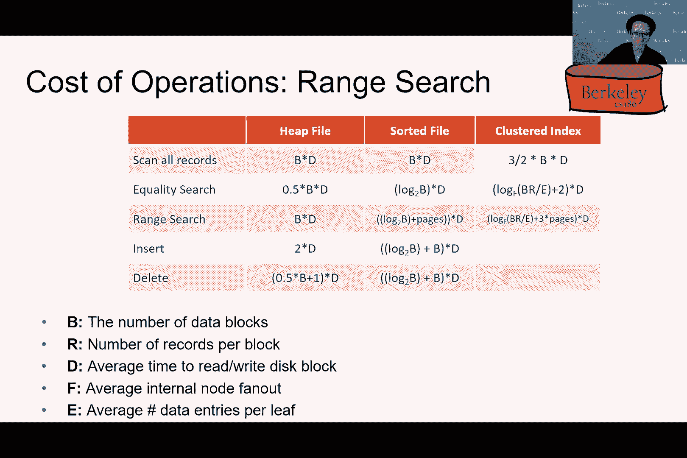

# 课程P6：索引与B+树优化 🗂️

在本节课中，我们将学习B+树索引的核心概念、操作及其优化。我们将探讨B+树的结构、搜索、插入、删除以及批量加载等操作，并分析不同索引设计选择的优缺点。

## B+树结构回顾 🌳

上一节我们介绍了索引的基本概念，本节中我们来看看B+树的具体结构。

B+树是一种平衡树数据结构，用于数据库和文件系统中的索引。它由内部节点和叶节点组成。

以下是B+树的关键组成部分：
*   **根节点**：树的顶层节点，是一个特殊节点。
*   **内部节点**：用于路由的节点，在图中通常用蓝色表示。它们包含键值和指向子节点的指针。
*   **叶节点**：存储实际数据引用的节点，在图中通常用灰色表示。它们包含键值和指向数据记录（如记录ID）的指针。
*   **指针**：叶节点之间通过指针（如前向和后向指针）连接，支持高效的范围扫描。

B+树中的页面（节点）在物理存储上不一定按逻辑顺序排列，但通过树形结构和叶节点间的指针，仍然能提供有序的数据访问路径。

## B+树的性质与规模 📏

了解了结构后，我们来看看保证B+树高效性的核心性质及其能索引的数据规模。

B+树需要维护**占用不变量**，以确保操作成本有界。
*   对于内部节点（除根节点外），其条目数 `n` 需满足：`d <= n <= 2d`。其中 `d` 是树的最小度数（通常为最大容量的一半）。
*   叶节点也需要满足类似的半满约束。
*   根节点可以例外，条目数可以少于 `d`。

这个性质保证了树的平衡，使得查找、插入和删除操作的时间复杂度为 `O(log_d N)`，其中 `N` 是记录总数。

基于此性质，我们可以估算B+树的容量。假设：
*   页面大小为8KB。
*   每个索引条目（键值+指针）占40字节。
*   则每页可存储约 `8000 / 40 ≈ 200` 个条目。
*   假设平均填充因子为2/3，则平均扇出 `f ≈ 133`。

那么：
*   一棵高度为2（1层内部节点+叶节点）的B+树可索引记录数约为 `f * f ≈ 17,689` 条。
*   一棵高度为3的B+树可索引记录数约为 `f * f * f ≈ 2.3 百万` 条。

实践中，由于扇出很大（通常可达数百甚至上千），B+树的高度很少超过4层，却能索引数十亿条记录，效率非常高。

## B+树的操作：搜索 🔍

现在我们已经了解了B+树的结构和性质，本节中我们来看看如何在B+树中进行搜索操作。

搜索过程从根节点开始，逐层向下：

1.  **查找键值**：在当前节点中查找第一个大于或等于目标键值的条目。
2.  **跟随指针**：根据比较结果，沿相应的指针进入下一层子节点。
3.  **到达叶节点**：重复上述步骤，直到到达包含目标键值（或应该插入的位置）的叶节点。
4.  **获取数据**：在叶节点中找到目标键值及其对应的记录ID（如 `(page_id, slot_id)`），然后使用该ID从堆文件中检索实际数据记录。

**范围扫描**是搜索的一种扩展。例如，查找所有键值 `>=27` 的记录：
1.  首先使用上述方法找到键值27所在的叶节点。
2.  然后，利用叶节点之间的前后指针，按顺序遍历后续的叶节点，获取所有满足条件的记录。
这种方法避免了为区间内的每个键值都从根节点重新遍历树，极大地提高了效率。

## B+树的操作：插入 ➕

上一节我们介绍了搜索，本节中我们来看看如何向B+树中插入新的数据。

插入操作的目标是在维护B+树性质（特别是占用不变量）的前提下，添加新的键值对。基本步骤如下：

1.  **查找叶节点**：使用搜索算法找到应插入新键值的叶节点 `L`。
2.  **情况一：叶节点未满**：如果 `L` 中有空闲槽位，则直接将新条目插入 `L` 的合适位置（保持键值有序），操作结束。
3.  **情况二：叶节点已满**：如果 `L` 已满，则需要分裂 `L`。
    *   创建一个新的叶节点 `L2`。
    *   将 `L` 中的条目（包括新条目）重新均匀分布到 `L` 和 `L2` 中。
    *   更新 `L` 和 `L2` 以及它们邻居节点之间的前后指针。
    *   将 `L2` 的最小键值（即其中第一个键值）**复制**到一个新的索引条目 `(key, pointer_to_L2)` 中。
    *   尝试将这个新索引条目插入到 `L` 的父节点中。

4.  **处理父节点插入**：向父节点插入新条目可能再次导致父节点过满，从而需要递归地进行**内部节点分裂**。
    *   内部节点分裂与叶节点分裂类似，但有一个关键区别：被提升到父节点的中间键值是**移动**而非复制。这意味着该键值不再保留在分裂后的子节点中。
5.  **创建新根（必要时）**：如果分裂一直向上传播到根节点，并且根节点也需要分裂，那么就会创建一个新的根节点。树的高度随之增加。这种情况在实践中很少发生。

插入操作本质上是**自底向上**的，这有助于保持树的平衡。

## B+树的操作：删除与批量加载 🗑️⚡

讨论了插入之后，我们来看看删除以及更高效的索引构建方法——批量加载。

**删除**操作在实践中的处理通常比插入简单。为了减少开销，许多系统在删除时并不严格强制占用不变量（即不立即合并未半满的节点）。它们只是简单地删除叶节点中的条目，并可能在页面完全清空时将其删除。这种“惰性”方法是可以接受的，因为后续的插入可能会填充这些空间，且树的对数级性能保证依然基本有效。教科书描述了更复杂的删除再平衡算法（如借用兄弟节点条目或合并节点），但本课程不作重点要求。

**批量加载**用于从头开始高效构建一个B+树索引，相比逐条插入有巨大优势。逐条插入的缺点是：需要多次从根节点搜索、修改随机页面导致缓存效率低、最终叶节点填充率可能不高。

批量加载算法步骤如下：
1.  **排序**：首先按键值对要索引的所有数据记录进行排序。
2.  **填充叶节点**：按顺序将排序后的记录填入叶节点页，直到达到预定的填充因子（例如75%），然后创建下一个叶节点。
3.  **构建内部节点**：在填充叶节点的同时，自底向上构建内部节点。当一组叶节点填满后，就为它们创建父节点条目。如果父节点变满，则像插入时一样进行分裂。
4.  **生长树**：这个过程持续进行，树的左侧部分一旦构建完成就不再被修改，从而实现了良好的局部性和缓存利用率。

批量加载的好处包括：
*   **更高的缓存效率**：顺序构建，局部性好。
*   **更优的叶节点填充率**：可控制初始填充度，得到更浅的树。
*   **数据物理有序**：产生的索引通常是聚集的（见下文），有利于范围扫描。

## 索引设计选择 🤔

我们已经掌握了B+树的基本操作，现在来探讨一些重要的索引设计选择，这些选择影响着索引的性能和特性。

主要设计选择集中在**叶节点内容**和**数据组织方式**上。

**1. 叶节点数据条目格式**
以下是三种常见的备选方案：
*   **方案1：存储完整记录值**：叶节点直接存储数据记录本身。优点：查找时无需额外访问堆文件。缺点：若一个表有多个索引，会导致数据冗余，增加更新开销和存储成本。
*   **方案2：存储记录引用（键值，记录ID）**：叶节点存储键值和对应的记录ID（如 `(page_id, slot_id)`）。这是我们之前一直假设的方案。优点：索引与数据解耦，支持多索引且无冗余。
*   **方案3：存储记录引用列表（键值，记录ID列表）**：对于有大量重复键值的情况，将一个键值对应的所有记录ID存储在一个列表中。优点：比方案2更紧凑。缺点：当列表跨越多页时需要额外的簿记管理。

方案2和3因其解耦特性而被广泛使用。

**2. 堆文件组织：聚集 vs 非聚集**
这与索引本身无关，而是与索引所指向的堆文件的组织方式有关。
*   **聚集索引**：堆文件中的数据记录**大致**按照索引的键值顺序物理存储。优点：范围扫描效率极高，因为连续访问磁盘页，可以利用预取和顺序I/O优势。缺点：维护聚集属性的成本较高（插入新记录时需要找到合适位置或定期重组）。
*   **非聚集索引**：堆文件中数据的物理存储顺序与索引键值无关。优点：插入简单（通常追加到文件末尾）。缺点：范围扫描可能导致大量随机I/O，性能可能很差。

聚集索引通常通过批量加载构建，并通过在页面内预留空间或定期重组来维护其聚集性。

## 操作成本分析 💰

最后，我们来量化分析使用B+树索引执行各种操作的成本。我们基于以下假设进行分析：
*   使用**方案2（存储记录引用）**。
*   堆文件页面的平均**填充因子为2/3**。
*   索引是**聚集**的。
*   我们只考虑**I/O成本**（即读写页面数），忽略CPU成本。
*   定义：
    *   `B`：堆文件中的页面数。
    *   `R`：总记录数。
    *   `D`：平均I/O延迟。
    *   `f`：索引内部节点的平均扇出。
    *   `e`：索引叶节点平均条目数。

以下是五种常见操作的成本估算：

1.  **扫描所有记录**
    *   **描述**：读取整个关系。
    *   **成本**：`1.5 * B * D`
    *   **说明**：由于填充因子为2/3，需要读取的页面数比完全填满时多50%。无需使用索引。

2.  **等值搜索（返回一条记录）**
    *   **描述**：查找具有特定键值的记录。
    *   **成本**：`(log_f(R/e) + 1) * D`
    *   **说明**：`log_f(R/e)` 是遍历索引内部节点到达叶节点的I/O次数（即树高-1），`+1` 是读取叶节点本身。找到记录ID后，还需要一次I/O来读取堆文件页面。

3.  **范围搜索（返回多条记录）**
    *   **描述**：查找键值在某个范围内的所有记录。
    *   **成本**：`(log_f(R/e) + 1.5*#匹配页数 - 1 + 1.5*#匹配页数) * D`
    *   **说明**：第一项是找到范围起点的成本。第二项是扫描索引叶节点以获取所有匹配记录ID的成本（估算为1.5倍匹配页数，并减去已计数的第一页）。第三项是读取堆文件中所有匹配页面的成本（同样考虑填充因子）。由于索引是聚集的，堆文件的访问相对顺序。

4.  **插入**
    *   **描述**：插入一条新记录。
    *   **成本**：搜索成本 + 分裂成本（若发生）+ 写入成本。最坏情况下可能涉及多次页面写入（修改叶节点、父节点等）。

5.  **删除**
    *   **描述**：删除一条记录。
    *   **成本**：搜索成本 + 修改页面成本。若采用惰性删除，成本较低。

这些分析表明，B+树索引在点查询和范围查询上通常优于简单的堆文件或全排序文件，尤其是在处理大型数据集时。其对数级的访问复杂度、对范围扫描的良好支持以及动态平衡的能力，使其成为数据库系统中事实上的标准索引结构。

---

**总结** 🎯

在本节课中，我们一起深入学习了B+树索引。我们从B+树的结构和性质出发，详细探讨了搜索、插入、删除以及批量加载等核心操作。我们还分析了不同的索引设计选择，包括叶节点数据格式和聚集与非聚集索引，并对比了它们的优缺点。最后，我们对各种操作进行了成本分析，理解了B+树为何能成为数据库系统中高效、可靠的索引基石。掌握这些知识，对于设计和优化数据库系统至关重要。