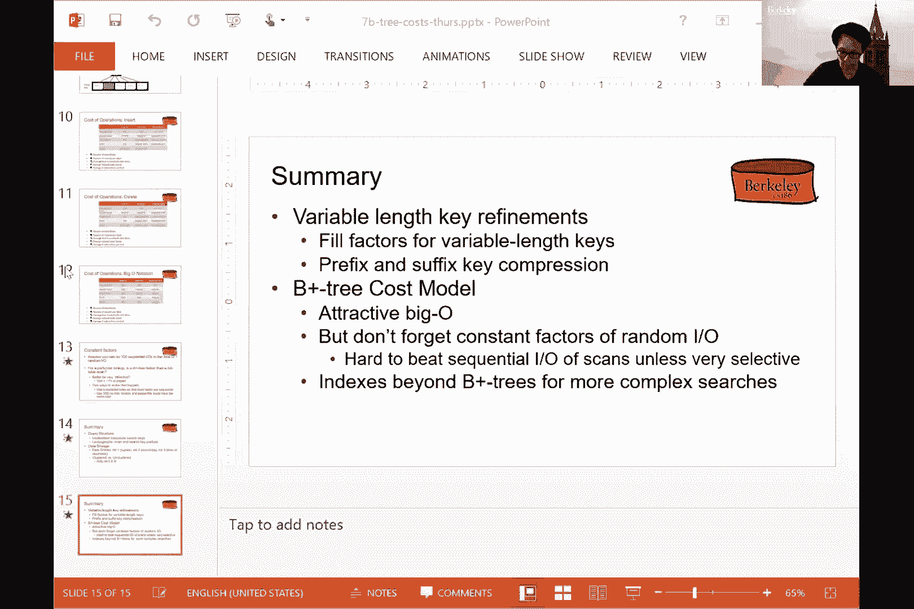
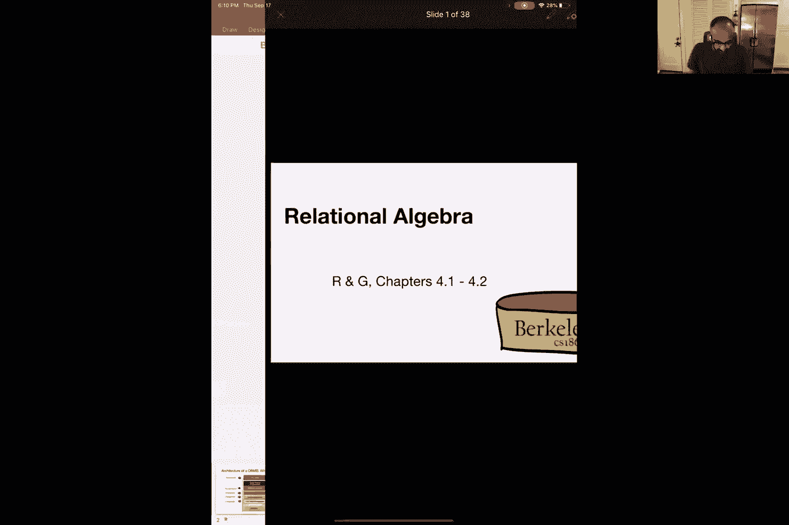
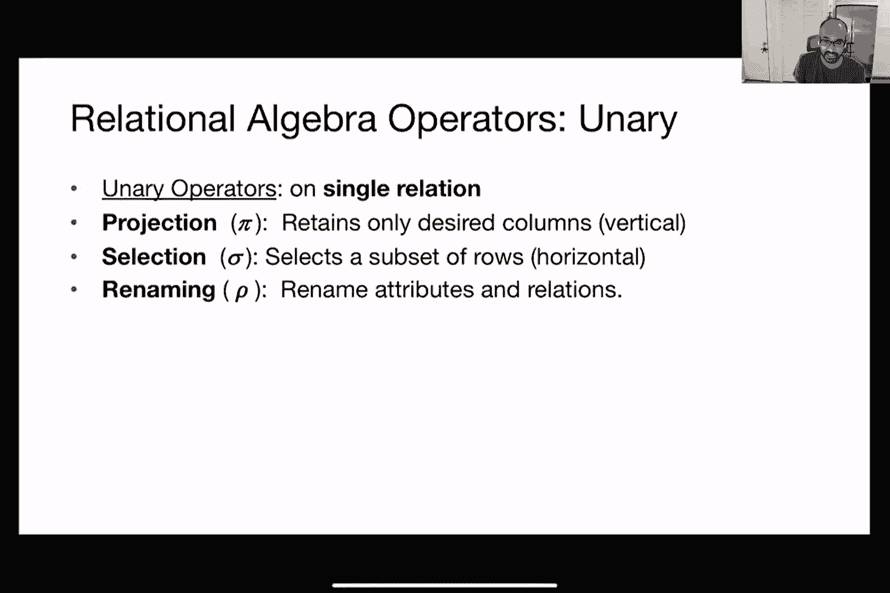
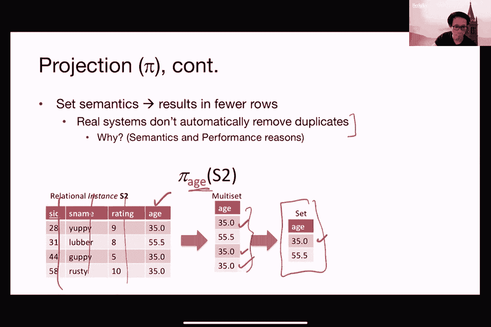

# P7：第七讲 缓冲管理 - ___main___ - BV1cL411t7Fz

好的，我想它正在录制。

好的，酷。好的，太好了。那我们开始吧。大家好，欢迎来到星期四的 186 课程。今天，我想总结一下我们上次星期二关于 B+ 树的讨论，然后我们将进入下一个主题。

这就是缓冲管理的内容。我想做一些复习。这是我们在星期二展示的第一张幻灯片，讨论的是计算与索引相关的不同操作的开销。在这一页中，我们只展示了堆文件和排序文件的情况，正如我们上周讨论的那样。我想让你们记住的一点是，对于某个操作，…

我们关注的是平均情况的开销，因为最坏情况总是一样的，无论是对于文件还是排序文件，当然也包括索引。所以那样比较无聊。另外需要记住的是，读取和写入磁盘都会产生 IO 开销。

然后，像你们知道的，br 和 D 基本上是我们之前定义的三个常数。在这门课的索引部分，我们将假设我们有一个聚集索引。所以所有内容都是排序的。我们假设一个二分之三的因子。然后，fan out 这个变量，我在这里定义为 F，基本上是树内的内部分支因子。

这也是我们在星期二已经讨论过的内容。除非我们讨论的是插入和更新操作，否则我们假设这是一个静态索引。在我们尝试读取它时，没有其他人会修改索引。

我们已经实际讨论了前三种类型的操作，在星期四的课上。所以我不会重复前两种类型。我可以，但现在让我们再回顾一下这个范围查询问题，尝试计算与这个操作相关的开销。

正如你们回忆的那样，我们使用索引进行范围查询的方法如下。第一步，我们使用索引来确定我们需要读取的对应堆文件页面作为起始页。记住，在这个例子中，我们试图找到所有 3 到 7 之间的记录。

这些操作可能会跨越多个堆文件，或者堆文件页面。因此，我们首先会使用索引来确定需要读取的第一个页面。然后我们会扫描索引中的叶子页面，找出其他我们希望读取的堆文件页面。所以记住，在索引中，我们仅仅存储的是指针。

我们实际上并没有存储实际的记录，因此我们首先需要扫描索引中的叶子页，以确定哪些堆文件页存储了记录，在这种情况下是三到七之间的记录。然后实际上从堆文件中读取相应的页面。因此，在这种情况下，你可以看到它出现在屏幕底部。

那么与这三步操作相关的I/O成本是什么呢？第一步基本上就是我们之前看到的内容，对吧？因此，这个锁号对应的是我们需要通过索引访问的次数，以便到达第一页的叶子页。

所以再次注意到这里有一个加一的操作，因为在这节课中，我们将树的高度定义为除去叶子层级之外的所有内容。因此我们实际上需要加回这个加一的操作，以考虑到我们正在获取第一页的事实。

第一个叶子索引页对应的是键值为三的记录。第三步，我们上次讨论过的，就是页数的数量，这里的页数对应的是存储键值在三到七之间的记录的页数。

在这种情况下，它是三。然后我在这里展示的三分之二数值就是为了考虑到每个堆文件页假定只有三分之二满的情况。因此，我们需要实际获取更多的堆文件页，以便存储与之前相同数量的记录。

所以这就是为什么我们在这里有这个三分之二的原因。最后，关于扫描索引中叶子页的IO数量，我将其近似为与步骤三相同。这个近似值肯定是一个过度的估算，因为索引叶子页显然可以存储更多的指针。

信息量显然比堆文件存储的要多，因为堆文件实际存储的是记录。但在这节课中，我们将做这个近似处理，使得数学看起来更简单。所以这项操作的总成本就是将这三步加起来。因此你会注意到，在这种情况下，我们实际上需要减去一。为什么要减去一呢？因为我们重复计算了从索引读取的第一个叶子页。

对的，这里加一是因为我们需要考虑读取索引中叶子层级的实际第一页。但是对于步骤二，我们实际上也已经计算了这个数字。因此，为了避免重复计算，我们需要减去一，以确保账目正确。所以这就是为什么我们最终会看到屏幕右侧这个数字的原因。

所以这里是总成本，实际上我给你展示的总成本是我从前一页计算出来的这个数字。到目前为止，关于范围查询有任何问题吗？很酷。那么现在我们来谈谈插入操作。

那么我们应该如何进行插入操作呢？假设我要将记录4.5插入到数据库中。请注意，我们也需要经历三步。第一步，我们需要通过索引来确定实际修改哪个页面以插入这条记录。第二步，我们读取相应的键文件页面，并进行实际修改。

在这种情况下，我们需要修改这里用蓝色标记的页面。最后，我们需要修改索引的叶子页面和我们在底部标出的蓝色页面。所以，我们需要更新索引中的叶子页面，因为我们已经插入了一条新记录，并且我们必须插入一个新的指针。然后，我们显然也需要更新键文件，因为我们已经向数据库中插入了新内容。

对的。那么这三步的成本是什么呢？第一步和之前一样。我们需要基本上上下索引，所以这将是索引的高度加一，因为我们需要读取索引的叶子页面。

然后第二步的成本其实就是1，因为我们已经知道需要读取哪部分键文件，而且在这种情况下我们只插入一条记录，因此只需要抓取一个页面。

最后，第三步，我们实际上需要执行两个I/O操作，因为我们需要将修改后的键文件页面和索引修改后的叶子页面都写回。这样理解吗？抱歉，你能重复一下为什么要进行两次操作吗？第二次操作是因为我们需要将修改后的键文件页面（在蓝色部分看到的）和索引中的叶子页面都写回，因为我们已经向数据库中插入了新记录。

键文件。因此，索引叶子页面需要存储该记录实际所在的位置。请记住，在这种情况下，我们假设不对索引进行拆分，不会增加树的层级，也不会增加高度，因此目前这部分都可以忽略。所以我们纯粹是将另一个指针添加到索引底部。好的。那么总成本就是你在屏幕上看到的这个数字。

将三步的总和加起来。就这样。所以这是与插入相关的成本，然后我不会展示细节，插入操作基本上是相同的处理方式，我们只需要进入第三级，然后修改我们需要修改的页面。

然后，正确地返回相应的页面。因此，上一节课结束时，有一个非常好的问题被提出，问到，嗯，我们真的需要那么精细，真的需要经过这些实际的细节并做所有这些不同的计算吗？

对的，为了弄清楚实际的成本是什么。答案，嗯，不完全正确。所以我们其实可以使用你们可能已经学过的大O符号来做这个。这样，如果我们用大O来抽象这些，你会看到这里有一个非常清晰的图景。对吧？举个例子，如果我们和相等查找进行比较。

你可以清楚地看到，使用索引实际上比使用某种文件要好得多。对吧？这里的区别基本上是这个对数的基数。如果你还记得上节课的内容，这个数字F通常会是一个非常大的数字。所以通常情况下，对于每个叶节点内部的节点，我们可以指向许多不同的叶节点。

因此，这个F会比类似2之类的数值大得多。所以，如果我们使用索引，与使用某种文件相比，相等查找的成本会低得多。当然，如果与使用堆文件比较，结果也是一样的。在某些情况下，堆文件实际上会占优，比如在插入的情况下，堆文件是常数成本，因为我们只需要把新记录附加到堆文件的末尾，仅此而已。

相比之下，索引聚集的情况，我们需要更新索引，首先要在索引中进行搜索。然后我们还需要支付在堆文件中某个地方进行附加写操作的成本。这样一来，成本会更高。所以这就是为什么在这种情况下，大家都会说，没有一种方法适用于所有情况。对吧？这取决于使用场景以及模式。

实际上我们讨论常数因子的原因是有原因的。就像我之前向你们展示那种复杂的算术图景。原因是，因为如果你还记得磁盘讲座的内容，顺序IO的成本实际上和随机IO的成本是完全不同的，至少对于磁性旋转磁盘来说是这样的，如果你还记得的话。

假设比例是1比100，对吧？所以我们做一次随机IO，我们可以做100次顺序IO，假设是按页面读取的。我显然是在胡编乱造，但为了讨论的方便，假设一下。那么这意味着什么呢？在B+树中，我们需要遍历树中的不同层级。每一个内部节点的页面读取，基本上都会是一次随机IO。对吧？

肯定不是顺序的，因为我们可能会跳到树的另一端。所以每一个IO都会是随机的。因此，如果我们找到这个论点，那么与其做一个单独的随机IO，我们本可以做更多的顺序IO。事实上是1比100。所以这意味着什么呢？这意味着我们在从B树读取页时最好非常挑剔。

因为否则我们可能就能做得更好。如果我们只做堆文件。事实上，在这种情况下，给定1比100的比例，这基本上意味着我们最好是访问非常少的页，进行随机IO。换句话说，你知道这个索引对吧？希望它没有很多页，我们需要遍历才能到底到底叶子页。

否则就不成立了，对吧？为什么我们要使用索引？我意思是，直接使用键文件然后扫描所有内容不就行了。通常有两种方式来确保这种情况。首先是尽可能使用聚集索引。基本上这意味着我们只需要在初始成本上做一次遍历，查明哪个是要读取的叶子页。

然后，一旦我们到达堆文件中的第一页，我们就可以根据需要获取这一页，如果我们在做等值查询，或者我们可以根据范围查询的情况进行顺序读取。所以这是一个可能性。另一个可能性，你可以称之为一种变通方法，就是基本上不使用旋转文件。你知道，使用闪存驱动器，因为闪存驱动器有一个特点，就是顺序读取和随机读取的成本是一样的。

所以在这种情况下，我们就可以摆脱困境了。所以这不是你能在这里玩的小把戏，只是我想提到的两点中的一部分，目的是给大家提供一个大致的理解。罗曼，你有问题吗？是的，你可能提到过，但我不知怎么漏掉了，什么是全表扫描？B+树本质上是一个表的数据结构吗？

树是索引的数据结构。所以对于全表扫描，实际上我们不需要使用树，因为我们只是扫描所有的堆文件。所以即使我们有索引，它也不会被使用。因此，唯一会产生差异的情况是如果我们正在执行前一张幻灯片上显示的这些操作之一。

所以假设我正在进行插入操作。那么在这种情况下，需要同时更新索引和堆文件。所以这时会产生额外的成本。然后如果我想进行等值查询，类似地，决定是否使用堆文件或排序文件是基于用户的，还是取决于数据。

这是个很好的问题。在大多数数据库实现中，这个选择实际上通常是交给用户的。所以作为用户，我们实际上可以定义或者声明我们想用哪种类型的数据结构来存储堆文件。

堆文件，比如用来存储实际数据的部分。以及你用来存储索引的数据结构。所以我们可以声明聚集索引，也可以声明非聚集索引，这由我们作为用户来定义。然后我们就能真正回答这个问题，因为这基本上是把问题抛给用户，让用户自己解决。

所以实际上通常发生的情况是，数据库管理员需要提前了解工作负载的特点。我们是在讨论插入密集型的工作负载，还是查询密集型的工作负载？如果是这样，你就可以根据这一点选择合适的数据结构。

所以我们会随着时间调整它们。也许最初我们为某个特定属性声明了一个聚集索引，但事实证明人们并没有对这个特定属性进行太多查询，因此我们可能会选择另一个属性来代替作为聚集索引。

这也可能发生。是的，你有问题吗？请再说一遍“selective”是什么意思？是的，这里“selective”只是意味着你不要读取太多的页面。这不是一个技术术语，基本上就是在说，不要做太多随机的I/O操作，只是为了论证这个比例，如你在这个幻灯片上看到的。好的，谢谢。那么，如果SSD在随机读取时几乎有相同的成本，这是否意味着SSD使用的是源文件或热文件？

是不是这样，或者是其他结构在使用呢？这意味着在这种情况下，使用什么数据结构并不重要，所有这些我们正在使用的数据结构实际上都是软件实现的。

所以这不像是硬件方面的事情，我们做的这些基本上都是软件实现的。好的，明白了。是的。但当然，如你所知，快速驱动器更贵，所以你实际上是在为正确的做法支付额外的费用，所以需要注意这一点。

所以总的来说，在这部分课程中，在过去的两节课里，我们讨论了不同类型的树形结构，我们也讨论了数据存储，TIA基本上提到的就是这些不同类型的索引以及实际数据是如何存储的。

然后刚才我们也讨论了，比如B+树和与之相关的成本模型。所以显然，正如你可能知道的那样，实际上有很多不同类型的索引结构，而不仅仅是B+树。

所以，如果你感兴趣的话，我鼓励你进一步探索。实际上，很多东西是特定于领域的，也取决于你有什么样的预期使用场景。所以，如果你准备好了，或者有问题的话，随时可以提问，如果没有问题的话，我就会切换到下一个讲座的幻灯片。

这期间还有其他问题吗？

好的，那么如果没有问题的话，我再试着分享一次。

很酷。那么，对于下一个讲座，我们将要讨论的下一个主题是缓冲区管理。这里是你们之前看到的关于数据库内部的系列讲座的大图。我们已经讨论过 SQL 客户端了，你们从第一个项目开始就已经接触过它了。你们也已经玩过 SQL 类似的工具，或者说你们知道一个 SQL 客户端是什么样子的。

我们已经讨论过磁盘，谈到了一些相关的技术，还讨论了这些是如何组织的。我们讨论了索引，讨论了如何以不同的方式组织文件，也讨论了不同的索引结构。

那么现在让我们来谈谈缓冲区管理。我假设你们中的大部分人可能不太明白“缓冲区管理”是什么意思。其实它只不过是另一个抽象层次。对吧，正如常说的那样，计算机科学中的任何问题都可以通过增加一层抽象来解决。那么如果我们已经有了磁盘的抽象，为什么不也为缓冲区，或者换句话说，为内存做一个抽象呢？

类比是这样的。对于磁盘空间管理，我们有磁盘，我们有磁盘空间管理，它基本上抽象化了磁盘。现在我们在讨论如何抽象化主内存。对，在这种情况下，主内存就像 RAM，通常情况下是这样的。好吧，这就是我们所说的缓冲区管理。

它是如何工作的？它是如何组织的？正如你们记得的，磁盘空间管理器基本上有所有这些不同的页面，在它的实现中。接下来的几次讲座中，我们基本上是在讨论如何将页面加载到内存中。

所以我们谈到的磁盘抽象基本上就是这种结构，你知道，页面结构作为最底层的部分。因此，对于主内存，我们也要做同样的事情，但我们叫它别的名字，这样就不会让我们在理解页面的概念时感到困惑。所以我打算使用“框架”这个术语，它也是你的教科书和下文中缓冲区管理器所使用的抽象，来表示主内存。

就像我们有数据页面一样，我们也可以将数据从磁盘加载到主内存中的这些框架中。例如，在这种情况下，我已经将三个不同的页面从磁盘加载到了缓冲区管理器中的三个不同框架中。所以，和磁盘空间管理器一样，缓冲区管理器也试图创造一种错觉，让我们像操作内存中的框架一样操作，而不是需要处理多个层级的RAM，或者是分布式的，或者是你知道的本地RAM等等。

所有这些都被抽象化为框架和一些内容。好的。在API方面，其实与磁盘空间管理器提供的非常相似。所以我们称磁盘空间管理器提供的API是读取和写入页面。类似地，缓冲区管理器也会提供这个API，用来做一些你知道的事情。

快速读取一页，或者写入一页，或者写入一份，嗯，或者写入一个框架，例如。通常操作是这样进行的。所以数据库实现中的更高层级会调用缓冲区管理器的API，基本上是说：“我想从磁盘读取第一个页面。”于是缓冲区管理器会检查页面编号一是否已经存在于他的某个框架中。如果存在那是这样，但在这种情况下并不存在。

它将去与磁盘空间管理器进行交互，请求它获取页面编号一，并将其放入缓冲区管理器的一个框架中，然后返回给更高层级。一样的事情，你知道的，如果有另一个请求，比如请求读取页面编号二，我们就照做，去磁盘读取，因为它还不在内存中。

将其加载到其中一个框架中，然后像之前一样返回，依此类推。你们可能会想到，你们的缓冲区管理有什么问题呢？在这个框架下，涉及到两个问题，首先，如何处理30个页面。其次。

当我们运行完所有的帧时会发生什么呢？正如Alex所说的。那么，我说的脏页面是什么意思呢？我们将对数据库进行修改，比如更新记录、插入或删除内容。因此，所有我们加载到主内存中的页面都会被标记为脏，意思是它们已经被修改。所以我们需要能够处理这些页面，将它们写回磁盘，以便保持持久性。

那么，缓冲区管理器如何知道哪些页面实际上已经修改了呢？一个解决方案是始终将它拥有的每一个帧都写到磁盘上，但这会造成浪费。所以我们需要做一点点账务管理。我们将在每个已加载到主内存中的页面中加入一个脏位。

然后，我们将标记该脏位为1，如果数据库实际上修改了这个页面。对于脏页面，我们需要将它写回磁盘管理器，这一点我们在上一讲已经讨论过了。

到目前为止，你们应该已经是专家，能够评估执行这些操作时的成本了。那么，在我们进入“如果我们运行完所有帧会发生什么”这个问题之前，可能还会有两个问题需要我们讨论。

第一个问题是，如果对一个已经加载到内存中的页面进行多个并发操作会发生什么？这种情况怎么发生呢？也许你有两个不同的查询同时运行，试图更新不同的记录，甚至是同一条记录，位于那个已加载到某个帧中的页面上。

好的，记得我之前给你们展示的那张图吗？有一个跨越性模块，叫做并发控制机制，我们将在本学期后续讲解，它负责处理这种特定情况。所以，如果你有关于这个的疑问，耐心等待。

那么如果系统在缓冲区管理器能够将数据写回磁盘之前实际上崩溃了，会发生什么呢？这也是不好的，因为我们试图插入一堆记录，你知道，它们被放入了内存并进行调整。但然后，整个系统崩溃了，数据并没有被真正写入磁盘。那么，这就是为什么我们还需要另一个跨越性的组件——恢复管理器。

这两个方面的操作都是跨越性的，因为它们不仅仅涉及缓冲区管理器，还涉及磁盘管理器。如你所见，磁盘管理器试图写入某些数据，而就在它实际写入数据之前，数据还没有写到磁盘的某个盘片上。

整个系统崩溃了，对吧？那现在怎么办？同样的问题。然后如果像你知道的那样，多个页面，多个API从磁盘管理器发出调用，试图将同一页面写回磁盘，会发生什么？

所以我们需要有一个并发控制机制。但正如我所说，稍后学期的后半部分我们会详细讨论这些内容，所以现在不用担心，如果你的问题是关于这个的。对，是的。那么我的问题是，操作系统中的缓冲区管理和这个有什么不同？非常好的问题，稍等一下，我会尽力回答，如果没有的话，就像你知道的，可能又是一个种族问题。

好的，谢谢，没有其他问题。那么，让我们来看看缓冲区管理器的实现到底是怎样的，内部到底发生了什么。如我所说，我们需要跟踪一堆页面。所以它通常的工作方式是，缓冲区管理器调用操作系统，尝试分配大量的内存。这也回答了兴趣的问题，知道吗，和操作系统有什么不同。

它非常相似，除了就像在这个管理器的例子中，如果你记得我前两周的讲座，讲的是我们如何绕过操作系统来进行内存分配，比如说分配一个巨大的文件，然后声称我们自己在管理它。这是同样的道理。

我们请求操作系统基本上给我们需要的所有内存，然后我们只告诉操作系统请离开。如果你上过162课或者任何一个162的同学在这里，你们可能会说你知道的，你们可能会说操作系统其实也能管理这些，为什么我们要在数据库管理器内部做这个？

数据库系统对工作负载有更精确的信息，这在某些情况下比操作系统更好，知道吗，比如我们什么时候想把特定页面写回磁盘。因此，对于我们所知的大多数数据库系统实现，我们基本上只是试图通过请求操作系统分配一大块内存，像在这个管理器的例子中一样，来接管操作系统。

所以这不是唯一的设计，你完全可以选择不依赖操作系统，如果那是你想要的。但我在这里声称，数据库系统通常对如何使用这些页面的工作流程有更多的应用知识或了解，因此它可能比操作系统更好地利用这些资源。

这是缓冲区管理器的第一部分。我们需要跟踪所有这些不同的帧，并且需要做一点账务管理。正如我所说，我们需要以某种方式存储这个固定计数位，基本上表示每个被载入帧的页面是否已被更新。为了实现这一点，我们会使用一个小的数组或者类似哈希表的结构，这完全是在内存中进行的。

所以这基本上就是为每个帧存储我们实际上获取了哪个页面，如果有的话。然后我们基本上会记录，比如说它是“被固定”的，或者是否为30。这部分的固定计数我们稍后会详细讨论。

好的，接下来是问题。脏位基本上表示我们是否修改了已载入主内存的某个特定页面。一个典型的操作是这样的：我们将所有这些页面从磁盘载入到这些帧中。

其中一些页面会被数据库修改，作为更新、插入或删除的一部分。还有一些可能会被数据库读取，因为它试图响应查询。因此，在所有这些情况下，我们都不希望丢弃那个页面。我们不能将页面写回或驱逐它，或者清空那个帧，因为其他查询仍在操作它，无论是写操作、读操作还是其他操作。所以，这就是固定计数派上用场的地方。

所以，固定计数基本上会告诉我们，某个查询实际上在操作这个页面。因此，请不要清空它，也不要驱逐它。请注意，这与脏位是不同的。

因为查询可能只是读取页面，而实际上并没有修改它。即使在这种情况下，我们也不希望该页面被驱逐。因此，绝对可以确定，如果有人因为写操作而进行修改，我们肯定不希望通过像清空页面或将其写回等操作来移除该页面，因为操作可能尚未完成。

对于读取操作也是一样的。所以我们使用这个固定计数来跟踪多少个查询实际上在操作一个单一页面。仅仅使用一个二进制的零或一是不够的。你们觉得这是为什么呢？为什么我们需要记录它作为一个数字，而不仅仅是一个二进制位来表示“是”或“否”？有谁知道吗？我们需要确保在驱逐页面之前，所有在页面上的用户都已经完成了操作。

完全正确，假设我们有多个查询试图读取某个特定页面，比如第六页。那么即使其中一个查询已经完成，我们仍然需要确保在驱逐第六页之前，其他查询也已经完成。

所以，这就是为什么仅仅使用一个数字作为二进制变量并不足够。做得好。那么接下来会发生什么呢？如果请求一个页面，正如我所说，如果我们发现一个页面实际上不在缓冲池中，那么我们首先要做的就是弄清楚是否有一个页面可以替换，可能是一个没有被固定的页面。

然后，如果页框实际上是脏的，那么我们就把它写回磁盘，然后标记该位置为可用。接着，我们从磁盘管理器那里读取数据，对吧，然后就这样，之后我们将它返回，经过固定操作，因为我们现在知道有人正在操作我们刚刚带入内存的那一页。

现在，如果我们能以某种方式预测哪些页面将会被使用，那将会是非常好的。同样，对于磁盘管理器来说也是如此，如果我们能预取它们，那就太棒了。因为正如你记得的那样，所有与顺序读取相关的操作都很有利，因此我们可以进行顺序扫描，这对磁盘来说是非常好的。对于缓冲管理来说也非常有利，因为我们知道需要多少个插槽才能分配，因为我们...

因为如果这样做的话，我们可以预测将有多少个页面会被操作。所以，当然，百万美元的问题是，如果缓冲池实际上已经满了会怎样？除此之外，我们还需要驱逐一些已经存在的页面。为了有系统地处理这个问题，我们决定到底驱逐哪个页面是基于一个叫做页面替换策略的东西。

有许多不同的页面替换策略，为了本课程的目的，我们只描述了两种当前实际实现中使用的最简单策略。第一个叫做最近最少使用（least recently used），或者简称 LRU。

这里有一个叫做时钟策略（clock policy）的近似方案，实际上它是你的一种修改。然后还有一个叫做 MOU 的东西，我们将在本课程中讨论。现在，所有这些实际上都会对 IO 的数量产生巨大影响，正如你可以想象的那样，因为根据我们将驱逐哪一页，决定了我们能够带入内存的页数。而我们将页带入内存的方式，取决于我们是否正在进行顺序读取或随机读取，正如我们已经看到的那样，这对整体成本有很大的影响。

那么 MOU 策略是什么呢？其实很简单。我们基本上是尝试驱逐最近最少使用的页面，正如名字所示。所以我们基本上首先要做的是，不会驱逐任何被固定的页面，因为我们知道这些页面不能被替换。然后我们会以某种方式追踪每个页框自上次固定以来已经过去的时间。

然后，我们就选出最后使用时间最久的帧，也就是那个最久未使用的帧，接着驱逐它。例如，在这个例子中，我添加了一个“最后使用”列，这也是缓冲池管理器所保留的元数据。

然后，你知道在这种情况下，我们应该驱逐哪一个？我们只需要驱逐那个使用最少的条目，就像你看到的这个111，对吧？你应该能回想起来，这其实是在61 C课程中已经讲过的内容。

对，为了提醒自己这个是什么意思，我实际上去了61 C课程的网站检查了一下，确认这部分内容确实已经讲过。只是这次是在不同的上下文中讲的，在这门课上他们是在讨论如何确定驱逐哪些缓存条目。

这里的情况类似，区别在于我们不是驱逐缓存条目，而是从缓冲池管理器中驱逐页面或帧。某些情况下，实际上两者是相似的。而且为了确保我们理解，我想起了某些古老的学期内容，实际上这些内容是在春季学期讲过的，只是为了确保我们都在同一页上。

好的，正如我所说的，在这种情况下，我们将驱逐第一个最少使用的页面，也就是根据最后使用时间来看，帧号四的页面，它基本上是最少使用的。如果我们需要第二个页面，我们将驱逐第二个最少使用的页面，在这个例子中就是那个使用了15次的页面。

显然，这是一种非常简单的策略，你可以想象得到。而且它对时间局部性也很有效，就像我们在61 C中讨论的那样。可是，这种策略实际上是有成本的，因为我们需要不断地找出最少使用的页面。为了做到这一点，我们不仅仅需要保留这个“最后使用”列。

你还可以运行一个查询，换句话说，找出最后使用的页面。解决这个问题有不同的方法。例如，有一些专门的数据结构可以用来找到最小值。例如，优先队列（priority heap）就可以使用，或者我们也可以扫描所有的页面，找出哪个是最少使用的。我意思是，你可以使用你喜欢的任何算法。所以，我们还可以做一些近似处理。

假设我不想根据最后使用的编号来记录每个人，但我仍然希望近似实现最近最少使用（LRU）。我该怎么做呢？我们可以使用一种叫做时钟策略（clock policy）的方法。以下是缓冲池管理器的状态，就像我们之前讨论的那样。

我们使用这个时钟机制的目的是，它基本上是一种近似的方案，用来找出最不常使用的页面。大致来说，它并不总是会返回真正最不常使用的页面，但它可以返回一些实际上并非最常使用的页面。

但在维护这个数据结构的开销方面，它会更简单。所以让我们看看它是如何工作的。正如其名，它叫做时钟，因为我们实际上有一个时钟指针。它基本上是下一个我们将考虑作为驱逐候选的页面。所以。

在每个页面中，我们将添加一个额外的位，叫做参考位。它基本上是我们用来跟踪这个页面是否是最近被使用过的内容。你很快就能明白它是怎么工作的。所以我们不再追踪这个数字了，对吧？我们追踪的是它最后一次被使用的时间。

我只是修改这个，只使用一个位，就像我之前说的那样。然后我们会保持这个额外的变量，叫做时钟指针，正如我之前提到的，来确定我们应该检查的下一个页面是什么。

所以，接下来工作的是这样的。假设现在有某个请求，想要读取页号七，而它当前不在缓冲区。所以我们将查看时钟指针，看看是否应该驱逐当前时钟指针指向的、已经固定的页面。

所以这页并没有被驱逐，因为它已经被固定了。有人正在查看这页，因此我们不能驱逐它，所以跳过这一页。然后我们将时钟指针移动到下一页。所以接下来的页面现在也要进行相同的检查，意思是它是否被固定？不，它没有被固定。

但是这个参考位在这里实际上是一个标志。所以它基本上意味着这可能是最近被使用过的内容。所以我们也将跳过这一页。我们将再次前进时钟指针。然后我们会找到一个页面，在这个例子中是页号四，它没有被固定。

并且也不会根据这个参考位来设置，意味着它是某个被读取或使用过的内容，且距离现在的时间已经有一段较远的距离了。所以在这种情况下，这实际上就是我们将用页号七来替换的页面。所以，现在我们已经将页号七带入缓冲池，我们需要确保在接下来的周期中不会将其驱逐。就像你知道的那样，假设在下一个周期。所以，这正是通过设置这个固定标志，因为有人正在读取它，同时也设置你在这里看到的这个参考位来实现的。

对。在这种情况下，我们设置了第七页的参考位，因为这表示我们最近将这个页面加载到主内存中。然后我们会依赖它，因为我们知道其他地方也会使用它。

就像你知道的，返回之后。对。我们只是推进时钟，因为基本上这意味着下次当我们需要驱逐另一页时，我们不会立即驱逐第七页，而是会查看下一页。在这种情况下是第五页。然后我们会把指针返回给第七页，传递给上层，然后我们就完成了。

大家能理解吗？有没有人对这个策略有问题？我有个问题，关于参考位的，能重复一下这是怎么回事吗？参考位基本上是一个近似值，用来表示某个页面最近是否被使用过。哦，所以这是取代之前的方法，我们不再统计页面被访问的次数，而是只用一个位来表示。

所以如果我们访问一个没有固定但参考位已设置的页面，比如这个例子中的第三页，我们不会驱逐它，因为这表示它最近被使用过。但我们会取消设置这个位，对吧？因为下一次访问时，它就不再是最近使用的页面了。不管“最近使用”是什么意思，反正这就是一种近似值。所以如果你遍历这些页面而不使用它，就会取消设置这个位。

这就是它们被移除的方式。嗯，所以一页需要先取消固定，然后再取消设置，之后才会被视为候选页来进行驱逐。明白了。那么取消固定是在查询完成后进行的，对吧？这点我们理解了。

然后这个取消设置位的操作是由时钟指针完成的。所以每次访问一个取消固定但参考位已设置的页面时，我们会做的事情就是取消设置那个位，然后继续前进。我们不会立即处理那个页面。所以这就是这里的近似方法。Felix。

那么这种方法是像约定俗成只使用一位吗？还是有什么原因不允许我们使用两位或三位，比如说当页面数量很大时？是的，没错。实际上，一个位就足够了，基本上可以通过它来通知时钟指针，表示这个页面最近被使用过。

所以你刚才问的问题是，为什么不使用更多的位来表示呢？当然。实际上，我们可以使用32位。若使用32位，那么我们就回到之前的策略。我们只是精确追踪某个页面最近是否被使用，就回到整数的表示方式。谢谢。是的，明白了，实际上我们就是在用32位、64位或者其他任何单一位来近似表示。

所以，你知道，如果有一种情况，所有页面都被固定了。有没有办法让其他页面进入呢？是的，那么在这种情况下，我们真的很糟糕，对不起。如果所有页面都被固定了，那就意味着某个查询正在触及所有这些页面。所以我们能做的唯一事情就是推迟处理下一个查询。

谢谢。我会再买一些。再见。所以这个机制。你怎么知道下一个应该是哪个呢？是的，所以这有点任意对吧，我只是用这种图示来表示一个旋转的时钟，基本上就是绕一圈，检查哪个页面应该成为下一个受害者。

但你基本上可以使用你自己的机制来搞清楚如何遍历这些页面，对吧。显然，我们不想总是只访问其中一个或两个页面，因为那样基本上意味着只有这两个页面会被淘汰，其他页面则不会，这样就不好了。

所以我们绝对想要遍历每个页面。但至于如何遍历，我是说，这有点任意。哦，然后H，抱歉，我不确定你的名字是什么。是的，挺好奇的，最不常用的数据结构是否曾经与LRU进行过比较，为什么LRU比LFU更受欢迎？

至少是我看到的最不常用的，所以一切都取决于对吧，事实上，这就是我们接下来想要讨论的内容，对吧，什么时候这种策略适用于这两种不同的策略，对吧，你已经可以看到这里的区别了。所以我实际上会认为，对于对流行页面的重复访问，这种策略其实是有效的，因为对于你和时钟策略来说都是如此。

我们不会淘汰那些页面，但我并不认为这是理想的情况，实际上，一切都取决于我们所拥有的访问模式，对吧。但至少在比较LRU和时钟策略时，你已经可以看到，时钟策略更便宜，因为我们不需要找到最近最少访问的确切页面。

最近最少使用。并且它的成本也较低，因为我们用一个单独的位来逼近数字，对吧。就像你知道的那样，这基本上是其中一个思路，然后你基本上可以尝试找到它们实际不同的情况，我实际上鼓励你去做这个，对吧，假设你想要和L进行比较。

F、U 或者其他任何方案。但即使在你的情况下，时钟策略也已经存在问题了。人们会思考这两种策略何时特别差。也许是当你访问像循环这样的东西时，但就像，是的，如果你正在访问某些内容，然后在一段时间后再次访问它，但这是一个重复的过程，你只会继续读这些东西。

没错。那么这是什么样的情况呢？假设我要重复扫描。那么我指的是什么呢？你看，屏幕底部我们有一个磁盘管理器，里面有七个不同的页面。假设我想按从第一页到第七页的顺序反复扫描。也许我们正在反复执行同一个查询，对吧？那么让我们来做个实验。

我们的内存里有六个页面，磁盘上有七个页面。如果我们先读取第一页，那就太好了，我们将它带入缓冲区。第二页也是如此，对吧，你明白了。我们基本上填满了这个缓冲池，里面是前六个页面。但现在有趣的部分来了，问题出在第七个页面上，因为我们需要逐出一个页面。

对了，现在我们每次都会错过对吧，为什么呢？因为我们尝试将第七页带入。然后根据我们的操作，我们将逐出第一页，因为第一页是最近最少使用的。好吧，所以在第七次尝试时，我们将带入第七页，逐出第一页。但是在这种情况下，我们会反复扫描这七个页面，从磁盘按这个顺序不断读取。

所以我们想要带回第一页，但不幸的是，第一页已经不在了，对吧？它不在缓冲池中。所以我们需要逐出一些东西。接下来要逐出什么呢？我们需要逐出第二页。对，我是说你明白我的意思吧？所以在这种情况下，我们基本上不会再得到任何缓存命中。对吧，因为我们总是需要带入一些内容。

就像你知道的，你知道我的意思吧？所以我们基本上只会不断地失去。因为这种情况发生得很频繁，所以有一个术语来描述它，叫做顺序洪泛。我们只是将缓存用各种不同的页面填满，但实际上对我们没有任何帮助。没有命中缓存，我们没有有效利用所有带入的不同页面。所以我们不如每次都直接去磁盘管理器。

那么我们怎么摆脱这种情况呢？在这种情况下缓存命中率是零，对吧？但是就像我说的，这种情况其实很常见，因为可能是同一个查询反复执行。

事实上，你会在处理连接时看到类似的情况。那么我们怎么才能做得更好呢？这就是为什么需要引入另一种方法——最近最常使用（MRU）策略。它的做法恰好与我们想要做的相反。在这种情况下，我们又被困住了，需要将第七个页面带入。

所以对于第七个页面，我们实际上不会淘汰最久未使用的页面，而是淘汰最近最少使用的页面。在这种情况下，它会是页面六。太好了，我们淘汰了页面六，加载了页面七。然后再次循环，我们需要读取页面一，太好了，页面一已经在缓冲池中了。

所以，页面一已经在缓冲池中了，我算作一个缓存命中。对吧。你可以称之为缓冲命中或者框架命中，随你怎么叫。基本上就是在说我们不需要去磁盘管理器加载那个页面。同样，页面二也命中了。

所以你看到这里的计数在增加，第三个页面也很棒，已经加载进来了。第四个页面也是一样，你知道了。所以，唯一需要加载的页面是第六个页面，因为在这种情况下，第六个页面不在缓冲池中。

我们需要淘汰最近最少使用的页面。这个页面就是页面五。所以我们要替换掉页面五。太好了，因为接下来我们要读取的是页面七，而它又在缓冲池中了。

所以这也是会成为一个命中的。你明白这个意思了吧，所以我们就会重复这个操作。然后就像你知道的，我们只会去淘汰最近最少使用的，然后我们仍然会在缓冲池中获得相当多的命中，因为许多页面。

已经驻留在缓冲池内。所以尽管我很喜欢点击我之前制作的整个动画，但现在还有其他关于这个策略的问题吗？实际上，我们可以更泛化一点，或者尝试用更多的数学来处理这个问题。对吧？所以在这种情况下，我们有B个页面在缓冲区中。

在这种情况下，我们有更多的页面，我们正在尝试加载。这对于顺序读取工作负载来说，前面的页面我们加载进缓冲池时会没有命中，因为那些页面不在缓冲池中，我们需要填充缓冲池，所以实际上会没有命中。但接下来几次读取时，除了某些页面之外，我们都会命中。

对。所以你在前一张幻灯片上已经看到过这个对吧，我不打算再回去讲了。你已经看到我们只需要淘汰一个页面，对吧？那太好了。同样地，这个模式会在每次读操作中重复，对于每一批接下来的页面，我们都会做同样的事情。只是被淘汰的“受害者”每次都会是不同的页面，但在上一张幻灯片中的所有情况中，受害者总是单一的页面。

所以平均而言，我们每次尝试都会得到 `b-1` 除以 `n`。对吧？因为我们在不同的尝试中得到了 `b-1` 次命中，所以平均来说，我们大概会得到这个命中率。与最近最少使用策略相比，我们得到了零，所以其实这个表现相当不错。对吧？因为我们实际上得到了一些命中，这是很棒的。

所以我们实际上可以做得更好。如果我们能提前知道这是一个顺序读取查询，我们就可以提前加载所有相关页面。我们甚至可以让缓存管理器提前加载整段页面，这样我们就不需要检查它们是否已经在缓存池中了，因为我们知道它们一定会在缓存池中。

对。所以这个例子就是，如果我们请求读取第一个页面，我们也可能会加载第2到第5页。正如我所说，这怎么有帮助呢？它有帮助是因为我们知道随机I/O操作是很昂贵的。如果我们能做到顺序读取，那就太好了。另一个方面是，如果我们能在尝试同时回答查询的同时，也进行顺序读取，那就更加棒了。

假设我们有两个不同的线程，例如，这也会非常棒，因为我们可以在后台预取数据，同时用另一个线程处理查询。但正如我所说的，没有一种方法适合所有情况，所以不幸的是，这也不是我们问题的终结。事实上，我认为我们需要一个混合策略，因为有时我们自己的方法实际上会更好。对吧？

假设我们确实想对页面进行随机访问，而不是顺序读取所有页面。我们实际上只想跳来跳去。那么在这种情况下，我们的US策略实际上会更好，你可以在课后再尝试解决这个问题。如果你感兴趣的话。而且，实际上在重复顺序读取的情况下，US策略也更好。我们已经见过这种行为，例如，同一个查询反复扫描所有页面，而我们运行这个查询多次。

不用多说，大家已经提出了许多更复杂的策略，从完全随机、最不常使用到最近未使用，甚至现在流行的使用神经网络来预测，这些都是很有意思的做法。

很热门且非常流行，但使用神经网络预测哪个页面最可能是最少使用的，或者哪个页面应该被驱逐，然后基于这个做出决策。这听起来确实像是285顶级策略。对吧？但需要担心的一点是，你需要追踪这些策略运行的成本。

关于时钟算法，吸引人的地方是，例如你知道的，它们非常容易实现，而且在运行时也不算太昂贵。我们只需要简单地推进时钟，然后检查引用位是否被设置，基于这一点，我们就能弄清楚该淘汰哪个页面。如果你做的是像更新网络这样的复杂操作，那么情况就不一样了。

然后也许推理所需的时间已经足够昂贵，足以让你决定直接从磁盘读取所有内容，因为记住，随机访问会非常耗时。所以在这种情况下，如果你做一些复杂的操作，比如说鸟类算法或一些疯狂的神经网络来做决定，那么这是你需要担心的事情。所以即使是像随机访问这么简单的方式，也可能奏效，因为它就像是你说“算了，我不想承担计算哪些页面需要被替换的所有成本，干脆随机选一个页面”，然后就这样做，结束了。

哦，所以这就是我想说的全部内容，总结一下，我告诉你们的关于这个的内容就是各种不同的缓冲区管理策略，比如你知道的，保持试探页面计数、保持试探30位这些方面。我认为这两点我们是需要的，无论我们想要什么策略，因为我们需要弄清楚当前到底是哪些页面在被使用，以及哪些页面实际上是脏的，因为我们需要把它们写回磁盘。

所以我认为这两点是我们无法避免的，但就像其他任何事情一样，我们可以使用很多不同的策略来实现实际的页面替换算法。我鼓励你们去查看一下维基百科页面，或者甚至回去看看61C的幻灯片，了解其他可用的策略。需要注意的是，数据库的情况可能会特别复杂，因为查询往往会读取所有页面，特别是像`select *`这样的查询，顺序泛滥确实可能成为一个问题。

所以在这种情况下，我们需要想出一些方法，至少能够应对像顺序泛滥这样的情形。我对于缓冲区管理有一些看法。有人有问题吗？是的。那么我们知道数据库的一般访问模式是什么样的吗？数据库的一般访问模式是什么样的呢？

我们知道数据库的访问模式是什么吗？是的。其实这完全取决于使用数据库的应用程序是什么，或者是用户是谁。如果是单一用户，并且你提前知道这个人会发出什么样的查询，那对你来说就太好了。但通常情况下，情况并非如此。所以，很难说。

但确实有很多研究尝试预测和研究查询中的模式识别，这样他们可以预测哪些页面会被使用。好，感谢。是的。

因为我们需要更多不同的实现方式。对吧。比如说，我们需要每页的固定计数，也需要每页的30位。你可以将其存储为与帧相关的内容，或者将其存储为单独的表格，甚至存储在一个数组中，存储在哈希表里，随你喜欢。

但它需要被保存在缓冲区管理器内部的某个地方。谢谢。谢谢。谢谢。很好的问题，所以在本课程中，我们就假设这一切都是像软件一样的软件实现。但实际上确实有一些工作尝试将所有这些东西都实现到混合硬件中。所以你还记得在61c课程中，我们讨论过类似缓存管理的内容，它通常是在硬件内部处理的。

如何划定界限是完全随意的。对吧。就像你知道的那样，有人做出决定，缓存是所有应用程序，包括操作系统和数据库，都需要使用的。因此，决定将其实现到硬件中，因为它已经变得足够普遍了。对吧。

但也许并没有那么多数据库服务器，或者需求并不够高，导致人们不愿意将其嵌入硬件。因此，过去确实有一些工作，尝试构建他们所称之为“数据库机器”的硬件。

所以所有这些机器支持基本上都与关系操作有关。对吧。我们在186中讨论的所有内容。所以在这种情况下，尝试将一些操作嵌入硬件中是有意义的。但当然你将会看到权衡，就像在61c中一样，我们将某些东西嵌入硬件之后，就无法再进行修改，除非你愿意付出更多的代价。所以，实际上我们可以选择保持灵活性，进行更改。因此，选择你的毒药。

我猜。酷。谢谢。是的，没什么是免费的，不幸的是。那时我说的是另一个问题吗？酷。好的。如果没有其他问题，我将切换到另一个话题。

各位能听到我吗？是的。

好的。好的。那么现在我们将讨论关系代数。

我知道关系代数的幻灯片还没有放到网站上，我原本没打算覆盖关系代数的内容，但我们成功地快速讲完了缓冲区管理，因此今天我们有机会向你们介绍关系代数，这真是太好了。

所以，幻灯片会在讲座后不久发布。好的。那么，迄今为止我们学到了什么关于数据库系统的知识呢？我们讨论了磁盘空间管理，讨论了今天所看到的缓冲区管理。我们讨论了文件和索引是如何管理的，对吧？

我们还从一开始就讨论了SQL客户端，对吧？以及如何向数据库发出查询，针对我们的DML和DDL查询，它们允许你定义架构并修改数据。好了，现在我们要讨论的是中间的部分。对吧？

所以查询解析和优化以及关系操作符。今天我们特别要讨论的是关系操作符。我们将停留在逻辑层面。我们将讨论关系操作的定义，并随后讨论它们的实现。这个过程会很有趣，因为它将帮助我们理解数据库系统是如何在内部推理一个SQL查询的。

对。SQL查询只是一个用户的表示方式。它是用户与系统之间的通信方式。数据库系统在不同的层级上运行，而那正是我们今天要讨论的层级。好的，那么在我们继续之前，让我们先讨论一下，当你有一个SQL查询时，它是如何被转换成我们所说的这个内部表示的。它会经过几个阶段。第一个阶段是，假设用户输入一个SQL查询。

我们有一个查询解析器和优化器，它将查询转换为类似于这样的表示形式。所以这被称为关系代数表达式。这个关系代数表达式会被转换为一个逻辑查询计划，它基本上描述了这些操作执行的顺序。对吧？在这个特定的情况下，我们将特别讨论这些操作符。

在这个特定的案例中，你正在进行一个关于预留表（reserves）和水手表（sailors）的连接操作，然后你会在最大条件下选择一些元组，然后你决定展示给用户的一组属性。再次强调，不必担心如果你不了解这些希腊符号的含义，这些符号会是我们今天关注的重点。

好的，我们从关系代数到达了这个逻辑查询计划。最后一步是物理查询计划，这就是实际执行的部分。哪些物理算法会在数据上执行。对吧？再一次，数据将基本来自通过缓冲区管理器加载到内存中的页面，然后你将在这些页面上再次进行操作。

这一页涵盖了很多内容。如果你不理解也完全没问题。我只是想给你提供一个鸟瞰视角，了解从SQL查询到数据库实际执行的过程。好的。所以总体来说，数据库系统最终会创建一个所谓的物理查询计划，这涉及到操作关系实例的物理操作符。

好的，先来说一下，这只是一个非常高层次的概述。从大约10,000英尺的视角来看。你从SQL查询开始，基本上是用户说他们想要这个结果，在这个特定的例子中，他们想在某些条件下对`reserves`和`sailors`进行连接。

用户只需要声明他们想看到什么，他们不需要指定如何完成。这是数据库系统的工作，数据库系统内部会生成一系列操作来表示SQL查询的结果。

然后，生成一系列操作，基本上这系列操作叫做查询计划。好的，系统会执行这个查询计划并为用户生成结果。好的。那么SQL和关系代数之间有什么区别呢？好的，实际上我们有两种不同的表示方式可以思考。第一种是SQL。

这就是我们之前讲过的内容，而这就是人类所表达的，正确吗？人类喜欢SQL，因为它是声明式的，你只需说你想要什么，而不必说明如何获得它。系统的任务是找出如何执行它。所以当我们谈到SQL时，我们并不担心它是否会成为一个高效的查询，或者数据库系统执行查询的速度有多快。

甚至连它是如何执行的，这对我们来说并不是一个关注点。系统内部会使用关系代数来表示SQL查询，然后组合出SQL查询的结果，而关系代数表达式看起来大致是这样的，带有这些希腊符号。

关系代数对于关系型数据库系统来说更容易操作，因为它描述了如何操作数据以计算查询结果。所以总体来说，数据库系统内部将SQL转换为关系代数表达式，然后进行操作和简化。

然后找出最优的操作机制来计算SQL查询结果。所以接下来的几节课我们会专注于这个内容。现在让我们特别讨论关系代数，因为它将为我们后续关注的查询处理和优化的内部机制打下基础。关系代数基本上就是一种代数。它有着非常严谨和正式的基础，它是操作关系实例的代数，这些就是关系的实例。

就像任何其他代数一样，无论是高中代数还是线性代数，在初等代数中，你都有变量进行操作，结合算术运算。在线性代数中，你操作的是矩阵，对吧？你可以进行矩阵乘法等操作。

就像关系代数一次操作一个关系一样，它组合表达式，然后再将这些表达式组合成更复杂的表达式，这是一个组合性的框架，允许你从更简单的表达式组合出更复杂的表达式。

在这个具体的例子中，我稍后会讲解这些符号，但目前有一些操作发生在RNS上。这是两个关系，一些表达式正在对RNS进行计算。然后，另一个表达式正在对该结果进行计算，最后，最后一个操作应用于这个结果。所以这就是一个代数表达式，在这种情况下是一个关系代数表达式。

那么这个代数有什么优良的特性呢？第一个特性是结果也是一个关系实例，也就是说它也是一个关系。你的输入是一个关系，输出也是一个关系。这使得我们可以组合这些关系代数表达式。例如，你可以将两个表达式联合起来，或将它们连接在一起，或者对某个表达式进行选择操作，稍后我们会讨论这些操作。

这就像你使用关系代数一样，抱歉，是线性代数的操作。线性代数中的矩阵运算会返回一个矩阵。对吧？并且它是组合性的，你可以取一个表达式然后进行乘法运算，得到的表达式可以与另一个表达式组合，甚至组合成更大的表达式，结果是封闭的，也就是说，得到的结果仍然是一个矩阵。因此，这是代数在这种特定情况下所提供的一个重要特性，即你操作的关系的输入模式（schema）决定了输出模式（schema）。

这非常重要，因为你可以静态检查查询是否合法，因此你实际上不需要查看数据就能测试查询是否合法，你只需要查看模式来判断。

我是说，线性代数的学习也有类似的情况，对吧？所以输入的大小（行和列）决定了输出的大小，因此对于关系代数和线性代数来说其实没有太大区别。纯关系代数实际上具有集合语义。记住我们之前提到的集合语义与袋语义的区别，当我们讨论SQL时，纯关系代数实际上具有集合语义，在关系中没有重复的元组。

这将占据我们大部分的讨论，我们将重点讨论集合语义，SQL当然如我们所见有袋语义或多重集语义。我们将讨论多重集语义，尤其是在系统讨论中，因此当我们谈论这些操作符时，也会讨论它们与多重集的关联。

好的，关系代数操作有不同的形式，有一元操作作用于单一关系，也有二元操作作用于多个关系。我们先讨论一元操作，基本有三种基本的一元操作。好的。

第一个操作是投影。它只保留输入关系中的所需列，基本上是进行垂直选择。下一个操作是选择操作，它选择一个行的子集，所以这是一个水平操作，基本上是保留某个行的子集。然后是重命名操作，它允许你重命名关系的属性以及关系本身的名称。

好的，接下来，哎呀。

所以这些操作也有符号，譬如投影操作用π表示，选择操作用Sigma表示，重命名操作用row表示。好的，所有这些都是一元操作。我们还有二元操作，二元操作作用于一对关系。

所以，第一个版本，或者第一个操作是并集。简单来说，就是在一个关系中的元组或者在另一个关系中的元组。集合差是指那些在一个关系中但不在另一个关系中的元组。笛卡尔积或交叉积则允许我们通过获取两个关系中元组的所有组合来合并两个关系。再次强调，当你在学习时，你可能会立即看到SQL中的相似之处，我会尽量将两者联系起来。

在我描述这些操作时，有什么问题吗？这些符号很直接，你有一个合并操作符“∪”表示并集，一个“-”表示集合差，和一个“×”表示笛卡尔积。好的，那么当我们说关系代数处理集合时是什么意思呢？这就是形式化的定义，关系代数通常在集合的上下文中定义，当然在实际操作中。

由于SQL是基于多重集的语义，大家肯定会转向讨论如何在多重集的关系上进行操作，针对多重集的相同操作是什么样的，我们也会讨论这个问题。

还有其他问题吗？好的。你还有一些其他操作，它们不是基本操作的一部分，但它们是派生操作，是我所说的宏，用来表达上述六个操作中的某些常见操作。

对的。所以其中一个例子是交集，当然你可能已经意识到，交集可以通过并集和差集来表达。所以交集有这个操作，它是你的逆操作。然后就是连接操作，我们之前在 SQL 中讲过连接。所以连接通过使用“and”来表达，并且连接有多种类型。

我们稍后会讨论所有这些类型。好的，连接，顾名思义，是将关系结合在一起，同时满足特定的谓词。对吧，我们讲过自然连接，讲过内连接和外连接。这些都是我们会讲的连接类型。我们还会加入 theta 连接和等式连接作为特殊情况。好的。

所以这是一个从全局视角看待这些操作。这些是基本操作，这六个操作。而这些是派生操作，它们是常用表达式的快捷方式，可以通过这些基本操作组合得出。到目前为止有任何问题吗？我不确定这是否完全在我们已经覆盖的范围内，但我们如何定义选择和投影的参数呢？是的，我们现在就会讲到。也就是说，当我更详细地讲解这些操作时，我们会讨论。

所以这不是我第一次提到这些操作。我会讲例子，并讲解这些操作的正式基础。好的，还有其他问题吗？好的，那么我们开始讲解投影或 π 操作。好的，下面是投影的一个例子。假设我有我的关系实例 S2，并且我正在做。

所以 S2 有四个属性：S ID、S name、rating 和 age。我正在进行一个投影，并列出 S name 和 age。好的，这基本上意味着我只希望你给我 S name 和 age 作为输出的一部分。所以我从 S 中选择了 S name 和 age。好的，所以输出将是 S name 和 age。

所以，如果这听起来很熟悉，嗯，是的，它应该很熟悉，因为我们之前在 SQL 中讲过这个。这基本上就是 SQL 中的 select 操作，对吧，select 操作允许你列出你希望在输出中看到的属性。

这基本上就是投影操作所做的事情。所以模式基本上由这个属性列表的模式决定。所以基本上通过列出 S name 然后是 age，它基本上是在说：我希望输出包含这两个属性，按这个顺序排列。

所以名称和类型基本上是从输入中选出的这个列表。名称必须对应输入中的名称，类型也会从输入中继承。所以 S 到这里的输入，你基本上是在做这个操作中的列的垂直选择。好的，所以这里有一个微妙之处，就是当出现重复时会发生什么。

对。所以由于关系代数假设集合语义。如果你对年龄做投影，最终会得到一个作为中间结果的多重集合。对吧。所以你基本上丢弃了这些列，只保留了这一列，就是年龄。现在你有两个副本或三个副本的 35。所以这个投影的最终结果必须将这个多重集合转换回集合。

所以，这是进行关系投影时的正确结果，如果你意味着集合语义的话。集合语义下的投影通常会导致较少的行，特别是当你在投影某些列之后仍然有重复项时。当然，正如我们在 SQL 中所看到的，真实系统并不会去除重复项。对吧。并且它。

不去除重复项反而更便宜，并且这是用户对 SQL 所期望的语义。对吧。你会怎么去除重复项，有什么想法吗？就是这个。对，但是那是查询。其实我更在想算法。你会使用什么算法来去除重复项？有些人提到过使用哈希。嗯，那是其中一种方法。

另一种方法是使用排序。这两种方法都是有效的。对吧。但这两者都很昂贵。对吧。所以你当然可以使用哈希来尝试确定多个元组是否哈希到同一个值。或者你可以对所有这些元组进行排序，输出元组，以确定是否有两个元组。

有一系列相同的元组，在这种情况下，你保留一个副本，丢弃其余的。好的。好的。好的。所以我想我会在这里停一下。剩下的内容我将在下节课讲解。我有任何问题吗？当处理多重集合时，是否完全是另一种关系代数，所有定义都不同？是的，本质上是的，我是说，操作和语义上都有平行的类比。

正如我们将要讨论的那样，对于重写规则，也有适用的类比。对吧。对于集合语义和多重集合语义，可能适用不同的重写规则。所以，区分这两者是非常重要的。重写规则，我指的基本上是将表达式简化，就像你简化代数表达式或矩阵表达式一样。

对不起，代数表达式或矩阵表达式。再说一次，这里我们要简化这些关系代数表达式，并且不同的简化规则适用于集合与袋（bag）之间。哦，所以这其实，实际上，让我问一个小知识问题，为什么你们认为我们用这些希腊字母名称来表示这些操作呢？比如，为什么投影是用π（pi）表示？是π。对，希腊字母。

确切地说，你觉得怎么样？你知道的，这个是什么？它在做什么？实际上这是一个非常好的，实际上是一个非常好的新模型。是的，实际上是的。恶魔的，抱歉，实际上是非常好的，恶魔的。选择正确。是的。是的。我认为我认为更多的是像 SQL 中的 `where` 子句。所以，不过是的。

我猜这有道理。用正确的，是的，正确的关系代数术语是选择，对吧？是的。所以非常令人困惑，我认为我们应该。鉴于这个问题随时间发展，我们应该停下来说，这个非常令人困惑的地方，我会在下一课中再次提到，就是选择（σ）实际上并不对应于 SQL 中的 `select` 子句。那只是一个不幸的命名选择，所以 SQL 中的 `select` 子句实际上对应的是投影。

本质上是对的，但是 `where` 子句对应的是选择。所以这一切有点令人困惑，这是我们下次讨论的内容。是的，然后是富兰克林的那个，挺好的，他们就这样去做，我是说，抓住你的想法，我们看看接下来会发生什么，实际上是在下一讲中。不过，好吧，总之，这就是我的触发问题的结尾。也许我们应该停止录制。好的。

这个问题是对的。感谢大家。再见。

如果你有问题，请留下来。
