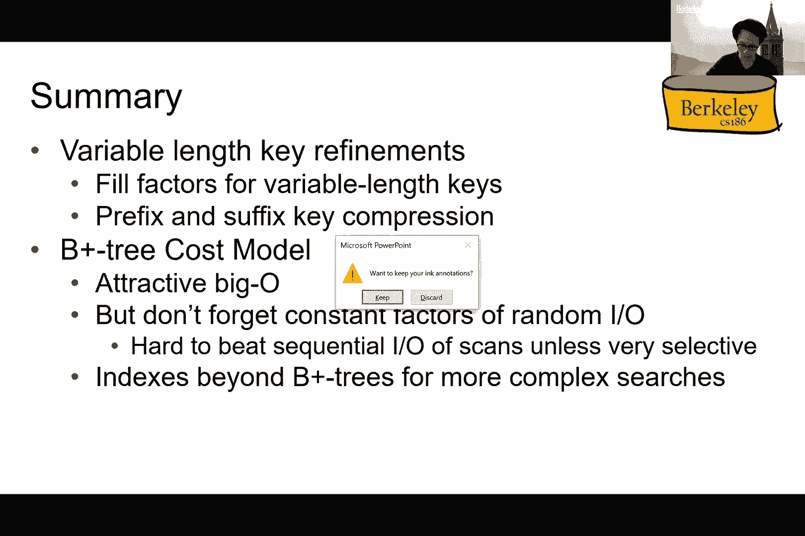
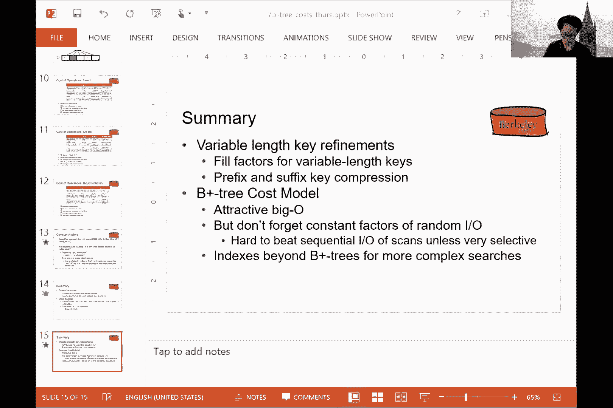
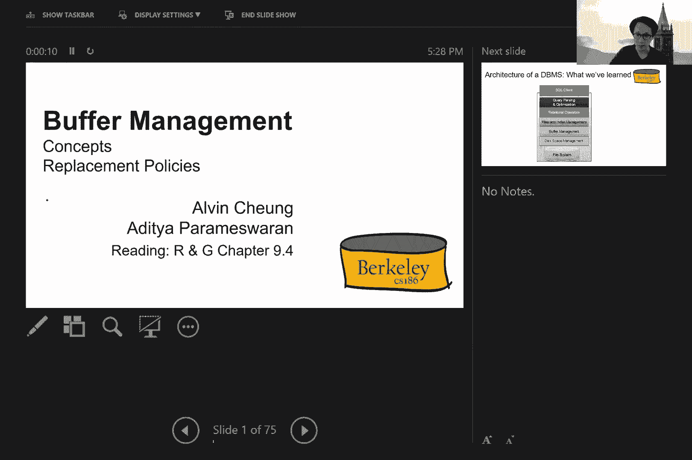
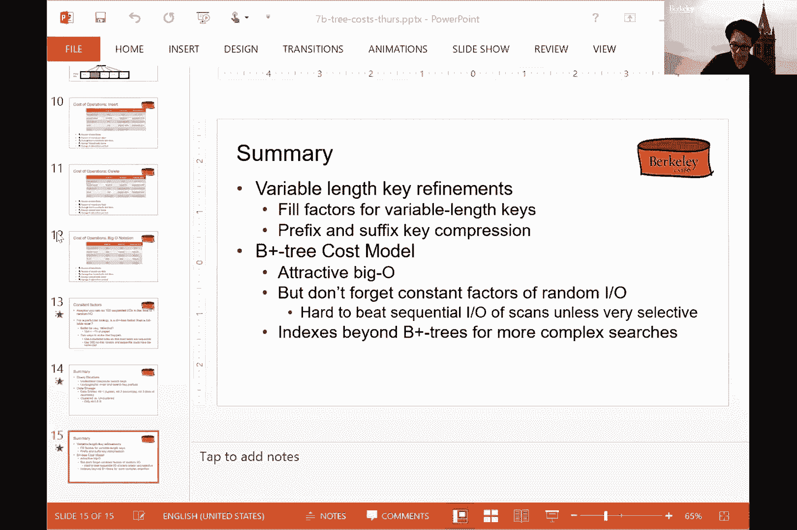
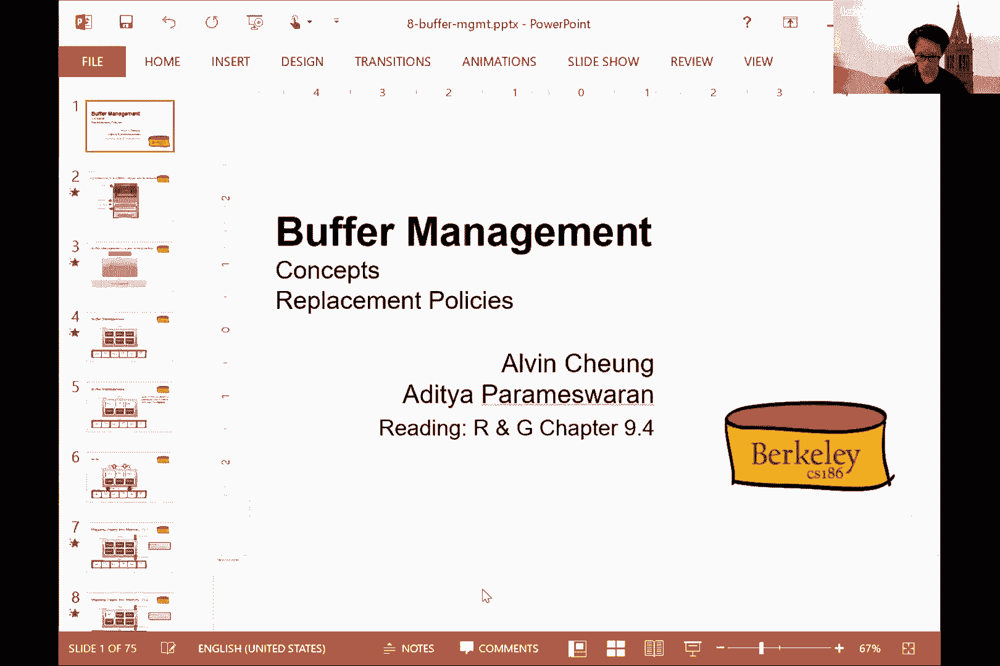
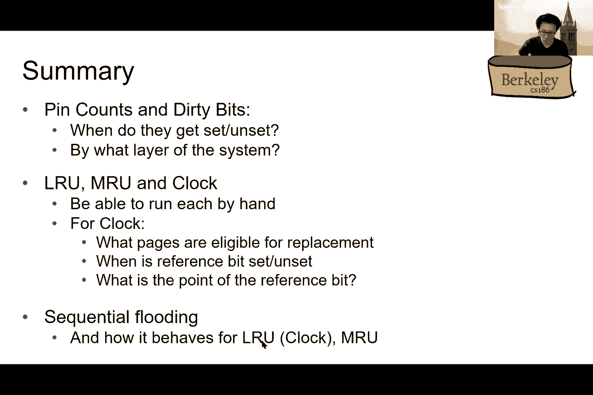
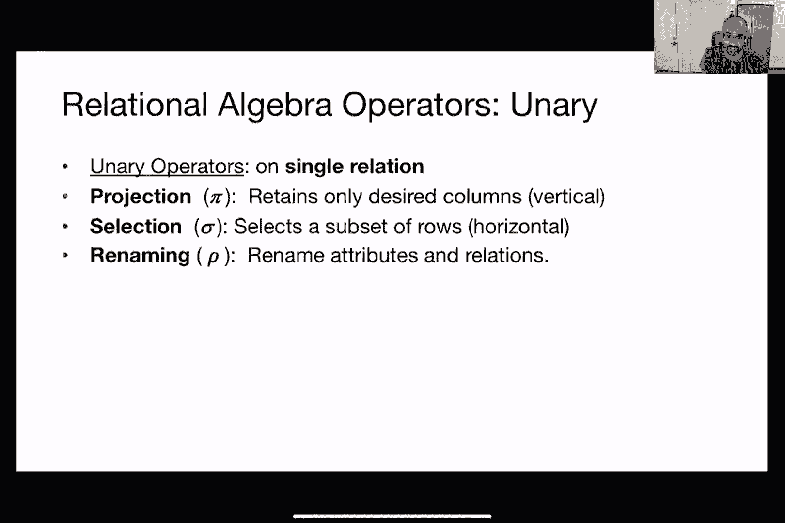
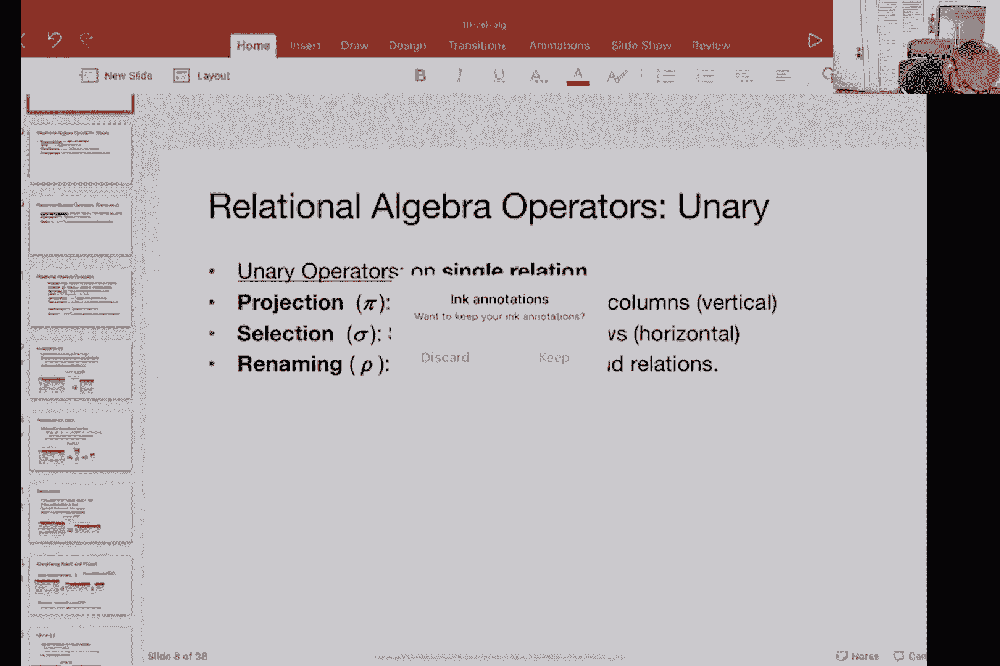
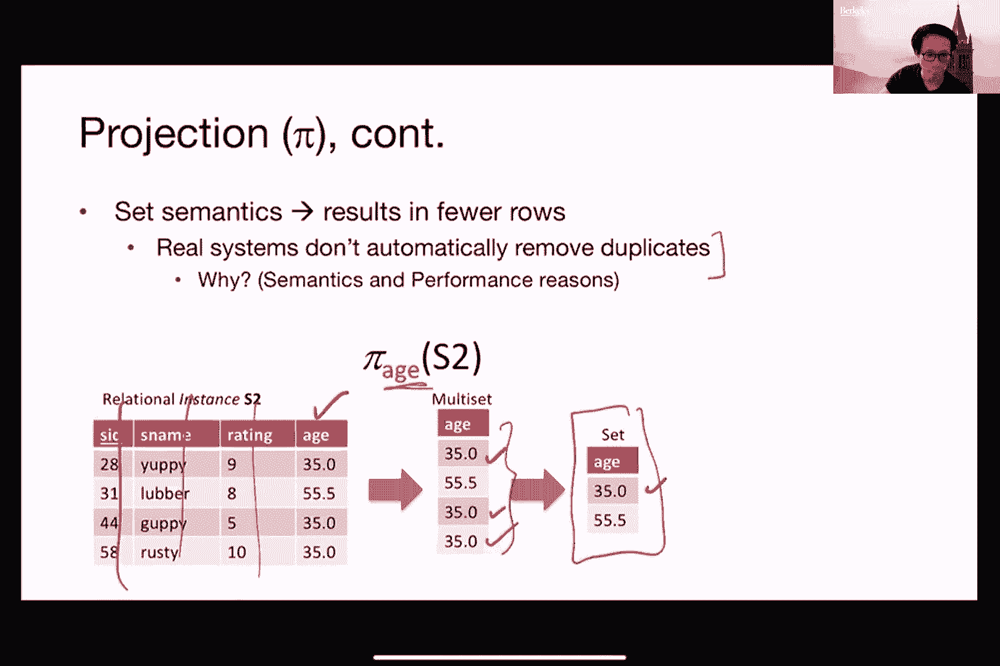

# 📚 课程 P7：第七讲 缓冲管理与关系代数入门

在本节课中，我们将要学习数据库系统中的两个核心组件：**缓冲管理**和**关系代数**。首先，我们将回顾并总结B+树索引的成本模型，然后深入探讨缓冲管理器的工作原理及其页面替换策略。最后，我们将初步了解关系代数，这是数据库系统内部表示和操作查询的基础。

---

## 🔄 回顾：B+树索引的成本模型

上一节我们介绍了B+树索引的结构。本节中，我们来看看如何计算使用索引进行不同操作（如范围查询和插入）的I/O开销。

我们关注平均情况下的开销，并假设使用聚集索引。关键参数如下：
*   **B**：数据页数量。
*   **R**：每个页面能存放的记录数。
*   **D**：读取或写入一个磁盘页面的时间。
*   **F**：B+树内部节点的扇出（分支因子）。

### 范围查询的成本计算
进行范围查询（例如，查找键值在3到7之间的所有记录）通常包含三个步骤：
1.  使用索引找到起始叶子页。
2.  扫描索引的叶子页，找出所有包含目标记录的堆文件页。
3.  从堆文件中读取对应的页面。

总I/O成本公式近似为：
`Cost = (树的高度 + 1) + (目标记录页数 * 2/3) + (目标记录页数 * 2/3) - 1`
公式中减1是为了避免重复计算第一步中已读取的第一个叶子页。

### 插入操作的成本计算
插入一条新记录（例如，键值4.5）也涉及三个步骤：
1.  通过索引找到应插入的堆文件页。
2.  读取并修改该堆文件页。
3.  更新索引的叶子页，并写回修改过的堆文件页。

总I/O成本为：
`Cost = (树的高度 + 1) + 1 + 2`

### 索引选择的考量
虽然可以使用大O符号抽象比较（例如，索引的等值查找成本为 `O(log_F(B))`，远优于堆文件的 `O(B)`），但常数因子同样重要。因为**随机I/O**的成本可能远高于**顺序I/O**（在机械硬盘上可能相差百倍）。因此，使用索引时，应尽量减少需要随机访问的页面数量。有两种常见策略：
1.  使用聚集索引，使得在找到第一页后能进行顺序读取。
2.  使用SSD（固态硬盘），其随机读取与顺序读取成本相近。

---

## 🧠 缓冲管理

上一节我们讨论了数据在磁盘上的组织。本节中我们来看看如何高效地将数据页调入主内存，这就是缓冲管理的核心任务。

缓冲管理器在主内存中维护一系列**帧**，用于存放从磁盘读入的**页面**。其API与磁盘管理器类似，提供`pin`（固定）和`unpin`（取消固定）页面等操作。

### 缓冲管理器的内部状态
缓冲管理器需要为每个帧维护一些元数据：
*   **页面标识**：帧中存放的是哪个磁盘页。
*   **脏位**：标记页面内容是否被修改过。
*   **固定计数**：记录当前有多少个查询操作正在使用该页面。只有当固定计数为0时，页面才可能被替换。

### 页面替换策略
当缓冲池已满且需要加载新页面时，必须选择一个现有页面进行替换（驱逐）。以下是两种常见策略：

#### 1. 最近最少使用策略
LRU策略会驱逐**最近最少使用**的页面。它需要记录每个页面最后一次被访问的时间。
*   **优点**：对具有时间局部性的访问模式效果好。
*   **缺点**：维护精确的访问时间开销较大；在**顺序洪泛**（反复顺序扫描大量数据）的场景下表现极差，可能导致缓存命中率为0。

#### 2. 时钟策略
时钟策略是LRU的一种近似实现，成本更低。它为每个页面维护一个**引用位**，并有一个时钟指针循环遍历所有帧。
*   **工作流程**：当需要替换页面时，检查指针指向的帧。若其页面未被固定且引用位为0，则选择它进行替换；若引用位为1，则将其置0并移动指针检查下一帧。
*   **优点**：实现简单，开销小。
*   **缺点**：是LRU的近似，可能无法选出真正最久未用的页面。

#### 3. 最近最常使用策略
MRU策略会驱逐**最近最常使用**的页面。
*   **适用场景**：在顺序洪泛的场景下，MRU表现优于LRU，因为它倾向于保留扫描序列中较早的页面，从而获得更高的缓存命中率。

**核心结论**：没有一种替换策略适合所有访问模式。数据库系统需要根据工作负载特征进行选择或采用自适应混合策略。

---

## ➕ 关系代数入门

前面我们了解了数据存储与内存管理。现在，我们开始探讨数据库系统如何表示和处理查询本身，这就要用到**关系代数**。

关系代数是数据库系统内部操作数据的**形式化语言**，它定义了一系列在关系（表）上进行操作的运算符。系统会将用户提交的SQL查询转换为关系代数表达式，进而优化并执行。

### 关系代数的特点
1.  **封闭性**：运算符的输入和输出都是关系。
2.  **组合性**：简单的表达式可以组合成更复杂的表达式。
3.  **集合语义**：纯关系代数基于集合理论，结果中无重复元组（但SQL实际使用多重集/包语义）。

### 基本运算符
关系代数运算符主要分为一元运算符和二元运算符。

#### 一元运算符
作用于单个关系。
*   **投影**：符号 **`π`**。用于选择关系中的特定列（垂直过滤）。对应于SQL中的 `SELECT` 子句（列选择部分）。
    *   *示例*：`π_{sname, age}(Sailors)` 返回仅包含船员姓名和年龄的关系。
*   **选择**：符号 **`σ`**。用于选择满足条件的元组（水平过滤）。对应于SQL中的 `WHERE` 子句。
    *   *示例*：`σ_{rating > 7}(Sailors)` 返回评分大于7的船员。
*   **重命名**：符号 **`ρ`**。用于重命名关系或其属性。

#### 二元运算符
作用于两个关系。
*   **并集**：符号 **`∪`**。返回出现在任一关系中的元组集合。
*   **差集**：符号 **`-`**。返回出现在第一个关系但不在第二个关系中的元组集合。
*   **笛卡尔积**：符号 **`×`**。返回两个关系所有元组的组合。

#### 派生运算符
这些运算符可由基本运算符定义，是常用的快捷方式。
*   **交集**：符号 **`∩`**。可通过并集和差集实现。
*   **连接**：符号 **`⋈`**。最常见的是在满足某条件下组合两个关系的元组，是笛卡尔积后加选择操作的组合。有多种变体，如等值连接、自然连接、外连接等。

**一个重要区别**：在SQL术语中，`SELECT` 关键字对应关系代数的**投影**，而 `WHERE` 关键字对应**选择**。这个命名差异是历史原因造成的，需要注意。

---

## 📝 总结

本节课中我们一起学习了：
1.  **B+树索引的成本模型**：分析了范围查询和插入操作的I/O开销，并讨论了索引选择时需要权衡随机I/O与顺序I/O的成本差异。
2.  **缓冲管理**：了解了缓冲管理器如何作为磁盘和计算之间的桥梁，管理内存中的页帧，并深入探讨了LRU、时钟和MRU等页面替换策略及其适用场景。
3.  **关系代数入门**：认识了关系代数作为数据库内部查询表示语言的角色，学习了投影、选择、并集、差集、笛卡尔积和连接等基本运算符，为后续学习查询优化与执行打下了基础。

理解这些底层机制，有助于我们更好地设计数据库结构、编写高效查询，并理解数据库系统的工作原理。