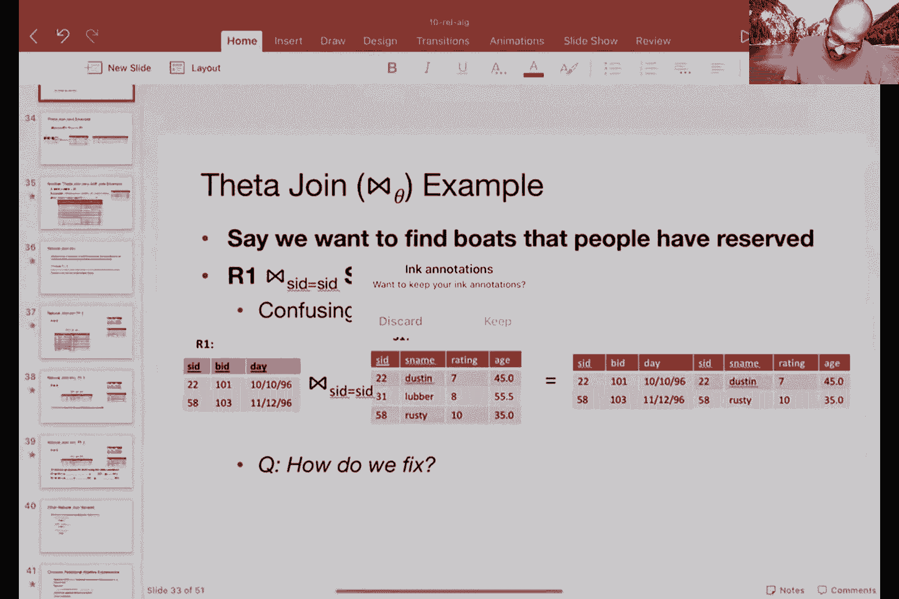
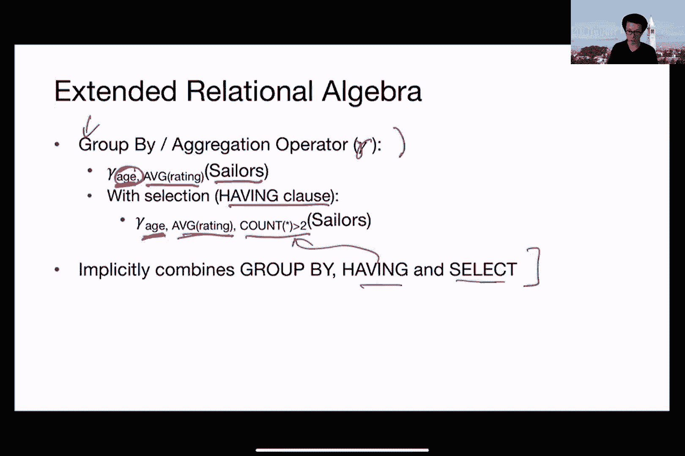

# P8：第8讲 关系代数 - ___main___ - BV1cL411t7Fz

我应该。好，那么这个东西会有预演吗？**是的**，实际上会有预演。

如果你参加预演，你会获得额外的加分。所以实际上参加预演是很好的。我们会在场，确保你的设置是合理的，并对其做出评论。所以我只是想先简要介绍一下这次考试监考的背景。

这篇帖子很长，对吧？有很多细节，我们真的希望你能花时间仔细阅读所有这些细节，因为我们花了很长时间才得出这个方案。我们过去三周一直在努力处理这个问题，你无法想象Jerry、Alan、Ethan以及其他很多人为了找出最好的做法而交换了多少信息。

从某种意义上说，你们要优化三个维度，对吧？第一个维度是公平。我们想要公平，我们希望那些认真参加考试的人能够得到奖励。我们想尽量减少隐私泄露，因此我们尽量避免侵犯隐私。第三，我们想要尽量减少开销。

所以我们想让它尽可能少给我们带来负担。优化这三个目标真的很痛苦，我们花了很长时间才得出这个方案。希望这是一个能够带来一些不适感，但同时提供隐私和公平性好处的方案。所以希望你们能耐心配合我们，一起试验这个。

我们再次从其他班级收集了反馈，试图找出最好的做法。我们认为你们已经提出了一个不错的方案。虽然不能做到完美，但还是不错的。所以，如果你有任何建议，觉得某些地方不适合你的设置，请告诉我们，我们可以尝试找出例外情况。

告诉我们，我们会尽力满足你的需求。尽管这个公式非常复杂，**但是**，我们将进行一次预演，希望你能参加，因为你将因此获得积分。我们还会评估你的设置，并说，嗯，随便，然后我们可以从那里开始。好的。

如果你对考试有任何问题，随时可以提问。那么，每个人问：我们需要扫描什么内容来提交吗？还是考试是在线的？考试是在线的，所以你不需要打印任何东西，也不需要扫描任何东西。所以考试将会在线进行。

我们还考虑了防故障的措施，如果你有Wi-Fi等问题，所有这些内容也在说明中。好的，其他公告。和往常一样，查看每周的帖子而不是......好的。我可以拿着笔和纸帮助自己解决问题，但没有平板电脑，对吧。你可以带任何你需要的书写材料，只要它不是...

它不是电子书，也不是教材，对吧。所以我们确实有备忘单，但不允许使用教材。好的，查看每周的帖子了解更多公告。我们正在做的一件事是，尝试确保助教能更稳定地帮助学生，方法是坚持要求学生提供...

办公时间的工单描述符合最低要求，对吧。所以基本上，我们希望你能够明确指出你需要的支持，所提问题的描述，遇到的具体问题或错误，你遇到的困难，以及你已经尝试过的解决方法等。

这是GitHub仓库的链接，对吧。我们会坚持要求你提供更多信息，以便助教在办公时间内有效地帮助你。因为问题是，如果你带着没有完整信息的问题出现，而课程工作人员正在帮你解决，这会花费很长时间来处理这些问题。

他们可能无法在生活中与下一个人建立联系。对。所以这总体上是为了提高系统的效率，并确保每个人在启动问题时都能得到公平的机会。好的，更多细节请参见第19篇帖子。最后，但同样重要的是，我鼓励你们如果可以的话打开视频，当然没有压力，但我们很喜欢看到你们。

我们喜欢看到你们的反应。好的，如果有什么让你困惑的，它会显示在你脸上，我可以尽量尝试纠正。是的，否则我们就看着一堆字母，这样可不有趣。是的，反之，我根本不知道这些内容是否能够传达给你。对吧，好，好的。

很棒。所以我们在讨论关系代数操作，对吧。关系代数是数据库系统中我最喜欢的话题之一。所以每次讲解这个都让我感到非常开心。所以，我们在讨论关系代数操作时，它应该让你联想到算术和线性代数，因为它基本上允许你通过按顺序使用这些操作来组合更大的操作。

对，我们讨论了各种基本操作，至少在高层次上。投影、选择、重命名、并集、差集、笛卡尔积，我将以更详细的方式讲解每一项操作。我们还讨论了有两个复合操作，即交集和连接。好的，回顾投影，我们上次已经讲过这个，但只是快速回顾一下。

所以，投影是用π符号表示的。好的，使用方法是你说π，然后列出你想在输出中获得的属性，再给出输入关系作为操作数。这个操作，π就是作用于这个输入关系实例的。好的。所以，从这个输入关系实例来看。

这个π操作基本上只保留了S姓名和年龄。好的。所以它去掉了评分，去掉了S ID。好的，这就是你在这个例子中最终得到的结果。所以，这个投影操作对应于SQL中的select列表，基本上就是你在select子句中列出的属性列表。

投影操作的输出模式由属性列表的模式决定。基本上你列出了这两个属性，因此那就是你的输出模式。名称和类型再次对应于输入属性。所以，这个S姓名基本上和这个S姓名是一样的，这个年龄和这个年龄是一样的。

因此，衍生自输入属性的名称和类型。投影基本上是选择一部分列，现在是在进行垂直切片。它就是在做垂直切片。好，那么如果有重复项会发生什么呢？这就是事情变得有些棘手的地方。所以，如果你举个例子，你对年龄进行投影。

你去掉了其他列，如ID、姓名和评分。剩下的只有一个属性关系输出，就是年龄。对吧？现在如果你注意到，有一些重复项，对吧？比如35重复了三次。记住，在关系代数中，你遵循集合语义。

所以，你最终要做的是去掉重复项，最终只剩下两个输出工具。好的，所以集合语义意味着，如果在投影过程中有重复项，你最终会得到较少的行。正如我们所见，真实系统并不会自动去除重复项，因此SQL并不强制去除重复项。这是因为在操作中一致的语义。

以及出于性能考虑，去重是非常昂贵的。对吧？所以，一种可能的方法是进行排序，而排序是昂贵的，或者使用哈希等操作，每一个这样的操作都是昂贵的。好的，接下来我要讲的下一个操作是另一个统一操作，就是σ选择。在这种情况下，我应用了σ操作，即选择评分大于8的输入关系S2。

好的，基本上，我强制要求这个特定的属性大于它。这意味着这个拉取和这个拉取会从输出中被消除，你得到的输出只有这两个。所以，选择操作可以看作是投影的转置，对吧？它基本上是在水平切片，选择行的子集。

选择操作对应于SQL中的**WHERE**子句。所以在这里，你列出一些谓词，这基本上是你可以在选择操作中作为下标进行操作的内容。选择操作的输出模式基本上与输入相同。你并没有丢弃任何属性，基本上继承了输入的属性。选择操作的情况。

如果输入是一个集合，那么在选择操作之后你不需要进行去重，因为输出也将没有重复项。好吧，所以并不一定需要在选择操作中进行去重。与投影操作不同，在投影的情况下，因为你丢弃了一些列，剩下的列结合在一起可能会有重复项。选择操作的情况。

你不需要做这件事，你基本上可以免费得到它。这里有一个例子，展示了如何将选择和投影组合成一个更复杂的表达式。记得我提到过，关系代数允许你将关系实例的基本单元组合在一起，然后用这些操作按顺序组合成更大的表达式。在这个特定的例子中。

我有s2，然后我在其上应用选择操作，再在其上应用投影操作。那么这样做的结果是，我丢弃了评分大于8的水手，或者说，我保留了评分大于8的水手。

然后我丢弃了除了S name之外的所有其他列。所以在这个例子中，我首先会执行选择操作。评分大于8。所以我丢弃了这个元组和那个元组。然后我会丢弃剩下的不需要的属性，包括评分、年龄和边界。那这个其他的表达式呢？好的。

比如说，我首先对S name做投影，接着是评分大于8。这样理解对吗？如果不对，为什么呢？沃伦。在这种情况下不对，因为你选择的结果和你知道的那种很相似，对吧，完全正确。所以在你已经将其他列投影出去后，只剩下了S name。

你不能真正应用这个谓词“评分大于8”。所以这是一个格式不正确或错误的关系代数表达式，不是正确的。好的。所以你不能这样做，这并不适用，因为它包含无效的类型。这个选择操作的输入不包含评分列。所以这不是一个二元操作。

好的，那么并集操作表示为这个符号，你是一个警察。并集操作是什么样子的呢？并集操作基本上是对两个元组集合进行集合并集操作。对吧。所以你有s1作为一个关系实例，s2作为另一个关系实例，而这些。

这些元素，属于这个集合，它们是两个集合。s1并集实际上是所有这两个集合的组合。所以我在这里使用的是集合表示法或文氏图。为了正确地做这件事，两个输入关系需要是兼容的。好的，这是。

它们必须有相同的属性顺序，并且属性必须有相同的类型。否则，合并这两个关系就没有意义，因为最终结果会有一个奇怪的模式。所以如果一个关系有三个属性，另一个关系有四个属性，那么不能合并这两个关系，因为这两个关系的合并将导致一个没有三个属性的关系。

不，或者说对于属性来说。对，差不多就在中间。所以基本上，我们坚持要求两个关系必须是兼容的。它们必须有相同的属性集和类型。所以我们看到的SQL表达式是并集。对。所以在并集下的重复消除问题，在状态语义下是这样的。

我们会进行重复消除，因为可能会有多个相同的元组。所以在这个例子中，我有s one和s two，我正在通过关系代数做s one并集s two。这个表达式有五个输出元组，而两个输入分别是三和四，总共七个输入元组。对，这就是因为这个元组和那个元组被重复了。

对。所以你最终去掉了每个重复元组中的一个副本。我们看到的SQL表达式是并集或并集所有，`union`会去除重复项，`union all`保留重复项。好吧，到目前为止有什么问题吗？好吧。那么，关于并集为什么会产生更多的规则的问题。嗯，并集实际上并不会。

所以如果你对这个关系和那个关系做并集，理想情况下你应该得到七个元组。但然后你去掉了重复项，所以剩下五个元组。这回答了你的问题吗？成熟了。好吧。那么集合差，另一个二元操作，类似于并集，在于它们都是集合导向的操作，两个输入关系必须兼容。

对。所以它必须有相同的模式。所以基本上，这意味着相同的属性集和相同的类型。那么在我的维恩图中它看起来是什么样子呢？嗯，如果你有s one和s two，s one减去s two就是保留这个弯月形区域作为输出。好了，这就是s one减去s two的计算方式。我们看到的SQL表达式是`except`。

那么让我们通过一个例子来进行演示。在这个例子中，我的关系实例是s one和s two，我正在计算s one减去s two。所以我保留所有在s one中但不在s two中的元组。所以遍历这个列表，22显然不在s two中，31在s two中。

所以这不会成为输出的一部分，58也在s two中。所以我要去掉它。所以总体来说，我剩下一个输出元组，就是22，对应于22的那个元组。你可以自己在家试试，s two减去s one有两个输出元组。这就是到目前为止的集合差。我们需要像在关系代数中做并集时那样去除重复吗？

这是给你们的问题。对吧，我在聊天中看到了一些答案，基本上是没有的。对，答案是没有。这是因为我们所做的只是从集合s1中取出一些内容，然后将其删除。对吧？由于s1中不包含重复项，我不需要进一步从结果中删除重复项。对，所以是s1。

我从s1开始，然后删除了一些内容，s1中没有重复项。因此，在删除一些内容之后，我仍然不会有重复项。好的。好的，这不是必需的。我们之前讨论过SQL表达式，除了我们早些时候讨论过的内容，还有“except”和“all”操作，这与SQL中的并集或并集所有操作语义相同，在关系代数中，如果存在重复项，它们将被删除。

当然，它们在输入关系中并不存在。对吧？所以输入关系中没有重复项。这就是为什么我们在计算结果后不需要进行去重操作。好的，现在我们进入一些更有趣的操作。让我们来看看笛卡尔积。好的。

所以，两个关系的笛卡尔积，即r1和s1，意味着r1中的每一行都与s1中的每一行配对。所以如果我有这两个关系，我基本上就是计算这两个关系的二分图，并计算所有配对。对吧？所以我有六个输出结果。这就是笛卡尔积。那么我结果中有多少行？假设r1的大小是这个。

通常这样表示的是这个。我们s1的大小是这个。我的结果中有多少行？是的，s1与s2的笛卡尔积，或者说s1乘以s2，基本上是这两个关系大小的乘积，因为每个关系中的每一行都会与另一个关系中的每一行配对。我们需要担心模式兼容性吗？

这两种关系并不完全正确，它们可以有任意的模式，因此我们不需要担心它们是否以某种方式兼容。我们需要做去重操作吗？嗯，再次强调，这并不是必要的，因为这两个输入没有重复项。因此，您应该能够说服自己，即使在输出中也不会有重复项。

好的，到目前为止有问题吗？好的，好的。好的，那么这是另一个有趣的操作。这是重命名操作，通常表示为这个P形状的希腊符号，也被称为角色。好的，这就是它的发音。好的，很好。那么，重命名如何工作呢？当笛卡尔积发生时，正是我现在要讲解的内容。

Tommy说，我可能漏掉了什么，但为什么我们的关系中没有重复项呢？嗯，输入没有重复项，对吧？在关系代数中，这些关系是集合。因此，我们遵循集合语义。所以输入中没有重复项。在这个特定情况下，在执行笛卡尔积之后，你也不会有重复项。好的。

所以重命名允许你重命名关系及其属性。这对于避免当两个关系在属性集上重叠时的混淆很方便。好的。如果我们不想重命名输出，可以省略输出名称。好的，抱歉。如果我们不想重命名输出。假设R一个看起来是这样的。

所以我有sid，bid和day。这是我的三个属性。我可以使用这种语法将它们重命名为sid，ID和day。你可以看到这是输出关系的名称。这是这三个属性。基本上，我在这里按R一个中列出的顺序列出了它们。好的。

所以sid被重命名为sid，ID被重命名为to，day被重命名为day。好的，所以这里我没有改变day，保持不变。因为day没有被重命名，我可以在这里使用简写。虽然在这个具体实例中并没有真的变得更短，在某些其他情况下它可能会更短，我说，嗯，输入的sid被转换为输出中的sid。

我使用这个箭头符号来表示这一点。好的，这两种表示法基本上是一样的。如果我不想重命名关系，可以省略这个R，这样也可以。好的。那就是如果我不想重命名关系，它将保留相同的名称R一个。还有一种重命名的方法，另一种简写方式。

这是使用列表位置。所以这是在需要的情况下的问题。如果我做了一个叉积，例如，其中一些属性名称在两个输入关系中是相同的。这样我就能用简写来引用这些属性名称，然后重命名它们。所以这里我做了R一个和S一个的叉积。我在R一个中有一个叫做sid的属性。

我在S一个中有一个叫做sid的属性。我不想得到一个包含两个相同名称属性的关系。那样是不理想的，我不知道怎么分别引用这两个属性。所以解决这个问题的一种方法是，如果我想的话，可以重命名输出。我可以称之为temp一个，然后指向第一个属性，并将其重命名为sid一个，第四个属性并将其重命名为sid两个。

所以这个叉积，约定是先列出R一个的属性，然后再列出S一个的属性。好的，所以这里在重命名之后，输出将有这个名字temp一个。sid一个作为sid的重命名版本，sid一个和sid两个作为第二个sid的重命名版本。好的。所以再说一次，如果我不想重命名输出，可以省略输出名称。

对于这个特定的情况，另一种选择是，在完成叉积之前就进行重命名，而不是等到做完叉积之后再重命名，而是重命名输入关系本身。所以如果我想将这两个输入关系中的属性区分开来，我可以重命名它们。

我可以在源头上给它们不同的名称，对吧。只需在源头上更改名称，然后做交叉积。这样看起来像这样。对吧，所以我可以，例如，先重命名 S1，然后做交叉积。那也是可以的。对吧。总是最好加上括号，以显示你希望操作执行的顺序。

我们稍后会讨论这个问题。好了，这些是基本操作。好了，现在我们将讨论可以使用基本操作表达的复合操作。所以我们先从交集开始。交集就像并集或集合差异一样，输入关系必须是兼容的，也就是说它们必须具有相同的模式。也就是相同的属性。

相同的类型。交集的 SQL 表达式是 intercept，对吧，在集合表示法中，我们试图计算的是这两者重叠的部分。所以，重复项的问题是什么，对吧？在这里，由于两个输入关系没有重复项，当你做交集时，结果也不会有重复项。对吧。

所以，如果输入是集合，就不需要去除重复项。所以在关系代数的集合语义下，交集不需要担心重复项。好了，我们已经知道，交集用倒立的 U 表示。以后你们会称之为 cap。这是一个复合操作符。那么，你该怎么做呢？

那么，如何使用我们迄今为止描述的其他操作来表达这个呢？有什么想法吗？那么。再说一遍，猜测交叉减去并集。所以交叉积减去并集。不幸的是，交叉积最终会改变模式。对吧。所以你不希望那样发生。一旦你改变了模式。

你不能再应用集合导向的操作了。集合导向的操作必须保持模式不变。对吧。你必须，你必须。好了，我看到一些复杂的表达式。尼古拉斯。等等，我刚刚想到了什么，但又忘了。好了。别担心。好了，让我们走一遍这个过程，看看，好的，克里斯，我想他有解决方案。

所以让我们走一遍这个过程，看看这个对大家有没有意义。好了，让我们从讨论这个部分开始，对吧。重叠的部分，看看我们如何得到它。对吧。得到它的一种方法是从 S1 开始，然后去掉现有部分。其实。

你也可以反过来做。对吧。你可以从 S2 开始，然后去掉 S2 中对应的现有部分。但看看我们为什么决定从 S1 开始，然后去掉相应的部分。对吧。所以你有这个完整的圆圈，你想去掉现有部分。剩下的是这个灰色的部分。你见过这个现有部分吗？嗯，是的，我们见过，对吧。

所以我们知道如何计算这个当前部分。这个当前部分，就是这部分。抱歉，这部分基本上就是S1减去S2。对吧。所以总体上，我有的是S1减去当前部分，而当前部分本身就是S1减去S2。好的。这个是一个相当简单的表达式。同样地，我可以做S2减去S2减去S1，且你可以希望自己也能证明这是可行的。

好的，接下来讲连接。好的，连接是复合操作，就像交集一样。通常，连接是这样的，你有一个笛卡尔积，然后做一些选择。我们可能会在这个过程中重命名一些东西。好的，让我们来研究一些替代方案，然后看看何时需要重命名。所以连接有越来越高的专门化程度。

所以最简单或者更准确地说，最强大的连接形式是θ连接。θ连接基本上有一个下标θ，它基于逻辑表达式θ进行连接，这个符号——蝴蝶结符号就是连接的通用符号。好的。

等值连接基本上是一个θ连接，其中θ是等式的合取。还有一个更特殊版本的连接是自然连接，我们在SQL讲座中见过这个。自然连接没有下标。它只有蝴蝶结符号。这个自然连接是对所有匹配列名的等值连接。好的。

并且你能免费获得的保证是，只有一个匹配列名的副本会保留在结果中。好的，让我们接下来通过这些例子来学习。好的，在此之前我想说的是，连接是非常关键的。笛卡尔积是我从中推导出的数据库系统中的超级关键原语。

它们在不同表之间关联信息时非常重要。我们将花很多时间关注如何高效地执行连接。好的，所以接下来的许多讲座将重点讨论如何高效执行连接，特别是当你同时连接很多表时。

我们肯定想要避免的事情是执行笛卡尔积，笛卡尔积会不必要地膨胀输出。如果可能的话，除非用户明确请求，我们会尽量避免它。我们会尽量找出绕过它的方法。所以，正如我所说，我们将花大量时间研究如何设计高效的连接算法。

好的，从第一个连接变体——θ连接开始，下面是θ连接的语义。对吧？这是如何使用其他操作表达θ连接的方法。所以θ连接很简单。它基本上就是我们的笛卡尔积与S相乘。然后你做一个σ，即使用θ的选择。也就是说，先应用笛卡尔积，然后筛选出不满足θ条件的两列。

所以，如果theta只包含带有and子句的相等条件，这就叫做等值连接。好吧，这是一种特殊的theta连接，theta只包含相等的谓词。这里是一个theta连接的例子。假设我想找出人们预定的船只。

好的，我有我的输入关系R1，我有我的输入关系S1。我想在它们之间做一个theta连接。我说，嘿，知道吗？我会选择sID等于sID。对吧？这是我希望输出的样子。我想将两个关系中相应的记录关联起来。对吧？

所以，这两个记录就是输出的一部分。那么，这就是问题所在，对吧？我无法真正解读这个子句，因为我不知道每个sID指的是哪个，因为s1和S1中每个都只有一边。对吧？所以这个表达式很难解读。那么，我们该如何解决这个问题呢？有没有想法，使用我们之前讨论过的操作？重命名它们。对。

所以，你可能想重命名其中一个关系。那么，怎么重命名呢？嗯，一个选择是重命名S1或R1。假设我决定重命名。假设我说，嘿，我要取sID。

好的，没问题，我再试一次。我将sID取出来，然后映射到sID1。好的，我对所有的1都做了这个操作。所以现在，所有的1都将sID转换为sID1。然后，我可以对sID1和sID做theta连接。好的，现在我知道每个属性是从哪里来的，sID1来自这里，sID来自那里。

好的，问题已经解决了。好了，这是我之前的理解，我认为解决这个问题就是这样。对，我基本上是重命名了两个输入关系中的一个。这正是我在这里所做的。我们再试一个例子。这是一个自连接的例子。我有一个水手表格，我称之为s1，我想为每个水手找出符合条件的数据。

我想找出比那个水手资历更高的其他水手。对吧。那么我们怎么做呢？这实际上是输出的样子。查询大致是这样的。我基本上是取了一个s1的副本，然后重命名它。重命名的原因是因为我不希望这个副本的属性和原来的重复。

然后我做了一个关系连接，另一个关系发生了冲突。对吧。我拿了一个s1的副本，然后重命名了它的所有属性。我又有了另一个s1的副本。然后我做了一个theta连接，条件是age1小于age，对吧，这就是我要强制执行的条件。我想为每个水手找出符合条件的记录。

我想找到那些更资深的水手。因此，添加重命名操作以改变中间关系的字段名在关系代数中是非常常见的。所以，确保你在执行条件时对中间关系进行重命名，这一点要习惯。

对于联接或选择操作，随后的操作没有歧义。对吧？在这种情况下，age1和age的含义很明确，因为它们分别来自输入关系中的单一副本。所以在这个特定的例子中，在age1小于age的条件强制执行之前，结果将如下所示。这实际上是s1和s1的重命名副本的笛卡尔积。

所以我有sid、name、rating、age这些列分别来自左边的表和右边的表。接下来，我使用条件丢弃一些元组，因此我可以丢弃这些元组，依此类推。

最终我只剩下这三个元组。好的，关于这个有任何问题吗？接下来是自然联接。自然联接是等值联接的一个特殊情况，要求两个关系之间匹配的所有字段都必须相等，并且重复的字段会被去除。

对。所以你只有每个字段的单一副本。从概念上讲，流程大致如下：你计算R和S的笛卡尔积，选择在两个关系中出现且值相等的行，然后投影到唯一字段的集合上。这就是自然联接的概念流程。下面是一个自然联接的例子，这里我正在做一个reserves和sailors之间的联接。

我从做笛卡尔积开始。基本上就是将这里的每个元组与这里的每个元组关联。因此，我在这个中间结果中得到了六个元组。然后我查看共同的属性，唯一共同的属性是SID，我尝试保留SID相同的元组。对吧？所以这两个列中的值基本上是相同的。

所以我丢弃了一些元组，因为它们不符合条件。现在我只剩下两个结果元组，但我想确保列名是唯一的。所以我丢弃了其中一个副本的sid。最终我只剩下sid、bid、day这些列，所有这些都来自我们的第一个表，然后是S表中的name、rating、age。

这是一个非常常用的操作，尤其是在外键联接中。这里我有一个从R1到S1的外键，正好是在sid字段上。所以这是自然联接的一个常见用例。现在有一个问题是，我们知道联接并不是所有的联接变体都是复合操作符。

我们如何用其他运算符表达一个自然连接与S1的操作？再一次，我们可能最终做的是重命名操作，以确保我们可以区分两列的副本。然后，我们可能会做一个交叉乘积，接着投影出公共属性。这将是我们的操作步骤。所以，我们将从S1开始。

我们将重命名公共属性sid为sid1，进行交叉乘积。然后我们会做选择操作。接着，我们将投影出属性，直到我们只剩下每个属性的一份副本。希望这能让你明白。另一种读取方式是，虽然这与当前示例无关，但一般来说，你首先处理S1，然后重命名你要匹配相等性的字段。你做交叉乘积，然后匹配两个输入中共同的字段。

然后你会保留每个字段的一份副本作为输出的一部分。所以我们已经讨论了这三种连接变体，还有我们在后续讲座中介绍的其他连接变体，比如左外连接、右外连接和全外连接。

这些符号的样子就是这样，它们是蝴蝶结的小变体。例如，你表示即使左侧的两个帖子与右侧的任何内容都不匹配，它们仍然会被添加到输出中，并且会填充空值。

所以，你表示这些投影就是那种从照片中突出出来的部分。现在我们已经讨论了关系代数中的基本操作，已经涵盖了基础操作和复合操作，总共有大约八个操作。

现在让我们谈谈如何组合更复杂的表达式。一般来说，代数、线性代数、关系代数和初等代数都允许你以自然的方式表达操作序列并进行组合。因此，在初等代数中，你可以像这样做，例如：你正在乘以两个独立的操作，它们是两个独立的操作数，这些操作数本身是其他操作的结果，比如加法或减法。

关系代数允许你做同样的事情。你可以通过三种不同的方式来表示这个操作：一种是赋值语句的序列，另一种是带有多个运算符的表达式，还有一种是表达式树的形式，我们将看到这些每种方式的例子。所以，当你有一个非常复杂的关系代数表达式时，赋值序列是很方便的。

所以你基本上会创建临时的关系名称。也就是说，你拿到中间结果然后给它起个名字。对吧。所以，关系和属性名称的命名可以在你做赋值时通过列出属性名来完成。你可以拿到我们的关系 R1，然后说，知道吗，我要把 R1 的属性重命名为 X 和 Y，通过这种语法，R1 自身也重命名为 R3。

如果我想在 R1 和 R2 之间做一个 θ 连接，假设 θ 的条件是 C。我可以分两步来表示这个操作。我可以说，R4 是 R1 和 R2 的笛卡尔积，接着 R3 是应用选择操作，θ(θ = C) 到 R4 的结果。好的，我们已经看过一些包含多个操作的表达式。

如果你有一个包含多个操作符的表达式，你需要讨论优先级。好的，所以这里的第一个经验法则是：不用担心这些优先级规则，只需要使用括号。这是我的建议，直接使用括号。这是最直接表达优先级、表达你如何阅读关系代数表达式的方式。

但是如果你想懒得加括号，这是我解读关系代数表达式的方式。我会从单目运算开始。比如选择、投影和重命名，它们具有最高的优先级。接着是乘积和连接，跨乘积和连接。

然后最后是集合操作。好的，这是一个常见的约定，通常用于更复杂的关系代数表达式。但我建议还是使用括号来强制规定你选择的顺序。好了，我们来谈谈表达式树。这是第三种表示方法。

这在我们讨论如何进行查询规划和优化时可能会派上用场。所以在表达式树中，叶子节点是操作数。也就是说，在我们的语境中是关系，而内部节点是运算符。它们会应用到自己的一个子节点（如果是单目运算符）或多个子节点（如果是双目运算符）。所以如果我有两个关系，假设是 S reserves 和 sailors。

而我想要找到所有评级大于 5 或者预定了 100 的水手的 sid。好的，我该怎么做呢？我将这个分成两部分。对吧。我想要找到所有评级大于 5 或者预定了 100 的水手的 sid。我意识到评级信息在 S 中，而船只信息在 R 中。

所以我需要将这两个关系之间的信息结合起来。假设我先从这一部分开始。好吧，我做的是所有评级大于 5 的水手。我从 S 开始，然后我可以举个例子，做一个选择操作（σ），然后说，我想要那些评级大于 5 的水手。接着我把其他信息投影出去，只保留 sid。

好的，我已经计算出了结果的一部分。结果的第二部分来自那些预定了100号船的人。所以对于这个，我将从r开始。然后我会有一个选择条件，就像我在S中做的那样，表示BID等于100。再次，我会有一个投影操作，只保留sid。好的，保留sid，因为这是我在输出中需要的内容。最后。

我可以做一个联合操作，将两边的结果合并。好的，这基本上就是结果。好的，这有问题吗？好吧，这和我之前画的东西是一样的。所以稍微回顾一下，我想重新审视一下我们为什么要学习关系代数，以及我们为什么要花很多时间讨论这些关系代数表达式。关系代数表达式，就像在高中学代数、线性代数一样。

这些对数据库系统来说很容易操作。而且操作符的数量也很少，所以很容易处理、简化、重写。为了弄清楚如何重写和简化线性类型的关系代数表达式，数据库系统使用了各种启发式方法来进行这些重写。

以及各种成本函数，用来在不同的重写方式之间做选择。好的，我想给你们一些数据库系统可能考虑的重写方式的例子。我们将在课程后面深入讨论这些重写方式，以及哪些更有意义。好的，这里是一个简单的重写。对，这个简单的重写表示，嘿。

我有两个条件，表达式一和表达式二，我正在将它们同时应用于某个操作。我当然可以把它们分开处理。通过将表达式一这个条件应用于表达式二的选择结果，我同样可以在表达式一之后应用表达式二这个条件。

而且这些实际上并不会改变结果，好的，为两个质量符号道歉。好的，这些都是一样的，它们都是等价的重写。另一个例子。一个非常强大的例子是改变连接运算的顺序。我们可以先连接r和s，然后再与T做连接。

我可以先连接s和t，再与r做连接。好的，哦，我看到很多关于"和"的疑问，这只是"和"与"D"的简写形式。好的，还有其他问题吗？好的，好的，这里是另一个非常酷的重写例子。好的，这个叫做谓词下推，非常重要，现在学了将来还会再学一次。

假设我想查找年龄大于40岁的水手的预订信息，并且我有这两个关系，r和s，r1和s1。我可以通过这个表达式来实现。对，所以这里我基本上是想对这两个关系做一个自然连接。然后我想去掉所有年龄大于40岁的水手。基本上是这样做的。

我做自然连接，再做sigma。好的。另一种重写方法，我会给你答案，而不是问你，就是先在s1上做sigma，然后再做自然连接。之所以这样可以，是因为这个条件“年龄大于40”仅适用于s1。好的，“年龄大于40”仅适用于s1。因此。

你可以先这样做，再做自然连接。这个重写操作，首先进行sigma选择操作然后再推到下方，叫做谓词下推。这非常重要，因为它基本上减少了中间结果的大小。对吧。如果比如说，经过这个选择操作后，s1中的结果非常非常小。

所以你从一百万个元组开始，在s1中剩下了10个元组。那是一个显著的减少。对吧，因此进入连接时，你需要处理的输入元组少了很多。连接和笛卡尔积非常昂贵，对吧。

因为你实际上是在进行二次排序的增加。这样很尴尬，因为左侧的每个元组都与右侧的每个元组匹配。所以，尽量减少中间结果的大小是很有意义的。因此，通过将选择操作推到下方来实现这一点。

这样可以减少中间结果的大小。所以这个重写是非常强大的，数据库系统通常会使用。这里是另一个重写的例子，消除我们在SQL中已经看到的一个关键词。对吧，所以我们看到的not in关键词，它在允许我们表达相对复杂的需求时非常强大。

好的，所以在这里，我想找出那些没有预定某个船只的水手。说出这个的最方便的方法是说，选择blah，blah，blah。条件是s_id不在某个集合中，我在查看这个预定表中与船ID 103相对应的s_ID。好吧，那么我们如何用关系代数来表示这个呢？对吧。

因此，表达这个的关系代数方法是这样的，对吧。所以你从水手表中取出……实际上，这里应该是s，而不是r。对，应该是s。好的，取出水手，将除了s_id之外的所有内容都投影出去。然后扔掉那些已经预定了船ID 103的水手。

如何找到那些已经预定了船ID 103的水手呢？嗯，我取出与船ID 103相对应的两个点。我与s做自然连接。这基本上就是所有与船ID 103的预定和水手ID相连接的元组。然后我去掉除了水手ID之外的所有内容。其实。

我知道有一种方法可以进一步简化这个。你有什么想法吗？Janelle。抱歉，我以为有问题。好吧，让我按一下按钮。哦，好吧，没关系。所以，进一步简化的一种方法，我本应该意识到，就是简单地做出选择，条件是sigma b_id等于103的幂。

我甚至不需要做自然连接。那样更简单。好吧，还有其他想法吗？所以，内森（Nathaniel）说，为什么不把派去外面？那样可以吗？我能做吗？

那我们就试试吧。对吧？所以我想做 s id 和 s 减去 sigma b id 等于 103 的 R。我可以这样做吗？不行，对吧？我不能这样做，因为这个模式与这个模式不相同。对吧？所以我不能这样做。所以这个可以，这个不行，这个也可以，但这涉及到一个不必要的连接，我没有意识到。好了，内特。

你想描述一下你的问题吗？我在找水手的名字。所以似乎我们需要在找到 s id 后再获取名字。好的，我错误地假设应该是 s id。好的，那么如果是名字的话，我就需要做一个连接。好的，没错。如果我要获取名字的话。

这将是派 s 名称（s name）减去派 s 名称（s name）的 sigma b id 等于 103 的 R，与 us 做自然连接。这样有道理吗？好的。好的，这两个适用于 s id，而这个适用于 s name。那么 Felix 的问题是，查询优化的表面层是在连接和交叉产品之前的操作上进行的吗？

是的，亦是如此，我认为这是许多优化之一。确定连接顺序也是一个关键步骤。还有其他优化方法，但不仅仅是，仅仅减少中间结果。这是一个重要的考虑因素，但这不是唯一的考虑因素。

好的，接下来是关于扩展关系代数的幻灯片，超出了简单操作和派生操作的范围。我们还可以进行分组操作，符号是 G 的伽马（gamma）。因此，你可以说，我想计算水手的年龄和按年龄组计算的平均评分。对吧？所以这里，由于我没有对年龄进行任何聚合函数运算。

这最终成为了分组列。我也可以添加一个 having 子句，所以我可以说，按年龄分组，计算平均评分，且想要计数大于二。这隐式地将“分组”和“having”结合起来，基本上也是选择条件的结合。对吧？就像在 years 中，你实际上是子选择了输出中的每个平均评分。

所以这就是为什么需要使用选择（select）子句。having 子句基本上就是这个。好了，下面是我们今天所涵盖内容的总结。关系代数基本上是说，这里有一小组操作，你可以通过多种方式组合它们，这些操作将关系映射到关系，所以输入是关系，输出也是关系。这些操作是“操作性的”的，因为你需要明确指定操作执行的顺序。

这些运算符是闭合的，这意味着你计算出的结果仍然是一个关系。关系代数中的表达式非常容易操作、重写和简化，而关系代数中的表达式也非常强大，对吧？这些少数几种操作就可以封装很多SQL的功能。所以，就像我们看到的not in子句，你实际上可以通过简单的重写来去掉它。好。

我们已经覆盖了六个基本操作，五个基本操作，我们已经覆盖了六个。好的。应该有一行覆盖了六个基本操作，以及一些复合操作，比如交集和蝴蝶结。然后我们要做连接，关于这些有问题吗？好的，我会……你想去吗？我可以回去一页吗？好的。问题是什么？我，答案是肯定的。

我们是在问问题吗？我回去了一页，应该是。我已经回去了。还需要再回去吗？好的，我猜那就是问题了。好吧。酷。好的。我想我做对了。是的，我觉得某些幻灯片还没有上传到公开网站。我已经打印了当前版本，并上传到云端，但如果你做了任何更改……

随时更新它。好的。我以为我已经添加了最新版本，但是……不知为什么，最后几张幻灯片没有显示。我不知道为什么。好的，是什么时候突然中断了，然后后面什么都没有。好的，我认为它在嵌套切片之前停止了。好的。所以我就……

所以这就是为什么我认为你可能有另一个版本，另一个你发布的版本。好的。

好的。好的。好的。好的。

等等。

好的。

好的，太好了。关于关系代数还有其他问题吗？好的，我们还有15分钟。所以，嗯，如果没有，我有一个小问答题，对吧？

所以我觉得上次有些人已经听说过这个了。正如你们记得的，我们有一个助记系统，对吧，用来记住这些不同的关系代数运算符。所以，比如说，这是选择运算符，对吧。那么，大家还记得我们为什么选择了希腊字母sigma吗？我们并不是随便选的，对吧？在最初的论文中有解释。

所以为什么选择sigma作为选择运算符？好的。所以，这就是我们选择它的原因，让我猜猜看。我显然猜错了。但因为我们做的是代数，而代数起源于希腊人。你应该使用希腊字母。斯宾塞，对吧？好的。就这么定了。好的，没问题。对。所以我们用sigma来表示选择运算符。我们用pi表示投影，对吧？

所以我觉得大家已经看到这个模式了，对吧？好的，那么这里就有一个问题，对吧？所以我认为我们没有按权重来覆盖这个内容，我们也覆盖了这个，对吧？所以gamma是按分组来做的，对吧？基本上就是分组，对吧？所以有一个操作符我们在这堂课中没有涉及，那就是tau，它代表排序。比如，如果你使用`order by`，你会看到tau基本上就会出现。

所以我们有一个模式，对吧？我们有s，我们有P，我们有g，对吧，那么tau怎么回事？第二个常量很简单，是吧？因为s已经被占用了，你看到过了，对吧？所以我们不能使用s。那么还剩下什么呢？我们就选择一个紧跟在s后面的字母，结果发现是t，所以这就是为什么我们最终会用tau。所以，你们也许会想，关于这个还有什么疑问吗？

所以我们称这个为连接（join），对吧？但是，至于我所知道的，这不是一个希腊字母。那么怎么回事呢？对，应该是J，但在场有没有人懂希腊语？希腊字母里有J吗？没有，希腊字母里没有J。所以他们不得不想出其他的方式，然后他们选择了这个，我也不知道为什么。所以，是的，好的，今天的趣味问答就到这里。

所以我希望你们能享受一下这个笑话。好的，太好了，没错，因为希腊字母中没有J，这就是为什么会出现那个问题。所以，是的，不是的。然后，我听过的关于蝴蝶结的一个解释是，它看起来像一个二分图。所以你有两端从一边到另一边的两个点，之间有边连接，它有点像那样。

但我还没有听到比这更好的解释，你是说像这样吗？对，没错，但它就像是。对，好吧，你们的想象力比我强，所以你们能想到更好的答案。好的，接下来我们来谈谈排序和哈希，那么为什么我们要讨论这个呢？首先，首先是这个大概的框架，这是我们在这部分课程中讨论的大图景。

所以实际上，我们已经完成了DBMS中很多不同的组件，不管你信不信。现在，我们其实在讨论的就是我们刚刚完成了关系操作符的部分。接下来我们要进入的阶段是创建解析和优化。在我们谈论解析和优化之前，我们首先必须讨论一下你们从上一讲看到的每个关系操作符到底是怎么实现的。

我们在这门课上讨论关系代数的一个原因是，因为这些操作符几乎都可以很好地映射到我们在第三个项目中实现的函数。你可以想象，选择操作就像一个函数，你传入一个关系和一个谓词，然后返回另一个关系。

依此类推，对吧？但为了理解如何优化，我们首先必须学习如何实际实现我们在上节课中看到的每一个操作符。这就是为什么我们要讨论排序和哈希的原因。

我在想排序和哈希是如何与查询优化，或者说与关系代数运算符的实现有关的。我们并没有明确讨论排序操作符，而且显然也没有哈希操作符，对吧？

那么我们为什么要讨论这两个问题呢？事实证明，这两个操作非常常见，它们在许多不同的关系代数操作中都会出现。第一个就是排序。有时候这个操作在一些称为“随机操作”的操作中使用得非常频繁。

例如，当我们尝试去除重复项（比如 distinct）时，实际上是将多个关系合并在一起，然后去除那些重复项。如果我们能以某种方式对它们进行排序，就能很容易实现去重操作。

我们就这样排序，从头开始遍历，然后每次看到相邻的重复项时，就将其删除。显然，分组操作也是如此，这就是我们刚才讨论的伽玛操作。

所以为了形成分组，我们首先需要能够确定在关系本身中，什么是分组。然后为了做到这一点，为什么不直接排序呢？如果我们能对它进行排序，那么我们就能通过逐行遍历来识别出分组的位置。接下来我们将在这节课后讨论一些内容。

比如说，使用一种叫做排序合并的特定算法来实现连接，正如其名所示，排序合并算法需要在这个过程中进行排序。所以我们也在这里讨论排序。有时在扩展的关系代数中，排序也是显式要求的，就像我之前提到的，关系代数中有一个称为“排序”的操作，它实现了 `ORDER BY`，这就需要排序。

今年我们一开始讲了索引的批量加载，后来也讲了排序。我们这节课解决的问题是如何在有限的内存下对大量数据进行排序。所以你们已经学习了不同的排序方法。

我希望这能唤起你们在61课上学到的内容，比如归并排序、快速排序、冒泡排序，我们已经学过了这些内容。所以，是的，我们不会重复讲解这些算法，但我们面临一个不同的问题，就是磁盘上有大量的数据。

而且相比之下，内存非常有限。那么我们该如何进行这种方式的排序呢？如果你们修过162课程，你们可能会认识到有一种叫做虚拟内存的技术，没错，我们可以通过虚拟内存加载所有的记录到内存中，然后在内存中应用我们最喜欢的排序算法。

那么为什么那样行不通，或者说它行得通吗？是的，尼古拉斯说这是会引起抖动的，对吧？所以记住在虚拟内存中，抽象的基本概念是，我们会进行折衷。我们通过相同的接口隐藏了从磁盘加载数据的过程，仿佛一切都已经在内存中。但实际上，在后台，操作系统正在进行所有随机I/O操作，以便将所有内容加载到内存中。

抱歉，加载到内存。所以，如果我们采用这种方式实现排序，这实际上会是一种非常昂贵的操作。我挑战你们尝试实现它，就像你们在162的Pintos作业中做的那样，如果你们真的这样做，你们就会明白我的意思。

所以为了正确地解决这个问题，我们在这节课上讨论了所谓的核心算法。它被称为“核心外”，因为主内存或RAM曾经被称为核心内存。就像以前主内存或RAM曾被称为核心内存或主内存一样，这个名称至今仍在使用。所以，既然我们在讨论的是排序数据，这些数据目前存在于磁盘上，而不是已经加载到内存中。

所以它们被称为“核心外”。这就是为什么你有时会听到这个名字，它有点过时。有时你也会称之为外部算法，外部指的是外部于主内存。所以，我们再次提到的是磁盘。我们将讨论的这些算法的主题，第一个是，你会经常看到一种模式，我们基本上是单次传输数据，从磁盘流到RAM。

所以从磁盘读取一页数据，在RAM或主内存中处理它，然后再写回磁盘。这是一种模式，在这节课中你会反复看到它。然后你还会看到分治法的应用，你们在61课程中学到的分治法，在我们将数据加载到内存之后。可能你会对它如何运作感到好奇，为什么它就是分治法，我们会看到它实际上非常酷。

所以让我们先谈谈单次流式处理。正如我所说，目标是基本上尝试从磁盘中一页一页地读取数据到内存中，处理它们，然后再写回磁盘。所以假设我想实现映射操作，对吧？

函数映射。所以实际上我有一个函数F，我正试图应用到磁盘上的每一条记录上。然后这里的挑战是，正如我所说的，我们必须最小化我们使用的RAM量，因为我们没有足够的RAM来存储所有主内存中的记录。

所以我们解决这个问题的方法是从磁盘上读取数据块。这里是磁盘，我只是用这种卡通式的表现方式。我们从磁盘上读取数据页到主内存中，你看到的是这个矩形。我一次读取一页数据，对吧？到这个输入缓冲区。

应用这个函数F效果，然后把结果写回磁盘，对吧？例如。第一次从磁盘读取时，我可能会读取三张矩形，想象它们是记录。我将每一个应用到函数F上，然后生成这些五边形。然后我再读入下一页，继续生成更多的五边形。

所以请注意，五边形和矩形右边的大小是不同的。因此，矩形在输入缓冲区中占据了三个位置，但五边形看起来比较小，我实际上能够把它们放得更多，更多地放入输出缓冲区中。

对，这种方式比如说。比如我一直重复这个过程，直到输出缓冲区满了，然后我将所有数据写回磁盘。对吧？那么，为什么我要拖延这个过程呢？为什么不在收到新的输出时立即把每个五边形写入磁盘呢？

延迟这个过程的优势是什么？是的。减少IO，对吧？为什么呢？因为如你所记得的那样，顺序IO是好的，对吧？随机IO是坏的，对吧？所以如果我把所有内容一个个写入，那将会产生大量的IO，对吧？而且它们可能还会。

是随机的，但如果我把整页写出来，那就是顺序IO了，对吧？所以如果我们使用的是磁性旋转盘，例如，这将是很好的。所以这是一种你会不断看到的模式，对吧？所以我们基本上填满输出页面，然后再像你知道的那样，再写一次，然后我们就重复整个过程，直到从磁盘上处理完所有其他页面。

所以如果我们聪明一点，我们其实可以尝试运行被称为双缓冲的技术。这样我们就不仅仅有一个输入缓冲区，我们可以有两个。为什么呢？因为我们可以启动一个第二个线程，它的责任仅仅是从磁盘读取或者将一个完整的页面写回磁盘。而且我们可以将它与当前执行映射函数的线程并行执行。

这种并行性是可行的，因为你知道，从磁盘读取需要时间，写入磁盘也需要时间。如果操作系统支持多个线程，那么我们就可以启动两个线程，同时有一个线程在运行映射函数。

我们有一个专门的线程来处理 I/O。这个模式在这个类中是非常常见的。当任一缓冲区已满时会发生什么呢？比如空缓冲区已满，或者写缓冲区已满，那么我们就交换这两个缓冲区，切换两个线程。

当我们计算映射函数时，这个线程就会处理 I/O。因为你知道，我们有一个完整的页面，可以将它写回磁盘，或者我们有一个空页面，可以从磁盘读取。然后我们只需切换另一个线程来执行实际的计算任务。

所以这将非常有用，接下来的讨论也会围绕这个展开。我们假设你有额外的资源可以用来进行双缓冲。所以实际上这是一个如此常见的模式，以至于我们以后不再提及它，假设它会在后台自动发生。这有意义吗？到目前为止有什么问题吗？好的，我们刚刚已经讨论了这个模式：你通过一个专门的 I/O 线程进行流式处理。

所以，现在让我们回过头来重新审视这个排序和哈希的问题，我们到底在这里试图做什么呢？我们来正式地定义一下，这里是关于排序的最初规格。我们的目标是生成并输出一个单一的文件 F_of_S，存储我们关心的关系 R 的内容。

然后，所有记录必须按照我们给定的排序标准进行排序。实际上我们要做的是，什么是哈希？哈希，实际上是我们试图生成一个输出文件，F_of_H。在此文件中，它保存了与输入中相同的内容，所以我们并没有丢弃任何数据。

除了我们有一个要求：任何两个具有相同哈希值的记录不能被另一个记录分隔。如果两条记录的哈希值相同，它们应该在磁盘上的输出文件中连续存放，这个文件我们将称之为 F_sub_H。

再次回想一下我们为什么要做哈希处理。因为我们想用哈希来实现去重。所以为了做到这一点，我们需要将所有相同的记录，特别是重复的记录，尽可能放置在文件中的相邻位置。

如果我们能够做到这一点，那么我们就可以使用顺序IO来实现去重，这是非常有效的。所以我们的目标是，生成一个文件，其中所有哈希值相同的记录必须连续存储在磁盘上。另一方面，我们得到的是一个输入文件F，它包含了多个记录的多重集。我们假设这个文件F以块或磁盘上的页面形式存储。

我们假设我们有大量的页面和磁盘上可以使用的空闲存储块，比我们所拥有的主内存还要多。事实上，如你所知，我们将简化之前的表示法，只说我们有足够的RAM块可以从磁盘中读取数据。

这样说清楚了吗？那么在过去的一分钟里，让我简单介绍一下如何实现排序。这里有一种简单的方法，当我们只有有限的RAM但数据量很大时，我们尝试进行排序。我会分两步来做。第一步是我们从主内存中读取一个页面，然后进行排序，最后将其写回。这是如何工作的呢？

我们一次从磁盘读取每个页面。然后我们会将它们放入主内存中进行排序。此时，你可以使用你喜欢的排序算法，因为一切数据已经在主内存中了。所以我们假设使用快速排序。然后我们会将数据直接写回磁盘。

到目前为止一切都还不错，但到目前为止我们仅仅是分别对每个单独的页面进行了排序，对吧？但我们的目标是生成一个包含所有内容的单一巨大文件，其中一切都已经排好序。因此，现在这种方法并不起作用，因为最终我们只是对单独的页面进行了排序，并没有对整个文件进行排序。

那么接下来我们该怎么做呢？想一想你学过的归并排序。对吧？这就是我们在这种情况下可以做的事情。我们基本上是将这些已经排序的页面重新读入主内存中。此时，我们需要三个缓冲区页面，因为我们要一次从磁盘读取两个页面。

这些页面已经排序了。然后我们将它们合并到输出缓冲区中，每次合并一页。对吧？这和归并排序算法是一样的，我们只是从两个页面开始读取数据。

然后，我们基本上根据排序顺序决定哪个应该先排，接着将其放入输出缓冲区。然后，当输出缓冲区满时，我们会将其写回磁盘。对，就是这样。所以这就是我们在做的事情。这是一个流式算法，正如你在前一张幻灯片上看到的，我们基本上是每次从输入磁盘中流式拉取两个数据块，然后以某种方式处理它们，再将其发送到输出。

除了这种情况，我们是通过两次处理来完成的。首先，我们先对各个页面进行排序，然后我们基本上通过将所有内容读回主内存并写回磁盘来应用归并排序。最终，我们将得到一个完全排序的巨大文件。

但现在还没结束，因为到这个时候我们只合并了两个页面，我们还需要合并更多的页面。我们必须继续合并所有页面，直到得到一个单一的文件。所以接下来我们会继续讨论这个问题。如果有任何问题，请留下，否则我们星期四见。

我们在这里使用了清晰的“favities”插入符号。

