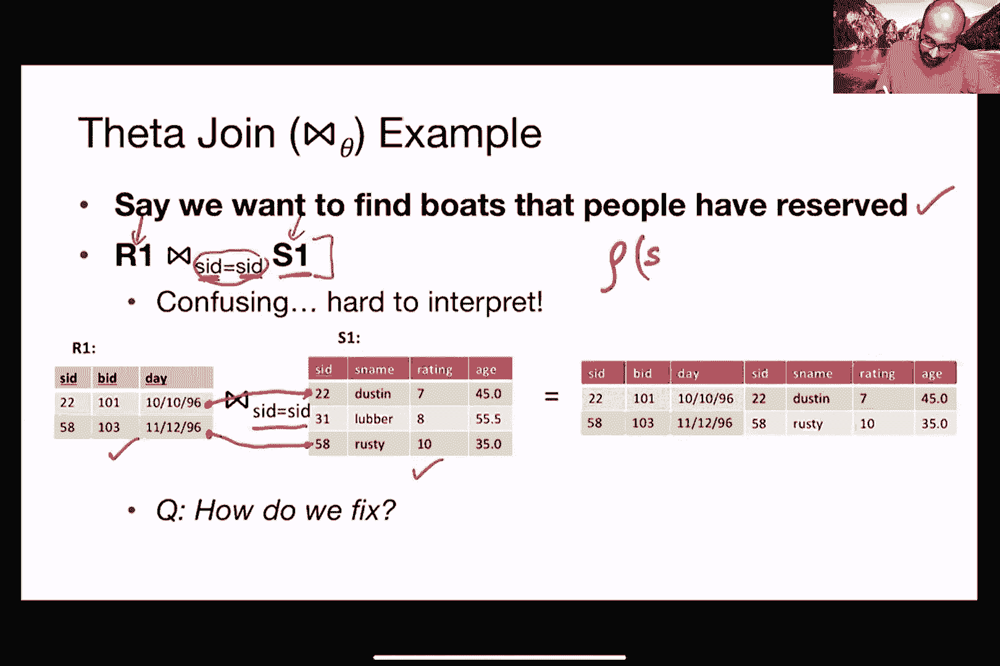
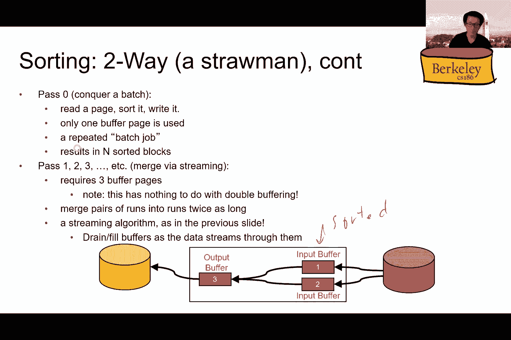

# 课程 P8：关系代数 🧮

在本节课中，我们将学习数据库查询语言的核心——关系代数。我们将了解其基本操作符、如何组合它们以构建复杂查询，以及它在数据库系统优化中的重要性。

---

## 概述

关系代数是一组对关系（即数据库表）进行操作的运算符。它类似于算术或线性代数，允许我们通过组合基本操作来构建复杂的查询表达式。理解关系代数是理解 SQL 查询如何被数据库系统解析、优化和执行的基础。

---

## 基本操作

上一节我们介绍了关系代数的概念，本节中我们来看看其核心的五个基本操作。

### 1. 投影 (π)

投影操作符 `π` 用于从关系中选择特定的列（属性），相当于 SQL 中的 `SELECT` 子句（仅列名部分）。它执行的是关系的“垂直切片”。

**公式**：
`π_{属性列表}(关系R)`

**示例**：
假设有一个水手关系 `Sailors(SID, Sname, Age, Rating)`。
`π_{Sname, Age}(Sailors)` 将返回一个只包含 `Sname` 和 `Age` 两列的新关系。

**注意**：在关系代数中，结果遵循集合语义，会自动去除重复行。但在实际 SQL 中，需要使用 `SELECT DISTINCT` 来显式去重。

### 2. 选择 (σ)

选择操作符 `σ` 用于根据指定条件筛选关系中的行，相当于 SQL 中的 `WHERE` 子句。它执行的是关系的“水平切片”。

**公式**：
`σ_{条件}(关系R)`

**示例**：
`σ_{Rating > 8}(Sailors)` 将返回所有评分大于 8 的水手记录。

**注意**：选择操作不会产生重复行，因此无需额外去重。

### 3. 并集 (∪)

并集操作符 `∪` 用于合并两个具有相同模式（相同数量和类型的属性）的关系中的所有元组，相当于 SQL 中的 `UNION`。

**公式**：
`关系R ∪ 关系S`

**注意**：在关系代数中，并集操作会自动去除重复的元组。SQL 中的 `UNION ALL` 则保留重复项。

### 4. 差集 (-)

差集操作符 `-` 用于找出存在于第一个关系但不存在于第二个关系中的元组，两个关系必须模式兼容。相当于 SQL 中的 `EXCEPT`。

**公式**：
`关系R - 关系S`

### 5. 笛卡尔积 (×)

笛卡尔积操作符 `×` 将两个关系中的每一个元组进行两两配对，生成一个新的关系。如果关系 R 有 m 行，关系 S 有 n 行，结果将有 m×n 行。

**公式**：
`关系R × 关系S`

**注意**：这通常是一个代价高昂的操作，在实际查询中应尽量避免，或通过连接条件进行限制。




### 6. 重命名 (ρ)

重命名操作符 `ρ` 用于更改关系或其属性的名称，这在处理自连接或避免属性名冲突时非常有用。

**公式**：
`ρ_{新关系名(新属性名1, ...)}(关系R)` 或 `ρ_{新属性名/旧属性名}(关系R)`

**示例**：
`ρ_{Sailor2(SID2, Name2, Rating2, Age2)}(Sailors)` 创建了 Sailors 表的一个副本并重命名了所有属性。

---

## 复合操作

以上是基本操作，接下来我们看看如何用它们定义更高级的复合操作。

### 交集 (∩)

交集操作符 `∩` 用于找出同时存在于两个关系中的元组。两个输入关系必须模式兼容。

**公式**：
`关系R ∩ 关系S`

**实现**：交集可以通过差集来表达：`R ∩ S = R - (R - S)`。

### 连接 (⨝)

连接是关系代数中最重要的操作之一，用于根据相关列组合两个表中的行。它有多种变体。

#### θ-连接 (⨝_θ)

θ-连接是笛卡尔积后接选择操作。
**公式**：
`R ⨝_{θ条件} S = σ_{θ}(R × S)`
其中 θ 是任意条件（如 `R.A > S.B`）。

#### 等值连接

等值连接是 θ-连接的一种特例，其中条件 θ 只包含相等谓词（如 `R.A = S.A`）。

#### 自然连接 (⨝)

自然连接是一种特殊的等值连接，它会自动对所有同名的属性进行等值比较，并且在结果中同名属性只保留一份。
**概念流程**：`π_{去重属性集}(σ_{同名属性相等}(R × S))`

**示例**：
`Reserves ⨝ Sailors` 会在 `SID` 属性上自动进行等值连接，并将两个表中的信息合并。

---

## 组合复杂表达式


关系代数表达式可以通过多种方式组合，就像数学表达式一样。


以下是构建复杂表达式的几种方法：

1.  **赋值序列**：创建中间关系变量，使表达式更易读。
    ```python
    Temp1 = σ_{Rating>8}(Sailors)
    Result = π_{Sname}(Temp1)
    ```
2.  **带括号的表达式**：使用括号明确运算顺序。建议总是使用括号，避免依赖默认优先级。
    `π_{Sname}(σ_{Rating>8}(Sailors))`
3.  **表达式树**：以树形结构可视化表达式，其中叶子节点是关系，内部节点是操作符。这在查询优化中非常有用。

**默认优先级**（如不使用括号）：一元操作（σ, π, ρ） > 笛卡尔积和连接 (×, ⨝) > 集合操作 (∪, ∩, -)。

---

## 查询优化简介

数据库系统会重写关系代数表达式以提高执行效率，这个过程称为查询优化。

以下是两个关键的优化规则：

1.  **选择操作下推**：尽可能早地执行选择操作，以减少中间结果的大小。
    *   未优化：`π_{...}(σ_{条件}(R ⨝ S))`
    *   已优化：`π_{...}((σ_{条件}(R)) ⨝ S)` 或 `π_{...}(R ⨝ (σ_{条件}(S)))`
    *   **优势**：尽早过滤掉不满足条件的行，减少后续连接操作需要处理的数据量。

2.  **连接顺序调整**：连接操作的顺序会影响性能。优化器会估算不同连接顺序的成本。
    `(R ⨝ S) ⨝ T` 的成本可能与 `R ⨝ (S ⨝ T)` 不同。

---

## 扩展操作

除了基本和复合操作，关系代数还可以扩展以支持 SQL 中的其他功能。

### 分组与聚合 (γ)

分组操作符 `γ` 对应于 SQL 中的 `GROUP BY` 和聚合函数（如 `AVG`, `COUNT`）。

**公式**：
`γ_{分组属性， 聚合函数}(关系R)`

**示例**：
`γ_{Age, AVG(Rating)}(Sailors)` 按年龄分组，并计算每个年龄组的平均评分。
添加 `HAVING` 子句相当于在分组结果上再进行一次选择操作。

---

## 总结

本节课中我们一起学习了关系代数的核心内容：
*   **关系代数**是一组将关系映射为关系的封闭运算符，是声明式查询语言（如 SQL）的操作性基础。
*   我们掌握了**六个基本操作**：投影 (π)、选择 (σ)、并集 (∪)、差集 (-)、笛卡尔积 (×) 和重命名 (ρ)。
*   我们了解了**复合操作**，如交集 (∩) 和各种连接 (⨝)，它们都可以用基本操作来定义。
*   我们看到了如何通过**赋值序列、表达式和表达式树**来组合这些操作，构建复杂的查询。
*   我们初步探讨了**查询优化**的重要性，例如通过“选择下推”来显著提升查询性能。
*   最后，我们简要介绍了**扩展操作**，如分组聚合 (γ)，它们涵盖了 SQL 的更多功能。



理解关系代数不仅有助于编写高效的 SQL 查询，更是深入理解数据库系统如何工作的关键一步。