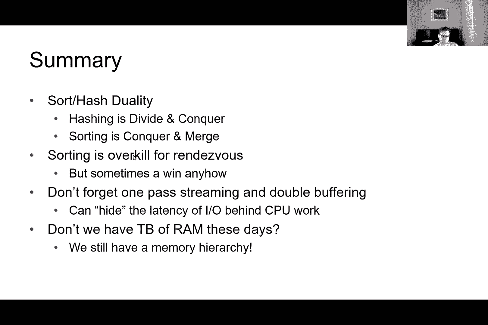

# P9：Lecture 9 Sorting & Hashing - ___main___ - BV1cL411t7Fz

到局部的右边。

是的，也设置为本地，好的，所以你好，大家好，欢迎来到186的周四讲座，在我们开始之前，我只想重复一下Aditm在，星期二，所以第一件事是如果你决定和助教一起工作，请尽量描述一下。就像你的项目需要的那种帮助，嗯，这样助教们就可以尝试合并不同的请求，或者喜欢人们问类似的问题，嗯，所以团队真的很感激你们这么做，因为就像你知道的，我们在办公时间收到的罚单数量将会大大增加。所以对你们来说，请试着想出，就像一个关于，就像，你有什么问题，你知道我们并不想这么做，但就像在最坏的情况下，就像你知道的，如果队伍真的变长了，人们没有描述，我们将不得不执行，让你们回到队伍里等待下一轮。如果你不为你的票写上说明，所以我提前道歉了，但这是我们唯一能处理的方法，嗯，就像你知道我们预计以后项目的门票数量会越来越多，然后也就像我刚才说的，你知道的，请尝试打开你的视频，如果你不介意的话，呃。

它给了我们喜欢，你知道的，在见到你们方面有很多很好的反馈，就像你知道的点头，或者像你知道的那样看起来像不困惑，这基本上是告诉我们讲师放慢速度的一种方式，或者谈谈，呃，或者试着再解释一遍，嗯，别担心。大家可以看到，我什么都没穿，不错嘛，嗯，你不需要那么做，我是说我还不如穿着睡衣，对所有人的权利，我们关心，就像你知道的，我们没有录下你们的脸，你们的脸也没有出现在演讲视频中，所以别担心，只有我出现了。所以我必须穿睡衣以外的衣服，是啊，你没有相机，很抱歉，但如果你这么做了，请尝试，请尝试加入我们，好的，好的，所以呃，只是为了回到材料上，所以周二我们开始讨论，关系代数，我们也开始谈论排序和哈希。你可能还记得，我们谈论的原因，这是因为我们想了解这些关系代数操作实际上是如何实现的，顺便说一句，你也会在项目3中看到，原来排序和散列是两种非常常见的操作，呃，在不同的关系代数运算符实现中显示。

所以这就是我们谈论这个的原因，呃，在这次讲座中，整个目标基本上是开发不同的算法，我们可以使用，这样，稍后当我们谈论查询处理或查询优化时，然后我们可以讨论如何在不同的实现中进行选择，所以两个主题。有点浮现，或者它会在本课结束时出现，事实上，我们经常流媒体，从磁盘流式记录，嗯进入主存，处理它们，然后把它带回磁盘，另一个是你们在61年就已经学过的东西，就是分而治之，作为一种算法。我们将在本课中反复看到，所以在周二，我开始谈论双重缓冲的想法，那个，你可能还记得，讨论了从磁盘加载数据的想法，你在屏幕左下角看到的，将它们加载到主存内的输入缓冲区中，通过调用这里的某个函数来处理它。我一般指的是x的f，再把它们写回记忆中，就在输出缓冲区中，然后最后把它们填满，或者你把它们写回你在右边看到的磁盘上，我们称之为双缓冲的原因是，因为你知道我们可以更聪明。

我们不必一次一个记录地浏览所有的东西，按顺序，我们实际上可以有多个输入缓冲区和多个输出缓冲区，其中我们有一个线程专门用于执行，或处理已在内存中的输入元组，也就是x的f读，然后另一个单独的专用线程。其唯一的工作是从磁盘读取元组或将元组带入内存，或者在右手边处理完元组后写出元组，我们之所以可以使用两种威胁是因为，在其中一个buff输入缓冲区完全处理后，我们实际上不需要等待从磁盘中引入新的元组。其实我们可以，你知道的，把两个威胁交换对，所以我们只是交换了两个威胁，所以以前从磁盘上带来两个帖子的威胁，现在可以更改以运行处理器，可以这么说，或者在已经引入的两个帖子中的每一个帖子上的X的F。然后另一个用来处理的线程，现在可以加载元组或编写元组，所以这个通用的概念被称为双缓冲，我们可以这样做，你知道的，我们将在这节课剩下的部分中讨论的所有实现，事实上，这只是一件很常见的事情。

我只是不打算把它画出来，但你可以想象这基本上就是正在发生的事情，呃，在被子后面，罗曼，你有问题吗？我不是很熟悉你说的线程，这就像你听说的多线程处理器一样吗，还是这里发生了什么，是啊，是啊。所以这正是多线程的概念，所以你可以想象有两个工人对流程的威胁，如果你想打电话给他们，嗯，一个进程或一个线程，基本上只致力于做元组处理，另一个线程或另一个进程专门用于执行i o操作，这正是它的意思。现在回到排序和散列，就像，你知道的，刚才的双缓冲只是一个通用的框架，我们将运行，排序和哈希算法，关于这两个，um操作，这是我们周二也通过的正式规范，所以排序正是我们想象中的正确做法，就像你知道的。我们的目标是在一个巨大的文件中读取，然后生成输出文件，文件中的所有内容都根据我们试图做的任何标准进行排序，然后是散列，um是将输入元组拆分为不同桶的想法，呃，除了我们试图强制执行，事实上。

没有两个具有相同哈希值的记录被，嗯，一个不同哈希值的记录，这意味着如果两张唱片最终，um哈希到相同的桶或具有相同的值，那么它们不应该被另一个具有不同哈希值的记录分隔，我们想这么做的原因是。因为我们试图使用散列来实现，呃，重复照明，正如你所记得的，这是呃，SQL操作的人记得什么，我们怎样才能得到相同的不同，是啊，是啊，这个东西对，例如说对，所以这正是我们如何实现不同的，在SQL中。如果我们能实现哈希，那是如此，这就是我强制执行这方面的原因，对呀，我们不想要任何两张唱片，具有相同的哈希值，由其他任何东西分隔，因为如果我们那样做，那么我们就无法判断它们是否是重复的。而不必读入整个文件，这很糟糕，因为正如你所记得的，顺序，I O是好的，随机，伊娥不是，所以说，这就是为什么我们希望文件以这种方式布局，我们得到的，另一方面，是包含要发布的输入文件，我们只是假设需要n个。

不同的页或存储块，以便将它们保存在磁盘上，我们有，假设无限多的磁盘大小，所以我们不担心磁盘空间用完，虽然另一方面，我们确实有固定数量的RAM可以使用，特别是我打电话给你，就像你在用，B对了，用喜欢。你知道从上一节课，至于，呃，我们可以玩的主存块的页面，这有道理吗，所以设置就像你知道我们有一个巨大的文件，我们只有很少的内存，或者至少在方面与输入文件的大小进行比较。我们的工作基本上是对这个巨大的文件进行分类和散列，现在，如果你有足够的主存来读取整个文件，那这就不用动脑筋了，当你刚运行你最喜欢的算法从61 b对，我是说，就像你知道你可以运行快速排序。你可以运行泡泡或任何类型的，你也可以在主存中构建一个内部哈希表，然后我们就做对了，但我们不是生活在那个世界里，所以这有点挑战性因为我们只有有限的内存，与文件大小相比，与我们试图排序哈希的文件的大小相比。

嗯，所以让我们从开始，这里有一个简单的算法，我们将运行多个通行证，第一遍包括从磁盘上一个接一个地读取每一页，对特定的页面进行排序，所以我们从磁盘中读取了一页，现在在主存中，我们将在主存中对其进行排序。然后我们将把排序的结果写到磁盘上，就在另一个文件里，假设现在我们已经对每个单独的块进行了排序，或文件的每一页，但那不是我们做得不对，我们希望对整个文件进行排序，不是单个块。所以我们现在需要再次对文件进行多次传递，所以你可能还记得合并排序的想法，也就是，你知道的，我们从两个推列表开始，然后我们试着把它们组合起来或合并起来，只需从两个列表中的任何一个中提取第一个元素。取决于哪个实际上是顺序中的第一个，然后将它们放在合并列表中的沉浸式版本中，所以这里，我们可以这样做，我们的磁盘文件对，所以我们要朗读，一次两页，所以这相当于两个呃，我们已经单独排序的两个磁盘页，对呀。

然后我们将在主存中运行合并排序，就为了这两页，好的，所以我们要弄清楚，第一页或第二页的两篇文章中，哪一篇实际上是最不正确的，取决于排序准则，然后我们要把它写出来，第三页，我们将继续这个过程，对呀。我是说我们有两个，但是我们只有一个输出页，所以输出缓冲区会被填满，在我们在一两个元组中详尽地遍历所有元组之前，所以一旦输出缓冲区被填满，然后我们就把它写到磁盘上或者把它们抽干。所以现在输出缓冲区3变成空的，我们再次进行合并过程，我们再次重复这个过程，直到我们用完输入缓冲区的第一页或第二页，在这一点上，我们然后把，就像你知道的，我们能我们能。我们基本上可以把以前排序过的其他页面，然后现在再做同样的事情，但就像我说的对，那不是，我们做得不对，因为在这一点上，经过一个过程后，我们基本上已经将磁盘上的两个页面合并到一个更大的运行中，由两页排序的。

呃，记录，但我们需要对整个文件进行正确的排序，我们不仅仅是对其中的两页进行排序，所以我们基本上需要再次重复同样的过程，通过阅读这些二的运行，然后重复同样的过程，通过合并它们来创建四个页面的运行。如此等等，直到我们把所有的东西都合并在一起，所以这里有一个图片的方式来说明整个过程，我称之为征服和融合，因为我们有第一步，我们只是单独分类所有的东西，然后我们开始合并过程，所以这里的第一步。我把它们称为concurve阶段，或者你想叫它什么，它基本上包括对块的单个页面进行排序，好的，所以在这里，就像你知道数字一样，每个黄色的盒子，橙色方框与实际对应，然后右边这个紫色的，你可以考虑。就像需要去的头或元数据一样，呃在文件的开头，所以在第一页之后，或者在第一次通过或通过零之后，我们只需对单个文件进行排序，所以你可以看到这里最左边的第一页被排序了，左边的第二页也得到排序，以此类推。

现在我们需要合并，就在第一次传球之后，我们该怎么办，我们把前两页，将它们读入主存，然后合并它们，这样你就可以看到了，所以我们开始合并三个，四和二六，所以这就是为什么我们得到元组，两个先。因为两个先于三个，然后是三个，因为三个在三个之后，呃，四，然后我们剩下的元组也是如此，我们从两页开始，所以我们要在最后写另外两页，现在你可以看到，在这个例子中，我们现在有一个两页的运行，或者。我们一开始只是对单个页面进行排序，这有意义吗，所以如果我们有更多的缓冲页，我们会像这样读到的，你当时知道更多的页面，但在这种情况下，因为我们只有像，你知道吗，输入的两页，所以这就是我们读的原因。你知道第一页，一次只读前两页，然后合并，合并，然后把它写回磁盘，现在我们只做了前两个街区，你可以想象剩下的步骤我们要做什么，台阶内侧，在第一次传球的右边，即我们要把接下来的两页，把它们读到记忆中。

对它们进行分类，然后在我们浸入它们后立即将它们写回来，等等，等等，请注意，现在我们已经创建了排序正确的两个页面或两个页面运行，你也可以看到我们是，我们在排序文件的大小方面都在增长。我们也在减少跑步的次数，就在第一次传球或零次传球之后，我们最终有八次不同的跑步，它们中的每一页都正好由一页组成，在第一次传球之后，我们现在有四次跑动，对呀，对不起，呃是的，我们现在有，呃，四分。每份由两页组成，是啊，是啊，我可以告诉人们，是啊，是啊，向右重复，是啊，是啊，就这样重复，第二次传球或第二次传球，我们再把前两页，现在的前两次跑步，由两页单独组成，然后我们将再次运行这个合并过程。现在我们创建四页的运行，然后另一个也是这样，对，最后一次通过将完成合并或抱歉，整理整个第八页第五页，所以让我们对每一个通行证做一点计算，嗯，我们直接从输入文件中读写每一页，所以就IO成本而言。

这将使我们付出正确的代价，我们浏览整个文件，然后我们把每一页都读一遍，然后我们也把每一页都写出来一次，所以那是n，但现在我们需要重复多少次这个过程，我是说在这种情况下你可以数数，我是说嗯。但就像你知道的，我要去，别拿数学来烦你，基本上说这是n的对数基数2对吧，其中n是磁盘块的总数，我们试图处理的这个特定文件，然后加上一个，因为我们基本上需要考虑第一个，嗯，第一关，对呀，一个一个，是啊。是啊，第一遍基本上只需要读出，就像你什么都知道一样，然后你知道你可以在这里看到的传球次数，随后只是由日志基给出结束罗马，你有问题吗，关于图表的一个快速问题，堆叠的文件有意义吗，呃，而不是在水平面上。那意味着什么吗，你从，哦，你是说像那样，然后你以，是啊，是啊，准确地说，你从水平到垂直，对呀，所以我试着用垂直的来显示那种版本，好的，但它如何影响记忆或类似的事情没有意义，否，否，否，否，否，好的。

是啊，是啊，严格来说，它是为了显示每次运行的大小，也是为了表明它们是排序的，我在聊天时问了一个问题。我想有人刚刚回应了，但我还是想问，嗯，那么我们实际上如何像合并多个页面运行在一起。如果我们只有有限的记忆，因为在最后就像，我怎么猜像，在最后说，如何将这两个四个客户合并在一起，而不将其全部加载到内存中，是啊，是啊，所以请记住，在四页中，像你知道的一个案例，单个文件已经排序，对呀。所以这个文件已经排序了，另一个文件已经排序了，所以我们只需将这两个文件的第一页读入主存，一次一页，然后我们在主存中合并，所以我们先试着，所以也许这个是一个不好的例子，所以如果你回去让我们看看，就像。你知道这就像，你知道的，是的，是的，就在这里跑，所以我们试着合并二三四六，另一个文件有四个七，八和九，所以我们在有限的内存下这样做的方式，因为我们不能把所有东西都加载到主存中，因为我们只有三页。

在主存中，其中一个已经被输出消耗，所以要做到这一点，基本上只需阅读第一页，这两个运行的权利，我们可以负担得起正确的，因为我们有两页可以读，所以我们读了这两篇文章的第一页，然后我们在主存中依次合并它们。所以我们基本上看到，你知道的，二比四，所以我们先取两个，然后我们基本上把记录放入输出缓冲区，然后我们取三个右，因为三也在四之前对吧，但是在我们用完左边的前两个元组之后。然后我们意识到第一个缓冲区现在是空的，那么会发生什么，然后我们基本上把第二页读入输入缓冲区，然后我们再次进行相同的合并过程，好的，是啊，是啊，我现在明白了，谢谢。是啊，是啊，我的意思是同样的输出向右。你可以问，我是说，输出仅由一页组成，那么我们如何写出一个由四页组成的输出文件，对呀，答案是我们向右转，我们填满输出页面，一旦填好了，然后我们基本上加满了，然后我们基本上把它写到磁盘上，清空该文件。

以便我们可以写入该文件的后续部分，好的，Felix，嗯是的，所以在这个例子中，看起来我们基本上使用的是隐式的输入缓冲区，就像一页大，嗯，所以看起来这是合乎逻辑的，我们可以把这些缓冲区稍微大一点。那样似乎是这样吗，比如说，就像我们合并的情况一样，就像八页中的四页运行，如果我们有两个大小的输入缓冲区，就像呃，每页尺寸两页，那么同样的过程将在一周内适用，事实上，这是下一张幻灯片，好的，是啊，是啊。所以如果你看两页，假设在左边我们有两个三个四个十个，那就意味着我们首先，呃将输入，或者我们将在输出磁盘上写入2-3，然后我们比较四个十和四个七，所以我们会得到四个四个，这次，所以在那种情况下。两个缓冲区，所以缓冲区1只剩下6只缓冲区2只剩下7只，所以在这种情况下我们只需要翻半页不，我们只需继续，直到其中一页被消耗掉，所以你写出4和4，然后剩下的是，你说呢，六和十，是啊，是啊，哦，我是说。

十和七，是啊，是啊，十和七，好吧那么下一个要走的是七个，是的，所以写作设置完全完全，使用其他页面中的一个，就在其中一页，所以我们就把下一页拿进来，好的，所以回到这个计算，对所以嗯，从61 b开始。你们基本上了解到这和呃，呃，呃，就像任何精细的浸没排序一样，所以基本上是我们需要通过每一个这些的次数，就像你知道的，输入文件将是日志基，n中的两个，其中n是这个文件占用的块数。然后额外的一个将解释第一次传递，在那里我们对每个单独的块进行排序，所以总成本，在这种情况下，是这个数字的两到n倍，对呀，因为两个n是每个通行证的成本，因为这个问题是早些时候提出的对吧。所以这里有一个通用的算法，对呀，因为早些时候我说好吧，如果我们只有两个输入缓冲区，我们可以在输入文件中读取，那么我们一次只能合并两个块或两次运行，对我是说你看你看这里所有的箭头，基本上只有两个，对呀。

因为我们只受到两个人的限制，两个输入缓冲区，对呀，如果我们有更多的输入缓冲区，那么我们可以做的一件事就是同时合并更多的运行，对呀，事实上在上一张幻灯片上，如果我们有输入缓冲区。我们也可以把过去两年的所有文件合并在一起，然后我们就不用跑过三个了，对呀，但在这种情况下，因为我们只有两个，所以我们得再跑一次，这就是代价，如果我们有更多的内存，我们实际上可以经营更多的东西，所以呃。首先这基本上意味着，我们可以在第一次通过时创建更大大小的文件，就在上一张幻灯片上，我是说，好的，我们的输入缓冲区只有一个，所以我们将读取文件的一个块，一次一个然后分类然后就像你知道的那样直接到磁盘上。但是如果我们有更多的页面可以用来保存元组，显然我们不必分类，就像每一个方块一个接一个对吧，我们可以读取文件的十个块，然后在过去的一个中对它们进行排序，这也会减少我们需要通过的次数，然后另一方面。

如果我们有更多的页面，然后我们也可以合并更多的文件，对不起，同时也有更多的运行，对，这就是你在合并阶段看到的，所以一般的算法基本上就像我在这里描述的那样，因此。为了对具有n个页的文件进行排序并成为缓冲页，在第一次通过时，我们将使用我们能使用的所有页面，然后生成运行的，每一页都是对的，那么运行次数正好是n除以b，呃右边的天花板。因为嗯n可能不是一个可以被b整除的数，然后对于随后的通行证，我们基本上把b减去一，呃同时运行因为我们有B，呃缓冲区总数，然后最后的缓冲，为什么不是b而是b减去一，因为我们需要为输出保存一个缓冲区。这就是这张照片所显示的，那么一般的公式是什么呢，计算iOS的数量，合并排序，嗯，我声称这是这个数字，是这个公式，对吧，所以注意到一个不同，所以基本上我们把对数乘以b的次方减去1，因为我们不做。

就像你知道我们不是一次合并两个运行，我们实际上是在合并B-1同时运行，然后我们需要经历的次数是n除以b，呃，仅仅因为我们的运行次数，在过去数字零的最开始，你还记得在上一张幻灯片上，我们有n个。相对于n除以b右，因为我们假设每次我们只排序一个，过去零点期间的单页记录，所以总的io是2，然后乘以这个数字，好的，所以这部分没有变，所以只是为了给你一种喜欢的感觉，现实地说，这些数字应该是什么样子。假设我有五个缓冲页，我正在整理磁盘上108页的文件，所以第一次传球我们会产生两次两次跑动，每篇都有五页长，因为我们的缓冲池由五个页面组成，虽然像上一个，最后一次运行将是三页，因为一个零，八不是数字。可被三整除，抱歉五点，然后对于后续的传递，我们只需要继续进行这个合并过程，就在我们一次合并四次运行的地方，因为我们需要保存其中一个缓冲页或，呃，输出的一个缓冲页，然后你可以看到三次跑步，对不起。

四次传球，包括第一个，嗯，我们把这个文件整理好，然后如果你把它插入公式，这也检查以及通行证的数量，你有问题吗，是啊，是啊，所以我想把这个和双重缓冲结合起来，如果你有六个，假设你有六个缓冲页。如果要进行五路外部合并排序，你仍然需要等待大约五页才能从磁盘加载到内存中，所以是快还是慢，如果你喜欢，我猜像双缓冲双向合并排序，还是我们可以做好的事情，所以就木卫一而言，这不像改变，那改变不了什么。对呀，因为我们还在提，我们是，因为我们仍然一次一页地带来每一页，所以就IO成本而言，这是不改变的，但就现在的内存成本而言，现在我们需要更多的缓冲页，对呀，因为我们基本上有一个集结地。我们在他们真正使用之前就把页面带进来了，所以这是关键的区别，所以基本上这意味着我们不能用完所有的牛肉缓冲页面，就像你知道的那样做合并，对呀，因为我们需要拯救他们中的一些人，嗯。

在我们进行合并的同时进行双重缓冲，但在实践中，我想如果喜欢，这可能是一个更快的解决方案吗，是啊，是啊，所以这肯定比你快，正如你指出的，对呀，因为我们不必等待，伊奥，对呀，假设其中一个输入页。我们刚刚消耗了一切，所以如果我们不是在做双重缓冲，我们基本上停滞不前了，我们基本上需要拖延等待I O，在我们真正继续之前，但如果有双重缓冲，然后我们实际上可以，呃，我们不必等待。但我们在这里基本上是在交换内存，对呀，因为我们需要额外的一页，呃，双重缓冲威胁的生效，当我们做合并的时候，是啊，是啊，所以为了快速增加尼古拉斯，我想这也像你为这个保留了一些页面，或者这个的一些框架。你基本上也在减少并行性，好吧，你可以带来更多，您可以合并更多的运行，如果您对每次运行的代表使用这些缓冲区，对呀，所以这是艾伦提到的一个权衡，呃，嗯哼，嗯，所以这里有更典型的数字，对呀，所以我就像。

你知道的，用这个公式来计算我们需要做的iOS的数量，嗯，大家可以看到，用很少的运行对，所以在这种情况下，就像你知道的，合适的游泳池大小是257，我们基本上可以，十亿，呃，数据块，对呀，所以这很酷。只用四次传球，这就像B+树的讨论一样，我们基本上说对于for，因为b+树有一个很高的，非常高的扇形，因此，我们可以存储大量的元组，用一棵很浅的树，所以在这种情况下，我们不是在谈论。你知道这里的树或数据结构，对呀，但如果你看看合并，我几张幻灯片前展示的一张照片，基本上看起来你知道，就像一棵树对吧，除了它像时间里的一棵树，不是在太空中，因为我们讨论的是算法的不同阶段，但概念相似。因为我们能够融合很多不同的，嗯，同时进行很多不同的跑步，呃，有大量缓冲页的，所以我们不需要运行很多，为了把整件事整理好，经过了很多通行证，所以我觉得这很酷，因为这就像你知道的，空间和时间之间有一个类比。

好的，所以现在让我们再问一个问题，对呀，所以假设我不满足于像这样运行这些，你知道的，多次传球正确，我只想跑两圈，这意味着我获得了对每个单独页面进行排序的第一道关卡，或者我们一直称之为零。然后我只想像一次传球一样奔跑，所以没有后续的通行证，我不能那样做，所以让我们来计算一下，在这两个过程中，我们实际上可以排序多少数据，就像我说的对，所以我们基本上合并了。我们首先从磁盘中对单个页面进行排序，创建B页长的运行，然后在第一遍中，我们基本上合并b减去其中的一个，这基本上意味着我们可以排序的数据量的数量，就这两遍是b乘以b减去1，或者基本上接近b的平方，对呀。按排序的总数据计算，我们用B空间，对呀，B就像缓冲区里的页数，那么我为什么要做这个计算，因为我想知道这个比例是如何正确的，所以现在基本上意味着如果我们想对x个数据量进行排序。

那么我们需要x的平方根作为缓冲页，如果我们只想跑两趟，如果你想用完垫子，多次后续传递，那就继续吧，但如果我只想跑两次传球，我可以用x空间的平方根来做，那也很不错，因为我们不需要，你知道的，呃。我们实际上可以这样，呃，我们实际上可以整理很多东西，就用那个，就像你可以看到b和x的平方根是如何缩放的，谢谢，所以对于那些喜欢的人来说，你知道谁知道复杂性，你基本上可以看到，呃，它实际上是如何生长的。你有问题吗，这里是绿色，再解释一遍，我们如何得到x的平方根，是啊，是啊，就像你知道的，我们知道在使用B页时，右b，就缓冲池的大小而言，我们只需两次就可以对B平方量的数据进行排序，对呀。所以我只是在做反向计算，这意味着如果我们通常有x个数据量，我们想分两次做，那么我们只需要用x空间的平方根，在这里，我们假设两次传递将完全排序数据，准确地说，我只能做两遍，因为我想看看效果如何，好的。

谢谢。是啊，是啊，对我，你知道就像，你知道的，呃，比线性慢的x尺度的平方根，对然后x所以，因此，这实际上是一个相当不错的交易，关于现在开始还有什么问题吗，好的，如果没有，然后让我们继续哈希。所以这里的想法，就像我说的对，我们在努力做一些我们不一定总是需要排序的事情，我们就可以，比如说，尝试检测重复，或者我们试图通过查询在组中形成组，所以在这些情况下，我们实际上不需要真正的顺序，一切的权利。所以哈希正是这样做的，因为它基本上，呃，放进去，呃，具有相同哈希值的记录，在同一个桶里，所以这足以让我们基本上成群结队，或在重复照明下，这个问题，然而，对呀，就像之前一样，我们如何做到这一点。这意味着我们有有限数量的缓冲页，但是我们有一个很大的文件，我们正试图哈希，现在让我们用下面的方法来做这件事，所以我们首先要做一个除法，我们将使用哈希函数从磁盘流式传输记录。

然后把它分成不同的块我们写出来，所以现在所有具有相同哈希值的东西都将被放入同一个磁盘，分区，嗯，每个分区将有一个混合，呃，不同的价值观对吧，然后就像之前一样对吧，如果呃，如果输出缓冲区页的空间不足。然后我们就把它写出来，呃到磁盘，所以这里有一个图片描述，所以我们要再来一次对吧，所以我们在磁盘上有输入关系，嗯，在不同的页面，我们将阅读在每一页，一次一个，然后调用我们自己选择的哈希函数。然后把它们分成不同的桶，因为我们总共有B页，其中一个正在被输入缓冲区消耗，我们可以创造B减去一个不同的桶，然后如果这些桶中的一个或任何一个装满了客人，然后我们就把它们写回磁盘。就像以前一样到目前为止一切都好，所以这里有一个例子，假设我有一个由元组一组成的输入页，二和三，我应用一个哈希函数，将第一个元组放在第一页，第二页第二页，但是因为哈希值可以正确地碰撞。

所以我们最终可能会把第三个记录放在第一个请愿书中，因为它实际上也可能具有与第一个相同的哈希值，所以我们把它们写到磁盘上，然后我们就往右走，我们现在在文件的第二页读到。所以让我们假设第二页由记录五和一组成，所以我们再次应用相同的哈希函数，它可能会把第五个，的，其中有五个的元组在第三个分区中，然后它会把记录的另一份副本，一个权利在第一个分区到目前为止，一切都很好。除了它违反了我们的限制，您知道具有相同价值的记录，具有相同哈希值的右应该在磁盘上连续背诵右，但现在既然我们一页一页地做这件事，我们最终把三张放在一的两张唱片之间，这都是因为事实。我们不能同时看到整个文件，我们一次只能看到一个街区，所以谁知道我们会遇到更多的还是更多的，你知道两个和五个之后，呃，在只看到其中一个磁盘页后，所以这就是问题所在对吧，我是说如果不是，然后我们就读进去。

我们会把整个文件读入主存，创建桶，然后我们就都做对了，但在这种情况下，我们负担不起那样做，这就是为什么我们有这个问题，这告诉我们什么，这基本上告诉我们，我们没有完成后，就像，你知道的，呃，哈希第一个。第一页右边，我们还没有完成后，只是哈希每一页，个别地，我们需要重复一下，或者换句话说，我们需要读对，我们以前散列过的每个分区，然后尝试一下，再试着把它们散列一下，相同过程权，我们将应用另一个哈希函数。希望能把东西放进不同的桶里，就像以前一样对吧，然后同样地，我们将读出内存中的哈希表，然后将它们写入磁盘，所以现在，我们可以确保重复的值现在在磁盘上是连续的，所以我们从第一阶段开始，对呀。我们怎么有这些不同的桶，我用这个，这些呃，红色长方形，然后我要读这些请愿书中的每一份，一次一个，这里有一个很大的警告，对呀，我只是假设，每个分区的大小都小于B，这意味着整个分区实际上可以容纳在主存中。

为什么，因为如果我们能做到这一点，然后我们现在可以创建像，使用我们最喜欢的哈希哈希算法，因为我们现在把所有东西都放在主存里了，我们现在可以运行我们典型的哈希构建哈希表构建算法。然后用这种方式将桶写到磁盘上，从我们之前的例子开始，所以从第一阶段开始，我们最终收到了三份请愿书，第一个有一个，三加一，和，另外两份请愿书有两份和五份，分别是，所以对于第二阶段或重复阶段。我们要把这些请愿书一次一个地拿进来，然后构建我们自己的内存哈希表，所以现在使用不同的哈希函数，我们希望能分开就像你知道的1和3，然后从现在开始他们是，他们是我们做了，然后我们这样输出桶。我们确信我们不会出现我们以前见过的问题，因为我们已经解决了1和3的所有记录，第一阶段之后对吧，第一阶段会把所有的记录，和所有的记录三个到同一个分区，所以这就是为什么我们可以负担得起第二阶段的重复。

我们下一个就完成了，你有问题吗，是啊，是啊，所以我想你回答了这个，但我们之所以确定是因为我们在主存中做了第二个，我得到了，是啊，是啊，还有一个很大的警告，对就像，你知道的。我们假设轮询分区实际上适合B页，我们拥有的，到目前为止，这是一个两面派，呃，两相算法对，我们只是把它捣碎，单独写请愿书，然后像你知道的那样重复一次，然后我们就完成了，沃伦，你还有一个问题，是啊，是啊。呃，有没有可能我们不得不太多的一个，这样的，它并不都适合一个分区，是啊，是啊，所以这就是为什么我一直这么说，就像，你知道的，我们假设每一份请愿书实际上都适合B页，是啊，是啊。你会看到如果我们没有那种情况会发生什么，呃再次，我们也会问接下来会发生什么，如果不合身，是啊，是啊，好的太好了，这些都是很好的问题，就拿着那个，但我只是想确保每个人都明白，到目前为止我们一直在谈论。

适用于以下情况，如果每个请愿书的大小小于B页，任何其他问题，好的，所以在我继续谈论之前，如果失败了会发生什么，让我们首先谈谈这个版本的成本，呃，哈希算法，所以其实很简单，对呀，所以就像，你知道。两次又一次，对我们所做的每一次传球，因为每通过一次，我们基本上读所有的元组，我们也写出所有的元组，所以就IO成本而言，就这样结束了，然后因为我们只运行两次，所以总成本是n，现在让我们再问一遍同样的问题。那么我们实际上可以使用多少数据，只有这两道，我是说就像我们问一个问题来排序一样，所以让我们再做一遍同样的练习，对了，第一次传球，我们可以创建B减去一个分区，最大的权利，因为就像你知道的。我们需要保存其中一个缓冲页以便在输入元组中读取，然后就像你知道的，每一个都假设这些分区中的每一个都小于，b页数，我一直在，呃，你知道吗，有点挥舞着我的手，然后说好，你知道吗，我们就假设是这样吧。

那么我们可以使用哈希的数据总量，就像你知道的这两步是b的平方，b减去一份请愿书，然后由最多B页组成的每个分区中的每个，所以b减去1次，我们就叫它b平方吧，然后有趣的是，同样的论点再次出现，对呀。所以我们现在有一个论点，我们有像你的B空间，主存中的页数，然后我们可以根据数据量对b平方进行哈希，所以翻转它，反过来只是另一种说法，如果我们想哈希呃，x数据量，然后我们还需要x的平方根，以页数为单位。如此正确，就像你知道的，第一个警告是，这些请愿书中的每一份都只有B页，最大值，然后我们也假设，另一种说法是，就像你知道的那样，我们假设哈希函数，也把唱片均匀地分布在右边，所以现在让我们问正确的问题。所以如果我们有一张更大的桌子会发生什么，有人知道我们能做什么吗，那样的话，所以现在，我们说的是这样一种情况，你在这里看到的任何一个分区，在屏幕中间，如果其中一个比B大。

那么我们就不能在第二阶段对该分区的所有内容进行哈希，对呀，那么我们能做什么呢，我会递归，直到我们能把它放入内存，完全正确，我们可以向右递归，那是我们的朋友，对呀，这就是我要说的。就像递归分区一样给你一个，给大家一个提示，所有的权利，我们擅长什么，所以我们再次运行相同的第一阶段，对呀，我们只是把它们分成不同的分区，我是说这就像是，这只是像往常一样，除了我们有一个更大的请愿书。它占据了比像，你知道的，b页长，那么我们做得好的是什么呢，我们何不再做一次除法，就在那个分区的右边，所有其他分区，就那件事而言，它不会影响任何其他分区，对呀，但我们可以再做同样的事情。希望在运行第二阶段后，就在跑完分相之后，我们就能把它放进每个窃听器里，每个分区的大小小于B页，因此我们将能够运行，同意或以其他方式称为重复阶段，构建内存中哈希表的权限，这对人们来说有意义吗，现在。

正如你所看到的，我把它称为一个单独的哈希函数，因为如果你再次使用相同的哈希函数，那对我们没有任何好处，对呀，因为这会，基本上只是把这个大请愿书中的所有元组再次放入同一个分区中，对呀，那不会有帮助的。所以说，我们肯定会用一个单独的，后续传递的不同哈希函数，我可能有，呃，我是说你可能已经报道过了，但是哈希函数是单向函数，那你怎么把它找回来，当你需要把它拿出来的时候，你打算怎么办，否。我们不需要把它拿出来，对呀，我们基本上只是使用哈希函数将元组划分为不同的分区，所以我要说的是，就像其他哈希函数一样，只是基本上使用一种不同的机制来分发记录，记录，这样它们就不会都在同一个分区中结束。好的，是啊，是啊，我们没有任何花哨的，你知道，这里的哈希函数的反向或，我是说那会很好，但不不，我只是说，基本上，好的，我们有一个巨大的隔板需要处理，所以说，只需使用一个单独的哈希函数希望能将新的，呃。

哈希函数将分发记录，与第一个哈希函数不同，这样我们就不会得到一个大于b大小的分区，哦，边缘的情况怎么样，记录都是一样的，因此，即使您使用不同的哈希，好好想想，好的还有其他问题吗。所以你已经可以看到类似于，呃，带有排序权，这就是为什么我们一直在谈论，喜欢有喜欢，你知道排序和散列，就像，你知道，就像在排序，我们基本上是做这种多阶段的合并，在这种情况下，我们基本上是在做多阶段除法。我觉得这很酷，对吧，因为这有点像排序和哈希之间的类比，即使他们完成了一些完全不同的事情，嗯好吧，所以一个人在问一个问题，重复的呢，对呀，那么我们在这里谈论什么，假设我有一个具有非常频繁键值的数据集。对一个典型的例子是，比如说性别，对呀，所以我们可能只有三个值，你知道男性，在这种情况下会发生的是我们最终会有很多赛车手，对呀，也许就像前两份请愿书一样，也许现在。

即使我们试图通过使用单独的哈希函数来进行递归分区，这对我们没有帮助，因为不管我们用什么哈希函数，因为你因为我们在讨论性别，我们只是要把相同的记录再次放在相同的分区中，对，这并不重要，我们做了多少次，呃。递归分区，那么这里的解决方案是什么，我们可以做的一件事就是做一个单独的检查，对于这些重复的值，如果是这样的话，那我们就不用这个了，就像，你知道的，呃，递归分区算法，对呀。因为如果他们认识到一切都是相同的价值，它们都哈希到同一个哈希表，那么我们实际上根本不需要运行递归，我们已经做了，我们已经让所有的男性和女性在各自的请愿书中，以及所有其他人，所以我们是。我们已经完成了我们开始做的事情，我们不需要运行递归，我们可以停止递归，我们唯一需要做的就是认识到，这确实是时候停下来了，因为如果没有，我们只是停止螺丝对，因为我们会，我们一直在不同的地方运行，你知道。

定位算法，那很糟糕，罗曼，你还有别的问题吗？还是之前的，好的，我想他是刚才的问题，所以人们有什么问题吗，我真的很喜欢你们问的这些问题，但看起来他们都来自，就像有选择性的学生，所以我有点感觉。其他人可能根本没有得到它，所以有人能问一个问题吗，如果你感到困惑，我我有个问题，是呀，我很难理解，像这样做的全部意义是什么，哈希就像呃，比如说，就像呃，早些时候，有一个一三一的例子。所以我们是在努力适应一切，哈希到相同的东西到相同的喜欢的页面，是不是这个想法，是啊，是啊，整个原因是因为我们试图实现，例如在SQL中，是啊，是啊，所以我们需要调用重复的值，对呀。所以递归的基本情况是页面中的所有内容，呃是相同的值对吧，是啊，是啊，基本情况，好的，对呀，所以当我们到了那个地步，我们完成了，因为我们可以判断是否有重复，我看到我看到酷，是啊，是啊，任何其他问题。

我有个问题，是呀，所以就像，嗯，这真的有任何意义喜欢有点像以前，因为我们不知道，如果我们的数据集包含的非常频繁或不正确，所以喜欢什么会有意义，就像，运行一些额外的，像开销算法来计算。就像如果我们有一个频率，这会有帮助吗，嗯，你的意思是，就像有办法检测到，比如频繁值，或者呃，是啊，是啊，完全正确是的，所以这绝对是需要的，就像在这种情况下，即使像这样简单，你知道这个性别案件，对呀。所以我们肯定需要那个，所以通常的做法是，在这些划分阶段中的一个完成后，基本上检查这些分区中的每一个，嗯，如果所有的请愿书都在B页内，那我们就好了，嗯嗯，但后来就像，你知道的，我们还需要检查一下。这是否是一些请愿书可能大于B的情况，然后我们可能需要做递归，如果一切都不一样，还是一切都已经像，你知道，放进各自的桶里，那我们也做对了，就像，你知道，不管怎样，我们都可以检查一下，这样就有道理了，谢谢。

是啊，是啊，是啊，是啊，好的，所以让我们来谈谈这个类比吧，所以我一直在说，就像哈希和排序之间的类比，所以这里有另一种思考的方式，所以我之所以称之为分而治之，因为在哈希右中，所以你可以看到，在第一阶段。我们试图分成不同的分区，然后就像你知道的在第二阶段我们试着把它们合并起来，在创建内存哈希表方面，然后将其写入磁盘，所以这有点像分而治之，对吧，然后这里的成本是NIOS的，对吧，只是为了最初的阅读。和最后的权利，然后对于排序来说，这只是一个翻转，如果你记得排序，我们首先阅读每一页，然后尽可能地排序，创造这些运行，我们随后合并，也就是说我们只是在翻转，我们首先读到的两件事是大块的东西，对它做些什么。然后将它们写入磁盘，在第二阶段，我们只是合并，就像，你知道的，这些运行的多个一起，正确的排序，对战，在哈希的情况下，基本上是相反的，所以这也很整洁，对，因为在这种情况下，有两个阶段，呃，分拣。

我们也得到了相同的IO成本，所以这又是，我谈论这个案子的另一个原因是，假设我们只限于做两个阶段，对呀，两张通行证，会发生什么，事实证明，如果我们只做两遍，2。他们俩的费用是一样的，所以这也很整洁。我以为，只是为了把肛门带回来，好的，所以现在让我们谈谈试图让事情瘫痪，所以嗯嗯，我们已经讨论过双重缓冲，但事实证明，我们甚至可以让事情变得更瘫痪，所以说，在这种情况下，我们有大量的唱片。就像这些不同的光盘，我给你看这些红色的罐子，右边左边这里，所以假设我想做的是哈希，所以有一件事我们可以做对，在这种情况下是首先应用一些哈希函数来喜欢，你知道吗，在不同的机器上分发数据，是呀，是呀。在此之前，卢卡斯有一个问题，是呀，请继续，在这种情况下，我们如何定义机器，是呀，是呀，所以在这种情况下，我只是像一个服务器一样调用机器，好的，谢谢。是呀，是呀，所以我们想并行地做这个散列。

所以你可以注意到现在我们有多个服务器，对呀，每个服务器都有自己的，有自己的主存，那么我们能并行运行这个吗，如果我们实际上有多个服务器，事实证明，我们可以纠正我们这样做的方式，正如我所说的。我们首先尝试从磁盘上分发元组，对呀，从三个各自的磁盘到我们拥有的三个各自的机器，我们使用哈希函数来做到这一点，然后我们就运行我们的好旧，呃，每个单独磁盘上的外部散列算法，或者我们能负担得起的每一台机器。因为，第一个哈希函数，已经在这三台机器上分发了元组，对呀，所以所有键值为1的记录都将驻留在其中一台机器上，就说第一个吧，我们不需要担心，其他一些机器也可能有同一密钥的另一个记录。因为第一个哈希函数已经这样为我们分配了工作，所以现在基本上这意味着这三台机器现在可以，um流，就像，你知道吗，就像我们之前说过的，然后我们可以平行地穿过，同时，这有道理吗。

所以现在我们基本上可以运行三个版本的三个副本，呃，同时哈希算法，和，我们，不需要担心，任何人撞到别人的桶里，因为这里的第一个哈希函数，n的h已经为我们分发了数据，所以呃，魏晓在问，这是地图缩减方案吗。你可以把这看作是地图缩小，事实上是对的，所以你可以想到第一个分布，呃相位作为地图相位，可以这么说，然后接下来的整个，你知道的，呃，散列外部散列在单个机器上有点像，我会说另一张地图对吧。因为我们并没有把它们结合起来，所以你可以想象还有另一种还原阶段，我们只是喜欢，你知道的，将所有数据复制到一个文件中，所有的桶都排成一个文件，变成一个单独的磁盘，如果我们想，但在这种情况下，我们不需要对。因为我们只是在做散列，所以如果他们依靠三个不同的任务，也许那很好，是啊，是啊，这是一张地图，地图方案，那么排序正确呢，所以我们讨论了，排序和哈希之间有所有这些类比。

所以这意味着也必须有一种方法来并发地进行排序，或者平行，对呀，你可以，我们可以做同样的事情，所以我们可以试着，呃，整理不同机器上的数据，嗯，但现在有一个问题，所以在哈希阶段，没关系，就像，你知道的，呃。但是我们如何实际分区数据，只要我们是一致的，并将所有带有密钥1的记录发送到同一台机器，对呀，那很好，但在这种情况下，既然我们排序正确，其实很重要的是，呃，你知道哪台机器实际上得到了什么，呃，什么元组。因为我们试图在最后产生一个文件，对呀，因此，我们并不试图产生驻留在不同磁盘中的多个桶，一种方法是不使用哈希函数，但实际上使用所谓的范围分区函数，所以在这种情况下，我们可以任意决定，就像你知道的。10以下的所有括号都将驻留在第一台机器上，和所有中等范围的记录，在11到100之间的人将辞职第二个，然后其他一切都发生在第三个，好吧，如果我们能做到这一点。

然后我们可以在个人身上运行我们良好的旧外部排序算法，呃机器然后继续走那条路，这里有一个问题，就像我在幻灯片上说的那样，对呀，有一个，我们有机会得到倾斜的技能，在某种意义上，让我们说像，你知道的。结果只有很少的记录在11到100之间，很多唱片实际上就像，假设不到十个，所以在这种情况下，那么第一台机器实际上会得到大部分记录，随后的大部分工作在排序权，与其他两台空闲的机器相比，嗯，这是个问题对吧。你可以想象，所以在这个方案中，我是我们唯一的承诺，你就像一种平行运行事物的方式，但我们不承诺任何关于，就像工作的平均分配一样，如果事实证明我们在这里的这个范围划分，是个好计划，然后就像，你知道的。三台机器的工作量都是一样的，希望在排序方面，那是理想的情况，但不能保证这将是理想的情况，对呀，但至少这给了我们一个逃跑的方法，跨多台机器并行排序，这有道理吗，所以有人能想想，你知道的。

我们如何才能真正避免数据技能，呃，所以我们实际上得到了最多的，这样我们就得到了并行运行的好处，也不需要担心，呃，工作分配的这个特殊问题，似乎您可以只使用哈希并假设它足够随机，然后用mod输出。不管有多少，呃，你想要的桶，或者你有多少服务器，我想是的，我们真的能做到吗，我是说如果像哈希函数，实际上分发像，你知道，嗯，第一台机器上有一个五和十，但你知道，2个6和9到第二台机器，然后我们运气不好。是啊，是啊，对呀，我是说，其他人对此有什么想法吗，我是说，我们先计算一下，我们需要存储的数据的直方图，我们什么都没开始，我们在计算直方图，对呀，如果我们有分布，所以让我们假设你知道。我们在这里做一个直方图，就像你典型的高斯，对呀，所以如果我们最终得到这样的东西，假设这些是，就像，你知道吗，X或我们试图开始的东西，然后我们可以试着基本上开始，就像，你知道吗，以一种方式分割。

这样每台机器都能均匀地分配工作，对呀，所以假设这就像，然后这里的x轴可以是这样的，你知道，从十岁到二十岁，三十，四五十，对呀，如果我们看到这样的分布，然后假设我们有三台机器。那么也许划分工作的一种方法是基本上把它更改为，像这样的东西对吧，所以也许这是一号机器，然后中间的桶进入2号机器，或者中档去2号机，然后其他的都进入三号机器，对呀，例如，所以计算直方图相对容易，呃。计算比较，所以说，让我们说，就像你在运行排序，所以在我们真正做任何工作之前，我们可以负担得起，然后在我们看到分布实际上是什么样子之后，然后我们就可以用这种方式划分工作了。通过以更均匀分布的方式基本上划分范围，所以这是一种方法，还有其他的方法，呃，我们可以下课再谈，到目前为止，如果你对此有什么问题吗？很整洁，对吧，所以我们得到了两个最好的工作，这样我们就可以并行运行。

也得到了不需要处理数据的好处，好的，所以总而言之，我们在这节课中讲的，对呀，排序和哈希之间的二重性，无论是神圣的脸还是征服的脸，也是在成本方面，对和呃，我们也谈到有时，呃，你实际上不需要做完整的排序。例如，如果我们只是想做，呃，重复照明，对呀，但是如果查询实际上要求排序，那么这将是一场胜利，对呀，因为我们需要把事情整理好，嗯，所以别忘了我们谈过的所有这些不同的事情，就主题而言，对呀，流媒体呃。对事情的模式，我们如何阅读，我们如何将单个元组读入输入缓冲区，然后把它们写出来，因为它们被填满了，以及对高延迟的双重缓冲的想法，嗯，现在你可能有一个问题，对吧，那么我们为什么要谈论这些外部核心外的算法。对呀，我是说，这些天我们不是已经有太字节的内存了吗，嗯，答案有点对，我是说至少我没有把它放在笔记本电脑上，对呀，所以你可能把它放在你的服务器上，对你有好处，如果是这样的话，如果没有。

那我们还活在这个世界上对吧，我们有大量的数据，但就服务器上的内存量而言相对较少，所以这仍然是一个问题，事实上，你知道对吧，实际上记忆是有层次结构的，又不是说，只有一种记忆，然后然后磁盘对。我们已经在谈论这个了，当我们谈论设备时，对呀，所以我们可以有多个层次的内存，每一种都有不同的成本，也不同，时机对了，所以在这种情况下，我们仍然生活在一个我们试图把东西带进来的世界里，变成更快的内存。变成更便宜的内存，但代价是一开始就没有那么多页，因此，我认为这些算法即使在今天也仍然相关，顺便说一句，它们最初是在我们谈论，你知道的，呃，有一兆字节的RAM，对呀，所以这就像，你知道吗，三十年前。如果你这么想的话，但不知何故，即使在今天，它们仍然相关，即使我们只是扩大我们拥有的内存和数据量，当然人们永远不会满足于，就像，你知道只有启动兆字节的数据，就在他们可以分类兆字节之后。

然后要求排序千兆字节，在他们可以存储千兆字节之后，现在开始对TB进行排序，出口自行车，只是永远不会有正确的结局，所以说，因此，这些创新将伴随着我们，这就是我想说的，和罗马，我相信你有个问题，是啊，是啊。当我跟上的时候，所以这有点像几张幻灯片之前的样子，但我在想怎么会，如果在多台机器之间分配工作负载，什么是排序，最初的数据是什么，离得太远了，你知道你会得到1和10去第一台机器。然后你可能每秒得到五百和一百，然后你知道两三百到第三个，所以排序会很远，就像我错过了其中的一部分，你在那里谈到这口井，所以你可以试着这样做，你知道的，有办法确保数据是均匀分布的，即使他们最初插入它。但你不能总是保证情况是对的，假设你是亚马逊，我是说，你不能强迫人们去另一台机器购物，对，因为如果你住在，就像我们一样对吧，你可能不想去欧洲或亚洲的服务器，购买，因此，数据可能已经自然地以熟练的格式出现。

已经，所以我们，我们可以把它分类到像一棵树一样的地方，有点像深树，几乎要不同了，是啊，是啊，不同不同的面孔，但在这种情况下，我们得跑不同的路，对对，就像当你试图查三个，它可能在第一个，也可能在第二个。因为或者在第三个，因为范围太高了，所以这也违背了整件事的目的，它让它，所以你是在问，就像，如果我们有一个巨大的文件，然后在一切都整理好之后，你怎么能真正查找，您实际上试图正确查看的键的值。所以你在多个通道之间分配它，可以这么说，是啊，是啊，从多个驱动器之间，但你在每个驱动器上的范围基本相同，一开始有什么意义呢，所以通常会发生什么来正确排序，就像一切都整理好之后，然后会保留一些元数据，对。这就像，你知道哪个磁盘有什么数据，钥匙的范围是多少，它有所以基本上说第一张光盘有，你知道从零到一千的所有键，然后第二张光盘有从一千零一张到喜欢的所有东西，你知道两个性感的，两千什么的。

所以当你在这种情况下进行查找时，然后你可以点赞，你知道要经过哪个磁盘或步骤或其他方法，那就是喜欢你说的对，构建一个跨显著磁盘的B+树，所以这也是另一种方法，好的。

任何其他问题，如果没有，当我停止分享我的屏幕时，我要切换到Aditya，但如果你有问题，拜托了，拜托了，呃，请随时询问。

好的，好的，好的，所有的权利，所以嗯，这仍然是一个话题，呃，阿尔文之前展示的图片的一层，所以我们还在，查询处理与优化，但现在我们开始有点像我们谈到的核心算法，我被描述为排序和哈希的核心算法。现在我们要回顾一下操作员，我们在几节课前描述过的运算符，并了解如何在关系数据库系统中物理实现它们，这就是我们今天的重点，嗯，所以我们将讨论迭代器接口，然后谈论呃，各种运算符的物理实现排序。我们将从阿尔文描述的核心碳中吸取教训，所以我们将从，确定排序和哈希，好的，所以让我们潜入呃，这个，所以我想再次回顾一下，这张幻灯片，所以这张幻灯片讲述了正在发生的事情的大局，尝试执行SQL查询时，对呀。所以你有一个查询是在预备队和水手之间进行连接，你得到呃，它翻译成一个关系代数表达式，现在你知道西格玛和圆周率了，这个BOI的意思是一个关节，呃，它被

我们讨论过的关系代数的一种变体，呃，在上一堂课里，然后今天我们要稍微关注一下这个，所以我们将讨论物理查询计划，其中，对于每个运算符，您都有该运算符的实现，呃，这将决定操作员实际上在做什么，在执行查询时。好的，所以这个物理查询计划中的每一个运算符都有相应的实例化，它在做一些活动，我们将讨论这个活动是什么样子的，好的，因此，简要回顾一下关系运算符和查询计划，所以呃，假设你有一个，呃，呃。像这样的关系代数表达式，所以这是连接，呃，三张桌子，和和各种各样，呃，选择和预测，等等，这个特定的查询可以使用如下所示的表达式树来表示，和查询计划，因此，执行查询的计划通常表示为，呃，树状结构。那么在这个树状结构中，边缘意味着什么，它们编码元组流，所以你可以想象元组起源于叶子，它们在查询计划中流动，这里的顶点是关系代数算子对吧，所以基本上这棵树中的每个节点都是关系代数算子。

源顶点基本上是访问表的权利，所以访问表，在某种程度上，它可以顺序扫描表格，或者它可以使用索引访问表，比如说，因此在许多情况下也被称为数据流图，原因显而易见，因为它描绘了这里的数据流，数据将对应于元组。因此，查询计划的数据流图的概念，如果您愿意，则不是特定于数据库系统的，在其他NoSQL或大数据系统中也是如此，以及机器学习系统和深度学习系统，对呀，所以说，呃，呃，所以说，比如说，张量流可能有，呃，呃。如下所示的数据流图，好的，如果你听说过张量流，比如说，那么数据库系统的各个组件的作用是什么呢？嗯查询优化器，它的目标是，它的作用是选择要按顺序运行的运算符，所以它基本上会说，好的，查询计划是什么样子的。好的，查询执行器将通过创建这些运算符的实例来运行这些运算符，我们谈论，呃，这些是什么例子，嗯，所以，比如说，每一个呃，此查询计划中的顶点为，uh是由查询执行器实例化的，实现一个称为迭代器接口的特定接口。

它被称为迭代器，因为它遍历元组，好的，所以这些，呃，这些运算符实例基本上执行运算符逻辑，比如说，如果它是一个选择，最终扔掉一些元组，如果是投影，可能最后会扔掉一些柱子等等。然后它将把这些元组转发到查询计划中的下一个运算符，对呀，所以调用它的操作员，所以查询计划中较高的运算符，因此父运算符，嗯，给我一秒钟，所有的权利，所以在这个特殊的情况下，大家可以看到，有一些例子，呃。呃，对于这些呃，算子，所以这是一个在飞行中的项目操作员，这是另一个在飞行的项目运营商，这是一个连接，呃实例，它是一个索引嵌套循环连接，我们一会儿再谈这个，底部的这些是索引扫描。一个与你如何从水手那里取回元组相对应的交易者，好的，所以这两个迭代器中的一些是在动态迭代器上指定的，我们稍后会讨论这意味着什么，所以这些关系运算符正在实现。

呃，基本上是作为这个叫做迭代器的类的子类实现的，所有这些都是，这是一个抽象类，他们都必须，呃，有点，呃，支持以下方法，好的，所以第一个方法是设置方法，基本上是配置，呃，输入，呃到，呃给接线员，好的。所以这将是，例如，对于运算符，它将是查询计划中的子运算符，好的，所以这是呃，一种简单的设置函数，基本上说谁是，呃，我在消耗谁的输出，呃，作为我的投入，好的，运算符实现中更重要的部分来自其余三个函数。第一个是呃，初始化在里面，然后呃，这是被调用的，呃，当操作符被实例化时，然后你有，嗯，所以通常这最终会建立一些状态，呃，所以一些初始化，有的在有的，所以你可以设置一些变量，然后呃。在您之前将它们设置为某些起始值，呃，开始处理，处理是通过下一个函数触发的，下一个函数返回一个元组，所以元组是这个函数的返回参数，这个函数是为给定运算符反复调用的，它由父运算符调用。

这就是要求更多的子运算符元组，所以下一个函数是，基本上，它的目标是从该运算符生成一个输出元组，并通常提供给父母，也就是叫它，好的，然后关闭函数，基本上就是说，好的，我处理完了。我现在可以去掉这个运算符实例，那么这个接口的特殊之处在于，迭代器模型是基于推送的，基于拉力的计算模型，好的，因此，您首先实例化这个查询计划的根，查询计划说，给我更多的东西给它的孩子和孩子们。反过来会要求，给我更多的东西从它的孩子等等，等等，直到从基关系中提取元组，一直到查询计划的根，然后产生输出，然后由用户使用，这可能是，比如说，在仪表板中，报告或控制台中，或者你有什么，好的，例如。控制台可以，呃，在查询计划的根运算符上调用它，然后嗯，随后它将调用下一个，所以基本上说，给我下一个啊，下一个元组，给我下一个元组，给我下一个元组，基本上要求越来越多的元组，一次一个元组。

如果这个元组还没有立即准备好，呃，下一个请求通常向下传播，呃，递归地查询计划，呃，直到它开始从基关系中读取数据，所以这些，呃，所以当你有一个在里面或下一个电话，这可能会导致所谓的动态算法。我们看到了一些例子，在更详细的查询计划图中，我有那个操作员的阻塞算法，所以动态算法是流算法，基本上每个电话做一点工作，下一个的上，好的，所以通常，呃，他们可能会以某种方式处理元组，然后产生一个输出。所以他们每次打电话不做很多工作，另一方面，阻塞算法不产生任何输出，直到它从它的孩子那里消耗了所有的输入，好吧嗯，所以这是，呃，这样，顾名思义，**阻塞运算符**，基本上说，在我处理完下面的东西之前。我不能产生任何输出，**流媒体**，呃，算子，另一方面，不断向父运算符提供结果，并从子运算符流式传输元组，好的，这就是流运营商或流算法的区别，和一个阻塞算法，相应地，流运算符和阻塞运算符。

你能想到我们讨论过的运算符关系运算符的例子吗，这将是流和阻塞，可以选择一个阻塞的例子，Select实际上是**流媒体**的一个例子，因为您不必这样做，你不必等到整个关系都给了你，让你产生一个输出。所以这就是**流媒体**和**阻塞**的真正区别，对呀，所以说，嗯，您只需要读取足够的元组就可以进入下一个元组，满足谓词的，然后你可以产生正确的，所以你不需要等到你看到了一切，所以任何阻止运算符的示例。什么加入费用阻塞，那是另一个问题，对呀，您真的需要查看您的全部输入吗，因此，参与连接的两个关系，呃，生成输出元组，不太对，如果你能，呃，在一个关系中找到一个元组，并想放入另一个连接的关系。你可以产生一个输出，但这实际上取决于我们用来连接的算法，它是，比那个内特更棘手一点，好像我们会有一个精选的，选井投影，都会**流媒体**，订购，会挡住，嗯连接，你刚才说可能是，是啊，是啊，所以嗯，绝对如此秩序。

所以选择，投影都是**流运算符**的例子，嗯，Order by或Group by都是**阻塞运算符**的示例，好吧，如果你在做排序，嗯，然后你要等到，在您可以产生任何类似的结果之前，对结果进行排序，如果你在做一个小组。不能返回组的部分结果，您需要等到查看了该组的所有元组，这样您就可以正确地计算聚合，然后为，呃，请求它的父运算符，好的，我我看到呃，撒迪厄斯，提到，呃计数和最大值，呃，当**流媒体**这些，是啊，是啊。那些绝对挡住了，下一个请求向下传播意味着什么，如果元组还没有准备好，所以你会看到，呃，并举例说明，基本上，父运算符会说我现在应该产生一个输出，让我，以便产生一个输出，如果父已经有，所以想象一下。如果父级是一个组，我是对的，所以通常它会等到所有的输入都产生了，然后它会做一些计算，然后它可以为，父母很快就打电话给它，对呀，另一方面，如果是选择，那么呃，它会产生，如果它没有准备好元组。

它会要求孩子生成一个元组，然后检查谓词，如果不匹配，我们将从孩子那里查看更多的元组，直到它找到一个匹配的，所以保持这种想法，我想我们会的，呃，通过几个例子，希望能澄清，考虑到现在是六点半。也许我不该继续，呃，但是嗯，我会给你，我将通过几个例子来说明，呃，各种关系运算符的排序，以及**迭代器**接口如何查找它们，或者更确切地说，眼睛器实现是如何寻找它们的，我有什么问题吗。

