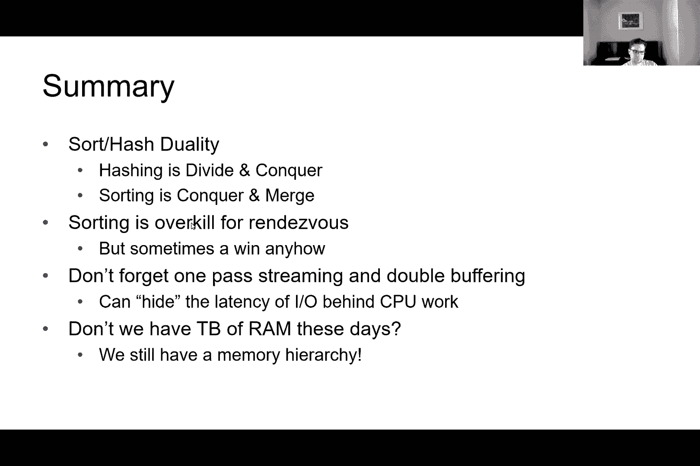
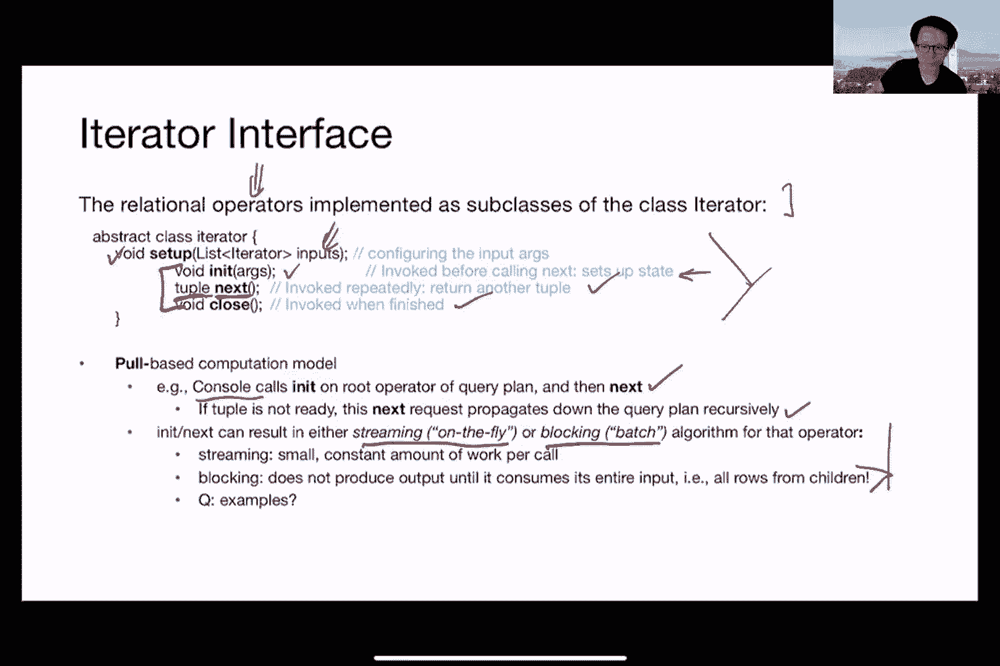

# 课程9：排序与哈希 🗂️🔍

在本节课中，我们将学习关系型数据库中两个核心的算法思想：**排序**与**哈希**。我们将探讨它们如何被用于高效地实现关系代数操作，例如去重和分组。课程将涵盖外部排序、外部哈希的基本算法，分析其I/O成本，并讨论如何利用并行性来提升性能。

---

## 概述与背景 📋

上一节我们介绍了关系代数。本节中，我们来看看实现这些代数操作背后的基础算法：排序与哈希。

我们之所以讨论排序和哈希，是因为它们是实现不同关系代数运算符（如连接、去重、分组）的常见底层操作。理解这些算法有助于我们在后续的查询处理和优化中做出明智的选择。

本课程将反复出现两个核心主题：
1.  **流式处理**：从磁盘流式读取记录到主存，处理后再写回磁盘。
2.  **分而治之**：作为一种基础算法范式，将在多种场景中应用。

---

## 双缓冲技术 ⚙️

在深入算法之前，我们先介绍一个通用的性能优化框架：**双缓冲**。

其核心思想是避免I/O（输入/输出）操作成为处理流程的瓶颈。基本流程如下：
1.  从磁盘加载数据到主存的**输入缓冲区**。
2.  调用处理函数 `f(x)` 处理缓冲区中的数据。
3.  将结果写入**输出缓冲区**。
4.  将输出缓冲区的数据写回磁盘。

**双缓冲**的优化在于使用多个缓冲区和多线程：
*   一个线程专门处理已在内存中的元组（执行 `f(x)`）。
*   另一个线程专门负责从磁盘读取新元组到空闲缓冲区，或将已处理的元组从输出缓冲区写回磁盘。
*   当一个输入缓冲区处理完毕，两个线程的角色可以“交换”，从而使得I/O操作和处理操作可以重叠进行，减少等待时间。

这本质上是一种**多线程**技术，一个线程/进程负责计算，另一个负责I/O。在本课后续讨论的所有算法实现中，都可以在幕后应用这种双缓冲思想以提高效率。

---

## 排序算法详解 🔢

现在，让我们正式探讨**排序**算法。我们的目标是对一个存储在磁盘上的巨大文件进行排序，该文件包含 `N` 个数据页（block）。我们只有有限的主存，假设有 `B` 个缓冲页可供使用。

如果内存足够容纳整个文件，那么直接使用快排等内存排序算法即可。但通常 `B << N`，因此我们需要**外部排序**算法。

### 简单的两路归并排序

一个直观的想法是进行多轮（Pass）处理：

**第0轮（初始轮）**：
*   从磁盘逐页读取数据。
*   对每一页在内存中进行排序。
*   将排序后的每一页写回磁盘。此时，我们得到了 `N` 个已排序的“段”（Run），每个段长度为1页。

**后续归并轮次**：
*   每次从磁盘读取**两个**已排序的段（每段一页）到内存的输入缓冲区。
*   在内存中执行**归并排序**，合并这两个段。
*   将合并后的有序结果写入输出缓冲区，写满一页后就写回磁盘，形成一个新的、更长的有序段（例如，长度变为2页）。
*   重复此过程，直到所有段合并为一个完整的有序文件。

这个过程类似于自底向上的归并排序。每一轮合并，段的数量减半，段的长度翻倍。总共需要的轮次数约为 `log₂N`。

**I/O成本分析**：
*   每一轮都需要读取和写入所有 `N` 个数据页，因此每轮成本为 `2N` 次I/O。
*   总轮次为 `1 + ⌈log₂N⌉`（第0轮 + 归并轮次）。
*   总I/O成本约为 `2N * (1 + ⌈log₂N⌉)`。

以下是该过程的示意图：

### 通用多路归并排序

上一节我们介绍了基于两路归并的简单算法。本节中我们来看看如何利用更多内存缓冲页（`B`）来大幅减少归并轮次。

**算法流程**：
1.  **第0轮（创建初始段）**：
    *   使用所有 `B` 个缓冲页。一次性读入 `B` 页数据，在内存中排序，然后作为一个有序段写回磁盘。
    *   初始段的数量为 `⌈N / B⌉`，每个段的长度为 `B` 页（最后一个段可能不满）。
2.  **后续归并轮次**：
    *   我们拥有 `B` 个缓冲页。其中 `1` 个用作输出缓冲区，其余 `B-1` 个用作输入缓冲区。
    *   因此，我们可以同时归并 `B-1` 个有序段。
    *   每一轮归并，段的数量减少为原来的约 `1/(B-1)`，段的长度相应增加。

**I/O成本公式**：
总I/O次数 = `2N * (⌈log_{B-1}⌈N/B⌉⌉ + 1)`

**示例**：
假设 `B = 5`（5个缓冲页），`N = 108`（108页数据）。
*   第0轮：产生 `⌈108/5⌉ = 22` 个初始段（前21个段为5页，最后1个段为3页）。
*   第1轮：使用4个输入缓冲区，归并段，段数减少。
*   总共大约需要4轮即可完成排序。
*   代入公式计算总I/O次数。

**优势**：通过增加 `B`（即使用更多内存），可以指数级减少归并轮次，从而显著降低总I/O开销。这类似于B+树的高扇出特性，可以用很浅的树结构管理大量数据。

### 两轮排序的可行性

一个有趣的问题是：**能否只用两轮完成排序？**（即第0轮创建初始段，第1轮完成最终归并）

**分析**：
*   第0轮后，我们创建了长度约为 `B` 页的段。
*   第1轮归并时，我们最多能同时合并 `B-1` 个这样的段。
*   因此，两轮算法能处理的最大数据量约为 `B * (B-1) ≈ B²` 页。

**结论**：若想用两轮排序 `X` 页数据，所需内存缓冲页数 `B` 至少需要约为 `√X`。这说明即使内存相对较小，也能通过两轮高效处理相当大量的数据。

---

## 哈希算法详解 #️⃣

排序并非总是必须。对于**去重（DISTINCT）**、**分组（GROUP BY）**等操作，**哈希**是更高效的选择。其核心目标是将输入元组根据哈希函数分散到不同的“桶”（分区）中，并确保具有相同哈希值的记录在磁盘上连续存放。

### 基本的两阶段哈希算法

假设每个分区最终都能放入内存处理。算法分为两个阶段：

**阶段1：分区（Partitioning Phase）**
*   流式读取输入文件的每一页。
*   对每个元组应用哈希函数 `h1`，决定它属于 `B-1` 个输出分区中的哪一个（需要1个缓冲页用于输入）。
*   将元组写入对应分区的内存输出缓冲区。当某个分区的缓冲区满时，将其写回磁盘。
*   此阶段结束后，每个磁盘分区包含哈希值相同的所有元组，但同一分区内可能混合了多个不同的哈希值。

**阶段2：去重（ReHashing/Duplicate Elimination Phase）**
*   逐个读入第一阶段生成的每个分区（假设其大小 ≤ `B` 页，可完全放入内存）。
*   在内存中，对分区内的所有元组使用另一个哈希函数 `h2`（或直接构建内存哈希表）进行哈希。
*   此阶段可以轻松检测并消除重复项，然后将唯一元组写回磁盘。

**关键点**：此算法成立的前提是，阶段1产生的每个分区都能被阶段2的内存（`B` 页）所容纳。

**I/O成本**：每个阶段都需要读取和写入所有数据一次，因此总成本为 `2N` 次I/O。

**两轮哈希的数据量**：与排序类似，两阶段哈希能处理的最大数据量也约为 `B²` 页。要哈希 `X` 页数据，约需要 `√X` 页内存。

### 递归分区哈希

如果阶段1产生的某个分区太大（超过 `B` 页），无法在阶段2放入内存怎么办？

**解决方案**：递归应用分区！
*   对这个过大的分区，再次应用一个新的哈希函数 `h2'`，将其进一步细分为更小的子分区，并写回磁盘。
*   重复此过程，直到每个子分区的大小都能被内存容纳，然后对其运行阶段2的去重操作。

**极端情况——数据倾斜**：如果某个键值（如`gender=‘Male’`）出现频率极高，导致无论用什么哈希函数，其所有记录始终在同一个分区。此时递归分区无效。
*   **处理办法**：算法需要检测这种情况。当发现一个分区内所有记录的哈希值（或键值）都相同时，递归可以停止，因为去重工作已经可以在该分区内轻松完成。

### 排序与哈希的类比

排序和哈希算法呈现出有趣的对称性（二象性）：
*   **排序**：先**征服**（创建初始有序段），后**融合**（归并段）。
*   **哈希**：先**分割**（分区），后**征服**（在内存中处理每个分区）。
*   **I/O成本**：在理想的两轮情况下，两者成本相同，均为 `2N`。
*   **选择依据**：查询是否需要有序结果（排序胜出），还是仅需分组或去重（哈希更优）。

---

## 并行化处理 ⚡

我们可以利用多台机器或磁盘进一步加速排序和哈希。

### 并行哈希

1.  **数据分发（Map）**：使用一个哈希函数 `h`，将原始数据分布到多台机器上。具有相同键值的记录会被发送到同一台机器。
2.  **本地哈希**：每台机器独立地对自己收到的数据运行上述的两阶段外部哈希算法。
3.  **结果合并**：如果需要，可以将各机器处理后的结果合并。

这本质上是一种 **Map-Reduce** 模式，其中分发阶段是 Map，本地哈希可以看作是另一个 Map 或本地的 Reduce。

### 并行排序

并行排序面临一个挑战：如何分发数据才能保证最终全局有序？
*   **范围分区（Range Partitioning）**：预先定义键值范围，将不同范围的数据发送到不同的机器，然后每台机器对自己范围内的数据排序。
*   **问题——数据倾斜**：如果数据分布不均匀，某些机器负载过重，成为瓶颈。
*   **解决方案**：可以先扫描数据构建**直方图**，了解数据分布，然后根据直方图动态调整范围分区的边界，以实现负载均衡。

---

## 总结 🎯

本节课中我们一起学习了数据库系统中两个根本性的算法：**外部排序**与**外部哈希**。

*   **核心思想**：我们深入探讨了如何利用有限的内存（`B` 页）对远超内存容量的大数据集（`N` 页）进行排序和哈希。
*   **关键算法**：
    *   排序基于**归并排序**思想，通过多轮归并实现。
    *   哈希基于**分区**思想，通过递归分区处理大数据集。
*   **性能分析**：我们推导了算法的I/O成本公式，并发现两者在仅用两轮处理时，能处理的数据量都与 `B²` 成正比，所需内存约为数据量的平方根。
*   **对称性**：排序（融合-征服）与哈希（分割-征服）在流程和成本上存在优美的类比。
*   **并行化**：我们探讨了如何通过数据分发（哈希分发或范围分发）到多台机器，实现排序和哈希的并行计算，并讨论了负载均衡的重要性。

这些算法之所以至今仍然至关重要，是因为数据增长的速度往往快于内存容量的提升，且存储系统本身具有层次结构（如内存、SSD、HDD）。理解这些核心算法是设计高效查询执行器和优化器的基础。

---
*课程内容结束*