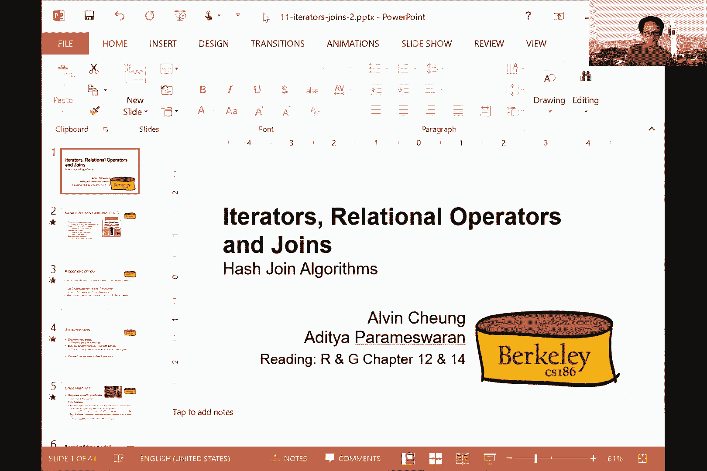

# 加州大学伯克利分校 CS 186 数据库导论 Introduction to Database System (Fall 2020) - P11：Lecture 11 Iterators & Joins II - ___main___ - BV1cL411t7Fz

好的，你看，嗯，所以我要继续我们停止的地方，就泥连接的种类而言，但我想先问你，大家对我上次经历的代码有任何疑问，在我进入之前，呃，如何进行成本计算，没有问题，也许只是一个快速的概述，好的。

所以我不想遍历整个代码，我会试着做更高级别的总结，嗯只是为了，呃复习一下，好的，所以嗯，在最高级别，排序合并联接，呃，基本上整理了这两个关系，然后你试图找到这两个元组，或者元组和两个关系，嗯。

匹配的权利在联合键，所以如果你有这两个关系，假定这两个关系是排序的，你想确定这样一个事实，即这边的这个元组连接，用这两个元组，在右手边，对于这两个的元组关节也是如此，呃等等，以此类推对。

为什么伪代码如此棘手，呃，呃，因为你需要，当你扫描R的元组时，你也在扫描S的元组，但是扫描一次通过R和一次通过S是不够的，做对了，如果您只是在这里进行合并排序，这就足够了。

有多对元组可以为给定的联合密钥连接，所以你在右手边要做的是，你仍然可以扫描我们右手边的所有序列，你经常向下扫描然后向上扫描，这样你就可以把两边的对子都盖住了，所以要记住，发生什么事了？这里是。

它本质上就像元组的叉积，在共享相同联合密钥的两侧，你这样做，那是你的记录，一个标记，可以让你追溯你的步骤，回到一个元组块的起点，对于联合密钥都具有相同的值，好的，所以这是一个高级的想法一种泥浆连接。

所以基本上排序的状态合并连接嗯，将由三件事代表，一个是沿着左手边的关系向下多远，你在右手边的关系向下多远，你的标记对在哪里，所以马克基本上允许你回到之前的位置，它是所有具有相同联合值的元组块的开始。

所以希望就直觉而言，这就足够了，嗯，我不打算走过动画，因为那会花太长时间，但如果有其他具体问题，我非常乐意回答他们，在这里或脱机，好的，所以让我们谈谈成本，谢天谢地，成本，你不需要理解其中的复杂性。

算法的复杂性，嗯要通过成本来工作，好的，所以加入SOA的费用基本上是，对应于将我们的排序为，然后你把R的所有页面按顺序放进去，S的所有页面按排序，记住我们不计算产出的成本，好的。

所以这基本上是排序保证金的成本，现在，上学期，r的页数和s的页数可以，在最坏的情况下，实际上和这两个的乘积一样大，对呀，所以它可以和r的元组数一样大，S的页数你什么时候，遇到这种交叉积，就像Z问的那样。

如果输入已经按排序顺序，你如何表示标记，如果你只是流元组，所以这将是一个你不能，嗯，不能，简单的说，一套看看它，所以这不是一个动态算法，对呀，所以你确实需要，呃，保持额外的状态要做，也像这样。

所以你确实需要，好的，所以我会考虑以下方法，所以你一次生成一个元组，但是每个元组肯定要做更多的处理，现在的问题是，如果输入是按顺序排列的，你会怎么做，或者你如何表示标记，如果你只是组合元组。

如果你代表代表标记，您只需存储一些额外的状态，请记住，对于迭代器，您可以轻松地将其他状态存储在迭代器内部，事实上，这个州可能非常大，我也是，所以标记只是另一个内部变量，比如说，好的。

所以最后一个学期可能是，呃，不仅仅是加法和，嗯，所以在这两个术语中不是线性的，但实际上可能是二次的，最坏的情况什么时候发生，有什么想法吗，R中的每一条记录都匹配，每一张唱片都是对的。

所以最糟糕的情况是当你有一个叉积，因为两边的接头键都是匹配的，这是一个非常糟糕的情况，在实践中经常不会出现，所以我们真的不需要担心，这更有可能是r的页数和s的页数，这就是全部费用的一部分。

因为r的元组数和s的元组数，对应于匹配不太可能很大的给定联合密钥，对呀，所以它不会二次缩放，它更有可能线性缩放，所以我们需要担心的是，嗯，两个输入的大小之和，所以现在下一个问题是缓冲区需要多大。

为了能够在两次传递中对R和S进行排序，每一个等等，呃，所以如果你还记得我们的排序讨论，我们要求缓冲区，基本上大于给定关系的页数及其平方根，对，所以为了能够对R和S进行排序，我们想最大限度地利用这一点。

好的，这是因为，嗯，对于R和S进行两次排序，您需要考虑可以生成的排序运行的数量，您需要确保对于每个排序的运行，您的缓冲区中有一个代表，以便在第二次传递时正确地重新组装输出，成本是多少，所以成本是。

基本上嗯，用r读，把我们写的东西写出来，排序运行，读入r，然后写出排序的输出，好的，所以这是四倍的成本，R的页数，同样，4倍于s的p，加上嗯，你在看书吗？呃，R的页面，然后在S的页面中阅读。

所以它的整体尺寸是，R的页数，加上S的页数，一共是七千五百元，好的，所以这就是，这类产品的总成本，合并联接，嗯，你能再解释一下吗？我们如何在第一线的初始成本分析中得到R和S，所以如果你已经开始了r。

你现在已经对s排序了，r和s基本上是r和s所占的页数，嗯，你要读入的数据量是多少，进行最终的合并，对，所以基本上这是，读取RNS进行合并的成本，但有些是有道理的，但有时我们不得不。

我们可能不得不连续多次投球，不是在合并的时候，不是在合并的时候，所以当你进行合并时，你基本上就像在翻阅一页页的R和S，在已经为您排序的RNS页面上漫步，对呀，所以你只是一次一个地经历，然后进行连接。

然后产生输出，所以它实际上基本上只是你在读它，所有的页面都是S的所有页面，然后做关节，然后产生输出，事情变得有点棘手的情况，就是，如果很多r的元组和很多s的元组，具有相同的联接键。

但这在实践中不太可能出现，所以我们不会担心这个，所以比较典型的案例，如果你有一页r和一页s，你可以只做关节，输出一些元组，然后继续这样做，当你走下R和S的页面，我明白这有道理，谢谢。好的，酷，好的。

所以呃，我们本可以做的另一种选择，如果我们想做一个排序，我的加入，记忆，沙发连接的输出是排序输出右，所以你基本上是在整理这两个关系，然后你把它合并，作为副产品，你得到了排序输出。

实现相同结果的另一种方法是首先使用，例如，块嵌套循环连接，然后在后面做一个排序，所以让我们在这里举一个具体的例子，所以在这个特殊的例子中，我在做R和S之间的连接，然后呃，按联接键排序。

所以这里我有两个关系，呃，预备役和水手，这些是基数，好的，所以在这个特殊的情况下，嗯，使计算变得容易，嗯，好的，所以每个保留地都有一个水手，这意味着我知道输出是什么样子的，输出基本上，嗯我们的元组。

好的，输出将适合我们的页面，那么现在为什么这很重要，我们会按顺序看的，如果我先加入，后排序，让我们从讨论块嵌套循环连接开始，好的，所以我用它来做连接，如果你还记得我们做块嵌套循环连接的方式。

你有一个外部关系，它是s，然后你在内部关系的页面上循环，通过一次引入一大块外部关系，所以块的数量基本上是s除以b减去2，这是你加入的费用，现在，我这种类型的价格是多少。

我现在知道连接的输出基本上是我们的页面，这种成本基本上是R的四倍，好的还有，所以我只需要两张通行证，这就足够了，所以这将是总成本，如果我先做一个连接，然后再做一个排序，而不是排序合并关节。

它有七千五百英镑作为成本，对此有什么问题吗，嗯是的，因此，执行块嵌套循环连接的替代方案，或者块嵌套循环联接，然后做很多，或者你做一个Merjoin，首先是这种替代类型，然后再加入，或者更确切地说。

进行排序和连接，在这个特定的例子中，成本更低，好的，关于排序mod连接，我想说的最后一件事，你实际上可以更多地改进排序mod连接，如果你认识到你不需要把它分成排序，然后合并。

您实际上可以在排序的第二次传递中进行合并，好的，因此，这将合并排序的最后一次传递与联接传递结合在一起，所以要做到这一点，我需要确保我有足够的缓冲区，这样我就可以，我可以适应所有的跑步。

在最后一次排序中对R和S进行排序，所以如果我有一个两次传球，呃，排序可能加入，所以我在最后的合并过程中做了一个连接，我基本上读入r并写出排序的运行，所以这是你过去的零读入s并写出排序的运行。

呃也是零度以上的一部分，然后我在R运行和S运行中合并，所以我在内存中有多个从R和S排序的运行，我在找我们酒吧的火柴，所以我基本上把合并作为其中的一部分，这种融合，再次使用相同的术语，合并右步。

所以基本上呃不只是呃，对R和S进行排序，它也在同时进行合并，所以这种改进实际上成本更低，所以基本上你是在读写画画，我们排序的R，你在读s，写出有序的s，所以每个都是两次。

那么您在R和S的排序运行中都读取，然后进行排序合并，所以它基本上是我们的三倍大，所以比较便宜，所以这里的约束使这个工作，在我做合并的时候，我需要一个代表从每一个排序运行在内存中，好的。

所以如果我没有一个代表从每一个排序运行在内存中，我做不到这种精炼，好的，所以这就是我要说的，有什么未回答的问题吗，你能做到吗，即使你必须做两次以上的排序是的，对这样你就可以，基本上，呃，排序。

到目前为止，您可以创建排序运行，合并到目前为止的排序运行，并创建更大的排序运行，合并其中的已排序运行并创建更大的已排序运行，然后进行排序合并，基本上是在最后一次传递中合并排序的运行。

所以你当然可以这样做，您也可以将其扩展到多次传递，在什么情况下有两个以上的通行证，嗯，类似的场景，当您需要多次传递来排序单个关系时，对呀，嗯，所以那些是，呃是，嗯，我们可能想使用这个的相同场景。

排序多关节如何保证工作，如果我们不跑过一个，所以说，嗯，你这是什么意思？你对此有什么担忧，的，你为什么认为这行不通？你只是根据我们谈论的，就像上一节课结束时一样，所以我们有两个完全分类的，就像一堆书页。

如果我们只是走，跑一次，我们会得到一堆片段，每个片段都会被排序，但如果你把它们放在一起，它们不一定都分类了，好的，所以让我给你两个选择，对呀，所以我基本上，好的，都整理好了，好的，所以这些是R页和S页。

嗯，这就是你会得到的，你会把这些，你就会，也许它不会纵横交错这么多，但你会把这些，嗯，在合并阶段，在你做完排序之后，好的，这是我们在幻灯片之前谈到的另一种选择，现在，让我们来谈谈这个精炼。

这种改进需要什么，而不是做一个完整的R和一个完整的S，我只需要对r和s进行排序，好的，所以我会运行我们的一个，运行我们的两个，然后让我们说运行呃，一个s，运行两个s，好的，好的。

如果我有足够的内存缓冲区，这样我就可以在内存中从这些排序的运行中保留一个块，那么我目前可以正确地进行跨连接，um rns，尽管我没有排序，哦，我明白了，我明白了，好的，所以我们要做的是过去的一个。

当我们把它们捣碎的时候，我明白了，谢谢。我开始在，你去争取。

到目前为止还有其他问题吗，所以我希望现在，你们知道为什么，我们之前一直在喋喋不休地谈论排序和散列，因为就像你现在看到的，我是说我们一直在用，分拣以实现关节，对呀，我是说不仅仅是为了分类，就像那样很有用。

我希望是对的，你们可以看到所以，如果我们谈论，因为我们谈论排序和哈希，如果有我们可以使用sort来实现联合的情况，所以很明显现在就像你知道的问题是，我们是否也可以使用哈希权来实现联接，答案是，当然啦。

是呀，我是说这就是为什么喜欢你，我们有向量的部分，就像你的哈希联合算法，好吧，嗯，正如你所记得的，我们的目标是基本上，不管我们是做嵌套循环连接还是基于排序或基于哈希的连接，对呀。

这里的目标是把所有的姿势，应该可以在内存中同时组合在一起，这就是总体目标，对呀，所以我不在乎，我们如何实际实现它，目标基本上是他们所说的会合，对呀，呃，所有应该组合在一起以形成联合输出到主存储器的元组。

同时，所以我们到目前为止所看到的，在上一节的片段中，基本上是通过排序来做到这一点，所以现在这里有另一个想法，所以让我们再次尝试将散列用于相同的目的，我们试着像你的RNS一样加入，对呀，所以在这种情况下。

这个算法只有在我们做等式的情况下才有效，呃，右关节，所以说，这意味着我们要么做连接，要么做自然连接，好的，那么这是如何工作的呢，所以说，让我们现在假设R是两者的较小关系，特别是我要求r必须适合主存。

事实上，它必须适合，就像你知道的B-，呃，呃，对不起，它必须适应，就像你知道的B减去两边的记忆，好的，简单的算法如下，所以我要把所有的r都加载到主存中的哈希表中，对呀，我可以一次加载R的每一页。

在内存中创建哈希表，然后我该怎么办，我接下来要把每一页都拿进来，一次一页，然后向右探测或检查s中的任何元组是否应该匹配，uh匹配r中的任何uh元组，当然，如果你聪明的话，您将在属性上使用哈希函数。

或作为关节一部分连接的属性，所以我们首先使用哈希函数除以r中的所有元组，和主存基于我们正在加入的内容，然后我们将从，It’一次一个，然后弄清楚，然后检查它是否与我们主存中的两极中的任何一个匹配。

如果是这样复制呃，组合元组作为输出右，一次一个，然后我们扫描完所有，这有什么意义？所有权利，好的，所以这是正确的，那么这里的内存需求是什么，所以就像我说的对，我们假设R必须适合于内存，特别是R右的大小。

或者R所占的页数，必须小于b-2倍，某种软糖因子，我称之为哈希填充因子，我是这么叫的，因为就像你知道的那样，维护哈希表是有开销的，然后每个页面在五月最小的主存可能不是均匀分布的，对呀。

我是说可能会有技巧，哈希函数中的哈希，以此类推，所以我们最终可能会有你的一页和一桶，或哈希表的一页，就像你知道的，只有很少的元组，相对于你知道的，可能会有一些，呃，就像另一个桶，有很多元组的地方。

所以我们做b减去2，因为我们需要保留一个页面来读取输入，我们真正需要保留的一页，呃，写出输出，是啊，是啊，准确地说，然后这里的总和是速度对吧，所以我做了两次b减，我刚才谈到的某种软糖因素，就这么简单。

运行哈希函数并计算出，这就是问题所在，是啊，是啊，什么能放进记忆中，所有的权利，所以这是个大问题，对呀，所以你知道，这就是为什么我说喜欢，这是这里最大的假设，那么如果R不适合内存会发生什么，好的。

所以这里有一点改进，所以这里有一个代数性质，它实际上会帮助我们，所以你记得在这种情况下，这个片段是选择权，然后我们的领结是关节，然后这个V形的东西在这里只是表示析取或，所以我们基本上是在做一个联合。

我们在挑选，呃，s i等于4的水手，或者s i d等于，联合呃结果对吧，所以你可以重写这个关节的一种方法，或者这个选择的工作，然后是一个关节，实际上是把它分开，使用联合，所以请注意，在这种情况下。

就像你知道的那样，水手ID是唯一标识符，对呀，这是主键，所以所以，就像你知道的，与之相连的东西，就像你知道的我等于四，不会加入等于，i等于6，对呀，所以这对两个rns都是正确的，因为在本例中i是主键。

所以让我们把它分开，所以我在找，就像，你知道，i等于4或6的水手，让我们只做连接，你知道的选择分为两部分，对呀，所以这里的第一部分，只要做连接，SID上的选择等于4，SID的另一部分也是如此，等于6。

所以总的来说你可以来你可以，我们基本上可以分解，就像你知道的，看起来像这样的东西，进入更小的部分关节，对呀，所以在这种情况下，就像你知道的，有一种方法我们可以重写联合算法，基本上。

说我们试图得到的每一个关节基本上都是一样的，就好像我们在一个特定的ID上加入，然后遍历所有的ID，从R和S开始，然后我们要把它们组合在一起，使用联合，这有道理吗，所以我们只需要选择一个哈希函数。

这样我们就可以在内存中构建这个哈希表，所以这将解决我们喜欢的问题，你知道吗，你说得对，整个关系不能适应，所以现在需求改变了，只说好吧，只要有一个特定的切片，我们在主存中的适合权，然后我们就可以做。

我们可以做，我们可以运行我们在上一张幻灯片上讨论的简单算法，到目前为止还有什么问题吗？所以这一定不是它的结束，对呀，因为如果这就是整件事的结束，然后就像你知道我，我是，我做得很好，你知道我，我可以喜欢。

你知道吗，今天剩下的时间休息，对呀，所以肯定还有更多，嗯，但在我们真正尝试将这个算法推广到，呃，你知道更大，或者喜欢，你知道更多的实质性，让我们先来看看，原来如此原来如此，现在是时候休息一下了，首先呢。

你们都知道今天是期中考试周，我完全明白明天有一个复习会议，你们可能也在为其他班做期中考试，你正在服用的，如果是这样，祝你期中考试好运，嗯和嗯，你知道，我们期待喜欢，你知道。

和你们一起为即将到来的期中考试工作，下周，对呀，所以只要记住有复习会议，助教们让我们提醒你们，请尽量在您的办公时间票中包括描述，因为这会帮助他们，嗯嗯，匿名找出，就像你知道如何把人们聚集在一起帮助他们。

你们所有人同时，如果你还没想过，如果你还没有弄清楚，还有一种叫做派对模式的东西，它基本上允许人们在办公时间排队时分组工作，在等待一个TH到来的时候，所以呃，这也可能是一个功能，你可能也想尝试下一次。

当你，呃在，试着使用办公时间网站让我们知道进展如何，我是说这是我们从61年开始采用的一个相当新的功能，嗯，他们做得很好，呃，那里学生的接待，但后来就像，你知道吗，我们有兴趣听听你们，呃感觉就呃而言。

就你为你的六分之一的任务做这件事而言，所以如果你尝试，然后你喜欢它，让我们知道，如果你不喜欢，也让我们知道，然后我们可以试着改进它，一次又一次，对呀，所以你知道，请尝试打开你的视频，如果可以的话。

你知道，向今天在课堂上真正表现出来的人致敬，我明白就像，你知道吗，这是期中考试前的最后一节课，你们阿波罗，看起来很忙，所以谢谢大家，我想对殷来说是特别的荣誉，沃伦，杰克，罗曼、凯西和斯特凡的出现。

也让我们知道你还活着，那很好，我希望你们能挺过期中考试，但就像你知道的，我有七十个人，就像你知道的，如果Gabe和Aditya是我们唯一看到的人，那我想我们会很沮丧，对呀，所以是的。

我只希望我们不是对着一堵空白的墙说教，所以哦好吧，i，好的，所以任何关于喜欢的问题，你知道我是什么，我是，我们在上一张幻灯片上说过，这是一个最简单的哈希联合算法，你可以想象对，我是说它利用了。

就像我们在哈希课上谈到的最简单的哈希算法，它完成了我们想做的事情，它带来了我们需要的所有元组，需要同时汇集到主存中，然后你知道，然后我们基本上就这样形成输出，对呀，那太好了，嗯，所以让我们试着理解。

让我们试着谈点更有趣的事，还有一种散列绘制算法叫做Grace绘制算法，格蕾丝哈希绘制算法，这个名字来自，呃，叫做Grace的数据库机器或数据库原型，这是东京大学在80年代开创的，这是一张照片。

我不确定它是否应该看起来像，你是黑人还是白人，但我想也许这强调了，你知道那是对的多久，基本上是在上个世纪，它是如何再次工作的，它需要像你的质量谓词，对呀，所以你知道你的关节和你的自然关节，呃。

和你的自然关节，它有两个阶段，第一阶段，我们试图对我们试图连接到磁盘上的两个关系进行分区，所以通过分区，在这种情况下，我们真的只是说像，运行你最喜欢的哈希函数，然后你知道把输入元组分成多个分区。

所以如果你，运气好的话，然后你基本上最终，呃，拥有所有的元组，在同一个分区中，具有相同哈希值的，对呀，但如果你运气不好，然后也许就像你知道他们，它们是哈希冲突，对呀，所以在同一个请愿书中有多个元组。

即使他们，呃，他们实际上有不同的价值观，对吧，但是因为它们有相同的哈希值，它们是相同的哈希，他们把哈希放在同一个桶里，或者它们在末尾写入了同一个分区，对呀，所以我们可能会倒霉，不过没关系，因为再一次。

我们的目标不是把整件事整理好，我们的目标就是喜欢，你知道吗，确保应该组合在一起的东西在内存中，同时，所以只要哈希函数是一致的，然后它将把R中的所有元组，在相同的桶或相同的分区中具有相同的哈希值。

对于S也是如此，我们接下来要做什么，所以我们要把所有这些不同的分区都写到磁盘上，然后我们要应用同样的东西，就像我在上一张幻灯片中所说的，为每个分区构建一个内部内存哈希表，然后在另一个关系上引入元组。

一次一页，然后看看是否有匹配的东西，如果有的话，然后我们产生关节输出，然后像之前一样写出来，在这个意义上没有什么变化，所以现在我要假设较小的关系实际上适合记忆，虽然你已经可以预示，就像，你知道吗。

我很好，我就是我要说的，对呀，在实际上没有的情况下，我们已经了解到，在外部哈希讲座中，就在我们喜欢的地方，你知道的，做递归，所以如果你不明白，先等等，然后我们会看到一个例子，嗯，就在一秒钟。

就像发生了什么，好的，所以你记得，或者到期中考试的时候你会记得，呃，我们谈到了这个外部哈希算法，就在我们第一次试图分开的时候，就像你知道的，所有输入元组到B减去一个不同的分区或桶，把它们写到磁盘上。

这就是中间的罐子应该显示的，然后我们有第二道，就在我们把这些分区中的每一个都带进来的地方，一次一个，并尝试在内存中构建一个内部哈希表，只是为了确保我们真的有，呃，具有相同哈希值的元组在磁盘上连续，对呀。

这一切都是需要做的，这都是因为你知道我们，我们可能不会同时看到主存中的所有元组，在第一个右边，在第一阶段，然后可能有多个不同的元组具有不同的值，实际上被散列到同一个分区，因为，呃，的，你知道，呃。

哈希冲突问题对，所以这就是为什么我们有这个，我们有这两个阶段，但现在我们不是想，我们不做杂凑，我们正在做的加入权利，那么我们能用这口井做什么呢，所以在第二阶段，我们仍然可以在内存哈希表中构建这个。

但我们实际上要引入另一个关系，一次一个进入主存，然后尝试在第二阶段做联合算法，嗯罗马人，你有问题吗，是啊，是啊，呃，你能提醒我P和R在哈希语中代表什么吗，所以它只是两个不同的哈希函数。

所以p代表分区期间使用的哈希函数，然后R代表，呃，呃，关节过程中使用的配分函数，呃阶段或合并阶段，第二阶段，是啊，是啊，只是两个不同的哈希函数，所以不像之前的外部哈希讲座，对呀。

我们在第二阶段构建的地方和内存哈希表，把东西放进不同的桶里，把它们写出来，我们就大功告成了，但在这种情况下，我们实际上是在尝试正确地连接，所以这就是修改的地方，呃出现了，所以我们要修改算法。

你知道S关系的一页，一次一个对吧，然后这里我们假设也已经孵化了对吧，所以这就是你看到这个的原因，呃，这里的数字，所以我们先把所有的请愿书都写下来，把所有的请愿书都写出来，然后我们会得到B减1的请愿书。

对于R和S都是对的，然后我们会带来像，你知道从我们进入主存的分区，构建哈希表，然后你从S关系中取出几页，对应分区的一次一个，然后进行连接，所以请注意，在这种情况下，这里唯一的要求是。

我们正在使用的请愿书，因此创建哈希表，在这种情况下，在这种情况下，r必须适合主存，没有要求喜欢，你知道来自S的请愿书必须符合主存，因为我们基本上是在一页一页地流媒体，所以不管它是否占用，你知道吗。

b b，呃页，它捡起了大约一百万页，我不在乎对吧，因为我们一次带一个进来，所以这并不重要，这是一个伪代码，实际上，呃，将算法形式化，所以对于两个rns，这是第一行，我们要像R一样浏览每一页。

然后下一个喜欢是的，我们要读缓冲区里的那一页，然后就像你知道的，基本上建立我们的B减去一个不同的分区，所以你知道，然后就像以前一样，我们要冲水，就像你知道的，磁盘的输出缓冲区，当这个失败的时候。

到目前为止，这整件事只是在谈论，就像你知道的，的第一阶段，就像你知道的，呃，哈希算法的，对呀，这有道理吗，所以到目前为止一切都没有改变，我只是想写出如何做外部散列的第一阶段，通过说我们将阅读R的每一页。

然后我们单独构建b减去一个不同的分区，然后如果失败了，然后我们写到磁盘上，然后我们就完成了，所以这就是我在这里要说的，除了我们迭代r和s，有趣的部分来了，所以现在我们以，呃，b减去其中一个分区。

R和B的权利减去S的一个分区，然后你有一个问题，哦耶，所以在天真的方法中，只有哈希不是s，但是为什么在这种情况下我们要对r和s都进行哈希呢，因为在这种情况下，我们假设它们不再适合，全部在主存中，因此。

我们不能把整个东西读入主存，然后，我做了它的权利，但如果我们把我们的，我们将构建一个完整的哈希，艺术表，我们还只是从广告中推销一页，你可以你可以，你确实可以你可以，但想想就像，那里的费用是多少，对呀。

所以如果我们不哈希，因为我们基本上要经历整个对吧，为了弄清楚我们是否需要加入什么，但把它散列的好处是，我们只需要用同样的哈希集会阅读相应的请愿书，我们现在正在处理的，然后我们可以保证没有其他元组。

并询问，将与我们目前正在处理的任何事情结合在一起，所以我们假设，我真的认为我们有办法知道哪把钥匙，侦察，哪些页将在哪些分区上退出，是啊，是啊，所以如果我们是在ID上加入的那我们最好是在ID上散列的。

所以假设我们，我们知道所有一到五个人都将主持这个分区，准确地说，好的，好的，我看对了，对呀，我是说，否则我们也可以照你说的做，但我们基本上会招致更多，因为我们需要读取整个升级，所有的一切，是啊，是啊。

所以这就是为什么它没有那么有效率，我明白了，谢谢。好的，所以这里是算法的其余部分，对呀，所以对于所有这些分区，这就是这句话的意思，我们基本上要把它建在，构建内存中的哈希表，在这种情况下。

我们将把它构建在内存哈希表中，从我们的，这就是你在这里看到的，对R的每一页，我们要读取每一个元组，然后我们要在内存中构建一个哈希表，对应于R的特定位置，然后这里的下一步是，这是我们实际上在做连接的部分。

对呀，我们现在要阅读S的每一页，以获得相应的请愿书，所以这是个问题，对吧，所以请注意，就像你知道的，它们都有相同的下标，所以我们将在我们的第一个分区中读取，将其填充到内存哈希表中。

然后我们要把的第一个分区，That’是的，不是第二个不是，第三个，只有第一个是对的，因为我们知道任何匹配的东西都将驻留在那个分区中，没有别的地方，然后剩下的基本上只是做绘图算法，检查是否有匹配的东西。

如果是这样，在输出缓冲区中写出来，满了就闪，然后然后继续，对此有什么问题吗，好的，这是一般的算法，对呀，所以我将在下一张幻灯片中说明这一点，但是一般的算法就像这个两阶段的东西，对呀。

所以我们有一个分区阶段，在这里我们创建这个呃和B减去一个不同的分区，然后我们有一个征服阶段，我们带来的地方，就像你知道的另一个关系上的分区，然后做连接，所以我们在这里，所以我们有两极的rns。

所以请注意我们的i的所有元组，呃用蓝条给它们上色，然后是或对应于两个s，我用橙子把它们盖住了，然后星星和方块，所有这些圆圈基本上代表了不同键的值，所以在这种情况下，我们应该加入，就像。

你知道这个有正方形的元组，用另一个元组，正方形从S开始，比如说，好的，所以我们要看看这到底是怎么发生的，好的，所以第一步我们要在，假设选r右r是一个较小的关系，所以我们选择了我们在每一篇文章中读到的。

R的每一页，一次一页，然后在记忆里面，我们要把它分成不同的桶，基于我们最喜欢的哈希算法，然后我们读第二页，就像我们的外部哈希算法一样，嗯，然后我们把它冲到磁盘上，当呃，这些缓冲区中的每一个都会满。

或者当我们做对的时候，所以你注意到这里的第二个位置有一个额外的悬垂，因为你知道页面已经被填满了，所以我们需要给它分配一个新的页面，然后把它放进去，然后向右走，所以现在我们已经完全散列了，嗯。

你知道r的所有元组，所以我们对这部分做了，所以我们只是重复同样的过程，所以我们在S的每一页都读到了，然后就像你知道的，做同样的事情，做同样的事情，然后你知道同样读在另一页呃，哦，我想我倒车是R，对不起。

好的，所以好吧，所以我知道为什么早些时候只是翻转，呃RNN，所以我们首先为S创建请愿书，然后现在我们为R创建请愿，完全相同的事情，然后在这种情况下，你知道第二页也溢出来了，因此。

我们知道我们需要为剩下的元组分配第二个页面，最后一个，到目前为止还没有，这正是我们之前讨论过的外部散列算法的一个例子，所以没什么有趣的，到目前为止，现在是绘图部分，对呀。

所以我们现在有了我们在桌子上创建的所有这些分区，所以我们要读嗯，就像你知道这些分区一次一个，对所以，但你可能会注意到的一些事情是，例如，所有带有绿色星星的键，只驻留在分区一，就像你知道的。

这些是r{\displaystyle r}中的，这些是s{\displaystyle s}中的，特别是，然后对所有其他的人也是如此，所有其他形状，对，但我注意到，就像在外部散列算法中一样。

这实际上可能会向右倾斜，例如，你可以看到紫色的圆圈实际上有，你知道的比，比如说和星星相比，对呀，然后分成两个，在本例中实际上比分区1大，所以不能保证就像你知道的那样，它将均匀分布，所以你知道，哎呀。

在这种情况下，就像你知道的，这些请愿书可能是在不同的文件上背诵的，不同的机器或不同的磁盘，没关系，当我们试图将它们带回主内存时，有趣的事情发生了，所以我们现在要构建一个内部内存哈希表，所以我们要做一个。

我们将通过读取每个分区来构建这些哈希表，一次一个，假设我们第一次读到，呃，一页，呃，从R的第一个分区，我们读到了，然后我们把它分成不同的桶，就在记忆中，我们下一步怎么办？我们将再次读取s右的第一个分区。

现在的想法是，就像你知道的那样，任何应该与我们读过的元组连接的东西，r只能驻留在s的第一个分区中，所以我们只需要读取分区1，如果它驻留在多个页面上，我们只是在所有这些不同的页面上读到，一次一个。

然后我们要执行连接，所以现在，例如，你看到就像你知道，星星应该是匹配的，所以你知道我们只是，创建联合输出，然后将其写入输出缓冲区，就像你知道的那样，我们只是把剩下的，对呀，所以现在三角形来了，呃。

然后我们做完之后就完成了，呃，与星号连接最后一个元组，到目前为止还有什么问题吗？现在我们完成了第一个分区对吧，我们基本上已经形成了我们应该创建的所有联合元组，呃，是啊，是啊，罗曼举起。

所以如果你把一些东西放在记忆中，然后我们把它拉回输入缓冲区，然后我们再次对它们进行散列，将其中一些组合到，然后将其放入输出缓冲区并将其放回内存中，把它放回磁盘上对，就像我们做了所有最初的哈希。

把它放进记忆中，然后我们把它从做这项工作的内存中提取出来，和缓冲区来组合其中的一些，然后把它放回记忆中，是啊，是啊，是啊，是啊，完全正确，我们这么做的全部原因是因为。

原始关系R本身可能不完全适合主存储器，如果r本身已经适合主存，那我们就不用做这些事了，好的，是啊，是啊，这就是我们这么做的全部原因，呃，我有个问题，是啊，是啊，告诉我，发生了什么，如果呃，那个呃。

让我们说的一切，呃，在分区一，属于s，不适合b减去两个缓冲区，所以如果呃，是啊，是啊，所以发生的事情是，它不适合主，呃缓冲器，所以你还记得外部哈希讲座吗，对呀，一种处理方法，那就是基本上做递归。

所以我们可以递归地分区或重复，对，呃，越大，体型越大，在这种情况下我们可以把它分成更小的分区，但我想我们需要把从S到绿色区域的所有东西都放在你的呃，动画，然后我们只需要适应，呃所有的。

我们只需要在主存中放入一个特定的分区，对呀，一次一个分区，所以这不是在整个s或整个r中读数，因为那件事没有，我是说我每次都有一个所以啊，一个分区中的所有东西都属于s，它已经比呃大了，b减去2。

所以你进不了果岭，会发生什么，所以我们不会把所有的请愿书都读到主存里对吧，所以我们实际上是一次一页地流，例如，在这种情况下，请注意在第二个分区中，这个实际上占了，你知道的，两页以上，一页以上。

所以我们实际上要一次一个地播放，唯一的要求是在我们阅读了与该请愿书相对应的所有页面后，那么如果我们在上面正确地构建哈希表，那么最好是在那个时候它可以容纳到主存中，这是唯一的要求，如果这不起作用。

然后进行递归分区，找出另一种分区方法，就像你知道的那样，呃，我们就可以，我们，我们可以实现我们在这里试图做的事情，好的，是啊，是啊，所以耶，你知道，继续这个对吧，所以现在我们要，你知道吗，阅读所有的。

呃，R右分区2的所有页面，所以我们读了进去，然后我们将创建内存中的哈希表，对，然后我们就结束了，然后注意到我们还没有完成，因为我们有第二页要从R读，所以我们要在第二页读，然后就像你知道的，呃。

构造哈希表，呃，同样地，一旦我们现在完成了，我们有，在这种情况下我们很幸运，所以所有与请愿书相对应的页面，r中的两个实际上适合于b减去两个缓冲区，所以我们不需要做递归分区。

所以我们现在可以从嗯开始流元组了，所以我要一页一页地把它带进来，然后你知道，就像我们要弄清楚之前一样，比如这是否应该与任何东西匹配，如果是这样，那么我们只创建输出，呃摆姿势，和输出缓冲区。

然后在我们处理第一页之后，我们处理第二页，然后我们形成所有的，所以我们应该创造，然后，如果输出缓冲区在此过程中满了，我们只要立即把它写到磁盘上，这样我们就不必等待一切都变得，呃，连接在一起，然后在最后。

就像你知道的，我不打算在这里经历每一步，你可以，你明白我的意思了，对呀，所以我们基本上形成了联合产品，所以这里有一个通用的算法，对，我们刚才谈到的，也称为格蕾丝哈希连接，所以我们首先要经历这个分区阶段。

就在我们做外部散列算法的地方，它的第一部分，通过把它变成b减去两个关系的一个不同的分区，然后我们要把他们一个一个带进来，创建内存中的哈希表，如果我们说的是像，你知道关系的较小关系或关系中的一个。

然后我们做完之后，我们已经创建了内存中的哈希表，我们要把其他分区页带进来，一次一页，形成联合产品，那么你认为与这个算法相关的成本是多少，我是说我可以告诉你你的第一部分，你知道的，呃，我们已经知道了对吧。

因为它的第一部分只是分区阶段，然后是我们从上一节课中学到的分区阶段，对呀，只是要花很多钱，呃，阅读和写作每一个关系，呃一次对，一次是因为读了它，一个是写出来的，所以这里的总成本是，就像，你知道吗。

页数是，呃，个人会采取，对呀，到目前为止，就像你知道的，没有什么是新的，匹配阶段，然而，其实也很直接，对呀，所以假设我们不需要做任何递归分区，那么这就和我们读r一样了，然后创建内存中的哈希表。

然后读成事后，然后进行探测，然后构建联合产品，所以它只是页数，呃，呃，被r加占用，就像你知道的，S所占的页数，所以在这种情况下，总成本是，呃，对于两路算法的两路，对呀，只是会是这个数字的三倍，原来如此。

现在就像我们谈论哈希和排序时一样，我们想吓坏罗曼，你有问题吗，是啊，是啊，在分区后阶段，关于第二阶段，我们不应该少几页吗，因为我们只是把这些东西弄得乱七八糟，所以呃，匹配阶段不应明显少于分区阶段，否。

我的意思是我们必须在最后读所有的元组，我是说我们不能逃避，就像，你知道的，我们只是分布在B减去一个不同的分区上，但我们必须阅读所有这些请愿书，一次一个，所以总的来说，就像我们读了我们的整个关系，对呀。

对呀，但散列的全部意义不是为了节省空间吗，就像这样，它需要更少的页面，否，所以事实上，它可能需要更多的页面，因为就像你知道的，这取决于b-，B减去1的请愿书实际上是如何表现的，因为如果他们歪斜了。

那么我们可能最坏的情况是什么，对呀，最坏的情况是我们有一个元组，呃，对于其中一些分区，所以在这种情况下，然后就像，我们实际上会占用更多的页面，如果我们在进行散列之前一开始就合并所有内容。

所以这根本不是哈希的目标，对呀，所以在这种情况下，我只是假设我们很幸运，一切都是均匀分布的，所以我们不像，你知道的，处理这些长到页的东西，对所以，是啊，是啊，嗯是的，所以有一个很好的问题，对呀。

那么我们是否忽略了实际上写回来的成本，而且是的，对呀，就像盖比说的，所以现在我们忽略了它，因为就像你知道的，我们实际上可能就像，你知道吗，呃，不将其流回磁盘，但把它流到另一个，呃，下游操作员，因此。

我们可能不会写到磁盘上，只是还如此，所以我只是忽略或挥舞我的手，说我们现在不在乎那个成本，呃，我还有一个后续问题，让我在聊天中问，哦像这样，所以呃，基本上，问题是数据是否足够熟练，你知道。

假设是性别问题，然后雄性就太多了，没有办法分割它，所以它适合B减去两个缓冲区，那么接下来会发生什么，让我们说，然后你可以用这个，是啊，是啊，那你就不能用这个，好的，所以它只是不能不，好的，是啊，是啊。

因为在那种情况下，没有办法在内存哈希表中实际构建它，就像你知道的那样，它会适合记忆，好的，好的，所以基本上我在聊天中也说了，通常在这种极其扭曲的情况下，您最终将默认为chness和loop，恰恰嗯。

这通常是可靠的，工作正常，独立于…，呃，排序分布是有意义的，是啊，是啊，或者你知道你可能真的很幸运，也许就像你知道的，它不适合其中一个关系，也许是为了另一个关系，它可能很合适，即使一切都是一样的哈希。

呃请愿书，我是说，只要那份请愿书，呃足够小，这样您就可以在内存中为它构建一个哈希表，用b减去两页，我的意思是你仍然很好，只是这种关系太大了，就像你知道的那样，您不能在内存页中把它放在B减去2的范围内。

在构建哈希表后，就在那时我们进入了这个麻烦的情况，呃，为什么，呃，是啊，是啊，所以如果这种情况真的发生了，我们是否事先知道我们不能使用Grace哈希连接，所以我们就像在执行这些关节之前，我们呃。

决定准确地使用不同类型的绘图，所以事实上你是在为我们将要报道的事情做铺垫，期中考试后，就像，你知道的，这正是查询优化的目标，对呀，它是决定使用哪一个权利，所以我们已经通过了一堆哈希算法来排序。

然后现在也加入算法，对呀，那么实际上应该使用哪些，但这是一个百万美元的问题，期中考试后你会听到这件事，是啊，是啊，所以让我们回到这个右边，所以现在让我们来回答这个问题，让我们试着正确地回答这个问题。

那又怎样，输入关系r的最大大小是多少，可以使用这个构建和探测阶段的一次操作来实际处理，一个离开分区阶段，对呀，你还记得，我们之前在做外部散列和外部排序时问过这个问题，我是说，很明显你也可以做多次传球。

对呀，因为您可能需要递归散列，在这种情况下，也递归地合并，但现在让我们假设我们只能，我们只在一次通过内完成所有事情，只是为了让计算更容易，所以请记住，这里的目标是在我们的，假设我们可以，你知道的。

你知道的，在所有不同的分区上统一请愿，所以要求是，正如你们在外部散列课上所记得的，我们需要把，呃，r减b减1，其中一个不同的运行对，每个大小，就像你知道的，所占总页数r除以b减一，对呀。

如果我们有十页不同的内存然后如果我们的，你知道输入关系R总共占了一百页，那他们每一个都是，那么每一次运行都将占用100除以9，对呀，尺寸正确的数量，然后在匹配阶段，要求是你知道每一个都运行正确。

它必须适合B减去这些不同的页面中的一页，因为我们试图用它构造一个哈希表，所以这就是为什么你在这里看到，我们有额外的限制，r除以b-1必须小于b-2，那是第二阶段的，所以如果你把这个倒着解r。

这基本上告诉我们，就像你的R必须小于，或大约小于b的平方，不足为奇，就像你知道的那样，这也是类似的计算，就像我们在外部哈希讲座中所做的那样，但在这种情况下需要注意的是，就另一个关系的大小而言。

实际上没有限制，我们又不是在特定的s上构建哈希表，原因是我们一次一页地把S的每一页都带进来，所以我们真的不在乎，可能是一个像，你知道的，一万页大小，就那件事而言，我们不在乎。

所以把我们之前说过的所有事情都带回来，对呀，所以我们现在明白了，比如不同类型的哈希算法，所以有一个幼稚的，我谈到使用哈希连接，抱歉使用哈希，然后是我们谈到的格蕾丝哈希连接。

然后你会记得在哈希连接的幼稚版本中，唯一的要求是我们构建哈希表的关系的大小，页数必须小于B，因为我们需要能够将它放入整个主存，这样我们就可以建立一个哈希表，嗯，所以这就是我想在这里不接受的。

就像你知道的，用这个，只有一次机会，因为在那之后我们什么都不需要做，然后是恩典分区，我们用于格蕾丝联合算法，我们至少需要做两次不同的传球对吧，嗯，就像我刚才说的，呃为了成绩加入对吧。

所以这实际上是三分之一，Grace连接算法的代价，就IO而言是的，因为如果你还记得那个幼稚的版本，是的，我只读了一遍，然后我就写回来了，然后就这样了，因为我们一次一个地引入S的每一个元组。

然后在内存中执行连接，然后把它都写回来，所以它实际上是成本的三分之一，就像r的页数加上呃的页数，右页，这是分数的总成本，测试联合算法对，我们需要做两遍，然后要求是，r所占的页数必须小于b的平方。

因为现在我们实际上在这里你可以看到一个权衡，所以在天真的版本中，有一个非常严格的要求，就像你知道的，R必须小于B，对，然后，但因为恩典有很强的，其实是比较宽容的，它的长度可以小于b的平方，没关系。

所有的权利，但我们在这里交换传球次数，对，因为他们有天真的乔，我们只做一次传球，与格蕾丝版本相比，我们需要做两个甚至更正确的，取决于我们是否需要进行递归分区，所以你可以很容易地想象，就像你知道的那样。

人们可以想出一个混合算法，试图利用，两全其美，对，确实存在，但就像你知道的那样，为了本课的目的，就像你知道我们不需要经历所有这些，因为那可能，嗯实际上进入了很多细节，你可能不需要，他们在最后相当棘手。

对呀，但就像你知道的，正如前面提出的问题，嗯，你可以想象，要确定你实际上使用的是哪些是相当棘手的，当嗯，所以这实际上是下周课程的目标，但你知道我在这里想强调的是，对了，有一件事你需要记住，人们知道什么。

这代表，时态文件，十十式，这就是奖金，对你们来说真的出现在今天的讲座上，它代表天下没有免费的午餐，好的，所以只有真正喜欢你的人才知道这里，就像你在课堂上知道的，或者如果你看回放，你其实不明白。

你其实明白吧，我把这个放在演讲幻灯片里，对于那些没有观看的人来说，或者谁以后不看讲座，然后每一个像你知道的，其中一口井就像，你知道的，这个缩写是，好的，所以现在你们明白我们为什么要谈论这些事情了。

因为就像你知道的，只是很难预测哪一个是对的，好吧，你以后会记得的，但我们也会讨论优化，就像生活中的许多事情一样，所以这里有一个总结，对呀，所以我们两个都过了，呃。

排序合并关节和哈希关节以及不同类型的关节，对呀，那么什么是，什么是，做你提到的基于排序的算法的好处是什么，嗯，显然，如果您的输入已经排序正确，那太好了，因为就像你知道的你还不如直接从右边开始。

你只需要把它合并在一起，然后你就完蛋了，您不需要运行任何外部散列--类似的东西，嗯，它对任何类型的数据偏差都不敏感，这样我们就不用担心性别问题了，对呀，一切都是因为一些不好的原因，就像你知道的，呃。

哈希到同样的请愿书哈希专业人士是，就像，你知道吗，呃，这是一个小的，是一个更宽松的标准，我想是的，如果，如果就页面大小而言，较小的关系实际上小于B，然后你就把整个东西读到主存里，然后你就完蛋了。

不需要运行您喜欢的排序算法的成本，你知道的，尽管你可能真的很喜欢，就像你们在61年经历的不同类型的事情，没关系，把整件事都放进去，建立一个哈希表，这很好，如果很明显，如果您的输入已经散列，因为就像。

你知道的，在这种情况下，可以直接运行联合算法，实际上没有对它进行任何其他哈希哈希，所以要确保你理解我们讨论过的这些不同的绘图算法，所以我们从外部开始抱歉，我们从嵌套循环关节开始，它可以处理任何任意谓词。

或试图运行的联合谓词，然后只是它表现得很差，对吧，因为我们需要保持，我们多次阅读另一个或s关系，对吗，好的，所以这就是为什么那很糟糕，然后我们谈到了这个案子，如果你有索引，你可以做嵌套环关节。

但然后使用索引来帮助您查找实际上匹配的tohold，对呀，然后我们讨论排序，呃，甚至是基于哈希的算法，就在你不需要索引的地方，但你只能对同样的关节这样做，然后呢，就像我现在说的，比如免费午餐。

所以在所有这些中没有明显的赢家，对呀，所以有时候就像，即使像嵌套循环接头这样简单，实际上也是最好的方法，这就是你，呃，我们需要注意的是，和，就像我说的对，这基本上就是查询优化的用武之地，只是现在。

确保您理解所有这些不同的算法，就像我之前说的，这部分的目标，课程的，就是确保你们理解关系运算符的不同实现，因为一旦我们理解了不同的实现，那么下一步是现在谈谈，我们怎么知道用哪一个。

什么时候这就是下节课的主题，TM可能会对关节的这个部分有任何问题，我是说，顺便说一句，还有一件事你们需要知道，我是说计算机科学的每一个领域基本上都有这样的一些，他们所说的圣杯问题，就像这样。

如果你能解决它，你基本上赢得了图灵奖，对于那些不知道的人，图灵奖基本上是计算机科学领域的诺贝尔奖，对呀，所以你已经猜到了，绘制算法是这些圣杯问题之一，你知道吗，很多人试图在，没有喜欢，你知道吗。

据我所知，完美的解决方案，所以如果你们想把你们的职业生涯花在这个巨大的好运上，如果你想出完美的联合算法，恭喜你获得下一个巡回演出奖，你们会在其他所有的人身上遇到，在你上的所有其他计算机科学课程中。

或者你在计算机科学中学习的任何其他科目，计算机科学的每个领域基本上都有这样一个问题，只是喜欢的问题，你知道他们有多少，有多难，呃那些圣杯问题，好的，卡森，你有问题吗，是啊，是啊。

所以如果我们必须递归分区，嗯，假设我们加入兰德，我们正在建立我们的心，我们的哈希表从我们的，所以说，假设我们递归地从我们的YEP分区1，嗯，这是否意味着每次我们从分区1和S流式输入页面时。

也就是说我们也要用，再次使用递归哈希函数，只是为了重复这一页，是呀，是啊，是啊，所以基本上，如果你碰巧递归地请求任何一个，任何一个关系，那么你基本上也必须递归地划分另一个关系，任何其他问题，好的。

所以沃伦问我们是否会谈论混合测试接头，嗯，不是在这个讲座，嗯，事实上，我想我们可能没有覆盖它，呃，直到学期结束，取决于我们是否有时间，嗯，如果你们想知道更多关于关节的事情，不同类型的联合算法，我是说。

让我知道，我是说，就像你知道有很多不同的事情我们可以谈论，然后你知道这可能会变得任意困难，但我只是不想混淆大家，因为我认为在项目3中实现这一点需要一些时间，嗯给你们，所以我不想让你们太困惑，好的，呃。

这和上一个问题有点无关，但是嗯，在我们的聊天中，有人提到我们并不真正关心两者之间的哈希函数，呃，一对一，我们只关心，嗯，我在想为什么，我们不太关心一对一的财产，因为它似乎，呃，如果我们有一对一的财产。

我们可以避免递归分区，但也取决于对吧，所以说，你知道的，在这种情况下，我们的目标只是确保，就像每一个请愿书都适合光束，之后在主存中减去两页，所以即使有碰撞，我是说作为输入，十种不同，呃，十个不同的值。

输入的右侧摆到同一分区中，我是说就这样吧，我的意思是只要它在主存中适合第二次通过，对呀，那我们就没事了，所以不需要一对一，如果是一对一，那么好吧，我的意思是，它不能保证所有的东西都能装进B减去两页。

所以你知道这很公平，但我的意思是，嗯，如果是一对一，我们仍然必须递归分区，因为它不合身，我们可以用同样的，当我们做递归分区时，哈希函数，有点，我想就像，你知道的，取决于在这种情况下执行递归分区的含义。

对呀，所以我们只需要这样做，如果你知道，页数大于b减去2右，所以你知道，当这种情况发生时，我是说，即使使用另一个不完美哈希函数，对呀，那不是一对一的，还是可以的，我是说只要我们，就像，你知道的。

小于b减2，对呀，所以我想这是同样的论点，即使你有一个完美的哈希，你可能仍然会得到大于b-2的结果，从这个意义上说，我们仍然有麻烦。

我要开始我的广播，和阿尔文关于联合算法的观点有关，有一件事一个有趣的小细节是，你可能会想嘿，数据库已经存在了三四十年，所以我的意思是，至少连接算法，人们现在一定已经想出了该怎么办，我是说。

在联合算法领域没有什么新的东西可以想出来，但结果就像三年前一样，有一篇论文谈到了如何做，排序最坏情况最优联合算法的一种新分析，让数据库字段，呃着火了，在某种意义上，嗯，所以你还可以做一些新的事情。

即使在这样一个成熟的领域，呃，就像数据库系统领域，所以呃，我只是想告诉你这件事，我很高兴给你一个指向那份报纸的指针，如果你有兴趣，是啊，是啊，所以有很多奖项，还在等你们。

好的，所以，嗯，我没有一吨的时间，但我认为这个特定的话题不会是，呃，超级参与，所以希望它仍然很有趣，你仍然有精神空间谈论新的东西，离期中考试这么近，好的，所以嗯，所以基本上我们现在已经讨论了，嗯。

联合算法，我们还没有讨论过排序和哈希，嗯，我们现在已经讨论了迭代器模型，我们上去吧，呃，堆栈右边，所以我们是，呃，现在，呃，终于，在数据库系统的这个块中，我们还没有完全研究过，所以查询解析和优化块。

这真的是我们首尾相连的堆栈中缺失的一块，至少从一个用户与数据交互的角度来看，这是缺失的一块，这就是我们现在要关注的，我们学到的所有教训，呃，关于单个运算符的排序，实现都将帮助我们，也是关系代数。

我们讨论过的关系运算符都将发挥作用，在这一节中，所以我想从查询优化开始，我们将要谈论的话题真的很像魔法，好吧，所以你有，呃，用户以声明的方式提供他们想要的东西，在域中，特定语言，SQL。

您指定您想要的作为答案的一部分，然后呃，查询优化是采取，然后生产呃，计算查询结果的命令式计算机程序，这有点像魔法，它是数据库系统做一些事情来计算你查询的答案，这有点酷，所以另一种思考的方式是，首先。

很多聪明人，并且在查询优化上花费了大量时间，我是说我们仍然不知道如何把它做得非常非常好，我们就可以，我们就可以，嗯，呃，我们可以做得很好，但还有更多的工作要做，好的，所以这是一个已经研究过的话题。

在这一点上像几十年，在这一点上，这也让人想起了许多前沿的人工智能问题，我也是，对呀，所以在某种意义上，查询优化是定义一个搜索空间，并定义一组策略，允许您遍历搜索空间，以有效的方式，所以从这个意义上说。

这真的是一个非常古老的学校人工智能问题，对吗，它类似于你在现代音乐中听到的，um上下文是基于人工智能的软件合成，所以你是在用智力综合解决你的问题，这就是查询优化的真正含义，它是一种智能。

在某种程度上综合解决方案，呃你的问题，所以，开始的那种，或者查询优化的曙光发生在1979年，呃，由帕特·塞林格领导的一组IBM研究人员，这是帕特·塞林加和她在1979年写的论文，嗯，所以这是呃，的，的。

他们在这篇论文中所做的贡献是，他们正在构建的系统的优化器，叫做呃，以及我们将要关注的优化器变体，在这次演讲中，他们想出了什么，俗称气缸优化器，好的，这是来自阿尔马丹的IBM研究小组的，所以在南湾。

所以这是另一个优化器框架，它被称为级联优化器框架，这是另一种常见的优化框架的方法，你经常在商业和开源数据库系统中看到它，嗯，它有一些不同，但有类似的高水平，呃想法，所以至少在这门课上。

我们将专注于气缸单元优化器，嗯，这很有影响力，呃呃，非常简单，非常巧妙的想法，还将帮助您了解级联优化器，如果你这么想，所以这就是我们要关注的，我也想留意时间，好的，我只有五分钟，嗯。

那么让我们谈谈这个气缸优化器，但在此之前，我想给你一个高水平的图片，当SQL查询是，呃，某种问题，对呀，所以我们讨论了框图，但是SQL查询实际上会发生什么，这里有几个组件，所以第一个是查询解析器，好的。

因此，它被提供给一个查询解析器，该解析器产生一个内部表示，呃，对于此SQL查询，然后由这个查询重写，以各种方式改变它，然后是查询优化器，在它身上传递，对呀，所以查询优化器，它要做的是想出一堆等价的。

查询计划，基本上是您可以执行的所有方式，那个查询，执行原始查询，它还会试着为这些计划中的每一个提出成本，为了选择成本最低的计划惊喜价格，好的，所以这是查询优化器的一个目标，所以它会和目录经理谈谈。

这个目录管理器将保存一堆不同的统计数据，和其他元数据信息，这将在成本方面帮助查询优化器，还可以根据模式信息重写和解析查询，好的，所以目录对所有元数据和背景知识都很有帮助，当涉及到查询处理和优化时。

这将是有帮助的，最后选择的计划，优化器认为是的计划，数据库系统应用于此查询的计划，提供给查询执行器，如果你还记得，查询执行器框架基本上实例化了这些运算符，每一个都有，我吃接口的某种工具，然后流到呃。

或者有元组的数据流，从底部，与高层的关系，所以说，呃，更详细地，让我们看看这些组件中的每一个，嗯，所以说，纳撒尼尔，你有问题吗，我要去看看目录经理吗，目前没有，但我的意思是你可以想到目录经理。

我想我们之前也提到过目录经理，当我们谈论磁盘的时候，所以基本上目录管理员存储了所有相关的信息，嗯，围绕数据的所有背景信息，这将有助于数据库系统，对呀，所以会是，呃，排序存储关于各种属性的统计信息。

它将存储架构，它将储存他们的类型，它将存储这些关系存储在磁盘上的地方，以及到文件的映射，所以所有这些都是目录经理管理的事情，所以它基本上是管理一切，嗯，不是数据本身，但与数据有关，它是关于数据的元数据。

所以让我们讨论查询解析，查询解析器负责获取SQL查询，然后生成解析树，好的，所以这是您的SQL查询的内部表示，所以这就像一个抽象的抽象语法x树，所以这个查询解析器，它将检查SQL查询的正确性。

确保你什么都没做啊，有点不正确或不合适，所以基本上它也在检查授权，比如说，你不应该被允许对一个关系发出查询，你不应该接触到的，好的，所以它会，会有点，呃，阻止和防止这种访问，所以这两步很简单。

所以这不是我们的重点，嗯，它基本上生成了一个抽象语法，续集查询的抽象语法树表示，然后我们重写的查询，接受这个表示，然后把它转换成一个，呃，规范的规范形式，那么它要做什么，是嗯，做一堆不同的事情。

其中一些包括扁平化视图，因此，如果在此查询中提到任何视图，它将用呃取代那个视图，这种观点意味着什么，因此，与视图相对应的查询，嗯以及嗯，取代了呃，子查询，呃，有点，呃，嗯，减少查询块的数量，例如。

它可能会尝试用连接或uh替换子查询，与其他关系运算符（如联合），好的，因此，联合是首选，因为它可以最小化查询块的数量，但如果需要，也可以对子查询使用联合或差异，我想我们讨论了一个如何重写子查询的例子。

只使用传统的关系代数运算符，所以再一次，查询重写不是我们的重点，我们的重点是查询优化器，所以它将在这个基于成本的查询优化器上，和，这个成本，基于查询优化器，一次优化一个查询块，那么查询块是什么样子的。

嗯，基本上是一个精选的项目，加入一个小组，聚集在一起，呃，及订购，如果这将是最多的街区，所以如果这将是外部应用程序使用的块，如果是内部块，自动驾驶没有那么重要对吧，因为它不会被任何人消费。

所以这个查询优化器很棘手，嗯啊，那么我们如何定义查询块，所以查询块是从查询重写，查询重写可能需要一个复杂的SQL查询，然后将其分解成这些查询块，好的，所以如果你有一个复杂的SQL查询，涉及呃te。

所以呃，公共表表达式，子查询，嵌套查询，还有一大堆就像在原地一样，以各种方式引用表格或定义表格，但后来经常，查询重写变得更加复杂，标识少量查询块，但他们会试着做对，所以它会尝试产生尽可能少的查询块。

就像它能做的那样，它将给出查询的最终答案，因此，查询优化器的工作更简单，即一次关注一个查询块，而不是查看整个SQL查询，这通常是相当繁重的，所以它会试图找出如何最好地一次执行一个块。

它将使用目录管理器的统计数据，了解如何估计该查询块的查询计划，所以，基于成本的查询优化器的问题是，即使您可能会想象它会找到最佳查询计划，它实际上不会找到最佳查询计划，把所有可能的都看透往往是很难的，嗯。

给定查询的计划，所以你最终使用了某种启发式规则的组合，粗粒度估计，还有魔法，所以这就是你最终要做的，好的，所以我将停止在，在这一点上，我要谈谈，呃，查询优化，更多，在我们期中考试之后，有什么问题吗？呃。

在这一点上，好的，那我就不拍了，然后呃，祝大家期中考试好运，我们星期一见，是啊，是啊，祝大家好运，i，如果你有问题。

