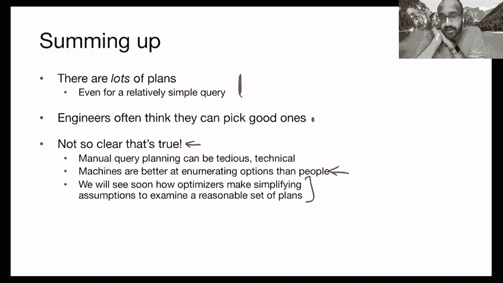
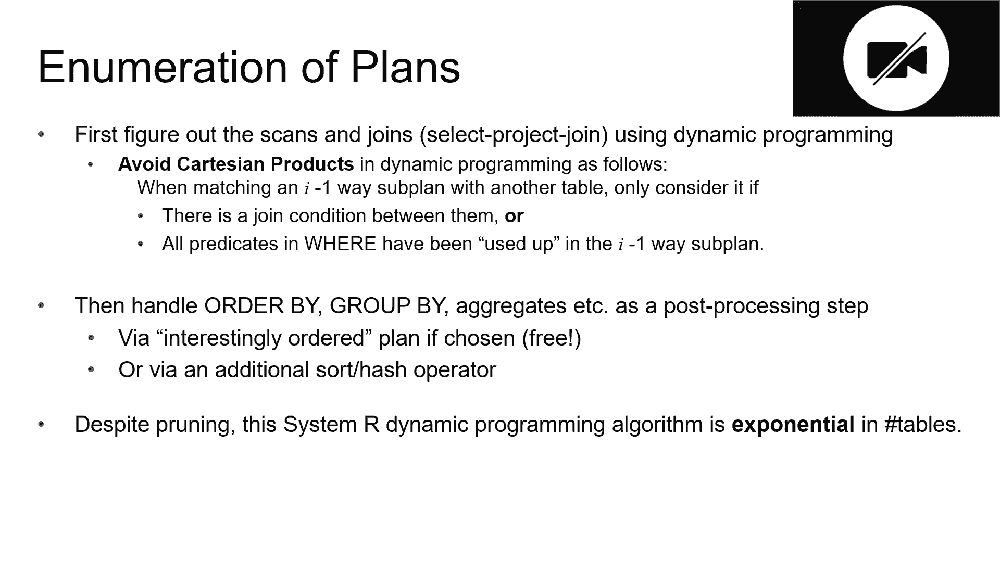

# 加州大学伯克利分校 CS 186 数据库导论 Introduction to Database System (Fall 2020) - P13：Lecture 13 Query Optimization Costs & Search - ___main___ - BV1cL411t7Fz

看起来不错。

好的，嗨，伙计们，大家都好吗？好的，我看到几个竖起大拇指，嗯所以我嗯，我想我们会在中间的某个地方做公告，所以我很容易，结束这组幻灯片相对容易的工作，然后我会把它交给阿尔文，好的，所以说。

我们在讨论各种查询计划，所以我们选择了一种查询，我们正在研究各种查询计划，这些计划可以用于该查询，以及它们如何有各种不同的成本，好吧呃，在iOS方面，所以我们从Pnested循环一路走来，呃到方块圈。

中间还有一堆其他的东西，好的，所以呃，我们尝试了选择推送，各种类型的推下，我们尝试了物化作为另一个技巧，连接排序作为另一个技巧，所以这些都是我们尝试过的东西所以出现了各种成本，好的。

所以我们要看的最后几个技巧，是投影级联以及索引的使用，好的，所以让我们先看看投影级联，所以这是迄今为止我们最好的计划这是一个块嵌套循环，与物化结合，并在一定的选择条件下，我们将用谓词下推来研究这个计划。

我选择这个计划的原因是，我可以为它提供一个理由，但更简单地说，这是一个成本相当低的计划，所以这就是为什么我想看看它，好的，所以这个计划，那个呃，预备役和水手按这个顺序，所以左手边的储备，右手边的水手。

选择谓词投影，呃每一个对吧，然后这些元组，呃被喂进呃，块度环，最后你有一个投影到S的名字上，所以让我们谈谈这个的成本，好的，所以我们有五个缓冲区，嗯和嗯，和以前一样，对于块嵌套循环，你得扫描，所有的。

你必须考虑扫描左手边的所有元组，然后对于每一大块，呃，或者每块页面，你扫描右手边的元组，或者扫描右手边的页面，对呀，这就是事情变得有趣的地方，所以扫描关系，或者更确切地说，储备关系，嗯。

有多少页有一千页对吗，现在有一百艘船，因为有一百艘船，我选择了一块板，大约一百个，我基本上只有十页，现在我要做一个假设，每个保留元组是40字节，ID是我选择的唯一属性，嗯，呃，在我的投影是四个字节之后。

这意味着在这个投影之后，我只剩下一个字节或一页，对呀，从十页降到现在的一页，因为只有一页，它基本上只是黑色循环的一大块，所以我要用这一大块扫描所有的页面，从右手边，好吧，我扫描了所有的水手。

我在飞行中应用选择，我在飞行中应用投影，然后我执行工作，所以我基本上有这个，这个问号说明了左手边的块数，五百是扫描右手边的费用，所以这里是1乘以500，所以我的总费用是一千五百，所以这里的一个问题是。

我们真的找不到比这更好的了，好的，所以和我们的2300美元相比这是一个相当低的成本，一些东西，这是一千五，我的主张是，如果没有索引，你不可能做得比这更好，你为什么认为那是。

因为这只是触摸每一页一次完全正确，原来你是，我是说，你实际上是在做两个关系的连接，水手关系中的后备关系，你必须触及这两种关系的每一页，一个占据了一千页，另一个占了五百页，所以你不能做得比一千五百好多少。

对呀，嗯，不使用INDE，好的，所有的权利，所以这是我们非常好的计划，基本上只是扫描两个关系中的每一个，这就是我们现在所需要的，让我们看看我们怎样才能做得更好，为此，我们需要使用索引。

所以我需要对索引的类型做一些假设，所以我会假设我在船上有一个索引ID，这是一个聚集索引，我有一个水手索引，id，它是一个未聚集的索引，所以我的谓词在b上，并且连接在id上，好的，我还将假设索引足够小。

这样它们就可以放进记忆中，所以我只需要说明，检索这两个关系的页面的IO成本，好的，所以如果我有我的B ID索引群集，这意味着如果我想查找b的页面等于一百，呃，这样的页面有十页，这些将是磁盘上连续的页面。

和蝙蝠对应的所有元组，相等的100个将被打包在这十页里，另一方面，我不能对海豹突击队或希德做出这样的假设，这是一个未聚集的索引，所以你基本上有这种乱七八糟的指针，但这并没有真正伤害我们。

我将在下一张幻灯片中解释为什么，所以希望，索引的样子对你们所有人都有意义，好的，所以有了这个关于储备的B ID的聚集指数，问题是我们需要多少页的储备才能很好地访问，因为这个关系聚集在b i上，有十页。

如果考虑到页数，在应用了这个谓词之后，有十页，那么我们只需要访问十页，好的，所以我们只需要访问十页，因为现在东西都聚集在一起了，这十页上有一千个元组回到我们的假设，在这里，我每页有一百个元组，然后嗯。

一共有十页，所以总共是一千个元组，然后因为我在做索引，嵌套循环，在这十页中加入每一个这样的元组，我要去找一个完全匹配的水手元组，只有一个这样的水手元组匹配，对于每个这样的保留元组，好的。

因为每个水手ID都有一个单独的元组，因为水手ID是，水手，好的，所有的权利，所以我去拿了这个，每个储备元组的um，我得去叫水手们，所以这是一个，伊奥，所以总成本就是扫描的成本，呃，检索所有页面的费用。

使用保留表中的聚集索引，只有十页，加上检索一个水手元组的费用，对于这十页中的每个结果元组，呃，所以你有一千个储备元组，你有一只眼睛让他们每个人取回，匹配的一个水手元组元组，所以总成本是一个零一个零。

好的，所以这就是总成本，这比一千五百好，对呀，呃，就因为我们可以用这个索引，好的，所以这就是整个故事，嗯，所以我们得到了一个相当低的成本，然后随着索引的使用，我们变得更低，但有趣的是。

这仍然是此查询所有可能计划的一个非常小的子集，嗯，他们中的很多人都不是很好，但可能有比我描述的更好的，好的，所以嗯，本例中的高级图片，我们看过的各种计划是有很多计划，即使对于一个相对简单的查询。

只有一个连接和两个只有两个关系，人们常常认为他们可以选择一个相当好的计划，如果他们只是因为他们没有更多的领域知识，或者他们已经处理这些数据很长时间了，那不一定是真的，总是对的，因此。

手动查询规划往往非常繁琐和技术性，你并不真正理解其中的细微差别，尤其是如果数据经常变化，嗯，你最终可能会成为一个次优的计划，机器通常更擅长列举这些选项，人们估计他们的成本，并在数据变化时跟踪数据。

所以跟踪统计数据，比如说，所以我们可以看看下一个算法是如何描述优化器，查询优化器做出某些简化的假设，检查计划的合理子集，然后在计划的子集中找出，它是一个，呃，什么是，呃，那个子集中最好的计划。

所以这就是我的全部，我要转交给艾尔文，除非有任何问题，我也很乐意在聊天中回答一些问题，我看到一些讨论突然出现，我为什么不在此期间交换呢，听起来不错，去争取吧，如果在B+树中有重复的替代项会发生什么。

所以这就是，呃，我认为这是个有趣的问题，我们下课后再谈这个好吗？因为这与我们的，嗯，我们今天的话题，它是，这是一个，因为它更像是B+树，我们可以在下课的时候讨论，没关系，我们能把整个索引放入内存中吗。

如果我们不能容纳整个关系记忆，用下面的方式来考虑它，对呀，假设我有一百个属性关系，我正在索引这些属性中的一个，索引可以是一个量级。

关系大小的百分之一。

所以理论上你可以拟合整个关系，整并索引到内存中，即使你不能把整个关系放在记忆中，好的，我想艾伦你该走了，好的，酷，所以嗯对，所以这基本上是我们刚才讨论的延续，所以现在有趣的部分来了，所以我们一直在讨论。

喜欢做职业规划的不同方法，嗯，以及您可以生成的不同计划，所以现在基本上就像，你知道吗，让我们付诸行动，那么我们如何实际利用这些查询计划呢，我们如何选择最优的，对嗯，所以这是一篇评论，对呀。

所以我们已经谈过了，呃，查询优化器在输入和输出方面会做什么，所以一般来说，查询优化器只接受不同的查询计划，由关系运算符组成，这些是我们以前见过的关系代数树，也有不同的选择，呃，您可能进行的不同物理实现。

所以这些基本上是不同类型的，Aditya和我之前也谈到过的不同类型的实现，这些都是你的连接算法，就像你知道的，您所有不同类型的排序，和所有其他类型的东西，下一步是什么，所以我们现在有了所有的东西。

然后我们已经讨论了如何生成，呃，可能植物的空间，所以这只是，你刚才说的，现在我们基本上需要另外两个组件，那就是我们如何估计这些工厂的成本，反过来，我们实际上已经更早地了解了成本估计。

对于不同类型的关节和不同类型的关系代数实现，我们实际上还没有谈到的是估计每个关系的大小，如果它是基关系，那肯定很容易，我是说我们已经知道有多少元组，但是中间体呢，在执行一项联合行动时产生的关系是什么。

比如说，好的，这就是我们要讨论的下一件事，最后是搜索算法，我们如何实际利用所有这些成本估计和其他工厂，为了选择最好的一个，对呀，所以就成本最低而言，最好的一个，所以作为一个提醒，我们要。

我们将专注于挑战者的所谓系统R，该类中的优化器，嗯，很明显，随着时间的推移，许多事情都有了进步，对呀，所以这是80年代发展起来的东西，从那以后，事情确实有了进展，事实上，我们今天看到了一些改进。

这绝对是数据库中正在进行的研究领域，呃，或数据管理，呃，一般研究，所以这里有一个非常简单的查询优化器，你可以想象建造，嗯，假设我们得到一个输入查询，我们将基本上列举所有可能的计划。

您可以为特定的查询提出的，对呀，所以你知道我们学习了所有这些不同的关系代数运算符的不同实现，所以只要把它们都列举出来，无论你能想象到多么正确要考虑的计划太多了，你不是已经说过，呃，你知道早些时候。

我们一会儿就会明白这意味着什么，你知道在那之后，让我们说，如果我们能以某种方式列举一切，接下来就是估算这些工厂的成本，你知道的，然而，这里的问题是就像你知道的，有时很难给出准确的估计，对。

因为就像你知道的，我们不知道中间尺寸是多少，将产生的关系的关系，我们无法预测缓存会做什么，我们不知道，就像你知道，呃，缓存算法，我们可以使用Right来驱逐缓冲池中的页面，例如，这样就很难估算成本了。

最后我们只挑成本最低的，就像我说的对嗯，然而，如果我们用这种天真的方法，那么问题就像，你知道的，我们真的记录了所有这些不同的计划和内存中所有不同的成本吗，我是说，如果是这样，我们可能真的会，呃。

甚至没有足够的记忆来跟踪所有的植物，作为一个例子，这里有一个查询，从人们用来衡量不同数据库系统性能的基准，所以这个特别被称为tpc h，所以你知道细节在这里并不重要，但你基本上可以看到。

这只是一个常规类型的联合项目，选择您现在可以使用此计划看到的查询，通过这个查询，我可以在这个屏幕上找到你，原来只有两个，两种不同的百万种方式，然后您可以使用不同的算法和不同的实现来执行这个查询。

那么现在会发生什么呢当你看到这个两百万的数字，放弃吧好吧，当然是在那之前对吧，你知道猫出现的权利，你们还不够搞笑，所以猫就出现了，所以你知道，我们该怎么办，就像你知道你以为我在开玩笑，对呀。

但事实并非如此，假设你知道我有十种不同的绘图算法，我可以从，你知道一个不错的数字，对呀，考虑到在这门课上我们已经涵盖了四到五个，对呀，如果我有比如说三张不同的桌子，那么选择的数量就只有十比三了，好的。

十到三分之一似乎是个小数目，如果增加到六个呢，你知道不是那么大的数字，就在六张桌子里，然后我们突然间就有了一百万，所以你知道这并不难想出，就像所有这些不同的方式，对，你基本上可以用很多方法来生成。

就像你知道的巨大的规划空间，所以这通常不起作用，好的，所以我们不能只是做幼稚的事情，所以系统做对了什么，特别是，所以他们已经认识到，肯定认识到这是一个问题，所以你知道他们想出了一堆不同的把戏，嗯。

在规划空间方面，所以我们基本上不打算列举所有的东西，因为这是不可能的，对呀，两百万计划，我是说你知道我们甚至不能把它放在记忆中，我是说，让它知道，就像你在列举它一样，对呀。

我是说仅仅是列举可能需要几年的时间，所以你知道我们不会那么做的，所以接下来发生的事情基本上是我们要应用启发式，你知道，也就是通常有效的技巧，但并不总是对的，那是什么意思，所以说，例如。

我们只考虑所谓的左深植物，我们需要处理关节的地方，我们将看到一个例子，在短短一秒钟内，我们要避免笛卡尔积，因为笛卡尔积通常会产生，你知道的，呃，就元组数量而言，表非常大，大表意味着，你知道的，呃。

需要很多页的内存来嗯，为了储存它们，就像，你知道的，让我们一般地避开他们，好的还有，我们甚至尽量不一次优化整个查询，因此，即使我们想枚举，我们不打算列举，就像你在上一张幻灯片上看到的整个计划一样，好的。

所以这些基本上是不同的启发式，我们可以应用，还有更多，就像我说的对，这些东西通常在像这样的方面起作用，你知道吗，呃，呃，优化，你知道的，减少实际优化查询所需的时间，而无需。

就像我们的头撞在墙上等待整件事正确地完成，但你知道，并不总是奏效，从某种意义上说，它可能会提出一个次优的计划，或者它可能仍然无法减少空间，对呀，呃，以戏剧性的方式，我们走着瞧，然后在成本估计方面。

我们不需要精确，所以说，毕竟好吧，你知道，这不是期中考试也不是期末考试，对呀，我是说，我们不是在问你们，就像你的四十二四十三页，只要我们能比较不同的方案，对，因为我们基本上只是想对它们进行排名。

那我们就没事了，好的，所以所以，就像你知道的，棒球场，就像你知道的，信封背面，估计通常有效，就像你知道的，当然啦，在搜索算法方面，我们实际上要做一些叫做动态编程的事情。

你可能记得也可能不记得从61年开始，好的，上一节课我们已经讲过平面图了，来自阿迪蒂亚·索，但在查询优化优化方面，我们将使用基于计划的知识的方式是，基本上说，我们将把整个查询分解成不同的查询块。

我们将一次一个地优化每个块，那是什么意思对吧，所以这基本上意味着，如果我们有与查询不相关的块，那么我们基本上只需要考虑这个块一次，因为我们可以把它压平，大家可能还记得，呃，从以前的关系代数讲座。

如果我们能把一个查询弄平，我们基本上是这样做的，这样我们就没有那么多不同的嵌套块要处理，但如果我们能把它们压平，然后，从优化的角度来看，我们基本上将它们视为单独的查询块，所以这里，比如说。

您可以看到这里有两个不同的查询块，对呀，所以外面有一个街区，街区里有一个，你可以看到这里的嵌套块或这里的内块正在利用，呃，来自，呃，在这种情况下，实际上甚至不是从外部块。

但我们只是考虑把它们当作两个独立的街区，在优化目的方面，所以我们要单独处理每个块，对于每一个区块，我们只需要输入并考虑不同类型的植物，所以访问方法，例如，在这种情况下。

只是意味着我们想要访问每个基本表的不同方式，在本例中，在from类中，我们是在扫描索引吗，我们是在扫描堆文件吗，所以基本上这些是不同类型的呃，我们将考虑的访问方法，呃，分别为每一个。

就在这两个不同的街区，然后呢，就像我说的对，如果我们有一个连接，在这种情况下，我们做得对，因为我们这里有一个相关的查询，那么我们只会生成，我们只生成一个所谓的左，在这种情况下。

左深关节树的定义基本上是一个，其中右分支始终是基表，所以你在屏幕上看到的一个例子，注意在每个关节上，右手边总是一个底桌，它从来不是另一个操作员，不是联合经营者，这就是所谓的左陡坡，呃，关节树，嗯。

然后给了这样的树，我们要，我们将考虑所有可能的方法来真正加入他们，以及我们所知的所有可能的方式来实现共同的权利，所以我们所知道的关于任何问题的不同联合方法，到目前为止，能不能点个赞，非常快的直觉。

为什么我们只想考虑像左深连接树，而不是把像等级制度这样的东西，是啊，是啊，例如，对呀，我是说，在这种情况下，你可以考虑的一件事是一棵看起来像这样的联合树，所以这将被称为平衡树，对呀。

它不是一棵左踢踏舞树，因为一切都不是单向的，所以左边深树的一个优势，我们知道右手边永远不会，我们从来不需要等待一个元组，还记得我们讨论的迭代器模型吗，你们一直在实施你们的项目，三三，希望是对的。

所以在这种情况下，你知道吗，右手边的一切，我们知道元组总是可用的，除非我们已经运行了我们的水元组，我们为此所做的一切，呃，然而，在这种情况下，如果我们没有左边的树，右边的树，就像这个案子和我画的那个。

所以想象一下在顶部连接时会发生什么，所以上面的连接是对的，我们可能需要等待，就像，你知道的，在两边，就在元组真正出现之前，右手边不是底桌，例如，所以左深的树有这样的好处，好的，还说你知道。

为什么不把深树写得很好，但那是在那个意义上，基本上是任意的，好的，那是有道理的，谢谢顺便说一句谢谢，我看到有六个人开着摄像机，我是说如果你喜欢听而不喜欢睡着，你能试着打开你的相机吗，谢谢。如果你睡着了。

那很好，对，我是说，我保证我们不会取笑你，嗯好吧，所以我们继续吧，所以让我们给，让我给你举个例子，对呀，所以在这节课剩下的时间里，我要用这个现在著名的或臭名昭著的，呃，你知道的，水手，呃。

关系和我们以前见过很多次的保留关系，就像，你知道吗，关于这两张桌子的一些统计数据，我在这一页上给你看，所以在我们真正看这个例子之前，呃，有一堆我们需要讨论的物理性质，你马上就会明白为什么这很重要。

所以我们可能关心的一件事，例如，当事情在结果中时，它们是否真的被排序了，另一件事是它们是否真的按照，你知道的，基于，让我们说，哈希函数对，你可能想看看，实际上有人能猜到为什么。

这两件事作为和查询运算符的输出可能很重要，让我们说，由于关节，是啊，是啊，这样他们就可以做，他们可以让呃，操作更快完全正确，例如，如果我们真的有一个下游运营商说，就像你知道的，凭权利订购，例如。

如果接头的输出已经开始，你们一定记得，对呀，因为我们已经跑了，假设一个排序合并连接，例如，那就太好了，因为那就意味着你知道，呃，操作员的命令实际上不需要做任何事情，我是说这真的很好，同样地。

如果我们也想分组，出于类似的原因，就像你知道的，这只是提醒人们可以产生这些属性的东西，右作为此输出中的A，例如，如果我们有索引扫描，然后对结果进行排序，很明显如果我们，那么结果就肯定排序了。

然后以此类推对，对于联合操作者也是如此，正如我所说，就像你知道的，某些运算符或某些实现中的某些运算符实际上需要对事物进行排序，对，因为例如，在排序中浸没关节右，我们依赖于输入已经排序的事实，如果没有。

那我们就得手动分类，这将产生额外的成本，你已经经历过这些了吗，我不会喜欢，你知道，在这里详细说明，所以在这种情况下你可以看到，呃，你知道，我们这里有关节，然后你可以看到两种不同的等价植物。

因为它们计算的是完全相同的东西，只是一个人有一种，另一个没有，因为在右手边，我们使用了一个基于哈希的联合算法，所以就像我说的对，系统中的，或者在我们在本课中讨论的优化器中，我们只考虑左深联合计划。

就像你知道的，这两个是这两个和幻灯片上的，我们不会考虑，嗯，它肯定会限制或拉低搜索空间，对呀，因为我们正在说明或不考虑一些联合的可能性，嗯，就像我说的对，你知道有一定的优势，如果你只考虑剩下的深植物。

呃虽然呃，这可能最终会返回一个次优计划，在某种意义上不一定是最有效的，但这基本上是我们愿意付出的代价，除非我们想处理两百万计划，嗯，所以这基本上是一个启发式，通常是有效的，但并不总是，所以嗯。

为了一个计划，为平面图空间，但正如我们已经谈到的，我们基本上得到了一堆不同的计划，也许使用关系代数等价，或者通过列举基于不同物理实现的不同方法，然后就像你知道的，正如我所说，我们将应用这些启发式。

当我们试图产生更少的植物数量时，就像你知道的，呃，然后我们基本上要强制执行，当我们列举不同的植物时，例如，我们根本不会生成笛卡尔积，因此，你知道我们在考虑哪个运营商并不重要，所以每次我们看到一个关节。

我们基本上不会考虑任何形式的笛卡尔积，所以现在让我们来谈谈成本估算，所以你们已经知道了一半的故事，就像我说的对，因为我们已经知道每个运营商的成本，对呀，所以，嗯，这是期中考试后。

我敢肯定你们现在是对付IO页面的专家了，所以我们需要基本上估计每一个的成本，呃，种树，我们没有谈过的事情，然而，如何估计所有中间体的大小，就内部产生的输出而言的中间体，就像你知道的。

作为查询运算符之一的结果，是啊，是啊，就像我说的，我们已经讨论过不同类型的运营商在IO成本方面的问题，现在我们只需要估计绿色袜子的尺寸，现在，我们要正确使用的一件事是基本上利用这些信息。

我们有关于输入关系来估计中间体的大小，我们还没有经营职业生涯，对呀，所以很明显我们不知道，就像知道有多大，呃，关节要去了，呃，你知道一个特定的关节可能正是，但是我们可以根据输入关系的大小来估计，对呀。

我们将看看如何真正做到这一点，在系统中，他们基本上是首创的，呃，结合两者的成本估计，呃，iOS的数量，这就是我们已经知道的，就像你知道的，一些叫做CPU因子时间的东西，元组数。

所以我们已经熟悉的第一个术语，对呀，所以第一个学期，第一个术语基本上就像，你知道的，相关费用，让我们说，将输入基表的页面输入到内存中，以及所有其他好的东西，第二部分，然而，是我们嗯，所以哎呀。

我们的东西我们的东西，我们刚才谈成本估计的时候，它撒了谎。所以记得当我们谈论成本的时候，我们现在基本上是说，您可以忽略与实际处理在内存中设置的元组相关的任何成本，所以现在我们不能再忽视这一部分了。

所以我们基本上要在计算方面把这个因素加回来，不管我们怎么称呼它，所以基本上与处理元组次数相关的成本，我们实际需要处理的元组数，我们将在这节课中看到如何真正做到这一点，正如我所说，就像你知道的。

有目录和数据库，基本上可以跟踪你知道的事情，元组大小的大小，输入的大小，每一个基本关系，等等，所以这里就像你知道的，您可能会在任何类型的数据库目录中看到一个典型的表。

所以基本上我们将在每张桌子上存储两个帖子，存储每个基表的磁盘页数，以此类推，然后根据这些数字，我们基本上要估计我们产生的这些中间关系的大小，当我们试图计算关系代数查询树时，到目前为止对此有什么问题吗。

好的，所以你知道，就像我说的对，所以这些东西基本上，目录将作为，呃，作为数据库管理系统的一部分，所以我们基本上要利用这样的信息，试图估计中间关系的大小，你还记得之前的讨论吗，对呀。

输入关系的大小也称为船长基数，对呀，所以你看到了，基本上出现在幻灯片上，嗯，现在有一件事，哎呀，我们要做的一件事是为了估计，就像，你知道中间的输出基本上是有选择性的概念，我们稍后会。

我们就会明白为什么我们实际上谈论输入基数的乘积，嗯好吧，所以选择性基本上是与，与查询中的每个术语相关联的东西，特别是具有罕见谓词的查询，所以你知道班级选择和关节，对呀，所以所有这些东西都有谓词。

所以选择性基本上是一个用来描述它们的术语，所以对于那些上过概率课的人来说，例如，它基本上是一个措施，呃，试图计算实际命中的概率，呃，对于其中一个谓词，我们基本上要用它来测量和估计结果，呃，输出表。

这么正式的说，选择性被定义为，呃，输出表的大小除以输入的大小，在书里，呃，你也，这本书还称之为还原因子，因为这总是一个介于零到一之间的数字，例如，如果我们在做像选择星这样的事情，对吧。

我们基本上返回每一个元组，那么在这种情况下，活动基本上是一个权利，因为一切都很顺利，所以说，因此，输出的大小与输入的大小之间的比值正好是1，与不返回任何东西相比，它的活性为零，因为它不会输出任何东西。

因此，在这种情况下，活动将为零，除以输入表的大小，意思是零，那么叉积呢，在这种情况下，在这种情况下，叉积权，它实际上不会过滤任何东西，就像你知道的，你实际上可以看到如何对叉积进行活动估计。

在关节的背景下，现在，你也会听到人们谈论的事情，对呀，当他们谈论选择性时，它实际上违背了你知道的，我们称之为自然语言中的高度选择性，嗯，这实际上与我们在这里定义事物的方式完全相反。

所以别问我为什么要这样定义，所以说，例如，就像你知道的在正常的谈话中，当我们说某件事是高度选择性的对吧，这意味着很少有事情能正确地通过，比如你说你知道这份工作要求很高。

意思是这基本上意味着我们不会选择很多候选人，对呀，但在这种情况下，高选择性右意味着数字真的很高，右，意思是接近一个，所以这实际上与我们在正常对话中的意思相反，意思是某物有很高的选择性或有很高的选择性。

意味着就像你知道的，它只选择很少的元组，好的所以要确保你明白我们是在什么背景下谈论事情的，所以就像我说的对，每个术语都有选择性，在它的where子句中，每个选择基本上都是对的，所以在这种情况下。

我们有k个不同的，这里有一个选择抱歉的选择谓词，所以你可以想象我们将有K个不同的活动，那么我们将如何估计这个查询的大小，你在屏幕底部看到的，嗯，只是基本上会是，我们可以产生的最大元组数。

这是根据塞林格的说法，对呀，在这种情况下，我们能生产的最大数量正好是，就像，你知道我们在这里的所有关系，对呀，如果只有一个关系，那就像你知道那个底座的大小一样，基于uh的关系，如果结果是一个关节。

那么如果你知道可以产生的最大元组数基本上是，所有桌子尺寸的产品权利，所以不要太担心，现在你不明白，但你们在这张幻灯片上理解的是，事实上，我们正在应用所有活动的产品，我们在上一张幻灯片上看到的。

所以如果我们在这里有k个不同的术语，那么整个集合活动将是所有这些的乘积，你可能会问为什么我们真的能看到，为什么会是这样，所以让我们通过一些简单的活动，呃估计，我们如何实际计算它们。

所以让我们假设其中一个where类或其中一个选择谓词，说了一些你知道的，检查等于特定值的列，假设我们得到了你知道的，和钥匙对，让我们用这个呃，此处的符号，用于标记列的唯一值的数量。

很抱歉这个特殊的独特价值，嗯专栏右，所以假设我们在寻找像H这样的东西，等于二一什么的，好的，那么你认为这个特定谓词的选择性是什么，天真猜测只是唯一列数的一个对吧，所以这将是完全。

所以它只是1除以唯一值的数量，对呀，就像你知道的，这基本上是，就像你知道的，这个特定的谓词可能会击中某些东西，或者它可能会返回正确的东西，让我的意思是，如果你不明白这一点。

考虑一下我们实际上在寻找适龄学生的情况，正好等于二，一什么的，对呀，如果我们有喜欢，你知道，呃，这张桌子里不同年龄的人，那么就像你知道的那样，我们可能会找到一个元组，呃，符合此条件，对呀。

它只是一个除以不同唯一值的数量，我们拥有的，沃伦，你有问题吗，呃，是啊，是啊，所以这不是假设我们没有副本吗，是啊，是啊，在这种情况下，就像，对于这个特殊的情况，对呀，就像，比如说，你知道他们是。

没有重复的，所以如果有重复的对吧，那么这并不是说这不完全等于概率了，是的，这是要记住的最基本的事情，但这基本上是我们使用的估计，所以这就是为什么这是持续的活动，但不是概率，因为这个原因。

所以现在让我们继续吧，那么像这种其他形式的呃，选择谓词，假设选择谓词是这样的，你知道吗，嗯，水手等级等于，对不起，水手，水手ID等于喜欢，你知道吗，这些书找了一些，呃作为谓语，对呀，所以你可以想象。

例如，这对关节也很方便，对，因为在关节里，这也是我们将要看到的谓词类型，在这种情况下，事实证明，扇区将是一个以上，这两列之间唯一值的最大数目，你不明白为什么这是最大的。

坚持住坚持住你的想法会看到一个例子，呃，在下一张关于这个的幻灯片上，但就目前而言，这么说吧，这就像是任意决定的公式，呃的活动，这种形式的谓词，现在这个走样怎么样对吧，检查特定列是否大于或小于特定值。

所以在这种情况下，我们将定义活动，会是最大值什么的，就像你知道的，你能从那一栏中得到的最大价值，减去我们感兴趣的特定值，我们要把它除以范围，根据我们为这个特定列提供的值的总体范围，我们要加一个。

因为你知道，我们不算不算，我们希望在结束和开始时都是包容的，所以再一次，对呀，这降低了概率，如果你知道我们在处理性，但我们一直在做多套，那就不再有概率了，但我们将用它作为选择性的粗略估计，在任何情况下。

然后你可以想象公式是什么样的，你知道的，如果我们翻转符号说像列小于一个特定的值，呃，是啊，是啊，所以当我们谈论一列的最大值时，我们假设它是整数还是浮点数，或者像绳子一样，是呀，嗯，所以对于弦来说。

你可以，你不能像用克一样比较，对呀，所以在这种情况下，这肯定是数字或类似的，你知道，至少数字看起来像对的，如果弦，我是说，那就另当别论了，如果我们说的是像一根绳子，等于某物或像某物，不知何故。

你把一个字符串转换成一个数字，然后像词汇一样比较，以图形方式，或者类似的东西，然后它也还原到这里的这种形式，是啊，是啊，Y加1右边，因为我们想包容，所以我们希望同时包含n和值的范围，对呀。

包括你知道的最低值和包括最高值在内的一切，所以我们加了一个，如果我们不知道如何正确估计会发生什么，所以我们实际上要得到一些随机值，对呀，比如说十分之一，这其实就是，呃，系统是，呃优化并最终这样做。

在它不知道如何再次正确估计一包的情况下，这是四五的猫对吧，你知道为什么这个十，为什么不点赞呢，你知道1除以4 2，对呀，我是说最重要的是，所以让我们一会儿再来回顾一下，但现在我想像你一样解释。

为什么我们在这个公式中使用max，这是有原因的，所以我要用，呃动物的例子，就在后面，呃猫，呃类比，所以现在假设我这里有兔子，我想估计概率，左耳右耳，与右耳颜色相同的兔子的左耳，对呀，假设我有一百只兔子。

和，比如说你的左耳和右耳只有两种不同的颜色，实际上它可以有多达十种不同的颜色，所以假设耳朵的颜色是独立的，所以去年就像你知道的一样，被染成了棕色，没有效果，左耳上的任何颜色，匹配耳朵的概率是多少，对呀。

所以基本上，呃的概率是多少，公式，我是公式，我把它作为幻灯片的标题，嗯，这和诱惑力基本上是一回事，对呀，如果我们在处理布景，让我们说的权利，所以这和我之前问你们的完全一样，形式谓词的活动是什么。

你知道的，第一列等于第二列，对呀，好的，所以如果你还记得你的概率课，嗯，这个概率是所有可能情况的总和，对呀，两个颜色其实是一样的，这两种颜色其实是一样的，所以在这种情况下，我们把所有的C加起来是对的。

那么像这样的概率是多少，你知道这两个，第一年，去年就像，你知道布朗，第二年也是棕色的，对呀，例如，那是第一个学期，然后像这样的概率是多少，你知道左耳是黑色的，然后右耳也是黑色的，对呀。

所以这可能是第二个术语，这里是C2，等等，等等，你会注意到这一点，所以这基本上是概率对的，因为，正如我所说，左边只有两种不同的颜色，所以等于c1的概率是二分之一，那么它等于C2的概率也是，对右耳。

因为有十种不同的颜色，那么概率均匀分布为对的十分之一，但请注意，就像其他一切一样，抵消了，因为左耳右耳只有两种颜色，所以如果你做，在这里算算，原来这只是十分之一，也称为一除以两个数中的最大值。

所以这证明了我们为什么要说话，我们在前面讨论的公式中使用了最大右，这有意义吗，和烘焙警告，当然啦，对呀，我们假设就像你知道的那样，类似的，你知道，它是，呃，这是一套正确的，因为如果是多集。

那就不再等于你知道的那样，正好等于概率，所以呃，但我们只是用它作为一个粗略的估计，在任何情况下，好的，所以现在回到十分之一的数字，对呀，就像我之前说的，对呀，为什么十分之一是对的，为什么不好好拉点别的。

事实上，人们一直在叫别的东西，所以这是Postgres的一个相对较新的实现，它是一个开源的数据库管理系统，他们可以在线使用，也可以自己下载和使用，所以你可以看到他们基本上把一大堆，这里有一堆不同的数字。

对呀，从像，你知道吗，零点，零五，作为喜欢新事物的默认概率，像一个，你知道三分之一，好像是为了这个，你知道这里a小于b，没什么特别的原因，我想说你的猜测基本上和我的一样好。

所以就像你知道任何东西都在这里，所以你知道，如果你不喜欢他们，你也可以改变它们，然后这实际上会影响，呃，你知道优化器的性能有多好，但就像我说的对，如果有办法估计，我们确实想估计对他们。

这就是为什么我们给你们上一张幻灯片上的公式，因为在某些情况下，我们确实可以计算一些有意义的东西，所以我们要这么做，如果可以的话，正如我所说，这基本上就是系统艺术所做的，但现在我们实际上更清楚了。

我是说我们可以用这些随机数，或者我们可以使用直方图，艺术没有考虑到哪个系统，但我们现在可以考虑它们，因为我们有跟踪信息的目录，那么什么是数据库世界中的直方图，在这种情况下，这里有一个直方图。

它基本上是计算，它基本上是编目不同元组的数量，我们有不同范围的值，所以我们已经熟悉了直方图相等的概念，对呀，所以它的旋转基本上是等宽的，就大小而言是正确的，然后你就知道了，呃，计算特定桶中的元组数。

所以这是我们已经熟悉的东西，另一种表示直方图的方法实际上是死亡，所以就术语而言，所以这基本上意味着，而不是让桶的宽度相同，我们想要每个部分的高度我们现在有相同的宽度。

实际上我们可能并不希望远足的宽度完全相同，它们可能是一系列的，你知道的，小范围的值，所以在这种情况下，我基本上选择，呃，徒步旅行将高度限制在两到四点之间，所以你可以看到桶的大小现在不同了，例如第三个。

因为这里的第四个桶不再像，你知道吗，呃之间呃，它不再是，一号范围右，基本上是一个更大的范围，然后就像你知道的那样，但这里的第五桶实际上是你知道的范围，就像五点五，对呀，因为我们把高度限制在，呃。

两点到四点之间，你可以摇晃它，就像你知道的某个数字一样，对呀，假设你知道两个，例如，对在这种情况下我们得到的是，呃，呃，所谓的背部纺织品，对呀，所以你记得我们有像分位数这样的东西。

我们有中位数之类的东西，就直方图而言，这意味着什么，基本上这意味着我们有相等的深度，正好四个桶的直方图，例如：在一个瓷砖的情况下，因为我们基本上限制数字桶的大小是固定的，所以我们有我们，我们。

我们现在基本上可以看到对应于每个桶的值的范围，对我来说，它基本上是说我们只被用来，我们把高度限制在完全相同，这样我们现在就可以判断我们是否只有两个桶，基于范围的中位数是多少。

所以我只是选择使用这些不同的直方图，告诉你们不同的统计数据我们可以保存在，在数据库目录中，但就像你知道的那样，呃，为了本课的目的，我们基本上只使用第一种直方图，被称为，用这个你们很多人已经熟悉的直方图。

好的，那么我们如何使用直方图来计算活动，假设我有一百排，假设我现在想选择，呃，这个特定谓词的计算机选择性，就像你知道一些属性p会大于99，让我们说的权利，我们如何利用这口井，所以我们用直方图。

假设这是一个类似的直方图，你知道吗，呃，在这种情况下，就像随机的随机的事情，呃消耗的土豆数量，每年消费，所以我们想计算选择性或估计尺寸，这个选择谓词的右边，我是说，很容易对吧，我们刚刚从直方图中读出。

大于大于的一切，呃，九十九，对呀，在这种情况下，将是最右边的四个小节，然后我们把它除以我们有的总行数，所以说，假设这些蓝条加起来有五十，所以在这种情况下，主观性是第五点，所以在这种情况下。

我们没有使用我们之前讨论过的公式，我们通过读取直方图完全使用了这个空间，这里还有一个对，所以在这种情况下我们是，这是一个年龄直方图，所以如果我们对喜欢感兴趣，你知道吗，26岁以下。

然后我们再从直方图中读出，然而，这里有一点边缘，对吧，我们希望每个人少，他不到二十六岁，但是这里的直方图，这里的旋转适用于25岁到30岁之间的人，在年龄权利或两个六方面，取决于你想怎么数。

那么我们如何获得直方图的切片，我们没有专门的垃圾箱适合2岁6岁的孩子，特别是，所以我们要引用一些被称为均匀均匀性假设的东西，我们基本上要假设那件事，呃，值将在每个垃圾箱内均匀分布。

也就是说如果我们有五个人年龄在2岁6到30岁之间，那我们就假设，你知道会在这些年龄中均匀分布，这显然是一个很大的假设，对呀，所以你知道，总的来说，没有人肯定不是真的，但这基本上就是我们要做的。

因为我们没有一个特定的垃圾箱适合那个特定的年龄，所以在这种情况下，我们只是假设，它将是那个垃圾箱高度的五分之一，在这种情况下，你知道，把所有东西加起来，我们得到了这样的东西，你知道吗，四点六，有道理。

好的，所以现在让我们继续一些更有趣的事情，所以让我们假设现在我有一个连词，对呀，所以我得到了这个，呃，时髦，这里简单的意思是一个h，所以现在我有了两个谓词的连词，m p大于99，年龄也小于两六岁，对呀。

所以我们知道个人，呃，选择性，那么我们在这里做什么，嗯，我们将在这里调用另一个假设，被称为独立，所以如果你知道概率，这是同样的假设对吧，基本上事件的独立性，这意味着像你的年龄和吃土豆是完全独立的事件。

所以选择性会成倍增加，在这种情况下，所以再一次，我在这里挥挥手，字面上的权利与，这些基本上都是假设，他们，你知道吗，你肯定会发现它们不是真的，但这基本上让数学变得更容易，它使估计更容易。

所以这就是为什么，就像，你知道，在数据库系统中，我们倾向于使用它，因为没有，你知道，如果我们有大量的植物，我们真的负担不起使用真正花哨的技术来估计选择性，我还想讨论的另一件事是这个交界处。

否则称为所有权利，所以在这种情况下，我们有相同的谓词，但我们用析取法将它们连接起来，所以我们已经知道了单个谓词的选择性，现在呃，如果你从概率上记得独立假设，嗯，我们知道我们知道满足第一个元组的元组数。

我们知道我们知道满足第二个元组的元组数，同时满足右的谓词数，会是那个，那个呃，我们把这两件事从概率相乘，但如果我们，呃，但如果在这种情况下我们没有权利，我们有一个或者我们有一个析取。

所以我们不能重复计算，我们数数，我们基本上想要像，你知道吗，大于土豆的数量，99岁以上的消费者，也小于或小于二十六岁，对嗯，如果我们把这两个数字加起来，这是什么概率，我告诉过你的。

然后我们最终会过了数那些喜欢，你知道吗，满足这两个谓词都是年轻的和二十六岁的，吃了一百多个土豆，对呀，所以我们不想高估这一点，所以这就是为什么我们基本上减去，在最后。

所以你可以想象的另一件事基本上是画这种维恩图，所以这将是所有有这个的人的空间，所有的人都会满足第一个谓词，然后这将是满足第二个谓词的人的集合，中间的这个基本上是，你知道的，满足双方权利的一组人。

所以既然我们不想重复计数，所以这就是为什么我们在这里基本上减去这个数字，到目前为止对此有什么问题吗，好的，所以你知道更复杂的查询怎么样，对呀，所以我们之前说的是关节，就像在联合案件中发生的事情，对呀。

现在我们将根据直方图公式来估计这个活动，对呀，或者基本上基于之前提供给你们的公式，在我们谈论直方图之前，在任何一种情况下，它的工作方式都是一样的，接头选择性，在这种情况下。

让我们用uh作为下划线p来表示，假设我们已经知道了选择谓词的选择性，使用直方图法或公式法，如何实际考虑整体选择性，所以你会记得阿迪蒂亚说过这个特殊的等价性，在上一课的早些时候。

我们总是可以把一个关节重写为叉积，然后是一个选择，所以在这种情况下，连接的选择性只是，这里的p的s，我们之前说过的，这有道理吗，所以交叉乘积右把所有东西都通过，因此，叉积没有活动，或者活动是一个权利。

我是说一切都过去了，然后选择，然后如果我们以这种形式重写它，然后我们基本上，我们现在知道，连接的选择性只是谓词的活动，在我们将叉积应用于基本表后，然后我们要估计这里关节的大小，对呀。

那么它只是输入的大小，呃，两个基表大小的乘积乘以这里的选择性，或称为下划线p，呃，文森特，你有问题吗，是啊，是啊，我有一个关于前面例子中平等的问题，所以如果相等可以表示为，嗯，为什么我们不能。

为什么选择性不能，在这种情况下是独立的，假设一个独立于唯一的一列，比你大一倍，我第二栏，而不是做一个超过最大值的，第一栏和第二栏的唯一性，如果这有道理的话，所以你是在问，就像直方图方法之间的区别。

并且喜欢基于公式的方法，或者对，就像直方图法一样，为什么我们不能把独立的假设应用于平等，而不是在最大单位列上做一个，嗯，我想你真的可以，只是我们用直方图来读出，其中一些数字，相对于，嗯。

而不是用某种公式来推导它，基本上是一回事，嗯，即使你使用了一种被破坏的方法，我是说，就像你知道的，基本上最终使用了独立性假设，让我们说像你知道，如果有一个连词，例如，对呀，它基本上只是两组活动的乘法。

这是一回事，好的，是啊，是啊，任何其他问题，好的，就像，你知道，这里还有一个更复杂的，所以在这种情况下我们有一个选择运算符和一个关节，所以现在如果你重写，对呀，我之前和你们谈过，通过将联接重写为叉积。

通过选择，那么我们已经知道如何实际计算整个查询的选择性，因为我们可以把它重写成一个叉积，然后我们也可以把选择拉出来，假设喜欢，你知道的，我们正在正确地命名所有的列等等，诸如此类对吧。

所以在这种情况下选择，在这种情况下是选择性，它只是选择性的乘法，论单个谓词p和q的选择性，如果你接受独立假设，然后就像你知道的那样，我们可以，呃，然后我们可以预测这个查询将产生，就是基表大小的乘法。

这两件事的个体选择性，挺酷的，对呀，我是说，就像，你知道的，现在我们实际上不需要单独的绘图公式，我是说我们只是把它们重写成交叉乘积和选择，然后我们已经知道如何估计选择活动，所以这很整洁，我觉得。

那么像这样的东西怎么样，也许我们现在有兴趣看看这样的东西，你知道吗，t t点p等于t点h对，这是土豆和H的例子，我们已经知道一种方法，从，呃，从基于公式的方法，用直方图怎么样，嗯，这里有一个办法。

我们实际上可以从直方图中扫描所有年龄的食物，和消耗的土豆数量相等，从直方图中读出值数，然后计算选择性，那么这个想法是什么来着，所以只是为了给你直觉，对呀。

所以我们基本上要通过我们拥有的每一个引脚进行交互，呃，从直方图，然后当他们有像Mac一样相应的匹配值时，所以说，例如，在这种情况下，右边的绿色条对应于，比如你的土豆在40到45岁之间吃。

也在四十到四十五岁之间，对呀，所以这将构成匹配，对呀，根据这个谓词，因此，如果您不想使用基于直方图的正式方法，然后我们基本上遍历这些条，当它们相等时，相应的条，然后我们只数，我们只看这些栅栏的高度。

得出选择性估计，对呀，所以我们基本上遍历这些条，所以我们可以分解这个，呃公式，呃，呃，对不起，我们可以把这个计算分解成这个公式，所以我们基本上要迭代所有的垃圾箱，或者所有的值，特别是对的。

我们要检查他们是否，不管是喜欢，你知道吗，呃，消耗的土豆数量等于四十，然后年龄也等于四十岁，然后四十一个，四十二，依此类推，以此类推对，基本上沿着过道行进，然后你知道我们基本上要用分离来连接它们，对呀。

因为如果因为这两件事，呃，这两个，这两列对齐了，如果呃，只要它们有相同的价值，对呀，所以如果我们在这种情况下申请，就像你知道的那样，嗯，这个结公式对，所以我们基本上要把它们加在一起，然后呃。

然后如果我们应用独立性假设，我们基本上要把这些单独的活动增加到一起，因为这些基本上，独立于事件，对呀，这是独立性假设，那么这里的个人生产力是多少，比如说你知道土豆等于四十，所以如果你用直方图的方法。

对呀，将要发生的是，我们基本上要看看与40相对应的垃圾箱，所以呃，基本上是P的垃圾箱，本来应该是，这应该是下划线，四十岁是上限的地方，然后我们要看横杆的高度除以，就像你知道的那样，呃，那个特定的宽度。

呃，你知道的，呃，范围右，因为就像你知道的每个桶储存的不仅仅是40个，对呀，基本上是一个范围，你知道四十到四十五，然后我们还需要把它除以n，因为这是我们有的元组的总数，所以同样的事情对吧。

所以如果我们想追踪年龄，例如，基本上是我们需要应用的完全相同的公式，所以它总是会，就像，你知道的，整个垃圾桶的高度，然后我们需要把它除以垃圾箱中包含的值的范围，因为我们之前的假设是一致的，例如。

垃圾箱实际上可能包括十个不同的值，所以所以，就像你知道的，如果高度是一百，然后就像你知道的，等于40的东西的数量不会正好是100，会是一百除以十，因为我们有十种不同的东西被放进同一个桶里。

然后我们基本上把它除以，也只是为了让，呃，使它成为零到一右之间的数字，这里基本上是我们有的元组的总数，然后如果你把它插回公式中，然后我们基本上只是把所有的值加起来，然后你可以得到呃，对此的估计。

在这种特殊情况下，就像你知道有些列一列等于列二，这基本上是另一个，另一种不用公式计算选择性的方法，我刚才和你们谈过了，所以在本例中，我们从直方图中读取值，如果有的话，所以我们到目前为止所说的。

基本上是计算活动的不同方法，我是说你可能会问哪一个更好，我是说，真的不太，你知道的，真的很难比较，对呀，因为就像你知道的，有时从直方图中读出值更容易，如果有的话，但如果他们没有，如果他们喜欢。

你在身边很贵，然后就像你知道的，呃，使用基于跟随的方法可能也很有效，在这两种基本方法之上，你需要记住的是，你知道的，我们一直假设的事情，例如，在直方图的情况下，我们一直假设均匀分布，我们已经，呃。

假设这两种方法中的独立事件，对呀，所以在这两种情况下，我们都假设你可以把活动叠加在一起，如果它们通过一个连词连接起来，以此类推，然后对于联接，我们可以作为特例重写它，作为交叉积，通过选择，你知道。

就像我之前说的，在，在，在，对呀，我是说，就像你的选择性估计真的是一门黑色的艺术，嗯，你可以想出很多不同的方法来打破，就像你知道这两种不同的方法，事实上，人们有，事实上，他们也发展了许多不同的，呃。

估计活动的复杂方法，和，当然啦，大家可以猜到，对这些天，人们也在尝试将机器学习用于同样的目的，嗯，所以你知道，基本上有很多不同的方式，估计活动，但在这节课中，在这节课中。

我们只想向你们展示这里的基本方法，好的，现在让我们来谈谈搜索算法，所以我们现在知道如何实际列举所有的计划，我们知道如何估计每一个的成本，所以现在让我们来谈谈我们将如何再次进行搜索。

我们不会用列举一切的方法，付出了一切，然后选择，然后只保留最小值，对呀，我是说这行不通，因为植物的数量太大了，也喜欢，你知道与成本估计相关的成本，不是完全免费的，在此之前，我只有两个简短的声明。

第一个是今晚将有一个项目派对，从六点半开始，所以如果你们在项目上需要帮助，请尝试，请参加，另一个是关于期中考试的视频，所以你们中的一些人，呃实际上设置了一个密码，你们为期中考试录制的视频。

我想这是缩放的默认，嗯，如果你已经提供了，嗯，密码作为笔记的一部分，当你填写表格的时候，那太好了，非常感谢，如果你没有，嗯，请尝试禁用，呃，你视频里的密码，您可以在Web门户上这样做。

我相信我们已经为你提供了关于中期设置广场帖子的指示，所以请试着这样做，否则我们得把你们抓到，呃，查找密码，就像你知道的，嗯，那样你可能会收到我们的来信，但如果你能禁用它，我想这对双方来说都更容易，呃。

两种偏见，到目前为止对此有什么问题吗，好的，所以在剩下的十五分钟里，所以让我们看看多久，我们实际上能覆盖多少搜索算法，所以嗯，在搜索算法方面，我们基本上要把它分成两箱，我们需要担心的，第一个是案子。

第一种情况下，我们只需要处理一个表，基本上没有关节，另一种情况是我们实际上需要处理多个表，或者基本上用关节查询，嗯，我们首先要处理，呃，在以下方面的单表计划，所以这些是只有选择的。

只有预测基本上只有团购，仅聚合，又没有关节了，对和呃，对于那些我们只是要去，呃，为这些查询选择不同数量的不同实现，然后我们就选一个最少的，我声称就像，你知道的，对于这些单一关系的，他们通常很容易。

或者没有太多不同的方法可以执行，就像，让我们说像一个选择，嗯，所以所以，呃，这使得实际列举它们变得容易，即使我们必须，所以只是一个例子，我们怎么做对，所以让我们首先尝试估计这些单独的单一关系计划的成本。

所以让我们说，我们在主键上有一个索引，最终与我们想要执行的选择相匹配，取决于我们如何，什么样的，呃，指数，我们有权利，如果我们有一棵B加树，那么成本呃，在找东西，就像你记得的那样，就像你知道的。

从上一节课开始，它只是B+树的高度，嗯，加上一个，因为我们需要锁定叶节点，然后再加一，因为我们需要把臀部页面，嗯，所以这就是我们所拥有的，然后如果我们有一个聚集索引，然后就会像，你知道的，呃，呃的页数。

被索引占用的，加上r占用的页数，因为我们有一个聚集索引，然后在这种情况下，我们只需要乘以选择性，我们在期中考试前没有谈论过，对呀，但现在既然我们说的是一个选择，我们读的不是所有的书页都对。

所以即使我们读了所有的页面，你知道的，输出不会和输入完全一样，所以输出的大小将是，我们需要为输入读取的页数，乘以选择性，最后，如果我们有一个非聚集索引，不同只是在改变，我们需要从输入关系中读取的页数。

到我们需要从输入关系中读取的元组数，因为每个元组可能再次驻留在不同的页面上，我们乘以相同的选择因子，为了得到输出大小的估计，然后顺序扫描是一样的，只是会一样，呃，呃，你知道的，呃，关系占用的页数。

所以在本例中，假设查询类似于Select Star，那么我们就不需要乘以选择性，因为在这种情况下，活动将是一个，如果我们想做这样的事情，确保你也为这项权利收费，但这些基本上是呃，你知道的，呃。

我们如何为我们估计输出关系的大小，对于不涉及关节的单一关系计划，这有道理吗，所以让我们来看一个例子，所以在这种情况下，这是一个例子，我们在水手表上有一个简单的选择，选择等级为，哦哦对。

所以我不打算在这里详细说明，你可以看到右边，就像你知道的，基本上我想做的事情，当你看到的时候基本上是，如果我们有一个未聚集的索引，嗯，我们要检索的页面数，会更正确，正如我们从上一节课中学到的。

与聚集索引案例相比，对呀，你知道如果我们有SI的索引，我们也可以利用这一点，所以希望所有这些基本上都是在这一点上回顾的，我只是基本上插入了前一个公式，从上一个，呃现在滑动，当然百万美元的问题就像。

我们实际上如何处理连接权，这实际上是最有趣的部分，我们如何处理，呃，这些离开了，我们的计划，你知道吗，有一点要注意的是所有这些剩下的植物，他们之间唯一不同的是，就像，你知道吗，呃，叶子的关系是什么。

以及什么是访问方法，也称为，我们将对每个关节使用的联合算法是什么，所以你可以想象用下面的方法来解决这个问题，对呀，所以我们首先要找到所有的单一关系计划，就像我们要弄清楚之前一样，比如访问一个。

访问B的最佳计划是什么，我们要做臀部文件扫描吗，我们要索引扫描吗，等等等等，然后我们要把树搭起来，对呀，我们要去，呃，联合呃，使用，把不同的方案结合起来，用关节，然后我们将列举不同的方法来处理。

执行一个关节，然后对于每一个关系，当我们建造树的时候，我们将只保留最便宜的计划，总的来说，我们到目前为止看到的，呃，实际上有一个非常有趣的算法，我们用来。

解决这个问题的方法实际上是基于一种叫做动态规划的东西，那个那个实际上就像，你知道有根，就像呃，回到六十年代，从这本书中我相信，嗯，由罗伯特贝尔曼称为动态编程，所以呃，对于那些可能不熟悉这个概念的人来说。

这并不重要，呃，别担心，所以基本上这里的想法是说，呃，最佳的，呃，我们总体上有的查询计划，它基本上将由，呃，最佳查询计划，嗯，在分计划一级，所以这是一件大事要说，对呀，我要再重复一遍。

所以我们可以找到的最佳查询计划，我们现有的最佳查询计划，必须包括我们对一棵树最好的职业规划，仅由一个运算符组成，仅由两个运算符组成，如此如此如此，比如说，在关节方面，对呀。

所以假设我们试图找到这三种不同关系的最佳结合点，这里，嗯，我们基本上要，呃，根据这个最优性原则，我们基本上要说，加入这三种关系的最佳计划，要么加入他们中的两个是最好的计划，a和b，比如说，然后加入C。

或者是加入A和C然后加入B的最佳计划，还是加入BNC的最佳计划，后面跟着一个，你已经可以看到这不一定会是这样，对呀，因为就像，你怎么知道，就像，你知道的，连接B和C的最佳方式。

我最终成为加入他们三个的最佳计划，我是说这只是我在这里做的一个很大的假设，对呀，嗯，这不一定是真的，但这反过来对我们帮助很大，在修剪我们需要考虑的可能计划的空间方面，和卢卡斯作为一个问题，是啊，是啊。

我想知道是否有一种方法可以严格地证明这一点，我是说，不管这是否包括在内，或者嗯，你的意思是，证明这个原理，或者证明这对图盒有效，呃，证明这个原理，我猜，但两者都是，我想更具体的情况是，我也会对，是啊。

是啊，所以一般情况超出了该类的范围，用于查询计划的情况，我可以告诉你没有证据，因为这不是真的，对，因为就像我说的对，这里有一个很大的假设，我是说，你怎么知道，就像，你是加入A和B的最好方式。

也是加入A B和C的最好方法，我是说其实不是转弯，原来不是真的，我们马上就会看到一个例子，嗯，但就像你知道的，这里的好处，就像我说的对，它帮助我们削减了相当多的搜索空间，也使搜索算法实际上易于处理。

所以请忍耐我一会儿，然后我们会去谈论，就像，当它真的坏了，好的，所以这很棒对吧，因为现在我们只需要优化每个子计划，然后我们把它们连接在一起，只是像你一样每次多抽一根，然后我们会找到全局最优的计划。

那么我们要怎么做呢，特别是对联合问题的权利，顺便说一句，这实际上也是在系统R中首创的，就像我们之前说的选择性一样，所以第一关，我们要找到最好的高度图，一右，基本称为基本表，我们在扫描吗，整个基表。

我们喜欢使用索引之类的东西吗，所以你们已经知道了，我们将记录我们为个人找到的最好的计划，呃，表中的关系，它有点像一个泵，对呀，在这种情况下，一张桌子在这种情况下，就像，你知道一些。

我们把这些东西都藏起来的地方，对呀，这不是真正的关系，只是一张桌子，你马上就会看到，然后就像你知道的在第二次传球时，我们现在要构建2号高度的最佳平面图，这意味着我们将其中两个基表连接起来。

我们再次记录了我们迄今为止发现的最好的，然后我们也把它储存在这个单独的桌子里，我们一直在身边，然后以此类推，直到我们基本上连接所有的植物，嗯，我们需要，我们需要考虑，或者像你知道的。

我们已经找到了最好的计划来加入我们需要加入的所有终端关系，然后我们就结束了，这是我之前说过的桌子，对呀，这不是亲戚，就像一个，你知道吗，一个便笺簿，顺便说一句，我们正在存储所有这些临时结果。

有时候人们会，有时人们基本上把这种记忆称为对的，因为我们正在存储结果，到目前为止我们看到的最好的计划，我以后不会再去看他们了，好的，所以在这种情况下，这张桌子，um键在第一列上。

所以你可以看到我们基本上是在储存，加入基地关系的最佳方式对吧，例如，连接这两种关系的最佳方式，RNAS可能使用哈希，加入成本，就像你知道的一千对吧，一千可能是IO成本的数量，呃，用于阅读位置表，加。

就像你知道的，CPU因子或选择性乘以元组数，这意味着过程是正确的，就像我之前和你说话一样，然后第二排这里，我们有办法加入R和T表，这个什么时候坏，比如说，如果我们真的也关心订购呢，我是说。

我们准备谈谈为什么这将是有益的，对嗯，现在有些事情可能是有趣的，因为它可能最终会被下游使用，就像我之前说的，因为集体，因为秩序等等等等，之前就像你知道的，之前存储的便笺簿表。

我们实际上并没有跟踪这些信息，所以这意味着我们用来，让我们说，就像你知道的，连接在一起rns对，在这种情况下，让我们说，在本例中使用哈希连接，它完全不会喜欢，你知道，呃，生成任何排序与。

如果我们使用合并接头，那么我们实际上都保留了排序的顺序，代价可能是更高的成本，但是因为这个最优性原则，我们假设出生，我们只是在跟踪连接两个基地关系的最佳计划，因此，我们不会保留我们本来会使用的计划。

在我们会保留条例的情况下，所以我们能做到这一点的一个方法是基本上说好吧，让我们也跟踪订单属性，现在你注意到我们在桌子上展开了，所以我们不再只跟踪，就像，你知道的，只是我们连接在一起的桌子。

我们也在跟踪它们是否产生了任何有趣的性质，我们以后可能会感兴趣，在这一点上，我们不知道他们是否会引起我们的兴趣，很可能我们实际上不需要对任何东西进行排序，所以说，因此，就像你知道的，我们其实不喜欢。

你知道的，这个属性实际上是，呃，对我们来说毫无用处，对呀，但可能谁知道呢，所以在这一点上，因为我们不知道我们唯一能做的就是，基本上把它添加到他们到to，到桌子上，到划痕处，轻敲划痕，我们有的那张桌子。

所以这基本上意味着我们现在的桌子上有了扩展，对呀，所以你注意到，即使我们只考虑加入兰德的两个，我们现在有两排，而不是只有一个，我们有一行对应于这种情况下的最佳计划，没有生成订单的地方。

然后我们有另一个与案例相对应的角色，在输出处生成了一个排序的顺序，所以你可以看到，这是有代价的，如果我们不想跟踪订单，那么我们就不需要跟踪所有这些不同的行，这意味着便签板桌子的尺寸会更小。

这对我们有好处，因为我们不需要跟踪很多事情，最坏的情况就像，你知道的，我们基本上我们需要跟踪一切正确的，我们基本上保留了我们能想出的所有计划，连接两个基表，所以如果是这样的话。

那么我们基本上不再使用动态编程了，我们没有记录任何结果，我们不妨回到基于枚举的基本方法，但现在我们要处理两百万计划的问题，所以再一次，对呀，天下没有免费的午餐，对不起，伙计们，所以有些东西必须向右。

所以我们要么留一张小桌子，但我们就扔掉了信息，对呀，我们没有跟踪这个有趣的财产，秩序井然，对呀，或者我们在跟踪，但代价是可能会炸毁这张桌子，到目前为止对此有什么问题吗。

所以当你在做这种动态编程方法的时候，是不是假设我们已经做了尽可能多的事情，在选择方面，向下推向下投影，是呀，所以在这种情况下，我们假设我们已经修剪了，我们需要考虑的植物数量。

我们不会考虑选择没有被推低的情况，例如，再次，你冒险是对的，谁知道呢，也许它不起作用，但你知道，足够好，那么这里的一般算法是什么，一般算法是对的，我们将像动态编程一样使用这个，处理所有关节的基本方法。

就像你知道的，就像我说的，我们要避免笛卡尔积，对吧，这意味着我们甚至不会考虑一个计划，就像你知道的，它有一个笛卡尔积，我们如何在这种情况下实现这一点，不同的关节，嗯，我们基本上要看看所有的关节条件。

在我们需要加入它们的所有关系中，我们要正确处理它们，假设我们有N张桌子，假设我们只有，呃，你知道的，在极端情况下，一个关节条件，两个特定表之间的一个联合谓词，所以在这种情况下。

我们基本上要先处理那个特定的关节，因为我们希望避免列举涉及笛卡尔积的计划，我们只需要使用笛卡尔积，因为我们和我们没有共同的条件，这意味着我们必须使用，我们要把这个，你知道的，在这两个表之间形成条件乘积。

因为他们不会，我们将无法修剪元组的数量，使用联合谓词，例如，我们基本上会最后处理它们，在我们用动态规划处理完所有的关节之后，那个那个那个，那时我们可能没有其他计划了，我们，你知道的。

我们必须形成笛卡尔积，我是说，我们要像这样，你知道的，假设嵌套循环作为一种机制，所以在规划方面，我们没有太多其他的选择可以使用，对呀，所以我们不需要，我们不需要担心太多，在炸毁植物的搜索空间方面。

在我们处理了所有的关节和笛卡尔积之后，然后我们基本上处理所有的自动购买和所有的团购，右和聚合作为后处理步骤，意思是我们都是，我们希望能有一个有趣的计划，对呀，所以如果是这样的话，那么我们是那太好了。

因为如果我们有订单，如果我们真的有一个联合计划，会产生订单，对不起，我实际上会产生一种结果，那我们就选对了，因为这基本上意味着分类是免费的，嗯，或者我们可以类似地，如果我们没有一个有趣的，呃。

带着那种特别的酸痛计划，对呀，然后我们基本上必须使用并应用一个额外的运算符，根据成本估计，你们知道这样做的成本，嗯，不幸的是对的，尽管所有这些印刷仍然是指数级的，就这个算法的复杂度而言。

只是基本上我们减少了世博会x，这种情况下的指数，与基于穷举枚举的方法相比，所以这基本上是，我们用于，呃，用于查询计划的搜索，对呀，我们要先处理所有的关节，首先使用动态规划，然后我们要处理笛卡尔积。

如果我们必须跟着那个，我们将按组处理这批货。我们基本上希望，我们作为产品生成的计划之一，因为做了，嗯，做动态编程已经有了很好的属性，呃，我们可以利用，所以我们实际上不需要使用显式排序或显式哈希。

所以乔在问我们是否已经覆盖了足够的内容来开始项目的一部分，是呀，所以对于项目的一部分，它基本上需要实现这个动态规划算法的某些部分，这就是我们在这节课中刚刚讨论的，在这个问题之前，我实际上是准时的。

所以现在我应该让你们问我问题，如果你有，嗯，嗯，如果没有，然后你知道我们实际上会通过一个例子，下一节课的下一个，但我也会把幻灯片放在网站上，因为你们可能需要把它作为你们项目的参考，如果你有任何问题。

请随时留下来询问，如果没有，然后呢，我们星期二见，祝你周末愉快，期中考试好运，我也是，如果你还有什么要做的，嗨，我有个问题，但是是的。

