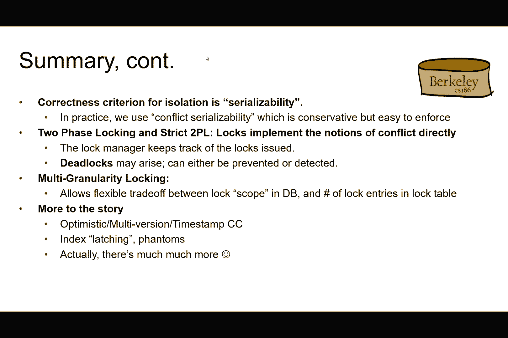
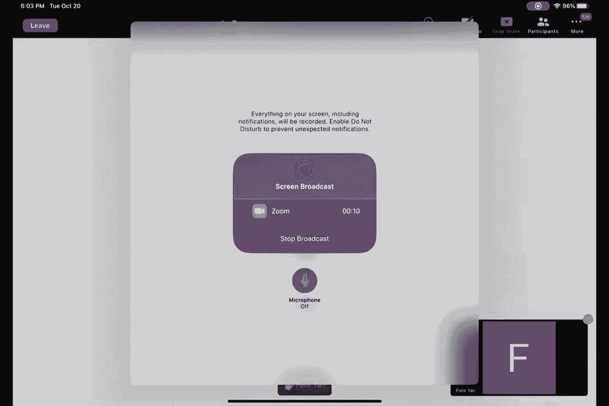
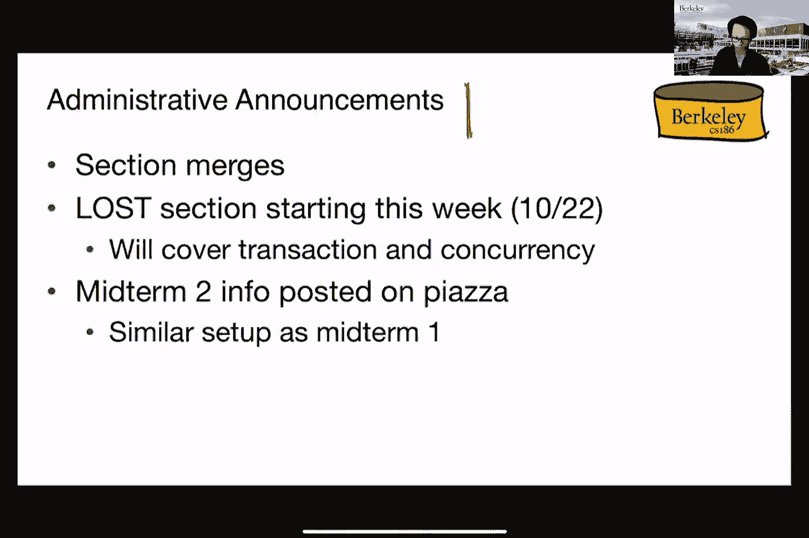
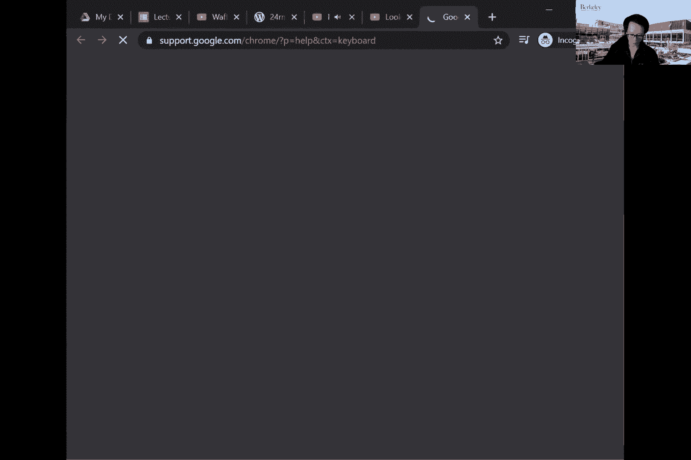
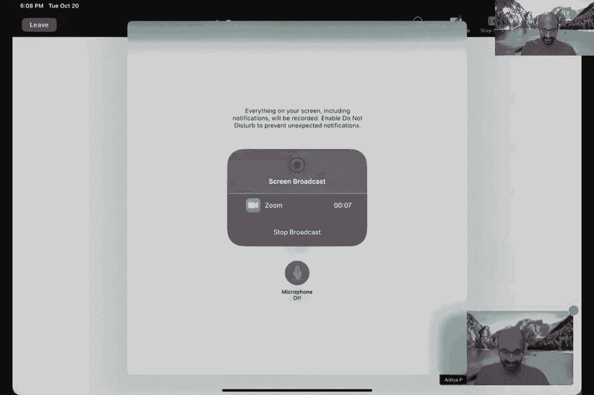
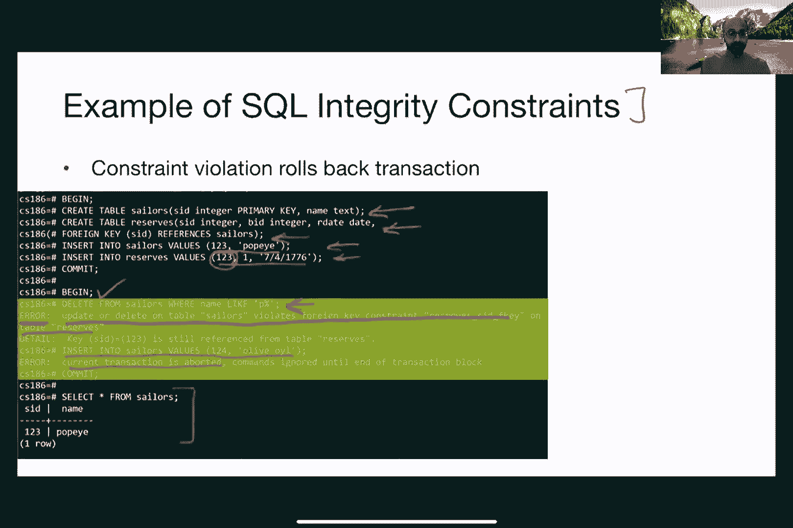
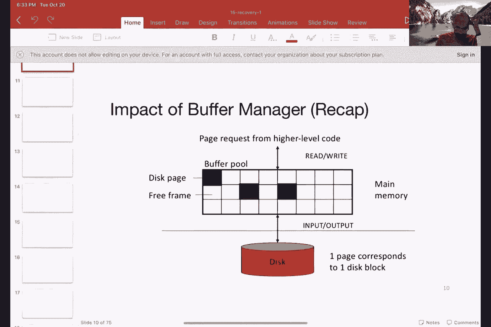
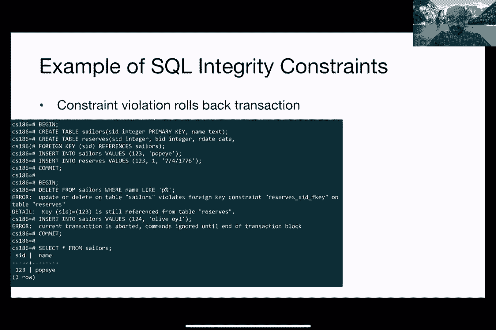

# P16：Lecture 16 Recovery I - ___main___ - BV1cL411t7Fz

 Okay， hi everyone and welcome to the Tuesday lecture of 186。 So the plan for this week is。

 the first finish up of whatever that we have left from last week， from last Thursday about。

 transactions， wrap up the entire section and then we're actually going to move on to talk。

 about recovery。 And then we'll do the announcements in between。 Okay， so first I just want to like。

 revisit what we talked about last week。 I know it has been a couple of days， so like。

 you know some of you might have already forgotten what we have been talking about。 So the topic。

 of discussion has been transactions， right？ Okay， it has been about from currency control。

 Otherwise known as how do we ensure that we allow multiple operations to process it。

 to make progress at the same time within the same database system。 So I did TS portion of。

 the lecture already talked about all these different concepts about like what it means。

 to be running the running a transaction， what does it mean to be a serializable， conflict。

 serializability and all that other good stuff。 And then on Thursday， we started talking about。

 how to actually implement that， right？ So those are very nice concepts to have or many。

 of the things can be made in a in a serializable manner， right， where if schedules can be made。

 to be conflict serializable， then that has a lot of different nice properties。 But how。

 do we actually make that happen in real life， right？ And how do we implement it？ So for the。

 purpose of this class and other purpose of your projects， we basically are going to use。

 lock based implementations， which as you may recall， lock in this case just means exclusive。

 access to a section of code， right？ That is not run by anybody else。 So this is like these。

 are some of the slides that we have gone through on Thursday。 So we basically talked about lock。

 based implementations in this class， even though they are like a wide variety of different。

 implementations out there that you guys have pleased to explore if you're interested。 And。

 in particular， we're talking about this concept of a theta element， because we're talking。

 about what's actually locked， right？ And then as you will see later on， this come in also。

 a whole bunch of different ways we can do this， right？ So we can either lock the entire database。

 which of course guarantees serialize ability， because that basically means only one instruction。

 can make progress at any time。 And then if that instruction is not finished， then nobody。

 else can do anything on the same database。 So therefore， of course， it's going to be serializable。

 But unfortunately， that is going to not be very efficient， right？ Because we're basically。

 blocking everybody else。 Now， we can also lock the individual records， right， all the way。

 down to the only touching the two posts that are records that we need to do that we need。

 to process。 And all of these， you can imagine a spectrum， right？ We can lock a page， we can。

 lock a single table， we can lock a bunch of two posts， so on and so forth。 And then we'll。

 see the difference rate off later on in terms of choosing among different options。 So for， locking。

 we need to talk about what we can do with the locks， right？ You guys have heard。

 probably heard about or remember from 61C where you can grab a lock and then go into a critical。

 section and then run the code within that critical section。 But to abstract all of these， right？

 So for the purpose of 186， we adjust to abstract all the locks to have only two。

 different operations that you can do on it。 Namely， locking it and unlocking it。 That's， it。

 After we've locked something， then we have exclusive access to that particular data， elements。

 whatever that data elements might mean， like the whole database， might be a， table。

 might be a tool pole， so on and so forth。 And then vice versa for the unlock。 We。

 went through a bunch of different schedules， as you may recall from Thursday。 So this is。

 the original one where we wanted it to be conflict serializable。 And then by inserting。

 all these different locks that you see here in the schedule， and then with the corresponding。

 unlocking statements， then we basically guarantee that this is going to be conflict serializable。

 So I'm not going to go through the details again， but then you can also see there can。

 be problems because depending on how things are unlocked， right？ And how， like， you know。

 which lock is actually granted to which transaction we may still end up in a problematic situation。

 like the case that you see here on the screen。 And of course， then once again， the test shows， up。

 So we then discuss what is known as the 2PL or the two phase locking rule， which says。

 that for every transaction， all the locking requests have to precede all the unlocking， requests。

 So you can see why the previous schedule on the， on the previous slide actually。

 violates that particular constraint， because we have started unlocking before the last。

 lock statements。 So this is not allowable per 2PL rule， right？ So this is the rewritten version。

 of the same schedule， except that now you can see we are graphing all the locks before actually。

 unlocking anything here。 Right？ So that works。 2PL works， except that we now have a new problem。

 right？ Which was otherwise known as the non-recoverable schedule。 In this case， the problem is that。

 like your one transaction turns out to roll back or abort while the other one decides to， commit。

 Even if we stick to the 2PL locking mechanism， in this case， we still have the。

 problem of the second transaction here on the right hand side of the screen being able。

 to read something that was made that was changed that was written by transaction one on the， left。

 Now transaction one is a set desire to abort， so therefore we need to somehow unroll。

 or roll back the changes that transaction one has made。 But unfortunately that would somehow。

 need to， we would somehow need to also unroll， right？ Or abort transaction two， because transaction。

 two has seen things that have， that it should not have seen， right？ Does that make sense？

 But unfortunately transaction two already committed， right？ So we're kind of in a weird。

 situation now， right？ Because T1 wants to abort， but we also need to roll back or abort T2。

 you know， because of that。 But then T2 has already committed so we can no longer undo。

 So that's the problem。 How do we deal with that problem？ Well， we enforce another rule。

 known as the straight 2PL rule。 So same thing as before， except that in this case we are。

 requiring that all the unlocks have to have all the unlocks can only be done together with either。

 a commit or abort， otherwise known as the end of the transaction， right？ And you can see from the。

 example that we have on the previous slide， right？ Now doing the straight 2PL thing， in this case。

 we guarantee that we don't have this non-recoverable schedule problem。

 because now we are only unlocking， everything after either a rollback or a commit。

 Does this make sense？ So this also turns out to be pretty easy to implement， because like， you know。

 we basically， just need to insert the locking and the unlock statements at the appropriate places in the。

 transaction and then just let the lock play out， right？ In terms of who gets the lock first doesn't。

 matter anymore， and then we'll be able to do the right thing， so to speak， right？ By ensuring。

 conflict， serializability， and also recoverability。

 But does that mean that is the end of out-trouble？ And unfortunately， that's also not the case。

 right？ And as you recall from last week what I was saying， right？

 I mean transactions or concurrency control is always a story written in blood and， crying， right？

 Or like， you know， tears or whatever， one of those bad things。 Well。

 I guess it depends on which side you're on， right？ Because if you are the banking， transaction。

 right， then you ended up getting free money。 I mean， I don't think you'll be， crying。

 Maybe you'll only be crying in the case of a in a sense of too happy about it， right， or， something。

 But somebody else will be in trouble， okay？ So let's put that right， right？ Right？ So。

 what is the problem now？ Right？ The problem now is we can stick with strict to be out， but then now。

 we have this problem of deadlock。 So deadlock in the sense that nobody， none of these transactions。

 can actually make any progress， right？ So here we have T1 holding on the lock to A and then。

 waiting for B and then T2 waiting for B， holding the lock on B and then waiting for A。 So need a。

 transaction can make progress。 We have a problem。 So that's kind of like where we stop， right？ So。

 we were talking about， okay， now we have a deadlock。

 Basically three things that we need to learn about。

 First is how to prevent it from happening altogether。 If so， that's great， right？

 The second one is if we cannot avoid it， as in we will have deadlocks， how do we deal with it？

 How do we detect it？ And how do we get rid of it？ So basically those are three things that we talked。

 about。 The first one preventing is easy。 One way we can do that is by basically setting up an。

 arbitrary order on how things are like， you know， on the ordering for which each of the transactions。

 can grab the locks， right？ So I can arbitrarily say that。

 So just using in this case an example from， 162， I can arbitrarily say that like， you know。

 the screen has preff has priority over network， card and over printer。

 So therefore if the screen is trying to grab the lock on the same thing that。

 the network card is trying to grab， then the screen always wins。 Completely arbitrary， right？ So no。

 I have no reason why the printer has to be like your last， you know， in terms of priority。 But at。

 least that solves the problem because we will no longer get into a deadlock situation。 The， problem。

 however， for us in 1986 is that how do we impose an arbitrary order on a bunch of tables。

 and two posts， right？ We don't have fixed devices that we deal with， right？ We have all kinds of。

 tables that people can create。 So like it's hard for us to arbitrarily impose an order without knowing。

 what tables or what two posts are going to be involved in a query。 Okay， so if we cannot avoid it。

 then let's try to sorry， if we cannot prevent it completely， then let's try to avoid it by being。

 able to detect and then being able to deal with the situation when it arrives。 How do we do that？

 Well， so one way of doing that is use this notion of an age of a transaction。 Basically， the amount。

 of time that has been spent on that particular transaction。 And then every time we detect a。

 deadlock， which I'll talk about on the next slide， then we have a couple of options。

 The first one that， you see here on the top here， right？ So again。

 this is the stinky example that was using last week。

 about people going to the restrooms is to basically either have the older transaction。

 older in this case in terms of the time that it has taken to process it to wait。 And then if it。

 turns out that the younger transaction is going to wait， then just kill itself。 Killing itself in。

 this case just means like， you know， go back to the end of the line and then like， you know。

 start waiting， again。 Right。 Why does this prevent deadlock？

 This prevents deadlock because we don't have a sick， click situation anymore。 So it's not like。

 you know， the old transaction needs to wait for the， younger one。

 And then the younger one have cases where it needs to wait for the older one。 Right。

 Because in this case， because of this dire situation， right， anytime when the young， situation。

 when the younger transaction needs to wait for the older one， it always just kill， itself and then。

 you know， wait， go back to the end of the line。 So therefore， we prevent the cycle， from happening。

 The older transaction always wins， right， in this case。 Unless like， you know。

 someone's already in the bathroom。 So the older transaction also has to wait in that case。

 And then another one， right， is basically the other way around。 So， you know， or actually not the。

 other way around， but like another way of doing with this deadlock situation， right。 We can have。

 the younger transaction wait。 And as in this case here， and then if the older transaction actually。

 needs to use the bathroom， just kill off whoever that is in it。 Right。 As a not clear example。

 I know， right， but then like， you know， at least that gets the cycle broken。 Same idea。

 So we now have the， younger transaction always wait。

 but then the older transaction will never needs to wait， right。

 because as soon as it needs to use the bathroom or grab a lock， it's always going to win， right。

 So therefore， that's not going to be an issue anymore。 So we again avoid the problem of。

 needing the older transaction wait for the younger one， while the younger one may also need to wait。

 for the older one and other circumstances。 Does this make sense？

 Are there any questions about this so， far？ So Nicholas is asking wouldn't wait， died possibly。

 resound in a transaction repeatedly， killing a self consuming cycles。 Yeah。 So in this case， I mean。

 we only guarantee that block avoidance， right， we didn't guarantee progress。

 So it's definitely going to be the case， it might be the case that。

 the young transaction is just going to repeatedly go back to the end of the line。

 go up to the party， and adjust to see that the old transaction is still being processed。

 So therefore， I'm just going to， kill myself again， and then go back to the end of the line， right。

 That can totally happen， but unless， like， you know。

 the old transaction is going to take up forever， enough finishing is business， right。 So you speak。

 otherwise， eventually， the newer， the younger transaction is going to keep。

 being able to get the lock， right， or in this case， being able to use the party。 So therefore， like。

 you know， it will eventually make progress that way。 But then you're right， in the meantime。

 you know， it might， we might be spending a lot of time just like， you know， waiting in line。

 getting back and lying， and then， you know， killing myself and then going back and lying just like。

 just to do the same thing again。 Okay。 Not funny in real life， right， but like， you know。

 in the transaction， well， I guess we can tolerate a little bit of this kind of churning， okay。

 Great。 So now also， we also talked about like， you know。

 how to detect a deadlock from the beginning。 And then one way of doing that is to use something known as a wait for graph。

 So I'm not going to repeat， the entire concept here。

 but it's basically a graph that talks about which transaction is holding。

 onto the same block that another transaction is trying to graph。 So in this case， for instance。

 we have an， we have an etch or an arrow here between T1 and T2， because T1 is trying to read。

 the data element B， but then T2 is currently holding onto that block， right。 So there's an arrow。

 between T1 and T2。 It's very similar to the dependence graph concept， which you may recall， right。

 from a DTS lecture。 But in this case， we are basically annotating the graph with an arrow。

 every time when there's a locking situation between two transactions。

 And then if there's a cycle between， in the graph， then we have basically detected a deadlock。

 And then I already talked about what， you have to do with that on the previous slide， right。

 when such a situation happens， okay。 And then just as an empirical fact。

 these deadlocks tend to be small。 So it usually doesn't involve a， lot of different transactions。

 So therefore， even if we have to kill off these transactions， they're a newer one。

 they're the newer transactions， we might not need to actually kill off a lot of them。

 empirically speaking。 Although， of course， you can construct an apathylogical example。

 where we have， a huge cycle of like tens or even thousands of transactions。

 But I would just say that that， turns out to be relatively rare in practice。 Okay。

 So that log is bad， and we want to avoid it， but another way of actually trying to avoid it is actually look at the situation where we really。

 need to have a deadlock。 An example is what if all the transactions are actually just trying to。

 read the same data elements， let's say a tuple。 If they're all reading， then even though like。

 you know， they're reading the same thing， as long as what none of them is actually writing to the。

 same tuple， we can actually let all those transactions make progress， right。

 They can still keep reading， it。 I mean， as long as no one is writing， that's fine。

 But then in the previous slides， then we， will be basically trying to grab blocks and then like keep。

 we basically have to keep waiting on them， right， because only one transaction can read that element at the same time。

 So to implement that， idea， one way to think about that is to basically have different types of logs。

 So now we are getting， fancy， right？ So we're moving beyond like， you know， strict to be out。

 we're moving beyond like， you know， having having like， you know， deadlock detection。

 all that stuff。 So all that is basically， under us now。

 So now we are talking about how to be more efficient。 We can be more efficient if。

 we have different types of locks to begin with。 So let's say we can have a lock that transactions。

 can get for just reading a data element and an exclusive lock for writing it or writing to the。

 same data element。 We're going to， you know， play with play by strict to be as I said earlier。

 right。 So， you know， nobody is like， you know， we have to adhere to the locking and the unlocking mechanism。

 But then I claim that with shared locks， multiple transactions can make progress now， as opposed to。

 needing to wait for one another。 In the case， let's say they're just trying to wait， but not right。

 to that data element。 But then now the problem is we now have different types of locks。 So how。

 are they compatible？ So to do with that， we invented something known as the lock compatibility matrix。

 The way to read that is to basically say that assume one of the transactions has grabbed a。

 shared lock on a data element， and then a new transaction shows up and tries to grab the same。

 shared lock on this on that element。 And by this matrix， having a checkmark basically means we。

 are going to grant that request。 And you if you think about it， it makes sense in real life， right。

 because in this case， we have two transactions trying to read the same data elements。 So they。

 should both be able to proceed， right。 Does that make sense？ So of course， the question then is。

 like， you know， why is this a， why is there a cross here？ Well， think about what this， what is the。

 real life situation that corresponds to， right， this corresponds to the case where one of the。

 transactions tries to write the same data element that another transaction is trying to read。

 So we cannot allow that， right， because if so， then we break serializability by doing so。

 So therefore， we are not going to allow that lock to be granted in that case。

 And the same situation happens vice versa， right。 So it doesn't matter who already has。

 whether like， you know， the first transaction has the exclusive lock or the first transaction has。

 the shared lock。 It doesn't matter。 So we're just not going to grant the second request for the lock。

 Cool。 So you might ask the question， right。 So how are these locks actually implemented in practice。

 right。 How are they actually who is keeping track of all these different types of locks， right。

 So it turns out in the database system， we have something known as the lock manager。

 which basically does this。 And inside the lock manager is basically a hash table based on the。

 names of the objects being locked。 If the names of the， if the objects here are tables， then we。

 have one row for every single table。 And if we are talking about two posts and we have one row for。

 two pull。 And then the lock manager keeps track of who currently has the lock and what are the。

 transactions that are currently waiting for it。 So you see an example here。 So we have two data。

 elements here， A and B。 And then the grant is set here basically talks about like， you know。

 which transactions are currently granted access to that data element。 So you can see that on the。

 in the first row， we have two transactions having granted the shared lock versus on the second row。

 we have a one transaction being granted the exclusive lock。 The weight queue is basically。

 just talking about who are the other transactions waiting for it。 So you can see that transaction。

 three is trying to grab the exclusive lock on A。 But since like， you know， two other transactions。

 currently has to share lock by the compatibility matrix， we cannot allow that to happen。

 So therefore， we have to wait， we have the weight queue here。

 basically having everybody else line up。 So when a request arrives at the lock manager。

 it basically checks this hash table to figure out， whether we can allow that request to go through。

 If nobody is holding on to any locks of that data， element。

 then we can just insert that into the grantor sets and then let it move on with this， business。

 If not， then we just like， you know， have it put in the queue。 And then you can also。

 imagine upgrading a lock， right？ So if I already have a shared lock， and then， and then now if I。

 want to actually write to the same data elements， then I need to basically upgrade my locking。

 my lock， right， to be the exclusive one。 And it's the exact same mechanism。 So you can， like。

 you know， imagine how you can resolve that too。 And basically look at the weight queue and see。

 like， if anyone is trying to grab the exclusive lock or already holding the exclusive lock on that。

 And then based on that， we can figure out whether we want to grant the request。

 Any questions about this so far？ Yeah。 Yeah， Nicholas。 Oh， sorry。 I just had a question about。

 do those policies like weight， die and wouldn't wait。

 do they still apply those when you have multiple lock modes？ Great question。 Yeah。

 you can still apply that if you have the same， if you have different lock， modes。 And of course。

 like， you know， in this case， we only used to apply that when。

 when one of the transactions is trying to grab an exclusive lock， right？ Because if everything is。

 all the transactions are just trying to grab a shared lock， then we just let all of them have it。

 That's fine。 So the only situation that we need to do with that is if someone is trying to grab an。

 exclusive lock on a data element where there's already a previous transaction that is already。

 holding the exclusive lock or holding a shared lock on it。 Thank you。 Question。 Great。 So you might。

 think all of our troubles are solved， right？ Well， it turns out that there's still another problem。

 So now we're not talking about correctness here， right？ We're talking about， we're talking about。

 efficiency。 So this is a typical graph that you see when people try to plot the number of transactions。

 against throughput， which is a measure of how many transactions are processed per second。

 So obviously， higher the better， right？ But you'll basically see at some point that， like， you know。

 the performance starts to drop。 And the reason why that is the case is because the more transactions。

 we have， then the higher chance that they will be waiting for each other on these locks， right？

 Doesn't matter whether it's exclusive or shared or whatever。

 It's just a matter of the number of locks， that are out there is going to or like being induced。

 right？ Or being weighted on is going to， increase as we have more and more transactions。

 So you get into something that is threshing， right？ I mean， so， you know。

 you start hearing your fan comes off， goes off， right， on your laptop， for， example。 So that's bad。

 So how can we mitigate this problem？ Right？ One way of doing with that is to。

 basically do something known as granular locks。 So this basically goes back to the discussion about。

 like， you know， at what level should these data elements be， right？ We may talk about locking a。

 data element。 Should they be at the individual tuple level？

 Or should they be at the entire database， level？ So if there's only one lock for the entire database。

 then， you know， we don't have that， we won't have the threshing problem because there's only one lock。

 but then we basically kill off， efficiency。 So therefore。

 we can only process one transaction at a time， right？ And then if we have， a lot of different locks。

 right？ So imagine I have one lock per tuple， and I have a million， to oppose in a table。

 So we're talking about potentially a million locks being in use。

 and wait for and then kill it off and die and all that other stuff， right？ So part of that is。

 going to contribute to this threshing problem that was talking about on the previous slide。

 So now the question becomes， can we actually try to change this granularity， right？ Because if。

 there's a whole wide spectrum between like what types of locks that we can offer， then that might。

 be a good solution to this problem here。 But it's kind of hard to decide a priority about like what。

 to lock， right？ Because there are different levels that we can lock things， but then。

 and we already， understand that there's a trade-off between whether we want to thrash or we potentially run。

 through threshing， or on the other hand， only have like one transaction of progress at any point of。

 time， right？ At any point in time。 The question then is like， can we actually have both？

 Somehow we want to be able to grab locks at different levels， and then still be able to， like。

 you know， avoid the problem of thrashing by dynamically choosing at what level we want to grab all these。

 different locks。 So that's the problem set up。 So the way that we're going to solve this problem。

 as I said， is by basically having different types of locks at different levels。 So let's define a。

 hierarchy of different granularity。 We have two posts nested within a table， and we have tables。

 nested within the database， for instance。 If we have a hierarchy of these different data elements。

 then we can represent things as a tree， and then we can now try to grab locks from the topmost level。

 all the way down to the individual tuple as needed， right？ So now when we try to， in this world。

 right， of a hierarchy of locks， we need to have a discipline in terms of what does it mean when。

 we try to grab a lock in this world。 So I'm just going to arbitrarily make the decision that if we。

 lock a node in this tree that I'll show you in here， then we're basically just implicitly locking。

 everything in terms of its descendants。 So just to check our intuition。 So if I grab the lock on。

 the entire database， basically the root node， that basically means I'm grabbing the lock on。

 everything in this tree， all the tables and all the tuples。 And then if I'm grabbing a lock on。

 let's say， one of these pages here in a table， then I'm implicitly also grabbing the lock on each。

 of the individual tuples that you see here as descendants。 I'm not actually explicitly grabbing。

 the locks on those tuples， right？ Because if we ended up doing that， then we might as well just。

 have like lock per tuple。 But we're just basically making up this hierarchy， such that when we grab。

 a lock at a high level， it's just going to be implicitly meaning that we'll also grab the locks。

 at the lower level as well， even though we're not doing that explicitly in the code。

 Does that make sense？ Yeah， so we now have like different types of different types of binary， right。

 when we try， to lock anything in the in the street。 So if we try to grab locks at like， you know。

 the lowest level， so for example， the tuple level。

 then we might have a lot of overhead or we might even run into， a threshold， right。

 the same problem as before。 And then if we grab locks at a higher level。

 then we can potentially avoid other transactions making progress by doing so， right。 So we're。

 basically losing concurrency。 And in the real world， you will see， like， you know， there are。

 actually many different levels of locks。 So on the previous slide， I've only shown you， like。

 you know， a hierarchy of like， you know， four different levels。 And we're where there are actually。

 many， many different levels of locks that you can grab。 And then it all depends on like the。

 different implementation。 But now with this new idea， we still need to talk about like， you know。

 how are we going to grab the locks in this case， right？ We have lots of different level。 And then。

 with the understanding that if I grab a lock at the higher level， then all the locks at the lower。

 levels are also also grabbed as well， right， that is the understanding。 But then how do we tell。

 all the other transactions， which lock we want to grab。

 So the solution to that problem is to invent， yet another type of locks。

 known as intention in 10 blocks， basically。 The understanding is that。

 before grabbing a shared lock or an exclusive lock， a transaction must obtain all the intent， locks。

 right， on the ancestors in this hierarchy of locks。 For example， if I want to grab a lock。

 at the page level。 So notice in this case， I'm grabbing a shared lock at the page level。

 I first need to grab a intent lock at the table level and also at the database level。 Again。

 the understanding is that if I have an intention lock， it basically telling other。

 transactions that I am going to grab a lock somewhere lower in the tree hierarchy， right。

 So if you look at the first lock here that I've obtained， right， the intention lock on the database。

 it's just basically telling a transaction that， hey， look， there's someone at work here， right。

 And someone at work here at the lower level， the hierarchy somewhere。 So just to make sure that。

 like， you know， you know something is going on， right。 So basically， basically。

 they're now going to， be three different lock most。

 complimenting the shared lock and exclusive lock that we have already， talked about earlier。

 There's the intent to get a shared lock at a lower level in the tree， otherwise。

 known as final granularity。 There's the intent to grab an exclusive lock。 And then there's also。

 getting a shared lock and getting an intent to grab an exclusive lock at the same time。

 So we should understand SIX is basically getting a shared lock plus getting the intent to get an。

 exclusive lock。 So why do you think that would be useful？ Any guesses about like。

 why do I want to grab a shared lock， but also try to grab an intent to。

 an intent for an exclusive lock at a particular level in the hierarchy？

 You could be like reading and writing。 So like， you want to use shared lock for reads and then。

 the writes， like the IX， the right， the X-s。 Exactly。

 So a bunch of people also mentioned that in the， chat， right。 So yeah。

 so you might be reading something and then later on decide to actually。

 grab the exclusive lock on it， right。 A good example is like， you know， something like。

 I want to read， all students with name， first name， Alvin， and then gives them an A in this class。

 right。 So you first want to read the students， right， but student names。

 and then you might actually， end up like， you know， changing a record in that hierarchy of the tree。

 Okay， yeah， people are， changing names now。 Okay， cool， right。

 So like now we're getting a little bit more fancy， right， because now we have different lock modes。

 like we not just have shared and exclusive， we also have， these kinds of different intention locks。

 So the question then becomes， how do we reason about， what lock is compatible with what？

 So the basic thing I would do in this case is think about how。

 they would interact in the case where there's no intention lock。 And then you can， you should be。

 able to reason about like， you know， how to actually fill up this compatibility matrix that I'm showing。

 you on this， on this slide here。 So I'm going to claim the following。 So I want to say that if I。

 want to get a shared lock on a particular note or intent to share lock or intent to， yeah， to grab。

 a shared lock， then I must hold an IS or an IX node on a parent node。 And then if I want to get an。

 exclusive lock， then I must hold either an intent for exclusive lock or an SIX node as an SIX lock。

 on the parent node。 And then I'm going to release locks in the bottom up order。 So， and then again。

 right， we're going to do like， you know， two PL or straight 2PL just like before。

 I claim that this protocol is correct。 If we basically follow this particular mechanism of。

 when to act， when what kind of locks are grabbed， and then when to actually release them。 Look us。

 you have a question。 Yeah， I'm still confused on the purpose of intent locks， like， why we do them。

 Yeah， so the purpose is basically we want to be able to allow multiple transactions to make。

 progress at the same time。 We want multiple transactions that are not interfering with each。

 other to be able to make progress。 Right。 So if you go back to the previous example of the hierarchy。

 so for instance， if we only have one single lock at a database level。

 then I'm basically killing off， all concurrency， right？ I do not allow any other transaction。

 The only one transaction can make， progress at any given time。 Right。 But then if I grab lock。

 if I only do locking at the lowest level， right， in terms of the tuple level， then， you know。

 I might end up in a thrashing or deadlock situation， because like， you know。

 all the transaction trying to grab locks and then nobody can also make progress。

 And that's the case。 So why does it thrash if you only lock at the lowest level？

 Because if I have a lot of two posts， then there are already a lot of lock objects， right？

 So remember， each lock is unique， right？ It's a separate variable。

 So we'll have a lot of transactions， track， checking all these different locks， right。

 which may or may not be currently held。 And then just the checking， just running all the checks。

 right， already consumes CPU， as opposed to actually doing real work on the data。 Thank you。 Yeah。

 So then the idea is， wouldn't it be nice if we allow transactions to grab locks at different levels at safe needs。

 right？ So that's where the similarity thing。 I did。 Yeah。 Yeah。 I'll just add to that。 So Lucas。

 if you imagine， let's say you have one transaction。

 let's say it didn't grab intent locks down the hierarchy， it just directly went and locked。

 leaf element， right？ Now you have another transaction that wants to do something to the。

 entire database， right？ Let's say you want to change the scheme of the database。 Now that。

 transaction needs to know that there is someone at the leaf doing some change to a specific tuple。

 so that they can coordinate their accesses， right？

 So the database system can coordinate their accesses。

 having this intent at various levels of the hierarchy allows that coordination to happen more。

 seamlessly。 Does that make sense？ Yeah。 Thank you。 Okay。 Great。 So as I said， right？

 So we need to now figure out how to lock， when to what kind of locks， to grab and when。

 and then I'm just going to go with this protocol here。 If I want to grab a lock。

 at any one of these levels in the hierarchy， I must have intent locks on the higher levels in the。

 hierarchy。 And then same thing also goes with the difference between a shared lock and an exclusive。

 lock。 The question， however， is how should this lock compatibility matrix actually looks like？

 So for instance， if someone has an intent to， has an IS lock and if another transaction。

 tries to grab the Ix lock， let's say， you know， for that particular note in the tree， should we。

 allow that to proceed or not？ And the reason about that， as I said。

 think about what should happen in， a case where we have two tuples and like， you know。

 a single page， for example。 Okay。 So let's say in， this case。

 we want to reason about whether Ix lock is compatible with the Ix lock at the page level。

 for instance。 What does this mean？ Right。 So if you follow the previous slide， someone grabbing an。

 IS lock， right， on a page basically means that I'm going to grab a shared lock in one of the two。

 posts within that page， right？ Based on our protocol。

 because if you need a shared lock on any one of， the two posts。

 then you must already have an IS lock in the higher level， right？ So for example。

 the page containing the tuple。 And then similarly。

 if I want to grab an exclusive lock on one of the， two posts， then， you know。

 by the convention on the previous slide， then I must already have an Ix， lock， right， on one of the。

 on the page that actually contains that tuple， right？ So in this case。

 should we allow this to happen or not？ So should we allow one transaction to have a shared lock on。

 the tuple and then have an exclusive lock on another tuple that resides on the same page as the first。

 one？ Is this allowed？ What do you guys think？ Yes， right？ It's not a trick question， by the way。

 right？ I mean， I'm basically saying that two transactions are trying to touch two different。

 two posts， and they're trying to grab the locks on it， right？ One has a shared lock because it's。

 reading it。 The other one has an exclusive lock because it's writing it。 Well， I mean， these two。

 two posts are different anyway， so it doesn't matter whether they're writing or reading， right？

 But that basically means we can have the IS lock and the Ix lock be compatible at the page level。

 right？ So remember， this IS and this Ix lock is at the page level， not at the tuple level， right？

 So it basically means that we can allow the IS and the Ix lock to be both granted at the。

 same time on the same page， right？ And likewise， of course， on the same table， right？ And also。

 likewise， of course， in the same database。 Does that make sense？ So if you don't know what I mean。

 right？ So reason about this， as I said， right， by looking at， the tuple， single tuple level。

 and then try to come up with a scenario where like， you know。

 you can see which allowed that request to be granted or not。 And then the fundamental way to。

 reason about that is to think about whether we can allow something like this to happen， sorry。

 whether we can allow a situation like this to happen， a shared lock on one tuple and an exclusive。

 lock on another tuple， right？ So now let's say I want to reason about whether two Ix locks are。

 compatible。 So think about what situation would that correspond to？ So that would correspond to。

 having the exclusive lock by one transaction on T1 and then having the exclusive lock by another。

 transaction on T2， right？ And since those two tuples are completely separate， that situation。

 should be allowed， right？ So that basically means the Ix locks should be compatible with another Ix。

 lock request on the same page。 Not the same tuple， right， on the same page。

 so that's something that， you need to remember。 Any questions about this so far？ Well。

 so one parent note can have multiple intent locks， right？ Yeah。 And for let's say that you're。

 trying to read two different tuples in one page， would you only need one Ix lock or would you need。

 two separate Ix locks for each tuple？ One， so wait， sorry， page or tuple？ So yeah。

 you're trying to read two pages， two tuples within the same page。 And so for that page， itself。

 would you only have one Ix lock for both pages because you're only reading both？ I said for。

 both tuples。 Yeah， so there's only one Ix lock at the page level， just like there's only one lock。

 at the tuple level。 So each lock has its own lock， sorry， each tuple has its own lock。

 each page has its own lock， and each table has its own lock， and each database has its own lock。

 Okay， thank you。 So we're now talking about whether we should grant a Ix lock request for the same page。

 while some other transactions already holding on to the Ix lock of the same page。 So does that。

 mean like the maximum number of locks that a parent note can hold is three or like isix and， six or？

 Well， it basically means so it's the same thing， it's the same thing， right？ So each。

 page currently would have like a locking table like what I was showing you on the previous slide。

 and then it will basically show which transaction currently has what type of lock on that particular。

 page。 Some transactions would have the is lock on that page， some transactions would have the Ix。

 lock on that page， for instance。 But can you can stack different like the on the right side of the。

 screen， you wrote the the page has both an is and an Ix lock？

 Is it possible to have both of them plus， the six and lock the six？ Oh， you tell me， right？

 So you're now basically asking the question of whether， this what should happen in this case， right？

 And I try to reason about that， right？ So let's say。

 if I have some transaction already having the is lock and another transaction having an Ix lock on。

 on page P， and then a third transaction comes around and say， Hey， I want the six lock on this page。

 should we grant it or should we not？ Right。 So I'm claiming yes， because you can see that there's a。

 true in this box here。 And then there's a false in this box here basically， that means if some。

 transaction already has an Ix lock on that page， then we cannot allow an six lock request to go through。

 Okay。 And so then that table shows that if you were to have those kind of locks in a parent。

 know what other locks can exist with it。 Yeah。 Okay， thank you。 Yeah， that's why this is got a。

 lock compatibility matrix。 Oh， so this is you might think， okay， we have five different locks。

 and that's already like， you know， scaring the heck out of me， right？ Like， you know， I have to。

 reason about 25 different entries。 I use， are you serious， right？ I mean， try to reason about this。

 This is kind of like what happens to the real world， right？ So like， you know。

 there's definitely way more different types of locks that you can get。 And of course。

 the matrix just like， you know， keep expanding。 So therefore， like， you know， it's to be able to。

 reason about that too， right？ But fortunately， if you did your homework， right， right。

 then you just， basically need to reason about each box once。 And then it。

 and then this matrix is also symmetric， across the diagonal。

 So it's basically mirror image of one another。 So it just needs a reason。

 about half of this gigantic table， not the whole thing， if that makes you any happier。 Okay。

 so like， you know， that would happen the end of the story， except that we still have。

 yet another problem known as the phantom problem， right？ And I think that's a good timing。

 because in， 10 days we'll have Halloween。 It has nothing to do with that kind of phantom。

 unfortunately。 It's much more boring in that sense。 So the problem is the following。 So so far。

 we have assumed， that the database is basically a static collection of two books。 Nothing's changed。

 right？ We're not， inserting， we're not deleting things actively。

 So if we start to insert and delete things as part， of a transaction。

 then this problem will show up。 What does this mean？ Here's an example。 So I have。

 two transactions here。 The first one trying to select all the blue products， and the second one。

 tries to insert a new blue product。 And then this first transaction for whatever reason decides to。

 reissue the same query again， right？ So let's first ask the question， is this schedule serializable？

 The answer is no， because T1， right， actually sees a new product that is being inserted。

 known as A3， right？ So this is not equivalent to any way you can order like your T1 to be。

 fully executed before T2 or vice versa。 So therefore， this is not a serializable schedule。 Now。

 the question is， is this actually a conflict serializable schedule？ And if you remember from。

 a DTS lecture， the way to do this test is to basically try to reorder the operations that are。

 involved in the two transactions here， and then see if we can reorder it to a point where all。

 the operations from T1 precedes all the operations from T2 or vice versa。 So here。

 I'm assuming that， there are existing two blue products in the database。

 otherwise known as A1 and A2， and then A3 is the， new product being inserted by T2。

 So at this point， this is not a conflict serializable schedule， right？

 Because we have operations intermixed between T1 and T2。 But then since A3 has nothing to do with。

 A2 or A1， by the rules that DTS went through in the lecture， we are actually allowed， right？

 To shift， A3， the operation namely the right to be before the read operations on A1 and A2。

 Therefore， moving， all the operations from T2 to be before T1。 So therefore， by like， you know。

 the lecture that we， had earlier， this is actually conflict serializable。

 But we still know that there's a problem， here， right？ So this is not good。

 So either that means this notion of conflict serializability has。

 an issue or basically that means a DTS has something wrong， right？ So we can't use this， definite。

 we can't use this text， right？ Now， of course， like， you know， he was right。 So like， you know。

 this test does actually allow us to do conflict serializability checks。 It's basically。

 just that's when we are now talking about things that are inserted or like， you know， deleted。

 within a transaction， then this phantome problems happens and conflict serializability no longer。

 holds。 And that's a boomer， right？ Because like， you know。

 we were hoping that this is going to help us， but well， kind of all that's a loss。

 And this is a problem when we have these kind of dynamic。

 transactions that are not just reading or writing a single element or existing elements。 We are。

 talking about cases where transactions are inserting and deleting things。 So that's bad。 Okay。

 so how do we deal with these phantoms？ Quick solution。 Just lock the entire， you know， table。

 Slock the entire， like， you know， freaking table， right？ So that's great。 So if we just lock。

 the entire table that nobody can make progress， that also means， right？ Like， you know， you can。

 insert and delete all you want， no more phantoms。 But we already saw that that's bad， right？

 So let's， try not to do that。 Another way we can do that is like， you know， if there's an index。

 then we can， lock the index instead， right？ Because if there's an index。

 then we're trying to insert into it。 That basically means the index is going to be outdated。

 So if someone is trying to read by looking， through the index， then like， you know， that process。

 that operation will be blocked， right？ So we'll be able to prevent the problem that was talking about earlier。

 Or you can do something， known as pedicant blocks， which basically says I'm going to first run。

 first do a drive run， of figuring out which two posts am I going to read？

 And then once I figure out the set of two posts， I'm going to read。

 I'm going to grab the locks on those two posts before actually proceeding， with the actual read。

 So I'm not going to go through the details here， but you can already。

 imagine that dealing with these phantoms。 It's just very expensive， right？ Because neither of these。

 solutions is as clean or simple as the ones that we have talked about earlier in the class。

 But if you are doing of a situation where there are transactions that can be inserting or deleting。

 things into the database， then this is the problem that you might need to deal with。

 Or you might just say， you know， heck， I don't care。 I'm not guaranteeing that you might。

 you may not see phantoms。 I mean， you may see phantoms in this database I'm implementing right now。

 so tough if that's the case， right？ You can also tough it out too。

 So I leave that to be your choice。 Okay， so that's all I wanted to say。 So as a summary。

 we basically talk about different types， of serializability in these set of lectures。

 And then we talked about different ways to actually。

 deal with or ensuring that we have a conflict serializability。 Make sure you understand the。

 difference between them。 And then at the very end， we talk about this notion of。

 phantom problem or dynamic database where conflict serializability no longer holds。

 And then overall， we talked about like this correctness notion of what it means to be serializable。

 And it's something that many systems provide as a way to make sure that the asset property is。

 preserved。 We talk about using locking as a way to ensure this serializability。 And by having。

 different schemes or different protocols for when to grab the locks and what kind of locks to grab。

 we can ensure serializability to go through。 And then we also talk about efficiency aspects。

 and how to mitigate thrashing if it ever arrives。 And the way to do that in this class。

 we talk about using having locks at multiple levels of granularity。 And then as I said， right？

 There are many other different kinds of currency control mechanism that doesn't use locks。 So you。

 might also want to look into that if you're interested。 And we can also talk about that。

 offline if you are if you would like to know more about those as well。

 And that's all we want to say for transactions for now。 Later on at the that the final part of。

 this course， we actually want to revisit all the transactions that we've been talking about in the。

 context of parallel databases。 Otherwise known as how do we run transactions when we have multiple。

 databases going on at the same time。 But for now， I'll stop and then let you guys ask questions while。

 I did the prepare the next part。 Felix。 Yeah， so earlier， there was a statement。

 they're saying that a transaction must like obtain all intent locks on all its ancestors before you。

 can get it。 That seems to be like this。 And then there's the other part when we were discussing like。

 the lock compatibility matrix， where we like， you know， had the example of we have two transactions。

 and they had like intent locks as an X on like the page level， but they were operating on like they。

 had their individual SNX locks on different tuples。 So in that case。

 like what what comes first when。

 like a transaction wants to get an S or X lock is it like does the transaction first like try。

 obtaining all the intent locks first and then once it gets to like the you know。

 the object it wants。

 then it gets the S and X lock there or like is it possible for a transaction to like basically grab。

 intent locks， but then at some point it's impossible for to actually grab the S or X lock that it wants。

 Yeah， great。 So I don't have the screen anymore， but I think there's one clear slide that we'll talk。

 about the order for which these lock has to be grabbed。 So if you revisit that slide， or basically。

 tell you that you need to grab the lock from the highest level in the hierarchy before you can move。

 on to the lower one。 It's not an arbitrary order because exactly of the problem they've mentioned。

 right？ So you can grab all the intention locks that you want until you get to the final point for。

 which you might realize that oh somebody already has the exclusive lock on the same tuple that I'm。

 trying to grab the lock exclusive lock on。 And at that point， we just basically stop， right？

 Or we just wait。 So the order for which you need to grab the lock definitely matters and you basically need to do。

 that on the topmost level on the hierarchy and then release the locks in the reverse order。 Got it。

 So even in like， so in the example， we were like constructing like an example of。

 like proving that like， well just showing that like you can have an Ix and an Ix lock。

 there is still the possibility that like a transaction has the Ix lock but it just doesn't。

 actually have the S or X lock on the t-shirt。 Yeah。 Okay。 Thank you。 Yeah， sure。

 Any other questions？ Yeah， I asked that in the chat but since the hash map and the tree are also accessed by different。

 threats when you know their concurrency happening due to do data structure also has to be locked。

 Yeah。 So the typical way of doing that is by basically having the lock manager control all。

 these different requests coming in。 So there's one component that is receiving all these requests。

 and then you can think of that as basically having a line of different requests that needs to be。

 certified and lock manager and lock manager basically have exclusive access to the hash table of the。

 different locks。 So the lock manager basically has to be serialized or like single thread。

 single thread。 Yeah。 Okay。 Thank you。 You can have multiple。

 thread lock manager but then you still have to have a locking mechanism for each of the rows。

 in the table， right？ So that's no two threads actually trying to manipulate the same lock at the same time。

 Cool。 Thank you。 So I think we promised a scratching break。

 I don't know if we should still do that or， like， you know， why don't we take a couple of minutes。

 And I think we are still looking for， TikTok or whatever。 Cat， Jiff's。 Well。

 so I think we do have a number of answers and I think， we just played them now and then like， okay。

 let's do it。 Okay， then you should， you should just like， okay。 The end mine。 Right。

 So you guys be like， judge about like， you know， what any of these。

 is fun and like， you know， they're relatively short， unfortunately。 So I don't know。

 So this is one of。

 the things that we've received。 As literally just that， right？ Okay， great。 And then let's see。

 We have another entry here with a Jiff。 And I guess talking about three efficiency。 That's great。

 This one， I guess is more fun。

 Can I close cage driving？ Oops。 And then there's actually sound。

 I'm not sure if you can actually hear。

 Okay， let me replay that again。

 Yeah。 Okay， I hope that's not how you guys are feeling right now。 I don't know。

 And then the last one is the question on midterm to is how is this relevant to our class？

 Not sure what that means。 Okay， so that's it。 Well， so as I said， right？ I mean， like。

 we are still soliciting new videos。 I mean， if you guys want to take a break， I mean， like。

 you guys better send in some good stuff， right？ I mean， you're otherwise。

 we'll just keep plowing through and that won't be fun for anyone。

 And so I checked out the submissions that we got and basically， Alvin just played all of them。

 So we are seriously looking for more。

 Yeah。 Okay， so let's start with some announcements。 So I think we are still on track for trying。

 to mod some sections， but I don't remember what the update was on that。 Alvin， do you remember？

 I think we decided to merge maybe one or two of them。 I forget。 Jerry， are you here？ Yeah。

 Amy's section is canceled and it's merged with Jennifer's and that's part of the reason why。

 they opened the law section。 Yeah。 Awesome。 Thanks， Teddy。 Yeah。

 So Amy and maybe Jennifer are running， the law section。

 So they are basically going to be going over the concepts in transactions。

 concurrency control in more detail and slowly。 So I encourage you to go to these sections if you。

 want more sort of some sense， a little bit more handholding through these concepts。 These are。

 pretty hard concepts。 I encourage you to go attend the law section。 I think this is like a。

 R and a half long section， I believe。 And so Jerry has posted information about Mid-term 2。

 It's basically the same setup as Mid-term 1。 So yeah， so I think hopefully you have。

 some practice based on Mid-term 1 and what to expect in terms of the setup at least。

 The one caveat that I wanted to mention is that the set of topics that are going to be part of Mid-term 2。

 is slightly different from the set of topics that have been covered in Mid-term 2s in previous years。

 So there may be questions that you may be like， "Huh， I have no clue how to answer it。" Well。

 that might be just because you've not covered that topic yet and it's not part of our Mid-term 2 syllabus。

 Okay。 So the other thing that I want to mention， I want to mention that you want to mention about the office hour for like no office hour this week。

 Oh yeah。 So I am still looking for， so Alvin， I think conducted a conceptual going through the。

 slides kind of office hour today。 It's basically a mini lecture where you focus on。

 I don't remember， what you covered， Alvin。 Was it joint algorithms？

 Joint algorithms and activities today。 Okay。 Joint algorithms and selectivity。

 I noticed a couple of posts on， Piazza around query optimization sort of walking through query plans and counting IOs。

 I was thinking of covering that during my office hour if there are other requests。

 So basically what I was planning to do， I don't know what Alvin did， but what I was planning to do。

 was to just like go through the slides based on questions that you bring and sort of focus on。

 possible misconceptions。 Sort of like be like， "Huh， why was that this value？" I can sit and try to。

 explain that in more detail。 So that's the goal of that。 So we want to make sure。

 we sort of got a sense that some of you are feeling stuck and not getting some of the content。

 so we want to help you get unstuck and really sort of come get catch up， get back to speed。

 So that's a goal of our using our office hour in that way。

 So the other thing that I wanted to mention was sort of issues from Mid-term One。 There were。

 we did find fairly quite a few logistical issues in Mid-term One。 And so basically we provided a。

 bunch of sort of instructions and there were quite a few students who had sort of， who did not sort。

 of follow the instructions in the letter and this is totally understandable given that this is the。

 first time you're doing something like this。 But so the issues range from sort of small ones like。

 not showing your SID or your face going on the internet and are recording dropping for a few。

 minutes， so maybe more larger ones like no recordings at all having extra screens。

 having extra devices。 So these are all logistical issues that we hope that you will avoid in Mid-term Two。

 And the other thing that we found too much to our sadness was that there may be potential， again。

 right？ So there's not we don't have any proof of this yet， but potential academic integrity。

 issues we still need to look into this。 Again， I know that most of you are approaching this class。

 with the spirit that it's intended just trying to learn the content and so this is something。

 that we look into but we're looking into ways to sort of evaluate and verify these cases。

 not meant to be stressful in any way， we just want to be fair。

 And for those with sort of logistical， issues to avoid having this kind of verification。

 just please try to find ways around them。 And if， you're having trouble finding ways around them。

 we can always help， right？ And if there's some aspect， of this Mid-term setup。

 this exam setup that's really just causing trouble to a lot of you， we are。

 happy to just change that。 But we want we would like to know。

 So keep us posted if there are specific， things that lead to the logistical issues that we're talking about。

 And again， if you're feeling， stuck， if you're having trouble with the content。

 let us know and tell us how you can help。 One thing。

 that we haven't yet done is gone through your Mid-term survey。 So it's possible that many of you。

 have given us useful feedback that we can build off of to sort of improve both our presentation of。

 the content as well as sort of projects and sections and all of that。 I thought I saw hand raised。

 Was that a hand raised？ That was， that was me。 But I think my question was answered。 It was if。

 we were going to get feedback in case we accidentally broke one of the rules and didn't realize it。

 And， I guess the answer is no。 So I think what we might do for sure is sort of just。

 have a list of common issues。 I think just going through， so I think it， so we did spot checks on。

 various videos and try to identify possible issues。 But of course， we can't be exhaustive， right？

 We， can't sit and watch every one of you take all of your like through like two hours or whatever。

 right？ The entire exam。 That's impossible for us to do。 So there's no way we will be exhaustive。

 in catching these issues。 And so I don't want to promise that at all。 What we can certainly do is。

 identify a list of common issues that we found in the videos and share that with you so that。

 that can be like a handy reminder that， hey， show your SID， show your face， make sure that the。

 recording is this way， make sure that your cell phone is connected to the charger， blah， blah。

 right？ So we can certainly send that before as a reminder。 Jerry， does that sound good？

 Anything to add？ Jerry is in charge of exam stuff。 Yeah， I think that's， that's fine。

 There's a question chat of we want people to look over the videos。 Go ahead and come to any of our。

 office hours for that。 Yeah， so it's the same setup as before， right？ So I think we offer to。

 do that like even before midterm one， right？ So basically check your， like， you know， help。

 your eyes check your setup and then， and then all that stuff。 So same thing。 You can， you。

 prefer it to just drop by any of the office hours。

 I think there was also another concern raised about what are we doing with your videos？ Your video。

 second promise you the only way we're using them is to look to the spot check and that's， it， right？

 And， and we are once we are done with the spot checks， once we are done with sort of。

 figuring out who we might want to sort of look into further， we will get rid of them。 We don't need。

 access to them。 So we will let you know when we don't need access to them， you can just go ahead。

 and revoke access if you'd like。 I think it's also set to automatically expire after maybe 30 days。

 or something。 Yeah， so Zoom， at least the， the Cal Zoom accounts are basically， yeah， delete the。

 videos after 30 days。 Okay， look。 All right， so let's move to recovery。 I don't have a ton of time。

 to cover recovery， so we will do what we can。 Okay， so taking a step back， so Alvin covered。

 concurrency control， basically， it's useful to step back and look at the rest of the transactional。

 sort of guarantees， the properties， these so-called asset properties that we want a transaction to。

 satisfy。 So， Adomicity， if you remember， is basically saying， hey， all the actions for transaction。

 happen or none of them happen。 Consistency basically says if the database state is consistent。

 so it， obeys some constraints， integrity constraints， for example， it ends up consistent after that。

 Isolation is what is guaranteed by these locking schemes is ensuring that execution of one。

 transaction is isolated from that of the others。 And durability basically says that if a transaction。

 commits， then its effects persist， they outlive that of the transaction。 So today， we're going to。

 start talking about the recovery manager。 The recovery manager is responsible for ensuring。

 atomicity and durability。 And also rollback transactions that violate consistency。 Okay。

 so the motivation for atomicity is that transactions may abort。 Either the request to abort。

 or the system may abort them， and we want to sort of ensure that their effects are not persisted on。

 the database。 So we really want it to be either the transaction effects are not at all present。

 all of the effects are present。 Durability basically is ensuring that if， for example。

 the database stops running， the effects of a transaction that is committed still stay on。

 they stay in perpetuity。 So in this example， you have a few transactions that have committed。

 and aborted， and then there was a system crash。 And so what do we want in this case？ So after the。

 system restarts， what we want is these two transactions T1 and T3 that were committed。

 you want their effects to be durable。 And T2， T4 and T5 should be aborted。

 So either T2 was explicitly， already aborted before the crash。

 while T4 and T5 were incomplete transactions at the time of the crash。

 we want their effects to be rebooted。 So we want them to be aborted as well。

 So we only want when there's a crash in the system recovers after a crash。

 we want any transactions that were uncommitted at that time of the crash。

 their effects should not be seen after that。 So let's talk about two questions about why。

 are there aborts and why do database systems stop running？ And then we'll talk about mechanisms for。

 ensuring recovery。 So why do transactions abort？ Well， the first is the user application explicitly。

 says， I want to no longer proceed with this transaction。 Another reason for why transactions。

 may abort is over the course of a transaction， if the database determines that an integrity constraint。

 is violated， then it can abort a transaction。 It can be like， hey， you're violating this。

 primary key constraint， this foreign key constraint， what have you， the database system can be like。

 look， I'm going to abort this transaction。 None of the effects of that transaction should be persisted。

 It could happen due to a deadlock。 The schemes that Alvin mentioned， you could certainly look at。

 you can try to take a transaction that's part of a cycle and then cause that to be aborted。

 You could also have a transaction abort because of system failure prior to a successful commit。

 So if the system itself fails， then we will， this is a transaction that's not yet gotten to。

 a commit state yet。 We are going to abort that transaction upon system recovery。

 So I believe we talked about this earlier as well。 So in terms of transactions in SQL。

 you should begin transaction command and then you say commit to assist the effects of that transaction。

 and rollback if you want to rollback the effects of that transaction。 So this is how you would。

 sort of interact with a database in a transactional sense via SQL。

 You also have this convenient notion of save points， which allows you to save state within a。

 transaction。 So you can declare a save point by having save point and then give it a name。

 And then you can release a save point， basically say that erase a save point。

 making as if the save point never existed by using this release save point name command。

 And then you can also roll back to a previous save point using this rollback to a save point。

 command。 What that means is all the actions that you have taken in that transaction。

 up to backwards up to and including the save point are rolled back。 So these save points are。

 convenient device to sort of sort of take a bigger transaction and break it down into components。

 that are individually saved and rolled back。 So in this particular example， you have a。

 big in transaction and a commit and within that you have an insert and then a save point that's。

 declared basically allows you to go back to this point another insert and then here I'm releasing。

 this save point， which means it's almost as if the save point never existed。 Okay。 And then I have。

 another save point。 I've declared another save point as to I've added something else to this table。

 And then I'm saying， so I've added this no value to this table。 I now I'm saying roll back to。

 save point as to what that means is all of this is erased， right？ The effects of this is erased。

 And finally， I can I have another insert statement。 So I basically have yes， one， two。

 and three as part， of this table。 Okay。 So the release and rollback are just conveniences that allow me to go back。

 to specific points in my transaction and undo partial effects of the transaction without。

 undoing the entire transaction。 Okay。 So let's talk about other mechanisms for sort of why。

 transaction might might abort and that is a violation of an integrity constraint。

 So here I am showing， an example of an integrity constraint leading to rollback of a transaction or a transaction being。

 aborted。 So here I have a sealer stable and a reserve stable being declared as is my typical。

 example。 I also have a foreign key constraint from the reserve stable to the sailor's table。

 And I've inserted pop by into the sailor's table and a reserves element that also refers to the same。

 sailor ID。 Okay， then I'm I decide to start my transaction。 I do a begin。 And then I decide。

 I want to delete the pop I to go from sailors。 When I try to do that， this is going to lead to an。

 integrity constraint violation。 Right。 Because by deleting this pop I to pull this to pull in the。

 reserves table now has nothing to point to right because it's pointing to this 123 value this， sid。

 So I cannot delete the to pull in sailors that has that sid。 So this immediately leads to。

 this transaction being aborted。 Okay， so this transaction basically being is aborted。 The。

 database gives me an error。 This is postgres。 And it says update or delete blah blah。

 Wireless foreign key constraints and table results。 And now any other statements in my。

 transaction after this are also not executed are basically avoided。 So insert into sailors value。

 blah blah。 Olive oil is not is ignored。 That's because again， the database system tells me the。

 current transaction is aborted。 So all commands until the end of the transaction block are ignored。

 And so if I do a select star from sailors， I have not managed to delete pop I and I'm not inserted。

 olive oil in this particular case。 Okay， so this is a instance of this transaction being rolled back。

 Okay， so let's talk about durability。 Why do databases crash？ Right。 So in this day and age。

 there are many reasons we can come up with for why a database to make crash。 Could be a fire。

 could be a pandemic， could be some other form of a pop-up。 But sort of more， seriously。

 there are more sort of banal boring reasons for why a database might crash。 And this。

 could be operator error。 So you might end up tripping over a power card。

 And this could lead to the server being unplugged and the system crashing。 Right。

 You might end up typing some wrong command。 This could also lead to the system crashing。

 It could also be a configuration error。 You may end up running out of this space。 There could be。

 memory issues。 It could also be file permission issues。 So the files that you're writing to the。

 heap file could be potentially corrupted。 The permissions could be changed by other processes。

 There's all kinds of weird things that could go wrong。 There could also be software failures。

 This is less likely， but could also happen。 VBMS bugs。 Like if you've heard of SQL injection。

 attacks， that's a kind of adversarial sort of interaction with the database that can cause it。

 to crash。 You could have OS bugs。 All of these could lead to the database crashing。

 You could also have media or server failures too。 So you could have your， disk crashing and so on。

 Okay。 So let's start our recovery discussion。 And we'll do what we can。 We won't get very far。

 But for discussing recovery， we're going to， assume that we have concurrency control the way Alvin described it。

 So we're going to use strict， 2pl。 And we are going to assume that updates are happening in place。

 So data， this is standard。 So， data is modified in the buffer pool and pages in the database are overwritten。

 So these transactions， are not operating on private copies of the data。

 So you bring in these pages from disk， and then you change those pages and then write them out。

 Now the challenge of course in recovery， is a fact that you have this buffer manager。

 So changes are performed in memory and then， written to disk。

 And the fact that there's a discontinuity， you're not directly writing to disk。

 is what is complicating recovery。 The discontinuity in this context is what is complicating recovery。

 So to briefly recap the role of a buffer manager， given a disk， your buffer manager has various。

 frames or a buffer manager manages the buffer pool， each of which consists of various frames。

 This is in main memory， each of which could hold a disk page。 And this is requested on demand from。

 disk。 And so you a buffer pool could have many filled frames with disk pages and also free frames。

 that don't yet have this pages。 And as page requests happen from higher levels of the stack。

 the database system stack， this leads to read or write that is issued to this these buffer pool。

 pages， which lead to input and output of the pages from disk。

 So this is the level of granularity at， which we are going to be operating when reasoning about recovery。

 And in our context， as is typical， one page corresponds to one disk block。

 So these are the operations， like I mentioned the previous。

 slide that we're going to be working with。 You have a read operation and a write operation。

 these are operations in memory and the input and output， this is going from memory to disk or。

 disk to memory。 And since I'm at exactly at time， maybe I shouldn't go any further and I should。

 instead take questions。 Lucas， this is about the why do databases crash slide。

 One of the things is operator error type， the wrong command。 Isn't that。

 isn't that more of a software failure？ Because ideally you would write。

 the database just so that a bad input would just get rejected rather than causing the database to。

 crash， right？ Yeah， so this could be a configuration parameter at this。 This is less about the user。

 So this is unlikely that this is because of， for example， me having a typo in my SQL command， right？

 It could be instead because of the system administrator， database system administrator。

 typing something incorrectly， right？ So this is something that is more of the database system。

 configuration level rather than at the level of SQL queries， which is less likely to cause an error。

 You're right。 You will catch those mistakes。 So for example， you refer to a table that didn't。

 exist。 We'll catch that mistake and not cause the database system to crash。 Thank you。

 Another hand raised Felix。 Yeah， just a quick question。

 Maybe this will be answered in the next lecture， but。

 about like on the picture where we have like the disk and the buffer manager。

 is there like a distinction of which parts， like what line we draw between like。

 disk or whatever or like the buffer frame like in terms of recovery， like because I know the。

 database management system is like done in software。 So like on a disk failure， is it still the。

 database management system's responsibility to like， you know， do something about that？ Yeah。

 so a disk failure is something that is not that is in some sense beyond the scope of a。

 recovery manager。 And then a disk failure is usually handled via other mechanisms， for example。

 redundant disks。 So you might use a read sort of set up to allow for multiple copies of。

 given this so that there is some redundancy。 So even if you have one disk failing， you have other。

 disks that that that that can still maintain a copy of it and still still recover。

 We can still operate on that。 So the case that we are talking about are much more common。

 which are software failures， right？ So unplugging stuff， software crashing， all of these are issues。

 where basically whatever you're doing in memory just evaporates instantly。 And so that's a kind of。

 recovery that is much more common that we have to deal with。 And so that's what we're going to be。

 focusing on。 So that makes sense。 Yeah， thank you。 I have a question about。

 I think it's slide seven， it was when you were doing the SQL queries about Popeye and 123。

 So you showed in the code that it。

 aired as soon as you tried deleting the key。 And it makes sense as to why it would air because now。

 that the reserves table is referencing a sailor's sailor that doesn't exist。 So does that mean that。

 the entire transaction gets like gets aborted as soon as that command occurs？ Because after the。

 when you try to insert a new sailor， it says error current transaction is important。

 So does it decide， to roll back or like abort as soon as you make a bad query？ Exactly， right？

 So as soon as you make， as soon as you have an error of this type。

 you are going to abort that transaction because the。

 guarantee that you're provided is that transaction either executes in its entirety or not at all。

 So you can't simply say， Hey， this thing is an error。 I'm going to skip over it and do something。

 else。 Because I mean， what if you did do things and then the third thing was an error， right？

 So for， example， you transferred money， you deleted money from one account。

 And then while transferring it to， the other account， there was a mistake。

 You don't want the first one to stay while the second one has， an error， right？

 So you basically the system instead， the database system will instead say。

 I'm going to none of this is going to work。 I'm going to just say there was an error in step two。

 You figured it out。 Tell me what I should be doing from the from scratch rather than doing some。

 partial stuff。 So my， my， I think my question was more along the lines of like。

 do they consistently check， for， sorry， did they check for consistency throughout the transaction or only once at the end？

 Because， what I thought was that you check the beginning and at the end of the transaction and see if your。

 consistency is still there and then decide to commit or abort based off that。 But since it's。

 airing in between， does that mean that it's checking throughout the whole transaction？ Yeah， so。

 so that's a good question， right？ So maybe a different implementation code， for example。

 avoid checking consistency until the end of the transaction。 And then because you could。

 for example， fix the the integrity constraint that you have here by adding in an appropriate tuple in a subsequent。

 step is maybe that's what you're getting at。 So you could have each individual sequel statement。

 might violate consistency， but the entire transaction doesn't violate consistency。 So that， I think。

 is an implementation choice。 I think here， and in most typical database systems。

 you check consistency， after every SQL statement， because that's a granularity at which you execute stuff。

 And you， will check consistency as you're executing。

 rather than waiting until the entire end of the transaction， then。

 and then sort of checking consistency。 Because what if it's a very long transaction with lots of。

 statements， right？ Rather than you would end up sort of waiting until the very end to catch an error。

 rather than doing it at each step。 So this is， this latter thing is just more resource efficient。

 too。 I see。 I thought it would be more inefficient because you have to check every single time。

 but I think that makes sense because if you catch the error early on。 Okay。 Thank you so much。 Yeah。

 but then just to add， right， but there must also be a mechanism to get out of the situation。

 like what you're seeing here， right？ Because if it checks for every single statement， then， like。

 you still need a way to be able to remove the tuple。 Always complain that， like， okay。

 there's a foreign key constraint， and so you cannot delete it。 So how can you ever delete it？ Right？

 Because， like， you know， when you try to， delete on the other side， also say that， well。

 there's a foreign key constraint， I mean， someone is holding on to that tuple。

 so you cannot delete either way， right？ So it must。

 be a way that you can delete both of them at the same time。

 Wouldn't you just delete the foreign key reserves on first and then the sailor or？ Yeah。

 so that's one way of doing it， right？ Or another way is to basically specify what was。

 being typed in the chat， right？ So， like， you can say， when you define the table。

 that when something， is deleted， then you also want all the rows that are holding foreign keys to that to also guess。

 how much I'm saying is like deleted at the same time。 What is this？ Yeah。

 so you can delete multiple， rows in different tables at the same time。 We just have to write in one。

 Yeah， so you basically， in， addition to these constraints。

 you describe what would happen if tuples are deleted or updated。

 and how they would impact the multiple tables that are being referenced or are referencing， right？

 And so， for example， like Alvin said， and I don't know if I wasn't following chat。

 so I don't know what was mentioned， but basically you would say， if you delete from sailors。

 it also results in a cascading delete of the reserves to go and so on， right？ So， or if you。

 update something in sailors， you change 123 to 341， it results in a cascading update of reserves。

 Or you could sort of say on an update， you set the reserves value to null， right？

 A null is perfectly fine as a value for foreign key。 So again， these are all things that you can。

 specify the schema level itself。 If you can't change the schema and you can't change the。

 integrity constraint specified in the schema and what is done during updates and deletes。

 then basically what you might， for example， end up having to delete the reserves to pull first。

 and then the say less to pull if you can't change that。 Okay， I see。 Thank you so much。

 Sorry for not knowing this。 I kind of skipped Preg's。 I'm a freshman， so I didn't really learn， 61C。

 so I was kind of confused on the logs one， but I think I'm starting to get it。 Cool。 Okay， yeah。

 if you have a question， just come to all these hours。 Thank you so much。

 Maybe we should stop recording， Alvin。 I didn't stop it in my end。

 Sure。