# 加州大学伯克利分校 CS 186 数据库导论 Introduction to Database System (Fall 2020) - P18：Lecture 18 Recovery II (cont) - ___main___ - BV1cL411t7Fz

 the cloud。

 Okay， so I'm going to start。 Okay。 Hi everyone。 I'm going to go to the Tuesday's lecture。

 And I hope you have a great weekend。 So for today we just wanted to wrap up the discussion on。

 recovery。 So， as Dettio already mentioned， different concepts of doing undo and redo and。

 also different types of blocks。 So we'll also talk about the areas， algorithm for recovery in this。

 lecture。 So the first few slides are just going to review from last time。 So the first thing that。

 you might remember is how we are having different types of operations being required in the lock。

 So for instance， on this slide here， I'm just basically showing you different different types。

 of records that can actually show up in the lock。 For example， reading， writing， and also。

 fetching and flushing of individual pages。 And then we also talk about this concept of right ahead。

 lock， right？ So meaning that we are going to write to the lock record first before we actually carry。

 out the corresponding operation。 I mean， obviously， it only matters for writing， right？ Because for。

 reading， I mean， it doesn't matter whether we are actually recording in a lock or even not even。

 recording to a lock is fine too。 Right。 So we're only talking about writing operations or things。

 that can actually change the state of the database。 So right ahead， locking basically means that we。

 are going to first write to the lock with the record that we are going to make the change。

 before we actually make the change。 So that means we for instance， we're going to write a。

 record that says we're flushing a particular disk page that is dirty before we actually write。

 the page out to the disk from memory。 Does that make sense？ Cool。 So for。

 and then we also talk about last week about different types of， logging that we can do。

 For instance， in the case of undo re-locking， we're basically storing。

 the old value of a particular data element， right？ Like for instance， the tuple in the lock itself。

 And then we're basically going to go back in time， right， when a crash happens， and then we're。

 going to go back in time from the very end of the lock and then un-throw or undo， right？ Each of。

 the operations that were involved for transactions that have not been completed。 So as a reminder。

 right？ We're only concerned about transactions that are not completed at the time of the crash。

 So for instance， transactions that were still running， and then at the time of the crash。

 maybe it did not， commit or it also did not abort。

 So those are the kind of incomplete transactions that we need to， be able to un-roll。

 Un-roll meaning in this case that we're going to undo the changes that it was， going to。

 it basically was in the middle of doing， right？ Because that transaction did not complete。

 so therefore we need to undo all the changes that it has made so far。 Does that make sense？ Yeah。

 so that is an important concept， right？ Because in all this hours people were asking about， like。

 by incomplete， do you mean transactions that were aborted？ And the answer is no。

 because if a transaction has been aborted and it has finished， it's abort operation， right？ As in。

 it already unrolled all the things that it was， it actually made changes too。 Then our job is done。

 There's nothing to recover。 The only transactions that we need to recover。

 if we want need to do that， are those that actually did not complete this operation。

 because it neither commit nor abort， at the time of the crash。

 So for those transactions we need to un-roll all the changes that it has done。

 So effectively we're just aborting it， except that we're not calling it out as an abort explicitly。

 And then we also talk about redo locking， right？ So the only change here is that instead of storing。

 the old value that we're going to restore to when we need to recover something， we're instead going。

 to write down the value that the transaction was going to make。 And the reason why we're doing that。

 is because unlike undo recovery， in redo-based recovery， we're going to play back the lock entirely。

 from the very beginning。 And then if a transaction has a rate of incomplete completed。

 then that's fine。 And then for those transactions that are。

 that did not complete at the time of the crash， we're actually just going to ignore those entries in the lock when we want to do redo-based logging。

 Does that make sense？ So it's basically saying that if we want to redo everything， it's fine。

 but we only want to redo those that needs to be redone， right？ So for instance。

 the transactions that actually committed， right？ If a transaction ended up being。

 if a transaction ended up aborting， that's fine because the lock record would have recorded that。

 the transaction is going to roll back itself。 So when we hit that part of the lock， we're basically。

 just going to undo all the changes that particular aborted transaction that's going to do。

 So the only things that we do not want to redo are the actions from the transactions that actually。

 did not complete。 Just like in the case of the undo lock in case we wanted to undo the actions。

 of a transaction that were incomplete。 Cool？ Any questions about this so far？

 So hopefully the effect is the same， right？ So like， you know， whatever recovery mechanism that。

 we use， it should recover the database to the exact same state， right？ So that is not a question。

 So for both of these cases， we are trying to recover the database to the exact state。 So if。

 redo logging somehow， redo-based recovery somehow recovers a state-based， a different state that。

 undo logging-based recovery mechanism， then we have a problem。 That should not happen， right？ We。

 have a buck if that's the case。 Okay， so what is the problem with both of these schemes？

 So as you might remember from the didties， part of the lecture， in both of these cases， we need to。

 fully recover from the entire log， right？ In the case of undo-based recovery， we need to always。

 start from the very end and then go all the way to the very beginning。 And then for redo-based。

 recovery， we're basically doing the reverse。 Start from the beginning， we need to scan all。

 the way to the end of the log， right？ The question， of course， is like， you know。

 can we actually avoid， doing that because if your log is kind of long， then， you know。

 it might take a while， right， before the database actually gets recovered。 And then of course。

 the answer is yes， right？ I mean， that's why I'm still here and talking to you about this。

 So the algorithm that we will use， to avoid needing to scan the entire log is something called ARIES。

 It's actually an algorithm that， was developed at IBM Almadin， right？ Which。

 as I said last Thursday， is actually somewhere down， in San Jose。 You can even go visit these days。

 It's actually still an IBM site。 It's an IBM， research lab over there。 And this guy Mohan， right？

 He actually just recently retired。 So， if you're checking out on Facebook or Twitter， I mean。

 he has a lot of stuff that he posts on a， daily basis。 So you might want to check him out。

 I don't know if he is on Jaiji yet。 I wouldn't be。

 surprised if he is very active social on the social networking team。 Anyway。

 so the whole reason why， we're talking about that is because we wanted to use this as an example of trying to optimize。

 the schemes that we talked about earlier for recovery。 But before we talk about the actual。

 protocol that ARIES used to do recovery， it first needs to talk about the concept of a checkpoint。

 So what is a checkpoint？ So a checkpoint in database speak is basically an action of taking an action。

 in terms of just saving the entire state of the database periodically。 So what do we do。

 during a checkpoint happening in the database？ We stop accepting all transactions that are new。

 So we kind of stop the world。 We wait until all the currently executing transactions complete。

 And again， complete means either they decide to abort or commit and fully done with that aspect。

 right？ So if we are committing， then we make sure that all the dirty pages are flushed。

 And then if we are boarding， then we make sure that everything that this transaction made in。

 terms of changes are all unrolled。 So that's what I mean by like your wait for everyone to complete。

 And then we flush the lock to the disk。 We flush all the dirty pages to the disk for the committed。

 transactions。 And then we write a record to the lock saying that we have taken a checkpoint at that。

 point。 And then I claim that at that moment， then all the changes that are made to by committed。

 transactions have basically made it。 And all the changes that were made by aborted transactions。

 have been rolled back。 So we are in a clean slate now， right？ So no more incomplete transactions。

 We don't need to deal with any of those anymore。 Everything has been decided， so to speak。

 So at that point， then we can just resume executing new incoming transactions。 Okay。

 So here's a pictorial illustration of what a taking a checkpoint would mean in terms of the lock。

 So you see different lock entries。 And then at some point， there'll be a checkpoint record。

 What that means is if we ever crash， let's say， like， you know， let's say this is the end of the。

 entire lock and then we crash at the very end of the lock。

 what that means is we actually don't need， to deal with any of the transactions that happened before the checkpoint。

 Because as I， said， we have already flushed all the dirty pages to the disk from those committed transactions。

 And all the aborted transactions have already been rolled back。 So we don't need to deal with。

 anything that actually happened before the checkpoint。

 The only ones that we need to deal with are those。

 transactions that were started right after the checkpoint until the point of crash， right？

 So same story。 So if a given transaction was not， you know， still running at the time of the crash。

 then we need to undo his actions。 And then if a transaction actually has committed after the。

 checkpoint， then we need to make sure that all the dirty pages has been flushed。 So for that。

 you can use your favorite， you know， redo on do mechanism to do recovery that way。

 Does that make sense？ The point here is that this is one simple mechanism that you can use to get rid of part of the lock。

 so that you don't have to always scan from the very beginning or replay all the way back to the。

 beginning if you do undo based recovery， right？ Everything up to the checkpoint has been taken。

 care of on the disk。 And you know that they're in a persistent state。 So therefore， we don't need。

 to handle any of those transactions anymore。 The only ones that we need to care about are the ones。

 that get started after the last checkpoint。 In fact。

 you might as well just truncate the lock at that， point， right？

 We don't need any of the records that are before the checkpoint。 So you can also。

 delete everything up here if you like， right？ We don't need that anymore。 Oh。

 any questions about this， so far？ So Nicholas asked if the DBMS handle corruption of data at all。

 So this is outside， the scope of this class。 You can imagine that the file system has a way to make sure that things。

 are in a consistent state， right？ So for instance， error correction codes， check sums， all those。

 things can help。 But we're basically assuming that the file system will take care of that。

 for 186 purposes。 Oh， okay。 So this is so far so good， right？ But however， the problem is we have。

 to stop the world， right？ When we take the checkpoint， in a sense that we have to wait for everyone。

 to finish and we are not accepting any new transactions。 So that's not so good。 Obviously。

 it would be great if we have a way to still take the checkpoint while the database is still。

 accepting new transactions。 So that's why there's this idea of fuzzy checkpoint， checkpointing。

 which comes from the area's paper。 The idea is to basically say that we save all the。

 state of the transactions and the state of all the pages in the buffer pool when we take the checkpoint。

 Why？ Because unlike the full checkpoint mechanism， during fuzzy checkpointing， we would still have。

 transactions that are running， potentially， right？ Because we're still accepting new transactions。

 And since we have not flushed all the pages to the disk， there are potentially dirty pages that。

 are still residing in the buffer pool。 So therefore， we need to save the state of all those running。

 transactions and all the statuses of the pages that are currently in the buffer pool in case some of。

 them are dirty。 And in order to do that， we need new data structures to store that information。

 Right？ Makes sense so far？ So let's see what all these data structures are like。 But before we。

 talk about the exact data structure， let's first figure out what are we actually keeping track up。

 right？ When I say we need to store the state of the transaction。 What do I mean？ Well， first。

 we need to store for each transaction whether they are running， they are committing， they are。

 boarding， or they have finished。 Right？ So that's easy。 I mean， you can have one single table in。

 memory that does that。 And then we also need a mechanism to store which pages are dirty in the。

 buffer pool。 I mean， you might think the buffer pool is already keeping track of that。 Yes。 But。

 we're still basically making use of that mechanism。 Is that already exist？ And then we also need to。

 keep track of which transaction actually costs that page to be dirty。 So if you remember the life。

 cycle of a page in the buffer pool， right？ So what some transaction will want to bring a new page。

 a clean page from the disk into memory。 And then at some point， some transaction is going to make。

 changes to that page， making it dirty。 So we just want to record what is the first action that costs。

 that page to be dirty after being brought into the buffer pool。 And you see why in just a second。

 So if we can keep track of these two things， then what we'll do at a checkpoint is that we'll just。

 save them to the disk。 I mean， just like saving a lock entry， right？ You can also save the state。

 of the transaction to file。 I mean， just write everything out。 And you can also just write like。

 you know， information from point number two to the file as well。 But that's not hard。 And then。

 what we're going to do at recovery time is we're going to recreate transaction。

 transaction states and the state of the buffer pool from like， you know， the information that we。

 have saved during the checkpoint。 And then we're going to recreate all the running transactions。

 and all the dirty pages and memory。 And then， you know， replay the rest of the lock that way。

 And we'll see what that means。 Okay。 So now let's dive into the details about like， you know。

 how do we actually keep track of these things？ So first order of business is we need to。

 store something known as a lock sequence number to each of the lock records。 Because on the last。

 line， I was saying that we need to keep track of what is which transactions action first caused a。

 particular page to become 30。 So we need a page， we need a mechanism to be able to point into a。

 particular transaction's action。 In order to do that。

 let's just give every transaction action a number。 Essentially。

 like your formulist needs to be a unique number that is increasing。 But like， you know。

 for a very cheap implementation， I mean， you can just use like line number in the file。

 for instance， right， is a unique number that is strictly increasing。 So that satisfies the bill。

 So we're going to give a number to each of the actions in the lock。 And then with that， right。

 so we can now have a page lock sequence number， which is exactly the thing I was telling you on the last。

 on the on the last slide， right， which is the lock record that caused the page to become 30 from。

 the beginning。 And also the lock record that updated the page most recently turns out that we need both。

 But then for both of these， we're just going to reference the lock sequence number as a way to。

 point back into the lock。 So pictorically， that's like， this is something that you will see。

 So here， we have what is known as the 30 page table。

 which just lists out all the 30 pages in the buffer pool， and a recovery lock sequence number。

 which， as I said， correspond to the first lock sequence number。

 the first action that caused that particular page to become 30 after being brought into memory。

 So as you can imagine， right， so each of these numbers here， like， you know， line number one， zero。

 two， one， zero， one， zero， one， better be something that actually writes to the page， right。

 because otherwise we have a problem。 Like， you know， those are supposed to be actions that。

 caused the page to be 30。 So an action that causes the page to be 30 is obviously right。

 So basically， those things better point to a right record in the lock。

 And then here's the transactions table， which basically keeps track of which transaction， um。

 was running， and also， like， you know， the status of each of them。 And then the last。

 LSN here is talking about， like， you know， which lock record number， uh， last update。

 LSN stands for lock sequence number。 So last sequence， the lock， the last lock sequence number。

 that corresponds to the most recent update from that transaction。

 So you can think of this as basically a way to keep track of where we are within that transaction。

 Right。 So if we can point to the paid point to the lock record for responding to， let's say， like。

 you know， transaction number 100， then we can also trace back to figure out， um， at what point。

 in the transaction that， uh， that particular transaction actually made progress up to。 So again。

 we'll see how all these things actually play out， uh， when we need to do recovery。 But for， now。

 let's just make sure that we understand these are the data structures that we need to keep。

 in memory in order to run areas。 Uh， Nick， you have a question？ Yeah。

 I was just curious why you would， um， have these transactions that are in status， commit or abort。

 because it seems like those transactions would have finished。 And so then。

 you don't care about it at the checkpoint。 Yeah。 So I'm mentioning like this at this point。

 but I'm mentioning， so yeah， so that's actually a great question。 So just so everybody understands。

 this。 So the question is why are we actually keeping track of transactions that have committed。

 right？ So if you look into the project， uh， you see that there are actually different， phases of。

 uh， committing and aborting。 So when it first says commit， it actually hasn't committed。

 everything yet。 So commit at this point just means it's going to commit。 It hasn't actually。

 flushed everything to the disk yet。 So in the project， you see that， like， you know， after the。

 flushing has actually been， uh， carried out， we'll actually say the status is end or complete at that。

 point。 So that's one difference。 And then the other thing you might ask is， okay， fine， right？ So。

 but why do we keep track of transactions that are that have already been completed？ And the true。

 answer is you don't。 We don't actually need to keep track of things that have already been completed。

 because as， as I was saying， those transactions already made made it， right？ And then they have。

 completely written everything out to the desk or they have completely unrolled all the actions。 So。

 we don't need to do that anymore if we don't want to。 It's just for completeness and also for。

 compliance with the code that you see in your project。 That's why we do it that way。 Oh， okay。 Yeah。

 that makes fun。 Okay。 And then the log is just the same as before， right？ Nothing， nothing new。

 So this is the right head block。 It's just that now I have decided to be a little bit， more， um。

 I don't know， like systematic or like， you know， presented slightly more nicely in a table， format。

 So you can see the different fields involved。 The only thing that I want to bring out is this， uh。

 previous LSN that is highlighted in green， uh， which basically talks about the previous。

 log record corresponding to the same transaction。 So you see here， for instance， line number 104。

 points back to line number 101， because that is the first record corresponding to transaction number。

 100。 And then I'm just like， you know， separating out the payload here as a separate field。 I mean。

 you don't have to， uh， just for ease of exposition。 And then sometimes you see that the payload is。

 different depending on what type of record we have。 So the first two lines here， they correspond to。

 starting a transaction。 So obviously we don't have a new value or old value to write。 So therefore。

 it's only says starts versus the next two rack lock records here， basically， uh， is a write。

 And then， for that， we actually store both the old and the new records that we are writing。

 And you see why， we need to keep track of both， right？

 Because in undo and redo locking based mechanism， we only， store either one of them。

 So now your question might be why are you storing both？ You see why in， just a second。 Okay。

 So just to bring everything together。 So now， uh， here we have it。 So we have， the 30 page table。

 which is new。 We have the transactions table， which is also new。 The lock， itself is not new。

 It's just the right ahead lock that we have。 The only new thing here is just。

 an extra field called the previous lock sequence number。 And then the buffer pool is also not new。

 The only new thing here is just keeping track of the first lock record that made the page become。

 30。 So for instance， in this case， you see that page number five here was first written by。

 transaction 100 at the line sequence number of 104。 So therefore， that's why that page has 104。

 as the page LSN。 And it likewise for the other page， but I'm not showing you the entire lock。

 record。 So that's why you're not seeing them here。 Cool。 Actually。 Okay。 So， um。

 what happens during a， during check pointing？ As I said。

 we want to be able to store these things to the disk， right？ So。

 let's first begin by writing a block begin checkpoint record to the lock。

 And then we're going to flush， the lock to the disk up to that point。

 We're going to continue normal operation。 We're going to keep， by processing transactions。

 accepting new transactions， so to speak。 And then as， and then at some point。

 we're just going to dump whatever like， you know， 30 page table and transactions table that we have。

 onto the disk。 And then write an end checkpoint record to the lock and then flush the lock to the disk。

 So you can already see what might happen， right？ So we might be， you know， in the middle of writing。

 to the disk when a new transaction gets started， we might be writing to the disk when a page now。

 gets 30， right？ So we need to handle all of those cases。

 But I would claim that actually doesn't really， affect us in terms of doing recovery。

 because we are going to redo all those actions anyway。 As you see later on。 But that's。

 this is exactly how you would take a checkpoint using under fuzzy， checkpointing。

 So now let's talk about how do we actually process a transaction。 For example。

 what happens when we start a new transaction， when a transaction update a page。

 when it tries to commit， a board， and also what happens when the buffer pool manager wants to fetch or flush a page。

 And by what happens， I mean， what happens to these data structures that we were talking about。

 on the previous slide。 Any questions so far？ Oh， okay。 So first one， first one is easy。 So what。

 happens when a transaction starts？ I mean， as you can guess， we first write a lock record to。

 the first write a record to the lock， right， saying that we want to start a new transaction。

 That's no surprise。 And then we want to update the transaction table， right， because we now。

 have a new transaction starting。 So for example， if transaction number 105 starts。

 then we're just going to write a new record。 And then we are going to insert a new entry to the。

 transactions table。 So you see here that like， you know， transaction 105 is running。 And then since。

 it actually hasn't made any updates yet， therefore， therefore， the last LSN field here is not or。

 I'm just representing that as a dash。 And then the buffer pool in the 30 page table didn't， like。

 there's no change to them。 So that's why you see them just the same thing as before。

 So what about if it actually writes to the disk， right， or make an update， right， it doesn't have。

 to write to this yet？ So we're going to first write an update record to the lock。 So this is。

 in compliance with right ahead logging， right， which is what we're using here。 So at first write。

 the update record to the lock。 And then we'll update a bunch of stuff。 So don't worry about it。

 If you don't understand what I mean， let's just go through an example to。

 make sure we understand why we're doing what I'm trying to do here in color。 So let's say。

 running transaction decides to write a number， I'll update a page basically page number seven。

 So we're first going to write a record to the lock saying that that's the action that transaction。

 100 is going to do。 And then it gets a new lock sequence number， right， is the next one， basically。

 in this case， one， zero， two。 And then we're going to update all these other tables using the following。

 mechanism。 So the first thing is in the lock entry corresponding to this new update， we're going to。

 set the previous LSN to be one， zero， one， because that was the second to last action that the。

 trans that this particular transaction took， right？ Okay。 And then we're going to set。

 the page LSN to be this new LSN that we are currently writing， because this is now the latest。

 lock entry that make this particular page dirty。 Okay。

 And then we're also going to set the last LSN of the transactions table for this particular。

 transaction to be one， zero， two， because that is the last action that this transaction took to make。

 sorry， this is the last action that this particular transaction took to update a page。

 And then in the dirty page table， we are going to set the recovery LSN to be to be also like。

 you know， this， sorry， it should be one， zero， two， to be one， zero， two， because this is the first。

 update record that made this particular page to be dirty。 So remember， right？ So in this case。

 we're storing the last， the last LSN that made the page 30 in the buffer pool。 And we are making。

 the first LSN that made a page 30 in the 30 page table。 So make sure you run。

 that particular one might be one， zero， one， because you have a previous。

 update through that same page。 So it's actually correct。 Yeah。 Okay， fine。 Sorry。

 I forget to look it out。 Yeah。 So 101 also wrote to page seven。 So therefore， in this case。

 we actually don't need to update the dirty page table， because the first lock。

 record that made this page 30 was 101。 So even though 1002 also wrote to it， but that's fine。

 But then notice that we do have to update this number here， because that number correspond to。

 the last one。 So far so good。 Great。 So now what happens with play page flushes， right？

 So first we want to flush the lock， including up to and including the page LSN number。

 So in this case， so we'll actually go through an example later on in terms of actually carrying。

 this out。 But that's what we'll do。 And then we're going to remove the page from the 30 page table。

 and the buffer pool。 So this is just the action of writing the 30 pages out to the disk。

 And then we can tell which pages are dirty， because like， you know。

 those pages would have a non-zero， page LSN number。 So for instance。

 if the buffer pool manager wants to flush page number seven， right？

 So what happens is we first need to flush the lock up to including line number 101， because。

 that was the last lock record that touches page number seven。 How can we actually know that number。

 to be 101？ Well， we just look at the page， right？ And then each page already stores the last number。

 the last lock record that made itself 30。 So therefore， when we try to flush a page。

 we just look up that number and then make sure that all the lines up to that number has been。

 written to the disk。 If lock sequence number really mean line number， right？ So now you understand。

 why we actually have this page number stored within each page。 Exactly， because when we try to。

 flush things， we need to make sure that like， you know， the lock record corresponding to those。

 changes have already been flushed to the disk。 And again， this is right ahead logging， right？ So。

 before we make any changes， we need to make sure that the lock record has already been written。

 and it has been also flushed to the disk。 And then the subsequent step is just like， you know。

 making the actual right， right， to the disk。 So in this case， like， you know， we know that。

 page number seven is 30。 So we're just right that page out to the disk， and then subsequently。

 we remove it from the buffer pool。 So we're moving from the buffer pool， and then we also。

 right out the， we also removed that page from the dirty page table。 You might ask， I mean。

 do we need， to actually evict that page from the buffer pool？ I mean， you don't have to。

 but if you decide to， actually keep that page in the buffer pool。

 then we better make sure that the page， LSN， is now set， to be null or something， right？

 Because that page is now clean， because we have already written it to， the disk。

 And then for easiest explanation here， I just like， you know， also evict that from the， buffer pool。

 for simplicity。 Okay。 So what about for page batches？ So now let's say we want to act。

 buffer pool manager wants to fetch in a new page from the， from the disk。

 So what we do is we create， a new entry in the 30 page table and also bring that corresponding page to the buffer pool。

 So for， example， let's say I want to actually fetch page number two into the buffer pool。

 So we create a new， entry in a 30 page table with the recovery LSN to be null， right？

 Because no one has written to that， page yet。 So the last。

 the recovery LSN in this case is just null。 And then we just bring that page。

 into the buffer pool with page LSN set to be null as well。 And I'm just not showing you there for。

 saving space purposes。 And then everything else is untouched， right？

 Because we're not talking about， new transactions。 So now comes the kind of tedious part， right？

 What happens when a， transaction commits and also a transaction aborts？ Okay。

 What happens when a transaction commits？ So， we first want to write the commit record to the lock。

 I mean， just like in right ahead logging。 So that part has not changed anything。

 We want to also flush that lock， the lock， the lock up to。

 that particular entry for the same reason we're doing right ahead logging here。 And for the purpose。

 of committing and deciding the fate of a transaction at the point for which the lock entry corresponding。

 to the commit record made it to the disk， then we consider that transaction to be committed already。

 Even though at this point， like， you know， all the 30 pages are still in memory and like， you know。

 nothing has actually written out and all that stuff， like， that's fine。 So from。

 right ahead logging point of view and also from every point of view， we consider the。

 transaction to have already committed the time that the lock record corresponding to the commit。

 actually made it to the disk。 And then subsequently， what we'll do is like， we'll just update the。

 transaction status to be in commit mode or like it's trying to commit。 And then we don't have to do。

 that synchronously， right？ Because this is right ahead logging。 But at some point， at some point in。

 time， we imagine we need to flush the 30 pages， 30 pages from this particular transaction to the。

 disk。 And then we'll， and then when all the 30 pages have landed in the disk， then we just write。

 an end record to the lock。 Signific find that， like， you know， we have also completed the 30。

 pages right to the disk。 And then we're going to actually go and change the transaction status to。

 be complete， which basically means that the lock entry has made it to the disk。 And also all the 30。

 pages from this transaction has have also made it to the disk as well。 And then that's it。

 So the only reason why I'm going through this is because like， you know， for the commit。

 record writing and also for a disk cluster， you guys are ready to familiar with that from the。

 previous lecture， if you remember our discussion of like， you know， forcing， right？ The only reason。

 why I'm bringing this back on this slide is because we now have， you know。

 this new transactions thing， here and then this new 30 page table here。

 I just want to make sure that you guys understand what。

 happens to those cases when a transaction commits。 Cool。 Yeah。 And finally， what happens when。

 so let's go through an example， right？ So let's say a。

 transaction transaction 100 decides to commit。 So we write the commit record with flush it to the disk。

 We update that transaction status to commit and then we start flushing the 30 pages corresponding。

 to that transaction。 When that's done， we write the end entry to the log。

 So that's what you see here， right？ So you see one commit entry and then the flushing happens and then we write end when the。

 when the writing is completed。 So at that point， you basically see that all the 30 pages have been。

 evicted。 And again， you don't have to， but I'm just showing you this for simplicity or simplicity。

 And then the 30 page table in this case would just have nothing in it because none of the pages are。

 dirty。 And then finally， we will update the transaction status to be complete。 So that's you see。

 So finally， what happens when a transaction decides to abort？ Well， similar to similar just， commit。

 right？ We first write an abort record to the lock， flush everything to the entry， and like。

 you know， just like in transaction committing， right？ So at this point。

 we consider the transactions， to have already aborted。

 even though we actually haven't wrote back the actions from that transaction， yet。

 So now we need to do the cleanup stuff， right？ After we wrote the abort records to the disk。

 So now we need to do all the unroll all the actions that this transaction did， right？ How do we do？

 How do we know that？ Well， look at the last LSN from the transactions table。 That's our life safer。

 right？ Because the because that number basically points to the last update。

 that particular transaction made。 So basically， that means that is the first thing that we need。

 to unroll， right？ I mean， because we're unrolling from the end up to the beginning。

 So if a transaction made a bunch of changes， that's fine。

 because we're going to start from the very， end。 And then we're going to trace back in time to unroll all the changes。

 right？ And then with that number， you can now go to the lock and figure out what it was actually writing。

 and then use the payload， right？ To figure out what are the numbers that it needs to write back in order。

 to undo the action。 Okay。 So after we have actually undone， we have actually undone the action。 We。

 have wanted to write something known as a compensation record to the lock。

 A compensation record or a， CLR is basically another type of lock record that just says we have undo。

 we have undone in， particular action。 You'll get to see why we need to write that out to the disk when we talk about。

 the actual recovery algorithm。 But for now， you can think of this。 But as a hint， I can tell you。

 that is basically an optimization。 We don't necessarily need to do that。

 Because in undo-based recovery， we never need to write these kind of lock records， right？

 So it's basically for optimization purposes。 And then a CLR record also points to the next record that needs to be undone。

 if anything。 And then we're basically going to just follow the previous LSN in the lock to figure out if there。

 are other actions that needs to be undone as well。 And then after everything is done。

 we'll change the transaction status to be abort， meaning that we have fully aborted everything。

 And then we're going to write the end record to the lock and then mark it as complete。 Because we。

 have completely undone all the actions from that transaction。 Example。 So we have transaction 100。

 trying to abort。 We first write the abort record to the lock， right？ So that's line number 104 that。

 you see here on the right hand side of the screen。 And then from the lock record， right？ We first。

 we'll see that LSN number 103 is the first thing to undo。 Because that has the same entry， right？

 So it's basically coming from the transactions table that I'm not showing you on this slide。

 But from the transactions table， we'll see that 103 is the first thing to undo。

 So we'll go and undo like， you know， 103， which basically means restoring the old value。

 In this case， the number two to the page。 And of course， I'm also aligning the details here， right？

 You need to， figure out like， you know， where do we actually write the number two on the page。

 right？ What is， the offset？ And like， you know， what are we actually writing there？ So。

 but I'm just like， you're not showing you those details。 They would be in the lock as well。 Okay。

 Fine。 So we have， we have undone transaction number 103。

 And then we basically write the compensation， record to the disk。 Sorry， so the lock， right？

 So that's what you see here as well， off record number 105。 So a couple of things to notice。

 The first one is the fact that we are， writing a new type of record， okay， compensation record。

 And then the second one is about like， you know， what is this LSN pointing to？

 Is pointing to the next action that we need to undo， which in this case is number 102。 Again。

 you see why we actually need to do that later on when we talk about recovery。 But for now。

 just make sure you understand what that number actually corresponds to。 Okay。 Great。 So we have。

 written this CRR record out。 And then we basically go back to the lock online 103。

 And then figure out， if there's anything else that needs to be undone。 And in this case， we do。

 right？ Because from previous， LSN， we see that lock record number 102 was also an update by the same transaction that we are trying。

 to abort。 So therefore， we repeat this exact same procedure by undoing the operation and then。

 writing another CRR record to the end of the lock that you see here at line number 106。

 And then at that point， we figure out that there's actually no more transactions。

 no more actions to be undo because lock record number 101 is actually just a start record。 So we。

 don't need to undo that。 We're done。 So we change the transaction status to abort。

 And then we flush all the dirty pages just like in the committed case。 And then we write the end。

 record that you see online 107 and then change the status back to complete。

 And we have done unrolling， transaction number 100。 So you might have a question about like。

 you know， why are we skipping in the lock， right？ Because like， you know， notice that in this case。

 we are， basically doing point-edge hazing。 We first figure out the first。

 we first figure out that the first， action to actually undo is line number 103。

 And then we do this previous LSN game， right？ To trace。

 back what is the next action to undo and then what is the next action to undo， so to speak。

 So this might actually incur a lot of random disk writes， right？ Because we are basically jumping。

 back in time。 So we actually see a better algorithm to do this unrolling in just a few slides。

 Any questions about this so far？ Yes。 So currently when we were rolling back。

 when we were undoing 102， it says CLR-H71。 Isn't the previous LSN 101， even though that's the start。

 so why wouldn't we write？ 101 instead of putting。 Okay。

 why is there no CRR record corresponding to 101？ Like， because I understand like， it's an old value。

 but why is that no rather than putting 101， because 101 comes before 102。 But you mean like here？

 No， no， like on the fifth bullet point， it says undo 102 and write CLR-H7。 Like this， right？ Yeah。

 Yeah， why is that a no？ It's the same thing as here。 Okay。 Yeah。

 the reason is because that is not actually an action to be undo， right？ To be undone。 Okay， I see。

 Yeah， there's nothing to undo on line 101， right？ So， yeah。 Okay， thank you。 Yeah。 Warren。 Yeah。

 so why are we keeping track of the completion status for transaction？ Like。

 why can't we just throw it out of the table？ You can't。

 So that's exactly the same thing as what Nate was asking earlier。

 The only reason reason why we're keeping that is because that's what your project code actually does。

 In theory， you don't need to do that。 You can just toss out that record at that point。 Yeah。

 when it's complete。 Cool。 So do you understand this part so far？ So I know this is kind of boring。

 I know we're kind of like tracing back each of the steps and， you might think， okay。

 why we're just not skip to the good stuff， right？ So here's the good stuff。 Well， I guess also。 So。

 Alvin， one thing that might be useful。 If you go back to a previous， just the previous slide。

 one tip that I find useful just to sort of slow down the place for a second， go back to a previous。

 slide before this。 That's okay。 Where you have all the data structures。 Okay。

 so I think one thing that helped me understand ARIES is sort of like one thing that is really。

 confusing is why there are so many variables。 Why is there rec， LSN， page LSN， pre-VLS。

 and last LSN and dirty page table， transaction table。 So I think one thing is as you see these。

 structures， you try to sort of understand to the best of your ability why they exist， right？

 For example， Alvin just showed an example of why pre-VLSN is helpful because it allows you to go back。

 in the log， right？ You don't need to read through all of the log， you need。

 you can use the pre-VLSN， to go back in the log， skipping over log entries that you don't。

 that are not relevant。 Likewise， I don't know， last LSN for a transaction gives you a starting point of the log to go back from。

 if you want to undo the effects of a transaction。 The rec LSN， as Alvin is going to describe。

 is going， to be going to tell you where you should start your recovery process and he is going to describe。

 that。 So likewise， each of these variables helps in some way optimize the process of recovery。

 And so I think that is a helpful device to try to understand this。 It is hard， it is not easy。

 it is tedious。 So take your time with it， I would say。 Yeah， I totally agree about this。 So in fact。

 I was better with this， when I was learning this stuff， now。

 and if I were not giving this next round， I would have completely forgotten what all these。

 things are about， it's just too many things buying them。

 So that's why I try to actually move to this， example step by step。 But again。

 these are actually all optimization。 So for instance， last LSN， let's pick that one。

 So that one was basically used to figure out at which point in the。

 log do we first look at when we try to let's say abort a transaction。 So in this case。

 transaction 100 decides abort， so we need to wait to look up where to actually start， unrolling it。

 You don't have to use the last LSN if you don't want to。 You can just scan all the。

 way back from the end of the log to figure out what was the last thing that your transaction 100 did。

 Right？ Totally valid， totally fine。 The only thing is just cost， right？ So like， you know。

 if you don't want to incur the cost of scanning everything from the back up until you get to an。

 action that is done by transaction 100， then the other option is to keep track of it explicitly。

 That's what this is doing。 So this is just keeping track of where the last action。

 and transaction did so that when we cut， sorry， so that when undo or abort actually needs to happen。

 we have a starting point。 Right？ So same thing for this previous LSN thing in the right head lock。

 right？ I mean， undo or redo logging， right？ That ADITIA talked about in the last lecture。

 There's no previous LSN， right？ So why are we all suddenly introducing this new thing？ Well。

 first of all， it's just confused off us， right？ So you can blame Mohan for that， right？ And no。

 but for more practical use， right？ It's basically because we want to construct a， linked list。

 right， of the actions that needs to be， needs to be undone。 Right？ So if you have this。

 previous LSN， it basically just serves as a pointer。

 It's a pointer that says for each of these actions， they form， like， you know。

 what is the last one that I need to undo for this transaction， and so on and so forth。

 If they don't exist， fine。 You can always scan the lock to figure out， like。

 what is the second to the last thing to do？ To undo， right？ And likewise， for redo， okay？ So it's。

 again， an optimization， right？ And then， like， you know， also， right， for the， for the page LSN。

 right？ So to speak。 So for a page LSN， that basically says， what is the last。

 LSN that touches that particular page？ Why do we need that？ Because when you flush a 30 page。

 out to the disk， we need to figure out， like， which part of the lock do we actually flush up to？

 Right？ Because for， because of right-hand logging， we need to make sure that the lock already made。

 it to the disk before we can actually make the 30 pages to the disk。 So page LSN basically tells。

 us the way to go back to the lock and then make sure that that part of the lock has already been。

 written out， right？ You know， again， you don't have to do that， right？ I mean， you can always just。

 flush the entire lock for all we care。 I mean， fine。 I mean， if your lock is like one terabyte。

 model， I mean， like， good luck， right？ So that's not， that's not a requirement for correctness。

 It's just an optimization。 Does that make sense？ Cool。 So yeah， so just make sure that， like。

 you understand the reasoning behind it。 I mean， not just， and of course， also the evenness of this。

 the Mohan， right？ So， but besides that， there's actually a practical purpose why we actually keep track of all these things。

 Okay， so if no more questions， then let's actually talk about how to actually do recovery with this。

 Oh， quick question。 Could you go back to slide？ This one or the next one， or the previous one？

 I guess， like both。 So like for this slide， you mentioned at the， like near the end that you。

 have to flush the dirty pages。 But in the previous slide， I don't think that was included。 Yeah。

 I'll not mention that。 Yeah， I don't think so。 I was wondering if that was intentional。 I see。 Yeah。

 I know it's missing here。 So I should basically， it's too many things to put on this slide。 So。

 here。 Great。 Okay， so now let's go to the good stuff， right？

 So what do we actually do with recovery？ Alvin， do you think we should take a break now since we're at six？

 This is a good point。 Okay。 Do you want to share videos？

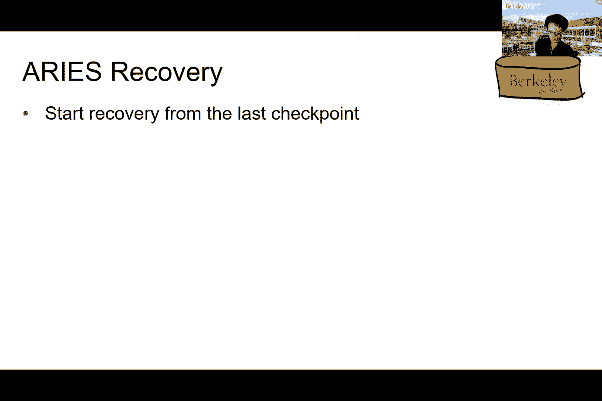

 Yeah。 So let me see if there's a way to get the sound。

 So I picked two of them from the entries or actually， yeah。

 we picked two of them from the entries that were。 All right。

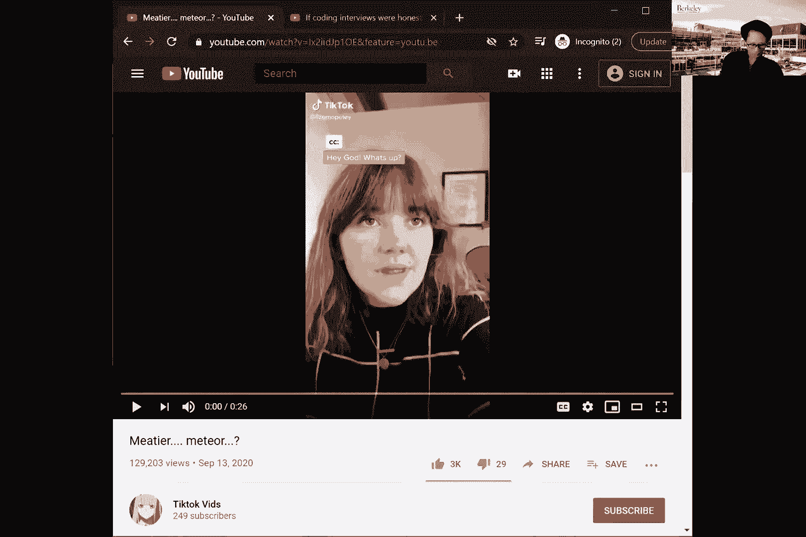

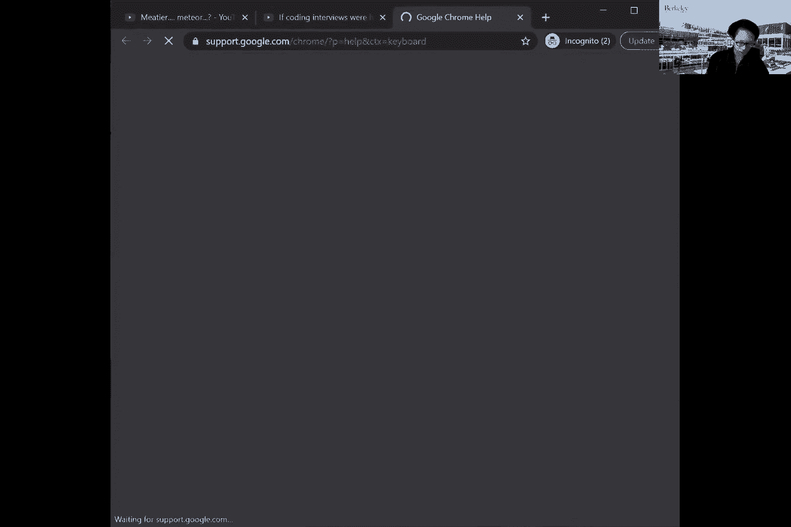

 Are you guys here？ Yes。 Okay， so。 Oops。

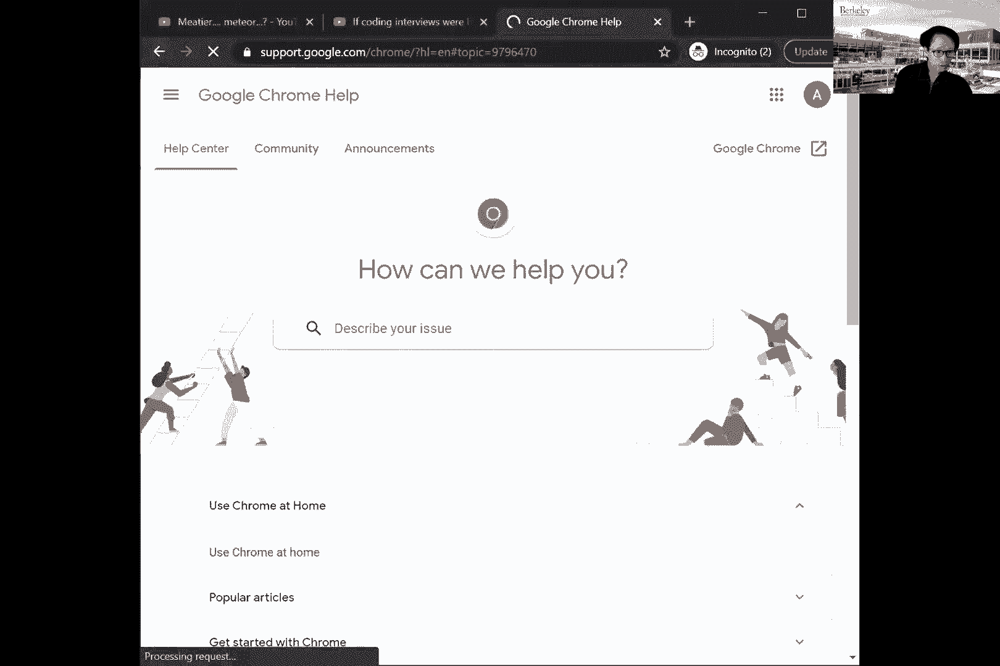

 (woman speaking in foreign language)， (woman speaking in foreign language)， Okay。

 so let's see if this works。 If there's no sound， maybe I'll ask a tittier to play it。

 (woman speaking in foreign language)， (woman speaking in foreign language)。

 (woman speaking in foreign language)。

 - Alvin， it's reverberating。 Are we getting all that？ - All right， stop。 - Give me semi the link。

 - Yeah， I'll do that。 - We're still hearing that。 - Yeah， sorry。 Okay， so let me， oops。

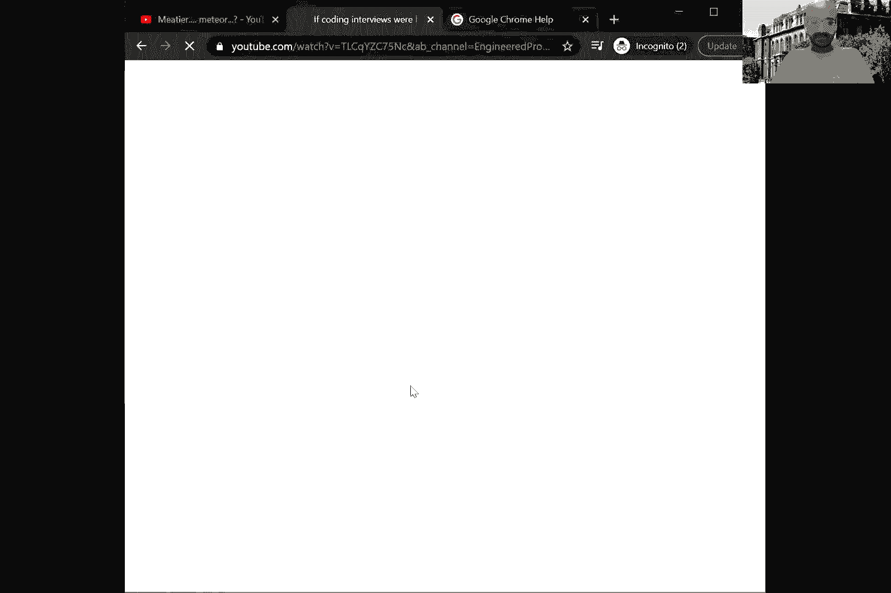

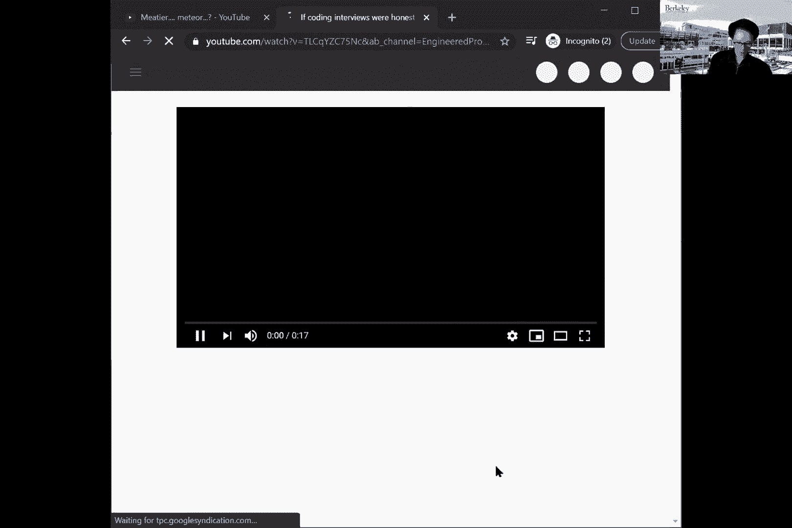

 (woman speaking in foreign language)， - You might imagine how hard would it be。

 to actually just play a stupid video。 - I think you can just disconnect all you。

 from one of your devices。 - Yeah， that's what I did。

 but somehow it's still doing a lot of hack-coin。 So let me， let me just send it to a tittier。

 Do you see it？ I did it。 - Yeah， I see it。 Give me a sec。 (woman speaking in foreign language)。

 - Up。

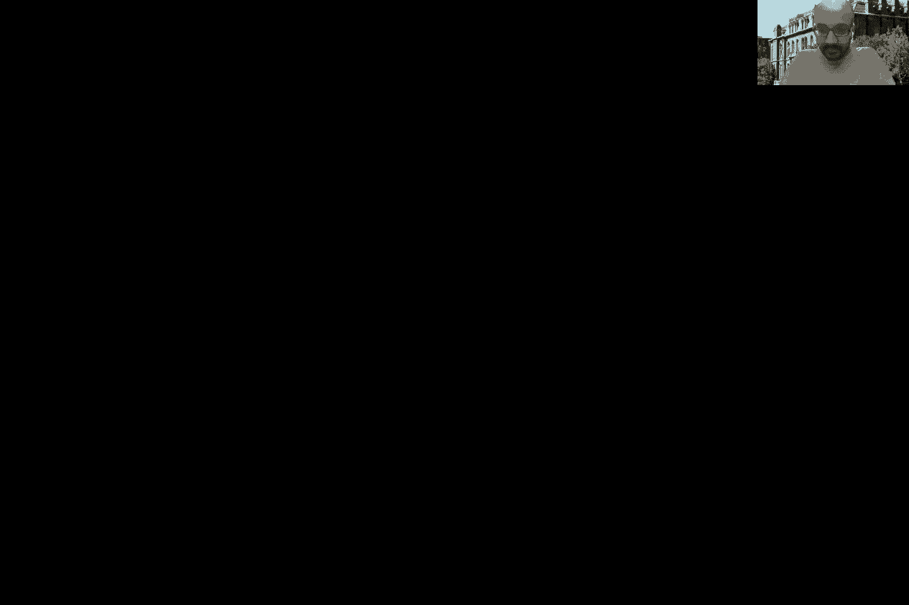

 Hey， Angel， did you give the dinosaurs more muscle？ Like I， hey， God， what's up？ Hey， Angel。

 did you give the dinosaurs more muscle？ Like I asked。 What？ I told you to make them meteor。

 Make them a meteor。 Meteor。 Meteor。 Meteor。 - It actually came from TikTok。

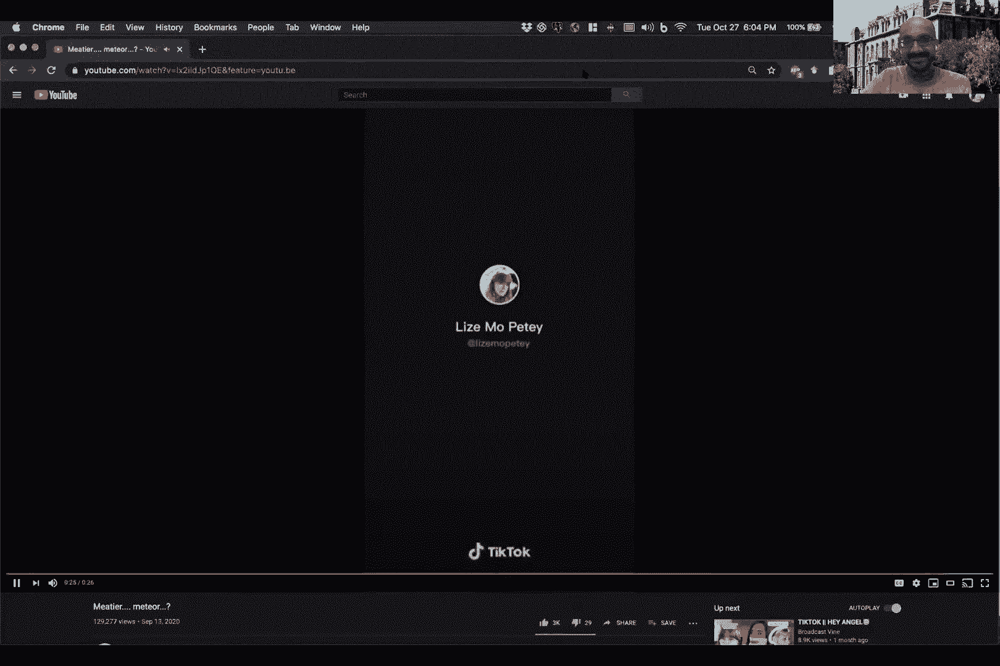

 I don't know why you guys just not sent us， like this， the TikTok。 Thank you， Angel。

 It's a TikTok video uploaded to YouTube。 Okay， so that's it。 Interesting。

 (woman speaking in foreign language)， Okay， I'm sharing number two。 Give me a sec。

 (woman speaking in foreign language)， - Very nice to meet you。

 Can we go straight to the whiteboard question？ Sorry， man。 The whoozer I fit in now a long question。

 into the last 15 minutes。 Damn it， look， I don't even wanna be here。

 I just need this to go on my senior position in Pomo Doc。

 I'm about a month away from campaign 10 Deloitte。 I'm just putting up a front now。

 so you won't hope I'll meet too much for conversation。 Well， that's if you actually do well。

 and we actually give you an offer， right？ You're not wrong。 I know that you don't care。

 but let me tell you about our team， current projects。

 and that I play a significant role in all of them， straight to the whiteboard question， please。

 Now that we've wasted enough time to chatting， here are some other CS video questions as well。

 I'm pretty sure I'm totally bombing this interview， but I'm just hoping that other candidates。

 would do even worse。 Time for your coding challenge， finally。

 I've done this question before but I'm not gonna tell you that。 Good。

 this is the only question I prepared。 I hate to point this out， but all your questions this far。

 will provide zero projections， in my future performance in this company。 Yeah。

 and I'm completely aware of that。 But hey， we don't get to reinvent the rules。

 we just need to play the game。 Honestly， I have no idea what I'm doing。

 So I'm gonna start throwing some technical terms in。 Hopefully I can catch you squinting your eyes。

 All right， try me。 Hash table， binary search， dynamic programming。 Ha， well， you got me。

 Here's my solution。 Good job。 You've completely， bomb the coding section as well。 What can I say？

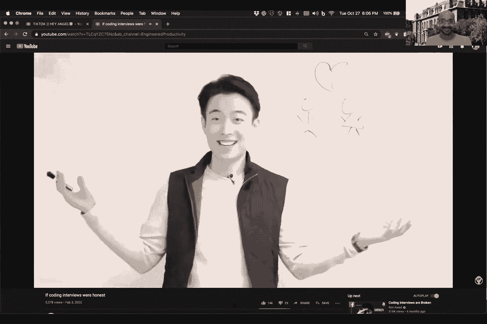

 We still have some behavioral questions， just to see if you wake well in a team environment。

 Just as I thought that nothing is more intimidating， than being given a coding question。

 that I don't know the answer to。 Who am I really kidding？ You're a programmer。 Can I say no？ Yep。

 you are not a good culture fit either。

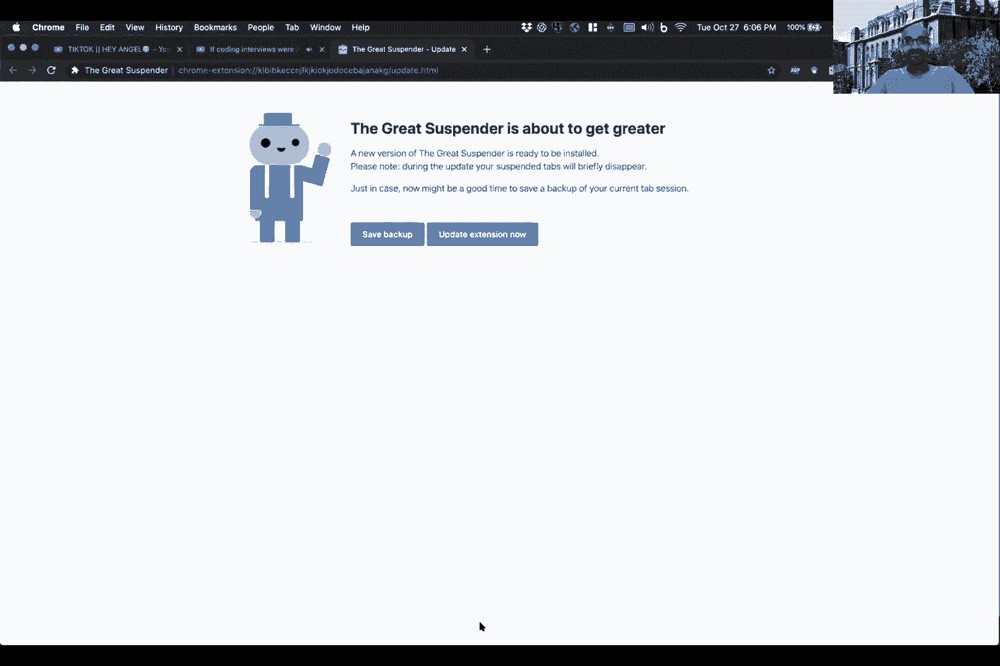

 Whatever that means。 Thank you so much。 It seems like I'm going to have quite a few new roommates。

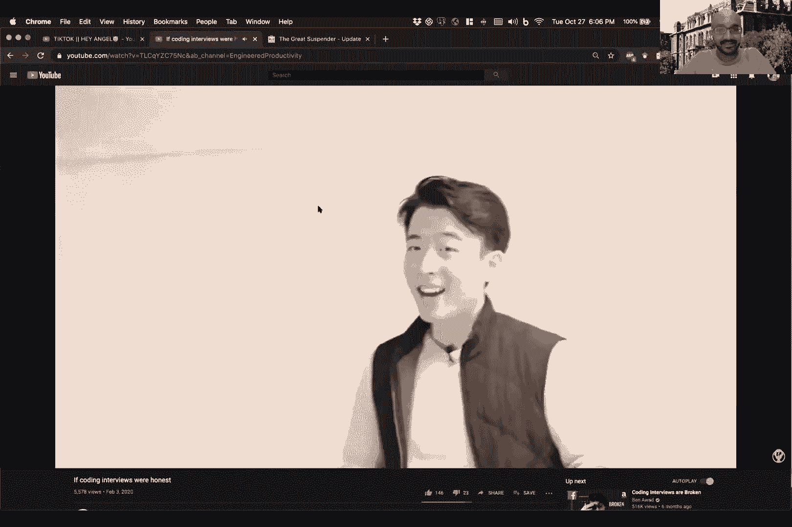

 at the end of this month。 Good luck buddy。 I'm waiting for an official。

 rejection letter for my via email。 Sounds just terrible。 (upbeat music)， (upbeat music)， - Singress。

 - Sorry。 - Santa's more stuff。 I mean， we need more。 I mean， otherwise， like， you know。

 we end up talking about areas for the rest of this semester。 That would be sad。 That would be sad。

 - Yeah， Jerry。 This is our favorite part of preparing for lecture indeed。 - Alvin。

 do you want to do announcements？ - Sure。 So thanks for everyone for your feedback。

 So I just want to like， you know， we just wanted to address those things。

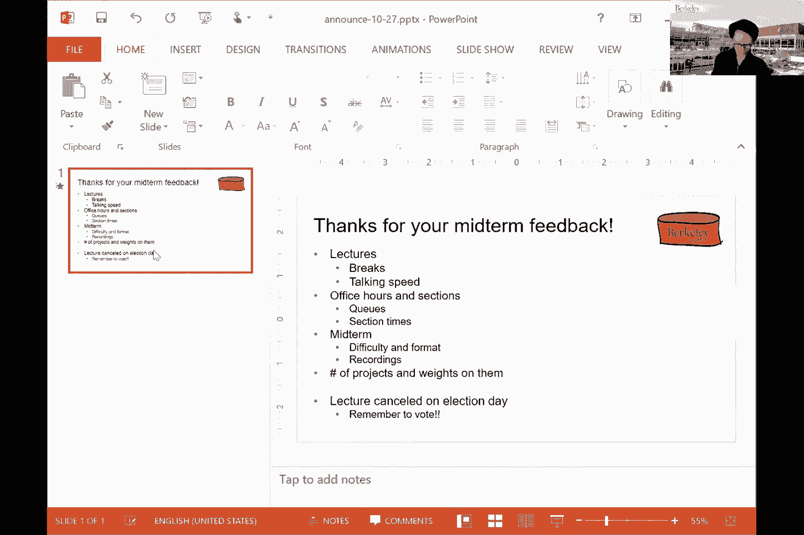

 in the mid semester review that you guys put in。 First of all。

 you guys asked for breaks in the lecture， and there you have it， right？ Yeah。

 we also understand that an hour， and 30 minutes long of talking is a lot。

 And then especially hearing like monotonic people like me， is basically a big pain in the butt。

 I mean， I understand that。 So yeah， thanks for bringing that up。 Talking speed。 Yeah。

 that's also a problem。 Sorry， like， you know， I tend to speak like 60 words。

 per minute or maybe even more on a bad day。 So yeah， I'll try to slow down。

 And also one thing that helps is if you guys ask questions， out loud， I mean。

 that's for sure what break， like， you know， my talking， right？

 Because if I'm going like 60 miles per hour， or 60 words per minute， then like， you know。

 if you ask me something， then I have to stop。 So that's actually by far like the best way。

 to actually stop me。 And then there were also a lot of comments。

 about like office hours and sections。 So the--， That's right。 Yeah。 In terms of asking questions。

 the other thing that I would add， for both of us， it's not just Alvin， is just ask questions。

 There's no--， I mean， there's no such thing as a bad question。 Just ask a question。

 help sort of punctuate the class。 The more questions you ask， the more questions you ask。

 on chat is fine too。 And if there's a question on chat that we think others， will have you。

 we'll elevate that。 So just ask questions。 And I think overall， we'll try our level best。

 to slow down as well。 So I think that's something that we are both working on。

 So thanks for that feedback。 Yeah。 Anything else to add for lectures？ OK。

 So for our hours and sections， I mean， so you notice that we have been trying to consolidate。

 sections times to have free TA resources， to run more office hours。 But of course， there's--。

 we notice that there are comments about the ticket， line being really long。

 So we're actually still working on that。 So we have wrote out a bunch of changes already。

 It's probably noticed on the--， on PSFO。 So for instance， clearing out the queue。

 after blocks of office hours。 And also it tries to double up after we have consolidated。

 the section times。 So yeah， thanks for those feedback as well。 Anything to add there， Aditya， Jerry。

 or any other TAs？ Yeah， so as I said， I mean， this is like--。

 this is a brand new world for all of us， really。 So we're still working out how to actually better。

 serve you guys。 So that's why on the office hour question。

 we're still figuring out what are the best ways， to mix most efficient use of time from the GSI。

 point of view and also from you guys。 If there are other suggestions that you have on how Alvin。

 and my officers can be used， let us know。 We tried running sort of mini topic review section sessions。

 But there weren't that many students who showed up。 So either that's not what you folks want。

 and there's something else that we could be doing。 Maybe you just want to go to the GSI sections。

 and not hang out with us。 It's just fine to-- sections and officers， and not hang out with us。

 That's fine too。 Jerry brought up the point about having a lost section。

 And I think you should try that out。 I think they take their time with the material。

 And if you're really feeling lost， I think that's a section to go to。 Yeah。

 So we are also happy to run many lectures， through the doing office hours。

 So feel free to just let us know too。 So that's also another thing that we can do。 But obviously。

 we might not be able to turn every office hour， every office hour， like a DTM， an ice office hour。

 into a mini lecture。 So because other people have also specific questions too。 But I think。

 periodically， we can also， do that mini lectures to keep people on track。 And again。

 ask your friends to go to attend lecture， because it's the only way that we can get feedback。

 like from you guys。 Yeah， I mean， you guys can watch the recording。

 So then we don't get to hear what your questions are， at that point。

 So it's really hard for us to get the feedback that way。 And we'll just run through materials。

 right？ We don't want that to happen either。 So if you want us to slow down， come to lecture。

 I think that's a good forcing function。 Yeah。 Yeah。 No。 And then there are also a lot of questions。

 about the midterm on the survey。 I mean， I guess part of it is because at that point。

 the midterm just passed。 Some people said it was difficult。 Some people talk about the formats。

 So I guess， difficult-wise， maybe this one， was slightly on the more difficult edge。

 But you also saw the distribution was pretty normal， I guess。

 maybe the mean was not as high as what， we had hoped for。 But I think we're just adjusting。

 Just like you guys， we're also first time exam writers， for an entirely online-based exam。

 So that's definitely going to be--， has been challenging for us。

 And there are also questions about formatting。 So I think some of it has to do like exam tool。

 and then being able to render the questions in a nice way。

 And then there are also questions about whether we're， using the format as in previous exams。

 So I think in general， I wouldn't anticipate the exam， questions to be exactly in the same format。

 as in previous exams。 Because we're doing so basically means。

 we can only ask like certain types of questions。 And certain types of questions are easier。

 when it is a paper exam。 And in terms of grading， for instance。

 and some questions are easier when they're online。

 So I think sometimes we need to adapt the format to the online。 So that's one thing。

 And the other thing is also people， asking about more partial credit and also your ways。

 to explain the answers。 And I think that's also something that we're， looking into for midterm two。

 So one thing to also keep in mind is there are like 650 of you， and there are 20 of us。

 So I suppose you guys wanted the midterm to be graded， at some point before the semester ends。

 So it's basically a huge challenge for us， in order to be able to get them back to you in a timely manner。

 So if we make the entire exam a lot of more choice， it was like scans on。 I mean。

 that would be the easiest thing to do。 But that would also be free and fair to you guys。

 because there's no way to award partial credits。 So it's definitely going to be a trade-off。

 because we obviously don't want to read 600 essays， for instance， for every single person。

 So that's something that we're working on。 And probably there's not going to be a perfect solution that。

 will work for everyone， but it's just hard， as you can imagine。 And if you guys have suggestions。

 we welcome them as well。 So just let us know， like， either way。 Yeah。

 but we definitely don't want the entire exam， to be like scan-thon-based。 I mean。

 that would be better。 And if you were talking about， like， what we're going to do。

 with the recordings， so I think they were basically all set。

 to be automatically expired after maybe 30 days or something。

 So we'll definitely not keeping track of them， after， like， you know。

 for the purpose of this midterm。 So don't worry about them。 We're not like sending them anywhere。

 And then there are also comments about， like， projects。

 and also the waiting on them and also the schedule。 So as you saw。

 we're basically extending project， for deadline already to help you guys during these times。

 And then we're also working out what to do， with the last two projects。 So just keep that in mind。

 But as you saw， like， you know， this semester， we make projects of care-wise。

 as opposed to individuals。 So hopefully that was going to help。 So and then as always。

 if you have further comments about that， feel free to let us know。

 So one of the things that I want to emphasize， is that we don't want you to be stressed， right？

 I mean， this is a hard class， right？ There's a lot of material to cover some of the concepts。

 at least the ones that we've been covering recently， are not particularly easy。

 The projects are not particularly easy。 But that said， we do want to make it as--。

 we want you to learn the content， because I think it's kind of a deep dive。

 into data-based system technology， that you're not going to get anywhere else。

 And so we want you to learn that， but we want it， to be as little stress as possible， which。

 is why we've been trying to be， at least， very responsive。

 with giving out more slip days and extending deadlines， and things like that。

 Just to make it a little easy， we， know that everyone is going through a lot。

 And so if there's anything that you're going through personally， just let us know。

 We'd be happy to find ways to work with you on that。 And so I think we're open to more suggestions。

 But again， if we rely on you to give us feedback， as to what becomes stressful， and we're。

 happy to work around that。 And one of the things that I think。

 Alvin is going to get to this next is part of also， the stress aspect。 I mean。

 we are wanting to have you be less stressed， and that's why we're canceling a lecture on Election Day。

 We know that many of you， this is a stressful time。 Of course。

 we also want you to go vote if you haven't already。

 And we're not going to be able to tell you who to vote for。 But this is a stressful week for us。

 the coming week。 And we didn't want you to be overwhelmed with too many。

 deadlines and too many things on your mind， when we are dealing with political chaos。 So Alvin。

 I'll let you continue。 Oh， yeah， so that's all I have。 So I've literally--。

 I think we have all literally read through all of your comments。 So thanks for doing it。

 Do you have other suggestions？ Or like， obviously， we cannot get to every one of your comments。

 So if you would like us to address a particular thing， let me feel free to let us know。

 We'll be happy to also talk offline as well。 So if you feel more comfortable with that one。

 So we greatly appreciate the fact that many of you， have given such detailed feedback to us。 I mean。

 it's--， That's amazing。 It's just like we really appreciate it。 Yeah。

 You guys took the time to actually talk the survey。 I mean， hopefully not just for the extra point。

 Yeah， so we definitely want to make sure that they are addressed。

 Maybe we cannot address everybody's concern。 I mean， there's an equally number of people。

 saying that the exam was hard from people who are saying it was OK。 So it was like。

 we can't satisfy everyone's needs。 But for things like breaks and all that stuff。

 we definitely want to make sure that they can get their input。 And obviously。

 our change is another step。 Cool。 Any other questions about the midterm feedback？ OK， so if not。

 then let's try to finish up。

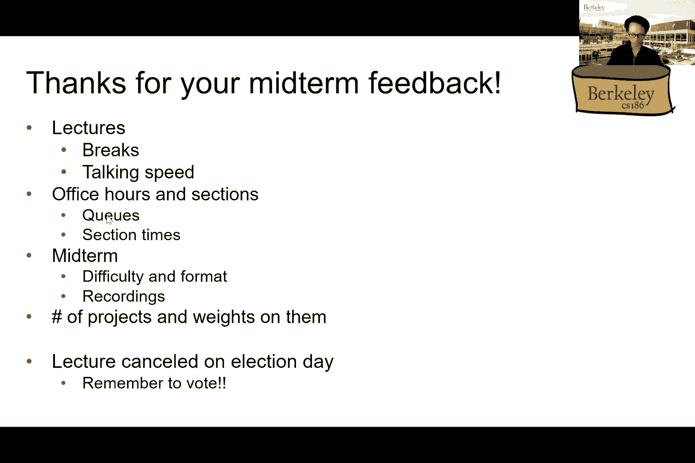

 with the rest of the recovery lecture， within the remaining 10 minutes or so。

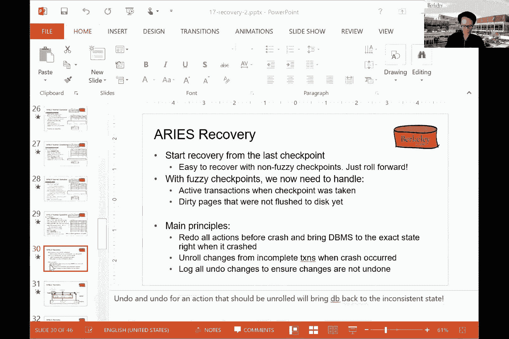

 So we actually just got to the most fun part， which is how to do recovery。

 And I hope we actually were able to finish that， by the end of the class today。 Sorry。

 I need you to learn the tricks to fast forward and powerful。 I think there is a--。

 Just type a number and then hit enter。 You'll go to that slide number。 Yeah。

 except I forget what is the slightest answer， opposed to go to。 OK， two bets。 All right。

 I guess I pressed fast enough after all the gaming， exercises out。 OK。 OK。

 so how do we actually do recovery， right？ So yeah， so the first thing to notice is that we only。

 need to do recovery from the last chapter。 And this one is apparent， right， from the fact。

 that we are doing checkpointing to begin with。 So we're not going to--。

 we don't need to actually go back to the very beginning， of the law。 However， the problem is， right。

 in a non-fussy checkpoint， situation， that will have been easy， as I said。

 because everything that is before the checkpoint can be tossed。

 And then we just need to deal with things， that are after the checkpoint。

 But now we have fuzzy checkpoints， right？ So meaning that we now need to handle all those nasty transactions。

 that were actually still active when the checkpoint was taken。 And also。

 it means that all the pages that were dirty， are not flush to the page yet。

 So the main principles behind areas of recovery algorithm。

 is to make sure that we first redo all the actions before the crash。

 such that we bring back the database to the exact same page， as it was at the time of the crash。

 Of the crash， right？ You notice， not at the time of committing。

 or anything at the time of the crash。 And then we're going to unroll all the changes。

 from incomplete transactions when the database crash。 So this part is just like before， right？

 We just want to unroll things that were made from the incomplete transactions。

 And then we're going to-- this is new。 So we're going to now log all the changes that were undone。

 to ensure that they are not undone in the future。 So see what that means in just a second。

 So here is a picture。 So we have the lock record and then times go sideways to the right。

 And then at some point， we just crashed。 So we took a checkpoint， let's say。

 in the middle of this lock。 There are two types of transactions that we need to worry about。

 The first type is something like the following。 So this transaction started before the checkpoint happened。

 It was still running when the checkpoint was taken。 And in fact。

 it was still running at a time of the crash。 So for these type of transactions。

 we need to undo all the changes， because this one did not complete。 So therefore。

 we need to undo all the changes that it made all the way up。

 until in the very beginning when it first started。 So these ones we need to undo。

 And then here's another type of transactions。 It first started some time before the checkpoint。

 It made some writes。 It was still running when the checkpoint was taken。 And then at some point。

 it committed after the checkpoint。 And before it crashed。 So in this case。

 this is something that has committed。 So for these type of transactions， we。

 need to be able to redo the actions。 Because for this type of transaction。

 it was still running at the checkpoint。 And it actually eventually decided to commit。

 So for these transactions， we need， to be able to redo the actions corresponding to them。

 The question， however， is how do we actually find these two places？

 Meaning that the first time that it writes something。

 to the log for the transactions that we need to redo。 And for the ones that we need to undo， right？

 I mean， how many actions do we need to undo？ We need to undo all the way up to the very beginning。

 of that particular transaction。 So how do we find these two points？

 So the area is recovery algorithm uses three phases， to do recovery。

 The first one is called analysis。 It's exactly trying to do what I was asking。

 on the previous slide。 We basically tried to recover all the dirty pages。

 and the status of the active transactions， at a time the checkpoint was taken。 And then after that。

 we're going to redo all the operations， that needs to be redone because they correspond。

 to the transactions that committed after the checkpoint was， taken。

 But they were still active when the checkpoint was taken。 And then we want to do an undo pass。

 where we want to unroll all the transactions that were incomplete。

 So the area is algorithm going three phases in that way。 So let's go through that one by one。

 What is the analysis phase trying to do？ It's basically trying to first figure out。

 what is the first point in the log that we need to redo the actions。

 And we want to be able to determine the set of pages， that were dirty when we crashed。

 And then we want to identify the active transactions that， were running when we crashed。

 So the first point is clear because those， are the transactions that eventually committed。

 So therefore， we need to redo all the actions， that needs to be from those transactions。

 And then the second and the third one， and the third points were basically trying。

 to figure out what were the incomplete transactions， so that we can unroll them。

 How are we going to do that？ So， I think Nicholas has a question。 Oh， sorry， Nicholas。

 I just wanted to ask really quickly， when you say， like when the checkpoint is taken。

 is that referring to the begin checkpoint or the end checkpoint？

 It's referring to the begin checkpoint。 OK。 Yeah。 Yeah， OK， so what do we do during analysis？

 So we first rebuild the transactions table and the 30 page， table from the data that we have saved。

 So this part now， you understand why we are writing， all those things to the disk。

 Because when we try to recover， we need to first reconstruct， those two things。

 And those things have already been saved in a file。 So that's great。

 And then we need to be able to recover them， as I said， from the lock。

 And then now we want to compute the first lock record， that we need to recover from。 And that one。

 as you can guess， actually， comes from the recovery。

 LSN's that we have saved for all the individual pages， in the buffer pool。 Again。

 why are we doing this？ Because， as I said， when we take the checkpoint。

 the begin part of the checkpoint， we， have the statuses of all these transactions and also。

 the status of the 30 pages。 And we need to figure out where do we start the redo phase。

 Because those corresponds to the actions done， by transactions that eventually commit after the checkpoint。

 was done。 And for those transactions， we need， to be able to redo all the actions correspond to them。

 So the analysis phase is exactly how， going to help us do that。 How？ Well。

 so remember that the 30 page table stores， this recovery， LSN， which corresponds to the first LSN。

 that made each of these pages 30。 So if you look at all of them and find the minimum LSN。

 from all the LSNs that we have， that， got to be the first time。

 It's basically corresponds to the first LSN that， made any of the pages in the 30 page table 30。

 So that gives us a starting point。 That is exactly the place that we。

 need to start redoing the actions。 Because that is the first LSN that。

 made the right to the 30 page table。 And that 30 page table was not flushed to the disk yet。

 by the time the check point was taken。 So therefore， let's be conservative。

 and redo all the actions corresponding to that LSN and onwards。 OK？

 So the main principle behind the redo phase， as I said， is to be able to just redo everything。

 So we're basically going to process the lock going forward。

 from the first LSN that we have identified， from the analysis phase。

 We're going to read every lock record sequentially， at that point。

 And then we're going to selectively do actions that， needs to be redone from the lock。

 So how are you going to do that？ So we're basically going to go through the lock record。

 And then each of the lock update record， is going to have an entry， like the one。

 that I'm showing you here， right？ It's going to show which transaction touch， which page。

 and then the old value that was there， and then the new value that was written。

 So how are we going to do this？ We're just going to write the new value to the page。

 And then there's a question。 We want to be only able to redo the actions that， needs to be redone。

 So how do we actually determine that， right？ And why do we actually have actions。

 that we don't want to redo？ So let's do this on a case-by-case basis。

 So for each lock record entry that corresponds， to this format here， there's a case。

 where the page itself is actually not in the 30 page table， even though it's referenced in the lock。

 So how can that possibly happen？ How can it possibly happen that we have a lock entry。

 that we are supposed to replay or redo？ But somehow it's actually not showing up in the 30 page table。

 And by the way， I'm not talking about the case， where there's a buck， right？

 So we're assuming that we have implemented this algorithm correctly。 So why is there such a case？

 Well， so it can be such a case because the page itself， yeah。

 was flush to the database after the checkpoint was taken， right？ Sorry。

 before the checkpoint was taken。 So it's actually removed from the check point--。

 from the 30 page table by the time the checkpoint was taken。 So therefore。

 when we actually record downward， is inside the 30 page table， when， we take the checkpoint。

 the page is not there。 So for those， we don't want to replay， because those pages have actually。

 been flushed when we actually do the checkpointing。 So we don't want to replay that。

 So that's great。 Here's another case。 So in this case， the page is in the 30 page table。

 But the recovery， the LSN， is actually， greater than the LSN that we are trying to replay at that time。

 How can this happen？ This can happen because the page was made， 30 at the green LSN。

 It was removed from the 30 page table before the checkpoint。 But it was actually read in again。

 and we inserted it into the page table， with a later recovery LSN number。

 That happened after the checkpoint was taken。 So again， in this case， we also don't。

 want to replay that action， right？ Because that action corresponds to something that。

 has already been flushed to the disk。 And finally， we might also have a case where the page LSN。

 is actually greater than the green one that we are trying， to replay at the moment。

 How can this happen？ Well， so this can happen because the page was updated again。

 and then subsequently flushed。 So that basically means that we have multiple writes。

 to the same page， and then we're not at the latest one yet。 So in that case。

 we also don't need to replay that， because we are going to see another lock record later on。

 with the purple page LSN number。 So unless it falls on any three of these categories。

 otherwise we are basically going to redo that action， from the lock。 OK。

 so I think we are getting running out of time。 So let me just take maybe 10 minutes on the next lecture。

 to finish up the details for areas， and then we'll move on to other topics。

 And if you have questions， please stay otherwise。 I will just see you on Thursday。

 And then let me just stop the recording。

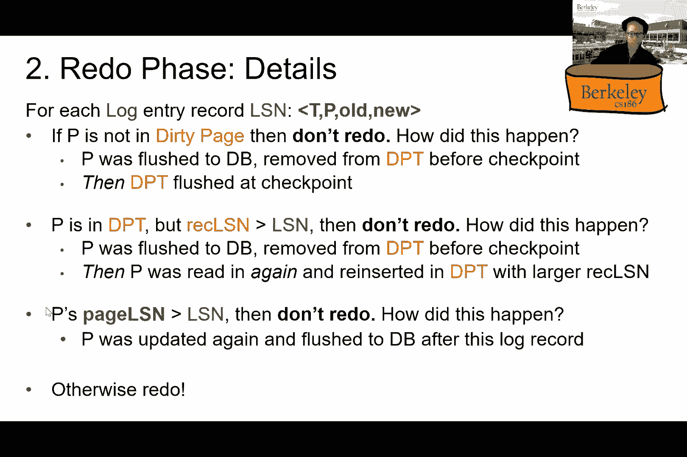