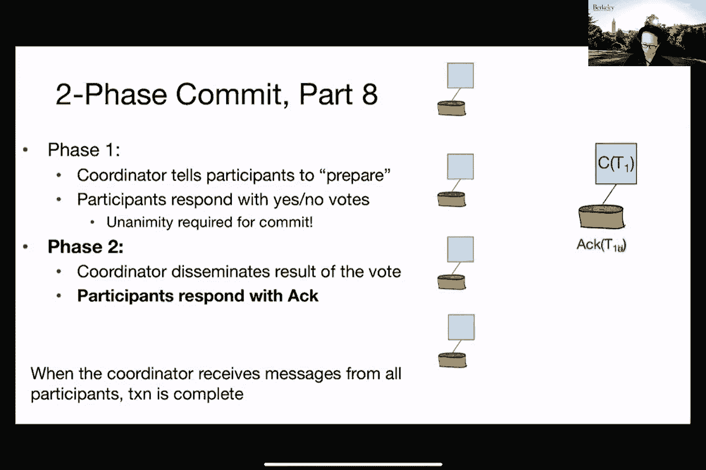
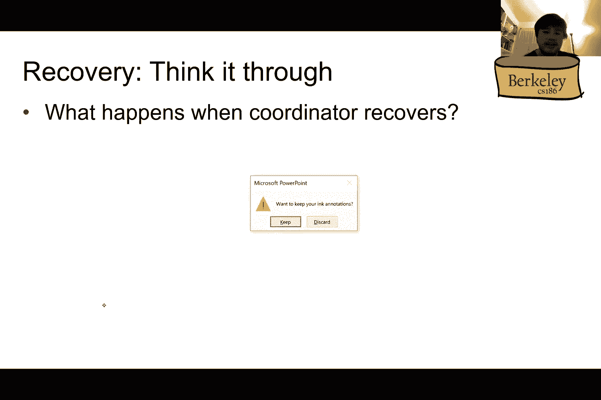
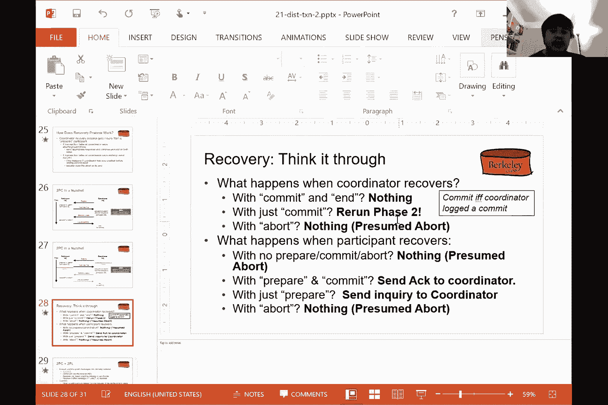
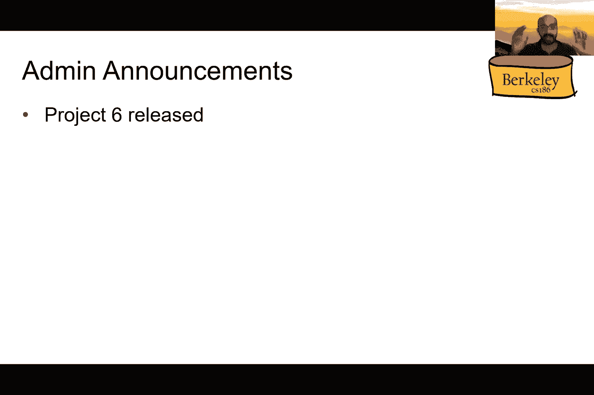
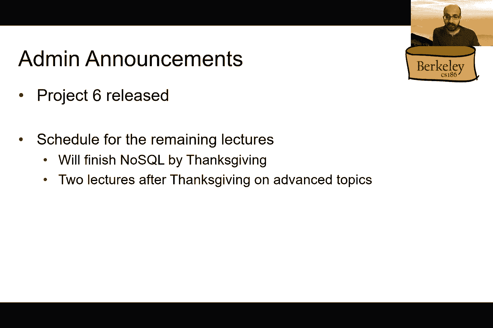
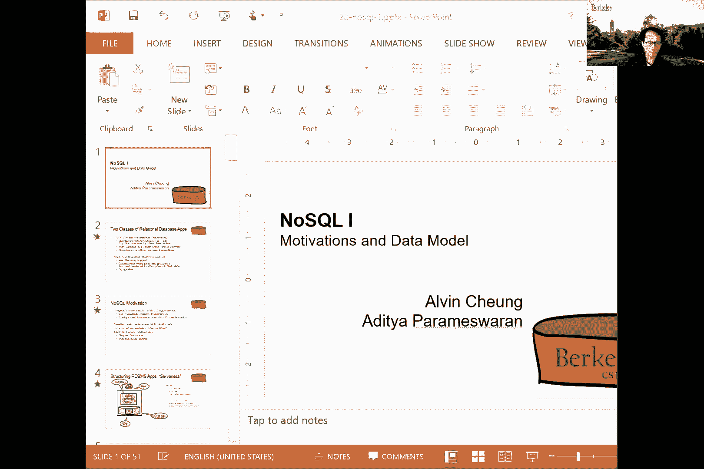
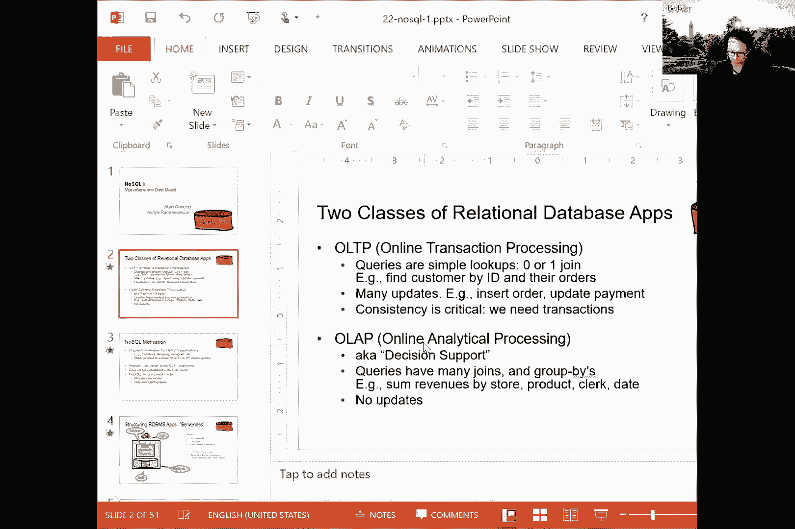
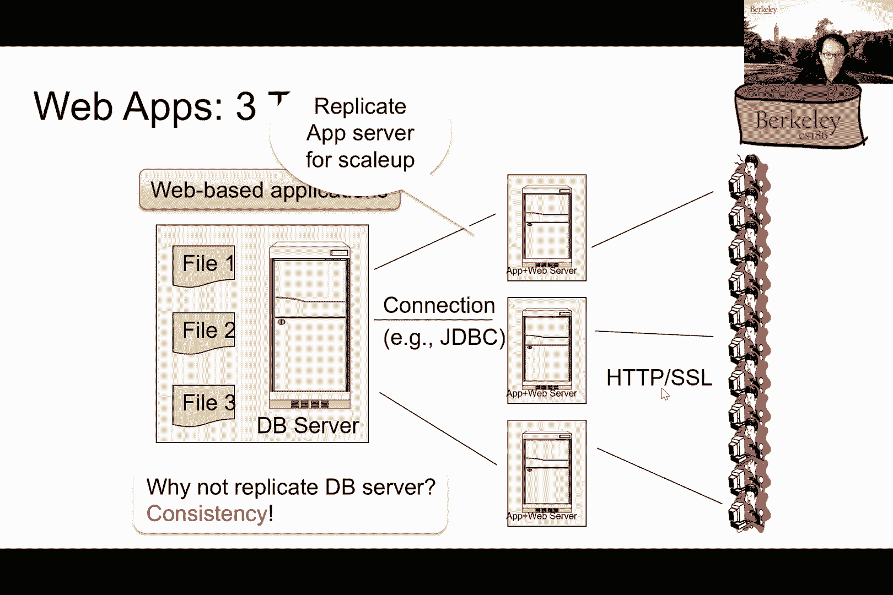

# 加州大学伯克利分校 CS 186 数据库导论 Introduction to Database System (Fall 2020) - P23：Lecture 23 Data Replication and Distributed Transactions II - ___main___ - BV1cL411t7Fz

欢迎回来伙计们，我们一直在讨论分布式事务，然后呃，今天我将在两台电脑上结束我的讨论，香草版的那种，然后艾尔文会把它捡起来，然后告诉你两台带有日志记录和其他变体的PC，好的。

如果你还记得我们在讨论如何进行分布式提交，因此，当涉及多个节点或多台计算机时提交，所以呃，如果你还记得我们谈过为什么，斯特罗曼版的协调员做出决定不太奏效，所以嗯，如果你还记得。

我们讨论了每个事务都有一个协调器的事实，谁负责管理协调，并与应用程序服务器通信以通信，嘿的事实，此事务已提交或中止，比如说，所以这个这个，所以这种稻草人的方法是由协调员决定，如果事务要提交。

我们的角色不太行，嗯，如果协调员基本上做出了单方面的决定，让我们看看其他节点知道，这是因为，嗯，其中一些节点可能真的想中止，即使协调员想承诺，其中一些节点实际上可能已经关闭，所以如果有一些事务正在更新。

该节点上的一些数据可能会违反一致性，不能让这样的交易继续进行，所以总的来说，我们谈论各种可能出错的事情，所以在节点级别上可能出错的事情，以及在信息层面可能出错的事情，所以从节点的角度来看。

我们还没有听到节点的消息，我们不知道它是死是活，嗯，它可能只是节点是活的，但是由于某种原因，来自那个节点的消息需要很长时间才能到达，嗯嗯，或者节点是，比如说，忙于另一个进程。

这就是为什么要花很长时间才能做出反应，即使它还活着，所以嗯，就像我前面提到的，决定可能取决于当前没有传达的音符，比如说，在这个节点上可能有外键冲突，节点可能要中止的原因，嗯和所以呃，你可能想，嗯。

等待该节点响应以决定，所以当这个节点回来的时候，如果节点数据实际上死亡，呃，我们如何在一个向前发展的世界中恢复，对呀，我们怎么，呃，我们如何更新该节点，所以从节点的角度来看，这些是可能出错的事情。

我们的提交协议必须处理所有这些问题，然后从信息的角度来看，可能会发生一些问题，您可以在这些通道上进行非确定性的重新排序和交错，因此消息可以重新排序和交错，你也可以有很长很长的信息，呃。

它们需要很长时间才能送到，所以一个问题是我们到底需要等多久，从某种意义上说，我们需要等待足够长的时间，这样我们就可以得到所有可能相关的信息，呃，不要拖太久，提交，我们对此有什么解决办法。

所以我们的解决方案基本上是分布式的，表决权，所以我们必须投票以确保承诺，嗯，所以一个问题是，你需要多少机器人才能完成一次提交，对胜利的承诺，嗯和嗯，的，挑战在于，即使是单个节点也可以观察到一个问题。

对呀，单个节点可以观察到死锁，如果你还记得我们有，um类分布式死锁检测，其中单个节点在本地确定死锁，呃，在一个循环的重量中，嗯，如果他们检测到一个周期的权重，然后就出现了僵局，周期性地。

这些周期的工资在某个节点得到协调和联合，它可以检测全球循环，因此，单个节点本身可以检测到等待图的本地循环，这可能导致该节点可能想中止特定的事务，另一个原因是限制侵犯权利，所以就像我们之前说的。

可能会基于该事务违反外键，这可能会导致，嗯，呃，主键或外键，呃，违反可能导致，嗯，呃，呃，需要讨价还价的交易，所以总的来说，我们希望投票是一致的，每个节点都需要决定，嘿嘿，我想提交以便事务实际提交。

那么我们如何实际实现这个分布式投票协议，嗯，尤其是如果你有，呃，节点和消息失败和延迟的问题，因此，与以前一样，有一个协调器负责提交此事务，或者关于它，协调员实际上是这个分布式登机协议的焦点，因此。

这种分布式投票协议被称为两阶段提交，呃，呃，也称为两台PC，嗯，这和两个PL不一样，也就是两相锁定，所以这两个人经常会互相混淆，所以这是一个分布式的提交协议，两相锁定是一种本地单节点锁定协议，好的。

所以这个两阶段提交协议有点像婚礼，嗯，所以它有两个阶段，所以第一阶段有点像说，你是否接受此人为你的合法配偶，对呀，呃，这是第一阶段，所以协调器基本上告诉参与者这些参与事务的节点，推动交易。

然后参与者回答是，呃，总体上需要全体一致，是呀，进行下一阶段的权利，带有提交，每个人都需要说是，就像在婚姻中，那么第二阶段基本上就是我现在宣布你们夫妻，对呀，嗯，所以这基本上是，呃。

传播投票结果的协调员，它必须在前一阶段一致才能走向，嗯，这个提交，如果没有，它最终成为一个ABO，所以让我们看看这是什么样子，嗯，在那之前，我确实想提一下，您确实需要做一些日志记录，以便处理故障，嗯。

失败的原因有很多，正如我前面提到的，这些都是我们需要小心的事情，阿尔文会呃，讨论那个，在我讨论了基本的两个PC协议之后，好的，所以第一阶段就像，我说，协调员首先告诉参与者准备。

所以这里的协调员将向参与者发送消息，因此，每个参与者都被告知准备为这个特定的事务提交，然后参与者在当地决定，不管他们愿不愿意承诺，在这种特殊情况下，他们都决定，是呀，那笔交易没问题，本地提交。

他们把这个传达给协调员，所以所有的协调员都从所有这些参与者那里得到所有的信息，这些参与者中的一些人可能是完全正确的，所以在这种情况下，协调员必须做出决定，根据到目前为止收到的消息，如果它。

它已经等了很久了，信息永远不会到达，然后它将决定中止而不是提交，因此，您确实需要根据从参与者收到的消息一致同意提交，协调器决定中止或提交，在这种情况下，所有的参与者都答应了，让我们继续承诺。

协调员也根据一致意见做出决定，嗯，协调员决定承诺，然后将投票结果分发给与会者，一旦公寓得到它，他们完成了他们的操作，他们会用一个，这基本上是一种承认，他们已经收到提交消息，好的，所以这是，嗯。

然后一旦协调器收到来自所有部件的消息，就会冲刺，交易是，呃完全，所以不需要采取进一步的行动，然后协调器可以让应用程序服务器知道这个事务已经完成，你有问题吗，是啊，是啊，我有个问题。

所以我看到这里可能有多个参与者，所以我真的有点困惑，就像，你所说的参与者是什么意思，因为，就像，如果交易，如果模拟事务引用节点，您只能从该节点访问数据，那么就不会有多个参与者参与到过程中。

你为什么这样你就可以进行交易，所以记住，事务可以捕获一堆SQL查询，对呀，甚至一个查询，一个SQL查询，它是一个更新，呃，也许是，呃，对给定关系的更新，这种关系是，假设在许多机器上分区，嗯。

那么这些机器中的每一台都需要进行更新，他们有权的关系部分，所以您不希望更新部分发生在某些机器上，但不是对其他机器，我明白了，我明白了，是啊，是啊，谢谢你对吧，嗯，卢卡斯还有一个问题，我很好奇，就像。

具体是什么，意味着交易完成，就像，比如说，如果节点死亡并且没有发送确认，协调员做什么，然后是的，所以有各种各样的，嗯，所以我相信阿尔文在康复方面会有所帮助，嗯，所以有各种各样的，所以从协调员的角度来看。

协调员仍然可以回应非常好的，所以让我们停一下，所以让我们说呃，协调员告诉，嗯，那个呃，收件人继续并提交，好的，在这一点上，那个呃，一个改进，至少，协议的普通版本，说协调员需要等待确认，在向。

到应用程序服务器，如果，比如说，一个节点在此期间下降，节点可以，呃，比如说，在本地使用日志消息，如果它从那一点回来做恢复，但实际上这个协议可能会有改进，允许协调器不等待确认，从，的。

所有参与者向应用程序服务器提供通知，所以这实际上是对两阶段锁定两阶段提交协议的改进，嗯，其中协调器不需要等待，所以实际上有改进，但是基本的两阶段提交协议，嗯确实要求协调员等待所有参与者让他们知道，是呀。

我已成功应用交易结果，在那发生之前，我不想再做承诺了，呃，的，协调器通知应用程序服务器事务的结果被持久化，谢谢。我们还有问题吗？呃，内特，是啊，是啊，所以确认只发送，节点完成操作后，就像如果是流产。

然后只有在节点完成展开之后，然后发送确认，或者它是否发送确认，就像，所以这又取决于，所以好吧，以便，为了让，的，我想也许这个问题会得到更好的回答，在阿尔文描述了日志协议之后，所以也许我们应该等等。

以后再讨论这个，阿尔文，你觉得怎么样，是啊，是啊，因为我认为康复，一旦我们了解了日志记录，恢复的事情就会得到更好的描述，好的当然，抓住这个问题，我们可以晚点再谈，关于基本方案的其他问题。

呃，尼古拉斯，我会，我将通过交谈来回答你的问题，好的。

快，所以大家都能听到我吗，或者有人能听到我吗，好的，所有的权利，所以我想我刚刚通过了两个阶段提交的基本协议，也称为两台PC，所以现在我可以做有趣的部分告诉你们，我们心爱的协议区域会发生什么。

还有两个P L会发生什么，我可以告诉你简短的答案是，他们不会离开任何地方对吧，就像你知道的，在这节课中，你将看到如何与两台PC交互，所以现在让我首先说明与，通过重复以前的相同示例。

使用两台PC的ARIS，除了这次我抽象或归结为参与者的数量，只有一个，然后在右手边，就像你看到的，这里代表协调员，所以现在我们有了，除了这些消息，我们在参与者和协调员之间来回发送，我们也有记忆中的东西。

以及存储在磁盘上的内容，洛，希望这能让你回忆起，就像我们在谈论不同的伐木方案时，所有这些权利，好的，所以在这个方案下，我仍然会使用直接记录，就像我们以前做的那样。

但是现在让我们看看当我们从协调器收到不同的消息时会发生什么，关于PC，好的，所以第一阶段是对的，我应该记得，因此，在本例中，您将看到一条准备消息，然后它基本上从协调器发送到第一个。

我们在这笔交易中唯一的参与者，因此参与者收到一条消息，将其记录在当前内存中的日志中，记住这里的绿色部分代表主内存，然后它要做的第一件事，实际上是将记录刷新到磁盘锁，换句话说，我们要让这种情况持续下去。

所以我们实际上要让它持久，在我们用是的信息回复协调员之前，呃，我们愿意承担这笔特殊的交易，如果它说不，它基本上是说我不愿意承诺这笔交易，对呀，可能是因为他们违反了一些限制，或者像你知道的其他原因。

对不对，嗯，因为没有承诺这笔交易，但在这种情况下，如果我们最终，呃，回答是，那么要记住的是，我们首先将准备信息记录到磁盘上，在我们回到协调员那里之前，所以就像我之前说的，那个呃。

然后参与者将回复“是”消息，回到协调员那里，协调器接收来自所有参与者的消息，在这种情况下只有一个，然后它会写在自己的日志上，提交消息在其自己的日志记录中，好的，这就是现在，这是在记忆中到期的对吧。

然后在列出确认之前，协调器实际上还将把提交消息刷新到磁盘，让它在那之后才持久，那我们就，你知道，呃，告诉…的结果，呃，所有与会者的投票，呃，从协调员那里，这有道理吗。

那么我们现在冲洗的原木尾巴有什么意义呢，嗯，因为可能有其他事务同时进行，就在本地，就像，你知道的，呃，所以说，这就是为什么我们实际上可能不仅仅是冲洗，与准备消息相对应的日志记录。

并且刷新与其他事务所做的操作相对应的日志记录，也是，好的，如果我们撞车了怎么办，所以坚持住那个想法，呃，在短短一秒钟内，我看得出来你们已经非常渴望了解互动了，在白羊座和两台PC之间，所以坚持住那个想法。

就几分钟，我们将在一分钟内讨论这个问题，稍等，好的，但现在让我们完成协议，所以现在我们进入第二阶段，这意味着协调员已经收集了所有的VO，然后它会宣布结果，所以它基本上会问，本案的所有参与者承诺。

因为在这个案例中，所有的参与者只有一个回答是，所以同样的交易，因此，参与者将刷新提交到磁盘的日志记录，在回复确认之前，所以这又是重要的，我们稍后会看到，在这个恢复部分，在这种情况下，呃。

它将以确认作为回应，在它冲过呃之后，将消息提交到磁盘，然后协调员将收集所有的确认，就像Aditya从所有参与者那里说的，然后呢，就像，你知道的，在它自己的日志记录中写入此事务现在已经完成。

然后它基本上会刷新结束记录，就像我们已经习惯的单节点事务处理一样，这有道理吗，所以就我们写在日志上的东西而言，实际上与我们以前在单节点事务处理中所使用的完全相同，当然，在准备和承诺方面有这些新的信息。

对不起，在准备方面，权利和承认等等，但请注意，就像你知道的那样，确认实际上没有写入日志，只写了结束消息，这意味着我们已经收集了所有参与者的所有致谢，所以你后来问，就像你知道会发生什么。

如果我们没有收到所有的确认，所以我们一会儿就会明白这意味着什么，但作为预览，基本上我们不会把m括号写到，呃，在协调员中，所以这意味着交易还没有完成，但是亚伦和过程仍然是一样的对吧，我们基本上就在前面做。

在此登录，除了现在锁被拆分为，就像你知道的，你在不同的桌子上看到的两个不同的部分，然后呃，取决于您是协调的还是您的参与者，呃，你知道他们在日志中写入不同类型的消息，顺便说一句，只是说说而已。

实际上没有要求协调人和参与者必须完全不同，机器，对呀，我是说，很明显有一个，这样做有好处，在…方面的权利，呃，呃，不需要经常处理机器故障，还有呃，效率显然这是我们开始的原因之一，呃，想做多，呃。

更多的并行数据库事务，但就像你知道的，协调员也可以是参与者，比如说，简而言之，这就是整个协议，所以你基本上可以看到参与者和协调者之间的来回，然后在这张幻灯片上，我强调了呃，记录实际写入磁盘的消息。

然后中间的所有其他东西，这些基本上是双方之间来回发送的信息，正如阿迪蒂亚之前提到的那样，然后有星号的部分，基本上就是，他们是，在实际发送下一条消息之前，我们需要刷新到磁盘的部分，然后你会注意到。

例如这里的结束记录，你知道不需要立即冲洗，呃，因为我们的恢复协议，我们稍后会了解到，呃，它会告诉我们，即使我们还没有写结尾，没关系，因为在最坏的情况下，如果协调程序在结束阶段之前崩溃。

我们可以要求参与者对他们的承认感到不满，所以这里的优化就像，我们不一定要刷新最终消息，呃，之后呃，在收到确认后立即，顺便说一句，这是最基本的协议，你知道，呃，对于外面的两台电脑来说。

实际上有很多不同的优化，就试图避免做这些闪光而言，但在恢复方面，他们变得更加棘手，所以这就是为什么我们不在这节课中讨论这个问题，所以这个就像我们冲的地方，就像在两者之间，每个步骤都是最基本的，呃。

我们在教你们的时候能想到的，但是，到目前为止对此有什么问题吗，所以现在很明显下一个，你知道，百万美元的问题，右边是，呃，当我们试图恢复时会发生什么，因为现在我们有了日志，呃。

很明显这让我们想起了我们热爱的区域协议对吧，那么当事情不那么顺利时会发生什么呢，这就是我们接下来要讨论的，所以故障处理，我们为两台PC做了一堆假设，第一个是，我们假设所有参与者和协调员最终都会康复。

这显然是一个很大的假设，对呀，我是说，如果机器真的烧对了怎么办，如果是这样的话，或者像洪水之类的，就是这样，那么要得到可恢复的东西实际上并不容易，呃，但你知道，这里的假设是，我们将在日志记录之前使用。

然后希望我们的文件系统有足够的弹性，或者在许多不同的磁盘上复制它，就像你知道的那样，万一机器真的烧毁了，或者像你知道的那样消失，不管出于什么原因，仍然有办法从光盘中恢复那台机器的内容。

所以你可能会问一个问题，对呀，那么如果协调器注意到参与者倒下了会发生什么，在那种情况下会发生什么，所以这取决于参与者是否还没有真正投票，就提交的是或否而言，然后协调器可以中止事务。

在这里寄宿总是一种选择，对呀，当然啦，呃，我们的目标不是放弃一切，因为一切都很无聊，一点都不好玩，对吧，这对我们在这里取得进展也没有帮助，如果我，如果它实际上正在等待来自特定参与者的确认。

然后就像你知道的，有一个恢复过程，我会照顾到这一点，然后呢，如果参与者注意到协调员实际上很好，所以这又取决于什么，协议的哪个阶段我们是对的，如果它真的没有锁定任何东西，然后它就可以中止了，单方面。

意思是假装什么都没发生，然后如果它真的失去了什么，然后再一次，有一个恢复过程会经历，呃，有一点要注意的是，呃，你知道的，结束确定节点或机器中是否实际关闭，比如不正确，因为从这个意义上说。

它可能只是一个暂时的，使机器无法与世界其他地方通信，只是一瞬间，例如，所以它可能不会真的下来，就像你知道的身体上，或者像你知道的，燃烧，什么的，可能只是由于网络分区，这导致呃。

不能在正确的时间交付的数据包，或者像你知道的，没有在正确的时间到达，诸如此类，但我们就像你知道的，尺寸，现在所有的一切，然后我们就说，我们有一种确定性的方法来确定一台机器是否坏了，或者不是，好的。

那么在恢复方面，这是如何与白羊座合作的呢，就像我说的，对呀，我一直在假设或暗示，有这个呃，每个节点的恢复过程，呃，当事情出错时，他们可以经历，然后呃，它基本上只是呃，由错误分析阶段指定要做的任务。

所以我们还是要像以前一样运行区域，唯一棘手的部分是处理，如果我们在做准备阶段会发生什么，然后它坠毁了，或者像你知道的，进行确认阶段，然后请求权，否则就像，你知道，其他一切都像以前一样进行。

在区域议定书方面，我们就像你知道的，找出我们需要重播的最早点是什么，呃，基于检查点信息，然后我们要把所有东西都替换到原木的末尾，然后撤消我们需要做的选择性操作，因为交易不完整，所以这就是我的意思。

你知道，呃，事情可以在后台运行，就像以前一样，正如我所说，就像你知道的，可以有多个音符，一个音符有多个兄弟，对呀，因此协调员也可以是参与者，然后反之亦然，所以这也是你可能需要小心的事情。

那么这个恢复过程是如何工作的，所以你可能会问一个问题，或者一个可能发生的问题，如果我们需要，当我们需要恢复的时候，协调人是否需要恢复，然后它得到了，它得到了一个参与者的问题，就像现在应该发生的事情。

对它可能收到了一条事先准备好的信息，然后问协调员，呃，我该怎么办，所以这取决于我们在ARIS中谈到的数据结构的状态，所以请记住，在我们谈论区域协议的时候，我们引入了额外的数据结构。

每个节点都将保留这些结构，就是这个状态，其中之一是记录交易表，每个事务的当前状态是什么，对呀，所以如果一个参与者说，你知道的，我已经准备好了，我想弄清楚这笔特殊的交易应该发生什么。

然后协调器将检查它自己的事务表，然后看看状态说了什么，对呀，如果它在说什么，避免或犯下，然后它就会把这个响应发送给参与者，然后参与者会，呃，完成协议的其余部分，就像以前一样，它会。

基本上在它承诺了一切后作为确认发送回来，或者它已经中止并登记了它的行动，然后如果事务表实际上什么也没说，然后它就会中止，所以这基本上意味着协调员从来没有听说过这件事，这笔交易，它只是要告诉所有的参与者。

你知道吗，我从没听说过这笔交易，所以继续中止，怎么会这样，只有当协调器之前实际崩溃时，才会发生这种情况，能够从，在听取了所有与会者的意见后，嗯，否则，然后当这种情况发生时，然后呃，然后参与者在最后中止。

顺便说一句，实际上跟踪这一点是非常好的，嗯，婚礼的概念，呃，当你想到两台电脑的时候，呃，其实很像，对呀，就像我做的那样，我刚才说的是，这里的协调员，对呀，基本上就是，呃，仪式的，所以这个在这条线上。

基本上是在说，喜欢什么，如果婚礼中的一方作为呃，主礼人，现在，你知道吗，正式权利，你知道吗，呃，你有这场婚礼的记录吗，对呀，我准备好真正经历，然后呃，你知道它发生了什么对吧。

所以这完全取决于记录是否已经保存好了，所以说，例如，如果你去市政厅什么的，基本上，这基本上意味着我们要下去检查盒子，可以这么说，如果书上说它已经被记录下来了，然后就完成剩下的仪式，如果没有。

就当什么都没发生过，然后就像你知道的，你可以再试一次什么的，所以这不是你能解决的唯一方法，我们可以解决这些不同的情况，但我认为这基本上是最简单的方法，我们可以想象解决这些不同的案件，嗯，你可能会问。

我是说，如果事务表实际上没有在协调器上说任何话，为什么我们要避开好，我是说这只是保守对吧，就像在康复中一样，我们要讨论的领域，所有不完整的交易都被视为边界，否则当我们运行恢复过程时，它们将被中止。

所以这是你需要的，我们在这门课上谈论的，作为基本协议，好的，我觉得，尼克，你有问题吗，是啊，是啊，我有点搞不清楚在这种情况下你所说的调查是什么意思，你是说这里，是啊，是啊，是啊，是啊。

这里的调查基本上是说，如果，呃，让我们说一个要么一个，也许一个参与者真的坠毁了，然后当它恢复的时候，它恢复就是，然后呢，它要做的第一件事是，去看看它的交易记录。

然后如果它看到它实际上已经为特定的交易做好了准备，它应该怎么做，这里的查询基本上是在问坐标，我应该做对什么，我是说这基本上就是调查的意思，它只是向协调员提出这个问题，然后说，你知道的，我应该承诺吗。

好的，谢谢。所以回到这张照片，对呀，所以这张照片和我以前给你看的是一样的，我只想举例说明的例子，这个特殊的情况，不知何故，在加冕者的，呃书，然后我们的决定是中止这笔交易，然后这怎么会发生呢。

因为在这种情况下，我们假设，参与者实际上已经为交易做好了准备，但不知何故，协调员没有任何关于它的信息，所以它可能发生的方式，正如我所说的，呃，参与者实际上记录了自己的。

在磁盘上准备消息随后在它投票后立即崩溃，呃，要么是，要么不是，然后，当它自己崩溃的时候，协调器就在一台单独的机器上，在收到这个之前实际上崩溃了，呃与会者的投票，所以它不记得了，关于这次交易的任何回忆。

因此，当参与者康复时，将在日志中看到它实际上为这个事务准备了，然后它会询问协调员结果是什么，所有的权利，然后在这种情况下，因为坐标，它没有听到任何关于这笔特殊交易的消息，它只是假设它会被中止，因此。

它将在之后向每个人发送中止消息，这有意义吗，好的，这么多这样的场景，呃，你实际上可以仔细考虑，当某物崩溃时应该发生什么，什么时候崩溃，等等，让我们在这里看一堆这样的案例，只是为了测试我们的理解。

所以第一个问题，当协调器实际从崩溃中恢复时会发生什么，如果A日志记录实际上表明某个特定事务已经提交，甚至结束的记录已经写好了，那就什么都不做对，所以其实我不该说，或者在这种情况下，我假设事务都已经提交。

结束记录也已写入协调器的磁盘，所以在婚礼上类比，这基本上是说呃，官员们实际上记录了这对夫妇已经结婚的事实，而且一切都已经做得很充分了，即使你知道书在那一点上被烧毁了，好吧，如果有办法恢复。

那么我们就会看到这整件事已经经历过了，所以说，因此，我们不需要做任何伟大的事情，那如果嗯，它刚刚记录了提交，但不是结束，就像我说的对，我们不要求立即将结束消息刷新到磁盘，在收到所有确认后，所以有可能呃。

在记录提交消息后，协调器实际上崩溃了，既然如此，我们应该做好什么呢？我们只是运行两个PC的第二阶段，与会者再次表示感谢，然后就像你知道的，完成剩下的过程，因为承认是有效的，对呀，我是说，如果如果呃。

参与者已在当地承诺，那么承认已经发生的交易就没有坏处，那改变不了什么，所以如果是这样的话，然后就像你知道的，协调员将再次收到每个人的致谢，然后把最后的记录写在自己的书上，如果它恢复时看到一块木板怎么办。

嗯再次，就在这种情况下，就像在白羊座一样，我们只是假设什么都不需要做，因为每个人，所有参与者也会假设这将被中止，因此，它只是做自己的过程，展开使用区域，然后我们现在就完成了，如果呃，参与者恢复。

然后看到呃，你知道的，呃，没有准备承诺或董事会与特定的交易，那个箱子一点用都没有，这就像你从来没有听说过这种特殊的交易一样，所以我们不需要做任何事情，如果它看到准备和提交消息怎么办。

这基本上意味着在这个特定的参与者死亡或崩溃之前，它已经决定为这个特定的事务提交，所以如果我们在日志中恢复，然后我们只需将确认发送给协调员即可完成此操作，呃，进程第二阶段，如果它只是看到准备好了呢。

这就是我们刚才在上一张幻灯片上谈到的情况，然后我们把一个问题贴给角落里的协调员，问，就像这笔特殊的交易发生了什么，最后发生了什么事，如果它看到一个4会怎么样，然后就像，你知道的，根据假定的董事会假设。

我们只是要展开一切，然后实际上什么都不做，我们根本不需要告诉协调员，因为我们已经准备好了，关于它，所以在这种情况下，这里我们假设事务只在协调器，实际记录在此框中，该特定事务已提交，好的，回到婚礼上。

这就像如果一对夫妇真的结婚了，只有当且仅当喜欢，你知道的，这个特殊的仪式已经记录在有效权利的书中，或者在市政厅，或者类似的东西，所以这是完全相同的类比，到目前为止对此有什么问题吗。

所以现在我们已经学会了用两台电脑进行恢复或区域，现在让我们也缝到厨房的水槽里，对呀，你又知道两个PL了，所以两个PL实际上需要两个相位锁定，所以为了这节课的目的，我们将假设当我们运行到PC时。

我们将使用严格的PL，嗯，然后为了这个工作，我们要确保，我们假设，传递给不同参与者和协调器的消息实际上是密集排序的，我是什么意思，也就是说我真的要点了，每条消息的数字都是单调增加的，中间没有任何间隙。

然后这将是密集的关于每一对发送者和接收者，所以这意味着如果我有中心一号和接收器一号，然后你知道这对会有自己的消息IP计数，从一开始一直到无穷大，不管怎样，两者之间没有空隙。

然后如果我向另一个接收者发送消息，然后我要开始为那对呃开另一个账户，节点，对呀，为什么我们实际上想确保，因为在这种情况下，呃，我们基本上可以判断是否会缺少什么，只要告诉。

我们应该收到的信息之间是否有空隙，所以假设我知道第一，协调员注意到，第二个什么的，对呀，所以我基本上有一个消息队列，呃，我从协调员那里收到的信息，然后如果我看到两者之间有差距。

这意味着可能缺少了第三条信息，尽管我已经收到了第四条信息，基本上我们可以看出，我们可以通过这种信息的缺乏来判断，那么一定有另一个信息表明我们是，呃，我们还没有收到，对呀，换句话说，就像你知道的，我要去。

基本上保留到目前为止收到的消息的缓冲区，然后我知道我们需要等待任何未完成的消息，只要说出这件事，呃，消息ID号，那么为什么就两个PL而言，这是必要的呢，因为下午两点，哦，你还记得吗，就像你知道的。

我们基本上需要抓住所有的锁，就在我们能够释放任何东西之前，这是根据严格的PL协议对的，甚至只有两个PL协议，所以基本上这意味着，在我释放任何锁之前，我需要确保，我不会再收到来自，而不是参与者或不得。

或者协调器请求在特定元组上获得锁，我看得出来不是这样的，因为如果我收到一条消息说，在，就像，你知道的，呃，i等于5，这基本上意味着如果我在五点之前收到了所有的信息，我会已经抓起所有需要的锁。

为了在我手中提交这笔特殊的交易，通过两个PC规则对吗，所以这意味着我可以确保继续并提交这条消息，如果我选择，然后就像你知道的，在一切都记录下来后开始释放锁，就像你知道的，等等，等等。

所以这就是为什么我们需要这个呃信息排序是密集有序的，而且，呃，你知道我们需要保持这个消息缓冲区，所以请注意，我不认为这些信息必须按顺序接收，他们到达时没有秩序也没关系。

只是我们需要一种机制来判断我们是否缺少了什么，因为否则我们可能会逃出去，这有意义吗？到目前为止，对此有什么问题吗，所以您可能会问，如果丢失了一条消息会发生什么，对呀，就像你知道的。

也许我们有某种不可靠的，呃，因此，议定书，也许一条信息会错过，呃，失踪了一段时间，甚至永远，嗯，如果是这样的话，那我们基本上就会悬而未决，对呀，我们基本上会有一个保持锁的交易，然后还没有决定是否要承诺。

然后我们就不能继续了，呃，前进，于是尼古拉斯问，这是我们能从tcp得到的东西吗？所以只有TCP，呃，只有这样才能保证信息的可靠传递，但是呃，我认为不会，呃，保证不正常，是啊，是啊，失序，或为了交货。

所以和tcp没有关系，所以在这种情况下，我们基本上是自己在消息中强加这个特定的标识符，在数据库级别，这样我们就可以推理我们是否错过了什么，我知道，好的，那么提交时会发生什么，因此。

当参与者作为提交请求处理时，然后就像我说的对，它基本上已经有了它需要的所有块，因为我已经可以在我的缓冲区中看到，我是否漏掉了什么信息，如果有什么东西不见了，那我就不能承诺，但如果一切都已经在那里。

那么我可以肯定，然后呢，我基本上可以肯定，我不需要再抓一把锁，对，因为一切都收到了，因此，我可以继续提交这笔交易，然后开始解锁，呃，在协调员宣布结果后，对呀，所以这就是我在这里的意思，那一部分呢。

你记得我们在谈话，两个PL演讲说有级联的概念，级联中止权，因为如果我们不等到，um以前已确定的交易的结果，然后解锁，呃过早地，那么我们最终可能会遇到这样的情况，即其他事务可以看到肮脏的记录。

实际上需要展开，但如果我们坚持直接到BL，那个，你会记得，意味着我们要抓住所有的锁，直到确定了交易的结果，那么我们就不需要处理向上的级联，所以这正是我们在这里再次做的，注意到我们并不缺乏任何，我们不是。

呃，缓冲区中缺少任何消息，我们确信这笔交易将被中止，所以所以，就像你知道的，我们只需要继续我们的两个PC协议，然后我们可以把锁放下，对这部分有什么问题吗？好的，这种可用性的概念。

那么如果一个参与者节点被很好地找到，应该发生什么，正如我在上一张幻灯片中已经提到的，这基本上意味着节点无法发送消息，或无法添加到，回复协调员，这基本上意味着它容纳了所有其他节点和边缘，因为它紧紧抓住锁。

而不是它，然后其他节点无法释放它们，因为他们没有，呃，就像你知道的那样，具体的交易结果还没有确定，所以这很糟糕，所以这基本上意味着某些元组现在将不可用，因为有些交易实际上抓住了锁，对呀，这很糟糕，然而。

协调器实际上可以使用心跳来分离，您可以定期向每个参与者发送心跳消息，看看他们是否还活着，如果他们死了，然后就像你知道的，呃，协调员基本上只是回应参与者，要求它从法律中恢复过来。

所以希望日志在磁盘上是持久的，当我们在多个不同的磁盘上复制时，因此，如果一台机器死了，不是机器可以直接接管和接管特定参与者的角色，通过读取所有日志条目，然后我们在重播，就像白羊座一样对吧。

然后如果那个老参与者真的以某种方式从死里复活了，然后就像你知道的，我们只是忽略所有将要发送的消息，我要告诉机器，就像，好的，呃，你的角色已经被别人取代了，所以当你知道，它可以自己回收。

所以我不知道这是哪里，这可能是像婚礼一样的部分，现在它是如何分解的，我不知道那是不是真的，我是说基本上在这一点上，它基本上是说就像，你知道你有一个婚礼派对，然后不知何故其中一个参与者逃跑了。

拿着他的戒指还是拿着他的，拿着戒指什么的，那么应该发生什么，嗯好吧，我们处于悬而未决的状态，对呀，所以我们有协调员，我们有其他参与者，我们不知道该怎么办，就像，你知道的，呃。

我不知道什么是现实生活中的回应类比，他们，他们，婚礼参与者，好的，也许就到此为止了，我不知道，所以你们可以想想这在现实生活中意味着什么，如果是这样的话，然而，这将是一个问题，如果协调员真的是对的。

所以在现实生活中对吧，这基本上意味着你去一个地方结婚，然后那个地方不知何故被烧毁了，或者就在你们面前的东西，对呀，那么会发生什么，呃，这确实是个问题，你可以想象，对呀。

因为现在我们说的是每个人都紧紧抓住自己的锁，右或环，或者他们手中的任何东西，然后没有人能取得进步，每个人都在等其他人，但那个真正拿着书的人已经走了，所以这就是现实生活中的问题，那就像，你知道的。

呃可能会发生，所以事实证明，两台PC本身实际上无法解决，协调员死了的问题，呃，实际上已经有一堆不同的建议来解决这个问题，事实上，当两台PC早些时候被提出时，呃，在两件作品被提出后不久，我应该说。

甚至有一个协议叫做三阶段提交，试图解决拐角消失的特殊问题，这实际上并没有解决问题，不幸的是，我们面对他们，它不太奏效，呃，最终，这个问题直到几年后才得到解决，用一种叫做Paxos的东西。

我们在这节课中无法涵盖，因为它的复杂性，如果你不相信我，原来你可以通过，呃，因发明交易而获得图灵奖的吉姆格雷，莱斯利·兰波特发明了这个叫做Paxos的协议，基本上需要两个巡回演出奖得主一起写一篇论文。

为了解决协调员死亡的问题，所以这告诉了你要真正做到这一点有多难，把这个解决了，我可以告诉你就像，你知道的，很简单，基本思想是基本上有一个协调员的法定人数，不要只依靠一个地方就可以结婚。

确保你去尽可能多的地方，所以就像你知道的，在最坏的情况下，如果有东西被烧毁了，没关系，因为如果有大多数人还在上升，然后就像，你知道的，呃，你知道你的婚礼可能仍然是违法的，或者任何正确的东西。

所以这基本上是基本的想法，如果你有兴趣，1。你可以浏览一下这张纸，呃，但我不会，我会鼓励你自己阅读Paxos的报纸，因为那个非常密集，也很难，如果你不相信我，你也可以问一个，呃，谁也应该是这方面的专家。

很明显我做到了，是啊，是啊，但这实际上是一个严重的问题，好的，所以总而言之，在最后两节课的这一部分，我们谈到了分布式数据库，我们谈到了嗯，如何将事物并行化，我们讨论了如何跨多个数据库运行并行查询。

然后我们讨论了进行分区的不同方法，我们谈过我们谈过，呃，不同的方式，我们可以做协调，通过死锁检测，并且尝试跨多个提交，多台机器，然后是数据的最后一部分，和我，我们基本上是在讨论这个协议，称为两阶段提交。

我们现在还知道如何跨多个数据库运行事务，因此，这也总结了我们对并行查询处理的讨论，所以现在你们也是，不仅是单节点查询处理，还可以跨多个节点运行查询，如何优化它们，如何从中恢复。

如何在所有这些和所有其他东西上运行事务，在我们休息之前，对此有什么问题吗，是啊，是啊，是啊，是啊，是啊，是啊，我有这样的问题，这是一种场合，当我们无聊的时候就在两个上承诺，比如为什么我们发送了大约两次。

通过说来获胜，你能不能，你能回去吗，呃，少SLI，可能不止几个，是呀，是啊，是啊，我们先把脸准备好，我们还送了一块木板，然后在他们说是或不是之后，我们又送了一块板，对呀，哦，我们到底是什么时候中止的。

呃为参与者，是啊，是啊，所以对参与者来说基本上是一个边界，在它写完之后，呃，中止消息就在，呃，在这把锁上，所以你看到了第二个重要的信息，基本上写对了，我明白了，但为什么协调员，不必写信。

当我们叫bot的时候，所以这里的n，基本上承认了每一个，它已经收到了所有参与者的确认对吧，这意味着它实际上已经在参与者级别上本地展开了所有操作，哦，还包括寄宿，是啊，是啊，当然是在我们登机前。

我们需要能够正确地展开所有的动作，因此，此中止消息实际上没有在本地记录，直到我们展开了所有的动作，是啊，是啊，所以这个，这我是说，当地的馅饼和以前一样，就像在，呃，你知道，对呀，水头测井。

所以馅饼没有变，哦，还有一个问题，如果你不介意的话，是啊，是啊，你能转到下一张幻灯片吗，那都是另一个，拜托，就一个，是呀，这一个，但像也许以后，就像。

是啊，是啊，所以当我们说什么都不做的时候。

中止行动，你是说这里，是啊，是啊，嗯，你的意思是，我是说，对于他们所有人来说，难道他们不应该再做一次登机检查，以确保他们真的流产了吗，所以对于协调员来说，它不需要做任何事情。

因为协调人实际上不是行动发生的人，协调员的唯一工作就是记录，就像，你知道的，此事务已提交或中止，对呀，低，所有实际的沉重，就像，你知道，举重实际上是由当地参与者完成的，对呀，所以这里，好吧，好吧。

你知道吗，因为我们就在前面伐木，如果我们看到一块木板，这意味着我们已经在本地展开了所有操作，因为否则我们就不会在本地写入中止记录，那么参与者呢，是啊，是啊，所以这里的这一部分我做了，这就是我所说的。

所以协调员不需要做任何事情，如果它看到一块木板，因为当我们看到这里的黑板时，对不起，当我们看到这里的黑板，协调员级，这基本上意味着，它已经宣布，一个特定的事务应该中止给所有参与者，哦，我是说，对不起。

我是说，当我们在法律上没有任何东西的时候，就像参与者的第一个案例，你是说这里，是呀，所以在这种情况下，我们没有听到任何关于这笔特殊交易的消息，对呀，所以我们无能为力，如果我们有，如果我们需要负担得起。

我们至少会收到一份准备好的，所以这是一个我们根本没有听说过这件事的案例，完全，因为我们做得对，头测井权，这基本上意味着我们没有刷新磁盘的任何更改，所以我们不需要做任何事情，一切都在记忆中，当我们坠毁时。

它基本上就不见了，我觉得，是啊，是啊，谢谢。哦，有什么问题吗？然后我们在T上休息一下吗。

1。我该不该播放这段录像？或者你会我能做到，给我点时间，呃，暂停录制，呃，当然可以，让我分享一下你的屏幕，也许今年，我可以和你谈谈，然后我会，呃，恢复录音，当然可以，我其实，呃，已经恢复录音了，所以说。

阿尔文，你能分享一下，通知，我想我没有把它加载到我的笔记本电脑上，所以在我的iPad里。

所以我想没有太多的公告首先是项目6发布了，呃，嗯这只是嗯，为了回应那些想早点开始的人，你之前提到的第六个项目的第六个项目基本上是，MongoDB项目，所以这有点像嗯，复杂性与项目一相似。

基本上只是让你发布一堆蒙戈QL，Mongo查询语言查询，嗯，所以我认为这个项目实际上设计得相当好，如果我可以这么说的话，但我的意思是我没有任何不信任我。

创造者给设计它的工作人员，嗯。

这有点像Mongo查询的简单介绍，所以希望你能马上开始，但如果你想等讲座开始，那也完全没问题，我们将在下节课中讨论这一点，所以我想这就是更多的第六项目，嗯，所以在那之后，呃，你知道的。

我们不是想增加另一个项目来让你的生活变得悲惨，所以其实，就像你知道的，我们尝试，实际上很难减少以前项目的工作量，让你们，例如，因为Covid和这个奇怪的，让它更容易。

然后我们从1986年的前几个学期听到的一件事，即使他们没有报道续集，或者他们覆盖鼻子续集，但是没有办法真正练习使用鼻子续集，嗯，所以这就是为什么我们增加了这个最后的作业，呃，只是为了给你们一些经验。

玩一个真正的NoSQL数据库，而不仅仅是听到数据，我在谈论它，所以这就是原因，所以绝对不是这样，我们想在这样一个疯狂的学期里增加工作量，我们实际上想做任何事情，你知道的，在另一个极端。

所以这实际上是我们所做的，如果你通读作业，它基本上会读到，就像，呃，项目一，呃，所以我们只是让你尝试一个新的数据库，写一些查询，所以希望这也是一个，呃，你知道的，结束这学期的甜蜜方式，可以说。

然后所有人都来了，一切又回到了原点，因为这有点像项目一，然后我们也听到了，呃，我们还收到了关于讲座的匿名反馈，作业变得不同步了，嗯是的，我们为此道歉，所以这实际上不是我们的初衷。

所以有时候只是因为你们在课堂上问了很好的问题，所以推迟了我们最初的计划所以基本上发生了什么，我们通常计划下一步，就像在接下来的几周讨论中，还有任务，呃，一周前，所以说。

但很难确切地说出这两节课涵盖了什么，呃，下一周，所以有时你会看到这种差异，比如说封面是什么，就像，你知道周四的讨论可能会在讲座之前，就是因为这个原因，所以我们只能提前一周告诉助教。

就他们想为那周的讨论报道什么而言，然后如果我们最终无法覆盖这一点，到星期二的讲座为止，那么就会出现这种差异，我们为此道歉，但是你怎么还有其他想添加的东西，不是为了这个，好的，但是项目六，特别是。

我们提前知道这将是一些没有被涵盖的事情，所以事实上，我将在接下来的十分钟内讨论这个问题，但我们是，正如细节所说，我们决定发布这个版本，那个项目早些时候，因为感恩节快到了，而且我们这么早就发布了。

这样你们就可以提前计划，你想把你的时间花在项目五和项目六之间，好的，所以我想，在剩下的课程中，我们将讨论NoSQL，所以阿尔文将介绍NoSQL的第一部分，我将介绍NoSQL的第二部分，嗯然后嗯。

所以这是在感恩节，之后我们在感恩节后有两堂关于高级主题的讲座，所以呃，我们还在决定这些高级课题，但是呃，基本上，我们目前计划谈论某种数据分析，特别是说MapReduce和Spark，可能大约。

um或数据立方体，所以这些都是很大程度上在分析空间中的主题，我们也可能在一段时间内允许覆盖搜索索引，然后呃，信息检索，所以这是，呃，所以有两节课，不管我们能覆盖什么，我们在那两节课中讨论过。

所以我们目前的计划是在这些主题上不要有任何长篇大论的问题，呃，只是因为离考试太近了，但我们可能会有简短的回答问题，所以可能是客观型的，或者一些不需要在这些话题上做很多工作的事情，只是因为我们想确保。

嗯嗯，你们继续来上课，然后呃，了解这些我们认为重要的话题，所以仅仅教授根本没有测试的高级主题不是，呃，对我们来说不好玩，嗯，我认为这不是，呃，给予主题应有的尊重，同时。

我们不想在这些问题上有一个冗长的大问题，要么，所以我们知道我们不会在他们身上花很多时间，所以我们只有简短的形式，关于这些主题的多项选择题，对这些东西有什么问题吗？

高级主题，我们还没有决定那一周做什么，所以我们可以取消讲座，或者我们可以谈论像，真的很喜欢研究那些肯定不会在考试中出现的东西，如果你们有特定的话题想被报道，我是说，不管怎样，你都可以让我们知道。

我们看看周围的人是否有足够的兴趣。

好的，所以现在在剩下的九分钟里，我会看到，你知道我实际上可以为一个节点覆盖多少，续集，嗯，这实际上将是一个新的话题，呃，我想这门课已经好几个学期没教过这个了，如果不是几年，呃。

我们来看看有多有趣因为你们觉得这个问题，好的，那我们为什么要说没有续集呢，我想你们中的许多人已经听说过没有续集了，对呀，我是说，我希望你已经听说了，我希望你现在已经听说续集了，呃，我能得到一个展示手吗。

有多少，你们中有多少人听说过，之前没有续集，可能是大拇指向上或向下，好的，各位，哇哦，现在好了，好的，所有的权利，所以再一次，我去这里，就像我们刚才说的，当我们在谈论续集的时候，我们不是想说教你。

我们知道是金子之类的东西对吧，就像你知道的，我们的目标不是像，你知道吗，呃，不会是这样的，就是要科学，所以我们只是想告诉你这些不同的关系数据库系统背后的概念，这样你就可以把它们应用到其他地方。

因为到目前为止，关系数据库系统并不是唯一的数据系统，所以没有续集，显然作为其中的另一类，um数据系统，所以我来这里只是想告诉你们它们背后的概念，然后你就可以形成你的意见。

你是喜欢其中一个还是比另一个更好，或者不是你两个都不喜欢之类的，那就由你来决定，所以在我们谈论没有续集之前，我们需要首先谈谈为什么，这是怎么发生的，为什么，为了理解。

我们需要首先了解关系数据库应用程序的两大类，我们在这门课上提到过，但没有给他们起名字，第一个叫做oltp在线事务处理，这就是我们一直在讨论的事务性事务性的东西，在过去的几节课上，所以这些是你的点赞。

你知道的，采购交易，这是您的订票，交易，所有其他的好东西等等，在这种应用中，关键是，呃，一致性，所以我们需要能够确保，呃，呃，数据实际上一致的事务事务，这本身，呃，所以这就是为什么我们谈论这个概念。

呃，如何运行事务之一。

所有这些不同的锁，锁定方案和阻塞方案，和所有其他的东西，所以这是其中的一部分，然后是另一类广泛的数据库应用程序，对于关系，至少是Aditi刚才提到的，它被称为OLA在线分析处理。

所以这些有时我们称之为决策支持，所以这些是所有团购的，你可以想象的集合体，所以有很多连接点运行每个查询都需要很长时间，所以这不是运行的事务性东西，就像，你知道的，毫秒，比如说，这些都是很长的询问。

可能需要晚上，如果不是跑几天，所以一个例子是，你知道吗，的销售权汇总，就像你知道的，沃尔玛什么的，这就像是所有这些的典型例子之一，所以他们希望能够跑步，他们收到的所有销售报告，像四分之一，或者六个月。

或者类似的东西，所以他们基本上会嘎吱嘎吱地，定期存储的所有产品销售记录，以便总结，就像，你知道的，假设一些简单的倡导者，比如说，这些不是事务性的，你可以想象，因为没有更新，我们只是读了一堆东西。

然后计算了一些，那么我们为什么要谈论这些，所以没有续集实际上是由所谓的Web两点零应用程序驱动的，这些是FPS和IGS之类的，嗯，以及这些应用程序的一些特性，例如：

他们需要能够迅速扩展到从10个客户到数百万客户，对如果你写一些像，你知道的，非常流行的社交网络应用程序，然后就像，你知道的，这是你的公司可能面临的影响之一，所以真正需要的。

他们需要能够运行真正大规模的oltp工作负载，因为想象一下你的脸书是对的，所以你有大量的用户在你的网站上使用，他们一直在发布交易，他们正在更新墙壁，对呀，你知道他们在Instagram上发布新照片。

所以这些不是OLAP对吧，这些不像运行聚合，这些正在对数据库进行更改，我们需要大规模的权利同时发生，所以我们需要能够运行一个事务性系统，那真的能负重，嗯，所以他们所做的是，他们基本上决定放弃一致性。

考虑对他们需要运行的每个事务执行严格的两阶段锁定，我是说抓住所有的锁然后松开它们，所有的事情都需要时间，如果我们只是，你知道，算了吧，我们别跑了，只是不要以一致的方式管理事情，它基本上打破了资产。

你可以想象，你以后会看到后果，但这是正确缩放的一种方法，想象一下，在运行任何事务之前，没有人需要抓取任何锁，所以现在所有的幻影和汽车脏，都喜欢，你知道的，暴露对了，所以这是负面影响的一个副作用。

但就积极方面而言，那太好了，因为每个人都可以并行进行，对呀，这就像你能做的最有效的事情，顺便说一句，当我们在做的时候，我们也放弃吧，olap，你知道的，Facebook没有运行任何分析。

它没有显示它有多少用户或类似的东西，所以基本上就像，你知道，确保所有的交易都通过，所以如果这就是我们所关心的，我是说，那就不用担心运行所有这些，我们不需要那种支持，所以扔掉优化器。

我们不需要塞林格的东西，对呀，我们所有的查询只有一个权利，这并不复杂，就喜欢而言，它跑得不像，你知道，像这样的五路关节，所以我们不需要任何成本估计，所以这些都是动力，但没有续集。

所以最终发生的是人们开始建立新的数据库系统，他们广泛地称之为NoSQL，不一定意味着让我们不要正确地运行SQL语言，只是它，只是，基本上就是，我们将减少BDMS提供的功能。

所以不像我们这学期一直在讨论的，呃，我们将有一个非常简单的数据模型，它有限制性的更新方式，我们有非常简单的，如果没有，如果有任何交易保证，肯定没有所有的支持，所以这就是最初的激励动机，鼻子的呃。

为什么人们说它没有续集，我是说，我不知道我是说，就像一个营销术语，我是说，有时候人们说没有续集，就像对关系数据库系统的反应，这些系统具有所有这些额外的功能，像IG这样的应用程序不需要。

有时在以后的某个时候，就像他们也明白那些续集，不仅是续集的权利，就像，你知道的，我不知道的事情，它有许多不同的方式来解析它，但它可能不一定是关于不好的事情或单身本身，在我们讨论之前。

我所说的这种缩减功能是什么意思，以及他们是如何实现的，呃，我们首先需要回顾一下这段历史，就数据库应用程序从一开始的结构而言，所以在一开始，数据库应用程序实际上是以无服务器的方式分段或架构师的。

我知道你们中的一些人可能知道像lambda这样的东西，对呀，我不是这个意思，这不是我所说的无服务器，它基本上意味着它只在本地机器上运行，所以我画的这种可怕的画，呃。

它只是说所有的东西都放在你的笔记本电脑或桌面上，所以DBM MS，文件系统，用户实际上正在积极键入的应用程序，就像，呃，你知道你的台式机或笔记本电脑，好的，所以那是原来的，呃，数据库应用程序。

SQL like就是一个很好的例子，所以大家已经很熟悉了，只有一个数据文件，一个用户权限，不支持任何并发，只有一个数据库应用程序，即你们输入查询的控制台，就这样对了。

没有其他应用程序在任何时候共享该特定数据库，所以很明显，在那个模型下，一致性非常容易，对，只有一个用户，所以说，什么一致，一切都是一致的，对呀，它甚至不是事务性支持，嗯，但正如你所看到的。

在这种模式下工作的应用程序数量非常有限，因此，应用程序需要正确缩放，正如我所说，因为这个网络途易，没什么，因为这种款式越来越流行了，它受到了很多用户的攻击。

这种单一的数据库或这种无服务器的应用程序架构方式不再起作用了，所以我们开始提出所谓的客户机服务器或两层应用程序架构，所以在这种情况下，我们将把数据库移动到它自己的机器上，称之为服务器，它现在正在运行。

呃，那边的数据库，然后不同的客户端将能够使用不同的协议连接到它，所以现在我们谈论的是一个多客户机，单服务器体系结构，现在开始关注交易，因为事实上，呃，我们现在关心一致性，那是交易的开始。

以及我们之前谈到的所有其他事情，因为我们现在有多个客户端与单个数据库服务器对话，数据库服务器最好是强壮的，对呀，它不像你的笔记本电脑，你可能不会处理像一百万用户一样，对呀，所以它基本上是一个B你的机器。

呃，这要么是云服务，例如，你可以在本地8上运行它，在远程AWS实例上，或者在蔚蓝的例子上，类似的东西，然后你并不真正关心，比如客户是如何连接到它的，对呀，他们可以从UI发出查询，从网页，从您的程序。

你知道吗，从Python程序，从你的安慰中，他们写查询就像人们一样，除了数据库现在位于远程的其他地方，然后呢，正如我所说，客户端使用标准化协议与服务器对话，但事实证明这还不够，所以在我停下来一天之前。

我只想向你们介绍所谓的三层架构，现在大多数Web应用程序都是结构化的，所以事实证明，运行呃的应用程序，在同一服务器上，因为数据库也是一个瓶颈，所以为什么不把它划分到其他地方呢。

所以我们要把应用程序移到它自己的服务器上运行，然后数据库服务器专门处理数据和数据操作操作，所以它只运行Oracle或续集服务器，或者我的续集什么的，然后其他一切都一样对吧。

所以我们仍然有多个客户端连接到应用程序服务器，现在不直接到数据库服务器，然后是呃，两台服务器之间的专用连接，应用程序和数据库服务器，这样我们就可以扩展到更多的用户，所以这就像，基本上。

这些Web应用程序中的许多是如何构造的，这样做的好处是，我们现在可以扩展应用服务器，我们可以添加更多的应用服务器来支持更多的客户端，假设你知道，呃，在数据库服务器中处理这些数字很容易，因为交易非常简单。

记住我们有脸书对吧，我们只需要存储一张图片，或者像一个评论，有人贴在墙上，然后渲染，网页的呈现部分，所有这些都可以在应用程序服务器上完成，然后他们可以用这种方式处理多个客户。

这基本上是这些不同类型的um服务器体系结构的开始，所以您可能会问的一个问题是，为什么不同时复制数据库服务器，嗯，这就成了一个一致性问题，对呀，这正是我们刚才谈到的并行数据库的东西。

因为我们不想到处重复数据，所以我们需要弄清楚如何分区，这就是我们谈论过的所有其他事情，在前面的讲座中，所以我就到此为止，我会从，呃，关于这是如何导致不同的NoSQL数据模型的，嗯。

然后我们要谈谈芒果DB，特别是，酷，所以说，如果你有问题，请留下来，我现在就停止录音，然后嗯，如果你没有问题，我会来看你的。

