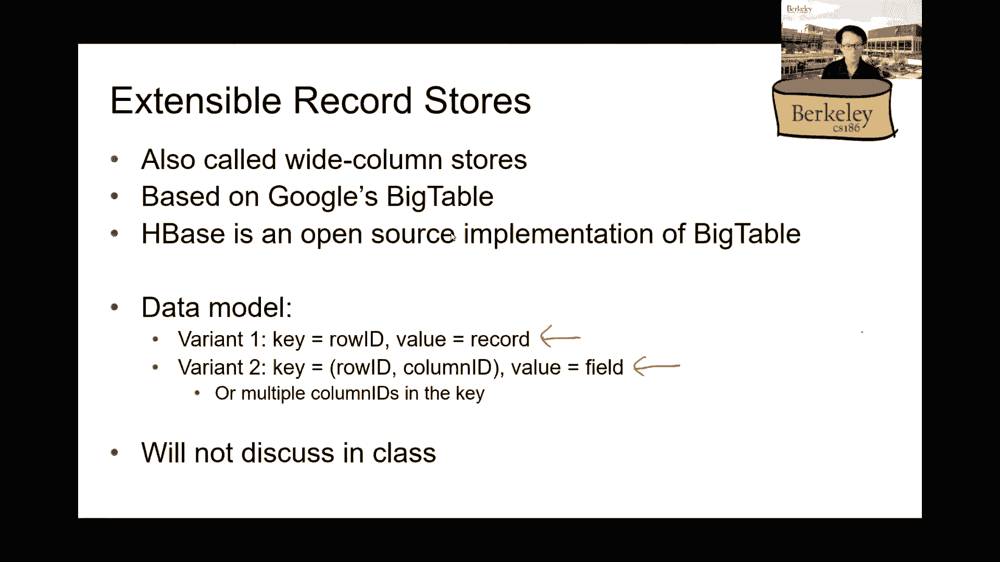

# 加州大学伯克利分校 CS 186 数据库导论 Introduction to Database System (Fall 2020) - P24：Lecture 24 NoSQL I - ___main___ - BV1cL411t7Fz

 Does it actually consume a lot of power？

 I hope it doesn't。 Ideally not。 But if you're scrolling through the New York Times。

 as much as I do every day， then this， is going to use less battery。

 My extremely preliminary research， that being I looked at like Deftico for about 30 seconds。

 it sounds like this is a powered off of sort of Apple， and Google's API for it。

 And they're listed as a trusted partner at the bottom， of the web page。

 I can't find any technical details， which I don't know if that's something。

 that we can be concerned about， but maybe I'll just， need to keep doing some more。

 I'll put a link in the chat to at least an earlier version， of the protocol。

 And if anyone wants to talk about this at all， definitely send me an email， make a post on Piazza。

 I think this stuff is really interesting。 I mean， it is actually developed on campus。 I mean。

 they probably might have released a code， right？ If not already。

 You'd be surprised what's not open source。 Dave， do you know？ I mean， are they releasing the code？

 I don't know。 I don't know。 The API is public。 I put the--， It's going to be an email。

 That's on the back one， right？ But then I'm talking about when you're the app that。

 ended up being developed on call。 Yeah。 There are other apps that are open source。

 I don't know if this one specifically is， but there are other apps developed in other countries。

 other backends。 We developed-- started developing it back。

 ended Berkeley as well that are open source。 So I don't know。 We'll see。 Hopefully it is。 I see。

 Maybe we should start， Alvin。 Oh， why？ OK， bye。 OK。 Not to keep us on track。 Great。

 So are we already recording today in the cloud？ Cool。 OK。 All right。 We'll keep up with that。

 So let's go back to our discussion of NoSQL。 So we started this on the Tuesday lecture。

 in terms of motivation。 So I just want to flash a few slides。

 in the beginning just to remind ourselves。 So these are the two classes of database applications。

 that we have been talking about in this class。 OLTP basically stands for Transactional Processing。

 And then OLAP or OLAP basically means， the kind of data analytical tasks that do not require。

 a lot of joints or transaction on the board。 Right？ So the reason why NoSQL came into existence。

 was because people wanted to be able to scale， to launch a large number of OLTP workloads that。

 are running for their startup or whatever the app that they're， doing。

 So that is a problem because relational systems， don't tend to scale that easily。

 So you guys already learned about parallel query processing。

 So the NoSQL solution was to basically give up， on some of the functionalities in trading off for easy。

 to scale up to like large workloads。 So that's where we stopped on Tuesday in the lecture。

 about talking about these type of motivation。 And by the way， by this point in the course。

 we have pretty much finished all the topics， that we want in comparable relational data systems。

 So as you remember， we talked about everything， from SQL from the very first week of the class。

 all the way up till last week， when we were talking about parallel query processing。 So far。

 we have only been talking about relational systems。 So NoSQL is basically our first lecture。

 talking about non-SQL type of data management systems。 So that's basically giving you guys。

 kind of like a flow of the class and where we are。 And then if time allows， we also want。

 to talk about things like map reduce and SPAC， which are again， data management systems。

 but they're not relational ones。 And as I was telling you guys last time。

 like the goal here is not to tell you that， like one of them wins over everybody else。

 So but more about like telling you guys， about the technical interesting ideas。

 behind all these different data systems。 And then let you guys be the judge about when。

 which ones you want to use and when。 So the motivation for NoSQL， as I said。

 was trying to scale up these transactional workloads。 And they are basically。

 and we are basically doing this by reducing the data model。

 and the type of functionality that we support， within the system。

 And you see what I mean in a few slides。 So on Tuesday， we also talked a little bit。

 about these different types of architectures， or like your attempts to scale up relational systems。

 So we ended up with this kind of three tier architecture。

 that most of web applications are structured these days。 So we have a database server backend。

 right？ Which is basically where all the data is stored。

 And then we have a middle tier that is doing， the application server workflow。

 So these are basically the front end web servers， that you get connected to when you let's say。

 go to like， you know， google。com or facebook。com or something。 So these are the kind of a。

 and then finally we have the client here， right？ At the third one。

 So that's what you're seeing on the far right。 So scaling number of web servers。

 the claim is that like scaling that is easier， than scaling the data， the data server， right？

 Because of the fact that we don't mean to worry， about things like consistency or like。

 your durability or that stuff， right？ Because like， you know， all the web server does。

 is basically connecting to the client， when they request for a particular page。

 or an action to be done， fetching the data from the database。

 and then rendering the webpage after that， and sending it back to the client。

 So relatively speaking， it doesn't have too much state。 So that's why it's easier to scale。

 than let's say like， you know， scaling off the database server， which we already talked about。

 with the parallel database metrics， right？ So one of the primary reasons why it's difficult。

 to scale relational database servers， is because of the fact that we want to have consistency。

 So think of all the 2PL stuff， all the 2PC stuff that we talked about， right？

 So we want to scale to large amounts of data， or like multiple database servers。

 that we need to worry about those different aspects。 Okay， and then like。

 you already know the story， about like what that means， we try to scale， when we have like multiple。

 multiple servers， that we need to deal with on the database side。

 So we talk about different strategies， in scaling up the database， right？ Again， relational ones。

 So one of them we already talked about。 So this is the idea of petitioning。

 So why don't we just split the data， across multiple database servers？

 So that's obviously one way we can scale up， in terms of being able to store large amounts of data。

 And then we already talked about like different ways， that you can petition the data， right？

 By range， you know， by hash function， or just by Brown-Robbin， right， for example。 And not a way。

 right？ It's actually to duplicate the data。 If we can afford it。 The claim here， however。

 is that like， for all both of these approaches， it's difficult to enforce consistency。

 So for petitioning， I think you guys already see the picture。 Why that is the case。

 And I don't need to repeat myself here， right？ Because basically now we are talking about 2PC。

 right？ For example， running that protocol。 It's definitely not like， you know。

 it's definitely not zero cost， right？ As you can imagine。 So just as a reminder， right？

 So scaling through petitioning basically means， that we have many machines that is used。

 for storing data in a cluster。 And the database might as well be fitting in main memory。

 if we have enough main memory available。 And then we just spread the queries。

 across the machines and that's it。 The claim here is that we can increase throughput， because like。

 you know， in the optimal case， where we don't need to touch multiple machines， to process a query。

 then like， you know， they can just run in parallel。 So each of the machines can be processing。

 different incoming clients。 So the number of clients that we can process strictly。

 is just depending on how many database servers， that we are able to afford。 Again。

 this is the big assumption that， like， you know， we don't need to run expensive protocols like 2PC。

 and we don't need to detect things， like that block detection and all that other cool stuff。

 As you can imagine， right？ You know， it's easy to write things in this world。

 because things have already been petitioned， across different servers。

 So once we identify the record that we need to update， we just update it there。 That's it， right？

 So the picture， this is like one picture that you might imagine。 So for example， like， you know。

 we split， across three different database servers， in this picture here。

 each of them is holding on to， let's say， a range of values， a range of the tool codes， right？

 So here， for example， the application can be updating， on the left most server。

 It might also be updating something else， right， on the right most server。

 And then for the most part， these updates， are pretty much independent， right？

 So that's like one of the benefits， of doing it through a petitioning。

 So another way to scale the database is through replication。

 So the idea here is to basically say that， instead of petitioning the data。

 why not just duplicate it completely， across multiple servers， right？ So like， you know。

 let's say I have three different machines， again， same situation here。

 If the data size is not that big yet， I can actually just replicate the entire data set。

 across all machines。 Why is that beneficial？ Because now I can spread the queries， right？

 Because everybody is getting the exact same， identical copy of the data。

 So therefore asking anyone of the servers， to process the incoming query is just as good enough。

 It's just as good as any other server， okay？ So in this case， we can also increase the throughput。

 right， of the system because of the fact that we can run these queries。

 in parallel across different servers。 And it's also good for fault tolerance。

 because even if one of the machines crashes， right， we can just route or reroute all the queries。

 to the other servers that are up， while we wait for the crashed server to recover。

 So therefore we don't need to stop the work， right？ Unlike in the sharding or the petition in case。

 where if one of the machines crashed， then it basically brings down with it all the data。

 that is currently holding。 So if any of the incoming queries wants to read。

 or write to any part of that data， then it's basically not available at that point。 In this world。

 however， it's easy to read data， but writes becomes more expensive。

 just because of the fact that we are now， replicating the exact data set across multiple machines。

 So therefore， writes to any one of those machines。

 will now be translated into writes across all the machines。

 because everybody is holding onto the same data sets， right？

 So it's good for spreading queries across multiple servers。

 because everybody is having the same identical data sets。

 so it doesn't matter which one you really get routed to。 The downside is that， like。

 if you ever want to update anything， then this is going to be expensive。

 because now we are talking about writing to multiple servers。 So what is the end goal here？ Well。

 so it basically means that if you have， in the optimal case， a read-only workload。

 that never writes anything or updates anything， then that's great because we never need to deal。

 with this problem of writes， right？ So therefore， we can just run the query。

 on any one of those servers。 So for example， if you are running queries。

 that try to compute aggregates， or try to compute statistics or something， right？

 So these queries don't need to update anything， so therefore it's good to be running them。

 across these replicated servers， for example。 So hopefully this gives you some sense。

 of like how scaling relational systems work。 So now let's talk about， like， you know， why no SQL。

 right？ So one of the primary reasons is because it's difficult， to replicate data， as I said。

 right for relational systems。 So I already told you the trade-offs。

 between the two different schemes that we have talked about。 So， like， you know， for example。

 in this case， let's say I have， these three different relations here， petitioning。

 Now basically means that we might end up doing joints， right， across multiple servers。

 If we need to read data that is currently reciting， on multiple machines。

 And we already learned about the different ways， that we can do parallel joints， right？

 So that took one whole lecture， just talking about that。

 So you can imagine how expensive that is going to be， right？

 Versus if we do scale up using this replication， or duplicated data set way。

 then we are running local joints， so that's great。 But then， you know， depending on how consistent。

 all these different servers are， because of the fact that there might be updates。

 that have not been propagated yet， then we might either need to wait。

 for those updates to be propagated， if you want to read a consistent view of the database。

 or we ended up returning values that can be slightly off。 Right？ So this is， again， a trade-off。

 right？ No such thing as free lunch。 So this is the problem with the relational model。

 And I have already explained to you why consistency is。

 turns out to be hard for both of these cases， right？ So no SQL came into the picture and said， like。

 okay， let's just simplify the data model。 So let's just， like， you know， use something。

 out of them relations。 And by the way， let's also give up some of the functionality。

 Is that relational systems tend to give us？ So for example， consistency。 Basically。

 that means if your application， ever wants to be able to run things like joints。

 or they care about reading the most up-to-date data， well， then they need to figure out themselves。

 So the option is always there， right？ So like， you know， the application developer can always。

 re-implement or implement some of these， functionalities on their own in the application itself。

 But from a database system point of view， those are no longer going to be functionalities。

 provided by the system itself。 Does that make sense？

 So think of it as like your implementing book base， except that there's no joints available， right？

 I mean， there's only selections。 You can read， right？ And then if you ever want to do a joint， well。

 read all the data yourself， and then implement your favorite joint algorithm， right？

 So that's always， that's always， that's always a case。 And then another way of contrasting between。

 relational systems and NoSQL is something， that you might learn in CAM1A。 So as said， right。

 we already talked about that， in this class， so not going to repeat what that means。

 And hopefully you guys will remember what that means， by the time the final comes。 And for NoSQL。

 they came up with something similar。 So we talk about basic availability in NoSQL。 Unlike atomicity。

 we're now talking about a case， where the application basically has to handle。

 all these potential failures themselves。 So we ended up talking to a server that is down。

 then is the application's responsibility， to figure out where to fetch the data from。

 So it's not going to， the database is not going， to provide even recovery， for example。

 That's one option。 And then that's what basic availability means， right？

 So it means that it's no longer always available。 Sometimes that is available， sometimes it's not。

 right？ So that's what V here stands for。 And then we also talk about soft state。

 So unlike in the relational data model， where everything has to be consistent and durable。

 in this case for NoSQL， we need to be able to handle cases。

 where the database state can actually change， while we are reading。

 And I'm not talking about phantoms here。 I'm just talking about the fact that。

 since the updates can take time to propagate， to the different servers in the NoSQL system。

 so we might need to do with the fact， that even without a new incoming query。

 that is trying to update anything， different reads from a single application。

 can actually return different results， just because of the fact that new updates。

 could have been propagated while in between， the two reads that the application is trying to do。

 And then they also talk about eventual consistency。 So basically what that means is。

 the database will eventually become consistent。 So this is a consistency model。

 that we have not talked about in this class。 So in this class so far in the relational model。

 we have talked about like， we want to run like， you know， straight to BL。

 we want to have serializability， and all the other good stuff， right？

 But in NoSQL we now talk about， we don't really care about whether things are serializable， or not。

 So notice that this is different meaning， right？ And saying that there's no consistency。

 All this is saying is that eventually， the database， the databases will become consistent。

 meaning that we can tolerate late updates， or updates while we're trying to do reads。

 and all that other good stuff， right？ So we're not saying that we're completely flowing。

 consistency out of the window。 All that we're saying is that things。

 will eventually become consistent， but then we're not saying when that will happen。

 Eventually it might mean in 10 minutes an hour， or like never for example， right？

 Or like infinite a lot， right？ So that's not violating anyway。 So like， you know， that's basically。

 some of the things that we talked about in NoSQL。 Why is that okay， right？ For example， well。

 I mean， think about， if you're running， if you're implementing， like your IG or something。

 right Instagram。 So like， you know， do you really care that much。

 if someone is posting a picture on like， you know， his or her account and then pop。

 propagating that update to everybody， like， you know， that follows that particular person。 I mean。

 maybe not， right？ So it's okay if some of your friends see a picture first。

 before some of your other friends see that later on， right？ So， you know， big deal， okay？

 This is not， this is different from the banking example。

 They were talking about what we were voting for， voting training transactions， right？

 So for transactions， you probably don't want to live， in the world where like， you know。

 money can be deducted from your account， but not yet deposited into like， you know。

 the other person or your friends account， right？ That's not okay。

 So there's a different application use case， that we are talking about here。

 So here we are talking about the Facebooks， and the IGs and all the social networking websites。

 for instance， right？ Where， you know， it doesn't really matter whether like， you know。

 post or wall shows up or like， you know， later on or take a little bit of time to propagate。

 So those are the kind of applications， that we're talking about here。

 But to round this line and why am I saying cam one day， right？ Because like， you know。

 this is the acronym， that we came up with or NoSQL based， right？

 And that is exactly in contrast to acid， which came from the relational world， right？

 That's something that might actually help you guys remember， the difference between relational。

 and NoSQL systems。 Any questions about this so far？ Okay， so now let's talk about data models。

 in the NoSQL world。 So it turns out that there are a few of them actually， to choose from。

 So it's not like， you know， unlike relational systems， where everything is stored in relations。

 And NoSQL world is basically talking about， it's basically using something other than relations。

 to store data。 So let's talk about different data models。 So in this class。

 I just wanna briefly talk about the first two， and then we'll actually focus more。

 on the last one called document stores。 But， you know， we first need to understand。

 what is the basic principle， behind these different data models in NoSQL。 So the first one。

 key value stores。 You guys have probably heard about key value stores before， right？

 Can I get a show of hands？ For those of you who have heard about this？ Yeah， for sure， right？ Yeah。

 key value pairs。 Yeah。 Great。 Yeah。 So what does that mean， right？ So this is extremely simple。

 So it's basically saying that everything， is can only be a key and value pair。

 So we're not talking about relations with a schema。

 and then with like the columns and all the other good stuff。 Okay。 In particular。

 key here can be anything， like a string or an integer。

 as long as it is unique for the entire data sets。 So think of that as like， you know， primary key。

 that we already know about in the relational world。 And value can really be anything。

 It can be like an array， a list of names， a set， a picture， you know， a binary blob of file。

 anything。 So it can be anything that is complex。 As long as there's a way to uniquely identify。

 that piece of data， otherwise no one's the key。 Okay。 So that's it。 So forget about like， you know。

 normal forms， or the fact that you have， we even have to have like every tool bowl。

 have the same schema that got， I think no more schema here。

 Everything is just a key and a value pair in this world。 And the operations that are supported。

 is only gets and puts， right？ Gets just is another way of saying retrieval。

 based on a prime based on the key。 And input is basically a way to insert data。

 into a key value store。 And then it doesn't support anything else。 So for example。

 if you need to extract something， out of a value， right？ So like let's say， you know， use， you know。

 let's say we put a list of names as a value， right？ Or list of friends， for example。

 or a particular person。 Then if we want to check with it， like， you know。

 so and so is a friend of that particular person， that we need to write that out position now ourselves。

 It's not supported by the system。 Okay。 So all that， all the systems support is just get and put。

 That's it。 So one of the benefits， right？ I mean， you can already see that it's relatively easy。

 It's an implement that， right？ So imagine we are， imagine we give you this。

 like you ask the assignment for look page， right？ I think all of you guys were just like being。

 like， you know， smiling now， right？ If that's the case， we don't want to support anything。

 There's no joint。 There's no like group by， there's no equity。 None of that news。

 Forget about transaction， for example， right？ Is this system just a hash map？ Well。

 you can think of it。 Yeah， in a sense， it is just a hash map。

 It's a gigantic hash map in that sense。 However， they， you know， we do need to support， like。

 you know， distribution of data of this key value pairs。

 And that also is made simple because of the fact that， you know。

 we can just use hash based petitioning， as a very simple example， right？

 Or just replicate the data across multiple servers， just like before。

 And what I'm saying here is multi-way petitioning。

 is just the same way as what we've been talking about earlier。

 the relational parallel database system， of using hash based petitioning to split data。

 The question， however， is like， you know， how to implement， get and put， right？ For example。

 so let's get， go through an example here。 So let's say I want to store， like， you know。

 this piece of data， this， like， you know， data set here consisting of flights and carriers。 So。

 like， you guys already know how to do that， in a relational system， right？ So， you know。

 just declare two relations， and that's it。 But in a key value store。

 that turns out to be different ways， that we can do that， right？ So for example。

 we can have to keep being the slight ID， which of course should be a unique identifier。

 And then be the value being the rest of the record， right？

 So basically all these different attributes do。 We can also have the key being the date of the flight。

 which， you know， should be also unique， right？ Because there's only one， like， you know。

 November 19th， 2020。 And then the value just corresponds。

 to all the flights that happened during that day。 You know， that's another option。 I mean。

 not saying， like， it's wrong or right， or， I mean， you know， it gets the job done。

 And it stores all the data that we want。 And then another one is， like， you know。

 by origin and destination pairs， and then all the flights in between。 Which one is better？ Well。

 it depends on what is your use case， right？ So if your use case is， like， you know， an application。

 that allows people to look up flights between two cities， then obviously， option three is the best。

 Because that allows us to immediately fetch all the flights， that we want， right？

 So think of how you might want to do， implement the same thing。

 if you were to use a relational system， with these two particular relations， for example， right？

 So if I want to write a query， that， like， you know， fetches all the flights from San Francisco to。

 like， New York or something， right？ I mean， now we are already talking about a joint， right？

 Because we need to do a self-joint order to break out， these cases。 Okay？

 But then if we use option three， for instance， right， as a no-sequel store， then it's trivial。

 right？ And then just get the right city names and then send it， over to the database， and that's it。

 Okay？ So， you know， that's basically one of the trade-offs， that I want to mention。

 And then as I said， right， there are multiple ways to， partition data in this world。 You can。

 we can use a hash function， or we just， we can just， replicate data， right？ As I mentioned before。

 we can store things on multiple servers， and on an， and when an update happens， let's say。

 when a put happens， right？ Then we can propagate the changes to other servers as we like。

 We can propagate them immediately。 We can also propagate them， like， you know， as time allows。

 right？ That is the principle of eventual consistency。 Except， as I said， right？ You know。

 if we ended up needing to， if the application， actually need up-to-date information。

 then it might need to， actually first check whether it has， it is talking to replica。

 That contains all the most up-to-date data。 So， like， that is possible to be done， right？

 As you can imagine， we can implement that functionality。

 in the application itself to do the checking。 Maybe another application actually doesn't care about。

 like， you know， reading up-to-date data。 And if that's the case， well。

 then don't bother doing the check。 So， here， again， right？ The idea is that， when you know。

 by pushing the functionalities into， the application， then it makes the database system， right？

 In this case， the no-sequel system implementation to be very simple。

 We're basically trading off the fact that， you know。

 not every application needs to read the most up-to-date information， and therefore， if you need it。

 well， implement that on top of the， database server or database system itself， right？

 And by default， the system is not going to enforce that unless， someone wants to do it。 But that's。

 again， it's up to the application。 Are we clear on this？ Okay。 So， as I said， right？

 That's one of the ways， one of the data models for no-sequel。

 which is as simple as just key-value stores。 Another one is called extensible rack-up stores。 So。

 this one is also called wide-column stores if you look up on， but， you know， the literature。

 It's actually based on a paper from Google called Bigtable。

 It's one of the first no-sequel stores out there。 There's also an open-source implementation of that if you want。

 to play around with it。 The idea is basically like， you know。

 one level up about basic key-value stores。 So， they want to retain some of the features of relations。

 namely the fact that， like， you know， there is， there are rack-ups， there are， like， you know。

 there's just aspects where every table， contains only two posts of a specific schema， for instance。

 But then they also want to have the flexibility of key-value stores。 So。

 what they ended up proposing is this idea of， like， you know。

 having a data model still being key-valued for the most part。 But then， like， you know。

 the key here is kind of restricted。 So， it can still have a unique identifier and then have。

 as the key， that's possible。 But then now we're restricting。

 but then another way is to basically say， that the key itself is a combination of rows and also columns。

 So， they're basically bringing back this notion of a schema， just like in a relation。 So。

 you can no longer just stick anything that is a unique identifier。

 if they were to all reside within the same table。 So。

 big table basically brings back this notion of a collection of two posts， with a similar， similar。

 with the same schema together as in a relation。 But then they don't want to restrict every single。

 every single two posts， to have the exact same key。 So， basically， they say that， okay。

 so one way we can do that is by having both， a row ID as the key。

 or we can also have a combination of the row ID， and some combination of the columns to be the key value。

 Sorry， to be the key in a tuple。 So， all two posts within the same table would still need to have a schema。

 But then， like， it's not the case that every single row needs to be looked up。

 using only as unique identifier。 So， we can look it up by also the combination of the unique identifier。

 otherwise， otherwise， with the row ID and also some subset of the attribute names。 Otherwise。

 it's pretty much the same thing as key value store。 So。

 we won't be talking too much about that in this class because this is just。

 basically a hybrid between key value stores and the relational systems that we know about。 So。

 Nick is asking， "Is it this functionality pretty much the same thing as key value？"， Yeah。

 it's actually very much similar。 The only thing is we're now bringing back a little bit of regularity into the picture here。

 because we're forcing every tuple to have a bunch of column names。

 just like in a relational system versus in the key value case。

 it doesn't even need to have column attribute names at all。 So， for a while column。

 it's easier to query by two full columns。 So， it also depends on your use case that you have in mind。

 So。

