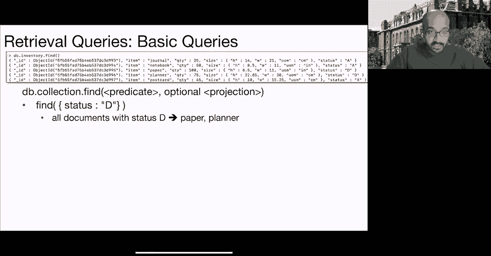
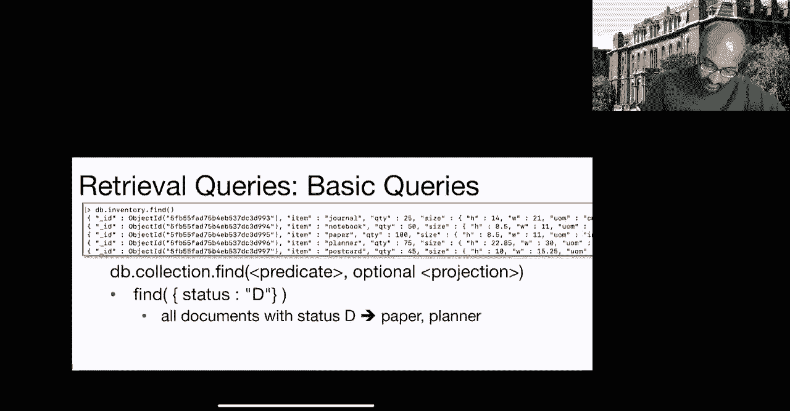
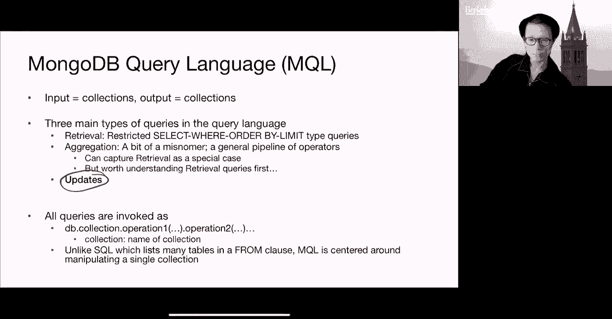

# P25：Lecture 25 NoSQL II - ___main___ - BV1cL411t7Fz

是啊，是啊，大家都好吗？是啊，是啊，也祝大家感恩节快乐，嗯，火鸡是我最不喜欢的肉，也许我只是没有吃到好火鸡，嗯，在我走之前有问题，我看到可能有四个人开着他们的视频，所以如果有其他人愿意打开他们的视频。

那将不胜感激，否则，我真的无法读懂我的概念有多少通过，太厉害了，好的，所以我们说的是MongoDB好吧，所以呃，我们为什么要谈论蒙戈DB井，A它与你的项目有关，B这有点有趣，典型的。

有一些非常有趣的设计决定，嗯，这与关系数据库形成鲜明对比，值得探索，好的，所以出于这两个原因，我们在看MongoDB，我给了一点历史，在MongoDB周围，所以我可以通过这张幻灯片，再简短地说一遍。

只是为了回顾发生了什么，所以我们讨论了MongoDB是如何开始的，有点，DIY数据库对，所以他们基本上是从头开始建立一个数据存储，最后选择了不同的，一路上做出不同的选择，嗯，但在这一点上，我会说。

MongoDB已发展成为成熟的数据管理系统，这被用在一堆真正的，嗯，不同的公司有非常不同的信息需求，它有一些有趣的，就像我说的，将设计决策与关系数据库进行对比，好的，所以他们有，在，事实上。

我们学到了许多规范的DBMS课程，与2010年的供品形成鲜明对比，我们将在休息时重温，好的，今天我将专注于两个设计决策，我们之前讨论过数据模型，但我要重述一下，我们还将讨论查询语言。

然后我们会讨论一些建筑方面的，Mongo DB做出的设计决定，好的，好的，所以重述MongoDB数据模型，呃，mongodb，就像数据库管理系统有数据库的概念一样，嗯。

数据库系统中的关系是MongoDB中的集合，嗯，dbms中的记录或行是mongo db中的文档，BMS中的列在Mongo DB um中被称为字段，但您也可以将其称为属性，如果你愿意，都是一回事，好的。

因此，在Mongo DB中相当于行或记录的文档，基本上是字段值对的集合，这些值本身可以是原子的，所以它可以是字符串或整数，布尔值，也可能是一份文件，这基本上是说我要把一个文档嵌套在一个文档中。

也可以是原子值数组，所以三个数组，四五，比如说，或文档数组，所以这里可能是一个文档，逗号，另一份文件，逗号，第三份文件，等等，对呀，所以这些都是你可以选择的价值，每一个都需要不同的查询方式，就这样。

思考这些不同类型的价值观是很重要的，以及如何公开这些类型的值，嗯，当你退出的时候，呃，蒙戈，db，好的，这是一个文档的例子，这里有一个，尺寸，这是一个嵌套文档，它有高度，十四重，二一以此类推，好的。

这是一个原子数组，这基本上是Alvin描述的JSON数据模型，所以基本上他们在内部通过了相同的数据模型，它存储为二进制JSON对象，我提到了模式验证的概念，MongoDB可以使用模式验证来强制。

某些类型的完整性约束在实践中很少使用，所以我们要跳过这个，我认为我们都应该记住的一个领域，是MongoDB非常依赖的主键字段，这被称为或表示为下划线ID，这只是符号，嗯，这是主键。

它将在默认情况下被索引，如果在摄取某些JSON文档时不存在，你就把它加进去，或者Mongo DB会自动为您添加，所以这个下划线id字段将是第一个属性，或每个文档的第一个字段，而这个领域是一个特殊的领域。

因为它很特别，我们将不得不用一种特殊的方式来处理它，当我们以后做预测的时候，所以MongoDB查询语言基本上是在集合上操作的，所以这是一个文档和输出的集合，收藏。

所以在这种Mongo DB查询语言中有三种主要的查询类型，我称之为MQL，我不认为这是什么，官方文件称，但我喜欢给它一个简短的形式，和续集对比一下，所以我叫它MQL，所以有三种不同类型的查询，一个是呃。

检索查询，这基本上是一种按限制排序类型查询，然后您就有了聚合查询，实际上称为聚合管道，嗯，这是操作符的通用管道，可以作为特例捕获检索，所以这有点好笑，嗯，就像我在上一堂课上提到的。

这可能是由于历史的原因。或者因为查询优化的原因，因为他们把检索作为一个特例，因为检索是一个足够重要的特例，我们将首先讨论检索，然后是更新，对呀，那么如何更改数据，如何插入，删去，更新，以此类推好吧。

这是三种不同类型的查询，嗯，所有查询都涉及到以下内容，呃方式，对呀，所以我们基本上有，嗯，点操作二等，在这次行动中，您可以有子操作，就像我们将在聚合案例中看到的那样，这里的集合是指集合的名称，米埃尔。

正如其中一条评论所暗示的那样，嗯，以收藏为中心，好的，所以它基本上是围绕着操纵单个集合，然后对该集合进行操作，你可以把它和其他收藏一起加入，或者你可以用某种方式改变它，但围绕着一个单一的集合续集，当然。

在from子句中列出了许多不同的表，所以查询与关系是不同的，对呀，所以它有点不同于一种关系，mql，嗯是围绕着一个集合，然后您继续以各种方式操作该集合，这导致了某种奇怪的行为，我们将看到。

所以MQL的一些基本原理，第一个是点符号，点表示法会很方便，当我们处理数组和嵌套时，好的，因此，它允许我们深入挖掘嵌套文档和数组，嗯，所以回想一下你的价值，与字段关联的值可以是原子的，可能是嵌套文档。

可以是原子数组或嵌套数组，那么点符号在这里是怎么起作用的，所以如果我们有，嗯，一个被称为库存的领域，我指的是库存，库存数量中的点QT Y，这基本上是In stock字段中的一个数量字段，好的。

所以这只适用于，当库存是嵌套文档或嵌套文档数组时，好的，所以既然我指的是一个场中的一个场，库存本身必须是一系列嵌套的东西，或者嵌套的东西本身，因此，如果库存中有嵌套文档。

那么数量可以是该嵌套文档中的一个嵌套字段，如果库存中有嵌套文档数组，质量可以是该区域内多个文档中的嵌套字段，好的，所以我被留在Q ty作为里面的东西，呃，这些嵌套文档可以在数组中。

或者有一个单一的嵌套文档，另一方面，如果我指的是数字而不是字段名，那么我指的是数组的一个元素，好的，所以在库存一中，基本上意味着我指的是in stock数组中的第二个元素，所以你有零索引，好的。

所以在股票点，零引用InstallArray中的第一个元素，因此，如果这个元素是一个值数组，它可以是一个原子值，如果它是一个文档数组，它也可以是一个嵌套文档，到目前为止的问题，所以在库存中。

一个点的数量指的是，呃，所以这是两者的混合体对吧，所以这是指，比如说，库存数组中第二个文档中的数量字段，所以自从我用了一个，这意味着库存中肯定是一个数组，数量必须是一个嵌套的字段，呃。

第二个文件在库存点一，呃，在这个库存数组中，所以一个时髦的事情，um mql是这些点表达式需要用引号表示，所以无论你在哪里使用它们，你需要用引号来表达它们，为什么打我，好的，所以这就是它的表达方式。

这是MQL的第一个组件，让我们来谈谈第二个组件，也就是美元符号的使用，所以美元符号在MQL中是特殊的，美元表示下面的字符串，呃，美元符号后面的字符串是一个特殊的关键字，所以你可以有一个美元符号。

然后是大于美元符号的GT，然后是小于或等于美元符号的LTE，和广告，它试图把两件事加在一起，美元符号，LM匹配，我们以后会讲到，这是一个特殊的关键字，这对于在数组中强加条件很有用，是呀。

那个进口评论是什么，所有关于，是啊，是啊，你说的话，关于进口的事，但我真的不明白那是什么意思，你说会是你，我不是什么，不管那是什么意思，哦，为什么为什么为什么他们必须在引号中，你在引号里听到了吗，是的。

是的，我误解了你说的话。所以他们必须是，它们必须在引号中，是呀，在引号中抓住你，是啊，是啊，不进口，像我一样得到了它，我在这里做过，你在报价中的库存，嗯为什么，我不知道，就是这样做的，酷，所有的权利。

所以美元表示一个特殊的关键字，当您使用特殊关键字时，您将其用作字段的一部分，字段冒号值表达式的一部分，所以这将被其中一个东西取代，所以一个问题是我们如何处理二进制运算符，所以如果你想做一个版本。

如果你想做一个大于或小于或等于，它涉及两个操作数，那么你怎么表达得很好呢，所以这通常是左操作数，然后是关键字，然后是右Opera，它都是这个文档符号中的句柄，所以您使用嵌套文档来捕获关键字。

和正确的操作数，这种时髦的一部分，难以适应，但他们就是这么做的，将此与SQL进行对比，在哪里，如果你有一个表达式，你可以用你想要的方式来表达，你不需要有这种水平的嵌套，并从本质上解析表达式，呃，续集。

续集，在这里为您进行解析，您基本上必须指定这个嵌套结构，以帮助，也许MQL解析器，好的，那是我的猜测，我也猜另一个区别，操作员，所以在这种情况下，我们在这里，对权利有约束力，与向左绑定相反，好的。

那是美元符号，另一部分，嗯，所以有一个例外，然而，如果你用美元符号，后跟字段名，你可以，嗯，这是一个例外，美元符号不仅仅是，呃，引用关键字，但是当你使用美元符号，然后后面跟着字段名时。

你通常在价值方面使用它，不在场边，好的，所以呃，例如，有时，您可能有一个字段名，右歌剧的一部分，比如说，对呀，所以嗯，那可能是，但如果你用的是费用，嗯，你通常在它前面有一个美元符号来表示它不是，呃。

它不仅仅是一根绳子，所以这是为了消歧，仅与聚合管道相关，让我们不要担心这个，就目前而言，我们稍后将重温这一点，看看为什么它有意义，好的，让我们来谈谈检索查询，呃，模板，因此检索查询模板如下所示。

所以你基本上说DB点集合，所以这很常见，然后你提到了谓词，然后提供一个可选的投影类，所以这里的语义是，返回此集合中与谓词匹配的所有文档，然后只保留投影中指定的字段，所以伊森说电影元数据查找是一个特例。

你没有美元的地方，这并不总是正确的，你说的对，我们以后再谈查找，这不是很令人困惑，没有一致性，这是这是令人困惑的，但我们会尝试的，我会尽量简化，正如加布所说，我们只是想告诉你MongoDB是如何工作的。

不要要求我们为它辩护，好的，所有的权利，所以谓词投影，好的，所以您需要与谓词匹配的文档，保留投影中指定的所有字段，那是个目标，好的，嗯，这里有趣的是谓词和投影都表示为文档，我甚至要说。

我表达的大多数事情，这份文件，这也是MQL的一种非常不寻常的设计选择，我们将遇到的几乎所有东西都将是一份文件，也许是一个数组，所以它将是一个文档和数组，就是这样，所有的权利，所以这个。

第一个也是最简单的查询基本上有一个空谓词，没有预测，对，所以它会返回所有的文件，所以在这个简单的例子中，我有五份文件，嗯，与我库存中的各种项目相对应，好的，所以日记，笔记本，纸质规划师和明信片。

各种数量，各种大小的，嵌套文档，嗯，和状况，注意到我有我的主键，下划线id，哪个是每个文档的第一个属性或第一个字段，勇往直前，让我们采取一些基本的，呃，查询示例，那又怎样，如果我找到了。

然后在我的文档中，我列出了状态，冒号d，基本上这意味着，找到我所有状态正确的文件。

所以status将引用文档中的一个字段。

所以在这个特殊的例子中，这个文档有d，这个文档有d，所以你最终会归还纸张和规划师，好的，因此，您最终将完整地返回这两份文件，因为你要求我们和D匹配，这里有另一个例子，我希望数量大于或等于50。

所以注意这里，本质上是在做一个，嗯，大于或等于，但我不得不以这种嵌套文档的方式引用它，所以这基本上是说，给我找出所有数量大于或等于50份的文件，所以让我们通过，嗯，我们的例子，看看哪些大于或等于50。

嗯，这个大于等于五十，这个和这个对，所以你最终会回来，然后如果我有两个用逗号分隔的单独子句，那么我基本上是说我想要这两个谓词中的一个和，所以我想找到满足两种状态的文档等于D，并且数量大于或等于五十。

所以在这种情况下，它将是这两个集合的交集，所以你要把纸和规划师都还回去，就是这样，那么我们要怎么表达R而不是，所以在这种情况下，语法有点时髦，所以你说都是美元符号，因为它是一个特殊的关键字。

然后这里有一个数组，在这个数组中，你有嵌套的文档，每个指示谓词，好的，所以地位等于D或数量小于30，比如说，好的，所以在这种情况下，我想找到所有的文件，要么满足，要么有D要么质量不到30，在这种情况下。

它将是，也许只有日记本的数量少于30本，所以结果可能是这样的，好的，这实际上是我运行这个示例，这就是这个查询的结果，所以你只要把这三份文件，关于这个的问题，好的，所以这是，这些是基本的查询，所有的权利。

那么我们如何查询嵌套文档，所以嗯，您可以简单地指定一个嵌套的，呃，查找中的谓词，呃，呃，在第一个找到正确的论点中，所以说，比如说，我说嘿，我希望大小与此文档相等。

基本上意味着我想对嵌套大小的文档进行精确匹配，包括字段的排序，所以必须完全匹配，嗯，包括订购呃，这些领域，H W和计量单位，所以在这个特殊的例子中，唯一匹配的是这份特殊的Nessus文件，也就是日记。

如果要查询嵌套文档中的某些字段，该怎么办，但不是其他人，这就是点表示法派上用场的地方，因此，您可以使用点表示法显式地引用此嵌套文档中的元素，所以你可以说嘿，我希望尺寸点的测量单位等于厘米。

而尺寸为网点高度大于十四，并这样做，我基本上在我的，请注意，这里我不需要为大小添加引号，但如果我用圆点表示法，我确实需要再次添加报价，蒙古人做事的方式，所以我在这里查询一个嵌套的字段，多个嵌套字段。

测量和高度单位，在这种特殊情况下，我希望身高大于14，我希望我的计量单位是厘米，所以让我们看看哪些是匹配的，有什么猜测吗，哪个匹配，好的，我想我已经给出答案了，所以它是，这个大于十四个，这个大于十四个。

我想没有，这不超过十四，这等于十四，所以这一个匹配，这是唯一一个大于十四的，也有厘米的计量单位，所以Planner是对此的唯一回应，所以检索适用于数据库中的所有文档，不仅仅是顶级的，否。

所以这就是收藏中的一切，所以你指的是一个集合，对呀，所以这是DB集合，但很好，所以你基本上把这些收藏，然后通过谓词和投影传递它，有道理尼古拉斯，是啊，是啊，我想我只是有点困惑，因此，如果您运行检索查询。

它可能会给出正确的设置，给你两个都像一个顶级文档和嵌套的东西，所以呃，好的，所以是的，所以一想到它，用下面的方法，你有收藏，好的，所以集合基本上是模拟一个关系，收藏有一套文件。

这些文档中的每一个都可以有自己的嵌套文档，但是我们操作的粒度是这个集合，好的，因此，此集合中的每个文档都是在，检查某个谓词是否，呃，如果谓词对于此集合中的每个文档都成立，您可以选择性地投射出一些字段。

然后返回结果，所以这是有道理的，因此，您当然可以在该集合中的每个文档中引用嵌套的内容，但你是在收集的水平上运作的，好的，谢谢，这很有道理，我认为问题主要是它是否会进行递归检索，对呀。

所以如果你有一本书中的一本书，对吧，对不起，嗯，我想是的，如果你有一本书中的一本书，它会只是取回顶层的体积吗，或者它们也进入嵌套级别，它要取回顶层的书，它基本上会检查，如果顶级书籍满足某些条件。

然后它会检索所有顶级书籍，满足条件的，嗯，如果你想把嵌套的东西拉出来，那是不可能的，你其实可以，嗯，把东西展开，使用聚合管道，我们以后再谈，好的，所以好的东西是漂亮的，对不起，的。

检索查询一个函数的罚款是相当简单的，它基本上检查每个文档是否满足某些条件，如果是这样，它将应用投影返回，在顶层返回该文档，好的，所以嗯，我们如何操作文档的数组和数组，所以我用了一个稍微不同的例子，嗯。

所以在这种情况下，我有嗯，基本上这些都有库存，呃，数组，每个都是嵌套文档，其中包含位置和数量，嗯，我还有其他数组，所以这是一个有空白和红色的标签，呃或者尺寸，可能是长度和宽度之类的，对呀，好的。

所以这个新的例子，它允许我们围绕文档的数组和数组提出问题，让我们看看一些例子，所以第一个是，嗯，退出数组，好吧，如果我说标签冒号，然后我有一个原子数组，基本上意味着这个数组必须完全匹配。

所以找到所有对应于这个字段标记的特定数组的文档，哪些匹配，在这种特殊情况下，它应该是不匹配的，好，好的，是呀，所以只匹配这个，对呀，笔记本，它应该不匹配空白逗号红色，因为它是同一个数组，但它翻转了。

所以这是这里唯一匹配的，所以只有笔记本，如果我只问红色呢，不是红色，而是空白，所以我只查询了数组中的一个元素，所以这里的语义是，如果数组中的任何一个元素匹配红色，然后它就回来了，所以这肯定符合日记。

因为你读过，笔记本，因为你读过，嗯纸，因为你读过，规划师，你读对了，因此，所有四个都将被返回进行该查询，如果我想找到有标记读取和标记平面的数组，我基本上把它们列为多个谓词，在我的谓词列表中。

这里的语义是find，确保对于与标记相对应的数组，有一个元素匹配红色，另一个元素可能是相同的元素可能是另一个匹配游戏的元素，所以一根火柴是红色的，在这个特殊的案例中，一个与普通的匹配，嗯。

这是唯一匹配的例子，就是这个纸的，其他的都不匹配，语法字段似乎很迟钝，有人有这种感觉吗，所以这是我如何合理化的权利，我认为处理带有文档的数组会增加复杂性，就像一团糟一样，如果你。

如果您使数据模型更加复杂和灵活，这就是一些复杂性的来源，你什么都没看到，然而，这是我想说的，我是说，还会有更多，嗯，括号是否表示完全匹配，方括号表示完全匹配，我以为这一切，意思是数组，就在这种情况下。

不是吗？是啊，是啊，所以这是呃，这个这个，这个括号表示数组，如果将数组列为，呃，谓语，然后它会与数组完全匹配，对不起，我不清楚，是啊，是啊，所以大家注意到了，就像你知道的。

这里每个函数中的参数实际上是一个有效的json对象，右是具有键值对的对象，就像你的钥匙被征税了一样，然后价值就是它是正确的，呃数组在第一个案例中的第一个案例中，然后在第二个三分之一处有一个单弦，是啊。

是啊，就像我之前说的，一切，每一个争论到每一个，呃，函数是文档，它们只是保留了文档的概念，奥基，多克，嗯，这里有另一个例子，假设我想找到呃，数组，呃，其中一个元素大于十五，另一个小于二十。

我基本上会列出数组名称，然后列出第一个谓词并列出第二个谓词，所以在这种情况下，我不确保这个数组中的单个元素大于15，不到二十个，我保证一个元素大于十五个，另一个不到二十岁，所以就像在这种情况下对吧。

那么我该如何纠正这一点，如果我想要一个大于15的元素呢，但不到二十个，所以我会用这个LM匹配来做到这一点，um键盘，所以我会说dim是数组美元LM匹配的名称，它基本上是说找到一个匹配的元素。

条件是这样的，好的，所以值部分中的in，我列出条件，所以我想要大于十五，不到二十岁，在这种特殊情况下，唯一匹配的，这个，这个值在十五分处，二五，其他一切，所有权利。

所以如果我想说数组中的一个特定元素需要有一些属性，请记住，我们的点表示法允许我们通过引用数字来索引到数组中，所以如果我说暗淡点1，这意味着暗淡数组中的第二个元素，因为我用的是点表示法。

我需要把东西放在引号里，所以我说暗1大于2 5，这意味着第二项需要大于2 5，在本例中，这是唯一一个匹配得很好的，第二项是三十，所以呃，我要回规划师，好的，这就是数组，让我们谈谈文档数组，好的。

所以加上，嗯，就像数组大小写和文档数组大小写中的文档大小写一样，如果我按原样列出文档，嗯，它基本上会做一个完全匹配，好的，所以第一种情况是一样的，呃，查询所有三种类型，所以这里我基本上是说，我想要库存。

呃，在这个库存数组中，我想让你找到，呃，所有的文件，有确切的文件，好的，所以锁是一个数量是五个，在这种特殊情况下，只有日记匹配，因为它有一个嵌套的，呃，其数组中的文档满足此条件。

然后我可以进入这个嵌套文档，嗯，再次使用点表示法，所以我可以再一次说库存点数量，我得把东西放在引号里，因为我在这里用圆点表示法，我的意思是指示数量大于或等于20，这意味着我想找到，嗯，所有的文件。

存在嵌套文档，大于或等于二十的数量，所以有没有猜测哪一个会匹配，希望，这个字体不太小，你还可以读，纸张和规划师，是的，所以这里有60张纸，和规划师，这里有40个数量，因此，这些确实是存在嵌套文档的情况。

其数量大于，或等于二十，我也有明信片，为什么我有明信片，是呀，我有明信片，因为有一个值3。5的嵌套文档，所以这也是答案的一部分，所有的权利，那么如何混合和匹配数组和文档查询。

所以我可以通过做dot来做到这一点，数组数或索引数，点属性，所以我在这里指的基本上是库存，是一个数组，我想要数组数量的第一个元素，数组的第一个元素将是一个嵌套文档，我希望嵌套文档数量大于等于20。

所以猜猜什么可能匹配，这基本上是沃伦的答案，对呀，呃，纸张和规划师，因为对于明信片来说，第二个文档匹配，所以文森特要求的第一个条件是归还文件，如果库存包括文档谓词，或者等于谓词，这里那是什么意思，呃。

我不知道，我不能很好地解析你的问题，文森特，呃，我的问题就像，当且仅当库存中包含唯一的谓词时，是否返回文档，因为库存是一个列表，它必须包含谓词吗，还是必须是那个谓词，我的问题是。

所以我还是不完全明白这个问题，所以你有没有被问到你指的是这两个中的哪一个，你指的是这个还是这个，哦，另一个非常第一个，或者是第一个，是呀，好的好的，所以我基本上这意味着当我列出这些东西时。

库存中有一个数组，然后我想要嵌套文档数组，然后我希望数组中的任何一个文档都与此完全匹配，哦，好的，明白了，谢谢。我想他可能在问文档是否可以包括其他属性，不漂亮不，不是在那种情况下，是啊，是啊，好吧，不。

所以决赛，希望这里的最后一个例子是，呃，当嗯，就像我用火柴在我的神父身上找到一个元素一样，呃，满足一定条件，我可以用EM匹配来确保，既大于10又小于或等于20的，所以我想明信片不会包括在第三个条件中。

是呀，所以你是对的，所以明信片不会是其中的一部分，嗯，dp dot find返回文档数组还是包含文档数组的文档，所以dp dot find基本上返回一个集合作为输出，对呀，所以基本上是文件的集合，好的。

所以嗯，与LM匹配的对比，如果我想找到，呃，那些有文件的地方，嗯，那些库存数组中有一个数量大于10的文档的文档，以及数量小于或等于20的另一份可能的文件，我会用这种方式来表达。

所以请注意这和LM匹配之间的对比，LM匹配基本上是说在指令中必须有一个单一的元素，满足此条件的a，在第二种情况下，呃，没有这样的限制，因此，您可以在数组中有两个独立的元素，并满足以下要求，好的，所以呃。

我们讨论了谓词部分，让我们来谈谈投影，好的，那么第二个参数会发生什么，我们能不能去掉一些属性，呃，比如说，在输出呃集合中，所以嗯，所以这里的语法是，基本上，您只使用一次来指示您想要哪些字段或属性。

这里的一个例外是下划线id属性或字段，它总是存在的，除非您明确排除它，嗯，0用于表示不需要的属性，不允许混合0和1，我们接下来会看到一个例子，好的，所以最简单的情况基本上是我有一个空谓词，我想。

我说项目冒号一，这意味着我希望在输出中保留item字段，嗯，我希望保留下划线ID，因为默认情况下总是保留的，我不想要任何其他领域，如您所见，输出只有item字段，下划线ID字段什么都没有，没有别的了。

这里有另一个例子，嗯，如果我想保留项目字段，但显式排除下划线ID字段，我可以列出下划线ID冒号零，然后我们就可以把它处理掉了，所以它只会返回项目字段，所以下划线ID是特殊的，需要以特殊的方式处理。

这是你唯一可以混合的例子，呃，项目部分中同一列表中的0和1，这里有一个例子，您可以列出，好的，因此，如果将项目项设置为1，标记设置为零，ID设置为零，这不太管用。

因为MongoDB基本上要求您设置包含或排除，但不是两者都有，好的，所以你不能两者都做，如果你把一些东西设置为1，有些东西是零，你如何处理剩下的你没有引用正确的属性，所以这让人很困惑，如果另一方面。

在您的投影列表中，所有内容都设置为1，那么排除在外的一切，默认情况下，未列出的所有内容都为零，如果你列出的都是零，然后呢，其他一切都将是一个，所以这就是为什么你不，你不能把0和1混在一起，项目列表。

是该规则的唯一例外，你刚才说为了，它只是主键吗，是呀，这是该规则的唯一例外，好的，谢谢。所以在这个例子中，我说过我想要项目，我想在库存位置，呃，我不想要A主键，隐含地，其他一切都将是零，好的。

其他一切都将被排除在外，所以嗯，所以基本上我有物品和库存，其他的都没了，好的，所以这是我的意思是在，所以请注意与选择的对比，呃SQL右，所以在SQL中，显式列出所需的属性，所以基本上就像这个冒号。

所以你基本上列出了这些属性，嗯，并且隐式地排除了您不想要的属性，嗯这里，你也通过拥有，如果我说，项冒号零，嗯，假设标签冒号零，这基本上意味着其他一切都是一个，所以您可以隐含地认为这是选择。

这是一种方便的速记，对此有什么问题吗，好的，所以嗯二，呃，作为检索查询的一部分的另外两种关键字，可以附加到查找结果的，一个是极限，所以你可以说限制k，它基本上说我想要k个文档作为输出的一部分。

所以我可以说DB点库存，点查找，呃，限制1，它只返回一个，你也可以排序，再一次，呃是一份文件，对呀，所以嗯，你列出，呃，使用文档对事物进行排序的方式，就像呃。

按语法排序就像SQL中的autoby语法一样，所以你按照你想要的顺序列出属性，减一表示减少，一个表示，呃，上行，所以在这个例子中，我有，呃，库存或罚款分贝，我没有谓词，所以没有选择标准，我是呃。

把所有东西都放在库存中，所以这两个我明确排除，然后我正在整理的那些文件，按降序点零，然后按之后的项目名称，在没有排序的情况下，um序仍然是不确定的，是呀，所以基本上是文档列出的顺序，嗯，它会处理，嗯。

的，呃，按照特定的顺序处理它，但你不能依赖那个命令来做任何有意义的事情，除非你把它分类，所以是的，所以嗯，对于那些有相同价值的点心零项目将是决胜局，所以在这个特殊的情况下，嗯，我首先通过暗淡的点零排序。

然后按项目，被昏暗的点零弄得如此昏暗，这是第一个，这个数组的第一个元素可以按降序排序，你可以看到两点两点十四点十点之前，对于那些有相同价值的，也就是十四，你是按递增排序的，UM项目名称，所以它是空白的。

然后红色，好的，这两个可能是任意的，呃，呃，在，因为嗯，呃，他们都是为了排序而死的，我想我想我只想补充一件事，呃到什么TF，所以请记住JSON文档在数组中的顺序是正确的，比如说，所以键值对并不重要。

对呀，因为就像你知道的每把钥匙都应该是不同的，所以你先出现哪把钥匙并不重要，因为你知道你不能这样索引它，但是数组根据定义是有序的，所以有一个零和一的概念，对呀，所以这就是为什么，在最早的幻灯片上。

我们看到你可以引用第一个元素和第二个元素，因此数组中的元素有一个本机顺序，所以如果你不，呃，如果你不按顺序放，或者在这种情况下按顺序放，那么它就会退回订单，就像最初在文档中一样，这就是我所做的，TSF。

好的，你看，嗯，这是检索查询的摘要，基本上，这是一个很好的映射到更简单的，我们看过的最简单的续集查询，所以find um函数允许您捕获um the where子句，前面的子句。

它是您在DB点集合中提到的单个集合，和预测条款，Select子句限制允许您执行限制，然后你有汽车购买，所以这是一个例子，这就是下一个查询，我们将讨论聚合管道，一些我没有涵盖的事情，你可能会发现有用的。

呃，如果您自己或为您的项目使用MongoDB，我没有谈论钻机轴的使用来匹配，这可能是有价值的东西，如果您在进行字符串操作，嗯，您可以使用现有的键盘进行检查，场的存在或不存在，你可以用全部来检查。

如果数组中的所有元素都满足某个条件，嗯，所以这些都是你可能想查的东西，所有的权利，所以我很可能使用旧版本的幻灯片，所以我要去找，因为这里有更多的东西，嗯，也许在这期间我们可以播放一些视频。

所以让我试着检索幻灯片的正确版本，然后你能播放视频吗，呃当然，我去准备一下，坚持住，让我们谈谈聚合管道，好的，所以嗯，这是我们查询语言的下一个部分，所以聚合管道基本上是一个线性管道，阶段的线性序列。

用于操作的um，所以每个阶段都对应于一个关系运算符，但有时不是很好，所以你有，与匹配对应的um运算符，所谓的匹配，这本质上是find项目的第一个参数，这本质上是Fine的第二个论点。

但有更多的表现力和排序和限制，这与你会发现和发现的基本相同，此外，您有像组这样的运算符，呃，放松向上看，你可以在手册中找到更多，但这些给了你很多表现力，所以让我们来谈谈这些，所以这些阶段中的每一个。

基本上嗯，以某种方式操作现有集合，所以你从一些收藏开始，然后你操纵它，嗯，通过改造它，比如说，通过分组，呃，或者呃，把它分类，或者通过投影一些字段等等，所以说，比如说，可以首先对集合应用匹配项。

你可以查一下，因此，查找是唯一还涉及另一个集合的操作，嗯，所以在这里你可能在查找另一个收藏，呃，然后你可以做一个分组，你可能会做另一个匹配，然后你可能会做一个项目，因此，这些聚合管道的语法如下所示。

所以你又说db点集合，然后你说聚合，即使不是，你并不总是聚集对的，所以这有点用词不当，就像我说的，然后是一个数组，好的，所以每一个都是一个舞台，你基本上又有了第一阶段的手术。

都被指定为指示它是一个特殊的关键字冒号，然后与那个阶段相对应的细节，然后第二阶段的操作，然后第三阶段直到N阶段好的，这就是如何指定聚合管道，所以对于下一组示例，因为我想用稍微大一点的东西工作。

我将使用这组邮政编码和相应的人口，以及它们所对应的城市，和各州，好的，所以你有一个邮政编码的文档，所以在这个数据集中大约有三万个邮政编码，你可以让同一个城市成为多个邮政编码的一部分，当然还有。

给定的状态可以有许多，许多城市和许多拉链推杆，好的，既然我们已经讨论过匹配项目槽，那么让我们开始吧，在某种程度上，我们将从谈论群体开始，但我们也将重用匹配和项目，我们认为合适的，好的，所以说。

假设我想找到人口超过1500万的州，我想按降序排序，好的，所以说，从概念上讲，我该如何做到这一点，让我们谈谈呃SQL而不进入，呃蒙戈现在，你做一组是对的，所以你按州分组，你会是人口的总和。

然后你可以正确地做一个订单，所以这就是你最终在这里做的，所以你有一个聚合，你有第一个，嗯阶段，这是一个群体，嗯，然后是第二阶段，这是一个匹配，那就是你基本上扔掉了那些人口超过1500万的州。

然后你做一个排序，好的，这基本上是首尾相连的管道，所以这里有各种各样的东西可以看，第一个是这个下划线，ID是一个特殊的，嗯，有点，嗯，这里的特殊领域，它按属性指示组，在这种情况下，基本上是您分组的状态。

呃，总流行是呃，将是所有人口总和的结果，所以这基本上是我们在每个州聚合的东西之一，然后你在做一个匹配，所以你只是在检查总的持久性有机污染物是否大于或等于1500万，然后按总持久性有机污染物按降序排序。

所以它基本上是一个由三个阶段组成的管道，那么这个SQL查询是什么样子的呢，嗯，就像人们预测的那样，所以你基本上会有拉链，你按州分组，你有一个拥有条款，也就是，好的，实际上。

看看Select子句会很有帮助，首先，您选择选择状态作为ID，选择部分人口作为总持久性有机污染物，你有减半班，即总流行率大于1500万，然后你按总弹出降序排序，所以这就是为什么，SQL查询模拟。

续集查询看起来像，好的，所以下面的匹配，呃，分组本质上是一个有子句的权利，所以这基本上只是一门拥有课，所有的权利，那么什么是分组语法，因为我们看到了一个例子，更广泛地说，分组语法是什么样子的。

因此分组语法如下所示，所以您有下划线ID，它通过表达式指代该组，所以它不一定只需要一个属性，是多个属性，然后你有，um字段名，通过对某个表达式应用聚合函数来合成的新字段，好的。

这将为每个唯一组返回一个文档，由此下划线ID索引，因此，这些聚合函数可以是标准操作，就像一些，um平均值和最大值，也有非标准函数，您可以首先使用，它基本上是每组的第一个表达式值，好的，所以只有当你。

你的文档有特定的顺序，嗯，当你正确地应用这个时，所以如果你先做了排序，这可能是有意义的，然后先做一个，呃，当您在进行聚合时，另一个有趣的是推，好的，所以Push基本上是为每组创建一个表达式值数组，好的。

所以它基本上是取该组的所有值，然后用它们创建一个数组，这在关系上下文中是没有意义的，因为这些值是原子正确的，所以在Mongo上下文中，你实际上可以这样做，添加到设置基本上就像推一样，但也消除了，呃。

副本，所以它创建了一个集合，所以让我们举一个多属性分组的例子，所以这里我有两组，两个分组步骤，一个接一个，第一个分组步骤，我按州和城市分组，这两个对，所以这就成了我的嵌套ID，好的，这就是我的小组。

然后我把人口加起来，每个州的每个城市，下一步我按州分组，上一个ID的一部分，我称之为下划线ID点状态，然后我取了那个州所有城市的平均值，所以这个基本上，将计算每个城市的总人口。

然后计算给定州内城市的平均人口，所以你有两个独立的小组，基本上是每个州的平均城市人口，嗯，所以这里要注意的事情，你在做一个团体，我有两个属性，给我们一个嵌套的ID，嗯，您正在重用以前定义的，嗯嗯。

在随后的分组步骤中排序ID，嗯还有嗯，正如我之前提到的，您可以引用以前的属性，嗯，用美元符号，所以你引用了一个属性，在这里用美元符号，美元流行指的是人口属性，它通常是，字段逗号值的值部分。

字段冒号值表达式，您再次引用了中以前定义的属性，在右手边，呃，用美元符号表示它是一个，这是一个属性，所以输出可能是这样的，所以基本上每个州，返回该州的平均城市人口，所以这里有一个例子。

在那里你要做多个聚合，所以这是一个单一的集合，这里你可以用总和或平均值，呃，我举了一个多重聚合的例子，嗯哪里，基本上每个州，我想找到最大的城市和它的人口，所以这样做的一个方法是。

其实有很多方法可以做到这一点，但这样做的一个方法是，比如说，查找每个州内每个城市的总人口，好的，所以你是按州和城市分组的，然后按人口降序排序，然后在每个状态的下一个分组步骤中，我在寻找第一个城市。

因为记住这些东西是按降序排序的，我正在寻找第一个城市及其相应的人口，然后把这两者都与大城市和大流行联系在一起，作为属性名称，最后我按整体排序，呃，我在上一步定义的属性名，就是大流行。

所以这里的台阶是由一对城市和州组成的一组，计算每个城市的人口，按人口排序，和递减递减的方式，然后按状态分组，对于每个州，看第一个城市和人口，记得他们是，呃呃，它们是按降序排序的，人口最高的城市也是如此。

然后最后按人口顺序下降，所以伊利诺伊州的结果可能是这样的，最大的城市是芝加哥。纽约，最大的城市是布鲁克林。令人惊讶的是，嗯，还有加利福尼亚的洛杉矶等等，这是一个有四个步骤的管道，呃或者四个阶段。

组排序组排序，所以说，嗯，所以说，这是一个示例，您可以在分组ID后面列出多个聚合，好的，那么我们可以在这个上面加上投影吗，所以假设我想扔掉一些属性，我该怎么做，这里我有和以前一样的管道。

我增加了一个项目步骤，我基本上扔掉了大流行，所以我，我不保留大流行，我只是保留州和身份证，对不起，各州和城市，呃，所以这里基本上是伊利诺伊州，芝加哥，纽约，布鲁克林等等，所以基本上我已经扔掉了人口信息。

所以这是香草投影，就像在find函数或检索查询的第二个参数中一样，你也可以在投影部分做更复杂的事情，让我们举一个例子，所以在这里，我所做的是再次，我的前四个阶段和以前一样。

所以在这个阶段分组排序分组排序，我删除了原来的下划线ID，这与各州相对应，我正在创建一个名为State的新字段，这基本上是我以前的下划线ID，所以这本质上是对旧属性的重命名，我正在创建一个嵌套字段。

哪个是大城市，饮食，一个嵌套，呃，在与大城市相对应的领域中的一个领域，和另一个与大流行相对应的嵌套字段，好的，所以现在你基本上会有文件，在那里嗯，您有一个名为State的字段。

然后是另一个叫大城市的领域，深度，这是一个嵌套的字段，呃，它有两个子字段，也就是名字和流行，好的，所以在这个项目操作员中，你实际上可以定义新的，您可以在输出中构造新的嵌套文档。

不像在定义的函数中发现的香草投影，或者在香草检索中，因此，本例的输出可能如下所示，好的，所以它只是以稍微不同的方式组织的相同信息，所以除了排除和包括字段，就像我们在检索过程中看到的投影一样。

聚合管道中的投影允许您做更多的事情，因此可以重命名字段，您可以使用旧字段上的复杂表达式重新定义新字段，你也可以，呃，组成新巢或分解巢，您可以组合数组或分解数组，好的，所以你可以用，呃。

现在聚合管道中的投影，让我们快速看看，放松向上看，这是剩下的两种运算符，我们到目前为止还没有讨论过，所以放松其实很简单，展开只是获取一个数组，然后通过构造文档将其展开，数组的每个元素一个。

所以回到我们以前的日记例子，笔记本，纸质规划师和明信片，这是与位置和数量相对应的库存数组，呃，如果我只是放松一下，其实，我不是在放松，Instali正在对标签进行放松，如果我用后续的投影在标签上展开。

我已经扔掉了库存和下划线ID，结果会是什么样子，基本上就是，这些文档中的每一个都扩展了标签中元素数量的多少倍，对呀，所以你基本上有两个，呃，与标记中的每个条目相对应的文档，所以一个对应于空白。

一个对应红色，然后两个是笔记本，三个是纸，因为你有红色空白和素色，好的，所以放松其实很漂亮，呃，在将数组分解为多个文档时很有用，所以请注意，没有关系模拟，这是故意的，对呀，所以呃，关系不允许非原子类型。

没有数组，因此没有展开，事实上，某些关系数据库确实支持数组，并支持展开等操作，但肯定不是关系模型的一部分，好的，所以你基本上炸毁了一个阵列，然后你在它上做一些分组，例如，如果。

我想找出位于不同位置的项目的数量总和，我可以在库存中爆炸，可以启动多个，一个对应于股票数组中的每个条目，然后做总结，所以嗯，在这个特定的例子中，我会解除库存数组，所以我有一个文档对应于第一个元素。

另一个文档对应于第二个元素，然后呃，然后我会做一个小组，在那里我是我的分组，呃，按子句分组在项目上，还有呃，我所分组的基本上是库存网点数量，我在总结，我正在重新定义它，给它一个新的名字。

称为um总q d y，所以结果可能是这样的，基本上把不同位置的这些数量加起来，呃，阁楼，好的，终于找到了其他收藏，好的，所以这将是绘制的代理，因此查找的语法如下所示，嗯，所以基本上你指定你在查什么。

所以这是另一个收藏，嗯，你指的是什么，嗯，所以这是，呃，用于查找另一个字段的集合中的本地字段，外部字段是您在其他集合中查找的字段，指定数组字段，将保存结果的字段的新名称，所以让我们看一个例子。

所以在概念上对于每个文档，您将在其他集合中找到联接的文档，呃，以联合身份，呃，本地字段必须与此外国字段匹配，然后你把所有这些结果，然后把它们扑通一声放进这个巨大的阵列里，所以这基本上是一个左外连接。

它是一个联合，联合结果存储在这个数组中，所以这有点，这很简单，但结果看起来有点难看，所以让我们看看这个例子，对呀，所以如果我想要每一个项目，我想找到位于同一位置的其他项目，好的，所以请记住。

每个项目都有这个库存字段，其中列出了地点和数量，我想找到与，我是呃，想着，好的，我会怎么做，这将是一个自连接，基本上来自库存，所以它是一个集合，库存管道，我再次抬头，库存本地字段是指导员锁um。

外场在指示日志中，所以这是我正在查找的相同属性，我将结果存储在其他项目中，我做了一些预测来摆脱，一些我不关心的领域，所以说，尽管我做了一些预测，结果会看起来超级难看，好的，所以它基本上把所有的呃。

其他集合中与此谓词匹配的文档，然后把它们都放入这个联合数组中，这就是所谓的其他项目，好的，所以有很多很多事情，所有匹配的东西都被扑通一声放入这个其他项数组中，基本上你现在要处理的，一旦你这样做了。

左边的外部连接，所以我觉得这真的很恶心，因为你必须处理所有这些额外的领域，因为这个关节，所以在这样之后，我该怎么处理，嗯，你只要做更多的投影，对呀，所以你只需投射出所有你可能不想要的字段，嗯。

所以我在ID打印中投射出了其他项目，其他项目是标签，其他物品暗淡等等，我留下了一些更有意义的东西，但这仍然很难工作对吧，这是所有文件的列表，呃，收藏中的，我在仰望，与电流汇合，呃，文件，好的。

所以在我结束这一部分之前，我有一些经验法则，我知道我有点过时了，但我想给你这些经验法则，因为它会对你的项目有帮助，嗯，所以这个项目，当您想要构造或解构嵌套时，um子句很有帮助，嗯。

它对于重命名字段或删除字段也很有用，或者创造新的，组有助于构造数组，所以这是分组的非常规用法，但是您可以使用push或add to set来构造数组，展开对解构数组很有用，所以你基本上摧毁了一个数组。

将其分解成单独的文档，使用展开和查找基本上是连接的唯一希望，对呀，所以要为很多属性做好准备，你不想处理的，之后你要做很多投射，事实上，好的，所以我还没有做更新，但这与你的项目无关。

所以我会在下一节课上讨论这个问题，嗯，对这些东西有什么问题吗，好的，你看嗯，祝你这周剩下的时间过得愉快，你们所有人，嗯，我们会在这里等你，呃，感恩节周之后的星期二到从今天起的一周。

