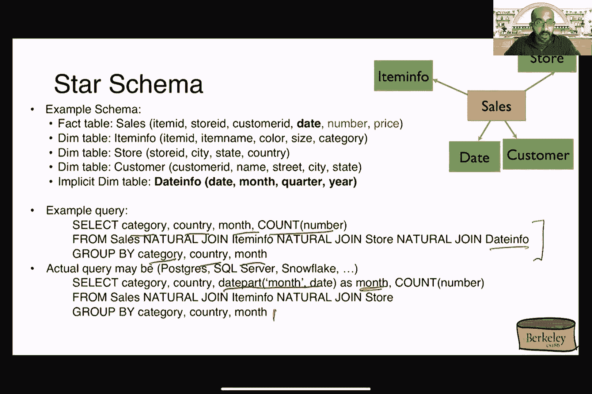
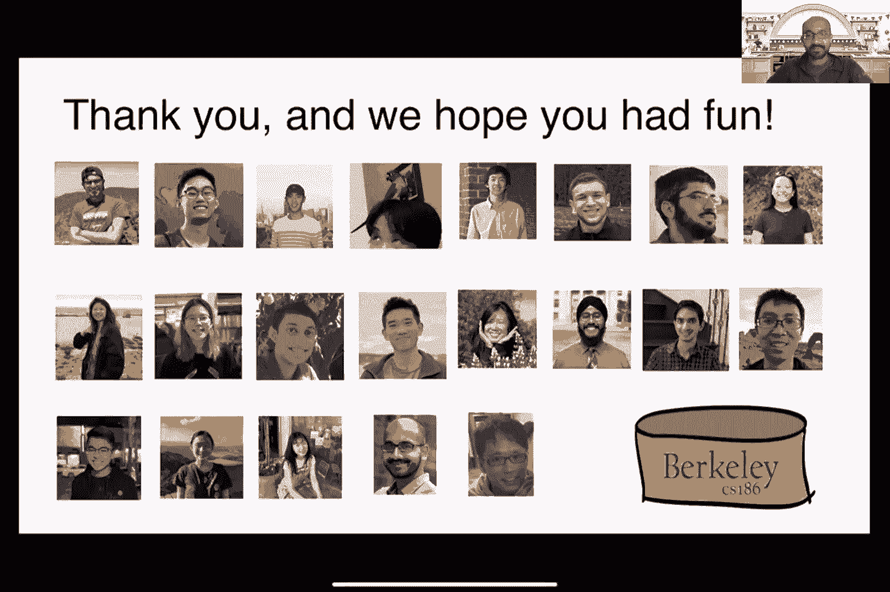

# 加州大学伯克利分校 CS 186 数据库导论 Introduction to Database System (Fall 2020) - P27：Lecture 27 OLAP, Column Stores - ___main___ - BV1cL411t7Fz

 I just started it。 Okay， cool。 Okay， cool。 There you go。

 Yeah。 Okay， everyone， this is it。 So， this， welcome to the last lecture of， 186 for this semester。

 So， the goal for today is to basically finish up what。

 we were talking about in the previous lecture on MapReduce and Spark。

 And then Aditya is also going to talk about all that。 And， sorry， there's time。 Okay。 Okay， so just。

 brief review， right？ So， last lecture， we were talking about how people were。

 writing parallel data processing programs using MapReduce， right？ So， this is after， they have。

 after we have discovered this wonderful thing called parallel relational databases。 So， again。

 this is like the kind of programs that MapReduce is supposed to be good at。 So， basically。

 things that reads tons of data and things that you can organize into a mapping。

 stage and a reducing stage， right？ And then these are basically in the words of， Jeff D。

 who invented one of the inventors of the MapReduce paradigm。

 The example that we went through in the previous lecture was this canonical example of counting。

 words from documents。 So， the goal here is to basically being able to count。

 words frequencies across multiple documents simultaneously。

 The idea then is to basically write a map function that takes in the documents and then。

 go through all the words in that document and then emit that intermediate key value here called。

 you know， the word， and then the one， right， that corresponds to that word。 Basically。

 that means we have seen that word once， right， in the document。 And then in the reduction phase。

 we sum up all the word counts for the individual word。

 because MapReduce is going to do this intermediate shuffling step。

 where it's going to collect all the intermediate keys with the same value together。 So。

 that's why we get this iterator right here on the right-hand side。

 And then so in the body of this reduction program， we're just going to go through them and then。

 sum up all the ones and then emit that as the final result that you're seeing here on the right-hand side。

 And then we also went through some of the implementation details， right？ So， in particular。

 the one that we talked about was this notion of Strackland， where we have one job that is somehow。

 taking a long time to finish。 So， the map reduced paradigm， the way that it works in the system。

 is that it would preemptively start like backup execution of that same task across multiple。

 workers if they idle。 And then whoever that finishes first， right， then we're done， and we'll。

 basically just finish off by killing off the other two threats， the other two worker threats。

 And this works only because all these jobs can be executed completely independently and concurrently。

 right？ So， that is our saving grace。 If there are interdependencies across these jobs， then we can。

 not do this so easily， right？ So， that is why， like， you know， one of the amazing features of。

 map reduce is the ability to do these kind of backup execution。 So， at the end of the lecture。

 last time we stopped with trying to implement our beloved relational operators using map reduce。

 And we stopped with this example of implementing group button， right？ So， again， the example here。

 is we have a relation R with two attributes， A and B， we are trying to form groups of A。

 and then summing up all the values of B。 So， here for the mapping phase of the program。

 we're just going to emit the A and B values of each of the input tuples。 And then for the reduction。

 we're going to collect together all the tuples with the same value of A， right， because we have。

 emitted that as the intermediate key。 And then for the values， then we are basically going to just。

 sum up all the numbers afterwards and then emit that as the final count。 So， this is basically a。

 step up， right， from the document frequency counting program that we have before。

 except that in this case， we are doing a group by， right， in a relational operation。 So。

 as an example， we feed in this A， B， this， sorry， this relation here as R， then we will emit。

 we will emit as intermediate values， these three different groups that correspond to the tuples。

 that you are seeing here on the screen， right。 And then， like， you know， after that， we'll feed。

 that into the reduction function， and then we'll basically just get the values of the groups afterwards。

 Any questions about that so far？ So far， this is basically review， right， from the last lecture。

 So now， of course， the interesting thing is I was， you know， we were talking about this whole。

 semester， right， as this notion of joints。 So， can we actually implement our， you know。

 hash join algorithm and the broadcast join algorithm using map reducers。 So。

 here's one implementation of the petition， hash join。 So， we have two relations here。

 R and S that we are trying to join on B and the attributes B and C respectively。 So。

 for the mapping stage， right， we're basically going to be fact with tuples from either R or S。

 right。 So， the intermediate keys that we're going to emit is actually the values， of either B or C。

 depending on which relation we are coming from。 If we are holding on to R to， fold。

 then we emit the B value， and then if we are coming from the， we are holding on to S to go。

 then we emit the C attribute as the intermediate key。 You can guess why you want to do that， right。

 because we basically wanted to group together all the values of B and C that have the same value。

 because that's what the join here is asking us to do， right。 We're trying to join。

 values where B equals to C。 So， by doing the shuffling step in map reducers。

 what is going to happen is that if we're going to group together all the tuples。

 they have the same value for B and C， right， you know， regardless of where they cut， they're either。

 either they're coming from the R relation or they're coming from the S relation。

 And then inside the reduction function， we're basically going to collect them， in this loop here。

 right。 So， for each of the tuples that we get， we are basically going to， you know。

 feed them into either one of these two arrays， either R or S。

 And then after we have processed all the tuples that we are now going to generate the join output。

 that you're seeing here in the final loop here。 So， for example， if we are being fed with these two。

 relations from R and S， then what is going to happen during the map stage is we are going to。

 emit values of either B or C， right， depending on which tuple we are dealing with。 So， for instance。

 the first tuple here， T1 from R， has 10 as the value of B， and it's going to be emitted by itself。

 right， because there is no other tuples with the same value of B， right， versus for T2， right。

 for the value of B， it has 21， which also matches with tuple T8 from the relation S。 So。

 that's why after the shuffling step， we get this intermediate output。 So， just like before， right。

 we're basically going to feed in the intermediate key and the。

 corresponding group of tuples to the reduction function。 And then you can go through the rest of。

 the program logic here to realize that at the end of the day， we will form our joined output S。

 desired。 So， that's pretty nice， right， so like， you know， we're basically relying on map reduced。

 shuffling capability to help us group together things that needs to be showing up at the same time。

 in the same place， right。 So， remember our discussion earlier about our core algorithms is basically。

 doing the same thing。 For joins， we just basically need to bring together tuples that need to。

 see each other， right， at the same time。 So， that's exactly what the shuffling step is helping us to do here。

 Questions about this so far？ Okay， so broadcast join turns out to be even easier。 So。

 for broadcast join， as you remember， right， we're basically going to replicate the entire S relation across all the。

 uh， all the repetition， all the partitions of arc。 So， uh， here， that's how we're doing it。 So。

 we are assuming again that we are reading in， uh， tuples from S， somehow over the network。

 I'm kind of waving my hands here， right， because like， you know， the idea here is to basically。

 either read it all from a file or read it all from a network socket or some， some， somewhere。

 The assumption here is we'll basically get the entire， uh， the entire table， the entire relation。

 of S in memory。 And then afterwards， right， we can just do our favorite join algorithm。

 whichever that you choose， right。 So， in this case， we're just computing a。

 building a hash table based on the values of S。 And then we're just going to find the。

 corresponding values corresponding to， that needs to join from the relation on the second loop here。

 So， this part here， like， you know， is basically our favorite， like， you know， one of our favorite。

 join algorithms， right， that has joined。 Uh， the only difference here is we are just reading。

 everything off from the network for S。 Uh， that's the first step。 And then in this case， like。

 you know， there's actually no reduction step that is needed or because like， you know， we have。

 already admitted what we wanted at the very end of this， um， of this， uh， of the map function here。

 Uh， okay， Nick， do you have a question？ Uh， I'm not really sure about my question。

 so I'll just hold on to it for now。 Okay， sure。 Um， okay， so yeah。

 so that's all I want to say for map reviews。 So as we have seen。

 it offers a very simple abstraction because everything is either a map or a reduce。

 So unlike relational algebra， right， everything has to fit into one of these relational algebra。

 operators that map reduce as long as we can formulate our computation as map and reduce。

 then our job is kind of done， right？ So map reduced the system with how to figure out how to。

 paralyze things across multiple workers。 It'll help us shuffle things as needed。 Also help us。

 deal with， uh， restarting jobs in case there is a recovery situation。 Right。 And again。

 the way that it works for recovery is that we'll always write the intermediate， results， right？

 Generated by the mappers to the disk。 But of course， there is a flip side here， right？

 Being that it might be slow because we need to wait for all the intermediaries to be。

 serialized to the disk before we can carry on with the reduced， uh， phase。 Okay。

 So like I want to end this fragment of kind of like a shameless plug of all the projects that。

 we actually worked on in our research group。 We actually tried to write a compiler that would take。

 vanilla job programs and then translate them into map reviews。 So if you're interested， like。

 you know， go ahead and play around with that。 Okay。 So as I said， right？ So one of the。

 problems of map reviews is the fact that we need to wait for all these intermediate stuff to be。

 serialized to the disk and also forces us to， um， map all of our computation into map and reduce。

 right？ Kind of pun intended。 Okay。 So that's kind of a problem。 So what happens， like， you know。

 in the， kind of next phase， right， off our journey of parallel。

 no SQL databases is people try to remedy， that problem。 So they want to write more complex queries。

 but they don't want to express everything， as map reviews。 Because that's somehow， um， limiting。

 right？ As we've seen early， as we saw earlier， we always sometimes need to patch with a kind of redundant reduction phase。

 right？ For no purpose， because just because of the fact that it map reviews everything has to be map reviews。

 So even， if there's no reduction， really， we still have to put in kind of like a， uh， no， right？

 Reduction， reduction function， which is kind of wasteful。 And then also this other aspect， right。

 of needing， to write all the intermediate stuff to the disk is also slowing things down。

 So what if we actually， give programmers the control to decide when they want to serialize the results to the disk？

 The upside is more flexibility， right？ So we can， we don't have to wait for all the intermediate stuff。

 to go to go to the disk。 But the downside is obviously that， like， you know， if we forget to。

 write things to the disk， we might end up not being able to recover， right？

 Otherwise known as we need， to always start from the very beginning。 So that's the trade-off。

 So that's where spot comes into play。 It turns out to be a system that was actually developed right here at Berkeley in the RISE lab。

 It basically works off from HDFS that I talked about on the， in the previous lecture， right？

 So this， is the Hadoop file system。 Okay。 And the difference between spot and map reviews is that it allows us。

 to not limit everything to the only map or reduce。

 It provides a bunch of operators that we can call， that performs like， you know。

 different operations。 For instance， like we can iterate through a， a， data structure。

 We can iterate through a missile stuff。 We can， we can even filter things out， right？

 Using by calling a spot operator。 It stores all the intermediates in main memory and then it's up to us。

 to decide when to actually serialize down to the disk。 So the claim here is， is kind of closer to。

 relational algebra。 But it still has the flexibility of we can implement anything that， we like。

 So that's basically one of the selling points of Spark。 How does it work？ So it actually。

 has a bunch of different interfaces that we can write programs in。 So， you know， for those of you。

 who might not be familiar with Scala， Scala is basically just Java with functional extension。

 For this class， however， since you guys already familiar with Java， we'll just use a Java interface。

 to illustrate Spark programs。 And it even has a SQL interface， we don't know。 Okay。 So let's go。

 through the exercise of talking about the data model。 What is， how does， what does Spark actually。

 compute upon？ So in the case of MapReduce， right， I was mentioning that the data model is basically。

 files， arbitrary files， right？ As long as there's a key and there's a value， then we're。

 we have business。 In Spark， however， the data model turns out to be something called resilience distributed data sets。

 It is a distributed immutable relation。 Together with this lineage。 That's what RDDs are for。

 Immutable being basically means that one is created。 We cannot modify any of these contents。

 If we want， to modify these contents， we need to create a new RDD often。

 You might think this is wasteful， but of course， the system is going to basically optimize to make sure that we don't need to materialize。

 the entire RDD from scratch， right？ And we'll see that in a second。 What is lineage？

 Lineage here means the history of how the RDD was computed from the beginning。 It's kind of like。

 a career plan， right？ For those， you know， for us who are already familiar with the relational。

 algebra interface。 So Spark stores these RDDs as intermediate results， unlike in MapReduce where。

 everything is a key value pair。 And then the nice thing about this lineage aspect is that in case。

 the Spark server crashes， then even though everything is made in memory is gone， we can recreate or。

 replay the whole thing since we know the lineage of every single RDD that has been created。

 So that's one of the benefits of Spark， right？ It basically remembers how it got itself from。

 how it's derived from。 So therefore， when we try to recover， it's extremely easy， right？

 So MapReduce kind of has that aspect to it because like， you know。

 we serialize everything to the disc， so you can say after we have serialized everything to the disc。

 we don't really need to know how the， mapping stage came about， right？

 Or if something crashed during the mapping stage， well， we're still， doing the mapping stage。

 so we just restart all the map， right？ That's okay。 Okay， so how do we write programs in Spark？

 So a Spark program consists of what they call， transformations and actions。

 They distinguish between these two aspects because for actions， they call things as， sorry。

 they call actions as operators that are executed immediately upon， calling。

 So meaning that if we call something that let's say perform a join， then it would。

 immediately perform the join versus for things that they call transformations or things that are。

 lazily evaluated， meaning that we actually don't carry out the operation yet。 We only construct in。

 this lineage， right， an operator that we need to perform when something ultimately needs to be。

 evaluated。 You might think about what is the benefit of lazily execution in this world。

 and part of the answer already told you about， right， is basically about this recovery aspect。

 So since we just store the entire operator tree in memory and also in the Spark log。

 so therefore in case things actually crash， we can just read off from this lineage or this。

 operator tree， operators that needs to be carried out and then we just execute them。

 one after another to recover。 So before we go into details about seeing our first Spark program。

 let's try to talk about this RDD interface that I alluded to earlier。 So I said， as I said， right。

 these RDDs are immutable and they are also well typed， right？ So meaning that it has to have。

 a specific type。 It can be any object type that you can define in Java， right？ So if you'd like to。

 store a key value pair in an RDD， that's fine。 So you can define your own key value pair class。

 and then stick that into an RDD。 It's not supposed to be nested。

 meaning that we cannot nest another， RDD inside an RDD。

 That is not allowed in the original Spark RDD interface。 A sequence， however， can be nested。

 however， it's only local to a single node， meaning that it's not going to be petitioned。 So an RDD。

 like， you know， Spark would internally try to split that across multiple servers if we。

 have multiple servers versus a sequence。 In this case， can only reside on a single server。

 So here comes an example。 So let's say we want to write from a log file， right？ We want to read。

 in a huge log file and then retrieve all the lines that start with error and then also contains the。

 string SQLite， right？ Maybe we want to debug for instance。 So here is the entire Spark program for。

 doing that。 So the first line here doesn't really need to pay attention to that。 So it's basically。

 just like， you know， creating a Spark session such that we can create all these different operator。

 trees or operators that we want to execute。 And then the subsequent lines basically started by。

 building different RDDs。 So the second line here called lines is basically just reading from a。

 single text file and then treating all the each of the lines of that text file to be the contents。

 of a new RDD that we are creating。 And then you can see this filter here， right？ That we are。

 calling。 So in this case， filter here is an operation that we want to perform on top of the lines RDD。

 that we have created。 And then the job of the filter operation， as you can imagine， is to perform。

 selection。 So here we are providing a lambda function， right？ That says for every line that。

 is read into this filter function， we only want to retain those that start with error。

 So L here is just a string and then starts with it's just a Java function， right？ So we're just。

 performing filtering。 And then we are creating a new RDD here called errors。

 And then the errors RDD， is going to be passed into yet another filter operation that checks for where it contains the。

 string SQLite。 And that's it。 So all the different RDDs here are of type string， although as I said。

 right？ It can be anything。 I mean， as long as we can define it。 So why are these filter and。

 collect stuff highlighted in blue and green？ Sorry， and red？ Because the filter operations here are。

 transformations。 So when we call them， when we write that line in Java or even Python， for instance。

 none of them have actually been executed yet。 It only so the actual all the actions actually。

 only gets triggered when we call one of these action operators， for example， this collect， operator。

 Basically， when that line is hit， what happens then is we look at the entire tree of。

 operators that we have， and then we just execute them one after another。

 So for those of you who might be a little bit lazy， we don't actually have to write out these。

 intermediate RDDs if we don't like。 So here is the exact same program， except that we have。

 basically consolidated the entire thing in one single line using call chaining。

 So at the high level， it's basically just map reduce again， right？ I mean， not that much。

 difference， except that we now have these filters and collect stuff that we can call， as opposed。

 to everything being mapped and reduced， right？ That's one of the distinguishing aspects of Spark。

 They basically provide these different operations that we can call on these RVDs。

 and it stays just the trouble of trying to figure out how to write map and reduce。 And of course。

 they also have a map operator， just like in the map reduce as well。

 So does that make sense so far about how to write these map。

 Spark programs or give you some idea about how to write these Spark programs？

 So it gives me real flexibility， right？ So we can call one of these existing functions that are。

 provided already， like filter， for example， you know， we already know what it works， how it works。

 Or if it wants to be general， we can just call map， right？ Where we just pass in any。

 arbitrary function that gets applied to every single line or every single element inside the RDP。

 So we basically get back our map reduce functionality that way。 So what about persistence？

 So as I said， right？ So Spark does not always materialize everything， to the disk。

 So meaning that if this is the entire program that we wrote， then if any of the。

 servers fail before the entire job is finished， then we have to restart the entire job from scratch。

 So for instance， this is basically what we see， right？ So we start with a bunch of a file here。

 that we read as a single RDP。 And then we perform a bunch of operations and then we end up with。

 another RDP here。 So if anything here crashes， then we basically have no choice but should start。

 from the very beginning。 So as I said， right？ Spark gives program or the ability to choose。

 when to actually serialize things， right？ If they like。 So the way to do that is to call one of。

 these functions， for instance， persist。 So as you can guess， right？

 This is exactly the counterpart of， you know， writing to disk from the map reduce world。

 They basically just at that point ask， Spark to carry out the entire computation up to that point and then serialize the content of that。

 RDP， in this case， errors to the disk。 So at that point， then we would know that this is something。

 that has been written to the disk。 So in case things fail， so for instance， in the last stage here。

 if things fail at that point， then we only need to recover from the errors RDP as opposed to from。

 the very beginning。 Again， the flexibility is given to the programmer。 It's up to them to decide。

 when to actually use it， if at all， right？ If they decide not to use it， then they're basically。

 running the risk of needing to restart all the way from the beginning。 And then if they end up that。

 like， you know， they write every single line to serialize every single RDP to the disk。

 then it also reduces back to the map reduce world， right？ Where every intermediate stage is written。

 to the disk or recovery purposes。 Okay， so， like， you know， let's run through an example， right？ So。

 like， you know， here is a query in SQL， and let's say we want to rewrite this using Spark。

 How do we do this？ Well， the first two lines are kind of given， right？ So they're basically just。

 reading the entire relation of R and the entire relation of S as two different RDPs。 So notice that。

 I'm already， you know， the kind of risk of verse， and then I'm already writing， like， you know。

 the entire context of R and S on to the disk already， right？ Right。 And then we're persisting。

 everything to the disk。 So what happens next， right。

 is that we'll basically start calling the filter， operation， because that's what we want to do here。

 right， for these two selection brackets。 So we'll fill。

 we'll pass in our own filter function to the filter operator that we already， talked about。

 and then we create a new RDP as a result， right， that corresponds to， like， you know， for R and S。

 And then afterwards， like， you know， turns out that Spark already has a join operator。

 that we can just call it correctly。 What， how it works is kind of what you expect is basically just。

 join on all the common attributes between both the two input relations。

 So it's basically performing， a natural join in this case。

 So what that means is it's going to join on the attribute， the clean R and S。

 and then we just create that another RDP。 And then again， right， the reason why I'm highlighting。

 these operators in blue and red respectively， is because the blue stuff in this case are。

 transformations。 So before we actually， so without， before we actually call the count operation。

 we only have only created the operation operator tree memory， right？ So that's what these filter。

 operators are stored。 And then when we call the count operator， that's when the actual action。

 gets carried out。 Does this make sense？ So does， so does persist serialize the operator trees onto this？

 Yes， so persist also writes the， operator， operator trees to the disk。 But even without that， right？

 So Spark would already write， that to the， to the lock on its own because of recovery purposes。

 So even if we don't write any， persist， we still need a way to record down the history of all these RDs and how they were derived。

 So Spark would already have an internal lock of the operator tree on its own。 How do we know that？

 It will only join an A。 So this is a special operation provided by Spark。

 which basically implements a natural joint。 If we don't want to do natural joint， there are other。

 flavors of joint in Spark that you can call as well。 And of course， like， you know， at the lowest。

 level， right？ We can also implement our own algorithm using map and reduce， right？ So implement our。

 joint。 So is it even necessary to persist transformations that can be recovered from the locks？

 So it， depends on how much time we want to spend in recovery。

 So if we can actually don't mind parsing， all the inputs of those again， sure。

 we don't have to persist anything。 But if your job is somehow， some sort of like。

 you're training some huge humongous machine learning model that takes two days， well。

 you might want to persist some of the intermediate stages so that in case of recovery。

 we don't always need to start from the scratch。 Does that make sense？ Okay。 So as a recap， right？

 So spot programs or spot programs that you write in Java。

 Scala or Python consists of these lazy and eager operators。 The reason why that makes sense is。

 because it basically allows Spark to do optimization if it likes to。 So for instance。

 combining multiple， filters into one single filter operation， right？

 And also gives people a chance of persisting if， they want， right？ If everything is eager。

 then everything has already been carried out。 So， like， you know。

 not much chance that you can do optimization or like， you know， serialization。

 And then it relies on this data in the model known as resilient distributed datasets of a well。

 specific specified type defined by the by the programmer。 And then they also have different。

 flavors of these datasets that you like to be local。 So here's just a partial listing of the。

 transformations and actions operators that are supported by Spark。 So as I said， right， they have。

 different versions of joins， they have different versions of like， you know， cross products and。

 all the other different stuff。 So you can take a look at their interface if you're interested。

 So this was Spark 1。0。 So Spark has then evolved， right？ So after they， it was initially released。

 people started writing programs and they realized their kind of shortcomings and the initial paradigm。

 So they started coming up with new stuff。 What is the new stuff that they came up with？ Well。

 so they came up with something called data frames， which is just like RDD in a sense that。

 it is immutable and it's also petitioned across multiple nodes。 Except that they introduced this。

 concept of named columns， which is interesting because it's kind of just like a relation in that。

 you can， you can now they also have these things called rows inside of a data frame。

 So a data frame， unlike an RDD consists of rows and each row consists of columns that you can call them out by names。

 So that sounds resoundingly like what our， you know， our friend relations are， right？

 And it also comes with new methods that you can call。 For instance， you know， adding something or。

 like， you know， projecting one of the columns of it。 So I call that kind of relational algebra plus。

 plus， right？ So， you know， it supports the basic operations that we already know in a relational。

 algebra operating on relations。 The difference here is like， you know， it gets the benefit of， SPAC。

 meaning that it has this lineage aspect， it has this recovery aspect， we can control when。

 all these things happen。 And then it also has this aspect of， you know， getting back our relational。

 well， right？ So it has this well formed concept of a tuple and then it has columns that we can。

 project so on and so forth。 Yeah， so it's very similar。 So。

 and then they're set is another thing that， they came up with。 It's very similar to data frames。

 except that the elements here must be， well typed objects as opposed to a row。

 So a row in data frames is a row。 So basically row is a class， that is provided by SPAC。

 where you can store any arbitrary number of named columns in there。

 So it doesn't have the relational requirements that all rows that are stored inside the same。

 data set have to conform to the same schema。 So that is not true for data sets， right？ Sorry。

 that was not true for data frames。 But if for data sets， you have the flexibility of forcing。

 every row to have the same schema。 So you can see where we are moving towards， right？ So we're。

 kind of gradually rediscovering， like， you know， our relational world with， like， all the different。

 things that we learned about in the very first or second lecture of this semester， right？

 So all the， first normal form stuff， right？ So we're now creating that only recreating them in this。

 data set mechanism as opposed to a standard relation。 But still， I would argue that there's still。

 added benefit， right？ And using SPAC just because of this， like， optimization aspect and also this。

 recovery aspect， right？ It's flexible as opposed to relational algebra， where everything is fixed。

 And just to give you guys a sense of flavor， right？

 So these are the kind of API that is provided by， data sets， the data set class。

 I think many of them look familiar to us， right？ Like， it has an。

 explicit order by it has an explicit join just like in Spark。 It even has an explicit group by。

 and a selection too。 And as if that is not enough， right？ They even have a SQL like API。

 where you can just directly write SQL， right？ And， you know， a part of the thing。 So， you know。

 what can I tell you， right？ You know， probably looks familiar。 So I just want to kind of。

 round up this whole discussion with one of the papers that was written from this department by。

 Microsoft， don't break it in Joe House theme。 You know， just look at the title， right？ It tells you。

 like， what that is， what this is all about， right？ So I'm not trying to put down on these。

 kind of novel developments， right？ So obviously people have learned the lesson。 But as what。

 Aditya was talking about last lecture， right？ So people start from， you know。

 throwing everything away from， throwing everything that we learned about in SQL， a relational model。

 away， only to kind of gradually read this cover。 That's some of these features， you know， maybe。

 after all， they're not so bad， right？ So， you know， I don't want to call every inventing the， wheel。

 I mean， you know， the Spark guys definitely added new features， right， in addition to what。

 the relational guys have provided us in relational algebra and SQL。

 So that's why I kind of think of， that as making progress here， right？

 By combining multiple lines of work in the past and then， building something new。 Okay。

 so in conclusion， so in this part of the， you know， in this series， of lectures， right。

 we have basically gone through parallel databases， parallel relational operators。

 and then how to do transactions and recovery on that， on that， right？ And then I talked about。

 MapReduce in this lecture， in the previous lecture。

 where it gives people easier time to write these， parallel programming tasks without needing to know how join algorithms work or how to optimize them。

 The downside is of course， like， you know， there's no updates or no transaction support from MapReduce。

 which wasn't part of the deal， right？ If you go back to the slide that Jeff Dean was talking about in。

 terms of what could MapReduce programs。 And then finally， Spark was kind of at the next stage of。

 the evolution， where we combine both the best of relational systems and also the best of， right。

 you know， MapReduce slash no SQL databases together。 Questions about this？ Well， we changed over to。

 the biggest part。 Okay。 Yeah， so hopefully you guys learned about like all these different。

 aspects of what is good and what is not good about these different systems and designs。

 So next time when you need to come up with the next Spark or whatever paradigm， right， then you。

 can remember these different lessons that you have learned from this class。 Okay。 Okay， look。

 Can you hear me？ Okay。 Okay。 All right。 So let's talk about OLAP。 All right。 So。

 I think Almond already introduced OLAP and contrasted OLAP to OLDP。

 but I wanted to give you a quick， recap。 Okay。 So OLAP stands for online analytical processing。

 Broadly， it's also referred to as analytics。 In industry， you have these terms， decision support。

 or business intelligence that are also used to refer to OLAP。 Okay。 So it basically means the same。

 thing， except that these days business intelligence has grown to encompass more than what is traditionally。

 known as OLAP。 For example， machine learning and visualization would be part of the broad business。

 intelligence umbrella， but what envisioned in the original OLAP story。 So what is OLAP？ So OLAP is。

 basically a specialization of databases that prioritizes the reading and summarization of large。

 volumes of data。 Okay。 So it's basically emphasizes reading rather than writing and also usually very。

 large volumes of data。 And all and the purpose is to try to understand some trends or patterns。 So。

 for example， in OLAP， a typical query might be compute the total sales of each type of。

 Honda car over time for each country in the US。 Okay。 So this is a very typical OLAP query。

 which is reading a lot of transaction data and sort of grouping by various attributes。 Okay。

 So that's what OLAP is。 And so it's all read only queries。 It's not there's no writing。

 So to contrast it to OLTP， which is online transaction processing， online transaction processing is。

 read and write queries。 And usually in OLTP， you touch a small amount of data。 So for example。

 if you made a sale， you made a new car sale， you would add this， you would append this to the sale。

 sales table。 And this would constitute a small update。 It's a point update。 Okay。

 So there's a difference in the style and behavior for OLAP and OLTP queries。

 One is reading a lot of， data。 The other is writing reading and writing small volumes of data at a time。

 Okay。 Cool。 So let's talk about how typical organizations have OLAP and OLTP systems as part of their。

 data management architecture。 Okay。 So let's imagine that we are talking about Honda USA。

 and they have many different sales regions。 Okay。 So they have a south region， a southwest。

 north east， north west and mid west。 Okay。 Each of these regions may have a regional OLTP database。

 Okay。 And so if you have an OLTP database， this is also often referred to as a live or transactional。

 database。 So it's basically conducting transactions。

 And each of these databases would have correspond， to many different updates made to， for example。

 sales of cars in that region in this example。 Then you may also have a centralized data warehouse。

 Okay。 So the centralized data warehouse would， collect all of the information across all of these regional OLTP databases。

 and then it would， consolidate them and then you would run OLAP or analytics queries at this data warehouse。

 So OLAP， is usually performed in a separate database。

 which is known as a data warehouse away from the critical， path of OLTP。

 And so usually the centralized data warehouse is where you have large scale read-only。

 queries that are done post hoc after a bunch of transactions have happened to these live or。

 transactional databases。 And so there is a process of moving data that is from the live databases。

 to the centralized warehouse。 And this process is known as EPL， which stands for extract transform。

 load。 We'll get to that in a second。 But the high level message is that the data warehouse is。

 usually periodically loaded with new data from these transactional databases。 So for example。

 the regional sales data from each of these regions may get consolidated or centralized in。

 this data warehouse at the end of each day。 Okay。 So EPL is a process that moves data from these。

 from these live databases to the data warehouse。 And so EPL stands for extract transform load。

 And so these three steps correspond to a extract any useful information that you want to analyze。

 as part of your data warehouse。 Transform it， which means for example， you might canonicalize it。

 So， if there are different conventions across different regions。

 you might sort of apply a uniform convention， you might clean it up in various ways。

 So you may discard values that are potentially incorrect， or apply other clean procedures。

 And you would then load it into this warehouse。 So that's what， happens as this process。

 Very typical， even though I'm giving you one example for this， Honda organization。

 very typical across many big organizations to have lots and lots of these live。

 or transactional databases that are doing OLTP and a centralized data warehouse where you do all。

 of your old lab。 And so once you're done with this process of EPL。

 you have your data ready for analysis。 So there is a challenge here。

 which is the challenge of Staleness。 So the data that you are applying， that is live。

 that's transactional， doesn't get to the data warehouse unless you've completed this。

 process of EPL。 And suddenly you can run this EPL process frequently enough， but there's still。

 this issue of Staleness。 And usually organizations are still willing to make this trade off。

 They're， happy to have some amount of Staleness because these OLAP queries that are running on this。

 data warehouse are fairly large scale。 And these large scale queries may delay transactions。 You。

 certainly don't want to delay transactions， especially if these transactions affect the bottom line of。

 your company。 If for example， you have a lot of sales that's happening as transactions。

 you don't want to delay those sales in favor of some large analytics query。

 So it's crucial for example that sales are not prevented than for example， an analytics report。

 for a manager is generated promptly。 So the other aspect here is a question of time scales， right？

 So， this query large scale OLAP query， which is going to touch a large part of your data is。

 any need to take a really long time。 So it's okay if it happens a little later， right？ So you wait。

 until all of the data is loaded into this data warehouse for you to do this。 Frankly and us。

 EPL is at midnight every night。 It could， it could happen more frequently than that。

 It could happen， every hour， every 10 minutes， right？ But it's just a process that is not live。

 right？ It's not， not happening immediately， at least in typical organizations。 In general。

 is it better to do it more frequently than not？ Yes， but there is cost to that too， right？ So you。

 the process of extracting data out of these live transactional databases is a process that would。

 involve consuming some resources of these transactional databases。

 So you either want to prefer to wait， until a time when they are not as active。

 So midnight is usually a good option， for example。

 because there are maybe not that many car transactions that are happening at midnight。

 But if there is， there are certain applications for which you want your data to have more， more。

 frequently， you can certainly configure it to be that way。 It's a trade-off。 Okay。

 so let's talk about schemas and data warehouses。 It's also interesting to see how specialization。

 not only happens in the queries， but also happens in the data models。 So data warehouses。

 typically employ what is known as a star or some， sometimes snowflake schemas。 Snowflake is just。

 a generalization of star。 And so the， the idea is you have one so-called fact table and many。

 dimension tables。 Fact tables contain dimension attributes as well as measure attributes。

 while dimension tables contain dimension attributes。 Okay， so let's take an example to make these。

 concepts clear。 So I'm denoting the measure attributes with glue。 So I have one fact table and。

 three dimension tables。 So the fact tables contain sale information。 So the item id， store id。

 customer， id， then the date number and price。 And these are measure attributes， at least for now。

 The dimension table are the tables that store auxiliary information。 So you might be storing。

 for example， the item information， the store information and the customer information。

 all in the dimension tables。 So if you want to visualize this with a much more。

 simplified ER diagram， where you are， I'm just denoting the foreign keys from the fact table to。

 the dimension table， you have foreign keys that are from the， the sales fact table to the item in。

 four table to the store table， as well as to the customer table。 Okay。 So let's give。

 extend this to give you a sense of what a snowflakes schema might look like。 So let's。

 say the item info dimension table has a foreign key。 Sorry， item info table has a foreign key to。

 yet another dimension table， which is called manufacturer。 And so manufacturer has name address。

 and owner。 And so here you have a foreign key from the manufacturer name， which is in the item。

 info table to the manufacturer in the name in the manufacturer table。

 So this is another foreign key。 So imagine if you have this central fact table。

 and then you basically have edges out to the， foreign keys to a bunch of dimension tables。

 each of which can have its own foreign keys to other， dimension tables and so on。

 And you can soon imagine how that would look like and look like kind of， snowflake。 Okay。

 so it's basically a fractal structure here。 And this is very typical again in。

 in large organizations to have this kind of snowflakes schema with many， many relations。

 that are connected via these foreign key relationships。 So what do typical OLAP queries look like？

 Well， typical OLAP queries， at least at the start， would look like group by queries。 Right。

 so you would basically group by some dimension attributes。

 and then aggregate some measure attributes。 So in this particular example， I am grouping by。

 the category and country。 I'm doing a， a join of all of the tables that would be relevant here。

 And I am doing a count of the number。 Right， so basically this query would be returning。

 for a certain category for a certain country， compute the total count， right， the total number。

 of sales in that category in that country。 Okay， so not surprising。 So one thing that I kind of。

 glossed over a little bit was I was treating date as a measure attribute。 And remember。

 measure attributes are those attributes that you might want to aggregate。 Date is actually not。

 not a great measure attribute。 You might instead want to treat date as an implicit dimension。

 and we'll see why。 So it's great to have date as an implicit dimension because it allows us to。

 group by and see trends across dates。 Right， so if you have sales by year， that's a very natural。

 query that you might want to issue。 That doesn't， so that's a case where you want to group by。

 the year and compute the sales。 And to do so， we might want to， for example， have an implicit。

 dimension table。 Again， this doesn't need to be stored explicitly， but there's an implicit。

 dimension table where you store the information corresponding to date。 So you store the date。

 you store the month， maybe the quarter and the year associated with that date。 So this is a。

 table that's implicit doesn't actually need to be stored， but will be convenient as we will see。

 So here， one example query could be if I wanted to compute the same query as before。

 but I wanted to do it per month。 I could group by category， country and month。

 and I am once again selecting category， country and month and the count of the number。 And I'm。

 doing a natural join with this date info， which is this implicit dimension table。

 You can kind of get the effects of that in current database systems already by doing。

 some date processing that comes with most of these database systems。 So if you use a function。

 like date part in Postgres or SQL Server or Snowflake。

 it allows you to extract the month part of the， date。 And for example。

 rename it as a different attribute so that you can group by it。 So you don't。

 need to explicitly do this natural join with this implicit date table。

 You can just do it as part of， your query。 Any questions about this so far？

 Maybe I'll stop here and then do the data cube spot after， a break。 Cool。

 And then should I just do the videos？ You want to stop recording？ Announcements or something？

 I don't， not that I recall， but。

 I think the only answer that I have is so Justin's also here。 I think so we will also have our own。

 course evaluation as well。 So in addition to the one pass-up from the department。

 so most likely be posting that like what tonight or tomorrow？ Soon。 Yeah， so。 Yeah。

 so just look out for post about that。 Also， where。 If you wasn't already announced already。

 we have stuff planned for dead week， including like review， sessions。

 And like we have in addition to like the typical like one big review session， exam prep。

 six is planned for Tuesday。 The final review session is planned for Wednesday。 We're planning to do。

 topical review sessions as well， but next week also office hours will be cut in half。 So like。

 pay attention to the calendar to make sure that you don't miss out on that。 And we'll， make like a。

 We'll probably make like some kind of post to like organize all the information。

 for dead week as well。 Cool。 Thanks Justin。 Okay， so let's keep going。 Let's talk about data cubes。

 So data cubes to introduce data cubes， I'm going to start by， using a denormalized view。

 So where I have my fact and my dimension tables all joined with each， other。

 But the same consideration that I'm going to apply for the star or snowflake schema。

 But this just makes a discussion a little simpler。

 And we're going to work with the simpler inventory。

 relation where I have one measure attribute which is number and then three dimension attributes。

 item color and size。 Okay， so the first question to ask is let's say I want to do a group by across。

 all groups。 If I have n item names， m colors and k sizes， what how many do we think is going to be。

 the number of rows in this group by？ Just to make sure that you remember your group。

 by n times m times k， right？ So that is in the worst case how many groups we are going to have。

 right？ Okay， so let's say I was interested only in the color and item， so not in the size。 There is。

 I might want to see what is known as a cross tab of the aggregates corresponding to， item and color。

 And the cross tab is usually visualized in this way。 So you have the colors。

 along the x-axis and the items along the y-axis。 You have the individual pairs of。

 aggregates as well as the totals on each side。 Okay， so you have the total corresponding to， jacket。

 gene and so on here， the total corresponding to blue， red and so on here， and the total total。

 across all the colors and all the items would be in the bottom right corner。 Okay， so this is。

 what is known as a cross tab。 So how would I get this via group by？ Well。

 you can get this via group， by running essentially four group by queries， right？

 One corresponding to grouping by the color， and the item。

 one corresponding to grouping by based on item， one corresponding to grouping by， based on color。

 and one corresponding to the overall sum， right？ The total sum across everything。

 with no group by's。 So these are four separate group by's that I might have to issue for this。

 particular cross tab。 So turns out this is just one view of a broader cube of information。 In this。

 particular case， I have three different attributes that I might want to cube by。 So I have my size。

 I have my color and my item， and each of these cross tabs correspond to a plane in this particular。

 cube。 So the cross tab that we were looking at is precisely this this particular plane in this cube。

 Okay， so once again， along the x axis， you have color along the y axis， you have item。

 and along the z axis， you have size。 So size is not relevant for us in this cross tab。 It's just a。

 color in the item。 And so this plane corresponds to that that cross tab。

 Cross tab is shot for cross， tabulation， by the way。 Okay， so this is what is known as a data cube。

 You can construct a data， cube on any number of sort of attributes dimensions。

 And so in this particular case， I have three， dimensions。 So it's a three dimensional cube。

 You can construct a data cube on k dimensions in general。

 And notice the term dimension of a data cube。 This is precisely why we call those attributes。

 dimension attributes。 And you had measure attributes that you're going to aggregate。

 The measure attributes are what's going to be basically filling in some sense conceptually。

 each of the entries in this data cube。 So this data cube can be sliced and diced in various ways。

 And these are all canonical terms that I used to describe what you're doing when you're doing。

 all that。 Okay， so slicing basically means I am going to add a condition to one or more of these。

 dimensions。 And this is going to create a slice of this cube。 So for example。

 if I say I want to only， focus on the green colored aggregates。

 then this is basically selecting this slice of the data cube。 Right。

 so just slicing through this data cube。 Dicing refers to a partitioning of a dimension。

 So in this particular instance， the partitioning， the way each dimension is broken up is fixed。 I'm。

 just partitioning based on the distinct values of each dimension。 But I can actually also。

 partition in more coarse screen ways。 So in this particular example， I have red， blue， green， black。

 I could have lights and ducks as different colors， for example， for clothing。 Right。

 So that could be a more coarse green partitioning than the one that I have。

 So this partitioning at various nano diaries can be especially useful for the date dimension。

 because you might want to group by minute， you might want to group by month， days， years， weeks。

 and so on。 Okay。 So the partitioning granularity is something that users need to be a little careful。

 about when they are setting for a specific OLAP query。 And different partitioning may be useful。

 for different applications。 So usually the partitioning granularity can be set by looking at a hierarchy。

 of various ways of at which you can partition。 Right。 So for example， if it is geographic。

 your partitioning hierarchy may look something like this。 You may have city， state， and country。

 Time is much more complex， but it might look like this， and it'll become intuitive once I。

 describe it。 So your date time might be at the bottom。

 You could have hour and the full date without， the time， just the date information。

 You could have day of week as a partitioning granularity， a specific month。 So for example。

 December 2020， right？ Or you could just have a month， generate， right？

 So all December's a specific quarter， like quarter one 2021， generate quarter。

 It could be basically all quarter ones， and then a year。 Right。 And notice。

 that I have edges here that mean very specific things， right？ So starting from this deep time。

 I can extract the full date information。 And starting from the full date information。

 I can extract the information corresponding to the day of the week and all the specific month。

 and so on。 Okay。 So given a specific， if I've done a grouping or a slicing based on specific。

 quarters， I can go to the overall quarter information。 So let's walk through an example of that。

 So let's say I have the aggregates computed by months， or I want to compute the aggregates。

 by month。 So this is where I want to get to。 Let's say I've computed a data cube based on the full date。

 Okay， so I've computed a data cube already based on the full date。 So I have all of my groups。

 computed based on the full date。 So it's basically a month date year。 Okay。

 Can I get to a partitioning， based on just the month？ It's not a hard question。

 So the way I would do this is basically look at all of these dates for every month。 I will sum up。

 the entries corresponding or aggregate in different ways。 The entries corresponding to。

 all of the dates in that month。 So I would do it once for January， February， and so on。

 and I can arrive at the corresponding groups for the month。 So you don't need to compute。

 the cube from scratch。 You can use the information that you've already computed。

 with this full date granularity。 On the other hand， if I had computed the。

 aggregates at the level of years， there is no way for me to get to the months。 So if I had computed。

 I don't know， the total sales of these clothing on a yearly basis， I can't get to months anymore。

 Right， because I have computed it at two course granularity for it to be useful for the month granularity。

 But full date is good enough because it is fine enough that it allows me to compute。

 it for month or for day of week or for year。 It's fine-grained enough for that。 Okay。

 so there are again terms for moves in the hierarchy as well。 So moving from a finer to a。

 course of granularity in this partitioning hierarchy is known as a roll-up， while moving from a。

 coarser to a finer granularity is known as a drill-down。

 And so if I want to move from a course to fine， so if I'm doing a drill-down。

 this would correspond to either a move down the hierarchy for one of the。

 dimensions or a move from in this cube， an origin to an edge or an edge to a plane or a plane to the cube。

 right， at least in this three-dimensional picture。 So how do you get to Ola in SQL？ So one。

 functionality is cube by or group by cube。 And the way to do this is to simply say group by cube。

 and then you list the attributes that you want to compute a cube by。 And you would basically get。

 essentially all of the entries in that cross tab。 So you would get the groups corresponding to。

 both of the attributes， groups corresponding to one of them， and then groups corresponding to。

 none of them。 And null is going to use to indicate all in this case。 So in this particular case。

 you may end up with too many combinations because you're basically。

 turning on and off every single attribute。 So if you've listed a lot of attributes in this group。

 by cube， you may end up with too many aggregates。 So how do you restrict that？ Well， roll-up gives。

 you an ability to restrict that。 So let's walk through an example。 So in this particular example。

 I'm doing two separate roll-ups。 I have a roll-up by item， as well as a roll-up by color and size。

 So you can imagine essentially this to be two separate roll-ups with a cross product between。

 one roll-up and the other。 So you end up with the following combinations。 So you end up with。

 either a specific item or all everything for the first roll-up。 And for the second roll-up。

 you have various options。 You either end up with a specific color and a specific size。

 or a specific color and all sizes， or all colors and all sizes。

 So it goes in this sequence in terms， of or rather in this sequence in terms of setting of all。

 So if you had attributes A， B， and C， you would have this and then let's say all three of them set。

 two of them set， and this is set to all， one of them set， and these two are set to all。

 all of them are set to all。 All in this case is， denoted by null。 Does that make sense？ So overall。

 the combinations here would be， the combination of item color size， item and color。

 item color and size， color， and none of that。 Okay。

 so basically everything in this case is set to all or correspondingly null。

 So how do you go about picking the right cube or roll-up query？ Well， firstly， why does this matter？

 So if this query， this analytics query is being run once on a very， very large data。

 it's important to get it right。 And usually the results of this query will get materialized。

 and then will get used by various other applications。 So this could be used in dashboards。

 presentations， spreadsheets， and what have you。 So the way to do this and way to pick the right。

 cube or roll-up query is to think about all of the ways you may want to slice or dice your data。

 and then pick the granularity that allows you to recreate all the aggregates that you want。

 without blowing up the query result。 You can always go to a finer granularity， but the danger with。

 going to a finer granularity， find any dimension， is that it'll lead to a lot more group by values。

 and therefore your query result might grow up。 So don't do it beyond a certain point。 So it's。

 the trade-off between how fine-grained you want it and how much time it'll take to compute。

 So the result size grows exponentially in the attributes。 This can be quite bad in large。

 snowflake schemas。 This is what is canonically referred to as a curse of dimensionality， at least。

 in this all-up setting。 Okay， so why do we learn all-up？ Okay， so we learn all-up because。

 all-up is a specialization of databases that supports analytical processing and post-hoc report。

 generation。 So you have transactional workloads that are happening。 You consolidate them and then。

 you run these large queries on these large datasets that allow you to ask interesting questions of。

 this data， trends and patterns。 So this is typically done as large operations on this data warehouse。

 and the typical rule of thumb is to pick as coarse-grained query results as would be sufficient for you to。

 construct everything that you may want to learn about your data， so all the necessary cross steps。

 So the concepts of data cubes， hierarchies， slicing and dicing， roll-up and drill-down are。

 valuable when you want to describe to someone what you're doing to your data。 Say， for example。

 you're communicating to someone that these are the results of your analysis。

 the other one might say， "Hey， can you drill-down by this attribute？" Or。

 "Can you drill-down into this， particular aspect？" And so that's really a convenient way to communicate what you're doing。

 Okay， and at least from a SQL standpoint， there are conveniences in terms of keywords。

 which is the roll-up keyword and the cube keyword that allow you to compute this efficiently。 Okay。

 so given the time， I'm not going to be able to tell you about column stores。

 which is the systems that basically allow you to execute roll-up queries more efficiently。

 So the slides are on the website and feel free to take a look， but I'm not going to be able to。

 cover this。 Instead， I'm going to move to a summary of what we learned in this class。

 Any questions about， this so far？ I think we'll put out the slides there。

 but then it basically means the column， store stuff won't be on the exam。 Of course， yes。

 So at the highest level column stores， you can imagine。

 so systems so far that we've been studying are row stores。

 Row stores means that basically the data is laid out on a on a row by row basis。 Remember。

 you're slotted page layout， so you have row one and then row two and row three and so on。

 Column stores basically removes the assumption that data is laid out in a row by row fashion。

 It allows you to split up the table into groups of columns and then store these groups of columns。

 separately from each other。 And turns out the splitting up of the rows into groups of columns。

 works really well for the OLAP case where you are trying to read large volumes of data。

 but not do any writing or at least do very little writing。 So that's one。

 sentence summary of column stores。 There are lots of other tricks and column stores that。

 are quite interesting like compression and others， but I won't get into that。 Okay。 All right。

 So final thoughts on the class。 So we are down to the last five minutes of the class。

 So I wanted to summarize and tell you a little bit about what you learned。 Okay。

 so the class mission on day one， we had this mission statement。

 which is that the class will cover how to develop systems efficiently， manage maintain process。

 blah， blah， and make sense of data。 Wanted to argue that we actually covered that。

 And now you know how to do this， which is really cool。 Right。

 So you basically know the fundamentals of data systems， you know how to manage them。

 you know how to maintain them， you know how to query them， transact with them and so on。

 You have learned how to program with SQL， you have learned storage， indexing techniques。

 very processing and optimization， you know transactions now， you know， concurrency and recovery。

 And you know how to model your data。 Right。 So you know how to think about ER diagrams and pick an appropriate data model for your data。

 We learned a bunch of principles。 Again， this is a slide from our day one。

 We talked about data independence。 We talked about declared a programming。

 We talked about the rendezvous in space and time。 So basically thinking about join algorithms and。

 and parallel processing and map reduce。 As well as isolation and consistency is from a transactional。

 standpoint， asset guarantees。 We talked about data representations all as sort of fundamental。

 principles that hopefully will help you not just when you're building data systems。

 but also in other， context。 We talked about this stack of your database system。 Right。

 So the simple stack， which involved going from bottom up disks， buffers， indexes。

 relational operators， as well as optimization， then off to the side you had this concurrency control and recovery module。

 And then we extended this stack even further by talking about database design。

 parallel query processing， disparate transactions， no SQL and MongoDB， MapReduce， OLAP。

 You sadly didn't get to column stores， but that's okay。 And so this is a lot of content。

 And we crammed a lot of content into this class and you managed， to do it all。 So that's amazing。

 Okay。 Beyond what we covered in class， you did a lot yourself too。 Right。 So you worked on SQL。

 You worked with SQL like you implemented B plus trees， you implemented。

 join algorithms and and the cylinder query optimizer。 You implemented it locking， you implemented。

 arrays and hopefully you're working with MongoDB。 Right。 So you did a lot by yourself too。 It's not。

 just what you learned in class and hopefully you took what you learned in class and applied it。

 So usually I like to point out to for those who might want to learn more， hopefully we've not。

 scared you off with too much database content and you want you're like aching to learn more。

 And if so， there's a bunch of interesting grad classes and undergrad classes。 So there is the。

 grad database systems class which is offered sometimes。 There is a seminar class which Alvin。

 and I co-run along with Joe and Natasha and Joey。 There is 262 which is advanced topics in systems。

 and then two other special topics classes like programming the cloud and ML systems。

 And I'm sure many of you know the undergrad classes that are adjacent to databases， but if not。

 if they're on the slide。 So if you're curious a lot more about the data systems field。

 database databases and data management field， consider doing research。 Okay。 So data management。

 this field of research has continued to evolve since the 70s， which is when it originally started。

 It's one of the most exciting areas of research today。

 What is super exciting about it is that it is， has strong overlaps with a lot of areas of computer science。

 So that means that if you're a database， person you can talk to everyone。

 So you can talk to system people， architecture people， HCI people， PL people， machine learning。

 security theory and so on。 And so there's also a lot of。

 overlap with the industry and open source community。 A lot of the work that folks in the database。

 community do is very visible and is in close collaboration with people in industry and in open。

 source。 There's two great conferences that the database community calls their own VLEB and SIGMOD。

 along with a bunch of other conferences as well。 There's a thriving research community as well。

 And if you're curious to do research again and if we have not scared you off enough。

 you I encourage you to come do research with us。 So we are part of this group that we are calling。

 data systems and foundations。 Alvin and I as well as Natasha， Joey and Joe， and many。

 many folks who， are also interested in adjacent areas to DSF。

 Reach out to us if you're interested in research， projects and you really want to take the concepts that you've done in PLAS and apply it in various。

 settings。 So I just wanted to give like a quick two-sentence summary of a bunch of research projects。

 that hopefully convey the richness and excitement of database research。 So I'm going to do a really。

 bad job of Alvin's projects。 So Alvin， for example， is working on light DB。 Light DB is taking。

 database ideas and applying it to video data。 So imagine if you have large volumes of video data。

 how do you query that？ How do you rethink query optimization in that context？ He's also looking at。

 chestnut， which is auto synthesizing the right data layout for end user applications。 Natasha。

 is looking at transactions in the cloud while also ensuring privacy of the accesses that are done。

 by these transactions。 She's looking at consistency guarantees when your data is streaming at a really。

 fast rate。 Joe has many projects among which include a floor which is trying to do materialization。

 so caching of intermediate state during ML pipeline so that you can debug them after the fact。

 Right？ Again， classical database ideas applied in a very different context。 Hydro is another。

 project where he's trying to make serverless apply to。 So if you're not familiar with serverless。

 it's sort of the new rage in the cloud sphere， but he's trying to apply that to data programming。

 So basically， if you want to work with data， how do you do that in this context？

 Joey is working on ML meets databases， right？ So he has projects that include serving of ML models。

 at scale。 How do you do this in an efficient manner？ How do you do this thinking about again。

 database principles in the ML context？ Raytheon is another example of that。 How do you think about。

 query optimization when you're trying to train lots and lots of models and do ML model search？

 From my perspective， I have a couple of projects listed here。 One is data spread。

 which is trying to bring the benefits of spreadsheets and databases in one system。

 Orpheus is a system that supports versioning。 So to be able to bring the benefits of Git。

 to a database context， for example。 Okay， with that， I wanted to say， thank you all for。

 bearing with us with the many hiccups that we've had over the semester and with the fact that you。

 you've had to learn all of this stuff in a really strange semester。 So on behalf of the core stuff。

 and all of us， we'd like to thank you for hanging out for those of you who had your video on。

 be really appreciated。 For those of you who came and asked questions， we appreciate it。

 For those of you who have been interacting on Piazza， we appreciate it。 And I。

 Alvin and I would also like to thank the core stuff， all of whom who are here today and if not。

 if you do end up ever seeing the course recording， they've been invaluable in running this class。

 So， thanks to all of them。 Yeah， good luck everyone on your final projects and on your final exams and stay healthy。

 Exactly。 Thank you professors。 All right， thank you Nick。 Thanks so much folks。

