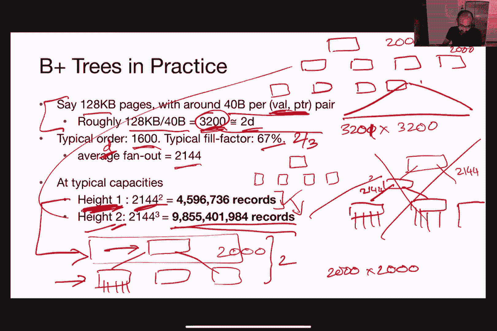

# 加州大学伯克利分校 CS 186 数据库导论 Introduction to Database System (Fall 2020) - P5：Lecture 5 Cost Models and Index + B+ Trees - ___main___ - BV1cL411t7Fz

 say lecture of 186。

 So today we're going to talk about cost models and indexing。 And before that。

 I'd love to have you guys keep using the chat， window， by the way。

 I think we got a lot of excellent questions in the chat。

 And if you even want to crack some jokes there， I mean， that's all we find too。

 as long as it's appropriate， for this class， that's OK。 So yeah。

 and then I think we might be still using Piazza， this lecture or not， either way。 Me good。

 I want to first consider it up。 We'll create a thread soon。 OK， either way。 Yeah。

 so feel free to ask questions there as well。 I mean， or we might actually move you over there。

 if it kind of becomes the longest question， just to make sure that we don't lose any of the threats。

 And again， if you feel comfortable， please try to turn on your video。 It's nice to see your faces。

 And also， it's nice to see when someone actually nods， and seemingly hoping to be--。

 we're basically hoping that you're actually， getting the material。

 And so we can get some visual cue。 That would be awesome。 And of course， if we try to crack jokes。

 then it's always good to have someone actually smile， right， a little bit。 So cool。 OK。

 so let's start it， right？ So let's get started。 So last time that Ditio was basically。

 talking about different types of file organization， right？ So that's where we are。 So earlier。

 I mentioned in the last lecture， about disk space management， and then we also。

 covered file organization。 So as a recap， right？ So last time， we were talking about different ways。

 to organize tuples in a file。 One of the examples is a heap file， basically。

 as an unordered collection of records or tuples。 And then， like you actually remember。

 from the disk lecture， these devices， that we talked to only expose， read， and write。

 as the only API， right？ So basically， that's what we'll be working with。

 So why am I bringing these two points up？ Well， because today， we actually。

 want to ask the question of what is the cost。 Cost in terms of when we try to actually do something。

 databases， right？ So that's what I mean when I say， like， cost in terms of doing insertions。

 deletions， or modifications， or even something as simple as just fetch a record。

 by a particular ID or a particular attribute， right？

 And we also want to look into what happens when we try， to scan all the records in terms of cost。

 Why do we care about cost？ Well， for one thing， right？ As you also remember， from the last lecture。

 there are actually many ways that we， can use to store tuples in a file， right？

 Do people remember what else did we actually cover besides， keep file in the last lecture？

 This is a quiz。 No， I'm kidding。 Somebody？ Yes， sort of files， right？ OK。

 so that's like another one of them， right？ So， you know， this is just one of the other options。

 So besides keep files， they're sort of files。 And then， like， you know。

 today and also in the next lecture， we will also talk about clustered files and indexes as well。

 So we have all these different ways to store data。 Then it makes sense for us to try to figure out。

 like， you know， what is the best way， right， to do it， right？

 And this is usually optimized against a given query workload。

 Because if we don't know what kind of queries or what kind。

 of operations will be invoking on these different types of files。

 then it's really hard for us to compare each one of them， right？ So in the context of this class。

 we're always， going to be talking about， like， you know， let's say we want to do insertion。

 Let's say we want to do， like， you know， scanning of all the records or something， right？

 And then we're going to talk about later on， but how do we actually get that kind of workflow information。

 right？ Or how do we know that we want to run， like， you know， scans and， like， you know， why not。

 like， you know， find a particular tuple， for example。 So for a big picture， right。

 in terms of talking about a cost， so we basically want to have a way to estimate the cost associated。

 with each of these types of data access。 And again， right， data access， in this case。

 mean anything from finding and inserting an individual record。

 deleting or modifying or even or basically looking。

 up different types of data that we have stored in the files。 OK。

 And we just want big picture estimates， right， because in this case。

 we're not trying to drill down into， like， you know， the tiny， like， you know， most accurate costs。

 right？ We're not trying to measure against， like， you know， external to millisecond level。

 We're really just trying to get a brief estimate such。

 that we can use that to decide which type of files should we be using， when we try to store data。

 for example。 So， but then it still makes sense to be a little bit of discipline， right？

 So what do we mean by that？ So by that， we mean we want to be able to clearly state the type。

 of assumptions that we want up front and then try， to have a systematic way to estimate costs。

 And this actually is going to form the foundation for query optimization， which will take place in。

 I guess， in about two weeks when we talk， about， like。

 how to optimize queries given all these different types of files， and operations and whatnot。 And。

 you know， as I said， right， we need a way， we're ready to be able to compare them before deciding which one is the best。

 So that's what we are going to be focusing on for the first half of this class today。

 Does that make sense？ Show of hands。 Thumbs up？ Yes？ [ Inaudible ]， No？ Cool。 Okay。

 So now let's talk about， like， let's be a little bit quantitative， right？

 What do we mean by a cost model？ So again， we're trying to get some rough estimate of the cost associated。

 with， like， any of these data operations on the files。

 So let's be a little bit mathematical about this。 So we're going to define three different values here。

 So B stands for the number of data blocks that we have in a file。

 So we already covered the concept of blocks or pages， right， in the last lecture。

 And then we're going to use the capital letter R to represent the number of records。

 that we have in each of the blocks。 And then D as the average time that it takes to read or write to the disk blocks。

 So these are really rough estimates， right？ For instance， like， you know。

 depending on what type of files that we're dealing with。

 the number of records per block can be different， right？ So， but for now we're just kind of like。

 you're using this as kind of like a broad overview， or broad way of computing costs as an estimate。

 So this is the picture to remind you， right？ So we are now going to represent each of these files here in black。

 And then we'll basically have number of different blocks or pages per file。

 And then each of these blocks basically consists of records， right？ So this is as a reminder。

 So our goal here is to be able to compute the average case for these different types。

 of workloads that we'll talk about。 Workloads again， right？ Talking about insertions， deletions。

 modifications or scanning or search for particular records。 What are the assumptions？

 So now we'll completely ignore like， you know， the difference between sequential and random， IO。

 So ignore what I said， like in the last lecture about like， oh， there's actually this like。

 extra benefit if you are reading or writing things sequentially。 Throw that away for now。

 We're also going to completely ignore anything about caching or prefetching or anything like， that。

 So we'll assume that we'll always need to bring things into memory fresh from the disk。 So no cache。

 we're not recording， we're not prefetching anything。

 And then we're also going to completely ignore any costs associated with actually performing。

 the operation， right？ So for example， if we want to like， you know。

 fetch a particular tuple or record， we need， to check with the thing that we brought into memory。

 actually satisfy our criteria， right？ So and then that definitely like， you know， cost something。

 right？ It's not free， right？ So， you know， running CPU computation actually takes time。 But for now。

 let's just completely ignore that。 And then like， you know。

 we will always assume that data needs to be brought into memory before， they can be operated on。

 So we cannot operate things directly on the disk。 Everything has to be brought into memory before we can operate on them。

 And likewise， right？ That also means if we make modifications， for example， we update anything。

 then we also， need to write it back to the disk afterwards。

 So that is going to be a trend in all of these。 And we claim that this is good enough to just show us different trends for different types。

 of files。 And we think this is too easy for you。 We visit these assumptions after the class， right？

 And then I challenge you to like， you know， try to eliminate one of these assumptions and。

 do the calculations that I'll show you in the next few slides and then you'll get a sense。

 of how easy or how difficult this will be。 Okay。 So more assumptions about the type of operations that we're working with。

 So for now， we're just going to assume that we're just going to insert a single record。

 or delete a single record every single time。 So if we're inserting a bunch of records。

 we'll do this multiple times。 You know， you guys will know the truth。 And then for like， you know。

 finding records， we're going to assume that there's only one， exact record that we will match。

 So you might be looking for， let's say， like， you know， the student record with student。

 ID equals to something， right？ Or you might be looking for a sailor's， right？

 We'll say ID equals to something else。 So for now。

 we are just assuming that there's only one record that will match， even though， in reality。

 there can be multiple。 And then for heap files， we're just going to assume that we're always going to append。

 to the end。 So that's what we also talked about in the last lecture。 And for sort of files。

 we're always going to assume that we sort according to the search， key。

 So think of this as like the thing that we're searching over。 The SIDs。

 the both IDs and all that other stuff。 And as I said， right。

 if you want a bigger challenge or you think this is too easy for， you， I mean， like， you know。

 feel free to try to relax these assumptions and then we work。

 the kind of computation that we'll be going through。 And then you'll see， like， you know。

 you'll get a deeper understanding。 And also big hints， right？ This might be on the test。 Okay。 Okay。

 So let's go through these operations， right？ So like， you know。

 this is just how we're going to represent things for the next couple， of slides。 So heap file。

 as you recall， is unordered， right？ So now we're basically seeing a bunch of different pages and then。

 like， you know， for， now， we just assume the records are just numbers。

 So you see that in the heap file case， this is completely unordered versus in this case。

 since we're only storing a number or sort of file， we're just going to be just sorting。

 by that particular number。 So。 And then just as a reminder， right？ So in this case。

 we have five different blocks。 We have two records per block and then we're just going to assume some number for D。

 which， is the time that it takes to read and write。 Okay。

 So here's kind of here's the type of table that we want to be able to fill in， like， you， know。

 within the next 15， 20 minutes。 Okay。 So we have two different operations that we want to do。

 And then we want to compute how long it would actually take in terms of these parameters， here。 Oh。

 okay。 First one， this is a woman。 Let's say we want to scan all the records， right？

 So just to illustrate， right？ So the first one， when we are trying to go through the heap file。

 right， you can basically， see the red bar here。 I'm just representing like a finger， right？

 We're basically scanning through everything。 And then for the sort file。

 we're also scanning through everything as well。 So in this case。

 what do you guys think will be the cost in terms of the number of this。

 a number of data blocks that we'll need to read。 Okay。 Great。

 So I'm seeing the feel free to just yell as well， right？ Or you can also type in the chat window。

 So I'm saying people's death， great。 Saying that like， you know。

 we'll basically read through everything， right？ So there's no escape。 We want to scan everything。

 So obviously you need to read all the blocks， right？ No escape to it。

 So we'll basically be reading the number of data blocks。 And then since each of them requires D。

 right， they have average time to read them， then， the total cost here is just going to be B times D。

 By the way， we're just using time as a unit of measurement here， as the so-called cost， right？

 So if you're running things on AWS， for instance， we might actually care more about like money。

 right？ The amount of dollars that you need and also like， you know， do the operation， right？

 But for now， for simplicity， we're just going to use time。 Any questions about this one so far？

 This is the simplest one。 Okay。 Not then let's go on。 So now let's say I want to do equality search。

 right？ Okay。 What about equality？ What is equality search， right？

 So let's say I would like to find the record with the number eight in it， right？

 So I hope I convinced you that this is the one that we are trying to look for， right？

 And not it works， we're trying to read the final page in this file here， right？

 So then one of the students， Ankit says， can we slow down a tiny bit？ So Ankit。

 do you want to ask a question？ Yeah。 Was there something that was not clear？ It's clear。

 I just need to write everything down。 Oh， okay。 Sorry。 Okay。 Okay。 All right。 So going back to this。

 right？ So okay。 I see an asking a question about average case or worst case。

 So we actually care more about average case in this case。 So you see why in just a second。 Okay。

 So going back to this， right？ So we would like to fetch the record with the number eight in it。

 So what do we do in the heap file case？ I mean， we just scan everything， right？ I mean。

 there's no other way out。 I mean， that's the， that's the way that's we basically need to scan it and we find it。

 And let's try to actually do the average K analysis。 So first of all。

 what do you guys think is the worst case here， right？ The worst case is the case where what？

 When eight is at the very end。 Yeah。 When eight is at the very end， right？

 So basically we just need to scan through everything。

 So the cost obviously is just going to be B times D as well， right？

 But that's actually go for the average here， right？ Because like， you know， in the worst case。

 everything is kind of like， you need to read， everything。 So not that interesting。

 So that also goes back to the question of why are we caring more about the average case， here。

 So what is the average case， right？ So let's introduce a little bit more math。 So first of all。

 I'm going to say like P of I is the probability that a particular key， right。

 or record in this case is actually located in a particular page。 So we have B pages here。

 Every one of them is like fair equal chance of like， you know， having the record that we're。

 trying to look for。 So the probability that is that the thing that we're looking for is actually on the page on。

 page number I， right， for instance， it's just one over B equal probability across other， pages。

 And then we're going to call T of I to be the number of pages that we actually need to， touch。

 right， or read in order to get to page number I。 So for the first page。

 then we just read one of the pages and we get to it。 For a second page， we need to read two pages。

 right， because we always start from the very， left or the beginning of the file。

 And then if we need to go all the way to the last， then we need to read everything。

 So what is the average here？ So the average is just going to be an expected value。

 You might remember from your math class， right？ It's just going to be multiplying the number of pages that we need to read if the record。

 actually is on the I've page by the probability that the thing or the record that we're actually。

 looking for is actually in the I've page。 So it's a concrete example， right。

 in this case we're looking for the fifth page here， right， the last page。

 So the number of pages that we need to touch is in this case going to be five。

 And then the probability is going to be one over B， right， because or one over a one fifth， I guess。

 Oops。 In this case， right， so that's the probability。 So this basically gives us one of the terms。

 right， and the expected value here。 But then we need to sum over all the possibilities， right。

 because the record that we're looking， for could have been the first page or the second page。

 so and so forth。 So that's why we are summing everything from one all the way up to B。

 where B as we recall， is a number of pages。 Does that make sense？ Okay。

 so if you actually crank out the math， right， so like， you know， T's of I is just， like， you know。

 I， right， because for the fifth page， we read， like， you know， we need。

 to touch five different pages。 If it was a 10 page， then we need to touch 10 different pages。

 So the first time here should be self explanatory， and then I over B is just like you're repeating。

 this number here that I talked to you earlier。 And then if I did my math correctly。

 this turns out to be this exact expression， which。

 by engineering approximation is basically going to be B over two。

 So this actually matches our intuition， right， what is it saying is that， like， you know。

 on average， we basically need to go through， like， you know， cost wise， be over two in order。

 not to find， like， you know， the record that we want to look for。 Or in other words， like， you know。

 we pretty much needs to go through half of the file。

 in order to actually find the thing that we wanted。 Okay。 By the way。

 if you actually want to get the time out of it， right， then we basically measured。

 that we basically multiply this number by D， but I'm just not showing you here for simplicity。 Okay。

 So this B over two numbers going to show up again and again， right， so make sure that you。

 understand this， right？ So， you know， just to repeat， and on average。

 we're basically expecting we need to go through， half of the file in order to find the thing that we want。

 Okay。 So let's go through another example。 So in this case。

 we have to sort a file which is likely more tricky， right？

 How are we going to find the number eight here， right？

 So we're basically going to start from the middle because we can use binary search， right？ I mean。

 this is sorted。 So you guys remember from 61 B， right， this algorithm called binary search。

 So we don't have to start from the middle。 We can actually start in the， sorry。

 we don't have to start from the very left or the beginning， of the file。

 we can actually start somewhere in the middle because we're going to use binary， search for it。

 And as a reminder， right， the way that it works is we start from the middle and then we choose。

 which way to go。 And in this case， since eight is， is greater than， you know， the middle page here。

 right？ So we're going to basically go to the right。 So in the next step。

 you'll see that we are moving to the right， right？

 And then we'll basically find the one that we want， right？ And that's it。

 So now let's first figure out what is the worst case here。

 The worst case here is basically we need to touch every single page in order to find the， page。

 in order to find the record that we want。 And then from 61 B， you remember that， like， you know。

 the number of jumps that we need， to do is basically lock base to be。

 But then now what about the average case here， right？ The average case here， again， is like。

 you know， on average， how many pages do we actually， expect to touch？ Is that also lock base to be。

 right？ So let's actually try to go through this first argument that pictorically。

 So here I have symbolized each of these records， right， from the previous page as different， colors。

 just as a demonstration。 And you'll notice that we actually now have more records than the last page。

 right？ So don't worry about that for now。 This is just for illustration purposes。 So again。

 in binary search case， we basically start from the page in the middle。 So in this case。

 the page here in blue。 And then we basically choose to go either left or right， right？

 Everything on the right， on the record that we're looking for。

 So let's say we're going to the right。 So then we basically move to the teal page， right？

 Because we start from here。 So the range is basically the range of values。

 the range of pages that we have here to the， right of the blue page。

 And then we just choose to basically just jump to the middle of that whole range。 Yeah？

 And then we go the same process again， right？ Unless this is basically the page that we're looking for by just by now trying to go through。

 the rest of the pages here， right？ So the right of this， let's say。

 and then we'll also jump to the middle。 So now we jump over to the white page， for instance。

 and then we see if the record that， we want is actually in the white page， right？

 And then if it's not， then we jump again， right？ And in this case。

 we basically went all the way down to the leaf。 So now we basically ended up on the black page。

 assuming that we go left from the white one。 So hopefully this is a reminder， right？

 From 61B in terms of like， you know， how we actually do binary search in terms of a number。

 of page blocks here。 So if B is the number of data blocks。

 then I claim that the average number of reads of， pages that we wanted is this humongous expression。

 So you might ask， like， you know， what is going on here， right？ So let me explain。 So again， right。

 we have B number of data blocks that I'm showing you on the page here。

 So it's equally likely that the value that we look， the record that we're looking for。

 is located in any of these pages。 So that's why， again， right， it's one over B is the probability。

 But what about the cost， right， that we need in order to access that particular page？

 So unlike in the heap file， right， where it's just like， you know， it's just a number of。

 pages to the left， right？ So in the heap file cases， everything is unordered。

 So we're just reading the fifth page from the start， then the cost is just going to be， five。

 But in this case， it's not， right， because of the fact that we are now jumping around in， the file。

 So for the first page， for instance， for the blue page， right， the cost associated with that。

 is just one， right？ Because we just need one single discrete。

 we can bring that into memory and then we can， we and then we can just check， right。

 where the record is actually located there。 But then for the second， for the second one， right。

 so the one in teal here， right， how， many steps do we actually need to go through and also get to that page？

 Raise your hand。 What do you guys think？ Or type it？ Two， right？

 Because we need to first go to the blue one and then now we jump to the teal one， right？

 So therefore， the number of pages that we need to go through is actually two。 But then remember。

 there are actually two teal pages here， right？ So we can have jumped to the left or we could have jumped to the right。

 right， from the blue， one。 So therefore， the probability that we actually will get to one of that。

 that we actually get， to the page that we want is actually one over B times two。

 because there's actually two pages， that is possible， right？ That where the record actually resides。

 And then each one of them requires two I/O's， right， or two reads in order to get to it。

 So that's why we multiply that number by two。 So going down that level， right？

 So for the next thing， so now for the white pages， for the white pages， right？ So same idea。

 So now we're basically going to go down like， you know， three levels on the top， right？

 We need to read the blue one， the teal one， and then all the way down to the white one。

 so that we get to that page， okay？ And then you can count from this picture， right？

 That we have four different white pages in this file here， right？ So therefore， the expat of value。

 right， for the white pages is basically going to be three， times the I over B multiplied by four。

 right， because we have four different possibilities。 And then likewise for the black one。

 So you're getting kind of confused about this linear representation of the pictures。

 Let me try to draw it like in another way as a typical binary tree that you see， that。

 you have probably seen from 61 B， right？ So for the first level for the blue one。

 which basically costs one green。 And also get to， because that's the first one that we'll try。

 right in the dead middle， of the file。 And then for everything in the second level requires two I/O's。

 right， or two reads。 First have to go through the blue and then have to go to the teal。

 And then likewise， right， for each of these other levels。 So can people。

 do people remember from 61 B， how many levels do we expect from a binary。

 tree or a binary search tree？ If the total number of things that we are trying to put into it is B。

 Awesome。 Yeah， it's log base 2B， right， remember？ So even though in computer science I know we only talk about base two stuff。

 but then like， you know， sometimes for people who are not in the field。

 you basically need to remind， them， okay？ So it's log base 2B， right？

 So this is going to be the formula that we'll be able to derive in terms of the total average。

 cost when we try to find a record in a bind in a sort of file。

 So we're going to sum from level one all the way up to log base 2B， right， which is basically。

 the total number of levels that you expect， right？ And then again。

 we're going to multiply the number of disc weights that we need for each， of the levels。

 which in this case is I， right？ I is just like the levels， right？ So if this for teal one is two。

 for the white one is three， so on and so forth。 And then the probability that the record that we're looking for is actually located in one。

 of the pages at that level is going to be two to the i minus one divided by b。

 And you can work out the math， right？ So， you know， for the first one， for the blue page here。

 right？ It's just going to be one over b。 There's only one。

 But the second level here is going to be two divided by b， as I showed you on the previous， slide。

 right， right here。 So that's just like， you know， two to the i minus one divided by b。

 I'm not going to bore you with the math here， so you can basically take a look at this and。

 then at the end we'll get an expression like this。 And then， again， right。

 engineering approximation tells us that we can ignore this term， right。

 because b minus one divided by b is kind of just like， you know， one。

 And then by another approximation， you can basically think of this as something like， you know。

 log two base b approximately。 Right？ So again， I'm not showing the actual time that it takes to do an actual read-a。

 right？ And then if you actually want the full time formula， right， so we'll just basically just。

 multiply that by b here。 So on the previous page， I'll show you the number of this grid， right。

 so as you can see， here。 And it's approximately log base to b。 So we can already see a difference。

 right， between heap file and sort of file and keep， that in mind， right？

 So now we're basically going to see differences between these two files， which will basically。

 help us to decide when to use which type。 Okay。 So now let's go on to the next one。

 So now we have range search。 What do I mean by range search？ So in this case。

 let's say we want to find all the records between seven and nine。 And then for a heap file， again。

 right， we， I claim that we always want to need to scan， through everything。 Can someone tell us why？

 Anyone？ Yeah， then sorry， Carlos， yes。 Yeah， basically what people have said， they're unsorted。

 We don't know the ordering， so we need to go through all of them to find it。 Yeah， exactly。

 We don't know the ordering， right？ So I want to find everything from seven to nine。

 So it's not sufficient to just like， you know， stop after we find seven， right？ Or like， you know。

 we've， after we found 10， right， because how do you know where something。

 in between my actually exists， right， which in this case it is。 Okay。 So we can't actually do this。

 So always need to scan everything。 And then， you know， what about sort of file， right？

 Same question。 So we won't do that。 Then how do we actually do it？

 Do people have suggestions about how to actually go about doing this for a heap file？

 I know we can scan everything。 Yes。 But like， you know， let's try to be a liberal smart idea， right？

 So like， you know， what else can we actually do？ Or what better ways can we actually do in order to find it？

 Yeah， right？ So we can find the first one and then find the last one， right？ Yeah。 So we can。

 so in fact， here's another proposal， right？ Just like， you know， you can do binary search twice。

 Yes。 Or you can also just like， you know， do this， right？

 So first find where the starting point is and then just scan the rest， right？

 Because this thing is sort of sorted， right？ So we actually don't need to run the binary search again since we found the starting point。

 right？ In this case， seven， then we just scan everything to the right until the end of the file or。

 until like， you know， where we actually want to stop， right？ In this case， nine。

 So we're basically just like， you know， stop right here， for example。 Okay。 What does that mean？

 So that basically means we just need to find the beginning of the range and then we just。

 scan right until we stop。 So what is the cost going to be？

 So you remember that I was kind of like telling you guys about this B over two number， right？

 So B over two is like the average， the number of pages that we expect to scan， right？

 In order to like， you know， do searches in this case， right？ So in this case。

 we're going to invoke that here。 So the actually， hold onto that thought。 So like in this case。

 the cost is actually just going to be the cost that it takes to。

 first do the binary search to locate the start and just scan everything to the right， right？

 And then I'm going to just wave my hands and say like， your number of pages that we need。

 to scan to the right is this magic variable called pages here。

 So it depends on where your range actually ends， right？ So you can approximate that as B over two。

 if you feel like， like， you know， this is on， average， like， you know。

 where the number of pages that we need to scan or you can also。

 use something more exact if you actually know the number of pages for a particular query。

 when you actually try to do the range search。 But in the general formula。

 it's just going to be like， you know， the cost that it takes。

 to first locate the starting point and then just the number of pages that we need to scan。

 until the until we get to the end point。 Any questions about range search？ So again。

 you see the difference between these two， right？ So like， you know。

 the heap file is basically just going to be constant in terms of the。

 cost that it takes versus sort of file， it can actually be quite a bit more efficient， already。

 Okay， so now if no questions， then let's go on to insertion。

 So we also want to insert right into these case into into into these two different types， of files。

 So how do we actually do it？ For heap file， right， so you remember from the last lecture， you know。

 you can insert， in like， you know， different places， right？ But then for the purpose of this class。

 just to make things simple， we're always going to。

 assume that we're going to insert to the very end or the last or the last page。

 So with that assumption， the cost associated with insertion into heap file， I claim， it's。

 just going to be too multiplied by D。 So can people try to think about like why we have this magic number two here？

 Why is it not just D？ I mean， like， you know， we just stick it to the end of file， right？ Yeah。

 great。 Okay， so it's both read and write， right？ So this is actually going to be a killer for a lot of these different operations。

 So unlike the previous type of operations， where we only scanning things or reading things。

 from the disk， right？ In this case， we're actually making modifications。 So remember。

 what I said in the very beginning of the lecture， if we actually make modifications。

 it's not sufficient。 So just end in the main memory。

 we need to actually write it all the way back to the disk。 So therefore， in this case。

 the cost is not just going to be one single page read。 It's also writing it afterwards。

 writing it back afterwards。 So that's why it's going to be two times D。

 D again is the average amount of time that it takes to read or write to the disk of a single， page。

 Okay。 Question。 Hi， sorry， can you repeat it again？ Because I quite not get why it's too here。 Okay。

 Yeah， it's because we need to both read and write， right？ So it's going to cost us like， you know。

 one page， right， one disk read to read in the last， page here， right？ So we're trying to insert 4。5。

 right？ So it's going to cost us at least one read to read that last page， put it into that page。

 in memory， right？ And then we need to write it back to the disk。 So therefore。

 that is going to cost us another operation， another disk， right？ So therefore， the total。

 it's going to be two pages in terms of number of pages。 Okay。

 So you mean that we need to write both in a memory and also the disk。 So we need two pages。 Yeah。

 because otherwise， if you just write a memory， what if you turn off your machine afterwards， right？

 Okay， thank you。 Yeah。 So we need to make it persistent。 So therefore。

 we need to write it back to the file。 So therefore， that's why this is going to be two。 Yeah。

 Any other questions？ Okay。 Okay。 Thank you， Kari。 So let's go on， right？

 So now let's talk about what would happen if we try to insert into a sort of file。 Same idea， right？

 So basically， try to now run what， yeah， what should we run in this case？ What should we do first？

 Binary search， right？ I mean， like， no， yeah， I mean， that's kind of like the theme， right？

 So this whole class， right， for a sort of file binary search， right？ Why？

 Because we want to find out where to actually put the record in。 We want to maintain the sort order。

 right？ So in this case， we're not， we can't just append it to the end， right？

 Because that will break the sort of file。 So we actually want to run binary search first。

 which in this case would help us identify the， place that we actually want to insert the record。

 So from previous couple of slides， you can already， you might remember that the cost is。

 just going to be lock base to be， right？ And then multiply that by B in terms of。

 and then we get the actual time associated with， finding the record。 Now that's not enough， right？

 Because we actually need to stick the record that we want to insert。 In this case， 4。5。

 and then write back everything afterwards， right？ Everything in this case， meaning like， you know。

 all the other pages to the right of， it until the end， right？ Because we are shifting it。

 which basically shifting by inserting a new rack， by inserting， a new record and then like。

 you know， writing back all the other subsequent pages associated， in this file here。

 Does that make sense？ So just to repeat， right？ So in this case， we start with， you know。

 5 and 6 on one page， 7， 8 on another page， so and so forth。 We're trying to insert 4。5。

 So we need to put it in the same page as 5， right？ Because we want to maintain this sorted order。

 We cannot have gaps in between， except at the very end， right？ In this case， you have a。

 we have a gap here。 But then we've otherwise， we need to basically put it into the page with 5 and then shift everything。

 over to a different page， right？ And then we need everything from 6 all the way to 10。

 And then write everything back to the disk， right？ So remember。

 you always need to write everything back to the disk。 Yeah？

 So what is going to be the cost associated with that？ So finding the record。

 I already told you it's going to be log base to be， you know， times。

 D or if you care about the timing。 And then insertion， right？

 And shifting the rest of the file is just， it's going to be， be divided by 2， which again。

 I'm invoking this average number of pages that we need to touch， right？

 From the earlier part of the lecture。 And then， you know。

 multiply by that by D and also multiply that by 2。

 2 because of the fact that we need to both read and write， just like on the previous， in。

 the previous case。 So therefore， the total cost is just going to be these three things multiplied together。

 for the insertion and the shifting。 So it's good。 It's just going to be B multiplied by D。

 And then the total cost is going to be addition of these two terms。

 So and then if you work out the math， it's going to be this number here that you are seeing。

 at the bottom of the screen。 So now we have like， you know。

 complete this picture here for the insertion， right？ So you can see that for heap file。

 it's just going to be like， you know， one single， one。

 single read and one single write because we're always appending to the end of the file。

 And then for sort of files， actually， we need to do more work， right？

 So the fact that we need to run binary search and then also shift everything over。

 So we can already see that there's a tradeoff， right？

 It's not the case that sort of file always wins， right？ I mean， in fact， if that's the case。

 then why do we bother teaching you guys about heap， file？ So I just teach you guys like， you know。

 the best optimal thing and then that will hit。 But in this case， actually， that's not true。

 So that's why we basically want to run through the analysis for both of these cases。 Okay。

 And then what about for deletion， right？ For deletion， the story is similar。

 So for the heap file case， it's also just going to be like， you know， scanning through everything。

 because we need to find what it is。 And then like， you know， and then， you know。

 basically delete the record and then write， things back， right？

 So the average time that it takes to find the record， I claim from the previous slides is。

 going to be beat over two in terms of number of reads， average case。 Worst case， of course。

 it's everything。 Average case， in this case， is going to be beat divided by two。

 And then we delete the record from the page and then we write it back。

 So that's why you see this one number here， right？

 So we read everything until we find it and then we stole away the record and then we。

 write back that page onto the disk。 And then for the sort of file， right？ It's also a similar story。

 So we first， again， run binary search to find out where the record is actually located。

 do the actual deletion and then， like， you know， write back all the other pages because。

 now we are also going to shift everything over。 So the cost of binary search， again。

 is log base 2B and then， like， you know， now we need， to deal with， like， you know。

 shifting everything over and then writing it back。 It's a question。 Carlos。

 I'm a little bit confused as to why the plus one。 I know you already explained it。

 but if you could explain it。 Sure。 Yeah。 So it's plus one because of the fact that we need to write back this empty page to the。

 disk， right？ So we toss away 4。5， but then we need to record it into， like， you know， into the file。

 right？ We remove it in memory。 That's not enough。 But we need to write back the empty page to the file so that we are sure that we get。

 we've got right， we have gotten rid of it。 Thank you。 Sure。 Okay。 So yeah。

 so here basically is similar。 So we need to first find out where it is and then shift everything over。

 So shifting everything over is just going to be， like， you know， be over to the multiplied。

 by two as in the same case in insertion。 So the total cost， again。

 is just going to be adding these two terms together， which， as you will see on the。

 on the slide here is just going to be the same thing for the sort。

 five and both insertion and deletion for similar purposes。 Yes， Carrie。 Carlos。

 do you have a question or？ No， no， no， that was from previous。 Hi。

 so I want to know that when you delete a file just in the middle of the heap file。 So do you。

 I mean， do you also need to move the file that's behind that deleted file to。

 the front because it just delayed a file in the middle of the heap file？ Okay。 For now。

 the assumption is we're not going to， we're just going to leave it as a gap。

 So you remember for the next lecture that that's okay。 That's okay， right？ For the heap files。 Yeah。

 so for this， for， for the person， this， we're just going to assume that you don't have。

 to shift everything over。 But I was claimed that even if we shift everything over， you was。

 you should still know by now， how to actually do that， do that analysis to， right？ Okay， thank you。

 Yeah。 Okay， great。 So now we have seen like， you know， the flu glory， right？ Of like， you know。

 doing all these different types of operations for these two different types， of files。

 The next question to ask is actually， can we do better than the runtime estimates that。

 we have here？ The answer turns out to be yes。 I mean， that's why we actually like， you know。

 talk one to talk about indexes。 But before we will talk about the actual type of indexes that we'll go through in this。

 class， let's just first review what do we mean by indexes。

 So it's actually not that foreign of a concept。 We actually all know about this kind of indexes in our daily lives。

 So some of you might be actually old enough to like， you know， see something like this。

 It's basically a yellow page phone book that I pulled up from the， from， put down from。

 the internet。 It's definitely something that is like historical artifact now， right？

 But essentially the phone book is just an index， right？ It's just a way for us to look up like。

 you know， given name， right？ Tell me the phone number of that person。

 So that's one type of indexing。 You can already， you also see indexes at the。

 at the end of your textbook， for instance， right？ I mean， that basically looks up like， you know。

 a topic name or an author name and then basically， just tells you which page， right？

 That particular topic is in。 So those are the type of indexing and it's no different in the case of databases as well。

 But then of course in databases， we care a lot about efficiency。 So it's not sufficient。

 Just have something that we can use to look up things。 We want to be able to do it in a quick way。

 right？ I mean， obviously for this product catalog， for instance， right， you definitely don't want。

 to look through the entire index and also find the thing that you want， right？ I mean。

 if that's the case， I mean， why bother using the index？ I mean， just scan through everything。

 So obviously we need a mechanism that allows us to both have the ability to look things。

 up by a key and also like， you know， do it efficiently。 So we've actually seen this before。

 So we've seen actual different different types of data structures in memory。 For instance。

 we have different types of search trees。 We have different types of hash tables and you recall all these things hopefully from。

 your 61 B experience， right？ But then now we're not talking about a memory。

 We're actually talking about this base data structures， right？

 Because we are actually storing things on the disk。

 So obviously if we want to store an index on the disk， then how do we actually store。

 like a hash table or binary search tree onto the disk， right？ So that's basically the question。

 And again， right？ In this class， we modeled this as this pages。

 So basically we want to have some sort of paginated data structure that we use to represent。

 indexes。 And we have also seen this before when we were talking about the SQL in the SQL lecture。

 right？ So you remember this sailors table that I was using in the lecture slide， right？

 So we're declaring things as a with a primary key。 So now you know， right？

 You're aware of this primary。 What do we mean by primary key， right？

 So when we're talking about SQL， we're talking about like how you can use that to look up the。

 rest of the record because this is supposedly a unique identifier。 In this case， like， you know。

 the sailor ID is a unique identifier。 That's great。 But then， you know， how do we actually store。

 right？ This data and how do we store the sailors？ Theta， right？

 Because we want to maintain this index on the sailor ID。

 So that's what we'll be talking about for the rest of this class。 So formally speaking。

 an index is just a data structure that we can use to look up or modify。

 things quickly based on a search key。 So look up， we've already seen different examples in the previous slides。

 right？ So you know， it can be looking up by equality， right？

 I'm finding the sailor with ID equals to 42。 It can be looking up by a geometric region。

 I'm trying to look up like， you know， all the fires that are going on right now in the， stage。

 right？ Given a latitude and longitude， for instance。 And you can also just like in the primary case。

 primary key case when we were talking about， SQL， the search key， right？

 Or the key that we used to look up can be actually any combination of columns。

 And I'm just pulling things up from the previous lecture， right？ The first or second lecture here。

 where you can also combine not just first name， but also。

 last names together in order to form a search key。 And then like， you know。

 the question that we want to ask again， right， is how do we actually。

 want to store the data associated with， you know， the index， right？ I mean。

 one option obviously is to store the index completely separate from the rest of， the data。

 but then we might be able to do actually better than that。

 So we'll see what happens in need of these cases。 So for today。

 we're just going to assume that we now need to store， you know， K， which。

 is the key that we're trying to look up， whatever that is。

 And we say ID can be a combination of first name， common last name。 And then some record ID。

 which we can then use， right？ To look up the actual record or the data associated with it。

 So for instance， we can imagine storing the index as a completely separate in this completely。

 separate file from the actual data itself。 And then the index in that in this case can just store like。

 you know， which record number， that we need to look up and which file it actually resides in， right？

 And then given that information， we can now go to the actual file where the tuple resides。

 and then load that page onto the disk and then go on to the rest of the query processing。

 And likewise， right， how do we actually want to do modification in this case， right？ Again。

 we want to do really quick insertion and deletion， not just in the base table， itself。

 but also in the index， right？ Because every time when we update the actual data。

 we also need to modify the associated， index as well， right？ Otherwise。

 they will go out of sync and then that's back。 So these are the kinds of things that we want to talk about in this class。

 So and as I said， there are many types of index of data structures available。

 We'll focus on the B plus tree for the rest of this lecture， which this year will now go， through。

 But before that， can I answer any other questions？ Oh， was everything crystal clear？ Going once。

 Really？ Should we go for a pop quiz now？ Oh， someone asked in the chat。 Okay。

 You repeat the question， please。 So an index does not have the actual data。 Okay。

 that's a great question， Billy。 So it depends。 And that's actually what we'll be talking about in today's lecture and also in next week's。

 lecture。 The short answer is it depends。 It can be either one。

 Okay， so no， no other questions。 I'm going to stop sharing and I'm going to let the T I take over from here。

 Give me a second。 So to find a rope。 Right， so Nicholas was asking the question of， like， you know。

 how do we actually use the， index？ So one way to use the index。

 as I was saying earlier is to assume that the index is storing， a key and also the record number。

 And if that's the case， then we first look up in the index and then， like， you know， the。

 index will return us the record number and the page and the file name for which the two。

 poll that we actually want to look up resides。 And then we just use the algorithms that we were talking about earlier to actually fetch。

 the two poll that we interested。 But that's one way。 But that's not the only way。

 It depends on where the data actually is stored with the index or not。

 Any other questions about things for now while we wait for the T to get set up？ Okay， go for it。

 Can you see and hear me？ Okay。 Yeah。 Right。 So we're talking about indexes。

 just carrying off from where Alvin left us。 So as Alvin said。

 indexes are a class of data structures that allow a lookup by a specific。

 key and also support efficient modification。 Right。

 so you want to be able to add and delete records by key and also look up data by key。 Right。

 So you want to be able to identify data by key。 Okay。

 so let's start by sort of a simple idea and see why the simple idea fails and。

 then we'll try to get to the eventual indexing structure that we're going to be talking about。

 today， which is B plus three indexes。 Okay。 So let's start with the simple input heap file。

 And then let's say instead of using an index， I'm just going to sort my heap file and sort。

 of to make sure that there is space to add potentially new records。

 I can leave some space in each of my pages。 Right。

 So I have my heap file sorted in the way that Alvin described when he talked about this。

 sorted files。 So I could just store these pages in this sequential order。

 So it's basically stored in the order that it's sorted， allowing me to access these pages。

 in sequence。 Okay， so let's say I do that。 Now as we also described， as Alvin did with。

 showed with the math， maintenance becomes painful。 Right。

 so as we add new records or delete records， this becomes problematic。

 And this leads to B updates where B is a total number of blocks in the worst case。 Right。

 So you end up moving everything down or moving everything up in the worst case。 Okay。 So。

 and we also talked about this step of binary search。 Right。

 So let's say you want to find some specific record。 You can certainly do a binary search。

 And we also did this sort of， sort of math to show that this is log two of B where B is。

 a number of blocks。 And you might want to multiply that by D。

 D is a time if you want to compute the time， as opposed to the number of pages read。

 Now there are two downsides of this approach。 Right。

 So the first downside is that this is a fan out of two， which means it's a very deep tree。 Right。

 So this is a deep tree and there's lots of IOS。 The second downside is that you're actually reading entire records just to read the key。

 during search。 Right。 So you're not， you're reading a whole page of filled with records just to determine whether。

 you're reading the right page or not and whether you should go be going left or you should。

 be going right。 So there's a lot of redundant data that's being read。

 We would much prefer this to be log of K as opposed to log of B because K is a number。

 of keys and this is likely to be much smaller than B。 Right。

 Because B is likely to be very large because often you don't just have the keys as part。

 of your record。 You have a lot of other attributes as well。 Right。 Okay。

 So let's try to fix these assumptions。 Okay。 So let's say we do the first。

 we make the first relaxation， which is we don't store， we use， a heap file as Alvin mentioned。

 So we don't store the pages， the records in a sorted fashion。

 We keep that as is we have basically very compact key lookup pages in addition and we。

 lay these out sequentially。 Okay。 And so these key lookup pages basically maintain a key to record ID mapping。

 This should be page ID and then there should be slot ID rather than record ID。

 So it's basically telling you or just imagine this to be the record within the page。

 So the slot within the page。 So so this key here， for example。

 is pointing to this particular page page three and this。

 particular slot within that page that allows me to retrieve the corresponding record。 Okay。

 So now that I have this basically this set of compact key lookup pages， I don't need to。

 sort my heap file anymore。 I can just store this and forget about sorting my heap file。 However。

 I have， okay， before I get to that， I can still use a binary search on these key。

 lookup pages if I wanted to find something。 So if I wanted to find the page corresponding and the records corresponding to 27。

 I would， then do a binary search， maybe start here and then move to the left or maybe move to the。

 right and then eventually identify the record and the page corresponding to 27。

 Now this still suffers from the same downside as in the previous slide because this is still。

 going to be a deep tree because the fan out is going to be two。

 So there's still going to be lots of files and we'll see how to fix that in a little bit。

 The other downside is that maintaining these key lookup pages is a pain， right？

 I'm basically storing all of these in sequence and I have， if I want to insert new keys and。

 therefore new records， I have to in the worst case， push all of my pages down， right？

 So this maintenance is a pain in the face of inserts or deletes。 Bhavana， you have a question？ Yeah。

 so I was wondering why you said K is much less than B because in your picture over。

 here it looks like the number of keys is greater than the number of pages。 Sure， so in this case。

 I haven't actually shown all of the records corresponding to my 1， 2， 3， 4， 5， 6， 7， 8， 9， 10， 11。

 12， 13， 14， 15， 16， 17。 So there are at least 17 keys and therefore there should be 17 pages。

 I'm not showing all of them here。 So that's the first observation。

 The second observation is that typically records are a lot longer than two attributes。

 You might have 20， 50 attributes and so you might not be able to pack that many records， in a page。

 On the other hand， if all that you're storing is a key and a pointer to a page and the slot。

 within that page， you can pack a lot more， right？ So just three bits of information。

 three bits being used in loose sense but the key， the。

 page ID and the slot ID and you're doing that for each of the keys that are in one of these， pages。

 On the other hand， here for each record you might have 50 attributes， right？

 So there might not be as many records that you can pack in and therefore B is likely to。

 be much larger than K。 So I think I'm not clear on the meaning of these variables。

 So B is the number of pages？ Total number of blocks， yes。 That your data is stored in， right？

 So your records are stored in。 And so imagine， imagine， think about it in the following way， right？

 Let's say I have a student table and I'm indexing the student table based on the student name。

 The student table also has 50 other attributes， right？

 Now take the number of just doing back of envelope calculation， the number of pages that you would。

 need to store this entire student table is going to take 50 times as much， let's say。

 as just storing the student names， right？ So that would be the kind of order magnitude difference that we're talking about。

 That's the difference between K and B， right？ K is order of number of distinct values in your key while B is likely to be much larger。

 because you have to store all of your data。 Okay， okay。 Great。 Any other questions？ Okay， all right。

 So this still has the same issue， right？ So it still has the same issue of the maintenance of these key lookup pages which are stored。

 in sequence is still going to be expensive。 So how do we fix this？ Okay。

 so let's apply the same idea that we applied to these unsorted heap files to the。

 key lookup pages and see how far we can push that。 So we can basically have。

 instead of having just one set of key lookup pages， we can have。

 lookup pages for these lookup pages and then look up pages for the lookup pages for the。

 lookup pages and so on， right？ And now that I have these lookup pages and look up pages for the lookup pages。

 I no longer， require that these lookup pages are laid out in sequence， right？

 So it basically have sort of， have eliminated that need and now my pages can be anywhere， right？

 These pages， so this page which is basically a key lookup page or key lookup page to a。

 key lookup page to a key lookup page is basically can be stored anywhere。 Likewise。

 this can be stored anywhere。 This can be stored anywhere as long as the correct pointers are maintained。

 Okay。 And if this is sort of reminiscent of a binary search tree， well， it certainly does look like。

 that and we'll connect that back to the binary search tree in a little bit once we see how。

 this kind of index structure is used。 Okay。 So that's a basic idea。 Again。

 if you don't follow how this structure works， let's really get into that。 Don't worry about it。

 The other thing that I've done in my illustration here is that I fixed the fan out so that the。

 fan out is much is larger than two in practice the indexing structure that we're going to。

 be talking about the fan out is going to be much， much larger than two。 Okay。

 So the idea of just having lookup pages and then look up pages for the lookup pages and。

 so on is essentially the idea behind the plus trees and the plus trees basically make it， really。

 really efficient to add and delete records to maintain it and doing it all while。

 providing the same is symptotic guarantees and also fixing the fan out。 Right。

 So it has a higher fan out that allows us to not have a very deep tree。

 It instead is a very wide tree and we'll talk about all of this when we introduce the， first。 Billy。

 you have a question？ Yes。 So how exactly does 27 on the bottom most row map to page three exactly？

 Yeah。 So it would basically be， so this is a key， right？

 27 is a key and here you have this record corresponding to two attributes， 27， which is。

 first attribute and Joe being the second attribute。

 And so this in this particular implementation and we'll talk about various implementations。

 later in this particular implementation。 This location in this page also has a pointer to this particular record within this particular。

 page。 So it's basically encoding the page ID in this case page ID three and the slot ID within。

 the page。 So I'm being a little sloppy here， but it's a slot ID within the page and we talked about。

 the slotted page layout， right？ And so a record ID is basically a record pointer is basically the combination of the。

 page ID and the slot ID。 And that's really what this 27 is pointing to。 Okay。

 So this 27 has like the page number that you already kind of knows what the page number， is。 No。

 it's pointing to that page number。 It doesn't。 So here as you can see 24 actually none of these other ones are in this picture。

 but， let's say let's imagine for a second that this is 24。

 24 could certainly be pointing to a different page。

 So it doesn't mean that this corresponds neatly to a single page。 It could be all over the place。

 Does that make sense？ Okay。 So you do need to maintain the page ID in addition to the slot ID within that page。

 Okay。 Thank you。 Okay。 Any other questions？ All right。 So moving on。

 Let's talk about the B plus tree。 So the B plus tree is really an indexing structure that is trying to deal with all of the issues。

 we talked about in the variance that we talked about before this。 B plus tree is ubiquitous。

 You see it everywhere。 It is a very powerful indexing structure。 It is a dynamic tree index。

 It allows you to modify add and delete records very effectively。 It's always balanced。

 So that's a nice guarantee that the B plus tree provides and it maintains this balanced。

 nature even as data is inserted or deleted。 It also has high fan out which means that these trees are wider rather than deeper。

 And this is important because if the path to the leaf is shorter， that means there are， fewer I/Os。

 Right。 So if you have a long path to a leaf， that means there are more I/Os。 You don't want that。

 The last property here that I want to mention is that it supports efficient insertion and， deletion。

 You want to add or delete records based on the key you certainly can do so。

 And one interesting sort of nuance about the B plus tree is that it doesn't grow at the， leaf。

 It actually grows the root。 And so that we'll see why that is the case in a little bit。

 So why B plus and where does plus come from？ The terms of those are previous incarnation of the B plus tree called the B tree which。

 stores data in the intermediate nodes as well。 B plus tree store data entries。

 So basically pointers to the records in the leaves only。

 And this is because it's helpful with range search and we'll talk about why that is the。

 case in a little bit。 So almost always these days B trees are not used。 B plus trees are used。

 So this is the one that we're going to be studying。 Okay。

 now let's talk about how to read the plus trees。 Okay， let's let's start with this interior node。

 So this interior node as you can see has sorry， I'll go back or I go back。 Okay。

 so this interior node has pointers as you can see to the these would be the leaf， pages。

 So I'm coloring them in gray and the ones that have the blue and light blue ones are。

 the interior nodes。 So here the way to read this would be that this pointer between five and 13 corresponds。

 to the fact that the values below this pointer in this leaf page have values key values greater。

 than or equal to five and less than 13。 Okay， and that's only true for this example。

 So this is five， seven and eight。 Okay， so then for this case， you have a pointer to this leaf。

 Here this pointer points to values that lie between 13 on the one end and there is no。

 upper bound on the other end because this slot has been not filled。 Okay。 Likewise， in this case。

 you have an upper bound but no lower bound。 So you have values that are less than five。 Okay。

 and that's only true of these two values。 Okay， so this is one way of reading an interior node in a B plus tree。

 Let's talk about another way of reading an interior node in a B plus tree， which is to。

 think about an interior node as a pair of values and pointers。 Okay。

 so this is one pair of value and pointer。 This is another pair of value and pointer。

 This is a third combination of value and pointer。 And so what does this value and pointer actually mean？

 Well， the value and pointer you。 So each interior node has a bunch of values and pointers and this light gray value here。

 is not shown。 It can be effectively omitted， which is why it's omitted in to save space in these interior。

 nodes， but you can imagine it to be zero in this case and that'll work for our example。

 So like I said， these interior nodes are combination of values and pointers。

 So it's a key value and a pointer and the guarantee that the B plus tree is providing， is that K L。

 which is the key value is less than or equal to K， which is the keys for。

 all of the keys in the that is in the sub tree pointed to by the pointer。 Okay。

 so if in this case this sub tree， which is pointed to by this pointer， all of the。

 values are greater than or equal to zero。 Right， so this simple example in this particular case。

 all of the values in this sub tree are， greater than or equal to five。 Likewise， for this pointer。

 all the values are greater than or equal to 30。 Okay。

 so this is another way of reading an interior node in a B plus tree and we'll be。

 using both the piece representations in the following。

 So I was just illustrating what this sub tree looks like for the case where I'm talking。

 about five and the pointer corresponding to five。 Okay。

 so here's how an entire B plus tree looks like。 Let's not worry about these pointers at the bottom for now。

 Let's talk about the structure of the tree and the values within each of the nodes。

 So these are the interior nodes， these are leaf nodes。

 And then the occupancy guarantee that the B plus tree provides is that each interior。

 node is at least partially full。 Okay， and the guarantee that it provides it's it's between D to two D。

 Okay， so two D plus one is a max number of pointers in the interior node。 In this case。

 2D plus one is five。 Okay， and the guarantee that a B plus tree provides is that the number of entries in each。

 intermediate node is going to be between two and four。 Again。

 it maintains this guarantee as insertions and deletions happen。 And so this D value。

 which is the lower bond， is the known as the referred to as the order， of the tree。 Okay。

 so it's referred to as the order of the tree。 So one exception for this rule is the root。

 So the root doesn't need to obey this guarantee。 And as you can see in this example。

 the root has only one value， doesn't have two values。

 All of the other interior nodes have two values。 I think the clavocation。 So in this case。

 the interior node does not include the root node， right？ Is that the convention you're using？ I。

 so the， I was referring to a root node as part of the interior node， but I did mention。

 that the root node does not have to obey this。 So maybe it's better to call the interior nodes the nose and not the root nor the leaves。

 Yeah， I guess we could call it that way。 Dependent depends on the convention。

 So I was just referring to interior nodes as being all the nodes that are not the leaf， nodes。

 but we could separate it out as being root node， everything in the middle and then， leaf node。

 That's also fine。 Any other questions？ There's a question about why is the equals to two。 Okay。

 so in this case， the backward computation that you can do is you can look at。

 You want each node to be half full。 You have four slots in terms of values and five pointers and you therefore want it to。

 be half full and therefore you want it to have two values。 Okay。

 so that's a guarantee that the B plus tree is providing。

 So the root doesn't need to obey this and therefore it has just one value。 It could have。

 So that's the only node， the only node in the interior of the tree that can dissipate。

 this invariant。 Okay。 So the same deal holds for the leaf nodes by the way， at least。

 So these leaf nodes have to be at least half full again， like these interior nodes。

 The deal value for the leaf nodes may differ in this particular instance， the value is， the same。

 So again， all of these leaf nodes have at least two values or two keys and their pointers。

 to the records。 Okay， so each of these leaf nodes also obey the same invariant。

 And these invariants， which is every node is at least half full is except for the root。

 is maintained throughout。 Okay。 So the other property of a B plus tree， which we。

 if you go back to the very first slide， the leaf pages at the bottom don't need to be stored in。

 in sequence， right？ So they could be stored in arbitrary pages。 In this particular example。

 the first leaf node is stored in page two， the second is stored， in page three。

 Then I have my interior node， which is stored in page four。 And then I have page five here。

 page six here， page seven， here page eight page nine。

 There is no constraint that says that these leaf nodes need to be stored in， in sequence， on disk。

 On the other hand， because we are not showing them in sequence， it is helpful to have these。

 pointers， allowing us to traverse these leaf nodes in order。

 So the next and previous pointers will help examining them in sequence。

 And we'll talk about why that's useful。 Okay， so let's talk about this fan out and how it impacts B plus trees as we increase。

 the number of levels。 So in this particular example， I have， I'm being my， my。

 the order of my tree is two and， my fan out is five。

 And therefore the number of records that I can support is 20。 Okay。

 so I have five pointers here and each of these leaf pages can store four records。

 So therefore this B plus tree can support 20 records。 Okay。

 so each of these would point to a specific record。 Let's increase this a little bit。

 So let's say I have a height three plus tree。 And so once again， the fan out， so the D is two。

 so the order of this B plus tree is， unchanged。 And the fan out is once again， five。

 And so I have five pointers out from the root node to intermediate or internal nodes。

 And from each of them， I have pointers out to five。 And from each of them。

 I have pointers out to five。 Okay， so it's basically five times five times five times four because each of the leaf pages。

 is 0。24 records。 Okay， so contain information about four keys。 So in total， I have 500 records。

 information about 500 records or equivalently 500 keys。 Okay， any questions about this？ Okay。

 So let's do some back of the envelope math to understand how B plus trees look in practice。

 D is equal to two is a very unrealistic number。 So that is highly unlikely that you would have nodes in your real world B plus trees that。

 have only four slots。 It's more typical to have a lot more slots。 The pages， for example。

 may be order of a few hundred kilobytes。 And let's say I assume like 40 bytes for this value and pointer pair。

 Right。 Remember that one way of thinking about these internal nodes is as a collection of value。

 pointer pairs。 Now what this translates to roughly is basically around 3200 value pointer pairs per page。

 So per internal node， for example。 And so this would roughly correspond to 2D or 2D plus one。

 Let's piece sloppy and say that's 2D。 Okay。 And so since that's our 2D。

 so the order is going to be D is going to be 1600。

 And let's also assume that in a real world B plus tree， I have 2/3 of my entries filled， out。 Again。

 we are being sloppy here and saying that this is what I expect each of my internal。

 nodes to have in terms of its occupancy。 So I'm just going to be sloppy and say。

 let's say 2/3 of these entries are filled out。 So if 2/3 of these entries are filled out。

 then the average fan out is going to be around， 2100。

 Now as what that means in practice is that if I have a B plus tree of height one， then。

 I can support lookups of around 4。5 million records。 And if it's a B plus tree of height two。

 then I can support up to 10 billion records。 So this is a large increase。

 And this is already a pretty large number of records for a fairly small B plus tree。

 And this is all because the fan out is super wide。 So you have in the max fan out here is like 3000。

 But here we are assuming sort of a more modest 2/3 of that， right？ 2/3 filling。

 so which is around 2000 as opposed to 3200。 Even with that。

 you can support a large number of records with a fairly shallow tree。

 So B plus trees of depth five and six are not even necessary in such examples， right？

 Unless you have a very， very large data set， right？ So even with a depth of。

 even with the height of 2， so 2 sets of internal nodes and then， a bunch of leaf nodes。

 you can support 10 billion records。 Okay。 Any questions about this？ So Ditya。

 there's a question about what D here refers to the height of the tree or the， number of entries。

 right？ And I think it's the height of the tree， right？ It is referring to the D or sorry。

 the height。 Can you repeat the question， Evan？ Like people are asking about like what is D here refers to？

 Oh， the D here， this D， this D refers to the order of the tree。

 So it is basically the occupancy guarantee that the B plus tree provides for the internal， nodes。

 We're talking about the previous slide， the one with the D plus tree。

 We were asking about what that， because the height of the tree was three， but we were。

 asking what the D is equal to。 Oh， the D is still two， right？ So it's still the order of the tree。

 It's basically ensuring that you have two， not for the root node。 For all the internal nodes。

 you have at least two values filled in。 So is the occupancy， is the minimum occupancy， right？

 It is not the height of the tree， right？ Yeah， D is not referring to the height of the tree。

 It's just the order of the tree， at least in the convention that I've been following。

 So in this particular， if we are talking specifically about the example that I had here， let's work。

 through this math， right？ I have one root node， right， so which has two， one， four， four。

 let's say pointers out， and， then each of them has two， one， four， four pointers out。

 And then I have each of these being leaf nodes， right？

 And so I guess I'm defining height a bit loosely。 Sorry， did I make a mistake here？ No， sorry。

 I was making， I'm referring to this one and not this one。

 Okay， let me scratch that and try again。

 Oops， keep。 Okay。 Okay， so scratch this， try again。 Okay， so height one， I have a root。

 And I only have leaf pages， right？ So my fan out is around 2，000 from the root， and then around 2。

000 from each of the leaf， pages。 So this is a tree of height one。

 I'm just counting the internal nodes or the part of the tree that is internal as opposed。

 to the leaf， which why I'm calling this height。 I could instead talk about the depth and then call this two if I'd like。

 And so this tree which has one level which corresponds to the root node and then one level。

 which corresponds to the leaf nodes can support 2，000 times 2，000 roughly records， right？

 And this tree which has three levels， the root and then one level of internal nodes， and。

 then one level of leaf nodes can support 2，000 times 2，000 times 2，000， right？ Roughly。

 And so this is roughly order of 10 billion records， let's say。 Okay。 Does that make sense？

 There's a question about like how that's 21， 44 comes about。 Okay。

 So here I was being a little like I said， I was being a little sloppy。 So I have 3。

200 overall slots。 Okay。 So that is my 2D。 That's a total number of things that I can point to。

 I'm making an assumption and I'm saying， let's say two thirds of those are full。

 And so that's why I went from 3，000 to 2，000 roughly。 So why 3，200 2D？ Well。

 that is so I have if I went， okay， so going back to this， I have the page， the size。

 of a page and then the number amount of information that I can encode in that page， right？

 So let's say the number of value pointer pairs that I can encode in a page for each of them。

 I require 40 bytes。 And just dividing 128 kilobytes by 40 bytes gives me 3，200 slots。

 That is the total number of slots that I have that I can use to point at other stuff。

 That's a maximum number of slots。 So that is my 2D or 2D plus one if you want to count the pointers。

 So that's roughly the order of 2D。 Okay。 Again， I'm being very sloppy here。

 I just want to give you a sense for the magnitude， but hopefully you're getting that。

 So the main takeaway from this is not 67% or 21， 4， 4 or 2D or 3，200 or 9， 8， 5， 5， 4， 0， 1， 9， 8。

 4。 It is a fact that with a very shallow tree， you can access a lot of records。

 So you don't need a very deep tree to get to a lot of records。 So that's the main point here。

 It's okay if the details you don't get。 Carlos。 Hi， I just wanted to clarify what D is。 So D is。

 is it the maximum or the minimum occupancy for a internal node？ It's the， it's a minimum occupancy。

 right？ And it's typically half。 So basically the guarantee that you're providing is that the order of the tree。

 which is the， minimum occupancy is half of the number of slots that you have。 So it's， so your。

 the number of slots in this， these examples have been four and you guarantee。

 that there are at least two。 Okay， got it。 And then the next question you have fast is the chosen given or just random。

 it's random。 We choose it when we are designing a big plus tree。 Right。 And。

 and we'll talk about in the next set of slides， we'll talk about how we might want。

 to pick that differently for the leaf pages and for the internal pages and all that。 But overall。

 the way to think about D is it's the order， it's defined as the order of the， tree。

 It is a guarantee that the D plus tree keeps maintaining。

 It's typically half of the size of the half of the number of slots in the node， be it the。

 leaf node or an internal node。 Isn't that 2D plus one rule only apply to the internal nodes and the root node。

 So as in like the leaf nodes， the ones at the very end can have like any number of entries。 Yeah。

 so， well， no， so I think the， the， the， so the internal nodes have a certain number。

 of values and a certain number of pointers。 Right。 So the number of values is 2D。

 The fan out is 2D plus one， right， because you have one corresponding to the left and。

 right for each of the values。 Right。 So you have， so in this particular case， you have one， two。

 three， four， five pointers， and just four values， one， two， three， four。 Right。

 So between every two values and to the left of and the right of the right most value。

 So that's why you have 2D and 2D plus one corresponding to the number of values and the。

 number of pointers。 Now the leaf ones are distinct， right。

 So leaf ones you have these keys and then pointers to the records directly。

 And so it is basically the pointers is equivalent is you have a one to one correspondence between。

 the pointers to the records and the keys themselves。 So in this particular example， the 2D。

 which is the size of the leaf was again， four and。

 the guarantee that we were providing was that half of this would be occupied。

 Then the number of records of any B plus tree would just be 2D plus one to the power of height。

 of the tree times 2D。 Is that it？ Like I said， yes。 Okay。 Thank you。 Mm-hmm。

 That's exactly what is happening here。 Right。 So we can add to the height of the tree times times four。

 which is 2D。 Yep。 So why is there 2D？ I don't understand what's the difference between this and the former example with the。

 2D。 So if you think about like， yeah， yeah。 If you think about the values that are in the internal node or the leaf node。

 let's say， there are the same number of values， right。

 So you have 2D in the internal node and 2D in the leaf node。

 Now the number of pointers in the internal node is one， the number of values plus one。

 While the leaf node you have the number of pointers is the same as number of values。

 So that's why the internal nodes， it's basically you have five in this case。

 It is 2D plus one to the power of the height times 2D， which is the number of pointers。

 from the leaf node。 That makes sense。 Should I need Peter root node or so， so， so。

 the root is coming from， right？ So like the internal nodes all have five and you're saying the leaf one only has four。

 Has four。 Yes。 Oh， okay。 So， so， so when we define D is to the leaf nodes only have four elements。

 And why is it why is it four？ Because the structure of the leaf is very different， right？

 So the structure， so the leaf， so the internal nodes have pointers corresponding。

 So if you look at the an internal node， it is basically saying for， let's say this is， value V1， V2。

 V3， V4。 So this is pointing to stuff that is less than V1。

 This is pointing to stuff that is between V1 and V2 less than or equal to V1 and then， less than V2。

 Sorry， greater than or equal to V1 less than V2。 And likewise for these pointers。

 so there is one plus the number of the values。 On the other hand， the leaf basically has keys V1。

 V2， V3， V4。 And each of those keys directly has a pointer to the record， right？ So it's not。

 you don't have one plus the number of values。 You have the same as the number of values。

 So it's like a different structure， basically。 Yeah， that's one way to think about it。

 It's a different structure。 And often， I mean， the pointers might look different too， right？

 So it depends。 And we'll talk about various ways to design the leaf pages later。

 So there are three alternatives that you could use。 We'll talk about that later as well。 Thank you。

 Now， we are assuming all the leaf nodes are four。 Not necessarily。

 This is the max number of records， right， in this case。 So in fact， leaf nodes， again。

 you have a similar guarantee of them being half full。 Professor。

 could you clarify the convention for height？ So in this case， in this picture。

 the height 3 is like you have two layers in interior nodes。

 and then you have one layer for the leaves。 On the next slide， it was like you had。

 the next slide at the bottom is the height of， one gave like 2，144 squared。

 which is kind of like you just had your leaf nodes。 So like is the height。

 the total number of interior nodes plus the leaf， like layer from， the leaf node nodes or is it？

 Yeah， I think I got confused in the next slide。 But basically， what I was trying to indicate is you。

 the height is everything except for， the leaf nodes。 So the leaf nodes is a separate layer。

 So in this case， you have three layers of nodes to the root。 So this is one layer。

 this is a second layer， and then there's a third layer。 So it's 5 to the power of 3 times 4。

 which is for the leaf nodes， right？ So that is for this slide。 And then for this slide， I had。

 for height 1， I have basically， I have the root node and， that's it， right？

 So there's nothing else in the tree and everything else is a leaf node。

 And so that's when you can support。 So it's the same convention in both slides that's just got confused。

 Correct， thank you。 I think the water。 Yeah， so I want to ask。

 what point will we discuss the trade-offs between using a B+， tree instead of a B3？

 We will talk about that when we talk about basically how you use B+ tree to fetch data。

 so especially range-predicate。 So at the highest level。

 if you want to basically find values that lie within a certain range。

 then it's efficient to have all of the pointers to the data at the bottom， because as soon。

 as you find the first page that matches， then you can just scan。

 That helps you avoid having to go back up the tree and come back down。 Awesome， thank you。 Okay。

 Just to clear my understanding， so in the case that if we're following the convention。

 from the previous slide for a height 1 B+ tree， we're a fan-out of 2144。

 And we assume the maximum records would be that 2144 times 3200， right？ No。

 so the maximum number of records would be 3200， right？ Because that's 2D times 3200， roughly。

 Maybe this should be 3200 plus 3200 and 1 times 3200 or something。

 But that's roughly the order of mine。 I do。 The maximum records also assumes that every fan-out is also the maximum number of like a page。

 Thank you。 Yeah， Warren， did you have another question or was that the whole question？

 That was the whole question。 Okay。 All right。 Let's see you folks on Tuesday。

 Do you have time for one more question？ Sure。 So this was just a question that already was answered。

 which was the size of K versus the， size of B， like a couple of slides ago。

 I didn't quite follow that。 So my intuition is that each block can contain multiple records。

 So that makes me think that K would be greater than B。 So what was I missing here？ Yeah， so I mean。

 okay。

 So I think that same K can， so just like the data blocks can contain multiple records。

 the key blocks can also contain multiple keys。

 So here I was trying to convey that you could store。 There is a lot fewer。 So again。

 going back to my students example， and you have the keys corresponding to student， names。

 and you have a lot more attributes。 There's a limited number of records you will be able to pack into a given page。

 and therefore， you may need to have a lot of pages。 On the other hand， here these pages。

 these key lookup pages， all you need to store is， basically the keys and the pointers。

 And that's it。 You don't need to worry about anything else。

 You don't need to store the remaining attributes。 So there's a lot more keys that you can pack into a given page。

 On the other hand， you can't pack as much information into a given page corresponding。

 to the data because you have to store all the attributes。 Okay。 So which part of that is not clear？

 Well， so your answer just now was kind of sound like it was like records per page versus。

 keys per page。 But then I thought the comparison was between the total number of keys and the total number。

 of pages。 Yeah。 So but that's what it influences。 If you can pack more keys into a page。

 you need fewer pages to store all the keys。 If you can pack more records。

 if you can pack only fewer records within a page， then you。

 need more blocks and therefore B will be larger。 That's the order magnitude difference that we're talking about。

 So K was basically number of keys。 And I was making the claim that， hey， let's say you have。

 I don't know， that's the case， but how do I say this？ Okay。 So K is the number of keys。

 The number of pages that you would need to store the information corresponding to these。

 K keys is likely to be a lot smaller than the number of pages that you would need to。

 store information about all of the records。 And so at least at that level， hopefully it is clear。

 Okay。 Yeah。 Question about K and B in this page， right？

 What is the example for K and B in this page？ Here I was。

 I guess I was conveying the total number of keys here。 Order of 40。

 But I've not actually shown all the pages of data。 So I can't really make that claim。

 I don't know how many pages of data it would be。 So I don't know what B is going to be for this example。

 Well， so K is still the number of keys that we want to store， right？

 And then B is the number of pages that is needed， right？ Nathan， does that answer your question？

 Okay。 Yes。 Okay。 Sorry， I have another question。 Sure。 So here。

 I would say that B plus three in the index or in the note that do not contain any， records， right？

 Shall I say it again？ So in those intermediate notes， they do not contain any records。 But why not？

 I mean， isn't that just like if some records is in the intermediate notes， then we can just。

 get the record and we don't need to traverse down to the leaf note。 Yeah。 So that is a tradeoff。

 right？ There is a benefit to looking to not having to get additional pages and traverse down。

 But I think in most cases， the benefits of being able to look up records in sequence。

 for a rain scan， outweighed the benefits that come from sort of looking up records and intermediate。

 nodes。 Okay。 And we'll talk about the rain scan in the next lecture。 Oh， I see。 And also。

 if you actually store the record in the interior note， then you are reducing the。

 number of pointers that you can actually store， right？ So the fan out is actually going to be lower。

 Yeah。 So storing the record is usually a bad idea because you're reducing the amount of space。

 that you have for storing other things。 But assuming what you meant was a pointer to the record rather than record itself。

 even， that is a bad idea。 Or at least it's not as good as being able to support rain scans。 Okay。

 So， so there's a tradeoff between like how to choose the fan out， how big the fan should， be， right？

 Yeah。 Yes。 I mean， that is determined based on the amount of data that you have。 In fact。

 the project that you're going to be doing， you're going to determine the fan。

 out based on the kind of information that you're storing。 I see。 Okay。 One last question。

 So how do we assign the index here are just index like somehow reflect some orders in the。

 records or like how are they generated？ Sorry， I'm not sure I follow。 So the index here。

 say the 17 in the root， the five and 13， how are they generated？ Are they reflect some orders or？

 No， it's reflecting some attribute in your relation， right？

 So you're basically trying to retrieve the data corresponding to some attribute in your， relation。

 So， Alvin mentioned sort of why your content， what an index actually does， right？ And it。

 it is basically to support efficient access corresponding to some attribute。

 So that attribute could be a string like the name。 It could be some number。 For example。

 it could be based on， I don't know， student ID。 It could be based on something else， right？

 It could be anything。 No， but it's typically an attribute in your relation。

 Or something that you think is a primary key， right？ And in SQL， for instance。 Yeah。 Okay。

 But see the， like the index， some of the index are not the attributes in any of the records。

 You can construct indexes based on combinations of values in attributes for a given record。

 So these are known as composite indexes。 So you can certainly do that。

 You can actually even store partial indexes and things like that。 Things get fairly complicated。

 but it's usually corresponding to some particular attribute in。

 your relation of combination of attributes in some way。 Okay。 All right。 Yeah。 Yeah。 So for now。

 just think of it as like， you know， the， the， the value of the key that you。

 have defined in your table， right？ So in a sandwich example， that will be。

 so what you see here will be like the sailor ID， right？ Like 17， right？ Yeah。 So basically。

 what do you， what do you want to use to retrieve your data？ Right。 Think about it that way。 I mean。

 that's another way of thinking about it。 What you're uniquely determining。

 what uniquely determines the rows of your relation。

 So a key or what you might need to use to retrieve your data。 Right。

 So if you want to often retrieve your data corresponding to student ID， then use that。

 as your use that to construct your index， for example。 Okay。 Got it？ Okay。 All right。 Yeah。

 Sounds good。 Alvin， you want to sync up briefly？ Okay， sure。 Okay。 Okay。 All right。 Thanks。

 everyone。 See you guys next week。

 Bye， folks。 next week。 Bye folks。