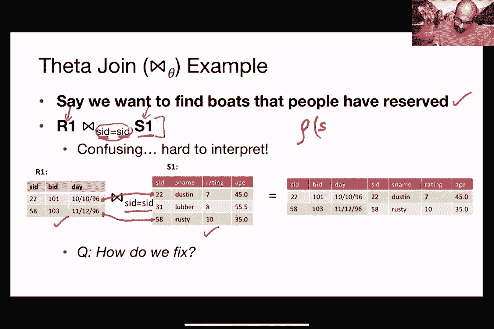
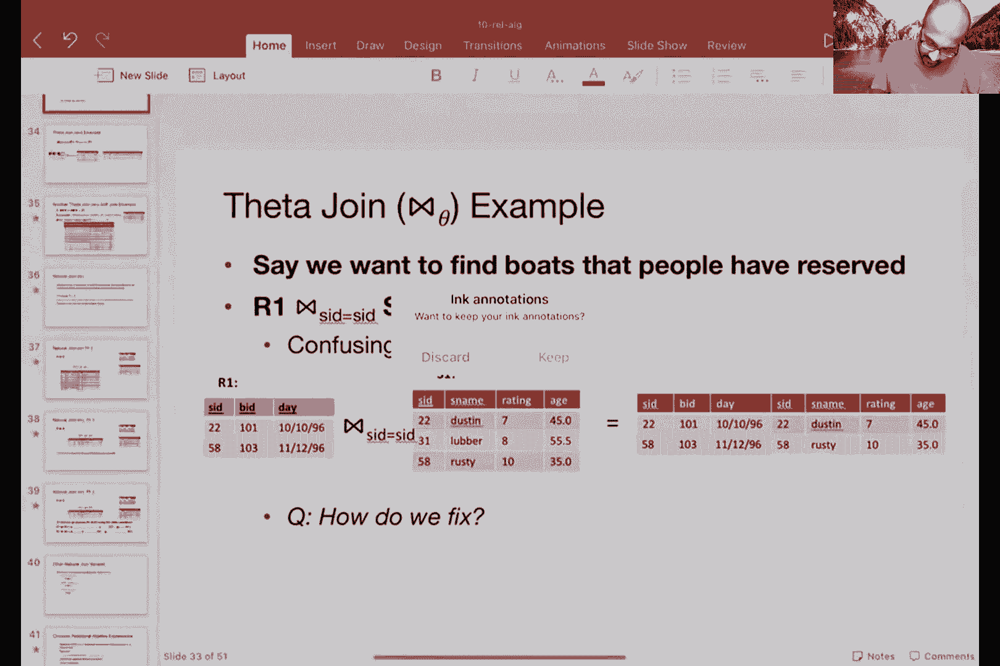
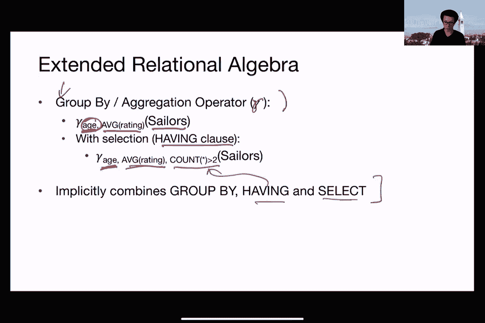
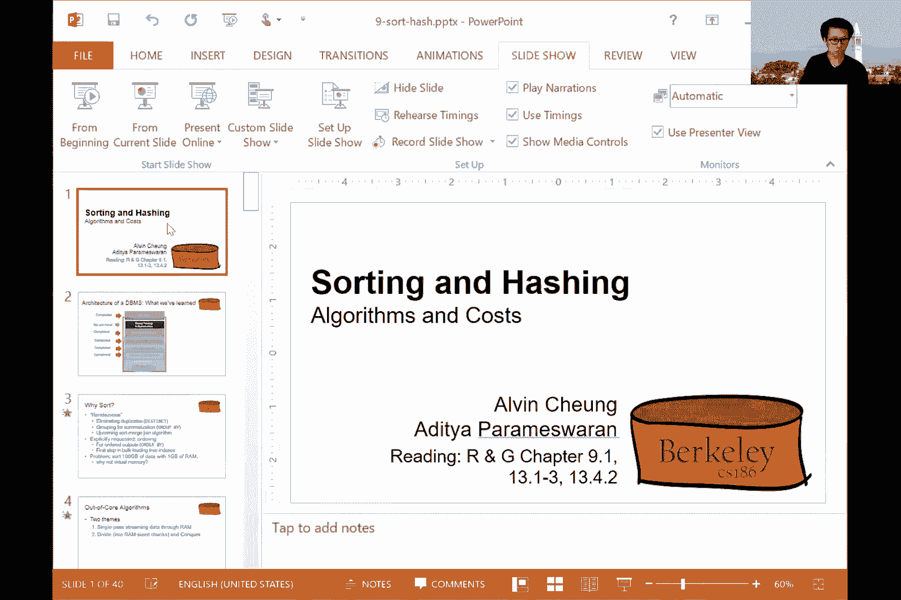
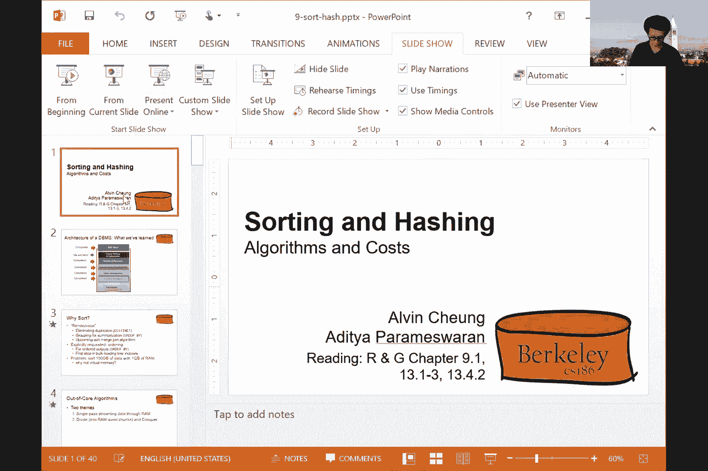
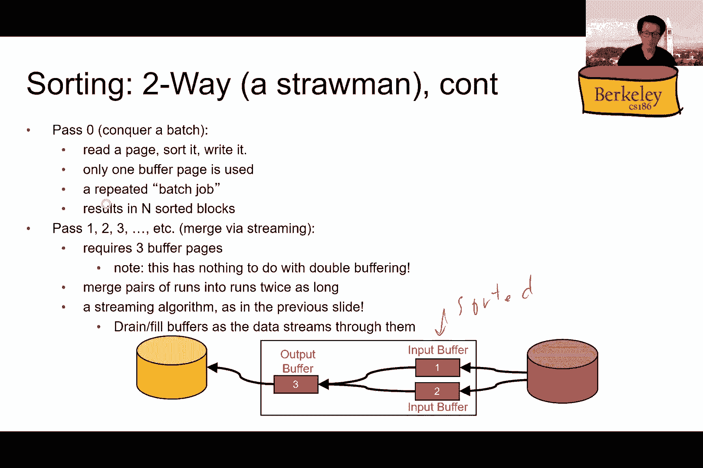

# P8：Lecture 8 Relational Algebra - ___main___ - BV1cL411t7Fz

 I should。 OK， so will there be sort of a dry run for this thing？ Yes。

 there will be a dry run in fact。

 and you will get a bonus point if you participate in the dry run， so it's actually really。

 It'd be good if you participated in the dry run， so and so yeah。

 we'll be around to make sure that your setup makes sense and we'll comment on that。

 So I just wanted to start by giving a little bit of background around this sort of exam proctoring thing。

 So the post is long， right？ There's a lot of details we really want you to spend the time to actually read through all of these details and it took us a long time to arrive at this。

 So we've been trying to work on this for the last three weeks and you can't imagine the number of messages that Jerry and sort of and Alan and and and and Ethan and a bunch of others also sort of basically exchange just to try to figure out what is the best approach for this。

 And in some sense you're trying to optimize three axes， right， so the first axis is fairness。

 We wanted to be fair， right， and we want those who are doing the exam diligently to get rewarded。

 We want to minimize privacy， so we don't want to sort of be invasive as much as we can。

 And the third is we want to minimize the overhead， right。

 so we want to make it as little owners as less owners for us possible。

 And optimizing these three objectives is a pain and it took us a while to arrive at this。

 Hopefully this is something that adds a little bit of discomfort while providing the benefits of privacy and fairness as well。

 So we hope you'll bear with us as we try out this experiment。

 We again be sort of sought feedback from a bunch of other classes and trying to figure out what's the best way to do this。

 And we think you've come up with something decent。 It's not going to be perfect， but it's decent。

 So， but if there's anything that you want to suggest that you feel like it's it's not working for your setting。

 We can try to figure out exceptions， right， so just let us know if it's not working with your setup for whatever reason。

 Let us know and we'll try our best to accommodate。

 And one of the even though the formulation is pretty complex。

 there is going to be a dry run and we hope you'll participate because you'll get points for it。

 And we will evaluate your setup and say， yeah， whatever， and we can go from there。 Okay。

 So if you have any questions about exams， feel free to ask them now。 So， each one asks。

 will we have to scan anything to submit or is the exam online the exam is going to be online so you don't need to print anything you don't need to scan anything so it's going to be online。

 And we also thought of sort of fail safe if you have whatever problems with Wi-Fi and all of that all of that is in the instructions as well。

 Okay。 All right， so other announcements。 As always， look at the weekly post rather than。 Okay。

 I can ask， I can have pen and paper and pencil to help me work through problems but no I patch correct。

 You can have whatever you want in terms of sort of like writing material。 As long as it's not。

 it's not electronic and it's not textbooks， right。 So we will。

 we do have cheat sheets but we don't allow textbooks。 Okay。

 so look at the weekly post for more announcements。

 One thing that we sort of are doing to try to ensure that the TAs can help students at a more steady clip is to sort of insist that the。

 office are ticket descriptions are meeting some bad minimum requirements， right。 So basically。

 we want you to specify the support that you're looking at the questions that you're looking at the description of your problem or bug what issue are you having with and stuff that you've tried out as well as。

 the link to the GitHub repo， right。 So we're gonna insist start insisting that you provide a little bit more information so that the TAs can effectively help effectively help you during these office hours。

 because the issue is that if， if you show up with an issue that doesn't have all of these details fleshed out and the course staff member is helping you out and it's taking a really long time to work out these issues。

 They may not be able to get to the next person in life。 Right。

 so this is overall to increase the efficiency of the system and make sure that everyone gets a fair shake in terms of getting that issue started out。

 Okay， more details on this in post number 19。 Last， but not least。

 I encourage you to turn on your video if you can， of course， no pressure， but we love seeing you。

 We love seeing your reactions。 Okay， and if something's confusing。

 it'll show on your face and I can hopefully try to rectify。 Yeah。

 otherwise we were looking at like a bunch of alphabet so then that's not fun。 Yeah。

 otherwise I have no clue whether any of this is getting through to you。 Right， so， okay。 All right。

 cool。 So we were talking about relational algebra operations， right。

 The relational algebra is like one of my favorite topics in database systems。

 And so it always gives me great joy to present it。 So。

 we're talking about relational algebra operations is like it should remind you of sort of arithmetic and linear algebra in that it's basically allows you to compose larger operations by sort of using these operations in sequence。

 Right， so， so we talked about various basic operations， or at least at a high level。

 The projection selection renaming union set difference cross product and I will get into each of these more detailed ways。

 And we talked about the fact that there are two compound operations in the intersections and joints。

 Okay， revising projections we covered this last time but just a quick overview。

 So projection is represented using the pie symbol。 Okay， and the way it's used is you say pie。

 and then you list the attributes that you want， to obtain in the output。

 and then you give the input relation as the， as the operand。 This is what the operation。

 the pie is operating on。 Okay。 And so from this input relation instance。

 s to this pie operation is basically only retaining S name and H。 Okay。

 so it's getting rid of rating， it's getting rid of s ID。 Okay。

 so that's what you end up getting in this example。

 So this projection operation corresponds to the select list in sequence basically the list of attributes that you list in your selects the select clause in sequel。

 The schema of the output schema of the projection operation is determined by the schema of the attribute list。

 So you basically have these two attributes listed and therefore that is your output schema。

 And the names and types again correspond to the input attribute。

 So this S name is basically the same as this S name， and this age is the same as this age。

 and therefore the names and types derived from the input attributes。

 So projection basically selects a subset of columns so now in a vertical slice。

 So it's doing vertical slicing。 Okay， so what happens if there are duplicates so this is where things get a little tricky。

 So if， for example， you did a projection onto age。

 you projected away the other columns s ID S name and rating。

 You're left with a single attribute relation output， which is just age。 Right。 Now if you notice。

 there are a few duplicates， right。 So there's 35 repeated three times。

 Recall that in relational algebra， you obey set semantics。

 So what you're going to end up doing is to throw away the duplicates and you are only left with two output tools。

 Okay， so set semantics means that you often end up with few rows if you have duplicates during as a result of projection。

 Real systems， as we've seen， don't automatically remove duplicates right so sequel doesn't enforce a duplicate removal。

 And this is because of semantics are consistent semantics across operations。

 as well as for performance reasons doing duplicate removal is expensive。 Right。

 So one possible approach should do it would be to sort and sort is expensive or hash or whatever。

 Each of these operations is expensive。 Okay， so moving on the next operation that I want to talk about another unity operation is sigma selection。

 So in this case， I am applying a sigma a selection of rating is greater than eight on this input relation as to。

 Okay， so basically， I'm enforcing that this particular attribute is greater than it。

 So what that means is this to pull and this to pull gets eliminated from the output and the output that you have is just these two to。

 So selection is sort of the transpose of projection， right。

 it's basically selecting a subset of rows in a horizontal basically doing horizontal slicing。

 Selection corresponds to the well clause in sequel。

 So this is where you list some predicates that's essentially what you can do as a subscript to this to the selection operation。

 The output schema for a selection is basically the same as input。

 You're not throwing away any attributes basically the inheritive from the input。 For selection。

 if the input is a set， then you don't need to do duplicate elimination after the selection operation because the output is also going to have no duplicates。

 Okay， so it's not necessarily。 It's not necessary to do duplicate elimination for selection。

 unlike in the projection case in the projection case because you are throwing away some columns。

 the remaining columns when taken together could have duplicates。 The selection case。

 you don't need to do it。 You basically get that for free。

 Here's an example of composing selection and projection into a more complicated expression。

 Remember， I mentioned how algebra allows you to take basic units of relation instances and then compose large。

 large expressions using these operations composed on top of each other。 In this particular case。

 I have s2， then I'm applying a selection on top of that。

 and then I'm applying a projection on top of that。

 So what this has given me is I'm throwing away the sailors with the rating greater than eight。

 or rather I'm keeping the sailors with the rating greater than eight。

 And then I'm throwing away all other columns except for S name。 So in this instance。

 I would do the selection operation first。 So rating is greater than eight。

 So I've thrown away this tuple and this tuple。 And then I would throw away the remaining attributes that I don't want。

 which is rating age and side。 So what about this other expression。 Okay。

 so let's say I am doing a projection on S name first followed by rating is greater than eight。

 Does this make sense， and if not， why not。 Warren。

 within this not make sense since you're selecting as same sort of what you know， right in power。

 Yeah， exactly right。 So since after you've projected out the other columns and you're left with only S name。

 you can't really apply this predicate reading is greater than eight。

 So this is an ill formed or malformed relation algebra expression that is incorrect。 Okay。

 so you can't， this is this doesn't quite work。 And it's because it's an in it has invalid types。

 So the input to this selection operation does not contain rating。 So that's not a binary operations。

 Okay， so union operation denoted as this you are a cop。

 What does a union operation look like so the union operation basically takes a set union of two sets of tuples。

 Right。 So you have s one as one relation instance。

 as to as another relation instance and each of these。

 Like elements within this within this set is a two book。

 as one union is basically all of the two books combined。

 So this is I'm using set notation or a band diagram here。 So to do this correctly。

 the two input relations need to be compatible。 Okay， so this。

 it must have the same sequence of attributes and the attributes must have the same types。

 Otherwise it doesn't really make sense to take a union of those two relations right because what you'll end up with will have a weird schema。

 So if one relation had three attributes， another relation had four attributes can't really take a union of those two。

 because those two would result a union of those two would result in a relation that has neither three attributes。

 no or no for attributes。 Right， somewhere in the middle。 So it's basically。

 and we basically insist that the two relations must be compatible。

 They have the same set of attributes and types。 So the SQL expression that we've seen for this is union。

 Right。 And so in terms of duplicate elimination in union under state semantics。

 We would do duplicate elimination right because there could be multiple copies of the same two。

 So in this particular example， I have s one and s two and I'm doing s one union s two by a relation algebra。

 This expression has five output tuples， while the two inputs had three plus four。

 seven total seven total input tuples。 Right。 This is because we had this tuple being repeated and this tuple being repeated。

 Right。 So you ended up getting rid of one of those copies of each of those two。

 So the SQL expression， as we've seen is either union or union all union gets rid of duplicates union all keeps the duplicates。

 Okay。 Any questions so far？ Okay。 All right。 So， the question about like。

 can you repeat why union produces more rules。 So， um， union doesn't in fact。

 so if you took a union of this relation and this relation， you should ideally have seven tuples。

 but then you threw out duplicates so you're left with five tuples。 Is that answer your question。

 Mature。 Okay。 All right， so set difference another， another binary operation is。

 is like union in that both it's also set oriented operation both input relations must be compatible。

 Right。 So it must have the same schema。 And so basically that means same set of attributes and same types。

 So what does it look like in my Venn diagram？ Well。

 if you have s one and s two s one minus s two is keeping this crescent as an output。 Okay。

 so that's what s one minus s two evaluates as so sequel expression that we've seen for this is except。

 So let's work， work through an example。 In this case。

 my relation instance is s one and s two and I'm trying to s one minus s two。

 So I retain all of the tuples in s one that are not found in s two。

 So going through this list 22 is certainly not found in s two 31 is found in s two。

 So that's not going to be part of the output 58 is part of s two as well。

 So I'm going to get rid of that。 So overall， I'm left with one output to which is 22 right the one corresponding to 22。

 And you can try this yourself at home s two minus s one has two output to this。

 So far set difference。 Do we need to eliminate duplicates like we did for unions in relation algebra。

 This is a question for you folks。 Right， so most I see a few answers in the chat， basically， no。

 right， the answer is no。 And this is because all we are doing is taking s one and then throwing out some of the stuff from s one。

 Right， since s one does not contain any duplicates。

 I don't need to further eliminate duplicates from the result。 Right， so s one。

 I started with s one and then I threw out some stuff s one doesn't have any duplicates。

 And therefore， after throwing out some stuff， I'm still not going to have any duplicates。 Okay。

 Okay， so， so this is not required。 We talked about the SQL expressions for this。

 except we discussed earlier。 There's also accept all this is the same semantics as union or union all in except in SQL duplicates are eliminated if they exist in relation algebra。

 Of course， they don't exist in the input relations。 Right。

 So there are no duplicates in the input relations。

 That's why we didn't require to do this after having computed the result。 Okay。

 so we're getting into more interesting operations。 So let's look at cross product。 Okay。

 so the cross product of two relations are one and s one means that every row in our one is paired with every row in s one。

 So if I have these two relations， then I basically take the bipartite graph of these two relations and I compute all pairs。

 Right。 So I have six output to books。 So that's a cross product。

 So how many rows do I have in the results。 So let's say the size of our one。

 which is usually denoted this way is this。 And the size of our s one is this。

 how many rows do I have in my result。 Yeah， our one into our two or our one times as one， right。

 It's basically the product of the size of the two relations because every relation every to pull in one relation。

 spared with every two pull in the other relation。 Do we need to worry about schema compatibility in this case。

 Not really right these two relations can have arbitrary schemas and so we don't really need to worry if they are compatible in any way。

 Do we need to do duplicate elimination。 Well， again。

 this is not necessary because the two inputs don't have duplicates。 And therefore。

 you can hopefully convince yourself that even in the output you're not going to have any duplicates。

 Okay。 Any questions so far。 Okay， okay。 All right， so here's another interesting operation。

 This is the renaming operation， which is denoted as this P looking symbol Greek symbol。

 also known as the role。 Okay， this is how it's pronounced。 Okay， great。 So， need us。

 How do names work when the cross product happens that's precisely what I'm going to be talking about now。

 Tommy says， I probably missed something but why doesn't our one have duplicates。 Well。

 the inputs don't have our sex， right in relation algebra。 These relations are sets。 And therefore。

 we are under set semantics。 So the inputs don't have duplicates。 In this particular case。

 after you've done the cross product， you won't have any duplicates either。 Okay。

 so renaming allows you to rename relations and their attributes。

 And this is convenient to avoid confusion when two relations overlap in their attribute set。 Okay。

 we can omit the output name if we don't want to remove the output。 Okay， so sorry。

 if we don't want to rename the output。 So let's say our one is looks like this。

 So I have sid bid and day。 These are my three attributes。

 I can rename it into our with sid to the ID to and day using this syntax。

 So you can see that this is the output relation name。 And these are the three attributes。

 And basically I'm listing them here in the order in which they are listed within our one。 Okay。

 so sid is getting renamed to sid to be ID is getting named to be to and day is getting renamed to day。

 Okay， so here I did not change day kept it as is。 I can be since day is not getting renamed。

 I can use a shorthand here。 It's not really all that shorter in this particular instance and certain other instances。

 It could be shorter， where I say， well， the sid the input is getting transformed to sid to in the output and。

 I use this arrow sign to indicate that。 Okay， so these are two separate notations that essentially mean the same thing。

 If I didn't want to rename the relation， I can drop this R and that would also work。 Okay。

 that's if I didn't want to rename the relation， so it'll retain the same name R one。

 There is one more sort of way for renaming another shorthand for renaming。

 This is using the list position。 So this is going after needs question。 So if I did。

 A cross product， and for example， some of the attribute names are common in the two input relations。

 This gives me a shorthand for referring to those attribute names and then renaming them。

 So here I did cross product of R one and S one。 I have one attribute in our one called sid。

 I have one attribute in S one called sid。 And I don't really want a relation that ends up having the two attributes with the same name。

 That's that's not desirable。 I don't know how to refer to those two attributes separately。

 So one way to do this would be to rename the output if I wanted。 I could call this temp one。

 And then I point at the first attribute。 And I'm renaming that as sid one and the fourth attribute and renaming that as sid two。

 So this cross product， the convention is that the attribute of R one are listed first and then the attribute of S one are listed after that。

 Okay， so here the output after renaming is going to have this name temp one。

 sid one as the renamed version of sid and the first sid and sid two as the renamed version of the second sid。

 Okay。 So once again， I can omit the output name if I don't want to rename the output。

 And for this particular case， another alternative is to not wait until you've done the cross product to do the renaming。

 but to rename the input relations itself。 So if I wanted to treat the attributes and the two input relations separately and I wanted to distinguish between them。

 I can give them sort of different names at source， right。

 just change the names at source and then do the cross product。 So some look something like this。

 right， so I could， for example， do renaming of s one。 And then do the cross product after that。

 That's also fine。 Right。 It's always good to add parentheses to display your order in which you want the operations to be performed。

 We'll talk about that in a little bit。 Okay， so these are the basic operations。 Okay。

 now we'll talk about compound operations that can be expressed using the basic operations。

 So let's start with the intersection first。 So for intersection like union or like set difference。

 the input relations must be compatible， which means they have the same schema。 So same attributes。

 same types。 The SQL expression for intersection was intercept， right， and in set notation。

 what we're trying to compute is this part in the middle that these two overlapping。 So。

 what's the story with duplicates， right。 So here， since the two input relations don't have duplicates。

 When you do the intersection， you won't have any duplicates either。 Right。

 So if the inputs are sets， duplicates don't need to be eliminated。

 So you don't need to worry about duplicates for intersection under set semantics for relational algebra。

 Okay， so we already know that intersection with this upside down you。

 Also in later you would call this a cap。 This is a compound operator。 So how would you。

 how do you express this using the other operations that we've described so far。 Any thoughts。 So。

 just say that again， just just guessing cross minus union。 So the cross product minus the union。

 The cross product unfortunately is going to end up changing the schema。 Right。

 So you don't want that to happen。 As soon as you change the schema。

 you can no longer apply set oriented operations。 The set oriented operations all have to preserve schema。

 right。 You have to， you have to。 Okay， so I see some complex expressions。 Nicholas。 Wait。

 I just thought of something and then I forgot。 Okay。 All right。 Don't worry about it。 Okay。

 so let's walk through this and see if， okay， Chris， I think has the solution。

 So let's walk through this。 And see if this makes sense to everyone。 Okay。

 So let's start by talking about this portion， right。

 the overlap portion and see how we might get it。 Right。

 So one way to get it is to start with S one and then drop the present part。 Actually。

 you can do this the other way as well。 Right。 You can start with S two and then drop the corresponding present part on S two。

 but see how we just deciding to start from S one and then drop the caressant part from as well。

 Right。 So you have this full circle and you want to drop the present part。

 You're left with this gray part。 Have you seen this present part before？ Well， yes， we have， right。

 So we know how to compute this present part。 This present part， which is this part。 Sorry。

 this part is basically just S one minus S two。 Right。 So overall。

 what I have is S one minus the present part， which is itself S one minus S two。 Okay。

 So this is a pretty simple expression。 Likewise， I could do S two minus S two minus S one and you can hopefully convince yourself that that works as well。

 Okay。 Moving on to joints。 Okay。 So joints are compound operations， just like intersection。

 And generally， joints look like this， you sort of have a cross product and then you have some selection。

 We might end up renaming something in that。 Okay， so let's work through some alternatives and then see when renaming might be needed。

 So joints have increasing degrees of specialization。

 So the easiest or rather the most powerful form of join is a theater join。

 A theater join is basically has a sub has a subscript theta and it's on the。

 it's a join on the logical expression theta and this symbol。

 which is a bow tie is is the universal symbol for a join。 Okay。

 An equally join is basically a theta join where theta is a conjunction of a qualities。

 And even more special version of join is a natural join and we've seen this before in the sequel lectures。

 a natural join has no subscript。 It's just the bow tie。

 This natural join is an equa join on all matching column names。 Okay。

 and the guarantee that you get it for free is that only one copy of each of these matching column names will be preserved in the article。

 So let's work through examples of these next。 Okay。

 So before that I wanted to say that joins are a super crucial。

 And the cross product which I derived from are super crucial primitive in in database systems。

 They're really， really important in relating information across different tables。

 And we'll spend a ton of time worrying about how to efficiently execute joins。 Okay。

 so a lot of the subsequent lectures are going to be focused on how to be efficiently execute joins。

 especially if you're joining many， many tables at a time。

 And the thing that we certainly want to avoid is to do cross product cross products are just blowing up the output unnecessarily and if we can。

 unless the user explicitly requested we are going to try to avoid it we can。

 we're going to try to find ways around it。 So these。

 like I said we're going to spend a ton of time spending on on how to design efficient join algorithms。

 Okay， so starting from the first join variant， theta join， here's a semantics of theta join， right。

 here's how it would express theta join using the other operations。 So theta join is simple。

 It's basically our cross product with s。 And then you do a sigma， a selection using theta。

 So apply cross product and then filter out two pills that don't match the condition theta。

 So if theta only contains equality conditions with an and a clause between them。

 This is called an equity joint。 Okay， so it's a special case of theta。

 theta join where theta only contains predicates that are equalities。

 So here's an example of a theta join。 So let's say I want to find boats that people have reserved。

 Okay， I have my input relation R one， I have my input relation S one。

 and I wanted to do a theta join between them。 And I say， hey， you know what。

 I'll go with s ID equals s ID。 Right。 And this is what I want my output to look like。 Right。

 I want to relate the corresponding two pills in the two relations。 Right。

 And so these two two pills are part of the output。 So this is an issue， right。

 I can't really interpret this clause， because I don't know which s ID I'm referring to for each of these because each of all one and S one has one side。

 Right。 So this particular expression is hard to interpret。 So how do we fix this expression。

 any thoughts using the operation that we discussed previously。 Rename them。 Right。

 So you might want to rename one of the two relations。 So how might we rename。 Well。

 one option is to rename S one or R one。 Let's say I decided to rename。 So I say， hey。

 I'm going to take s ID。

 Okay。 All right。 I'm going to try again。 I'm going to take s ID and then I'm going to map it to s ID one。

 Okay。 I'm going to do this to all one。 So it's basically now all one with s ID being transformed into s ID one。

 I can then do a theta join on s ID one is equal to s ID with s one。 Okay。

 Now I know where each of these attributes is coming from s ID one is coming from this s ID is coming from this。

 Okay。 So this is no longer an issue。 All right。 So this was my read， I think to fix this issue。

 Right。 So I basically renamed one of the two input relations。 And that's precisely what I did here。

 So let's try another example。 This is an example of a self join。 So I have my sealers table。

 I'm calling it s one and I want to find for every sailor。

 I want to find other sailors who are more senior than that sailor。 Right。 So how might we do this。

 This is actually how the output looks like。 So the output is basically or rather the query looks like this。

 I'm basically taking one copy of s one and then renaming it。

 The reason I'm renaming it is because I don't want the attributes of this。

 And then I'm doing a relation and the other relation to clash。 Right。

 So I took one copy of s one and then I renamed all of its attributes。

 I have yet another copy of s one。 And then I'm doing a theta join where I'm using the condition age one is less than age。

 right， which is what I want to enforce。 I want to find for every sailor。

 I want to find other sailors were more senior。 So this sort of adding in renames to sort of change the name change the names of intermediate relations is pretty common in relation algebra。

 So get used to doing that to ensure that the conditions that you're enforcing， for example。

 for joints or selection subsequently are not ambiguous。 Right。 In this case。

 it's it's clear what age one and age mean because there's a single copy coming from each of the input relations。

 So in this particular example， the before the condition is enforced before age one is less than ages and force。

 This is what the result is going to look like。 This is just a cross product off the renamed copy of s one and s one。

 So I have s I D one as name one rating one age one as coming from the left hand side and then s I D as name rating and age coming from the right hand side。

 And then now I'm using the condition to throw away some tuples so I can throw away this to pull this to pull this to pull and so on。

 And so eventually I'm left with these three tuples。 Okay。 Any questions about this。

 So moving on to natural joints。 So this is a special case of an equijoin where equality's are specified for all fields that match between the two relations and duplicate fields are projected away。

 Right。 So you only have a single copy of each feed。

 So conceptually kind of looks like this you compute our cross product with s you select the rows where feels appearing in both the relations have equal values。

 and then project onto the set of unique fields。 So that's really the conceptual flow for a natural joint。

 So here's an example of a natural joint here again I'm doing a joint between reserves and and sailors。

 I start by doing a cross product。 So basically relating every tuple here with every two pull here。

 So I have six tuples right in this intermediate result。

 Then I look at the attributes that are in common that the only attribute that is in common is SID and I try to keep only the tuples where SID is the same for these two for these two columns。

 Right。 So it's basically the same value in these two columns。

 So I throw out some of the tuples because they don't match the condition。

 Now I'm left with the two result tuples， but I want to ensure that the column names are unique。

 So I throw away one of the copies of this sid。 So eventually I'm left with a single copy of sid bid day。

 both coming from our one and then S name rating age coming from S one。

 So this is a very common commonly used primitive， especially for foreign key joints。

 So here I have a foreign key from our one to S one right on sid。

 And so this is a fairly common use case for for a natural joint。 So now one question is。

 we know that john and not all variants of joints are compound operators。

 How do we express our one natural join with S one using the other operators。 So again。

 what we might end up doing here is to do a renaming right to ensure that we can have distinguishable copies of our two columns。

 And then we might end up doing a cross product followed by a projecting out of the common attributes。

 And that's going to be our recipe here。 So， so we'll start with s one。

 we'll rename the common attribute sid to sid one， we'll do a cross product。

 And then we'll do a selection。 And then we will project out attributes until we are left with a single copy of each attribute。

 And hopefully this makes sense。 And another way to read this which is not pertinent to this example but in general is you take s one and then you rename the fields that you're going to match equality on。

 You do the cross product， and then you match the fields by quality that are common across the two inputs。

 And then you keep one copy of each field as part of the output。

 So we've talked about these three joint variants that are also the other joint variants that we covered in the sequel lectures the left out a giant right out a giant and full out a giant。

 This is how these symbols look like so it's small variants of the bow tie。 So， for example。

 you're indicating that even two posts on the left hand side that don't match anything on the right hand side are still added to the output with a nulls being padded。

 So， you indicate that where these two projections that that sort of stick out of this photo。

 Now we've talked about relational algebra the basic operations right so we've talked about the basic ones as well as the compound ones is about eight operations in total。

 Now let's talk about how to compose more complicated expressions。 So。

 algebra in general linear algebra relation algebra elementary algebra allow you to express sequences of operations in a natural way and compose。

 So in elementary algebra arithmetic algebra you can do it like this for example right so you're multiplying two separate operations which are two separate operands。

 which are themselves the result of other operations for example， plus or minus。 Right。

 Relational algebra allows you to do the same。 There are three different ways that you can express this one is a sequence of assignment statements。

 Another is an expression with several operations operators like this one。

 And you can also express them as expression trees and we'll see examples of each of these。

 So sequences of assignments are convenient if you have a very complex looking relational algebra expression。

 So you basically end up creating temporary relation names。

 So you take intermediate results and then give it a name。 Right。 So。

 the naming both of the relation as well as the attribute names can be done in situ at the time you are doing an assignment by giving a list of attributes。

 So you can take our one and then say， you know what I'm going to rename the attributes of our one to X and Y via this syntax and also rename our one itself to our three。

 So if I wanted to do a theta join between our one and our two。

 So theta with the condition C being replacing theta。

 I can express this in two steps I can say our four is our one across product with our two and then our three is the result of applying a selection。

 Theta of theta is equal to C to our four。 Okay， so we've seen some expressions with multiple operations。

 If you have an expression with multiple operations operators within them。

 you need to talk about precedence。 Okay， so the first sort of rule of thumb here is。

 don't worry about these precedence rules just use parentheses。

 That's my recommendation just use parentheses。 It's it's the most straightforward way to express precedence express your intent in how the relational algebra expression should be read。

 But if you wanted to be lazy about adding parentheses。

 This is how I would read a relational algebra expression。 I would start with the unary operation。

 So select project and rename。 They have the highest residence。

 Then are the sort of the product and the joints across products in the joints。

 And then finally you have the set operations。 Okay。

 so this is a convention that is typical for more complex relational algebra expressions。

 but I would recommend instead using parentheses to force whichever order you choose。 Okay。

 so let's talk about expression trees。 So this is a third representation。

 and this might come in useful as we are discussing how to do sort of query planning and optimization as well。

 So in expression trees， the leaves are the operand。 So these are the relations in our context。

 and the inner nodes are the operators。 And they are applied to their one child if it's unary or children if it's binary。

 So if I have， let's say two relations are an S reserves and sailors once again。

 And I wanted to find the sids of all the sailors who is rating is greater than five or have reserved 100。

 Okay， how might I do this？ Well， I'll break this up into two parts。 Right。

 I want to find the sid of all sailors who's rating is greater than five or have reserved 100。

 I recognize that this rating information is in S， while the boat information is in our。

 so I'm going to have to combine the information across these two relations。

 So let's say I start with this part first。 Okay， as I do of all the sailors who's rating is greater than five。

 I'll start with S。 And then I could， for example， do a sigma， and then say。

 I want those with rating greater than five。 And then I project out everything else and keep just the sid。

 Okay， so I've computed one part of my result。 The second part of the result is from those who have reserved boat 100。

 So for this， I'm going to start with our。 I'm going to then have a selection condition just like I did with S and say。

 BID is equal to 100。 And once again， I'm going to have my projection with sid。 Okay。

 retain sid because that's all that I want in the output。 And finally。

 I can do a union to get the results from both sides。 Okay， so this is basically the result。 Okay。

 Any questions on this？ All right， so this was the same thing that I drew。

 So stepping back a little bit， I want to sort of revisit why we studied relational algebra and why we spent a lot of time discussing these relational algebra expressions。

 So relational algebra expressions， just like in high school， algebra， linear algebra。

 these are really easy for a， for a database system to manipulate。

 And the number of operators is also really small， so it's easy to work with so it's actually easy to manipulate it。

 simplify it， sort of rewrite it。 And to figure out how to rewrite and simplify linear sort of relational algebra expressions。

 the database system uses various heuristics for these rewrites。

 as well as various cost functions to pick between various rewrites。 Okay。

 I want to give you some examples of the types of rewrites that the database system may consider。

 we'll dwell on these rewrites and which of them might make more sense later on in the class later on in the course。

 Okay， so here is one simple rewriting。 Right， so this simple rewriting says， hey。

 I have to conditions， expression one and expression two， and I'm applying both of them to are。

 I can certainly split these up。 By having expression one this condition being applied to the result of the selection on expression to apply to our likewise I can have this condition expression to being applied after expression one。

 and none of these actually， change the result， okay， apologies for the two quality signs。 Okay。

 so all of these are the same， these are all equivalent rewrites。 Another example。

 really powerful example is changing the order in which the joints are evaluated。

 Instead of joining r and s and then doing the joint with T。

 I can instead join s and t and then do the joint with our。 Okay。 Oh。

 I see a lot of questions with the and here， this is just a shorthand for a and D。 Okay。

 Any other questions。 Okay。 Okay， here's another example of a really cool rewrite。 Okay。

 so this is called predicate push down super important might as well learn it now but you'll also learn it again later。

 So let's say I want to find reservations for sailors was ages greater than 40。

 and I have these two relations are an s， are one and s one。 I can do this via this expression。

 right， so here， I basically want to do a natural join of these two relations。

 then I want to throw out all of the sailors ages greater than 40。 Basically do it like this。

 I do a natural joint and then do a sigma。 Okay。 Another way to rewrite this。

 And I'll give you the answer as an asking you is to do the sigma on s one first。

 and then do the natural job。 And the reason why this is okay is because this condition ages greater than 40 is only applicable to s one。

 Okay， ages greater than 40 is only applicable to s one。 And therefore。

 you can do this first before you do the natural join。

 Now this up this rewriting of taking a sigma a selection and then pushing it down is called a predicate push push down。

 This is really important， because it basically reduces the size of intermediate results。 Right。

 if for example， the result after having done this selection on s one is really really small。

 So you're started with one million tuples in s one and you're left with 10 tuples。

 That's a substantial reduction。 Right， so going into the join。

 you have a lot less input tuples that you have to work with。

 And joins and cross products are super expensive， right。

 because you effectively doing a quadratic sort of increase in the。

 in the awkward because every tuple in the left hand side is matched with every tuple in the right hand side。

 So it's great to try to reduce the size of intermediate results。

 And so here by pushing sigma down the selection down。

 you get to reduce the size of the intermediate result。

 So this is a rewriting that's put is actually quite powerful that the database system often uses。

 Here's another example of a rewrite， and this is in eliminating a keyword that we've already seen in a sequel。

 Right， so we saw this not in keyword that was really powerful in allowing us to express fairly complicated needs。

 Right， so here I want to find the sailors who not reserved a certain board。

 And the most convenient way to say this was to say， select blah， blah， blah。

 where s id not in some set， where in I'm looking at the s IDs from this reserves stable corresponding to boat ID 103。

 Okay， so how do we express this in relation algebra。 Right。

 so one approach to express this in relation algebra is this， right。

 so you take the sailors from the。 Actually， this should be s not r。 Right， yes， it should be s。

 Okay， take the sailors project out everything else apart from their s id。

 And then throw away those that have reserved boat ID 103。

 And how do I find those that have reserved boat ID 103。 Well。

 I take the two points corresponding to boat ID 103。 I do a natural join with s。

 and this is basically all of the joined tuples between boat ID 103 reservations and sailor IDs。

 And then I throw， I project out everything else apart from sailor id。 Actually。

 I know that there's a way to simplify this even further。

 Any thoughts on how I might be able to simplify this even further。 Janelle。 Sorry。

 I thought there was a question。 Okay， let me press the button。 Oh， okay， no worries。

 So one way to simplify this even further， which I should have realized is to simply do pie s id of sigma b id is equal to 103 of power。

 I don't even need to do a natural join with this。 That's even simpler。 Okay。 Any other thoughts。 So。

 Nathaniel says， why don't I take the pie outside。 Is that actually okay。 Can I do that？

 So let's try that。 Right。 So I wanted to do s id s minus sigma b id is equal to 103 of R。

 Can I do this。 No， right。 I can't do this because this schema of this is not the same as the schema of this。

 Right。 And so， I can't do this。 So this is okay。 This is not okay。 This is also okay。

 but this is involved in unnecessary join that I didn't realize。 Okay， Nate。

 do you want to describe your question。 I were looking for the names of the sailors。

 So it seems like we would need to get the name after finding the s id's。 Okay。

 I incorrectly assume that it should be s id's。 Okay。 So if it were the name。

 then I would need to do a join。 Okay， so。 Correct。 So if I wanted to get the names。

 it would be pie s name of s minus pie s name of sigma b id is equal to 103 of R。

 Natural join with us。 That makes sense。 Okay。 Okay。

 so these two work for s id's this work for s name。 So the Felix's question is。

 so is the surface level of query optimization during operations on things before joins and cross products。

 Yes， and no， I think that is one of many optimizations。

 It's also a crucial step is to determine the order of the joins。 There are others as well。

 but it's not just， it's not just trying to reduce the intermediate results。

 That is an important consideration， but that's not just the， that's not the only consideration。

 Okay， so one slide on extended relation algebra beyond the simple operations and the derived operations。

 We also have a group by operation， which is， which is gamma for G。 And so you can say。

 I want to compute the ages and the average ratings per age group for sailors。 Right。 So here。

 since I'm not computing any applying any aggregation function on age。

 This is ends up being the group by column。 I can also add a having clause so I can say group by age。

 compute the average rating and I want count greater than two。

 And this is implicitly combining basically group by having as well as selection condition。 Right。

 As in years， you are， you are sub selecting the fact that your output should have each and average rating。

 So that's where the select clause comes from。 The having clauses basically this。 Okay。

 So here's a summary for what we've covered today。 So relation algebra basically says。

 here's a small set of operations that you can mix and match in various ways that map relations to relations so inputs are relations。

 outputs are relations。 And these are operational in the sense that you specify the explicit order in which the operations are performed。

 The close set of operators， which means that whatever you compute as a result is still a relation。

 It's very easy to manipulate rewrite and simplified expressions in relation algebra and expressions in relation algebra are pretty powerful。

 right。 These small number of operations can encapsulate a lot of SQL functionality。

 So like we saw the not in clause， you can actually get rid of that by simply doing a rewrite。 Okay。

 And we covered six basic operations of five basic， we covered six。 Okay。

 there should be a row covered six basic operations as well as some compound operations。

 like the intersection and the bow tie。 And then we have to join any questions on this stuff。 Okay。

 I'll run you want to go。 Can I go back a page。 Yes。 What's that the question。 I， the answer is yes。

 Are we asking a question after you go back to the page I think。 I already went back。

 Do I need to go back even more。 Okay， I guess that was the question。 All right。 Cool。 All right。

 I think I did。 Yeah， I think like the sum of the slides were not on the public website yet。

 I printed the current version in the in the in the drive to put it there but then if you make any changes。

 feel free to just update that。 Okay。 I thought I added the most recent version but I'm。

 I'm not the last few slides were not there for some， for some reason。 I don't know why。 Okay。

 what did it just truncated some point and then there was nothing after that。 Okay。

 I think it stopped right before the nesting slice。 Okay。 So I just。

 so that's why I thought you might have another version， another version that you put out。 Okay。

 Okay。 Okay。 Okay。 Okay。

 Wait。

 Okay。

 Okay， great。 Are they any other questions about relational algebra？ Okay， we have 15 minutes。 So。

 um， well， I mean， if not， I have a kind of trivia question， right？

 So I think last time some people heard about that already。 As you remember。

 we have a kind of mnemonic system， right， for remembering all these different relational algebra operators。

 So， for instance， this was selection， right。 So do people remember why like we chose sigma。

 we didn't choose it， right？ So there was like in the original paper。

 So why was sigma chosen to be selection。 Okay。 So， so that's why we chose this for a， let me guess。

 I'm giving a wrong guess， obviously。 But because we're doing algebra and algebra emanated from the Greeks。

 you should use Greek symbols。 Spencer， right？ Okay。 Let's keep that keep that keep that way。 Okay。

 Fine。 Right。 So we'll do a second month for selection。 We'll do。 Pi is what projection， right？

 So I think people are seeing the pattern here。 Okay。 So here， here comes a problem， right。

 So I don't think we cover that by weight， we also cover this right so gamma was group by right。

 Grouping basically， right。 So there's one operator that we didn't cover in this class right and that is tau and that stands for sorting。

 So for instance， if you do like your order by right， you'll see tau basically showing up。

 So we have a pattern right。 So we have s we have P we have g right so why don't what's going on with tau。

 Right。 Second constant is simple yeah right I mean so because s is already taken as you saw right so we can't use s。

 So what else right I mean let's just pick something that comes right after s and then that turns out to be t so that's that's why like we end up with tau。

 Yeah， so you might also think about like what was up with that right。

 So we call this join right but then like you know this is not a Greek letter as far as I know。

 So what's going on that。 Yeah， it should be a J right but then anyone in the audience actually know Greek。

 Is there J in Greek。 There's no there's no there's no the letter J does not that's not existing Greek right so that's why they had to come up with something else and then like you know that's what they chose I mean I don't know why。

 So， yeah。 Okay so that's the end of the trivia question。 Okay。

 so I hope you guys enjoy a kind of a laugh。 Okay great so the。

 No answer yeah because there's no J in Greek supposedly so that's why like you know that was the that was a problem。

 So， yeah， not it's so。 So the， the， the， the， the one explanation that I've heard for the bow tie is that it kind of looks like a bipartite graph。

 So you have two pulls from one side to pulse on the other side and edges across them that kind of looks like that sort of。

 But I haven't heard a better explanation beyond that you mean like this。 Yeah。

 exactly but it's like。 Yeah， okay well you guys have better imagination that not so you know you guys come up with better answers。

 Okay so let's talk about sorting and hashing so why are we talking about this right first of all。

 So here's the kind of big picture， big picture that we've been talking about for this part of the class。

 So we have actually completed a lot of these different components inside the DBMS believe it or not。

 So now we're actually talking about really we just finished talking about relational operators。

 And then the next phase we want to go into create parsing and optimization。

 So before we can talk about parsing and we've what we can talk about optimization we first have to talk about how each of these relational operators that you saw from the last lecture was actually implemented。

 The one reason why relational algebra we talked about in this class is because each one of these operators kind of corresponds very nicely to let's say a function that you implement as part of project three。

 Right， so you can imagine selection being a function called that you pass in a relation and predicate and then you return another relation。

 So on so forth right。 So but then in order to understand optimize how to do create optimization we first have to learn about like how to actually implement each of these operators that we have seen on in the previous lecture。

 So that's why we want to talk about sorting and hashing。

 And I think about like what is sorting and what is like hashing has to do with query optimization or like implementation of relational algebra operators。

 We didn't talk about explicitly a sort operator and there's definitely not a hash operator right。

 So why we're talking about these two things。 Well so turns out that these two operations are coming enough that actually they have they show up in a lot of different relational algebra operations。

 So first one is sorting。 So sometimes we some this is used very frequently in something called like random operations。

 So for instance when we try to eliminate duplicates as in distinct right。

 We are basically bringing into a post from multiple relations together。

 and then getting rid of those that are duplicates。 Right， so if we can somehow sort them。

 then we can implement this， this duplicate elimination pretty easily。

 We just saw them we go through them from the beginning and then every time when we see a duplicate that is right next to each other right consecutively。

 then we just get rid of it。 And then obviously also for grouping as well right so this is the gamma operation that we're talking about just now。

 So in order to form groups， we need to be able to first figure out like what are the groups right in the in the relation itself。

 And then in order to do that， why don't we just saw it。 If we can sort it。

 then we can recognize where the groups are right by just marching down the the rows。

 And then also later on something that we'll talk about in the after this lecture。

 which is like you know implementing join using a specific algorithm called sort merge as the name suggests。

 we need to do sorting as part of this algorithm。 So that's why we're also talking about sorting here。

 Sometimes they also explicitly requested so as I said in the relational in extended relational algebra。

 there is this thing called ordering， which implements order by so that definitely requires sorting。

 And you know， this year talk about bulk loading of indexes in the beginning and then we also talk about sorting there too。

 The problem that we were addressing this class right however。

 is how to sort huge amounts of data when we have finite amount of memory。

 So you have already learned about different ways to do sorting right。

 I hope that brings some bells from 61， you know things like merge sort things like quick sort things like bubble sort so we've already learned about all that stuff。

 So yes， we're not repeating ourselves for that kind of algorithm but we have a distinct problem where we have tons of data on the disk。

 but we have very little memory in comparison let's say right so how do we do sorting that way。

 So if you have taken 162 you might recognize there's this thing called virtual memory right so we can just load everything using virtual memory into we can load all the records from the disk into virtual memory and then we can just apply our favorite sort algorithm in memory。

 So why doesn't that work， or would that work。 Yeah Nicholas is saying commence this thrashing right。

 So remember in virtual memory right so the the abstraction is basically that we will basically trade off。

 We'll hide away right this loading of data from the disk with just the same interface right as if everything is already a memory。

 but underline the covers， the operating systems actually doing all the random I was that we can imagine right in order to bring everything into the disk。

 sorry into the memory。 So therefore this is actually going to be a very costly operation if this is how we're going to implement sort。

 And I challenge you to actually try implementing it like you know using your 162 pintos assignment and you'll see what I mean if you try to actually do it that way。

 So in order to address this problem right so we talk about in this class what is known as our core algorithms。

 So it's called out of core because main memory or RAM used to be called outside of the core memory。

 So it's like so main memory or RAM used to be called core memory or main memory。

 which is still used these days。 So since we are talking about sorting data that currently resides on the disk and not already brought into memory。

 So therefore they are called out of the core。 So that's why you sometimes hear this name is kind of archaic。

 Sometimes you will also call this as refer to this as external algorithms external in the sense of external to main memory。

 So again we're referring to the disk。 The themes that we will talk about for this。

 for these set of algorithms。 The first one is that we will you often see a pattern where we'll basically be single pass streaming data from the disk into RAM。

 So read a page of data from the disk， go through it inside of the RAM or inside main memory and then write it back to the disk。

 So that's some pattern that is one pattern that you keep seeing in this class。

 And then you also see an application of divide and conquer which you guys learned about in 61 after we have brought things into memory。

 Might be kind of curious about like how it's just divine conquer right so we'll see it's actually pretty cool。

 So let's first talk about single pass streaming。 So as I said right the goal is to basically try to bring in memory sorry bring in data from the disk one page at a time into memory。

 process it， and then write it back to the disk。 So let's say I want to implement map， right。

 the function map。 So pre I basically have a function here F that I'm trying to apply to each of the records on the disk。

 And then the challenge here right as I said is we have to minimize the amount of RAM that we use because we don't have enough RAM that will hold all the records in main memory。

 So the way that we're going to solve this is by reading off chunks of data from the disk。

 So this is the disk here right so I'm just using this cartoonish representation。

 We're reading off pages of data from the disk into main memory here that you see in this。

 I'm representing this as this rectangle here。 I read them in like one page at a time right into this input buffer。

 Apply this function F effects and then write it back to the disk right so for instance。

 First time I read from the disk I might read like you know three of these rectangles right thing of them as records。

 I apply each of them to the function F right and then I produce these pentagons。

 And then I read another page again right and produce more pentagons。

 So notice that the sizes right of the pentagons and the rectangles are different。

 So the rectangles feel three in the input buffer but then like you know the pentagons are somehow smaller I'm able to actually fit them more fit fit more of them on the in the output buffer。

 Right in this way for instance。 So I just repeat this process until the output buffer fails and then I'm just going to write them all back onto the desk。

 Right。 So why am I holding that off right so why not just write each one of those pentagons to the disk immediately when I receive a new output。

 What is the advantage of delaying this right process here。 Yeah。

 reduce IO right why I mean because as you remember sequential IO is good right random IO is bad right so if I write the entire thing one at a time that's going to incur a lot of IO right and then they might actually also。

 be random but then if I write out the entire page that is sequential IO right so if we are using a magnetic spinning disc for example that will be great。

 So this is a kind of pattern that you would set will keep seeing right so we basically fill out the output page and then like you know again right and then we just repeat the entire process until we're done with all the other pages up from the disk。

 So if we're smart about it right we can actually try to run what is known as double buffering。

 So instead of having just one input buffer we can actually have to。 Why。

 because we can actually afford to start a second threat right whose responsibility is only to either read from the disk or write a full page onto the disk afterwards。

 And we can paralyze that right with the map threat that is currently executing running this F function over every single record。

 So this parallelism is available because like you know it takes time to read from the disk and also takes time to write to the disk。

 And if we have multiple threats that are supported by the operating system for instance that we can just spin up spin up like you know two threats right and then we have one threat running the map function。

 And we have one threat that is dedicated to do is I oh。

 So that's like a very common pattern that you see in this class。

 And what happens when you when either one of these buffer is full right so maybe like you know the empty the reap the reap buffer is full or maybe when the right buffer is full。

 then we just switch。 We switched the two threats so those are so the threat that was。

 that was using that was computing the map function now do the IO right because like you know we have a full page that we can either right back to the disk or we now have an empty page that we can read from the disk。

 And then we just switch the other threat to be doing the actual computation。

 So this is going to be very useful and subsequent discussion。

 and we're just going to assume that like you know you have extra rampages that you can spare to do this double buffering。

 So in fact this is such a common pattern that like you're just not going to bring this up again we're just going to assume that that is just going to happen in the background。

 Does this make sense。 Any questions so far。 Okay， so we just went gone through this pattern of like you're doing streaming right across the across the disk using a dedicated IO threat and then doing double buffering。

 So， now let's go back and revisit this problem of sorting and hashing right so what are we trying to do here。

 So let's be formal form about this so here here is the foremost spec with regard to sorting。

 So our goal is to prove is to output a single file F of S。

 That stores the contents of the relation are that we're interested。

 And then all the records has to be ordered in whatever sorting criterion that we are given。

 And actually what we are trying to do。 What about hashing。

 So hashing again we are trying to produce an output file right F of H here。

 And it's also storing the same contents of our as in the input so we're not dropping anything here。

 except that we have the requirement that no two records that have the same hash value can be separated by another record。

 And if two records have the same hash value they should reside consecutively on the disk in this output file that we will produce F sub H。

 Again think back about what why we're trying to do hashing right because we're trying to let's say use hashing to implement duplicate elimination。

 So in order to do that we want to be able to somehow place all the same records the duplicates in particular next to each other in the file。

 If we can do that then we can just implement duplicate elimination using sequential IO which is great。

 So that is the goal here we are trying to produce this file where same records that hash the same value has to reside consecutively on the disk。

 What are we given on the other hand， we are given an input file F that contains a multi set of records are。

 And then we are assuming that this file F picks up and blocks or end pages of storage on the disk。

 We assume that we have a lot， lot more pages that are blocks on the free storage that we can use on the disk compared to the amount of main memory that we have。

 And in fact like you know we're just going to reduce the notation that we have been using before we're just going to say that we have the blocks of RAM that are available that we can bring data in from the disk。

 Does that make sense。 So in the last one minute let me just go through a very simple way to implement sorting。

 So here's one simple way to implement sorting when we have limited number of RAM but we have a lot of data we will try to sort。

 So I'm going to do this in two steps。 The first step is we are going to read a page from the from the main memory。

 and then we're going to sort it and then we're going to write it backwards。 How is it work。

 We read off each page from the disk one at a time。

 And then we're going to start it in place inside main memory。

 you can use your favorite sorting algorithm at that point right since everything is already a main memory。

 So let's say quick start。 And then we are just going to write it back directly back to the disk。

 So far so good but so far we have only started each of these individual pages separately right but our goal is to produce one single gigantic file where everything is sorted。

 So right now this doesn't work right because at the end of the day here we have only sorted the individual page right in the individual pages not the entire file。

 So how do we do that afterwards right。 Well think about think back when you learn about merge sorts。

 Right this is what we can do also in this case right。

 So we basically read back these sorted individual pages into the into into main memory。

 So in this case now we require three buffer pages because we're going to read two pages at a time from the desk。

 Now these guys are sorted right。 So these pages have been sorted and then we are going to merge them into the output buffer。

 One page at a time。 Right， so this is the same thing as merge sort algorithm right we just start reading off from the two pages。

 And then we basically figure out which one should go first right depending on the sort order and then we're going to put that into the output buffer。

 And then when the output buffer is full， we're just going to write that back to the to the desk。

 Right， so that's what we're doing here。 So this is a streaming algorithm as you as you see right so just like on the previous slide so we're basically streaming every two pull from the input disk。

 and then processing it processing and somehow and then send it over to the output。

 except that in this case we are doing this in two passes right。

 So we're first sorting out the individual pages first。

 and then we're basically applying merge sort afterwards by reading back everything into into main memory and then writing them out onto the disk。

 And then at the end of the day we'll have one gigantic file that is completely sorted at the end。

 But not yet right because at this point we only we have only merged two of the two of the pages we have to add we actually have to merge more right we have to basically merge all the pages until we get one single file。

 So that's where we will pick up next time。 Have you have any questions please stay otherwise we'll see you on Thursday。

 We use the clear-favities drop-in symbol here。

