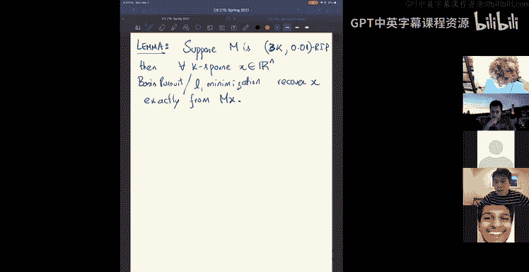
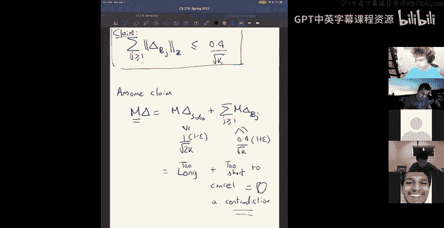
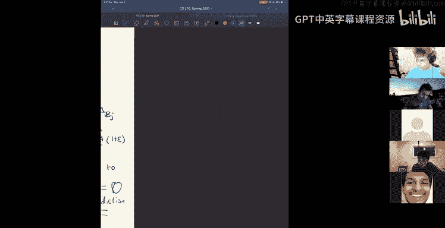
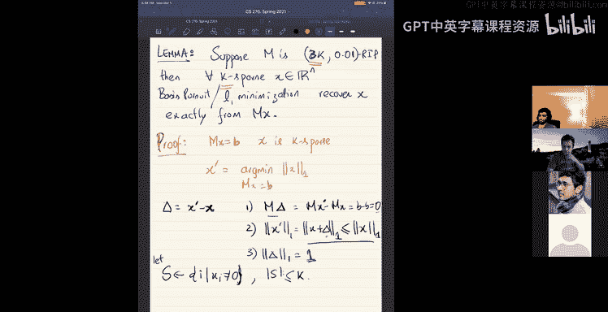

# 组合算法与数据结构：10：压缩感知与稀疏恢复


在本节课中，我们将完成对“无意识子空间嵌入”定理的证明，并深入探讨一种被称为“压缩感知”的特定维度约减应用。我们将学习如何利用信号的稀疏性，通过远少于信号维度的测量来精确恢复原始信号。

## 完成无意识子空间嵌入的证明

上一节我们介绍了无意识子空间嵌入的核心思想，并开始证明一个关键定理：对于一个随机高斯矩阵 **G** ∈ ℝ^{t×n}，如果行数 `t` 足够大，那么对于任意一个 `d` 维子空间，**G** 能以高概率近似保持该子空间内所有向量的长度。

我们通过选取子空间单位球面上的一个 γ-网（一个有限点集，使得球面上任意点都离网中某点很近）来将无限问题转化为有限问题。我们已经证明了对于网中的所有点，**G** 能以高概率保持其内积（从而保持长度）。现在，我们需要证明这个性质能扩展到整个连续的子空间球面。

### 从网扩展到整个球面

**核心思路**：任意球面上的点 **x** 都可以表示为网中点的一个线性组合，且系数呈几何级数衰减。

**构造过程**：
1.  令 **x₁ = x**。
2.  在网中找到离 **x₁** 最近的点 **y₁**。根据 γ-网的定义，有 `||x₁ - y₁|| ≤ γ`。
3.  将 **x₁** 分解为：**x₁ = y₁ + ||x₁ - y₁|| * ( (x₁ - y₁) / ||x₁ - y₁|| )**。令 **x₂ = (x₁ - y₁) / ||x₁ - y₁||**（这是一个单位向量）。
4.  对 **x₂** 重复此过程：找到网中最近点 **y₂**，分解 **x₂ = y₂ + ||x₂ - y₂|| * x₃**。
5.  持续迭代，我们可以将 **x** 写成一个无限级数：**x = Σ_{i=1}^{∞} α_i y_i**，其中系数 `α_i` 满足 `|α_i| ≤ γ^{i-1`。

现在，考虑变换后的向量 **Gx** 的长度：
`||Gx||² = <Gx, Gx> = Σ_{i,j} α_i α_j <Gy_i, Gy_j>`

由于 **y_i** 和 **y_j** 都是网中的点，根据我们的假设，它们的内积被很好地保持：`<Gy_i, Gy_j> = <y_i, y_j> ± ε`。
因此：
`||Gx||² = Σ_{i,j} α_i α_j <y_i, y_j> ± ε * Σ_{i,j} |α_i α_j|`

第一项正是 `||x||² = <x, x>`。第二项是误差项。由于系数 `α_i` 几何衰减，其绝对值和 `Σ_i |α_i|` 是一个有界常数（例如，小于 2）。因此，误差项被控制在 `O(ε)` 级别。

这就证明了对于子空间球面上的任意点 **x**，其长度在经过 **G** 变换后都能在 `(1 ± O(ε))` 因子内得到保持。定理得证。

**总结**：通过使用 γ-网，我们将对无限连续集合的联合界问题，转化为对有限点集（其大小与子空间维度 `d` 呈指数关系）的联合界问题。所需的测量数 `t` 与 `d + log(1/δ)` 成正比，这解释了定理中的参数。

## 引入压缩感知 🎯

无意识子空间嵌入处理的是子空间，而压缩感知处理的是另一类结构：稀疏向量。许多自然信号（如图像、音频）在某个合适的基（如傅里叶基、小波基）下是稀疏的，即只有少数坐标值显著非零。

**核心问题**：能否利用这种稀疏性，仅通过 `m << n` 次线性测量（远少于信号维度 `n`）来完整恢复一个 `n` 维稀疏信号 **x**？

### 线性测量模型

我们通过一个测量矩阵 **M** ∈ ℝ^{m×n} 进行测量。我们不是直接观测 **x**，而是观测线性测量值 **b = Mx** ∈ ℝ^m。
**恢复任务**：在已知 **M** 和测量结果 **b** 的前提下，恢复出原始的稀疏信号 **x**。

这里存在两个关键问题：
1.  **可识别性**：矩阵 **M** 需要具备什么性质，才能保证稀疏解 **x** 是唯一确定的？
2.  **算法**：如何从 **b** 中有效地恢复出 **x**？

### ℓ₁ 最小化：一种启发式方法




最直接的稀疏恢复优化问题是最小化 **x** 的 ℓ₀ “范数”（即非零元素个数）：
```
minimize ||x||₀ subject to Mx = b
```
然而，这是一个非凸、NP难的问题。

一个广泛使用的启发式方法是将其松弛为凸优化问题，即最小化 ℓ₁ 范数：
```
minimize ||x||₁ subject to Mx = b
```
其中 `||x||₁ = Σ_i |x_i|`。

**直观解释**：ℓ₁ 范数球（例如三维中的八面体）是“尖”的，其顶点和低维面对应于稀疏向量（顶点是只有一个非零元素的向量，棱边是有两个非零元素的向量等）。最小化 ℓ₁ 范数相当于在约束超平面 `Mx = b` 上寻找与 ℓ₁ 球面首次接触的点。对于“大多数”超平面，首次接触点很可能落在这些“尖”的顶点或棱边上，从而产生一个稀疏解。

## 受限等距性质与精确恢复

为了理论证明 ℓ₁ 最小化的有效性，我们引入一个关键概念。

**定义（受限等距性质，RIP）**：一个矩阵 **M** ∈ ℝ^{m×n} 满足 `(k, ε)`-RIP，如果对于所有至多 `k` 个非零元素的向量 **x**（`k`-稀疏向量），都有：
`(1 - ε) ||x||₂² ≤ ||Mx||₂² ≤ (1 + ε) ||x||₂²`

这意味着 **M** 近似保持所有 `k`-稀疏向量的长度。





**为什么随机矩阵满足 RIP？**
所有 `k`-稀疏向量的集合可以表示为 `C(n, k)` 个 `k` 维子空间的并集。我们已经知道，对于一个固定的 `k` 维子空间，随机高斯矩阵能以高概率（通过调整行数 `m`）保持其上的长度。通过对这 `C(n, k)` 个子空间进行联合界，我们可以证明：如果 `m = O( k + log(C(n, k)) ) = O( k log(n/k) )`，那么随机高斯矩阵 **M** 将以高概率满足 `(k, ε)`-RIP。这从信息论角度看也是直观的：我们需要约 `log(C(n, k))` 比特来编码非零值的位置，以及 `O(k)` 次测量来编码这些位置上的值。

### ℓ₁ 最小化精确恢复定理

**定理**：如果测量矩阵 **M** 满足 `(2k, ε)`-RIP，且 `ε` 足够小（例如小于某个常数如 0.4），那么对于任意 `k`-稀疏信号 **x**，通过测量 **b = Mx** 并求解 ℓ₁ 最小化问题：
```
minimize ||x'||₁ subject to Mx' = b
```
得到的解 **x'** 将精确等于原始信号 **x**。

**证明思路（反证法）**：
1.  假设存在另一个解 **x'** ≠ **x**，且 `||x'||₁ ≤ ||x||₁`。令 **Δ = x' - x**，则 **MΔ = 0**。
2.  设 **S** 是 **x** 的非零坐标索引集，`|S| = k`。由于 **x'** 的 ℓ₁ 范数更小，可以推导出 **Δ** 在 **S** 上的 ℓ₁ 质量至少占其总 ℓ₁ 质量的一半：`||Δ_S||₁ ≥ 0.5 ||Δ||₁`。
3.  将 **Δ** 在 **S` 补集上的坐标按绝对值降序排列，并分成若干块，每块大小约为 `k`。
4.  **关键步骤**：
    *   向量 `[Δ_S; Δ_{第一块}]` 是 `3k`-稀疏的。由于 **M** 满足 `(2k, ε)`-RIP（实际上需要 `3k`），其范数被大致保持，因此 `||M(Δ_S + Δ_{第一块})||₂` 相对较大。
    *   利用坐标递减的性质，可以证明剩余各块的 ℓ₂ 范数之和很小。
5.  然而，由于 **MΔ = 0**，我们有 `0 = MΔ_S + Σ_{所有块} MΔ_{块}`。这意味着 `MΔ_S` 必须能被后续各块的像抵消。但根据 RIP，`MΔ_S` 的“能量”较大，而后续各块像的“能量”总和很小，无法将其抵消至零，从而产生矛盾。因此，假设不成立，**x'** 必须等于 **x**。

## 总结

本节课中我们一起学习了：
1.  **完成了无意识子空间嵌入的证明**：通过构造 γ-网，我们将对无限子空间的保证转化为对有限点集的联合界，证明了随机高斯矩阵能以接近最优的参数保持任意子空间的结构。
2.  **引入了压缩感知框架**：利用信号在特定基下的稀疏性，我们可以用远少于信号维度的线性测量来捕获信号的全部信息。
3.  **分析了 ℓ₁ 最小化算法**：我们将难解的 ℓ₀ 最小化问题松弛为凸的 ℓ₁ 最小化问题。通过几何直观和受限等距性质，我们证明了对于满足 RIP 的随机测量矩阵，ℓ₁ 最小化能精确恢复原始稀疏信号。



压缩感知将维度约减的思想应用于稀疏向量集，在医学成像、单像素相机等领域有重要应用。其核心在于，通过巧妙的线性测量和高效的凸优化算法，我们可以突破传统采样定理的限制。