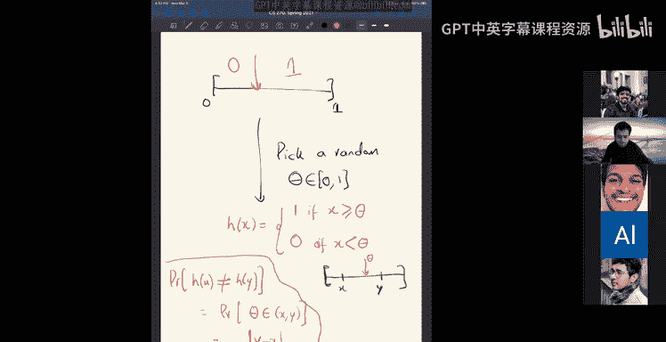

# 组合算法与数据结构：11：近似最近邻搜索与局部敏感哈希


在本节课中，我们将学习度量空间和嵌入的基本概念，并探讨一个核心的计算问题：近似最近邻搜索。我们将看到，通过一种称为“局部敏感哈希”的巧妙技术，可以高效地解决这个问题。

## 度量空间与嵌入

上一节我们介绍了度量空间和嵌入的概念。本节中，我们来看看它们的正式定义。

**度量空间** 是一个集合 `X` 及其上的一个距离函数 `d`。距离函数 `d: X × X → ℝ⁺` 满足以下性质：
*   `d(x, x) = 0`
*   `d(x, y) = d(y, x)` （对称性）
*   `d(x, y) + d(y, z) ≥ d(x, z)` （三角不等式）

常见的例子包括欧几里得空间（L2范数）、曼哈顿空间（L1范数）、字符串的编辑距离以及图上的最短路径距离。

**嵌入** 是从一个度量空间 `(X, d)` 到另一个度量空间 `(X‘, d’)` 的映射函数 `φ`。如果该映射能以因子 `D` 保留距离，则称为失真度为 `D` 的嵌入。即，对于所有 `x, y ∈ X`，满足：
```
d(x, y) / D ≤ d‘(φ(x), φ(y)) ≤ d(x, y)
```
失真度为1的嵌入称为等距嵌入。

## 最近邻搜索问题

现在，我们来看一个度量空间上的基础计算问题：最近邻搜索。

给定一个度量空间（例如 `ℝᵈ` 和 L2 范数）中的一个点集 `P`（数据点），以及一个查询点 `q`，目标是找到 `P` 中距离 `q` 最近的点。

一个朴素的解决方案是存储所有点，查询时计算 `q` 到每个点的距离。这需要 `O(nd)` 的存储空间和 `O(nd)` 的查询时间（`d` 为维度）。在低维度下，可以使用 KD 树等数据结构，但其空间复杂度通常随维度 `d` 指数增长，对于高维数据（如图像、文本向量）不适用。即使先使用约翰逊-林登斯特劳斯引理进行降维，再构建数据结构，空间需求仍然很大。

因此，我们将关注一个放松版本的问题。

## 近似最近邻问题

为了解决高维下的效率问题，我们考虑一个近似且带尺度约束的版本：**C-近似 R-近邻** 问题。

**输入**：
*   点集 `P`（数据点）。
*   距离尺度 `R`。
*   近似因子 `C > 1`。

**查询**：
*   一个查询点 `q`。

**目标**：
*   如果存在一个数据点 `p ∈ P` 满足 `d(p, q) ≤ R`，则算法必须返回一个点 `p’ ∈ P`，满足 `d(p’, q) ≤ C * R`。
*   如果不存在这样的点（即所有点距离都大于 `R`），算法可以不返回任何结果或返回任意点。

一个更强的版本是 **C-近似最近邻** 问题，它要求返回的点距离 `q` 至多是最近点距离的 `C` 倍。通常，可以通过在尺度 `R` 上二分搜索，利用解决前一个问题的算法来解决后一个问题。

## 局部敏感哈希

解决近似近邻搜索的一个核心思想是使用哈希，但不是普通的哈希。我们需要一种能反映数据点之间“距离”的哈希函数，即局部敏感哈希。

一个 **(R, CR, P_close, P_far) 局部敏感哈希族** 是一族哈希函数 `H`，满足对于任意两点 `x, y`：
*   若 `d(x, y) ≤ R`，则 `Pr[h(x) = h(y)] ≥ P_close`。
*   若 `d(x, y) ≥ CR`，则 `Pr[h(x) = h(y)] ≤ P_far`。

其中 `P_close > P_far`。哈希函数 `h` 是从该族中随机选取的。

### 哈希族构造示例

以下是几个LSH族的例子：

**1. 汉明距离（L1 on {0,1}ᵈ）**
*   哈希函数：随机选取一个坐标 `i`，`h(x) = x_i`。
*   性质：`Pr[h(x) = h(y)] = 1 - (汉明距离(x, y) / d)`。

**2. 单位球面上的余弦距离（角度）**
*   哈希函数：随机选取一个超平面（通过随机高斯向量 `v` 定义），`h(x) = sign(v·x)`。
*   性质：两点被超平面分开的概率正比于它们之间的角度。

**3. 杰卡德相似度（用于集合/文档）**
*   距离：`d(A, B) = 1 - |A ∩ B| / |A ∪ B|`。
*   哈希函数（最小哈希）：随机排列整个字典（词表），`h(A)` 定义为排列后 `A` 中第一个元素。
*   关键性质：`Pr[h(A) = h(B)] = |A ∩ B| / |A ∪ B| = 1 - d(A, B)`。这个相关的随机选择（同一排列用于所有文档）至关重要。

**4. L2 距离（欧几里得距离）**
*   构造分两步：
    1.  **随机投影**：选取随机高斯向量 `v`，将点 `x` 映射到一维实数 `v·x`。期望距离得以保留。
    2.  **离散化**：在一维线上随机设置一个阈值 `θ`，`h(x) = 1 if (v·x ≥ θ) else 0`。
*   最终，两点哈希值不同的概率正比于它们的 L2 距离。

### 从LSH到数据结构

仅仅有LSH族还不够，我们需要利用它来构建高效的数据结构。思路是放大 `P_close` 和 `P_far` 之间的差距。

**1. 放大差距**
构造新的哈希函数 `g(x) = (h₁(x), h₂(x), ..., h_t(x))`，即串联 `t` 个独立的LSH函数。那么：
*   若 `d(x, y) ≤ R`，则 `Pr[g(x) = g(y)] ≥ (P_close)^t`。
*   若 `d(x, y) ≥ CR`，则 `Pr[g(x) = g(y)] ≤ (P_far)^t`。
通过增大 `t`，可以使相近点碰撞概率与相远点碰撞概率的差距指数级扩大。

**2. 设置参数并重复**
我们希望对于任意查询点 `q`，没有远点（距离 ≥ CR）与它碰撞。这要求 `(P_far)^t ≈ 1/n`，解得 `t ≈ log(1/n) / log(P_far) = O(log n)`。
此时，一个近点（距离 ≤ R）与 `q` 碰撞的概率至少为 `(P_close)^t ≈ n^{-ρ}`，其中 `ρ = log(P_close) / log(P_far) < 1`。

由于单次成功概率低（`n^{-ρ}`），我们构建 `L = n^ρ` 个独立的哈希表，每个哈希表使用不同的 `g` 函数。这样，对于一个近邻查询点，它在至少一个哈希表中与近点碰撞的概率就变成了常数。

**3. 算法流程**
*   **预处理**：构建 `L = n^ρ` 个哈希表。对于每个数据点 `p`，计算它在所有 `L` 个哈希表中的索引 `g_i(p)`，并将其存入对应的桶中。
*   **查询**：对于查询点 `q`，计算它在 `L` 个哈希表中的索引 `g_i(q)`。检查每个对应桶中是否存在数据点。如果找到，则计算其与 `q` 的实际距离，若满足 `≤ C*R` 则返回。

**4. 复杂度分析**
*   **空间**：`O(n * L) = O(n^{1+ρ})`，用于存储 `L` 个哈希表。
*   **查询时间**：`O(L) = O(n^ρ)` 次哈希计算和桶访问，通常还需进行常数次距离计算验证。

## 扩展到复杂度量

对于编辑距离、地球移动距离等更复杂的度量，直接构造LSH可能困难。一个常见的方法是分两步：
1.  **嵌入**：将原度量空间嵌入到更简单的空间（如 L1）中，虽然会引入失真 `D`（可能是 `log n` 等增长缓慢的函数）。
2.  **应用LSH**：在目标空间（如 L1）上使用已知的高效LSH方案。

## 总结

本节课中我们一起学习了：
1.  **度量空间与嵌入** 的形式化定义。
2.  **最近邻搜索** 问题及其在高维下面临的挑战。
3.  **近似最近邻** 问题的放松定义（C-近似 R-近邻）。
4.  **局部敏感哈希** 的核心思想：哈希碰撞的概率反映数据点的距离。
5.  如何通过 **串联哈希函数** 和 **构建多个哈希表** 来放大概率差距，从而构造出解决近似近邻搜索的数据结构，其查询时间为 `O(n^ρ)`，其中 `ρ` 是LSH族的一个参数。
6.  几个经典度量（汉明距离、余弦距离、杰卡德相似度、L2距离）的LSH构造示例。
7.  处理复杂度量的一般策略：先嵌入到简单空间（如L1），再应用LSH。



局部敏感哈希是处理高维相似性搜索的强大工具，在文档去重、图像检索、推荐系统等领域有广泛应用。