# UCB《组合算法与数据结构｜CS 270 Combinatorial Algorithms and Data Structures 2021》中英字幕 - P14：lecture 14.zh_en - GPT中英字幕课程资源 - BV1uZdpYZEwr

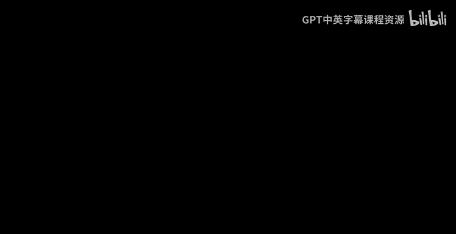

Welcome everyone， welcome to。That should so。Today we'll start a new topic。

 We'll talk about spectrograph theory。And the plan is to。So嗯。

Look at this for a three or four classes。 let's see how how long it takes。

 So there's a lot of material that we could choose in spectrograph theory。

 And I guess that's been the sort of the。Most time consuming part for me as I prepare for this pictures is how much stuff I leave out。

In every almost every topic so far， that's been the。

I most time consuming things look at a lot of material and I don't know which one to pick so I guess I'll pick some a sort random set of topics just out of my own taste but there are they literally books on this topic and entire classes on specgraph theory so what is specgraph theory about well it's it is about。

Understanding graphs。By looking at the eigenvalues and eigenvectors of the matrices involved。ok， and。

呃。You know， of there are a few different physical analogies of what a graph is that you get once you start thinking about the corresponding quadratic forms and so on。

 and these physical analogies are also extremely useful as a sort of。い？

Sort of a baseline to base your intuition number of graphs。Okay， so let's。So if I give you a graph。

G equal to V D。A natural quadratic form that you can associate with it is the lapplian of the graph。

 so the lapplian。Of the graph is this quadratic form， I'll just call it L of x。

 I guess technically it's L sub G of x。It is somewhere over all the edges。Of the graph。

Of the square distance。X time is  x whole squared。Okay。

 so this is a quadratic form that you can associate with a graph。

And whenever you have a quadratic form， you can also look at the corresponding matrix that you associate with this。

 so the matrix that you can associate with the Laplian。Is。嗯。You know， have we're trying to write。

Thela blush as。X transpose Lgx。So what would LGB？It would be。B。Minus8。Where D。Is the。

Matrix of degrees。So you write down the degree of every vertex。On a diagonal matrix。

And a would be the adcency matrix。So AI is one if INJ share an edge。

This is the adjacency matrix and the degree matrix。So the laplu is d minus a。You know。

 for the most part we'll be talking about regular graphs。

 so actually D will basically be d times identity if you have a dregular graph then capital D is just d times the identity matrix every degrees d。

Okay， so what do we okay， so now we have this matrix that you can associate with any graph it's the lapplian。

 we could also talk about most things in terms of adency matrix also。

 but actually speaking talking in terms of lapplin has its benefits。Okay， so。嗯。Okay。

 so what do we know about this quaratic form， firstly by definition。

 you can see that the quaratic form is always greater than equal to 0。

So it's actually a positive semi definite matrix。So L sub g is a positive semi deffinite matrix。Okay。

And so therefore and it's a symmetric matrix， it's a real symmetric。PSD matrix。

 so it has n eigenvalues and N eigenvectors。So。Let's just call these eigenvalues Lambda 1 through Lambda n。

And since it's positive indefinite， all the eigenvalue is a greater equal zero。

And N eigenvectors you have there V1。Sorry， there's not less than。你懂。In orthogonal lienvectors。ok。

And。Okay， so what more can we say here well lambda 1 we can write on what lambda 1 is you can guess lambda 1 by guessing an eigenvector for this this thing and。

TheIf I look at the vector v1， which is all once。This is a constant vector。Okay。

 then you can check that you know， x transpose LG X， this is some over。位置。

The edges Xi minus Xj whole squared， so it's you know in every edge， the difference is zero。

 so you get zero。就。So the trivial eigenvalue， there is an eigenvector of eigenvalue0 always in every graph。

 and the corresponding eigenvector is just the constant function1。It's one throughout the graph。Okay。

 so now you know， we can ask what about the rest of theves。

 of course it'd be different depending on the graph。And。So in this context， actually。

The like there are I guess a couple of different interpretations of eigenvectors right So one is of course as a root of a characteristic polynomial and as invariant vectors and so on so forth the。

Kind of the definition of eigenvalues， which is very useful in this context。

 is the definition in terms of。In terms of rally coefficients。

Alread alternately the definition that shows up when we talk about PC we talk about PC in like a few lectures ago。

 we saw that the eigenvalues or eigenvectors you can characterize them as the best approximations of any given rank to the matrix So that's sort of a thing is actually the。

The most useful interpretation here。 So let me write down what this thing is well basically。

Is a current。Fisher theorem， this is just a statement about eigenvectors of a real symmetric matrix。

 now let M be a real symmetric matrix。With eigenvalues。

 lambda 1 less than equal to lambda 2 less than equal to lambda n n eigenvalues。Now。

What is a characterization of lambda？Well诶 lamb the key。Okay。

 so suppose I had to find a subspace of dimension K。Suppose I had to find it subspace of dimension K。

Let me call that subspace V。Such that I minimize the value of the largest rally coefficient of any vector in there。

So， Max。Of x and V。The rally coefficient of a vector is x transpose Mx divided by。X transpose x。

几头犀你你。So that is a characterization of Lambda。就。嗯。So another way to say it is。

You suppose I ask you to pick a subspace。Such that every。

vectorector in that subspace has the smallest rally coefficient possible。

Then the best you can do is to pick the span of the first k eigenvectors and the value you would get is there would be a vector whose relic coefficient would be equal to Lada k。

Okay， so this is a like you know this is basically also what's going on in PCA in a sense。

 it's not very different， it's the same。It's the same phenomenon it's really the same phenomenon that happen in PCA and so on。

 but this is a very important way to think about think about it。

 especially for spectraltrograph theory。So Lada1， for instance。

 is just the best one dimensional subspace that minimizes the largest value of the relic coefficientient。

Okay， and Lada2 would be a plane such that tube。Minimize this and proving this current officialer theorem is very easy once you write on the decomposition and I'll leave it as an exercise to sort of。

Either try to prove it yourself or read the proof。The proof is basically follows by all the basic facts of linear algebra。

 like the eigenvectors are orthogonal and N eigenvalues and so on。所以嗯。Short。

 but it's a important thing to Okay so this is a fact from linear algebra Okay。

 so let's push this put this back in the in the frame we are well。

 let's just think about the lap plusian matrix you look at lap plusian matrix iss a real symmetric matrix and then you get lambda K。

You can think of lambdaque as the sort of the smallest K dimensional embedding in a sense。嗯。

Or the smallest subspace。So that of the subspace of dimension K。That minimizes。嗯。

Edge squared distances， okay？好 right。So okay， this is good。 This is what Lada is now。

So now you know a big corresponding eigenvalues and eigenvectors we can figure out given a graph now what is the intuition behind like what's a good intuition for what's going on with eigenvectors oflaplian。

Well， imagine you have a graph and if you think of a graph as。Network of vertices。And on every edge。

 you imagine you have a spring。Okay， on every edge， UVv。

 there is a spring of the same spring construct everywhere。Okay。

 so you have this right on the graph as a network of springs and then you look at this physical network of springs。

 the energy of any spring you know is proportional to the distance squared right is the length squared。

 proportional to the length squared。做。What you know when you minimize the lapplian。

You're essentially minimizing。And you minimize this plus。

 you're essentially minimizing the total energy of the spring network。 So in some sense。

 your eigenvectors and eigenvalues are actually converging to some distribution or sorry。

 some arrangement of。

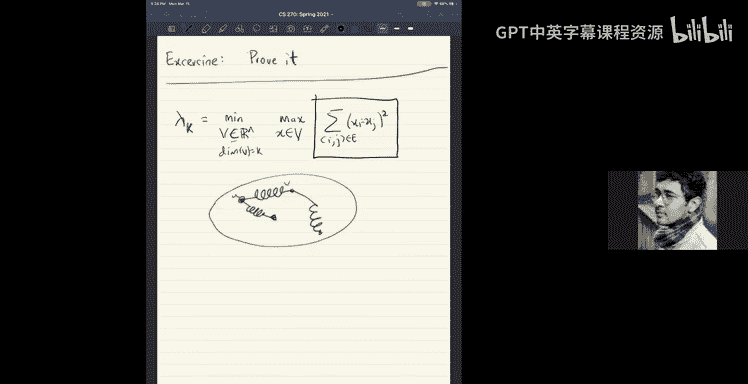

Ebedding some embedding of this graph that minimizes the total energy of the spring network。

 that's what it's happening。And so you can start playing around and look at what it does for。

 let's say。A particular graph at a particular dimension like there are two parameters here。

 like the key parameter is the dimension。 So in some sense。When we ask for a dimension3 embedding。

 we are forcing the vertices to。Be actually in three dimensions， right？

Like the first very first eigenve you saw the very first eigenve was all once and that clearly corresponds to just you know and the network just collapsing with all the vertices at the same place and so the springs are all completely contracted。

 that's the lowest energy state， the energy is zero。Okay， and then you say， okay。

 I want one direction then you get lambda lambda 2 and v2。

 you want two directions you get lambda and Lada 2 lambda 3 and v1 v2 v3。Okay。And。

It's actually quite nice， you know， this gives you very natural ems of the graph。

 so let's just see I'm just going to steal examples from someone else's。

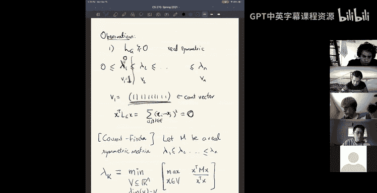

嗯。Sldes， I guess so。做。

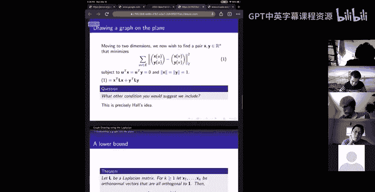

You can just play around this in MAla so can see what happens， so for example。啊。

You see if you take the a path on 20 vertices like this picture here。

 which shows a path on 20 vertices and they plotted just the second eigenvector so the first eigenvector is trivial it is all ones so there's no use of plotting that but if you just plot the second eigenvector of a path on 20 vertices you end up with this。

And。And you know， one thing to actually remember when we look at a picture like this is that the like the entire embedding is created。

Just by。Taking the matrix and computing its eigenvector。For instance。

 it's like there is no like if I give you a path， but I permute the vertices to give you like like I give you a path after permuting the vertices like as in I don't give you the path in that order。

 I say one， five， seven， but it's a path。RightAnd then you know， if you just you have some matrix。

 you compute saig vectorctor and plot it and see how it looks like， itll look like this。

 meaning the only information going into constructing this picture is the connectivity of the vertices。

 not the ordering of the vertices or all that information is so it's quite surprisingly it's quite nice that actually it produces a nice embedding like this。

 you。

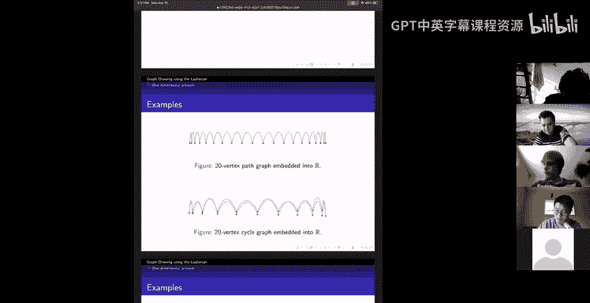

It gets more surprising。

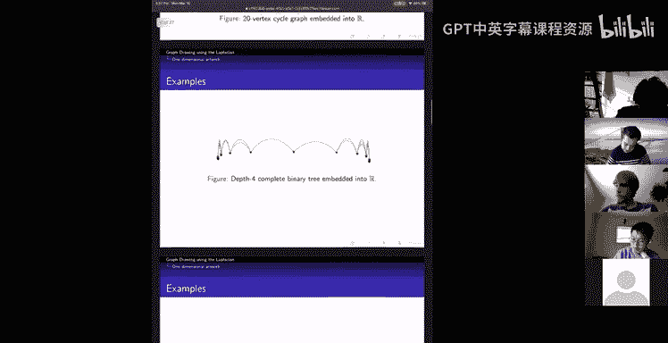

So this is a dumbll graph， a dumbll graph is。

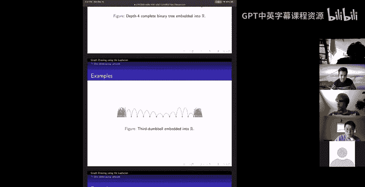

A graph that looks like。

This you have a complete graph you have like let's say n over three vertices that form a complete graph and then you put another n over three vertices in a complete graph and then you。

Join them by。

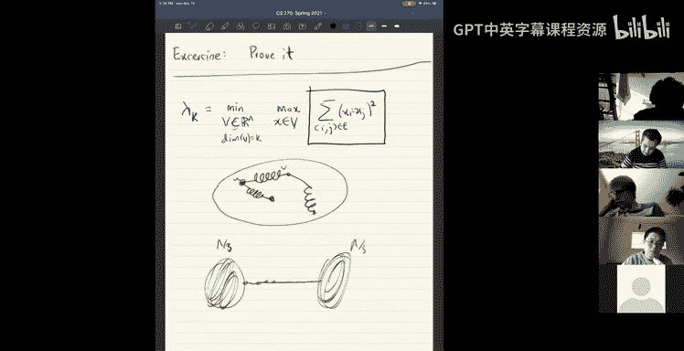

AAbout。Okay， so that's a dumbbell graph。Okay and you see that dumbll graph the two parts which are highly connected so they try to be close to each other delicate complete graph of springs。

 you can imagine them trying to be close to each other and then there's a path in the middle and that's what happens when you just plot by andves。

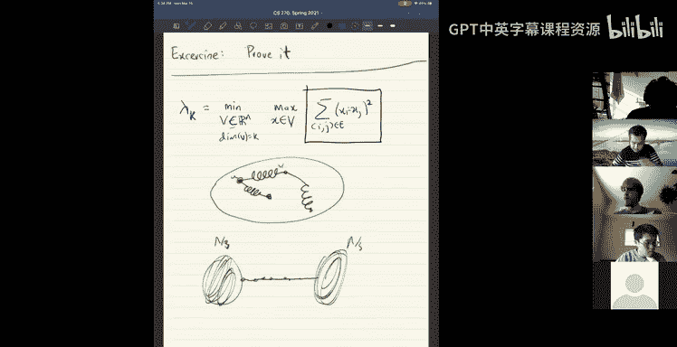

You see that you get two clusters and then。Because there's lots of springs there they hold them together and then the path in the middle is stretched out。

Okay， this is a five click click on fiber vertices。

 as you can see it really wants to be together and so it sort of just pushes one vertex out and。嗯。

It's sort of the best thing。And。Okay there's a question what do you mean by plotting the eigenvectors so what we're doing here is the following so I take the graph I compute it a second eigenvector。

 so the second eigenvector you see it it's an n dimensional vector so for every vertex in the graph。

It assigns a real number。Right and so so you're able to it gives gives you a position on the real line for every vertex in the graph so that's the embedding on the line and if you look at you can look at conjugate em like you know two different eigenvectors。

 for example you can look at the second and the third eigenvector together they give you for every vertex in the graph they give you two coordinates。

So therefore， you get an emdding onto the plane。Okay， and you can do this in three dimensions。

 you use three aigenls and so on。And that's what we're doing here。These are embeddings onto lines。

 just looking at the second eigenvector。And。Let's see further。There are more pictures。😔，RightOkay。

 so this， as you can imagine， this one is just a regular 20 cycle。You take the 20 cycle。

 I guess there's no regular， just a 20 cycle and you look at its。Second and third eigenvector。

It gives you a map the real line onto the plane and they plotted this and it looks like what it should look like。

So the picture is generated purely from the connectivity information。

 so that's the nice part about it。So some of the connectivity information is telling you how to draw it。

So these are different graphs， I guess some graphs are more geometrical than others clearly right and you know in some sense。

I mean know， this is not entirely true， but it is a little bit true that if you start from a graph from some geometry。

 you sort of recover the geometry so a little bit I mean not entirely so this is。Another example。

So here。This is some。Triangulation， just think of this as a triangulation of the plane。

That is being generated like you know as in this is this somebody drew this picture。

 imagine somebody drew this picture okay and so they drew this picture by hand okay now you look at the graph associated with it so there are lots of vertices and lots of edges can look at the graph。

And then you can take the graph and compute its second and third eigenvector。

 and that will give you an embedding onto the plane again。So you draw that em。So it looks like this。

I mean， of course this doesn't seem like doesn't seem like it looks anything like that。

 it looks a little different， but it's still surprising that。嗯。嗯。

Like the sum structure of the graph is still there。Right right as in you took this geometric picture。

 I erase all the geo of it and I just gave you the connectivity information meaning I tell you a list of vertices and I tell you a list of edges and then you plot you just take that list of vertices and list of edges and you don't know how to draw it。

But you just say okay lets me just draw it using the second and third eigenvector and then you get this so it does you know it looks a little bit like it like you recovered the geometric structure I mean on the large scale it looks a little bit deformed but actually on the small scale actually it's quite surprising you see like if you zoom into a region of this era like this picture。

You see that the embedding actually recovers like a nice triangulation。Right， meaning you know。嗯。

Like the vertices are mapped in a way so that you you have the triangles showing up there。

 it's not I mean like you would imagine at first like if you just。

If I gave you this graph this graph with no names on the vertices and like arbitly permed and just I told you。

 oh， this vertex going I do this vertex and you try to draw it on your own。

 you will not recover the nice embedding like this。

But here you see that just the eigenvectors actually give you。Icognize。

 it's quite impressive and surprising that you recover the triangulated geometry from the。白的。So嗯。嗯。系。

I mean， the the。re素诶。So right， so another way to think about this is that you。You have a。

This graph two dimension network and imagine you put in a spring on every edge。

Now this physical system with the springs on every edge。

Sort of has information about the graph because。You know you added edges you added springs only on the edges and the edges were between close by points in this picture close by points had edges so the springs also are between close by points so in some sense if you go to the minimum energy configuration it should some have some you know it should respect the geometry a little bit and that's what you're sort of seeing what happened but。

But， you know， on the other hand， you can clearly like。I mean。

 you can clearly imagine that it's not going to exactly reflect the geometry。

 but it does to some extent。All right， so。So， that's。And， you know。

 it's quite easy to draw these pictures again can。Play around with this graph pick drawing things。

 It's quite fun like in very。I've never done it myself so， but。

That's quite this is quite impressive actually and I don't think we have enough I mean hear that we don't have enough theorems to prove that such a thing happens that。

You take a nice triangulation。I mean and。Got the graph。

And then write down the eigenvectors and it will recover at least pieces of it look like nice triangulations。

We don't know that， yeah。S。Okay， and of course one thing we do know is if you have some kind of symmetry in your graph that translates into a certain symmetry of your eigenvectors。

 so if you took do do take a headron then if you。Computed the three eigenvectors。

 you'll recover the three dimensional embedding of the tode hydrogen。

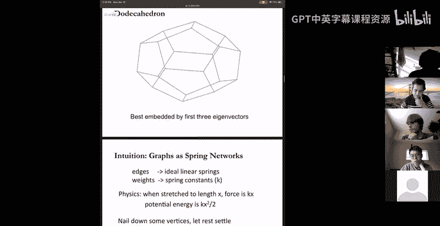

Okay， okay， so that's。That's all I wanted to say about。

Listen。Okay。All right， so let's see if we can。Prove the theorems about it so。Any questions？O。Are the。

In the spring interpretation are the springs like repulsive or attractive why doesn't it just like shrink down or go to infinity Yeah the springs are attractive and that is that's because you know you see that the energy is the distance squared so right so it is true that if you the lowest energy state is assign all the excise to one like a single point and that's why the first tiigenve is one。

And in fact that's the lowest energy state and when we probe into the second eigenvector and so on。

 we are enforcing the like when when we talk about the second eigenvector we are enforcing。嗯。

That your second angle vector should be orthogonal to the first second vector okay so therefore that's what is but you can also I mean that's the that's how we are enforcing things to spread out There are other kinds of and conditions you can put input put dish leg。

Boary condition， what you can do is。You can pick a couple of vertices in the graph and。

Fix them to some locations right and that's another way you can prevent it from shrinking like you can fix verex 2 and vertex 3 at two locations and see what happens to the graph。

Yeah。But when you look at eigenvectors， you're really the you're preventing them from shrinking by orthogonality。

 you're saying V2 has to be different than V1 and V3 has to be different than V1 and V2。Okay。

 so so let's see if we can recover some let's start with something very simple。So。G has。嗯。

At least K connected components。If and only if。Lambda K is 0。Okay， so this is， of course a really。

So if G has one connected component。So yeah， so G has one connect component。

 Lada 1 is0 and so on and so forth。And how do you prove this， well， let's do a。Quick proof。

We're going to use this current fiser theorem about eigenvalues and eigenvectors， okay， firstly。

 if G has k connected components。So let's say there are k sets， S1 K disjoint sets。In your graph。

Okay， then you can look at， I can give you K orthogonal vectors。

Like here's an orthogonal like one one of the orthogonal vectors is just like。V。

 let me call not call them V 1。 let me call them W1 W1 is just。Indicator of the set S1。

So it's one here and zero everywhere else。Okay， that's W1。Okay W2 is indicator of the word set S2。

Okay， it's zero here。One in the second component and zero everywhere else。And so on， okay。

So these are like on if I k connected components， I can show you K vectors。

Indicator of like these are。K vectors。嗯。Each of these vectors has a rally coefficient of zero。

Every one of these vectors。Has a property that if I look at WI transpose Laplaceian WI。Well。

 it is its you know， it's zero because， well， what is it well it's。Some overall edges。

O shouldn use I， let's do W A。Some or is i。Of W AI minus W。地址。Hold square。And。So okay。

 so so basically if you。I mean， other ways， if you look at eigenvector of eigenvalue 0。

 that means that the total energy is zero。for with that configuration。

 what that means is every spring。Has length zero。Meaning the position。

 if A and B are connected by an edge， then they are at the same place。

So like they are the same value。So and that is true here， like you see that。

Like each of these functions， each of these vectors indicator functions satisfy the property that they have zero eigenvalue and moreover they are k orthogonal one of them like W also orthogonal Wj。

So what I just did is I showed you a K dimensional subspace。The span of W1 through， I showed you。

I showed you K orthogonal vectors。Such that all of them。Have。WI transpose LwiI。

By WI WI W transfer for W， this is zero for alli。Okay， so and by current fiser theorem。

 if I show you a K dimensional subspace， such as the rally coefficient of every vector there is some value。

 then lambda k is at most that value， so this implies that lambda k is 0。Okay。Okay， and then。

 of course， okay， what's the converse when we need to prove if lambda k is0， of course。

 if note that if lambda k is 0， lambda1 is0， lambda 2 is0， lambda k minus1 is 0。

If you have k eigenvectors like this， need to prove that。There are key connected components。

At least K connected components。Okay， and。Like this is a this。It mean。

I guess the key point to realize is just that。啊。If I。

Look at the K dimensional embedding given by these。嗯。These eigenvectors。

 so meaning what is the embedding， it maps the vertex v to。Let's say maps a vertex I。

Maps over vertex I to W1 I W2。W K I。Thiss an art to the king。

Basically what is happening is these K vectors give you an embedding such that every spring is of length zero。

hich means that all the edges are of length zero， meaning if I and G are connected。

 they are at the same place。So which means， you know， your graph should。

Like each connected component of your graph is at some the same geometric location and you should be able to recover the connected components by looking at diagon vectors。

So Illll let you figure out the details， the only detail which I didn't say is why do you actually have K components。

 why couldn't it be that only three components and that comes about because you need to have k ortho thegon vectors so you just had three components you wouldn't have。

这样。Okay， so this is like a very。Circuitorss way to find out the number of connected components。

 you take the lapplaceian computed saigen vectors and you see how many of them are zero。

 but the advantage of this is that。If you look at。Uual connectivity algorithm。

 like what's the usual connectivity algorithm， I don't know， Jatra or whatever breakfast search。

 it's not robust。As in， okay， it tells you the connected components， but now if I want to ask。Okay。

' what about？Almost connected components。right， something robust。We don't get that。

 but here there's a robust version of this statement。Okay， so that's called the Cheger inequality。

So let's just do it for okay， let's talk about the Che inequality。So what does this say？Well。

 it says that。Well， of course Lambda1 is always zero， remember that。Okay for all graphs。Okay。

 it says that if。Lambda2 is small， not0， but small， like is epsilon small then。In a sense， G。

s has two components。It has two sparsely connected components， you could say。

Two components that are sparsely connected to each other。2 components。Srsely connected to each other。

So Lambda2 is a way in which you can recover this okay。嗯。And I mean， I'm going to formally state it。

 but order to formally state it， I have to recol recall the notion of expansion like we already have a definition of。

What house par what's partiallyly connected as we defined it last class。

 so let me just recall that so。The expansion。Of a set S in a graph is the number of edges crossing S to v minus S。

Divided by， we said volume of s。Volume of s in a regular graph， if it's a dregular graph。

 is just d times the cardality of s。And there's a number we said it's a number in01。

And it measures how well connected access is to the rest of the graph。And we said。

Conance of the or expansion of the graph itself is the minimum value of p of S。

Over all sets of size at most in order。Okay， this is what we said was the expansion。

So chigas inequality directly relates the value of lambda to expansion。Okay。

 I can let me state the theorem。嗯。嗯。Right。So。Yeah。嗯。Sorry yeah， okay， before I do that。

 let me just define another thing which it's nicer to work with。

Like we've been talking about the lapluian， it's actually better to sometimes better to talk about the normalized lapplian。

So what is a normalized lapplian is just you know， for a regular graph。

 let's say for a deregular graph。Meaning the degrees are alreadyD。The normalized lapplian is just。

 let me call this L sub G tilde tilde for normalized is just one over the degree times the lapplian。

Okay， it's just a nice normalization so that what happens now is all the eigenvalues of your。

All the eigenvalues of your lapplian were in the range zero to 2D。They all in the range  zero to 2D。

But the eigenvalues of after dividing by ID are in the nice， you know， they're in a small range。

 zero to two， like it's really。嗯。Doesn't care about the degree。Okay just a nice。Thing to work with。

Okay， so now I can state trigger nicely。Figureers in equality。Is that。Phi of G。

Is smaller than square root to。嗯。So just to be explicit， let me write what I mean Lambda2 of G。嗯。

And then Lada2。你自点啦。😔，I'm writing down them。Matrix LG tilde here just to emphasize that this is a normalized lapplaceian eigenvalueic。

Basically， it divide by the degree。If you want to recover the thing with the degree， just to put it。

Yeah。And。Okay， so that's the trigger inequality。嗯。Okay， so。The chis inequality act itself。

 you know Che is it comes from differential geometry so chis this inequality is a version of it and especially the left hand side of the equality there's a version of it which is true over。

嗯。It was first p over manifolds and where it was a， very useful fact。

 and then it was extended to graphs。And so now we have a statement over graphs， so purely we graph。O。

So let's see how we can prove this fact。Any questions so far？Okay， so let's see。

How far we can get today so。So let's start from the easy part。

 this is called the easy direction usually and the other one is called the hard direction so you'll see why。

So I want to prove the easy direction first。So what is the easy direction？

I want to prove that phi of G is at least lambda 2 of Lg tilde。By 2， okay。So。

Well how do you prove this？😔，啊，对了。Okay， so you know， let's start from the P of G。Okay。

 let S be the set that。Achiees this P of G。S be the set so that phi of G is equal to the number of edges crossing。

The set divided by the volume， which is a d times the cardinity of S。Okay， okay。

 so now what do you do， Well， I have to。To upper bound lamb the eigenvalue by currentan fiser I just need to show you。

An eigenvector。Okay， so in this discussion throughout we'll assume that our graphs are deregular because I define my normalized lap plus and only for deregular graphs for most of these notions also work for general graphs。

 but you have to define the lappl appropriatecur。Okay， so p of G is this。

 so in order to show I need to exhibit a vector。That show that proves an upper bound on lambdaum。

So here's the vector I would use I would use okay， let's look at indicator of the set so if we look at the indicator of the set。

You know， of course the。Like you have this very nice equality if I look at indicator。

If I evaluate the Laplian。At the indicator。Meaning what is this Well 1 over d times the sum over Ij in an edge。

Indicator of I。Inddiicator S of I minus indicator S of J。Hll squared。

So I'm looking at the indicator set vector and applying computing the quadratic form associated with it。

Well， I mean， naturally， the difference in the indicator is one only when。

I is in the set and J is not in the set or vice versa。Right。Basically， we're looking at s。

 you're looking at the vector which is1 on one side and0 on the other side。

So if I look at indicator resonance indicator J， this is one only when the H crosses the like S2 v minus S。

So this is actually exactly equal to the number of edges crossing from S to v minus S。Divided by D。

Okay， that's really nice。嗯。Okay。All right。What about。The length of the vector indicate sub。呃。

That is also quite nice， what is it well it is cardinal TS。Right， because it's。

P at sum over I indicator s of I whole squared。That is cardinant of s。Okay， so you know。

 if you take the rally coefficientient， the rally coefficientient is already what you exactly want indicators S LG tilde indicator S divided by the。

the rally coefficient of this vector is exactly E S comma v minus S divided by d times cardinal t of s。

So this is exactly phi of S， the expansion of the set。Okay， so that should be here。What's the issue。

 the only catches your vector needs to be orthogonal to the all one vector。

If you want to prove that Lada 2 is something， you need to produce a vector that's orthogonal to all ones and still has a small rally coefficient。

Okay， and that's easy， you know， I mean， what do we have to do。

 we have to take this vector that we have and we need to make it orthogonal to all ones。

And then check if that's fine， you know， that doesn't mess up with the indicator。

 mess up with the R coefficient。ok。And so let's construct that vector。So just to make it， let's say。

嗯。Let's assume that so you have indicator s， right。I want to make it orthogonal to all onces。

So let's say the size of this is little less。ok。诶。Okay， size of s is little less。

 So let's look at the vector W， which is indicator as minus。S times the alwins vector。

This is the all one vector。Oh。Let's say size ofpher is S times n and then。Okay， so what did I do。

 I just took out the component。Along all ones。 Okay， this you can check that because， you know。

 if I take W in a product all onces here like。If I look at W in all ones， what do I get。

 I get indicator as in product all ones。Minus S times。All ones in the product， all ones。Okay。

 this one is cardinal T of s。And this one is。嗯。Right the same。So you got zero。So basically。

 I W is the。W is gotten by taking the indicator function of S and making it orthogonal to all ones okay。

 that's W。Allright， and then all you need to check is that W has a small rally coefficient。

 so we need to understand what is w transpose Lg tilde w trans W divided by W transpose w。ok。

That's the only thing we need to understand。And Ill。

I'll leave it to you to figure out this calculation this is it's there in the book and you can check that once you you substitute the value for W and see that this is actually at least。

嗯。嗯。So， so it's it's， it's at least。Two times。电脑力。The number of edges crossing。Divided by。

 it's two times p of s。是。Okay， so so we exhibited a vector orthogon to all ones whose rally coefficientient is2 phi of s。

 which means lambda 2 is or phi of s is at least Lada 2 or2。I'm sorry。

 I'm sorry I should have got the order of the inequality on。

It's actually at most this So So of2 phi of s is at least lambda 2。 this implies lambda 2。

A fee of F is at least lambda 2 by。So。In sometimes this is the easy side because all we did was we already noticed there sum set that doesn't expand。

And we had to just construct a vector out of it and we just said， okay， take the set。

 take the indicator function of the set and make it off the to all ones， that's about it okay。Okay。

 so and in fact in differential geometry， I don't know much about it。

 but I hear this is the direction which is more useful。嗯。And for us。

 actually it's the other direction which is quite a bit more involved and it's actually useful and the direction we care about is fear of f is smaller than。

Square root 2， Lambda 2。Of lda。Okay， so this is actually the harder direction what what do we have now。

 in some sense， let V be the vector。Such that let W， let's say W is a vector says that W transpose。

AndGW。Let me not let me use x I't。嗯。Meddle tricky to work with。Let me just use X。

X transpose x X Lg by x transpose x， this is。Equal to。懒得住。ok嗯。All right， so。Okay。

 so let explain this vector， save a real valid vector。

 and now your goal is to recover a set out of it。Right a goal now。Is to prove this statement。

 recover。Aet。Yes。Of vertices such that phi of S is actually umost square root2 lambda 2。Okay。

 that's a goal。不。Okay， so。All right， so we need a way in which we take this real valid vector and find a set out of it。

 we need to round it okay and we need an algorithm for this and we'll do a constructive algorithm to find this set。

So here's the constructive algorithm。So first step， what you do is。要。嗯。So， construct。喂。唔系。Centering。

X。So what do I mean？You construct a vector y such that y is basically a shift of x。Take some shift。

 I don't know， let me call the shift alpha。Times all once。Okay， actually。

 when we're talking about these vectors， it's good to remember that what we're really talking about is the embedding of the graph onto the line。

So what you have is you just have one vector x。Okay， and it it it places the word this is this is x。

 this is the eigen eigenvector and it places the graph onto the line so the graph。

Gets mapped onto the line。Okay， and now you have this embedding and you can do things with it right this is x1 x2 I don't know x this is the location of the thing on the real line。

Okay you have the share this embedding so firstly you know recall the from the spring picture that you know if you like if these are springs if I shift the whole embedding to the left or the right nothing changes right the energies don't change because the length of the springs stay the same。

嗯。So like therefore you know shifting the embedding has no effect on the energy， the total energy。

 so I can always look at y equal to x plus some shift times all once and nothing really changes here this is the same thing。

So what we'll do is we'll do a shift。So that half the vertices fall on the positive side and the half the vertices fall on the negative side。

So by shifting， we'll achieve this situation where if zero is your like if your origin on the real line is here。

 n over to vertices fall here and n over to whattices fall here。

So this is your vector y iss a new embedding。Just a shift， you shifted it so that half the veres。

Fall on one half on the other side。不s。So that's what I'm calling centy。In over two， what disease is。

Have Y I negative。And in over two， vertices have。W I positive。Okay。

 this is easy to shape by shifting。 Okay， and then the second thing you do is。

Scale right sort of scale。Skill。嗯。So that。嗯。If let's say， how do you scale。

 some z is equal to some beta times y。Doesn't matter just beta times y。What does this scaling do？诶。

You want to so that you create yeah。It creates z equal to beta y， the scaled version。So that。Okay。

 don't worry about how like what the scaling factors and so on。

 but just the key thing to remember is that we are talking about we're always keeping track of the rally coefficientient What is the rally coefficientient remember it was x transpose L x by you know D times x transpose x it's a ratio of。

Two quadratics。Okay， and one thing that's true about a ratio of quadratics is if I scale the numerator if I scale the vector by beta。

 it doesn't affect the ratio because the numerator gets scaled by beta squared。

 the denominator gets scaled by beta squared and cancers are。So scaling doesn't affect the ratio。

 so so far we haven't messed up with the rally coefficient at all。

The relic coefficient of x was lambmbda 2， the same is true for the re coefficient of z z transpose LgZ by D times z transpose z。

 this is actually lambda 2。我飞钱。So far we haven't done。Dyna like grant aren't messed it up。

 all right so。why did we do this well the reason we did this is。U。Okay， you centered， you scaled。

So I guess I had to draw another a little bit inefficient in my pictures。Among other things。

 so this is my Z。Okay， Z1 to Z， so。Okay， the next step is really the critical step and there are a couple of ways to describe what's happening。

One way to describe it is。嗯。嗯。Is to， I guess add in another embedding， So let me just do sort of。So。

 let's look at。The squares， Z1 squared。Z2 website。Let's look at the squares。And let's look at just。

Embbedding with the squares， okay？Zn squared， and then this is minus z1 squared。Yeah。

 so this is minus z2 squared， minus z3 squared， you know。

 you have some number of them and you're like z minus z n over2 squared maybe and then you have z n over 2 plus1 squared。

And so on。So I'm looking at the squared embedding now。Okay， okay， so this is the。Okay。

 this is a nice。Place I want to be。Okay the squared embedding this is sort of the only for very non trivial step you okay。

 I mean， as you've done several times in this class， once you have the graph on the real line。

 the natural way to construct a cut of the graph is to cut the line。You just cut the line。

 you pick a threshold at some point and you cut the left hand side is S and the right hand side is v minus S。

 that's what we want to do but。In this case， it turns out that if you pick uniformly random cut on the line like you。

You don't get the nice small cut value， you somehow get the square root right。

 I mean the square root is necessary here。So what happens， what you do is。

You can think of it as either。Beking the。Place to cut non uniformly。Okay。

 I can pick the place to cut somewhere。Like non uniformly in here。

 I pick a clever distribution of place to cut。Or you can think of it as follows。

 you have this clever map， what is a clever map， you map every point to its square keeping it sign。

Okay， and now in this region。😊，You pick just a uniform cut。Like after this map， you pick uniform cut。

Okay， so。So I mean， now there okay， so you can see why am my scaling was like this。

 so I picked a scaling so that。Z1 squared plus z squared is1。So the length of this interval is one。

Okay， this interval is length one。Okay， and in this interval of length one。

 pick a random place to cut and cut。That's the algorithm。Big。A random threshold。抖。In the range。

 what is the range well minus z1 squared to zn squared。

You pick a random threshold in that range uniformly randomly。Okay， and you， you know， you sort of。

IYou know， put everything on the left。To S and or right everything on the smaller side to S and everything on the largest side to n minus S。

ok。So that's the algorithm so the algorithm itself is quite simple you just you know the first step and second step are really just you know shifting the embedding and scaling it the third step is just pick a random threshold the only cleverness is in the choice of the distribution with which you pick the threshold and that is in this some of the distribution is like the square like the some of the。

几。So you know， let's see you know， like for example。Okay， so so let me draw this picture again。

 so let's say this is zero， this is mine okay， this is minus z1 squared， minus z2 squared。

And then you have Zn squared， and this length is1。😔，ok。Okay， so。呃。Allright， so。When is。

It's a claim right so whats algorithm might pick a threshold and I cut。Okay the cell be S。

 the side will be minus S。And S is the。S is the。Yeah， s is going to be the smaller side of the cut。

 so if you cut here。You to say the other side is S and V minus this is on this side right because always in what is one thing if you recall in the definition of expansion I should say that you only allow your sets to be of size at most and over two because otherwise it doesn't make sense so you always have your set size to be always at most and over2 so we have to produce a set of size size at most and over two and we'll make sure that's the case so if you。

If you cut on this side， you say， oh， this side is S。

 if you cut on that side you say the to the right is。

And it's a randomized algorithm it's going to produce a cut and with the right expansion it shows that there exists set of right expansion if you want to actually find the set in a deterministic way all you have to do is to do a sweep that you can try every set from left to right by just sweeping by trying out to all the end places where you can cut on the line between this left and the right and see which one gives you a good expansion but this randomized procedure gives you a way to prove that there exists a set with small expansion。

Okay， so what's the first claim okay， first claim is a okay probability that i is in the set as I claim is basically equal to Z squared。

Okay， where is this， well， this is the following thing。I is in the Ces， if and only if。

The threshold tau falls。Between。I and zero。系い。Like it's clear， right， like if I look at。An I Z。

 for example， on the left hand side， only if the threshold falls between I and zero。

 that's when it's。嗯。That's when I is in the C。Otherwise， you would say， oh it's。嗯。Yeah。

So if Z is here。嗯。Only if the threshold falls in this range。

It falls here in this between minus Z squared and0。If falls there， then you say。

I belongs to the set right and the same is true on the other side also you can see that let's say Z n minus1 squared is here。

 what's the chance that Zn minus1 n minus1 throughex belongs to a set well somehow if the threshold falls here like threshold falls on this side between0 and z n minus1。

And then。出出咗饭啦。嗯。So you have this nice thing so so this is nice。

 So what this means is that like the size of the set expected size of the set。

Is actually just summation Z squared。Okay， so we are sort of it looks like what we want。Okay。

 now let's see what happens towards the chance that an edge is cut。Okay。

 what's the chance that an edge is cut？Probability that。HIJ is cut。Well， what is that？

I claim that it's a it's basically。嗯。Okay， so let's be a little bit。嗯。Okay， so what。

All I'm saying is。If I have an edge I。嗯。What is the chance that it is cut well it is cut if the threshold falls in between INj？

ok。Now。What's the okay， what's the chance that threshold falls between I and J？Well。

 the threshold falls between I and J。Like， you know， if A and Z and N。

The short fall between I and Z if。Like the pro of that is just the length of the。

Like distance between NNj this in this line and the distance between NNj is actually Z squared sine of Z minus Zj squared sine of Zj。

But sine is the plus or minus1 sign。Right because if like basically if both I and J are on the right。

 then of course， it's just Z squared minus Zj squared。

If i is on the left of0 and j is on the right of0， then you have Z squared minus minus Zj squared。

 such Z squared plus Zj squared。So。Like this， the， in fact， the embedding here is。

Like this is just Z squared times sine of Z。That's what this thing is。

 I mapped every point to its square， but I also retain the sign。I kept z minus z1 squared。

 minus z to squared and so on。That's what I did。 So therefore， right this is。Like this is just by。

 you know。Ija is cut。If and only if。The threshold falls between。The locations of I N。

And therefore it's equal to this， the probability of that happening is equal to this。Okay。Okay， and。

嗯。嗯。Okay， and。And actually。This。Turns out to be。嗯。Atmost。嗯。Two times。Z i。哦。So I mean。

 why is this true。I guess the best thing I could say is。

Don't worry about it too much it it's just a just the only thing that's sort of annoying and complicated here is the fact that you retain the science。

Like if you， if you didn't have the signs here， Z squared minus Zj squared is clearly Z minus Zj times Z plus Zj。

Okay， so that's clearly true right and so now like because you retain the signs depending on I and J positive or negative。

 you might get like I is positive and J is negative。

Like this quantity can be Z squared plus Zj squared。

Okay and then basically that's just a slight an ion said but this expression is always right you can just verify it's a fact about two numbers on line so you can just verify by the I guess four cases if you want。

 but you can do it in two cases if ZI is positive is is negative so just believe me this is true。

Okay， so now let's okay， so now that we have claim two， we can count the number of edges cut okay。

 we can say what is the expected number of the edges cut by this procedure。

Okay it's clearly equal to some overall ages。Of the probability that they just cut。And by the claim。

 this is by the claim and this expression， it is sum over all the ages。Of this quantity。

 I don't know， I keep the two out of you know Z minus Zj。Times。

Absolute value of Z plus absolute value of Zi。Okay， that's。That's my。Expression for the expected。

 Okay， so now we have both the expression that we care about。

 We know the expected number of vertices。That's going to be S and we know the expected number of edges that's going to be cut。

So all we need to do is to take the ratio and you know simplify it okay。Right， so let's。

Do that so first thing。I'm going to simplify this so now you know。

 it's really we're going to take the ratio of this one with this two and see we get the right expansion。

The number of edge is cut by the number of vertices。Okay that that's see。

 but let me just simplify this expression a little bit more。

 so I'm going to apply this is the only algebraic step in this wallproof， which is a little bit。

Susi Schwars inequality here to say that this is at most。Two times some over AJ。Iage。

Of Z minus Zj whole squared。H to the half。Time some of what I do。In the niche。Of ZI。历自姐。H square。ok。

Actually， you know what I don't think I even need a two here I think the statement is true even without the two I think I'm just carrying on the two。

yeah，ょ yeah。Okay， so this。This is it Okay so now you know we are getting closer so this expression after Kaushi Schwartz the reason for Kahi s Schwartz is we wanted that look like looks a term which looks like the laplash in the spring spring energy so you got Z I and Zj hole squared and then we have this extra stuff here that's。

Let's figure that out。 Okay， so this is just a little bit more simplification。

 The first term I'll just call it iss the lapplian right， such as Z transpose L Z。

That's what the first term is。Okay， the second term。是。All right， what is the second term？

It's a Z plus Zj squared， so I'm going to replace it by some more Ij in the H E。

Z squared plus Zj squared。I put it two here。So this is where I'm using。Take sum another identity。

 which is a plus b whole squared， is at most two times a squared plus b squared。

2 a squared plus 2 b squared。So if I a plus b holds squared here。

 I'm just going to replace by two times a squared was be equal。ok。So now， you know。

 things are simplifying in our favor， the first oh， I need to I shouldn't forget the square root。

 yeah there's a square root because I took the Kahi swords。免对。

This is the Kahi shorts andequality at square root， and then we are in good shape。

 So now we are just in less than z transpose L Z。To the half， that's the first term。

 the second term is， I guess a square root， like is a two。But you know。

 it's a sum over all the edges of Z squared plus Zj squared。

So every term Z squared is counted D times for a degree like in Z square plus e squared every term is counted D times so you just get。

Two times D times summation C squared。Qu and a half。嗯。Awesome， so we got this。 And if you， okay。

 this is our。Expected number of。Ages in the cut。Okay that's easy and then what do we have we already know the expected size of the set and just copying from where we were。

 it is really recall that it was summation ZI square。So you take the ratio of these two quantities。

 you know， we take I guess what we care about is the expansion。We take edges bit from S to b minus S。

Deed by expected value of d times cardity ofs， like this is our expansion。

 like someone is a term for expansion。一啲女人都背度。Z transpo Z。Or to the half。Do it by。嗯。

I think是 yeah还是 leave the。I'm just gonna， yeah。I I'm just going to do it this I root 2 d summation Z squared divided by。

D submissions ZI squared。So you see that this is at most。

 this is exactly square root of the sort of the。Rally coefficient of。

Okay this was square root 2 lambda2。结续。That is the proof。嗯。So you know， stepping back。

 what is it saying， the what is this whole thing saying。

 it's saying that if you want to partitioner graph， you can compute its second eigenvector。

And you can run this algorithm on it， you'll get two sets which are。

Wch have the spae cut between them。Okay you can take any graph and you partition this gives you a partitioning algorithm for a graph you compute the eigenvector second eigenvector and you do this and it doesn't even have to be the second eigenvector。

 you just you know run like a power method or a PC and figure out something like an approximate second eigenvector and because we didn't really use the fact that X is an eigenvector we just use the fact that it has small rally coefficient。

So you can give me any vector with small rally coefficient， you get a cut。

And it's a very efficient algorithm and it's like this is called a spectral partitioning algorithm for graphs and it's used heavily like in practice and so on it's super easy to。

Like's been like it's quite an effective way to partition graphs。嗯。

And know typically people not just use the second eigenvector， reduce like more eigenvectors。

 like a few different eigenvectors， and you know get more and more cuts of the graph like you want to partition a graph into small pieces can do it this way。

Yeah， any questions on this？So the next thing I wanted to show was I wanted to show that on planar graphs。

 the second eigenvalue is actually quite small。Like if you give me a graph that's a planar graph it's secondigenvalue it second evalue is always D or n so you get a cut of value root and edges roughly cutting root and edges。

 but I guess we'll do it next class it has a nice you know when I pick topics。

Like sometimes we need to have fun so it's a nice topic it's just fun I don't know if you'll have like super applications it have applicants already。

 but in the future but just。It's a fun topic and just do it。听一。Okay。Thank you， professor。

In questions。I had a really quick question at the home I don't know if you want to do that now like office oh let me pause it up。

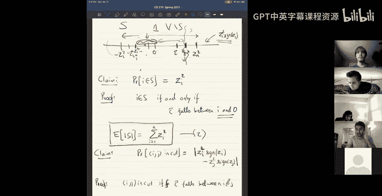