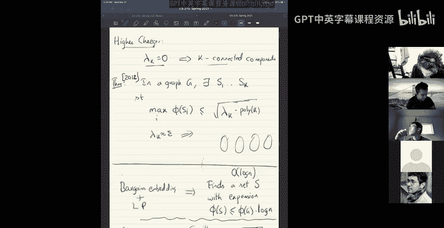
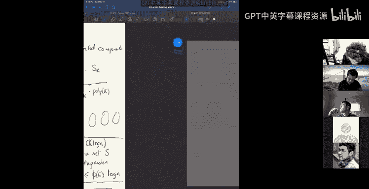
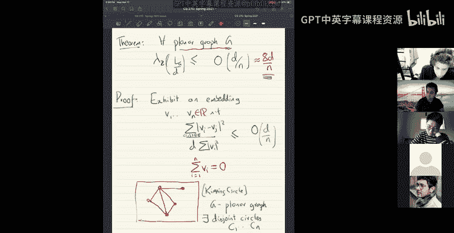
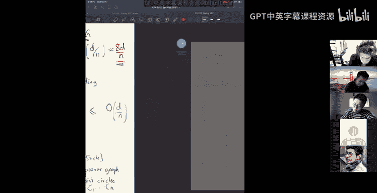
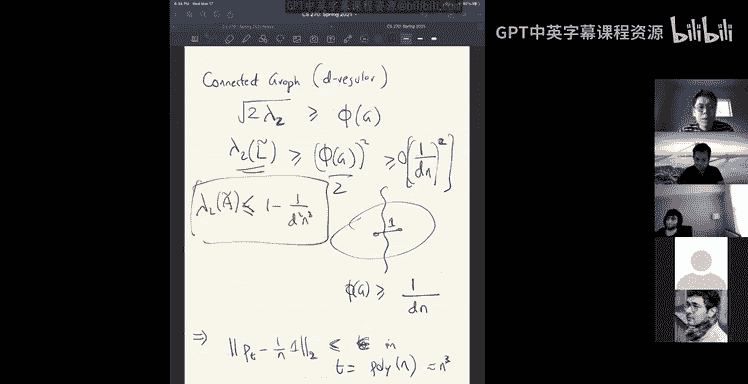

# 组合算法与数据结构：15：谱图理论与随机游走 🧮


在本节课中，我们将继续探索谱图理论，并了解它与图的结构性质（如连通性和扩展性）之间的深刻联系。我们还将学习谱图理论的一个重要应用：分析随机游走在图上的混合时间。

## 课程概述与回顾 📚

上一节我们介绍了图的拉普拉斯矩阵及其二次型，并学习了Cheeger不等式。该不等式将图的第二小特征值（谱隙）与图的扩展性紧密联系起来。本节中，我们将看看Cheeger不等式的更多推论，并探讨谱图理论如何帮助我们理解随机游走的性质。

## Cheeger不等式的推论与应用 🔍

Cheeger不等式告诉我们，图的第二小特征值（λ₂）与图的扩展性（φ(G)）满足以下关系：
```
λ₂ / 2 ≤ φ(G) ≤ √(2λ₂)
```
这个不等式在路径图（Path）和环图（Cycle）上是紧的。对于路径图，λ₂ 约为 O(1/n²)，而其扩展性 φ(G) 约为 O(1/n)，这体现了不等式右侧的平方根间隙。





一个自然的问题是，对于更高的特征值（如 λ₃, λ₄...）是否有类似的结论？答案是肯定的。存在一个更广义的定理：如果图的第 k 个特征值 λₖ 很小（例如为 ε），那么图中存在 k 个互不相交的集合 S₁, S₂, ..., Sₖ，使得每个集合的扩展性都很小（至多为 √(λₖ) 乘以某个多项式因子）。这是Cheeger不等式在高维上的推广。

从算法角度看，我们之前学过通过求解线性规划（如Bourgain嵌入）来寻找近似最小割的算法，它能获得 O(log n) 的近似比。而基于Cheeger不等式的谱方法虽然可能给出较差的绝对近似比（例如 √φ(G)），但在扩展性 φ(G) 本身是常数的情况下，它能给出常数近似，并且计算效率极高。

## 扩展图与谱验证 🌳

扩展图是一类具有高度连通性的稀疏图。从组合角度定义，一个 d-正则图 G 如果其扩展性 φ(G) 至少是一个常数，则它是一个组合扩展图。然而，验证一个图是否具有常数扩展性是NP难的。





Cheeger不等式为我们提供了一种可验证的替代定义：谱扩展图。一个 d-正则图 G 如果其归一化拉普拉斯矩阵的第二小特征值 λ₂ 至少是一个常数，则它是一个谱扩展图。根据Cheeger不等式，组合扩展性和谱扩展性在常数因子内是等价的。因此，在实践中，我们通常通过构造和验证谱扩展图来获得组合扩展图。

## 平面图的谱性质 ✈️

谱方法不仅能分析抽象图，也能分析具有几何结构的图。例如，对于平面图，我们可以证明其第二小特征值必然很小。

**定理**：对于任何平面图 G，其归一化拉普拉斯矩阵的第二小特征值 λ₂ 满足 λ₂ ≤ 8/(d n)，其中 d 是图的度（假设为正则或最大度），n 是顶点数。

这个定理符合直觉：平面图（如网格）很容易被稀疏地切割开。证明巧妙地运用了平面图的圆填充表示和球极平面投影。

1.  **圆填充定理**：任何平面图都可以用一系列互不相交的圆来表示，使得两个顶点之间有边当且仅当对应的圆相切。
2.  **球极投影**：将平面上的圆填充投影到球面上。该投影保持“圆”的性质，并将整个图形约束在有限大小的球面上。
3.  **构造嵌入**：以球面上各圆的圆心作为对应顶点的嵌入向量（在三维空间中）。
4.  **计算瑞利商**：通过计算嵌入向量的瑞利商来界定 λ₂。利用圆的半径和球面面积有限的事实，可以证明瑞利商的上界为 O(1/(d n))，从而 λ₂ 也很小。

这个证明中一个微妙之处在于确保嵌入向量的和为零（即正交于全1向量），这需要用到布劳威尔不动点定理等拓扑学工具。此结论可以推广到更高亏格的曲面上的图。

## 随机游走与混合时间 🚶‍♂️

现在，让我们看看扩展性/谱隙的一个核心应用：分析随机游走的混合时间。考虑一个 d-正则图 G 上的简单随机游走：从某个顶点 u 开始，每一步均匀随机地走向当前顶点的一个邻居。

设 p_t 是一个向量，其第 v 个分量表示游走在 t 步后位于顶点 v 的概率。那么，概率分布的演化满足以下线性关系：
```
p_t = (A / d) * p_{t-1} = M * p_{t-1}
```
其中 A 是邻接矩阵，M = A/d 是随机游走矩阵。进而，我们有 p_t = M^t * p_0。

我们的目标是了解 p_t 何时会接近均匀分布 π = (1/n, ..., 1/n)。我们考察差值向量 p_t - π。由于 π 是 M 的特征值为1的特征向量（Mπ = π），因此差值向量的演化也满足：
```
p_t - π = M^t * (p_0 - π)
```
将初始差值向量在 M 的特征向量基上展开。设 M 的特征值为 1 = λ₁ > λ₂ ≥ ... ≥ λ_n ≥ -1，对应的特征向量为 v₁ (=π), v₂, ..., v_n。那么，经过 t 步后，差值向量在每个特征方向上的分量会乘以 λ_i^t。由于 λ₁=1 对应均匀分布方向，而其他特征值 |λ_i| < 1，因此差值向量会以指数速度衰减。

具体地，我们可以得到混合时间的上界。定义 ε-混合时间 T_mix(ε) 为满足 ||p_t - π||₂ ≤ ε 的最小 t。通过分析可得：
```
T_mix(ε) = O( log(1/ε) / log(1 / |λ|) )
```
其中 |λ| = max{ |λ₂|, |λ_n| } 是仅次于1的特征值的最大绝对值（对于正则图，常称为谱隙）。对于扩展图（λ₂ 是常数），混合时间是 O(log n) 的，非常快。对于任意连通图，根据Cheeger不等式，λ₂ ≥ φ(G)²/2 ≥ Ω(1/(d² n²))，因此混合时间至多是多项式级别的（如 O(n³ log n)）。

## 随机游走算法应用示例 💡

上述分析引出了一个简单而重要的对数空间算法：用随机游走判定 s-t 连通性。

**算法**：给定图 G 和顶点 s, t，从 s 开始进行随机游走，步数为 T = poly(n)（例如 n⁵）。如果在游走过程中访问到 t，则输出“连通”，否则输出“不连通”。

**原理**：如果 s 和 t 连通，则图是连通的，随机游走将在多项式步内以高概率接近均匀分布，从而以至少 1/n 的概率访问到 t。重复多项式次尝试，访问到 t 的概率极高。如果 s 和 t 不连通，则游走永远无法从 s 所在的连通分量到达 t。

**空间复杂度**：算法只需记录当前顶点位置和一个步数计数器，每个都需要 O(log n) 比特，因此总空间复杂度为 O(log n)。这比传统的 BFS/DFS 需要 O(n) 空间要节省得多。是否存在确定性的对数空间算法解决 s-t 连通性曾是一个重要问题，已在2005年得到解决。

## 总结与回顾 🎯

本节课我们一起深入学习了谱图理论的几个关键应用：

1.  我们回顾了Cheeger不等式，它建立了图的谱隙与扩展性之间的桥梁。
2.  我们看到了该不等式如何导致对扩展图的谱验证，并讨论了平面图必然具有小特征值（即容易分割）的定理及其巧妙证明。
3.  我们探讨了谱隙如何控制随机游走的混合时间。扩展图上的随机游走混合极快（O(log n)步），而任何连通图上的随机游走都会在多项式步内混合。
4.  最后，我们以此为基础，介绍了一个经典的对数空间随机算法：使用随机游走判定图的 s-t 连通性。



谱图理论将线性代数的工具与图的结构和随机过程深刻联系起来，是算法设计与分析中一个强大而优美的框架。