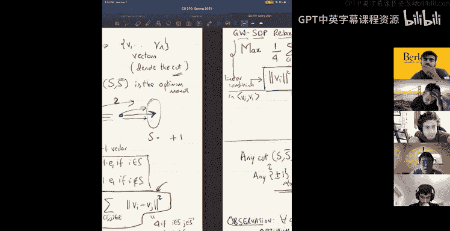
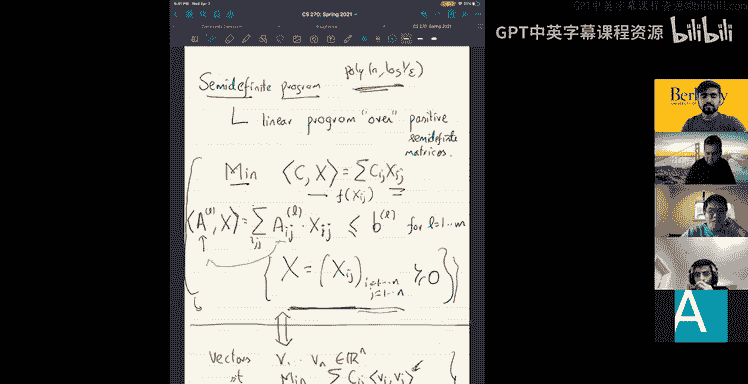
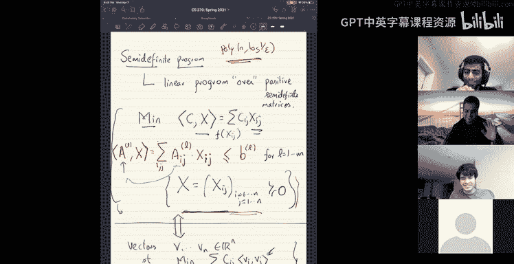

# 组合算法与数据结构：19：半正定规划入门 🧮

在本节课中，我们将要学习一种强大的优化工具——半正定规划。它是线性规划的推广，结合了线性规划、凸优化和谱方法（如特征值计算）的思想，为我们提供了一种表达和解决复杂问题的高级“编程语言”。

## 什么是半正定规划？🤔

上一节我们介绍了课程概述，本节中我们来看看半正定规划的具体定义。

半正定规划本质上是一个定义在半正定矩阵集合上的线性规划。具体来说，我们有一个由变量构成的 **n x n** 矩阵 **X**，我们要求这个矩阵是半正定的。

一个矩阵 **M** 是半正定的，当且仅当满足以下等价条件之一：
*   所有特征值非负。
*   对于所有实向量 **x**，有 **xᵀMx ≥ 0**。
*   存在矩阵 **V**，使得 **M = VVᵀ**。
*   存在系数 **cᵢⱼ**，使得 **xᵀMx** 可以表示为平方和：**∑ (∑ cᵢⱼ xⱼ)²**。

所有半正定矩阵构成 **ℝ^(n²)** 空间（或考虑对称性后的 **ℝ^(n + n choose 2)**）中的一个凸锥。

一个标准的半正定规划问题形式如下：
*   **变量**：一个 **n x n** 的对称矩阵 **X**。
*   **约束**：**X ≽ 0**（表示 **X** 是半正定矩阵），以及 **m** 个关于矩阵元素的线性约束：**〈Aₗ, X〉 ≤ bₗ**，其中 **〈A, X〉 = trace(AᵀX) = ∑ᵢⱼ Aᵢⱼ Xᵢⱼ**。
*   **目标**：最小化（或最大化）一个线性目标函数：**〈C, X〉**。

## 向量视角的解释 📐

上一节我们介绍了矩阵形式的半正定规划，本节中我们来看看等价的向量形式解释。

根据半正定矩阵的性质，存在向量 **v₁, …, vₙ ∈ ℝⁿ**，使得矩阵 **X** 的元素满足 **Xᵢⱼ = vᵢ · vⱼ**。因此，半正定规划可以重新解释为寻找一组向量 **{vᵢ}**，并满足以下条件：
*   **目标**：最小化 **∑ᵢⱼ Cᵢⱼ (vᵢ · vⱼ)**。
*   **约束**：对于 **l = 1 … m**，有 **∑ᵢⱼ Aᵢⱼ⁽ˡ⁾ (vᵢ · vⱼ) ≤ bₗ**。

在这种视角下，我们只能对向量之间的内积（即旋转不变的量）施加线性约束，而不能直接约束向量的具体坐标。

## 经典应用：最大割问题 ✂️

上一节我们理解了半正定规划的基本形式，本节中我们来看一个经典应用案例——最大割问题。

最大割问题描述如下：给定一个无向图 **G = (V, E)**，目标是找到一个划分 **(S, V\S)**，使得被切割的边数（即连接 **S** 和 **V\S** 的边）最多。这是一个NP难问题。

### Goemans-Williamson SDP松弛

我们为最大割问题设计一个半正定规划松弛。思路是为每个顶点 **i** 分配一个单位向量 **vᵢ**（即 **‖vᵢ‖² = 1**）。对于最优割 **(S, V\S)**，我们期望的“理想”解是：如果 **i ∈ S**，则 **vᵢ = u**（某个单位向量）；如果 **i ∉ S**，则 **vᵢ = -u**。这样，对于边 **(i, j)**，**‖vᵢ - vⱼ‖²** 在边被切割时为4，否则为0。

因此，切割的边数等于 **(1/4) ∑_{(i,j)∈E} ‖vᵢ - vⱼ‖²**。我们构建如下SDP：
*   **最大化**：**(1/4) ∑_{(i,j)∈E} ‖vᵢ - vⱼ‖²**
*   **约束**：对于所有 **i**，**‖vᵢ‖² = 1**。

这个SDP是原问题的一个松弛，因为任何实际的割（对应 **±1** 赋值）都是该SDP的可行解，因此SDP的最优值至少是最大割的值。

### 随机超平面舍入法

求解SDP后，我们得到一组单位向量 **{vᵢ}**。为了得到一个实际的割，我们采用一个简单而优雅的舍入方法：
1.  随机选取一个通过原点的超平面（等价于随机选取一个法向量 **g**）。
2.  对于每个顶点 **i**，如果 **vᵢ · g ≥ 0**，则将其放入 **S**；否则放入 **V\S**。

以下是算法性能的分析：
对于一条边 **(i, j)**，其被切割的概率等于向量 **vᵢ** 和 **vⱼ** 之间的夹角 **θ** 与 **π** 的比值，即 **Pr[边 (i,j) 被切割] = θ / π**，其中 **cos θ = vᵢ · vⱼ**。

因此，算法切割边数的期望值为 **∑_{(i,j)∈E} (θᵢⱼ / π)**。我们需要证明这个值至少是SDP最优值（进而也是最大割最优值）的 **α** 倍。

通过逐项比较，我们需要最小化比值：**(θ/π) / ( (1/4)‖vᵢ - vⱼ‖² )**。由于 **‖vᵢ - vⱼ‖² = 2 - 2 cos θ = 4 sin²(θ/2)**，该比值化为 **(θ/π) / sin²(θ/2)**。通过数值计算，这个比值的最小值 **α_GW ≈ 0.878**。

因此，Goemans-Williamson 算法是一个 **0.878-近似算法**。在唯一游戏猜想下，这个近似比是紧的。

## 另一个应用：介数约束问题 🔢

上一节我们看到了SDP在组合优化中的成功应用，本节中我们再看一个简洁的例子——介数约束问题。

问题描述：我们需要寻找 **{1, …, n}** 的一个排列 **π**，满足一系列介数约束，形式为“元素 **i** 在元素 **j** 和 **k** 之间”。即使存在满足所有约束的排列，找到它也是NP难的。我们的目标是满足尽可能多的约束。

### SDP建模与舍入

我们为每个元素 **i** 分配一个向量 **vᵢ**。对于一个约束“**i** 在 **j** 和 **k** 之间”，其几何意义是向量 **(vⱼ - vᵢ)** 和 **(vₖ - vᵢ)** 方向相反（夹角为钝角）。因此，我们添加约束：**(vⱼ - vᵢ) · (vₖ - vᵢ) ≤ 0**。

我们求解这个可行性SDP得到向量 **{vᵢ}**。为了得到一个排列，我们随机选取一个方向 **g**，并将每个向量投影到该方向上，得到标量 **xᵢ = vᵢ · g**。然后按照 **xᵢ** 的升序对元素进行排序，得到最终的排列。

### 性能分析

对于单个介数约束，由于 **(vⱼ - vᵢ)** 和 **(vₖ - vᵢ)** 的夹角 **θ ≥ 90°**，在随机投影下，元素 **i** 的投影值落在 **j** 和 **k** 的投影值之间的概率至少为 **θ/π ≥ 1/2**。因此，期望至少有一半的约束被满足。这是一个简单的常数因子近似算法。

## 总结 📝

本节课中我们一起学习了半正定规划的基础知识及其两个经典应用。
*   我们首先定义了半正定规划，它是在半正定矩阵锥上进行的线性优化，并可以等价地从向量内积的角度理解。
*   接着，我们深入探讨了最大割问题的Goemans-Williamson算法，该算法通过SDP松弛和随机超平面舍入，获得了突破性的0.878近似比，展示了SDP将谱方法（特征值）与线性约束相结合的强大能力。
*   最后，我们看了介数约束问题，通过将顺序关系转化为向量间的几何约束，并用随机投影舍入，得到了一个简单的常数因子近似算法。

这些例子表明，半正定规划为我们提供了一套系统且强大的框架，可以将复杂的组合优化问题松弛为可高效求解的凸优化问题，并通过巧妙的舍入技术获得高质量的近似解。在接下来的课程中，我们将学习如何更系统地构建这类SDP松弛。