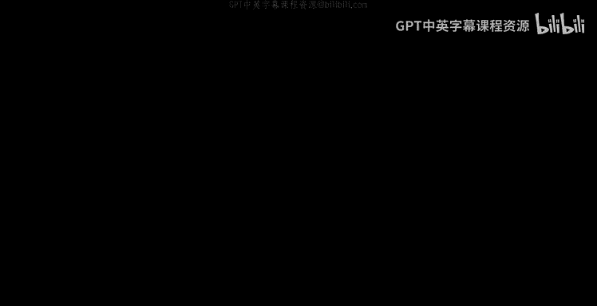
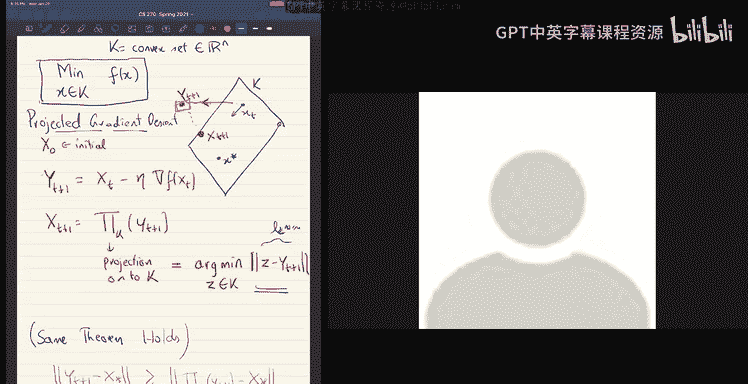

# UCB《组合算法与数据结构｜CS 270 Combinatorial Algorithms and Data Structures 2021》中英字幕 - P1：Lecture 1.zh_en - GPT中英字幕课程资源 - BV1uZdpYZEwr

All right， so this semester well be doing grad algorithm so our we have a fantastic TA you might know many of you may know him Iman is Iman here。

All right， Emmaman Harriri and we only have 10 hours of his time。

 but we'll try to make the best use of it。诶。So as I start this class。

 I think the first thing I want to tell you is all of you， I think。

 have already done an undergraduate algorithms class。And。嗯。

And so you have some expectations of what algorithms was you know from your undergraduate algorithms class。

 I want to tell you what's the difference or what is so I guess if you did it at Berkeley it would be 170 so what's the difference between 170 and 270 and for many things actually related to theory and research and all of these things I think a fantastic analogy is of a hike right so let me。

You know， if you think of。This is theoretical computer science as a national park so let's say this is Yosemite right if you have been to Yosemite but basically it's a national park and you know you have the main attractions there you have the half dome or whatever and but there's lots of mountain rails everywhere。

Right。嗯。So。You know， some of these areas are very well explored。So you're so when you。Go， you know。

 there's a， there's a highway you know thats sort of。

there's a loop and you can go on that loop can drive it and the little hikes there you can take so this area which is very well explored and you know it's sort of the very basic things that is like 170 so you so you're right through that it is beautiful but you drive through it。

You take pictures， you know， you just get off your car， take pictures everywhere it looks beautiful。

 that's fine。 So that's 170。So now， okay， it's very enjoyable。诶。

And if you want to do like this class， I guess， is a grad class。

 and it's meant to take people to the edge of what's known so that they can explore。

Beyond so it's like this， you know， this mountain ranges all everywhere。

Right there's mountain range is everywhere so you know there's a whole bunch of areas which are unexplored and this class is meant to take you closer to one of those any of those mountain rangers of course we won't really get into doing actual research in this class but we'll kind of get closer than we were at once again which means we are venturing out of this beautifully laid out nice highway right we are going to be venturing out into I mean hopefully we'll be venturing out into。

Partrks， which are。Not like a highway。 So you you'll sort of go somewhere where you you'll reach places where。

要见。I mean， it'll still be a guided hike so I will be there and I sort of know the routes and and I'm going to take you there but。

It will be a hike。So it'll be a serious hike and。What I mean is it won't be like 170 you drive you look and take pictures and move to the next one you won't be sometimes you don't see the same many of the features that you saw in 170 like in the undergrad algorithms like dynamic programming or things like that are very much in the middle of the it's like a mountain range which is right in the middle of this region and you might never see it in the rest of the rest of this trip and。

It's。Like these are they'll be you know things won't be immediate you have to take a little bit of a hike and then you see something really beautiful or really you understand the terrain you go out you climb through the trees and you go to the top and then you see the whole terrain suddenly makes sense and suddenly maybe what you learned in 170 like half dome or something it's the middle it really it fits into your picture now but there'll be parts where it'll just be wading through you know hiking a terrain sometimes it' be difficult things to climb and so on and you know。

So that's the thing you want to keep in mind， that's how the class will be。

So that's how the terrain will be。you know most of these will be really beautiful things you you know。

 you like the going there。You might not like some of them and there'll be some side hikes which I'll suggest you can go check out there。

 you can or you cannot may not go there and。You know， when you take one of these。hikes。Well。

 of course you see the sides， but I think one thing that's really happens is you get good at hiking。

 you get stronger at hiking。So that's actually a benefit， even if you don't like a particular hike。

 you get better and stronger at hiking， so if you're in a different national park like to exploring machine learning or whatever it is。

 the fact that you did this long hike。Actually make means that you're stronger to explore more things there so in fact that's sort of actually one of the features of like grad students when they finished their PhD of course there's a lot of skills there you know they're really experts in some area they really know some terrain very well but I guess another skill which they picked up is it。

They have this。Skill to。Think about something deeply for a long time because they did their PhD and so they're just stronger hikers so you can take them and put them in some other area like machine learning or whatever it is or systems or whatever area there is the fact that they've hypd so much here they're stronger at sort of perceing and you know hiking through it and figuring out exploring your territory right so there's some sort of general skills skills that you pick up right so。

So that's sort of， you know， how I would say like you want to think of this class。But of course。

 you know， they're really interesting material that we learn about and I guess you needless to say。

 it's always grades are always less important than learning。

 but I had to say that more here that you know，Graates will even less important here than how much you'll get out of the class so you know。

嗯。Like sometimes where when we teach really sometimes we teach grad classes where I lecture material which I expect only 60% of the class to pick up and the rest of the 40% unable to pick up I don't think these classes will make sure everybody gets along comes along but but all let me say is there will be parts of the class which might seem difficult or you might not immediately grasp it。

 but that's okay know don't be anxious about your grade just enjoy learning and you know you'll get get it eventually it' none of this is really。

It's that hard。So that's sort of the I think I want to set to you in that general frame of mind。So。

Okay， so let me and you know， this is the first time I'm teaching it so I chose a set of topics for this class。

So the topics again are not， as I said， this is a big terrain so I'm going to pick up some particular route through this terrain。

 so it's sort of my own biased view of what areas are interesting to explore in the future。

 but there are lots of areas which we won't cover， but these are the things I picked out。

One is continuous optimization。So all of the topics that I picked out are or most of them are meant to teach a sort of a reasonably broadly useful set of tools and we will see some applications but also the tools themselves are important and I guess one tool which sort of is typically missing from an undergraduate algorithms curriculum is continuous optimization which is sort of very basic I mean but it sort of is missing so well you know first pick up that carefully。

I mean， hopefully by the end of this continuous optimization section。

 wed know how to actually solve a linear program and how to solve semiF programs and so on。

And then the another tool is also linear algebraic tools like SVDs， computing。

 singular validity compositions， PCA and some tensor。Thanks to PCA SVD。And then the。

The third thing is sort of a fairlyly。Widely useful technique。

To take a problem which is in some domain and map it to a problem in a different domain。嗯。By domain。

 I mean space， even more in a mathematical sense， and this mapping or embedding sort of actually simplifies the problem。

So we'll see a few examples of this。The most important one is， of course。

You map something from high dimensions to low dimensions， right that's clearly。

 so that's a dimension reduction。And。This is useful for many things like nearest neighbor search we'll also learn about tree embeddings it problems are easier on trees so we well see how you can map different spaces into trees。

嗯。The fourth topic would be spectraltrograph theory we'd see how the linear algebra tools mean like Svd and eigenvectors are useful for combinatorial thing like analyzing graphs。

 which is basically analyzing graphs where it's。Eigenvectors。Okay。

Here there will be a couple of things， you know we do graph partitioning， we'll do electrical flows。

And。After that， we look at semi defite programming。

And this is a very powerful algorithmic technique in some sense one could think of this as we start out with continuous optimization which is like the assembly language sort of seeing how things are and then once you have primitives like okay now I can solve in your programs or semi different programs and now of you have a higher level languages like so I would say you know semi different programming is like Python right sort of it's more powerful but and we already learned how。

How Python I mean， how semi different programming can be solved and then now we'll use it to do other things。

 so we'll do max cut and we'll pick a few examples for this。Mean estimation。Robust mean estimation。

Regression。Different kinds of problems and then we'll have a lecture or two on differential privacy it's a new the fact that you need to carry out data analysis while respecting some privacy concerns。

 it sort of creates a new kind of test algorithmic questions， which are also quite interesting。

And you this is just sampling these lots that are left out。

This goes into this big bucket called other topics。I'm hoping we'll have time for this and we can。

I mean， if there's something in which you really want， just email me or let me know。

 but there's lots of other topics which hopefully we at least have three lectures which three or four lectures which you can spare for these other things。

Okay。😊，So that's about for the topics of the class。So in terms of okay。

 what is this assessment you know how do we what are the。Things you'll be doing in the class。

 so firstly there will be biweekly homeworks。嗯。And unfortunately。

 we don't have enough graders to grade these homework， So we will be using peer grading。

 so you will be。Doing the homework and also grading the homeworks of your peers anonymously more details on this。

嗯。So， but so we'll be using peer grading for this biwely homeworks。And that would there would be。

 I guess。Yeah and then they would be scribe notes so scribe notes is basically what is it well you you just take notes type that in lateEEC well send you a template and type set in late and hope to have the scribe notes ready within a couple of weeks after the lecture so it's useful for all the other students to just for references and this is sign up sheet for the scribe notes on piazza please sign up for it then there's a take home exam this is going to be a take home exam for a week in the first week of April so that's something to keep in mind and then we。

Plan to have a project。 I mean， a project here。嗯。As I see it， I mean。

 it's would be a sort of a survey about which will sort of lead you into。

A research area or an open question， you know， in terms of the hike， you know， we went all over。

 but you know what you would do in your project is you take a side hike from one of these from a route。

To a point where you venture to the edge of the unknown and you sort of explore the territory and write it up。

Okay。That's a。I see a question， does biweekly homework mean twice， it's once in two weeks。

 so you'd be submitting your homework every two weeks。嗯。

And I expect the homework to be much less intense than 170， of course， but you know。

We tortured a bunch of you with Homes in 170 and you guys all came back here and said giveive me more so yeah。

 you asked for it but。So but you know， you expect the homework not to be too tank intense， yeah。

 but I guess the homework will sort of help you keep track with the class at a very basic level yeah。

Okay， so that's。嗯。Let's。That's for assessment， you know， there's some percentages for this。

But you know there's some percentages for this， but the key thing which I want to emphasize is the scribe notes scribe notes is only a small percentage of your grade。

 but you absolutely have to write up the notes it's sort of critical because your peers will read your notes so it's kind of nice to have it although we'll post the recordings of these lectures online it'll be good to have notes I mean I'll also post suggested reading but it'll be good to have notes as quickly as possible so。

Definitely within two weeks after the lecture。对。And then。嗯。Finally。

 you know I guess Ill already dod out a bunch of advice。

 I'm not going to do out anything more if one thing I would say is I think it makes sense as you watch lectures on Zoom。

It's actually a good idea to take notes， even though all the lectures are poster and scribe notes will be poster and suggest reading is there just the act of writing things down。

 at least to me sort of gives me focus。Yeah。And just a moment back。Sorry。Okay， any questions？😊。

Just unmute yourself and ask and so I guess we'll follow that throughout the class if you have any questions just unmute yourself and interrupt I'll try to watch the chat for questions that come up but。

嗯。嗯。Okay， so there was a question， is there a preferred method for scibing it we latex we' post a template for sccribing。

嗯是。Professor， yes， will you be providing your own version of the class notes or lecture notes？

I didn't plan to do that yeah hoping that the turnaround on the scribed notes would be quick enough。

Okay， yeah。Any other questions？Professor， there's a question in the chat， Deb Frank asks。

What is it it's will all scribes from the same lecture combine for one set of notes so like do all the scribes work together or no we'll post all the scribes separately so each one would scribe and then we post all of them separately。

Okay， thank you。对。Even for the same lecture。Even for the same， yes， yes。嗯。

Oh and I will post whatever I write on the board on this thing on the online。

 and I'll post the video online。Yeah。はい。Okay， any other questions？Okay， so。Okay， so let's start。

 give me just a moment。我费用。Yeah。All right， yeah sorry it's fine。Okay。

 so let's start so today we'll talk about the one of the。

 I guess the simplest and most widely used algorithms， which is gradient decent。

So gradient descent is。So what is the problem so let me just state the problem， but so。Well。

 you have a function F。And you want to minimize F。And let's say you have oracle access to the value is the function。

What does gradient descent do well if the function。Looks like this， it starts at a point。

 and then it computes the gradient at the point and it so gradient is。

It goes in the direction opposite to the gradient。I it's the most natural thing。

 you know steepest descent you go and you want to minimize the function。

 go in the direction that locally minimizes decreases the function by the largest amount。

 which is steepest descent。Okay， so but you know what kind of you know you can use a gradientcent for any kind of function。

 but there are some kind but you can really prove things about it for convex functions easily it works beautifully for convex functions。

 so let me just define convexity。So。Basically， if you take a set。K， in in dimensional space。嗯。

Case convex。If on leave， the following is true for all X Y。In。The line segment joining X Y。Is also。

Inけ。So for all Lambda in 01。Lambda x plus 1 minus lambda y is also in k。Okay， that's a convex set。嗯。

So and a convex function is one for which。If you look at the epigraph， which is sort of the set。

 this is a function if the epigraph is。All the set of points above the graph。

And if this is a convex set that's a convex function so but you know but there are more useful ways to write on what a convex function is so let's write them down I think there are sort of three ways to write down a convex function so let's。

Let's write them all down so that we。So the first one is， of course， for all in air function F。

And it's a function from n dimensional space to Rn to R。So the first one is， of course， for all X Y。

Just what we said， you know， if I take f of lambda x plus1 minus lambda y。

That is utmost Lambda F ofx。Plus 1 minus lambda f of y。And so what is this condition。

 well this is just the following condition that if I look at the graph as a function。

 if I look at any pair of points。Hggs and white。And I look at the line segment joining that。

The function goes under it。The function is always under the lines oring any pair of points。Okay。

That's a convict。but there's a different one， which is this is sort of。

 you know you could say this is the zero third definition because it doesn't use any derivatives you can see that the definition is can make sense even if the function is not differentiable。

But if the function is differentiable， let's say once。

Then you can talk even then there's a equivalent definition。Which you can do for the first order。

 The first order would be。AndThe equivalent definition so what would it be you take for all x and y。

 take any pair of points， x and y。So let me draw this。Any pair of points？😔，Yeah， okay。

I'm trying to not pick the bottom of this， but okay， let me see if I can。Yeah。

 my drawing skills are particularly great。Okay， so this you pick a point x。Okay。

 and then you write down， look at the tangent right there。

So that gives you a linear approximation to the function。

 So what is the linear approximation to the function， Well it's just。嗯。F ofx。Plus。The gradient of。

F of x in a product y minus x。O。So this is a linear sort of a linear approximation to the function。

 you look at the gradient at that point and you write on a linear approximation to the function and your function is always above your linear approximation that's a convex function it's never goes under the linear local linear approximation so that's just saying that F of Y。

It is always greater than or equal to f of x plus gradient of F of x in a product y minus x。嗯。

I think let me create a new page with some notation here。

So I started using notation before I so of course， you know are to then is n dimensional vector space or reals and there's a natural inner product which I will。

Right like this， the inner product would be sum over i equal to1 through n U I V。

The innerner probe between two vectors and then once you have an inner product like this。

 you also have the norm， this length of a vector right the length of a vector。

 the two norm of the vector， this is just summation Ui squared。Two norms squared well。

 if I want to write the two norms the square root of that。

And this gives you just this inner a product and this norm gives you the Euclidean high dimension Euclidean space okay。

And。I mean， a lot of you have seen these objects in different classes， you know。

 if you haven't sort of really played around with anal spaces， you know。I think。

Don't worry it's really。Nobody really understands these objects it's just you start learning a bunch of rules of manipulation and then you sort of you know gaming you sort of understand how this thing works right and not really what happens there but really how these things manipulate and's that's fair right that's fine so but this is a notation right here okay so here what I mean is the gradient is a。

Right again， I should write on the gradient the gradient of course， is。

All the derivatives are the function， right， So do by do I。D by do X of F。I go to one thread。

 this vector of derivatives thats aggregate gradient。 Okay。

 that's the first order definition of convexity。 Well。

 there's a second order definition of convexity， which is。Even。

And the second order definition would be。At any point。

If I compute the second derivative of the function， that's the hessian of the function。H off。嗯。

So the heads sub F for x， this is the Hesian。そ this。

This is a positive semi defite matrix is positive semi defite。So what does this mean？Basically。

 if it means that。If you look at any point in or the function looks like a bow。

 right at any point the function。Should curve in upwards it will be a bowl。

If you look at the locally， the function looks like a ball。

Which is facing upward so what shouldn't happen is it curves downwards in any of the directions。

And of course， what is aian hessian is just this。Mattrix of second derivative。Okay。嗯。嗯。so。

Any questions at this point？Okay。Good。All right， so you know。对。Intuitively。

 a convex function basically at every point looks like a bowl which is facing upwards。

That's basically the thing， which means that if you look at the convex function。And。You look at any。

Slice of the function。Aong any line， the function will look like a parabola upwards going like a bowl and at every point locally so in particular。

 if I look at the quadratic approximation of the function。

 it looks like locally the function looks like a plus b delta plus c delta squared。

 so f of x plus delta it will be equal to around a point x。

 if I look at f of x plus it looks like a plus b delta plus c delta squared。

 it's a quadratic approximation。Okay， and if I look at the quadratic approximation。

 essentially C would be non negative。是 that里怎。That just says the parable office upwards。Thanks so。

Okay。Professor。Yes。Can you repeat what positive semi defite means right Okay。

 positive semi definitionite is a definition would be that all the eigenvalues are non negative。

All diagonvalues are non negative。All eigenvalues are non negativeator so the hessian is a symmetric matrix and all eigenvalues are non negative So one thing I would exist strongly suggest is sort of revise the linear algebra sort of very critical will come up again it again。

 but in terms of intuition I can quickly say you know basically any matrix right or any quaraatic form right in any n n variables if I have a quaatic function in n variables。

it's some linear form。U dot x plus some summation Ya I J X Xj。

 if you have a quadratic form like this， all of them nicely come out of a very small number of things。

 So I guess the cleanest thing would be if I said if I look at a quadratic function。

 the simplest and the cleanest one is summation X squared。

What is this well it's just you know you can think of a you know。

 if I try to draw it in two dimensions all in three dimensions。

 I guess let me draw it in three dimensions if。So this is the two dimensional plane。

Submission excess squared is a nice。Paarabolic bone， right it's a。

It's it's a bowl which looks like this it's symmetric and always and so on okay okay now you have the nice circuit you know parabolic bowl all its sections are circles what can you do with it well you can stretch it in one of the axis anyway and so then I do stretching the sections go from being circles to ellipses。

They can become ellipses if I stretch it in one way。

 so that gives you the next set of linear forms you can have or quadratic functions you can have if I do summation W X squared。

 this is like stretching in。You know different different aes you stretch it in different ways。

 so you get ellipses right your sections are not circles but ellipses。嗯。Okay， that's the second one。

 And the third one is what else can you do with it Well。

 you can rotate it right after you stretch it， it's no longer symmetric it's its sections are not circled。

 you can rotate it in any way you want。 So now your'。

Your parabola will have sections that look like ellipses。Take this。

These are the level sets of your parallelboar。 So you stretch and rotate it。 Okay。

 so this is basically。All positive and ethnicic chodratic forms。

They all look like the in some direction， they look like stretched ellipses right and。

And then of course， when you add the linear function to it。

 if you add the degree one part to that quadratic function， it will sort of tilt the whole paragola。

 right？Yeah， I mean's sort of very like this is a very useful and important thing to completely sort of understand to the extent possible yeah so。

Rightect。Okay。Any other questions？All right， so let's let's write down gradient descent in the most。

Simpst setting。So this is unconstrained optimization。So what's going on here。

 you want to minimize a function X。X or the entire real space and of course， f is convex。Okay。

 so the algorithm is， let's let me write down the algorithm。So you start with a point x0。

It's some initial point。And then at each iteration， what you do is you say x t plus one is。XD。Minus。

三。Eer times the gradient。Of atxt。So the gradient gives you a direction to move。

This is a direction and you're moving in the neggate direction， which is against the gradient。

That's why you have a minus sign。And then， you have a。

Parameter Eta here which tells you how far you want to go along that direction you know this is of course a parameter which we can pick as we want。

 we could change it across iterations， we could change it in many ways so but that's basically the simplest simplest versions of a fixed Eta。

And then what is eventually what your output， well ideally you just want output Xt right wherever you are after some amount of time you want to just output that just for I think for the sake of analysis let simplifying the analysis。

 let's look at a different one where output the average of your points。Okay。

 so that's essentially the whole algorithm。That's the algorithm。All right so。Okay。

 so we want to analyze this algorithm and this is a basic sketch of an algorithm I left out how you pick EA and how you pick the number of steps right number of steps you go。

We didn't We didn't say that at all， but this basic sketch of an algorithm is already like you can use it in。

Various with different choices and get very useful and different algorithms。嗯。So yes。

 could you explain why we take the average of all the points instead of just returning XT？So。😊。

You can prove that even just returning XT works， but you will see that the way we analyze it it the average of the points is easier to show that it works。

 but why is it。嗯。Rexel in some I mean。Like， is it， is there a real。

Really principle reason why it's easier to analyze it。 Well， I I mean I。

I think one of the reasons is sort of。You know， in some sense。

 if you have a function that looks like this and you start at x x0 here， you move x1， you move。

 and I think eventually what will happen is you will sort of each time you take a step。

 you'll keep overshooting the bottom of the well。Every time you take a step。

Right I mean it's it's not clearly true because the gradient is also decreasing as you go down。

 but you know it's somewhere to account for that if you door but if you like basically when you're quite。

Close to the bottom of the well， you'll be sort of going from left to right and left right to left back。

 so if you sort of output the average you clearly will do much better in this situation。And。

But you know， you can also easily sort of modify the algorithm model， you know。

 there are many things you can do so that you just want if you want to just output the final point。

 you can also do that。Good， that makes sense。 Thank you。Yeah。Okay， any other questions？O。

It's good all right。So before we sort of。Write down the theorem analysis of this thing， I want to。

这个是。Like like let's let's let's see what's happening in this algorithm I mean firstly right the most obvious observation which you would make is。

Of course， we are moving。In the direction opposite to the gradient of moving in the direction of steepest descent。

 So intuitively， the value of F。Of xt plus 1。Should be smaller than the value of F0。Right。

This is intuitively。If you took a sufficiently slow。Small step if you look a sufficiently small step。

Then this should be true。 I mean， of course， this is。If you take sufficiently small step。

 but of course， this is clearly， I mean。It's based on so many assumptions that I haven't said how the function looks yet。

 so it's just some intuition right so this is one thing that sort of clearly is going down。

 but this really depends on how the function F looks locally right it's。

It's not clear that you know this all this gradient stuff really works out I mean for as we saw。

 for example。You can have a function even in one dimension， it looks just like this。

 this is a convex function。Right， this is a complexve function。 And if you are quite close to the。

Bottom of the well。By taking a gradient step you will actually overshoot the bottom and go to the other side and increase the value as a function so it's and again the gradient also you see that if I have such a nons smoothth function。

 the gradient is not something that's stable the slope of the function suddenly shifts from being minus one to one like and。

So depends so this intuition is mostly right， but it can be wrong。はい。嗯。What else？ Well。

 there's another intuition that is true is that this is， I think， a factor， right the fact is。

If you look at the negation of the gradient。This points。Towards the optimum。

OkayThis is a fact that's more rigorously true， well， why is this？

I meantu again it's clear it I mean also it's always seen in all my pictures it seems to work out。

 but let's go starting from the definition so。Let me just。write down this。Okay。

 so this is a definition of a convex function。Okay， so。So。You know， if I said。So。Like， if if。

X star is the optimum point。Xter is the optimum of the point where f is minimized。

It's the point where F is minimized。Then， you know， I just substitute y equal to X star in this。

In this in this inequality， what do I end up with？I end up with。The following thing。

 F of x star is at least f of x plus。The gradient of F ofx。Timemes。Xter minus x。

 this is just saying that the function is always about a linear approximation。

This is a linear approximation for f and is always about so this just implies that。嗯。

Graient of F ofx。The negation of the gradient f of x in a product with x star minus x。Is at least。

F of x minus f of x star。But I'm just re it。It means I have been right clean。So。O。Okay。

 so just rewrote it now you see that this thing is always known negative。Because F ofx。

Is always at least f of x star because x star is the point that minimizes it。

 so f of x is always at least f of x star。Which implies that the inner product， the angle between。

X star minus x。And the gradient。Is greater than equal to  zero。So this we got out of convexity。

 out of convexity， the negation of the gradient is always。

Positively correlated with the direction you want to go。So if you are here， if x is here。

 and let's say this is the point you want to be in， this is x star， which is a small。

So this is a vector x star minus x。And what the definition of convexity tells us is it's equal into saying that the negation of the gradient。

Is always has an acute angle with the。嗯。It has an acute angle with the direction you want to go。嗯。So。

B so。Like this is more of a geometric fact the angle is acute right and it's this is nothing like this at this point has nothing to do with the function itself as in the。

You know gradient is a vector， gradient of f is a vector at that point。

 and it's pointing towards x star， the angle is less than 90。So。So what？

You don't know what happens to F itself F itself might be crazy as you move。

 but one thing you know is that the distance to X， just the distance to X should decrease if you move along the gradient。

So because the negation of the gradient points towards x time minus x。

If along you move along the gradient， the distance decreases。

So that's sort of the crucial point about this fact。I mean， one is， of course。

 when it goes steep as descent， the function value should intuitivetu decrease if it's smooth。

 you can of course it should decrease。But also， you should get closer to the optimum。

And that's what is true for convex function， you actually get closer to the optimum whenever the function validity whenever you go。

嗯。Okay， so。All right， so that's a bunch of。Let' us a little bit of intuition on what's going on。

 is there any questions on this？Okay， so I think let's state the I guess the first theorem。So。

So after these steps。For appropriately chosen EA。For appropriate step size。Okay will choose later。

The following would be true。If I look at the average function value。This is not too large。

The average function value after T steps。Of all my traits is at mostly optimum function value。Plus。

Okay， what is R， R is the diameter。Of my set。Of the set， or alternately it's the distance。

From between the initial point and the sub between the initial point。X0 and the optimum。Okay。

 that's odd。And L is what L is the critical thing。What did we assume about F？

We assume that F is L lipsshs。So L lipss is。We are saying that the gradient is never too large。

Greient of F。Is that always at most？So。I mean， it's basically this fact that。

IfIf your function is too steep at a point。If your L is too steep。

 then you are sort of forced to take very small step size because you're worried that you'll shoot across the bottom of the well if you're very steep at a point。

 you're forced to take very small step size。And so having a well steep well can you know， really。

 if it affects your how fast you can move in each step， how much you can move in each step。

 and therefore it adversely affects like after these steps， what your error would be。But就。

So this is the theem。Any questions about the the？Yeah， professorfe。

 I've seen a different definition for。Heello right yes。

 so yes so there's another definition of lipsts which is for all it's is the zero third definition。

 which is for all x and y。诶。This is a more。Fs minus F y。Is less than equal to L times normx minus y。

This is actually the。Niceer definition， because it's sort of。Doesn't even rely on。First derivatives。

 so it doesn't rely on first derivatives being available everywhere so even if at a point you're not differentiable like there could be a small number of places where your function is just not differentiable then。

Lipitudes， this definition still makes sense， whereas my other definition。

 where I said gradient of f is less than L only makes sense。

If you're sort of differentiable at every point。So， you know this thing， so right。

 so this is the actual definition and what the theorem holds under this。

A stronger definition and you know， a thing to keep in mind is。Like our functions convex。

But this theorem is in a setting where it's not necessarily smoothly convex。

 it can look like there's a line here， there's another line here。

 maybe it's flat and then there's another line here and another line here right so this is like for example piecewise linear function。

So F could look like this。And。So。So it's not smooth。But it's。

 but you know you there's no place where it's very steep。

 that's lipshipness lipsness is almost every place it's no place where it's very steep。

Any other questions？And so it's a more general kind of。

Theorem which will be useful in some many contexts。

 but in many times we'll be dealing with a much nicer function and we'll see a theorem about much nicer smoother functions。

 you know functions like this right which you usually withdraw。Okay， any other questions？

This morning。There's a question in the chat about Ada if there are constraints on Ada Oh yes。

 we will pick Ada。We'll pick Eta by the end of the proof。

 but I think EA should be if you pick the theorem holds if you pick Eta to be r over l times the square root T。

But that's just an optimal choice of data。But。Yeah。ok， so诶。All right， so this is。The theorem。

 the proof of proofs of analysis of gradient descent， they can be fairly symbolic at times， right。

Really， there are only two things going on。Either the function value decreases because the function is nice and sort of' going down the hill so function value decreases。

you know， another thing that can happen is you get closer to your optimum solution right this fact that we said the gradient always points in the optum direction towards the optimum so you get closer to the optimum in actual distance。

 either the actual distance decreases or the function value decreases。And every like analysis。

 a lot of the analysis， different analysis of gray and descent。

 sort of just trading of these two things， right to you either。

Right you sort of two things that you can measure progress based on two things and the proof will sort of use both of them to say that you converge to the answer right。

So the proof will be a little bit symbolic。But bear with me。嗯。不。Okay， so having said that， let's。嗯。

You know what actually maybe let let's。诶。You know let let's do this proof the first thing in the next lecture just so we are fresh and we can pay attention to the symbols ideally I would want to take a break in in the middle of the class but not today because I want to set up some sort of small breakouts so next class on which we take a little break five minute break in the middle okay so so no let's trust this theorem for now we'll do the proof the first thing next class I think。

But。The。I think what I want to do maybe is do all the let's just do all the conceptual things first and then we'll get to this proof。

All right， so what's the first conceptual thing you would want to do Well。

 this is the simpler setting unconstrained optimization。The next thing would be。I have my X。

 which has to be sit inside a set。So this would be constrained optimization， so my problem changes。

 so I have a convex set k K is a convex set。In R to the end。Okay。

 and I have a convex set K and I have a function F， I want to minimize on that convex set。Okay。

 this is constrained optimization。So here again， so like the picture is you have a。Se like this。嗯。

Xter is optimal。Always， and you are here。So let's say this is X steep。Good。Okay。

 so what do you want to do， you want to still take us， you have an initial point x0。

And you still want to take a gradient step， but what happens is when you add the gradient。

You leave this nice set， you。You add the gradient in and you end up somewhere outside the set。

So let史。Okay， you end up here。It's Yt plus 1 is somewhere here。Okay。

 and what you're trying to do is to stay inside with this convex set and minimize the function。

So what's the natural thing to do？Project back into the connect set， meaning。You look at the point。

Which is。Closes to X。Its closest to Yt plus1。Inside the set， so this will be your xt plus one。

So xt plus1。Would be the projection onto this convex set of the point yt plus1。This is projection。

On2。Okay， so what does projection on k mean well， basically， if I give you a point why。

The projection is。嗯，Point that minimizes。The point z that is inside the set。That is closest to why。是。

This point， xt plus one is a point that's still inside the set， but it's closest to It plus one。Okay。

 so this， you add the gradient and then you project back。Okay， that's the natural thing to try。

This is projected gradient descent and。You know， one nice thing that happens with convex sets is that the theorem that we just stated。

Essentially holds here the same theorem holds。Same the。And。Why is that true？Well， you know。

 we had this two。It's I guess the critical reason why it's true is that。😊，If you have a convex set。

We have a convexed K here that I've drawn。And you have a point yt plus one， which is outside。

This yt plus one is a point that's outside。If you look at the distance from yt plus1 to the optimum。

If you look at the distance from yt plus1 to the optimum。Or actually any point inside the set。

 but let's set to the optimum。That distance only decreases when you project， meaning。

The distance of the projection。Is only。Lower than the distance of the original point。Alnately。

 the projection can never increase the distance to a point in the set it only gets you closer to top to you when you do that when you do a projection onto a convex set so that's that's again you know an easy fact to prove using acute angles and its own so so it's quites that's the reason why essentially the same algorithm works here okay that's great。

Okay。嗯。Okay， so。There's lots of variants of gradient in disscent in different settings。诶So。Right。

 so you know， or the same algorithm， you can prove that it works better if the function is satisfied some properties and so on so。

Let me state。Sort of the nicest setup in which you can analyze gradient descent。 Okay， so far。

 we've been in fairly bad setups where our function looks。

Kind of wonky with all these lines and they don't you know they don't have the same slope。

 but let's say our function looks really nice like this。Okay， it looks like a smooth function。

 then what can you say？Well， then there are essentially， you know， in some sense there are。

Two parameters that you care about。几。😊，One is how flat your function is。So this is a flatness。

And then the steepness， right？Okay， why is flatness bad， flatness is means that your gradient is。

You know， kind of small。hi means you're not making too much progress。

Steepness is like if your grain is too large then you're too careful not to overstep the bottom of the well right so so these are two things you want to control if you have control of these two parameters if you're you know essentially if you're。

If your function is。Just the right amount of flatness and smoothness or you or you you know exactly how steep it is。

 for example， if you know how how exactly how steep the function is going to be like then you know exactly what steps do you take and so but。

But that's really the concern the concern is really now you're working on this function。

 which in you know whose flatness and steepness varies from point to point and you sort of set some bounds up on overall how flat it is or how steep it is okay so that's。

So what is？嗯。Flatness， Okay， so firstly， you don't want that to be not you don't want you don't want So say not too flat so not too flat would be this is。

Essentially called， I mean， really， this is strong convexity。Okay， what is strong convexity？Well。有。

What you want， you want to say that if your function。If you take your graph of your function。

 then let's say this is f of x and this is F of y。ok。😊，嗯。And I look at the graph of a function。

So the function is flat， it's like a line joining F of x never Y， that's a flat。

But you don't want it to be too flat， you want the function to dip， you want it to do this。喂。

So what you really want is。If I you know， if I look at convexity。

 convexity tells me that my curve lies under this line。

 so it says that f of lambda x plus1 minus lambda y。

Is smaller than lambda f of x plus 1 minus lambda f of y。Okay， that's convexity， that's convexity。

 but you you but even a flat functions is convex， what you want is to dip so which means that you want。

Strong convexity， meaning you want this to have a negative alpha。第五首。😔，嗯。You know。

 let's say lambda times1 minus lambda times。X minus by Hol squared。Okay， so what does that mean。

 Well， it's just that the。We're just forcing the function。To actually dip Lalabia seek the this。

Term enforces that when you average you actually decrease the value of the function decreasing right so is a significant amount and this alpha is going to be the parameter of strong convexity right so our function is alpha strongly convex。

If。For all x and Y。And for all Lada， this happens。Okay。Okay， this is。嗯。It's。Strongly conves。

And again， you can write this in the zero order， this is zero order。

 meaning that not I'm writing this without using any derivatives in this expression， right。

 but I can also write it in the first order， first order would be f of lambda x plus1 minus sorry。嗯。

If you remember the first order thing， f of y we said was at least。If or fix plus。

The linear approximation。Gient if of x times y minus x。Right， so this is the picture that。

If I take a point， if I draw a line through that， so if I draw that。

If I take a point X and draw the tangent。At that point。Then the function lays above the tangent。

Well you want it to， if it's flat it can just go on the tangent forever。

 you want it to go away from the tangent， meaning you want an extra term there and so that is going to be this。

Okay， so that。So you can fit in a quat like this extra term extra boost is going to you know。

 move it away from this flat line。So these are just equivalent ways of writing down strong convexity。

Keep saying the function is not too flat and this alpha tells you how。Okay， so。

So then I mean the other one is easier， which is smoothness， right beta smoothness。Well。

 be smoothness is basically。Like you want the function to curve up， but it bend。

 but you don't want to bend too much， so you say oh。I want f of lambda x plus 1 minus lambda y。

Is at most， sorry。It's at least lambda f of x plus1 minus lambda f of y。

Minus beta over two times lambda times 1 minus lambda x minus y whole squared。So this is again。

 you the expressions aside iss just the same this fact that。You have F of X here。If of y here。

And you don't want to go too far down。 So you want it to be about this。This quadratic。Thisす。

You want it to be above this quadratic function。对不。

You don't want to dip more than this quadratic term。ok。So all right。

 so that's and then again there's a zero third version of this the first order。

 second order right it's a C equivalent ways of writing。

 but there are two important parameters here one is alpha and the other is beta。

The key point is that two parameters alpha find beta。

And so if you know both alpha and beta and you run gradient decentcent with the appropriate step size。

You can actually get。I guess exponential convergence， right so you know after。These steps。

You can get convergence， which looks like。let's say the average of the function value。

Minineus f of x star。😔，Would be。Smaller than an exponentially small value。应啲。出。喂。Yeah。Okay。

 I mean the we'll look at the theorem slowly next time。

 but the key point is you got exponentially fast convergence that if you remember what was the error in our earlier theorem。

We had a theorem which was like one over routine like quite a weak convergence， what does it mean？

Well， if you want 100 digit accuracy， right， that means that you or let's say 10 digit accuracy。

 let's say you want 10 digit accuracy， you want your error to be 10 to the minus 10。几。😊。

Which means your the number of steps have to be like。

Polynomial in 10 to the minus 10 is like 10 to the 20。Your number of steps would be 10 to the 20。

Because basically the note that if you ran for 100 steps， the error would be one over 10。

If you run for t steps， there would be one over a square t。

 which means you know you have polynomial convergence if you want 100 bits of your answer。

 you'd have to run for two to the10 time right so but of course we didn't make any assumptions about the function so it's kind of。

Nice， I mean， if it were， right。 it's you can't get。

this is what we call pseudo polynomal time in the usual algorithm because it if you want 10 bits of the answer。

 you spend two to the 10 time， right？This is this other convert this。Is not like that。

This is exponential convergence under this strong assumption that you know it's not too flat。

 it's not too bent， you know it's exponential convergence under that so if you want n bits it takes polyan time。

And that's important and just to wrap up I think as you can see。

 the parameter that's important here is the ratio of your bentness and flatness。

 this is called the condition number。So Pra， sorry， one question yeah。So。

 but the algorithm doesn't depend on beta and alpha， right， the， the lambda sorry， whatever the E。

 the E factor is only a。Is still just dependent on tea， right？其哦。Or here oh yeah。

 actually you have to pick an appropriate data here。Okay。

 so you have to sort of have bounds on these u smoothness and strongness yes， yes， and okay， so yeah。

That's right So it's right it's a yeah that it segue to my like guess a question really in all of these I assume that you sort of know these lipsticks constants and beta and alpha and so on in when you design the algorithm but real like you don't really have access you don't know what beta and alpha is and so on in general。

 so but what do you do but these are one parameter I mean intuitive these are just single parameters like one dimensional parameters So it's kind of know you can do a line search and there are lots of tricks to get around that basically not knowing beta and alpha and not knowing the lipsticks constant as a function is not such a big crut you can get around that。

嗯。Just， I mean， the thing I find sort of interesting is that the the algorithm is the same it just depends on the choice of E right so in。

In some sense。Usually in practice how good is L as an pro like how different are the two different errors that one might get right Okay so yeah so that's a so I mean let's see what's what can sort of right like what can go wrong in this world is you so if we're saying the condition number is beta or alpha it's how bent and how smooth here so imagine you have function whose level sets the contours look like this。

Right meaning along one direction。Your function is very， very bent。And another direction， it's very。

 very flat。ok。😊，So it's really bent super bent in one direction so these are the contours so I don't know how to draw it。

 but I guess you can imagine it so it's so your function let's just a two dimensional surface on one direction it's very steep on the other direction it's very flat。

Okay。😊，Now as an algorithm you don't like we didn't know。

 you don't know anything about directions and so on， so you would just pick， okay。

 what is the worst case value of the bentness that is you'd get this beta and what's the worst case value of the flatness you get the alpha and you get a really bad convergence rate。

So the convergence rate here depends on the condition number， which is the ratio of the。

Most bent direction to the most flat direction。That's the ratio I mean。

 it's just the ratio of the worst case ratio between the top eigenvalue and the smallest eigenvalueal of the Hessian。

Right， so it's a。And that affects your runtime and。

So you take the worst case bounds on these things and you pick your step size very cautiously。

Pking it to work against the worst bend direction， but you're fighting against the flatest direction。

So on the other hand， if you knew exactly that the picture looks like this， meaning， oh。

 this direction is super bent， this direction is super flat。Then you could scale you could scale it。

 you could scale it back， you could change your problem。

 you can scale it back to make it nice like make the function。

 it could just change the domain itself to make it nice so that in all directions it's kind of equally bent and flat so your beta or alpha will be like one。

Ins sort beta alpha being really large。So in some， so if you have the Hessian matrix in some sense if you can。

The linear transformation would be something like the inverse of a Hessian or something like this Okay。

 so so you first apply inverse of Hessian and then you run this exponential algorithm and then you。

back right exactly so if you if there is if there is a transformation of the space such that your function becomes equally bent and flat from all directions。

 then says that your beta or alpha becomes constant then you can get very good convergence and this is called preconditioning。

Preconditioning is basically you change the geometry of the space by applying a linear transformation。

To do this， but this is not always possible because of the following two reasons， firstly。

Your hesian or your bentness and flatness varies between different points in the domain in some places it it varies the hesian is not a constant。

 so there might not be any good preconditioners at all。

And the other mode thing is that even if there is a preconditioner。

Finding out these directions might actually be difficult。

And finding out which directions are the high steep and which theres a not steep that itself might give you a large run time。

But。But yeah， but this， this makes a big difference in that this sort of preconditioning as you see。

 it can take you from getting。那个。Polynomial convergence。To exponential convergence。If you。

 if you can。Control the beta and alpha by applying some transformation to the space stretching。

 then you can go from poly exponential， right， And this is crucial。 In fact。

 youll see more of this later in the class， but this is actually the。Key difference between。

Computing max flows in nearlyling a time on undirected graphs and max flows in nearlyling a time in directed graphs。

And we see a lot of it in the。Yeah， yeah。And any other questions？

So in the next class actually I will this time I sort of gave like an overview of what's going to happen in the beginning of next class when we are fresh。

 let's do the hard symbolic part of seeing one or two proofs of these gradient andDecent。

 so things will be more clear。And I've posted lecture notes by Annaong Gpta on the web page。

 it's a pretty good one so if you want to look at look at it's kind of an easy it's a nice read。Yeah。

Any other questions？Sorry， below if there are no other questions。If you have， so。

Would it make sense to think about like local bounds on the Hessin so if in some small region？

You know， the Hessian is bounded， so then you first do the convict transformation there。Then。

 you know， apply some gradient descent， then you reeval the convex。Okay， yeah。

 no that makes a lot of sense， I mean in fact， I think what you're hitting at is something this is basically the newton method。

So if you look at the Newton method， it's a different optimism it's a second order method where at each point in time you look at that locally how the hessian is and you renormalize you rescale at every point in time and you can only prove convergence of that when you're really close to the optimum because the hessian itself keeps changing basically if you locally if you。

Keep changing the geometry every step， every step every scale and then you move。

 it's harder to prove convergence， but you can prove only locally for such complicated algorithms。

 yeah。嗯。好right。Sorry， one more question earlier in the lecture you were asking about the， you said。

 you know， the point falls outside the space， you you project back in what is the complexity of doing this projection？

Oh， that's a very that seems that seems like a hard task if you have just like oracle access to the space or something right。

 so the what what we you have to do to project we had to find the point that is closest so you're minimizing the L2 norm。

It's a nice enough function。 You're minimizing the to norm， but so yeah， typically， you know。

 this is quite。I mean， it's doable in polytime， but when you really want to do it in linear time and so on。

This can be a bottleneck right Yeah， and in fact， it is the bottleneck or it's it's almost all of the bottleneck in many problems。

 right， So yeah， I mean， there's an alternate version of。

This algorithm projector gradient descent where you avoid the projection what you do is instead of adding the gradient。

嗯。You pick the direction from Xt。Inside the set that is most correlated with the gradient。嗯ん。

So that amount， I mean， it's called a Frank will algorithm。But。

 it really depends on the particular application， how difficult this correction step is。O， yeah。对。

All right，O子。一的沙。Yeah， good to see you all see you on Monday。Thank you。Thank you。 Thank you。

 Thank you。Thank you。Professor， yes， I had an administrative question could ask。Sorry。

 at least Put speak yeah。嗯。I sent you an email earlier today about I'm an undergrad I was hoping to be able to add it。

OkayOh allright do yeah。嗯。Yeah， I mean， right now there's a waitlist。

 but I can send you an enrollment code。The Google phone yeah。

 have you said filled up the Google phone No， I got I sent you an email this morning。

 I don't know if you've seen it。 It was like at 4 AM or something。 Okay， I I'll respond。

 but you can fill up the Google form even now and Ill look at it and then I'll send you an enrollment code by email Okay。

 thank you very much。Profesor Al said an administrative question yes。

I got an enrollment go for the class a while ago like about a month or two ago and I was using it and then yesterday I was configuring my swaps around and I。

I tried register sorry to accidentally dropped this course and I tried registering for it again with the code and it doesn't work Okay and send one to a you I guess send me an email I can get the Okay thank you I'll reply to the original one that you sent to you。

