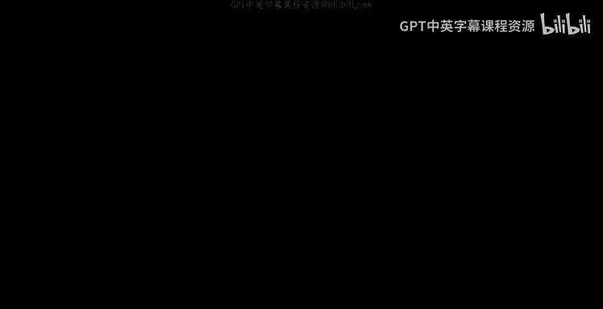
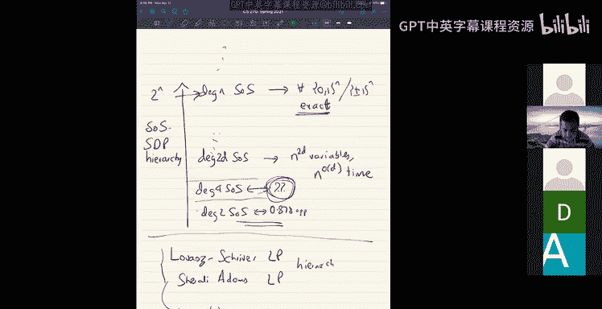

# UCB《组合算法与数据结构｜CS 270 Combinatorial Algorithms and Data Structures 2021》中英字幕 - P20：lecture 20.zh_en - GPT中英字幕课程资源 - BV1uZdpYZEwr

welcomelcome everyone， good to see you all back， so today we'll continue talking about semi defite programming。

So just to recall what we did last class。We introduced simulateative programming。So， to the lecture。

And basically semi different programming one way to look at it is it's a linear program。

We the variables。Are inner products of vector are inner products between vectors。In N dimensions。

Or as many dimensions as the。Number of variables since high sufficiently high dimensions。

 you can write a linear program between inner products of vectors and find a configuration of vectors that satisfies that linear program。

Okay so that's what semi different programming was and we saw an application of this to max cut so that was0。

878 approximation， we saw how to round it and how to try the relaxation and round it。Okay。

 so the one catch with this technique it's very cute so far is just that you know its it was very geometric the way we approach semi def programming。

 so we actually thought of max cut as the problem of embedding the graph and dimensions so that one side of the cut。

Faces in。Plus E1 and the other side phase in minus E1 and we relax that to find an embedding that maximizes the total squared length of all the edges so it's very germetric as in it's really sort of tailor made for the problem of max cut。

 which is really about embed the points as far away as possible from each other。

But know if you want this to be more general and useful， you'd want something more general。

 not just something very geo because many problems it's difficult to understand the geometry even if it is there at first。

So the language， which actually SDP sort of。不。嗯。😊，Help you reason with is the language of polynomial inequalities right so it's a systems of polynomial inequalities。

So this is inequalities or equalalities， let me just say it's just poly noal systems。

Okay for you know， we have a p1 of x greater equal to 0， p2 of x greater equal to 0。

PM of x square neck to 0。Cave over variables x equal to x1，3 xN。

so that's a system of v inequalities and you know you can of course simulate equalalities by using inequalities if I say P of x grade equal zero and then I say negative pi of x grade equal zero that can simulate equalities right so。

Right so this is a very general expressive language you can write lots of different problems as systems of polynomary equalities。

 so just to give a concrete example which we'll use as a running example today。

 it would be the minimum vertex cover problem。So what is a minimum vertex covered problem？Yes。So。

You have the input。Which is the graph。G equal to V E。And goal goal is to find。The smallest。

Subsid of vertices。Such that。Every edge is covered by the set。Every edge。艾车。Is covered。BS。

 what does covered mean either one of the endpoints。

 at least one of the endpoints is in S so I is in S。Of Js and S。Or both， it doesn't matter。

At least one of the endpoints is in S。ok。So， if you look at。Tangle graph。

K12 is a vertex cover because if I pick12。Every edge has at least one end point。Inside the cover。

Of course， there are other covers as equal to two， three。Or three one。

And that is the smallest vertex cover in the triangle you can't have a vertex cover of size2。

Let's size one。Okay， so the goal is to find the smallest subset of vertices that covers everywhere edge。

Okay， clearly， as you can expect， this problem is NP NPP hard。RightAnd so we want to approximate it。

 so just to show how we write is a polynomial system。Okay， to write it as a polynomial system。

 so what are the decision variables here for every vertex you need to decide whether it's part of the cover or not。

 so you write down X。Equal to。one if I。Is in the optimal vertex cover or the。Let me just say S。

The best the vertex cover has and0 otherwise。Okay， this is the intended meaning of the variable Xi。

Okay， and then what the what's a polynom system that you can write here， well if this is the intent。

 then you know Xi is in zero or1。Is the same I saying。Xi squared。Is equal to X。g我 let me to say。

It we write it asxi squared minus X equal to0。If X squared minus x zero is clearly polynoial。

Can write equal to 0。And then what do we know for every edge IJ？

We want I belongs to S or J belongs to S right this is a covering constraint。So how do we write this？

Let me just write it and then we'll see why that's the thing。

You can write it as a quadratic polynomial like this。

For every Hj I can include include this quadratic constraint， it is 1 minus X times 1 minus Xj is 0。

 so this forces either Xi or Xj to be 1。Okay， so either IZS or JZS， so that's implied， you know。

 it's forced by this。Okay， and then you， we really want to minimize the size of vertex cover。

RightInstead of writing the optimization version， let's just think of the decision version。

 so let's just fix some value of the vertex cover that we care about and so let's say we want to find some vertex cover of size at most C。

k素。And then we can always do binary research on sea。So this is a polynomial system now。

 a system of polynomial equalalities and inequalities。And it exactly captures vertex color。

And you can always write down for lots of problems， you can just immediately write these things down。

其实 this is。嗯。播。This polynom system P is for verortex cover， right？Okay， now if you remember Max cut。

 you know， you have a different polynomomic system there if。P max cut， it's simpler。

 it would be what it would be， you know you have X squared is equal to one。

So X is quite equal to one， this forces that X is equal to plus one or minus1 right this is same as that and what。

What else you want to maximize the number of edges cut， so let's say。

S over this X minus Xj whole squared Ij in the edge。This is at least C。Okay， so this。

Would be the system for。Pulumment system for。Mexico。Okay。

 and you can imagine for lots of if it's very easy to come up with these polymer systems that right this stuff you know that express these problems and it's no wonder because it。

At your encoding one an NP complete problem and has another NP complete problem solving polynomial systems。

Is NP hard like once you have many quadratic equations。

 it's NP hard to solve them anyway so it's just。Okay。Okay。

 that so solving polymer systems is NP complete， but the SDps give you a way to partially reason with it in an incomplete way so let's。

See what we can do Okay， so let's say we have this polymer system P of x。This is what we call this P。

It's a system of polynoials。In X13 x。P is equal to P1 through PM。ok。是。All right， too。

The natural thing that you would want to do is the reason these solving polymer systems is hard is because the solution space is not convex。

So there's an obvious thing to try to do is to convexify the solution space。

And whenever you have any set， there's a very obvious convexification of it， so let me state that。

Okay。So if I have a system of polynomial equations。ok诶 let just say。You know。

 the system is feasible and let。S be the set of solutions。To be。ok。For instance。

 a set of all possible verortex covers that we are looking for or something。

 it's a set of solutions to be。Okay， instead of。Talking about S。

 we could talk about probability distributions over S。Right， so。So convexification。Would be。

On vifying S。Would be to talk about if probability distributions。O文 s。Okay。

 because the set of all probability distributions over a set is a convex set if I have two probability distributions mu and the。

Then I can average them。So to be more concrete。So imagine， let's say we are talking about max cut。

Okay for max cut。I'm saying Xi is squareds plus minus1 in this。

The set of all probability like the solution status S is just the set of max cut solutions or set of cuts。

Plus， -1 cuts with well with the。You know。So of plus minus1 assignments with with objective value。

 at least。是。So it means it's C value at least C。Okay， and then this is not a discrete set of things。

But if I look at。Probability distributions or set， so let me call that。Delta S。你日。What are these。

 Well， these are。Like how do you represent the probability distribution by？Writing down the numbers。

 right， writing down the probabilities， right。How like it's a vector of length Carinal D， S， right。

 It's a vector。Of length gardenaryFs。😔，嗯。Inrease right that's a that's all I write on a power distribution and Pro distributions form a convex set if I take two probability distributions over the same space。

 I can just average them and get a new probability distribution over the same space which everything works out right so it's a convex cell。

就。We can directly talk about probability distribution Os。Okay， so。The。So that that， you know。呃。

That's an obvious convexification， the problem with this obvious convexification is that the set of probability distributions over a setS can be very very large。

So what do I mean， okay， let's just for simplicity assume that you know every plus minus vector is a solution。

So let's say S is just all。Plus， -1 to the n。So for example。

 if your polynomial system is X squared equal to one for all I。

 then you probability then your solution space is just all plus minus1 to the air。

 all the possible assignments， well let's just even say。 all the possible assignments。Now。

 the set of probability distributions over plus minus1 to the n is。

Like how do you even write down a probability distribution or a plus management to the end。

 you have to write down the。Probbilities of every possible assignment。W if5 write down。

Do I write on mut。If。Take one weight right down。Mu is a probability distribution。Over， let's say S。

Ors， how do you write mu？To write mu， you have to write down mu of x the probability。

 right mu of x for all x in S， the probability of each assignment。嗯。

And this can be exponentially many assignments。I write this down。

 and each of these should be non negative numbers。And they should all add up to one。

I I'm just writing down what it means to write down a proper distribution。Its exponentially large。

 exponentially many variables， me effects for each check， you know。

But this is a good I mean this is clearly not feasible right。

 you can't it's exponential size and sort of doesn't make sense， but this is a very good mental。

A picture to have， because this is what we are sort of in aspiring to。 I mean， this is what we are。

Approximating。I mean， ideally。We would be we would want to deal with。

Probably the distributions over the solutions asset。

And we would want to have their properties add up1 and know mu x greater than 0。ok。Okay， so but。

This is it's not feasible in poly Nor time or efficiently you can't do it。What do you do。Well。

 this happens all the time。It's not something new right you like you always have probability distributions over plus minus one to the n or you know lots of situations you encounter。

 you have a probability distribution。Over zero1 to the n or Booleion strings。

many times you sample from broad distribution of boolean strings and then you don't really store all the probabilities right and you can't do that because true to the end sized。

And so typically you're interested in something less， I mean something less informative， for example。

ANural thing you might be interested in is just the moments of it， for example。

 okay so mu is a product distribution or01 to the n I can sample from you right if x is a sample from you。

自己。I can talk about low degree moments of x。What are the low degree moments of x。

 so you have expectation over x1。X is from mu。And then expectation X X to。X from mi。Expectation X M。

X is from you these are the degree one moments， then you can talk about expectation X squared expectation X Xj。

These are the degree two moments and so on。So there's a degree one moment。

Deggree two moments are these guys and then degree three are the expectations of degree three monoials and so on。

And knowing the moment is partial information about the distribution， the full distribution。

So instead of working with the distribution itself。

What if we just worked with the moments of the distribution。

 a low degree moments of the distribution？Okay， so let's start with degree2。Okay。

 let's start with degree to just the first and second moment。Okay， so let me。个壁。

This polynomial system that I have。Oops。This polyno system for verortex cover。Okay。

 and let me write down what our goal is， our goal is。Let say。Can you find。Deggree。1 and degree。

2 moments。offer。Distribution or solutions to this system。Finding， right so。Okay。

 so what are the degree one degree two moments these are now you know in。

Like some small number of variables。 So what you have， let me call them variable something。

 So let's let me call capital X I to be。I mean， this is the intent， right？

There is some distribution of solutions to the system and what I want is capital like side to be the degree one moment。

And I want capital X Ij。To be the degree2 moments。And of course， there is a X XII is what you expect。

 I want it to be。ex使 square。Okay， this is the intent。诶。Okay， so now my goal is。To。Find these moments。

Oops。Okay find these moments， just the expectation values。Okay。ok。Okay。

 so this is about n plus N choose to。You know， n plus n plus N choose two variables。

What I want to find。Okay， now okay， so to find these moments。

 let's write down all the constraints that we know about these numbers， these moments， okay。

 first constraint well Xi squared is Xi。RightWe know that。

We know that little X squared minus X equal to0， this is a constraint in my polynomial system。

This means that in any solution。Distribution of solutions。I would have。Clearly， Fred。

If every solution satisfies this constraint and any distribution of solutions， this would be true。

 this gives me a constraint between what does this say， it says that Xi minus X should be equal to 0。

Right， that's。So that's a constraint on the moments now。It's a linear constraint on the moment。Okay。

 and you see that every polynomial constraint that you have becomes a linear constraint on the moment values。

 So we have 1 minus X I times 1 minus X J equal to 0。 This is for every age I J。 you have。This well。

 if you write on the corresponding thing， what happens you say oh。

 expectation of x from mu of1 minus X。Times 1 minus xj must be equal to 0。

And this corresponds to another linear constraint，1 minus。X I minus X J plus X， I J is equal to 0。

跟 let' sir。Linear constraint。Okay， so all the polyammal constraints become linear constraints on the moment values。

RightAnd of course， sumation exile less than equal to C becomes。嗯。几子。Okay。

 that's this's what happens。 Alright， so this is all natural。 Okay， just got a LP now linear program。

 And of course， you can imagine that this linear program is。It doesn't seem very useful as of now。

 doesn't seem very powerful。Okay， so now the question is this is all fair。

 we got these constraints from the systems of poly equalities。

 are there any other constraints on moments？That are true Okay。

 what are the constraints are true about moments of just vectors。Well。

 there are constraints of moments that are just true， which you'll just know to be true。

 so here's an example。I know for a fact that。If I take x1 minus x5 plus x7 hole squared。

This is grade neck  zero。This is just obviously true。

 this means that the expectation of this square polynomial。Is also grade and equal zero。

And that it should imply， that gives you， okay， expand out。

 gives you like a big linear constraint on the variables on the moment it says x11 plus x5hi5hi plus x7。

7 minus2 x15 minus2 x57 minus2 x7，1， this is great in。呃。不是啊。So that that's the thees。

 you can actually take any quadratic square and you can get a corresponding linear constraint on the moment so I can take for any。

嗯。P of X， if I take any。B f。To be。Summation P， X holds squared。

This gives me a corresponding constraint and this grade equal， of course， trivially。

 this gives me a corresponding constraint。What does it give me。

Let me actually also put in another constant term here。Just for。P 0 plus。Well。

 it gives me a corresponding linear constraint。Which looks like。P0 squared。Plus， some over I。ピゼピア。

I guess there's a tool here。😔，Capital like sigh。Plus。Some more I P i square。X， I， I。Plus。

 sum or I not equal to J。BIBJ。X， capital I z。Is great ni。I underline the variables。

 but not that here P is not a variable p I'm just saying we take any any。

Linear function take it square it gives you a new constraint that you can add over the moment okay and you know another way to state the same thing is that we've said this I think in the past moment matrices are PSD。

Moment make。OrPSD。Okay why is that well basically what do I mean by moment matrix so here's the degree two moment matrix if you give me any distribution。

I can write down the degree2 moment matrix， let me call it M2。Okay， what is M2？

It's indexed by degree1 monoommials， so there's a row for every degree 1 monoomial。

 so there's a row for 1 x1 x2 up to xn， and then there's a column for every degree 1 monoial1 x1 x2 xn。

And what you write down on the IJth entry is the moment。Of the。

The expectation of the corresponding monoomial so if。So。RightSo you have Xa。And Xj。

The corresponding entry。Would be expectation X I X J。Or in our case。

 we have denoted it by capital x S J。If I write down this matrix。

 which is Ij entries capital X Ij and you know the first row is special。

 the first row1 times1 is1 okay1 times x1， this would be capital x1。

You knowThe expectation of Xi would be here。Expectation of Xj。Which is capital next。Okay， if I write。

 put all my capital Xxi and capital Xxi Xj variables， arrange them like this， like so in a matrix。

Okay， then。诶。对。If I look at。嗯。This matrix， this matrix is PSD is equivalent to saying that。

The expectation of every square polynomial is non。Okay， so why is that well。

 you know basically all I'm saying is if you write down this matrix m2。

 then I say that if you and if I look at a vector， which is p is equal to p0 p1 to pN。Okay。

 then if I look at P transpose M to。比。This will be equal to。Expectation。

Of this polynomial P0 plus summation。B i。Exile。Hold square。It it can just。That's， I mean。

 that's basically。What it is and so， you know， this gives you that this has to be greater equal to zero。

For all p， for all vectors， if we take any vector p， this has to be greater than zero。

P transpose m2 is greater and 0。 And that's equivalent to just saying。M2 is a PSD matrix。Okay。

 so so now we have a semi different program for our degree two moments right this semi different program for a degree two moments is the following。

 you take every one of your polynomial constraint that you have gives you a linear constraint on the excise capital Xise the moment。

Okay and then you also arrange all of these XIJs in this matrix and that matrix is PSD that's a PSD constraint。

 so you have a PSD constraint and a bunch of linear constraints， so it's a semi differentite program。

And you can solve for it。So to write， write on what it was， just we are all in the。

So we got Xi minus X is equal equal to zero。嗯。1 minus X I minus X J。Plus xine J is equal to 0。

Like for all， i for all i J。And the edges。 And then， okay， these are linear constraints。 Oh well。

 we also had the。Like the value of the max minimum vertex cover， so it was sum or Xi less equal to c。

So个 send个律思。Okay， and then finally， the P critical thing， the PSD constraint。

Arrange these numbers in this matrix。1， x1。ex先。X1， xn and in X J here， this matrix is PSd。

So that's an different program。We got for this。Any questions on this？So。Right， okay， yeah。

 the question is how do we recover the vertex score from this。There's no。嗯。There's no。嗯。

They will see a few techniques of how to analyze the semi defite programs。

 but for a bit now today in this class we'll just be talking about。Just writing an SDP relaxation。

 we'll talking about semi different programming relaxations and for polynom systems and how they come about and we'll see a hierarchy of them。

嗯。Yeah and analyzing them and how well they do is we'll see a couple of techniques but still sort of a open question which is sort of still developing。

 I guess。Any other questions？Okay， so so we'll see you know it'll be a little bit of theory today and'll be sort of developing this thing and I guess when the next lecture we'll actually see how they how how they come together to give you like a powerful algorithmic tool。

 but today we'll just be seeing a，It little learning going into a little bit of theory on these things。

Okay， so this is an okay good so now we have a semi defite program and the nice thing about the way we did this is we didn't appeal to any geometry right we didn't have to do anything we just said oh give me a polymer system it'll give me。

Some linear constraints on the moment。And then moment， okay。

 that gives me a sense of linear constraints。And then moment matrices are PSD， so that's it。

 so it gives me a semi different program。Okay， and you can do imagine doing this for any polynom system that you have。

 Okay， and so this is a degree to。Is D？Dgree to so some course SDP or degree to SP， you can say。

 because we only even if you even if。You saw this， you only recover the degree2 moments of a distribution or solutions。

嗯。And。Again， this is still a relaxation。Meaning。Even computing the degree2 moments of。

A true distribution of solutions。Is NPP complete。Because in some sense。

 if you could compute the true， if you could compute even the degree one moments of a true distribution of solutions。

 you will know the value of vertex cover because the vertex cover you see that it's a function of just the sum of X so if you could compute even anything about the a true distribution of solutions it would it would still be。

Salverteker BNP company so we wrote on a semi program this is an STP relaxation for the moments of a distribution。

几钱。When you solve the SDP， it'll give you these Xs and Xs。

There's no real distribution with those moments。And you still have to work hard to recover an actual solution eventually。

But。But if you did this exercise for Max Scottt， you would recover the goman films and SP relaxation that we had。

It would get record just the， you know， just the isDx that we saw last class。And of course。

 you can do it for the problems。Okay， so this is degree2， but then， you know。

 the next question is why should we stop at degree2。

 we can do higher degree2 I mean higher degree also so let's just。Talk about degree D。 Well。

 what is a you fix sum integer D。Fix the。嗯。Yeah， fix D and in is。Okay， let's talk， what do we do for？

で you know is he。嗯。Here's the degree D asO as SDDP。It's called sum of squares SDP。Deeggred D， some。

Of squares。Yes。SZP。Alexation。So what is a degree sum of squares as the relaxation？Well。

 its variables are all moments up to degree D。The intent of the variables are all moments up to degree。

So let's say degree 2D。Okay， let me call this degree 2 d some okay， moments up to degree 2 d。

 meaning you have a you know， Xs， then you have X I Js， then you have X I J K， you have X I， J K Ls。

And， you know， X。You know， I1， I2 I T。Make all possible moments。You can have this like， you know。

 how many numbers are there they are like one n plus N choose2 plus N choose 3。Some inches the。

Well I think N to the D numbers roughly。Roughly enter the D numbers。

Into the 2 d numbers into the 2D numbers。I once write 2D okay， degree mode of degree 2D。All right。

 then what are the constraints？The constraints have。Okay， if I had a constraint， P of effect。

I had a constrained P ofx。PI of x greater equal to 0。If's the constraint。Let me not say I。

 let's just say P of x。In my polymer system。Okay， I'm going this corresponds to a linear constraint。

On my moment， right， so let's say P of x is the polynomial。Let me say， let me just be more careful。

 So P of x is this polynomial sum over P sigma x。To the sigma。Okay。

 x to the sigma is just some mono right， I just， I just want to use。OrLet me say X sub sigma。Okay。

 supposeupp I have a constraint like that， then you get a corresponding linear constraint saying。

Sumation， B sigma。그你 그럴。可他吃。嗯。All polynomial constraints become linear constraints on the moment。

 and then the final thing is the moment matrix is PSD。The moment matrix in this case。

 it's the degree2 d moment matrix。 Let me call it M2D moment matrix。 So how do you。Write this matrix。

Well， it has a row for every monoial of degree at most deep。So one， x 1， x 1， x 2， x， n。

 I don't know， X I， x X 1， x2。And then x1 cubed， all monoomials up to degree D。

 you have a row for it and one column for every mono of up to degree D。佢。😊，And then the entry。

If I have a monoomial。X sigma。And another monoommial x sigma prime。The entry here would be。

Corresponding to。X， Sigma union Sigma crime。Okay， our x sigma times xigma parameter。

 the expectation of the product of those two monos。Okay。

 this is a big n to the D by n to the D matrix， and you want this to be PSD。

This is the same I saying。ever。Quorotrate every square polynomial of degree D， I must have。

The expectation to be PSD。So I get this is moment matrix PSD is the same I say if I take any degree d polynomial。

Expectation of Q squared of x。Is grade equalel  zero。For all。Deeggree deepous keep。

If I take any degree E polynomal square it and take its expectation。

 I should get a non negative number， right？That's where this corresponds to。Any questions on this。

 So this is what a degree D summer squares SDP relaxation is Okay。

 I'm going to keep mixing up degree D degree2 d I should say degree2 d or the D order。Yeah。

It's always better to see easier to work with。Even numbered degrees because you're going to eventually want to get them。

Get expectations of square polyl， so it's better to work with even number， but。Any questions on this？

Okay， so that's the degree to the SSSGP。All right， so this， you know， it's quite powerful and neat。

 but this notation right now is super cumbersome because we have you know these numbers and we're going to arrange them in matrices and square neck or zero。

 just really super cumbersome。But there's a clean way to sort of reason with this and like there's a notational switch which makes working with this much simpler。

Here's a notational switch。So usually what do we say， we say， okay， let's look at degree2， right？

Okay， have the degree two moments。Meaning I have the numbers x13 xn and I have the numbers x I J。

For all I not equald for all Ij okay？That's what knowing the degree two moment is。嗯。

You knowInstead of talking about n squared numbers， it's。Cleleaer to talk about。诶。

Sud expectations of degree2 polynomials。So what we mean is。Well。

What does what do these numbers let you do， it lets you compute the expectation of any degree2 poly。

If you give me any degree to polynomial。smission b i j。X I， X， J， and I don't know。 some Q J， X J。

Plus Q not。Some degree to polynomial and you ask me what its expectation is I can tell you where it's just going to be in this linear function。

 just going to be summation P J， X I J， summation Qj capital xj plus Q0。Okay， so。

Knowing all the degree two moments is the same as knowing。The expectations of degree2 pronoials。Okay。

 and。So it's this， I mean， completely equivalent， just a different。

The representation of the same thing is completely equal in the tour。

 knowing this is the same as knowing that and vice vera。So therefore。

 let's just directly talk about some。Expectations of degree two pros， meaning。

Let's call our SDGP solution。A pseudo expectation operator。二点啦？Okay， a pseudo expectation operator。

What does it do if you give it any degree to polynoms， it gives you a number。

 which is the moment of that polynomial。So， if you give it any。Degeee2 polynomial。

It gives you a number， which is the expect moment of that it gives you a number。A real number。

 which is the moment of that。Instead of saying find me all the moments， X Ij。

 let's just say give me find me a linear functional E Tida。A linear functional eilda。

Which is this degree to is a linear functionder。On degree2 polynoms。

 given a degree2 point which should give me a number。

And what are the constraints on this linear function？Well。对。Sort of expectation。off。

PI of x must be great equal to zero。For all constraint。

If you had a constrained PA of x gradient equal zero in your system。

 then the sort expectation that should be greater equal zero。

And then so the expectation of any square polynomial。Is also great equal zero for all。

Right so so like we just switched from very concrete notation where we had these n squared numbers Xj to a somewhat abstract notation which is but this abstract notation makes it really easy to manipulate things and so on so that's why this is a very powerful notation and very useful notation so。

So in this notation， you know I can write down my degreeD sum square SDP very， very easily。

Very compactly。As follows， given a polynomial system。P1 through PMm， sorry lucky。

 let me write on what the corner system is it's some system of inequalities。

 P F x greater equal to zero for all。系。Okay， that's some polynomial system。The degree D。

S O S relaxation， S DP relaxation。What does it do， it asks you to find。Or what does it do it finds？

Sudo expectation operator。It's just a linear functional。Finds a linear functional。

That maps degree polynomials。Two real numbers。Sorry。Dgree E polynomous S art。Right sorry。

 I'm just what little pedantic here so such that。Eilder of P effects。

Is greater equal to 0 for all I and then Eed of。Q squared of x greater equal to 0 for all polynomous Q is a degree of Q。

嗯。Is less than B over2。Okay， I think it。Let me just do degree 2D， some course relaxation， degree2D。

Dgree2 D polynomials。Yeah啲啲啲。Okay， sorry be consistent here。

A square of a degree d polynomial is a degree 2 d polynomial。

 so pseudo expectation gives a number associated with that attention period。any questions on this？

It's a。Okay， so let let's see what what this is。 So what we have now is。

Sence of SDP relaxations right for each value of D you have an SDP relaxation right so you have a sequence of SD given any polymial system。

 you have a sequence of SDP relaxations。You have the degree 2 is SO S。

 then you have the degree 4 S S。And all the way up to degree end。S so yes。Okay， or you can go higher。

 but basically yeah。Okay and what what is true about this well they're getting bigger and bigger these SDP relaxations are getting bigger and bigger So if I look at degree 2 d SoOS it has about I think around end to the 2 d variables。

And so you can solve it in time into the order。To solve it。

So it's taking you a lot of time to solve it。However。Like you'd hope that as you。

Add more and more moments to your distribution， you're adding more and more information。

 so the SDP is able to or it's less and less of a relaxation。Okay。😊，So in fact。

 for most of the discrete problems like max cut vertex cover for I guess for all problems over01 to the n or  one plus minus1 to the n。

系。Dgree N SORS degree N will be exact。We need'll give the exact right answer。

So if you solve vertex cover or max cut， you get the exact right answer and of course you took two to the end time so it's not surprising at all。

Okay， but it's not surprising at all， but at a degree end you will get。

The exact right answer for whenever you heard。Okay， and。So it's a Sih family of algorithms。

 you can say it's a hierarchy of algorithms， I guess hierarchy is the right word here。

 it's a hierarchy of algorithm it's called the SOSOS SDP hierarchy。And you。

Which takes increasing runtime and gets more and more powerful as it go higher and higher。Okay， and。

已经。嗯。I guess， of course it gets more and more runtime， luckily for us。At least until。Recently。

 I guess。A lot of classic lot of the SDP based algorithms are captured by the first two levels or something。

You never go like a lot of the SDP based algorithm used to be like， for example， our 0。

878 approximation for max cut。That was just a degree to SOSSDP。Right and you know。

 you could imagine that。A lot of many other problems。And the we know。

 they fall in the first couple of lives， degree2 or four。I mean。

 nowadays there are many examples that fall in higher levels here， but yeah。That's how it is。

You know， again， as you said earlier， this is just a sequence of relaxations of a problem。

When you solve it， you don't really get the solution you just get。

Some set of numbers which are supposedly the moments of a distribution of solutions。

 and we had to still figure out the actual solution or prove see how to recover the actual solution from it。

Okay， so。All right。Okay， so let's see what sense is this getting stronger and stronger okay。

 so I'll show you one sense in which it' the hierarchy is getting stronger and stronger。So okay。

 let's go back to a problem that we have， is the vertex cover problem。Okay。

 so if you look at vertex cover。All right， so you have let's even look at the triangle graph。Okay。

 now the degree1。Moments。So the original LP that you write for this problem。

 which corresponds to some of the degree one relaxation of this is just this。X I plus X J， great ni。

 Let me just write down the。Constraints formulaly a 1，2，3。The x1 plus x2 is greater equal to 1。

X2 plus x3 greater Ne to1。And x3 plus x1 grade equal to1。RightThis is， in some sense， the degree1。

Relaxation or the LP relaxation really is LP relaxation and of course， this is not so good because。

If I set x1 equal to half。X1 x to x3 equal to half。Okay。

 this gives me a vertex cover value of three halves。And you see that the actual vertex cover is 2。

The optimum vertex cover is2。Because you need to pick at least two words is there's a gap， right。

 it's not the exact。All right， so。WhatWhat happens when you？我你。Like。

 how do people approach this thing you say？All right。

 so this means that you know this LP is not tight enough。

 so let me add some constraints to this So whenever I see a triangle in my graph。

I know that I need to pick two of the vertices， at least two of the vertices in the triangle。

So whenever I see a triangle， I'm going to add a constraint that the sum of the three endpoints is at least two。

So you can say， here's my triangle constraint。We should cook up by looking at this instance， you say。

 okay， here's my trirangle constraint。And你 say。Xi plus xj plus xk is greater than equal to 2 for all IJK triangles。

Okay， you can do this and this is a triangle constraint right， but then you say oh okay， this works。

 let's let's see then what happens next， well then you look at the Pentagon。And the Pentagon。

You look at the Pentagon and you say， oh， in the Pentagon。I need to my vertex cover。

Needs to pick at least two vertices。Sorry， at least。嗯。At least three vertices in a pentagon。

Like here。Here's  one，2。Three at least three， you can check it at least three。

 so you could say okay for every pentagon I need to I can add a constraint saying x1 plus x2 plus x3 plus x4 plus x5 is at least。

3。So you can keep coming up with these new newer constraints to add to your linear program to make it more and more powerful。

 but this process is a little bit ad hoc， meaning you don't know which constraint to pick。

 you can come up with lots of different constraints。And。

What happens with the hierarchy here is the hierarchy automatically。

Generates these constraints for you。In some sense， if you use a degree for。Dgree B S or SDDP。

 it actually automatically generates a whole bunch of constraints systematic and automatically for you。

Which are true。Okay。In fact， the following general theorem is true。Here's ater。嗯。嗯。

Suppose x is supposed to be Boolean。K meaning your polynomial system includes。

Xi squared minusxi equal to 0。So if you're working over a Boolean domain。

 so the parent system includes this。And then。呃。Dgree。2D SOS SS SDDP。あ。Includes or captures captures。

 let me just say in captures。Every。True constraint。On。2D vertices。2D variables like I。

On a set of 2 d variables。Okay what I mean by true constraint is any constraint that is true for every inteigger solution。

Right you okay， you only want to add constraints that are true for every intesger solution。

 you don't want to add constraints that sort of cut off some actuals intesger solutions。

 every constrain that's true for every integer solutions that's included in this included by this This is actually。

18 sometimes you don't。 this is。You don't need the full power of the sumos square SDP here the are weaker things that will imply this but just to this is an illustration like sumos square SDDP gives you a lot more than that right so in what sense when I say a constraint on 2D variables by definition it's local it's about 2D variables like you if D4 I'm saying every constraint on eight variables is included okay that's good but usually the power of SDP the summo square SDDP comes because it not just includes local constraints it includes some very global constraints。

For especially because of this。PSD sum square is constrained， the PSD is constrained here。就。嗯。Right。

 so if I look at the。If I look at some very global thing。

Like here's a very global constrain if you look at E tilde of summation x。

ItMaybe just say x1 plus x2 plus x n whole squared。This is grade equal zero， okay。

This is a very global constraint on all the n squared moments together。

 so it includes a bunch of very global constraints， but you know it also implies local constraints。嗯。

Yeah。So。嗯。Let me show how why this is true， I think it's sort of illustrative。

So the reason this is true is the following。Thank。The claim is， the first claim is。Yeah。

There exist is。For every subset of deep。For every subset s of 2 d variables。

If you give any 2D variables。嗯。be。The SOS SDDP solution gives you an actual distribution of solutions to that those variables that exists。

呃。Distribution， real probability distribution。Musa。Over assignments。猪。😔，Those variables。Such that。

Eating the of。Ex sub sigma is equal to the actual expectation。So just to say it。So basically。

So the S SDP。When you solve it， it gives you moments， okay？Now， as I said。

 these are candidate moments， there is no real distribution with those moments usually。Okay。

 but here what I'm saying is if you just look at a small subset of。

 if you look at only 2 d variables。Then。These moments。TruThere exists a distribution。

 which agrees with these moments， which has these moments。Okay。

 and this is how do you prove this claim， well you can actually compute the probabilities。

So another way to says is moments。Give you actual distribution。Acctual local distributions。All right。

 so this is。Why is this true， Well， you know， you can just compute the probabilities of this distribution So defined。

The probability， so I'm going to define a probability。Be of。Alpha。So right so。

So lets don't worry if you don't get this proof or this theorem very well。

 it's not a big problem because I'm just going to introduce some polynomial notation here and so basically indicators that x sub s is equal to alpha。

 this can be written as a polynomial。In degree atmost2。Because it is product or I in alpha one plus。

唔使。嗯。You want to write over zero one， right so it's。嗯。都解呢。胡云买。嗯。So， big say。嗯。Right， so it's。嗯。Okay。

 IN S Al I is 0，1 minus。Xi times product of I in S Al I is 1 X。Okay。

 so all I'm saying here is the indicator function that this subset of variables is assigned alpha。

Can be written as a polynomial in degree 2D， right， That's just what it is。

 This is the polynomial in degree 2D degree S。Which is is exactly indicator function that these values are assigned xs is are Okay and so then okay。

 so therefore。And this polynomial is a so therefore you can recover the probabilities from the moments。

Therefore， the probability that x sub s is equal to alpha。

 that is just the expectation of the indicator function that x sub s equal to alpha。Okay。

 and that is。clearly， right， this is just therefore I can。Recover it from my pseudo expectations。

You can assign it。对比。This polynomial that I wrote down here。Okay， that's where。

So you can recover the probabilities from the moments and therefore。The pseudoda expectations。off。

Like sort expect of monoials。Which are inside。This set。그래。

Or correspond to the moments and actual distribution that we constructed。

 let me call this problem solution mu。New Saes。Okay， and that's what the claim is saying。

 the claim is saying there's an actual distribution。Over actual honest zero1 assignments。

Such that the moments come from that。Okay， and that's what this claim is saying and therefore once。

You have this fact。嗯。This means that if any constraint is true。On all actual solutions。

 it's also true。 It's also implied right， It's also implied by。嗯。Theエオデピ。Right so。If some constraint。

 let me just say， like some polynomial constraint。K some' c sigma x sigma sigma is in s is greater equal zero for all x in the solution space。

ok。This is also implied by the SDDP。This implies that expectation x in mu。Submission， C， Sigma。

 x Sigma。Is greater equal 0， this implies Eilda。Of sumation C sigma， x sigma， the very accuracy。Okay。

 so so you know， this theorem is a little bit， I mean。

 I wait it went over a little bit too fast to sort of。

It's a little bit abstract but it also went over too fast to sort of grab the significance of it。

 but mean the real significance of this is given the context。

So let me step back and say what the context is。Okay。

 the context of this is what we just discussed so far as we discussed an SDP hierarchy。

 a hierarchy of SDP relaxations。But note that you know。

 when people then to come up with the SDP hierarchy first。

 the first thing that came up was lead LP hierarchies。Right so in the early 90s。

 there were hierarchy hierarchies of linear programs called。I mean。

 there is a there are many of them， I guess， lower shriver。High LP hierarchy。

 and then there's a Shirley Adams LP hierarchy。And I think there's one more with so these are LP hierarchies。

 hierarchies of LP relaxations that you can just systematically write down for any 01 program。

For any zero1 linear program， give you a systematic sequence of LP relaxations。

 which are long larger and larger， and eventually once you reach end rounds。

 you can solve the LP2 to the end time and it gives you the exact answer。嗯。And。What we saw just now。

 we constructed asDP hierarchy for。What this theorem is saying effectively is that this SDP hierarchy。

 the D rounds of it captures the D rounds of the LP hierarchy。

So the Dunds of the LP hierarchy gives you essentially constraints on d variables and oversimplifying here。

 but to the extent it gives you constraints on every subsets d variables。

 every true constraint on d sub subs d variables shows up when you do dunds of LP hierarchy and what this is saying is that oh。

 of course the Drons of STP hierarchy captures it， meaning it also recovers all those constraints。

And so that's what the theorem's context is。And。Unfortunately， as it turns out for most problems。

 the LP hierarchy doesn't really help much。明年。For like， it doesn't give you。For most problems。

 you can go higher and higher in this hierarchy， there seems to be a dicho to me as in you get some algorithm at the first level or something and then your the solution quality doesn't improve at all as you go higher and higher。

Okay， and。And we know this for a fact， for example， for vertex cover。IfFor LP hierarchy， you know。

 we write on the simple LP here， this linear program。

 I think we do it in 170 also sometimes this gives you like a half approximation for vertex cover and it doesn't get any better even for like。

Linear number of rounds of these LB hierarchies all the way up to exponential time you don't get any better approximation。

And for so this so most of these LP hiarchies have already been ruled out as better candidates for better approximation。

The only thing a candidate， which is still not completely ruled out is the summer course SDP。

S Square SDP is still powerful enough that。We don't know how to prove lower bounds for it。

So it's still being explored， so for max cut， for instance。At degree 2， we got 0。878。

We don't know if degree4 gives better。Or it doesn't do better。 We can't prove either way， still open。

嗯。And so degree some Square SDP is of very is much more powerful than these LP Herarchies。

And what's exciting about it now？Is that。We still don't know what it does in worst case for max cut and so on。

But for problems that arise out of statistics like average case problems and statistics problems。

 the source CSD gives you a very good algorithmic tool。Okay。

 so what we'll do in next class is the following。We will。诶。

We'll talk about how to analyze our device algorithms using the summeros square as ifP hierarchy。

And what's really exciting for me about that particular thing is that。There is， in some sense。

 somes SDDP gives you hierarchy， gives you like a compiler。That can compile。Proofs。Into algorithms。

Right， that's sort of the。High level thing Some it give it gives you a way in which you can。

Devisising an algorithm。Becomes the problem of devising a proof。And。Itええ。It's quite。

Quite neat how this， this compilation happens。 So in the next class， well talk about duality and。

Proves basically， we'll talk about dwell and proofs next class。

Addequ question regarding this hierarchy so right there should be a point where where things flip from approximation to to exact we sort of go up the levels Can we characterize those in some way is this like。

Do we expect it to be smooth some in some sense or like right， yeah。

 so I think in terms of approximation。嗯。It really seems to depend on vertex sorry worst case or average case。

So and I think it really varies from。LikeFor example， we know that。

If you're optimizing over01 to the n， n level suffice。But when。

 when it gets better sort of seems to depend and on the problem man。So for example。

 actually the nicest thing about summer Square SP is that effectively if you're reasoning about just uniate polynomials like。

All facts about。A single variable x， not on 0，1， but let's say on the interval 0，1。

 at a real number between 0 and 1， un a single variable x all unated。Facts。

 we completely understand how well this hierarchy does。We understand very well， but。

Multtivariate facts it really seems to depend。But the intuition seems to be that if we look at worst case problems like vertex cover。

Or。You know， many of them like you will get an approximation at degree2。

And it never improves all the Web2 degree routine1 or something。I we don't expect。 like， like。

 this seems to be the case with Pan peak under problems。

 It seems to be like a face transition meaning。 The problem goes from。Being easy to very， very hard。

 you don't expect intermediate algorithms for many of these problems。But in the average case。

 here like in statistics and average case。There is a lot of problems there。有。

Adding more and more levels increases， but improves your。ationYeahm sorry， I mean。

 I guess in some there's no general answer that we know in fact， I would say， I guess five years ago。

 if you asked me， I would say yeah， this hierarchy will not give any useful algorithms or not just not useful not give any algorithms which are。

New or surprising。But I guess in the last five years， there have been algorithms which。

Kind of surprised me a lot。 And like as in。algorithms for problems which otherwise it could be very painful or hard to dev an algorithm and this way would be very easy to just follow。

Because in the worst case， terms like for a max cut。I said， you know， at degree four。

 we don't know what happens， but you know， if I had to bet， I would say， you know。

 you don't get better than 0。878 at all for a long time。嗯。I would put that way。The worst case。Okay。

 so you'd expect it to sort of stay the same and then jump over yeah yeah。

 like I think for the same is true for like other classes of algorithm like for threeS。Right。嗯。Yeah。

 it takes exponential time basically we don't expect sub exponential time algorithms。

 so it's similar to that in some sense。The complex is be too very high。Okay， okay， go from now。Okay。

 cool。 thank you。嗯。I know we started taking the assumption that we are looking at polynommal constraints and then going about doing this。

 but can we do this for like exponential constraints like E to the power of some variable X and then a constraint on that？

呃。Yeah。Like in some cases， there's a different basis。Which works well。 I mean。

 the key thing about polynomials that we use is is that the the key thing we need is that。

If you look at degree polynomials， they give me an explicit subspace of functions。

which is about a space of functions。As in and I can。

ComeRight right on Main season and so on and so if you have a different subspace of functions that you can work with。

 then you can write on similar hierarchy there。But typically what happens with I think things with E to the x and so on is that。

Yeah。You don't have such subspaces。But there are you know so there are examples where。

Using a different basis instead of re workinging with polynomials of degree D。

 using a different basis of functions is useful， I think。

I want to say there's some places where they use bavelets， there's some place where they use Fourier。

But basically you need a subspace of functions， the key thing is you need a subspace。

 a linear subspace。The reason I was thinking of exponential was because in expectation。

 maybe then we could。Like moderate in sense of movement generating functions and then like well need less variables to get much more exact answers。

嗯哼。2。啊。Oh。Right， no， yeah， I think。Actually。Yeah， the。

