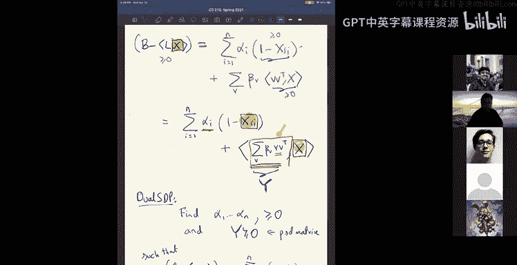
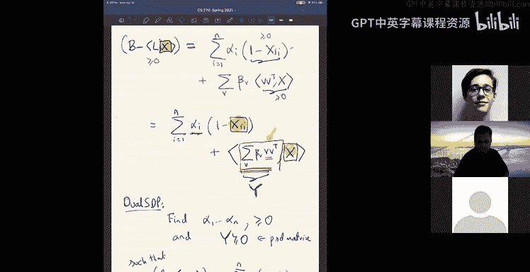

# 组合算法与数据结构：21：SOS证明系统与伪期望

在本节课中，我们将学习如何分析从平方和（SOS）半定规划（SDP）层次结构中得到的“伪期望”或“伪矩”。我们将探讨如何从这些伪矩中提取原始问题的解，并理解其背后的核心思想——对偶性与证明系统。我们将看到，SOS SDP的对偶对象正是“平方和证明”，而“弱对偶性”为我们分析SDP解提供了一个强大的工具。

---

## 回顾：平方和（SOS）SDP层次结构

上一节我们定义了**度数为 D 的平方和（SOS）SDP层次结构**。它计算一个多项式系统解的分布（或伪分布）的矩（或伪矩）。

给定一个多项式系统：
\[
P_i(x) \geq 0, \quad i = 1, \ldots, m
\]
度数为 D 的 SOS SDP 解本质上会给你一组**伪矩**。我们称之为“伪矩”，因为你永远无法确定是否存在一个真实的分布以这些数为矩。这类似于顶点覆盖线性规划（LP）的分数解：可能不存在一个真实的顶点覆盖解分布恰好具有这些分数值，但这就是SDP给出的结果。

我们尚未分析如何证明关于这些伪矩的陈述，或者如何从伪矩中提取原始问题的解。

---

## 对偶性与证明系统

在深入SOS SDP之前，让我们暂时忘记SDP，重新思考**对偶性**的概念。对偶性通常在线性规划（LP）的优化背景下讨论，但它背后有一个更广泛的思想：**对偶性与证明**。

### 线性规划中的证明系统

假设我们有一个线性规划，其可行域由以下约束定义：
\[
A_i \cdot y \leq b_i, \quad i = 1, \ldots, m
\]
这些约束共同定义了一个多面体 \(P\)，即LP的可行域。

如果我们知道一个点 \(y\) 在这个可行域内，那么关于 \(y\) 我们所知的唯一事实就是这些约束。我们可以问：是否存在其他关于 \(y\) 的线性不等式陈述 \(c \cdot y \leq d\) 也成立？

如何证明这样一个陈述？我们可以从公理（即原始约束）出发，通过**非负线性组合**来推导新的陈述。例如：
\[
\lambda_1 (A_1 \cdot y) + \lambda_2 (A_2 \cdot y) \leq \lambda_1 b_1 + \lambda_2 b_2, \quad \lambda_1, \lambda_2 \geq 0
\]
这为我们提供了一个证明系统：规则是取公理的非负线性组合。

*   **健全性**： 每个能被证明的陈述都是真的。这对应于**弱对偶性**，在这个系统中是显然成立的。
*   **完备性**： 每个真的陈述都能被证明。这对应于**强对偶性**。对于线性规划，这意味着如果对于所有可行解 \(y\) 都有 \(c \cdot y \leq d\) 成立，那么总存在一组非负系数 \(\lambda_i\)，使得：
    \[
    c = \sum_{i} \lambda_i A_i \quad \text{且} \quad d \geq \sum_{i} \lambda_i b_i
    \]
    这个恒等式就是证明。对偶线性规划本质上就是在寻找这样的证明（即系数 \(\lambda_i\)）。

关键要点是：在线性规划的可行域上，**每个真的线性不等式都可以通过取约束的非负线性组合来证明**。

---

## 多项式等式系统的证明

这个概念在数学中非常基础。考虑一个多项式等式系统：
\[
P_1(x) = 0, \quad P_2(x) = 0, \ldots, P_m(x) = 0
\]
假设对于所有满足该系统的 \(x\)，都有 \(Q(x) = 0\) 成立。我们如何证明这一点？

一个自然的证明（证书）是展示一个恒等式：
\[
Q(x) = \sum_{i=1}^{m} R_i(x) P_i(x)
\]
其中 \(R_i(x)\) 是多项式。如果我们看到这样的恒等式，就知道只要 \(P_i(x)=0\)，就必有 \(Q(x)=0\)。**希尔伯特零点定理**指出，只要陈述为真，这样的证明总是存在的（尽管可能需要对 \(Q(x)\) 取幂）。

---

## 多项式不等式系统的证明：平方和（SOS）证明

现在考虑包含不等式的多项式系统：
\[
P_i(x) \geq 0, \quad i = 1, \ldots, m
\]
假设该系统蕴含另一个不等式 \(Q(x) \geq 0\)。我们如何证明它？

一个多项式非负的最自然证明是展示它是**平方和**：
\[
Q(x) = \sum_{j} S_j(x)^2
\]
但这还没有使用我们的公理 \(P_i(x) \geq 0\)。为了结合公理，我们考虑以下形式的证明：
\[
Q(x) = \underbrace{\sum_{j} S_{0j}(x)^2}_{\text{平方和项}} + \underbrace{\sum_{i=1}^{m} P_i(x) \left( \sum_{k} S_{ik}(x)^2 \right)}_{\text{带系数的公理}}
\]
这里，\(S_{0j}(x)\) 和 \(S_{ik}(x)\) 都是多项式。由于：
1.  平方和项显然非负。
2.  每个 \(P_i(x) \geq 0\)（公理）。
3.  每个 \(\sum_k S_{ik}(x)^2 \geq 0\)。
因此整个表达式非负，从而证明了 \(Q(x) \geq 0\)。

**定义（平方和证明）**：
给定多项式系统 \(P_i(x) \geq 0\)，一个证明 \(Q(x) \geq 0\) 的**度数为 D 的平方和证明**是一个如下形式的恒等式：
\[
Q(x) = S_0(x) + \sum_{i=1}^{m} P_i(x) S_i(x)
\]
其中 \(S_0(x)\) 和每个 \(S_i(x)\) 都是平方和多项式，且等式中出现的所有多项式的最高次数不超过 D。

**Positivstellensatz 定理**指出，只要 \(Q(x) \geq 0\) 在系统下为真，就总存在这样的平方和证明（可能需要乘以一个多项式因子）。同样，一般没有实用的度数上界。

---

## SOS SDP 的对偶与平方和证明

现在，让我们将SOS证明系统与SOS SDP的对偶性联系起来。

考虑最大割（Max Cut）的SDP松弛（用矩阵形式表示）：
\[
\begin{aligned}
& \max \quad L \cdot X \\
& \text{s.t.} \quad X_{ii} \leq 1, \quad \forall i \\
& \qquad \quad X \succeq 0 \quad \text{(X是半正定矩阵)}
\end{aligned}
\]
半正定约束 \(X \succeq 0\) 等价于无穷多个线性约束：\(v^T X v \geq 0, \ \forall v\)。

如果我们为这个（无穷维）LP写对偶，引入对偶变量 \(\alpha_i\)（对应 \(X_{ii} \leq 1\)）和 \(\beta_v\)（对应 \(v^T X v \geq 0\)），对偶问题会寻找一个如下形式的恒等式来证明目标函数的上界 \(B\)：
\[
B - L \cdot X = \sum_i \alpha_i (1 - X_{ii}) + \sum_v \beta_v (v^T X v)
\]
其中 \(\alpha_i \geq 0, \beta_v \geq 0\)。项 \(\sum_v \beta_v (v^T X v)\) 是半正定矩阵的非负组合，其本身也是一个半正定矩阵，记作 \(Y\)。

现在，从伪期望的角度解释这个恒等式。在度数为2的SOS SDP中，矩阵 \(X\) 的条目对应于伪期望：\(X_{ij} = \tilde{\mathbb{E}}[x_i x_j]\)。目标 \(L \cdot X\) 对应伪期望 \(\tilde{\mathbb{E}}[\sum_{(i,j)\in E} (x_i - x_j)^2]\)。类似地，\(v^T X v = \tilde{\mathbb{E}}[(\sum_i v_i x_i)^2]\)。

因此，上述对偶恒等式在多项式世界中转化为：
\[
B - \sum_{(i,j)\in E} (x_i - x_j)^2 = \sum_i \alpha_i (1 - x_i^2) + \sum_v \beta_v (\sum_i v_i x_i)^2
\]
**这正是我们之前定义的度数为2的平方和证明！** 右边第一项是平方和（常数），第二项是公理 \((1 - x_i^2) \geq 0\) 乘以平方和系数 \((\sum_i v_i x_i)^2\)。

**核心关联**：
*   **度数为 D 的 SOS SDP 的对偶**正是在寻找**度数为 D 的平方和证明**。
*   随着度数 D 增加，证明系统的能力增强。

---

## 伪期望与弱对偶性

现在我们可以形式化地定义伪期望，并陈述连接伪期望与平方和证明的关键性质。

**定义（伪期望）**：
对于一个多项式系统 \(P_i(x) \geq 0\)，一个**度数为 D 的伪期望** \(\tilde{\mathbb{E}}\) 是一个从次数不超过 D 的多项式到实数的线性泛函，满足：
1.  \(\tilde{\mathbb{E}}[1] = 1\)。
2.  对于所有 \(i\) 和所有次数足够低的多项式 \(S(x)\)，有 \(\tilde{\mathbb{E}}[P_i(x) \cdot S(x)^2] \geq 0\)。
3.  对于所有次数足够低的多项式 \(S(x)\)，有 \(\tilde{\mathbb{E}}[S(x)^2] \geq 0\)。

度数为 D 的 SOS SDP 会输出这样一个伪期望。

**弱对偶性（关键分析工具）**：
如果不等式 \(Q(x) \geq 0\) 拥有一个**度数为 D 的平方和证明**（即可以写成前述形式），那么对于该多项式系统的**任何度数为 D 的伪期望** \(\tilde{\mathbb{E}}\)，都有：
\[
\tilde{\mathbb{E}}[Q(x)] \geq 0
\]
这个陈述非常基础但强大。它意味着：如果你使用一个“简单的”（低度数）平方和证明来证明某个事实 \(Q(x) \geq 0\)，那么这个事实在SDP返回的“伪世界”解中也必然成立。

**强对偶性**（大致上说，每个对伪期望成立的事实也能被低度平方和证明）在大多数关心的情况下也成立，但需要更仔细的论证。

---

## 总结与应用展望

本节课我们一起学习了：
1.  **证明系统的概念**： 在线性规划中，证明通过对约束取非负线性组合完成。
2.  **平方和证明**： 对于多项式不等式系统，证明通过将目标写成平方和与带平方和系数的公理组合来完成。
3.  **SOS SDP的对偶**： 度数为 D 的 SOS SDP 的对偶问题正是在寻找度数为 D 的平方和证明。
4.  **伪期望与弱对偶性**： 这是分析SOS SDP算法的核心工具。如果我们能用低度平方和证明某个性质对于真实解成立，那么该性质对于SDP输出的伪期望也成立。

在下一节课中，我们将把这个理论应用到具体算法中。策略如下：
*   对于一个难题（例如鲁棒线性回归），我们将其表述为一个多项式系统。
*   我们求解该系统的度数为 D 的 SOS SDP，获得伪期望 \(\tilde{\mathbb{E}}\)。
*   为了证明 \(\tilde{\mathbb{E}}\) 给出的解接近真实答案，我们将在**真实解的世界里**，使用**低度数的平方和证明**来证明“任何真实解都接近真实答案”。
*   根据弱对偶性，这个证明意味着伪期望 \(\tilde{\mathbb{E}}\) 也满足同样的性质，从而保证SDP返回的解是高质量的。

这种将代数证明“编译”为SDP解性能保证的框架，是分析基于SOS的算法的强大语言。