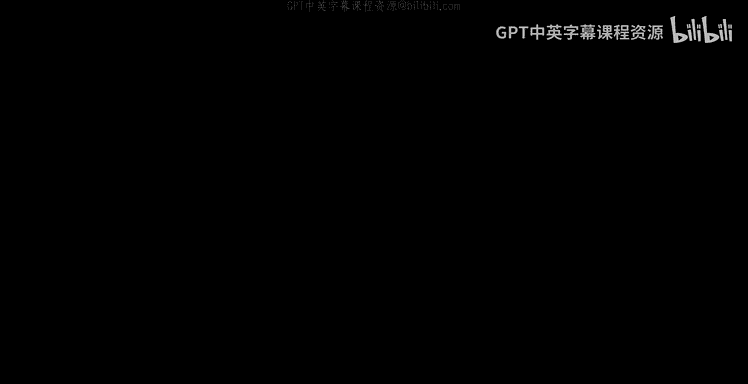
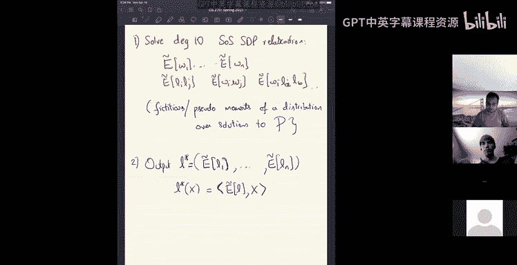
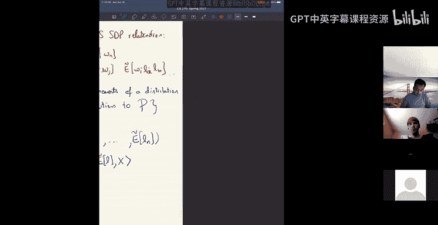
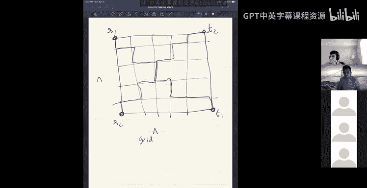
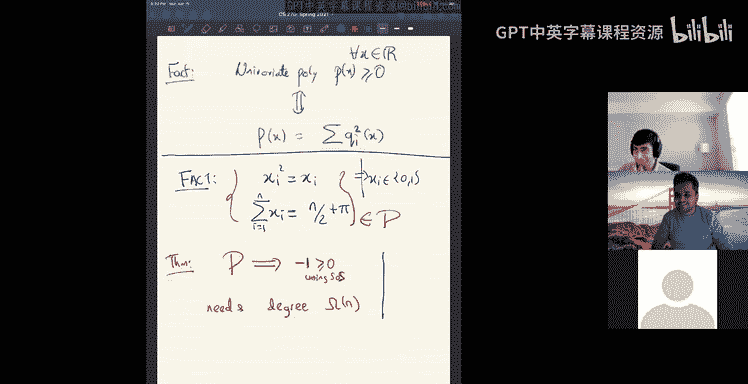

# 组合算法与数据结构：22：平方和（SOS）SDP的应用

在本节课中，我们将学习平方和（SOS）半正定规划（SDP）的两个具体应用。我们已经介绍了SOS SDP及其对偶性，并构建了相关理论框架。今天，我们将看到如何利用这些工具解决实际问题。

## 应用一：鲁棒线性回归

首先，我们来看第一个应用：鲁棒线性回归问题。

### 问题定义

假设存在一个未知的线性函数，由一个单位向量 **L̂** 定义，即 **L̂** · **x**。我们从这个函数中获取样本。真实的样本形式为 (**x̂**, **L̂** · **x̂** + γ)，其中 **x̂** 是随机向量（例如随机的±1向量），γ 是高斯噪声。

在标准线性回归中，我们的目标是通过最小化平方误差来找到这个线性函数 **L**。然而，在鲁棒线性回归中，我们面临一个更复杂的情况：我们接收到的样本中，有 (1-ε) 比例是来自真实分布的真实样本，但有 ε 比例是任意且对抗性的异常值。我们的目标仍然是恢复出接近原始 **L̂** 的线性函数。

### 多项式系统建模

为了应用SOS SDP，我们首先将问题表述为一个多项式系统。

**决策变量**：
*   **W**： 对于每个样本 i，变量 Wi 表示该样本是否为真实样本（意图是 Wi = 1 表示真实，Wi = 0 表示异常）。
*   **L**： 我们想要寻找的线性函数向量。

**多项式系统 P**：
1.  **二元约束**： Wi² - Wi = 0，对于所有 i。这强制 Wi 为 0 或 1。
2.  **真实样本数量约束**： Σᵢ Wi = (1 - ε)n。这表示至少 (1-ε)n 个样本被标记为真实。
3.  **归一化约束**： ||**L**||₂² ≤ 1。这是一个简单的归一化。
4.  **最小化目标**： 最小化在标记为真实的样本上的平方误差：Minimize Σᵢ Wi (yᵢ - **L** · **xᵢ**)²。

这里，**xᵢ** 和 yᵢ 是已知的样本数据，是多项式中的常数。多项式变量是 **W** 和 **L**。

### SOS SDP 松弛与解提取

接下来，我们求解这个多项式系统的一个低阶（例如，10阶）SOS SDP松弛。求解后，我们会得到一组“伪期望”值，例如 Ẽ[Wi], Ẽ[Lⱼ], Ẽ[WiWj] 等，它们对应于系统 P 的某个解分布的矩。

如何从中提取解呢？方法非常简单：我们直接输出伪期望值 Ẽ[**L**] 作为我们找到的线性函数 **L***。即，**L*** = Ẽ[**L**]。

### 可识别性证明与平方和论证

现在，我们需要证明这个输出的 **L*** 确实是好的。这涉及到证明一个“可识别性”声明：多项式系统 P 的任何解（或伪期望解）都对应一个在真实样本上误差较小的线性函数。

具体来说，我们希望证明以下声明：对于系统 P 的任何解（或伪期望），在真实样本集 S 上的误差 Σ_{i∈S} (yᵢ - **L** · **xᵢ**)² 很小。

我们将通过构造一个**平方和（SOS）证明**来证明这个声明。SOS证明是一系列遵循特定代数规则（例如，平方项非负、不等式可加、可乘以平方多项式等）的推导。其美妙之处在于，一旦我们为多项式系统 P 构造了一个SOS证明来推导出某个不等式，那么同样的不等式对于SDP松弛得到的伪期望值 Ẽ[·] 也必然成立。

**定理**：假设 Ẽ[·] 是系统 P 的一个阶数为 O(1) 的伪期望函数子，且 **L*** = Ẽ[**L**]。那么，**L*** 在真实样本上的误差最多比真实线性函数 **L̂** 的误差大 O(√ε)。

**证明思路（通过SOS论证）**：
1.  我们从目标误差表达式开始，并利用恒等式将其分解为两部分：一部分对应被SDP解正确标记的真实样本，另一部分对应被错误标记的真实样本。
2.  对于第一部分（正确标记的部分），我们利用SDP是最小化问题的松弛这一事实，将其误差与真实函数 **L̂** 的误差联系起来。
3.  对于第二部分（错误标记的部分），我们应用**伪期望版本的柯西-施瓦茨不等式**。这是一个可以通过SOS证明的代数不等式。
4.  应用柯西-施瓦茨后，我们得到两个因子的乘积。其中一个因子与错误标记的样本比例 ε 有关，可以证明其大小为 O(ε n)。
5.  另一个因子涉及真实样本上的四阶矩。通过利用样本分布的性质（如 **x** 是随机±1向量）和SDP中的约束（如 ||**L**||₂² ≤ 1），我们可以证明这个因子的大小为 O(n)。
6.  综合以上步骤，最终得出误差上界为 **L̂** 的误差加上 O(√ε) 项。

通过这个SOS证明，我们确保了从SDP解中提取的 **L*** 满足所需的误差界限。

---

## 关于平方和（SOS）能力的讨论

上一节我们看到了如何用SOS SDP解决鲁棒线性回归。本节中，我们来探讨SOS方法的能力与局限。

SOS证明系统非常强大，可以证明许多事实：
*   **单变量多项式**：一个单变量多项式 p(x) 对所有实数 x 非负（p(x) ≥ 0），**当且仅当**它可以写成平方和的形式。这意味着对于单变量多项式优化，SOS SDP 是精确的。
*   **许多经典不等式**：如柯西-施瓦茨不等式、霍尔德不等式、AM-GM不等式等，都有低阶的SOS证明。

然而，也存在一些看似简单的事实，但需要非常高阶的SOS才能证明，甚至可能没有低阶SOS证明：

1.  **奇偶性示例**：考虑一个包含 (2n-1) 个顶点的完全图。多项式系统要求为每个顶点分配一个关联边变量（意图表示完美匹配），并满足每个顶点恰好关联一条边、变量为0/1等约束。由于顶点数为奇数，完美匹配不存在，系统不可行。但证明此系统的不可行性需要 SOS 的阶数为 Ω(n)。

2.  **网格路径不相交示例**：在一个 n×n 网格上，要求找到从左下到右上的路径和从左上到右下的路径，且两条路径不相交。直观上，这样的两条路径必然相交。但将这个事实形式化为多项式系统的不可行性，并给出SOS证明，可能需要非常高的阶数（如 n 的量级）。

这些例子表明，尽管SOS框架很强大，能够形式化地推导许多复杂的不等式并设计算法，但它并非万能。对于一些组合结构固有的、基于奇偶性或拓扑的简单矛盾，SOS证明可能需要指数级（高阶）的规模才能捕捉到。

---

## 总结

本节课中，我们一起学习了平方和（SOS）半正定规划（SDP）的两个核心应用方面。

首先，我们深入探讨了**鲁棒线性回归**问题。通过将问题建模为多项式系统，应用SOS SDP松弛，并利用SOS证明来论证解的可识别性，我们得到了一个能容忍一定比例异常值的有效算法。关键步骤包括将问题转化为代数形式、利用伪期望的柯西-施瓦茨不等式等SOS可证明的引理进行推导。

其次，我们讨论了**SOS方法的能力与局限性**。我们了解到SOS可以精确处理单变量多项式非负性问题，并能捕获许多经典不等式。然而，对于一些基于组合或拓扑原理的简单不可行问题，可能需要非常高阶的SOS证明，这揭示了该方法的计算边界。

这种基于SOS SDP和可证明代数推理的范式非常通用，可应用于其他鲁棒估计问题，如鲁棒均值估计或高斯混合模型学习。其核心思想是一致的：将学习问题表述为多项式系统，证明任何（伪）解都接近真实答案，并通过SOS论证使该证明适用于SDP松弛解。