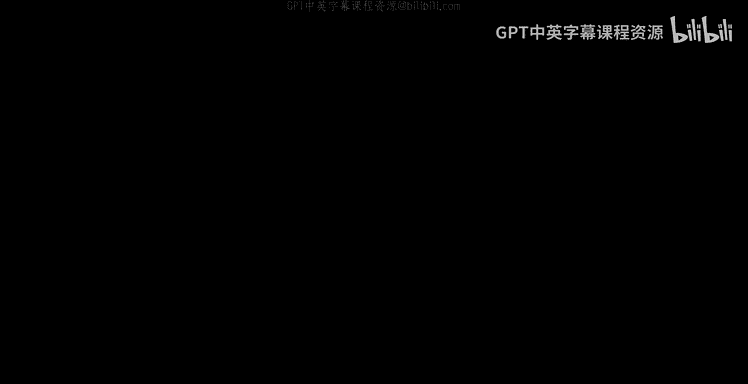
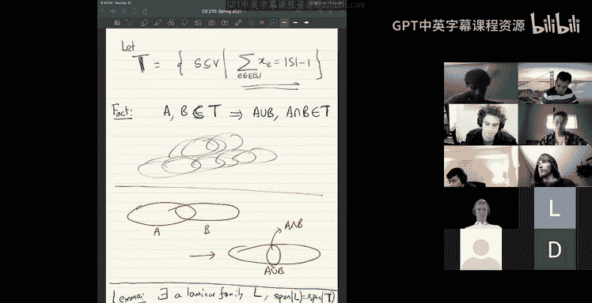
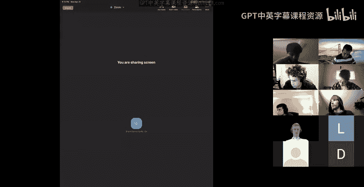
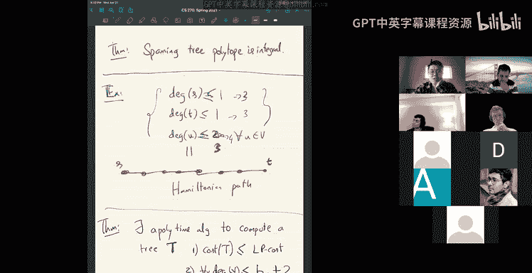
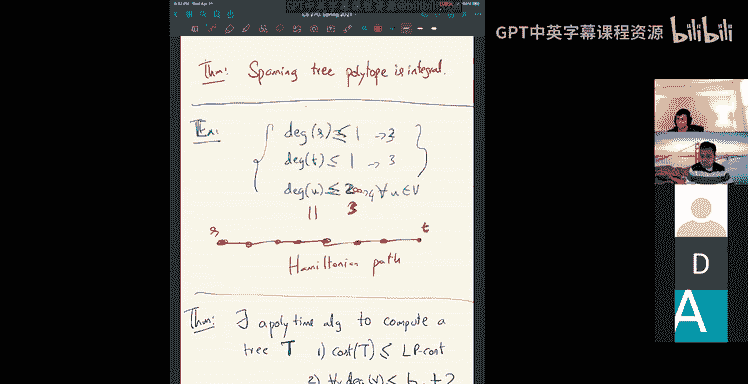
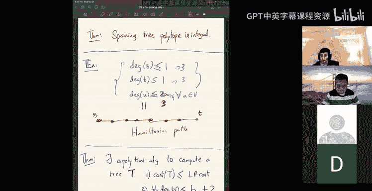

# UCB《组合算法与数据结构｜CS 270 Combinatorial Algorithms and Data Structures 2021》中英字幕 - P23：lecture 23.zh_en - GPT中英字幕课程资源 - BV1uZdpYZEwr

Welcome， good to see you all I guess we have four three or four more lectures in this class。

 so we're going to cover。I'm planning to cover two or three topics and of course we have won't have time to do anything comprehensive so but we'll sort of quickly go through a few different things so what you know after much debate one thing I think we should cover we will do today and maybe a little bit next class is。

This worst area of。Use of。Linear programming。In combbininable optimization。So。This is a。

Quite a vast area， I mean， even。Before you get into approximation algorithms for NP complete problems。

 the classic things that people first discovered algorithms for， I guess， matchings。嗯，嗯。

Spanning case。And。And things like that， these are all part of this big huge canon of work on use of linear programming relaxations for comm optimization there are literally three think the I guess sort of the。

Most comprehensive work on this is Shriver's textbooks。

 these are three fat a local or textbooks I have in my office whenever I need it。

It's literally and all of this is work。Most of it pre90s right and in the 90s there's work on approximation algorithms where they use linear programming on to get approximation algorithms for。

NP complete problems and so there's a vast literature on this so we won't be able to do any justice to anything so what I hope to do in this class and maybe a little bit of next lecture is to show you one sort of new I guess new more recent I guess I guess maybe a10 or 15 year old rounding technique which。

And we'll sort of see some of the old classic polytopes and maybe one problem and see how this new rounding technique is useful there so let's start I mean the。

Most classic example of problem in this world would be the bipartite matching。Right。

 so bipartch matching is just。You know the input is a bipartite graph。G is equal to v1 union v2。

 there are two vertex sets of size n each and then there's edges across them and of course you have some weight weight function weight on the edges。

Let's say positive weights or something， and your goal is to find the minimum weight matching。Yes。

Okay， so this is the matching M that or minimum or maximum doesn't matter， let's say a minimum。

Let's do my， let's do minimum， okay。Okay， so。I mean。

 we see the how to solve this using max flows right you can use max flows to solve this problem。

 but now we'll write on a polytope a linear programming relaxation for this so you have a。Varis。

You have one variable x sub E for every edge E， which is zero if the edge is not in the matching and one if edge is in the matching。

Okay， of course， this is always the intent， not the real。

 so this is the the intent is if zero if edge is not in the matching one if edge is in the matching。

And you have ones that。Vable for every age E in your graph and the constraints。

Spified by just the degree of every vertex is at most one， So I'm going to write it as。嗯。

If I look at all the edges containing a vertex v， if I add them up， it's at most one。

And we'll have a notation for this for now， let me call this x deelta v。This is basically。

X deta v is definition is the sum of the x sub v on the edges incident at vertex v okay x sub V and this constraint。

 you have one such constraint degree constraint for every vertex v in v1 union v2。And。Of course。

 all the ages are non negative。So this gives you the feasible region。And this is。

Let's call this point a。Polytope， which is the。It's the bipartite matching Poto。はい it's the。So， the。

If you look at the feasible region of a linear program， it will be a polytop right？The set of all。

Soutions。Will be a polytope， you know。I guess in two dimensions。

 it's a polygon and convex polygon in higher dimension， it's a polytop and。So。Right， so what is。What。

 what we want is really that the。This polytope captures the integral matchings as well as possible and in fact。

 the best possible thing you can hope for is that this polytop P is integral。

 So what does integral mean so。Is a definition。 I say that a polytope。B is integral。

If all itss extreme points。R integral， like they belong to whatever Z to the N now Z to the M。

All its extreme points are integral and what is an extreme point well intuitiveulates just this corners。

These are our extreme points here。Extreme points are corners。And you know。

 if you had to define what an extreme point is， you define it as。

Basically something that's not in the interior Okay。

 so how do you say something is in the interior well here's one definition a point X is in the interior。

Well， okay shouldn't use the word interior it would mean something else。

 let me say x is not externalremal。Not an extreme point。If you can。Sort of。第 some。

Little line around x inside the polytope。 So x is not in an extreme point if。

There exists some vector non zero vector v such that。Both x minus v and x plus v are in the polytop。

Okay， so so if I take any point， of course， clearly somewhere in the middle， of course I can。

If I take any point x in the middle， I can find a little line passing through that so that x minus v and x plus v are also in the polyto。

Okay， so I can find two points on two sides of a line。And of course， if I'm here。

 I can do that on this this way。So if this is x， I can do x minus v x plus v。

 of course it's still in only in the corners， I can't pick any line。

Such that have both sides of the line are inside the poly tool。

So you know that's the formal definition of extreme point， it's just the corner， right and you know。

It another way to access or define extreme points that you know。Like every extreme。

 this will be important for us， every extreme point。X is actually the intersection。off。嗯。诶。In。

 every extreme point x of a polytop P in n dimensions。

So if you have polytopy in n dimensions and look at any of its extreme points。

 it's the intersection of n。Hyperplanes constraints。Which are tight。Okay， so。

So right in this picture， of course， in the plane， you get a point by intersecting two lines and if you're in n dimensions。

 if you intersect n hyper planees， you'll get a point。

And so every extreme point that we care about it has to be the intersection of N hyper planes。

Right so。So， so you know， formally， you know， if you have any linear program。

 but if you have a linear program， let me say。嗯。Let's say our linear program is。诶。

So let me write it in the form that's useful for us。

 so you have a linear program that looks like let's say AIX less than equal to B。Okay。

 for I equal to1 through m or something。And then， you have。

Usually you also have x non negativity constraints。

 so usually you have X greater equal to 0 for all i equal to1 through n。Okay。

 you have a linear program like this。 So what happens now。

 any corner of this feasible region will be the intersection of。N constraints。Every extreme point。

Extud。There'll be n intersection。Constraints that are tight。这里。

Therell be N linearly independent constraints that are tight。Okay。

 so and note that when I write a linear program like this。

 there are actually m plus n constraints here， there are m constraints which are actually con usually you know the true constraints of the thing and then there are an n non negative constraints there are m plus n linear constraints thats sort of。

Define this feasible region and what we are saying is that if you take any extreme point exactly n of them will be tight and you know not just exactly n you'll have n linearly independent tight constraints for example。

 here one possible corner I mean all zeros can be an extreme point。In this example， x1。

To xN equal to all zeros。This can be an extreme point because。Could be， I mean， need not always。

 but could be because you then you would have n linearly independent constraints that are tied。

you have n linear dependent type and typically more generally what you'd have is you know you' would have some constraints like X grade and equal to  zero that are tight and some constraints of the like AI X less and bi that are tight。

 but every extreme point there will be exactly n linearly independent tight constraints。

Okay this is we're going to use this quite heavily today， so it's important to get this。ok。Okay。

Allright。就诶。Okay， so now I mean， okay， what's the first theorem will prove， I mean， it's be。

Sort of a。So here's the theorem that we prove is that this bipartite match in polytop is integral。

And whats what's the consequence of this is that if you want to solve a minimum matching or maximum matching problem。

 you optimize that linear function that you have， let's say summation WE XV over this feasible region。

Your LP can recover give you an answer and notice that you can have LP solvers that return。呃。

Extreme optimal solution。You can always make sure that your LP gives you an extreme point as an optimum solution because there's always a solution which is at the extreme point and in fact simplex gives you an extreme point。

 but even other algorithms you can make it give you an extreme point so and since extreme points are integral。

Which means you got an integral solution and she got the answer exactly。Yeah， so would be。是。

Okay so you know there this is a very easy I mean this is a very simple theorem， there are many。

 many proofs of this in particular like there are some I mean there are probably I don't know how many proofs of this。

 but know one way to prove it is why the fact that I mean max flow is integral max flow algorithm。

我 dance。Integral flows。On integral capacities。Right， you can use that to show that。嗯。

This polytop is integral and so on， but well see a different proof。

 we'll see a proof which using a technique which will extend further。So。Okay。

 instead of trying to show that the bipartid matching polytope is integral directly。

 we will show another statement which is equivalent。

we will show that here's what we'll actually show， we will show that for any weights。

 if you give me any weight function。嗯。For any weight。Weights on the ages。

 give any weights on the ages。Positive negative， it doesn't matter， but anyway。

 for any weights on the edges。嗯。You will give you an will dev an algorithm。

There exists an algorithm that。嗯。That finds a matching。M， whose cost。I is equal to the LP optimum。

An alternate way to say this is。You can always round the LP solution to get a matching of the same cost。

Okay， and。So。This implies that the corners are also integral。

And the reason the implication is true is that if there was a coer。Like basically。

 if there was some corner of the polyte， which was fractional， meaning it had fractional coordinates。

Okay， you can。Find there will be some particular weight function for which this corner。

Will be the optimum。You can pick some weights on edges so that this corner or this extreme point is the optimal solution。

And then， you know， since this optimal is fractional。

 you will not be able to find an integral matching with the same cost。So诶。So， somehow the。

If we are algorithmically finding a matching with the same cost for any weight function。

 that'll give us that in fact the polytope is integral， which is even stronger。So in particular。

 right when you say polytoppe is integral， you have the following fact that is if you solve the linear program and find an extreme point solution。

 your solution will actually be integral there's no need to round it。If the polytop is integral。

 there's no need to round it。Okay， right and that's the advantage and we're proving that by saying oh。

 actually if you give me any con solution， I mean we can actually round it so therefore we have anyway so。

No。Okay， so let you let's I'm going to show you how to do this。Find this matching。

So the algorithm is going to be the following。So。So， you know， let's say。

So let's say you have a graph G。Okay， and。Okay， what do you do you solve the LP。

You graph G and ready all the LP to get。An extreme point solution。X， let me call it X itself。 Okay。

 this is a solution with you know one。It's an extreme point solution。Okay。

 so now when you look at this solution and you know， if everything is integral you know you're good。

 you're done happy， right that's you can just output that。The what can go wrong。

 Some of the coordinates of x are not integral， right let's say's say some coordinates of x are not integral。

Okay， so if everything is integral， you are happy。 So let's say there's some coordinate x such that x sub B is actually integral。

 suppose it's zero。Suppose x subb is zero for some h E。Okay。

 what does that mean that means that your LP is able to find a matching。Without using this edgy。

Meaning your LP is putting zero weight on that LG or the even if the graph didn't have this IG。

 the Lp cost would not change。Right so what also this suggests a natural thing to try is to just delete the E E from your graph and somehow restart the whole thing。

Because。You know that the LP optimum。嗯。Like will only will not change if I remove this hegy。

 the LP optimum will only。Sa stayay the same， right won' it won't change。

So let me just remove this edge， right， So in this case， you just remove。いい。Right， or basically。

You can say G goes make G to G minus the edge E。Okay， and restart。

Restar as in you know write down the LP you know solve the extreme point and so on Okay of course it really even you implemented it。

 you don't need to restart or anything， but this is just for us to conceptually do it simply so we are we are sort of saying okay。

 if there's an HE which is zero， then we restart。Remove the energy and restart。Okay。

 so what else can happen， there's another edge which is integral， in other cases。

 there's some edge E， which is1。Okay， there's sum E， which is one and。诶。In this case。

 what do you do well the LP is actually using the search。

Right it's matching right like the X or B is one， so which was a you know。

You could match the pairtices。U and V。 So if e is equal to U V， you add a。

Edge Uv to your matching or your current matching。Add Uv to the matching。

let's say some keeping track of some set， you add UVv to your current matching and now the edge vertics UV are matched。

And you know that， in a sense。诶。Right like you can remove the versus is U andD from your graph and。

Like your LP cost doesn't change the LP was already matching them。

 so you're also matching them so the LP cost doesn't change。

 so you as well do that and restart so you say G to G minus Uv。

Remove the vertic is U and V and restart。Okay， so whenever you find a zero edge or a one edge。

 you can just restart。Okay， okay， so which means that you solve the LP and every edge is fractional。

Okay， so that's the only case we are worried about。Every edge。X sub B is fractional。Okay。

 and that's the only case。 And basically。We'll say that this case never happens。Okay。

 and how do we say that， let's see， but basically， this case never happens。So why is that？Okay， so。

 so， so okay， so let's look at。 So remember that we。I mean， in general， when you solve an LP。

 you can get solutions which are completely fractional right all the things can be fractional。

 but the key point is we we picked the solution that is a corner of the polytop。

And we're going to use that fact now。Okay， every age is fractional， Okay。

 so let's see what have how can we refute this thing？Okay， and。Let me。可以。Okay。

 so let me copy this thing。呃Maybe。Yeah， just so we can remember the LP that we have。Okay， anyway。

 right， sorry。中。Okay， so remember the LP， the LP was。X delta v is equal to this thing。

There's one constraint for。Every vertex， and then there was another constraint x sub each greater ne to  zero。

Okay， okay， so let's count。Okay， so now what do we have， We have a。What you have。

 we have x is an extreme point， which is with all fractional coordinates。aviavi。X sub B。嗯。😊。

A fractional for all。Faw letters。So now let's see。All right so。嗯。Okay， so。You know， how many？

Like H since x is an extreme point， it needs to have tight constraints， it needs to have exactly。

E tight constraints。诶。And so let's look for these tight constraints。

So clearly these constraints are not tight。W they not tight because we know that the only way they can be tight is x sub be equal to 0。

 but you we know that x subB is not equal to0， it's fractional， it's some fractionction。

 so these are not tight。So only constraints that are tight come from here。Okay， so you know。

 let's just say let W be the set of vertices for which set of vertices for which this constraint is tight。

 what does tight mean the type means that you know this is actually equal to one。

Right meaningan this quantity。The sum of the edge values is actually equal to one。Okay。

 and what do we know， well， you need to have as many tight constraints as the number of variables。So。

 therefore。The size of WE is equal to size of feet。叫你度 o。All right。

 so now how can these constraints be tied？Okay， firstly for。Every vertex。You look at any vertex。

V for which the constraints are tied， what is it saying the sum of the these values is equal to  one？

The sum of the age values are equal to one。And so you need to have at least two fractional values。

To adopt one。You can't have only one fractional value right because you need have at least two fractions to add up to one so therefore for every vertex in this tight constraint。

Like the degree。Of the vertex v is at least two。Right so the degree of every vertex in this is true because。

Because sum over x sub E E incident on v is actually equal to one。

 and you need at least two fractions to add up to one you cant。Okay， so okay， so now。

So if the teeth some diss at least two， okay， that means that。连。

So if I write down then what is the total number of edges in my graph？Okay。

 the total number of edges in my graph is， of course the sum of all the degrees。Right in my graph。

Okay， some of all the degrees and this is at least the。Oh， that is it's a。Well， okay。

 two times the number of edges is at least this are sum of the degrees， right because every。

Every edge is counted twice。Okay， and some of the degrees is at least what。Well。

 it's at least two times W。Because。Every vertex in w has degree at least2， this is at least2 times w。

 actually at we。Make it more clearer， say this is some， at least a sum degree。The W， this is。

At least two times doubleubling。Okay， so things are getting more and more tighter right now。

 basically what's happening is。Like how you you start with asking okay how can all the ages be fractional and you say。

 okay you know so what's happening is things are getting tighter and tighter now so what's happening now well you have this2 e is at least2 w but we already know already know e is equal to W right therefore these are all equalities。

Okay。So in particular， what just happened is that。We concluded that for every vertex in W。

 the degree of v is actually exactly equal to 2。And for every vertex not in w。

 the degree is equal to 0。Okay， that's like it's sort of。

Like that's the only way these equal can hold。Okay。Okay。

 so really the solution has to look something like this， you have some vertices。

Like it's a bipartted graph， you have some where to sees and then。Like， let's look at only the edges。

 every edges。Factctional， average is fractional and every degree is2。

 So which means it's like a degree2 graph， right so。I don't know， degree2 graph。every like， I mean。

 basically。嗯。If every degree is two。嗯。It's a union of cycles。

A graph with all the ver degrees or two is the union of psychological review。

Sort of start at a vertex and start walking， you enter a vertex in one edge。

 you leave the vertex in other edge and you exhausted all ages you never come back so it's sort of I mean the only way I mean this can happen is you just have a union of cycles so this is how your graph looks like。

Okay， okay， so now。ok， so now。诶。What and then of course there can be some number of zero like edges vers of degree zero right there are vers of degree0 and ver of degree two。

It is how it looks。Okay， if it looks like this， now what's the issue？Well呃。

Note that everything is super tight now， like you know。

 the number of edges is equal to w and then all these inequalities are tight。Okay。

 so now what's going to happen is if I look at the left hand side。Remember that the left hand oops。

The left hand side。This is v1 and the right hand side is v2。Okay。So basically。

 if I look at the left hand side and add up all the。X delta v。I claim that it's equal to。X delta v。

Where V is on the right hand side。That's just because the sum of the like if I add up all the constraints and what I'm doing is I'm adding up all the constraints for the left hand side vertices。

What do I get I get some of all the ages。This are some of all ages。

And then if add up all the constraints on the right hand side ver this is again。

 I get sum of all ages， so these two are equal。Okay。

 so what like this is what's wrong here is that there is one linear dependency now。

This implies there is one。Linear dependence。On the con like one linear dependence。

 So the number of linearly independent constraints。

So the number of linearly independent constraints is actually not w， it's actually atmost w minus1。

Because you had W constraints that were that you had that you had to work with。

These are the tight constraints and the number of linear independent is at least one less it's a w minus1。

So therefore， the number of linearly independent constraints is smaller than the number of edges like you can't。

Therefore a contradiction， right？嗯。Contradiction。Because this implies that the number of linearly independent constraints is smaller than the number of edges。

So。So I mean， basically， what happened is just that if I look at an extreme solution。你。

We looked at an extreme solution and we said。If one of the XB is zero。

 then we can remove it if one of the XB is one you can add it to the matching so you keep doing this and only case you're stuck with is when they are all fractional。

Which means all and then。We showed that you can't have all fractional because you don't have enough linearly independent constraints to have。

To to be at the extreme point， like to be at the extreme point。

 you need cardinalality of E linearly independent constraints and what you have is cardity of E minus1 at most。

So that's why。嗯。It''s a kind of a rank argument， but really using the fact that。

X is a cognitive solution。Okay， okay， so that's the So， So we proved that。You get a matching。Okay。

 so。Okay， so bipartrate matching is good， so one what's the next interesting thing to do is spanning trees。

Okay， so here well see something。Spanning trees and then of course we'll first let's write up LP for spanning trees and then we'll build on it。

So again， pantry polyde is really。诶诶。It's a。It is good。

'sSo let me write down a spanic trip poly this is called the subtu elimination LP so what is a sub2 elimination LP so it's the following so what do I want I have variables again x or B。

For equal to one， if e is in the edge。And0， otherwise。Okay。

 so that's the usual thing sort of eating a tree。E in a tree and then0 otherwise。

Okay same thing Now what are the constraints， so constraints are as follows。Okay， some over。

All the edges inside are set。Is at most coordinate of s minus1。For all success。

So what is the saying if I pick？If I pick any K vertices。

In the graph and look at if I pick any K vertices in the graph。

Let's say any five vertices in the graph and look at the edges I pick inside these file。

I should not pick more than four edges here because if I pick more than four edges。

 I'll have a cycle。诶，ちど。Like because there are no cycles anywhere in the tree。

For any subset of k vertices， I have at most k minus1 edges inside them。

So for all subsets of vertices。The number of edges inside the subset is at most the size of the set minus1。

So this is actually， you know， as I've defined it， it's exponentially many constraints。是。

Right because you have one constraint for every subset。For every subset， you're saying yeah。ok 啊。嗯。

Okay， so this is good I the only thing issue now is what if you pick set all the xbs to zero right you're forcing me to pick fewer and fewer edges so I won't pick any edges。

Right so I need to sort of。Fix that so let me add another constraint if I you have to pick at least like over all the edges in the graph。

You have to pick at least exactly v minus1 edges。At least so let's say be minus1 exactly being minus1。

Okay， so this here to pick exactly we minus1 edges and if you pick any subset of essay is the number of edges you see it should be one less than the。

Yes， some of this。Okay， so this is a polytop。And this is actually。This polytop is integral。

So I guess this is a theorem， so let me let me just say if you define this， this as spanning clip。

Well， what happened here？Okay， so the theorem is， of course， spanning three polytop is integral。

And this is another way to compute panries， of course quite inefficient， but it's also， I mean。

 there is a separating oracle for these exponential many constraints that you can construct but。

And then you can use the lips or algorithm or whatever and can do it， but okay so。

So you can prove that the spanning tree polytoppe is integral using the same kind of iterator technique that I mentioned。

But since we don't have that much time， let's leapfrog one step further and look at a slightly more interesting problem or a slightly more non trivialvial problem。

 that would be the bounded degree spanning tree。So the algorithm and the proof will be still very similar but let's just directly go to the next step so what is a boundaryed degree spanning tree problem well I for every vertex I'll give you a bound on the degree。

Okay， so。So let me write it。です。Some bounds on the degree， so。And write the bound directly。

 So what you have is。This is the degree of a vertex， it's at most some bound v sub v。Okay。

 and let's do something more general for the moment。 Let's say you have this bound on the degree for。

Like some subset oftices。ItJust you it'll be useful for us later on。Okay， so。So this is the key。

Right， so I have。Bounds on the degree of some subsettices。 Now。

 note that this is an extremely hard problem right now， why， because。You know， for example。嗯。

If I say， like example， if I say that the degree of a vertex S is1。

Is at most one degree of another vertex t is at most one and degree of every other vertex。

Is atmost two。Okay， if I put these bounds like。S has degree at most one， t has degree at most1。

 and every other word x has degree at most2。What do I get Well， I am asking for。Essentially。

 a Hamiltonian park。Right， because。You know，S has to be degree1， T has to be degree1。

 and everything else is at most degree2， so the only tree with all the words is being degree2 is a path。

And since it's a spanning c it has to go through every vertex。

So this is just exactly the same as the Hamiltonian problem。

So clearly this problem is super hard once you put in the degree bounds， this problem is super hard。

Okay， so what can we do now， We'll do something which is quite surprising that you can even do it。

 We will。Here's a theem Bill show。Will show that。There exists a poly time。Otherton。To compute a tree。

比。Okay， says that the cost of the tree。Is at most the cost of this LP or Lp cost？

Which is basically optimal， the cost of the tree is optimal。

But we will violate the degree bounce a little bit。So the degree of a vertex for every vertex。

 the degree of the vertex。For every vertex， the degree of the vertex in the tree。Will be。You know。

 it won't exactly be。Bounded by B sub B， but be bound by B sub B plus2。Okay。

 so we'll violate the degree bound by atmost2。The degree will be。

 but the cost will be as good as the best。As the best tree with the degree bounds。Okay。

 so we are relaxing the degree bounce a little bit， but we get the same cost。Okay， so for example。

 if you ran it with this Hamiltonian path thing， you will get a tree whose cost is at most the cost of the Hamiltonian path。

But its degrees will all be like。I guess the degree of s will be2 and degree of t will be a degree of s will be at most three。

 three， and this will be at most four。Okay， so was slightly value the degree。Okay。

 and this is what I think we'll see now。But， you know the。

You can actually improve the argument that we'll see today to get violation by one here， actually。

 you can get Bv plus one。It's a little bit more hard work you can do Bv+ one。

 but we'll do Bv+2 today。O。SoBut Pv plus one is not like an L poster reference to ethics。All right。

 so the strategy will be very similar to what we already。So for bipartite matching。Okay， so。

All right， what is the， I mean， I guess the like our algorithm will be like。I mean。

 you can call it a leaf finding type algorithm， but。Leeaaf finding or yeah。

 let's see what the algorithm is。So you know， like while not done。

 I mean we'll know when we're done so I'll just say while not done so what do we want to say we solve the LP。

And compute an external solution。Compcuter X， which is an external optimum。Which is a coal。

 basically。Okay， now what are the cases？Well。Okay， actually， let me。Right now。

 say what the LP is a little bit more。So we had the LP here， right， so this LP。Has。

What other things here？Well， the three parameters here really in this LP。

Let me call this LP something， it's LP， well the three parameters are firstly the graph。Okay。

 then the vertices w on which there are degree bounds。Okay， and then the。Deggree bound themselves。

 the BVs， let me call the Bv。We call the vector B B， actually。B。Okay。

 so graph then set degree bound and so on。 The reason is because we'll start modifying the graph like deleting a edge and everything lets so what you did was you solved LPGV。

嗯。It all。LP。GWB。Okay， and you compute the external solution。All right， so firstly， again。

 if some edge is zero。That means that you may as well remove that edge from the graph and restart。

Okay， then restart the whole thing。Whatever you're doing on LP， whatever， like G minus E W D。

So if some edge is zero， you're basically go forward。Okay。And then。Okay， so。TheAnother thing is。Okay。

 so now basically there are no zero edges， like when you solve every edge has a non zero value。

Imagine there is a vertex。Which has。Only one non zero value from it。Okay， so suppose。

Suppose vertex v。Has。Deggree。Equal to one。Meaning it has only one non zero edge。Okay。I mean。

 all right， there's only one edge going that believing that vertex。

 then you have to make that vertex a leaf， right？So let's just make that a leaf and restart the whole thing then。

Let's say Uv is that edge。Okay， if Uv is the edge。Is the edge， then what do you do， Well， you just。

Make v a leaf right like add Uv to your tree or whatever right Uv add Uv to the tree。Let's say啊。

Like we're building the tree， I guess the forest one edge at a time now or something。

 so we're going to add UVv to the tree。Okay， that's one thing and then you need to delete the vertex v because v is no longer important。

It's a leaf now， right so say G is G minus v。And then what else do you need to do。

 you added one edge leaving u right so the degree bound for b the vertex u is should one lower so you said。

I don't know， B prime is equal to。B prime u is equal to B U minus1。

just to keep track of the degree and then you say， okay， let's restart whatever， right restart。

P start on。On GBF or GB prime F。Or G minus v or B prime so G minus v。W and。V brand， Okay， that's。

Yeah。So these two cases are easy。Okay， so what's the third case。

 the third case is quite something very clever。So the third case says， okay。

 these two don't happen now imagine there's a vertex for which the degree is u most。3？Okay。

 if there's a vertex。Suppose there exists a vertex v。So that the degree of this vertex is3。Okay， now。

What we can do is we can just drop the degree constraint on that vertex。Because， you know。诶。

The degree constraint is going to be at least one right because we're still asking for a valid tree。

 the degree constraint will say， you know maybe it says give me degree one or degree two。

But if I just drop the degree constraint and don't worry about the degree of that vertex。

 I'll violate the constraint at most two。Makes a drop。

The bound like the you have the bound rate summation x sub V， E in V。Is less than B。BV， right。

 you have this LP constraint。Just drop it from your LP and you restart。Basically。

 restart with an LP with one fewer constraint。Okay。

 so in some sense you do this or this or this and you know。

I keep sort of restarting the LP every time and note that every time you restart the LP you will get a solution of either the same cost or something lower。

 so you're not increasing because like in the first step LP did not even use the HE so removing that edge has no no effect on the LP。

The second thing also you know LP was using the EE and it was using you know exactly one of that so removing that。

You know it's fine and the third thing you're actually taking a constraint that the LP had and you're dropping it so the LP if it's a minimum cost spanning tree the cost will only decrease it will be even better because LP is less constrained so when you repeat this iteratively these steps you're fine the only problem is you're stuck。

The only problem is repeat this procedure and you end up with a solution write a graph。

And an X says that neither of these cases is true。Neither case one， two or three is true， okay。

 and they will prove that that's not going to happen， that's a contradiction。Okay。😊，Okay。

 so let's see why that's the case。Okay， again， we will use the fact that x is an external optimum。

 so because x is an external optima。Right。There are at least。系い。

How many tight constraints were at least cardinality of。二。Tight constraints。

Like we need at least this many tight constraints。Right， because x is optimal。

So okay so so let's look for these tight constraints so when you look at this LP now there's something very subtle we need to do。

Okay， we're going to look at tight constraints here。Unlike a biparted graph case。

We have these exponentially many constraints sitting here。Okay。

 like there's exponentially many constraints。 you know。

 you can say oh some n of them or M of them are tight like you know their equal。

 So what do we do It's going to be problematic so。So， here's the。So。

 let's try to understand this tight constraint so let。嗯。Like let's say， I don't know。

 let's call it T。第。All right， let me see。Yeah。If we already used that。

 so let's say T is the set of sets S。Such that the corresponding constraint is tight。

What is the corresponding constraint， if I add up all the edges inside S， I get S minus1。Okay。

 so so these are these。These tight constraints。 So these these。嗯。Cycle contrain constraints there。

 and we're saying， look at all the sets that are tight Okay， Okay。

 now let's try to understand the structure of this。Here's a。

Here's a fact that's going to be true is that if a is a tight constraint and B is a tight constraint。

If A and B are tight constraints， then a union B and a intersection B are also tight constraints。

Okay， this is a fact。好 so你。So let's move on from fact to fact and we'll come back and see how much depending on how much time we have will come back and see the proofs Okay they're not very hard just well know Okay so what does this tell you Okay so now basically here's the situation right so just to explain what's happening so you have exponentially many sets。

These are all the sets of vertices。That can all be tight。

 tight as in the corresponding constraint is tight。Okay。

 and what this lemma says is that if A B are tight。

 then a union B and a intersection B are also tied。Okay， and what this lets you do is it lets you。

Do an operation called uncrossing。So what's happening is you have two sets a。Be that are tight。

You can move to。A union笔。And a intersection B。They're also tight。

So basically if there are two crossing sets， you can go to the uncrossing version。

 like you can go to a union B a intersection B。Okay。

 and so using these sort of movess from two crossing sets to two un crossing sets。

You can get to what's called a La inar family。Okay， what is a laminar family。

 a laminar family is a collection of sets。It's a collection of sites。Right。

Sas that there are no pair of crossing sets。Collection of。Sets。Such that no pairs cross。Right。

 so what is cross， Let me say what crosses cross is really that。E and B cross if they intersect。

 but one is not contained in the other。If A A and B cross。I mean by cross。

 I mean that a intersect B is non empty。But。You know。

 A is not contained in B or B is not contained in a。Okay。

 so it's like really like crossing So in particular a laminar family。

 if you try to draw the whenn diagram of a laminar family， how will it look Okay so。

So how do how will the Ven diagram look well you need to have let's say I have one set Okay。

 the next set I can either put it inside or I need to put it separately right so I can I can say okay it's here and the next set I can either put it inside or separately so I can do it here。

And I can do here， I can do here， here。😔，Here。Here here， so I can never two things cannot cross。Okay。

 and so you can see that as you draw it， the sets are actually getting smaller。

 you cannot have some of sets of the same size because you have to draw smaller and smaller things that don't intersect。

And in fact， you can imagine think of a laminar family like a tree if you want。

 like you can think of this as a tree。Like there's a big set and then there are two smaller sets inside。

And then there are two smaller set inside this and there's one smaller set inside this and there's another。

 I guess not a tree but a forest。But， but you can yeah。

It's a forest you can sort of think of as a forest。

And where the leaves are the smallest sets in your tree。Okay。

 so what that means is you cannot have too many sets in your Laar family。

Right a laminar family can have utmost。Here's a， I guess he's alemma actually called a theorem。

A lamb in our family。And。ken how。At most。How many sets can I have。嗯。Well， I think you can have。

2 n minus-1。Okay， it can have2 n minus1。Okay， if you。Like I think a binary tree。

 I think like you sort of make a binary tree and then the leaves are your elements then。

Like you have2 n minus1。嗯。But a laminar family without single tens。With no single concepts。

Meaning you cannot。You cannot have sets of size one。This has to have at most n minus one things sets。

嗯。Like， you know， I think to construct like a la from the n-1 sets， you know， it can do。Like。

 you know， you have。And elements。我惊人定。You take a subset of the。

Like this is one through n and this is1 through n minus1。

And then you take another subsetid as1 through n minus2。And you go and then you will left with。

 let's say， one and two。Okay， this is a laminar family of sets。

 no crossing and there only n minus1 sets and this is the best you can do。

 you can't pack any more sets so basically a laar family with no single ten sets is at most n minus one。

Okay， so okay， so where are we here， we started with understanding the tight constraints of this LP。

 which constraints are tight in general there can be exponentially many of them but。

What you can conclude is that。嗯。Heres a it个 a key了ma。Which嗯。Is that you can。

There exists a laminar family。And。Okay， such that the。

Somehow they span the same set of constraints at T spans， so span of L is equal to span of T。

So although there are exponentially many linear constraints。

 there is only as many linearly independent constraints。

 I mean of course you cannot have exponentially many linearly independent constraints because you can only have like you know coordinate fee linearly independent constraints。

 but in fact the number of linearly independent constraints is at most the size of a la inar family so in fact the number of linearly independent constraints is equal to。

Like the size of some laminar family oops。

Where we。Yeah。So， this is a。嗯。Like， so therefore。历历你。连。I guess the dimension。我啲。

The dimension of the span of。The linearly independent type constraints is at most the size of the Lamar family。

 which is n minus1。Sorry。Is at most n minus1？Okay， so so okay let's keep ahead of this and we'll come back to see if some proofs here if you want later。

 Okay， so okay， so this is okay， so now we are just understanding how the tight constraints here look like。

 we see that this can at most contribute cognitive v minus one tight constraints。

But just by this laminar family business。Okay， also actually I should include this and this together。

 right I mean these things together can be capital be minus1。Okay。

 so now really the only things are these degree constraints。Okay， how many of those are tight？哦。Okay。

 so let's see how many what's happening there？So。Okay， actually。

 sorry let's go back and we assume that we are stuck， right， let's you know。

 we assume that we are stuck we mean none of these work。So let's look at the degree of every vertex。

Okay， firstly。For all vertices inside W。We couldn't apply this thing here。

Like we couldn't have use the case3， we couldn't use case3， which means the degree was at least four。

Deges at least four。This implies degree of vertex in the w is at least four because it was three。

 we'd use case3。Okay。And now what else for all vertex vertices other than like just any other any old vertex。

 the degree is at least two because if the degree was one， we'd make it a leaf and would continue。

So every vertex， the degree is at least。く？Okay， so that what is the total number of edges。

 say for the total number of edges is。At least。I mean， half the sum of the degrees。

half some of the degrees of vertices。And what is that， Well， it's at least half。

I guess I'm going to write four times w。Plus2 times n minus w。Okay。

 so the total number of edges is at least。What is it， so it's n plus w。

 the total number of edges is least n plus w。And therefore， we need。

At least n plus W tight constraints。Right， because you know。

Like we need at least one tight constraint for every edge because that's where we are。Okay。

 do we have n plus w type constraints？诶。Let's see we have n minus one tight constraints from these ones and we have at most W tight constraints from here。

You can have utmost w type constraints from the degree。And。嗯。We need at least this many。

 but there are ut most。Like w。Dgree constraints that can be tied。

Because that's the number of degree constraints we have。And then。

We already by this laminar family business， we said that the number of linearly independent set constraints is at most n minus1 sorry I'm just。

Okay， I think I should stop writing in the next page。 Yeah， is that most n minus-1。诶第。

Lineally independent tight constraints like。Tight， linearly independent。

Constraints from this Laar family。From this Laar family。

So basically the total number of tight constant is n minus 1 plus w。Okay。

 which is smaller than n plus w。So it's a contradiction。

 so meaning you don't just don't have enough tight constraints to be stuck。If we cannot be stuck。

So therefore， you're always in one of these three cases and you can just keep making progress。Okay。

 so that's sort of the argument。嗯。嗯。Yeah， so。嗯。So it。It。Yeah。

 I mean it's quite a simple algorithm and you can。That is， you know。There's a modification of this。

Algothm which which you can do to get degree plus one instead of degree plus two。

 the reason we got degree plus two is we sort of started throwing away constraint when the degree was at least three。

you should only throw a the degrees at least two， but you can do it。Yeah。

So this technique is called the。It's called the iterative rounding technique。 I mean。

 the if you think called look at linear programs the。

Like one natural rounding technique I guess we see is randomized rounding randomized rounduting is if you look at a vertex if it's half then you say with probability half you just add it to the you know add it and with probability half you don't add it and you do it independently or whatever this technique is what we're seeing is iter to rounding you find something which is close to integral in your solution and you make it integral you just fix it and then you repeat re the LP。

嗯。And it turns out that you can actually。Pro repro lot of the classical results in combunral optimization using this technique and you can get you know。

Approxximation algorithm， also some of them， like for example， this one。

This is an approximation algorithm in the not in the factor sense。

 but in the sense that you relax the degree by at most one right。

You got a tree which is slightly weaker， but with the same cost。嗯。And。え。

If there are problems for which you can get actually approximational algorithms in the usual sense using itator rounding and there the idea is you solve the LP。

Okay， let's say you saw some vertex cover LP， actually， you can even do it for vertex cover。

Let me see if I can。Okay， I'm pretty sure we can do it， but let's just try it anyway。

 maybe I'll fail， but let's try， Okay so but okay， so what's the。

I'm sure many of you have seen vertex cover， right so I'm just going to write it right away。

 so I'm going to write an LP for vertex cover。the standard LP and try to round it using I try to round it okay so let's see if this works so for every edge E for every edge E could to Uv you have a constraint that x U plus xv is greater equal to1。

And then， of course， X。Is that most one， I guess？XU is at most one。嗯。Yeah， and then for all vertices。

Yeah， is that most one or zero？Okay。Now， and then there's some cost right。

 I want to minimize sum mission W E U X U， okay。So what is my trait to rounding idea。

 I mean it's going to give you the same answer， but let's just try okay。

 so the it rounding algorithm would be。Okay so。What do I do， I solve the LP。And。

If I see a vertex whose value is at least half。Then I set add it to my vertex cover。再嚟啲。Suppose啊。

X sub v is at least a half。For some vertex。嗯。For vertex v。Then， add it。To the color。

Add read to the color。And repeat。Okay。I mean， of course note that some of these statements。

What do you say taological because really actually what will happen is in one step you'll get back the verex cover itself like even when we said this bipartrate matching thing I said oh if an edge is zero or1。

 add it to your matching or remove from the matching when you actually run the algorithm and all edges will be zero or one because the whole thing was integral and youll just do it in one step you don't need to even do anything but the way we're proving that all ages zero or one is through this algorithm。

We actually do it， yeah。Okay， so in this case， actually even vertex code if you solve the LP。

Once you add all the vers， which are at least half， you get the verex score directly。Yeah。

 now I guess we need to prove that。Every word。What do we need to prove， we need to prove that。

You're never stuck。But you're never stuck。嗯。It's sort of clear that you're never stuck in if you use the constraints of the LP here。

Clearly， you know， if we' had some edge。Has to be covered either this endpoint or this endpoint has to be at least a half。

 but。嗯。I mean， that's clearly true， so obviously this algorithm works。But I think also the。

I'm thinking you can prove this。You're never stuck even using that dimension argument that's what I're trying to do it're trying to prove that this works even like the the argument that we had here。

 these are all dimension arguments as in your counting the number of linearly independent constraints and seeing how they are right so solve LP to find an extreme point。

And I think you can through that in an extreme point by dimension counting。

 by counting the number of tight constraints。There has to be at least one coordinate。

 which is a half。嗯。Right so clearly all the coordinates are fractional because then if it's zero or if one of them is zero or one。

 I can just。Repeat， right？Yeah。そ so。I mean， it's yeah I mean， okay。

 there is a I mean it's true that dimension thing is true， but okay， let me just do it anyway。

 so so we need at least of E tight cognitive V tight constraints。

Because that's the number of variables。Okay， you need at least cognitive V tight constraints。

 how many tight constraints can be there？These can't be tied， they are not tied。Okay。😊，And then okay。

 I'm cheating here。诶， she利 say。These also can't be tight。It's a bit cheating， but。Yeah。

 these also can be typed。Because if the values are all less than one half。It can't be tight。

 but it's sort of a sorry it's a bit of a triviality， but in this case。Yeah。But anyway。

 so going back， basically you can prove， okay， like I think， you know。

 this is sort of true trivially because。Can't even have one tight constraint if all the values are less than half so。

Yeah。But you can prove any like you can even get approximation algorithms using this technique。

 I guess one of the famous ones is。Network design problems。

 you can get a factor to approximation by doing this thing where you say solve the LP。

 go to an extreme point， there'll be one edge or something which will be at least a half round it to a one。

And you lose a factor two and you repeat and you use the same sort of dimension counting arguments to show that you're never stuck。

Okay， and I think that's what。Yeah。And the next class we'll talk all about matchings。

Just in graphs but in non bipartted graphs。I think it's stop here。你个 question。Thank you， Professor。

Pro yes the for the spanning trees LP， how hard it is to get the Hamiltonian path if you have like the approximation right。

 like if the cost is equal to the LP cost and。The degree is like Bv plus one。

 like the one you mentioned。Or B plus one。Oh， you mean finding a minimum boundary degree spanning tree where。

Like so you can getting B plus one here or yeah B plus one you can do it。

 I mean it's they can do it in polynomial time is that the question。

Yeah so like if we can get the a polynomial time， then like approximating the current Hamiltonian part like if we give the the bound as the example then yeah yes you're saying like okay we got B plus one here we got three here and how hard is it to go from three to two yeah I guess it turns out to be NP hard I mean the reason is basically because even on degree three graphs Hamiltonian part is NP complete。

Like even if I told you， even if I gave you a graph which is already degree three。

 so mean you can never like you know it's basically almost a Hamiltonian part plus a matching。

Even on those graphs it's it's an Hamilton I problem is NP complete。 So that's why yeah。That's。

 in fact， the reason why going from Bv plus1 to exactly B or these Hamilton parts is still emptying complete。

Not just MP complete， it's。嗯。Like no approximation at all。 Like so it's extremely hard。

 like no approximation at all。Yeah。Thank you。

嘿。Hyro。

