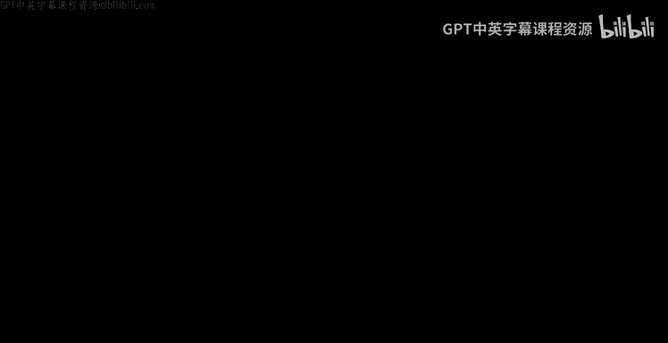
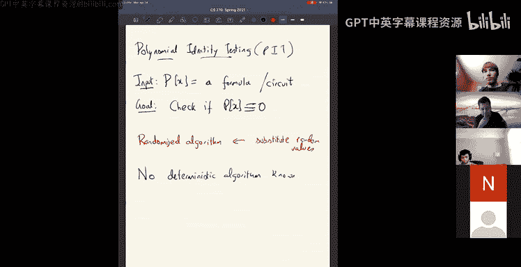
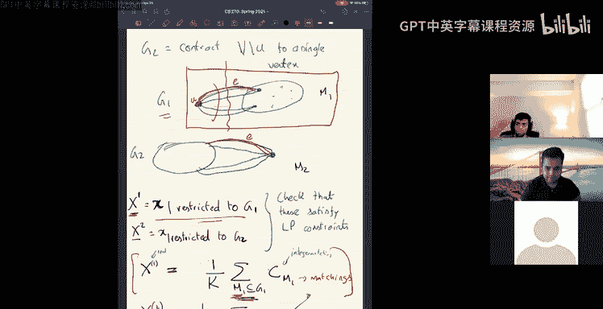

# UCB《组合算法与数据结构｜CS 270 Combinatorial Algorithms and Data Structures 2021》中英字幕 - P24：lecture 24.zh_en - GPT中英字幕课程资源 - BV1uZdpYZEwr

Welcome everyone， good to see you all today， I guess this is the last week of classes。

 so today we'll talk about matchings in the next class I'm planning to talk about property testing and so in the beginning of this course I think we had to skip a lecture because theres some power cut at home。

And so we promised ourselves that we'll do a makeup lecture。

 so I'll have a lecture next Monday the same time as usual， of course。

Like lots of things left in this class it's optional but yeah。

 so that'll be the last lecture next Monday。And on Wednesday。There is。

 I think HKN will come to the lecture to。Do course feedback actually in this case they won't really come to the lecture they'll have their a separate zoom link which I'll post on Piazza and that'll happen right before the lecture so maybe at 510 and we'll start the lecture 10 minutes later so they at 520。

Okay， so let's start。It。Okay， so。So today we'll talk about matchings。

 so you know we all know what matchings are and we saw algorithm for matchings。

For bipartite matchings in the last lecture。So， you know， matchings are really。

 they're really like a。You know， in some sense， the like a cornerstone of algorithms， right。

 so because。Like to what like people。Is one of the earliest problems for which。

One of the earliest combinator problems for which the algorithms were designed for the Hungarian algorithm and algorithm by based on augmenting parts。

 these are very old。In fact， the notion of polynomial time itself， right even the definition of P。

我出 say。When is an algorithm efficient， nowadays we say。

An algorithm is efficient if you can solve it in polynol time in the size of the input。

This definition。came out of you know it was first concealed by Edmunds and this is after the algorithms for matchings were discovered。

 you know you discovered new algorithms for matching and then you don't know in what sense is it better than just doing a routete for search and then the definition of polynom time itself。

Is dates back to early work by Eddms where he sort of conceived that oh。

 you could measure the runtime based the size of the input even that wasn't clear at a time right this is is a time when it wasn't clear how do you measure the runtime of an algorithm and as a function of the input in pi notation is all obvious right now but it wasn't at the time and it's a really old problem and there's a lot of you know books written about it and it's all over the place so but。

Today， we'll look at a couple of different approaches for the problem。 So first。

 we will look at polyhedral approach， So or LP。LP or polyhedra。

And we already saw a linear program for bipartite matching。

 but now let's look at the more usual thing， which is the perfect matching in a general graph。

So if I give you a graph。嗯。And G。Okay。Right， forgive give you a graph。

 then the perfect matching would be。So this graph doesn't have a perfect matching clearly because only five vertices。

 but if you a perfect matching is a set of edges such that every vertex is incident on one edge and no pair of edges share a vertex okay that's what a perfect matching is and so you know if you write a linear there's a linear program that you can write for the set of all perfect matching。

So。So here's what you would want to do。So here's the poly top。

 so your variables or your domain is really of course， your graph is always。G equal to v comm E。

And your variables are x sub E。Where E is an edge of the graph and you know， x or B， the intent。

 of course is all as usual， x or B is one if E is in the matching。And zero otherwise the。Okay。

 that's the intent as usual。 And now you start writing constraints。 So what are the constraints well。

Of course， firstly， x sub B is great equal to zero for all。Its。Okay， and。

The degree of every vertex is one。So if I look at x of delta of v。

This is notation for some over all the edges incident on B。This should be equal to one。

So every vertex participates in exactly one edge of the matching。Okay， so says for all vertices B。

Okay so this is what we wrote for bipartite matching and this is sufficient for bipartite matching。

 but when you look at general matching in general graphs， this is not sufficient， for example。

I guess。嗯。就。So if you look at the triangle。If you look at the triangle。

 I can assign half to every vertex。Every age。Okay， if I assign a value of half every age。

 of course you satisfy all the。Dgree constraints for every vertex， the sum of the edges is one。

So this linear program is feasible for a triangle。But there is no matching in perfect matching in a triangle。

and so you need additional constraints and you know。

The additional constraints you add are called offset inequalities。

 they come from you know these are derived from the combinatorial graph theoretic theorems about when a graph has a perfect matching so for example for bipartite graphs if you go back to classical graph theory without linear programs a biparted graph has a perfect matching if and only if it satisfies what's called the hallse condition and there's a corresponding characterization for when when general graph has a perfect matching and's that's called the too characterization。

Yeah， and but you know， the constraint I'll write on just the constraint it's called the offset inequality。

So offset inequality is something like this。It is。咁。For every set of odd vertices。

 for every vertex subset of vertices v， such that there are odd number of vertices there。

For every odd set of vertices。At least one edge of the matching should leave the set。

Right this has to be true。 So if I add up on all the edges leaving the set。So， x delta of view。

Is the set of edges that leave the set so。Yeah。E leaves you。

So one endpoint is in you and another endpoint is in is outside you。Okay。

 this should be at least one。So this makes sense right because for example。

 let's say if this these three vertices are part of some。Other bigger graph。 Now， we know that。

We know that if you。Look at this set of vertic is U。There has to be some edge here。

That some edge of the matching that leaves them because there are only three vertices here they cannot all be perfectly matched amongst themselves at least one of the endpoint vertices inside the set has to be matched to something outside so therefore for every set of vertices u such that u is odd。

You will get that at least one edge is leaving you and that's this。So as you can see。

 this is exponentially many constraints for every odd set， this is one constraint for every art set。

This is exponentially many constraints。嗯。And there's one for every art set。

But it is possible to design a separation or recordle for this exponentialon linear program so you can solve it using eipard algorithm。

 but they're also you know。Combininatorial algorithms to solve maximum matching and so on。

 so but if you want to use the ellipide， you can use it by constructing a separation record for these exponentially many constraints。

Okay， so this is the polytope now for us。So these three constraints together。

Are these three families of constraints？Define a polytop。

And that polytope is going is actually the theorem is that this polytope is exactly the perfect matching polytope。

做。铁름。嗯。All the extreme points。Of the of this polytoppe， of this。Polytop， let me call this polytop。比。

All extreme points of P are perfect matching。Okay， so in particular。

 if you want to solve maximum weight matching just optimize that linear function summation W X subb on this polytope and you will get the maximum matching exactly。

So let me try to quickly sketch a proof of this fact。And let's hope。So。

I'm going to sketch a proof of this fact using the same technique we did last time which is iterative rounding so we look at an extreme point and try to simplify it okay so what's the claim we want to prove you want to prove that all extreme points of P are perfect matchings alright so let's say there is an let X be an extreme point or let's find the minimal graph。

Let G equal to v comma E。Be the smallest graph。Smallest graph in what sense。

 let's say I don't know in terms of the number of vertices plus number of edges。

It's the smallest counter example to the theorem。The the smallest graph such that。三诶。Seet off啊。

Some assignment， X。In a the。Yes。An extreme point。That is not matching。Okay。So let's。

 let's say you have the small G B， the smallest graph says that you have an extreme point。

 that's not a man。 Right， So how， okay， what what can we say about。嗯。X a B， well we right。

 So when we say a matching， we really mean it's a it's not a matching as it's not a indicator function of a matching so。

If I look at x， I want it to be the case that x sub be equal to1 if e is in some matching and zero otherwise。

So not a matching ast， it's not like a matching。Okay。Right so。So let's try to do this。 So okay。

 so firstly。诶。X sub be equal to not equal to0 for all edges E。Why is that well。

 if one of the ages because otherwise？Now， if some edge x be equal to0， then you can delete。

E from the graph and then g minus e would be a counter example。

Is a smaller counter example the same kind of technique we use last class sort of。You know。

 trying to。Roround it or look at the minimal example。 Okay， so x of B is not equal to 0。 Alright。

 so then。Okay， what else I claim that the degree of every vertex is at least two right because the degree of every vertex is at least two。

Because。If。If degree of sum vertex is one。Then， you know， then， you know， we like。

Because you have x delta v is equal to 1。Right， there must be some。诶。

Like this implies that there's some magic X B， which is one。that age has value 1。Okay。And therefore。

 you know， this implies that like。You know that X subb E is an edge。

Which has to be in the matching sort of you can construct a smaller counter example by just。

Looking at g minus。You， like the edge itself， all the。So is the H E。Is you come a week。

If E is U come away， then you can look at G minus the pair of what is Uv。

The same thing as last time we said if an edge is one。

 you can just match them together and can the last time you were saying re the LP and this is essentially the same kind of thing。

Okay， so okay so degree of every vertex is at least two， all right so。

Then if D of every vertex is at least two， this implies that the number of edges is at least the number of vertices。

Okay， this is big again， because。Because some of the degree。

Of a vertex is equal to the number of edges。Mster。Okay， so now okay。

 then if the number of edges is equal to the number of vertices。

 then really the degree of every vertex is exactly equal to two。Okay。

 then really you have a bunch of cycles。Okay， you really have a bunch of cycles in your graph。

It this implies G is a bunch of cycles。In fact， G is of one single cycle， right。

 because not even a bunch of cycles。 In fact， if you have a graph it n edges and。And vertices。

 it's a cycle， it's a single cycle。Okay then you know。

Then you know that the statement is true for a cycle。I mean firstly。

 I mean I'm skipping steps here if G is a cycle it's an even cycle because if it's an odd cycle。

 then you are violating the odd inequality for the entire graph okay okay so it's an even cycle and then you know you sort of say okay now it's an even cycle then you prove the statement for an even cycle and。

It's quite like you know if you have an even cycle， let's say like this。嗯。And if you have a。诶。Yeah。

If you have a solution for the LP as we saw， then you know you can sort of see that what happens is if I assign a here。

 I have to assign1 minus a here because sum of every vertex is one。RightSo the Nosine here。

 the Ntroine 1 minus a here， the sin here 1 minus a here。That's the only option。

because the sum of every degrees at x's at a vertex is1。

 I know that equality holds and therefore this implies that you know my cycle or my LP solution x is a combination of a times this matching。

Plus1 minus8 times。This matching。Quick question search interrupt interrupt。

Why is it necessarily true that G is a single cycle I think you were right initially that it can be a cycle right if we write equals then we can like two triangles right why is it a single cycle yeah I think I guess there a couple of ways to do that but maybe one way to say that is to say first of all we can do another thing here to say G is connected。

Okay， why is G connected well if G is not connected then you know。

You can find a smaller counter example， either the left like if two components。

 either G1 or G2 one of them is a smaller counter example to the claim that we have here So they G is connected and then you say second cycle yeah。

谁。Yeah， right yeah。Okay， so okay， this is good。 Alright， So then okay。

 the only other only thing now left is all right， so the coordinate of E is bigger than coordinate of B。

Okay， so connect v is at least connect v plus one。Okay， now， you know， we lose the fact that。力。

An extreme point， x or B。X has， at least。Cognitive of E tight constraints。Okay， this implies that。

You know， it's at least cognitive v plus one tight constraints。

 at least n you know cognitive v plus one tight constraints。Okay， so then， you know。

 you look at the LP and you say which constraints are tight。When there are。this。Dgrreee constraints。

 let me call them degree constraints these degree constraints are n of them。

 so even if all of them are tight they are tight you need to have at least one more constraint that's tight there to be an one offset constraint that's tight。

So this implies that there exists some oddet。要。Is art。

 such that the corresponding onset constant is tight。Tight， as in you have x of。Delta油。这是一块多啊。

You the constraints is at least one。嗯。But it's tight， so it's equal to one。Okay。

 so now you know what we do。 Al right， so now we have。My graph， this is my set。

This might set v minus u。Okay， and。It's tight now like the this the there's really one。嗯。

This constraint is tight if I add up the x subb values on all the edges crossing this cut。

 it's equal to one。Okay， and then you say what you do is you say it's sort of like induction or you could say it's sort of like contradiction。

 what you do is okay。Right， let me look at two different graphs。Okay， so firstly， look at G1。

Is the following graph。Gvans contract。U to a single vertex。

That's G1 like you contract you to a single vertex if there's cell loops created。

 you just delete them。If there are multiple edges created， you just keep them， so that's G1。

And G2 is contract v minus U。P a single vertex。Okay， there are two graphs we got like just to draw。

 I mean one of them looks like this， you become a single vertex and then maybe there are multi edges here。

Because you contracted， there could be multiages between here， but you know。

 let's say at theorem were proving for multi graphs and from the beginning。Okay。

 let's just work with multigraphs it doesn't make and。Right， so so this is G1 and then G2 is like。

The U stays the same。So G2 and then v minus use contract to a single vertex。Okay， and so on。Allright。

 so the。So what's the key points here？The key point is that G1 and G2 are smaller。

 they are smaller graphs in terms of the number of vertices。And they have fewer vertices。嗯。

And therefore， what that means is G1 and G2 are not counter examplesles。

So they satisfy the statement of the theorem。In particular。嗯。If I look at x。

Restrict no X restricted to。G1。Okay， let me call that。X superscript 1。Okay， then similarly。

 I look at x superscript 2 is x restricted to G2。Okay first thing to check I won't check right now is a check that these satisfy all the constraints that you care about check that these are。

嗯。These satisfy the corresponding constraints。Like LP constraints for G1 and Z2。So in particular。

 X superscript2 and x superscript 2 are LP solutions to G1 and G2。Okay。

 and similar and so now what do you have？逼。by the fact that G was a smallest counter example。

 x superscript1。Is。呃。Hes a。You know is a con combination of matchings。

 but it's some average over matchings。Of the graph。M1。Of the curve Gva so you take。诶。

Let me call this。Cm。O。X superscript 1 is a con combination of matching of the graph G1。And similarly。

 x superscript2 is a conx combination of matchings of the graph G2。Okay。

 this is because G and and G2 are smaller graphs and therefore they're not counter examplesamples。

 therefore every point in the polytope is actually a convex combination of matchings for them。Okay。

 this is basically induction in a sense and so then okay， so then what's happening al right。

 so now you have these matchings so you have a matching for G1 and you have matchings for G2 al right and you need to paste them together。

Okay， okay， why should we be able to past them together Well the reason you'll be able to past them together is。

Both of them pick exactly one edge。That crosses you。Both M1。

 all the matchings M1 and M2 have exactly one crossing edge。Across the country。Why is that？ Well。

 because。Because this constraint is tight。O。Another way to say this is。Okay。

 the firstly M1 and m matchings of the graph Okay M1 is a matching of G1 Okay。

 it's an it's a random matching it's a it's a con combination of matching M1 is a bunch of matchings over G1。

Each of those matching has to pick one edgedge that goes from this vertex u to something on the right。

 has to pick one edgedge that crosses this cut。ok ， now诶。Okay， it has to each matching has to be up。

At least one inch。And on average， these matchings have to pick exactly one edge。Okay。

 so you have some every matching picking at least one edge and on average， their average is also one。

 which means none of them pick two edges or three edges。Right。

 because they can't right clearly if they pick three edges， two edges or three edges， you know。

 it wouldn't have。You know， the average wouldn't be one。

Because every matching picks one and the total average is also one。

 so every one of them picks exactly one。So therefore。

 every matching in N1 at M2 pick exactly one edge crossing the cut。Okay， and so therefore， you can。嗯。

Like you can paste。Matchings。In M1 and M2。To get matchings of the whole graph。不服器。So basically。

 if I at a look at an H E， so look at an E that was crossing， okay。

 let's say this x or B was equal to 01。Okay， there is some110th of the matching Z1 that picked this edge。

And do some matching here。Okay，0。1 fraction of M1。Pick this edge。And do some matching here。

 And similarly 0。1 fraction of M2。Of the matching Z2 also pick this edge。And do some matching here。

So you can paste them together to write the whole thing as a combination of matching of the entire graph。

Okay， so that's the argument。So I basically did the whole proof and I mean I didn't see it anywhere。

 yeah， but I guess I yeah。Yeah， so so this shows that。

This polytop that we have here is actually integral。All its。

All its corners are matching and every point inside the polytope is a conx combination of matchings。

ok。That's the claim that we wanted to show。So are we arguing essentially that？

Can you go to the last page of the proof that you wrote？Oh， here。Yeah嗯。

So we're arguing that there must be some matching。In this graph。

a second I I've lost my train I thought， oh， Ms。Yeah， yeah。

So we're saying because G is the smallest counter example that there is。

 we have a our sort of tight constraint point， which is not a matching。

 which is just a convex combination of matchings。嗯。And so， we say。

When we restrict it to G1 and G2 it must be a matching oh right oh oh right right so actually yeah so what we short here just I guess is that。

We showed the following that we started with x is an extreme point of the map。

X is an extreme point of G1。嗯。Of extreme point4 g。And we showed that x is a convex combination of matchingings。

Maching of g。M。😊，It proved this fact。This is what we proved， and this shows that every point。

 you know。Like if the extreme point of is a convex combination of the matchings。

 every point in the polytope is also a convex combination of matchings。

So we just showed that this polytope， every point is a con combination of magics。And that's why it's。

It's equal to the convex hull of matchings， right？嗯。So okay。

 so I guess know one thing sort of I skipped over a little bit when we did this linear programming things is that。

So basically what we defined here is right， so we have a polytop。嗯。So this is the polytop given by。

 let's say this is the polytop P with offset constraints。

And what we do know is that the matchings satisfy the offset set constraints。

 so the perfect matching are points inside this polyto。Okay， they could be strictly inside。

 but they are inside the polyto。Okay， and， and now。Like， I mean， this picture。

Is what could have been。So。So these are like the green points are perfect matchings。

 and this is the convex hull of perfect matchings。So this is what usually happens when you write a relaxation that the convex hull of the objects you care about sits inside the polytope that you have。

Okay， and what we proved just now is that。This is not the case。

 in fact this convexhu is the entirety of P。We prove that convex health。Of matchingttings。

Is equal to the polytoppy and the way we did that is we said， oh let's look at an extreme point here。

And we'll show that that's inside the conle of matchings。

So if I show all the extreme points inside the conx cell of matchings。

 then the con cell of matching is equal to P。And so this is what this picture is wrong and that's what we show like both the polydpees are the same and in fact that also implies that the corners are really the matchings themselves。

They can't have a corner which is not a matching。Because then the coner would be larger， yeah。

Then the poller would be larger than the convex high。So。Yeah。Okay that makes sense。Alright， so， so。

 so this is good。 So this is。I want to right。So a couple of quick remarks， firstly。

 this is an exponential size LP。But you can have a separation orac。Which。

You can have a separation or a for this。Exist， and。You know this was this is the case in many things。

 for example even for spanning trees last time we wrote an exponential size LP。

 but there was a separation record， however， this case is different than spanning trees in that。

We know that there is。Its mean like for the span three polytoppe。

 you can actually write down a linear program with polynomly many constraints。

Spanning pre we wrote down a linear program with exponential many constraints。

 but you can add additional variables and。嗯。The existL LP with。With polyconstraint。

 polynomiumin constraints。So you don't have to produce this clever separation or a business。

 you need to add extra variables and flow variables and all those things。

 but once you add sufficiently many variables， you can actually write it as a polynomly many constraints and poly normallymly many variables。

Okay， the。The corresponding thing is false for matching polytope for the matching polytoe there does not exist。

Apoliized Lp。We know this theorem is true， so in particular。

 there's one problem where you sort of need a separation or in a sense。

NowYou can't write a poly normally size LP for this。Gets a more recent result。Okay， so。All right。

 so that's all I want to say about linear programming and matchings there's a lot there。

 but let's move on to a completely different approach to solve the matching problem。

So this approach is the algebraic approach。So let's go back to the simplest case we have。

 which is bipartite matching。Okay， so bipartid matching of G equal to v1。

You have two sites in your bipartgraph v1 union v2 and thes between them。

 and you want to find out if there exists a map matching just。Let's say you want to know。

 does there exist？Perfect matching。编辑。Okay， that's all you want to know。算能。Okay。

 so how do we do this， so here's a very algebraic way of thinking about this。So， let's。

Construct this matrix。二。Let me call it， let me not call it。Let me call it B， I guess。

 because a is usually the adency matrix， so let me call this matrix B which is。

It's a matrix of variables。Okay， matrix of variables。What are the variables？If BIJ has XIJ。

If I in it。So Bj is actually equal to the variable Xj。If。Inet。And zero if Ij is not an edge。Okay。

 so it's a matrix where I write down these variables， you know， I can do this and so now。嗯。

So now if I look at the determinant of B， it's a polynomial in these variables。So的。Determinant to be。

This is a polynomial。In these variables exc。So actually I should be more precise here it wasn't very。

Okay， what are the rows and columns of this matrix， well， let's say the rows are v1。

And the columns are V2。Right so。I have an n by n matrix， so let's say v1 as n vertices。

 B2 as n vertices， I have an n by n matrix， which has either X J if Ij is an h。

 is anh from I to j and0 otherwise okay。That's the definition。

 so it's not the adjacency matrix of the entire biparted graph because thatjaency matrix of the entire biparted graph is like a2 n by2 n matrix。

 but this is just the relevant part actually the interesting part of the adjacency matrix because all the age go from B1 to B2 this is what you'd want to look at。

Okay， so the determinant of b is a polynomial in these variables， Okay。

 so let's see what the determinant of B is。The determinant of B。I。

Just I writing down the definition of the determinant is the sum overall permutations pi。

Permutations of1 through n。Okay， sign of the pie this is。Sine of pi is just a plus minus1 value。

 which is a sign of a permutation。 It's the minus1 to the power number of。是。Transpositions。

 number of swaps you need to do to go from the sorter order to buy。Okay。

 that's the sign of a perutation times。Just， you know， the product。The I。By yourfi。Okay。

 so this is I'm just writing down the definition of a determinant of the matrix。Okay， so。

So some of every permutation write on the product， like it's the product of B can a pify。Okay。

 so what do we have now？Well， in our case， the way we define B。

 Bj is actually zero if Ij is not an edge。Right and only Phi J is an edge。

 it's the variable X Ij so this polynomial actually。Although you sum every permutation。

 if BIj is equal to0， that corresponding term is0。喂。So therefore， the only permutations that are。

That survive are really the perfect matchings of the graph。So some are pi permutations。

Such that pi is a perfect matching。Because otherwise， you get zero。Okay。

 and then you have sign of pi。And then the entry B I comma pi ofhi will just be the X by I comma pi ofhi。

Right， that's what。For a matching。继续。So right， so that's。Yeah。So for example， for this graph。

 if I write down the。嗯。The determinant of B for this。

 I would just I think there's only one matching in this graph。

 so therefore you get determinant of B to be just x 1，1 times x 2，2 times x 3，3。Okay。

 that's what you get。Okay， so so so this is nice so what we have is a polynomial determinant of B which。

Is sums only are the perfect matching， so determinant of B as a polynomial。Would be equal to zero。

Or let's say it's not equal to zero if and only if。嗯。G has a perfect match。Okay， so that looks good。

 So if you can evaluate this polynomial。Like if it not evaluate if you can compute this polynomial out。

 you could check if it's equal to0 not equal0， but of course if you did the naive thing of trying to compute this polynomial as in like writing down the polynomial fully。

 the polynomial is exponentially many terms as you can see so therefore its sort of pointless if you try to just naiveively try to write down this polynomial okay but there is a trick by which you can test if a polynomial is zero or non-ze and that trick is basically substitute random values。

That's the trick， so what do you do， so here's the algorithm。Okay。A same。X I。At firstly。

 exc variables are only there。嗯。X Ij， some random numbers。嗯。You know， for simplicity。

 let's say it's zero through。嗯。Okay， let's say zero through N cube。Okay， random numbers in02 and Q。

 I mean， you okay， and then you say you have these numbers now then。Compute。Determinant of be。Okay。

 I guess here I mean evaluate at。Right at these values， X J values。

Now we are not computing determinant of not writing down the polynomial。

 but you have an actual matrix B。Some entries are zero。

 some entries are these random numbers from zero to N cube and you just compute the determinant of this okay now you can compute the determinant of a matrix。

Efficiently。Okay， in particular you can compute it in N cube time right in N cube time using matrix multiplication。

 or sorry using Gosm N。嗯。You can compute the determinant or you can there are ways to compute it in the same amount of time as it takes to multiply two matrices。

系。嗯，这是。Same time as matrix multiplication。Okay， so what you do。

 you compute the determinant and you check if determin is not equal not equal to zero。喂。Okay。

 and the key claim is the following， so here's a key claim it's called a Schwarze palmma。

If we have time， I'll prove it at the end of the class but。Here's a key claim。是。Okay。

 the key claim is if you give me a non zero polynomial， okay。

 let p of x13 xN be some nonze polynomial。Okay， and let's fix some。I mean。

 let's just do this all this over some field or some modular， some prime B or something just for。

I mean， these are true in more generality， but let's do everything modo some prime P Zp。Okay。

 all the operations save a non zero polynomial。Now you can ask if I。The claim is。嗯。Right。

 so suppose I assign each of the inputs a random value。

 what's the probability that the answer is zero？Tsbo。X is assigned some random value from some set s。

 but in our case the set was 0 through and cube or something。

 but basically X is assigned some random value from S。Okay。

 then you ask what is the probability that。P of x13 xn。Actually is zero。Okay。

 basically the idea is that and it sort of this intuitive idea if you like which you already have in your mind when you think about polynoms。

 you know that if you just randomly substitute values。

 it's highly unlikely that things will all cancel out and you'll get zero。

Just think to thing I mean surely already have and that's what this s is saying。

 so it says that this probability is at most。The degree of the polynomial P。

Do it by the size of the set。Where the degree is like the total degree。Meaning the big。

Maximum degree of any monoomial。Indeed蔽。佢边你唔。Its has a very simple inductive proof but it's a surprisingly powerful lemma which's used all over the place。

Lots of different parts of complexity theory and algorithms and coding theory。

 I mean read Solomon chs， the distance of read Solomon chs and everything。

 you know it's all a consequence of this read mueller chds。

 you know lots of things are consequence of this So okay so this is one of the very basic thing So what that means is that you know you substitute random values if the polynomial is nonzero it's highly unlikely that you get zero。

So therefore， if you had a perfect matching， this polynomial would be non zero。

And it's highly unlikely that you get zero。So this algorithm that we described is correct with probability one very high probability。

So here's a thetum。嗯。The algorithm。Outputs。no matter。Well。

 let me just be more informal certainly quick， So algorithm is correct with probability。

Its correct in saying whether it's a matching or not with probability， at least。

The degree of the polynomial is。N because it a determinant as a degree n polynomial if you have an n by n matrix。

 so therefore it's correct with probably at least one minus1 over n n squared。

Because the baby picked。So it a algorithm is correct with very high priority。

It's a randomized algorithm， it detects if a graph is a matching。Allright。And you know。

 this algorithm is also it's it's an algorithm that just detects。

 but you would you would want to find a matching okay and to find a matching you can。You can。

 for instance， do a reduction from search to detection。 So what you can do is you can say。Okay。

 you ask whether the graph is matching， okay， and then you take an edge and remove it and ask does the graph still have a matching well if it doesn't。

 then you know that this edge was needed。So you add that to the matching and you recurarse if it still has a matching you just throw out that edge and continue basically you take an edge and you remove it and ask do I still have a matching or not as long as you can answer those questions whether you have a matching or not correctly you can keep removing edges。

Adding them to the matching or throwing them away to sort of decide if there's a matching or not。嗯。

And you need to do a union bound over all the steps that you're correct in every step。

 but it's all fine so so you can detect a you can not just detect a matching。

 you can actually find a matching。This it's a random is。Okay， and。Okay。

 so that was for bipart and graphs。So now let's see like general graphs。So okay。

 what happens in general graphs？We need to have a matrix。

 it's sort of the same idea will construct a matrix。Which has a imagined if。

Whose determinant is non zero if I don there's a matching。Okay。

 so you have a general draft g equal to B and you're asking if there's a perfect matching here。Okay。

 so here's a matrix that we construct。So T is an n by n matrix。是。What is T TIJ？I。Firstly。

 if there's no edge。Zero if IJ is not a match。几唔。Now if there is an edge。

 you want to put these variables X J。And the only trick is we are going to put plus X Ij if i is less than J。

And minus X J if I is more than J。Okay， so in some sense。

 all the entries above the diagonal are plus X Ij or0， you know。

 and all the entries below you have minus X Ij。Okay， it's a matrix we like entries like this now。

Here's a claim， the claim is。诶。Determinant of T。Is a nonze polynomial。If and only if。

G has a perfect magic。Okay that's the claim， so let's see why this is true。Okay， so， so so okay， so。

 I mean， this is the graph。 This is the matrix we have。 So suppose。Suppose you have a matching。

It suppose M is im matching。Okay， then。Okay， firstly recall that again， determinant of T。

Is a sum over all permutations pi of the pro of this this thing is this theres this sign of。

P times the product over I equal to one through N T comm pi of5。Okay，'s I mean。

 that's basically what determinant of T is。All right。Okay， so nowM if you have a perfect matching M。

Okay， then， okay， so you have a graph。On Nver， there is a perfect matching。

Then consider the following permutation pi。啊，你。贵。So basically， what pi does is。

If Ij is an edge in the matching， it maps pi of I equal to J and pi of J equal to I。

So if I J is an H， it maps I to J and J to I， it it's a permutation， right， we want permutations。

 it's a permutation。Okay， so that consider， consider。Phi， which is defined as follows。Right。

 now how does that term look like if I look at product I equal to1 through n。D I come up by a file。

This looks like。You knowFor every edge， Ij now XIj is also there in this product。

 XJI is also there I。Like TIJ is there and TJI is also there。

So this really looks like product over all the edges A B in the matching。Like X， A， B holds squared。

Okay， and then maybe there's like a sign in the preferencefront we don't care。

 but it really looks like that。The reason is because every edge A B。

 there'll be a plus x Ab in Ia a comma。There'll be if everywhere is AB， there'll be know。

There'll be T A comma pi of a， which gives you X A B， and then there'll be Tb comma pi of B。

Which gives you minus xabb， and so you get。X A B squared。So you get this term。

 which is every term and everything is squared， x AB squared。Okay， so you get this term。And。

The point is that。This particular。嗯。Term is not produced by any other permutation。

So product this square term， the square term x A B squared Ab B in M。

Is not produced by any other perutation。Therefore， it's a term you know is there here in this sum and it is not cancelled by anybody else。

The only worry is that like there's a term and it gets canceled by somebody else。

 its this particular term in the polym is not input by anybody else， any other permutation。

 so therefore like there's a term which is not canceled by anybody else。

 therefore determinant of p cannot completely be zero as a polynomial。

Determint of t is not zero as a problem， it has at least one non zero term， that's all you wanted。Al。

 so that's the key。And。All right， so that's good。 So what's the converse， Okay。

 the converse is if the determinant of t is non zero as a polymial。

So I'm kind of going quite a little bit。Fast today。

 but most like I want to get the big picture of what's happening in terms of is a polynomial which is zero or non zero。

 is a matching or not and the most important algorithmic idea is if you take a polynomial you add substitute random values。

 you can detect if the polynom is non zero。Even if the polynomial is large as long as you can evaluate the polynomial right the key point is you can actually compute these determinant and that's the part which I sort of completely pushed under the carpi and say oh。

 you can compute the determinant， that's in fact the accident that's happening here。

You shouldn't be able to compute this determined a priori because it's a term with exponentialonly many terms。

 because of the structure of the polynomial， you can actually compute it。佢啲。

By using Gas of N or something， and that's it has so much structure inside so you can actually compute it。

so okay， so okay， if determinity is non zero as a polynomial。

 then I want to prove that there exists a matching。Okay， why is that， why is this true？Well， okay。

 if determin of t is non0。There is at least one term which is non zero， right。

 so there is at least one term。Product， I。Equal to1 through n pi comm up pi of phi。Is non zero？And。

What is。It's not cancelled by anybody else， not canceled。Right by other terms。Okay， now。Okay。

 how do permutations look well one way to visualize permutations is that。

In what happens in a permutation， every vertex I picks an outgoing arrow to somebody else pf。Okay。

And every， I mean， since every vertex picks an outgoing arrow。

 this pi will also pick an outgoing arrow from him。And they'll also pick an outgoing arrow。

 so you keep following his outgoing arrows， you have to cycle back。Right know。

 so really permutations if you look at any permutation， it looks like a union of cycles。

It's just a fact aboutmutations right that they look like union of a bunch of cycles like this。

Every permutation looks like that。Okay because you get to go in and then you go out and then sort of get the only way is you have to close the cycle at some point and then start getting these cycles so this is a statement about limitationsmutations。

Every permutation， in particular， the permutation that we care about。Is a union of Cys。Okay。

 all right。 now if okay， let's suppose these are the cycles in my permutation pi。

If all these cycles were。啊。 if there is an odd cycle here。What happens if there's an art cycle here？

If。Pi has an art cycle。Okay， then。There is another permutation pi which you get by reversing the odd cycle。

Right let by。废 r b。The permutation。Where you reverse the art？With reverse of the art cycle。

That basically you just reverse the arrows in this odd cycle。And then that's a different permutation。

ok。😊，And youre deterant remember is the sum of all possible permutations。Okay， what happens is this。

 if pi contributes a monoomial， pi R will contribute negation of that monoomial。In fact， the product。

D i comm a pfi。Times like this is what。The term contributed by the permutation pi is the term contributed by the permutation pi R is sine of pi R times product D comma。

By autoify。ok。You can check that these are negations of each other。And when you do this， you need to。

Observe one fat I mean two you need two things one is that the sign itself。

Flip sign when you reverse it and then you have to understand what happens to the T。

 because remember， we define T to be such that T IJ is negation of TjiI。嗯。But。

But this is true that when you reverse the art cycle， you flip the sign。So therefore。

 what happens is when you add up all these terms， when you look at the sum in the determinant。

Of the of the。The terms corresponding to terms pi and pi are cancel each other。Next look。

So you cannot have the only terms that survive have even cycles。This implies that。

There are pi must have even cycles。Only even cycles， not just where you must have only even cycles。

Okay， so you must have some permutation。That is supported on the graph。

 meaning all these edges are part of the graph。谢实。All the cycles are even。

Now if you have a bunch of UN cycles， there is a perfect matching in them。

Simplies there exists a perfect match。RightBecause if you have an even cycle。

You can match up edges inside cycle like this and this。This and this。

So basically the polynomial is non zero only different only if there is a perfect match。So。

 that's what。嗯。So that's what's special about this。

 I mean we chose these entries so that this is true。And then again。

 you can have an algorithm to detect perfect matchings and find perfect matchings。Okay。ok。All right。

 so that's pretty cool， so we have two randomized algorithms for these matching problems。That's good。

You know， you would。你。You would wonder if there are deterministic versions of these。Okay， and。

Like why， for example， I'll show you another problem， which was also related to matchings。

For which you can use this algebraic way to find a matching。So this is。

This is called the red black matching problem。So it's very simple and natural problem。

 so what do you have？Okay， here you have。Your input。Input is a bipartid graph。Okay。

 a bipartter graph g equal to v1 union v2 and the edges。And the edges of the graph are colored。

 red or black。Each edge。E in the graph is either red or black。Okay。

And then you are given an integer key。Less than n given some integer key。Okay。

 what is your goal a goal is to find a perfect matching。With exactly K reds。Okay。

 so you have red edges and black edges and you want to match every vertex to everybody else。

 but you want exactly K edges red edges in your matching so you need n minus k black black edges Okay so that's the problem and so。

No so。Like it's a reasonable looking king problem， but this probe is actually。Quite difficult。

 in particular， we don't know of any deterministic algorithm for this problem。神么。

Deterministic algorithm known。Kown for this problem。Okay。

 we don't know any algorithm using linear programs or whatever using for this problem。

But using the randomized technique， you can actually solve this problem。是我这个。Idea。

 so this is bipart andgraph， so this is。I don't know。

So let me describe it so so what do you do okay we have this B so we have a graph with red and black edges right so I'm going to define a matrix B and we again we will compute the determinant of B and well do things with the determinant of B。

Okay， what are the entries of B B？I知。Okay， firstly， it is zero if Ij is not an edge。Okay。

Let's say it's equal to X Ij。If。Ij is a black edge。

Some you want to count the number of red edges right that's what you want to do you want to keep track of the number of red edges。

 that's why I'm going to define。The entry Bj to be y times Xj。If IJ is a red edge。What is why。

 why is this another variable？So our variables are Xjs and y， so we have a poll。

 so your entries are either zero or Xj or y times Xj。Okay。

 so what happens now if I write on the determinant。Of B。Okay， of course。

 it's going to be the sum overall perfect permutation sp。Says that pi is a perfect matching。

Right pi is the perfect matching？In the graph of this product， right， whatever this， I mean。

 this product sign of pi。Times the product B I P pie5。I go to one frame， this is the determinant。

Okay， actually， I don't even need the perfect matching here anyway， so this is the redant。Okay。

 so now what's happening here is when I multiply this BI comm a pi of P。And what do I get， Well。

 I will still get the product of the edges。Like you know， product of some edges。Like。

A B in the matching X A B， right I'll get the X A Bs。But then every time I multiply add a red edge。

Okay every time I multiply red edge， I'll get a power of y there。

Right so I'll get the term will be for a matching m， the term will be product over A B， X Ab。

Times white to the power number of red edges。That'll be the term， that's what this term will be。

Whyite is the number of red edges in that permutation？Times the product or X A A B in the matching。

So as a polynomial in x and y。I will have。In some sense。

Like and have this thing is a polynom in X and y。Or X A B and y， Xs Z and y。

Re care this polynomial and。Right， so let me write the determinant as a polynomial now。

 so determinant of B。Is a polymer in X and y， so let me write it as。S over y to the J J equal to。

 I guess，0 through n。Time some polynomial Qj of the are x variables。

Right it's some polynomial the x and y， and you know I collect terms which have the same power of y。

 so it's like a。It looks like this y to the J times some polynomial。QJX。Okay。

 that's how this program looks like。Okay， and and what do we know Well， we know that there exists。

You know。I guess I should say。There exists a K red matching， if please call it K red matching。

What's a car red matching a matching with exactly k red edges？If and only if。The coefficient of。

Y to the K is non zero。In this phenomenon。ok。So if I can check if the coefficient or y to the K is non zero。

In this polynomial， then I can。Then I can check if there is a matching with exactly cater I。Okay。

 so but what what can I do， the only thing I have access to is I can't really access the coefficients of this polynomial or anything。

 I can actually evaluate the polynomial I can substitute values for x and y and evaluate the polynomial。

Okay， so， you know， what I can do is， you know， for each， like suppose I fix。

Let's say fix Xi J to something。Okay， suppose I fix Xhij to alpha J。Okay， then my deter polynomial。

Right after this fixing becomes a polynomial in Y。So it's a summation y to the J， Q J of alpha。

once I fix the values of X， it becomes predominant in y。It's a uniated polymial in y。And therefore。

 I can like if you if you give me。If I can evaluate a unerate poll at a bunch of points。

 I can interpool it and compute the coefficients。So。

Let me call determined B alpha B sub alphapha by evaluating。Determinant B。Alpha at。You know。

 some values of y， like I'd say， I don't know， n values of y。You can compute all its coefficients。

Right interpolate。And compute。The coefficient， like Qj or alphaalpha。Okay， so it's a number and okay。

 so again， if if the coefficient polynomial  Qj of x is non zero。

 like when you substitute a random value alpha。It's not going to be zero with。

It still will be non zero with good probability and therefore you'll detect that the coefficient of y to the k is non zero with good probability and therefore you。

You'd get。check。If  Q J of alpha p is equal to10。Okay， and if  Qj F alphahi is not equal to0。

 say that the output that there is a K at matching at QjF equal to zero output that there is no red。

Krick mentioned。ok。So that's the algorithm。it's a randomized algorithm to detect this to solve this care at matching problem and。

Such a simply stated problem， which。It's basically a small variant of the original problem of bipartite graph matching。

And but still， we don't have any deterministic algorithm for this。

No deternoistic algorithm known and this is the only。

Algothm that we have and this algorithm is randomized and gives you。

It tells you whether there's a red black matching。You can also inductively use this algorithm to sort of take out an edge and repeat this process to。

Find the red K red matching if you want but。And then I guess one final remarket to what I want to make is so the in some sense。

 if you ask， what is a， can we find a deterministic algorithm for this problem？嗯。In general。

 it is believed that whenever you have a polynomial time randomized algorithm for problem。

 there's also deterministic randomized polynomial time algorithm。

But we don't know how to like prove it fully， prove it。Under certain hardness assumption that's true。

 but we don't how it。嗯。But。You know， there's a concrete problem here。

For which we would want to determine the algorithm and that problem is really the following thing。

It's the problem called， I mean， it's this thing called polynomial identity testing。

So the problem is very simple and given some polynomial P。Input is a polynomial P。

P of x x by some formula， let's say by a big formula right like we had the determinant。

 but input is some polynomial。A formula or a circuit that can compute a phenomenon。嘅。And the goal。

Is check if p of x is equal to0。IIt's identically equal to zero。P of x is identically equal to 0。

As in when you expand it out and simplify it， does everything cancel out and do you get zero？

Right that's the question like you know， if I give you some very complicated very like， you know。

Really a polynomial of degree n in some form and it's a formula。

 you expand out the formula and you completely compute it。

 does everything cancel and does it get zero， you get zero at the end。Okay。

 does formula is the polynomial or the formula exactly cru？

It's a very well defined algorithmgoic problem for this problem。There is a I mean。

 there's a randomized algorithm which is。Just substitute random values。

That's what we did just now substitute。ranandom values and compute right and check if you get zero and if the polynomial is non zero。

 things shouldn't cancel out and you should detect it it's non zero and you're not okay that's a randomized algorithm for this problem。

And。If we don't have a deterministic algorithm for this problem， no deterministic algorithm norm。And。

If you had a deterministic algorithm for this problem。

 of course you could solve this red blue matching problem in polymer time and you could take all of these earlier things and make it deteristic。

But this problem is super hard。I mean what do I mean super hard， it's very simple describe but。It。

Getting a deteristic algorithm for this problem would be a major advance in complexity theory and it would have lot of consequences it would give you lot of things and you know circuit bounds and lots of things it' one it would be a really big advance in complexity theory and maybe also algorithms to have a deterministic algorithm for this problem。

And。This problem should be solvable determinally， by the way， because we believe。

Whenever this random algorithm， they be on seek health。But we don't have a data。Yeah。

 and stop here and well。Next class， we'll talk about property test。Thank you， professoror。不行。F。

Can I ask another question or two about the proof of the？

I to proof that the matching polytope is correct because。

I'm trying to write the lecture notes some other things。

What I wondering is when we used the cut which was induced by the odd set constraint where do we use the fact that it was the odd set constraint was actually tight there right。

 so the so the reason we used that is。Right， so because it was tight。

 we know that because the constraint was tight， we know that。You know。

 it's also tight in these x1 and x2， so the total edge crosses one and because it's the total sum is one。

 each of these matchings here。Have exactly one edgedge crossing。

Because it's like every matching has to have at least one edge car。And but the average is also one。

 like you have numbers which are all at least one， but their average is also one。

So which means that every number is one。So。so what happens therefore。

 therefore M1 and M2 have exactly one like all of these matchings in the conx in the matchings in M1 like each of the matchings picks exactly one edge crossing and in M2 also everyone picks exactly one edge crossing and therefore you can sort of。

Pair these matchings together like you can look at matchings in m1 that pick this edge E there will be matchings in m2 that pick the the same edge E you can pair them and paste them you need to like what we did was we pasted matchings from m1 and M2 like to construct a matching in the whole graph Yeah are there so so are M1 and M2 matchings for the graph。

G G1 as a whole， which includes this this vertex u。

 which was the entire left half of the condensed Yeah the G1 so M1 is a matching for this entire this whole thing。

I meanSo if it's a matching， then necessarily it picks only one edge across that cut because there's only one node on the left side of it。

嗯。That is true。嗯。But。Or。But but another way to say that is。Yeah。

 another way to say is if this was not tight， then when you contracted this vertex into a single vertex for G for G1。

 this contraction won't be a。私利。Because like in the LP， we said the degree of has to be one。

The degree of everybody has， therefore， yeah， that's right。Because yeah。

 it won't satisfy for the degree constraint if it's not one。Okay， so so we're we're。

That so it allows us to argue that it is actually a matching in the smaller graph right because the graph I see and that answers my other question。

 which is that this graph isn't necessarily smaller because we could have found an onset constraint with only one and right right yeah that's right so that was another key thing here we found an offset constraint with at least three vertices because like all the offset con with only one vertex like they have this I mean that constraint is exactly the same as the degree constraint right yeah and they only n of them。

Do we actually need？Did we actually need both of these things or did we only need the one I think we could we could go with with either or rather I think we only need the fact that it's an onset constraint because then when you。

嗯。Right， I guess then you know that you've actually reduced the size of the graph because you have exactly one edge across the。

Acroross the cut， maybe。Maybe I'm not sure about that right now the thing is that the reason we need the degree constraint is like if we just had the odd constraint。

 we don't have sort of an upper bound on things like x can be aly large in a sense the degree constraints right you're right that there's at least one I'm saying we need do we when're when we're constructing this cut do we need both that it is an odds where the odd constraint is tight and that that odd has at least three vertices that's we need there's at least three because if we because。

Like if it was just one vertex， then you will not reduce the size by contracting it。However。

 because it's an odd constraint that is tight， we know that that edge is matched to essentially exactly one that that node is matched to essentially exactly one vertex anywhere else because like if you look at a single vertex right the odd constraint just says that the sum of these entries is at least one is exactly one exactly one right but that doesn't mean that。

Like I mean， that just says that there are numbers assigned to these edges which add up to one。

 we still don't know that like there are actual matchings which in the graph， right。How does the。

So here we got that because of induction hypothesis。

 like this the key point was that if you look at x1 it's some assignment of values to the edges in G1。

 but because of induction hypothesis， that assignment of numbers is actually equal to the Comx combination of matching。

Like that like， this step where these guys are inteigger matchings。嗯。

Right these are really matchings on this side you just have real and this the we used the induction to sort of really translate our real number assignment to actual matchings okay and then we have matchings in G1 and matchings in G2 and we pasted them together okay。

That I think that makes sense anyway， yeah。Right right。Thanks。See you later， see。

They can or pre your recording。

