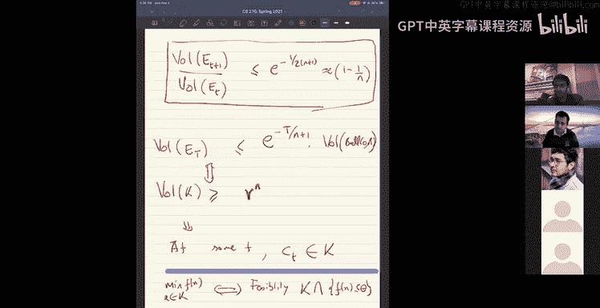

# UCB《组合算法与数据结构｜CS 270 Combinatorial Algorithms and Data Structures 2021》中英字幕 - P4：lecture 4.zh_en - GPT中英字幕课程资源 - BV1uZdpYZEwr

Okay， so today the plan would be that we look at two algorithms。One of them is。Centroid algorithm。

 and the other is an ellipsoid algorithm。And I guess the key feature of these algorithms that is different from the gradient decent style algorithms that we saw earlier is that they achieve log one over Epsilon runtime for Epsilon accuracy。

The runtime is polylog1 over epsilon。For Epsilon accurate optimma。And。That's the reason why。

You can use， for instance， the ellipoid algorithm to show that linear programming。

Is in peak as in it can be solved in polynomial time。And here， when you say linear programming。

 you're given a linear system， an LP。Let's say maximize。

C transpose x subject to ax less than equal to B。And your run time。Is。不omeial。

In the size of the inputs。Which is the n， the number of variables。

 the number of constraints and you know the bit sizes of a。Be the numbers involved。

The number of bits in these numbers。So it's a truly polynomial time algorithms in it's polynomial time in the size of the input。

 and that's going to be sort of the nice result if we get out of these ellipside and centroid algorithms。

 but the key point to remember is that the dependence on runtime is polylog1 over epsilon instead of poly1 over epsilon。

是。Yeah， I see a question about strongly polynomial time。

 so this is polynomial time running runtime because it's polynomial in the input size。

For linear programming， you can hope for something even stronger。

We can hope for something called a strongly parliament times。Which would be that。

ItThe runtime is poly in M and N。The number of variables and number of constraints。In a model。

Where you have infinite precision athmetic。你 it。If you had a model where。

It cost order one time to add and multiply。And do earthquakethmicic operations on arbitrarily long numbers。

ItJust the real valued model where you actually store a real number。

 you can add real numbers in order one time and so on。

You should hope that you can actually solve let's say linear programming in just polynomial in the combinatorial size of it。

 meaning the number of variables and number of constraints right and that would be a strongly polynomial time algorithm for linear programming。

We don't have that yet。嗯。I mean， note that we have just to say that this is you know not completely implausible。

 but we do have a one can get an algorithm whose runtime is。Independent of。Bit sizes。

In a real value computer。 So， for instance， you can get a run time， which is end to the。Well， and。

The。M to the N。Emp to then run time。One can get this。I'll let you figure out how to do this。

 but basically this is a sort of an in some sense， it's a naive algorithm。

 but also shows you that the runtime doesn't have to depend on the bit sizes if you。

If you were working in a model where you could add infinitely longer numbers and multiply them。

AndBut so that's a strongly polynommal time algorithm would be something where it's polyam and and and this is in some sense one of the big open questions which has been open for。

 I guess， four or five decades now open。And are you saying it？In the model of infinite precision。

 you can achieve strongly polynomial time。No， we don't know if we can achieve strongly polynommal time you can I mean a naive algorithm would can achieve m to the end time。

 which itself is kind of interesting because it's independent of the bit sizes and so on but yeah it's still not known whether you can achieve strongly polynomial time we know it for special cases of linear programming that you can do this for example。

 flows， max flows itself is a linear program and you can use the structure of the flow LP to prove that you can result in strongly polynomial time which is typically what you do in Edm Sc algorithm for max flow so the existence of this max flow algorithm the reason we think that we might be able to do general piece in strongly polynomial time there's another reason it's got to do with the fact that you can achieve M to the end run time it's got to do be the fact that in some sense。

 there is something combinatorial about linear programs。

Meaning the optima is achieved on the vertex of a polytope。Right so in some sense。

 so the simplex algorithm for instance， go walks on the vertices of the polyto and so in some sense you are actually searching over。

The optimum value were m to then in differentffer choice， which are all the vertices of the ponyto。

So there's something cunutator about linear programs in that setting and that's the reason why you also have rational solutions to linear programs as opposed to arbitrary real value solutions to linear programs with that。

And so since everything since this because of the comment thing， you might hope that。

You know there is actually a strongly polymer time， like for example。

 if there is a pivot rule for simplex， if there's a way in which the simplex algorithm can pick the nexttex so that it reaches the optimum in polymer time。

 that be a strongly polymer time algorithm。Yeah， and there is some really。

Simple sounding conjectures about just the。Polytopes and sort of the vertex structure of polytopes which are not known like I would suggest you look up harshch conjecture。

 which is like a very simple conjecture about polytopes It just says that Hich conjecture says that na any convex polytop you can go from one vertex to any other vertex in。

一定。2 n steps， is some fixed finite number， like two n steps in n dimensions。

So meaning if the simplex knew exactly what it was doing， which way to go。

 it can potentially converge the optimum to end steps。But of course。

 the conjective sector is still open。The diameter of a polytopism。主然怎样。It's interesting。

RightSo the strongly polynomial time is open， and so today we'll see a polynomial time algorithm。

Okay， so let's。So first I'll show you the centroid algorithm， which is a very simple。You know。

 it's not really an algorithm， as we won write on all the details of it， but it'll sort of。

Be a sketch of an algorithmthic。So here the problem is just the following。

 so if I have a convex set K。And I want to minimize the convex function on it。Okay。So for me。

 the convex set right now will be justice this。Circle。

 and I have a con have a convex function F on it。 I want to minimize it。 And let's also。

 will also assume the following that。I guess some of you have access to this con set。

So we'll see what kind of access we need as we look at the algorithm。

So the sketch of the algorithm is。Something very simple。 So you start at。嗯。

So it's a bit like binary search， so you start with your first con accept being the whole thing。

And then， you have a。Loop。I guess many steps， Okay， each step， what do you do。

 you take your current convex set and you compute it centroid。It's a bit like binary research。

In virus， you pick the middle element and query the element right so as you just define what the centroid。

I need to define what the central out of a convex set is， so here's the definition。

I guess if you have a set K in R to the end。The centroid。Of care。

Is just what you think you take all the points in the set。

You average them so because in the continuous world。You integrate x dx over the convex set。And then。

 you divide by。The volume of the convex set。I guess volume of the convex set is just volume of the set is just integral one over the convex set。

 the constant function one。Yeah， that's a cent right。Of a convic。It's a point that you can compute。

And。For a convex set， this point is inside the set， I guess that's important。So now what do you do。

 so this is your central right CT。Okay。C1 is here， C1 is here and。At C1， I can compute the gradient。

离哋近。I can compute the gradient at C1。So that would be。呃。That would give me a direction。

So this is the gradient direction。Creient F of C T， C1。Okay。

 so if I give if I get a gradient direction， what convexity tells me is that。

It tells me that the value of the function。Is。Higher on the one side of the gradient。

Because what does convexity tell me？It tells me the following。哎。For every other point。喂。

For every other point why？F of y is at least I'm going to write it in terms of the centroid F of ct plus。

The gradient f of Ct。Times y minus city。Okay， so that's。The definition of convexity for F。

And that means that。If I look at。If I look at all points where。

IfYou look at all points where the second term is positive。Okay， if I look at all these points。

 that's essentially one side of a half space right you have a linear function and and I'm talking about one side of the half space so in this case with the gradient points。

Here， gradient points to the right。What we know is that the value of the function。

Is going to be higher。Then this value at the centroid。On this side。So the value of the function here。

 f of y will be at least f of ct。We don't know what's happening on the other side of the half space because it's just a lower bound。

 but at least we know that on one side， the value is more than f of ct。

So we do what you would do in binary research。Eliminate that half。Right， we just say。

Well update our convicx set to say。Okay， now I will have Kt plus one。Is。Kty。Interssect。

The half space or it's on one side of the half space。Kt intersect。The set of points where。Graadient。

F of ct in a product y minus Ct is less than 0。Basically， we throw away this half。😔，Okay。

 then we repeat。 so now my convex set is halved。Now I can for this new convicx set Kt plus1。

 I again compute it。Center central right， so it'll be somewhere here and over there again I draw the right on the gradient of the function。

And it'll give me a different。Hoice。And then I'll again， throw out everything on one side of it。Okay。

 then I repeat this so I get a new point。Compute the gradient。And repeat。And that's the idea。

And this works for any choice of point， not just the centroid。This works for any choice of。

We don't have to choose the centroid right we could pick any point yes yes yeah we don't have to choose the centroid we could we could pick any point and pick the gradient and sort of cut off the rest yeah and the reason we choose the centroid is sort of the main same reason why we pick the middle element in binary search in that we want to reduce the size of the problem exponentially in every step we want the size of the set or the problem to reduce by a constant factor。

嗯。That's what happens actually。 So there's a the reason this this algorithm works is because of。

Following theorem。But I think it's 그런ong。I guess I cant find good name。 Okay， it's fine。 Yeah。

 I think it's grand Gr bond。Yeah， so basically for every convex set。Okay。If I pick any half space。

Passing through centroid of k。So if I any set。Convex set and if I take this and right and I pick con any half space through it。

Any plane through it， basically any plane through it， and I pick one of those sides。你我亮。

Actually sort of goes down nicely by a constant factor。So the volume of a K intersect h。

Its there' is a house passage， this is at most the volume of k。Well， okay。

 let me write on the lower bar， that problem would be though。Obvious thing from it。

 it's volume of k divided by e is the 2。718 thing and at most the volume of k times 1 minus1 over。

I mean the fact you get1 minus1 over is because both sides of the plane are half spaces anyway。

So this is a nice property of convex sets no matter which。

Havelf space you picked through the centralroid it sort of。Nicely splits the volume。嗯。I mean。

 you can imagine this being completely false for other sets。And。The proof is actually neat。

 I won't do the proof of this， you know proof is kind of it's neat uses a bruun and co skin quality。

 it's kind of neat。But， I can tell you the。Sort of intuitivetuly what， what is the。H。

Convex said for which this tight， like， what's the worst example for this？ Well。

 it's something like a cone。So， if， if you。It is a cone if you take a circular cone。In N dimension。

This is a circle in n minus one dimensions in some。So。Then you have a。And you pick a plane， which is。

Half space， which is parallel to the base of the coal。Yeah。

This is the worst possible split between the two sides。This gives you like the E as N goes infinity。

Right so this is super neat right so what does they say you know。

 I mean this makes the algorithm analysis of this algorithm very easy。ex素。Basically。In each step。

The volume。Decreases by。A factor which is 1 minus 1 over0。Its is like a constant like in biore。

 it's half but here it's some other constant。And that comes from this upper bow。And therefore。

 you know， if you ran this for a lot， T steps。Now， the volume will decay exponentially。

So after three steps， the wall， you know。The volume of Kt would be something exponentially small。嗯。

Compared to the original set。Okay， so why is this good， we'll just see why this is good。

Let me at at a slid。Like so。Why is this good well？The point is just this， imagine。

That we have the minimum value。力车。Let's say， X star is the。

Optimum value is the minimum of the function。Is the argument。If effects fix。You know。

What do we know about。Like the function itself， let's say the function is bounded in some range。

 it doesn't matter， so let's say f of x is always in some range minus B to B。Okay。So。

So what that means is if I look at the following convex set， if I look at k delta。So X star is here。

 so k delta is。Essentially one way to think of care is it's a。

It's a scaling of the entire convex set by delta around this point if I scale down everything。

 the entire set。To to x star by factor of delta。 So let me define k delta properly K delta is the set this set。

嗯。So， it's。1 minus lambda。Times。Ex star。Plus， lambda X。For x and K。Lambda in。0 to delta。So I mean。

 an alternate right way to think of kL tie if you treat X as the center of your set and scale everything。

By factor delta。Draw a line in every direction you can draw a line and then imagine just scaling down that line by a factor delta。

So you get a tiny con tiny copy of the original convex set around this point X。Okay。Okay。

 so that's this。said。ok。And then what do I know about k delta？Well， firstly。

 like what's the volume of K enter？This is at least which is exactly in fact equal to the original volume of k times deta to the n。

he this is that。Clear because it took k and is scaled scaled by delta among every direction with X as a center so。

The volume of K entry is de to the n time smaller。But I guess the key point is that every point in k delta is quite close to the optimum value。

 so its value is going to be really good like the value of the function there will be very good so what in fact what will it be。

Well， if I pick any X。你系逼噶。X in K delta。do I let me just pick y in K delta pick y in K delta。Well。

 y is equal to you know， one minus。Delta times。Let me just to lambda1 minus lambda times x star plus lambda x。

For some X。In K。 So then you know F of y is at most， despite convexity is 1 minus lambda f of x star。

Plus lambda f of x star， Lada f of x。Okay， so you see that it's mostly f of x star。As you expect。

It's valued mostly F of x star because this is like really close to a F of x star a little bit of F of x added in。

So in particular， this is smaller than F of x star。嗯。pl。To。I mean， let me just say。Lambda times。

F of x minus f of x star。Right， this is smaller than Eoffiex star。Plus，2 deelta B。Okay， I mean。

 like the calculation aside， it's this very intuitive fact that if I take the delta scaling of the convex set around this point。

 since delta is really tiny， the value of the function will be quite nice around it。

And the volume will still be significant， it will be del to the n times the original volume。Okay， so。

And so， I mean， the idea is just that， you know。All right， so the value of the function is。

Quite nice in this little ca delta here。And。We know that the volume is at least de to the end。

And if every time the volume decays at this exponential rate， every time you slice it， you sort of。

 let's say for simplicity， let's say you half the volume of the set。

You will hit you end up cutting this little set at some point during your process at some point you will say。

 oh， my value of the current center is better than this value。Value of another point to get delta。

At some point， like within。Like log one over Dlta steps。You will actually end up cutting this point。

 this。Set。Just because the volume is decreasing and so when you do that your cented value that you use will be very good so。

So I should say what you return at the end of the algorithm。

 you return the best centroid that you got return min。Of f of c one。Up  three f of C T。

 all the centrals look at the best central that you got。And the best central will better them。

This bound uncadeded。Is that clear any questions on this I sort of。嗯。Try to go quickly over it。

 because。The intuition is very simple。The analysis， even if you didn't get some part of this。

I guess the intuition is very simple if you follow your notes you'll finished the proof for yourselve。

嗯。Any questions on this？I had a question yes， so for the last step on your return min of FFCc1 all the way to FFCCT。

 isn't FMCT the smallest centuryroid？right， okay， yeah right。

 so we don't know that the values of the function， the cent rights decrease。

So every time we cut one half what we know is that the play the the half the half that we cut has a value higher than the value at the centroid we don't know how the function behaves on this side of the。

You know， on this side of the half space。Because you see that convexity only gives you a lower bound。

 so we can say that okay， if the right hand side， if this term on the right hand side is negative。

If this term on the right hand side is negative， then we can say， yeah， okay that。

The value is positive， then you can say the value is higher。

 but if we don't anything what's happening on the left of the house space。Whenever we cut。

 we know what's happening on the right of the half space on the left of the half space。

 we really don't know。inSo the values of the function values of the centroids don't form a decreasing sequence。

 just the volumes keep decreasing。Yeah， I mean， as you can see it's sort of。

It's a little bit like you know。It唔。It's a little bit like binary research in that you cut off。

 but in binary research or sorted area you're dealing with a one dimensional problem。

 so really each time you cut the values on the left are lower you know and they're sorted in that sense。

 here it's not like that each time you cut， you know that the value on that side is worse than the central right。

But you don't know whatever is happening on the left hand side。嗯。Yeah， I think for instance。

 it could be that the minimum is actually C1。C1 could be the minimum。Yeah， actually。

 that's a good like imagine C1 it is the minimum the minimum optimum is at the center of the first thing。

 The way this algorithm would work is it would peel off one。One side。

 then it would start peeling off。More pieces until it converges to a convex set that actually looks like。

Actually looks like something around the around the center。O。All right。

 so that's good any other questions on this？嗯。Okay， in some sense， this is I mean。

 it's a nice sketch of an algorithm。 The reason this is。Not yet an algorithm is that。

It's difficult to compute the centroid of a convex set。

We didn't say how you would compute the centroid of a convex set。

And you see that to compute the center of a convex set， you have to average over the convex set。

The function x you to have is the function x over the average or the comm set and。

This is not trivial you can use。Sampling algorithms。

You can use a convex sample algorithms to sample from convex set to actually do this and convert it into an algorithm。

AReal algorithm。 but modular that this is still not a。嗯。Alrithm yet。

 we haven't described how to sample from the Corx set and one more thing。

 which is a little bit not suitable for linear programming is that。嗯。I sort of assumed here that。

I have a point inside the set already to begin with。

I mean you need to I mean you need to at least have a point inside。

 but usually whenever you start solving linear programs。

 you're actually interested whether the linear program is feasible as in you don't have a feasible point that satisfies all the constraints of the linear program yet。

 so assuming that they have a point inside the set is a little bit strong when you start solving linear programs。

But this is a very nice algorithm that you can actually make it a real algorithm for convex optimization。

Okay， just really quickly， can you say again， what was the name of the for the proof of the volume being split nicely that's a gun bomb。

GR GRU and BAUM yeah。是。Okay， so let's。冇诶。I want to do then another algorithm today。

This is anipoid algorithm。是。Okay。So。So I mean， ellipide algorithm， as I said， it proves that。

Ler programming is in P， but actually you it prove something even nicer。So let me。

 you know in order to state what ellips algorithms guarantee is， let me define this object called。

A separation or record。Okay what's a separation or a， So it's just the following setup。

 So the setup is imagine you have a convex set K。Okay。😊，And。So。A separational a is。ok， let me use。

So a separation oracle for k。是。Is an algorithm。That takes。You know you can give it any point Z。

All right， so if z is inside the set。The algorithm would say yes， it's inside the set。

So if Z is in the set。It'll say yes。Okay。そ分です。It's a separational record 4K。On the other hand。

 if z is not in the set。Then， of course it says no thats。Clear， it has to say no。But。

It also gives you a certificate as to why it's not in the set of the following form。

 so if Z is not here， not in the set， it says z's outside。

A separation oracle is one that gives you a half space。

Such that the convex set is on one side and z' is on the other side as separating half space。

half space。Or a hyperplane， let me say， call it a hyperplane。诶 hyperplan。Separating。Z from the from。

き？Meaning， formally， gives you a vector。Sas that。It like me just say A and B such that it gives you a vector A。

And。A B， such that。A dot。Z。Is。Less than B。But。For all x in K。Aid or Texas。Great than to be。

Are you saying that a yes or no oracle will allow us to compute this hyperplane or are you assuming that the oracle also gives you the hyperplant I'm assuming that the oracle like gives you the hyperplane so separation oracle is an algorithm that does this if it's in the set it outputs yes。

 if it's no it gives us a hyperplane that separates it。Okay， so it's an。

 I'm assuming that we have a separation record， it's an algorithm that does this for some convicx set。

And I guess we never really formally。Talked about convex sets and so on。

 convexity carefully in this class， but this is a property of convex sets that if I give you any point that's outside。

 there's actually a hyperplane that separates it from the convex set。嗯。And。In fact。

 an alternate definition of a convex set is every convex set is an intersection of hyperplanes。

 intersection of half spaces。Yeah。But for every convex set。

 there always exists a hyperplane that would separate the point from the convex set。

 but a separation or re is an algorithm that gives you that。And what ellipsoid Aline says。

Is that the theorem， which ellips or algorithm shows that if you give me any LP。

Given a linear program。It's sort of more generally true than linear programs。

 but let's just say state it in for linear programs formally， so if you give me any LP。嗯。

For some polytop。Okay。Okay， for which we have a separation oracle。With。Separal record。

You have an algorithm to。I'll put this hyperplane。Then。Ellipsoid can solve the LP。Conancel。LP。

 optimally。In time， which is polynomial in M。 So there's no M so n。And。

In a bit complexity of the numbers involved。Bit complexity as in your separational re is returning a vector right so you want to know what's the number of bits it uses and so on。

 but polyinin。So， I mean， the key point to note about this theorem is that。The run time。

Does not depend on the number of constraints。As in you can have infinitely many constraints or exponentially many constraints in your linear program。

 as long as you have an algorithm。That can give you a violated constraint。

I'll give you a hybrid plane that。Separates your point from a feasible solution。

Ellip or algorithm can minimize it。As in for example， you can have exponentially many constraints。

your l。The electrode algorithm doesn't care， all it wants is when it gives you point。

 a candidate solution。You should have an algorithm that。

Finds one of these constraints which is violated and returns it。

A separational recall is another way to say is is's just an algorithm that given a point gives you a violated constraint。

 a constraint that's violated。This geometrically leads a hyperplane that separates from the convex。嗯。

That's what the lips are out with the us。Any questions on the theorem itself？

So the runtime of course， I'm assuming that'm。When I say optimally in time。

 polyin N and this many things， I'm saying that it'll make that many calls to the separation record。

Which the separation might itself take some time， but the runtime will be n it will make polynomial in N cause to the separation oral。

So actually， I think on the， I mean， we'll see examples where you can cast。Like you can for example。

 submodular minimization is a thing where you can write on an exponential size LP and you can write on a very clever separational record and you can use this to minimize even semi defnet programming。

You can write on a very nice separational record and use ellipoid as a black box。Okay， so that's the。

8。嗯。That's this sort of the me， like one of the biggest hammers that we have in polytime algorithms。

Just the ellipoid algorithm can solve any LP in polytime and also one more thing is when I said this。

 I was a little bit strong， I said you can solve the LP optimally。

Whi ishi means that you can return the exact optimal solution。Which is true。Like under if you。

 if not， depending on the。a bit complexity of the numbers involved and things like that right and it's quite subtle to actually say get the exact optimal solution。

 but you can do it for linear programs。But in most applications。

 even getting Epsilon closed optimum in polylog1 over Epsilon time would be good。That works。是。Okay。

 so now I mean， I want to show you how the ellipsoid algorithm works。Quite similar to。嗯。What we had。

嗯。对。You know yeah， let me show a sort of a sketch of the algorithm and I'll try to flesh out the details more and more and see how let's see how far we get with the details okay。

So okay， so let me write down， show you what the eip algorithm does。So， firstly。What's the setup。

 So let's do a simple setup where we are asking for not optimization， but just feasibility。

You're given a linear program and you want to know if there's a solution that satisfies all the constraints。

嗯。It's easy to reduce optimization to feasibility and vice versa and。I'll let you think about it it。

 but basically。The problem that you want to solve is the following。So。So you have some convicx set。ケ。

So think of the convex set as the feasible region of a linear program。诶。Okay， and。

Like you just want to put a point inside the convicx set your goal is to just。

Find some point in there。And if there is any point there you want to find it。

 and if the convex set is empty， meaning the constraints are inconsistent。

 then you want to return that the convex set is empty。

Okay so okay this convex set is somewhere in R to the end。

 I think what you first need is some kind of a bound on the numbers right like some bound on the numbers so some very naive bound on the numbers so what we'll assume is that this convex set is inside。

A ball。Of some radius。Like some really large radius part。So let me draw a picture so you have。

You have your convex set。And。It'll make a weak assumption that there is some。

I'm going to draw a picture。Lets see it okay。Yeah。Yeah。Okay。嗯。是。So it's inside some big ball okay。

 so this convex set is inside some big ball and we we really our goal is to just find one point inside this set。

We know that this is somewhere and we're going to find one point in there。Okay， and。嗯。

You know when it's infeas of course this set will be empty and you know we to deal with those things and in particular the algorithm should say no when it's infeas but let's for the description of the algorithm let's think of the feasible time I mean for just to describe the algorithm let's think of the situation where it is feasible meaning it's non- empty and we'll make a little bit stronger assumption than being non- emptyty I'm going to assume that the set has a little ball that's inside the set。

Meaning it contains a ball。嗯。Of small radius。Inside it。是。其实。😔，Around some center。

 around some little radius R。It contains a ball like that。

So what does that do because it contains a little ball， its volume cannot be arbitrarily small。

RightAl because it contains this ball， its volume is at least the volume of the ball。

Okay so that's you know you can see where it's going。

 it's going towards like binary search in some sense， but yeah。Okay。

 so that that's the setup you have a convex set which is inside a big ball， contains a little ball。

 and you want to find a point inside that。And you don't know which little ball it contains and of course that would be easy because you just return the center of the little ball。

 you don't know where which little ball's just an assumption that the set contains some ball。

 meaning its volume is non negligible。Okay， so that's what this what do you have and of course what you really have for that set。

 I mean the way you access the set is you have a separation orac4K。Okay。

 that's what you have and again， your goal is to find a point。

And what the algorithm does is it goes in stages。嗯。So。At every iteration， the algorithm maintains。

An ellipoid。containing嘅。Mainance。An ellipoid。Containing kit。

I'll formally define ellipoids and you know how to work with them， but you know like for now。

Right for this algorithm sketch of an algorithm mean we've all seen ellipsoids in two dimensions and three dimensions just think of them as those objects and the key point about an ellipoid is。

You can see that it's a very structured object and I can describe it very easily to you like as in I just need to tell you the center of the ellipoid and I need to tell you the shape of the ellipsoid you can imagine all of them being small numbers unlike a convex set right if I tell you a convex set I don't know how to describe a conx set succinctly to you but I can describe an ellipsoid succctly the center and maybe the principal axis and the length of the central axis and so on。

So。对。Okay so that's the key point essentially what what the algorithm is doing is and the problem with this centroid algorithm is that every time you had some convex set in the beginning and you keep cutting this convex set using these half spaces and you get these very very complicated sets right it's not even clear you can store representation of these complicated sets as you start cutting it into little pieces。

And what ellipide algorithm does is it always decides to maintain an ellipsoid。

which has a very succinct representation and it sort of updates it。Okay， so of course。

 initially we know that the ball contains all of the entire set， so our ellipsoid zero。

And the center zero just。Like the first ellipoid in the center is just the ball。And the center to 0。

It then the big ball and of course it contains the set K。Okay， and then I mean。

 the natural algorithm is just。要。Ask the separation or record about the center。

So you query separational record。You ask it is。C sub T， the current center。In the comic set。Okay。

And of course， if the oracle says yes。Then your algorithm is done because you can return the center。

As a point inside the set and you're duck。Okay。嗯。On the other hand， if it says no。

Right then the separation record gives you more than just saying no， it actually returns。

A separating hyperplane。So。so in the first step， for instance， you query。About c，0。

This center and you ask whether it's inside the set。Of course it's not inside the set。

 so the separational record will say no， it's not inside the set and it would return a hyper planee。

Such that the centroid is on one side of it。Ohoops。是。

Itll return a hyperplane system that the centroid is on one side of it。

 and the convex set is on the other side。All， and then so it returns this hyperplane。So， that。

The synch is one side of it and then what you do is。要。😔，Okay， so now it。Okay， now that's good。

 you eliminated half the ellip side。请个给的。Eliminated half the ellipoid saying， okay， Mike。

 I don't need to search here， I need to search to the right of this half ellipsoid。

But my set became more complicated。 Now it's half of an ellipide and stuff an ellip side。

 and we have decided that we'll only maintain ellipides。 Okay， so let's just find an ellip side that。

Contains this half。So you want an ellipide that contains this half。So I'm going to try to draw it。

 let's see if I can。😔，Managed to do that。你ele time。诶。So this green ellipsoid。Is a new ellip side。

It contains the half of the original website。In the no case。You get。Get a half space。

Let me just call it X。Then you find a new e E plus1。嗯。Which contains。ET intersect edge。

I it contains the one half， the the half that。And。And that's it now this new ell will have a new center。

And you ask， oh， is this center C1 inside my set， no， okay， so you it will give you a hyperplane。

Some hyperplane that separates c1 from the set。And you repeat， you draw a newips side and so on。

And that's the。Enter aism。嗯。And。呃。What is the key thing that you need。Well， you always， you never。

I mean， the key point is your ellipsoids， you always make sure that it contains the convex at K。

 right so。That is true and if your ellipsoid volumes are decreasing in size so。

What will ensure is that the volume。Of these ellipoids。

Are decreasing by a constant factor by a fixed factor every time。For example。

 I think we'll do something like this。The number doesn't matter。

 but it's a fixed factor in depending on the dimension。

 like it's some one roughly one minus one over n。对。So what that means is like you know。

 if you ran this for T steps， your volume will be e to the minus。D over n plus1。

 the volume of the final thing。Times the volume of the original ball。It's decay exponentially。

And then you are done because then what that means is。

 you know that the convex at K contains a little ball。So， you know that volume of。

The conve K is at least equal to the minus little r。啊 sorry。Is at least some。三 some。You know。

 R to the N， some little r to the n。Right。So these two together imply that you know， at some point。

 you'll hit the convicx set。That your centroid will already be in the sun。

 so if this implies that at some tea。Small D， your centralized CT will actually be in the convex set。

 the separation record will say yes and you'll be。You'll get the point。Okay。

 so that's sort of the basic idea， I see there's a lot of discussion in any questions on this。

I was wondering if you could elaborate on why the。KT is hard to store in the centroid algorithm。

 right yeah。Right， so actually。In the way we describe the centralroid algorithm。

 I guess the one way you would store kt is you would say it's k intersect with these T half spaces that you hit。

 but I guess that sort of hides the complexity in the representation of K itself。Some that's the。

LikeAll of the right so。ultimately another place where the complexity here is that because case an arbitrary convex set。

 you don't know it's centralroid， you actually need to compute it by。

Some sampling algorithm or something else。Its basically all of the complexities and how the。

Convex set is represented and how you can deal with it right sos that's the basic issue in this central algorithm and the way I mean I was just saying that you know the way ellip algorithm deals with it that it simplifies the convex sets earlier convex sets are just ellipsoids at all points in time and so the centers are just you know like you know the centers and you know。

The only challenge now is to make sure that the new ellip side。Will be significantly smaller。

Than the old one。hi is not clear because。你。Like， you know。

 when you cut the half space cut by the half space， youve got two pieces， okay。

 even if you do it cut by half， your new ellip side has to contain that half space so its sort of。

Has his extra bit so here。So it's not immediate why the volume actually decreases。

 but it is true you can actually decrease the volume。

It looks to me maybe I'm wrong that you're doing something different in the ellipsid algorithm。

 which is you're trying to。Create an episode that encompasses all of K。

 whereas in the centroid algorithm， you're just trying to encompass the minimum point， right？

That's right how does the website algorithm finally find the minimum point or are we just trying to find the feasible Yeah yeah were just trying to find the feasible thing yeah and you know in some sense the connection between minimization and here would sort of would be that。

If I looked at the convex set， which is F of convex set is a set of points where the convex function is at most some value。

At most this value that we found and that would be the point set here and you're trying to find a point inside that set。

And right but but you're right it's a like the way it stated here I stated for optimization so you only maintain the minimum value inside your set here it was feasibility so you kept the whole set inside yeah and the way to go in between the two is just。

嗯。If you had optimization of a convex function， you'd add f of x less than k。

Also as part of your convict set。嗯的。If I want to solve min f of x， x is in k。

This is the same as checking feasibility for。The convex said K intersect f of x is less than theta。

 and you do binary research or theta。嗯有。Yeah， they sort of feeling somebody sorry。

I think somebody asked earlier if you're done with this about how you choose the initial ball for the problem we didn't really discuss that right yeah the initial ball for the problem yeah I mean。

Usually， I think for the algorithm， it's sort of a naive bound。

I mean note that the algorithm's runtime would be loggged to McKar。

 so the way to think of the initial ball is you， for example。

 if you're solving a linear program you decide to use some bit size for all these answers。

 let's say X you say it's the you B bits long， that implicitly means that you're assuming that X is at most two to the B。

And that。I can be the radius like two to the b times n where is number of variables that can be the initial ball。

 So yeah， the radius of the initial ball is。Sort of a very naive bound on the value of the optimum and you sort of need that even to represent your solution so。

The initial ball is actually not。Yeah， it's quite easy to pick because just， you have some， you know。

 rough estimate on how big the solution should be before you solving an app， but the。

The you this one is a little bit more subtle， is actually quite a bit more subtle。

I said that it contains a little ball inside。W is already false if you have a linear program。

With equalities， if had a linear program with equalities， right。

 then the feasible set is a lower dimensional set。It's a convex set。

 but it's a lower dimension set it contains no it has zero volume its volume is zero。 So I mean。

 you have to do a dirt annoying dirty things like here to say。

 oh I'm going to replace x equal to B by。AX is in b minus epsilon to B plus epsilon。

For some tiny epsilon and then。Do this we're going need to do substitution or something if that's not。

 I mean， I guess that's right you could try to do substitution too。 Yeah， yeah。

 I guess you can do yeah few different tricks I mean the。I mean。

 really the hairy part is when you actually eventually have to show that。

You can recover the exact optimum， which is sort of the theorem that we stated if you want to recover the exact optimum things are。

You know， quite get a bit more subtle because eventually you have to deal with。

Some sort of rounding here to say， if I get so close to an integer solution。

 a rational solution I can round it to a rational solution and that' will be the actual optimum sort of yeah and like for example。

 here's a subtlety。 So imagine your。Just even in two dimensions。

 imagine your you can write a linear program whose。Feaible set is just this line segment。Yeah。嗯。

This line segment is a feasible set。Of a linear program。

 And then what will the ellipoid algorithm do， It will pick ellipsoids， and then。

These ellips will get taller and taller， I think。and it sort of start converging to this it'll move here。

 it'll move here， it'll start converging to this thing， but it will never really get to the line。

Yeah， and so。Yeah， it does get subtle。没。I mean actually getting the exact optim or proving that these things work in exactly like in bit complexity。

 these things are way more subtle than what we'll see like another reason why the subtlety is。

I said you find this new eip。Okay， this new e has parameters， which is the center and all the things。

 let's say even the center。嗯。There's no guarantee that this new center is a rational number。In fact。

 the construction will see it's going to be a rational number like the most natural construction for this new e the center will be a rational number。

 so there'll be some approximation there and it's yeah。

Yeah really working out the details of this is kind of a little bit tricky。Any other questions？

I guess one quick thing is how easy is it to？Get your hands on a separation or a call you don't have to go with you like explaining specifically how one would work for a linear program。

 but like is it is that a hard problem or now right so okay so the separational record is sort of the very natural thing if you have a linear program in front of you if you have a linear program with M constraints a separation record would just go through all the constraints and see if any of them is violated。

If one of them is violated， that gives a half space that they can return。

So in some sense for an actual explicitly linear program。

 you would use a naive separational article which goes through all the cont。

 finds a violated constraint， but yeah， you for exponential size or two different things you have more different more depending in some exponentials for some exponential size LP。

 you can actually have a separation record and it can give you algorithms。Any other questions？

Anything else， I can't read the。Chat stream。Quickly。

 so let me know if you have any questions otherwise。And I'll try to show you。

How to make some of this precise right now it's a sketch。

It's not quite difficult to make it precise to。Okay， let me tell you how how some I mean。

How to make these precise， so firstly， I need to say what an ellipsoid is。So I guess firstly。

 we all know what a ball in the n dimensional space is that a unit ball is just a set of points x such that sum X squared is less than equal to1 okay and then。

嗯。Like one way to define an ellipide is。It's just the image of a ball。

Under an invertible linear transformation to take a invertible。Linear transformation。A matrix。

 basically， a inevitableverable matrix。L that maps r to the n to R to the n。

And you applied to the ball to every point in the ball。Okay。

 so the and that gives you an ellip side so it can stretch some directions and it gives you an ellip side and you know in terms of actual numbers。

 how do you how does an ellipoid look well it's。You can write ellipoid it's just。

It has two parameters， is a center and a matrix Q。And。

It's the set of point x such that x minus c transpose。Q x minus C。Is less than equal to one。

Where Q is a positive semi deffinite matrix。The same positive se that we saw in the homework and these things show up all the time。

 right？Okay， so in particular， you know， what's the relation between this Q and this L Q will be。

LL transpose inverse。So that's the delicious。So it's really， I mean。

Like it's really just a linear transformation of a ball。And so therefore like it's kind of nice。

 you can actually do all the geometry on the ball and translate it there okay。

 so firstly before we do that what's the volume of an ellipsoid。Well， I mean， the I guess the key。

I guess theorem is that。If you have any set A。The volume of。L love费。

If I apply a linear transformation。8 to the space then the volume actually changes by the determinant。

So the volume of a ball。So's a volume of an ellipsoid E。right， which is like let's say the E' is。

 let's say， a linear transmission applied to the ball。This is actually just the determinant of。

Linear transformation。Time the volume want the book。Okay。Okay， that's really nice。嗯。So。Right。

 so I mean。So， you know， our problem。Of finding this， I mean， key， I mean。

 let me state a geometric problem that we have。We have some。Ellipsoid。 and we have a。

We have some ellipoid。And we have some half space。That cuts the ellips side。Through the center。

And we want to find a different ellip side。Of good volume， of small volume that contains one half。嗯。

And how do we do this， Well， the idea is， let's just solve the you。You know， we know that。

And every ellipsoid comes from the ball in some way， right by linear transformation。

So let's just solve the problem。For a ball。Okay， of radius one。

Or wall and that you know byling it transmission I can also map the half space to something where I cleanly understand right it's let's I map it to just this half space that's pointing upwards right。

Okay， so。So now it's a very concrete problem， I have a ball。Of radius 1， Okay。

 and then I have all points。In the ball。With。The let's say， the first coordinate。Great than0。

 That is a。That is this half space。And the concrete question is。

 what is the smallest ellipoid that I can find that contains this？你啊。Contains this one。

This half space， this half ball。Okay， and the idea is we'll just write down an explicit ellipsoid。

In this case， let's write down an explicit episode here。Let we call that explicit ipside E。Okay。

 E yeah， right on the expert website E E EO， let me call it E。Who sets that the volume of p？

I at least is at most， is not too large。So volume of v not by volume of the ball。

Is actually less than one。E to the minus 1 over 2 n plus 1 something。Okay， and then。

Right the nice thing is。Okay， now by this linear transformation。そ。Like the both， I mean。

 the original ball becomes this eip side。E1 and this E not。

It becomescomes a different ball E2 a different ellipoid but contain you know it contains the half right so the map just goes。

And even nicer。By this theorem， every set。In my。Space when I apply a linear transformation。

 the volume of every set gets multiplied by the same factor。Which is the determinant of health。Okay。

 so。So basically， the ratio of the volumes in my original nice setup with the ball and actual ball and theipsoid e0 is the same as the radius of L of E0 dead by。

L times the ball。Okay， so so what seemed like a very intractable problem with a really weirdly shapeved ellipoid and so on becomes this very tractable problem of an actual ball and the actual very simple half space because of this connection。

And then you just write down an actual explicit ellipsoid for this situation where you for the yeah。

Thank you。嗯。And so that's the basic idea， some of the I mean the key point is that all all ellipoids are linear transformations of one another so you can do and you understand how volume changes when you do these linear transformations so you clearly I mean you sort of。

Can translate the problem to a nice set that you can actually explicitly write down。

 so there are explicit formulas eventually for this half aipoid。It's dead in。

The notes that I link tense ons everywhere there's an explicit formula and you can just use that formula。

 it's quite simple。Any questions？Yeah， just one question is the reason for picking an ellipsoid rather than I guess some other shape。

 like a rectangular prism so that you have this nice property that you get a ball if you apply a certain linear transformation？

Good question。 Yeah， yeah， I guess the question is can we choose， can we use。

Some of shape like the box or something。 Yeah yeah it's a nice question。

 I think the yeah I think you just have to have a family of convex sets。

 I think maybe boxes are fine such that you。A， you have a small representation。

 and I think the B is this。Like this fact should be true in that you can。

If I give you the if you look at the centide and if I draw any hyperplane through the centroid。嗯。

Like you must have another。Let's say use cubes， you must have another cube。Which is not too large。

That contains this half half a cube right and that's the that's the thing to ensure I don't know if it's easy to do that with cubes I mean if you cut it。

Like yeah， I don't know what happens， like you need to pick a cube in a different orientation that contains this half。

And yeah。嗯。Yeah， but I don't see why ellipsoids have to be unique in that。嗰先系。

I think it's just a very convenient set of shapes。😔，Thanks。Yeah。

 but I think ellipsite is something that you will think naturally gravitate towards because you want the。

At least you want the set of shapes to be closed under linear transformations because in some sense if you're doing Comx optimization on R to the end。

 there is no direction in R to the end which is special for you so like boxes on the other hand。

Actually， pick like。个 yeah。So you want like yeah， you want to like for example。

 its it makes sense that you if you allow， if you look at boxes。

 you should allow yourself boxes in every possible orientation。

Because you don't know which orientation your convex problem is going to be so you should allow a box in every possible orientation for yourself yeah then it's really the question of whether you can get the volume down in every step。

Yeah。Yeah， but this is a big deal， as in。I can't think of any other algorithm that appeared on New York Times frontron page right。

 This is， this is one theipside algorithm when it was first。

Found it was in the front page of New York Texas was a big deal Lches also。

You know a little bit of a setback to this is cold war times right so the Russian found this algorithm and makes a little bit of a yeah。

Set back to you in that sense。But there some a lot of stories about this。

How this algorithm was publicized and so on。But it was discovered by Kachian， the Russian。嗯ん。Yeah。

 it's a very big deal in algorithms because。I guess it's the。

I can be sort of the broadest tool and this is the first polytime algorithm for it。

Not really practical。Oh sorry for keeping track of the ellipsoids。

 is there like a natural like should we keep track of like L or something and or are they all like kind of equivalent and you can use？

Right yeah and like one nice parameterization for the ellipoid is just the C center and this Q matrix。

 which is Lll transpoingverse and if you keep keep track of C and Q。

 the center of the ellipsoid and this Q， you know that gives you the ellipoid。

And this is enough and you can write down update rules for the center and keep like this。

This very specific update tool for C and Q， it can write down and that gives you。Yeah。

 so you keep track of CQ。Professor I had a question so is there any good way deciding which algorithm to use for Coms optimization or linear programming we discussed like three or four I think like online Com optimization or online gradient descent this one century。

So right so it's a good question so ellipide is the first polytime algorithm but it's mostly a theoretical algorithm。

 I don't think anyone uses ellipide I think for linear program still the most widely used algorithm is not the polynomial time one not the gradient I mean it's the simplex algorithm is the most widely used algorithm for。

Lineer programs and but。I think诶。Usually okay so linear programming by itself is a very broad tool right so usually you're using linear programs to solve some other problems specific problems。

And。Usually by looking at the specific problem that you're solving。

You can tailor the gradient descent to work well。嗯。Right。

And ellipide is more like a powerful tool to sort of。

It just like linearup programs like a broad tool in just two。

Find out if your algorithm is even polynomial times sorable or not。

 that's the first thing you figure out whether it's polytimes hor or not for that to use ellipide。

But。Like if you want to get a good runtime you actually sort of dig into I guess online gradient disscent or like another algorithm did point and you sort of try to make that efficient in a particular application so for example we'll see an okay if just take Maxflow right Maxflow you can solve using on like online convex optimization。

You can get actually near linear time algorithms for that。

 but I think we'll see it later in the class。You can also use ellipite to solve Max。

 but it' will be super inefficient， to be worse than it scs algorithm of that we see under right。

And you can I mean then I guess the really practical algorithms with log 1 over epsilon convergence。

 which is what the these algorithms have the log 1 over epsilon convergence right so the really practical algorithms with log 1 over epsilon convergence are interior point methods。

I mean， gradient decent is nice， but。But you don't get the log 1 or Epsilon convergence。

 as we discussed， you only get poly1 over epsilon。Yeah。

 so the really platemic log and technologies would be great in descent。

So that's the other polytime algorithm for linear programs。We might do it in this class。

 I'm deing whether to do it in the next lecture or postpone it later。Oh。你点一子。😔，Thank you， Professor。

Well had a question。So when we say it we're doing convex optimization。

We're usually working with a convex function over a convex set play。

 so does the word convex refer to the function or the set？

ABoth right you need both a convex function and a convex set if either of them is not convex it's not in general easy。

O。Yeah， but usually the function， you can sort of。you can fold in optimization into feasibility by putting the functional as part of the set which just saying find a point where the function is small and it's inside the set so intersectional convex sets is convex so you get still the same thing。

Like you both have to be convexed， correct it to be easy。嗯。Okay。

 it seems like you need the convex the two different kinds of convexity for two different reasons。

Whi just seems like a coincidence Oh it's the same convexity because F is convex as a function is equivalent to saying that the level sets of F。

Level sets as an F of x less than theta， this is convex。Is a convex set， convex set。

Both are the same， equivalent each other。嗯。So yeah， a convex function has convex level sets。

Because if two points are low， everything in between is also low。 So the entire。几住睇。Yeah。

 I guess I'm thinking back to the definition of conating， I see that。

We have to be able to take the average of two different x values so therefore this it has to be con。

Rightect， exactly。 Yeah， okay， yeah。Thanks。

