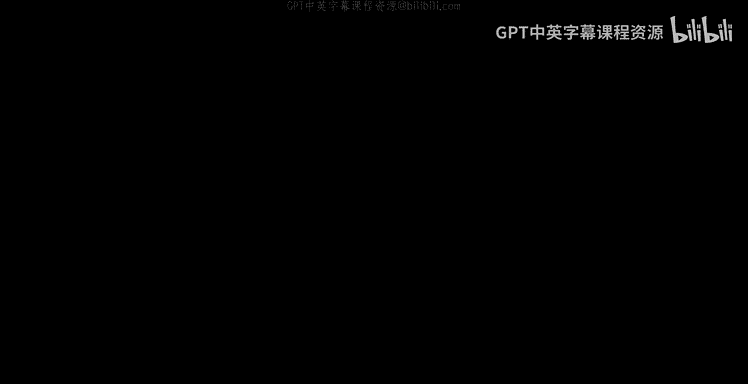
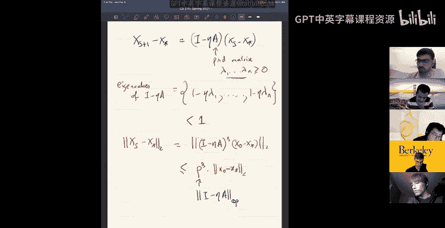
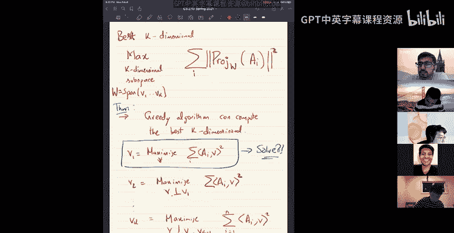
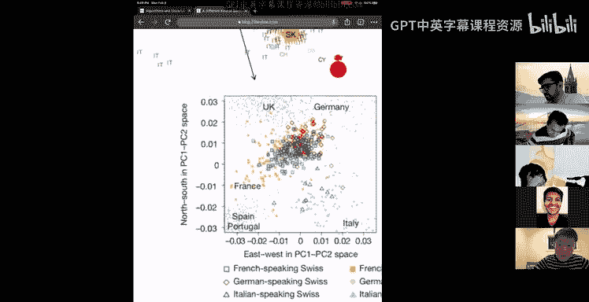
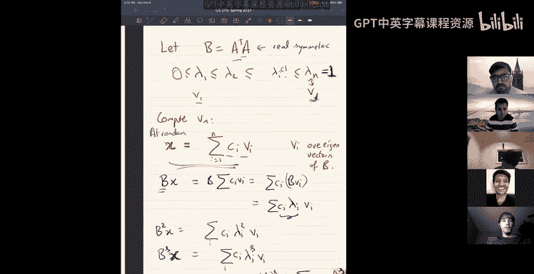

# UCB《组合算法与数据结构｜CS 270 Combinatorial Algorithms and Data Structures 2021》中英字幕 - P5：lect 5.zh_en - GPT中英字幕课程资源 - BV1uZdpYZEwr

Yes。嗯。Today we'll leave optimization and more to a new topic。

 the topic that we'll cover today and maybe in the next two or three lectures is。What I should call。

In some sense， linear algebraic。Tools。You know， of course， algorithmic cleaner algebra tools。

But before we go venture there， a couple of comments so for。

we really covered quite a bit of ground on in optimization we did first order methods like gradient descent。

 mirror descent， and then we did second order methods like。嗯。I guess not really。

 but we cover other techniques like ellipsoid and centroid， so we did cover quite a bit of material。

And I wish we'd covered some material more carefully in particular。嗯。

This is one thing which I sort of alluded to in several places。嗯。But I didn't really get into。

The nettities of it is the multiplicative updates， multiplicative weights or multiplicative updates。

 it's called it expert algorithm， multiplative weights algorithm。This is as we said。

 it's a special case of online mirror descent and that's the reason sort of I didn't do all the details of it and I'll let you read it elsewhere。

This is a really important algorithm and I think some of it in 170 undergrad algorithms we did cover it once。

 it's very useful to know and it's a very important special case of online reddesscent。嗯。

And you know you should read about it well also another reason why I'm okay with skipping it for now is we'll come back to this technique again later in the class so it won't be a big deal if we' come back to it again and I think also the homework homework has a problem which sort of is related to my weight。

This is one thing that we skipped。We didn't skip but we really didn't spend too much time on。

 but it's an important thing to know and it's a special case of online rediscent。

It's a good access to work out why it's a special case of online emergency。Okay。Okay， so that。

That's sort of all I want to say about optimization for now。

 well of course keep using these tools from optimization in the rest of the class。

The homework too was released on Thursday。It's due in two weeks。

 we released the solutions for homeworkmark one。On Piazza， you have a peer。

Reviewed you in by this Thursday， please be generous to your peers you know。

The objective of the class is to see if people get the main point of the solution or like the real crux of the solution。

 so you know grade grade fairly and generously。Okay。So with those comments， let's venture in。Yeah。

Okay， so we'll talk about linear algebraic tools you know。

I guess the most basic linear algebraic operation that one would want to do is to solve linear systems。

So here do you have some。Matrix。嘿。Times x is equal to B。And so this is a N by D matrix or。Or for now。

 let's even simplify this sense it's an end by end matrix， it's inver。In general。

 it can be an n by D matrix and we want to solve for a x okay and this is nothing new I mean this I guess the very first algorithms that you learn for this is Gaussian elimination。

So here again， algorithms for solving linear systems。

 you could classify them into sort of two broad categories， one is these Gausianal nation， you know。

 of course there are more efficient ways to do Gausian nation， you know， some LU decomposition。

Right these are。Somewhat there are other variants of this。

Then the other kind of technique that you can use are what you would call iterator methods。

So iterative methods are like gradient descent。So we will see I'll show you an analysis of algorithm now。

 but you know， here the gradient descent， steepest descent。

 there's something called the Kash Marsh method。And then there is a conjugate gradient descent。

So these are。At retromatics， you know， like gradient descent。

 you start with a solution and you keep improving it by modifying it。Okay。

 so it's sort of the two broad techniques。And I guess you know there's really a dichotomy between these two as in the one on the left right there as you can see know Gasian N you can just do it for every matrix right you know the runtime is order and cube。

Right。The night。I think the runtime is order in cube。嗯。And。You need in some sense。

 you need order and square space。Because you have to。Remember this。Matrix。

 which is sort of being continuously manipulated。Okay，And。

 but the advantage is that it has no dependence on any parameter associated with the matrix， right。

 no dependence on eigenvalues or condition number or anything like that。 So this is a。嗯。

Un conditiond number。And you get， basically accuracy， perfect accuracy or accuracy。

 which is sort of a bit complexity。Okay， that's good。 if we look at。These iterative methods。

 they have。I mean， the main disadvantage is that the runtime or the guarantee depends on the how good the matrix is like its somehow guarantee depends on the condition number of the matrix。

But the advantage is that there are two advantages， firstly。For example， it uses only order in space。

Because I mean order in space apart from storing the matrix itself。

 let's assume that your matrix a is stored somewhere you or its somehow you have it implicitly。

 apart from that you only use order in space you to remember somehow and get in decentcent currently where you are and you sort of keep improving it。

And the key important reason why， like these techniques are。

Very desirable is that they can exploit sparsity。So I don't know who told me this。

 but somebody told me that dense matrices never exist in real life。

 so all matrices are sparse you'll never have nquad numbers which you know。To some extent。

 makes sense because if n is a billion。RightTo have a matrix which is a billion by billion。

 you need to have a billion squared measurement somewhere somewhere like you'll never have billion squared measurements right or you know so so essentially all real matrices are in practice a lot of mat are sparse and gian ofation and LEDD compion。

 it's harder to make them。Exploits sparsity。Whereas these steep gradient descendants on。

 you can actually exploit sparsity there。这都そ个。Tr of the two worlds of solving linear systems。

And in some sense， you can look at a lot of the linear algebraic algorithms that we look at。

 there are two world for even for computing eigvectors， PCA， there's always this two worlds。

 one is the Gaussal N world and the iterative methods world。Okay。O。Okay。

 so now we'll see I'll do a analysis of a gradient decent algorithm， you know。

 it' will be familiar and you know it's kind of。Yeah。Quick， quick and familiar。

 But before we do that， one thing I want to emphasize is that。嗯。I don't know how。Like， you know。

 linear algebra was thought to you。 But like when I first lean learn linear algebra， some of the。

Algoriths really underlie linear algebra for me， like as in all the for many of the proofs in linear algebra。

The best and the cleanest proofs that I know are why algorithms。 So， for example。嗯。I think。

 you know a statement of which I don't the cleanest proof I know is actually via linear algebra。

 is is why an algorithm is why an algorithm is for example。

 you look at the following statement determinant of a times B is determinant of a。Times dement of B。

Try to prove this and look up the proof of this。嗯。Actually， the way you I mean。

 if you look at the proof， it really has。An algorithm inside。

 I mean that's the only way I know I mean that's one way I know how to prove it and it's the cleanest way to prove it is to actually do it with an algorithm anyway。

 so that's。嗯。Next， okay， let's go back to iterative methods。So okay。

 so let's do gradient and descent。This time we want to solve the following system。

 we want to solve ax equal to B。Okay。Okay， so firstly。

 one simplifying assumption that you can do is assume that。一。

Is asymmetric is a real symmetric matrix。Realsymmetric， positive semi definite matrix。Okay。

 how can we assume this well the idea is just that you know if if you give me。

 if you ask me to solve a equal to B， I'll instead try to solve。A transpose a x equal to。嗯。

A transpose B。Okay， and now this matrix。Will be a real symmetric matrix PSD matrix。

 positive semi F net real symmetric matrix。Okay， so you can always sort of translate it into a situation where you're solving a PSD。

A linear system or a PSD matrix okay and of course。

 one thing to note that when I say compute a transpose a。

This should this is like one matrix multiplication。this is a matrix multiplication inside。

which is actually not a good thing to do because remember， like if you can do matrix multiplication。

 which is in order and cube， maybe faster order into the 2。3 or whatever， it's still like。

You know it's it looks more like Gershham N， which is N cube time right so you you want we will see how。

You will actually solve this a transpose a x equal to a transpose B。

 this linear system without ever explicitly computing the matrix a transpose a。

Because if you try to compute a transpose as a matrix， that's all it takes。

Roughly as much time as Goussav N。In a sense， so I mean。

 not really because matrix applicationplication is faster still。Okay。

 so let's let's for for the moment， let's assume that A is a PhD matrix。 Okay， so now you know。

We want to do gradient and disit， so here's the function we'll pick。With pick x transpose ax。

Bx B transpose x。嗯。Okay， sorry。I should have a consistent convention。For the moment。

 let me just use B dot X to be clear。What I mean。So this is a F ofX。Well。

 if I try to minimize f of x。the it's a convex function。

 it's a quadratic convex function because a PSD。Because it isPSD， this is Fs convex。Okay。Okay。

 so now what do you do， well， you know， if you minimize it you to get gradient f equal to0 is the same as saying。

 if I know differentiate this， I'll get ax minus B equal to0。

So if I can minimize this convex program， then I'll get a solution to my linear system。

Okay so that's the basic idea， right this's a basic setup， so we'll do gradient descent on that。

 okay， gradient descent on F。So。All right， so let's start with Ro。

 let me just write the function again。If a is。Half x transpose a x。X。Grayient their。没。Okay。

 so you start at you know， at zero， let's say x0 is0， and then you say X plus1。let's do xs plus1。

Is excess minus Eta times the gradient。Which is a X minus B。A X minus。AndSo。Okay。

 so that's the recurrence for gradient Okay， so now。诶。the key point is we like。How do we okay。

 how much time does it？Take to compute this， you know if I have access。If I have XS with me。

Then all I need to do is to compute a times excess。I need to compute eight times excess。This is one。

Mattrix vector。Multiplication。Okay， and then b is another vector so you know plus order and in auditions multiplications order。

 so it's linear time each step is linear time plus one matrix vector multiplication。Given excess。

 we only we need to multiply a times excess。 And you see that this is quite efficient。 If a sparse。

 like， you know， if a has。if Nmz of a is the number of non zeros of a。

Then the runtime of you know if I want to compute8 times x， right？You can compute in， compute in。但。

N then Z of a。So if you have a sparse matrix。It's easier to。嗯。

Apply it to a vector and so this can exploit sparsity clearly。ok， so。

So that's it right so that's the algorithm and of course let me just quickly do。

I quickly analyze this algorithm， it's going to be very familiar now that we did gradient decent analysis a few times。

So again， you know， we'll just look at let's suppose I look at the distance before suppose I look at the distance the。

呃。Distance。To an actual solution， supposeupp X star is the optimal actual optimal solution。嗯。

Optimal solution， as in in our case we resume it's a solution to x equal to be。

 then if you look at the difference。You can write it as。You know。

 excess plus Eta times gradient F of excess。Minus x star and。😔，嗯。诶。嗯。Okay诶。

And spare you the details on this， it's actually equal to a。The following thing。

You can check this right away。😔，It's equal to this。 So it's a if you just expand out and you know。

 if you substitute for gradient to be ax minus B。AX minus b。

 and then you use the fact that ax star minus b is 0。Okay。It's equal to this quantity。So that's neat。

 so what it's saying is that。Your distance to the optimal solution or distance to the actual solution。

Gets multiplied by identity minus Eta a。 So let me write this again， X plus 1 minus x star。

 This is identity minus Eta a。Times x minus x。Okay， and。Okay。

 so not just to recall right so we recall that a is a PhD matrix。

RightSo all its eigenvalues are greater than 0 lambda1 through lambda n are greater than equal to0。

 let's say greater than 0 then。Right the eigenvalues of i minus eta times a。

Use of identity minus Eta times a just one minus lambda。A disect。1 minus Eta lambmbda1。

Up through1 minus eta lambda n。Right， that's。That's not there。And if it're sufficiently small eater。

 these are all less than one。If I pick eater small enough。Since Lada to lambda and are non negative。

 one minus lambda 1，1 minus lambda to there less than one。Okay。

 so what this is saying is that if I look at x minus x star。嚟 the。Two norm of this is smaller than。

Break。嗯。So let me just do。Good to say。嗯。嗯。Let me just write it。Okay。

 so your distance to the optimum solution decays exponentially where the base of the exponent。

This is the spectral norm of identity minus Ei the。Spectral normal5ity minus E time。Operator norm。O。

I know most of you know this but let me just remind you this basic thing。

 you know you have norms right， you have norm x is of course a two norm sum Xi squared hold the half。

 you can have the P norm。Which is submission exc to the P hold to the one over P。 So for vectors。

 you have these norms， but if you have。嗯。An object that takes a vector and produces another vector。

 like a matrix。That takes a vector。And produces another vector。Or it could be a linear functional。

That takes a vector input sorry。It's a linear functional that takes a vector and produces a number。

Could also be that。Okay， then， you know， you can derive norms for a， which are derived from these。

Norms of the spaces， these are the operator norms， so the operator norm fail。

Is how much it stretches or contracts a unit vector， so it's the max over all vectors。Of啲。

Max are all vectors x， which are unit vectors。In whatever norm you are working in。

Of the normal physicsix。It's sort of the factor by which it stretches or contract or the maximum factor by which it stretches a unit vector。

Okay， and of course， if a is a real symmetric matrix。If a is a real symmetric。

And youre dealing with the two norms right， let's say the two norms。

 then that's the usual usually that's what we have， then the operator norm of a。

Is the largest eigenvalue。In absolute value。Just。Okay， so just so in this case， you know。嗯。

You have x0 minus x and it contracts by root to this。

Okay so all you need to do is to pick a value of Eta， we didn't say how you pick the step size。

 we need to pick a value of Eta so that all of these numbers one minus Eta times lambda1 through one minus Eta times lambda n all have absolute value。

 less than one you want absolute value of all these numbers to be less than one。Okay， that's the。

Goal， right And how do you do that。Well， you know， it's kind of。ForI mean。

 the four the choice is kind of forced on you， right， You pick Eta to be。就。You know。

 if you have Lambda1 less than equal to Lada to less than equal to Lada n。Okay。

 I want1 minus Eta lambda n。To be perhaps value less than one。 So。

 and I guess what I can pick eater to be。Somethingject1 over lambda n。Thatll mean。That。

1 minus eta lambda1。To 1 minus eta lambda n。Right this set， the smallest one will be。

At least one mine。在哪抖你。That means that you like。The smallest。For the largest here。Would be one minus。

Lambda 1 by lambmbda N。And this is one minus1 over the condition number。

 Kappa is a condition number of the matrix。Which is lambda max by lambda min。ok。Allright。Okay。

 so then you， you know， you get back a good order one minus kappa of a。Cold to the S times the total。

Okay， so。So this analysis is very， very close to what happens in。

If you try to analyze gradient descent for strongly convex functions。

 we didn't really do it in class， but if you we sort of alluded to it and this is precisely what happens for gradient descent of strongly convex functions you get sort of the same bound but over there you don't have a fixed condition number you need to have a bound on the condition number。

Great any questions on this so far。So you note that know you get the same convergence as no surprise。

 you get the same convergence as。Strongly convicts minimization because it is， of course。

 the special case of that。 So you get error。After T steps。As in the error。

 as in terms of the two norm from the Act true solution。

Is less than essentially it decays exponentially as P divided by the condition number copper。Okay。

 that's what has happened。All right， so this is all thing and。Okay。

 so okay firstly one thing we need to fix is how do we pick Eta， how do we know the step size。

 it sort of turns out that you don't really need to fix a particular eta。

 you can actually do the following thing in every step。You can pick the。

The step size that minimizes the function。At that step。

 so just to give you a picture so if you are at excess。Okay。

 now you decided that you're going to move in the direction， which is gradient Fx。

Okay you just don't know how far you want to go in that direction okay but along note that you're working with a quadratic your function is a quadratic so along every direction if you just plot the function along any direction it will still be a quadratic so as a function of if I define H of Eta to be f of x plus Eta times gradient f of excess。

As a function of eta to step size， it's a quadratic function of eta， so just along this line。

 if I look at the function restricted to that line， that section will look like a parabola。

RightIt'll be a quote， it'll be a quote parabola， it's a one dimensional。

Quratic one dimension quadratic is a parbo itll just look like that。

Once you decide to go along a particular direction。

 you may as well go to the bottom of the well along that direction。So you can pick Eta。

That minimizes。Hadge of it。But I mean you can write on the explicit function for that right I mean it's just like thequita that minimizes the following right let me just write it so that。

This is sort of writing it in。I mean， if you simplify， it gets much， simpler。

 it's a very short expression for Eta， but I'm just writing it for completeness and that's all it。

诶De。So at any given， sorry。那我。At any given point。Access， this is the and。This is a function of eta。

That you're trying to minimize it's a quadratic indicator you can find the steps。

 just go to the bottom of the well and you repeat so that。

And you can show that even that gives you this condition number e to the minus t or condition number bound。

嗯。So that is called steepest descent， the algorithm which。At each point in time picks the step size。

 which goes to the bottom of the well along that direction。

 that's called steepest descent and it gives you a runtime which is。Exponential in。

The your condition number。嗯。几。😊，that's what you get here for theest descent。

E to the T over condition number。This is accurate either the minus D or conditional。Okay。

 and Kas is also very similar。Consgate gradient is a very clever algorithm。

That gets you e to the minus。T over square root of the condition number， which better by square root。

This is somewhat related to something we didn't cover in class。

 which is an accelerated brain descent。Usually we did gradient descent， which would give you。

One over Epsilon squared convert， sorry。嗯。Well， to get epsilon accuracy get one or epsilon squared steps。

系。Yeah， you can do I mean there's something called a gradient descent。

 which gets you like a square root of the run runtime conjugate gradient decent is very related to that and you can get a square root instead of。

Condition number get squared to the condition number。

But see that both of them are related to condition number， so which is a little bit which is fine。

 but it's kind of。You know。嗯。嗯嗯。咦。It's not satisfactory if you， for example。

If you have some linear system on a graph and you have an algorithm to solve that problem。

 but the runtime。You cannot express the runtime in terms of graph parameters like number of vertices or number of edges and so on。

 you need this extra parameter， which is a condition number of that matrix that you associated with whatever problem you're dealing with。

Which is a little bit unsatisfactory if you're coming from the usual combinator algorithms world where。

You know。Yeah， this condition number is a parameter of the numbers involved as opposed to just the size。

Right， so。Anyway， so so that's those are the things and。Okay， so let me。嗯。Quickly。

 show one more thing。嗯。This is called。Precondition gradient， preconditioned。And。I mean as we saw。

 this is preconditioned gradient in decentcent， we've seen this already。So。So A。Yes。

 if you do preconditioned gradient descent。In some sense。嗯。呃。嗯。嗯诶。

This is the mirror descent with a different function， so in precondition gradient descent。

 what you do is。As applied to the problem of minimizing this quadratic。You essentially。

You modify your gradient and decentcent step to install being excess minus Eer times this。

To saying instead the following。Maybe Ill。Highlighted here。

So this is what changes in precondition gradient decent。You write X， I'm sorry。Exs。

Minus Eta times a matrix L inverse applied to the gradient。Okay。

 and this L is like the preconditioning matrix L is a preconditioning matrix which you can choose whatever you want。

And instead of taking a X minus B， you end up taking。

L inverse a x minus P this is what you get if you try to do mirror descent where you replace the quadratic by different replace the two normob by a different quadratic okay。

So this is good， you know。You can what happens then is instead of talking about the operator norm of identity minus Eta a。

 you'll be talking about the operator norm of identity minus Eta L inverse a。Okay。

 that's great because even if the eigenvalues of a are kind of bad for you， they are sort of spread。

Like even if the condition number of A is bad for you。

What you get here is for the runtime is a condition number of。嗯。Ellen Ver。

So condition number a you get condition number of L in ver a which is great right so if you pick a matrix L if you find a matrix L says that L in ver a is better condition than a you grade you're in great shape right this is a preconditioned gradient and。

So I guess the problem then becomes。Find。Find a matrix cell。

Such that the condition number of Elen verse8 is nice。That is better than， you know。

Is small because that did like the runtime is now e to the condition number of fe inver T or condition number of fe inversil。

Get that to be the friend。Okay， that's great， so what's the problem now？五O。诶。诶。Okay。

 so now in order to apply one step of this gradient descent， I'll have to calculate。

Aess plus1 is excess minus。Eta L inverse A X minus B。

So what do I need to do be able to do is to this is one multiplication by a。

But then there's another one， which is is a multiplication by L inverse。Okay。

 so I need to find a matrix L such that the condition number is small。And。

I should be able to quickly multiply by L inverse。Okay。

But what does multiplying by L inverse really mean right if I give you a vector of w and you want to multiply it you want to know what L inverse w is。

 you want to compute L inverse of w。Right， to compute。L inverse W equal to U。Is the same as solving。

诶。So that we call this x so that。Solving Lx equal to w。So what just happened here is。

Like we want to find a matrix L。For which we can quickly multiply the all inverse。

Which is the same as saying。Quickly solve Alex equalicle2。W。Okay。

 so it's sort of a reduction here what happened here is just a reduction if we can if we can find a matrix L。

So that L was a condition number is small and we can solve linear systems in L easily。

Then we can solve linear systems in A。系。It's a reduction。From。Solving。A X equal to B。To solving。

You know、我 L。LW equal to y， whatever like solving LW equal to y， right and it's。Freconditioning。

 you can think of it as a reduction from solving equal to grid solving Lw equal to y and the。

Like the runtime of the reduction。Is that it calls this。Solving Nw equal to y。

Toughly condition number of L inverse of a times。就。It's a。嗯。You see that it's。

It's a game now right if I give you a graph a， think of if you think of a as a graph。Okay。

 it's a complicated graph， some graph。You want to think of L as something that approximates the graph。

 something approximating the graph。In the condition number sense。

 meaning condition number of well inverse a is actually order  one。

As a matrix you want it to approximate the graph。But at the same time。

You want to be able to solve linear systems with L easily。

You want to be able to solve linear systems with L easily。LW could why easily。So for example。

 a can be a graph and L can be a tree。If the tree approximates the graph well in terms of condition number and on a tree。

 some of solving linear systems is easy。Then you can solve linear systems on the original ax equal to B by this precondition gradient design。

So this preconditioning is heavily used in solving large linear systems， especially。

W blood systems and so on so。Anyways， that's the。Basically。

 I wanted to show that preconditioning is a you can think of it as a reduction from solving one linear system with some matrix equal to be x equal to B。

To solving a different a linear system with a different matrix L。

And the runtime of the reduction depends on how similar the two matrices are if L inverse is kind of like identity。

 if L and A are very similar， then the reduction runs fast。And。Okay， so and。I'll move on。

 is there any questions on this？Yeah， for the steepest disscent for the analysis of the run time I was。

Just a little bit unsure。 So it's like you're getting closer。

Like a better value of F of x but are you sure that you're getting closer to the value of like the optimal x I guess right right yeah no the right the runtime is analysis a little bit more subtle yeah the same analysis will not work you need to do something more something different yeah I。

Yeah， I didn't do the runtime analysis here。 I mean， actually， the runtime analysis。It's。

I mean it's simpler to do runtime analysis if you move away from the two norm and use something called the a norm。

 which just comes from a， but you're right， it needs a entirely different analysis。没。Okay。

 I guess I have another question sorry how much time would it take to like find such an L with a small condition number doesn't that also like sometimes Yeah I mean it really is got to do with the problem at hand yeah I mean it typically I think people like to pick trees for instance if you have a graph you can just pick a tree sometimes and then right on trees you can solve linear systems easily by Gausianignition sort of and。

it's really， yeah， it's now it's like a heuristic now。

 like heurically whichever preconditional you find like you know， it improves your run time。And。嗯。

mean it's been used as a heistic heavily for a long time and。

More recently in theory it' come to science， I guess。mid 200s， there was an algorithm。

actually formally used preconditioning and got a。Linear time algorithm to solve linear。

 flushing linear systems。嗯。And there you know you have to prove that you can find the preconditioner quickly and it's good enough so it's actually was like a the first time they did this solving theline systems that paper was I don't know a several hundred pages or something it was more very complicated it's been simplified over time。

No。But the basic idea is very simple and's used heavily in practice。

 I think because you know you just try some preconditional。

 it's probably better than not using anything and it works out。Yeah。

 conjugate gradient in descent and there's another question and conjugate gradient in descent why its square root copper that's actually quite。

It's subtle， the analysis of conju randomness is quite subtle， we won't go into it in this class。

 but I'll post a reference， which is a good reference to read conjugate randomness。But it's。

 you don't know。It's a very clever， it's very clever。嗯。Okay， so let's。U。O。😊，Allright。

 so let's move to the next topic I think that's all I want to say about solving linear systems we'll come back to this maybe later one thing at one point I want to make about solving linear systems is note that this iterative methods that we are using is something that is available only over real numbers you know or complex numbers or real numbers but linear systems can be solved even over finite fields。

 for example， you can solve linear system mode two。RightOver finite fields and over finite fields。

You only have access to Gaian mission。That's the only algorithm you have， it takes N cube time。

 I mean we don't know much else。Yeah you too。And one of the very interesting open questions is。嗯。

Weather。Every algorithm that uses linear space。啊。Has to have。嗯。

A bad dependence on the condition number。Every algorithm for solving linear systems that uses linear space has to have bad dependence on the condition number。

And。I can tell you more about it later， but it's quite interesting one question。All right， so let。嗯。

Okay， let me go to the next topic， which is SVD。Or PCA。

 I guesss in my mind they're both the same thing。Okay， so what what's the。

What's one way to motivate it I'm just going to go go really quickly。

 I think because many of you have seen what a PCA or SVD is， but basically you have a data set。

have a collection of data set， let's say these are points know in r to the D， they have n points。

N points in r to the D。Okay， and you know， you might ask the following question， what okay。

 this is a fairly high dimensional object， you have n points in r to the D。

 I want a low dimensional summary of that。For example。

 what is the best one dimensional approximation to this？

So what do I mean by one best one dimensional approximation？Okay， so imagine this is the line I pick。

 this is a one dimensional space is just a line， so this is V。

And then I can ask among all directions。Find the direction V。Sas that。

If I compute the distance of every point to that。Direction。And that is minimum。嗯。So minimize。😔。

Let me just call it or I'll call it distance， but it's really the perpendicular distance。

 perpendicular distance of each of these points， AI from the direction V from the direction V。

 not the line。From the line segment along me。嘅。Squared。Here distance。

 I mean the perpendicular distance squared。嘅。I want to minimize this。

So it's like the one dimensional best one dimensional approximation for the data set。Okay。嗯。You know。

 you know by。like by Pythagoras theorem right， so the best minimizing the distance to this is the same as maximizing the projection。

Maximize the projection。犀。Projection。Lent of the projection of AI between。So。So if I have。

 this is my a1 right。This is the distance。And the projection is this distance。

The length of a projection is just given by the inner product with the vector V。

If I if I look at the V as a unit vector along that direction， the length of the projection。

To that unit vector is just AI inapp query， and I maximize that。Okay。

 that's the best one dimensional approximation。This is a sum of eye projection。

Of AI onto the space span by me。Okay， and then you know， like you can ask a more general fact。

 you can ask。You can ask for the best K dimensional projection。

So what is the best K dimensional projection is just asking the following question， find me。

The best K dimensional subspace。So it's some span of， I don't know。

 span of I don't know V1 through Vks， some k vectors， best k dimension subspace。

 such that if I look eat like that best approximates in terms of the distance to the subspace。

 alternately maximizing the projection onto the subspace。

So I'll just call it project bisqueance of space。嗯。W。Projection onto to w of each of these vectors。

So。My data set is81380 right so AI。The length of the production holds quick。Yeah。Okay， and。

That is basically what's called。I mean。嗯。I mean， that's a thing you would want。I guess luckily。

 you can actually compute this。There is a greedy algorithm。Can compute this。Can compute。

The best characteristicss of space。So what does the greedy algorithm do？ItYou know。

 it's it's just this idea that if you find first find V that maximizes。This one。

 some over AI in a product we whole square， just find one direction that maximizes it。Okay。

 let's call it V1。Okay， and then。You restrict your attention to vectors orthogonal to v1。And。

maxYou find the next best vector among vectors which are orthogonal to v1。

 so v2 is supposed to be orthogonal to v1。嗯。Among those directions you find。One， that maximizes。你。

This thing。And you get another vector。And you repeat K times。So for case vector， for instance。

 you maximize。Among all directions that are orthogonal2 v1 through b k minus1。Of the samurai。

E I in a product， we hold square。Okay。So you know， it's it like。

I didn't say how we can solve any one of these problems yet。How do we solve this， I didn't say。嗯。

Because it's sort of a strange thing， I mean， it's maximizing a quadratic right it's a bit different than minimizing a convex function。

It's a little bit different than minimizing con it's maximizing a quadratic。So yeah。

 but you can see that we'll see how to do that， but then you know。

The surprising thing is that you can actually， if you can do one step。Of this optimization。

 meaning you can find one vector， you can basically run this greedy algorithm and it gives you。

 you can solve the K dimensional version by running the greedy algorithm。Okay。And。I think you have。

I'm assuming a lot of you have seen PCA， this is principal component analysis and it's surprisingly powerful in revealing structure。

 I think there are so many examples， but like I saw a very striking example which I don't know how many of you have seen it。

 so I'll show it。

So look at this example。So。What they did here is they took。Genetic data。from吗。

A bunch of European citizens。Each gene is some 200，000 dimensional vector， it's a data set。

So each each person's gene is a 200，00 dimensional vector and you take those vectors of some 2000 people。

 I guess， and you compute the first two。Prncciple components。

So like it's a tone with very high dimensional vector， but you just compute the best two dimensional。

Subspace that is the closest to the data。Okay， it's just PCA with two dimensions。And then you just。

 because it's two dimensions， you can plot them on a plane。

So you just use the genetic data and get this plot on the plane。And then surprisingly。

Then you color code every point by the country of that origin， whatever， you see that the。

That the plot resembles the map of Europe。So in a sense。

 they recovered the map of Europe by just looking at。Gene similarities between people。I mean。

 I guess it works because。People in Europe haven't moved around much or centuries or something。

 so the genetic similarities actually mirror the two dimensional map of Europe。

 which wouldn't work for United States and places like that。

 but it's very surprising that you recover the map of Europe from。Disimity the genes。嗯。Yeah。

 and you know， this is quite probably one of the most heavily used hammer principal component analysis。

嗯。

O不是。

Prossor， yes， what maximization should we specify like the norm of the V each step has to be one right。

 Yeah， okay so。Right， so actually maximization is over。You can say it's normalizational unit vectors。

And the reason it saw unit vectors is because what we're really maximizing over are directions and subspaces。

So note that the first thing was best direction。Like it was a。The best line。

Along which most of the points have the largest project， so it's a。Yeah。

 all the vectors have to be normalized by at most one。俾。Yeah， so it is maximization of the unit ball。

Always， because you're actually looking for the subspace and subspace。

 the way to represent a subspace is by unit vectors spanning the subspace。Okay。Yeah。

 I won't prove that the greedy algorithm is actually optimal here。

 I will actually refer you to the I think this book that I linked to on the Piazza page booked by Canan。

Hopcro。啊林。That book has a very nice， slow introduction to SVD。

I would suggest that if you haven't seen it already。But it's a very important thing to know。

 the only reason I'm not going to details of this is because I'm assuming many of you have seen this。

啊。Okay， so so the super important data， you know， routine to。Look no。And ala data。Okay， so let's。

Figure out how to solve this thing。So。The problem that we want to solve is。Maximize。嗯。

Over unit vectors v。嗯。So you know we've been writing it this way。But it's also just maximize the。

Norome of a。Okay。The norm being the。You know， the norm like you know， if you look at AV。

 that vector has components which are A1 v。Up to A And V。This by matrix multiplication。

 so the norm of A is the two norm of A is this。Okay， so that's。Right and and so the。No。You know。

This is the same as， you know， maximize over norm v less equal to one， v transpose a transpose AV。

 that's what it is。And。Of course， you can。See that this is。The same as the largest eigenvalue。

Of a transpoly。Okay， that's what it is。 It's the largest eigenvalue of a transpose a transpose is a PD matrix and you want to complete the largest saigenvalue again。

 always there is a Gaussian elimination approach to doing everything。Gousian N style approach。

 if you give any real symmetric matrix， you can diagonalize it。In N cube time。あ。嗯。

You can actually compute all the eigenvalues， eigenvectors and everything that you want in N cube time using this R and column operations。

 so it's called QR decomposition， but really the basic idea is that you can use row and column operation to compute eigenvalues and eigenvectors。

Okay， so that's， but this is N cube time。And this algorithm。

 these algorithms don't care about condition number whatever。

Gett you the right answer modloic precision， but again there's a it's never used for big matrices。

 usually what you'd use is an iterative algorithm and the iterative algorithm here is called the power method。

Okay， so power method is this。Is the following algorithm of them。Basically what is our goal。

 our goal is following， we have a real symmetric PSD matrix， a transpose。

And we want to compute its largest eigenvector。Okay， so that's our goal。

The largest tiig vector of a transpose， that's what we want to compute。 So let me write it again。

 So let B be a transpo a。Okay， and the goal is to compute。

And B is a PD matrix so it has eigenvalues that sort of。Are non negative and。嗯。

Let's say they are soed this way。I want to compute the eigenvalue。With the highest eigen well。

 I can back to the highest eigen well。K computer。VM。And the way you do it is the following you say。

ok。Okay， suppose I start with random vector to X。Suppose x is some vector。嗯。And you know。

 if you have any vector。The eigen， you can write it in the basis of the eigenvectors。

So it'll be some over C V。Where V I are eigenvectors。Of B。Okay， the。I mean the。

The key point is that B is a real symmetric matrix， right， since it's a real symmetric matrix。

 it has。You know， and quite nicely N orthogonal liganves。And so on。If I have x， I can。

 if I write it as this， if I lets just see what happens if I multiply x by B。F look at Bx。

You know it does B times sum from C I， V。Which is some over C no B VI。Of course。

 it's just some over C。When I multiply B by V， V is an eigenvector with eigenvalue lambda i。

 so I get Lada ib height。Okay， so what just happened is when I multiply by B。The component along。

Eigenvector V gets multiplied by Lada i。So if I multiply by B， b again， b squared x。

 that will be sum C， lambda i squared V。Okay， and then B to the S if I might keep multiplying by B。

Repeatedly， some I get some more I。CI Lada I to the S V。Okay。

 so basically what's happening is every time I multiply by B I'm。Multiply each eigen。

 each component of it， the eighth component of it by lambda I。So you know， what that means is。

Like the largest eigenvector is its component is getting multiplied by lambmbda n。

 which is the largest number。So， you know， to simplify。嗯算发是。You know， just to simplify。Analysis。

 let's say Lada n is one。It doesn't make a difference， it's just a scaling， but just for simplicity。

 let's assume Lada n is one and all the other eigenvalues are less than one。

Lambda a is less than one。Okay。Then look at this vector。

 what is happening to this well the the nth component c VN lambda n is 1， so it's 1 to the power s。

But every other eigenvector is getting multiplied by。Some number with lambda to their S。

And this Lada to the S。嗯。Sorry， this is Lada to this。Goes to zero as S goes to infinity。

It's big game。All the other components of the eigenvector of the are decay。So。

So I guess the power method， the idea is just that。You take a pick any vector x at random。

If I pick a X vectorctor x at random， it will have some component along every eigenvector like c1 c2 cn。

And then you just keep applying B repeatedly。To that。Apply B to the power S times x。

I clearly apply a large and powerful be。嗯。The resulting vector will get more and more aligned with the top eigen vector。

Basically， the top eigen vectorctor will dominate。Because all the other components are dying away。

That's the idea of the power method。Any questions on that？

know this is basically an iterative algorithm to compute the top eigenvector。And note that it's。

it can exploit sparsipity again because in order to multiply by B。

 you need to multiply by a and a transpose， if a is sparse， you can quickly do this。

So its runtime is basically proportional to the number of non zero entries in a。嗯。

How would you calculate， let's say， like Vn minus1？How do you calculate vn minus1？Right。

 so the way to calculate we， okay， that's a great question yeah so。嗯。So。嗯。Okay， the。诶。Right so。

The way to calculate v and minus-1 is to。Project out all your points to a space ortho thegonal to ben。

So if you have a。I guess there are two ways， but firstly one way would be the following， you take a。

 your data set is A1 through A。He went through A。Okay。

So projecting out every point by in to a space orthogonal to B1 Bn is。

You just subtract out the component along。咩。This will give you a matrix。

Except thing is flipped and I guess we mean let's say we are or something。

 let's say the are the top most we weD let's say the topmost is VD so then yeah。

So basically you take out from every vector the component along that direction the direction that's one way to do it。

 but actually there's I think theres a cleaner way to do if you want to compute the top K single vectors or the top K you want to compute。

The best K dimensional subspace， the way to do it is to。嗯。Not sample， not start with a single x。

 but start with k vectors x pick x1 to xk。Okay。So these are some vectors。

Let's just auto normalize them， make them orthogonal to each other。

 so you start with some x1 ups to Xk which are orthogonal to each other。

X X Xj or orthogon and then what you do is you you apply the power method。

 but not to a single vector， but to this k vector simultaneously so what you do is you compute Bx1 up to Bxk。

Okay， you and then you take these new vectors， or to normalize them。Compute1 Bx onto Bxk。

 also normalize them， meaning apply gramchsmith Orization to get， you know。

 let me call this y1 through yk， a new basis orthogonal basis。And then you repeat that。

 you take y1 through IK， multiply by B orthogonize them and you repeat this this actually gives you the top K singular vectors a top K。

I can make this。下。But alternately， you can also do it inductively so you can。

Each time project out be your vector。And I can that。But you know， as I said， so we did the power。

These are power method， the basic idea is just the same thing that you apply in diagonvalue is decay。

The actual。Details of how you calculate。SVD using this。I think there are a lot more。

 lots of optimizations that go into a real algorithm。嗯。Yeah。And。

Yeah I guess I should also say what's the runtime of the power method so runtime of the power method or the accuracy after two steps。

It's related to the gap in the eigenvalues。IfSo let's say lambda 1 less than lambda2。

 less than lambda lambda n minus1 less than lambda n。

 Okay let's say the first n eigenvalues are all less than one minus epsilon。

Let's say lambda is one for simplicity and if the first n eigenvalues are less than1 minus epsilon。

 then your runtime or your accuracy after T steps。Will be。1 minus epsilon to the T。第五十。An apoD。

 let's say。Route D， let's say D dimensions。Okay， so meaning your runtime is。

It depends as one over the spectral gap。If you want to get like constant accuracy， you need runtime。

 which is one over this spectral gap， one over the gap between Lambda and lambmbda minus1。Actually。

 that's an important fact。The run time。To get。Let's say even Delta accuracy。

Will be something like La1 over delta by Epsilon where Epsilon is a spectral gap。Okay so。

If your gap between the emers is small， then the power method takes a long time to converge。

Any questions on this？So what is Delta？Delta， right， So run time to get Delta accuracy。

 I meant if you want to get Delta accuracy， So meaning your let's say。regan vi your。

You want to get find a vector v such that V minus。The true eigenvector we star is less than delta。

Then the runtime， I mean， actually， I should put a factor curve D here。I think it's long D or Dlta。

 the dimension or Delta。 but really， the key point is it's。Yeah。

I think the one way to remember all of these。Like these runtime。

 like the same happens with Lineage system solving and here is the is that。

Your error looks like one minus epsilon to the t。In linear systems， it's condition number。Here。

 but it's something like this。 So what that means is that。For the first one over epsilon steps。

You get absolute garbage， right， because one match epsilon to the T like the error looks like this。

 So error is like close to one for。T up to one over epsilon roughly。

So let's say you get a one over episode。To get even a little bit of accuracy。

 to even have non garbage to constant accuracy in linear system solving or here。

 you get the one over epsilon， right the。And then once you get constant accuracy。

 once t becomes more than one over epsilon。Your accuracy starts improving exponentially。Meaning if I。

Run for L for if I， if my runtime is L over Epsilon， my accuracy will be1 minus epsilon to the T。

 which is。Like E to the minus cell。So嗯。そ是。So and therefore you have this。

 if you want an actual accuracy of deelta， you need to pick t to be like long1 over delta by epsilon。

And the reason I say it's a long dimension over delta is because of the following thing that you when you start off。

 you start off with a vector， which is all D eigen components。So， you need the。

You need your top eigen component to beat d minus one other components like it's like it needs to get d times bigger because every bit like it needs to beat d other guys so therefore you need to put another D there so' why I get as said lo d over delta by epsilon but the key point is just that the accuracy looks like one minus is epsilon to the t。

Any other questions？Okay， so I think we to stop here。

 but next class what I will do is we'll do a couple of applications of PCA where we can actually prove something。

 so we'll talk about learning mixtures of Gaussians and spherical Gaussians and robust mean estimation。

Problem and I guess I'll also write down the definition of SVD which I didn't get to。没。Wait。

 I have a quick question Yes what's the spectral graph sorry spectral gap spectral gap a spectral gap is just the difference between the topmost eigenvalue and the next one So lambda n was the highest and the lambda n minus1 is the next one so we're asking whether there's a gap in the eigenvalues when you plot them on the line。

😊，If you write on lambmbda to lambmbda lamban is the right most point and then this is called a gap it's called a spectral gap I mean the reason I hopefully we'll get back to this again in the class it's this is。

It has a term for its own， not just because of power method， but also because of random walks。

Like the rate at which random walks on graphs。A mix is related directly to the spectral gap。

 which is the。嗯。Which is the gap between the topmost and the next one。Yeah。

 we'll see a lot of spectral gaps later when we get to spectral graph theory。

Is it normalized to lambda N？The gap， yeah， I think you if like it's simplest you said lambmbda equal to one。

We set lambda equal to one and then it's really the actual gap between lambda and lambda and minus1。

And so in general， would it be like lambda n minus lambda n minus1 and all that divided by lambda n。

 Yeah， yeah。That's time。

