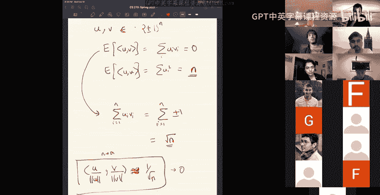

# UCB《组合算法与数据结构｜CS 270 Combinatorial Algorithms and Data Structures 2021》中英字幕 - P6：lecture 6.zh_en - GPT中英字幕课程资源 - BV1uZdpYZEwr

嗯。

ok嗯。Okay， so yeah， right， so in。So you can use the median。And you can show that the median in 1 d。

Is within order epsilon of the true mean。And this is true no matter what the adversary does。

 he could add examples wherever he wants， but it still work。Okay， that's good。 Okay。

 so now what do you do in D dimensions？indeed dimensions， the natural thing。

 the first thing that you try is to do what's called a geometric median。

 what is the geometric median， well the idea is median in each coordinate。ち道。

Compte the median in each coordinate separately。Okay， and this is actually， let's， I mean。

 how bad can this be？Well， in each coordinate， you can be off from the true answer by epsilon。Okay。

 and if there are D coordinates， the total squared distance。

Between your estimate mu hat minus the true mean。True mean minus the estimate。Can be。Like， you know。

 the square distance can be epsilon squared deep right in each coordinate here off by epsilon so。

Basically it's you in the distance you lose like a square root deep。Okay， so。

So if you do a medium you're in trouble because of that and the reason this happens and this happens typically like with these approaches that do you know。

 whenever you do an approach which you does does an operation coordinate wise you lose a square B and the reason this happens is。

ううん。热啲。Coords of your vector。arere not necessarily the natural basis for the problem right note that the problem has no directions with it I'm just saying there's a point that are you getting samples from a Gaussian in some r to the D theres no special directions。

But once you say you're going to do an operation coordinate wise。

 you're picking a basis and this basis was just handed to you。

 somebody wrote down the coordinates in some basis and you're using it and because of the ad hoc choice you were losing this rudely。

you could in particular you know like the natural question is if you did geometric mediumn in each coordinate。

 why didn't you do a basis change and then do a mediumn in each coordinate or something right like a different basis there's no special basis to use。

Okay， so what do you do instead， well， there's something called a twoki median。

So2 key median okay is absorb this fact that， okay， you want to be median in every。W every basis。

 you every basis you want to be a mediumn， so the idea is， okay， you have this data set。嗯。Okay。

 so let's。Okay， for every point we。You can define if every point in your data。

 let's say x is a point in your data， you can define depth of x。To be。诶。

The minimum over every direction。Of how close to the edge it is around that direction。

I'll call it position。Of X in direction me。What do I mean？You know， let me draw a picture。

Better here so if I have， this is my point X Okay， and okay， so now if I look at this direction。

Projection along this direction， you see that there are three points above it。

Well there are three points above it and then you get to x so this is the fourth point in this direction Okay if you start looking at the data set from a different direction I don't know my dataset set is really really sparse let me put some points here okay if I start looking at the data from。

Okay， let me look at a different direction let's say。This direction V V prime along v prime。

 you see that x is the first element that you encounter if if you come from v prime so basically depth is along every direction。

 if I look at the projections along that direction。What is the position？

At which you'll encounter this。Data data set data point and you take the minimum over all the directions。

Okay and what you want to find a median is something that looks appears to be in the middle in every direction that you can think about。

 so you want to find a data point。That maximizes depth。That's what you want to find。

So this is like a point which is in every direction it looks like there are。

It's in the middle like it's there are some points to the left and some points to the right。Okay。

 so we see that okay this is a reasonable generalization of a media， this actually works。

 but it's computationally hard to compute it or we don't have any algorithms to find the two key media。

剧嗯。No efficient algorithms known。And actually， I don't remember if this problem is it。Hard or not。

My guess is it might be hard， but。Yeah。Okay the question was is the position of x the distance to x or how many points are ahead of it。

 the position of x is the number of points ahead of it。

 so for the median the position is n over two because there n over two points on this side n over2 points on that side。

Okay， and you want something that sort of in the like looks like the median in every direction。Okay。

 so that sir。All right， so that's the two key medium and that works。

 but it's computationally really hard to compute。Okay， any questions on this？So accessory。

 what do I mean it works well what you'd want is you'd want a guarantee that looks like the one dimensional guarantee that you would want a dimension independent guarantee。

You want to have a。Error in your estimate independent of the dimension D。And you can get that。

Well professorfes， can you show us again how you calculate the depth for or like at a position for a certain direction V。

Oh it's just right so okay if I look at V direction V， okay。

 then I take my data set and I sort the values of the projection along that data。

Along that direction。Okay， so it's just。But okay， along this direction be。

So then I can project every point along that direction。

Sorry I should have drawn this earlier so you project every point along the direction now we have a array of numbers and you ask where does x come what is the position of x a median would be right in the middle。

Right do dives half the points in this side half the points in that' say position is just like。

 you know。In the sorted list， what's the position？And you want to find a direction V。嗯。

Along which the position is lowest。For example， if I look at this regular hexagon。

The depth of every point is one。Because whichever。Point you want。 Okay， look at this x。

 What's its depth， but its depth is one， because if I pick this direction。

 it will be the first thing you encounter。Okay， depth of this point is also one。

 depth of every point is one。However， if I had the center。

I think its depth along every direction would be too。

Whichever direction you pick it would be insert in the middle。Ex so， yeah。Okay， that's the2 key。Okay。

 so that's good。Soorry。Okay， so now we'll see an actual algorithm to do robust mean estimation。

So what is the like why should we expect this problem to be solvable？Okay。

Why should this problem be solved so here's the。Like the intuition。All right。Okay。

 so basically you have a data set with all these blue points。Which are in layerss。

And then the adversary adds in some red points， which are outliers。Okay， if we can。

 the first approach we try is okay。You don't to identify which are the inliers and which are the outliers。

Okay， but that actually seems very difficult because， you know。

 like they' are somehow arbitly distributed in high dimensional geometry。Okay。

 so maybe that's not what you want to do。But。Maybe you want to find a set。Which has the same。

 you know which might have outliers， but you don't care as long as the mean is the right。

 you want to get get the mean right， you don't want to really figure out which ver is are inliers outliers。

So let's see how can the adversary try to cheat you。

 how can the adversary create a situation where the mean is very different？Okay， so。Okay。

 so let's do it in one dimensions。If your mean is here。If the adversary， okay。

 what does adversary have， he has the power to include epsilon fraction of outliers。

An epsilon fraction of outlayers。Okay， now with Epsilon fraction of points。

 how much can he push the mean？Okay， suppose he wants to shift the mean by deelta。

If he wants to shift the mean by Delta， he needs to。嗯。To shift mean by deta。You need to add。Points。

That are about deelta or Epson away。Great。Because he only has， you know。

 like he can only add epsilon fraction of outliers。If he wants to shift the entire mean by Dlta。

 he needs to add these points very far away， like he needs to add them Delta or epsilon away。Okay。

 if he adds the points which arel shifts the mean by。

 he adds points which are delta or epsilon array。What does he do to the variance？

What happens to the variances？Okay， variants of the distribution。Well。

 if you think about the variance。He has added epsilon fraction of outliers。

 and he has decided to add them。Delta or epsilon away so。So the new variants。Or these points？

They contribute。Epsilon times delta or epsilon squared。

 which is deelta squared over epsilon to the variance。Okay。So。

So you know that your Gaussian has variance one。Meaning all your。

 you know that the typical distance between points， distance squared between points is order one。

Your gusian is variance one。So。You know。If the adversary adds in epsilon points at distance delta or epsilon away。

Then the variance blows up and you'll notice it， right？You will notice it。And the。Okay。

 this is the one dimensional argument。But you can see that this also。Make sense in higher dimensions。

RightSo no matter， let's say you are in some high dimensional space and your mean is here mu。

What can the adversary do well he could add points all around？Then he won't shift to me。

If he wants to， if the adversary wants to shift the mean， he needs to concentrate all his effort。

Along some direction。Along some direction he needs to conate all his effort and he needs to add our outliers with the same kind of dependence he needs to add epsilon fraction of points。

At distance data or epsilon。And then that means that suddenly the variance along that direction will be high。

Meaning if you calculated this covariance matrix， the ellip side that I was talking about。

 you will notice you'd expect that the ellip side。Of your data set to be a unit sphere because that's a standard Gaussian。

 but because he has added this， your ellips side will。Look elongated along that direction。

 there'll be a large eigenvalue or the covariance matrix will have a large eigenvalue along that direction and it sort of scales a delta squared or epsilon。

The point is this argument is completely dimension independent。

 there's no need for the same one dimensional claim also holds in higher dimension。

The only difference is that the adversary could have done this in some direction of his choice。

Right and that's what the geometric median sort of misses it。

 it doesn't know which directions the a is playing so it sort of blindly does median in every coordinate and it loses。

Instead， if you somehow figured out this ellipoid， if you computed the PCA。

 figured out this ellipoid and looked at these elongated directions and you claim， okay。

 these are the outliers， let me just get rid of them。You should expect this to work。

intuitively what you should expect to work is you take your samples， compute the covariance matrix。

 get the large evectors， those are the directions in which the outliers sort of throw them away and you until you get like a nice sphere and that should give you the mean。

Like that should give you a true read。Or closer for me。And that's the intuition behind algorithm。ok。

系。Okay， I see a question about how we define the adversary。

 the adversary here is let's think of the very powerful adversary for now who just looks at the samples that you have and he adds epsilon and samples adversarary to full your algorithm。

He think of really an adversarial situation where there are examples added in。To fool your algorithm。

This sort of happens if you're。Yeah， in lots of learning applications， right？

You're dealing with an adversary who is trying to make your algorithm output put wrong values。

Any other questions on this？So it's a very strong model of robustness。

 but it also makes sense in that another way to say is you make no assumptions on the noise itself。

Youre make assuming sort of a very nasty noise which could be coming from any source and you don't know anything about the noise so that's a nice thing about this sort of a model of robustness in that usually you understand the signal very well okay。

 you understand the signal has to big， but it's much harder to understand what the noise is。

But but these algorithms work without any assumption about the noise。

 just assume that the noise is adversarial， still works。Any。Any other questions on this？

So just just to clarify so the adversary basically you're saying they should pick a direction。

And then。Put points that kind of shifts it in one。Direction along that direction， right。Right， right。

 Yeah， yeah。 So then when you're doing this like spherical thing， you don't know like。Which。呃。

Like which direction they're pulling you towards？But you just know that。Along this direction。

 it seems fishy。That it's like longer， right， yeah。Exactly yeah yeah。

 I mean the algorithm and this sketch of an algorithm I described， you can make it into an algorithm。

 but it's more subtle because right like as you remove points if you just start deleting points you might also delete your own true samples like you might sample date in layers so there is an I mean we'll see an algorithm but that's more subtle but the idea is just that just this geoally the idea is just this。

嗯。Any other questions？Okay， so。嗯。Okay， so let's。嗯。Alright， so let me see what I can do now。啊。Okay。

 so I。Okay， so。Okay， I don't think I'll be able to finish the algorithm which it proof today。

 but I'll try to。嗯。I try to get some way into it。嗯。Yeah。Yeah， okay。But before I。

 I think I should really， I'm tempted to mention this and it's sort of an unrelated a little bit unrelated。

嗯。Thing， but I I think it's。Good to know。诶。So we've been talking about mean estimation right so if I forget about robust mean estimation and all these things let's do the simplest mean estimation that you can do I'm just giving you samples。

From a distribution。梨。On the real line R。Just on the one dimensional thing。

 I'm just giving you samples。And ask you， how do you compute the mean？啊。

Or how do you estimate the mean， I should say， how do you estimate the mean of D？Well， you know。

 of course we' all learned's you have to output the empirical mean。

 which is mu hatus1 over and some ori Xi。Right。But。You know。

 this is actually not the best way to do it again it it comes as a surprise at first。

 but it iss not the best thing to do。Why is it not the best thing to do。

 well let's see what what sort of guarantee you can get about new hat。Okay。

 so what can you say about the empirical mean， well here's something you can say about the empirical mean。

If let's say let's say D is Gaussian。Okay， suppose D Gaussian and you have n samples。Actually， yeah。

 let's say discussionian。Then the probabilityty that they estimate is off from the true mean。

By more than。Epsilon。Is less than Delta。If you have。

If the number of samples is log to log1 over deta by epsilon squared。Okay， so this is。

Basic I mean they can do this by turn off bound or I'm sorry they can do this directly can prove this directly。

 These are a very basic studies if you have samples of Gaussian。

 then you can get this kind of a guarantee the probability that your estimate is off by epsilon。

Is less than delta if you use this many samples to log 1 or delta by epsilon squared Okay， all right。

 so in in particular， note that it converges exponentially。

The probability decays exponentially with the number of samples， right？If I wrote this。

 it would be E to the power。Minus epsilon。Squared and over2。Okay。

 the broad decays exponentially with the number of samples and you get this epsilon squared n over2。

 okay that's good。Okay， that's standard discussion。All right， but you know。

 you come when I give you a distribution， it's not going to be a standard version。

Tpically in a lot of real applications， what you end up with is a power law distribution。

power law distribution is something where the p of x is proportional to x to the minus c for some c。

These are ubiquitous like lots of distributions， you just。

 I don't know sizes of cities or salaries of people， lots of things power law distributions。

 they're never goed， so many things are never goians。And then you can ask， okay。

 does this guarantee still hold in that case？Estimating the mean。Well， no。

 the empirical mean does not give you exponential convergence。

Emirical mean only gives you polynomial convergence。this is a digression。

 but I think it's important to know。Okay， so what do you do then？Well。

 there is a very clever algorithm。It's called the media of means algorithm。

That you use what is the medium of means algorithm， The idea is just。You take your samples。

Put them into K buckets。ok。😊，Let's say randomly put them into k buckets and compute the mean of each bucket。

And then。Compute the median of those numbers。So you take medium of mu one from UK。

The media of means algorithm is。嗯。Let me just write it so mediumn of means。Yes。Let mui be the mean。

Of the numbers。In the I bucket， bucket eye。Split the data into K buckets。

And then you compute the mean of each bucket and then you output an estimate。

 which is the median of these k means。ok。Okay， this actually turns out to be much nicer。

In what sense， irrespective of what your distribution is。

 this gives you two exponential in minus k convert probability。This gives you。E to the minus k。

Probability， you know， mean， I'm going to be a little bit loose here。

 I'm going to say this gives you for。Confidence Delta。Accuracy， epsilon。

You need and you need number of samples， which is like。Order， log1 over delta by Epsilon。

So it's sort of the same as as if the distribution was Gaussian。

 it's almost the same as if the distribution was Gaussian， except for the constant factor。

 it gets you the right number of oide log epsilons quite yeah。

 it gets you the right number of samples up to a constant factor。

Okay okay that's pretty cool right so it's a very simple modification empirical mean and it gives you the roughly the same number of samples needed a as if the distribution was Gaussian and this is actually very heavily used。

啊。嗯。In streaming algorithms where you sort of。Construct a complicated algorithm estimate that gives you an estimate of some number and you want to improve that estimate。

 you use a million of means in and means。Okay， there was a question on are these buckets ranges now these are just random buckets。

 so just these are randomly partitioning n objects into K bins arbitrarily I mean I could have said x1 through x n over k in the first bin x2 and the next n over k samples and second bin and so on。

 it would be fine。Okay， so that's good Okay， this is from the 80s this mediumn of means is from the。

80s。嗯。There's something， okay， the problem is still one dimensional。

Even in the one dimensional problem with something unsatisfactory about it。

 we lost a constant factor here in the number of samples。

You think that computing the mean of numbers on a line is like so basic that we should actually figure out。

Like the constant right。As in。Can we get two log 1 or delta by Epsilon squared？

Like like we do in a Gaussian， like you can prove that you can't do better than two log1 over delta epsilon square。

 meaning if your distribution is Gaussian you can't do better， be temper mean。

But can we get two log 1 or del Epsilon squared？Okay， and。The answer is yes。So just I think。

I'll post a reference the on the website， but course website basically very recently there a paper by Valiant at all who。

Who show an algorithm。To compute。One dimensional mean。

So that you get the number of samples you need is to log。1 over delta by Epsilon squared。😔。

You know times one plus little of one。But basically。

 it's asymptically2 log1 or delta of epsilon squared。Yeah。So， that's。

I mean it's from like it couple of months ago a few months ago， so I just wanted to show it so that。

Like even on the basic question of computing the mean on a line。

There's still things to do and this is not the end of the story。

 I mean I'm sure there is more to do in even in this question。嗯。And just another side note。

 another digression on this。啊。Again， we did all this discussion in one dimensions。

You could ask what about D dimensions if again I'm getting points in D dimensions？嗯。

If it is Gaussian， I can get some guarantee， which looks very similar to here。

2 log 1 over deltapsilon squared， it looks like that。Okay， if it's not a Gaussian， if it's power law。

 it's just an arbitrary distribution， can I still get the same guarantees as a Gaussian？

In higher dimensions。And that corresponds to asking， how do you。

 can we do this mediumn of means algorithm in higher dimensions？

And then you end up with the same issue we saw earlier。The median is a one dimensional definition。

 it's easy to define median in one dimension。In higher dimension you end up with this very nasty Tuki mediumn that we talked about in every direction and so on。

 it becomes intractable。So actually in higher dimensions， the median of like this。

It this medium of means。Isn't like。In it， you can replace by 2k media。

 but then you can't compute it efficiently。So just。A year， I guess a year or two ago。

 maybe year and a half ago， a year and a half ago， they discovered the first efficient algorithms。

To compute。嗯。Hide like D dimensionmenional media， D dimensionional mean， sorry。

 three dimensionsal mean。With same guarantee。As a Gasian。Up to constant factors。是。

Up to constant factors hasn't。The number of samples。

Is what you'd expect order log1 over delta by Epsilon。Okay。And。We still， of course。

 don't know whether you can do it in one D dimensions with that exact constant。

 like you want two log whatever ever。Right too law also thanks yeah too law yeah。

 this is a law in orderal excellence code yes。Okay， and that。I guess yeah I went on digression。

 but I think it was good to of starting a new algorithm， but this。Yeah。嗯。

This area is called heavy tail statistics where you're dealing with distributions that have heavy tails。

Like the power law in conulsion。嗯。And。Medium of means is an important easy important algorithm not because it's such a small modification to the mean algorithm。

 but it gives you。Much better confidence bounce than just computing the empirical mean。All right。

 yeah， I should say this area called heavy tail statistics。Any questions on this？

There is a question about how do you choose K right， how do you choose K？诶。

The mediumn of means algorithm gets a parameter about Delta， which is how confident you want to be。

And you pick k depending on Delta。I think essentially you pick K to be log1 over delta， essentially。

It be care to be log one ordered。So this is one aspect about these medium of means algorithms in that。

The algorithm is different， depending on how confident。You want your parameter to be。

Your estimate to be。For different values of deelta， you would have to run different algorithms。

hi is necessary in this case， there is no single algorithm that gives you this log 1 over delta by epsilon squared sort of a bound for all values of delta。

Unlike the empirical mean， its just the same algorithm。

 which is just take the average of the numbers， which gives you this bound for all Epsilon and Dlta。

So you to decide on Dlta and then pick k to be log of or log1 or Dlta。Any questions on this？

Yeah don加嗯。Stop your next class， we'll actually do the robust main estimation algorithm encrypt take。

More than 20 minutes should be less than 20 minutes。I just have a question about a small detail。

 so you were saying that。I think you said something about when you pick points in high dimensions then there。

Pretty likely to be orthogonal or something can you just elaborate on that？Right， so that okay。

 so that's the following thing。 So imagine you have。Let's say let's say you pick two vector。

 let's say you do the following experiment if you pick two vectors and standard Gaussian vectors right so then the expectation of you in a product we the。

This is like somera UIVI。And this expectation is zero。The length of the vector， of course， is U U。

 this would be sum over Ui squared。Let's do plus minus1 simpler to think about random plus minus1 vector。

Okay， and then this will be N。Okay， so the expectation of the angle is of course， zero。

 which is true clear because。U and we are independently chosen plus minus one vectors in nine dimensions。

You know， the inner angle can be the innerer can be posture or negative in the cancelor。

But actually not just the expectation if you like。你面。嗯。

Like you can calculate things about the expectation， for example， things about inner product。嗯。

actually another way to see this is if I look at some over UI VI。

 if UI VI are random plus minus1 vectors。RightThen this is sum of n random plus minus1 values。Okay。

 and basically， if I have some of n random plus minus1 random Gaussian or whatever。

 their magnitude is roughly rot。Okay， so。So what have all we concluded is if I pick two random vectors。

 their inner product will be root n。But their length is n， so if I normalize the vectors。

 like if I look at u over the length of u times v over length of v。Right being a product。

Of the unit tractors is like one over rootant。So I guess this is the key conclusion and you can prove it by this directly calculating it。

 but just to understands the random variables， it basically the point is in n dimensions。

 if I pick two random vectors their inner product will be one over square root1 roughly。

Order  one over square root 1 so if n is 3 to be order1 over root 3 to be like a constant in a product。

 but as n goes to infinity， you see that this goes to  zero。

So that's the I mean that's the point so now I think this book by Hcroft Blum and Canan has a lot of it is some information on this in the first chapter。

 but basically if I look at the unit sphere in n dimensions，Okay。

 let's say I picked the first vector upwards like this like okay。In end this n dimensional ball。

Theres in sphere， if you pick the first vector you are pointing this way。

No matter what you do whenever you pick a random vector。You will。

Find it to be lying somewhere in the equator。With。来 you know。

Like the width of this script is like ordered one hour route 10。This is the unit ball。

 the radius of the ball is one。But most of the time with party exponentially decaying pro like。

 you know， the party that you C over root n is like e to the minus C。C square0 to the minus ci score。

 so basically most random points will be here。We'll have in a park one hour routine。

So in that sense they are the inner product is like one over 10， which is。嗯。

So so most of the masks will be here and you know。You can also write， you can。

Apply union bound if I had two vectors， U and U prime。Okay， so。

With with very high priority the inneror with U will be one over very close to zero with very high priority inality with U prime will also be close to zero。

 so just by union bound， whenever I pick a point with very high priority in product with both you and U prime will be close to zero so if you keep picking random vectors you'll keep getting very very close to orthogonal vectors。

Most of the that。Very close isn in like one over root and close， not really as N ghost infinity。

 it's quite as close as ever。Yeah， most of the mass is close to the equator if you pick any pole。

That's one thing yeah， another thing that's true about high dimensional sphere is that most of the mass is in a thin way super thin shell。

if I look at the ball。Almost all of the volume is close to the boundary， it's like， you know。

Route n plus or minus constant one order one like a little strip around。

 most of the protein masses around the boundary。Yeah， I mean。

 these are all very natural consequences， if you just observe the random variables there。

 there's some of independent terms and it's easy to prove these facts。

