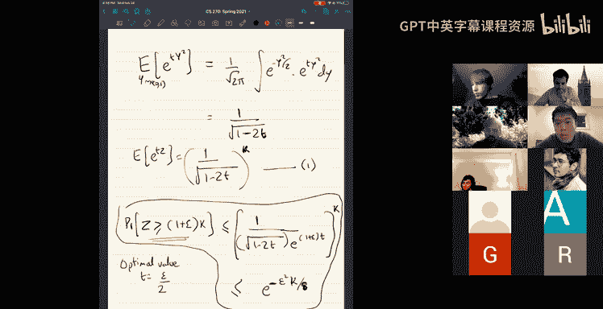

# UCB《组合算法与数据结构｜CS 270 Combinatorial Algorithms and Data Structures 2021》中英字幕 - P9：lecture 9.zh_en - GPT中英字幕课程资源 - BV1uZdpYZEwr

Yeah， so。Thanks thanks for reminding me。 So we're just talking about this these embeddings。

 which you know it's just a broad idea。Then we see fairly heteroous set of examples in this and the idea is you want to take some problem which is in some a high dimension or a domain which is difficult to work with and map it to map the inputs to a problem space where things are much easier to solve maybe it's lower dimension or so on。

And。The first example we'll see for this is。ADenss reduction。So。So。Right， okay。

 so dimension reduction， well， it's just， you know， you have。Endpoint in。D dimensions。

And you would want to map them。To a lower dimensional subspace like。A to the gate。For some small kid。

Okay， so that's what you learned。And you know， of course。

 you would allow to use randomization in the process and you don' want to preserve properties of this point set when you do this mapping。

So let's do look at the most extreme thing you could try， the extreme thing you could ask for is。

One dimensional em。Okay， so so you have。Okay， you want a map from D dimensions。To one dimension。

And of course， you're thinking of this map as randomized。No。And。You could ask， okay。

 what can you really。I see you here。Well， clearly， you know， in one dimensions。

 you can't really preserve much structure of the point set。But there's still quite a bit。

You can achieve by one dimensional projections and you know this will be like a building block when we build higher dimensional things。

And so the simplest thing you could try is random projections。So what would random project be？

So pick a random direction。子。And then you project all your points onto the direction。

 take the projection。 So I'm just going to say that your map。Corresponding to G， corresponding to G。

 you would define this map。It is。G of x is in a product of x with G。

So it's just geometrically points。Or you have some。Data set。

 and I'm just picking a random direction Z and looking at the。

Just projecting them onto this direction。So it gives me a map from D dimensions to one dimension。

Okay， and of course。We have to decide how we pick this random direction G。

 well really we want to pick a uniformly random direction from all the possible directions on the sphere。

嗯。And you know you'd want to pick uniformly random point on the sphere and project everything on that。

 but you know a clean way to do it would be to just imagine this G to be a Gaussian vector。

Let's just imagine to be a Gaussian vector。With deco coordinates。Rachel。Okay。

 so we have a randomized map。Okay， so how good is this randomized map Well already this has some very nice properties。

 so here's a claim。The random G。The random G constructed as above gives an unbiased estimator。

For square length。So it does preserve distances in a sense， in the following sense。

 so what it means is if I pick any vector of x in r to the deep。P pick any vector x， then， you know。

 if I look at。嗯。The expectation of。G of x， whole squared。

That is expectation of G in a product X whole squared。Over the choice of my random vector G。

On average。It's proportional to the length of。嗯ん。不。咁So it。

It's really equal to and we don't even need a proportional。It's equal to the length squared of x。

Okay， so。So。So what I'm claiming is the expectation of G in a product X whole squared。

Is I claim that it's equal to the length of x whole squared。So what why is that， Well。

 I just expand it out its expectation of。Smation G， I X， I， I equal to 1，3 d。Poold square。Right。

 and then this is。X is fixed， remember that x is fixed and G is random。

So what are we getting here some over IJ， X I， X J expectation of GI GJ？Okay。

 and what is expectation GI GJ， well G remember that G1 through GN are IID Gaussians。

That's what we said G to GNR。And therefore， the expectation of GIGJ。

 this is basically one if I equal to J。And zero the。

So the expected value of the one dimensional project squared is actually just sum Xi squared。

 which is the length。Okay， so。In expectation， it preserves the length of x。

Because G this map G of x is equal to G in a paratex， this is linear， it's a linear function。

So you also get once you preserve length， you also preserve distances。Because if I'm interested in。

Okay， I'm interested in what is G of x minus G of y。Whole square。

Expectation of this for two points x and y。 Well， this is， of course， equal to。

it'll be t in a product x minus y。The whole square。

And that will give you normm x minus y holds squared。

So this gives you a map from three dimensions to one dimension。

 it's a randomized map and all on on average the squared distance between points is actually equal to the squared distance between the points in the original space。

And of course， this is on average because clearly when you take a D dimensionsal。Space。

 and you map it into one dimensional space。 You will end up destroying a lot of distances。 In fact。

 there are lots of distances that go to zero。Pectly， because projection。

 there'll be a d minus one dimensional space， which goes to zero。

So lots of distances in any given map。Get could get destroyed doesn't get could go to  zero， but。

On average over of these maps， it has this nice property。Okay， so that's。这。And okay。

 so what more can we say about these G of x？So let's just， you know we know its expectation is right。

We can say a lot more things， you know， firstly， here's some。I mean， what is G of x。

 we said G of x is summation G X。Okay， always X is fixed。嗯。And G is a random Gaussian in vector。Okay。

 so it's a linear combination of Gausians and one thing I you know I want to sort of recall is the following you know properties of Gaussians。

嗯。Basically， linear combinations of Gaussians are Gaussians。Yes。In fact。Like， you know， if x is like。

X has mean mu and variance sigma squared， and y has。明牛 do。And variance sigma 2 squared。

 then x plus y is a Gaussian with mean mu 1 plus mu 2 and variance sigma1 squared plus sigma2 squared if x and y are independent。

If you take two independent Gaussians， their means add up and the square of the variance is add up and in general。

 you know all of the。So in fact， you can。喂。If you look at G of x， its expectation of course， is zero。

 expectation of G of x is right， it's expectation of a Gaussian sum G XI。

Where each Gaussian has mean zero， right？So you means zero gaugeuss， and so expectation is0。

 the variance of G of x。Which is a variance of。The summ G XI。嗯。This is equal to the length squared。

The length of x squared。That's sort of what we saw expectation of G of x whole squared is actually the length of x squared。

Okay， so。And moreover， it's a Gaussian， right。So for any given vector for fixed x it's actually a Gaussian so we know a lot more about it。

 it's not just these two expectation variants we know that it looks like this it's distribution oh this is fix x。

And over random G。We know that it looks like this with know a width being like Noromics。

The length of x Okay that's。不是。All right， so this is actually very good already and just this idea alone。

嗯。Has applications to streaming。Algothms in particular。The streaming algorithm to estimate。

To estimate。The second moment。In。So。嗯。For now， I will not get into what streaming is。

 I think a lot of。First have seen what streaming is in the undergrad 170 class and and so I'll sort of。

嗯。Skip over this for now and well come back to we'll come back to this。

 I can come back to defining what streaming is， the model of streaming is and so on later later on in this lecture if I get if we get to that。

Okay， so let's move forward and。What is it that we want to do now well， okay， so firstly。

 we have this one dimensional map。And it's on average， it gets you the right length。

Or you know little right length on average And so now can we improve this and the like the natural way to improve an estimator。

Like if you have an estimator for some quantity。For some。Quantity， like your est x hat。For some。

 some quantity X， the natural way to improve the estimator is to take。Several estimates。

 and average them。Like what's wrong with this one dimensional map is it has too much variance。

It's on average， its length is the right， but its variance is too high for us。 We'd。

 We'd like something that。Preserves distances even more strongly。

 as in something some preserves distance with high probability。

With a tiny bit of error right so then natural trick to improve an estimate is to take many many copies of it and take the average。

Okay just repeat the experiment and take the average。 So let's do that。 So here's what we'll do。

 I'll define。Okay， so here's what I do。 I I want to define。And embedding into higher dimensions now。

I want to take D dimension， of course we have D dimensional vectors， I want to map them into。

Some dimensions， K。K dimensions。Okay， how do I define this？ Well， the idea is just a pick。

Do the one dimensional em。K times big。G1 through GK。昨の？Sgaussian vectors。

Like pick K directions in your space。And。You know， you sort of。Define G of x to be just。G1 x。G2 x。

GK X。The vector consisting of the k different projections onto these directions。Okay。

 and for convenience， I think it's clean to just put a normalization factor here。

 I'll put a normalization over over square root k。In the front， but。Apart from that， it's。

This is repeating the estimator K times and taking the average。佢。To see that， you know。

 suppose I ask， what is the length？What is the length of G ofx？Well。

 the length of Gfx is the sum squares of its coordinates， so you get1 over k。

So you see that what we got is the average of k estimates estimates。As a length in some sense。

 and so it'll behave much nicely than the original random variable so you can check that the expectation of the average length。

This is still。You know， it's still equal to the length of the original vector。

Just because linearity of expectation。ok。嗯。But what happens when you take k copies of an estimator。

 independent copies and take the average is that the variance drops by a factor of k。So in fact。

 the variance of this average length。Is actually 1 over k。

Times the variance of an individual estimate。And。So therefore， like it's as if。嗯。Yeah。

 so the norm square of G of x is much more closer to x or the it behaves。

It's more closely concentrated to X Okay， And this is like a general fact about。Essentially。

 independent random variables。 if you had an， you know， independent random variables。

Take the average of k of them when the variance of the average is one over k times the variance of individual ones。

それ作る。O。All right， so that's。嗯。All right， so okay， what do I want to prove about this？Well。

 what I want to prove state or prove is the following。Fact， it's called。Dbutal。Johnson Lynden Str。

Rights a DJL， so I guess what does it say you it's it's just you know。So。

So fix some epsilon in zero to half， like less than half。Okay。And fix some。Vectctor。

 particular vector。In D dimensions。Okay。嗯。Now， you look at。The length of Gx。As defined here。

 you look at the length of G of x squared。Right。呃。What do we expect it to be and what we want it to be。

 we want it to be。with。So I'm going to write。Write it。

Within a  one plus or minus epsilon factor of the true length。Okay， we want this to be true。

And the claim is the probability of this is at least one minus delta。

If you pick the number of dimensions。To be， at least。

Or sorry about if you picked that number of dimensions to be。At least， let's say。电log。

1 over deelta by。Epsilon square。好。Okay， what does the claim say for any given vector x？

The random map that we defined here just take K random projections。

Preserves the distance up to one plus or minus epsilon factor within one plus or minus epsilon factor。

With high poverty。If you pick the number of dimensions to be log 1 or of epsilon squared。

 you preserve the distances within。With broadly 1 minus delta。Okay。And。Yeah， so right， thanks yeah。

One thing I sort of did was I really what I had to say was the norm of Gx squared is in the interval。

1 minus epsilon times noomic squared。To one plus epsilon times Noromic squared。

The ratio between those two point is within one minute epsilon and one per epsilon and。I'm just。

Abusing notation and saying， oh， it's equal to one plus or minus epsilon times Noromic squared what I really mean is it's in that interval。

The ratios in the interval one mispsilon to one co Epson。Okay。So。😊，Any questions on this？Right。

 so how do how does one。Prove such a fact。Well， let's what let's see what these were。

So we call that we have fixed text。We fixed x。 and now we are looking at。The length of G x squared。

 and it's we said， it's independent。Gopies of。K， independent copies of these random variables。

 and each of these random variables is actually。A square of a Gaussian。Okay， and moreover。

 let's just know normalize x x to be length one just for simplicity right for simply because the statement is sort of homogeneous。

 you can always assume the length of x is one that sort of scales the same way。 So by normalization。

 let's just say the length of x is one。 Then really each of these elements is square of a standard Gaussian。

Okay， so the setup is something like this， you have a K standard Gaussians y1 through Yk。

And in some sense， what you're interested in is the random variable。

 which is z is equal to the average of the square of these Gaussians。

And what you want to know is what is the probability that this average of the square of the Gausians is in the interval negative  one minus epsilon。

 sorry。Is in the in1 minus is epsilon to  one plus epsilon。Two别。

You want to prove that z is concentrated around its expectation expectation of z is1。

And you want to prove that Z is considered artist expectation。Okay。😊，Wantna prove that this case。O。

So， you know。A standard method in proving this concentration of aspec of independent sums is to look at the moment generating functions。

 so let me just do it。就。So the idea is。Okay， we're interested in the probability that。嗯。Yeah。

Let's say I'm interested in the property that。You know what， actually it may be cleaner I。

 some things will be cleaner if I define Z to B。Just the sum of the variables and。嗯。

We are interested in the probability that's K times。When money is obps wrongps。It's no difference。

 just scale it。It just cleanになる。So expectation of z is k。No。嗯。And we want to know this product。Okay。

 so interest in the probability that z is let's say too large let's understand how you'd bound this what's the chance that z is bigger too large。

So。To the。因 mean the。So the idea is to first apply。Marco。To say that。Yeah。嗯。Yes。So I'm sorry。

 let me just start forward。So， yeah。SoSo。So you want to know。This。嗯It。Okay。

 I'm just going to write it and then we'll understand why that's the case。 This is expectation of。

E to the power T Z divided by E to the power t times。One plus epsilon K。He， why is that true？诶。Well。

 it's just this following basic silly Maro thing。More coin inequality。

 I have any random variable if I have random variable a。Right， if I want to know。

What's the chance that is bigger than some value theta？I could do the following， I could say。

Let me look at。Expectation。off。FO a。Solect not even even the F ofA it can do expectation its utmost expectation of a divided by theta。

あ。So this is Marco's inequality。So I'm assuming theta is greater than zero and you have this inequality。

This is just you know because expectation A is some more。I pro of equal to I。系。And so therefore。

 it's greater than pro of。A bigger than theta times theta。早走。嗯。Okay， so anyway。

 so so and now what you're doing is you're applying Markov inequality on not on Z itself。

 you could apply it on z or you could apply on z squared which gives you chbyf inequality。

 but we are going to apply it on the moment generating function， which is e to the Tz。

So we're going to directly apply it on e to the Tc for some T。Pick some tea。we will pick a tea later。

Okay， but for now， just think of TSM real number and we can do this。

And the key is that you can apply Markconqu in any function。

 but somehow applying it on this E to the DZ actually gives you optimal reserves for many things and it also works well with independence as we'll see soon。

Okay， so let's say we want to bound the right hand side， Okay， what is expectation E to the Tz。Well。

 it's an expectation of e to the t times summation Yi squared。That's z' summ y squared。

 so some of those random variables and by independence。Well， actually， let me just do one more。

 So this is expectation of product of E to the T Y I squared。아 equal do one，3께。Okay， and。

These Ys are independent random variables， so expectation of the product is product of the expectation。

So。嗯。So I will end up with。Product of expectation E to the T Y I square。没达词。玩自己。

Okay and of course each of these Ys are just Gaussians right I mean。

 like we said the Ys are standard Gaussians here。And so each of these K terms in the product are the same。

 So let's not use different letters for them。 This is just。Expectation of e to the T times。Y squared。

Hold to the king。はい。Okay， so now we are left with this set thing。

 we need to compute the following thing， we need to compute the moment generating function of the Gaussian distribution。

If I take a y is the standard Gaussian， what is the expectation of e to the TY squared？Well。

 you know， you can。Just do it， you can just expand it， you know。

 the Gaussian measure is e to the minus y squared over  two。

 and then you multiply it by e to the t y squared。理外。And you can check that this is one over。

Square root 1 minus20。Okay so。嗯。Okay， so。See substitute here。

 you'll conclude that expectation e to the Tz is 1 over square root 1 minus 2 T。Hold to the cake。

Okay， and so this is。What you conclude and now substituting back into our Markov。

You'll get probability that z is bigger than or equal to one plus epsilon k is smaller than。嗯。诶。

This quantity。Okay， and note that I have， okay， so that's what you get。

That's an upper bound on the probability now and I can pick any value of t that I want。Okay。

 so I'm going to pick a value of T you know which will make this work I think I think you have to pick T to be。

Something roughly around Epsilon over2。Epsilon or two times one plus epsilon。

 but basically you end up if you pick the optimal value of T。

To get the best possible upper bound here。嗯。You will get an upper bound。

 which looks like e to the minus。Epsilon squared， Well。

 I don't think this is the best thing you can do， but you can get this bond either the minus epsilon squared K or8。

Okay， so that's。The bone。All right， so I sort of tried to breeze through this calculation。

Quite quickly。But， you know。And why did I do it at all if I had to just breeze through it the I think the only。

 I mean the key ideas I think which I want you to remember， if you haven if I've seen this。

 it's likely that many of you have seen such calculations earlier as's well and good if you haven't seen it。

 the key thing that I want you to remember is sort of there's two conceptual ideas one is。

This idea that if you want to prove an upper bound on the probability。

You can pick any function of your random variable。That you care about so in this case I picked E to the tz as a function and apply markco on that right you could have picked a simpler function。

 for example I can just pick z squared then you will you will get the chbiche inequ or you could pick expectation of z to the 10 right and if you pick the10 moment like the expectation of z to the tenth youll get some other bound and。

In many cases， you can't really pick E to the Tz the moment generating rating function because it's not bounded。

 its expectation is not bounded in that case， you pick the highest moment that you can pick like z to the 10 or z to the fit 20 or whatever moment you can pick So that's one idea that if you want an upper bound of probability。

You apply marker on a function of your random variable。So time诶。Okay。

 and the second idea which I want you to sort of remember， is this particular choice of。

Random variable meaning this moment generating function e to the Tz。Expectation e to the TZ。

That actually behaves very nicely under independence。Like if I looked at expectation z to the 10。

Right then I'll be looking at summation Yi squared hold to the10。I mean， you can calculate it。

 but it's sort of more。嗯。I mean， it's more messy。The cleanest thing when you have independent random variables is this exponential moment e to the T Z and then you know。

 you're you're able to use independence to。Break the expectation of the product to the product or the expectations and calculating this becomes a pleasure almost。

 so it's quite simplified。Anyway， so this is what you get as the poverty bar。Any questions on this？

Yeah。Okay， so， so that's sort of the thing。 And， you know， So now， I mean。

 you see that the bound we got e to the minus epsilon squared K over8。 I this I did for the。

Upper tail meaning and well upper bound of the pro that z is not too large。

 similar you can do the lower tail and you can basically show that probability that z is in the range that you care about like k times 1 minus epsilon。

21 plus epsilon。Right in this range with probability at least one minus， I guess。

2 equal to the power minus epsilon squared k over8。So therefore， you know。

 you can pick if you pick K to be like。10 log1 over and by。Epsilon squared。

 you get that this probe is at least one minus de。Okay that's a。的。嗯。So so。嗯。Okay， so。Okay。

 so so that the proof aside。I think the the most important statement here is that is this statement that for any given vector x you your。

GX。Has the right length with priority1 minus delta。And you can。By increasing the dimension。

 you can actually。Increase the you know， you can increase this probability， right？So in particular。

 for example。a natural thing that will happen。Like in many applications。

 let's say you have n data points。Okay。And data points and you want to in R to the Df course and you want to map it to r to the K。

Right and what you care about is。All pairwise distances。

You want let's say you want to preserve all pairwise distances， okay？Right。

Then how do you preserve all pair distances while you say， hey， you know。

 there are you know n squared distances here。Okay， and we know that every。Like， you know。

 preserving firstly， recall that G is a linear map， so preserving Gx I minus Gxj。

Right the length of GXM and GXj， this is the same as。G times x s is xg。

Right so therefore like really you just have to preserve if you preserve length。

 you preserve distances because of linearity here so。Okay so so you have these n squared vectors。

 x si minus is xj vectors whose length you want to preserve so there are n squared distances。

 let's say you want to preserve all distances with probability1 minus delta what do you need to do well each distance if you preserve each distance with probability delta over n squared。

You preserve each distance。With Pro D delta or n squared。

Then you preserve all distances with property that one minus delta。So I should say each distance is。

Is。Preser with probability t1 minus delta over n squared。

 meaning you mess up the distance with probabilityty at most delta or n squared。

 then by a union bound， you mess up any distance at all with proty at most  one minus delta。

So this implies all distances。Aret preserved with poverty。1 minus delta Okay。

 so that's is just you know， it's union bond。So we just pick in the question。

 now I know what value of Dlta I want。 I want Dlta or n squared as my value of Delta。

 So that implies that I just need to pick my dimension to be log n。啊。Right， it's a。

It's going to be log n plus log 1 over delta by Epsilon squared。OkayIf I pick。If I fix。K to be this。

 then with probability t1 minus delta， all pairs。X， I， X， J， satisfy G， X， I。Minus G X J。Is。

Within one plus or minus epsilon factor of the actual distance。

It's actually quite surprising when I first saw it， I don't know when。

But it's quite impressive to me at least that you can give me any if you have endpoint。

 you only need log， you can always reduce it to log n dimensions and preserve all the distances more or less。

So啊。几时日上。And this is called this is called the Johnson Lynden Str map this is called this is usually what's referred to as Johnson Lyndens Str dimension reduction it's saying you know another way to say it is if you give me any endpoint subset of r to the D it can be embedded into a log n dimensional subsetspace subset of。

And points in log intervention。Okay， so the question is why there was a question of why this should be log n there should be log n squared here yeah I think it should be log n squared really what I should have said is then order log n plus log 1 or times。

Between constant factors， it's log n+。你看。Yeah。对。I think two ss。

 I think two ss actually 10 or something right right。

 so but basically order log n plus log on or enterpson score。All right， so this is pretty cool。

 it has lots of applications。You know you can imagine any you know in many data structure questions or。

A lot of the times when you。Dealing with vectors and you really care mostly about distances between these vectors。

Yes。You know， this dimension reduction is very useful to reduce the size of your。Data structure。

 also to。Speed up many things。Yeah， there's a lot of applications of this sort of dimension reduction。

And。So。What I'll do next is I'll。嗯。I'll we look at something stronger about this dimension reduction and we look at an application of that there's a lots of I mean jail is like a very basic tool Johnson lets trust you can。

Yeah yeah。嗯。Yeah， there's way too many lots of different applications。 So let so so。

Let's move on a little bit further and see something and more nicer that you can see about this map。

 this randomized map。Okay， so。Allright， so I'm going to show you。嗯。

So let's call this subspace embeddings。Oliviious subspace em bes。😔。

So one thing I want you to note about these this map between from higher dimension to low dimension is that it's actually data independent。

as in our map。wa not really clever it just picked a random linear transformation from by picking random Gaussian entries。

 it's independent of the data and you can actually do better if sometimes if you look at the data and pick up a map。

And in fact。For dimension reduction and distances and dimension reduction。

 is a unique optimal thing to do always， which is to compute the PCA and。Pick up the top K。

 That's the best possible dimension reduction for L2 distances， at least in a sense。

 like in in in essence， it's sort of the best term for in L2 error in the。

But that's you know but computing PCA is expensive， it's data dependent。

 you can't do it incrementally meaning if your data is coming one at one at a time。

 you can't really do it， but this is data independent it's you can do it incrementally you can just you know you just have to remember this matrix G so every time you get a new data point you just compute GxN right its you can do it in streaming world and it's quite useful。

Yeah。Because of that right and that's what okay。So what is subspace embeddings。

 so subspace embeddings is the following notion。So， I have a。嗯。嗯。Yeah， let's say I have R to the N。

Right， I have RQ then。Okay， and I have。D dimensionional subspace sitting here。Okay， and。

I want to preserve distances between every pair of points in S。

Or preserve all length inside us in so saying distance every pair of points。

 let's say preserve all lengths。Wness。I want to apply dimension reduction while preserving all length within this subspace。

So like formally， another way to say this is let's say the subspace S is handed to you by a matrix。

 so has a matrix。It's an n by D matrix。Okay，s like I think of it as a tall matrix， you know。

 if you want you can think of D as like10 like it a very low dimension， but a lot of data points。

But a lot of rules。Okay， so just think of a is this and let's say your subspace is the column space。

Column span of a。The span of the columns so it's a low dimensional it's a D dimensional subspace sitting inside some really large dimension ambient dimension。

 which is n。Okay， and what do you want to do， you want to preserve all lengths within the subspace。

 meaning you want to construct a map。嗯。Construct。A map。G。From。Oh。G from r to the n。Do。

Some small dimension are to the K。Such that。For every vector in the subspace。

 if I pick any vector x in the subspace。Its length should be correct。GX。Should be within。

One plus or minus epsilon of its length。So there are like。In a sense， I mean。

 one way to think of it is or here we were worried about distances between n data points。Okay。

 and somehow here we in this application we are thinking about。

Preserving all infinite all distances between infinitely many points in the subspace if you give me any pair of points in this subspace their distance between them should be preserved all of the infinitely many points in the subspace right that's what you want it's。

And you're only given the subspace as a matrix and you're going to preserve all everything in the column span。

Okay that's the goal。And why would this be like this would be really useful I claim。

 so to show you why it would be really， really useful。Like let me show you。

 there's many applications， but let me show you one application。ALar regression。

So what is linear regression？You have a。咦。And what you want to do is to solve for x。

Such that ax minus B。You want to minimize。Or x a x minus b。

 that2 norm squared this is L2 linear regression。At the squared means means least square fit。Okay。

It's the least square fit that's enter linear regression。And。诶。What you want to do。

 you want to preserve。啊。So you want to solve this L to linking a regression problem。Okay。

 and think of this as you know， just like for me it's useful to sort of have a mental picture of these things sometimes at least I when I think of this I think of n as really large like let's say you know。

You know， you have data set if the rows of N data sets is your data set like all the every person in the world has1 hundred features means height weight or something like height weight whatever like every person has like a。

There are billions of people。And。Each of them has like 10 features and he has this data set。Okay。

 and you want to fit some line。You want to say， okay。

 if the height is this and the weight is this and then his name starts with an A or something like some you want to fit a line now right on the data then the natural question is can I do I really need to keep track of all these since I'm only working in 10 dimensions right the whole thing is happening all of the action is happening in like a ddial space like a 10 dimensional space only 10 features for per person do I really need to remember all the end points or can I compress the data to have only in like a small number of rows。

喂。So here is。what you do， okay， if you had this oblivious subspace and that we talked about here。嗯。

Okay， suppose I apply that map G。Okay， here's what happens。On the subspace。I play that Mac G and。So。

The following。Smaller problem， G a。X minus G B。其实。So I'm applying the。

So I'm applying this dimension reduction on the columns of a。And also on the vector B。First。

 apply dimension reduction on the columns of A and also on the vector B。

Now I get smaller vectors and I。Solve linear regression in this smaller dimensional space。

Clearly it should be much more efficient to do linear regression in smaller dimensional space。

 and that's what I do。Okay， and。Why does this work？Well。Basically， because。嗯。U。Okay。

 let let's look at the。So。So， let me do。一 so。Okay， so。

So let so you solve this linear regression problem on this smaller thing and let's say you get back。

To get。The solutionution。So let's say x hat is obtained by actually minimizing。This smaller problem。

Okay。Now I want to know how good a solution is exact in the original data。Okay。Well。

 how do you do that Well， what is its error in the original data set？Okay。

 this is an error in the original data set。For exact。嗯。But this is。Right， within。One plus or mine。

Minus epsilon factor of the error on the reduced dataset set。是。Right， this is just。ok。All。

 this is why is this true， what I'm applying doing here。

 I'm looking at S to be the span of the columns of a。And the vector B。

If I look at the columns of a and the vector B， the span of that is some D plus one dimension subspace and ax minus B lives inside that set。

A minus be losing that it's inside that subspace because it's the span of columns of A and B a x hat minus B and therefore it has its okay。

This is good and now。You know。Let's compare it with how you would do， if you。

If you actually solve linear regression in the original space， select let X star。

Be the actual linear regression， you solve it in the original space without this mapping。给。Okay。

 now how do I compare well。Clearly because x hat minimizes in this projected space。It's。

Its value is going to be smaller than。X star in this projected space。Right just because。嗯。

Okay that's step one， step one I've used obli space and buildings second one I'm second step I'm using the fact that X hat is the best solution in the projected space。

 it's clearly better than X star。ok。嗯。All right， actually， let me be even more precise here。嗯。

This is less than one plus epsilon times this。Okay， and then。

This is less than one plus epsilon times this。Okay， now。AX star minus b is also in the subspace。

RightIt's also some other vector in the subspace， which is the columns of a and B the span of that。

 therefore。Again， I can unproject these and I don't change the value by utmost like within a one plus amount minus epsilon so I get。

Within another one plus or minus epsilon factor。Let's assume the worst case thing， you know。

 it's another one minus epsilon。Factor you get。A star minus b。And what is a x star minus B。

 this is the true。True minimum in the original， right true minimum。嗯。Okay， so。来。

I think I could have said these four lines of calculation better。

 but there's really not much content there if you just got this intuitive idea it's all there is the idea is just that。

The columns of a and B form some subspace and in that subspace you're trying to find the best fit Everything is happening in that subspace So if you preserve every pair of distance between that subspace then。

Like your best fit would be as good as the true best fit right is within one plus or minus epsilon fact。

So that's the idea and you see it's a massive improvement in the runtime now right if or in fact it's it's a very like it's surprisingly good compression right because I mean if you just think of this example at end people。

 each of them had 10 features right you can compress the data set to some order。定。

Data points you don't need m people right you can compress it to a data set which has only like a constant number of rows and do all your linear regression problems on that constant size matrix instead of。

In options thing。Okay。So I I to state the theorem， the theorem is going to be。Again。

 the same way if you pick。G by at， you know， by random。Pig g equal to G1 through G K。嗯。

each of them is a standard Gaussian。To the power N。ItIt's just the good old setup that we had。

 a random map， right？Then。If you pick the K to be at least order something like。AndD plus。

Log one over Delta by Epsilon squared。It will come to what this dimension is。

 but it pick sufficient some then。嗯。Then with probability 1 minus delta。Then for every subspace。

We pick any subspaces。With probability 1 minus delta。

You preserve all distances even inside the subspace。Norm of G。X。Is。1 plus or minus epsilon normal x。

For x in the subspace。And the key point to remember here is。

You don't know the subspace right you know you can always run PCA on your data and confine this subspace and so on。

 but these things are these routines are meant to be much more efficient than running PCA so in some sense you don't know the subspace a priorityi and the claim is that you're just going to pick a random matrix and whatever the subspace was with with high priorityty it would work against that subspace。

So嗯。So for every subspace you will be right with probability T1 minus delta and of course in your particular case。

 like on your particular input， it would be some subspace and on that subspace you would work with Pro1 minus Dlta。

So that's why it's called oblivious sub space em。Okay， so let's。嗯。

Any questions on this and there are many applications of hobby subspace embeddings you can speed up PC。

 you can speed up matrix multiplication， you can speed up K means lots of different algorithms by。

Doing this sort of a trick。And we just saw how linear regression works out there。

You can not only speed up， you can also compress data set right。

 as we just saw in this year the the number of data points you or the dimension you end up with only depends on。

This dimension of the subspace。Not on your original dimension n it's independent of the original dimension n you are living in。

 it only depends on your dimension of a sub space。That you care about So if you care only about lines。

 it would be。Like a constant right and so it if care about 10 millm it to be a constant。Okay。

 so that's about that's a theorem now I'll sort of show you how this is proved。

Because it has this one idea， I think it's also not an idea from CS or and I think it's an idea from probability。

 but so many of you might have seen it， but just in case it's a good proof technique to know。

So what is the situation here， well， I want to prove that something holds for every point inside a subspace。

Okay， so remember what happened for endpoint， when we had endpoint。

 the way we did it was we looked at， okay， there are n squared different distances and we said let's do a union bound over these n squared different distances to say something works out overall。

Now it seems like we have。Infinitely many different vectors in this。

Subspace and somehow union bound over these infinitely many different points being seems like。But。

So like what do we want to prove， we want to prove that if I pick K to be whatever it is。

Order D plus log and orderta by epsilon squared， I want to prove that for every point in the subspace。

 bad event doesn't happen。So what's the bad event？Its length doesn't shrink too much， let's say。

Right。sorry。I want to say event。The bad event。So if I look at a bad event， which is Bx。

 which is a bad event， which is its lens shrinks too much， I want to say this doesn't happen with。行。

And so there it seems like infinitely many bad events that can go wrong and you can't seems like you can't do union bar right and this is like a natural thing when you're trying to do these things or continuous space trying to。

But。And one of the natural tricks here is to pick what's called an epsilon net。Okay， so the idea is。

Let's not worry about every possible act。Imagine I picked like something like a grit inside this space。

Okay， so like you know， I want to prove something nice happens for every point inside the space。

 let me pick like a grit of points here。Not infinitely many points， but like a grid。

And then prove that。ち。Nothing bad happens on these grid points and if nothing bad happens on these grid points you would hope that nothing bad happens anywhere else it won't extend it right so let's me define what an epsilon net is。

Okay， what's an epsilon net， so let me define what an epsilon net is for an epsilon net。For a set。嗯。

B。In like if I take a set B， an Epsilon net。Is。Is another is a finite set of points。喂。

An epsilon net N for a set B is a set of points。Such that。Sot of points N。Such that。

For every point in my。B， there exists some y which is close in the net。Which is close。Okay。

 let me not use epsilon because we already have epsilon to mean something else。

 though usually they call it epsilon net， but let's call it gamma。

 a gamma net is something where for every point there is a point within gamma。Okay， so。Like。

 you know， if I want to pick a net for this square。let's say I picked like a grid， for instance。ok。

 now。For every point in the square there is some point in the grid which is within a distance gamma like if I pick the grid length to be gamma for every every no matter where youre on the in the in this square you can reach one of these grid points within a distance gamma and then this grid is a gamma net and what we'll be interested in is to pick a net for the ball。

In the subspace， So you have a。So let's say you have the unit wall。In the subspace。Okay。

 this is basically set of all points which are inside the ball。

 inside the subspace whose length is one less than one。Or unit ball， let's do unit sphere。

 okay as' unit sphere in the subspace。What will be interested。

 what we'll do is we'll pick a gamma net。Net for this ball。Okay， so think of it。

 it is just I would visualize it as this a sphere， not a ball let's visualize it as sphere and on the surface of the sphere you're sort of picking a bunch of points。

 I mean hopefully like like a grid or something so that every point in on the sphere you can reach one of these grid points within a distance gamma。

Okay， and technique would be will show that。For each of these gridit points are the points in the net。

You're embedding preserve lens。Okay and then because it preserves length for all these grid points。

 it also ends up preserving length for every point in the sphere， the continuous space。Okay， so。

So the strategy would be。嗯。ToS that with probability。1 minus delta。For every grid point。

 for every y1 y2 in the net。Okay， the embedding preserves length， but let's just say it preserves in。

Yeah。Yeah， let me just say preserves。And meant。ok。Let's say this is。但是完。嗯。

And then you then we'll show that if Jeep reserves length for every point in the net。If for all。

 why in the net。GY is close to y。The length of GY is close to its true length。

Then for all points in the ball。Unit ball， unit ball in S。For all points x in the unit ball and S。

 you would have the length is also preserved。So that's the two step strategy。

Okay so okay so the first step is going to be the easier like it's the sort of easier thing all right so this net has I mean we started with something which is infinitely many points but this net has a finite number of points right why is that。

Well， you know just imagine you have a like you have a D dimensional ball in your mind and you put one point in the net another point。

 another point eventually after finite number of points you'll fill up the whole space right you'll be able to reach it's like a grid and。

In fact， you can pick the size of the net。It will be something exponential indeed deep like。

1 over gamma to the D。Okay， you can pick a net whose sizes like exponential in the dimension。

It's just what you'd imagine， right， I mean， even without proving like you know a grid in D dimensions will have exponential in D number of points。

So if you sort of pick a grid with side length gamma， then you would have to。云乐。

You'd have that to the poverty points in the grid。And like formally to prove that you can pick a net with this many points。

 the formal argument is you can use volume， for instance， you can say。Okay， I have the ball。

 I'll pick a point and now I'll take out the little gamma radius ball around it。Okay。

 if anything is left， if any other point is still left。

 I'll pick it in my net and sort of you you take this the way you pick a net is。

Like this greedy strategy， you have this ball， okay， I pick one point。

Now I can delete this gamma fraction board， pick another point， delete the gamma fraction。

 pick another point， delete the gamma fraction， repeat， okay， how long can you go well。

It's the you can only go for like if the volume of the big ball is。

Ded by the volume of the small ball。The big ball is of radius1。

Because is you look at unit balls and the small ball is of radius gamma。

You can only go for that long because each time you sort of take eating up a little gamma ball。

 you can't really go for longer than that。And。啊。嗯。Yeah， I mean。

 that's sort of the basically that there are many ways to construct the net。

 but that's so so basically you， you know， a thing to remember is the size of a net is like exponential in D one over gammar。

嗯。Okay， now if I have this many points。Like exponential in D points。

 then you know let's just do what the kind of union bond we did earlier for end points and we just had end points we got a log n over Epsilon squared right？

Okay， we can do the same thing here， right you have exponential in D points。Okay， you know。

 just by the same union bound thing。I just need to pick dimension more than log of the size of the net。

Right plus log1 over delta variable。Yeah， Epsilon Square。Right， it's just the same thing。

Just with the net。 now that gives you the right answer。 This gives you D plus log1 over delta。

By Epsil Square， okay， that's easy。也重さ。So， okay， so。

So the bound in this theorem comes about just by the size of the net。

 this D comes from the exponential in D points in the net and everything else is the same。Okay。So。

All right， so let me see if I can sketch the other argument。So okay。

 so now this is sort of the key argument that you want to make。闹。We have the ball。

And we have the net and we are fine on the net， we preserve length on the net。

What we want to do is want to preserve lengths。On every point in the set on the on the ball Okay。

 and once you preserve distance on every point in the ball。

 you also preserve distance on every point in。A to the deep just by just because it's linear。

 everything is linear。So once you get the ball right in subspace， in the subspace。

 you get by scaling， just by scaling you preserve length of everything else。

Because our map is linear。So really the key thing is to understand what happens for the unit ball。

Okay， so for the unit ball， you have this net and we have done this。So。意思。So the so。Right。嗯。Yeah。

 actually maybe I should not do this it's a very short proof it's like a you know。

 it's less than 10 minutes， but。More than two minutes。 So I don't want to rush through this proof。

 but。あ。It's quite doable I mean it's cute so I just want to do it some point。

 I think I'll do it in the beginning of next class。嗯。Yeah。So but you know。

 that's how you get this obvious subspace membranerating bond。

And what else I mean there's a lot you can say about jail。嗯。So。There's a whole firstly。

 the this is optimal， you can't really。What let me go back to the theorem this。

 the dimension for n points， you need log n over epsilon squared。This bound is optimal。

 You can't beat it in。As in you can't get a better dimension reduction。What else？

Like one thing that's。There's been a lot of work on is to actually。Make jail faster。

Make this dimension reduction faster， so what do I mean。Well。

 what do you need to do in order to do this dimension reduction？You need to compute g times x。

Right so what we said was G is a random Gaussian matrix， basically Gaussian entries。Okay。

 so it's a dense matrix Every number is is non zero， it's a dense Gaussian matrix Okay。

 so the dimension is said k。咪。What K by N or K by D， K by N that K。K by D right K by D matrix。

It's a dense matrix， so multiplication by that is not super fast。If you want to make it faster。

 you'd want structured matrices like G be structured。

And there are many way or either it's G structured or it's sparse。So there are many。

 many constructions of。Structure and sparse matrices。

W still satisfy this Johnson Lyden's trust condition。So here's a。Niceer construction。嗯。So。

You let me say how it maps a vector x， okay， take a vector x。First， you apply。

A matrix which is random signs on the diagonal， alternately the map。Flip the signs randomly。

Flip signs of X randomly。Okay， this you can do easily because it takes order， you know。

 just go over the entries of x。In order D time， you can do that。Okay。

 and then after you flip the signs randomly。You apply the fast Fourier transform on the vector。

This is a fast pull transform matrix h。Well， I just mean the Fourier transform matrix。

 but you can compute the fast Four transform。Efficiently， right？So。そい。So your map G it。Okay， sorry。

So and then after you。After you flip the sign and apply the FFT。

You just select a subset of the coordinates。Select some small number of subsets of the coordinates。

Like you know。the first two steps didn't do any dimension reduction。

 the first step just flipped the signs， the second step applied an FFT so you didn't yet reduce the dimension it's the third step you just pick a bunch of coordinates some set of K coordinates。

Okay， see note that this transformation you can compute quite efficiently。

 I mean not super efficiently， but more efficiently than just the random Gaussian matrix multiplication。

And this works， this gives you jail， I mean， this has the same properties has an imp lens and everything。

 fast jail。So essentially， your matrix G is like a product of a diagonal matrix with science times the Fourierran matrix。

Times like a selection matrix selection as it just selects a bunch of rows。

Like a small number of rows， like literally you want whatever log in rows or something right。

 you want to select log n rows yeah。这 let's啊。So you apply 15 and select a small number of rows。

 small number of entries， so that gives you fast jail there's also sparse constructions of jail where。

嗯。You can construct matrices G， which are fairly sparsed， most of the entries are zero。

 and it still de preserves lens。嗯。And there's a little extensive work connect it。

I guess we won't get into it in this class I think I'll stop here in the next class i'll actually do this proof this short proof it's kind of cute and then then we'll move on to different kinds of embeddings。

Any questions？Yeah。So there's a question about。嗯。I see there's a question about the size of the epsilon net yeah。

 so this is a bound on the number of things。嗯。Maybe I'm right， so I'm missing a factor of two here。

Right。Yeah。嗯。So。So so that。So the greed algorithm gives you a net of that size。

You just keep eating up balls of radius gamma。And you know that your centers are at least gum over two away。

It's sort of， yeah。嗯。It's a。Yeah。Yes。Yeah this big ball， you eat up a ball you pick a point。

 pick a ball around it， pick a point， pick a ball around it and repeat。

And now if you find a new point， you know that every other center is at least。Gamma away from you。

 that's of course true。And， therefore。If I picked a ball of radius gamma over two around myself。

It won't intersect a ball of ladies gam over or two around him。So。So， yeah。So therefore。啊。

Like you can't go for more than volume of the original ball derived by the volume of the ball of radius gamma or two。

Steps。Yeah。Proor。Yes， the construction of fast jail。

Does that make is that inspired from sketching matrices？Doing the accounts catcher， right， Yeah， yes。

Yes， definitely。 Yeah， in fact， like I。Yeah， I mean a lot of the work is in the sketching literature it's so the sparse jail matrix is a count I mean count sketch is an example of a sparse jail construction yeah but a lot of the work here。

Actually， it comes from sketching literature and streaming and sketching literature。嗯。Yeah。

 I its I've been sort of。Not mentioning many applications， but。

There's a lot of applications and details into all of these things。

Inspecially into jail and all its applications and so on， mostly in the streaming sketching world。

Yeah， I think if you look up Profeor Nelsonson's class from last semester。

s a lot of it is Johnsonman's Trust， it's a very heavily used tool there。嗯。Yeah。

