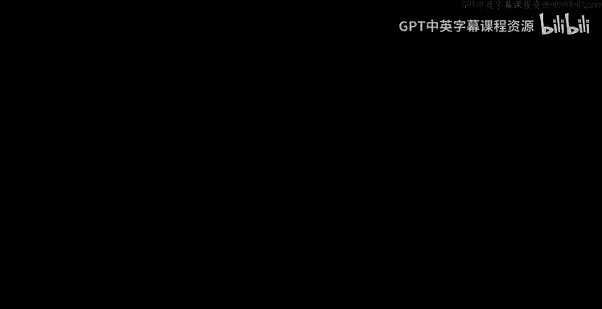
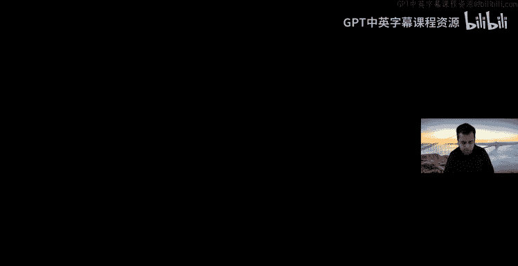
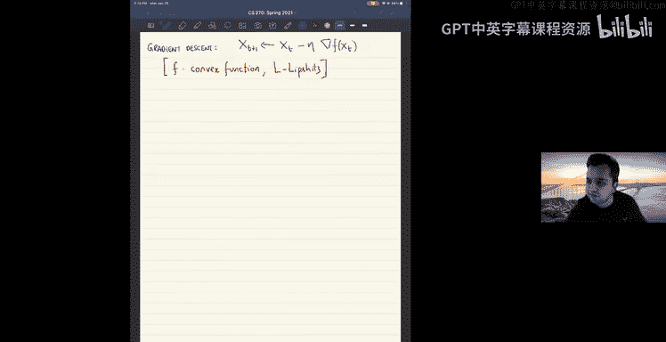
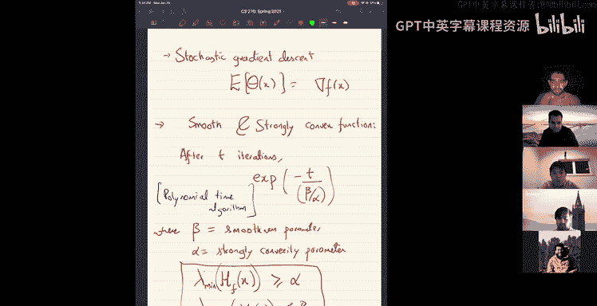
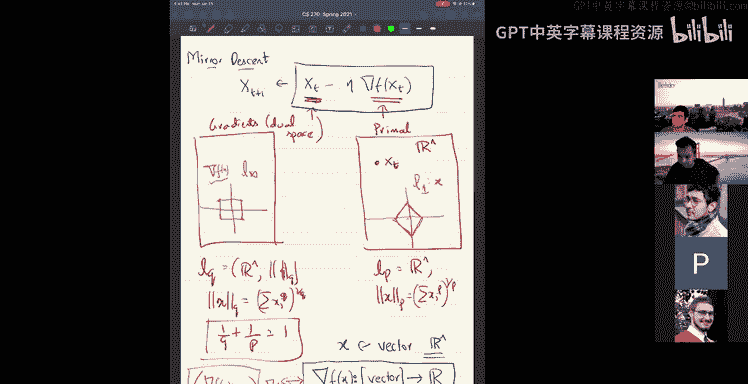

# 2：凸优化与梯度下降法

在本节课中，我们将继续学习凸优化作为算法设计工具。我们将完成梯度下降法的证明，并介绍其扩展——镜像下降法。课程内容将涵盖梯度下降的分析、投影梯度下降、随机梯度下降，以及如何通过选择不同的正则化项来推导出不同的优化算法。

## 梯度下降法证明回顾

上一节我们介绍了梯度下降法的基本迭代公式。本节中，我们来看看如何严格证明其收敛性。

梯度下降法用于最小化一个凸函数 \( f \)。我们假设函数是 \( L \)-Lipschitz 连续的，即其梯度范数有界：\( \|\nabla f(x)\| \leq L \)。算法从初始点 \( x_1 \) 开始，迭代更新规则为：
\[
x_{t+1} = x_t - \eta \nabla f(x_t)
\]
其中 \( \eta \) 是步长。

我们的目标是证明，经过 \( T \) 次迭代后，函数值的平均值与最优值 \( f(x^*) \) 的差距存在上界。

证明的核心步骤如下：

1.  **利用凸性**：对于凸函数，在任意点 \( x_t \) 处，其梯度方向提供了指向最优解 \( x^* \) 的下降方向信息。具体不等式为：
    \[
    f(x_t) - f(x^*) \leq \nabla f(x_t)^\top (x_t - x^*)
    \]

2.  **代入更新规则**：将梯度 \( \nabla f(x_t) \) 用迭代公式 \( (x_t - x_{t+1}) / \eta \) 替换，得到：
    \[
    f(x_t) - f(x^*) \leq \frac{1}{\eta} (x_t - x_{t+1})^\top (x_t - x^*)
    \]

3.  **应用余弦定理（极化恒等式）**：对于向量 \( a, b \)，有恒等式 \( 2a^\top b = \|a\|^2 + \|b\|^2 - \|a - b\|^2 \)。将其应用于上述不等式的右边项 \( (x_t - x_{t+1})^\top (x_t - x^*) \)，可得：
    \[
    f(x_t) - f(x^*) \leq \frac{1}{2\eta} \left( \|x_t - x_{t+1}\|^2 + \|x_t - x^*\|^2 - \|x_{t+1} - x^*\|^2 \right)
    \]

4.  **求和与 telescoping（裂项相消）**：将上述不等式对 \( t = 1 \) 到 \( T \) 求和。右边的 \( \|x_t - x^*\|^2 - \|x_{t+1} - x^*\|^2 \) 项会裂项相消，最终只剩下首项 \( \|x_1 - x^*\|^2 \) 和末项 \( -\|x_{T+1} - x^*\|^2 \)。由于末项为负，我们可以将其舍弃（这会使不等式更宽松）。于是得到：
    \[
    \sum_{t=1}^{T} [f(x_t) - f(x^*)] \leq \frac{1}{2\eta} \sum_{t=1}^{T} \|x_t - x_{t+1}\|^2 + \frac{1}{2\eta} \|x_1 - x^*\|^2
    \]

5.  **利用 Lipschitz 条件**：根据更新规则，\( \|x_t - x_{t+1}\| = \eta \|\nabla f(x_t)\| \leq \eta L \)。代入上式：
    \[
    \sum_{t=1}^{T} [f(x_t) - f(x^*)] \leq \frac{1}{2\eta} \cdot T \cdot (\eta L)^2 + \frac{1}{2\eta} R^2 = \frac{T \eta L^2}{2} + \frac{R^2}{2\eta}
    \]
    其中 \( R = \|x_1 - x^*\| \) 是初始点与最优点的距离。

6.  **选择最优步长并求平均**：为了最小化右边的上界，我们选择步长 \( \eta = \frac{R}{L\sqrt{T}} \)。将其代入并除以 \( T \) 得到平均 regret 的上界：
    \[
    \frac{1}{T} \sum_{t=1}^{T} [f(x_t) - f(x^*)] \leq \frac{RL}{\sqrt{T}}
    \]
    这表明，经过 \( T \) 次迭代，函数值的平均值以 \( O(1/\sqrt{T}) \) 的速率收敛到最优值附近。

这个证明的关键在于利用了凸函数梯度提供的方向信息，以及通过裂项求和简化分析。该收敛速率对于仅满足 Lipschitz 条件的凸函数是最优的。

## 梯度下降法的变体与评论

上一节我们分析了基础梯度下降法。本节中，我们来看看它的几个重要变体和相关性质。

### 投影梯度下降法

当优化问题带有约束，要求解 \( x \) 必须位于一个凸集 \( K \) 中时，我们使用投影梯度下降法。其迭代步骤如下：
1.  计算梯度步：\( y_{t+1} = x_t - \eta \nabla f(x_t) \)。
2.  投影回可行域：\( x_{t+1} = \Pi_K(y_{t+1}) = \arg\min_{z \in K} \|z - y_{t+1}\|^2 \)。

其分析与标准梯度下降法类似，只需在应用余弦定理时，将 \( x_{t+1} \) 替换为 \( y_{t+1} \)，并利用投影算子的一个关键性质：对于凸集 \( K \) 内的任意点 \( x^* \)，投影操作不会增加与 \( x^* \) 的距离，即 \( \|\Pi_K(y) - x^*\| \leq \|y - x^*\| \)。利用此性质，分析过程几乎完全相同。

### 梯度下降法的性质

以下是关于梯度下降法的一些重要评论：

*   **维度无关性**：收敛速率 \( O(RL/\sqrt{T}) \) 与问题维度 \( n \) 无关。这意味着该方法可应用于高维甚至无限维空间。
*   **收敛速率**：\( O(1/\sqrt{T}) \) 的收敛速率对于非光滑的 Lipschitz 凸函数是最优的。要达到精度 \( \epsilon \)，需要 \( O(1/\epsilon^2) \) 次迭代。从计算精度角度看，这属于**次多项式时间**。若要求误差为 \( 2^{-B} \)（B 比特精度），则迭代次数为 \( O(2^{2B}) \)，是指数级的。
*   **梯度估计**：算法只需要计算（次）梯度。在实践中，即使只能访问函数值，也可以通过有限差分等方式估计梯度。
*   **随机梯度下降**：当只能获得梯度的无偏估计 \( \tilde{\nabla} f(x) \)（即 \( \mathbb{E}[\tilde{\nabla} f(x)] = \nabla f(x) \)）时，可以使用随机梯度下降。上述分析框架经过适当修改后仍然适用，因为期望运算可以与证明中的内积等操作交换。
*   **更快的收敛**：如果函数具有更好的性质，收敛可以更快：
    *   **光滑函数**：如果函数梯度是 Lipschitz 连续的（即函数是光滑的），可以获得 \( O(1/T) \) 的收敛速率。
    *   **光滑且强凸函数**：如果函数同时是光滑且强凸的，梯度下降法可以实现**线性（指数）收敛**，即误差按 \( O(c^T) \)（\( c < 1 \)）衰减。这是真正的多项式时间算法，因为要达到 B 比特精度，只需要 \( O(\log(1/\epsilon)) = O(B) \) 次迭代。

## 从梯度下降到镜像下降法

前面我们看到，梯度下降法在非光滑情形下收敛较慢，且其更新规则在数学上存在一个“类型不匹配”的问题：参数 \( x \) 属于原始空间，而梯度 \( \nabla f(x) \) 本质上是对偶空间中的线性泛函。直接相加在几何上并非最自然。本节我们介绍一种更通用的视角——镜像下降法。

### 梯度下降的另一种形式：近端梯度视角

梯度下降法可以重新表述为以下“近端”形式：
在每一步 \( t \)，寻找下一个点 \( x_{t+1} \)，使其最小化**线性近似**加上一个**二次惩罚项**：
\[
x_{t+1} = \arg\min_{x} \left\{ \eta \nabla f(x_t)^\top x + \frac{1}{2} \|x - x_t\|^2 \right\}
\]
求解这个二次函数的最小值（令梯度为零），恰好得到标准的梯度下降更新：\( x_{t+1} = x_t - \eta \nabla f(x_t) \)。

这种观点的优势在于，它明确地将算法分解为两部分：
1.  **模型**：在当前点对目标函数进行一阶（线性）近似。
2.  **正则化/信任域**：添加一个惩罚项 \( \frac{1}{2} \|x - x_t\|^2 \)，防止新点离当前点太远，确保线性近似仍然有效。

### 镜像下降法：推广正则化项

镜像下降法的核心思想是：将上述二次惩罚项 \( \frac{1}{2} \|x - x_t\|^2 \) 替换为一个更一般的“距离”函数，即 **Bregman 散度**。

给定一个严格凸函数 \( h \)（称为 **距离生成函数**），其对应的 Bregman 散度定义为：
\[
D_h(y, x) = h(y) - h(x) - \nabla h(x)^\top (y - x)
\]
几何上，\( D_h(y, x) \) 度量了函数 \( h \) 在 \( y \) 点的值与其在 \( x \) 点线性近似之间的差距。对于凸函数 \( h \)，这个值总是非负的，并且在 \( y = x \) 时为零。当 \( h(x) = \frac{1}{2} \|x\|^2 \) 时，\( D_h(y, x) = \frac{1}{2} \|y - x\|^2 \)，就回到了梯度下降的情形。

镜像下降法的迭代步骤如下：
\[
x_{t+1} = \arg\min_{x \in \mathcal{K}} \left\{ \eta \nabla f(x_t)^\top x + D_h(x, x_t) \right\}
\]
其中 \( \mathcal{K} \) 是可行域。

### 镜像下降法的实例

通过选择不同的距离生成函数 \( h \)，我们可以恢复多种重要的算法：

1.  **梯度下降法**：选择 \( h(x) = \frac{1}{2} \|x\|_2^2 \)，则 \( D_h(x, x_t) = \frac{1}{2} \|x - x_t\|_2^2 \)。
2.  **乘法权重更新/专家算法**：在概率单纯形上，选择 \( h(x) = \sum_i x_i \log x_i \)（负熵），则对应的 Bregman 散度是 KL 散度：\( D_h(y, x) = \sum_i y_i \log(y_i / x_i) \)。由此导出的镜像下降法就是乘法权重更新算法。
3.  **预条件梯度下降**：选择 \( h(x) = \frac{1}{2} x^\top A x \)，其中 \( A \) 是一个正定矩阵。对应的 Bregman 散度是 \( D_h(x, x_t) = \frac{1}{2} (x - x_t)^\top A (x - x_t) \)。求解镜像下降更新步骤会得到 \( x_{t+1} = x_t - \eta A^{-1} \nabla f(x_t) \)。这相当于在不同坐标方向上使用不同的步长，可以适应目标函数在不同方向上的曲率，从而加速收敛。
4.  **牛顿法**：一个更激进的想法是，在每一步使用目标函数 \( f \) 本身的局部二阶近似作为正则项。即，令 \( h_t(x) = \frac{1}{2} (x - x_t)^\top \nabla^2 f(x_t) (x - x_t) \)，其中 \( \nabla^2 f(x_t) \) 是 Hessian 矩阵。这等价于在每一步最小化 \( f \) 的二阶泰勒展开，这正是牛顿法。牛顿法在初始点足够靠近最优解时，具有极快的超线性收敛速度（如 \( O(\log \log(1/\epsilon)) \)）。

镜像下降法的优势在于，它允许我们根据问题的**几何结构**选择合适的距离生成函数 \( h \)。例如，在概率单纯形上，基于 KL 散度的几何（乘法权重）比基于欧氏距离的几何（普通梯度下降）更为自然和高效。通过“镜像”映射（由 \( h \) 的梯度映射及其逆映射定义），算法将对偶空间中的梯度信息“映射”回原始空间进行更新，从而解决了类型不匹配的问题，并使得算法能自适应问题的几何。

## 总结

本节课中我们一起学习了凸优化中梯度下降法的完整证明及其重要变体。我们首先回顾并严格证明了梯度下降法对于 Lipschitz 凸函数的 \( O(1/\sqrt{T}) \) 收敛速率。接着，我们讨论了投影梯度下降、随机梯度下降，以及函数具备光滑性或强凸性时可能获得的更快收敛速率。

随后，我们引入了更一般的镜像下降法框架。通过将梯度下降重新解释为“线性近似加二次正则”的近端形式，我们自然地将二次正则项推广为 Bregman 散度。这一推广使我们能够根据问题域的内在几何选择不同的距离函数，从而得到如乘法权重算法、预条件梯度下降等一系列重要算法。镜像下降法统一了这些看似不同的算法，并强调了在算法设计中考虑问题几何结构的重要性。