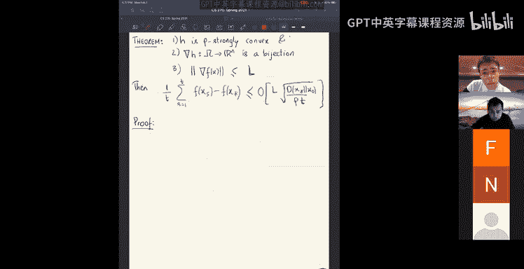
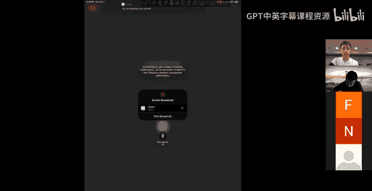
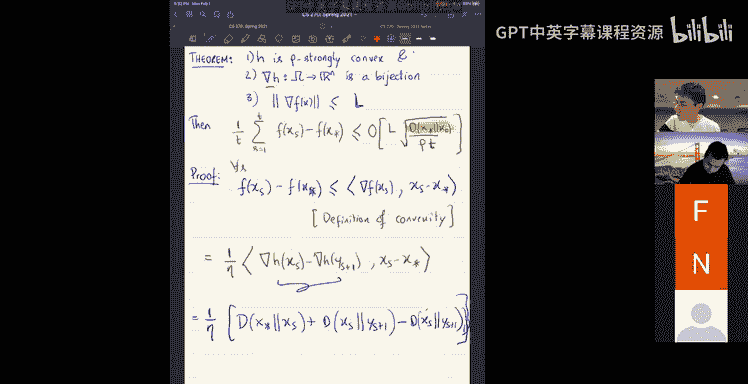
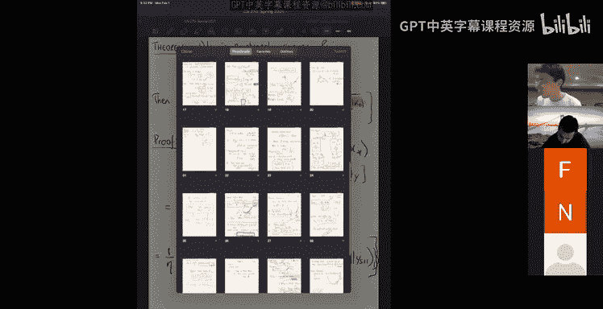
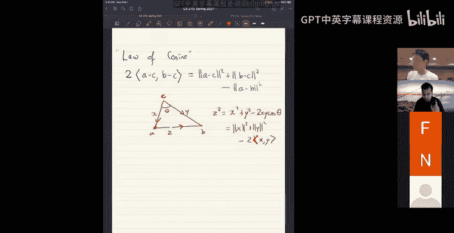
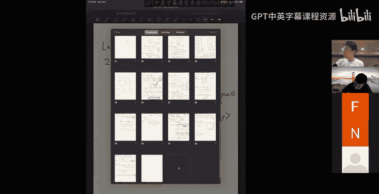
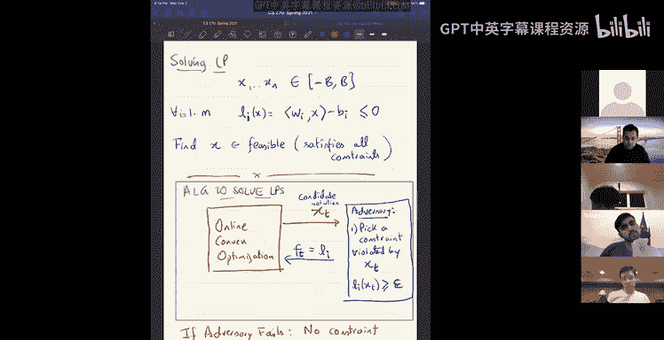
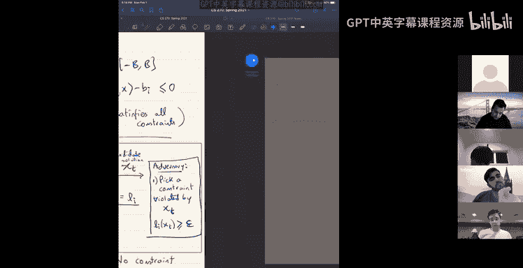
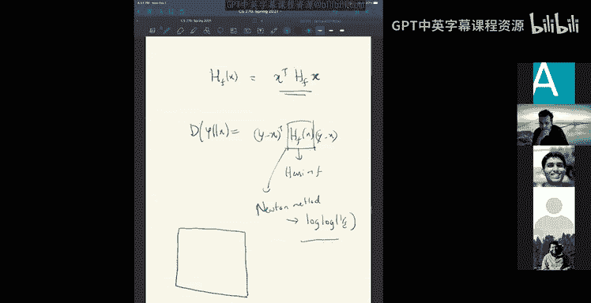
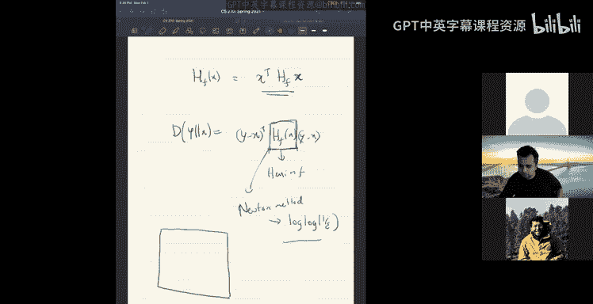

# 3：镜像下降与在线凸优化

在本节课中，我们将要学习镜像下降算法的证明框架，并探讨其在线凸优化中的应用，特别是如何利用它来求解线性规划问题。

上一节我们介绍了镜像下降算法的基本概念，本节中我们来看看其证明思路以及更广泛的应用。

## 镜像下降算法回顾

镜像下降算法的起点是一个强凸函数 **H(x)**。例如，**H(x) = (1/2)||x||²** 就是一个强凸函数。强凸函数满足以下性质：对于任意 x, y，有 **H(y) ≥ H(x) + ∇H(x)ᵀ(y-x) + (μ/2)||y-x||²**，其中 μ > 0。

给定强凸函数 H，我们可以定义布雷格曼散度 **D(y, x)**。这是一个非对称的“距离”度量，定义为：
**D(y, x) = H(y) - H(x) - ∇H(x)ᵀ(y-x)**

布雷格曼散度衡量了点 y 相对于点 x 的线性近似之上的高度差。

基于此，镜像下降算法定义如下。假设当前点为 **x_t**，函数 F 在 **x_t** 处的线性近似为 **F(x_t) + ∇F(x_t)ᵀ(y - x_t)**。算法通过最小化该线性近似加上一个由布雷格曼散度构成的惩罚项，来找到下一个点 **y_{t+1}**：
**y_{t+1} = argmin_y [ η ∇F(x_t)ᵀ y + D(y, x_t) ]**

其中 η 是步长。通过求导并令导数为零，我们可以得到关键方程：
**∇H(y_{t+1}) = ∇H(x_t) - η ∇F(x_t)**

如果优化问题带有约束 **x ∈ K**，我们还需要将 **y_{t+1}** 投影回可行域 K，得到 **x_{t+1}**。投影使用相同的布雷格曼散度：
**x_{t+1} = argmin_{x ∈ K} D(x, y_{t+1})**

因此，镜像下降的一步可以形象地理解为：将当前点 **x_t** 通过梯度映射 **∇H** 送到对偶空间，在对偶空间中执行梯度步 **-η∇F(x_t)**，然后通过逆映射 **(∇H)⁻¹** 映射回原空间得到 **y_{t+1}**，最后将其投影回可行域 K 得到 **x_{t+1}**。

## 镜像下降的收敛性证明（概要）

以下是镜像下降收敛性定理的证明概要。假设 H 是强凸函数，∇F 的范数以 L 为界，则经过 T 步迭代后，有：
**∑_{t=1}^T [F(x_t) - F(x*)] ≤ (1/η) D(x*, x_1) + (η T L²) / (2μ)**

证明的核心步骤利用了凸性、布雷格曼散度的“余弦定理”以及投影的“勾股定理”。

1.  **利用凸性**：由 F 的凸性，对于最优解 x*，有 **F(x_t) - F(x*) ≤ ∇F(x_t)ᵀ (x_t - x*)**。
2.  **代入梯度关系**：利用从算法推导出的关系 **η ∇F(x_t) = ∇H(x_t) - ∇H(y_{t+1})**，将梯度项替换。
3.  **应用“余弦定理”**：对于布雷格曼散度，有恒等式：
    **⟨∇H(a) - ∇H(b), a - c⟩ = D(c, a) + D(a, b) - D(c, b)**
    这类似于向量空间中的余弦定理。
4.  **应用投影的“勾股定理”**：对于投影 **x_{t+1} = Π_K(y_{t+1})**，有不等式：
    **D(x*, y_{t+1}) ≥ D(x*, x_{t+1}) + D(x_{t+1}, y_{t+1})**
    这类似于钝角三角形的边长关系。
5.  **求和与 telescoping（裂项相消）**：将上述不等式对 t 从 1 到 T 求和。利用散度项的 telescoping 性质，许多中间项会相互抵消。
6.  **边界处理**：剩余项可以通过梯度范数界 L 和强凸系数 μ 进行界定。

最终整理即可得到定理中的 regret 上界。选择最优步长 **η ∝ 1/√T**，可得平均 regret 以 **O(1/√T)** 的速率收敛到零。

## 在线凸优化

上一节我们介绍了镜像下降的收敛性，本节中我们来看看如何将其框架应用于在线凸优化。

在线凸优化问题描述如下：在每一轮 t，算法从凸集 K 中选择一个点 **x_t**。随后，对手（或环境）揭示一个凸成本函数 **f_t**，算法产生成本 **f_t(x_t)**。经过 T 轮后，算法的目标是最小化 **regret（遗憾）**，即其总成本与事后看来最好的固定单点决策的总成本之差：
**Regret_T = ∑_{t=1}^T f_t(x_t) - min_{x* ∈ K} ∑_{t=1}^T f_t(x*)**

一个关键点是，对手在选择 **f_t** 时，可以基于算法之前所有的决策 **x_1, ..., x_t**。

令人惊讶的是，标准的（镜像）下降算法只需稍作修改——即在每一轮 t 使用当前揭示的函数 **f_t** 的梯度——就能直接应用于在线设置，并且其分析几乎不变。我们之前证明的关于 **∑[F(x_t) - F(x*)]** 的界，现在直接对应于 **Regret_T** 的上界。因此，我们立即得到，在线（镜像）下降算法能以 **O(√T)** 的速率控制 regret，即平均 regret **Regret_T / T → 0**。

这看似矛盾：算法根据历史信息更新，而未来的成本函数可能与之无关甚至恶意针对。其深层原因在于，对手只能选择凸函数。为了在算法当前点 **x_t** 处造成高成本，凸的成本函数不可避免地也会对可行域 K 中的其他点（包括最优固定点 x*）造成伤害，从而限制了 regret 的增长。

## 应用：求解线性规划

在线凸优化框架的一个巧妙应用是求解线性规划。考虑寻找满足以下线性约束的可行点 **x**：
**l_i(x) = w_iᵀ x - b_i ≤ 0, for i = 1,..., m**，且 **x ∈ [-B, B]^n**

我们可以设计一个算法，它同时扮演在线凸优化算法和对手的角色：

1.  **算法（玩家）**：运行在线镜像下降算法。在每一轮 t，它输出一个候选点 **x_t**。
2.  **对手**：检查 **x_t**。如果存在某个约束 i 使得 **l_i(x_t) > ε**（即违反超过 ε），则选择该约束对应的线性函数 **l_i** 作为本轮的成本函数 **f_t** 发送给算法。如果所有约束都被满足到 ε 精度内，则算法终止并返回 **x_t** 作为近似可行解。

**为什么这个算法有效？**

假设存在一个严格可行解 **x***（满足所有约束）。对于这个点，由于所有 **l_i(x*) ≤ 0**，它在整个过程中的总成本 **∑ f_t(x*) ≤ 0**。另一方面，只要算法还在运行，对手每一轮都能找到一个违反超过 ε 的约束，因此算法每一轮的成本 **f_t(x_t) > ε**。这意味着，如果算法运行了 T 轮，则其 regret **Regret_T = ∑ f_t(x_t) - ∑ f_t(x*) > εT - 0 = εT**。

然而，我们知道在线下降算法能保证 **Regret_T ≤ O(√T)**。因此，这种高 regret（线性于 T）的情况不可能持续太久。算法必然会在 **T = O(1/ε²)** 轮内停止，并返回一个满足所有约束到 ε 精度的解。

这个算法简单而强大，它将线性规划的可行性问题转化为在线优化问题。其运行时间是 **poly(n, m, B, 1/ε)**。需要注意的是，这是关于精度 1/ε 的多项式，而非关于 log(1/ε)（即比特数的多项式）。后者是内点法等更复杂算法所能达到的“强多项式时间”目标。

## 总结

本节课中我们一起学习了：
1.  回顾了镜像下降算法，它通过一个强凸函数和对应的布雷格曼散度来定义迭代和投影步骤。
2.  概述了镜像下降的收敛性证明，其核心利用了布雷格曼散度的几何性质（余弦定理、投影勾股定理）。
3.  将镜像下降框架扩展到在线凸优化设置，算法通过使用每一轮揭示的成本函数的梯度，自然获得次线性 regret 界。
4.  展示了如何利用在线凸优化算法来求解线性规划可行性问题。通过让算法自身扮演对手来提供违反约束的梯度，我们得到了一个简单且理论保证的近似求解算法，其运行时间关于精度为多项式级。

这个框架展示了凸优化基础工具的通用性和强大之处。