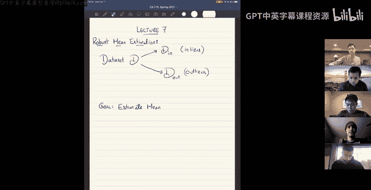
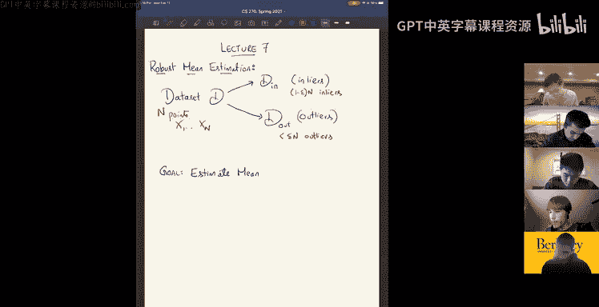
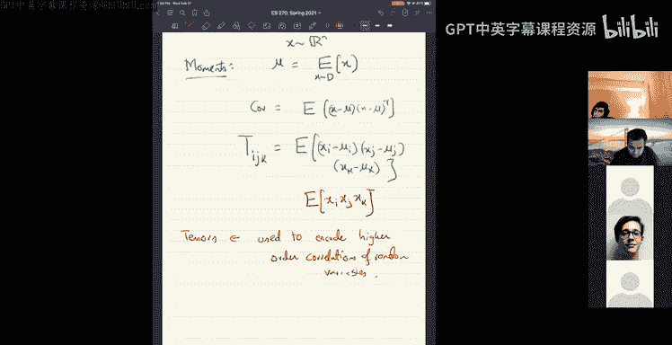

# 7：鲁棒均值估计与张量简介 🎯

在本节课中，我们将要学习鲁棒均值估计算法的完成部分，并初步了解张量这一数据结构。我们将首先探讨如何从包含异常值的数据集中稳定地估计真实均值，然后介绍张量的基本概念及其应用。

## 鲁棒均值估计算法完成 🧮

上一节我们介绍了鲁棒均值估计的问题背景。本节中我们来看看如何完成该算法。

我们有一个数据集，它是一组点 `X1` 到 `Xn`。其中 `1 - ε` 比例的点是内点（inliers），`ε` 比例的点是由对手插入的异常值（outliers）。对手可以查看我们拥有的数据点，并决定添加哪些异常值以及添加多少（少于 `ε` 比例）。我们的目标是估计内点分布的均值。

### 稳定性概念 🔒

为了实现目标，我们引入一个重要的概念：**稳定性**。

首先为数据集定义稳定性。一个点集是 **ε-δ 稳定** 的，如果移除任意 `ε` 比例的点，其均值的变化最多为 `δ`。形式化地说，对于任意至少包含 `(1 - ε)n` 个元素的子集，该子集的均值必须接近整个数据集的均值。

对于概率分布，我们可以类似地定义稳定性。一个分布 `θ` 是 **ε-δ 稳定** 的，如果对于它的每一个 **ε-过滤**（即通过“删除”至多 `ε` 比例概率质量得到的分布），其均值的变化最多为 `δ`。分布的 ε-过滤 `θ'` 定义为：对于所有点 `x`，有 `P_θ'(x) ≤ (1/(1-ε)) * P_θ(x)`。

我们的核心假设是：内点集本身是 ε-δ 稳定的。对于从高斯分布中抽取的样本，这很合理，因为移除少量样本不会显著改变其经验均值。

### 算法思路与关键引理 🧠

算法的核心思路是：**找到一个同样是稳定集的子集 S**。如果内点集 `D_in` 和找到的集合 `S` 都是稳定的，那么它们的均值必定接近。

**证明思路**：考虑两个稳定集 `D_in` 和 `S` 的交集 `T`。由于 `D_in` 稳定，`μ(D_in)` 接近 `μ(T)`。由于 `S` 稳定，`μ(S)` 也接近 `μ(T)`。因此，根据三角不等式，`μ(D_in)` 接近 `μ(S)`。

所以，问题转化为：**如何在包含异常值的数据集中找到一个稳定子集？**

为此，我们需要一个稳定性的高效充分条件。关键引理如下：

> 对于任何分布 `θ`，设其协方差矩阵的算子范数（最大特征值）为 `λ`。那么 `θ` 是 **ε-δ 稳定** 的，其中 `δ = √(ε) * λ`。

这意味着，一个分布只要其协方差矩阵的最大特征值不大，它就是稳定的。标准高斯分布的协方差矩阵是单位阵，因此非常稳定。

**引理证明概要**：
1.  将原始分布 `θ` 表示为过滤后分布 `θ_in` 与被过滤部分 `θ_out` 的凸组合：`θ = (1-γ)θ_in + γθ_out`。
2.  写出 `θ` 的协方差矩阵表达式，它包含 `θ_in` 和 `θ_out` 的协方差以及均值差项。
3.  令 `v` 为均值差 `μ(θ_in) - μ(θ_out)` 方向的单位向量，将协方差等式两边同时左乘 `v^T` 和右乘 `v`。
4.  左边 `v^T Cov(θ) v ≤ λ`。
5.  右边，协方差项非负，均值差项变为 `2γ(1-γ) * ||μ(θ_in) - μ(θ_out)||^2`。
6.  结合两边得到 `||μ(θ_in) - μ(θ_out)||^2 ≤ λ / (2γ(1-γ))`。
7.  最终，原始均值与过滤后均值的差 `||μ(θ) - μ(θ_in)|| = γ * ||μ(θ_in) - μ(θ_out)|| ≤ √(ε) * λ`（经过参数代入）。

### 寻找稳定集：凸优化表述 ⚙️

现在我们知道，要找到一个稳定集 `S`，等价于找到一组权重 `w_i`（形成一个分布），使得：
1.  `w_i ≥ 0`，且 `∑ w_i = 1`。
2.  `w_i ≤ (1+ε)/n`（这是一个 ε-过滤约束）。
3.  该权重分布下的协方差矩阵 `Cov(w) = ∑ w_i (X_i - μ(w))(X_i - μ(w))^T` 的算子范数很小（例如 `≤ λ I`）。

这里 `μ(w) = ∑ w_i X_i` 是该权重下的均值。

注意，第三个约束关于权重 `w` 是三次的（因为 `μ(w)` 中也包含 `w`），因此不是凸约束。然而，我们可以利用椭球法来求解。

**椭球法思路**：
*   可行域是满足条件1和2的凸集（一个单纯形）。
*   我们知道内点的均匀权重 `w*` 是一个可行解（满足所有约束）。
*   对于任意一个试探解 `w`，如果其协方差算子范数 `λ` 太大，我们可以构造一个分离超平面，将 `w` 和理想解 `w*` 分开，并告诉椭球法下一步搜索的方向。
*   具体地，设 `v` 是 `Cov(w)` 的 top 特征向量。定义线性函数 `L(y) = ∑_i y_i * [ (v^T(X_i - μ(w)) )^2 ]`。
*   可以验证 `L(w) = λ`，并且可以证明 `L(w*)` 大约为 `O(ελ)`，远小于 `λ`。
*   因此，超平面 `L(y) ≤ λ` 将 `w` 和 `w*` 分离开来。椭球法利用这个切割平面逐步逼近 `w*`。

这样就找到了一个稳定的子集（对应权重 `w`），其均值可作为对真实内点均值的鲁棒估计。

**其他方法**：也存在更高效的过滤算法，其核心思想是反复计算协方差矩阵，移除与 top 特征向量方向“对齐”的极端点，并确保每次移除的异常点比内点多。虽然分析更复杂，但效率更高。

## 张量简介 📦

上一节我们完成了鲁棒均值估计。本节中我们来看看一种新的数据结构：张量。

### 什么是张量？

从操作上讲，**张量是一个高维数组**。矩阵是二维数组，而张量可以是三维或更高维。例如，一个三阶（或三模）张量 `T` 可以存在于空间 `R^(N×N×N)` 中，就像一个数字立方体。当然，各维度的尺寸可以不同，如 `R^(M×N×P)`。

### 如何理解张量？

理解张量需要像理解矩阵一样，超越其数字阵列的表象，看到其背后与向量空间相关的本质。

*   **矩阵**可以表示：
    *   **双线性形式**：`M(x, y) = x^T M y`，输入两个向量，输出一个标量。
    *   **线性变换**：`y = M x`，输入一个向量，输出另一个向量。
    矩阵的具体数值依赖于所选的基，但它表示的线性变换或双线性形式是独立于基的。
*   **三阶张量**可以类似地表示：
    *   **三线性形式**：`T(x, y, z) = ∑_{i,j,k} T_{ijk} x_i y_j z_k`，输入三个向量，输出一个标量。
    *   输入两个向量，输出一个向量。
    *   输入一个向量，输出一个矩阵（双线性形式）。

直观上，对张量应用矩阵乘法，相当于在其某一个“模式”（维度）上进行线性组合，类似于用矩阵左乘或右乘来组合矩阵的行或列。

### 张量的应用场景 🎲

张量自然出现在许多场合，一个重要的例子是描述分布的**高阶矩**。

*   **一阶矩**：均值 `μ = E[x]`，是一个向量。
*   **二阶矩**：协方差矩阵 `Cov = E[(x-μ)(x-μ)^T]`，描述了变量对之间的相关性。
*   **三阶矩**：三阶中心矩张量 `M3`，其元素为 `M3_{ijk} = E[(x_i-μ_i)(x_j-μ_j)(x_k-μ_k)]`。它自然地组织成一个三阶张量，用于描述变量三元组之间的相关性。

因此，张量可以被看作是**编码随机变量高阶相关性**的一种方式。当我们对随机向量进行线性变换时，其高阶矩张量也会发生相应的协调变换。

---

本节课中我们一起学习了鲁棒均值估计算法的完整推导，包括稳定性概念、关键引理以及利用凸优化（椭球法）寻找稳定子集的核心思想。随后，我们介绍了张量的基本概念，将其理解为高维数组以及作用于向量空间上的多重线性映射，并举例说明了其在表示高阶矩中的应用。下一讲我们将深入探讨张量的具体算法。