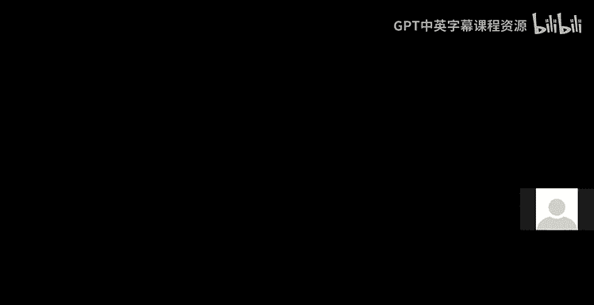
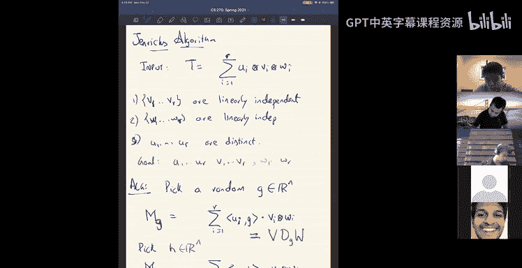
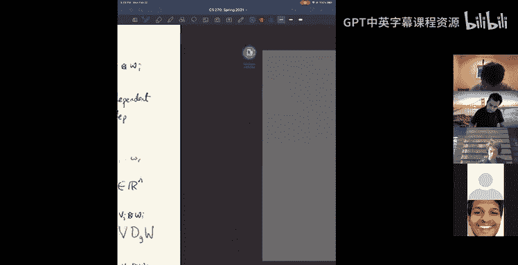
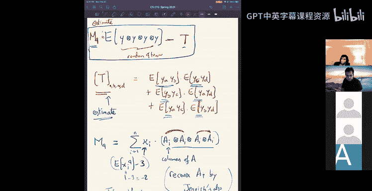
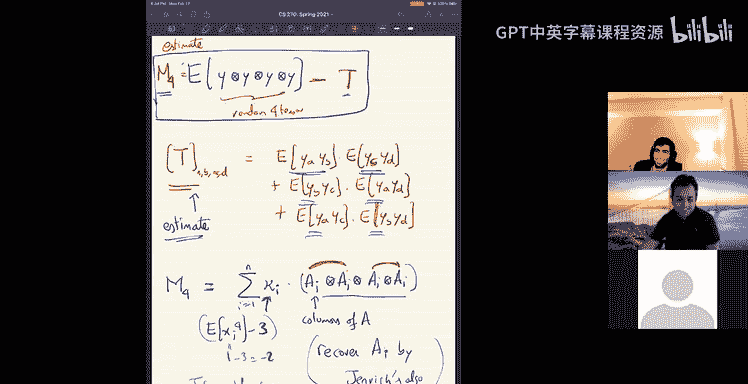

# 8：张量分解与独立成分分析

在本节课中，我们将学习线性代数算法的最后一部分内容：张量。我们将探讨张量的基本概念、秩的定义、一种特殊的分解形式，以及一个名为Jennrich算法的张量分解方法。最后，我们将看到该算法在独立成分分析问题中的一个应用。

## 张量基础与秩

上一节我们介绍了矩阵，本节我们来看看更高维度的数组——张量。

一个三维张量是一个三维的数字数组，它有三个“模式”。更高维的张量，例如四维张量，则有四个模式。就像矩阵可以视为双变量多项式、线性变换或双线性形式一样，张量可以自然地视为多变量多项式。例如，一个关于变量X, Y, Z的多线性多项式可以表示为：
\[
\sum_{i,j,k} T_{ijk} X_i Y_j Z_k
\]
其中 \(T_{ijk}\) 构成了一个三维张量。张量也常出现在数据中，例如，从分布中采样的数据，其均值是向量，协方差是矩阵，而三阶矩则对应一个三维张量。

对于矩阵，一个核心概念是秩。我们可以先定义秩为1的矩阵。

一个秩为1的矩阵可以写成一个列向量与一个行向量的外积：
\[
M = u v^T
\]
其第 \(i, j\) 项为 \(u_i v_j\)。基于此，矩阵 \(M\) 的秩 \(k\) 定义为能将其表示为 \(k\) 个秩为1矩阵之和的最小数目。

我们希望将秩的概念推广到张量。首先定义向量的张量积。

对于向量 \(u, v, w \in \mathbb{R}^n\)，其张量积 \(u \otimes v \otimes w\) 是一个三维数组，其第 \(i, j, k\) 项为 \(u_i v_j w_k\)。二维版本 \(u \otimes v\) 即等同于矩阵 \(u v^T\)。

那么，一个秩为1的张量就是三个向量的张量积 \(u \otimes v \otimes w\)。基于此，张量 \(T\) 的秩定义为能将其表示为秩为1张量之和的最小数目：
\[
T = \sum_{i=1}^{k} u_i \otimes v_i \otimes w_i
\]

然而，张量的秩性质不如矩阵的秩良好。

首先，一个 \(n \times n \times n\) 张量的最大秩可以达到 \(O(n^2)\) 量级，这远高于矩阵的秩（至多为 \(n\)）。其次，张量的秩依赖于所使用的数域（实数域或复数域）。更糟糕的是，对于矩阵，一系列低秩矩阵的极限（如果存在）仍是低秩的；但对于张量，存在高秩张量可以被一系列低秩张量任意逼近。这意味着张量的秩概念不够鲁棒。最后，计算张量的秩是NP难问题，甚至我们难以显式构造出一个秩显著高于 \(n\) 的张量。

尽管秩的性质不佳，但某些特殊形式的张量分解具有良好的性质且易于算法处理。

## 特征张量分解

在矩阵中，对称矩阵可以进行特征分解。对于张量，我们考虑一种类似的特例。

假设一个张量 \(T\) 可以写成若干个正交向量 \(a_i\) 的三重张量积之和：
\[
T = \sum_{i=1}^{n} a_i \otimes a_i \otimes a_i
\]
其中向量 \(a_i\) 彼此正交。由于正交性，这样的项数最多为 \(n\)，因此该张量是低秩的。我们的目标是恢复这些向量 \(a_i\)。

以下是一种恢复方法。

首先，选取一个随机向量 \(g\)，并将其应用到张量 \(T\) 的某一个模式上。这相当于沿着该模式对张量的切片进行线性组合。具体操作后，我们得到一个矩阵 \(M_g\)：
\[
M_g = \sum_{i=1}^{n} (a_i \cdot g) (a_i \otimes a_i)
\]
可以验证，矩阵 \(M_g\) 的特征向量正是这些 \(a_i\)，对应的特征值为 \(a_i \cdot g\)。由于 \(g\) 是随机选取的，这些特征值几乎必然互不相同，因此我们可以通过计算矩阵 \(M_g\) 的特征分解来唯一地恢复出所有的 \(a_i\)。

此外，类似于矩阵，对于由正交向量构成的张量 \(T\)，其对应的多项式 \(T(x, x, x)\) 在单位球面上的局部极大值点正是这些向量 \(\pm a_i\)。因此，也可以使用梯度下降等优化方法来恢复它们。

总之，对于具有这种特殊正交分解形式的张量，我们可以高效地恢复其分量。

## Jennrich 算法

上一节我们看了一种特殊的分解，本节我们来看一种更一般的张量分解算法——Jennrich算法。

假设一个三阶张量 \(T\) 具有如下分解形式：
\[
T = \sum_{i=1}^{r} u_i \otimes v_i \otimes w_i
\]
其中，向量组 \(\{v_1, ..., v_r\}\) 和 \(\{w_1, ..., w_r\}\) 都是线性无关的，并且 \(u_i\) 是互不相同的（或满足更弱的条件）。我们的目标是恢复所有的 \(u_i, v_i, w_i\)。

Jennrich算法步骤如下。

1.  选取两个随机向量 \(g\) 和 \(h\)。
2.  将 \(g\) 和 \(h\) 分别应用到张量 \(T\) 的第一个模式上，得到两个矩阵：
    \[
    M_g = \sum_{i=1}^{r} (u_i \cdot g) (v_i \otimes w_i)
    \]
    \[
    M_h = \sum_{i=1}^{r} (u_i \cdot h) (v_i \otimes w_i)
    \]
3.  将这两个矩阵写成矩阵分解形式。令矩阵 \(V\) 的列为 \(v_i\)，矩阵 \(W\) 的行为 \(w_i\)，\(D_g\) 和 \(D_h\) 为对角矩阵，其对角线元素分别为 \(u_i \cdot g\) 和 \(u_i \cdot h\)。则有：
    \[
    M_g = V D_g W
    \]
    \[
    M_h = V D_h W
    \]
4.  计算矩阵 \(M_g M_h^{-1}\)（假设逆存在）：
    \[
    M_g M_h^{-1} = V D_g D_h^{-1} V^{-1}
    \]
    这是一个特征分解的形式。因此，矩阵 \(M_g M_h^{-1}\) 的特征向量就是 \(V\) 的列，即向量 \(v_i\)。
5.  类似地，计算 \(M_g^T (M_h^T)^{-1}\) 的特征向量，可以恢复出 \(W\) 的行，即向量 \(w_i\)。
6.  一旦恢复了 \(V\) 和 \(W\)，可以通过求解线性方程组来恢复向量 \(u_i\)。

该算法要求 \(r \leq n\)，以确保 \(V\) 和 \(W\) 可逆。其核心思想是，通过在不同方向施加随机线性组合，我们得到了两个共享相同特征向量（但特征值不同）的矩阵，从而可以恢复出分解中的分量。

## 应用：独立成分分析

现在，我们来看Jennrich算法的一个应用：独立成分分析。

**问题描述**：我们获得观测样本 \(y\)，其生成方式为：
\[
y = A x + b
\]
其中：
*   \(x\) 是一个随机向量，其各分量是独立的（例如，每个分量是随机的 ±1）。
*   \(A\) 是一个未知的可逆方阵。
*   \(b\) 是一个未知的偏移向量。
目标是从观测样本 \(\{y\}\) 中恢复 \(A\) 和 \(b\)，进而可以恢复出源信号 \(x\)。

**预处理**：
1.  **中心化**：计算样本均值并减去，这可以消除偏移 \(b\) 的影响。处理后，我们可假设 \(b=0\)，模型简化为 \(y = A x\)。
2.  **白化（尝试）**：计算样本协方差矩阵 \(\mathbb{E}[y y^T]\)。由于 \(x\) 分量独立且均值为0，有 \(\mathbb{E}[x x^T] = I\)。因此：
    \[
    \mathbb{E}[y y^T] = A A^T
    \]
    协方差矩阵只给出了 \(A A^T\)，无法唯一确定 \(A\)，因为对于任意正交矩阵 \(R\)，有 \((AR)(AR)^T = A A^T\)。我们遇到了旋转模糊性问题。

**利用高阶统计量**：
为了消除旋转模糊性，我们需要利用更高阶的统计信息。考虑四阶矩张量。
定义以下四阶张量 \(M_4\)，其分量计算如下：
\[
M_4 = \mathbb{E}[y \otimes y \otimes y \otimes y] - T
\]
其中 \(T\) 是一个由二阶矩（协方差）构成的张量，其 \((a,b,c,d)\) 分量为所有配对乘积之和：\(\mathbb{E}[y_a y_b]\mathbb{E}[y_c y_d] + \mathbb{E}[y_a y_c]\mathbb{E}[y_b y_d] + \mathbb{E}[y_a y_d]\mathbb{E}[y_b y_c]\)。

经过推导（此处省略详细推导），\(M_4\) 具有非常简洁的形式：
\[
M_4 = \sum_{i=1}^{n} \kappa_i (a_i \otimes a_i \otimes a_i \otimes a_i)
\]
其中 \(a_i\) 是矩阵 \(A\) 的第 \(i\) 列，\(\kappa_i = \mathbb{E}[x_i^4] - 3\) 是一个常数（对于 \(x_i = \pm 1\)，\(\kappa_i = -2\)）。

**关键点**：现在，我们得到了一个四阶张量，它是 \(n\) 个秩为1的张量（\(a_i^{\otimes 4}\)）的加权和。这正是我们可以应用张量分解算法的形式。

**应用算法**：
我们可以使用类似Jennrich算法的方法来恢复向量 \(a_i\)。例如，可以将四阶张量通过随机投影“压缩”成一个三阶张量，然后应用Jennrich算法。一旦恢复了所有的 \(a_i\)（可能相差一个排列顺序），我们就成功恢复了混合矩阵 \(A\)。

**算法失效情形**：
该算法要求 \(\kappa_i \neq 0\)。如果 \(x\) 的分量是高斯分布，则 \(\mathbb{E}[x_i^4] = 3\)，导致 \(\kappa_i = 0\)，此时 \(M_4\) 为零张量，算法失效。这符合直觉：高斯分布是球对称的，其任意正交变换后的分布保持不变，因此从观测中无法唯一确定 \(A\)，旋转模糊性无法被打破。

## 总结

本节课中我们一起学习了张量的基本概念。我们首先看到张量的秩定义虽然自然，但性质远不如矩阵的秩良好。接着，我们学习了一种特殊的张量分解形式，当分量向量正交时，可以高效恢复。然后，我们介绍了更一般的Jennrich算法，用于分解分量向量线性无关的张量。最后，我们将该算法应用于独立成分分析问题，展示了如何利用四阶矩张量来打破二阶统计量带来的旋转模糊性，从而恢复混合矩阵。这体现了高阶张量在处理盲源分离等问题中的强大能力。