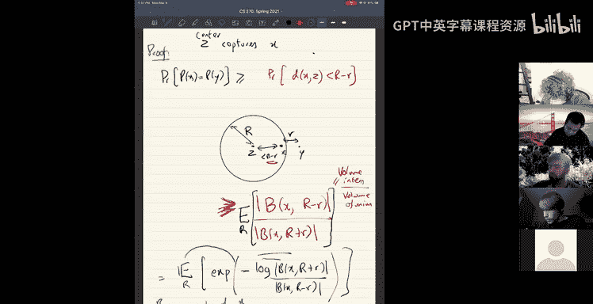
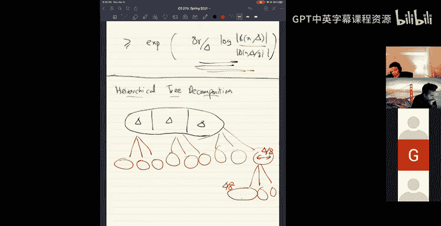
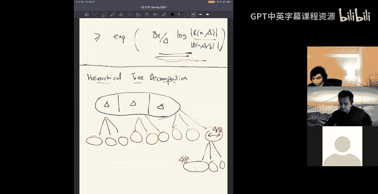

# 12：度量空间嵌入与低直径分解 🧭

在本节课中，我们将深入学习度量空间，特别是如何将复杂的度量空间嵌入到更简单的树度量中。我们将介绍低直径分解这一核心工具，并展示如何利用它来构建高效的随机树嵌入。

---

## 度量空间与树嵌入 🌳

上一节我们介绍了度量空间的基本概念。本节中，我们来看看如何简化复杂的度量空间。

一个度量空间由一组点集 `X` 和一个距离函数 `d(x, y)` 定义。一个自然的例子是图上的最短路径度量：给定一个带权图，点之间的距离定义为两点间最短路径的权重之和。

处理一般的度量空间可能相当复杂。因此，我们希望将其简化。具体来说，我们今天要寻找的是**嵌入**，它能将一般的度量空间映射到**树度量**。树度量，顾名思义，就是定义在树结构上的最短路径度量，它显然要简单得多。

进行这种嵌入的优势在于，许多NP完全问题在树度量上可以高效求解。因此，解决近似完全问题的一个自然方法是：获取一个一般度量空间（或从图中得到的最短路径度量），将其嵌入到一个树度量中，然后在树度量上解决问题。这为你最初关心的问题提供了一个近似算法。事实上，许多近似算法和在线算法都使用了这种方法。

### 理想与现实

理想情况下，对于一个度量空间 `(X, d)`，我们希望找到一个嵌入到树度量空间 `(T, d_T)`，使得对于所有点 `x, y`，有 `d(x, y) = d_T(x, y)`。但正如你所料，这通常是不可能的。

例如，考虑一个 `n` 个点的环。如果你试图将其嵌入到任何一棵树中，你必然会引入 `Ω(n)` 的**失真**。这意味着某些距离会被极大地拉伸。问题的关键在于，如果只使用一棵确定的树，可能会产生如此大的失真。

### 随机树嵌入

因此，我们实际感兴趣的是**概率树嵌入**，即寻找一个随机的或概率性的树嵌入。

给定度量空间 `(X, d)`，一个随机树嵌入定义为一个**树度量上的分布**。我们约定，对于从这个分布中采样的每一棵树，距离都不会减少（即 `d_T(x, y) ≥ d(x, y)`），但也不会增加太多。具体来说，我们希望对于所有点对 `(x, y)`，**树距离的期望值**最多是原始距离的某个因子 `α` 倍：

`E[d_T(x, y)] ≤ α * d(x, y)`

有时，如果原始度量空间来自一个图 `G=(V, E)`，我们可能希望嵌入树是原图的**生成树**，这被称为**低拉伸生成树**。今天我们主要关注更一般的随机树嵌入。

一个重要结论是：对于任意包含 `n` 个点的度量空间 `(X, d)`，都存在一个树度量分布，其失真 `α` 为 `O(log n)`。这意味着我们可以在对数因子内用树来近似任何度量空间。

---

## 低直径分解 🔍

构建树嵌入的一个关键工具是**低直径分解**。这个概念本身在属性测试、分布式算法和许多近似算法中都非常有用。

### 问题定义

给定一个度量空间 `(X, d)`，我们的目标是将它**分割**成若干小块（即一个划分 `P = {X₁, X₂, ...}`），使得每一块的**直径**（块内任意两点间的最大距离）至多为某个小值 `Δ`。

这很容易做到，例如将每个点单独作为一块。但我们真正关心的是一个权衡：在将空间分割成小块的同时，我们不希望“切碎”得太过分。具体来说，如果两个点 `x` 和 `y` 原本很接近，我们希望它们有很高的概率落在同一块中。

我们希望分离两个点的概率与它们之间的距离成正比。用 `P(x)` 表示点 `x` 所属的划分块。我们希望存在一个参数 `β`，使得对于任意两点 `x, y`：

`Pr[P(x) ≠ P(y)] ≤ β * (d(x, y) / Δ)`

分母中的 `Δ` 是自然的：如果你要求更小的直径（更小的 `Δ`），那么分离邻近点的概率就会相应增加。

### 直观例子：实数线

考虑实数线 `R`，其度量为通常的绝对值距离。假设我们希望将实数线分割成直径为1的块。

一个自然的确定性方法是：在整数坐标处进行划分，例如 `[0,1), [1,2), ...`。但这样会有一个问题：如果两个点 `x` 和 `y` 恰好位于某个划分边界的两侧（例如 `0.999` 和 `1.001`），即使它们距离非常近（`0.002`），也总是会被分离。这违反了我们的概率上界。

一个简单的改进方法是：**随机平移划分的起点**。例如，随机均匀地选择一个偏移量 `s ∈ [0, 1)`，然后在 `s, s+1, s+2, ...` 处进行划分。这样，两个距离为 `r` 的点被分离的概率恰好是 `r`（当 `r ≤ 1` 时）。这里我们得到了 `β = 1` 的理想情况。

### 通用算法

对于一般的度量空间，我们有一个非常简洁的算法。目标是生成一个直径至多为 `Δ` 的划分。

以下是算法步骤：
1.  随机选择一个半径 `R`，其值在 `[Δ/4, Δ/2]` 区间内均匀分布。
2.  将点集 `X` 随机排列（生成一个随机排列）。
3.  按照随机排列的顺序处理每个点 `x_i`：
    *   考虑以 `x_i` 为中心、半径为 `R` 的“球” `B(x_i, R)`，即所有与 `x_i` 距离不超过 `R` 的点。
    *   将 `B(x_i, R)` 中**尚未被分配到任何块**的所有点，分配到一个新的块中（这个块以 `x_i` 为“中心”）。

这个算法直观上类似于在空间中随机撒点并“吞噬”周围区域的过程。随机半径 `R` 的引入是为了避免度量空间在某个固定半径附近出现不良行为。

### 算法分析（核心结论）

该算法可以保证，对于任意两点 `x, y`，它们被分离的概率满足：

`Pr[P(x) ≠ P(y)] ≤ O(log n) * (d(x, y) / Δ)`

其中 `n` 是总点数。这意味着我们得到了一个 `β = O(log n)` 的低直径分解。这个对数因子是不可避免的，并且与我们最终树嵌入的失真因子相匹配。

---

## 层次化树分解与嵌入 🌲

现在，我们回到最初的目标：如何构建一个随机树嵌入？我们将使用一种递归的策略，称为**层次化树分解**。

### 构建过程

1.  **递归分解**：从整个度量空间开始，我们应用低直径分解算法，将其划分为直径约为 `Δ` 的块。然后，将每个块视为一个新的子度量空间，递归地对每个子块应用低直径分解，但将目标直径减半（例如设为 `Δ/2`）。继续这个过程，每次递归都将目标直径除以一个常数因子（如2或8），直到每个块只包含一个点。
2.  **构建树结构**：这个递归分解过程自然定义了一棵树。
    *   **叶子节点**：是原始的点。
    *   **内部节点**：对应递归过程中产生的每一个块（划分）。
    *   **边与权重**：连接一个块节点与其子块节点（即该块在下一层递归中被划分成的更小块）。我们为这条边赋予一个权重，其值等于该父块节点的**直径上界**（例如，在递归层 `i`，直径为 `Δ/2^i`，则权重可设为 `Δ/2^i`）。

### 为什么这是好的嵌入？

考虑任意两个点 `x` 和 `y`，设它们的原始距离 `d(x, y)` 介于 `8^{j-1}` 和 `8^j` 之间。

*   **下界（距离不被压缩）**：在递归分解中，直到高度约为 `j` 的层级，块的直径都小于 `d(x, y)`。因此，`x` 和 `y` 在高度 `j` 或更早的层级就必定被分离到不同的块中。这意味着在树中，`x` 和 `y` 的最近公共祖先至少位于高度 `j`。树中 `x` 到 `y` 的路径必须经过至少一条权重约为 `8^j` 的边，因此树距离 `d_T(x, y) ≥ 8^j ≥ d(x, y)`。所以嵌入不会减少距离。
*   **上界（距离不被过度拉伸）**：我们需要证明期望的树距离不会比原始距离大太多。关键观察是：`x` 和 `y` 在高度 `h` 的层级被分离的概率，由我们的低直径分解引理控制，大约为 `O(log n) * (d(x, y) / 8^h)`。树距离可以表示为，对所有可能分离它们的高度 `h`，权重 `8^h` 乘以在该高度分离的概率之和。通过计算这个和式，并利用低直径分解的概率上界，我们可以证明：
    `E[d_T(x, y)] ≤ O(log n) * d(x, y)`

结合上下界，我们得到了一个失真为 `O(log n)` 的随机树嵌入。

---

## 应用示例：批量购买网络设计 💻

让我们看一个随机树嵌入的应用实例：**批量购买网络设计**问题。

### 问题描述

假设你有一个图（代表通信网络），以及一系列流量需求 `(s_i, t_i, f_i)`，表示需要在源点 `s_i` 和汇点 `t_i` 之间支持 `f_i` 单位的流量。你可以在图的边上购买容量，每条边 `e` 上每单位容量的成本为 `c_e`。容量可以被所有流量需求共享（分时复用）。目标是购买总成本最低的容量配置，以满足所有流量需求。

### 树度量的优势

在一般的图上，这是一个复杂的优化问题。然而，**在树结构上，这个问题变得非常简单**。因为在树中，任意两点之间只有唯一路径。为了满足需求 `(s_i, t_i, f_i)`，你只需在从 `s_i` 到 `t_i` 的唯一路径上的每条边，增加 `f_i` 单位的容量。所有需求独立处理，然后将每条边上所有需求要求的容量相加，再乘以边成本，即得总成本。这是一个确定性的、容易计算的解。

### 近似算法

利用我们学到的随机树嵌入，可以设计一个近似算法：
1.  将原始图（或其最短路径度量）通过随机树嵌入，失真为 `O(log n)` 地映射到一棵随机树 `T` 上。
2.  在树 `T` 上求解上述批量购买网络设计问题（这很容易）。
3.  将树 `T` 上的解（即各边应购买的容量）解释回原图。由于嵌入的失真，这个解可能无法在原图上直接支持所有流量，但可以证明，通过适当缩放，它能给出原问题的一个 `O(log n)` 近似解。

这个例子展示了如何将复杂问题简化到树结构上求解，是随机树嵌入威力的一个典型体现。

---

## 总结 📚

本节课中我们一起学习了：
1.  **随机树嵌入**的概念：通过一个树度量上的分布来近似复杂的度量空间，并保证期望失真为 `O(log n)`。
2.  **低直径分解**这一核心工具：一种将度量空间划分为小块的方法，同时保证邻近点被分离的概率与其距离成正比（乘以一个 `O(log n)` 因子）。我们介绍了一个简洁的随机算法来实现它。
3.  **层次化树分解**的构造：通过递归应用低直径分解，并赋予边权重，可以系统地构建出满足要求的随机树嵌入。
4.  **一个应用实例**：批量购买网络设计问题，展示了如何利用树嵌入将复杂图上的难题转化为树上的易解问题，从而获得高效的近似算法。

这些工具在组合优化、在线算法和分布式计算等领域有着广泛的应用，是处理度量空间相关问题的强大基础。