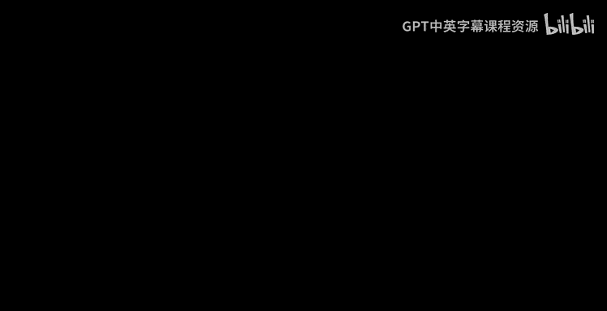
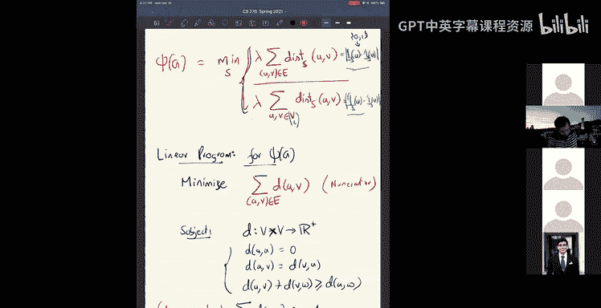
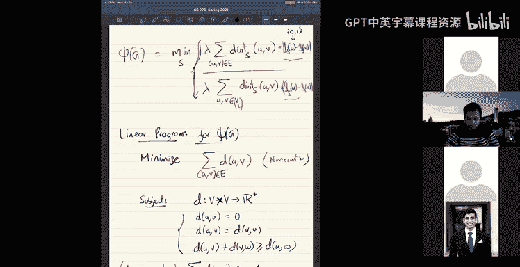

# 13：稀疏割问题与度量嵌入

在本节课中，我们将学习一个名为“稀疏割”的问题。我们将看到如何通过将问题嵌入到 L1 空间或度量嵌入中，来紧密地联系并解决这个问题，并利用这种方法构建一个算法。

## 图扩展概述

图扩展是衡量图连通性好坏的一种度量。

假设我们有一个图 G，它由一组顶点和边组成。我们假设图是无权且 d-正则的，即所有顶点的度均为 D。这使得定义更简单。

考虑图中的一个顶点子集 S。子集 S 的扩展定义为穿过该子集的边数，即从 S 到其补集 S^c 的边数。

我们通常将这个数除以与 S 关联的边的总数，即 S 的体积。在 d-正则图中，S 的体积就是 d 乘以 S 的基数 |S|。因此，在 d-正则图中，扩展可以表示为：
**Φ(S) = (从 S 到 S^c 的边数) / (d * |S|)**

另一种理解方式是：从 S 中随机选择一个顶点，然后沿着该顶点的一条随机边移动一步，离开集合 S 的概率就是 Φ(S)。这是一个介于 0 和 1 之间的数。

图的扩展（也称为图的电导）定义为所有大小不超过 n/2 的子集 S 中，Φ(S) 的最小值。

为什么这个度量能反映连通性？让我们看几个例子。

在完全图中，任意大小小于 n/2 的子集 S，其扩展至少为 1/2。这意味着完全图是高度连通的。

在一个 n×n 的网格图中，如果我们从中间切开，穿过割的边数仅为 n，而左侧子集的体积约为 n^2，因此扩展约为 1/n。这表明网格图的连通性较差。

与最小割相比，扩展是一个更好的连通性度量。最小割可能只分离一个顶点，不能很好地反映整体连通性。

## 扩展图

扩展图是一种具有常数度（例如度为 3）但扩展至少为某个常数的图。这意味着尽管边数稀疏（O(n) 条边），但其连通性却像完全图一样好。

随机 d-正则图以高概率是扩展图。此外，也存在明确的扩展图构造。

以下是一个明确的扩展图构造示例：
取顶点为 {0, 1, ..., p-1}，其中 p 为素数。对于每个顶点 x，连接以下三条边：
1.  x 连接到 (x+1) mod p
2.  x 连接到 (x-1) mod p
3.  x 连接到 (1/x) mod p（当 x≠0 时，0 可特殊处理）
这样就得到了一个 3-正则图，并且它是一个扩展图。

扩展图在算法中有广泛应用，如路由、最短路径计算、拉普拉斯矩阵求解等。

## 稀疏割问题

我们关注的问题是：给定一个图 G，计算或近似其扩展值 Φ(G)。计算精确值是 NP 难的，因此我们寻求近似算法。

为了便于处理，我们引入一个与 Φ(G) 相近的量 Ψ(G)：
**Ψ(G) = min_{S: |S|≤n/2} (从 S 到 S^c 的边数) / (|S| * |S^c|)**

可以证明，近似 Ψ(G) 与近似 Φ(G) 在常数因子内是等价的，因为 |S^c| 总是在 n/2 和 n 之间。

我们可以将 Ψ(G) 用割度量来表示。对于子集 S，定义其指示函数 **1_S(v)**，当顶点 v 在 S 中时为 1，否则为 0。这定义了一个割度量 **d_S(u, v) = |1_S(u) - 1_S(v)|**。

利用这个度量，Ψ(G) 可以重写为：
**Ψ(G) = min_S ( Σ_{(u,v)∈E} d_S(u, v) ) / ( Σ_{所有 u,v} d_S(u, v) )**

我们的目标是找到一个割度量，使得这个比值最小化。

## 线性规划松弛

直接处理割度量很困难，因此我们考虑一个线性规划松弛。我们寻找一个满足度量条件（非负性、对称性、三角不等式）的任意距离函数 **d(u, v)**，来最小化相同的比值。

由于比值是齐次的，我们可以固定分母至少为 1，然后最小化分子。这给出了以下线性规划：

**最小化：** Σ_{(u,v)∈E} d(u, v)
**约束条件：**
1.  d 是一个度量（满足所有度量公理）。
2.  Σ_{所有 u,v} d(u, v) ≥ 1

求解这个线性规划，我们得到一个距离函数 d，它最小化了目标比值。

## 通过度量嵌入进行舍入

现在我们得到了一个任意的度量 d，需要将其“舍入”回一个割度量。我们的策略是先将这个度量嵌入到 L1 空间（即具有 L1 距离的欧几里得空间），然后再从 L1 嵌入中得到一个割。

关键定理是：任何 n 点度量空间都可以嵌入到 L1 空间中，且失真度仅为 **O(log n)**。这意味着嵌入后的距离与原距离之比最多为 O(log n) 倍。

### Frechet 嵌入：基本构件

我们使用一种称为 Frechet 嵌入的技术作为构建块。给定度量空间和其一个子集 A，Frechet 嵌入将每个点 x 映射到它到集合 A 的距离：**f_A(x) = d(x, A) = min_{y∈A} d(x, y)**。

Frechet 嵌入是收缩的：对于任意两点 x, y，有 **|f_A(x) - f_A(y)| ≤ d(x, y)**。

### Bourgain 嵌入构造

我们的嵌入是随机化的。我们构造 log n 个随机子集 A_1, A_2, ..., A_log n。子集 A_t 通过以概率 **1/(2^t)** 独立包含每个顶点来构建。

然后，我们将一个点 x 嵌入到一个 log n 维向量中：
**F(x) = ( d(x, A_1), d(x, A_2), ..., d(x, A_log n) )**

这个嵌入的 L1 距离满足：
*   **上界：** 由于每个 Frechet 分量都是收缩的，所以 **||F(x) - F(y)||_1 ≤ log n * d(x, y)**。
*   **下界（期望）：** 我们可以证明 **E[ ||F(x) - F(y)||_1 ] ≥ Ω(1) * d(x, y)**。

下界的证明思路是：对于每一对点 x, y，考虑围绕它们的一系列半径递增的球。通过精心选择半径，使得对于每个尺度 t，以常数概率，A_t 包含 x 附近小球中的点，但不包含 y 附近大球中的点。当这个事件发生时，第 t 个分量的贡献至少是某个半径差。对所有尺度求和，这些半径差会叠加为 d(x, y) 的一部分。

### 从高概率到确定嵌入

上述构造给出了一个期望意义上的好嵌入。为了得到一个对所有点对都同时保持低失真的嵌入，我们可以独立重复此构造 O(log n) 次，并将所有嵌入连接起来。通过浓度不等式和并集界限，可以高概率保证最终嵌入的失真为 O(log n)。

## 从 L1 嵌入到割

最后一步是将 L1 嵌入转换回一个割度量。假设我们有一个将顶点映射到实数线（一维 L1）的嵌入。我们可以通过随机阈值来产生一个割：随机选择一个阈值 θ，定义 **S = { v | f(v) ≤ θ }**。可以证明，在这个随机割下，两点 u, v 被分开的概率正好等于 **|f(u) - f(v)|**。

对于更高维的 L1 嵌入（即 R^k 中的点），我们可以随机选择一个维度，然后在该维度上应用上述随机阈值法。这样得到的随机割，其期望割度量距离与 L1 距离成正比。

## 算法总结

综上所述，我们得到了一个近似稀疏割的算法：
1.  求解线性规划松弛，得到一个度量 d。
2.  应用 Bourgain 嵌入，将度量 d 嵌入到 L1 空间，失真为 O(log n)。
3.  通过随机阈值法，从 L1 嵌入中抽取一个割 S。
4.  这个割 S 的 Ψ(S) 值（以及 Φ(S) 值）是图最优稀疏割的 O(log n) 因子近似。

## 课程总结

在本节课中，我们一起学习了稀疏割问题及其与度量嵌入的深刻联系。我们首先定义了图扩展，并讨论了扩展图。然后，我们将稀疏割问题表述为一个优化问题，并通过线性规划进行松弛。为了解决舍入问题，我们深入探讨了 Bourgain 嵌入定理，该定理表明任何度量都可以低失真地嵌入到 L1 空间。最后，我们展示了如何从 L1 嵌入中恢复出一个实际的割，从而得到一个高效的 O(log n) 近似算法。这套将组合优化问题与几何嵌入相联系的方法，是算法设计中的一个强大工具。