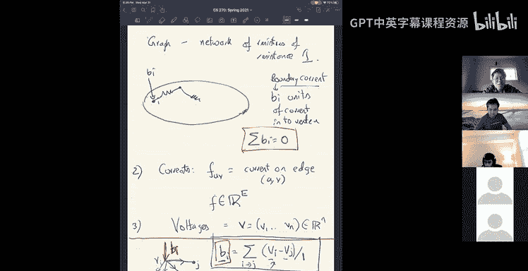

# 17：求解拉普拉斯系统 🧮

在本节课中，我们将要学习如何高效求解拉普拉斯线性系统。拉普拉斯系统在科学计算、物理模拟和组合优化中非常普遍。我们将探讨一种近乎线性时间的求解方法，并理解其背后的核心思想。

## 概述

拉普拉斯矩阵 `L` 定义为 `L = D - A`，其中 `D` 是度矩阵，`A` 是邻接矩阵。求解拉普拉斯系统 `Lx = b` 是一个基础问题。传统的求解方法如高斯消元法或梯度下降法，对于大规模图来说效率不高。我们将介绍一种基于随机 Kaczmarz 方法的算法，它利用图的组合结构，能够以近乎线性时间求解此类系统。

## 从线性系统到随机 Kaczmarz 方法

上一节我们介绍了拉普拉斯系统。本节中我们来看看一种用于求解一般线性系统的迭代算法——随机 Kaczmarz 方法。

该算法非常直观。假设我们有一个线性方程组 `A_i x = b_i`，我们从一个初始点 `x_0` 开始。在每一步，我们随机选择一个约束方程 `i`，然后将当前点 `x_t` 投影到该约束所定义的超平面上，得到 `x_{t+1}`。

投影公式如下：
`x_{t+1} = x_t + (b_i - A_i \cdot x_t) * A_i / ||A_i||^2`

分析表明，如果我们以概率 `p_i = ||A_i||^2 / (sum_j ||A_j||^2)` 选择第 `i` 个约束，那么算法会指数收敛。收敛速度取决于矩阵 `A` 的一个条件数参数 `κ(A)`。

## 拉普拉斯系统与电流流

上一节我们介绍了一个通用的线性系统求解器。本节中我们来看看如何将其应用于求解拉普拉斯系统。

首先，我们需要将拉普拉斯系统 `Lv = b` 重新解释。可以将图视为一个电阻网络，每条边的电阻为 1。向量 `b` 表示注入每个顶点的边界电流（需满足 `sum(b_i) = 0`）。我们的目标是求解每个顶点上的电压 `v`，或者等价地，求解每条边上的电流 `f`。

根据欧姆定律和基尔霍夫电流定律，边 `(i, j)` 上的电流 `f_{ij} = v_i - v_j`，并且对于每个顶点 `i`，流入的边界电流 `b_i` 等于从该顶点流出的所有边电流之和。这正是 `Lv = b` 所描述的。

因此，求解拉普拉斯系统等价于在给定边界电流 `b` 的情况下，寻找满足基尔霍夫电压定律（即电势差定义一致）的电流流 `f`。

## 构建约束系统

上一节我们将问题转化为寻找一个特定的电流流。本节中我们来看看如何用线性约束来描述这个电流流。

所有满足基尔霍夫电流定律（流量守恒）的流构成一个线性空间。而电学流（即可由电势差导出的流）是这个空间的一个子空间，其附加条件是满足基尔霍夫电压定律：对于图中任意一个环，环上各边的电流代数和为零。

为了应用 Kaczmarz 方法，我们需要一个有限的约束集。我们通过以下步骤构建：
1.  选择图的一个生成树 `T`。
2.  对于每条不在树中的边 `e = (u, v)`，将其加入树中会形成一个唯一的环 `C_e`。
3.  对于每个这样的环 `C_e`，我们施加约束：环上所有边的电流代数和为零。

可以证明，这组环约束足以保证整个流场满足基尔霍夫电压定律。因此，我们的线性系统变为 `A f = 0`，其中矩阵 `A` 的每一行对应一个非树边构成的环，每一列对应一条边。

## 算法效率与低拉伸生成树

上一节我们得到了约束矩阵 `A`。本节中我们来看看算法的运行时间如何依赖于图的结构。

回顾随机 Kaczmarz 方法的收敛时间与参数 `κ(A)` 有关。对于我们的矩阵 `A`，可以证明其最小奇异值至少为 1。而矩阵 `A` 的 Frobenius 范数 `||A||_F` 等于所有约束环的长度之和。

对于一个由非树边 `(u, v)` 定义的环，其长度为 `1 + dist_T(u, v)`，其中 `dist_T(u, v)` 是 `u` 和 `v` 在生成树 `T` 中的距离。我们定义边 `(u, v)` 的**拉伸**为 `stretch_T(u, v) = dist_T(u, v)`（因为原图中边长为1）。那么总 Frobenius 范数约为 `m + sum_{e not in T} stretch_T(e)`。

因此，算法的迭代次数（正比于 `||A||_F^2`）取决于所有非树边的总拉伸。为了获得近乎线性的运行时间，我们需要一个**低拉伸生成树**，使得总拉伸为 `O(m polylog(n))`。

幸运的是，对于任何图，都存在这样的低拉伸生成树，并且可以在线性时间内构建。其构造思想类似于我们之前学过的度量空间分解和层次树嵌入。

## 算法实现与总结

上一节我们分析了理论效率的关键在于低拉伸生成树。本节中我们简要讨论实现并总结全课。

在获得低拉伸生成树后，随机 Kaczmarz 方法的每一步需要随机选择一个环（即非树边），概率与其长度（拉伸+1）成正比，然后更新流 `f`。直接操作维度为 `m`（边数）的流向量成本很高。但由于所有更新都围绕着树上的路径进行，我们可以利用高效的数据结构（如树状路径更新）来在近常数时间内完成每次迭代，从而使得总运行时间达到近乎线性。

本节课中我们一起学习了求解拉普拉斯系统的近乎线性时间算法。其核心步骤是：
1.  将拉普拉斯系统 `Lv = b` 转化为在给定边界电流下寻找电学流 `f` 的问题。
2.  利用生成树将电学流需满足的基尔霍夫电压定律转化为一系列环约束 `A f = 0`。
3.  对约束系统应用随机 Kaczmarz 方法。
4.  通过为图构造一个低拉伸生成树，确保约束矩阵 `A` 的条件良好，从而使迭代次数近乎线性。
5.  利用树的数据结构高效实现每次迭代更新。

这种方法巧妙地将连续优化（Kaczmarz/梯度下降）与离散图论（生成树、低拉伸）结合起来，是理论计算机科学中一个非常优美的成果，并催生了许多其他图算法上的突破。