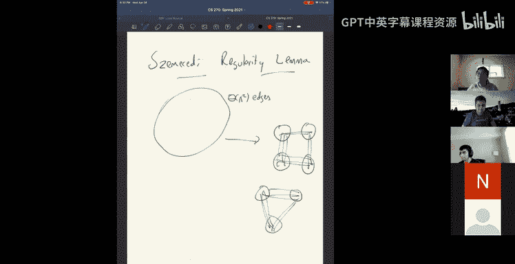

# 25：属性测试入门 🧪

在本节课中，我们将学习一个名为“属性测试”的算法与复杂性领域。属性测试的核心思想是，我们希望通过随机检查输入的一小部分，来快速判断一个大型对象（如列表、函数或图）是否满足某个特定属性，或者是否“远离”满足该属性。这对于处理大数据或需要快速预检查的场景非常有用。

---

## 什么是属性测试？ 🤔

属性测试的基本设定如下：我们有一个对象，例如一个长度为 `n` 的列表或字符串。我们想知道这个对象是否满足某个属性 `P`（例如，列表是否已排序）。通常，完全验证属性需要读取整个输入，时间复杂度为 `O(n)`。而属性测试的目标是设计一个随机化算法，它只进行 `o(n)` 次查询（例如 `O(log n)` 次），就能以高概率做出正确判断。

具体来说，我们期望的算法保证是：
*   **如果对象满足属性 `P`**，则测试算法以至少 0.99 的概率“接受”。
*   **如果对象“远离”满足属性 `P`**（例如，需要修改很多元素才能使其满足属性），则测试算法以至少 0.99 的概率“拒绝”。

这里的关键在于“远离”的定义。对于几乎满足属性的对象（例如只有一个元素错位的“几乎排序”列表），我们允许算法犯错，因为我们只检查了输入的一小部分。我们只对明显违反属性的情况做出强力保证。

---

## 示例一：测试列表是否“接近排序” 📊

上一节我们介绍了属性测试的概念，本节中我们来看看一个具体例子：测试一个数字列表是否“接近”已排序状态。

### 问题定义
输入是一个包含 `n` 个数字的列表 `A[1..n]`。我们希望测试该列表是否“接近”已排序。首先，我们需要定义“接近”的含义。

一个**递增子序列**是指从原列表中按顺序取出的一些元素，它们满足递增关系。列表的**最长递增子序列**长度是衡量其“有序程度”的好方法。

我们定义：一个序列是 **`l`-远离排序** 的，如果其最长递增子序列的长度为 `n - l`。也就是说，我们需要修改至少 `l` 个元素才能使其完全排序。我们的目标是设计一个算法，能够区分“列表已排序”（`l=0`）和“列表是 `εn`-远离排序”（`l ≥ εn`）这两种情况。

### 初步尝试与失败
首先，我们可能会尝试一些简单的检查方法。

以下是两种直观但会失败的测试方法：
1.  **随机检查连续对**：随机选择一个索引 `i`，检查是否 `A[i] < A[i+1]`。如果列表是 `1,2,...,n/2,1,2,...,n/2`，它距离排序很远（最长递增子序列长度仅为 `n/2`），但此测试只有 `1/n` 的概率能发现那个唯一的逆序对。
2.  **随机检查任意对**：随机选择两个索引 `i < j`，检查是否 `A[i] < A[j]`。可以构造一个序列（例如分成 `√n` 块，每块内递减，但块之间递增），使得该序列远离排序，但随机检查两个相距较远的元素时，它们看起来是递增的，因此测试失败。

### 有效算法：基于二分搜索的测试
现在，我们来看一个真正有效的属性测试算法。该算法非常优雅。

**算法描述：**
重复以下步骤 `O(1/ε)` 次：
1.  在 `{1, ..., n}` 中均匀随机选择一个索引 `i`。
2.  尝试在列表 `A` 中执行标准的**二分搜索**算法来查找值 `A[i]`。
3.  在执行二分搜索的过程中，算法会查询一系列位置并与 `A[i]` 比较。如果在此过程中发现任何违反“搜索路径上值应有序”的情况（例如，在应该更小的位置遇到了更大的值），则立即**拒绝**（判定列表不接近排序）。
如果所有重复测试都未触发拒绝，则**接受**列表。

该算法总共进行 `O((log n)/ε)` 次查询。

### 算法正确性证明
为什么这个算法有效？我们来证明其核心思想。

首先，定义一个“好元素”：元素 `A[i]` 是**好的**，如果针对 `A[i]` 执行二分搜索时，没有发现任何违规。否则，它是坏的。

**引理 1：如果算法以高概率（如 0.99）接受，则好元素的数量至少为 `(1 - ε)n`。**
*   证明：如果坏元素超过 `εn` 个，那么每次随机选择一个索引 `i` 时，有至少 `ε` 的概率选到坏元素。一旦选到坏元素，二分搜索必定会发现违规并导致拒绝。重复 `O(1/ε)` 次后，算法仍然接受的概率极低（小于 `(1-ε)^(O(1/ε)) ≈ e^{-O(1)}`），与高概率接受的假设矛盾。

**引理 2：所有好元素构成了原列表的一个递增子序列。**
*   证明：任取两个好元素 `A[i]` 和 `A[j]`，且 `i < j`。考虑对它们分别进行二分搜索。这两个搜索路径在二分搜索树中会有一个**最低公共祖先**节点，设其索引为 `k`。在 `A[i]` 的搜索路径上，由于没有违规，且路径在 `k` 之后转向左子树，可知 `A[i] < A[k]`。在 `A[j]` 的搜索路径上，路径在 `k` 之后转向右子树，可知 `A[k] < A[j]`。因此，`A[i] < A[j]`。所以所有好元素是递增的。

结合两个引理：如果算法高概率接受，则存在一个长度至少为 `(1 - ε)n` 的递增子序列（即所有好元素）。根据定义，这意味着列表至多是 `εn`-远离排序的。反之，如果列表是 `εn`-远离排序的（即最长递增子序列长度小于 `(1 - ε)n`），那么好元素不可能太多，算法有很大概率在重复测试中选到坏元素并拒绝。

---

## 示例二：估计最大匹配大小 🕸️

上一节我们看到了一个关于列表属性的测试算法，本节中我们来看看一个关于图属性的例子：估计一个**极大匹配**的大小。这个问题可以等价于为顶点覆盖问题提供一个常数时间的 2-近似算法。

### 问题定义
输入是一个最大度不超过 `d` 的图 `G`（`d` 被视为常数）。一个**匹配**是边集的一个子集，其中任意两条边没有公共顶点。一个**极大匹配**是指不能再添加任何边而不破坏匹配性质的匹配。注意，极大匹配的大小不是唯一的，它取决于构造匹配的顺序。我们的目标是输出一个数字 `t`，使得存在某个极大匹配 `M`，其大小 `|M|` 满足 `|t - |M|| ≤ εn`。

### 基础构造算法
如果我们不关心时间复杂度，一个标准的随机化贪心算法可以构造一个极大匹配：
1.  为所有边生成一个**均匀随机排列** `π`（即给每条边分配一个 1 到 `|E|` 的唯一随机优先级）。
2.  按照 `π` 中优先级从高到低（或从低到高）的顺序扫描边。
3.  对于每条边，如果它能被加入当前匹配（即其两个端点都未被匹配），则加入；否则跳过。

这个算法必然产生一个极大匹配，记作 `M`。我们的目标是**不显式构造 `M`**，而是快速估计 `|M|`。

### 估计思路与核心挑战
一个自然的估计思路是：
1.  随机采样 `O(1/ε^2)` 条边。
2.  对于每条采样边 `e`，判断它**是否属于上述算法产生的极大匹配 `M`**。
3.  计算属于 `M` 的采样边的比例，乘以总边数，即可估计 `|M|`。

**核心挑战**在于：如何在不运行完整贪心算法的情况下，快速判断一条给定边 `e` 是否在 `M` 中？我们需要一个期望**常数时间**（关于 `d` 和 `1/ε`）的查询算法。

### 常数时间成员查询算法
以下是判断边 `e` 是否在 `M` 中的算法 `Test(e)`：

**算法 `Test(e)`：**
1.  检查边 `e` 的所有邻边（即共享端点的边）。如果存在一条邻边 `e'` 满足 `π(e') < π(e)`（即 `e'` 的优先级更高，在贪心算法中更早被考虑），那么 `e` 能否加入 `M` 取决于 `e'` 是否被加入了 `M`。
2.  因此，我们需要递归地调用 `Test(e')` 来判断 `e'` 的状态。
3.  如果所有优先级更高的邻边 `e'` 都未被加入 `M`（即 `Test(e')` 返回 `False`），那么当贪心算法扫描到 `e` 时，其端点都空闲，`e` 会被加入，故 `Test(e)` 返回 `True`。
4.  如果存在某个优先级更高的邻边 `e'` 已加入 `M`（即 `Test(e')` 返回 `True`），那么 `e` 的某个端点已被占用，`e` 无法加入，故 `Test(e)` 返回 `False`。
5.  递归的基准情况：如果某条边 `e*` 在其局部邻域中具有最小的 `π` 值（即没有优先级更高的邻边），那么 `Test(e*)` 直接返回 `True`。

### 运行时间分析
关键在于分析 `Test(e)` 的期望查询次数。当 `π` 是随机排列时：
*   为了查询边 `e`，算法可能需要沿着一条路径 `(e, e1, e2, ..., ek)` 进行递归，其中每条边的 `π` 值严格递减。
*   对于一条长度为 `k` 的路径，`π` 值在该路径上严格递减的概率是 `1/k!`（所有 `k!` 种顺序等可能）。
*   在最大度为 `d` 的图中，从 `e` 出发长度为 `k` 的路径（按边计）最多有约 `2 * d^k` 条。
*   因此，`Test(e)` 访问的总边数的期望值最多为：
    `∑_{k≥1} (2 * d^k) * (1/k!) = 2 * (e^d - 1) = O(e^d)`
    这是一个只依赖于常数 `d` 的常数。

因此，判断单条边是否在 `M` 中的期望时间是常数。我们总共需要判断 `O(1/ε^2)` 条采样边，故总期望运行时间为 `O(e^d / ε^2)`，对于常数 `d` 和 `ε`，这也是常数。

---

## 总结与拓展 🎓

本节课中我们一起学习了属性测试的基本概念和两个经典示例。
1.  我们首先了解了属性测试的目标：用次线性时间的随机查询，判断对象是否满足属性或远离该属性。
2.  然后，我们深入探讨了**测试列表接近排序性**的算法，该算法巧妙地利用二分搜索路径的一致性进行检测。
3.  接着，我们研究了**估计图中极大匹配大小**的问题，并给出了一个常数时间的近似算法。其核心是设计了一个高效的“成员查询”过程，通过分析随机排列下递归查询的期望代价证明了其高效性。

属性测试与许多其他领域紧密相关，例如：
*   **图属性测试**：测试图是否接近二分图、是否无三角形等。基于**西泽雷吉引理**，人们对哪些图属性可以常数时间测试有了深入的理解，尽管所需常数可能极大。
*   **概率可检查证明**：这是属性测试的重要起源之一，研究如何用极少量的随机查询来验证数学证明的正确性。
*   **委托计算验证**：如何让计算能力弱的验证者高效检查强大云服务器的计算结果是否正确。

属性测试展示了在面对海量数据时，随机化和近似计算所能带来的巨大效率提升。